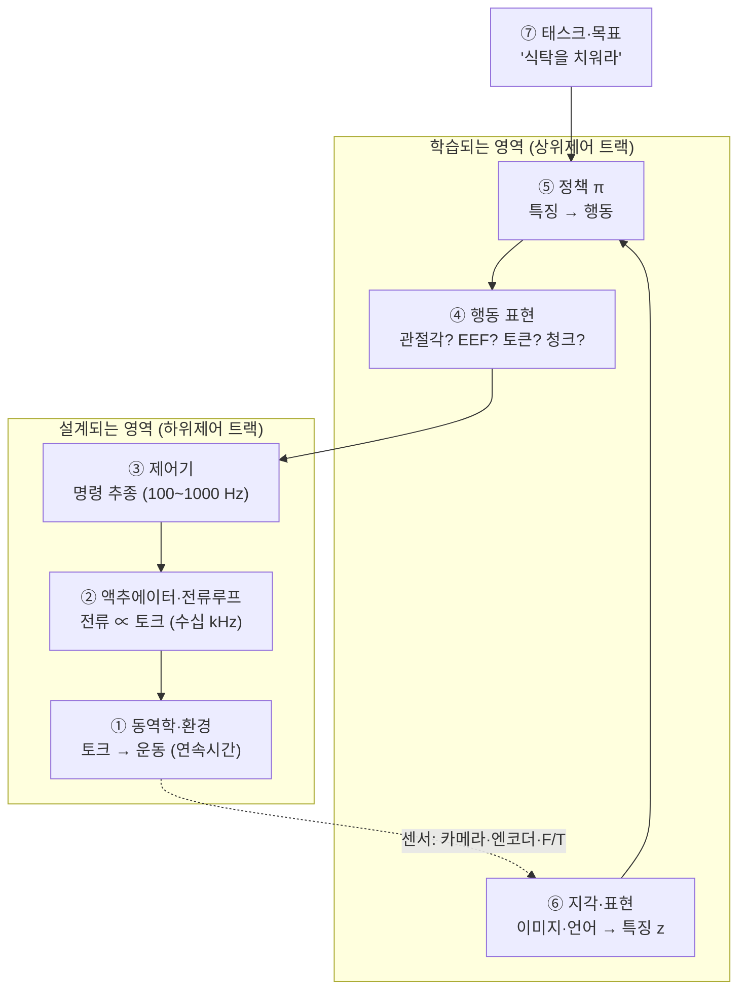
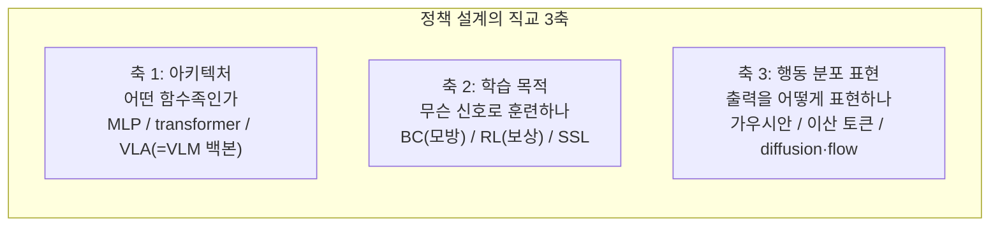
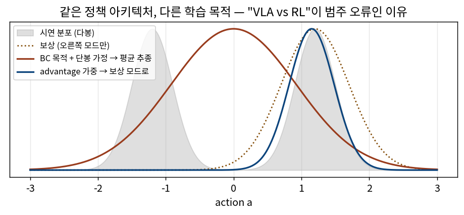
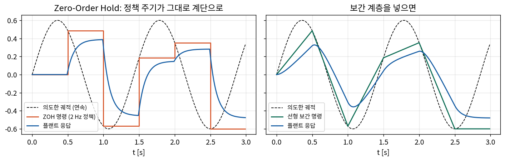

# Lec 00. Physical AI 시스템 해부 — 개념 좌표계 설치하기

> 공용 오리엔테이션. 상위제어·하위제어 트랙 공통 1일차. 선수 지식: 없음.
> 이 강의의 목표는 지식 전달이 아니라 **좌표계 설치**다. 이후 63개 강의의 모든 개념이 이 좌표 위 한 칸에 놓인다.

## 한 장 요약



세로 방향이 **실행 계층**(신호가 흐르는 길)이고, 각 층은 서로 다른 질문에 답한다. 그리고 이 그림에 **없는** 것이 둘 있다 — "RL"과 "diffusion". 그것들은 층이 아니라 **⑤ 정책을 만드는 방법의 축**이다. 이 구분이 오늘의 전부다.

## 학습 목표

1. 실행 계층 7단(태스크→지각·표현→정책→행동 표현→제어기→액추에이터→동역학)을 그리고, 각 층의 입력·출력 신호와 대표 주기를 말할 수 있다.
2. 정책을 (아키텍처 × 학습 목적 × 행동 표현)의 **직교 3축**으로 분해하고, "VLA vs RL" 같은 문장이 왜 범주 오류인지 설명할 수 있다.
3. 임의의 로봇 시스템(또는 논문의 시스템 그림)을 이 좌표계로 분해할 수 있다.
4. 주기(rate)가 다른 층들이 어떻게 연결되는지(ZOH·보간) 코드 수준에서 설명할 수 있다.

## 왜 이 강의가 필요한가

다음 문장을 보자. 요즘 어디서나 들을 수 있는 문장이다:

> "VLA를 RL로 파인튜닝하고, diffusion으로 action을 생성해서, controller 없이 로봇을 직접 제어한다."

문법적으로 매끄럽지만, 서로 **종류가 다른 네 개의 개념**이 한 문장에 평평하게 섞여 있다. VLA는 정책의 한 종류(아키텍처)이고, RL은 정책을 훈련하는 신호의 종류(학습 목적)이고, diffusion은 정책이 행동 분포를 표현하는 방식(파라미터화)이고, "controller 없이"는 실행 계층에 대한 주장이다 — 그런데 뒤에서 보겠지만 이 마지막 주장은 물리적으로 성립할 수 없다.

이런 혼동은 실제 비용을 낳는다. 팀 회의에서 "우리는 RL 대신 VLA로 간다"는 논쟁이 벌어지고(비교 불가능한 것의 비교), 논문을 읽을 때 "이 모델의 새로움"이 어느 층의 새로움인지 못 짚어서 과대/과소평가하게 된다. 이 강의는 그 혼동을 방지하는 좌표계를 설치한다. 상위 트랙 32강(논문 읽기)에서 이 좌표계는 "층위 진단"이라는 실전 도구로 돌아온다.

## 본문

### 1. 실행 계층 — 신호가 흐르는 길

로봇이 "식탁 위의 컵을 치워라"를 수행하는 0.01초를 세로로 잘라 보면, 서로 다른 종류의 신호 변환이 층층이 일어난다:

| 층 | 답하는 질문 | 입력 → 출력 | 대표 주기 | 대표 기술 (이 커리큘럼의 강의) |
|---|---|---|---|---|
| ⑦ 태스크 | 무엇을 할 것인가 | 목표·지시 → 문맥 | 비주기 | 언어 지시, 프롬프트 (상위 5·9강) |
| ⑥ 지각·표현 | 세계를 어떻게 볼 것인가 | 픽셀·텍스트 → 특징 z | 10~30 Hz | CNN·ViT·CLIP·VLM (상위 4·10~12강) |
| ⑤ 정책 | 어떤 행동을 할 것인가 | z → 행동 a | 1~50 Hz | ACT·Diffusion Policy·**VLA** (상위 13~24강) |
| ④ 행동 표현 | 행동을 어떤 형식으로 말할 것인가 | a의 좌표계·단위·시간 구조 | — | 관절각/ΔEEF/토큰/청크 (상위 26강, 하위 R08) |
| ③ 제어기 | 명령을 어떻게 안정적으로 실현할 것인가 | 목표 → 토크/전류 지령 | 100 Hz~1 kHz | PID·computed torque·임피던스 (하위 R17~R24) |
| ② 액추에이터 | 힘을 어떻게 만들 것인가 | 전류 → 토크 | 수~수십 kHz | 모터·감속기·전류루프 (하위 R14~R16, 상위 25강) |
| ① 동역학·환경 | 상태가 어떻게 변하는가 | 토크 → 운동 | 연속시간 | 라그랑주·접촉 (하위 R09~R13) |

그리고 ①에서 일어난 운동이 카메라·엔코더를 통해 ⑥으로 돌아온다 — **전체는 폐루프**다. 세 가지 관찰:

- **위로 갈수록 느리고 똑똑하고, 아래로 갈수록 빠르고 단순하다.** 이것은 우연이 아니라 설계 원리다(§3의 수식 E3).
- **층은 없앨 수 없고, 옮기거나 암묵화할 수 있을 뿐이다.** "end-to-end"라고 부르는 시스템도 ②의 전류루프와 ①의 물리는 그대로 있다. 학습 모델이 ⑤~③을 한 덩어리로 흡수하면 그 경계가 코드에서 사라질 뿐, 신호 변환 자체는 남는다.
- **④ 행동 표현은 층이라기보다 인터페이스(계약)다.** ⑤와 ③이 만나는 곳의 "언어"이며, 이 언어의 선택(관절각? ΔEEF? 몇 Hz? 청크 몇 개?)이 시스템 전체의 성격을 결정한다. 상위 26강 전체가 이 한 칸의 이야기다.

### 2. 설계 축 — 정책을 "만드는" 세 개의 독립 선택

⑤ 정책 π는 하나의 함수지만, 그것을 만들 때는 서로 **독립적인 세 가지**를 선택한다:



이 세 축이 **직교**한다는 것이 핵심이다 — 어느 한 축의 선택이 다른 축을 강제하지 않는다:

| 시스템 | 아키텍처 | 학습 목적 | 행동 분포 표현 |
|---|---|---|---|
| OpenVLA (상위 19강) | VLA (7B VLM) | BC | 이산 토큰 (AR) |
| π0 (상위 20강) | VLA (3B VLM + expert) | BC | flow matching |
| π*0.6/RECAP (상위 21강) | VLA | BC + **오프라인 RL** | flow matching |
| Diffusion Policy (상위 15강) | CNN/transformer (VLM 아님) | BC | diffusion |
| 보행 RL 정책 (하위 R13·R16) | 소형 MLP | **RL** (시뮬 보상) | 가우시안 |

같은 열에 다른 값들이 자유롭게 조합된다. 그러므로 "VLA vs RL"은 축 1의 값과 축 2의 값을 비교하는 **범주 오류**다 — "SUV vs 디젤"과 같은 문장 구조다. 올바른 비교는 같은 축 안에서만 성립한다: "BC만 vs BC+RL"(축 2, 상위 21강의 RECAP이 이 비교), "이산 토큰 vs flow"(축 3, 상위 20강의 FAST 논쟁이 이 비교).

### 3. 핵심 수식

#### E1. 시스템 = 타입이 있는 함수 합성

**직관**: 위 표의 각 층은 "신호를 다른 종류의 신호로 바꾸는 함수"다. 시스템 전체는 그 함수들의 합성이고, 로봇이 움직인다는 것은 이 합성 함수가 폐루프로 돈다는 뜻이다.

**물리·기하적 의미**: 각 화살표(층 경계)에는 **계약**이 있다 — 단위(rad? m?), 좌표계(어느 프레임?), 주기(몇 Hz?), 범위(정규화?). 두 층이 "정렬"됐다는 것은 이 계약이 맞아떨어진다는 뜻이다. sim-to-real 실패, 파인튜닝 실패의 상당수는 이 계약 위반(단위 불일치, 좌표계 뒤집힘, 정규화 통계 불일치 — 상위 26강의 q01/q99 함정)으로 환원된다.

**형식**: 상태 $x$, 관측 $o$, 특징 $z$, 행동 $a$, 토크 $\tau$에 대해

$$
o_t = h(x_t), \qquad z_t = \phi(o_t), \qquad a_t = \pi_\theta(z_t), \qquad \tau_t = C(x_t^{\,\mathrm{loc}},\, a_t), \qquad \dot{x} = f(x, \tau)
$$

폐루프 전체는 $\dot{x} = f\big(x,\; C(x, \pi_\theta(\phi(h(x))))\big)$. 여기서 $h$는 센서(⑥의 입구), $\phi$는 표현(⑥), $\pi_\theta$는 정책(⑤), $C$는 제어기(③, 자신의 로컬 상태 $x^{\mathrm{loc}}$ — 엔코더 값 — 를 따로 본다는 점에 주의), $f$는 동역학(①)이다. **어떤 시스템을 봐도 이 다섯 함수가 어디에 있는지 물어라** — 없어 보이면 숨어 있는 것이다.

#### E2. 정책의 직교 분해

**직관**: "무엇으로(함수족), 무엇을 향해(손실), 어떤 형식으로(출력 분포)"는 서로 다른 질문이다.

**물리·기하적 의미**: 같은 함수족 $\pi_\theta$ 위에서 학습 목적은 파라미터 공간의 **다른 벡터장**(gradient field)을 만든다. 아래 그림처럼, 같은 아키텍처가 BC 목적으로는 시연 분포를 향해, advantage 가중 목적으로는 보상 있는 모드를 향해 움직인다 — 도착지가 다른 것이지 차종이 다른 게 아니다.



**형식**: 동일한 $\pi_\theta(a|z)$에 대해

$$
\mathcal{L}_{\mathrm{BC}}(\theta) = -\mathbb{E}_{(z,a^*)\sim\mathcal{D}}\big[\log \pi_\theta(a^*|z)\big]
\qquad \text{vs} \qquad
J_{\mathrm{RL}}(\theta) = \mathbb{E}_{\pi_\theta}\Big[\sum_t \gamma^t r_t\Big]
$$

왼쪽은 데이터셋 $\mathcal{D}$의 로그우도(지도학습), 오른쪽은 자기 행동이 만든 궤적의 보상 기대값. $\pi_\theta$의 구조(VLA인지 MLP인지)와 출력 형식(가우시안인지 diffusion인지)은 두 식 어디에도 강제되지 않는다 — 그래서 직교다. (RL의 자세한 내용은 상위 17강; 여기서는 "다른 벡터장"이라는 사실만.)

#### E3. 다중 주기와 Zero-Order Hold — 층이 느려도 되는 이유와 그 대가

**직관**: 정책이 2 Hz로 생각해도 로봇이 부드럽게 움직이는 이유는, 아래층이 그 사이를 메우기 때문이다. 가장 단순한 메움이 "마지막 명령을 유지"(ZOH)다.

**물리·기하적 의미**: ZOH는 명령을 계단 함수로 만든다. 계단의 모서리는 고주파 성분이고, 이것이 플랜트의 공진을 때리거나 저크(jerk)로 나타난다. 그래서 실무 스택은 ZOH 위에 보간·필터 계층을 얹는다(상위 26강의 보간 계층, 하위 R08).

**형식**: 정책 주기 $T_\pi$, 제어 주기 $T_c \ll T_\pi$일 때 ZOH는

$$
a(t) = a_k \quad \text{for } t \in [\,kT_\pi,\ (k+1)T_\pi\,)
$$

그리고 지연·유지가 폐루프 안정성에 미치는 효과의 고전적 요약: 루프에 지연 $\tau_d$가 있으면 교차 주파수 $\omega_c$에서 위상이 $\omega_c \tau_d$만큼 깎인다. 위상 여유 $\phi_m$을 가진 루프가 견디는 최대 지연은

$$
\tau_{d,\max} \approx \frac{\phi_m}{\omega_c}
$$

(하위 R17에서 유도). 위층이 느려도 되는 조건은 "위층의 명령 변화가 아래층 폐루프 대역폭보다 충분히 느릴 것" — 계층화가 공짜가 아니라 **대역 분리라는 계약** 위에 서 있다는 뜻이다.

### 4. Worked Example

#### WE-1 (손으로): 문장 타입 체크

서두의 문장을 좌표계에 배치해 보자. "VLA를 RL로 파인튜닝하고, diffusion으로 action을 생성해서, controller 없이 로봇을 직접 제어한다."

| 문장 조각 | 좌표 | 판정 |
|---|---|---|
| "VLA를" | ⑤ 정책, 축 1(아키텍처) | ✓ 유효 |
| "RL로 파인튜닝" | 축 2(학습 목적) | ✓ 유효 — 축 1과 독립이므로 "VLA를 RL로"는 가능한 조합 |
| "diffusion으로 action 생성" | 축 3(행동 분포 표현) | ✓ 유효 — 단, "RL이면서 diffusion"은 두 축의 조합이지 하나의 기법이 아님 |
| "controller 없이 직접 제어" | ③ 계층에 대한 주장 | ✗ **타입 오류** — ②의 전류루프는 물리적으로 제거 불가. 가능한 것은 ③을 얇게 만들거나(위치 서보 직결) 학습 모델 안으로 암묵화하는 것. "없앴다"가 아니라 "옮겼다"가 정확한 서술 |

교정된 문장: "VLM 백본 정책(축 1)을 BC로 사전학습한 뒤 RL 신호로 추가 훈련(축 2)했고, 행동 분포는 diffusion으로 표현(축 3)하며, 출력은 관절 위치 명령(④)으로 온보드 위치 서보(③·②)에 전달된다." — 길지만, 이제 모든 조각이 제 칸에 있다.

#### WE-2 (코드): 2 Hz 정책 + 100 Hz 제어기 — 주기 간극 실험

E3을 눈으로 확인한다. 2 Hz "정책"이 궤적을 띄엄띄엄 내고, 100 Hz "제어기"가 그것을 추종할 때, ZOH와 선형 보간의 차이:

```python
import numpy as np

T, dt = 3.0, 0.01                    # 100 Hz 제어 루프
t  = np.arange(0, T, dt)
Tp = 0.5                             # 정책 주기 = 2 Hz
ref = 0.6*np.sin(2*np.pi*0.7*t)      # 정책이 '의도한' 연속 궤적
kp  = np.arange(0, T, Tp)
ap  = 0.6*np.sin(2*np.pi*0.7*kp)     # 정책이 실제로 내는 표본들

zoh = np.array([ap[min(int(ti//Tp), len(ap)-1)] for ti in t])   # E3의 계단 함수

def plant_track(cmd):                # 1차 플랜트 + P 제어기 (③+①의 최소 모형)
    x, out = 0.0, []
    for c in cmd:
        x += dt * (-2.0*x + 8.0*(c - x))
        out.append(x)
    return np.array(out)

err_zoh = np.abs(plant_track(zoh) - ref).mean()
print(f"ZOH 평균 추종 오차: {err_zoh:.4f}")   # 보간을 넣으면 얼마나 줄어드는지 직접 비교해 보라
```

실행 결과가 아래 그림이다. 왼쪽(ZOH)은 명령이 계단이라 플랜트 응답이 의도 궤적에서 체계적으로 벗어나고, 오른쪽(선형 보간 한 층 추가)은 같은 2 Hz 정책으로도 훨씬 매끄럽다 — **"층을 하나 넣는다"는 것이 무엇을 사는 행위인지**의 최소 예제다. 상위 26강의 temporal ensembling·RTC는 이 그림의 고급 버전이다.



### 제어 배경자를 위한 번역 / 딥러닝 배경자를 위한 번역

**제어 배경이라면**: 실행 계층은 cascade 제어 구조의 확장판이다 — 외루프(⑤~⑥)가 내루프(③~②)에 셋포인트를 주는 익숙한 구도에서, 외루프가 "학습된 확률적 생성기"로 바뀌었을 뿐이다. 새로 익힐 것은 축 2와 축 3의 어휘(손실함수, 분포 표현)다.

**딥러닝 배경이라면**: 실행 계층은 모델 서빙 파이프라인의 물리 확장판이다 — 단 아래 두 층(②·①)은 코드가 아니라 물리라서 **재배포가 불가능하고 예외를 던지는 대신 부러진다**. 새로 익힐 것은 ③~①의 어휘(하위 트랙 전체)와, "지연·주기가 정확성만큼 중요하다"는 감각(E3)이다.

## 흔한 오해

1. **"VLA와 RL 중 하나를 골라야 한다"** — 범주 오류. VLA는 축 1(아키텍처), RL은 축 2(학습 목적). π*0.6은 VLA이면서 RL로 훈련됐다(상위 21강). 올바른 질문: "BC만으로 충분한가, RL 신호를 추가할 가치가 있는가".
2. **"end-to-end 모델은 제어기를 없앤다"** — 층은 사라지지 않고 이동·암묵화된다. 전류루프(②)는 항상 남고, 대부분의 "end-to-end" 시스템도 ③의 위치/임피던스 서보 위에서 돈다 (상위 26강의 실측 스택 참조).
3. **"diffusion policy는 RL의 일종이다"** — diffusion은 축 3(분포 표현)이고 대부분의 diffusion policy는 축 2가 BC다. "generative = RL"이 아니다.
4. **"주기는 엔지니어링 디테일이다"** — E3이 보여주듯 주기는 안정성·성능의 1차 변수다. RT-2가 1~3 Hz라는 사실은 그 모델의 능력만큼 중요한 스펙이다 (상위 18·26강).

## 실습 (1.5~2시간)

**내 시스템 분해 워크시트.** 잘 아는 시스템 하나를 고른다 — 회사 로봇셀, 자율주행 스택, 드론, 혹은 상위 24강의 기업 시스템 중 하나(자료가 공개된 Figure Helix 추천).

1. 실행 계층 7단 표를 그리고 각 층에 해당 시스템의 실제 구성요소를 채운다. **각 경계의 신호(물리량·좌표계·단위·주기)를 명시한다.** 빈 칸(모르는 층)이 어디인지가 자신의 학습 지도다.
2. 그 시스템의 "학습된 부분"에 대해 축 1·2·3을 판정한다.
3. E1의 다섯 함수($h, \phi, \pi, C, f$)가 각각 어느 코드/하드웨어에 사는지 지목한다.
4. Claude에게 워크시트를 검증받고, 특히 "층을 없앴다"고 표현한 곳이 있으면 "어디로 옮겼는가"로 고쳐 쓴다.
5. (선택, 30분) WE-2 코드를 실행하고 보간 함수를 직접 추가해 ZOH 대비 오차 감소를 수치로 확인한다.

## Claude와 토론할 질문

1. 실행 계층에서 "지능"은 어느 층에 사는가? 한 층을 지목할 수 있는가, 아니면 루프의 속성인가?
2. ④ 행동 표현을 바꾸면(관절각 → ΔEEF) 위아래 층에 각각 무엇이 연쇄적으로 바뀌는가?
3. 축 1·2·3이 "완전히" 직교하는가? 실무에서 한 축의 선택이 다른 축을 기울이는 사례(예: 이산 토큰 ↔ AR 아키텍처의 친화성)를 찾아 반박해 보라.
4. E3의 $\tau_{d,\max} \approx \phi_m/\omega_c$를 딥러닝 배경자에게 30초로 설명한다면? 제어 배경자에게 BC 손실을 30초로 설명한다면?
5. "우리 팀은 모방학습 대신 VLA를 쓰기로 했다"라는 문장의 타입 오류를 지적하고 교정하라.
6. 상위 트랙 24강의 Helix 02(S2/S1/S0)와 Agility(엔지니어링 스택 + 학습 WBC)를 이 좌표계에 배치하면 무엇이 같고 무엇이 다른가?
7. 층이 "암묵화"되면 디버깅에는 어떤 비용이 생기는가? 명시적 계층의 대가(성능 상한?)와 비교하라.

## 읽을거리

1. **π0 논문 (arXiv:2410.24164) Fig 1~3만** (~15분): 실물 시스템 하나가 이 좌표계의 어디를 학습으로 채웠는지 첫 사례로 관찰. 본문은 상위 20강에서.
2. **Figure Helix 블로그** (figure.ai/news/helix, ~15분): 계층을 명시적으로 나눈 상용 시스템 — 실습 1의 모범 답안에 가까운 자료.
3. (선택) Modern Robotics Ch.1 (MR PDF, ~20분): 하위 트랙이 다룰 "설계되는 영역"의 조감.

## 자가 점검

1. 실행 계층 7단을 안 보고 그리고, 각 층의 입출력 신호와 대표 주기를 말할 수 있는가?
2. 정책 설계의 3축을 말하고, 각 축의 값 2~3개씩을 예시할 수 있는가?
3. "VLA vs RL"이 왜 범주 오류인지, 표의 반례(π*0.6)를 들어 설명할 수 있는가?
4. "controller를 없앴다"는 주장을 들으면 무엇을 확인해야 하는지 말할 수 있는가?
5. ZOH가 무엇이고, 왜 그 위에 보간 계층을 얹는지 그림 없이 설명할 수 있는가?

## 참고문헌

> 본문 수치·주장의 출처. 웹 문서는 2026-07-08 접속 기준. 이 강의의 "계층 좌표계" 프레임 자체는 본 커리큘럼의 자체 정리이며(착안 경위는 README 부록 E), 아래는 구체 사례·수식의 출처다.

[1] K. Black et al. (Physical Intelligence), "π0: A Vision-Language-Action Flow Model for General Robot Control," arXiv:2410.24164, 2024.10. https://arxiv.org/abs/2410.24164
— **뒷받침**: 표의 π0 행(VLA 아키텍처 × BC × flow matching), 실행 계층을 학습으로 채운 실물 사례.

[2] Physical Intelligence, "π*0.6" (RECAP), arXiv:2511.14759, 2025.11. https://arxiv.org/abs/2511.14759
— **뒷받침**: "VLA이면서 RL로 훈련" 반례(축 1·2의 직교성 실증).

[3] C. Chi et al., "Diffusion Policy," arXiv:2303.04137, 2023.3. https://arxiv.org/abs/2303.04137
— **뒷받침**: 표의 Diffusion Policy 행(비-VLM 아키텍처 × BC × diffusion — "diffusion=RL 아님"의 근거).

[4] M. J. Kim et al., "OpenVLA," arXiv:2406.09246, 2024.6. https://arxiv.org/abs/2406.09246
— **뒷받침**: 표의 OpenVLA 행(VLA × BC × 이산 AR 토큰).

[5] Figure AI, "Helix," 기술 블로그, 2025.2. https://www.figure.ai/news/helix
— **뒷받침**: 계층을 명시적으로 분리한 상용 시스템 사례(7~9 Hz / 200 Hz 대역 분리).

[6] K. Lynch, F. Park, "Modern Robotics: Mechanics, Planning, and Control," Cambridge Univ. Press. 무료 PDF: https://hades.mech.northwestern.edu/images/7/7f/MR.pdf
— **뒷받침**: ①~③ 층의 표준 정식화(본 커리큘럼 하위 트랙의 기초 참고서), E3의 제어 이론 배경(Ch.11).

[7] R. S. Sutton, A. G. Barto, "Reinforcement Learning: An Introduction," 2nd ed., MIT Press, 2018. 무료: http://incompleteideas.net/book/the-book.html
— **뒷받침**: E2의 RL 목적함수 표기.

[8] Hugging Face, LeRobot async inference 문서. https://huggingface.co/docs/lerobot/en/async
— **뒷받침**: 정책-제어기 주기 분리의 실무 구현 사례(E3의 현실판).
