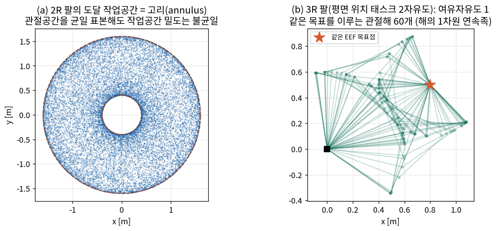

# Lec R01. 로봇 해부학 — 링크, 관절, 그리고 자유도

> 하위제어 트랙 1일차. 선수 지식: 공용 00강.
> 기초 참고서: Modern Robotics(이하 MR) Ch.2. 이 강의는 MR §2.1~2.5의 내용을 딥러닝 배경자의 언어로 재구성한 것이다.

## 한 장 요약



왼쪽: 관절이 2개인 팔이 도달할 수 있는 점의 집합(작업공간)은 상자가 아니라 **고리**다. 오른쪽: 관절이 태스크보다 하나 많으면(3관절로 2차원 위치), 같은 목표를 이루는 관절 구성이 **1차원 연속족**으로 존재한다 — 이것이 여유자유도(redundancy)다. 오늘 강의는 이 두 그림을 정확히 말할 수 있게 되는 것이다.

## 학습 목표

1. 링크·관절(R/P)·자유도(DoF)·configuration space(C-space)를 정의하고 구분할 수 있다.
2. Grübler 공식으로 개루프/폐루프 메커니즘의 DoF를 손으로 계산할 수 있다.
3. 관절공간과 작업공간의 관계(사상 $f$), 여유자유도의 의미를 설명할 수 있다.
4. 실제 로봇(UR5e 6DoF, Franka 7DoF, 휴머노이드 핸드)의 DoF 구성을 읽고, "왜 그 숫자인가"를 태스크 관점에서 논할 수 있다.
5. MuJoCo 모델 파일에서 관절 트리를 읽어낼 수 있다.

## 왜 이 강의가 필요한가

딥러닝에서 온 사람에게 로봇의 첫 인상은 "출력 차원이 관절 수인 모델"이다. 그러나 상위 트랙 26강에서 봤듯 VLA의 action space는 7차원(ΔEEF)이기도, 14차원(양팔 관절)이기도, 132차원(GR00T N1.7)이기도 하다. 그 숫자들이 어디서 오는가? 로봇의 **기계적 구조**에서 온다. DoF를 세지 못하면 action space를 설계할 수도, 논문의 "6-DoF 태스크" 같은 표현을 읽을 수도, 왜 휴머노이드 손이 22-DoF인데 액추에이터는 더 적은지(부족구동, R13)도 이해할 수 없다. 오늘은 로봇이라는 기계의 "형(type)"을 배운다 — 움직임의 수학(R02~)은 그 다음이다.

## 본문

### 1. 부품: 링크와 관절

로봇 팔은 **강체 링크**(휘지 않는다고 가정하는 막대)들이 **관절**로 연결된 사슬이다. 관절은 두 링크 사이의 상대 운동을 특정 방향으로만 허용하는 구속 장치다:

| 관절 | 기호 | 허용 운동 | 자유도 기여 $f_i$ | 예 |
|---|---|---|---|---|
| 회전(revolute) | R | 한 축 회전 | 1 | 로봇 팔의 거의 모든 관절 |
| 직동(prismatic) | P | 한 축 병진 | 1 | 리니어 스테이지, 그리퍼 죠 |
| 나사(helical) | H | 회전+비례 병진 | 1 | 리드스크류 |
| 유니버설 | U | 두 축 회전 | 2 | 짐벌 |
| 구면(spherical) | S | 세 축 회전 | 3 | 볼조인트, 어깨의 이상화 |

핵심 관찰: **관절은 자유를 "주는" 장치가 아니라 자유를 "깎는" 장치다.** 허공의 강체 하나는 6자유도(위치 3 + 자세 3)를 가진다. 관절은 그중 대부분을 구속하고 1~3개만 남긴다. 이 관점("자유도 = 전체 자유 − 구속")이 아래 Grübler 공식의 전부다.

### 2. 자유도와 Configuration Space

**Configuration(구성)**: 로봇의 모든 점의 위치를 완전히 지정하는 최소 정보. 6관절 팔이라면 관절각 6개 $q = (q_1, \dots, q_6)$.

**Configuration space (C-space)**: 가능한 모든 구성의 집합. **자유도(DoF) = C-space의 차원**이다. 이것이 DoF의 근본 정의고, 아래 공식들은 이 차원을 세는 방법이다.

주의할 점: C-space는 유클리드 공간이 아니다. 회전 관절 하나의 구성은 원 $S^1$ 위의 점이고(0°와 360°는 같은 구성), 2R 팔의 C-space는 토러스 $T^2 = S^1 \times S^1$이다. "각도를 그냥 실수로 다루면" 랩어라운드에서 문제가 생기는 이유이며, R02에서 회전의 표현 문제로 본격화된다.

### 3. 핵심 수식

#### E1. 자유도의 정의

**직관**: "이 기계를 완전히 묘사하려면 숫자가 몇 개 필요한가?"

**물리·기하적 의미**: DoF는 좌표 선택과 무관한 **내재적 차원**이다. 같은 로봇을 관절각으로 세든, 링크 끝점 좌표+구속식으로 세든 차원은 같다.

**형식**:
$$
\text{dof} = \dim(\mathcal{C}) = (\text{강체들의 자유 변수 수}) - (\text{독립 구속식 수})
$$

#### E2. Grübler 공식

**직관**: 링크마다 자유를 주고, 관절마다 구속을 깎아서, 남는 것을 센다.

**물리·기하적 의미**: 평면 강체는 3자유도($x, y, \theta$), 공간 강체는 6자유도. 관절 $i$가 $f_i$개의 운동을 허용한다는 것은 $(m - f_i)$개의 구속을 가한다는 뜻이다 ($m$ = 3 평면 / 6 공간).

**형식**: 링크 $N$개(지면 포함), 관절 $J$개, 관절 $i$의 자유도 $f_i$일 때

$$
\text{dof} = m\,(N - 1 - J) + \sum_{i=1}^{J} f_i
$$

(MR 식 2.4.) 유도 요점: 지면을 제외한 $N-1$개 링크가 $m(N-1)$의 자유를 갖고, 각 관절이 $m - f_i$개의 구속을 가하므로 $\text{dof} = m(N-1) - \sum_i (m - f_i)$ — 정리하면 위 식. **단서**: 구속들이 독립일 때만 성립한다. 특수 기하로 구속이 겹치면(퇴화) 실제 DoF가 공식보다 클 수 있다 — 공식은 "일반 위치"의 답이다.

#### E3. 관절공간 → 작업공간 사상 (다음 강의들의 예고)

**직관**: 로봇이 실제로 일하는 곳은 관절공간이 아니라 손끝이 사는 공간이다. 둘을 잇는 것이 기구학이다.

**물리·기하적 의미**: 정기구학 $x = f(q)$는 C-space에서 작업공간으로 가는 **비선형 사상**이고, 도달 작업공간은 그 사상의 **상(image)**이다. 한 장 요약 (a)에서 관절공간을 균일하게 표본했는데 작업공간 밀도가 불균일했던 이유 — 사상이 공간을 접고 늘리기 때문(이 왜곡률이 R05의 자코비안이다).

**형식**: 태스크 공간 차원 $t$, 관절 수 $n$에 대해
$$
x = f(q), \quad f: \mathcal{C} \subseteq \mathbb{R}^n \to \mathbb{R}^t, \qquad \text{여유자유도} = n - t \ (>0 \text{이면 redundant})
$$
같은 $x$를 만드는 해집합 $f^{-1}(x)$는 일반적으로 $(n-t)$차원 다양체다 — 한 장 요약 (b)의 초록 팔들이 그 1차원 족의 표본이다.

### 4. Worked Example

#### WE-1 (손 + 코드): Grübler로 메커니즘 4종 세기

**손계산 — 평면 4절 링키지(four-bar)**: 링크 4개(지면 포함, $N=4$), 회전 관절 4개($J=4$, 각 $f_i=1$), 평면($m=3$):
$$
\text{dof} = 3(4 - 1 - 4) + 4 = 3(-1) + 4 = 1
$$
모터 하나면 완전히 구동된다 — 와이퍼, 엔진 크랭크가 이렇게 생겼다.

**손계산 — 직렬 6R 공간 팔**: $N=7$(지면+링크 6), $J=6$, $f_i=1$, $m=6$:
$$
\text{dof} = 6(7-1-6) + 6 = 0 + 6 = 6
$$
직렬 개루프 사슬에서는 언제나 dof = 관절 자유도의 합 — 구속이 겹칠 일이 없기 때문.

**검증 코드**:

```python
def grubler(m, N, joints):          # joints: 각 관절의 f_i 리스트
    J = len(joints)
    return m*(N - 1 - J) + sum(joints)

print(grubler(3, 4, [1,1,1,1]))     # 평면 4절 링키지 → 1
print(grubler(6, 7, [1]*6))         # 공간 직렬 6R → 6
print(grubler(3, 5, [1]*5))         # 평면 5절(2모터 병렬 팔) → 2
print(grubler(6, 17, [3]*12 + [1]*0 + [1]*0 + [1]*0))  # 연습: 델타 로봇은 왜 3인가? (아래 질문 4)
```

출력: `1, 6, 2, ...` — 마지막 델타 로봇은 구면 관절의 "빈 회전"(링크 자체 회전) 때문에 공식이 과대 계산한다. E2의 단서("구속 독립성")가 현실에서 어떻게 깨지는지의 표준 예제로, 토론 질문 4에서 다룬다.

#### WE-2 (코드): 작업공간과 여유자유도를 직접 그리기

한 장 요약의 그림을 만든 코드의 핵심부. 2R 팔의 작업공간은 표본화로, 3R의 여유자유도는 "위치만 맞추는 IK를 서로 다른 초기값에서 반복"으로 확인한다:

```python
import numpy as np
rng = np.random.default_rng(1)

# (a) 2R 작업공간: q를 균일 표본 → x로 사상
l1, l2 = 1.0, 0.6
q1, q2 = rng.uniform(-np.pi, np.pi, (2, 20000))
x = l1*np.cos(q1) + l2*np.cos(q1+q2)
y = l1*np.sin(q1) + l2*np.sin(q1+q2)
r = np.hypot(x, y)
print(f"도달 반경: [{r.min():.3f}, {r.max():.3f}]  (이론: [{abs(l1-l2)}, {l1+l2}])")

# (b) 3R 여유자유도: 같은 목표를 이루는 서로 다른 관절해
L = [0.6, 0.5, 0.4]; target = np.array([0.8, 0.5])
def fk(q):
    p, a = np.zeros(2), 0.0
    for li, qi in zip(L, q):
        a += qi; p = p + li*np.array([np.cos(a), np.sin(a)])
    return p
def ik(q):                                   # damped least squares (R07에서 유도)
    for _ in range(300):
        e = target - fk(q)
        if np.linalg.norm(e) < 1e-6: return q
        J = np.zeros((2,3)); eps = 1e-6
        for j in range(3):
            dq = q.copy(); dq[j] += eps
            J[:, j] = (fk(dq) - fk(q))/eps   # 수치 자코비안 (R05 예고)
        q = q + J.T @ np.linalg.solve(J @ J.T + 1e-6*np.eye(2), e)
sols = [ik(rng.uniform(-np.pi, np.pi, 3)) for _ in range(10)]
print("서로 다른 관절해 (모두 같은 EEF):")
for q in sols[:3]: print(np.round(q, 3), "→", np.round(fk(q), 4))
```

실행하면 도달 반경이 이론값 $[|l_1-l_2|,\ l_1+l_2] = [0.4, 1.6]$과 일치하고, 3R에서는 전혀 다른 관절각 조합들이 같은 EEF 좌표를 출력한다. **같은 출력을 내는 입력의 연속족** — 이것이 여유자유도의 체감이다.

### 5. 실제 로봇의 DoF 읽기 — 숫자에는 이유가 있다

| 로봇 | DoF | 왜 그 숫자인가 |
|---|---|---|
| UR5e | 6 | 공간 강체 자세 지정에 필요한 최소치(위치 3+자세 3). 여유 없음 — 특이점 회피 여지도 없음(R06) |
| Franka FR3 | 7 | 태스크 6 + **여유 1**: 팔꿈치를 돌려 장애물·관절한계·특이점을 피하면서 같은 EEF 자세 유지 가능 |
| 인간 팔 (어깨~손목) | 7 | Franka가 7을 고른 이유의 원본 |
| Unitree G1 (기본) | 23 | 다리 6×2 + 팔 5×2 + 허리 등 — 보행(≥12) + 조작(≥10)의 타협 |
| 휴머노이드 핸드 (Optimus Gen3) | 손가락 22 | 손내 조작(in-hand manipulation)용. 단 액추에이터 수 < DoF인 **부족구동/커플링** 설계가 흔함 — "DoF ≠ 모터 수"(흔한 오해 1) |
| 2지 그리퍼 | 1 | pick-and-place에는 1이면 충분하다는 공학적 판단 — 상위 25강의 "핸드의 분화" 참조 |

상위 트랙과의 연결: VLA의 action 차원은 이 표에서 나온다. π0의 "최대 18차원"(상위 26강)은 양팔 6+6, 그리퍼 1+1, 베이스 3, 토르소 1의 합이다. **action space 설계란 이 표의 어느 부분집합을 정책에 노출할지의 결정**이다.

### 딥러닝 배경자를 위한 번역

- **C-space는 로봇의 latent space다** — 단, 학습된 것이 아니라 기계 구조가 정의한 것이고, 위상이 비자명하다(토러스). "각도를 $\mathbb{R}$로 취급하면 랩어라운드에서 깨진다"는 문제는 여러분이 아는 "각도 회귀에서 $\sin/\cos$ 인코딩을 쓰는 이유"와 정확히 같은 문제다.
- **여유자유도는 과매개변수화(over-parameterization)다** — 같은 출력(EEF 자세)을 내는 입력(관절각)의 연속족이 존재. 신경망에서 같은 함수를 구현하는 가중치가 다양체를 이루는 것과 구조가 같고, "그 여분을 무엇에 쓸 것인가"(정칙화 ↔ null-space 태스크, R06)라는 질문도 평행하다.
- **Grübler는 차원 셈법이다** — "변수 수 − 독립 구속 수"는 제약 있는 최적화에서 유효 자유도를 세는 것과 같은 산수. 구속 퇴화로 공식이 틀리는 경우는 "선형독립 가정이 깨진 rank-deficient 상황"이다.

## 흔한 오해

1. **"DoF = 모터 수"** — 아니다. 수동 관절(구속만 하는 관절), 커플링(하나의 텐던이 두 관절 구동), 부족구동 그리퍼가 흔하다. DoF는 운동학의 속성, 모터 수는 구동의 속성. 22-DoF 핸드가 12개 액추에이터로 구동되기도 한다.
2. **"작업공간은 대략 상자다"** — 한 장 요약 (a)처럼 구멍 뚫린 고리·초승달 모양이 기본이고, **자세(orientation)까지 요구하면 훨씬 좁아진다**. "도달 가능(reachable)"과 "임의 자세로 도달 가능(dexterous)"은 다른 집합이다(MR §2.5).
3. **"6-DoF 팔이면 작업공간 안 어디든 어떤 자세로든 간다"** — 관절 한계, 자기충돌, 특이점(R06)이 실제 가용 영역을 크게 깎는다. 스펙시트의 "reach 855mm"는 그 어느 것도 반영하지 않은 숫자다.
4. **"여유자유도는 낭비다"** — 반대로, 7번째 관절은 특이점·장애물·관절한계를 피하는 **추가 예산**이다. 대가는 IK의 해가 유일하지 않아진다는 것(R07) — 그리고 그 비유일성이야말로 학습 정책이 다봉 분포를 다뤄야 하는(상위 15강) 기구학적 뿌리 중 하나다.

## 실습 (1.5~2시간)

**MuJoCo로 로봇 해부하기.**

1. 아래 XML(3R 평면 팔)을 `arm3r.xml`로 저장하고 파이썬에서 로드한다:

```xml
<mujoco model="arm3r">
  <worldbody>
    <body name="l1"><joint name="q1" type="hinge" axis="0 0 1"/>
      <geom type="capsule" fromto="0 0 0  0.6 0 0" size="0.03"/>
      <body name="l2" pos="0.6 0 0"><joint name="q2" type="hinge" axis="0 0 1"/>
        <geom type="capsule" fromto="0 0 0  0.5 0 0" size="0.03"/>
        <body name="l3" pos="0.5 0 0"><joint name="q3" type="hinge" axis="0 0 1"/>
          <geom type="capsule" fromto="0 0 0  0.4 0 0" size="0.03"/>
          <site name="ee" pos="0.4 0 0"/>
        </body></body></body>
  </worldbody>
</mujoco>
```

```python
import mujoco
m = mujoco.MjModel.from_xml_path("arm3r.xml")
print("nq (관절 좌표 수) =", m.nq, "/ nv (속도 좌표 수) =", m.nv)
for j in range(m.njnt):
    print(mujoco.mj_id2name(m, mujoco.mjtObj.mjOBJ_JOINT, j),
          "type:", m.jnt_type[j])
d = mujoco.MjData(m)
d.qpos[:] = [0.3, 0.5, -0.4]; mujoco.mj_forward(m, d)
print("EEF 위치:", d.site("ee").xpos)   # WE-2의 fk()와 비교해 검증
```

2. `nq`가 왜 3인지, WE-2의 `fk()` 결과와 MuJoCo의 `site("ee").xpos`가 일치하는지 확인한다 (z축 회전 평면 팔이므로 x·y 성분 비교).
3. 관절 하나를 `type="slide"`(직동)로 바꾸면 작업공간이 어떻게 변하는지 WE-2 방식으로 표본화해 그려 본다.
4. (심화) [MuJoCo Menagerie](https://github.com/google-deepmind/mujoco_menagerie)에서 Franka `panda.xml`을 받아 관절 트리·관절 한계(`jnt_range`)를 출력하고, "스펙 7-DoF"가 모델에서 어떻게 나타나는지 확인한다.
5. 워크시트: 자기 회사 로봇(또는 G1)의 DoF를 부위별로 분해한 표를 만들고 Claude에게 검증받는다.

## Claude와 토론할 질문

1. 관절이 "자유를 준다"가 아니라 "자유를 깎는다"로 보는 관점이 왜 폐루프 메커니즘에서 특히 유용한가?
2. 2R 팔의 C-space가 토러스라는 사실이 실무에서 문제를 일으키는 시나리오를 구체적으로 만들어 보라 (힌트: 관절각 보간, 학습 데이터의 각도 표현).
3. Franka의 7번째 관절이 "공짜"가 아닌 이유는? (제어·IK·캘리브레이션·비용 관점에서 각각)
4. 델타 로봇에 Grübler를 적용하면 왜 틀린 답이 나오는가? "구속의 독립성" 가정이 어디서 깨지는지 MR §2.2의 논의로 확인하라.
5. VLA의 action space를 "관절 전체"가 아니라 "EEF 6자유도"로 좁히는 설계는 이 강의의 언어로 무엇을 버리는 결정인가? (여유자유도의 통제권)
6. 휴머노이드 손의 "22-DoF, 액추에이터 12개" 같은 설계에서, 학습 정책이 실제로 통제하는 차원은 몇인가? 데이터에는 몇 차원이 기록되는가?
7. "우리 로봇은 6축이라 어떤 작업이든 됩니다"라는 영업 문구를 이 강의의 개념 세 개로 반박하라.

## 읽을거리

1. **MR Ch.2 (§2.1~2.3, §2.5)** (~50분): C-space·Grübler·작업공간의 원전. §2.4(위상 상세)는 훑기만.
2. **MuJoCo XML reference의 joint 절** (mujoco.readthedocs.io, ~15분): 실습에서 쓴 모델 형식의 공식 정의.
3. (선택) 상위 25강의 로봇 표를 다시 보며 각 로봇의 DoF 열을 오늘의 눈으로 재해석.

## 자가 점검

1. DoF의 근본 정의(C-space 차원)와 Grübler 공식의 관계를 말할 수 있는가?
2. 평면 4절 링키지의 DoF를 30초 안에 손으로 계산할 수 있는가?
3. 2R 작업공간이 고리인 이유와 내·외경을 수식으로 쓸 수 있는가?
4. 여유자유도를 "같은 출력을 내는 입력의 연속족"으로 설명하고 그림 (b)를 재현하는 코드 골격을 쓸 수 있는가?
5. "DoF ≠ 모터 수"인 실제 사례를 두 개 들 수 있는가?

## 참고문헌

> 웹 문서는 2026-07-08 접속 기준.

[1] K. Lynch, F. Park, "Modern Robotics: Mechanics, Planning, and Control," Cambridge Univ. Press, 2017. 무료 PDF: https://hades.mech.northwestern.edu/images/7/7f/MR.pdf
— **뒷받침**: Ch.2 — C-space 정의, Grübler 공식(식 2.4)과 퇴화 단서, 도달/정교(dexterous) 작업공간 구분(§2.5), 토러스 위상(§2.3).

[2] Universal Robots, UR5e 스펙. https://www.universal-robots.com/products/ur5e/
— **뒷받침**: 6-DoF, reach 850mm 급 사양 (표의 UR5e 행).

[3] Franka Robotics, FR3 제품 정보. https://franka.de
— **뒷받침**: 7-DoF 구성 (표의 Franka 행).

[4] Unitree, G1 제품 페이지. https://www.unitree.com/g1
— **뒷받침**: 23-DoF(기본형) 구성 (표의 G1 행).

[5] (2차, 미검증 다수) Tesla Optimus Gen 3 핸드 보도 종합. 예: https://www.basenor.com/blogs/news/tesla-optimus-gen-3-hands-22-dof-50-actuators-explained
— **뒷받침**: "손가락 22-DoF, 부족구동/커플링" 사례 — 공식 스펙시트 부재, 상위 25강과 동일한 유보.

[6] Google DeepMind, MuJoCo 문서. https://mujoco.readthedocs.io
— **뒷받침**: 실습의 XML/joint 형식, `nq`/`nv` 의미.

[7] K. Black et al., "π0," arXiv:2410.24164, 2024.10. https://arxiv.org/abs/2410.24164
— **뒷받침**: "최대 18차원 action space" — DoF 표와 action 설계의 연결 사례 (상위 26강과 동일 출처).
