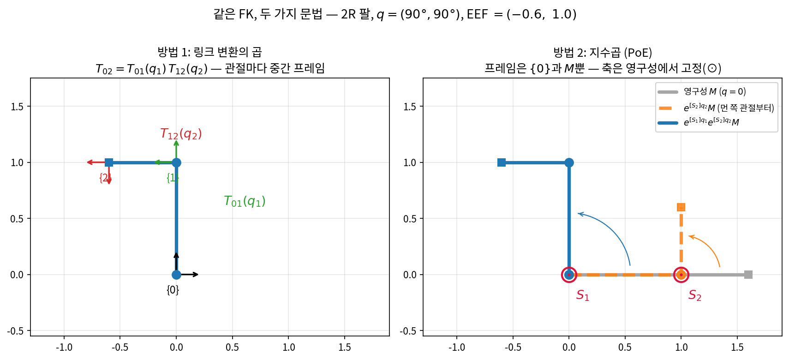
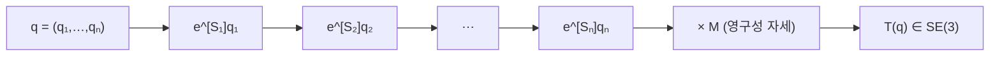
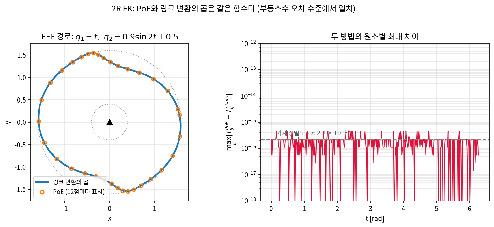
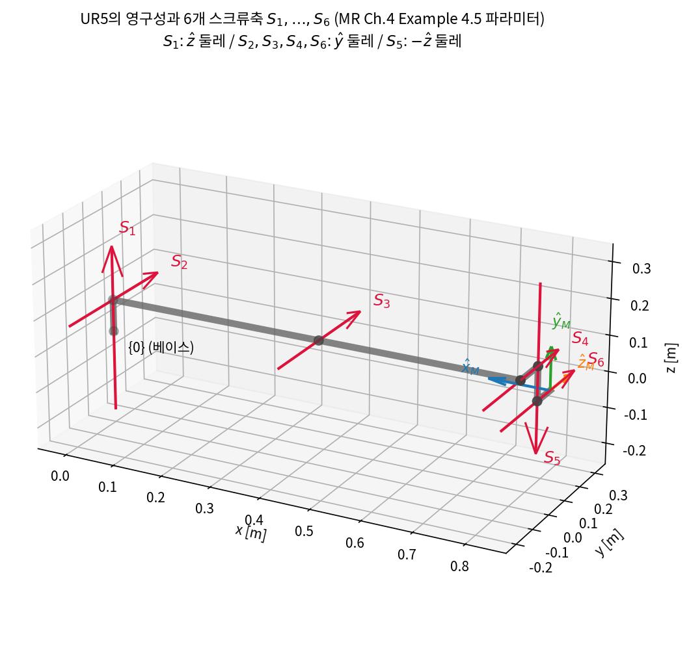
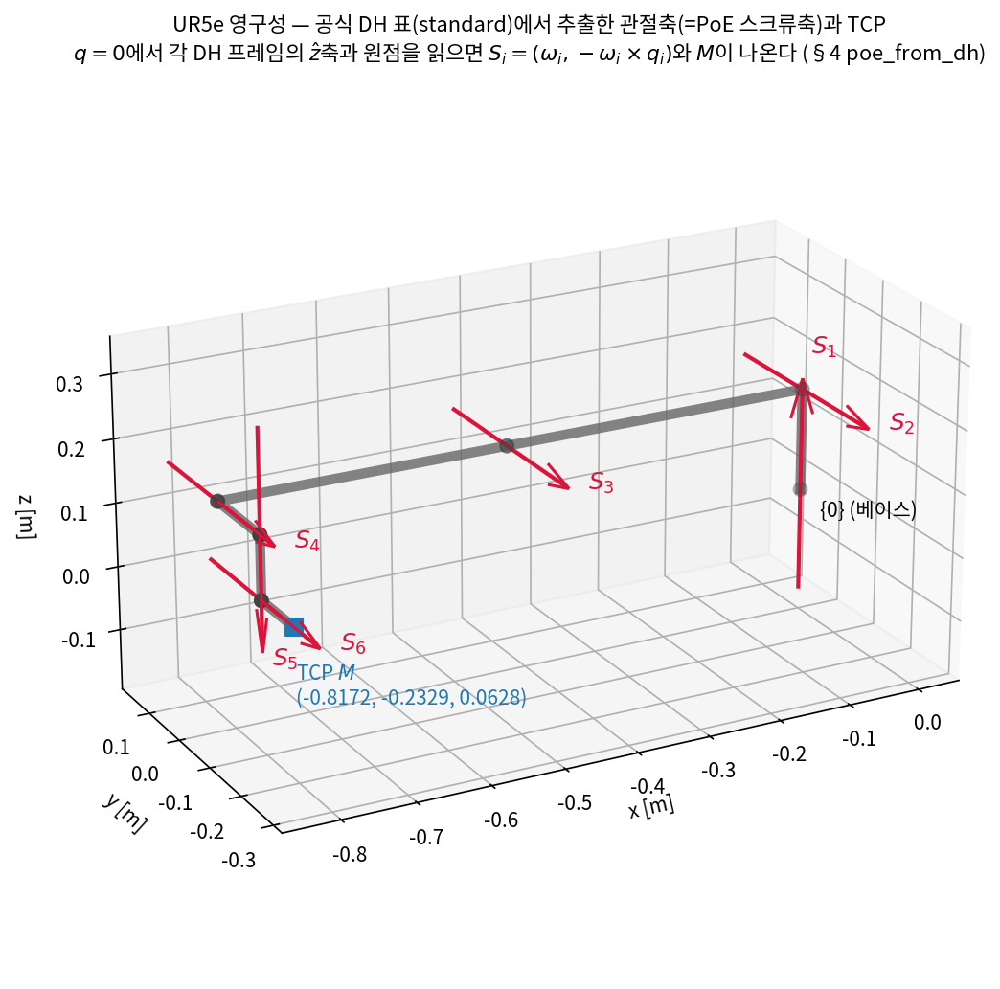

# Lec R04. 정기구학 — 지수곱(PoE)과 DH

> 하위제어 트랙 4일차. 선수 지식: R01(링크·관절·DoF), R02(SO(3), Rodrigues), R03(SE(3), 동차변환·좌표계 합성).
> 기초 참고서: Modern Robotics(이하 MR) Ch.4. PoE를 본류로 하는 MR §4.1을 따르고, DH 규약은 "산업 문서 해독용"으로만 다룬다 — §4는 산업 문서(UR 공식 표)와 같은 standard(=classic) DH를 쓰며, modified 계열 규약을 쓰는 MR 부록 C는 대조 참고다.

## 한 장 요약



같은 2R 팔의 같은 정기구학(FK)을 두 문법으로 쓴 것이다. 왼쪽(링크 변환의 곱): 관절마다 중간 프레임 {1}, {2}를 붙이고 이웃 프레임 사이 변환을 사슬로 곱한다 — R03에서 배운 좌표계 합성 그대로. 오른쪽(지수곱, PoE): 프레임은 베이스 {0}과 영구성(zero configuration)의 EEF 프레임 $M$ **둘뿐**이고, 각 관절은 영구성에서 고정된 스크류축 $S_i$ 둘레의 지수사상 $e^{[S_i]q_i}$로 작용한다. 먼 쪽 관절부터 접고(주황 점선), 마지막에 베이스 관절이 전체를 돌린다(파랑). 두 방법은 **같은 함수**다 — 오늘 코드로 $10^{-16}$ 수준에서 확인한다. PoE가 본류인 이유: 중간 프레임을 어디에 어떻게 붙일지에 대한 **규약이 아예 필요 없기** 때문이다.

## 학습 목표

1. FK를 "링크 변환의 곱"과 "지수곱(PoE)" 두 방식으로 정식화하고, 둘이 같은 함수임을 코드로 검증할 수 있다.
2. 회전의 지수사상(R02의 Rodrigues)을 SE(3)로 확장한 스크류 지수사상 $e^{[S]\theta}$를 계산할 수 있다.
3. 로봇 도면(영구성 그림)에서 스크류축 $S_i = (\omega_i, -\omega_i \times q_i)$와 $M$을 직접 읽어낼 수 있다.
4. DH 4-파라미터의 의미를 알고, 산업 문서의 DH 표(예: UR5e 공식 표)를 읽어 FK로 변환하고 PoE와 대조할 수 있다.
5. FK가 "가중치가 기계 치수로 고정된 미분 가능한 깊은 합성 함수"임을 설명할 수 있다 (R05 자코비안의 복선).

## 왜 이 강의가 필요한가

R01에서 로봇의 "형"(링크·관절·DoF)을, R02·R03에서 "움직임의 언어"(SO(3)·SE(3))를 배웠다. 이제 그 둘을 연결하는 첫 함수를 만든다: **관절각 벡터 $q$를 넣으면 EEF의 자세 $T(q) \in SE(3)$가 나오는 함수** — 정기구학(forward kinematics, FK)이다. 이 함수 없이는 아무것도 못 한다: 시뮬레이터가 링크를 그리는 것도 FK, VLA가 출력한 EEF 목표를 관절각으로 바꾸는 IK(R07)도 "FK의 역문제", 관절속도를 EEF 속도로 잇는 자코비안(R05)도 "FK의 미분"이다. 그런데 이 함수를 **어떻게 쓸 것인가**에 두 유파가 있다. 산업계 문서(로봇 매뉴얼, 컨트롤러 설정)는 1955년 유래의 DH 규약으로 쓰여 있고, 현대 교과서(MR)와 로봇공학 소프트웨어의 이론은 지수곱(PoE)으로 쓰여 있다. PoE를 본류로 배우는 이유는 취향이 아니다 — 프레임 배치 규약이 없어 실수할 자리가 없고, 스크류축이라는 물리적 실체가 그대로 보이고, 미분하면 자코비안이 공짜로 나온다(R05). DH는 "남이 써 놓은 문서를 해독하는 능력"으로 챙긴다.

## 본문

### 1. FK = 링크 변환의 곱 — 그리고 그 방식의 비용

R03의 좌표계 합성 규칙을 그대로 쓰면 FK는 이미 완성이다. 링크마다 프레임 $\{i\}$를 붙이고, 이웃 프레임 사이의 변환을 사슬로 곱한다:

$$
T_{0n}(q) = T_{01}(q_1)\, T_{12}(q_2)\, \cdots\, T_{n-1,n}(q_n)
$$

각 $T_{i-1,i}(q_i)$는 "고정 오프셋(링크 모양) × 관절 회전"이다. 개념적으로 완벽하고, URDF/MJCF 같은 로봇 기술 파일(robot description)이 정확히 이 구조다(R01 실습에서 이미 사용했다 — `<body pos=...>`가 고정 오프셋, `<joint>`가 관절 회전).

비용은 **프레임 $n$개를 배치하는 결정**이다. 프레임의 원점을 어디에, 축을 어느 방향으로 붙일지는 자유이고, 그 자유가 곧 혼란의 근원이다 — 그래서 배치를 표준화한 규약이 DH(§4)다. PoE의 관점은 다르다: *중간 프레임을 아예 없애자.*



PoE에서 FK는 위와 같은 **깊은 합성 함수**다: 관절당 "레이어" 하나($e^{[S_i]q_i}$, 학습 파라미터 아닌 기계 치수 $S_i$로 고정), 입력은 스칼라 $q_i$ 하나씩, 마지막에 상수 행렬 $M$. 이 그림이 본 강의의 전부이고, 아래 핵심 수식 세 개가 각 상자의 내용이다.

### 2. 핵심 수식

#### E1. 회전의 지수사상 — Rodrigues 공식 (R02 회수)

**직관**: "축 $\omega$ 둘레로 각속도 1로 $\theta$초 동안 돌리면 어디에 도착하는가"를 한 방에 주는 폐형식.

**물리·기하적 의미**: 미분방정식 $\dot{R} = [\omega] R$ (일정 각속도 회전)의 해가 $R(\theta) = e^{[\omega]\theta}$다. 지수사상은 "속도(리 대수, 접공간)의 직선"을 "다양체 SO(3) 위의 곡선"으로 흘려보낸다. R02에서 축-각 표현으로 이미 만난 식이다.

**형식**: 단위 벡터 $\omega \in \mathbb{R}^3$, $[\omega]$는 반대칭 행렬(외적 행렬)일 때

$$
e^{[\omega]\theta} = I + \sin\theta\, [\omega] + (1 - \cos\theta)\, [\omega]^2
$$

(MR 식 3.51.) 유도 요점: $[\omega]^3 = -[\omega]$라는 성질 때문에 행렬 지수의 무한급수가 $I,\ [\omega],\ [\omega]^2$ 세 항으로 **정확히** 접힌다 — 근사가 아니다(흔한 오해 3).

#### E2. SE(3)의 지수사상 — 스크류 운동

**직관**: 회전만이 아니라 "나사 조이기"처럼 **축 둘레로 돌면서 축 방향으로 전진하는 운동**이 강체 운동의 원자 단위다. Chasles–Mozzi 정리: 모든 강체 변위는 어떤 스크류축 둘레의 스크류 운동 하나로 실현 가능하다 (MR §3.3.3).

**물리·기하적 의미**: 스크류축 $\mathcal{S} = (\omega, v) \in \mathbb{R}^6$에서 $\omega$는 회전축 방향, $v$는 "그 축이 공간 어디를 지나는가 + 피치"의 정보를 담는다. 회전 관절은 피치 0인 스크류(순수 회전), 직동 관절은 피치 무한대인 스크류(순수 병진, $\omega = 0$) — 즉 R과 P는 스크류의 두 특수 경우다.

**형식**: $\|\omega\| = 1$일 때

$$
e^{[\mathcal{S}]\theta} =
\begin{bmatrix}
e^{[\omega]\theta} & G(\theta)\, v \\
0 & 1
\end{bmatrix},
\qquad
G(\theta) = I\theta + (1 - \cos\theta)[\omega] + (\theta - \sin\theta)[\omega]^2
$$

(MR 식 3.88.) $\omega = 0,\ \|v\|=1$(직동)이면 단순히 $R = I$, $p = v\theta$. 유도 요점: $4\times4$ 행렬 $[\mathcal{S}] = \begin{bmatrix}[\omega] & v \\ 0 & 0\end{bmatrix}$의 거듭제곱을 급수에 넣으면 회전 블록은 E1로, 병진 블록은 $G(\theta)$로 접힌다.

#### E3. 지수곱(PoE) 공식 — 이 강의의 주인공

**직관**: 로봇을 영구성($q=0$)에 세워 두고, **먼 쪽 관절부터** 하나씩 돌린다. 관절 $i$를 돌리면 그보다 먼 쪽 전체가 통째로 스크류축 $S_i$ 둘레로 돈다. 다 돌리고 나면 EEF가 $T(q)$에 가 있다.

**물리·기하적 의미**: 모든 $S_i$는 **영구성에서 정의된, 공간(베이스) 프레임에 고정된 축**이다. "관절 3을 돌리기 전에 관절 1, 2가 이미 돌아서 축이 옮겨졌을 텐데?"라는 걱정은 곱의 순서가 대신 처리한다: $e^{[S_3]q_3}$을 **먼저**(오른쪽에서) 적용하고 그 결과를 $e^{[S_1]q_1}e^{[S_2]q_2}$가 통째로 옮기므로, 축을 갱신할 필요가 없다. 한 장 요약 오른쪽 그림이 이 순서다.

**형식**: 영구성의 EEF 자세 $M \in SE(3)$, 관절 $i$의 영구성 스크류축 $\mathcal{S}_i$에 대해

$$
T(q) = e^{[\mathcal{S}_1] q_1}\, e^{[\mathcal{S}_2] q_2} \cdots e^{[\mathcal{S}_n] q_n}\, M
$$

(MR 식 4.14, space form.) **스크류축 읽는 레시피**: 영구성 그림에서 관절 $i$의 회전축 방향 $\omega_i$(단위벡터)와 축 위의 아무 점 $q_i$를 찾으면

$$
\mathcal{S}_i = (\omega_i,\ -\omega_i \times q_i)
\quad (\text{직동 관절이면 } (0,\ \hat{v}_i))
$$

필요한 것은 이것뿐이다 — 중간 프레임도, 링크별 좌표계 규약도 없다. MR §4.1은 $M$ 뒤에 지수를 두는 body form $T(q) = M\, e^{[\mathcal{B}_1]q_1} \cdots e^{[\mathcal{B}_n]q_n}$도 제시한다(축을 EEF 프레임에서 표현) — 토론 질문 1에서 다룬다.

### 3. Worked Example

#### WE-1 (손계산 + 코드): 평면 2R을 PoE로

R01의 팔 그대로 $L_1 = 1.0,\ L_2 = 0.6$. 영구성은 x축으로 쭉 편 자세다.

**준비 — PoE 데이터 읽기**:
- $M = \begin{bmatrix} I & (L_1{+}L_2, 0, 0)^T \\ 0 & 1 \end{bmatrix}$ (EEF가 $(1.6, 0, 0)$에, 자세는 베이스와 동일)
- $\mathcal{S}_1$: $\omega_1 = (0,0,1)$, 축이 원점 통과 → $v_1 = -\omega_1 \times (0,0,0) = (0,0,0)$
- $\mathcal{S}_2$: $\omega_2 = (0,0,1)$, 축이 $(L_1, 0, 0)$ 통과 → $v_2 = -(0,0,1) \times (1,0,0) = (0,-1,0)$

**손계산** — $q = (90°, 90°)$에서 $T = e^{[S_1]\pi/2}\, e^{[S_2]\pi/2}\, M$을 오른쪽부터:

① $e^{[S_2]\pi/2}$: 회전 블록은 $R_z(90°)$. 병진은 E2의 $G(\theta)v$:
$$
G(\tfrac{\pi}{2})v_2 = \underbrace{\tfrac{\pi}{2}v_2}_{(0,-\frac{\pi}{2},0)} + \underbrace{(1{-}0)\,[\omega]v_2}_{(1,0,0)} + \underbrace{(\tfrac{\pi}{2}{-}1)\,[\omega]^2 v_2}_{(0,\frac{\pi}{2}-1,0)} = (1, -1, 0)
$$
($[\omega]v_2 = \omega \times v_2 = (1,0,0)$, $[\omega]^2 v_2 = \omega \times (1,0,0) = (0,1,0)$.)

② $e^{[S_2]\pi/2}M$: $p = R_z(90°)(1.6,0,0) + (1,-1,0) = (0,1.6,0) + (1,-1,0) = (1, 0.6, 0)$.
물리적 확인: 팔꿈치만 90° 접으면 링크 1은 $(1,0)$까지 그대로, 링크 2가 위로 — EEF $(1, 0.6)$. ✓

③ $e^{[S_1]\pi/2}$ 적용: 원점 둘레 90° 회전이므로 $p = R_z(90°)(1, 0.6, 0) = (-0.6, 1, 0)$. 자세는 $R_z(180°)$.

기하 공식 $x = L_1 c_1 + L_2 c_{12},\ y = L_1 s_1 + L_2 s_{12}$로 교차 확인: $(\cos 90° + 0.6\cos 180°,\ \sin 90° + 0.6 \sin 180°) = (-0.6, 1.0)$. ✓

**검증 코드** (링크 변환의 곱과 전 구성에서 대조):

```python
import numpy as np

def hat(w):
    return np.array([[0,-w[2],w[1]],[w[2],0,-w[0]],[-w[1],w[0],0]])

def exp_so3(w, th):                      # E1: Rodrigues
    W = hat(w)
    return np.eye(3) + np.sin(th)*W + (1-np.cos(th))*(W @ W)

def exp_se3(S, th):                      # E2: 스크류 지수사상
    w, v = np.asarray(S[:3], float), np.asarray(S[3:], float)
    T = np.eye(4)
    if np.allclose(w, 0):                # 직동 관절
        T[:3,3] = v*th; return T
    W = hat(w)
    T[:3,:3] = exp_so3(w, th)
    G = np.eye(3)*th + (1-np.cos(th))*W + (th-np.sin(th))*(W @ W)
    T[:3,3] = G @ v
    return T

def fk_poe(Slist, M, q):                 # E3: 지수곱
    T = np.eye(4)
    for S, th in zip(Slist, q):
        T = T @ exp_se3(S, th)
    return T @ M

L1, L2 = 1.0, 0.6
M2 = np.eye(4); M2[0,3] = L1 + L2
S1, S2 = [0,0,1, 0,0,0], [0,0,1, 0,-L1,0]

print(fk_poe([S1,S2], M2, [np.pi/2, np.pi/2]))   # 손계산과 대조

def fk_chain(q):                         # 방법 1: 링크 변환의 곱
    def T_link(th, l):
        c, s = np.cos(th), np.sin(th)
        return np.array([[c,-s,0,l*c],[s,c,0,l*s],[0,0,1,0],[0,0,0,1]])
    return T_link(q[0], L1) @ T_link(q[1], L2)

rng = np.random.default_rng(0)
errs = [np.abs(fk_poe([S1,S2], M2, q) - fk_chain(q)).max()
        for q in rng.uniform(-np.pi, np.pi, (1000, 2))]
print(f"PoE vs 링크곱 최대 오차 (1000개 무작위 q): {max(errs):.2e}")
```

실행 결과: $T(90°,90°)$의 병진이 $(-0.6,\ 1.0,\ 0)$, 회전 블록이 $R_z(180°)$로 손계산과 일치하고, 무작위 1000개 구성에서 두 방법의 최대 오차는 `5.55e-16` — 부동소수점 한계 수준이다. 아래 그림은 연속 경로에서의 일치.



#### WE-2 (코드): 실로봇 — UR5의 스크류축과 M

MR Ch.4 Example 4.5는 Universal Robots **UR5**(6R)의 PoE 데이터를 준다 (치수: $W_1{=}0.109$, $W_2{=}0.082$, $L_1{=}0.425$, $L_2{=}0.392$, $H_1{=}0.089$, $H_2{=}0.095$ m) [1]:

$$
M = \begin{bmatrix} -1 & 0 & 0 & L_1{+}L_2 \\ 0 & 0 & 1 & W_1{+}W_2 \\ 0 & 1 & 0 & H_1{-}H_2 \\ 0 & 0 & 0 & 1 \end{bmatrix}
$$

| $i$ | $\omega_i$ | $v_i$ | 읽는 법 (축 위의 점 $q_i$) |
|---|---|---|---|
| 1 | $(0,0,1)$ | $(0,0,0)$ | 베이스 원점 통과, $\hat{z}$ 둘레 |
| 2 | $(0,1,0)$ | $(-H_1,0,0)$ | $(0,0,H_1)$ 통과, $\hat{y}$ 둘레 |
| 3 | $(0,1,0)$ | $(-H_1,0,L_1)$ | $(L_1,0,H_1)$ 통과 |
| 4 | $(0,1,0)$ | $(-H_1,0,L_1{+}L_2)$ | $(L_1{+}L_2,0,H_1)$ 통과 |
| 5 | $(0,0,-1)$ | $(-W_1,L_1{+}L_2,0)$ | $(L_1{+}L_2,W_1,\cdot)$ 통과, $-\hat{z}$ 둘레 |
| 6 | $(0,1,0)$ | $(H_2{-}H_1,0,L_1{+}L_2)$ | $(L_1{+}L_2,\cdot,H_1{-}H_2)$ 통과 |

각 $v_i$가 레시피 $v_i = -\omega_i \times q_i$에서 나오는지 한두 행 손으로 확인해 보라(예: 2행 — $-(0,1,0)\times(0,0,H_1) = (-H_1,0,0)$ ✓).



```python
W1, W2, L1u, L2u, H1, H2 = 0.109, 0.082, 0.425, 0.392, 0.089, 0.095
M_ur = np.array([[-1,0,0,L1u+L2u],[0,0,1,W1+W2],[0,1,0,H1-H2],[0,0,0,1]])
S_ur = [[0,0,1,  0,0,0],
        [0,1,0, -H1,0,0],
        [0,1,0, -H1,0,L1u],
        [0,1,0, -H1,0,L1u+L2u],
        [0,0,-1, -W1,L1u+L2u,0],
        [0,1,0,  H2-H1,0,L1u+L2u]]

# ① 영구성 검증: q=0이면 지수들이 전부 I → T(0) = M 이어야 한다
print(np.allclose(fk_poe(S_ur, M_ur, np.zeros(6)), M_ur))         # True

# ② MR 책의 검증 구성: q = (0, -90°, 0, 0, 90°, 0)
print(fk_poe(S_ur, M_ur, [0, -np.pi/2, 0, 0, np.pi/2, 0]))

# ③ 임의 구성
T = fk_poe(S_ur, M_ur, [0.2, -0.5, 0.8, -0.3, 0.6, -0.9])
print(T[:3,3], np.linalg.det(T[:3,:3]))
```

실행 결과 — ① `True` (영구성 검증). ② 병진 $(0.095,\ 0.109,\ 0.988)$, 회전 $\begin{bmatrix}0&-1&0\\1&0&0\\0&0&1\end{bmatrix}$: MR Example 4.5가 책에 인쇄한 정답과 원소별 최대 차 $1.1\times10^{-16}$ [1]. ③ $p = (0.7428,\ 0.3309,\ 0.0819)$, $\det R = 1.0$ (회전행렬 성질 보존 — R02). 여섯 개 축 벡터와 상수 행렬 하나로 실로봇 FK가 끝났다.

> ⚠️ MR의 예제는 **UR5**이고, 요즘 실험실에 있는 것은 **UR5e**(e-Series)다. 팔 길이는 비슷하지만 치수가 다르다(예: 베이스 높이 UR5 ≈ 0.089 m vs UR5e 0.1625 m). §4에서 UR5e의 공식 DH 표로 이 차이를 직접 확인한다 — "모델명 한 글자에 기구학이 바뀐다"는 산업 문서 읽기의 첫 교훈이다.

### 4. DH 규약 — 산업 문서 해독용 대조

DH(Denavit–Hartenberg) 규약은 "링크 변환의 곱"에서 프레임 배치의 자유를 없애기 위해, 프레임을 **관절축 위에, 정해진 규칙으로** 붙이고 이웃 프레임 관계를 파라미터 4개로 쓰는 표준이다 (MR 부록 C [1]):

| 파라미터 | 의미 |
|---|---|
| $\theta_i$ | 관절각 (회전 관절의 변수) |
| $d_i$ | 링크 오프셋: $z_{i-1}$축 방향 이동 |
| $a_i$ | 링크 길이: 두 관절축 사이 공통 수선 거리 |
| $\alpha_i$ | 링크 비틀림: $z_{i-1}$과 $z_i$ 사이 각 |

$$
T_{i-1,i} = \mathrm{Rot}(\hat{z},\theta_i)\,\mathrm{Trans}(\hat{z},d_i)\,\mathrm{Trans}(\hat{x},a_i)\,\mathrm{Rot}(\hat{x},\alpha_i)
$$

위 순서는 UR 문서 등 산업계가 주로 쓰는 **standard(=classic) 규약**이다. 정작 MR 부록 C 자신은 $\mathrm{Rot}(\hat{x},\alpha_{i-1})\,\mathrm{Trans}(\hat{x},a_{i-1})\,\mathrm{Trans}(\hat{z},d_i)\,\mathrm{Rot}(\hat{z},\theta_i)$ 순서의 modified 계열 규약을 쓴다 — "표만 봐서는 규약을 확정할 수 없다"는 아래 경고의 산 증거다.

강체 변환은 6자유도인데 파라미터가 4개뿐인 것이 규약의 요체이자 함정이다: 프레임을 관절축 위에 강제로 올려서 2자유도를 소거했기 때문에, **프레임 위치가 링크의 물리적 위치와 무관해지고**(원점이 로봇 밖 허공에 놓이기도 한다), 인접 축이 평행하면 공통 수선이 유일하지 않아 파라미터 선택이 퇴화한다. 게다가 같은 이름으로 두 유파(standard와 Craig의 modified — R03 §5에서 경고한 그 함정)가 공존해 표만 봐서는 규약을 확정할 수 없다 — 산업 문서를 읽을 때 반드시 먼저 확인할 것.

**실전 해독 — UR5e 공식 DH 표** (Universal Robots 공식 문서, standard DH [2]):

| $i$ | $\theta_i$ | $d_i$ [m] | $a_i$ [m] | $\alpha_i$ [rad] |
|---|---|---|---|---|
| 1 | $q_1$ | 0.1625 | 0 | $\pi/2$ |
| 2 | $q_2$ | 0 | $-0.425$ | 0 |
| 3 | $q_3$ | 0 | $-0.3922$ | 0 |
| 4 | $q_4$ | 0.1333 | 0 | $\pi/2$ |
| 5 | $q_5$ | 0.0997 | 0 | $-\pi/2$ |
| 6 | $q_6$ | 0.0996 | 0 | 0 |

```python
d  = [0.1625, 0, 0, 0.1333, 0.0997, 0.0996]
a  = [0, -0.425, -0.3922, 0, 0, 0]
al = [np.pi/2, 0, 0, np.pi/2, -np.pi/2, 0]

def dh_T(th, d, a, al):
    ct, st, ca, sa = np.cos(th), np.sin(th), np.cos(al), np.sin(al)
    return np.array([[ct,-st*ca, st*sa, a*ct],
                     [st, ct*ca,-ct*sa, a*st],
                     [0,     sa,    ca,    d],
                     [0,      0,     0,    1]])

def fk_dh(q):
    T = np.eye(4)
    for i in range(6):
        T = T @ dh_T(q[i], d[i], a[i], al[i])
    return T

print(fk_dh(np.zeros(6))[:3,3])          # UR5e 영구성 TCP

# DH 표 → PoE 데이터 추출: 영구성에서 각 프레임의 z축(=관절축)과 원점을 읽는다
def poe_from_dh():
    T, Slist = np.eye(4), []
    for i in range(6):
        w, p = T[:3,2], T[:3,3]          # 관절 i의 축 방향과 축 위의 점
        Slist.append(np.r_[w, -np.cross(w, p)])
        T = T @ dh_T(0, d[i], a[i], al[i])
    return Slist, T                       # T = M

S_dh, M_dh = poe_from_dh()
errs = [np.abs(fk_dh(q) - fk_poe(S_dh, M_dh, q)).max()
        for q in rng.uniform(-np.pi, np.pi, (1000, 6))]
print(f"DH vs PoE 최대 차 (UR5e, 1000개 무작위 q): {max(errs):.2e}")
```

실행 결과: UR5e 영구성 TCP는 $(-0.8172,\ -0.2329,\ 0.0628)$ — 표에서 암산으로 검산된다: $x = a_2{+}a_3 = -0.8172$, $y = -(d_4{+}d_6) = -0.2329$, $z = d_1{-}d_5 = 0.0628$. 그리고 DH 표에서 추출한 PoE와 원조 DH 곱의 최대 차는 `7.63e-16`. **DH 표를 읽을 줄 알면 언제든 PoE로 변환해 쓸 수 있다** — 규약은 표기법일 뿐, 함수는 하나다.



`poe_from_dh`가 하는 일이 위 그림이다: DH 사슬을 $q=0$에서 한 번 걸어가며 각 프레임의 $\hat{z}$축(빨강)과 원점을 수집하면, 그것이 곧 PoE의 스크류축 $S_1,\dots,S_6$과 $M$이다. WE-2의 UR5 그림(fig2)과 나란히 놓고 보면 축의 기하가 같은 가족임이 보인다 — 단, UR 문서의 영구성은 팔이 $-x$ 쪽을 향한다(MR의 $+x$와 반대). 같은 로봇이라도 문서마다 영구성과 베이스 프레임의 약속이 다르다는 것, 이것이 실습 4에서 겪을 "어느 프레임 기준인가" 문제의 예고편이다.

| | PoE (MR 본류) | DH (산업 표준 표기) |
|---|---|---|
| 필요한 프레임 | {0}과 $M$ 둘 | 링크마다 규약대로 배치 |
| 파라미터 | $S_i \in \mathbb{R}^6$ (여유 있음, 퇴화 없음) | 관절당 4개 (최소, 평행축에서 퇴화) |
| 관절 종류 | R·P·H 모두 같은 식 | R/P에 따라 변수 위치가 다름 |
| 물리적 실체 | 스크류축이 그림에 그대로 보임 | 프레임이 허공에 뜨기도 함 |
| 주 용도 | 이론·구현·미분(R05) | 매뉴얼·컨트롤러 설정·캘리브레이션 문서(R28) |

### 딥러닝 배경자를 위한 번역

- **FK는 가중치가 고정된 깊은 신경망의 forward pass다.** 레이어 = 관절($e^{[S_i]q_i}$), 가중치 = 기계 치수($S_i$, $M$; 학습이 아니라 CAD가 정한다), 입력 = 관절각, 출력 = SE(3)의 점. 전 구간이 $\sin/\cos$의 조합이므로 **매끄럽게 미분 가능** — 이 미분(자코비안)이 R05이고, "FK의 backprop"이 정확한 비유가 된다. 실습에서 유한차분으로 미리 만져 본다.
- **$e^{[S]\theta}$는 Neural ODE의 폐형식 특수해다.** $\dot{T} = [S]\,T$라는 선형 ODE를 시간 $\theta$만큼 적분한 것이 지수사상이다. 다만 신경망 ODE와 달리 해가 폐형식(Rodrigues)으로 정확히 접힌다.
- **PoE vs DH는 같은 모델의 두 직렬화 포맷이다.** state_dict의 텐서 레이아웃(NCHW vs NHWC)이 다르면 로드가 깨지듯, standard/modified DH를 혼동하면 FK가 통째로 틀린다. PoE는 "레이아웃 규약이 없는 포맷"이라 이 사고 유형 자체가 없다.
- **영구성 검증($T(0) = M$)은 단위 테스트다.** 새 로봇의 FK를 구현하면 반드시 $q=0$부터 확인하라 — 딥러닝에서 학습 전에 "무작위 초기화 모델의 출력 shape·스케일"을 확인하는 것과 같은 위생 습관이다.

## 흔한 오해

1. **"스크류축은 로봇이 움직이면 함께 움직이니 매 스텝 갱신해야 한다"** — 아니다. PoE의 $S_i$는 전부 **영구성에서, 베이스 프레임에 고정**된 상수다. "앞 관절이 돌면 뒤 관절의 축이 옮겨진다"는 물리적 사실은 곱의 순서($e^{[S_1]q_1}$이 $e^{[S_2]q_2}\cdots M$ 전체를 왼쪽에서 변환)가 자동으로 처리한다. 축을 갱신하는 순간 이중 계산이 된다.
2. **"지수사상은 급수 근사라 오차가 쌓인다"** — Rodrigues(E1)와 스크류 지수(E2)는 무한급수가 세 항으로 **정확히** 접힌 폐형식이다. WE-1·WE-2의 $10^{-16}$ 오차는 근사 오차가 아니라 부동소수점 반올림이다. (FK 자체는 정확하다 — 실기와의 오차는 수식이 아니라 치수 공차·처짐에서 오고, 그것을 잡는 것이 R28의 캘리브레이션이다.)
3. **"DH가 파라미터 4개로 최소니까 더 우월하다"** — 최소성의 대가가 프레임 배치 규칙의 강제, 평행축 퇴화, standard/modified 이중 규약이다. PoE의 $S_i$는 6개 성분으로 "낭비"지만 어떤 기하에서도 퇴화하지 않고 그림에서 바로 읽힌다. 좌표의 최소성과 표현의 강건성은 다른 미덕이다 — R02에서 오일러각(최소 3개, 짐벌락) vs 쿼터니언(4개, 특이점 없음)으로 이미 본 트레이드오프다.
4. **"FK는 EEF 위치 $(x,y,z)$를 주는 함수다"** — 위치만이 아니라 **자세까지**, 즉 $T(q) \in SE(3)$ 전체다. 컵을 옆에서 쥐는 것과 위에서 쥐는 것의 차이는 전부 회전 블록에 있고, VLA의 action이 7차원(위치 3 + 자세 3 + 그리퍼 1)인 이유이기도 하다(상위 26강).

## 실습 (1.5~2시간)

**PoE FK 범용 라이브러리 만들기 — 그리고 미분의 맛보기.**

1. **(40분) `fk_poe(Slist, M, q)` 완성**: WE-1의 코드를 기반으로, 회전·직동 관절을 모두 받는 범용 함수를 만든다. 검증 3종 세트 — ① 2R: 기하 공식과 대조, ② UR5(WE-2): 영구성 $T(0)=M$과 MR 검증 구성 재현, ③ 관절 하나를 직동으로 바꾼 가상의 RRP 팔: 손으로 예측한 EEF와 대조.
2. **(20분) DH 해독기**: §4의 `fk_dh`·`poe_from_dh`를 실행해 UR5e에서 DH↔PoE 일치를 재현한다. DH 파라미터를 [2]의 UR5 표 값($d_1{=}0.089159$, $a_2{=}{-}0.425$, $a_3{=}{-}0.39225$, $d_4{=}0.10915$, $d_5{=}0.09465$, $d_6{=}0.0823$; $\alpha$는 동일)으로 바꿔 UR5와 UR5e의 영구성 TCP가 얼마나 다른지 출력해 보라.
3. **(40분) R05 예고 — FK를 미분해 보기**: EEF 위치 $p(q) = T(q)[0{:}3,3]$에 유한차분을 적용해 $3 \times 6$ 행렬을 만든다:

```python
def jac_fd(f, q, eps=1e-6):
    p0 = f(q); J = np.zeros((len(p0), len(q)))
    for j in range(len(q)):
        dq = q.copy(); dq[j] += eps
        J[:, j] = (f(dq) - p0) / eps
    return J

p_ur = lambda q: fk_poe(S_ur, M_ur, q)[:3, 3]
print(np.round(jac_fd(p_ur, np.zeros(6)), 4))
```

   영구성에서 실행하면 1열이 $(-0.191,\ 0.817,\ 0)$으로 나온다. 이것이 우연이 아님을 확인하라: 관절 1은 $\hat{z}$ 둘레 회전이므로 EEF 위치의 순간 변화율은 $\omega_1 \times p_{ee} = (0,0,1) \times (0.817, 0.191, -0.006)$ — 계산하면 정확히 그 열이다. 5열도 $\omega_5 \times (p_{ee} - q_5) = (0.082, 0, 0)$으로 맞는다. **"유한차분 자코비안의 각 열 = 그 관절 스크류축이 EEF에 일으키는 순간 속도"** — 이 관찰을 폐형식으로 만드는 것이 R05의 전부다.
4. **(20분, 선택) 외부 라이브러리 대조**: Pinocchio(설치되어 있다면 `pin.forwardKinematics`) 또는 MuJoCo Menagerie의 `universal_robots_ur5e` 모델 [3]을 로드해 같은 $q$에서 EEF 자세를 대조한다. 주의: 라이브러리 모델의 베이스 프레임 원점·관절 부호·TCP 정의가 여러분의 규약과 다를 수 있다 — 다르면 "누가 틀렸나"가 아니라 "어느 프레임 기준인가"부터 확인하는 것이 이 실습의 진짜 내용이다.

## Claude와 토론할 질문

1. PoE의 space form은 $e^{[S_i]q_i}$들을 $M$의 왼쪽에, body form은 $e^{[B_i]q_i}$들을 $M$의 오른쪽에 쌓는다. 두 식이 같은 $T(q)$를 주는 이유를 좌표계 변환(R03의 "왼쪽 곱 = 공간 프레임 기준, 오른쪽 곱 = 몸 프레임 기준")으로 설명해 보라. $B_i$와 $S_i$의 관계식은?
2. 인접 관절축이 정확히 평행한 로봇(UR5e의 관절 2·3·4가 그렇다)에서 DH 파라미터 결정이 왜 까다로워지는가? 같은 상황에서 PoE의 $S_i$ 결정에는 왜 아무 문제가 없는가?
3. FK가 "가중치 고정 신경망"이라면 기구학 캘리브레이션(R28)은 무엇에 해당하는가 — 무엇이 데이터이고, 무엇이 학습되는 파라미터이며, 손실함수는 무엇이 되는가?
4. $e^{[S_1]q_1}e^{[S_2]q_2} \neq e^{[S_2]q_2}e^{[S_1]q_1}$이다(행렬 지수는 교환하지 않는다). 2R 팔에서 두 순서가 각각 어떤 기계에 해당하는지 물리적으로 해석해 보라.
5. 회전 관절과 직동 관절이 모두 "스크류의 특수 경우"라는 사실은 코드(`exp_se3`)에서 분기 하나로 나타났다. 나사(helical) 관절까지 통일하려면 $S = (\omega, v)$의 $v$에 무엇이 추가되어야 하는가? (힌트: 피치 $h$)
6. VLA가 EEF 목표 자세를 출력하는 파이프라인(상위 26강)에서, FK와 그 역문제는 각각 어느 층이 담당하는가? 정책 신경망이 FK를 "암묵적으로 배웠다"고 말할 수 있는 경우와 없는 경우를 구분해 보라.
7. WE-2의 UR5 $M$에서 회전 블록이 $I$가 아니라 $\begin{bmatrix}-1&0&0\\0&0&1\\0&1&0\end{bmatrix}$인 이유를 fig2에서 읽어 보라. EEF 프레임의 $\hat{x},\hat{y},\hat{z}$가 영구성에서 베이스의 어느 축과 정렬되어 있는가?

## 읽을거리

1. **MR §4.1 (+ Example 4.5)** (~60분): PoE의 원전. §4.1.1(첫 정식화)~§4.1.2(예제들)까지 정독, §4.1.3(body form)은 토론 질문 1을 위해 훑기. Ch.4 도입부의 "DH 대비 PoE의 장점" 문단이 오늘 강의의 요지다.
2. **MR 부록 C** (~30분): DH 규약의 정식 정의와 PoE와의 관계. 표만 읽을 수 있으면 되므로 유도는 건너뛰어도 좋다. 주의 — 부록 C의 변환 순서는 modified 계열이라 §4의 UR 표(standard)와 다르다: 두 문서를 오가며 "규약부터 확인"하는 습관을 연습할 것.
3. **UR 공식 DH 파라미터 문서 [2]** (~10분): 실제 산업 문서가 어떻게 생겼는지 눈에 익히기 — 모든 UR 모델의 표가 한 페이지에 있다.

## 자가 점검

1. $e^{[\omega]\theta}$와 $e^{[S]\theta}$의 폐형식을 쓰고, 왜 근사가 아닌지(급수가 왜 접히는지) 말할 수 있는가?
2. 영구성 그림만 주어졌을 때 $S_i = (\omega_i, -\omega_i \times q_i)$와 $M$을 읽어내는 절차를 2R 팔에서 30초 안에 수행할 수 있는가?
3. PoE 곱 $e^{[S_1]q_1}\cdots e^{[S_n]q_n}M$에서 "축을 갱신하지 않아도 되는 이유"를 곱의 순서로 설명할 수 있는가?
4. DH 4-파라미터의 이름과 의미를 말하고, standard/modified 혼동이 왜 위험한지 설명할 수 있는가?
5. $T(0) = M$ 검증과 유한차분 자코비안의 열 = $\omega_i \times (p_{ee} - q_i)$ 관찰을 코드로 재현할 수 있는가?

## 참고문헌

> 웹 문서는 2026-07-08 접속 기준.

[1] K. Lynch, F. Park, "Modern Robotics: Mechanics, Planning, and Control," Cambridge Univ. Press, 2017. 무료 PDF: https://hades.mech.northwestern.edu/images/7/7f/MR.pdf
— **뒷받침**: Rodrigues 공식(식 3.51), 스크류 해석(§3.3.2)과 Chasles–Mozzi 정리(§3.3.3), SE(3) 지수사상(식 3.88), PoE 공식과 space/body form(§4.1, 식 4.14), **UR5 치수·스크류축 표·$M$·검증 구성 $q=(0,-\pi/2,0,0,\pi/2,0)$의 정답 $p=(0.095, 0.109, 0.988)$ 전부 Example 4.5**, DH 규약과 PoE 대비(부록 C — modified 계열 규약 사용). PoE 정식화의 원류를 Brockett(1984)로 밝히는 것도 Ch.4의 Notes and References.

[2] Universal Robots, "DH parameters for calculations of kinematics and dynamics." https://www.universal-robots.com/articles/ur/application-installation/dh-parameters-for-calculations-of-kinematics-and-dynamics/
— **뒷받침**: §4의 UR5e standard DH 표($d_1{=}0.1625$, $a_2{=}{-}0.425$, $a_3{=}{-}0.3922$, $d_4{=}0.1333$, $d_5{=}0.0997$, $d_6{=}0.0996$)와 실습 2의 UR5 표 값($d_1{=}0.089159$ 등 6개).

[3] Google DeepMind, MuJoCo Menagerie — `universal_robots_ur5e`. https://github.com/google-deepmind/mujoco_menagerie
— **뒷받침**: 실습 4(선택)의 대조용 시뮬레이션 모델.

[4] R. Murray, Z. Li, S. Sastry, "A Mathematical Introduction to Robotic Manipulation," CRC Press, 1994. 무료 PDF: https://www.cds.caltech.edu/~murray/mlswiki
— **뒷받침**: 스크류 이론·PoE의 병행 표준 문헌(선택 심화) — 본문 주장에 필수는 아니며 표기 대조용.

*본 강의의 그림은 `images/lecR04/gen_figs.py`로 생성했으며, 본문 수치는 같은 코드 경로(WE-1·WE-2·§4·실습 3)를 실제 실행해 확인한 값이다.*
