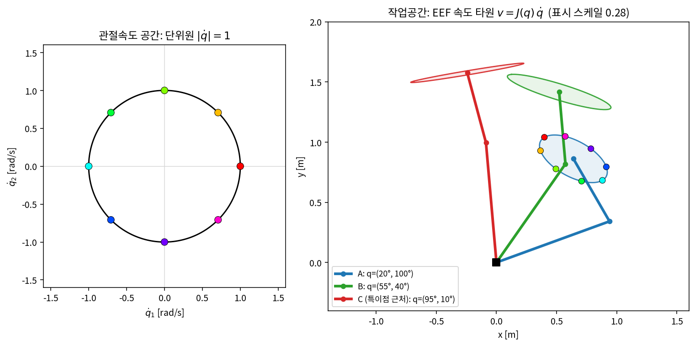
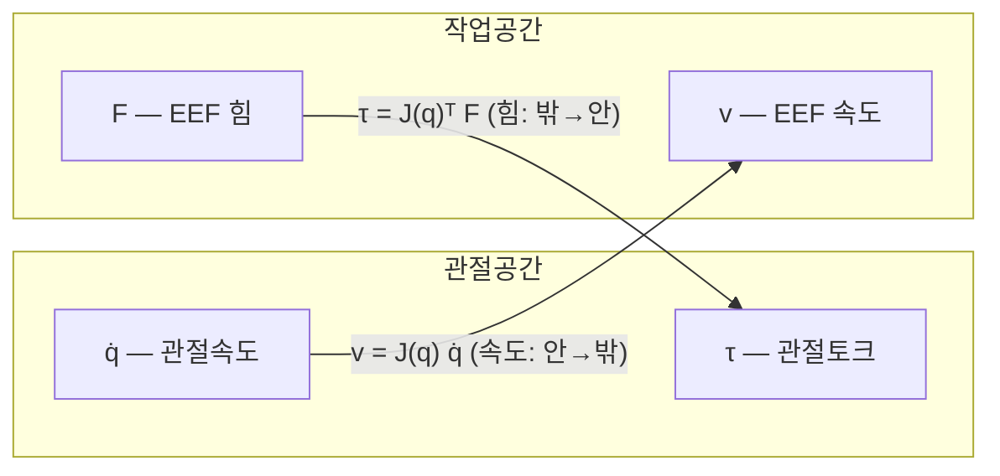
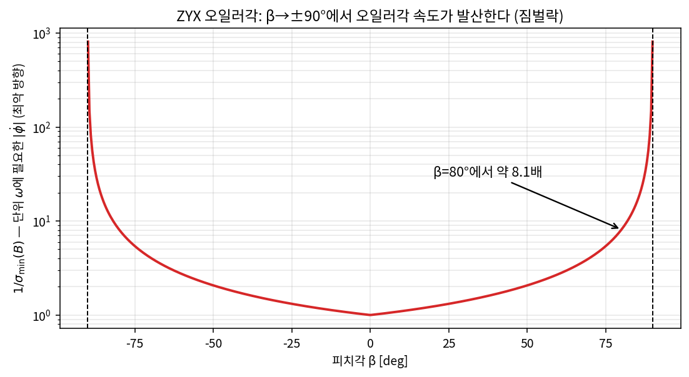
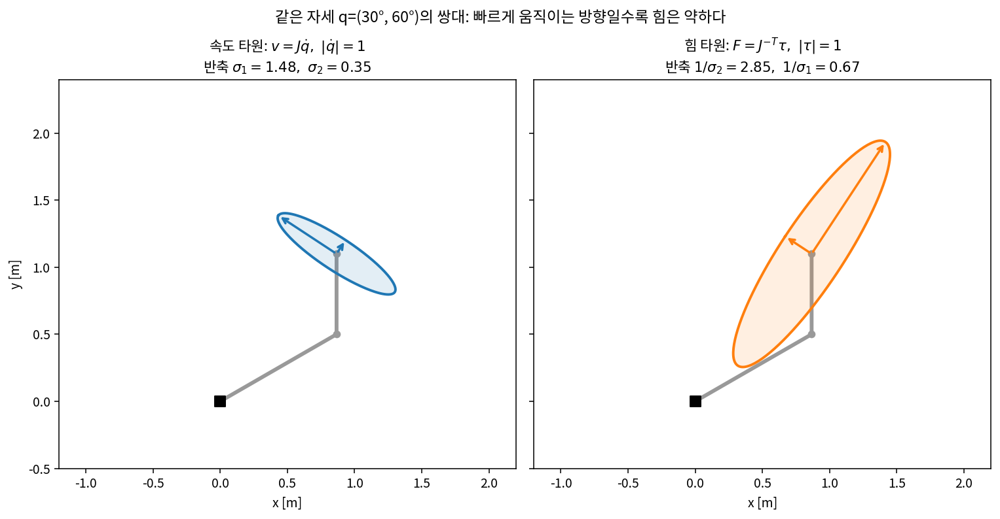

# Lec R05. 자코비안 — 속도의 사상, 힘의 쌍대

> 하위제어 트랙 5일차, Part R2 시작. 선수 지식: R02(SO(3)), R03(SE(3)·twist), R04(FK·PoE).
> 기초 참고서: Modern Robotics(이하 MR) Ch.5. 이 강의는 MR §5.1(매니퓰레이터 자코비안)·§5.2(정역학)를 딥러닝 배경자의 언어로 재구성한 것이다. 특이점·조작성(§5.3~5.4)은 R06에서 본격화한다.

## 한 장 요약



왼쪽: 관절속도 공간의 단위원 — "모든 방향으로 같은 노력". 오른쪽: 같은 단위원이 자코비안 $v = J(q)\,\dot{q}$를 거치면 EEF 속도 **타원**이 된다 (색점은 자세 A에서의 대응). 관찰 세 가지: ① 사상은 선형이다(원→타원). ② 타원은 **자세마다 다르다** — $J$는 $q$의 함수다. ③ 팔이 거의 뻗은 자세 C에서는 타원이 바늘처럼 찌그러진다 — 특이점의 예고(R06). 오늘 배우는 것은 이 선형 사상 $J$와, 힘을 반대 방향으로 나르는 그 전치 $J^\mathsf{T}$가 전부다.

## 학습 목표

1. $v = J(q)\dot{q}$를 정의하고, $J$의 각 열을 "관절 $i$가 단독으로 만드는 EEF 속도(트위스트)"로 해석할 수 있다.
2. 2R 팔의 자코비안을 손으로 유도하고 유한차분으로 검증할 수 있다.
3. 가상일(일률 보존) 원리에서 $\tau = J^\mathsf{T} F$를 3줄로 유도하고, 정적 하중을 버티는 관절토크를 계산할 수 있다.
4. 기하 자코비안과 해석 자코비안의 차이 — "오일러각의 미분은 각속도가 아니다" — 를 설명하고 수치로 확인할 수 있다.
5. PoE 스크류 리스트에서 기하 자코비안을 구현하고(R04 연결), 유한차분·MuJoCo와 대조할 수 있다.

## 왜 이 강의가 필요한가

R04까지의 FK는 "관절각 $q$가 정해지면 손끝이 어디 있는가"라는 **정적인** 질문에 답했다. 그러나 로봇을 실제로 부리는 질문들은 전부 **미분적**이다: 손끝을 이 방향으로 움직이려면 관절을 어떻게 돌려야 하나(IK, R07)? 손끝으로 벽을 이만큼 밀려면 모터가 얼마를 내야 하나(힘 제어, R20~R22)? 이 자세는 왜 명령이 잘 안 먹히나(특이점, R06)? 이 모든 질문의 공용 인프라가 자코비안이다. 상위 트랙과의 연결도 직접적이다 — VLA가 ΔEEF 액션을 내면(상위 26강) 누군가 그것을 관절 명령으로 환전해야 하고, 그 환율표가 $J$다. 그리고 딥러닝 배경자에게 좋은 소식: 이 대상은 여러분이 매일 쓰는 **신경망 야코비안, 그리고 backprop과 수학적으로 같은 물건**이다. 오늘은 새 수학을 배우는 날이 아니라, 아는 수학이 기계 안에서 어떻게 사는지 보는 날이다.

## 본문

### 1. FK를 미분하면 무엇이 나오나

정기구학 $x = f(q)$를 시간으로 미분하면 chain rule에 의해

$$
\dot{x} = \frac{\partial f}{\partial q}\,\dot{q} = J(q)\,\dot{q}
$$

가 나온다. 비선형 함수 $f$가 순간마다 **선형 사상** $J(q)$로 요약되는 것이다. 그리고 이 선형 사상의 전치는 힘을 반대 방향으로 나른다:



속도는 관절에서 손끝으로 **밀려 나가고**(forward), 힘은 손끝에서 관절로 **당겨져 들어온다**(backward). 이 두 방향이 오늘의 E1·E2다. 단 하나 주의할 점: "EEF 속도"에서 위치 부분은 그냥 벡터 미분이지만, **자세 부분은 R02에서 본 대로 다양체 위의 대상**이라 "무엇의 변화율로 잴 것인가"라는 선택이 생긴다 — 그 선택이 자코비안을 두 종류로 가른다(E3).

### 2. 핵심 수식

#### E1. 속도의 사상: $v = J(q)\,\dot{q}$

**직관**: 관절을 조금 꿈틀하면 손끝이 조금 움직인다. 자코비안은 그 "꿈틀→움직임"의 국소 환율표다. 환율은 고정이 아니라 자세 $q$에 따라 달라진다.

**물리·기하적 의미**: $J$의 **$i$번째 열 = 다른 관절을 모두 멈추고 관절 $i$만 단위 속도로 돌릴 때 EEF에 생기는 속도**다. 회전 관절이라면 이는 "관절축 중심의 원운동"이므로, 평면에서는 $\dot{p}_{ee} = \hat{z} \times (p_{ee} - p_{joint\,i})$ — 관절에서 손끝으로 가는 팔 벡터를 90° 돌린 것이다. 전체 속도는 열들의 선형 결합, 즉 각 관절 기여의 **중첩**이다. 속도(순간 변화율) 수준에서는 중첩 원리가 정확히 성립한다 — FK 자체는 비선형이라 유한 변위에서는 성립하지 않는다.

**형식**: 관절 $n$개, 태스크 차원 $t$일 때

$$
v = J(q)\,\dot{q}, \qquad J(q) = \frac{\partial f}{\partial q} \in \mathbb{R}^{t \times n},
\qquad J = \big[\,J_{\cdot 1} \;\big|\; \cdots \;\big|\; J_{\cdot n}\,\big]
$$

EEF의 병진·회전을 다 담는 일반형은 6차원 트위스트(R03)로 쓴다: $\mathcal{V} = J(q)\dot{q}$, $J \in \mathbb{R}^{6\times n}$ — 이것이 **기하 자코비안**이고, PoE와의 아름다운 연결(본문 4절)이 있다. 이 강의의 손계산은 평면 2R의 위치 자코비안($2\times2$)으로 하되, 구조는 동일하다.

#### E2. 힘의 쌍대: $\tau = J^\mathsf{T}(q)\, F$

**직관**: 손끝에 걸리는 힘이 각 관절에 얼마나 "느껴지는가". 지렛대 법칙(토크 = 힘 × 모멘트팔)의 일반화다 — $J^\mathsf{T}$의 각 행이 각 관절의 모멘트팔 역할을 한다.

**물리·기하적 의미**: 유도의 원리는 **일률 보존(가상일)** 하나다. 이상적인(마찰 없는, 정적 평형) 메커니즘에서 관절이 넣는 일률과 손끝이 내는 일률은 같아야 한다: $\tau^\mathsf{T}\dot{q} = F^\mathsf{T} v$. 여기서 중요한 것 — 이 등식이 **가능한 모든 $\dot{q}$에 대해** 성립해야 한다는 점이 $\tau$를 유일하게 결정한다. 기하(운동)를 정의하는 $J$가 정역학(힘)까지 공짜로 결정한다: 힘은 속도의 **쌍대(dual)**다.

**형식**: 3줄 유도 —

$$
\tau^\mathsf{T}\dot{q} = F^\mathsf{T} v = F^\mathsf{T} J(q)\,\dot{q} \quad \forall \dot{q}
\;\;\Longrightarrow\;\; \tau^\mathsf{T} = F^\mathsf{T} J(q)
\;\;\Longrightarrow\;\; \tau = J^\mathsf{T}(q)\, F
$$

(MR §5.2. 규약: $F$는 EEF가 외부에 가하는 wrench, $\tau$는 그것을 내기 위해 관절이 내야 하는 토크.) 주목할 성질: **역행렬이 등장하지 않는다.** $J$가 정방이 아니어도(여유자유도), 특이해도 이 식은 성립한다. 속도 방향으로는 $J$를 "풀어야"(역문제) 하지만 힘 방향으로는 전치만 곱하면 된다 — 자코비안 전치 제어(R20)가 존재하는 이유다.

#### E3. 기하 vs 해석 자코비안 — 오일러각의 미분은 각속도가 아니다

**직관**: "EEF의 회전 속도"를 재는 자가 두 개 있다. 물리적 실체인 **각속도 $\omega$**(순간 회전축×속력 — IMU 자이로가 주는 것)와, 내가 고른 자세 좌표(예: 오일러각 $\phi$)의 **변화율 $\dot{\phi}$**. 이 둘은 다르다. $\omega$를 쓰는 것이 **기하 자코비안**, $\dot{\phi}$를 쓰는 것이 **해석(analytic) 자코비안**이다 (MR §5.1.5).

**물리·기하적 의미**: R02에서 본 대로 SO(3)는 3차원 벡터공간이 아니라 다양체이고, 어떤 3-파라미터 표현도 전역적으로 매끄럽게 덮지 못한다. 그 대가가 여기서 나타난다: $\dot{\phi}$와 $\omega$ 사이의 환산 행렬 $B(\phi)$가 특정 자세(짐벌락)에서 특이해진다. 결과 — **로봇은 멀쩡한데 해석 자코비안만 폭발하는 가짜 특이점**이 생긴다. 기하 자코비안의 특이점은 기계의 성질(R06), 해석 자코비안의 특이점은 거기에 **좌표 선택의 인공물**이 더해진 것이다.

**형식**: ZYX 오일러각 $\phi = (\alpha, \beta, \gamma)$ (yaw-pitch-roll), $R = R_z(\alpha)R_y(\beta)R_x(\gamma)$일 때 공간좌표계 각속도는

$$
\omega = B(\phi)\,\dot{\phi}, \qquad
B = \begin{bmatrix} 0 & -s_\alpha & c_\alpha c_\beta \\ 0 & c_\alpha & s_\alpha c_\beta \\ 1 & 0 & -s_\beta \end{bmatrix},
\qquad \det B = -\cos\beta
$$

이고 해석·기하 자코비안의 관계는 $J_a = \mathrm{blkdiag}(I,\, B^{-1})\, J_{geo}$ (위치 블록은 공통, 회전 블록만 환산 — 여기서는 $(\dot{p};\,\omega)$ 순서로 쌓은 표기이고, 본문 4절의 트위스트는 MR 규약대로 $(\omega;\,v)$ 순서임에 주의). $\beta \to \pm 90°$에서 $B$가 특이 — 짐벌락이다. 수치로 확인해 보자:

```python
import numpy as np

def B_zyx(al, be):
    sa, ca, sb, cb = np.sin(al), np.cos(al), np.sin(be), np.cos(be)
    return np.array([[0, -sa, ca*cb], [0, ca, sa*cb], [1, 0, -sb]])

def Rz(t): c,s=np.cos(t),np.sin(t); return np.array([[c,-s,0],[s,c,0],[0,0,1]])
def Ry(t): c,s=np.cos(t),np.sin(t); return np.array([[c,0,s],[0,1,0],[-s,0,c]])
def Rx(t): c,s=np.cos(t),np.sin(t); return np.array([[1,0,0],[0,c,-s],[0,s,c]])
def Rzyx(e): return Rz(e[0]) @ Ry(e[1]) @ Rx(e[2])

e0, edot, h = np.array([0.3, 0.7, -0.5]), np.array([0.4, -0.2, 0.9]), 1e-6
Rdot = (Rzyx(e0 + h*edot) - Rzyx(e0 - h*edot)) / (2*h)
W = Rdot @ Rzyx(e0).T                       # Ṙ Rᵀ = [ω]  (R02의 hat)
omega = np.array([W[2,1], W[0,2], W[1,0]])
print("ω (유한차분)  =", np.round(omega, 6))            # [ 0.716718  0.012356 -0.179796]
print("B(φ)·φ̇       =", np.round(B_zyx(*e0[:2]) @ edot, 6))  # 동일
print("순진한 φ̇     =", edot, " ← 전혀 다르다")
```

출력: $\omega = (0.716718,\ 0.012356,\ -0.179796)$ — $B\dot\phi$와 완전히 일치하고, $\dot{\phi} = (0.4, -0.2, 0.9)$와는 전혀 다르다. 아래 그림처럼 $\beta = 80°$만 되어도 최악 방향의 단위 각속도를 내는 데 약 **8.1배**의 오일러각 속도가 필요하다($1/\sigma_{\min}(B) = 1/\sqrt{1-\sin\beta}$):



실무 지침: **내부 계산은 기하 자코비안으로 하고, 오일러각은 사람이 읽는 입출력에만 쓴다.** VLA 액션이 자세를 오일러각/axis-angle로 표현할 때(상위 26강) 이 환산이 파이프라인 어딘가에 반드시 숨어 있다.

### 3. Worked Example

#### WE-1 (손 + 코드): 2R 자코비안 유도와 유한차분 대조

**손계산 — 유도**: 2R 평면 팔($l_1 = 1.0$, $l_2 = 0.6$ m)의 FK는

$$
x = l_1 c_1 + l_2 c_{12}, \qquad y = l_1 s_1 + l_2 s_{12} \qquad (c_{12} = \cos(q_1{+}q_2) \text{ 등})
$$

각 성분을 $q_1, q_2$로 편미분하면

$$
J(q) = \begin{bmatrix} -l_1 s_1 - l_2 s_{12} & -l_2 s_{12} \\ \;\;\, l_1 c_1 + l_2 c_{12} & l_2 c_{12} \end{bmatrix}
$$

**손계산 — 대입**: $q = (30°, 60°)$이면 $q_1{+}q_2 = 90°$이므로 $s_1 = 0.5$, $c_1 = \tfrac{\sqrt3}{2} \approx 0.86603$, $s_{12} = 1$, $c_{12} = 0$:

$$
J = \begin{bmatrix} -1.0(0.5) - 0.6(1) & -0.6(1) \\ 1.0(0.86603) + 0 & 0 \end{bmatrix}
= \begin{bmatrix} -1.1 & -0.6 \\ 0.86603 & 0 \end{bmatrix}
$$

**열 해석으로 암산 검증** (E1): EEF는 $p_{ee} = (0.86603,\ 1.1)$, 팔꿈치는 $p_{elbow} = (0.86603,\ 0.5)$에 있다. 1열은 $\hat z \times p_{ee} = (-y_{ee},\, x_{ee}) = (-1.1,\ 0.86603)$ ✓. 2열은 $\hat z \times (p_{ee} - p_{elbow}) = \hat z \times (0,\, 0.6) = (-0.6,\ 0)$ ✓. **미분을 안 해도 기하만으로 자코비안이 나온다** — 이것이 기하 자코비안이라는 이름의 이유다.

$\dot{q} = (1.0,\ 0.5)$ rad/s를 곱하면 $v = (-1.1 - 0.3,\ 0.86603) = (-1.4,\ 0.86603)$ m/s.

**검증 코드**:

```python
import numpy as np

l1, l2 = 1.0, 0.6
def fk(q):
    q1, q12 = q[0], q[0] + q[1]
    return np.array([l1*np.cos(q1) + l2*np.cos(q12),
                     l1*np.sin(q1) + l2*np.sin(q12)])

def J_analytic(q):
    q1, q12 = q[0], q[0] + q[1]
    return np.array([[-l1*np.sin(q1) - l2*np.sin(q12), -l2*np.sin(q12)],
                     [ l1*np.cos(q1) + l2*np.cos(q12),  l2*np.cos(q12)]])

q = np.deg2rad([30.0, 60.0])
Ja = J_analytic(q)

eps = 1e-6                       # 유한차분: J[:,j] ≈ (f(q+εe_j) − f(q−εe_j)) / 2ε
Jn = np.zeros((2, 2))
for j in range(2):
    dq = np.zeros(2); dq[j] = eps
    Jn[:, j] = (fk(q + dq) - fk(q - dq)) / (2*eps)

print("해석 J =\n", np.round(Ja, 5))     # [[-1.1, -0.6], [0.86603, 0.]]
print("최대 오차:", np.abs(Ja - Jn).max())  # ~5.0e-11
print("v =", np.round(Ja @ np.array([1.0, 0.5]), 5))  # [-1.4, 0.86603]
```

유한차분과의 최대 오차 $\approx 5\times10^{-11}$ — 손계산·기하 해석·수치 미분 세 경로가 한 점에서 만난다.

#### WE-2 (손 + 코드): 정적 하중을 버티는 관절토크 — $\tau = J^\mathsf{T} F$

**문제**: 위 자세($q = (30°, 60°)$)에서 EEF에 1 kg 추가 매달려 있다. 추를 정지 상태로 떠받치려면 각 관절이 얼마의 토크를 내야 하나?

**손계산**: EEF가 추에 가해야 하는 힘은 위쪽으로 $F = (0,\ mg) = (0,\ 9.81)$ N. 따라서

$$
\tau = J^\mathsf{T} F =
\begin{bmatrix} -1.1 & 0.86603 \\ -0.6 & 0 \end{bmatrix}
\begin{bmatrix} 0 \\ 9.81 \end{bmatrix}
= \begin{bmatrix} 8.4957 \\ 0 \end{bmatrix} \text{ N·m}
$$

$\tau_2 = 0$이 이상해 보이면 그림을 보라 — $q_1{+}q_2 = 90°$라 **링크 2가 수직**이다. 수직 막대 끝에 매달린 추는 관절 2에 모멘트팔이 0이다. 수식이 물리를 정확히 알고 있다. 링크 2를 눕힌 자세 $q = (30°, 30°)$로 바꾸면 $\tau = (11.4387,\ 2.943)$ — 이제 관절 2도 일해야 한다.

**교차검증 — 퍼텐셜 에너지의 기울기**: 추의 퍼텐셜 에너지는 $U(q) = mg\, y(q)$이고, 정적 평형 토크는 $\tau = \nabla_q U$여야 한다(에너지를 붙들고 있는 힘). 그런데 $\partial y/\partial q$는 정확히 $J$의 둘째 행이므로 $\nabla_q U = mg\,(\partial y/\partial q)^\mathsf{T} = J^\mathsf{T}(0,\ mg)$ — 두 관점이 같은 식이다:

```python
m, g = 1.0, 9.81
F_tip = np.array([0.0, m*g])            # EEF가 추를 떠받치는 힘
tau = J_analytic(q).T @ F_tip
print("τ =", np.round(tau, 4))           # [8.4957 0.    ]

def U(qq): return m*g*fk(qq)[1]          # 퍼텐셜 에너지
gU = np.zeros(2)
for j in range(2):
    dq = np.zeros(2); dq[j] = eps
    gU[j] = (U(q + dq) - U(q - dq)) / (2*eps)
print("∇U =", np.round(gU, 4))           # [8.4957 0.    ]  — 동일
```

이 $\nabla_q U$가 바로 R10 매니퓰레이터 방정식의 **중력항 $g(q)$**다. 중력 보상 제어(R19)란 매 순간 이 계산을 하는 것이다.

#### WE-3 (코드): 속도 타원과 힘 타원 — SVD로 사상 읽기

단위 관절속도 집합 $\{\dot{q} : \|\dot{q}\| = 1\}$의 상(image)이 속도 타원이고, 그 반축은 $J$의 특이값이다:

```python
U_, S, Vt = np.linalg.svd(J_analytic(q))
print("특이값 σ =", np.round(S, 4))       # [1.4823 0.3506]
print("σ1·σ2 =", round(S[0]*S[1], 5),     # 0.51962
      " |det J| =", round(abs(np.linalg.det(J_analytic(q))), 5))  # 0.51962
print("힘 타원 반축 1/σ =", np.round(1/S, 4))  # [0.6746 2.8526]
```

**손으로도 확인**: $JJ^\mathsf{T} = \begin{bmatrix} 1.57 & -0.95263 \\ -0.95263 & 0.75 \end{bmatrix}$의 고유값은 $\lambda = \frac{2.32 \pm \sqrt{2.32^2 - 4(0.27)}}{2} = 2.1971,\ 0.1229$이고 $\sigma = \sqrt{\lambda} = 1.4823,\ 0.3506$ — 코드와 일치. 타원 넓이에 비례하는 $\sigma_1\sigma_2 = |\det J| = 0.51962$가 **조작성**(manipulability)의 원형이다(R06).

같은 자세에서 단위 토크 집합 $\{\tau : \|\tau\| = 1\}$이 낼 수 있는 EEF 힘은 $F = J^{-\mathsf{T}}\tau$의 타원 — 반축이 $1/\sigma$로 **뒤집힌다**:



속도가 빠른 방향(반축 1.48)은 힘이 약하고(반축 0.67), 속도가 느린 방향(0.35)은 힘이 세다(2.85). 우연이 아니라 E2의 일률 보존 $F^\mathsf{T}v = \tau^\mathsf{T}\dot{q}$의 직접 귀결이다 — 출력 일률이 정해져 있으니 **빠르면 약하고 느리면 세다**. 자전거 기어비와 같은 물리이고, 로봇은 자세를 바꿈으로써 기어비를 바꾼다: 사람이 무거운 것을 밀 때 팔을 뻗는(특이점에 가깝게, 힘 타원이 길어지는) 이유다.

### 4. 기하 자코비안의 열 = 이동된 스크류 (PoE 연결)

R04의 PoE FK $T(q) = e^{[S_1]q_1} \cdots e^{[S_n]q_n} M$을 미분하면 공간 자코비안의 열이 놀랍도록 깔끔하게 나온다 (MR §5.1.1):

$$
J_s(q) = \big[\, S_1 \;\big|\; \mathrm{Ad}_{e^{[S_1]q_1}} S_2 \;\big|\; \cdots \;\big|\; \mathrm{Ad}_{e^{[S_1]q_1}\cdots e^{[S_{n-1}]q_{n-1}}} S_n \,\big]
$$

말로 풀면: **$i$번째 열 = 관절 $i$의 스크류축을, 앞 관절들($1$~$i{-}1$)이 만든 현재 자세로 옮겨 놓은 것**(Adjoint, R03). E1의 열 해석("관절 $i$가 단독으로 만드는 트위스트")이 그대로 공식이 된 것이다 — 미분 없이, 삼각함수 전개 없이. WE-1에서 암산으로 열을 구할 수 있었던 것의 일반형이며, 실습에서 이 공식을 그대로 코드로 옮긴다.

함정 하나만 미리: $J_s$의 선형속도 성분 $v_s$는 EEF의 속도가 아니라 "원점을 지나는 강체 위 가상의 점"의 속도다(R03의 트위스트 정의). EEF **점**의 속도가 필요하면 $\dot{p}_{ee} = v_s + \omega_s \times p_{ee}$로 변환해야 한다 — 실습 2번에서 직접 밟는다. EEF 좌표계 기준으로 표현한 **물체 자코비안** $J_b = \mathrm{Ad}_{T^{-1}} J_s$도 있으며(MR §5.1.2), 라이브러리마다 어느 것을 주는지 다르다(흔한 오해 1).

### 딥러닝 배경자를 위한 번역

- **$J$는 비유가 아니라 문자 그대로 신경망에서 말하는 야코비안이다.** FK 함수 $f$를 PyTorch로 짜면 `torch.autograd.functional.jacobian(fk, q)`가 오늘 손으로 유도한 그 행렬을 돌려준다. 유한차분 검증은 여러분이 아는 gradient check 그 자체다.
- **$v = J\dot{q}$는 JVP, $\tau = J^\mathsf{T}F$는 VJP다.** forward-mode AD가 입력 방향 벡터를 밀어내듯 속도는 관절→EEF로 밀리고, reverse-mode(backprop)가 upstream gradient를 $W^\mathsf{T}$로 당기듯 힘은 EEF→관절로 당겨진다 [3]. "손끝의 힘 = 관절 좌표로 pull-back된 gradient" — WE-2에서 $\tau = \nabla_q U$로 확인한 그대로, 중력 보상은 **에너지 손실함수의 backprop**이다.
- **속도 타원 = 야코비안의 특이값 스펙트럼.** ill-conditioned $J$(자세 C)는 특정 방향의 gradient가 소실/폭발하는 신경망과 같은 병리다 — 조건수 4.2(WE-3)면 양호, 특이점 근처에선 $10^3$+가 된다(R06). 차이는, 로봇에선 "가중치 초기화"가 아니라 **자세 선택**으로 조건수를 관리한다는 것.
- **기하 vs 해석 = 출력 파라미터화가 야코비안을 바꾼다.** 같은 회전을 오일러각으로 내보내느냐 각속도로 내보내느냐에 따라 야코비안이 달라지고 가짜 특이점까지 생긴다 — 각도 회귀에서 $\sin/\cos$ 인코딩을 쓰는 이유(R02)와 같은 뿌리의 문제다.

## 흔한 오해

1. **"로봇의 자코비안은 하나다"** — 기하/해석, 공간/물체 좌표계, 기준점(EEF 점 vs 트위스트)에 따라 전부 다른 행렬이다. MuJoCo `mj_jacSite`는 지정한 점의 세계좌표 위치 자코비안(`jacp`)+회전(`jacr`)을, Pinocchio는 `LOCAL`/`WORLD`/`LOCAL_WORLD_ALIGNED` 세 가지 frame 옵션을 준다. 라이브러리 결과를 쓰기 전에 "어느 자코비안인가"부터 물어야 한다.
2. **"오일러각을 미분하면 각속도"** — 아니다. $\omega = B(\phi)\dot{\phi}$이고(E3), 짐벌락에서 $B$는 특이해진다. 자이로가 주는 것은 $\omega$, 로그에 찍힌 RPY의 차분은 $\dot\phi$의 근사 — 둘을 섞으면 조용히 틀린다.
3. **"$\tau = J^\mathsf{T}F$를 쓰려면 $J$가 정방·가역이어야 한다"** — 전치는 항상 존재한다. 여유자유도(6×7)여도, 특이점 위여도 성립한다. 역이 필요한 것은 반대 방향 문제($v$에서 $\dot{q}$를 푸는 것, R07)뿐이다. 단, 이 식은 **이상 조건(정적 평형·마찰 없음·링크 무게 별도)**의 관계다 — 실기에서는 링크 자중의 $g(q)$(R10), 감속기 마찰·반사 관성(R14~R16)이 더해진다.
4. **"$v = J\dot q$는 어차피 근사"** — 순간(속도) 관계로는 정확하다. 근사가 되는 것은 유한 변위로 바꿔 쓸 때($\Delta x \approx J\Delta q$)이고, 그래서 IK 뉴턴법(R07)은 이 선형화를 반복·수렴시키는 구조를 갖는다.

## 실습 (1.5~2시간)

**임의 스크류 리스트 → 기하 자코비안 함수 만들기.** R04에서 만든 PoE 도구를 재사용한다.

1. 다음 골격을 완성한다 (`hat`, `exp_se3`는 R04에서 가져오기):

```python
import numpy as np

def hat(w):
    return np.array([[0, -w[2], w[1]], [w[2], 0, -w[0]], [-w[1], w[0], 0]])

def exp_se3(S, th):                      # R04: 스크류의 지수 사상
    w, v = S[:3], S[3:]
    T = np.eye(4)
    if np.linalg.norm(w) < 1e-12:
        T[:3, 3] = v*th; return T
    W = hat(w)
    T[:3, :3] = np.eye(3) + np.sin(th)*W + (1-np.cos(th))*(W@W)   # Rodrigues (R02)
    G = np.eye(3)*th + (1-np.cos(th))*W + (th-np.sin(th))*(W@W)
    T[:3, 3] = G@v
    return T

def Ad(T):                               # R03: Adjoint 표현 (6×6)
    R, p = T[:3, :3], T[:3, 3]
    A = np.zeros((6, 6))
    A[:3, :3] = R; A[3:, 3:] = R; A[3:, :3] = hat(p)@R
    return A

def space_jacobian(Slist, q):            # 본문 4절 공식 그대로
    n = len(q); Js = np.zeros((6, n)); T = np.eye(4)
    for i in range(n):
        Js[:, i] = Ad(T) @ Slist[i]
        T = T @ exp_se3(Slist[i], q[i])
    return Js
```

2. 2R 팔을 공간 스크류로 기술하고($S_1 = (0,0,1,\,0,0,0)$, $S_2 = (0,0,1,\,0,-l_1,0)$, $M$: EEF가 $(l_1{+}l_2, 0, 0)$), $q = (30°, 60°)$에서 $J_s$를 계산하라. 그다음 **EEF 점의 위치 자코비안으로 변환**해 WE-1의 해석식과 대조하라:

```python
l1, l2 = 1.0, 0.6
Slist = [np.array([0,0,1, 0,0,0]), np.array([0,0,1, 0,-l1,0])]
M = np.eye(4); M[0,3] = l1 + l2
def fk_poe(q):
    T = np.eye(4)
    for S, th in zip(Slist, q): T = T @ exp_se3(S, th)
    return T @ M

q = np.deg2rad([30.0, 60.0])
Js = space_jacobian(Slist, q)
p_ee = fk_poe(q)[:3, 3]                          # [0.86603, 1.1, 0]
Jp = np.column_stack([Js[3:, i] + np.cross(Js[:3, i], p_ee)   # ṗ = v_s + ω×p
                      for i in range(len(q))])
print(np.round(Jp[:2], 5))    # [[-1.1, -0.6], [0.86603, 0.]] — WE-1과 일치 (~1e-16)
```

   변환을 빼먹으면 어떤 값이 나오는지도 확인하고, 왜 그 값이 "원점에 있는 가상 점의 속도"인지 설명해 보라(본문 4절의 함정).

3. 유한차분 검증 루틴을 **임의의 $n$관절 스크류 리스트**에 대해 일반화하라: `fk_poe`의 위치 성분을 수치 미분해 `Jp`와 비교. UR5e 스크류 리스트(R04 실습에서 작성)로 6관절에서도 오차 $<10^{-6}$인지 확인.
4. (선택) MuJoCo와 대조 — 같은 2R 모델을 MJCF로 만들고 `mj_jacSite`가 주는 `jacp`와 비교한다:

```python
import numpy as np
import mujoco
XML = """
<mujoco model="arm2r"><worldbody>
  <body name="l1"><joint name="q1" type="hinge" axis="0 0 1"/>
    <geom type="capsule" fromto="0 0 0  1.0 0 0" size="0.03"/>
    <body name="l2" pos="1.0 0 0"><joint name="q2" type="hinge" axis="0 0 1"/>
      <geom type="capsule" fromto="0 0 0  0.6 0 0" size="0.03"/>
      <site name="ee" pos="0.6 0 0"/>
    </body></body>
</worldbody></mujoco>"""
m = mujoco.MjModel.from_xml_string(XML); d = mujoco.MjData(m)
d.qpos[:] = np.deg2rad([30.0, 60.0]); mujoco.mj_forward(m, d)
jacp = np.zeros((3, m.nv)); jacr = np.zeros((3, m.nv))
mujoco.mj_jacSite(m, d, jacp, jacr, m.site("ee").id)
print(np.round(jacp[:2], 5))   # [[-1.1, -0.6], [0.86603, 0.]] — 동일
print(np.round(jacr, 5))       # 회전 행: [[0,0],[0,0],[1,1]] — 두 관절 모두 ẑ축 회전 기여
```

5. (심화) $q_2$를 $170° \to 179° \to 179.9°$로 보내며 $J$의 특이값과 조건수를 출력해 보라. 속도 타원이 어떻게 짜부라지는가? — R06의 문을 두드리는 실험이다.

## Claude와 토론할 질문

1. "$J$의 열 = 관절 $i$의 단독 기여"라는 해석은 중첩 원리다. 이것이 성립하는 데 필요한 가정(강체, 순간 속도)은 무엇이고, 유한 변위에서는 왜 깨지는가?
2. E2 유도에서 "**모든** $\dot{q}$에 대해 성립"이 왜 결정적인가? 등식이 특정 $\dot q$ 하나에서만 성립한다면 $\tau$에 어떤 자유도가 남는지 계산해 보라 (힌트: $\dot q$에 수직인 성분).
3. 선형층 $y = Wx$의 backward가 $\nabla_x = W^\mathsf{T}\nabla_y$인 것과 $\tau = J^\mathsf{T}F$의 구조적 동일성을 "쌍대 사상(pullback)"의 언어로 정리해 보라. 힘·토크가 gradient와 같은 **공변(covariant)** 대상이라는 말의 뜻은?
4. 힘 타원과 속도 타원이 서로 역인 것을 일률 보존으로부터 유도해 보라. 사람이 무거운 문을 밀 때 팔을 최대한 뻗는 것이 왜 "특이점을 이용하는" 전략인가? 그 자세의 대가는?
5. VLA가 ΔEEF 액션을 낼 때(상위 26강) 하위 스택 어디에서 $J$(또는 그 역)가 개입하는가? 정책이 특이점 근처 자세를 명령하면 무슨 일이 벌어지고, 어느 층에서 막아야 하나(R29의 안전 필터 예고)?
6. 7-DoF 팔의 $J$는 $6\times7$이다. $\mathrm{null}(J)$의 1차원 내부 운동(R01의 여유자유도)은 힘의 관점($J^\mathsf{T}$)에서 어떤 의미를 갖는가? "내부 운동은 EEF 힘을 못 만든다"를 증명해 보라.
7. 해석 자코비안이 필요한 상황은 언제인가? (힌트: 오일러각으로 정의된 오차를 최소화하는 태스크, 각도 파라미터로 학습된 정책의 출력) — "내부는 기하, 인터페이스는 해석"이라는 지침을 비판적으로 검토하라.

## 읽을거리

1. **MR §5.1~5.2** (~60분): 공간/물체 자코비안 유도(§5.1.1~5.1.2), 해석 자코비안(§5.1.5), 정역학(§5.2). §5.3~5.4(특이점·조작성)는 R06에서 읽으므로 지금은 그림만 훑기.
2. **Baydin et al., "Automatic Differentiation in Machine Learning: a Survey"** (§2~3만, ~30분): forward/reverse mode = JVP/VJP의 정확한 정의. 번역 박스의 대응을 자기 언어로 다시 쓰는 데 사용.
3. **MuJoCo 문서의 Jacobian 절** (mujoco.readthedocs.io, ~10분): `mj_jac*` 계열이 주는 것이 정확히 무엇인지 — 실습 4의 근거.

## 자가 점검

1. 2R 자코비안을 미분으로도, 열 해석(팔 벡터 90° 회전)으로도 5분 안에 유도할 수 있는가?
2. $\tau = J^\mathsf{T}F$를 일률 보존에서 3줄로 유도하고, 역행렬이 필요 없는 이유를 말할 수 있는가?
3. WE-2에서 $\tau_2 = 0$이 나온 기하적 이유를 그림으로 설명할 수 있는가?
4. 기하/해석 자코비안의 차이를 말하고, 짐벌락에서 어느 쪽이 왜 발산하는지 설명할 수 있는가?
5. $v = J\dot q$ ↔ JVP, $\tau = J^\mathsf{T}F$ ↔ VJP 대응을 딥러닝 하는 동료에게 1분 안에 설명할 수 있는가?

## 참고문헌

> 웹 문서는 2026-07-08 접속 기준.

[1] K. Lynch, F. Park, "Modern Robotics: Mechanics, Planning, and Control," Cambridge Univ. Press, 2017. 무료 PDF: https://hades.mech.northwestern.edu/images/7/7f/MR.pdf
— **뒷받침**: Ch.5 — 공간/물체 자코비안과 열 공식 $J_{s,i} = \mathrm{Ad}(\cdot)S_i$(§5.1.1~5.1.2), 해석 자코비안과 $B(\phi)$ 환산(§5.1.5), 가상일에 의한 $\tau = J^\mathsf{T}F$(§5.2), 조작성 타원(§5.4 — R06에서 본격 인용). Ch.3 — 트위스트·Adjoint 표현(실습 `Ad`, `exp_se3`의 정의).

[2] Google DeepMind, MuJoCo 문서 및 API 레퍼런스. https://mujoco.readthedocs.io
— **뒷받침**: 실습 4의 `mj_jacSite`/`jacp`/`jacr` 의미(지정점의 세계좌표 자코비안). 본 강의에서 실행·검증함(2×2 위치 블록이 해석식과 일치).

[3] A. G. Baydin, B. A. Pearlmutter, A. A. Radul, J. M. Siskind, "Automatic Differentiation in Machine Learning: a Survey," JMLR 18(153), 2018. arXiv:1502.05767. https://arxiv.org/abs/1502.05767
— **뒷받침**: 번역 박스의 forward-mode(JVP)/reverse-mode(VJP) 용어와 "backprop = 전치 사상으로 gradient를 당기는 연산"이라는 대응.

[4] K. Black et al., "π0: A Vision-Language-Action Flow Model for General Robot Control," arXiv:2410.24164, 2024.10. https://arxiv.org/abs/2410.24164
— **뒷받침**: "VLA가 EEF/관절 공간 액션을 내면 하위 스택이 환전한다"는 문맥(상위 26강과 동일 출처) — 본 강의의 동기 부여 절에서 개념적으로만 참조.
