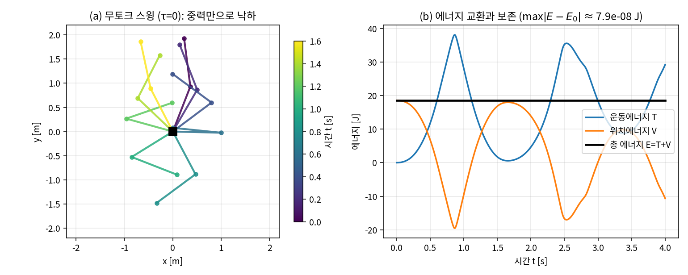
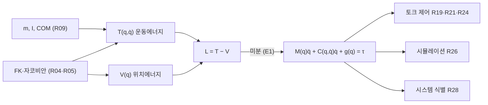
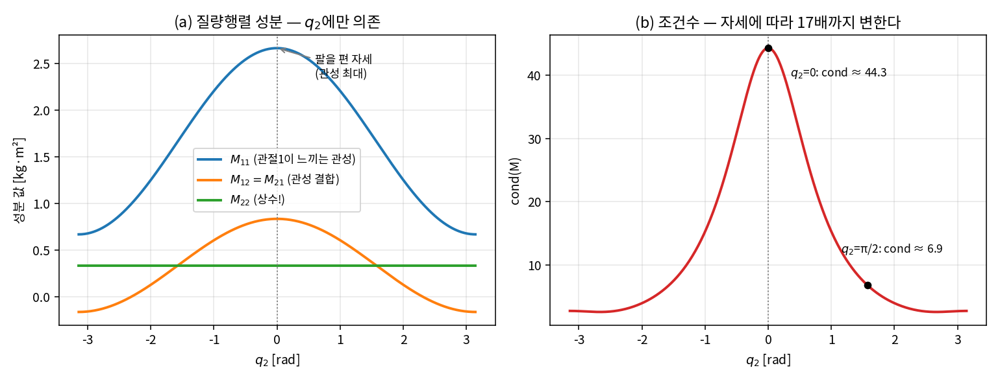
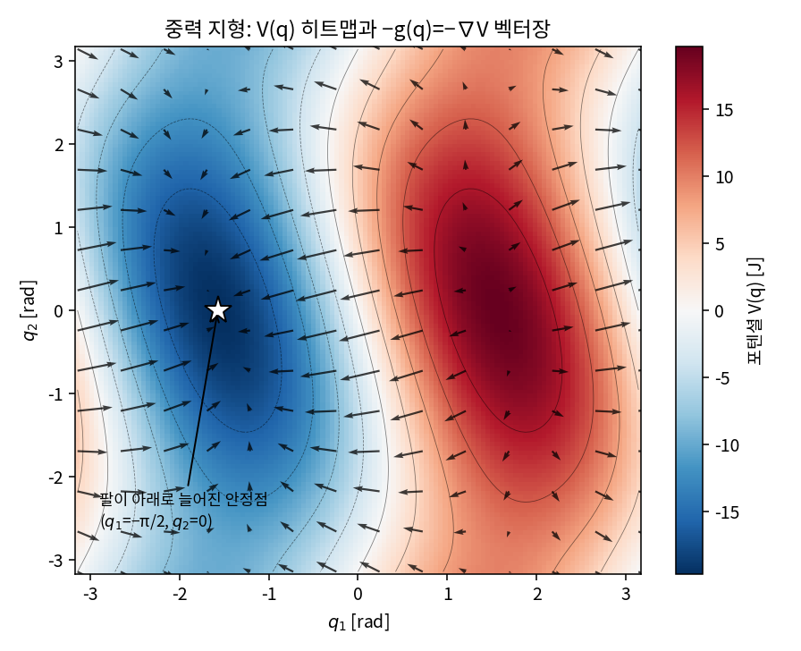

# Lec R10. 라그랑주 동역학 — 매니퓰레이터 방정식

> 하위제어 트랙 10일차 (Part R3 동역학, 2/5). 선수 지식: R04(FK), R05(자코비안), R09(질량·관성텐서·무게중심).
> 기초 참고서: Modern Robotics(이하 MR) Ch.8 §8.1. 이 강의는 그 내용을 "에너지 → 미분 → 운동방정식"이라는
> 딥러닝 배경자에게 익숙한 파이프라인으로 재구성한 것이다.

## 한 장 요약



2링크 팔에서 모든 모터를 끄면(τ=0) 팔은 중력만으로 흔들린다(왼쪽). 이때 운동에너지 T와 위치에너지 V는 요란하게 교환되지만 총합 E=T+V는 수치 적분 오차(≈10⁻⁷ J) 안에서 **정확히 일정**하다(오른쪽). 오늘 강의의 전부가 이 그림에 있다: 로봇의 운동방정식은 에너지 T−V라는 **스칼라 하나를 미분해서** 얻어지고($M(q)\ddot q + C(q,\dot q)\dot q + g(q) = \tau$), 그 구조적 성질(수동성)이 에너지 보존을 보장한다. 에너지가 보존되지 않는 시뮬레이션은 방정식이 아니라 코드가 틀린 것이다 — 이 사실이 오늘 우리의 디버깅 도구가 된다.

## 학습 목표

1. 오일러-라그랑주 방정식을 쓰고, "에너지라는 스칼라에서 미분만으로 운동방정식이 나온다"는 구조를 설명할 수 있다.
2. 매니퓰레이터 방정식 $M(q)\ddot q + C(q,\dot q)\dot q + g(q) = \tau$의 세 항이 각각 어떤 물리(관성/코리올리·원심/중력)인지, 왜 그 자리에 있는지 설명할 수 있다.
3. 2링크 암의 M, C, g를 sympy로 완전 유도하고, 손계산으로 특정 자세의 수치를 검산할 수 있다.
4. $M \succ 0$ 대칭, $\dot M - 2C$ skew-symmetric, 수동성($\dot E = \dot q^\top \tau$)의 관계를 유도하고, 시뮬레이션에서 에너지 보존으로 검증할 수 있다.
5. 자신이 만든 동역학과 MuJoCo(`mj_forward`)의 가속도가 일치함을 확인하는 크로스체크 절차를 수행할 수 있다.

## 왜 이 강의가 필요한가

R01~R08까지는 **기하학**이었다 — 어떤 관절각이 어떤 자세를 만드는가. 힘도, 질량도, 시간도 등장하지 않았다. 그러나 실제 로봇에 명령이 도달하는 최종 형태는 자세가 아니라 **모터 전류 ≈ 토크**다(R14에서 다룬다). 토크와 운동을 잇는 방정식이 없으면:

- **토크 제어를 설계할 수 없다.** R19의 computed torque, R21의 임피던스 제어, R23의 MPC, R24의 WBC — Part R5의 제어는 전부 오늘의 방정식 위에 서 있다. Franka가 토크 지령 모드에서 중력·마찰을 자동 보상해 준다는 것(상위 26강)의 실체가 바로 이 방정식의 $g(q)$ 항 계산이다.
- **시뮬레이터가 블랙박스가 된다.** MuJoCo가 매 타임스텝 푸는 것이 정확히 이 방정식이다(접촉이 더해지면 R12). sim2real 갭의 큰 부분은 M·C·g에 들어가는 파라미터의 오차이고(R28의 시스템 식별이 그것을 맞추는 일), 오늘 우리는 우리 손으로 유도한 방정식과 MuJoCo가 소수점 13자리까지 일치하는 것을 확인한다.
- **"왜 이 로봇은 이렇게 움직이는가"를 읽지 못한다.** 팔을 펴면 무거워지는 것, 한 관절을 돌리면 다른 관절이 딸려 움직이는 것(관성 결합), 빨리 휘두를 때 이상한 방향으로 힘이 튀는 것(코리올리) — 전부 M과 C의 성분에 이름표가 붙어 있다.

딥러닝 배경자에게 좋은 소식: 이 유도는 여러분이 매일 쓰는 **"스칼라를 정의하고 미분은 기계에 맡긴다"** 패턴 그 자체다. 손으로 힘 벡터를 분해하는 뉴턴역학 대신, 에너지 하나를 쓰고 나머지는 sympy(=심볼릭 autodiff)가 한다.

## 본문

### 1. 재료 준비: 일반화 좌표와 에너지

동역학의 상태는 $(q, \dot q)$다. $q \in \mathbb{R}^n$은 관절각(일반화 좌표), $\dot q$는 관절 속도. R09에서 각 링크의 질량 $m_i$, 무게중심(COM) 위치, COM 기준 관성 $\mathcal{I}_i$를 읽는 법을 배웠다. 이제 두 스칼라를 조립한다:

- **운동에너지** $T(q, \dot q)$: 각 링크의 병진 $\frac{1}{2}m_i v_i^\top v_i$ + 회전 $\frac{1}{2}\omega_i^\top \mathcal{I}_i \omega_i$의 합.
- **위치에너지** $V(q)$: 각 링크의 $m_i \, g \, h_i(q)$의 합 (스프링이 있으면 추가).

용어 정리 하나: 우변에 놓일 $\tau$는 **일반화 힘**(generalized force)이다 — 회전 관절이면 토크(N·m), 직동 관절이면 힘(N). "$\tau_i \, \dot q_i$ = 일률(W)"이 되도록 좌표별로 단위가 정해진다고 기억하면 헷갈리지 않는다.

핵심 관찰: COM 속도는 자코비안을 통해 $v_i = J_{v_i}(q)\,\dot q$로 쓸 수 있다(R05). 따라서 운동에너지는 **언제나** $\dot q$의 2차형식이 된다:

$$
T = \frac{1}{2}\dot q^\top \underbrace{\Big[\sum_i \big( m_i J_{v_i}^\top J_{v_i} + J_{\omega_i}^\top \mathcal{I}_i J_{\omega_i} \big)\Big]}_{=\,M(q)} \dot q
$$

이 괄호가 바로 **질량행렬(mass/inertia matrix)** $M(q)$의 정체다. 자세 $q$에 따라 변하는, 대칭이고 양의 정부호인 $n \times n$ 행렬 — 아래에서 계속 만난다. (표기 주의: 여기서 $\mathcal{I}_i$는 $J_{\omega_i}$와 같은 좌표계로 표현한 값이다 — 월드 좌표로 쓰면 $R_i \mathcal{I}_i^{body} R_i^\top$처럼 자세 의존성이 하나 더 들어온다. 오늘의 평면 예제에서는 스칼라 상수라 이 구분이 드러나지 않는다.)



### 2. 핵심 수식

#### E1. 오일러-라그랑주 방정식 — 에너지에서 운동방정식으로

**직관**: "이 시스템의 에너지 장부(T와 V)만 정확히 쓰면, 운동법칙은 공짜로 나온다." 힘을 벡터로 분해하는 대신 스칼라 $L = T - V$(라그랑지안)를 쓰고 미분한다. 손으로 자유물체도를 그리는 뉴턴역학이 "레이어별 수동 gradient 유도"라면, 라그랑주역학은 "loss를 정의하고 backward()를 부르는" 쪽이다.

**물리·기하적 의미**: $\partial L/\partial \dot q_i$는 관절 $i$의 **일반화 운동량**, 그 시간변화율이 관성력이다. $\partial L/\partial q_i$는 구성이 바뀔 때 에너지가 변하는 정도 — 포텐셜의 기울기와, 자세에 따라 관성이 변해서 생기는 힘(원심·코리올리의 근원)을 함께 담는다. 우변 $\tau_i$는 외부에서 관절 $i$에 주입하는 일반화 힘이다.

**형식**:

$$
\frac{d}{dt}\frac{\partial L}{\partial \dot q_i} - \frac{\partial L}{\partial q_i} = \tau_i, \qquad i = 1, \dots, n, \qquad L(q, \dot q) = T(q, \dot q) - V(q)
$$

유도 요점 (가상일/달랑베르 경로): 뉴턴 법칙 $F_i = m_i a_i$를 "동적 평형" $\sum_i (F_i - m_i a_i)\cdot \delta r_i = 0$으로 다시 쓴다 — 관성력 $-m_i a_i$까지 힘으로 치면 임의의 **가상 변위** $\delta r_i$에 대해 가상일이 0이라는 것. 구속을 자동 만족하는 좌표 $q$로 $\delta r_i = \frac{\partial r_i}{\partial q}\delta q$를 대입하고 항을 정리하면 좌표별로 위 식이 나온다 (가상일 유도 자체는 고전역학의 표준 내용; 결과인 일반 정식화와 표기는 MR §8.1.2 [1]를 따른다). 핵심 이득: **구속력(관절이 링크를 붙잡는 힘)은 가상일을 하지 않으므로 방정식에서 사라진다.** n개 링크의 6n개 뉴턴-오일러 방정식 대신, 자유도 수 n개의 방정식만 남는다.

#### E2. 매니퓰레이터 방정식 — 세 항의 물리

**직관**: E1에 $T = \frac{1}{2}\dot q^\top M(q) \dot q$를 넣고 미분을 실행하면, 결과는 항상 같은 꼴로 정리된다: "가속도에 비례하는 항 + 속도의 2차인 항 + 자세만의 항". 로봇이 아무리 복잡해도 이 세 서랍에 다 들어간다.

**물리·기하적 의미** — 각 항에 이름표를 붙이면:

| 항 | 이름 | 물리 | 성질 |
|---|---|---|---|
| $M(q)\ddot q$ | 관성 | 가속시키기 위한 토크. 대각 성분 = 관절이 스스로 느끼는 관성, **비대각 성분 = 관성 결합**(관절 1을 가속하면 관절 2에 토크가 튄다) | 대칭, $M \succ 0$, $q$에 의존 |
| $C(q,\dot q)\dot q$ | 코리올리·원심 | 자세가 변하며 관성이 변하기 때문에 생기는 속도 의존 힘. $\dot q_i^2$ 항 = 원심(centrifugal), $\dot q_i \dot q_j\,(i \neq j)$ 항 = 코리올리 | 속도의 **2차** — 느리면 작고 빠르면 지배적 |
| $g(q)$ | 중력 | $\partial V/\partial q$ — 포텐셜 지형의 기울기. 정지 상태를 유지하는 데 필요한 토크가 정확히 $\tau = g(q)$ | 속도 무관, 자세만의 함수 |

**형식**:

$$
M(q)\,\ddot q + C(q, \dot q)\,\dot q + g(q) = \tau
$$

유도 요점: $\frac{d}{dt}\frac{\partial T}{\partial \dot q} = M\ddot q + \dot M \dot q$이고 $\frac{\partial T}{\partial q}$가 $\dot q$의 2차형식이므로, $\dot q$ 2차 항을 모으면 $C\dot q$가 된다. 성분으로 쓰면 **Christoffel 기호**로 정리하는 것이 표준이다:

$$
C_{ij}(q,\dot q) = \sum_{k=1}^{n} c_{ijk}\,\dot q_k, \qquad c_{ijk} = \frac{1}{2}\left( \frac{\partial M_{ij}}{\partial q_k} + \frac{\partial M_{ik}}{\partial q_j} - \frac{\partial M_{jk}}{\partial q_i} \right)
$$

즉 **C는 M의 미분으로 완전히 결정된다** — 새 정보가 아니라 "M이 자세에 따라 변한다"는 사실의 그림자다. 주의: 곱 $C\dot q$는 유일하지만 행렬 $C$ 자체는 유일하지 않다(흔한 오해 1). 위 Christoffel 선택이 특별한 이유는 E3에서.

마찰은? 이 방정식은 강체+무마찰의 세계다. 실기에서는 우변에 $-\tau_{fric}(\dot q)$가 붙는다 — R14(모터)와 R28(식별)에서 다룬다.

#### E3. 구조적 성질 — 수동성과 에너지 보존

**직관**: 매니퓰레이터 방정식은 아무 ODE가 아니다. "역학에서 왔다"는 출생의 흔적이 행렬들의 대수 구조로 남아 있고, 그 중 가장 유용한 것이 **수동성(passivity)**: 로봇은 액추에이터가 넣어준 것보다 많은 에너지를 만들어낼 수 없다.

**물리·기하적 의미**: 총 에너지 $E = \frac{1}{2}\dot q^\top M(q)\dot q + V(q)$의 시간변화율이 정확히 입력 일률 $\dot q^\top \tau$와 같다. τ=0이면 E는 상수(한 장 요약 그림) — C항은 힘이지만 **일을 하지 않는다**(항상 속도에 수직인 성분만 기여). 이 성질은 제어 증명의 주춧돌이다: 에너지를 Lyapunov 함수로 쓰는 임피던스 제어(R21)·적응 제어가 전부 여기 기댄다.

**형식**: Christoffel로 정의한 $C$에 대해 $\dot M - 2C$는 **skew-symmetric**이다: $x^\top(\dot M - 2C)x = 0\ \forall x$ (증명은 $c_{ijk}$ 정의를 대입하면 대칭 항이 소거 — MLS Ch.4 [2]). 그러면:

$$
\dot E = \dot q^\top M \ddot q + \frac{1}{2}\dot q^\top \dot M \dot q + \dot q^\top g
= \dot q^\top(\tau - C\dot q - g) + \frac{1}{2}\dot q^\top \dot M \dot q + \dot q^\top g
= \dot q^\top \tau + \frac{1}{2}\dot q^\top (\dot M - 2C)\dot q = \dot q^\top \tau
$$

$M \succ 0$은 운동에너지가 항상 양수라는 물리적 사실의 번역이고(0이 되려면 모든 링크가 동시에 정지), 덕분에 $M^{-1}$이 항상 존재해 순동역학 $\ddot q = M^{-1}(\tau - C\dot q - g)$을 언제나 풀 수 있다.

### 3. Worked Example — 2링크 암 완전 유도

수직 평면의 2R 팔. 링크 $i$: 질량 $m_i$, 길이 $l_i$, COM까지 거리 $l_{ci}$, COM 기준 관성 $I_i$. 중력은 $-y$ 방향. $q_1$은 수평 기준, $q_2$는 링크 1 기준 상대각.

#### WE-1 (코드): sympy가 유도를 대신한다

에너지 두 줄만 정의하면 나머지는 미분이다:

```python
import sympy as sp

t = sp.symbols('t')
m1, m2, l1, lc1, lc2, I1, I2, g = sp.symbols('m1 m2 l1 lc1 lc2 I1 I2 g', positive=True)
q1, q2 = sp.Function('q1')(t), sp.Function('q2')(t)
q = sp.Matrix([q1, q2]); qd = q.diff(t); qdd = qd.diff(t)

# COM 위치 (FK, R04) → 속도 → 에너지
p1 = sp.Matrix([lc1*sp.cos(q1), lc1*sp.sin(q1)])
p2 = sp.Matrix([l1*sp.cos(q1) + lc2*sp.cos(q1+q2),
                l1*sp.sin(q1) + lc2*sp.sin(q1+q2)])
v1, v2 = p1.diff(t), p2.diff(t)
T = (m1*(v1.T*v1)[0] + m2*(v2.T*v2)[0])/2 + (I1*qd[0]**2 + I2*(qd[0]+qd[1])**2)/2
V = m1*g*p1[1] + m2*g*p2[1]
L = T - V

# E1을 문자 그대로: d/dt(∂L/∂q̇) − ∂L/∂q
tau = sp.Matrix([sp.diff(sp.diff(L, qd[i]), t) - sp.diff(L, q[i]) for i in range(2)])
tau = sp.simplify(sp.expand(tau))

M    = sp.Matrix(2, 2, lambda i, j: sp.expand(tau[i]).coeff(qdd[j]))      # q̈ 계수
gvec = tau.subs([(qdd[0],0), (qdd[1],0), (qd[0],0), (qd[1],0)])           # 정지 시 잔여
```

출력을 수식으로 옮기면 (그대로 교과서의 결과다, MR §8.1 [1]):

$$
M(q) = \begin{bmatrix}
I_1 + I_2 + m_1 l_{c1}^2 + m_2\big(l_1^2 + l_{c2}^2 + 2 l_1 l_{c2}\cos q_2\big) & I_2 + m_2\big(l_{c2}^2 + l_1 l_{c2}\cos q_2\big) \\
I_2 + m_2\big(l_{c2}^2 + l_1 l_{c2}\cos q_2\big) & I_2 + m_2 l_{c2}^2
\end{bmatrix}
$$

$h \equiv m_2 l_1 l_{c2}\sin q_2$로 두면 Christoffel식 $C$와 $g$는:

$$
C(q,\dot q) = \begin{bmatrix} -h\,\dot q_2 & -h\,(\dot q_1 + \dot q_2) \\ h\,\dot q_1 & 0 \end{bmatrix},
\qquad
g(q) = \begin{bmatrix} (m_1 l_{c1} + m_2 l_1)\,g\cos q_1 + m_2 l_{c2}\,g\cos(q_1+q_2) \\ m_2 l_{c2}\,g\cos(q_1+q_2) \end{bmatrix}
$$

이어서 E2의 Christoffel 식을 문자 그대로 코드로 옮겨 $C$를 만들고, 두 가지를 심볼릭으로 검사한다:

```python
# Christoffel: c_ijk = (∂M_ij/∂q_k + ∂M_ik/∂q_j − ∂M_jk/∂q_i)/2
qs, qds = sp.symbols('th1 th2'), sp.symbols('w1 w2')      # 함수 → 심볼 치환
sub = list(zip([qd[0], qd[1]], qds)) + list(zip([q1, q2], qs))
Ms = M.subs(sub)
C = sp.zeros(2, 2)
for i in range(2):
    for j in range(2):
        for k in range(2):
            C[i,j] += (sp.diff(Ms[i,j], qs[k]) + sp.diff(Ms[i,k], qs[j])
                       - sp.diff(Ms[j,k], qs[i]))/2 * qds[k]

# 검사 1: EL 방정식 == M q̈ + C q̇ + g   (유도가 닫혔는가)
a = sp.symbols('a1 a2')
lhs = tau.subs(list(zip([qdd[0], qdd[1]], a)) + sub)
rhs = Ms*sp.Matrix(a) + C*sp.Matrix(qds) + gvec.subs(sub)
print(sp.simplify(sp.expand(lhs - rhs)) == sp.zeros(2, 1))          # True

# 검사 2: Ṁ − 2C 가 skew-symmetric인가 (E3)
Mdot = sp.Matrix(2, 2, lambda i, j: sum(sp.diff(Ms[i,j], qs[k])*qds[k] for k in range(2)))
S = Mdot - 2*C
print(sp.simplify(S + S.T) == sp.zeros(2, 2))                       # True
```

둘 다 `True` — 유도가 닫혔고, E3의 구조적 성질이 이 시스템에서 심볼릭하게 성립한다.

읽는 법 세 가지: ① $M_{22} = I_2 + m_2 l_{c2}^2$는 **상수** — 링크 2가 자기 관절에서 느끼는 관성은 자세와 무관하다(토론 질문 5). ② $q_2$가 모든 자세 의존성을 지배한다 — $\cos q_2$가 "팔이 얼마나 펴졌나"의 척도. ③ $C$는 전부 $h = m_2 l_1 l_{c2} \sin q_2$의 조합 — 팔이 일직선($\sin q_2 = 0$)이면 코리올리가 사라진다.



*그림 2: (a) $M$의 성분은 $q_2$만의 함수다. 팔을 편 자세($q_2=0$)에서 $M_{11}$과 결합 $M_{12}$가 최대. (b) 조건수는 자세에 따라 약 17배 변한다 — 같은 토크 오차가 자세에 따라 다른 가속도 오차로 증폭된다는 뜻 (실습 2).*

#### WE-2 (손계산): 특정 자세에 수치 대입

균일 막대 2개로 구체화: $m_1 = m_2 = 1\,\mathrm{kg}$, $l_1 = l_2 = 1\,\mathrm{m}$, $l_{c i} = 0.5$, $I_i = \frac{1}{12} m_i l_i^2 = \frac{1}{12}$, $g = 9.81$.

**팔을 편 자세** $q_2 = 0$ ($\cos q_2 = 1$):

$$
M_{11} = \tfrac{1}{12} + \tfrac{1}{12} + 0.25 + (1 + 0.25 + 1) = \tfrac{8}{3} \approx 2.667, \quad
M_{12} = \tfrac{1}{12} + 0.75 = \tfrac{5}{6} \approx 0.833, \quad
M_{22} = \tfrac{1}{12} + \tfrac14 = \tfrac{1}{3}
$$

고유값 $\{0.066,\ 2.934\}$ → $\mathrm{cond}(M) \approx 44.3$. **직각 자세** $q_2 = \pi/2$에서는 $M_{11} = \frac{5}{3}$, $M_{12} = \frac{1}{3}$으로 줄고 cond ≈ 6.9.

**수평으로 뻗은 자세** $q_1 = q_2 = 0$의 중력 토크:

$$
g_1 = (0.5 + 1)\cdot 9.81 + 0.5 \cdot 9.81 = 2 \times 9.81 = 19.62\ \mathrm{N \cdot m}, \qquad
g_2 = 0.5 \times 9.81 = 4.905\ \mathrm{N \cdot m}
$$

어깨 모터는 정지 유지에만 19.6 N·m를 내야 한다 — 모터·감속기 선정(R15·R16)이 이 숫자에서 출발한다. 팔을 수직으로 세우면($q_1 = \pi/2, q_2 = 0$) $g = [0, 0]$: 포텐셜의 임계점이라 유지 토크가 0이다(단, 불안정 평형).



*그림 3: 포텐셜 $V(q)$의 히트맵과 $-g(q) = -\nabla V$ 벡터장. 중력 토크는 이 지형의 경사도다 — 무토크 로봇은 이 장을 따라 "gradient flow + 관성"으로 움직이고, 별표(팔이 아래로 늘어진 자세)가 유일한 안정 평형이다.*

#### WE-3 (코드): 무토크 스윙의 에너지 보존 + MuJoCo 대조

이제 유도한 M, C, g를 NumPy 함수로 옮겨 순동역학 $\ddot q = M^{-1}(-C\dot q - g)$를 적분한다:

```python
import numpy as np
from scipy.integrate import solve_ivp

m1, m2, l1, lc1, lc2 = 1.0, 1.0, 1.0, 0.5, 0.5
I1 = I2 = 1.0/12; grav = 9.81

def M_mat(q):
    c2 = np.cos(q[1])
    return np.array([[I1+I2+m1*lc1**2+m2*(l1**2+lc2**2+2*l1*lc2*c2),
                      I2+m2*(lc2**2+l1*lc2*c2)],
                     [I2+m2*(lc2**2+l1*lc2*c2), I2+m2*lc2**2]])
def C_mat(q, qd):
    h = m2*l1*lc2*np.sin(q[1])
    return np.array([[-h*qd[1], -h*(qd[0]+qd[1])], [h*qd[0], 0.0]])
def g_vec(q):
    c1, c12 = np.cos(q[0]), np.cos(q[0]+q[1])
    return grav*np.array([(m1*lc1+m2*l1)*c1 + m2*lc2*c12, m2*lc2*c12])
def energy(q, qd):
    V = grav*(m1*lc1*np.sin(q[0]) + m2*(l1*np.sin(q[0])+lc2*np.sin(q[0]+q[1])))
    return 0.5*qd @ M_mat(q) @ qd + V

def rhs(t, s):
    q, qd = s[:2], s[2:]
    return np.concatenate([qd, np.linalg.solve(M_mat(q), -C_mat(q,qd)@qd - g_vec(q))])

s0 = np.array([1.2, 0.5, 0.0, 0.0]); E0 = energy(s0[:2], s0[2:])   # E0 = 18.579 J
sol = solve_ivp(rhs, [0, 10], s0, rtol=1e-10, atol=1e-12, max_step=0.01)
E = np.array([energy(s[:2], s[2:]) for s in sol.y.T])
print(f"max |E - E0| = {np.abs(E-E0).max():.2e} J")
```

실행 결과: 10초 동안 $\max|E - E_0| \approx 6.4 \times 10^{-9}\,\mathrm{J}$ (상대 $3.4 \times 10^{-10}$) — 방정식이 보존하는 에너지를 적분기가 그 허용오차 수준에서 따라간다. 같은 코드를 기본 정확도(rtol=1e-3)로 돌리면 드리프트가 $\approx 0.50\,\mathrm{J}$까지 커진다. **에너지 드리프트는 방정식이 아니라 적분기의 지문**이다 — 자기 동역학 코드를 디버깅할 때 첫 번째로 볼 값이고, R26에서 시뮬레이터 적분기 문제로 다시 만난다.

마지막으로 같은 모델을 MuJoCo에 넣어 대조한다. 관성 파라미터만 일치시키면 된다(`inertial` 요소, z축 힌지, 중력을 $-y$로):

```python
import mujoco
XML = f"""
<mujoco><option gravity="0 -9.81 0"/><worldbody>
  <body><joint type="hinge" axis="0 0 1"/>
    <inertial pos="0.5 0 0" mass="1" diaginertia="0.001 {1/12} {1/12}"/>
    <body pos="1 0 0"><joint type="hinge" axis="0 0 1"/>
      <inertial pos="0.5 0 0" mass="1" diaginertia="0.001 {1/12} {1/12}"/>
    </body></body></worldbody></mujoco>"""
m = mujoco.MjModel.from_xml_string(XML); d = mujoco.MjData(m)

rng = np.random.default_rng(0); errs = []
for _ in range(100):
    q, qd = rng.uniform(-np.pi, np.pi, 2), rng.uniform(-3, 3, 2)
    d.qpos[:], d.qvel[:] = q, qd
    mujoco.mj_forward(m, d)                       # 순동역학: d.qacc 채움
    Mfull = np.zeros((2, 2)); mujoco.mj_fullM(m, Mfull, d.qM)
    errs.append([np.abs(Mfull - M_mat(q)).max(),
                 np.abs(d.qfrc_bias - (C_mat(q,qd)@qd + g_vec(q))).max(),
                 np.abs(d.qacc - np.linalg.solve(M_mat(q), -C_mat(q,qd)@qd - g_vec(q))).max()])
print(np.max(errs, axis=0))    # [M 오차, 편향력 오차, 가속도 오차]
```

랜덤 상태 100개에서: $|M_{\text{MuJoCo}} - M_{\text{ours}}|_{\max} = 1.3 \times 10^{-15}$, MuJoCo의 `qfrc_bias`(= $C\dot q + g$)와의 차 $1.1 \times 10^{-14}$, 가속도 차 $8.5 \times 10^{-14}$. **기계 정밀도 일치** — MuJoCo는 라그랑주 유도를 심볼릭으로 하는 게 아니라 재귀 수치 알고리즘(R11)을 쓰는데도 같은 답이 나온다. 같은 물리, 다른 계산 경로다.

### 4. 이 방정식은 앞으로 어디에 쓰이는가

오늘 유도한 $M(q)\ddot q + C(q,\dot q)\dot q + g(q) = \tau$는 Part R3~R5 전체의 공용 인프라다. 미리 지도를 그려 두면:

| 사용처 | 방정식의 어느 부분을 어떻게 쓰나 |
|---|---|
| R11 계산 동역학 | 같은 방정식을 심볼릭 유도 없이 $O(n)$ 재귀로 평가 (RNEA=역동역학, ABA=순동역학) |
| R19 computed torque | $\tau = M\hat a + C\dot q + g$로 비선형을 통째로 지우고 선형 오차 동역학을 만든다 — 모델 전체 사용 |
| R21 임피던스 제어 | 수동성(E3)이 안정성 증명의 뼈대. $g(q)$ 보상 + 원하는 M-B-K 거동 성형 |
| R23 MPC | 이 방정식(또는 선형화·단순화 모델)이 예측 모델이 된다 |
| R26 시뮬레이션 내부 | 물리엔진이 매 스텝 푸는 것이 이 방정식 + 접촉(R12). 에너지 드리프트 = 적분기 품질 지표 |
| R28 시스템 식별 | M·C·g가 관성 파라미터에 **선형**이라는 성질 덕분에 식별이 최소제곱 회귀가 된다 |

거꾸로 말하면, 이후 강의에서 막힐 때 돌아올 곳이 여기다 — "이 제어법칙은 M·C·g 중 무엇을 알고 있다고 가정하는가?"가 Part R5를 읽는 표준 질문이다.

### 딥러닝 배경자를 위한 번역

- **라그랑주 유도 = "loss를 정의하면 gradient는 공짜" 패턴이다.** 뉴턴역학은 레이어마다 미분을 손으로 유도하는 것, 라그랑주역학은 스칼라 $L$을 쓰고 autodiff를 부르는 것. WE-1의 sympy 코드가 그 증명이다 — 에너지 정의 6줄 + 미분 1줄이 유도의 전부다. 이 관찰을 학습에 뒤집어 쓴 것이 **Lagrangian Neural Networks** [4]: $L$을 신경망으로 파라미터화하고 운동방정식은 autodiff로 뽑으면, 에너지 보존이 구조적으로 (근사하게) 내장된 동역학 모델을 배울 수 있다.
- **$M(q)$는 configuration space 위의 리만 메트릭이다.** $T = \frac{1}{2}\dot q^\top M(q)\dot q$는 "이 방향으로 움직이는 것이 얼마나 비싼가"를 재는, 위치에 따라 변하는 내적이다. natural gradient에서 파라미터 공간에 Fisher 메트릭을 주는 것과 같은 구조 — 유클리드 거리($\|\Delta q\|$)는 노력의 척도가 아니다. Christoffel 기호 $c_{ijk}$는 문자 그대로 이 메트릭의 접속 계수이고, 무토크·무중력 운동은 이 메트릭의 **측지선**이다. C항이 "일을 하지 않는" 이유도 여기서 나온다 — 측지선 보정항은 속도에 수직이다.
- **수동성은 "이 시스템은 스스로 발산하지 않는다"는 구조적 보증이다.** $\dot E = \dot q^\top \tau$는 Lyapunov 논증(≈ "이 스칼라는 감소한다"로 수렴을 보이는 것)의 물리 버전. 학습된 동역학 모델(MLP로 $\ddot q$ 회귀)이 장기 rollout에서 에너지를 만들어내며 발산하는 것과 대조된다 — 구조를 아는 모델과 모르는 모델의 차이.
- **M·C·g는 해석 가능한 파라미터화다.** 블랙박스 $f(q, \dot q, \tau) \mapsto \ddot q$ 대신 물리가 정한 인수분해를 쓰면, 각 블록에 물리적 이름이 붙고(관성/속도힘/중력), 성질($M \succ 0$, 수동성)이 공짜로 따라오며, 파라미터가 선형으로 등장해 식별(R28)이 회귀 문제가 된다.

## 흔한 오해

1. **"C 행렬은 그 시스템의 고유한 행렬이다"** — 아니다. 유일한 것은 벡터 $C(q,\dot q)\dot q$뿐이고, 그것을 행렬 × $\dot q$로 인수분해하는 방법은 무한히 많다. Christoffel 선택이 표준인 이유는 그때만 $\dot M - 2C$가 skew-symmetric이 되어 수동성 기반 증명(R21의 임피던스, 적응 제어)에 쓸 수 있기 때문이다 [2]. 라이브러리마다 다른 C를 반환할 수 있지만 $C\dot q$는 같다.
2. **"중력 보상이 곧 동역학 보상이다"** — $g(q)$만 상쇄하면 로봇이 "무중력에 뜬 것처럼" 되지만, 관성과 결합은 그대로 남는다. WE-2의 자세에서 관절 1에만 토크를 줘도 관절 2가 $\ddot q_2 = -4.29\,\mathrm{rad/s^2}$로 딸려 가속한다($M^{-1}$의 비대각 성분). 중력 보상 손잡이만 잡아 본 사람이 "동역학은 끝났다"고 착각하기 쉽다 — 빠른 추종에는 M과 C까지 지우는 computed torque(R19)가 필요하다.
3. **"코리올리 항은 미세 보정이라 무시해도 된다"** — 속도의 **2차**라서 그렇게 보일 뿐이다. 관절 속도가 2배면 C항은 4배. 티치펜던트 속도의 산업 로봇에서는 무시되곤 하지만, 다이내믹한 휘두름·투척·보행(R13)에서는 지배 항이 된다. "느린 데모에서 통했던 제어기가 빠르게 하니 발산한다"의 단골 원인.
4. **"시뮬레이터는 이 유도를 심볼릭으로 수행한다"** — WE-1처럼 심볼릭 유도를 하는 시뮬레이터는 없다. 자유도가 늘면 식이 폭발한다(2링크도 저 분량이다). 실전은 재귀 뉴턴-오일러(역동역학)와 ABA(순동역학) 같은 $O(n)$ 수치 알고리즘이고 — R11에서 다룬다 — 라그랑주 유도는 **구조를 이해하고 검증 기준을 만드는 도구**로 쓴다. WE-3에서 우리가 한 것이 정확히 그 용법이다.

## 실습 (1.5~2시간)

WE-3의 `M_mat/C_mat/g_vec` 코드를 기반으로 한다.

1. **(15분) 재현**: WE-1 sympy 유도와 WE-3 에너지 보존·MuJoCo 대조를 실행해 본문 수치를 재현한다. `rtol`을 1e-3 → 1e-6 → 1e-10으로 바꾸며 에너지 드리프트가 어떻게 줄어드는지 표로 만든다.
2. **(30분) M의 조건수 지도**: 링크 질량·길이를 바꿔가며 $\mathrm{cond}(M(q_2))$ 곡선(그림 2b)을 다시 그린다. ① 손끝에 1kg 툴을 달면($m_2 \to 2$, $l_{c2}$ 조정) 조건수가 어떻게 변하나? ② 링크 2를 짧고 가볍게 하면? ③ 조건수가 나쁜 자세에서 같은 크기의 토크 오차 $\delta\tau$가 만드는 가속도 오차 $M^{-1}\delta\tau$의 방향별 크기를 SVD로 분석하라 (R06의 조작성 타원체와 같은 기법을 M에 적용하는 것).
3. **(30분) 관성 결합 체감 — R19 예고**: 무중력 설정(g항 제거)에서 정지 상태로 두고 $\tau = [1, 0]$을 인가한다. $q_2 = 0$이면 $\ddot q = [1.71, -4.29]$ — **토크를 받지 않은 관절이 더 크게 가속한다**. $q_2$를 바꿔가며 $\ddot q_2/\ddot q_1$ 비율을 그리고, "관절 2에 독립 PID를 달면 관절 1의 움직임이 관절 2에게 어떻게 보일지"(= 외란) 논하라. 이 외란을 모델로 지워버리는 것이 R19의 computed torque다.
4. **(30분) 수동성 실험**: ① $\tau = -b\dot q$ (관절 댐핑)를 넣고 $E(t)$가 단조 감소함을, 감소율이 $\dot q^\top \tau = -b\|\dot q\|^2$와 일치함을 확인한다. ② PD 제어 $\tau = -K_p(q - q_d) - K_d\dot q$를 넣고 "로봇 에너지 + 가상 스프링 에너지 $\frac{1}{2}(q-q_d)^\top K_p (q-q_d)$"가 단조 감소함을 확인한다 — 중력이 없으면 PD만으로 전역 수렴하는 이유의 수치 증명 (R19).
5. **(선택 심화) 실물급 모델**: [MuJoCo Menagerie](https://github.com/google-deepmind/mujoco_menagerie)의 Franka `panda.xml`에서 `mj_fullM`으로 7×7 M(q)를 여러 자세에서 뽑아 조건수를 비교하라. 참고: 실무 동역학 라이브러리 Pinocchio(`pip install pin`)를 쓰면 같은 값을 `crba`(M)·`rnea`(역동역학)로 얻는다 — R11의 주제.

## Claude와 토론할 질문

1. E1의 유도에서 "구속력이 가상일을 하지 않는다"가 왜 그렇게 큰 이득인지, 2링크를 뉴턴 방식(링크별 자유물체도, 관절 반력 포함)으로 풀 때의 미지수 개수와 비교해 설명해 보라.
2. C 행렬이 유일하지 않다는 사실과 "$\dot M - 2C$ skew는 Christoffel 선택에서만 성립한다"는 사실은 모순처럼 들린다. 수동성($\dot E = \dot q^\top \tau$) 자체는 C의 선택과 무관함을 보여라.
3. Franka는 중력 보상이 항상 켜져 있어 손으로 밀면 가볍게 움직인다. 그런데 빠르게 밀면 저항감이 커진다 — 방정식의 어느 항 때문인가? "완전히 무저항인 로봇"을 만들려면 무엇을 더 보상해야 하고, 그것이 왜 위험한가?
4. $M(q)$를 리만 메트릭으로 보는 관점에서, 두 자세 사이의 "가장 싼 경로"는 관절공간 직선과 언제 얼마나 달라지는가? 그림 2의 2링크에서 그 차이가 큰 영역을 추측해 보라.
5. WE-1에서 $M_{22}$가 상수인 이유를 물리적으로 설명하라 (힌트: 관절 2에서 본 링크 2의 기하는 $q$와 무관하다). 그렇다면 3링크에서 $M_{33}$도 상수인가? $M_{22}$는?
6. VLA 정책(상위 트랙)은 M·C·g를 전혀 모른 채 액션 청크를 낸다. 그런데도 실기에서 동작하는 이유를 "이 지식을 대신 들고 있는 계층"의 관점에서 설명하라 (상위 26강의 제어 계층, R19~R24). 반대로, 그 계층이 부실한 로봇(취미 서보 팔)에서 VLA가 자주 실패하는 모드는 무엇일까?
7. 학습된 동역학 모델(MLP)과 M·C·g 파라미터화 중 하나를 골라야 한다면, 어떤 조건(데이터량, 마찰·접촉의 비중, 안전 요구)에서 어느 쪽을 고르겠는가? Lagrangian NN [4]은 이 스펙트럼의 어디에 있나?

## 읽을거리

1. **MR Ch.8 §8.1** [1] (~60분): 라그랑주 정식화의 원전. 특히 §8.1.3 "Understanding the Mass Matrix"의 그림 — M(q)를 타원체로 시각화하는 부분은 그림 2의 원본 아이디어다. §8.2~8.3(뉴턴-오일러)은 R11에서 읽는다.
2. **MLS Ch.4** [2] (해당 절만 ~30분): Christoffel 정의와 $\dot M - 2C$ skew-symmetry의 증명. 수동성 기반 제어의 출발점 — R21 전에 다시 만난다.
3. (선택) **Lagrangian Neural Networks** [4] (~30분, 아이디어까지만): 오늘의 유도를 학습으로 뒤집은 논문. 초록과 Fig.1, §2까지만 읽어도 번역 박스의 요점이 잡힌다.

## 자가 점검

1. 오일러-라그랑주 방정식을 백지에 쓰고, 각 항이 무엇(일반화 운동량의 변화율 / 에너지의 구성 기울기 / 외부 일반화력)인지 말할 수 있는가?
2. 매니퓰레이터 방정식 세 항의 물리적 의미와, 각각이 어떤 변수에 의존하는지($M\ddot q$: $\dot q$ 0차·$\ddot q$ 1차 / $C\dot q$: $\dot q$ 2차 / $g$: 자세만) 말할 수 있는가?
3. 2링크 $M(q_2=0)$의 세 성분을 파라미터 수치에서 3분 안에 손으로 계산할 수 있는가 (WE-2)?
4. $\dot M - 2C$ skew-symmetry에서 $\dot E = \dot q^\top \tau$가 나오는 3줄 유도를 재현할 수 있는가?
5. 자기가 짠 동역학 코드를 검증하는 두 가지 방법(무토크 에너지 보존, MuJoCo `mj_forward` 대조)의 절차와 기대 오차 수준을 말할 수 있는가?

## 참고문헌

> 웹 문서는 2026-07-08 접속 기준.

[1] K. Lynch, F. Park, "Modern Robotics: Mechanics, Planning, and Control," Cambridge Univ. Press, 2017. 무료 PDF: https://hades.mech.northwestern.edu/images/7/7f/MR.pdf
— **뒷받침**: Ch.8 §8.1 — 라그랑주 정식화와 일반화 좌표(§8.1.1~8.1.2), 2링크 유도와 Christoffel 기호, 질량행렬의 기하적 해석(§8.1.3), 라그랑주 vs 뉴턴-오일러 비교(§8.1.4).

[2] R. Murray, Z. Li, S. Sastry, "A Mathematical Introduction to Robotic Manipulation," CRC Press, 1994. 무료 PDF: https://www.cds.caltech.edu/~murray/books/MLS/pdf/mls94-complete.pdf
— **뒷받침**: Ch.4(동역학) — Christoffel 정의의 C 행렬, $\dot M - 2C$ skew-symmetry 증명과 수동성 성질 (E3, 흔한 오해 1).

[3] Google DeepMind, MuJoCo 문서. https://mujoco.readthedocs.io
— **뒷받침**: WE-3의 `mj_forward`(순동역학), `mj_fullM`(질량행렬 복원), `qfrc_bias`(= $C\dot q + g$) API 의미론.

[4] M. Cranmer, S. Greydanus, S. Hoyer, P. Battaglia, D. Spergel, S. Ho, "Lagrangian Neural Networks," arXiv:2003.04630, 2020.3. https://arxiv.org/abs/2003.04630
— **뒷받침**: 번역 박스와 토론 질문 7 — "라그랑지안을 신경망으로 학습하고 운동방정식은 autodiff로 얻는다"는 아이디어의 원전.

[5] Franka Robotics, FCI(Franka Control Interface) 문서. https://frankarobotics.github.io/docs/
— **뒷받침**: "토크 지령 모드에서 중력·마찰 자동 보상" — '왜 이 강의가 필요한가'와 토론 질문 3의 실기 사례 (상위 26강과 동일 출처).
