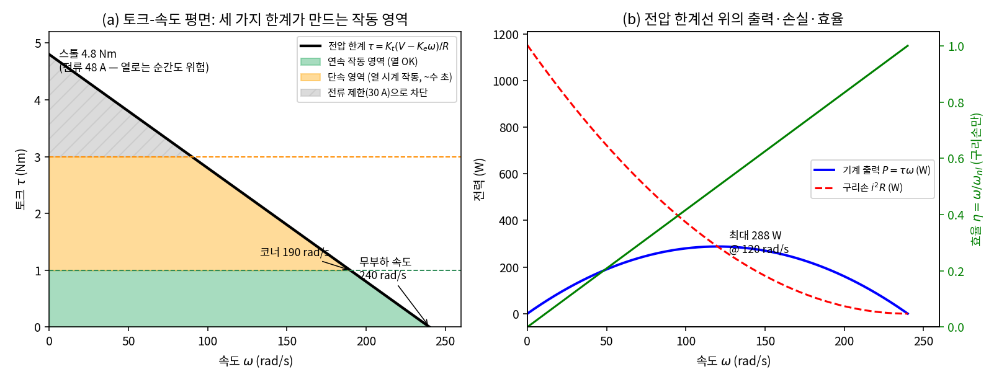
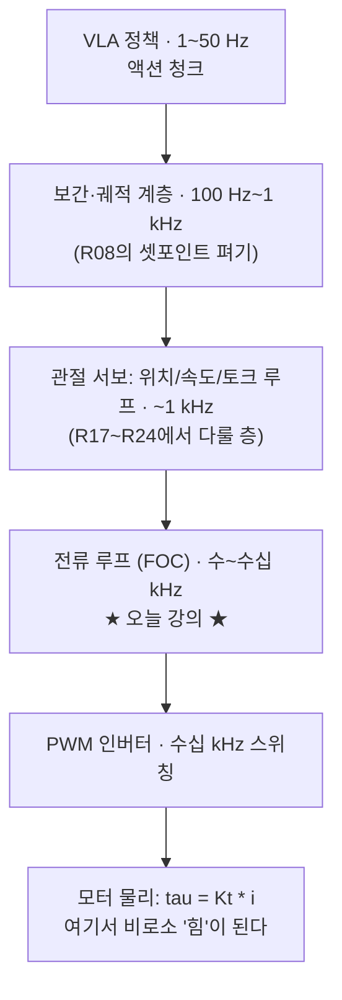
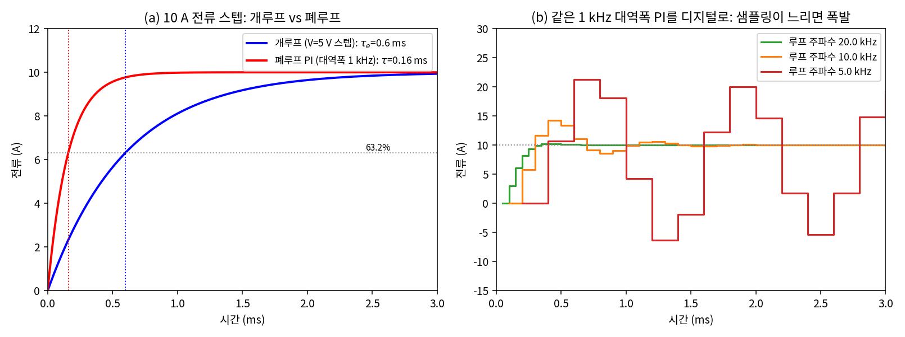
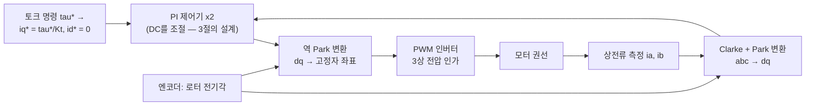
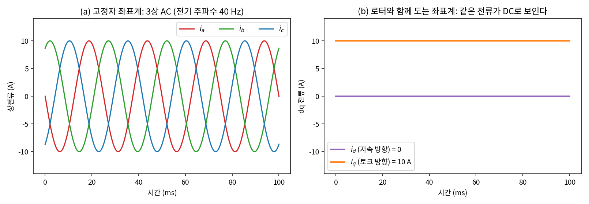
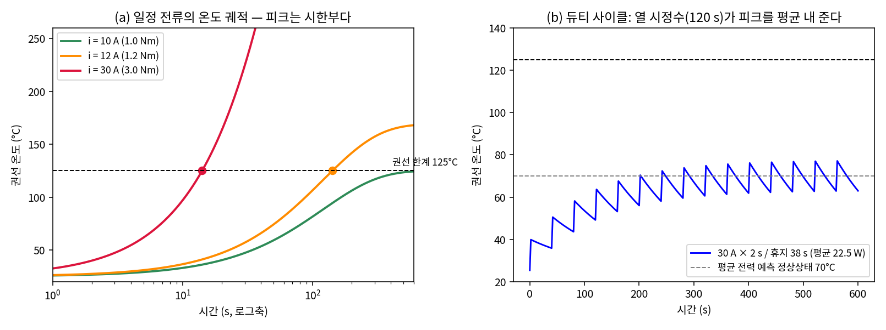

# Lec R14. 전기 모터와 전류 루프 — 힘은 어디서 오는가

> 하위제어 트랙 14일차, Part R4(액추에이터) 1일차. 선수 지식: R10(매니퓰레이터 방정식 — 오늘은 그 우변 $\tau$의 공급처를 연다), R13(시간 척도와 지연의 대가).
> MR은 이 주제를 §8.9(Actuation, Gearing, and Friction) 몇 페이지로 압축한다 — 오늘은 그 몇 페이지를 하루로 펴고, 실물 확인은 오픈소스 FOC 컨트롤러(ODrive·moteus) 문서로 한다(참고문헌).

## 한 장 요약



R10 이후 우리가 $\tau$라고 부르며 마음대로 써 온 숫자는 공짜가 아니다. 모터가 낼 수 있는 토크는 (a)처럼 세 겹의 한계로 잘려 있다: **전압 한계**(우하향 직선 — 빨리 돌수록 역기전력이 전압 예산을 잠식), **열 한계**(연속 1 Nm — 넘으면 시한부), **컨트롤러 전류 제한**(피크 3 Nm). 초록 영역만 무한정 쓸 수 있고, 주황 영역은 "열 시계"가 흐르는 빌린 토크다. (b): 기계 출력의 최대(288 W)는 무부하 속도의 절반에서 나오고 그 점의 효율은 50%다. 오늘 강의는 이 그림의 모든 선을 카탈로그 파라미터 4개($K_t, R, L, V$)에서 손으로 유도한다.

## 학습 목표

1. BLDC/PMSM이 토크를 만드는 원리를 설명하고, 모터 기본식 $\tau = K_t i$, $e = K_e \omega$와 $K_t = K_e$(SI 단위)를 에너지 보존으로 유도할 수 있다.
2. 전기 동역학 $L\frac{di}{dt} = V - Ri - K_e\omega$에서 전기 시정수와 전류 루프 대역폭을 계산하고, **전류 루프가 수~수십 kHz로 돌아야 하는 이유**를 디지털 루프 시뮬레이션으로 보일 수 있다.
3. 카탈로그 파라미터에서 토크-속도 곡선(무부하 속도, 스톨 토크, 코너 속도, 최대 출력)을 유도할 수 있다.
4. 1차 열 모델로 연속/피크 토크를 구분하고, 임의 전류에 대한 과열 도달 시각을 계산할 수 있다.
5. FOC(Field-Oriented Control)의 dq 변환 아이디어 — "회전 좌표계에서는 AC가 DC로 보인다" — 를 설명하고, MuJoCo actuator로 전류 명령 관절을 흉내 낼 수 있다.

## 왜 이 강의가 필요한가

R10에서 매니퓰레이터 방정식 $M\ddot q + C\dot q + g = \tau$를 유도할 때, 우변의 $\tau$는 "제어기가 정해 주는 입력"이었다. 상위 26강의 제어 계층 그림에서도 맨 아래 상자는 "모터 전류 루프"라고만 쓰고 지나갔다. 오늘은 그 최하층을 연다: **토크는 전류다.** VLA가 무슨 액션을 내든, 그것이 물리 세계에 힘으로 나타나는 마지막 관문은 권선에 흐르는 암페어이고, 그 암페어를 명령대로 붙잡는 수~수십 kHz의 루프가 로봇의 "본능 반사"다.

이걸 모르면 실제로 무엇이 안 되는가. (i) 스펙시트의 "피크 토크"만 보고 관절을 설계하면 데모 한 번은 성공하고 연속 운전에서 모터를 태운다 — 연속과 피크를 가르는 것은 **열 시정수**라는 별도의 물리다. (ii) "왜 모터 드라이버는 수십 kHz로 돌면서 관절 제어는 1 kHz인가"라는 상위 26강의 주기 피라미드가 임의의 관습으로 보인다 — 사실은 전기 시정수(ms급)가 강제하는 필연이다. (iii) R16에서 다룰 QDD의 핵심 주장("전류로 토크를 추정한다")과 상위 25강의 "전류∝토크 고유수용"을 평가할 기준이 없다. 좋은 소식: 필요한 물리는 수식 3개가 전부고, 셋 다 1차 선형 시스템이다.

## 본문

### 1. BLDC/PMSM: 자석 주위를 도는 전자석

전류가 흐르는 도선이 자기장 안에 있으면 힘을 받는다(로렌츠 힘 $F = BiL$). 모터는 이 힘을 회전으로 조직화한 기계다: **회전자(rotor)에 영구자석**, **고정자(stator)에 3상 권선**을 두고, 회전자 자석의 위치에 맞춰 고정자 전류의 방향을 계속 바꿔 주면(정류, commutation) 항상 같은 방향의 토크가 나온다.

- **브러시 DC 모터**: 정류를 기계 접점(브러시+정류자)이 한다. 전선 2개에 전압만 걸면 돌아서 간단하지만, 브러시가 마모되고 스파크가 튄다.
- **BLDC/PMSM**: 브러시를 없애고 정류를 **전자적으로**(인버터+로터 각도 센서) 한다. 마모 부품이 없고 열이 고정자(냉각하기 좋은 바깥쪽)에서 나서 로봇 관절의 표준이 됐다. 대가: 로터 각도를 알아야 하고, 3상 전류를 소프트웨어가 조율해야 한다 — 그 소프트웨어가 4절의 FOC다.
- 용어 정리: 역기전력 파형이 사다리꼴이면 BLDC, 정현파면 PMSM으로 구분하는 것이 교과서 관례지만, 로봇용 모터는 대부분 정현파 구동(FOC)을 쓰므로 실무 문헌에서는 두 이름이 섞여 쓰인다. 이 강의의 수식은 둘 모두에 적용된다.

오늘 강의의 위치를 상위 26강의 주기 피라미드에서 다시 확인하자:



안쪽 루프일수록 빠른 이유는 관습이 아니라 각 층이 다루는 물리의 시정수다 — 전류(ms 미만) < 속도(수십 ms) < 위치(수백 ms) < 정책(초). 이 분리 덕분에 바깥 루프는 안쪽 루프를 "즉시 반응하는 이상적 토크원"으로 취급할 수 있다.

**가상 모터 카탈로그** — 오늘 내내 쓸 파라미터(소형 로봇 관절용 모터로 현실적인 자릿수의 가상 값):

| 기호 | 값 | 의미 |
|---|---|---|
| $K_t = K_e$ | 0.1 Nm/A = 0.1 V·s/rad | 토크 상수 = 역기전력 상수 (E1) |
| $R$ | 0.5 Ω | 권선 저항 |
| $L$ | 0.3 mH | 권선 인덕턴스 |
| $V$ | 24 V | 버스(전원) 전압 |
| $i_{cont}$ / $i_{peak}$ | 10 A / 30 A | 연속(열 한계에서 유도, E3) / 피크(드라이버 제한) |
| $R_{th}$, $C_{th}$ | 2.0 K/W, 60 J/K | 권선→주변 열저항, 열용량 |
| $T_{max}$ | 125 °C | 권선 절연 한계 (주변 25 °C) |

### 2. 핵심 수식 E1 — 모터 기본식: $\tau = K_t i$, $e = K_e \omega$, 그리고 $K_t = K_e$

**직관**: 모터는 두 방향으로 작동하는 환전소다. 전류를 넣으면 토크가 나오고($\tau = K_t i$), 돌리면 전압이 나온다($e = K_e \omega$ — 발전기). 놀라운 사실은 두 환율이 **같은 숫자**라는 것: 이건 우연이 아니라 에너지 보존이다.

**물리·기하적 의미**: $\tau = K_t i$는 로렌츠 힘의 총합이다 — 자기장 세기와 권선 배치가 정한 기하 상수 $K_t$에 전류를 곱한 것. 전류를 두 배 흘리면 토크가 정확히 두 배(자기 포화 전까지). 거꾸로 도선이 자기장 속을 움직이면 유도 전압이 생기는데(패러데이), 같은 자석·같은 권선이 만드므로 같은 상수가 나온다. **"전류≈토크"라는 로봇공학의 대전제가 여기서 성립한다** — 힘 센서 없이 전류계만으로 토크를 아는 것(R16의 QDD, 상위 25강)이 가능한 물리적 근거다.

**형식**: 입력 전력의 수지를 쓰면

$$
\underbrace{Vi}_{\text{입력}} = \underbrace{i^2R}_{\text{열}} + \underbrace{\tfrac{d}{dt}\left(\tfrac{1}{2}Li^2\right)}_{\text{자기장 저장}} + \underbrace{e\,i}_{\text{기계로 변환}}
$$

기계로 변환된 전력은 $\tau\omega$이므로 $e\,i = \tau\,\omega$. 여기에 $\tau = K_t i$, $e = K_e \omega$를 대입하면 $K_e \omega i = K_t i \omega$, 즉

$$
\boxed{K_t = K_e} \quad \text{(SI 단위에서, 손실 항은 이미 분리했으므로)}
$$

단위로도 확인된다: $\mathrm{V\cdot s/rad} = \mathrm{kg\,m^2/(A\,s^2)} = \mathrm{Nm/A}$. **카탈로그 단위 함정**: 우리 모터의 $K_e = 0.1$ V·s/rad는 카탈로그에서 10.47 V/krpm, 또는 속도 상수 $K_v = 1/K_e = 95.5$ rpm/V로 표기되곤 한다. 드론 모터의 "$K_v$ 2000"은 $K_e$가 작다(= $K_t$도 작다 — 고속·저토크)는 뜻이다. 단위만 SI로 통일하면 $K_t = K_e$는 항상 성립한다.

### 3. 핵심 수식 E2 — 전기 동역학: 전류 루프가 kHz급인 이유

**직관**: 권선은 저항 $R$과 인덕터 $L$의 직렬 회로다. 인덕터는 전류의 관성이라서, 전압을 걸어도 전류는 **즉시** 뛰지 않고 시정수 $\tau_e = L/R$로 차오른다. 게다가 모터가 돌고 있으면 역기전력 $K_e\omega$가 전압 예산을 먼저 깎아먹는다. 전류를 "명령대로" 붙잡으려면 이 1차 시스템을 아주 빠른 피드백으로 조여야 한다.

**물리·기하적 의미**: $\tau_e = L/R = 0.3\text{mH}/0.5\,\Omega = 0.6$ ms. 즉 전류(=토크)는 밀리초 미만의 세계에 산다 — 기계 시정수(로터 관성이 정하는 속도 응답, $\tau_m = JR/K_tK_e$, 로터 관성 $2\times10^{-4}\,\mathrm{kg\,m^2}$이면 10 ms)보다 한 자릿수 이상 빠르다. 이 **시간 척도 분리**가 계층 제어의 토대다: 전류 루프가 충분히 빠르면, 위 계층(R17~)은 "토크는 즉시 나온다"고 가정해도 된다. 역기전력 항은 실전 감각으로 중요하다: $\omega = 200$ rad/s로 도는 중에 10 A를 흘리려면 $V = Ri + K_e\omega = 5 + 20 = 25$ V — **24 V 버스로는 부족하다.** 고속에서 토크가 죽는 전압 한계(한 장 요약의 우하향 직선)가 바로 이것이다.

**형식**: 권선 회로의 KVL(전압 법칙):

$$
L\frac{di}{dt} = V - Ri - K_e\omega
$$

(1) **정상상태**($di/dt = 0$)에서 $i = (V - K_e\omega)/R$이므로 전압 한계 토크-속도 곡선은

$$
\tau(\omega) = \frac{K_t}{R}\left(V - K_e\omega\right)
$$

— $\omega = 0$에서 스톨 토크 $K_tV/R$, $\tau = 0$에서 무부하 속도 $V/K_e$를 잇는 직선(WE-1에서 수치화).

(2) **동적으로**는 $\omega$가 천천히 변한다고 보면($\tau_m \gg \tau_e$) 전달함수 $i(s)/V(s) = \frac{1}{Ls+R}$의 1차계다. PI 제어기 $C(s) = K_p + K_i/s$에서 $K_p/K_i = L/R$로 잡으면 제어기 영점이 플랜트 극점을 상쇄(pole-zero cancellation)하여 개루프가 $K_p/(Ls)$의 순수 적분기가 되고, 폐루프는 대역폭 $\omega_{bw} = K_p/L$의 깨끗한 1차계가 된다. 목표 대역폭 1 kHz라면 $K_p = L\omega_{bw} = 1.885$ V/A, $K_i = R\omega_{bw} = 3142$ V/(A·s).

(3) **디지털 현실이 kHz를 강제한다**: 컨트롤러는 이산 시간으로 돌고, 측정→연산→PWM 갱신에 최소 1샘플 지연이 낀다. 지연 $T_s$는 대역폭 주파수에서 위상을 $\omega_{bw}T_s$만큼 깎는다 — 1 kHz 대역폭 기준으로 루프 주파수 20 kHz면 18°(괜찮다), 10 kHz면 36°(출렁댄다), 5 kHz면 72°(위상여유 18° — 발진 직전)다. WE-2에서 이 셋을 실제로 돌려 본다. **전류 루프가 수~수십 kHz인 것은 사치가 아니라, ms 미만의 전기 시정수를 상대로 위상여유를 지키기 위한 최소 요건이다.** ODrive·moteus 같은 오픈소스 FOC 컨트롤러가 이 층을 펌웨어로 구현해 공개하고 있다 [2][3].



(a): 개루프(전압 스텝)로는 $\tau_e = 0.6$ ms의 자연 응답이 전부지만, PI 폐루프는 대역폭을 1 kHz(시정수 0.16 ms)로 끌어올린다. (b): **같은 게인**의 PI를 디지털 루프로 돌리면 — 20 kHz는 명령을 거의 그대로 따르고, 10 kHz는 42% 오버슛, 5 kHz는 발진한다. 물리도 게인도 같고 샘플링만 다르다.

### 4. FOC: 회전 좌표계에서는 AC가 DC다 (개념 수준)

3절까지는 "권선 하나"처럼 말했지만 실제로는 3상(a, b, c)이고, 로터가 도는 동안 각 상에 흘려야 할 전류는 로터 각도의 정현파다 — 즉 제어 대상이 **시변 AC**다. 40 Hz로 출렁이는 3개의 정현파를 각각 PI로 추종하는 것은 나쁜 문제 설정이다(PI는 일정한 목표에 강하다).

FOC의 아이디어는 좌표 변환 한 방이다: **로터에 올라타서 보라.** 로터와 함께 도는 직교 좌표계(d축 = 자석 방향, q축 = 그 90° 앞)에서 보면, 잘 정류된 3상 AC는 **상수 두 개**로 보인다 — $i_d$(자속 방향 성분, 토크에 기여 없음 → 0으로 유지)와 $i_q$(토크 방향 성분, $\tau = K_t i_q$). AC 추종 문제가 DC 조절 문제로 바뀌므로 3절의 PI 설계가 그대로 먹힌다.



변환 자체가 정의다 — 코드 6줄로 확인하자 (그림 4를 만든 계산):

```python
import numpy as np
f_e = 40.0; t = np.linspace(0, 0.1, 2000); th = 2*np.pi*f_e*t; I = 10.0
ia = -I*np.sin(th); ib = -I*np.sin(th - 2*np.pi/3); ic = -I*np.sin(th + 2*np.pi/3)
ial = (2/3)*(ia - 0.5*ib - 0.5*ic); ibe = (ib - ic)/np.sqrt(3)   # Clarke: 3상 → 직교 2상
i_d = ial*np.cos(th) + ibe*np.sin(th)                            # Park: 로터 각도만큼 회전
i_q = -ial*np.sin(th) + ibe*np.cos(th)
print(f"id = {i_d.mean():.3f} A (변동 {i_d.std():.1e}), iq = {i_q.mean():.3f} A")
```

출력: `id = -0.000 A (변동 3.8e-15), iq = 10.000 A` — 40 Hz로 출렁이던 3상이 회전 좌표계에서 수치 오차 수준의 변동만 남기고 정확히 DC 10 A가 된다.



부호만 챙겨 두자: 전기각 = 극쌍수 × 기계각이므로(극쌍수는 수~수십), 고속 회전 시 전기 주파수는 수백 Hz~kHz까지 올라간다 — 전류 루프가 수십 kHz여야 하는 또 하나의 이유다. dq 변환의 상세(Clarke/Park의 유도, SVPWM, 약자속 제어)는 이 커리큘럼 범위 밖이며, 우리 수준에서는 "FOC 덕분에 **토크 명령 $\tau^*$ → $i_q^* = \tau^*/K_t$ → 수십 µs 뒤 실제 토크**라는 깨끗한 인터페이스가 성립한다"까지만 알면 위 계층(R17~R24)을 전부 세울 수 있다.

### 5. 핵심 수식 E3 — 열 한계: $P = i^2R$과 두 개의 토크 정격

**직관**: 토크의 진짜 상한은 자석도 전자도 아니라 **온도**다. 전류는 권선을 $i^2R$로 데우고, 절연 코팅은 대략 125~155 °C에서 죽는다. 열은 곧바로 치명적이지 않고 **천천히 쌓이므로**, 모터에는 토크 정격이 두 개다: 영원히 버티는 **연속** 정격과, 열이 차오르는 동안만 빌려 쓰는 **피크** 정격.

**물리·기하적 의미**: 권선 온도는 전기 회로와 완전히 동형인 1차 시스템이다 — 열용량 $C_{th}$가 커패시터, 열저항 $R_{th}$가 저항, $i^2R$이 전류원. 시정수 $\tau_{th} = R_{th}C_{th} = 120$ s. 전기 시정수 0.6 ms와 **20만 배** 차이 나는 이 분리가 "피크 토크"라는 개념을 만든다: 열의 시계로는 몇 초의 과부하가 "순간"이다. 그리고 $P = i^2R$의 **제곱**이 가혹하다 — 토크 2배는 열 4배, 토크 3배는 열 9배다.

**형식**:

$$
C_{th}\frac{dT}{dt} = i^2R - \frac{T - T_{amb}}{R_{th}}
$$

(1) **연속 정격**: 정상상태($dT/dt=0$)에서 $\Delta T = i^2R\,R_{th} \le T_{max} - T_{amb}$이므로

$$
i_{cont} = \sqrt{\frac{T_{max} - T_{amb}}{R_{th}\,R}} = \sqrt{\frac{100}{2.0 \times 0.5}} = 10\ \mathrm{A} \;\;(= 1.0\ \mathrm{Nm})
$$

(2) **피크의 시한**: 일정 전류 $i$를 흘릴 때 온도는 $T(t) = T_{amb} + \Delta T_{ss}(1 - e^{-t/\tau_{th}})$, $\Delta T_{ss} = i^2RR_{th}$로 오르므로, 한계 도달 시각은

$$
t_{lim} = \tau_{th}\,\ln\frac{\Delta T_{ss}}{\Delta T_{ss} - (T_{max}-T_{amb})}
$$

30 A(3 Nm)이면 $\Delta T_{ss} = 900$ K → $t_{lim} = 120\ln(900/800) = 14.1$ s. 스톨 전류 48 A라면 5.3 s. **피크 토크란 "몇 초짜리 예산"의 다른 이름이다.** (3) 정밀하게는 구리 저항 자체가 온도에 오른다(+0.39%/K — 100 K 상승이면 $R$이 약 1.4배)는 양성 피드백까지 있어 실제 여유는 계산보다 더 짧다.



(a): 10 A는 영원히 버틴다 — 정상상태가 정의상 정확히 한계 125 °C에 점근하며 넘지 않는다(600 s 시뮬 시점 124.3 °C). 반면 12 A는 142 s, 30 A는 14 s 만에 한계에 닿는다. (b): 30 A를 2 s 쓰고 38 s 쉬는 듀티 사이클은 평균 전력 22.5 W로 정상상태 약 70 °C — **열 시정수가 피크를 평균 내 준다.** 로봇 관절이 순간적으로 큰 토크(충격 흡수, 들어올리기 시작)를 내고도 사는 이유이자, "평균 부하율"이 모터 선정의 실전 변수인 이유다.

### Worked Example

세 예제 모두 위 카탈로그 파라미터를 쓴다.

#### WE-1 (손 + 코드): 카탈로그에서 토크-속도 곡선 뽑기

**손계산** (E2의 정상상태식에서):

- 무부하 속도: $\omega_{nl} = V/K_e = 24/0.1 = 240$ rad/s (= 2292 rpm)
- 스톨 전류·토크: $i_{st} = V/R = 48$ A, $\tau_{st} = K_t i_{st} = 4.8$ Nm — 단 열로는 5.3 s짜리(E3), 드라이버가 30 A에서 자르므로 실제로는 도달 불가
- 코너 속도(연속 토크 1 Nm이 전압 한계와 만나는 점): $\tau(\omega_c) = 1$ → $\omega_c = (V - \tau_{cont}R/K_t)/K_e = (24-5)/0.1 = 190$ rad/s
- 최대 기계 출력: $P = \tau(\omega)\,\omega$는 $\omega = \omega_{nl}/2 = 120$ rad/s에서 최대 $P_{max} = V^2/(4R) = 288$ W. 이때 전류는 24 A(연속 한계의 2.4배!) — **최대 출력점은 열적으로 지속 불가능하다.** 카탈로그의 "정격 출력"이 최대 출력보다 한참 작은 이유.

**검증 코드**:

```python
import numpy as np
Kt = Ke = 0.1; R = 0.5; L = 0.3e-3; V = 24.0

w_nl = V/Ke                          # 무부하 속도
i_st = V/R; tau_st = Kt*i_st         # 스톨 전류·토크
w = np.linspace(0, w_nl, 100001)
tau_v = Kt*(V - Ke*w)/R              # 전압 한계선 (E2의 정상상태)
P = tau_v*w
print(f"무부하 {w_nl:.0f} rad/s ({w_nl*60/2/np.pi:.0f} rpm), 스톨 {i_st:.0f} A = {tau_st:.1f} Nm")
print(f"코너 속도 = {(V - 1.0*R/Kt)/Ke:.0f} rad/s")
print(f"P_max = {P.max():.1f} W @ {w[P.argmax()]:.1f} rad/s (이론 V^2/4R = {V**2/4/R:.0f} W)")
```

출력: `무부하 240 rad/s (2292 rpm), 스톨 48 A = 4.8 Nm` / `코너 속도 = 190 rad/s` / `P_max = 288.0 W @ 120.0 rad/s` — 전부 손계산과 일치. 그림 1이 이 코드의 시각화다.

#### WE-2 (손 + 코드): 전류 스텝 응답 — 루프 주파수가 운명을 가른다

**손계산**: $\tau_e = L/R = 0.6$ ms → 개루프 대역폭 $1/(2\pi\tau_e) = 265$ Hz. 목표 폐루프 대역폭 1 kHz로 극영점 상쇄 PI를 설계하면 $K_p = L\cdot 2\pi\cdot1000 = 1.885$ V/A, $K_i = R\cdot 2\pi\cdot1000 = 3142$ V/(A·s). 1샘플 지연의 위상 손실(대역폭 1 kHz 기준): 20 kHz → $2\pi\cdot1000/20000 = 0.314$ rad = 18°, 10 kHz → 36°, 5 kHz → 72°(위상여유가 90°−72° = 18°만 남는다 — 발진 직전).

**검증 코드** (ZOH 정확 이산화 + 1샘플 연산·PWM 지연 + anti-windup — 실제 펌웨어 루프의 최소 골격):

```python
tau_e = L/R
w_bw = 2*np.pi*1000                  # 목표 폐루프 대역폭 1 kHz
Kp, Ki = L*w_bw, R*w_bw              # 극영점 상쇄 튜닝
print(f"tau_e = {tau_e*1e3:.1f} ms, Kp = {Kp:.3f} V/A, Ki = {Ki:.0f} V/(A s)")

def digital_loop(fs, i_ref=10.0, t_end=3e-3):
    Ts = 1/fs; a = np.exp(-Ts/tau_e)         # ZOH 정확 이산화
    i = acc = v_apply = 0.0; hist = []
    for k in range(int(t_end/Ts)):
        e = i_ref - i
        v = Kp*e + Ki*acc
        if abs(v) <= V: acc += e*Ts          # 조건부 적분 (anti-windup)
        v = np.clip(v, -V, V)
        i = a*i + (1-a)*v_apply/R            # 플랜트 한 스텝 (이전 샘플의 전압이 걸린다)
        v_apply = v                          # 1샘플 연산+PWM 지연
        hist.append(i)
    return np.array(hist)

for fs in [20000, 10000, 5000]:
    h = digital_loop(fs)
    print(f"루프 {fs/1000:>4.0f} kHz: 최대 {h.max():5.2f} A, 최종 {h[-1]:5.2f} A")
```

출력: `20 kHz: 최대 10.21 A, 최종 10.00 A` / `10 kHz: 최대 14.23 A(오버슛 42%), 최종 10.00 A` / `5 kHz: 최대 21.26 A, 최종 19.14 A(발진 지속)` — 손계산의 위상여유 예측과 정확히 같은 서열이다. 그림 2(b)가 이 코드다. **같은 물리, 같은 게인 — 샘플링만으로 안정↔발진이 갈린다.** R13에서 "지연은 지수로 비싸다"고 했던 것의 전기 버전이고, 상용 드라이버가 전류 루프를 수십 kHz에 두는 이유다.

#### WE-3 (손 + 코드): 연속 vs 피크 — 열 시계 읽기

**손계산** (E3): $i_{cont} = \sqrt{100/(2.0\times0.5)} = 10$ A (= 1.0 Nm), $\tau_{th} = 120$ s.

- 12 A (1.2 Nm — 연속의 겨우 1.2배): $\Delta T_{ss} = 144$ K → 정상상태 169 °C(한계 초과) → $t_{lim} = 120\ln\frac{144}{144-100} = 142.3$ s. **2분 뒤에 죽는 토크다.**
- 30 A (3.0 Nm): $\Delta T_{ss} = 900$ K → $t_{lim} = 120\ln\frac{900}{800} = 14.1$ s.

**검증 코드**:

```python
Rth, Cth, T_amb, T_max = 2.0, 60.0, 25.0, 125.0
i_cont = np.sqrt((T_max - T_amb)/(Rth*R)); tau_th = Rth*Cth
print(f"i_cont = {i_cont:.1f} A (= {Kt*i_cont:.1f} Nm), tau_th = {tau_th:.0f} s")
for iA in [12, 30]:
    dTss = iA**2*R*Rth                       # 정상상태 온도 상승 (한계 무시 시)
    t_lim = tau_th*np.log(dTss/(dTss - (T_max - T_amb)))
    print(f"{iA:>2d} A ({Kt*iA:.1f} Nm): 정상상태 {T_amb+dTss:.0f}°C → 125°C까지 {t_lim:.1f} s")
```

출력: `i_cont = 10.0 A (= 1.0 Nm), tau_th = 120 s` / `12 A: 정상상태 169°C → 125°C까지 142.3 s` / `30 A: 정상상태 925°C → 125°C까지 14.1 s`. 그림 3(a)의 수치 시뮬(오일러 적분)도 같은 값(142.2 s, 14.2 s)을 준다 — 폐형해와 시뮬이 상호 검증된다.

### 딥러닝 배경자를 위한 번역

- **$K_t$는 학습되지 않는 선형 레이어 하나다** — bias 없는 1×1 linear: 전류 → 토크, 가중치는 자석과 권선 기하가 "훈련"해 놓았다. VLA 스택 전체에서 유일하게 오차 없이 신뢰할 수 있는 사상에 가깝다(포화·마찰 전까지). "전류≈토크"가 R16의 센서리스 힘 추정과 상위 25강의 고유수용 감각의 근거다.
- **전류 루프는 스택의 "본능 반사"다** — VLA가 대뇌(수백 ms)라면 전류 루프는 척수 반사(수십 µs). 위 계층이 무엇을 하든 이 루프는 자기 지역 목표(전류 명령 추종)를 독립적으로, 수십 kHz로 지킨다. 계층별 주기가 다른 시스템 = 서로 다른 클럭의 중첩 제어 루프라는 관점은 상위 24강 Helix의 S2/S1/S0 3계층과 정확히 같은 구도다.
- **연속/피크 토크 = GPU의 base/boost clock** — 순간 성능은 열용량(히트싱크가 차오르는 동안)을 빌려 쓰는 것이고, TDP(= $i^2R$의 시간 평균)가 지속 성능을 정한다. 벤치마크(데모 영상) 성능과 지속 운전 성능이 다른 이유까지 평행하다.
- **dq 변환은 "좋은 좌표계가 문제를 선형으로 만든다"의 교과서 사례다** — 시변 AC 추종이 회전 좌표계에서 정지 DC 조절이 된다. 입력을 whitening하면 최적화가 쉬워지는 것, 또는 RoPE가 위상 회전으로 상대 위치를 다루는 것과 같은 수학(회전 행렬)이다 — 표현을 바꾸는 것만으로 뒤에 오는 알고리즘(PI ↔ SGD)이 단순해진다.

## 흔한 오해

1. **"모터 토크 정격은 하나다"** — 최소 세 개다: 스톨(4.8 Nm — 전압이 허락하는 순간 최대, 열로는 몇 초), 피크(3.0 Nm — 드라이버 제한, 14 s 예산), 연속(1.0 Nm — 영원히). 스펙시트의 큰 숫자만 보고 관절을 설계하면 데모는 되고 제품은 안 된다. 어느 정격이 얼마짜리 시간 예산인지는 E3의 $t_{lim}$ 공식으로 항상 계산할 수 있다.
2. **"전류 루프가 수십 kHz인 것은 모터가 빨리 돌아서다"** — 회전 속도(수십 Hz)가 아니라 **전기 시정수(0.6 ms)와 디지털 지연의 위상 비용**이 강제한다(WE-2). 시간 척도를 혼동하지 말 것: 전기 $\tau_e$ = 0.6 ms ≪ 기계 $\tau_m$ ≈ 10 ms ≪ 열 $\tau_{th}$ = 120 s — 이 세 층이 각각 전류 루프 주파수, 속도 루프 주파수, 토크 정격이라는 서로 다른 설계 결정을 지배한다.
3. **"브러시리스라서 제어가 간단하다"** — 반대다. 브러시 DC는 기계가 정류를 공짜로 해 주는 대신 마모되고, BLDC/PMSM은 마모가 없는 대신 정류를 소프트웨어(FOC: 각도 센서 + 좌표 변환 + PI ×2 + PWM)가 매 수십 µs마다 해야 한다. "간단한 하드웨어 = 복잡한 소프트웨어"의 표준 트레이드오프다.
4. **"$K_t$와 $K_e$는 별개 스펙이다"** — SI 단위로 같은 숫자다(E1 — 에너지 보존). 카탈로그에서 달라 보이는 것은 단위(Nm/A vs V/krpm vs rpm/V) 때문이다. 이 등식은 검산 도구로도 쓴다: 카탈로그의 $K_t$와 $K_v$를 SI로 환산해 $K_t K_v \ne 1$이면 두 값 중 하나는 다른 조건(상전류 정의, 사다리꼴 구동)으로 잰 것이다.

## 실습 (1.5~2시간)

**가상 모터 선정 + MuJoCo 전류 명령 관절.** 요구사항: 무릎 관절, 연속 토크 30 Nm @ 관절 속도 3 rad/s. 우리 카탈로그 모터(연속 1 Nm)에 감속비 $n$을 붙여 충족시켜 보라.

1. **감속비 후보 검토** (손계산, 30분): $n \in \{10, 30, 50\}$에 대해 4가지를 점검하라 — 모터측 필요 토크 $30/n$, 필요 전류와 열(연속 10 A 이내?), 모터 속도 $3n$(코너 190 rad/s 이내?), 전압 한계 토크 여유(E2 직선에서).
   - $n=10$: 3 Nm = 30 A 연속 필요 → 열 불가(전압은 가능 — "전압이 아니라 열이 먼저 막는다"를 확인).
   - $n=30$: 1 Nm = 10 A — 정확히 연속 한계, 마진 0. 모터 90 rad/s < 190 OK.
   - $n=50$: 0.6 Nm = 6 A(18 W → 정상상태 61 °C) — 열 여유 확보. 모터 150 rad/s < 190 OK. **단** 반사 관성이 $n^2 J_m$으로 2500배가 된다는 대가는 R15에서 계산한다(예고).
2. **MuJoCo 관절에 모터 달기** (40분): 아래 모델에서 `ctrl`을 "모터축 토크 $K_t i$", `gear`를 감속비로 해석하면 MuJoCo `motor` 액추에이터가 그대로 이상적 전류 루프가 된다(전류 루프 시정수 0.16 ms ≪ 시뮬 타임스텝 1 ms이므로 "즉시 반응" 가정이 정당하다는 것 — 오늘 배운 시간 척도 분리 — 도 확인하라):

```xml
<mujoco model="knee">
  <option timestep="0.001" gravity="0 0 -9.81"/>
  <worldbody>
    <body name="shank" pos="0 0 0.5">
      <joint name="knee" type="hinge" axis="0 1 0" damping="0.5"/>
      <geom type="capsule" fromto="0 0 0  0 0 -0.4" size="0.04" density="2000"/>
      <body name="load" pos="0 0 -0.4"><geom type="sphere" size="0.06" mass="8.0"/></body>
    </body>
  </worldbody>
  <actuator>
    <!-- ctrl = 모터축 토크 = Kt * i [Nm], gear = 감속비 n=30, ctrlrange = 피크 ±30 A -->
    <motor name="m" joint="knee" gear="30" ctrlrange="-3 3"/>
  </actuator>
</mujoco>
```

위 XML을 `knee.xml`로 저장하고:

```python
import numpy as np, mujoco
m = mujoco.MjModel.from_xml_path("knee.xml"); d = mujoco.MjData(m)
Kt, R, Rth, Cth, T_amb = 0.1, 0.5, 2.0, 60.0, 25.0
d.qpos[0] = np.pi/2; mujoco.mj_forward(m, d)
print("수평 자세 중력 토크:", d.qfrc_bias[0])        # ≈ 40.3 Nm
kp, kd, q_ref, T = 8.0, 1.0, np.pi/2, T_amb           # 모터축 단위 PD + 열 시계
for k in range(int(120/m.opt.timestep)):
    d.ctrl[0] = np.clip(kp*(q_ref - d.qpos[0]) - kd*d.qvel[0], -3, 3)
    mujoco.mj_step(m, d)
    i = d.ctrl[0]/Kt                                   # 전류 = 모터 토크 / Kt
    T += m.opt.timestep/Cth*(i**2*R - (T - T_amb)/Rth) # E3를 온라인 적분
print(f"유지 전류 {d.ctrl[0]/Kt:.1f} A, 120 s 후 권선 {T:.1f} °C")
```

   실행하면: 중력 토크 40.3 Nm(요구 30 Nm보다 크다 — 부하 8 kg 공이 만든 상황), 수평 유지 전류 약 13.3 A로 연속 한계 초과, 온도는 약 101 s에 125 °C를 뚫고 120 s에 136 °C. **$n=30$ 설계는 이 자세를 2분도 못 버틴다.**
3. **설계 수정 실험** (30분): (a) `gear="50"`으로 바꾸면 유지 전류가 약 8 A로 떨어져 열이 안정됨을 확인하라(정상상태 예측 90 °C — E3로 손계산 후 대조). (b) `q_ref`를 수직 근처(중력 팔 축소)로 바꾸면 $n=30$도 생존하는가? (c) PD만으로는 정착 오차가 ~9.5° 남는다 — 왜인가? (중력 처짐. 적분항/중력 보상은 R17·R19에서) (d) (심화) `ctrl`에 E2의 1차 지연(τ=0.16 ms)을 흉내 내는 필터를 끼워 넣고 응답이 달라지는지 확인 — 달라지지 않는다면 그것이 바로 시간 척도 분리다.
4. **열 시계 일반화** (20분): 임의의 관절 궤적(사인파 추종 등)에서 $i(t)$를 기록해 E3로 온도를 적분하고, "이 태스크를 무한 반복할 수 있는가"를 판정하는 함수 `is_thermally_sustainable(i_trace)`를 작성하라 — 판정 기준이 순간 최대가 아니라 **$i^2$의 시간 평균**임을 확인하라(그림 3(b)).

## Claude와 토론할 질문

1. $K_t = K_e$ 유도(E1)에서 손실 항을 분리하는 단계가 왜 필수인가? 철손·마찰까지 뭉뚱그리면 "겉보기 $K_t$"는 어느 쪽으로 왜곡되는가?
2. 역기전력은 적인가 아군인가 — 고속 토크를 깎는 항이면서(E2), 감속 시에는 모터를 발전기로 만들어 에너지를 회수(회생 제동)하게 한다. 로봇 관절에서 회생 에너지는 어디로 가야 하나? (버스 전압 상승, 제동 저항)
3. 전류 루프 대역폭을 10 kHz로 올리면 무엇이 좋아지고 무엇이 나빠지는가? (PWM 리플과 전류 측정 노이즈의 증폭, 스위칭 손실, 그리고 "위 계층이 그 대역폭을 쓸 일이 있는가")
4. "전류≈토크"는 어디서 깨지는가 — 감속기 마찰(R15), 코깅 토크, 자기 포화, 철손을 각각 "$\tau = K_t i$에 대한 어떤 종류의 오차"로 분류해 보라. R16의 QDD가 이 등식을 지키기 위해 무엇을 포기하는지 예측해 보라.
5. 열 시정수 120 s는 학습 정책에게 무엇을 의미하는가? 10초짜리 에피소드로 평가한 정책이 1시간 연속 운전에서 실패할 수 있는 메커니즘을 설명하고, "권선 온도를 정책의 관측에 넣어야 하는가"를 논하라.
6. 전류 루프가 µs급으로 빠르다는 사실이 상위 26강의 지연 예산 문제를 해결해 주지 않는 이유는? (병목은 어느 층인가 — VLA 추론 지연과 전류 루프 지연의 자릿수 비교)
7. 로봇이 벽을 계속 미는 상황($\omega = 0$, $\tau \ne 0$): 기계 출력은 0인데 전력 소모는 최대이고 효율은 0%다. 파지(그리퍼 유지력)가 왜 열 설계를 지배하는 태스크인지, 그리고 이것이 저전력 유지 메커니즘(웜기어, 래칭)의 존재 이유임을 설명하라.

## 읽을거리

1. **MR §8.9** (~30분): DC 모터 모델·기어링·마찰의 교과서 압축판. 오늘 수식이 어떻게 관절 동역학(Ch.8 본문)과 결합되는지의 관점으로 읽기. §8.9.1(모터 모델)까지면 충분, 기어링 절은 R15 예습.
2. **ODrive 공식 문서** (docs.odriverobotics.com, ~30분): 오픈소스 FOC 드라이버가 사용자에게 노출하는 파라미터들(전류 제한, 토크 상수, 열 보호)이 오늘 수식과 1:1로 대응함을 확인. 튜토리얼 구조만 훑고 세부 설정값은 넘어가기.
3. **mjbots moteus 저장소** (github.com/mjbots/moteus, ~15분): 보드·펌웨어가 전부 공개된 FOC 컨트롤러 — README와 문서 목차만 훑으며 "전류 루프가 실물에서 어떤 층에 사는지" 감 잡기. 족형 로봇 커뮤니티에서 QDD 관절(R16)의 표준 부품으로 쓰인다.

## 자가 점검

1. $K_t = K_e$를 에너지 보존으로 3줄 안에 유도할 수 있는가? 카탈로그의 $K_v$(rpm/V)에서 $K_t$를 환산할 수 있는가?
2. 카탈로그 값 $(K_t, R, V)$만으로 무부하 속도·스톨 토크·최대 출력($V^2/4R$)을 암산할 수 있는가?
3. 세 시정수($\tau_e$ = 0.6 ms, $\tau_m$ ≈ 10 ms, $\tau_{th}$ = 120 s)가 각각 어떤 설계 결정(전류 루프 주파수 / 속도 루프 / 토크 정격)을 지배하는지 말할 수 있는가?
4. "30 A 피크를 몇 초 쓸 수 있는가"를 E3의 $t_{lim}$ 공식으로 계산할 수 있는가? (답: $120\ln(900/800) \approx 14$ s)
5. dq 변환이 무엇을 DC로 만드는지, 그 덕에 왜 PI 두 개로 충분해지는지 설명할 수 있는가?

## 참고문헌

> 웹 문서는 2026-07-08 접속 기준.

[1] K. Lynch, F. Park, "Modern Robotics: Mechanics, Planning, and Control," Cambridge Univ. Press, 2017. 무료 PDF: https://hades.mech.northwestern.edu/images/7/7f/MR.pdf
— **뒷받침**: §8.9 — DC 모터 기본식($\tau = K_t i$, 역기전력, 전기 회로 방정식), 토크-속도 곡선, 스톨 토크·무부하 속도 개념, 기어링(R15 예고)의 표준 참고.

[2] ODrive Robotics, ODrive 공식 문서. https://docs.odriverobotics.com
— **뒷받침**: 오픈소스 FOC 모터 컨트롤러의 실물 사례 — 전류 제한·토크 상수·열 보호가 사용자 파라미터로 노출된다는 본문·읽을거리의 서술(구체 수치는 인용하지 않음).

[3] mjbots, moteus 브러시리스 서보 컨트롤러 (오픈소스 하드웨어·펌웨어). https://github.com/mjbots/moteus
— **뒷받침**: FOC 전류 루프가 펌웨어 층으로 구현·공개되어 있다는 본문 서술과 읽을거리 3(구체 수치는 인용하지 않음).

[4] K. J. Åström, R. M. Murray, "Feedback Systems: An Introduction for Scientists and Engineers," 2nd ed., Princeton Univ. Press. 무료 PDF: https://fbswiki.org
— **뒷받침**: E2의 1차계 PI 설계(극영점 상쇄)와 지연의 위상 비용(WE-2의 위상여유 논증)의 교과서 근거 — PID Control 장·Frequency Domain 장(R17에서 본격 사용).

[5] Google DeepMind, MuJoCo 문서. https://mujoco.readthedocs.io
— **뒷받침**: 실습의 `actuator/motor`·`gear`·`ctrlrange` 의미(액추에이터 전달 모델). 본 강의에서 실행·검증함.

*본문·그림의 수치(WE-1의 무부하 240 rad/s·스톨 4.8 Nm·코너 190 rad/s·최대 출력 288 W, WE-2의 $\tau_e$ = 0.6 ms·$K_p$ = 1.885·$K_i$ = 3142·루프 20/10/5 kHz의 최대 전류 10.21/14.23/21.26 A, WE-3의 $i_{cont}$ = 10 A·$t_{lim}$ = 142.3/14.1 s·듀티 사이클 평균 22.5 W와 시뮬 피크 77.1 °C, FOC 검증 $i_d$ = 0·$i_q$ = 10 A, 실습의 중력 토크 40.3 Nm·유지 전류 13.3 A·125 °C 도달 ~101 s)는 모두 본문 코드 블록과 `images/lecR14/gen_figs.py`의 실행 출력이다 — numpy 1.26 / scipy 1.15 / mujoco 3.2.5 기준 재현 확인.*
