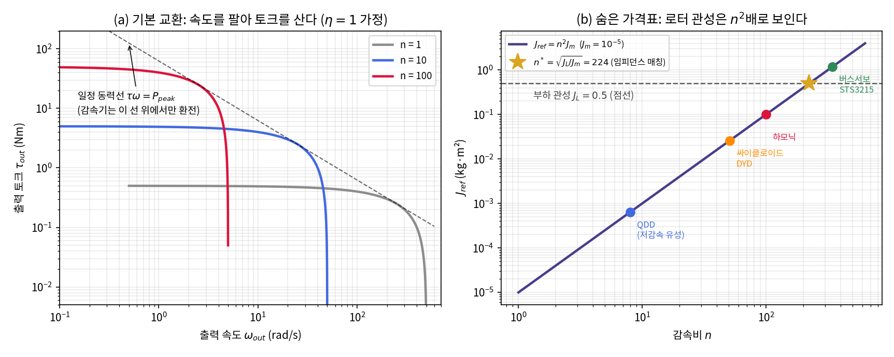
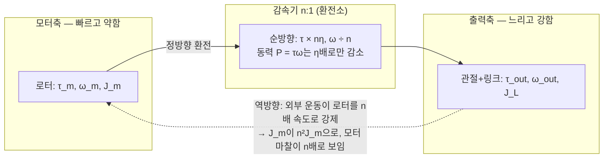
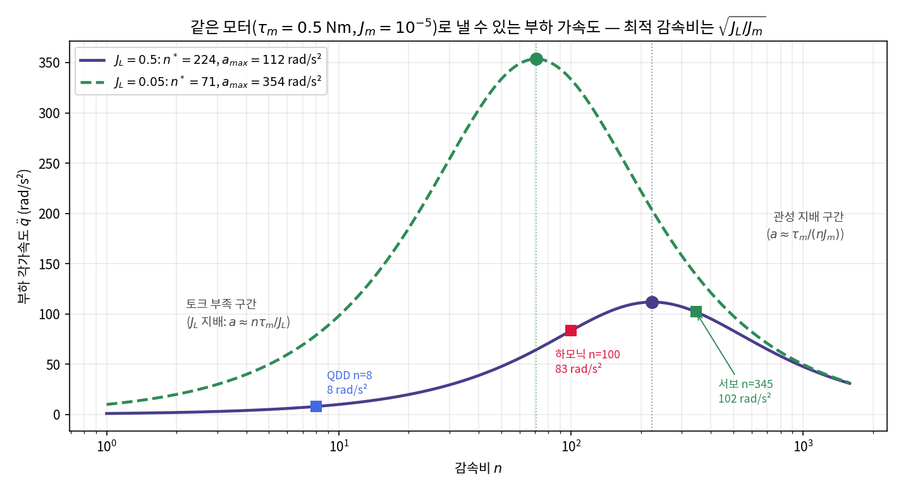
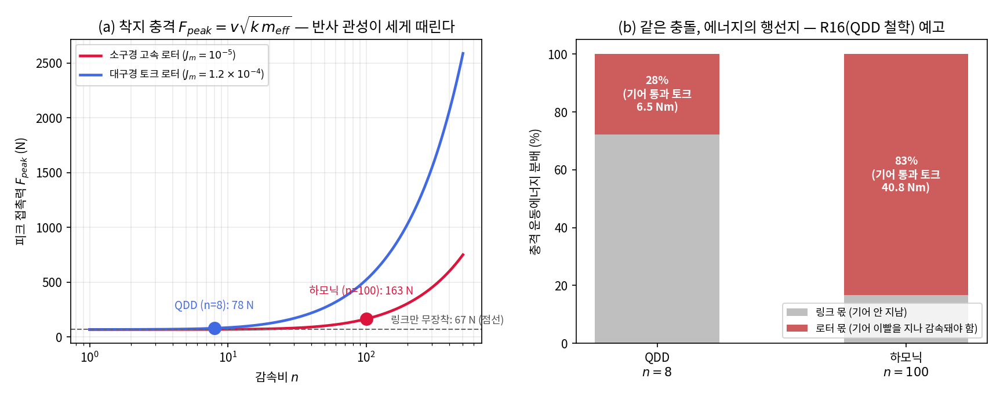
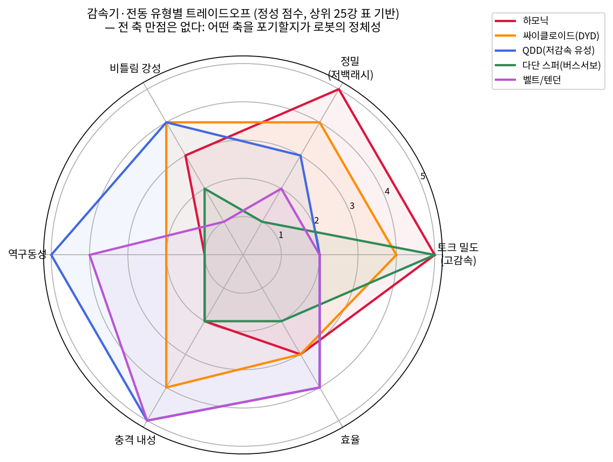
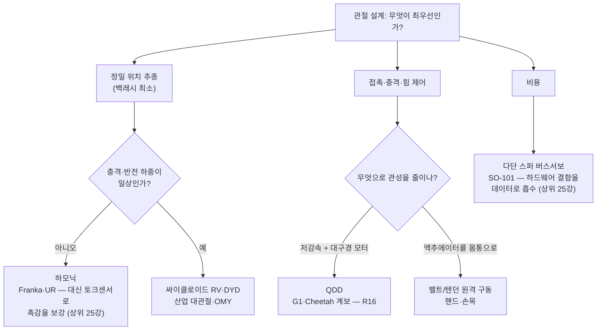

# Lec R15. 감속기와 전동 — 토크를 사고 속도를 파는 시장

> 하위제어 트랙 15일차 (Part R4). 선수 지식: R14(모터와 전류 루프), R10(매니퓰레이터 방정식).
> **상위 25강과 합동 세션** — 그 강의의 액추에이터 비교표("하모닉 vs 싸이클로이드 vs QDD vs 버스서보")를 오늘 수식으로 재유도한다.
> 기초 참고서: MR §8.9.1~8.9.2 (기어링과 apparent inertia). 표기 주의: MR은 감속비를 $G$로 쓰지만 이 강의는 관례대로 $n$을 쓴다.

## 한 장 요약



왼쪽: 같은 모터에 감속비 $n$을 붙이면 토크-속도 곡선이 통째로 이동한다 — 단, **일정 동력선 $\tau\omega = P$ 위에서만**. 감속기는 동력을 만들지 않는다. 속도를 팔아 토크를 살 뿐이다. 오른쪽: 그 환전의 숨은 가격표. 출력축에서 보면 로터 관성 $J_m$이 $n^2 J_m$으로 **제곱** 확대된다 — $n=100$ 하모닉이면 $10^{-5}\,\mathrm{kg\,m^2}$짜리 손톱만 한 로터가 $0.1\,\mathrm{kg\,m^2}$, 즉 팔 링크 관성의 상당 부분으로 둔갑한다. 감속비 하나를 고르는 일이 로봇의 힘·촉감·맷집을 동시에 결정하는 이유가 이 두 그래프에 다 있다.

## 학습 목표

1. 감속의 기본 교환($\tau_{out} = n\eta\tau_{in}$, $\omega_{out} = \omega_{in}/n$)을 동력 보존으로 설명하고, 모터 데이터시트에서 출력축 성능을 환산할 수 있다.
2. 반사 관성 $J_{ref} = n^2 J_m$을 에너지 등가로 3줄 유도하고, $n=100$ 관절에서 로터가 관절 관성의 몇 %인지 계산할 수 있다.
3. 부하 가속을 최대화하는 최적 감속비 $n^* = \sqrt{J_L/J_m}$를 유도하고, "임피던스 매칭"으로 해석할 수 있다.
4. 하모닉/유성/싸이클로이드/벨트·텐던/다단 스퍼의 트레이드오프(백래시·강성·역구동성·충격 내성)를 비교하고 대표 로봇과 연결할 수 있다.
5. 단순 충돌 모델로 반사 관성이 피크 접촉력을 얼마나 키우는지 추정할 수 있다 (R16의 QDD 철학 예고).

## 왜 이 강의가 필요한가

R14에서 봤듯 전기 모터의 토크는 전류에 비례하고($\tau = k_t I$) 전류는 열($I^2R$)로 제한된다. 그 결과 전형적인 소형 BLDC는 **0.5 Nm에 5000 rpm** — 빠르고 약하다. 그런데 로봇 관절이 원하는 것은 **50 Nm에 50 rpm** — 느리고 강하다. 딱 100배씩 어긋나 있고, 그 사이에서 환전을 담당하는 것이 감속기다.

문제는 환전에 수수료(효율 $\eta$)와 파생상품(반사 관성, 백래시, 마찰, 유한 강성)이 붙는다는 것이다. 이 파생상품이 로봇의 "성격"을 결정한다: Franka가 정밀하지만 부딪히면 딱딱한 이유, Unitree G1이 맨몸으로 착지해도 되는 이유, SO-101을 손으로 밀면 덜컹거리는 이유 — 전부 감속기 선택의 결과다. 상위 트랙 관점에서는 이렇다: VLA가 내보낸 액션이 최종적으로 만나는 플랜트의 관성·마찰·유격은 **학습으로 지울 수 없는 하드웨어 상수**이고, 그 상수의 대부분이 오늘 배우는 $n$ 하나에서 나온다.

## 본문

### 1. 모터는 틀린 곳에서 강하다

직접 구동(direct drive)이 왜 기본이 아닌지부터. 토크를 전류로만 키우면 열이 $I^2$으로 자라므로(R14), 감속 없이 관절 토크를 내려면 모터가 거대해진다 — WE-2에서 계산하겠지만 오늘의 예제 관절을 직결로 돌리려면 **112배 큰 토크의 모터**가 필요하다. 그래서 거의 모든 로봇 관절은 "작고 빠른 모터 + 감속기"다. 감속기는 두 방향으로 작동하는 시장이다:



정방향(모터→관절)만 보면 감속기는 순수한 이득처럼 보인다. 오늘 강의의 요점은 **역방향 화살표**다 — 관절을 움직이는 모든 것(제어기 자신, 외부 충격, teleop하는 사람 손)은 로터를 $n$배 속도로 끌고 다녀야 하고, 그 비용이 $n^2$으로 청구된다.

### 2. 핵심 수식

#### E1. 기본 교환: $\tau_{out} = n\,\eta\,\tau_{in}$, $\omega_{out} = \omega_{in}/n$

**직관**: 지렛대다. 긴 쪽을 빠르게 움직여 짧은 쪽에서 큰 힘을 얻는다. 동력(힘×속도)은 늘지 않으므로 공짜 점심은 없다 — 속도를 판 만큼만 토크를 산다.

**물리·기하적 의미**: 토크-속도 평면에서 모터의 작동 영역이 일정 동력 쌍곡선 $\tau\omega = P$를 따라 미끄러진다(한 장 요약 (a)). 감속기는 이 쌍곡선을 벗어날 수 없다. 즉 **데이터시트의 모터 동력이 곧 관절 동력의 상한**이고, 감속비는 그 동력을 "어떤 모양(고토크 저속 vs 저토크 고속)으로 쓸지"만 정한다.

**형식**: 기어 이빨이 미끄러지지 않으므로 접촉점 속도가 연속 — 각속도는 $\omega_{out} = \omega_m/n$. 에너지 보존에 기어 손실(효율 $\eta \le 1$)을 반영하면 $\tau_{out}\,\omega_{out} = \eta\,\tau_m\,\omega_m$, 두 식을 합치면

$$
\omega_{out} = \frac{\omega_m}{n}, \qquad \tau_{out} = n\,\eta\,\tau_m
$$

(MR §8.9.1의 $\tau_{gear} = \eta G \tau_{motor}$.) $\eta$는 유형·속도·부하에 따라 다르며, 예컨대 DYD 싸이클로이드는 공식 문서 기준 60~70%다 [3].

#### E2. 반사 관성: $J_{ref} = n^2 J_m$

**직관**: 출력축을 1 rad/s로 돌리면 로터는 $n$ rad/s로 돈다. 운동에너지는 속도의 **제곱**이므로, 출력축에서 느껴지는 로터의 "무게"는 $n$배가 아니라 $n^2$배다.

**물리·기하적 의미**: 관절에서 본 총 관성은 $J_L + n^2 J_m$ — 로터 관성이 관성행렬의 대각에 상수로 더해진다(MR §8.9.2는 이를 apparent inertia라 부른다). $n$이 크면 이 상수항이 자세에 따라 변하는 링크 관성 $M(q)$(R10)를 지배해 버린다. 부수 효과 둘: ① 플랜트가 "거의 선형인 1축 관성"처럼 보여 독립 관절 제어가 통하고(R19에서 다룬다), ② 반대로 외력이 모터 전류에 남기는 흔적이 상대적으로 작아져 **촉감이 죽는다**(R16의 핵심 논점).

**형식** (에너지 등가 유도, 3줄):

$$
KE_{rotor} = \tfrac{1}{2} J_m \omega_m^2 = \tfrac{1}{2} J_m (n\,\omega_{out})^2 = \tfrac{1}{2} \underbrace{(n^2 J_m)}_{J_{ref}} \omega_{out}^2
$$

출력축 좌표 $\omega_{out}$로 로터 에너지를 다시 쓰면 계수가 $n^2 J_m$ — 이것이 반사 관성의 전부다. 관절 동역학은 ($\eta=1$일 때)

$$
(J_L + n^2 J_m)\,\ddot{q} = n\,\tau_m + \tau_{ext}
$$

대칭도 성립한다: 모터축에서 본 부하는 $J_L/n^2$으로 **축소**된다. 고감속 관절에서 모터는 부하를 거의 못 느낀다 — 제어하기는 편하고, 느끼기는 어렵다.

#### E3. 최적 감속비: $n^* = \sqrt{J_L/J_m}$ (임피던스 매칭)

**직관**: $n$이 너무 작으면 토크가 부족해 부하를 못 밀고, 너무 크면 제 로터 관성($n^2 J_m$)을 돌리는 데 토크를 다 쓴다. 최대 가속은 그 사이 어딘가에 있다.

**물리·기하적 의미**: 최적점에서 정확히 $n^{*2} J_m = J_L$ — **반사 관성 = 부하 관성**. 전기회로의 최대 전력 전달(소스 임피던스 = 부하 임피던스)과 같은 구조라 "임피던스 매칭"이라 부른다. 아래 그림처럼 최적점 왼쪽은 부하 지배($a \approx n\tau_m/J_L$, $n$에 비례), 오른쪽은 로터 지배($a \approx \tau_m/(nJ_m)$, $n$에 반비례)다.

**형식**: 정지 상태 부하의 각가속도를 $n$에 대해 최대화한다:

$$
a(n) = \frac{n\,\tau_m}{J_L + n^2 J_m}, \qquad
\frac{da}{dn} = \frac{\tau_m (J_L - n^2 J_m)}{(J_L + n^2 J_m)^2} = 0
\;\Rightarrow\;
n^* = \sqrt{\frac{J_L}{J_m}}, \quad a_{max} = \frac{\tau_m}{2\sqrt{J_m J_L}}
$$

**단서**: 이것은 "정지 부하의 순간 가속 최대화"라는 특정 목적의 최적일 뿐이다. 실제 설계는 속도 요구·열·충격·역구동성을 함께 저울질하며, 그래서 QDD는 **일부러 $n \ll n^*$을 고른다** (4절, R16).



*그림 2: 같은 모터($\tau_m = 0.5$ Nm, $J_m = 10^{-5}$)로 낼 수 있는 부하 가속도. $J_L = 0.5$일 때 최적은 $n^* = 224$이고, 실제 로봇들의 감속비(QDD 8, 하모닉 100, 버스서보 345)는 각기 다른 이유로 최적에서 벗어나 있다. (생성 코드: `../images/lecR15/gen_figs.py`)*

### 3. Worked Example

#### WE-1 (손계산): 하모닉 관절의 환전 명세서

소형 BLDC: 스톨 토크 $\tau_m = 0.5$ Nm, 무부하 속도 $\omega_{nl} = 500$ rad/s(≈4775 rpm), 로터 관성 $J_m = 10^{-5}\,\mathrm{kg\,m^2}$. 여기에 $n = 100$ 하모닉($\eta = 0.75$ 가정)을 붙인다.

**환전 (E1)**:
$$
\tau_{out} = 100 \times 0.5 \times 0.75 = 37.5\ \mathrm{Nm}, \qquad
\omega_{out} = 500/100 = 5\ \mathrm{rad/s} \approx 47.7\ \mathrm{rpm}
$$
빠르고 약한 모터가 로봇 관절다운 숫자가 됐다.

**가격표 (E2)**: $J_{ref} = 100^2 \times 10^{-5} = 0.1\ \mathrm{kg\,m^2}$. $10^{-5}$는 무시해도 될 것 같은 수지만 $n^2 = 10^4$배 확대되면 아니다. 1 m급 팔의 어깨 관절이 드는 관성을 $J_L = 0.5\,\mathrm{kg\,m^2}$ 정도로 잡으면:

- 관절 총 관성 $= 0.5 + 0.1 = 0.6$ — **로터 몫 16.7%**. 모든 관절이 이 구조면 팔 전체 유효 관성의 상당 부분이 "링크가 아니라 로터"다. 하모닉 구동 팔을 손으로 밀 때 느껴지는 묵직함의 정체.
- 손끝 환산: 반경 0.5 m 지렛대라면 $J_{ref}/r^2 = 0.1/0.25 = 0.4$ kg — 손끝에 400 g 아령을 붙인 것과 같다. 로터 자체는 몇십 g인데도.
- 대칭 확인: 모터축에서 본 부하는 $J_L/n^2 = 5\times10^{-5}$ — 로터의 겨우 5배. 모터 입장에서 부하는 거의 안 보인다.

**검증 코드**:

```python
import numpy as np
n, eta = 100, 0.75
tau_m, w_nl, J_m, J_L = 0.5, 500.0, 1e-5, 0.5

print(f"출력: {n*tau_m*eta:.1f} Nm, {w_nl/n:.1f} rad/s ({w_nl/n*60/2/np.pi:.1f} rpm)")
w_out = 1.0                                # 출력축 1 rad/s일 때 에너지 등가
KE_rotor = 0.5*J_m*(n*w_out)**2            # 로터가 실제 저장한 에너지
KE_equiv = 0.5*(n**2*J_m)*w_out**2         # "출력축 가상 관성"으로 계산한 에너지
print(f"KE: {KE_rotor} = {KE_equiv} J (일치)")
J_ref = n**2*J_m
print(f"J_ref = {J_ref}, 총 관성 {J_L+J_ref}, 로터 몫 {J_ref/(J_L+J_ref)*100:.1f}%")
print(f"손끝(r=0.5 m) 등가 질량 {J_ref/0.5**2:.1f} kg, "
      f"모터가 본 부하 {J_L/n**2:.0e} (로터의 {J_L/n**2/J_m:.0f}배)")
```

출력: `37.5 Nm, 5.0 rad/s (47.7 rpm)` / `KE: 0.05 = 0.05 J` / `J_ref = 0.1, 총 관성 0.6, 로터 몫 16.7%` / `손끝 등가 질량 0.4 kg, 모터가 본 부하 5e-05 (로터의 5배)`.

#### WE-2 (손 + 코드): 최적 감속비와 실제 로봇들의 위치

같은 모터, $J_L = 0.5$에서 E3를 적용하면:

$$
n^* = \sqrt{0.5/10^{-5}} = \sqrt{50000} \approx 223.6, \qquad
a_{max} = \frac{0.5}{2\sqrt{10^{-5} \times 0.5}} \approx 111.8\ \mathrm{rad/s^2}
$$

실제 감속비들을 이 곡선 위에 놓아 보면 (그림 2):

```python
import numpy as np
tau_m, J_m, J_L = 0.5, 1e-5, 0.5
a = lambda n: n*tau_m/(J_L + n**2*J_m)
n_star, a_max = np.sqrt(J_L/J_m), tau_m/(2*np.sqrt(J_m*J_L))
print(f"n* = {n_star:.1f}, a_max = {a_max:.1f}, a(n*) = {a(n_star):.1f} rad/s^2")
for nn, name in [(8, 'QDD'), (51, 'DYD-14-051'), (100, '하모닉'), (345, '버스서보')]:
    print(f"  n={nn:3d} ({name:10s}): a = {a(nn):6.2f} rad/s^2 ({a(nn)/a_max*100:.0f}%)")
print(f"직결(n=1)로 a_max를 내려면 {J_L*a_max:.1f} Nm 모터 필요 ({J_L*a_max/tau_m:.0f}배)")
```

출력:

```
n* = 223.6, a_max = 111.8, a(n*) = 111.8 rad/s^2
  n=  8 (QDD       ): a =   7.99 rad/s^2 (7%)
  n= 51 (DYD-14-051): a =  48.48 rad/s^2 (43%)
  n=100 (하모닉      ): a =  83.33 rad/s^2 (75%)
  n=345 (버스서보     ): a = 102.06 rad/s^2 (91%)
직결(n=1)로 a_max를 내려면 55.9 Nm 모터 필요 (112배)
```

읽는 법: ① 직결이 안 되는 이유가 정량화됐다(112배 모터). ② 하모닉 $n=100$은 이 부하 기준 최적의 75% — 나쁘지 않은 자리다. ③ QDD $n=8$은 가속 성능의 93%를 **의도적으로 포기**한 선택이다. 무엇을 샀는지는 WE-3에서 보인다. ④ $n^*$는 $J_L$에 따라 움직인다(그림 2의 초록 곡선: $J_L = 0.05$면 $n^* = 71$) — "최적 감속비"는 로봇이 아니라 **부하와 모터의 쌍**에 대한 속성이다.

#### WE-3 (손 + 코드): 충돌 — 반사 관성이 세게 때린다

가장 단순한 착지 모델: 관절 하나에 매달린 다리 링크($J_{leg} = 0.02\,\mathrm{kg\,m^2}$, 접촉점 반경 $r = 0.3$ m)가 접촉 속도 $v = 1$ m/s로 강성 $k = 2\times10^4$ N/m인 지면을 때린다. 접촉점에서 본 유효 질량은 $m_{eff} = (J_{leg} + n^2 J_m)/r^2$이고, 질량-스프링 반주기 충돌의 피크 힘은

$$
F_{peak} = v\sqrt{k\, m_{eff}}
$$

(에너지 논법: $\tfrac{1}{2}m_{eff}v^2 = \tfrac{1}{2}kx_{max}^2$에서 $x_{max}$를 구해 $F = kx_{max}$.) 세 구성을 비교하면:

| 구성 | $J_{tot}$ | $m_{eff}$ | $F_{peak}$ | 충격 에너지의 로터 몫 |
|---|---|---|---|---|
| 링크만 (모터 미장착) | 0.020 | 0.222 kg | **66.7 N** | — |
| QDD: $n=8$, 대구경 로터 $J_m = 1.2\times10^{-4}$ | 0.0277 | 0.308 kg | **78.4 N** | 27.7% |
| 하모닉: $n=100$, 소구경 로터 $J_m = 10^{-5}$ | 0.120 | 1.333 kg | **163.3 N** | 83.3% |

손계산(하모닉 행): $J_{tot} = 0.02 + 0.1 = 0.12$, $m_{eff} = 0.12/0.09 = 1.333$, $F = \sqrt{2\times10^4 \times 1.333} = 163.3$ N. 같은 다리, 같은 착지인데 하모닉 쪽이 QDD보다 **2.08배** 세게 때린다 — 정확히 $\sqrt{J_{tot}}$ 비율이다.

더 아픈 것은 힘의 크기가 아니라 **행선지**다. 링크 몫의 충격은 기어를 지나지 않지만, 로터 몫은 기어 이빨을 **거꾸로 지나며** 로터를 감속시켜야 한다. 피크 순간 기어를 통과하는 토크는 $\tau_{gear} = J_{ref}\,\alpha_{peak}$: QDD는 6.5 Nm, 하모닉은 **40.8 Nm**. 참고로 비슷한 체급의 싸이클로이드 DYD-14-051의 비상정지 허용 토크가 43.2 Nm(정격 3.7 Nm)이다 [3] — "정격의 10배가 넘는 순간 토크를 견딘다"는 스펙 항목이 왜 존재하는지, 그리고 flexspline 하나로 버티는 하모닉이 왜 충격에 취약하다고들 하는지가 이 계산 하나로 설명된다.

```python
import numpy as np
J_leg, r, v, k = 0.02, 0.3, 1.0, 2e4
for name, n, J_m in [("링크만", 0, 0.0), ("QDD n=8", 8, 1.2e-4), ("하모닉 n=100", 100, 1e-5)]:
    J_tot = J_leg + n**2*J_m
    m_eff = J_tot/r**2
    F = v*np.sqrt(k*m_eff)
    share = (n**2*J_m)/J_tot*100
    tau_gear = (n**2*J_m)*(F*r/J_tot)      # 피크에서 기어를 통과하는 토크
    print(f"{name:12s}: m_eff={m_eff:5.3f} kg, F_peak={F:6.1f} N, "
          f"로터 몫={share:4.1f}%, 기어 통과 토크={tau_gear:4.1f} Nm")
```

출력은 위 표와 같다 (`66.7 / 78.4 / 163.3 N`, `27.7% / 83.3%`, `6.5 / 40.8 Nm`). 이 모델은 감쇠·기어 탄성·백래시를 무시한 1차 추정이지만, "고감속 = 큰 반사 관성 = 센 충격 + 기어가 그걸 다 받음"이라는 스케일링($F \propto \sqrt{J_{tot}}$)은 견고하다.



*그림 3: (a) 피크 접촉력 vs 감속비 — 감속비가 커질수록 같은 착지가 점점 센 충돌이 된다. (b) 충격 에너지의 행선지 — 하모닉은 83%가 기어 이빨을 지나야 한다. R16(QDD 철학)의 출발점이 되는 그림.*

### 4. 감속기 동물원 — 무엇을 사고 무엇을 파는가

이제 상위 25강의 비교표를 이 강의의 언어로 다시 쓴다. 각 유형은 트레이드오프 공간의 다른 꼭짓점이다:

| 유형 | 감속비 | 백래시 | 비틀림 강성 | 역구동성 | 충격 내성 | 대표 |
|---|---|---|---|---|---|---|
| **하모닉** (파동 기어) | 30~160:1 (1단) | 사실상 0 | 중간 (flexspline 탄성) | 없음 | 약함 | Franka, UR, 협동로봇 손목 |
| **싸이클로이드** (RV·DYD) | 33~99:1 (DYD) [3] | <3 arcmin [3] | 높음 | 제한적 | **강함** (정격 3.7 → 비상정지 43.2 Nm [3]) | 산업 대관절(RV), Dynamixel Y·OMY |
| **유성** (planetary) | 3~10:1/단, 다단 가능 | 있음 | 높음 | 저감속 1단이면 좋음 | 강함 | **QDD** = 1단 저감속 유성 (G1, MIT Cheetah 계보 [5]) |
| **다단 스퍼** (버스서보) | ~345:1 (STS3215 [4]) | 큼 | 낮음 | 없음 | 약함 (소형 기어) | SO-101 |
| **벨트/텐던** (전동) | 낮음 (감속보다 "원격 구동") | 없음 (탄성으로 대체) | 낮음 | 좋음 | 강함 | 손가락·손목 원격 구동, Optimus Gen3 핸드(상위 25강) |

동작 원리 한 줄씩: **하모닉**은 타원 캠(wave generator)이 유연한 컵(flexspline)을 변형시켜 이빨 수가 2개 다른 강성 링(circular spline)과 다점 맞물림 — 다수 이빨이 동시에 물려 백래시가 없고 1단으로 100:1이 나오지만, 모든 하중이 얇은 flexspline을 지난다. **싸이클로이드**는 편심 캠이 싸이클로이드 디스크를 굴리고 다수의 핀이 **구름 접촉**으로 하중을 나눠 받는다 — 충격에 강한 이유. 하모닉과 같은 "고감속 정밀" 부류이면서 내충격 축에서 갈라진다는 정량 비교는 Sensinger & Lipsey [2]가 표준 참고문헌이다. **유성**은 태양-유성-링 기어로 하중을 여러 유성에 분산 — 단당 감속비가 낮아 정밀 고감속용으로는 다단이 필요하지만, 거꾸로 **1단 저감속(n≈6~10)으로 쓰면 마찰·반사 관성이 작아 역구동이 되는** QDD의 재료가 된다 [5]. **벨트/텐던**은 감속 장치라기보다 **질량 재배치** 장치다 — 무거운 액추에이터를 몸통/포어암으로 옮겨 움직이는 링크의 $J_L$ 자체를 줄인다(반사 관성과는 독립인 제3의 관성 전략). 대가는 탄성·크리프·장력 관리다.



*그림 4: 다섯 유형의 정성 비교 (상위 25강 표 기반, 5점 척도). 전 축 만점인 유형은 없다 — 어느 축을 포기했는지가 그 로봇의 정체성이다.*

선택 로직을 한 장으로:



### 딥러닝 배경자를 위한 번역

- **감속비는 게인 하나지만 관성은 제곱으로 청구된다** — 파라미터 재매개변수화 $w = \alpha v$에서 기울기는 $\alpha$배, 곡률(Hessian)은 $\alpha^2$배가 되는 것과 같은 제곱 법칙이다. 운동에너지도 손실 곡률도 2차 형식이기 때문. "학습률 하나 바꾸는 게 공짜가 아니다"의 하드웨어 판.
- **임피던스 매칭 $n^* = \sqrt{J_L/J_m}$은 자원 배분 최적화다** — 한쪽 극단(토크 부족)과 반대 극단(자기 관성에 잠식) 사이의 기하평균. compute-optimal 스케일링에서 모델과 데이터에 예산을 나눠야 최적이 되는 것, 학습률-배치 크기를 같이 움직여야 하는 것과 같은 "양쪽 균형에서 처리량 최대" 구조다.
- **고감속 관절은 강한 구조적 prior다** — $n^2 J_m$ 상수가 자세 의존 관성 $M(q)$를 눌러 플랜트를 "거의 선형 1축"으로 만든다. 제어(그리고 sim2real)는 쉬워지지만 외력의 신호가 묻힌다 — 표현력을 줄여 최적화를 쉽게 만드는 정칙화와 같은 거래이고, R16의 QDD는 반대편 극단(prior를 빼고 신호를 살림)을 고른 설계다.

## 흔한 오해

1. **"감속기는 토크 증폭기니까 동력도 커진다"** — 동력은 보존되고($\eta < 1$이므로 실제로는 준다), 감속기는 일정 동력선 위에서 좌표만 옮긴다(E1). 모터 데이터시트의 동력이 관절 동력의 상한이다.
2. **"$J_m = 10^{-5}$쯤은 무시해도 된다"** — $n = 100$이면 $10^4$배 확대되어 오히려 관절 관성을 지배하는 항이 된다(WE-1의 로터 몫 16.7%는 가벼운 축이고, 경량 링크에서는 로터가 과반이 된다). MR §8.9.2가 정확히 이 예제를 다룬다 [1].
3. **"역구동이 안 되는 건 기어 구조가 잠기기 때문"** — 웜기어처럼 기하적으로 잠기는 경우도 있지만, 로봇 감속기의 주범은 **마찰의 $n$배 확대와 반사 관성**이다. 출력에서 민 토크는 기어를 거꾸로 지나며 $1/n$로 줄어 모터 쪽 마찰조차 못 이기고, 이겨도 $n^2 J_m$을 끌고 다녀야 한다. 실습 1에서 문턱값을 직접 추정한다.
4. **"기어비는 클수록 좋다"** — $n > n^*$부터는 가속 성능이 도로 떨어지고(그림 2), 충격 취약성과 비역구동성은 계속 나빠진다. WE-2의 버스서보($n=345$)는 가속도 숫자(102 rad/s²)만 보면 최고지만 백래시·마찰·충격의 전 축을 지불한 결과다 — 숫자 하나로 감속기를 고르면 안 되는 이유.

## 실습 (1.5~2시간)

**상위 25강 액추에이터 비교표를 수식으로 재유도하기.**

1. **(40분) 계산표 작성**: 공통 모터($\tau_m = 0.5$ Nm, 모터측 마찰 $\tau_f = 0.01$ Nm 가정)에 네 가지 전동을 붙였을 때의 파생 성질을 파이썬 표로 만든다. QDD만 대구경 토크 로터($J_m = 1.2\times10^{-4}$), 나머지는 소구경($J_m = 10^{-5}$)을 쓴다:

```python
import numpy as np
tau_m, tau_f, J_L = 0.5, 0.01, 0.5
rows = [('QDD(저감속 유성)', 8, 1.2e-4), ('싸이클로이드 DYD', 51, 1e-5),
        ('하모닉', 100, 1e-5), ('버스서보(다단 스퍼)', 345, 1e-5)]
print(f"{'유형':<14s} {'n':>4s} {'J_ref':>9s} {'역구동 문턱':>8s} {'a(J_L=0.5)':>10s}")
for name, n, J_m in rows:
    J_ref = n**2*J_m
    tau_bd = n*tau_f                    # 역구동 문턱의 하한: 반사된 모터 마찰
    a = n*tau_m/(J_L + J_ref)
    print(f"{name:<14s} {n:4d} {J_ref:9.5f} {tau_bd:7.2f}Nm {a:8.2f} rad/s^2")
```

   기대 출력: J_ref = `0.00768 / 0.02601 / 0.10000 / 1.19025` kg·m², 역구동 문턱 ≥ `0.08 / 0.51 / 1.00 / 3.45` Nm, 가속도 `7.88 / 48.48 / 83.33 / 102.06` rad/s². 이 세 열을 상위 25강 표의 "역구동성 / 충격 내성 / 고유수용" 행과 대조하고, 정성 평가가 어느 수식에서 나오는지 화살표를 그려 본다. (역구동 문턱은 기어 자체 마찰·예압을 뺀 **하한**이다 — 하모닉의 실측 문턱은 이보다 훨씬 크다.)

2. **(30분) 최적점 스윕**: WE-2의 `a(n)` 곡선을 $J_L \in \{0.05, 0.2, 0.5, 2.0\}$에 대해 겹쳐 그리고, 최적점들이 log-log에서 기울기 1/2 직선($n^* \propto \sqrt{J_L}$)에 놓이는지 확인한다. `images/lecR15/gen_figs.py`의 fig2 블록과 대조.

3. **(30분) 시뮬레이터의 반사 관성 — MuJoCo `armature`**: MuJoCo 관절의 `armature` 파라미터가 바로 오늘의 $n^2 J_m$이다(관성행렬 대각에 더해지는 로터 관성 [6]). 1-DoF 힌지($J_L = 0.5$)에 출력축 토크 50 Nm를 걸고 `armature`를 바꿔가며 `qacc`를 읽는다:

```python
import mujoco
XML = """<mujoco><option gravity="0 0 0"/><worldbody><body>
  <joint name="q" type="hinge" axis="0 0 1" armature="{arm}"/>
  <inertial pos="0 0 0" mass="1" diaginertia="0.5 0.5 0.5"/>
  <geom type="capsule" fromto="0 0 0 0.5 0 0" size="0.03" density="0"/>
</body></worldbody></mujoco>"""
for arm in [0.0, 0.00768, 0.1]:        # 직결 / QDD / 하모닉 (실습 1의 J_ref)
    m = mujoco.MjModel.from_xml_string(XML.format(arm=arm))
    d = mujoco.MjData(m)
    d.qfrc_applied[0] = 50.0
    mujoco.mj_forward(m, d)
    print(f"armature={arm}: qacc = {d.qacc[0]:.3f} (해석 {50/(0.5+arm):.3f}) rad/s^2")
```

   기대 출력: `100.000 / 98.487 / 83.333` rad/s² — 해석값 $50/(J_L + J_{ref})$과 일치. 이어서 관절에 `stiffness="20"`을 주고 자유 진동 주기를 재면(영점 통과 시각 보간) armature 0 → 0.1에서 주기가 0.9935 s → 1.0883 s로 늘어난다 — 이론 $2\pi\sqrt{(J_L + J_{ref})/k}$ = 0.9935 / 1.0883 s와 일치. **sim2real에서 `armature`를 빼먹으면 시뮬 로봇이 실물보다 훨씬 잽싸게 움직인다** — 정책이 그 속도를 배우면 실기에서 깨진다.

4. **(선택, 20분)** [MuJoCo Menagerie](https://github.com/google-deepmind/mujoco_menagerie)에서 아무 로봇 XML을 열어 관절의 `armature` 값을 찾고, 그럴듯한 $J_m$을 가정해 감속비 $n = \sqrt{\text{armature}/J_m}$을 역산해 본다. 스펙시트의 감속기 유형과 부합하는가?

## Claude와 토론할 질문

1. Franka의 "하모닉 + 관절 토크센서"와 QDD의 "저감속 + 전류 토크 추정" — 반사 관성 관점에서 각 방식의 힘 제어 대역폭 한계는 어디서 오는가? (R21의 임피던스 제어와 R16에서 재론)
2. $n^*$는 "정지 부하의 가속 최대화"의 답이다. 다리 로봇(착지 충격)이 $n \ll n^*$을, 산업 팔(정밀 추종)이 $n \approx 100$을 고를 때 각각이 실제로 최적화하는 목적함수를 명시적으로 써 보라.
3. 텐던 전동(Optimus Gen3 핸드)은 오늘의 트레이드오프 축에서 무엇을 사고 무엇을 파는가? "반사 관성을 줄이는 게 아니라 $J_L$을 줄인다"는 관점에서 QDD와 비교하라.
4. ALOHA류 teleop 리더 암은 왜 저감속이어야 하는가 — "사람 팔이 로봇을 역구동한다"는 관점에서, 실습 1의 역구동 문턱 표로 리더 암에 쓸 수 있는/없는 전동을 골라 보라.
5. 반사 관성은 시뮬레이터에서 `armature` 한 줄로 정확히 재현되는데, 백래시는 왜 어려운가? (힌트: 불연속·유격 안에서의 자유 비행 — R26의 접촉 솔버 논의로 이어진다)
6. "양쪽 균형에서 최대"인 $n^* = \sqrt{J_L/J_m}$ 구조를 딥러닝에서 하나 더 찾아 유도까지 대응시켜 보라 (예: compute-optimal 모델-데이터 배분, 학습률-노이즈 균형).
7. 모터의 토크 밀도가 10배 좋아지면(예: 신소재 자석) 감속기 지형은 어떻게 재편될까? $n^*$ 공식과 WE-3의 충돌 스케일링으로 "직접 구동의 부활" 시나리오를 정량적으로 논증하라.

## 읽을거리

1. **MR §8.9.1~8.9.2** (~30분): 기어링·apparent inertia의 원전. §8.9.3(로터 관성을 포함한 뉴턴-오일러)은 R11을 들었으면 훑기만 해도 된다.
2. **Sensinger & Lipsey, ICRA 2012** [2] (~30분): 싸이클로이드 vs 하모닉의 정량 비교. 도입부와 비교 표까지만 — 세부 설계식은 감속기를 직접 설계할 때만.
3. **ROBOTIS DYD eManual** [3] (~15분): 실제 제품 스펙 언어(정격/가감속/비상정지 토크, 백래시 arcmin, 효율 곡선) 읽는 연습. WE-3의 숫자들이 스펙시트 어느 항목에 대응하는지 찾아보라.

## 자가 점검

1. 모터 데이터시트($\tau_m$, $\omega_{nl}$, $J_m$)와 감속비 $n$에서 출력축 스톨 토크·무부하 속도·반사 관성을 30초 안에 환산할 수 있는가?
2. $J_{ref} = n^2 J_m$을 에너지 논법으로 3줄 유도하고, "$n$이 아니라 $n^2$인 이유"를 한 문장으로 말할 수 있는가?
3. $n^* = \sqrt{J_L/J_m}$을 유도하고, 최적점에서 반사 관성 = 부하 관성(임피던스 매칭)임을 보일 수 있는가?
4. 하모닉·싸이클로이드·QDD·버스서보를 백래시/역구동성/충격 내성 세 축으로 각각 한 줄씩 비교하고 대표 로봇을 붙일 수 있는가?
5. 같은 착지에서 하모닉 관절($n=100$)이 QDD($n=8$)보다 피크 힘이 약 2배인 이유를 $m_{eff}$와 $F \propto \sqrt{J_{tot}}$ 스케일링으로 설명할 수 있는가?

## 참고문헌

> 웹 문서는 2026-07-08 접속 기준.

[1] K. Lynch, F. Park, "Modern Robotics: Mechanics, Planning, and Control," Cambridge Univ. Press, 2017. 무료 PDF: https://hades.mech.northwestern.edu/images/7/7f/MR.pdf
— **뒷받침**: §8.9.1 — E1의 $\tau_{gear} = \eta G \tau_{motor}$, DC 모터 모델($\tau = k_t I$, 열 한계); §8.9.2 — E2의 apparent(reflected) inertia $G^2 I_{rotor}$와 "고감속에서 관절 관성이 로터에 지배된다"는 예제(흔한 오해 2); §8.9.4 — 마찰이 기어비와 함께 커진다는 논의(흔한 오해 3).

[2] J. W. Sensinger, J. H. Lipsey, "Cycloid vs. harmonic drives for use in high ratio, single stage robotic transmissions," IEEE ICRA, 2012. https://doi.org/10.1109/ICRA.2012.6224739
— **뒷받침**: 4절 — 싸이클로이드와 하모닉의 단일단 고감속 트레이드오프(백래시·강성·토크 밀도) 정량 비교의 표준 출처 (상위 25강과 동일 문헌 재사용).

[3] ROBOTIS, DYD(Dynamixel Drive) eManual. https://emanual.robotis.com/docs/en/all-dyd/
— **뒷받침**: 4절 표와 WE-3 — DYD 감속비 33~99:1, 백래시 <3 arcmin, DYD-14-051 정격 3.7 Nm/비상정지 43.2 Nm, 효율 60~70% (E1의 $\eta$ 예시). WE-2의 $n=51$은 DYD-14-051의 감속비.

[4] Feetech, STS3215 제품 페이지 (제조사 공식). https://www.feetechrc.com/en/2020-05-13_56655.html
— **뒷받침**: 4절 표·WE-2·실습 1의 버스서보 감속비 1/345("1:345 gear combination"), 다단 스퍼(금속 기어) 구조 — 상위 25강 표와 동일 수치.

[5] P. M. Wensing, A. Wang, S. Seok, D. Otten, J. Lang, S. Kim, "Proprioceptive Actuator Design in the MIT Cheetah: Impact Mitigation and High-Bandwidth Physical Interaction for Dynamic Legged Robots," IEEE Transactions on Robotics, 33(3), 2017. https://doi.org/10.1109/TRO.2016.2640183
— **뒷받침**: 4절 — QDD(저감속 유성 + 대구경 모터)의 설계 철학과 충격 완화 논거; WE-3·그림 3의 "대구경 토크 로터" 파라미터 방향성(감속비 낮추고 로터 크게). 상세는 R16에서 본격 인용.

[6] Google DeepMind, MuJoCo 문서 — XML reference, joint/`armature`. https://mujoco.readthedocs.io
— **뒷받침**: 실습 3 — `armature`가 관성행렬 대각에 더해지는 로터(반사) 관성이라는 정의.

*수치 재현성: 본문·그림의 모든 수치(WE-1의 37.5 Nm·5 rad/s·$J_{ref}=0.1$·로터 몫 16.7%·손끝 0.4 kg·모터가 본 부하 $5\times10^{-5}$, WE-2의 $n^*=223.6$·$a_{max}=111.8$·QDD 7.99/DYD 48.48/하모닉 83.33/서보 102.06 rad/s²·직결 환산 55.9 Nm(112배), WE-3의 66.7/78.4/163.3 N·비율 2.08·로터 몫 27.7/83.3%·기어 통과 토크 6.5/40.8 Nm, 실습 1 표의 $J_{ref}$·역구동 문턱·가속도 7.88 rad/s², 실습 3의 qacc 100.000/98.487/83.333 rad/s²·진동 주기 0.9935/1.0883 s)는 본문 코드 블록과 `images/lecR15/gen_figs.py`의 실행 출력이다 — numpy 1.26 / mujoco 3.2.5 기준 재현 확인.*
