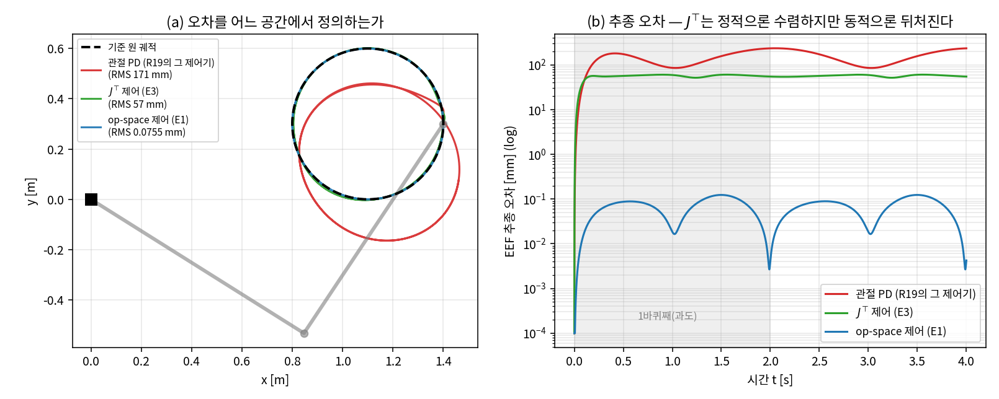
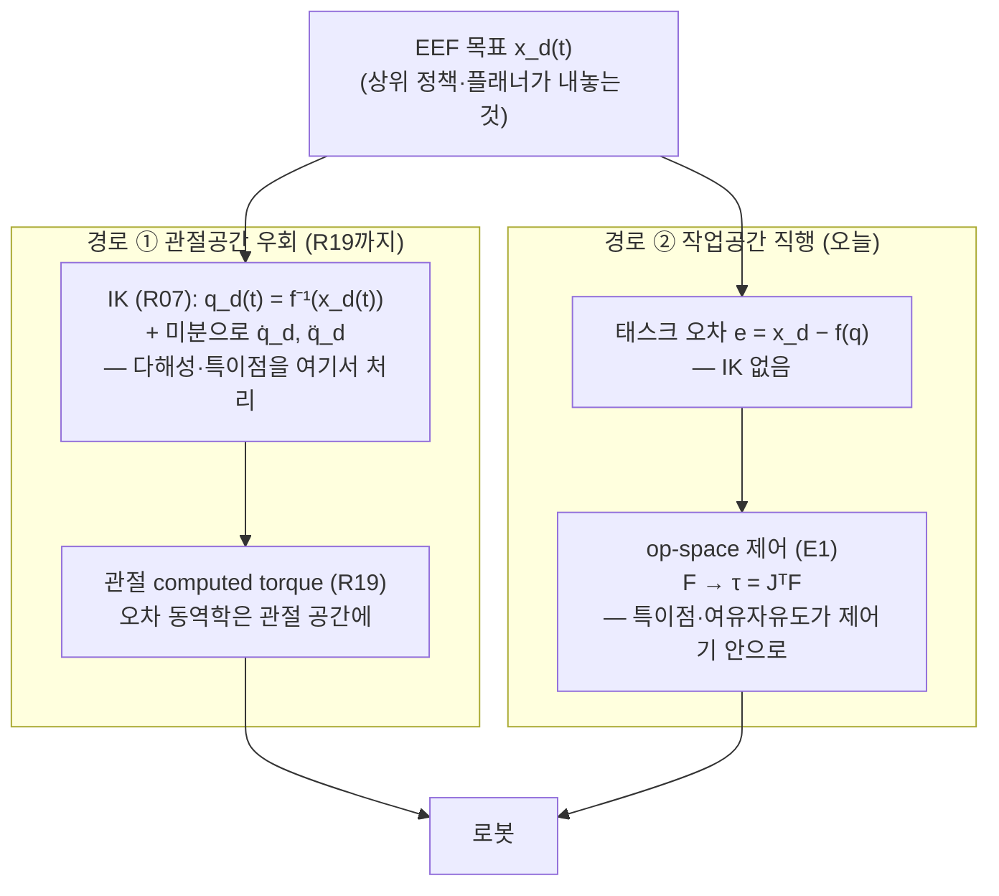
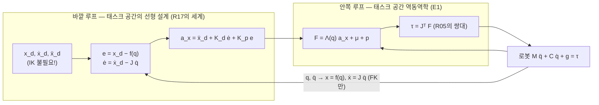
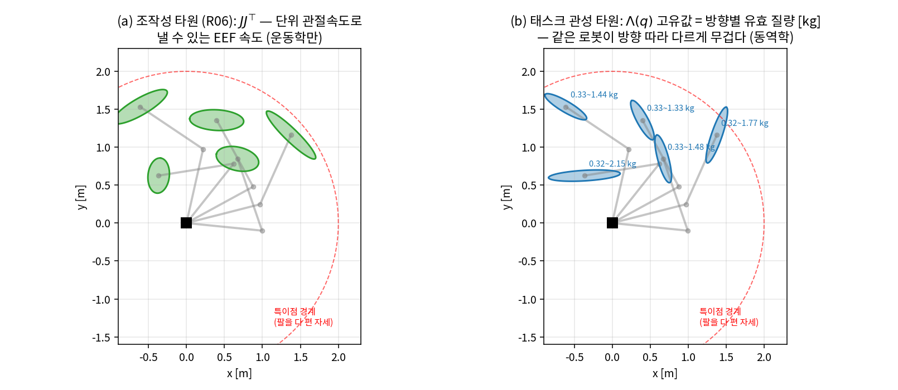
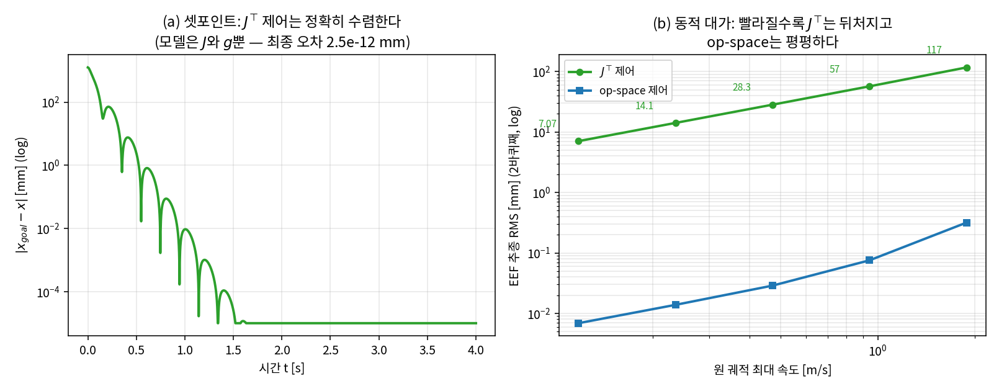
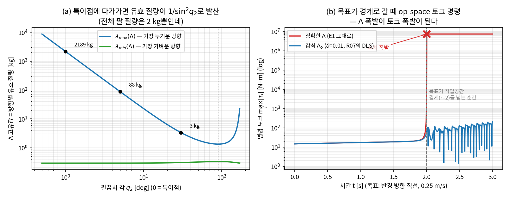

# Lec R20. 작업공간 제어 — 손끝의 좌표에서 직접 제어하기

> 하위제어 트랙 20일차 (Part R5 제어, 네 번째). 선수 지식: R05(자코비안·정역학 쌍대 τ=JᵀF), R06(SVD·조작성 타원·null-space), R07(DLS), R10(매니퓰레이터 방정식 M·C·g), R19(computed torque).
> 기초 참고서: Modern Robotics(이하 MR) §8.6(태스크 공간 동역학)·§11.4.3(task-space motion control). 원전: Khatib의 operational space formulation [2]. 이 강의는 R19의 "비선형을 지우는 기술"을 관절 좌표에서 **손끝 좌표**로 옮기면 무엇이 생기고 무엇이 깨지는지를 수치로 체감하는 방식으로 재구성한 것이다.

## 한 장 요약



같은 로봇(R10의 2링크), 같은 원 궤적(R19의 그 원). 다른 것은 **오차를 어느 공간에서 정의하고, 얼마나 아는가**다. 관절 오차에 PD를 거는 R19의 독립 관절 PD는 RMS 170.8 mm. 태스크 오차 $e = x_d - x$에 가상 스프링을 걸어 $\tau = J^\top(K_p e - K_d \dot x) + g$로 번역하는 **자코비안 전치 제어**는 57.0 mm — 고정 목표라면 기계 정밀도로 수렴하지만(그림 4a), 움직이는 목표에는 뒤처진다. 태스크 공간의 동역학 $\Lambda \ddot x + \mu + p = F$까지 알고 상쇄하는 **operational space 제어**는 0.0755 mm — IK를 한 번도 부르지 않고 관절 computed torque(0.0754 mm)와 동률이다. 오늘은 이 세 제어기를 유도하고, 그 사이 어딘가에 있는 물리량 — 로봇이 방향에 따라 다르게 무거워지는 **태스크 공간 관성 $\Lambda(q)$** — 를 손으로 만져 본다.

## 학습 목표

1. 태스크 공간 동역학 $\Lambda(q)\ddot x + \mu(q,\dot q) + p(q) = F$를 매니퓰레이터 방정식(R10)에서 3줄로 유도하고, $\Lambda = (J M^{-1} J^\top)^{-1}$의 각 기호를 설명할 수 있다.
2. Khatib의 op-space 제어 법칙 $\tau = J^\top[\Lambda(\ddot x_d + K_d\dot e + K_p e) + \mu + p]$를 쓰고, 태스크 공간 오차 동역학 $\ddot e + K_d \dot e + K_p e = 0$이 나오는 것을 보일 수 있다.
3. $\Lambda(q)$의 고유값이 "방향별 유효 질량"임을 이해하고, 2R 팔의 특정 자세에서 손으로 계산하며, R06의 조작성 타원과 무엇이 같고 다른지 말할 수 있다.
4. 자코비안 전치 제어의 정적 수렴(Lyapunov 스케치)과 동적 대가(lag ≈ $K_d v / K_p$)를 유도·정량화하고, 두 방식의 선택 기준을 논할 수 있다.
5. 특이점 근처에서 $\Lambda$가 $1/\sin^2 q_2$로 폭발해 토크 명령이 발산하는 메커니즘과 감쇠 대책(R07의 DLS), 그리고 여유자유도 로봇의 null-space 자세 태스크를 MuJoCo에서 구현할 수 있다.

## 왜 이 강의가 필요한가

R19에서 우리는 관절 공간의 비선형을 모델로 지우고 오차 동역학을 마음대로 설계하는 법을 배웠다. 그런데 한 가지 어색함이 남아 있었다 — 원을 그리라는 태스크를 주면서 우리는 먼저 IK(R07)로 관절 궤적 $q_d(t)$를 만들고, 제어기는 **관절 오차**만 봤다. 태스크는 손끝의 공간에 사는데 제어는 관절의 공간에서 돈 것이다. 이 우회에는 실제 비용이 있다:

- **IK가 상시 파이프라인에 들어온다.** 매 주기 IK와 $\dot q_d, \ddot q_d$ 계산이 필요하고(MR §11.4.3의 식 11.44~46이 정확히 이 변환이다 [1]), 여유자유도 로봇이면 다해성(R07) 처리까지 관절 궤적 생성기의 몫이다.
- **오차의 의미가 뒤틀린다.** 관절 오차 0.1 rad가 EEF 몇 mm인지는 자세에 따라 다르다(R05의 자코비안이 그 환율). "손끝이 목표에서 5 mm 이내" 같은 태스크 사양을 관절 게인으로 번역하는 것은 간접적이다.
- **접촉으로 못 간다.** R21(임피던스)·R22(힘 제어)에서 우리는 "손끝이 환경에 내는 힘"을 성형해야 한다. 힘이 사는 공간의 동역학 — 오늘의 $\Lambda$ — 없이는 시작할 수 없다. Khatib이 1987년에 이 정식화를 만든 동기가 정확히 모션과 힘의 **통일 제어**였다 [2].

상위 트랙과의 접선도 여기 있다: VLA의 action space 논쟁(상위 26강) — RT-2·OpenVLA는 ΔEEF를, ACT·SmolVLA는 관절각을 내놓는다 — 은 "어느 공간에서 목표를 정의하는가"라는 오늘 질문의 학습판이다. 제어판에서 먼저 답의 구조를 보자: 태스크가 사는 공간에서 오차를 정의하면 무엇을 얻고(오차 동역학의 직접 설계), 무엇을 떠안는가(특이점, 여유자유도).

## 본문

### 1. 두 경로 — 관절공간 우회 vs 작업공간 직행



두 경로 모두 끝은 토크다. 차이는 **오차 동역학이 어느 좌표에서 선형이 되도록 설계하는가**, 그리고 특이점·여유자유도라는 골칫거리를 파이프라인의 어느 상자가 떠안는가다. 경로 ①은 그것을 IK(궤적 생성 시점)에 밀어 두고, 경로 ②는 제어 법칙 자체에 들여온다 — 공짜 점심은 없고, 위치만 옮길 수 있다(흔한 오해 1).

### 2. 핵심 수식

#### E1. 태스크 공간 동역학과 operational space 제어 — R19의 상쇄를 손끝 좌표에서

**직관**: R19의 computed torque는 "관절 가속도를 명령하는 인터페이스"를 만들었다. 같은 질문을 손끝에 대해 묻자 — 손끝 가속도 $\ddot x$를 직접 명령하려면 어떤 힘이 필요한가? 답은 매니퓰레이터 방정식을 태스크 좌표로 갈아입힌 방정식이고, 거기에도 관성·코리올리·중력의 세 서랍이 그대로 있다.

**물리·기하적 의미**: $F$는 EEF에 가해진 것으로 **상상한** 힘(wrench)이고, $\tau = J^\top F$ (R05의 정역학 쌍대)가 그것을 실제 관절 토크로 번역한다. $\Lambda(q)$는 손끝이 느끼는 **유효 관성**(E2에서 해부), $\mu$는 태스크 좌표에서 본 코리올리·원심력, $p$는 태스크 좌표에서 본 중력이다. 구조는 R19와 완전히 같은 두 루프다 — 바깥 루프가 태스크 오차로 가속도 명령을 만들고, 안쪽 루프가 그것을 역동역학으로 힘으로 바꾼다. 달라진 것은 오차 동역학이 성립하는 좌표뿐이다.



**형식** — 유도는 3줄이다. $\dot x = J\dot q$를 미분하고($\ddot x = J\ddot q + \dot J\dot q$), R10의 $\ddot q = M^{-1}(\tau - C\dot q - g)$와 $\tau = J^\top F$를 대입하면:

$$
\ddot x = J M^{-1} J^\top F - J M^{-1}(C\dot q + g) + \dot J \dot q
$$

$\Lambda \equiv (J M^{-1} J^\top)^{-1}$로 좌측에 곱해 정리하면 **태스크 공간 매니퓰레이터 방정식**:

$$
\Lambda(q)\,\ddot x + \mu(q,\dot q) + p(q) = F, \qquad
\mu = \Lambda J M^{-1} C\dot q - \Lambda \dot J \dot q, \quad p = \Lambda J M^{-1} g
$$

(Khatib 1987의 표기 [2]. 정방·가역 $J$면 $\Lambda = J^{-\top} M J^{-1}$과 동치 — MR §8.6의 식 8.90 [1]. $(JM^{-1}J^\top)^{-1}$ 꼴은 여유자유도에서도 성립하는 일반형이다.) 이제 R19의 처방을 문자 그대로 반복한다 — 제어 법칙:

$$
\boxed{\;\tau = J^\top\Big[\Lambda(q)\big(\ddot x_d + K_d \dot e + K_p e\big) + \mu(q,\dot q) + p(q)\Big]\;}
\;\;\Rightarrow\;\;
\ddot e + K_d\,\dot e + K_p\,e = 0
$$

대입하면 $\mu, p$가 좌우에서 대수적으로 소거되고 $\Lambda \ddot x = \Lambda(\cdots)$에서 $\Lambda \succ 0$(특이점 밖에서 — 여기가 아킬레스건, E2)으로 양변을 지운다. **오차 동역학이 태스크 공간에서, 자세·속도와 무관하게 성립한다.** $K_p = 100, K_d = 20$이면 손끝 오차가 $s = -10$ 이중 극점(R19의 그 극점)으로 죽는다 — 검증: 셋포인트 실험에서 태스크 오차가 임계감쇠 해석해 $e_0(1 + 10t)e^{-10t}$와 최대 $1.0 \times 10^{-5}$ m 안에서 겹친다(적분 이산화 잔차). 주의 하나: 오늘은 위치 2차원 태스크지만, 자세까지 포함한 SE(3) 태스크에서는 오차를 $\log(X^{-1}X_d)$(R03의 지수좌표)로 정의한다 — MR 식 11.47이 그 완전판이다 [1].

구현 노트: 정방·가역 $J$라면 대수적으로 동치인 지름길이 있다 — 가속도 명령을 관절로 되번역해서 R19를 그대로 부르는 것:

$$
\tau = M(q)\,J^{-1}\big(a_x - \dot J \dot q\big) + C(q,\dot q)\,\dot q + g(q), \qquad a_x = \ddot x_d + K_d\dot e + K_p e
$$

($\ddot x = J\ddot q + \dot J\dot q$를 뒤집은 것 — MR 식 11.46의 제어판 [1].) 결과 토크는 E1과 기계 정밀도로 같다(랜덤 상태 100개에서 최대 차 $2.1 \times 10^{-14}$ N·m — 검증 코드). 그런데도 Khatib 꼴을 배우는 이유: ① $J^{-1}$이 없어 여유자유도($n > t$)로 그대로 일반화되고(실습 Part B), ② $F$ — 손끝이 낼 힘 — 가 명시적으로 드러나 힘·임피던스 제어(R21·R22)의 인터페이스가 되기 때문이다.

#### E2. 태스크 공간 관성 $\Lambda(q)$ — 같은 로봇이 방향 따라 다르게 무겁다

**직관**: 정지한 로봇의 손끝을 손으로 밀어 보라. 어떤 방향으로는 슥 밀리고 어떤 방향으로는 벽 같다. 로봇의 질량은 그대로인데 **밀리는 방향에 따라 느껴지는 질량이 다르다** — 그 "느껴지는 질량"의 행렬이 $\Lambda(q)$다.

**물리·기하적 의미**: R10에서 $M(q)$를 C-space의 리만 메트릭("이 방향 운동이 얼마나 비싼가")으로 읽었다. $\Lambda$는 같은 메트릭을 태스크 좌표로 밀어 보낸 것이다 — 운동에너지가 좌표와 무관하다는 항등식 $\frac{1}{2}\dot q^\top M \dot q = \frac{1}{2}\dot x^\top \Lambda \dot x$ (정방 $J$, MR 식 8.20 [1])가 그 정의다. 고유분해하면 고유벡터가 "무거운/가벼운 방향", 고유값이 그 방향의 **유효 질량(kg)**: 단위 힘을 고유벡터 방향으로 주면 가속도 $1/\lambda_i$가 나온다. 우리 2링크(총 질량 2 kg)에서 작업공간 내부($q_2$ 10°~170°)의 유효 질량은 **0.29~22.8 kg** — 총 질량보다 가볍게도(지렛대가 유리한 방향), 11배 무겁게도(관절이 힘을 쓰기 힘든 방향) 느껴진다. 그리고 특이점에서는 잃어버린 방향의 유효 질량이 **무한대**로 발산한다 — "그 방향으로는 어떤 힘으로도 가속 불가"를 관성의 언어로 말한 것.

코드로 만지면 두 줄이다 (고유벡터가 아닌 임의 방향 $u$의 유효 질량은 $m_u = 1/(u^\top \Lambda^{-1} u)$ — 힘을 $u$로 주고 가속도의 $u$ 성분만 세는 정의):

```python
def Lam(q):  # 태스크 공간 관성 (E2)
    J = jac(q)
    return np.linalg.inv(J @ np.linalg.solve(M_mat(q), J.T))

lam, V = np.linalg.eigh(Lam(np.array([0.5, 1.571])))
print(lam)                                   # [0.333, 1.333] kg — 방향별 유효 질량
u = np.array([1.0, 0.0])                     # 임의 방향(x축)의 유효 질량
print(1/(u @ np.linalg.solve(Lam(np.array([0.5, 1.571])), u)))   # 0.4028 kg
```



*그림 2: 같은 다섯 자세에서 (a) R06의 조작성 타원($JJ^\top$의 고유구조 — 운동학만)과 (b) $\Lambda$의 타원(고유값 = 방향별 유효 질량). 둘 다 특이점 경계에서 병들지만 **같은 것이 아니다** — (b)에는 질량 분포 $M(q)$가 개입한다.*

**형식**: $\Lambda(q) = \big(J(q)\,M(q)^{-1}\,J(q)^\top\big)^{-1}$. R06 조작성 타원과의 관계·차이를 정확히 하자:

| | 조작성 타원 (R06) | 태스크 관성 타원 (오늘) |
|---|---|---|
| 행렬 | $JJ^\top$ | $\Lambda = (JM^{-1}J^\top)^{-1}$ |
| 묻는 질문 | 단위 관절**속도**로 낼 수 있는 EEF 속도는? | 이 방향으로 밀면 몇 kg으로 느껴지나? |
| 성분 | 운동학($J$)만 | 운동학 + 질량 분포($M$) |
| 특이점에서 | 바늘로 붕괴 (속도 불가) | 그 방향 질량 ∞ (가속 불가) — 같은 병리의 두 얼굴 |

$M = I$일 때만 $\Lambda = (JJ^\top)^{-1}$로 두 타원이 서로의 역이 된다. 실제로는 축부터 다르다 — $q = (0.5, 1.571)$에서 조작성이 가장 나쁜 축과 유효 질량이 가장 큰 축의 사이각은 **31.7°**(코드 검증): "속도를 잘 못 내는 방향"과 "무겁게 느껴지는 방향"은 일반적으로 다른 방향이다. 계산 팁: $\Lambda$를 명시적 역행렬 두 번으로 구하지 말 것 — `np.linalg.solve`로 $M^{-1}J^\top$을 풀고 마지막 역만 취한다 (7자유도면 전용 $O(n)$ 알고리즘도 있다).

#### E3. 자코비안 전치 제어 — 스프링 하나와 chain rule만으로

**직관**: 동역학 모델이 하나도 없어도 되는 반대편 극단. 손끝과 목표 사이에 **가상 스프링**을 걸고($F = K_p e$), 흔들리지 않게 댐퍼를 달고($-K_d \dot x$), 그 힘을 R05의 쌍대 $\tau = J^\top F$로 관절 토크로 번역한다. 필요한 지식은 $J$와 (처짐 방지용) $g$뿐:

$$
\tau = J^\top(q)\,\big(K_p\,e - K_d\,\dot x\big) + g(q)
$$

**물리·기하적 의미**: 이것은 태스크 공간 포텐셜 $V = \frac{1}{2}e^\top K_p e$의 **gradient descent를 물리로 구현한 것**이다 — $J^\top K_p e = -\partial V/\partial q$가 정확히 chain rule(R05의 "backprop 한 층")이고, 로봇의 관성이 momentum, $K_d$항이 감쇠다. 셋포인트($x_d$ 고정)에서는 에너지 $V_{tot} = \frac{1}{2}\dot q^\top M \dot q + \frac{1}{2}e^\top K_p e$가 Lyapunov 함수가 되어 $\dot V_{tot} = -\dot x^\top K_d \dot x \le 0$ (R10의 수동성이 여기서 일한다) — 경로에 특이점이 없으면 **정확히 수렴한다** [3]. 검증: 고정 목표 실험에서 최종 오차 $2.5 \times 10^{-12}$ mm(그림 4a) — $M, C, \Lambda$를 전혀 모르는 제어기가 기계 정밀도로 도달한다.

**형식 — 동적 대가의 손계산**: 움직이는 목표에서는 수렴 보장이 사라지고 **끌려가는 오차**가 남는다. 정상 순항(오차·속도가 일정한 원 추종)에서 힘 평형을 근사하면 스프링이 댐퍼의 저항을 이겨야 하므로:

$$
K_p\,e_{ss} \approx K_d\,v \;+\; (\text{동역학 몫}) \quad\Rightarrow\quad e_{ss} \approx \frac{K_d\,v}{K_p} = \frac{30 \times 0.942}{500} = 56.5\ \mathrm{mm}
$$

실측 RMS **57.0 mm**(T=2 s 원, $v_{max} = 0.942$ m/s) — 손계산과 1% 이내다. 오차가 속도에 **비례**하므로(그림 4b: 0.118→1.885 m/s 스윕에서 7.07→117.1 mm — 속도 16배에 오차 16.6배) 빠른 태스크일수록 불리하고, $\ddot x_d$ 피드포워드도 $\Lambda$도 없으니 게인 인상 말고는 처방이 없는데 그 길은 R17·R19에서 본 대로 막혀 있다(흔한 오해 3). 그럼에도 이 제어기의 미덕 — **역행렬이 하나도 없다**. $\Lambda$ 폭발도, IK 발산도 원천적으로 없어서 특이점을 지나도 토크는 유한하다. 시각 서보잉처럼 $J$ 자체가 부정확한 상황에서 "방향만 대충 맞으면 수렴"하는 강건함도 여기서 나온다(토론 질문 4).



*그림 4: (a) 고정 목표: $J^\top$ 제어는 동역학 모델 없이 기계 정밀도로 수렴. (b) 같은 원을 점점 빨리 그리게 하면 — $J^\top$의 오차는 속도에 비례해 자라고($e \approx K_d v/K_p$), op-space는 세 자릿수 아래에서 평평하다.*

### 3. Worked Example

#### WE-1 (손계산 + 검증): $\Lambda$를 손으로 — 자세 $q = (0, \pi/2)$

링크 1은 수평, 링크 2는 수직(EEF는 $(1,1)$). R10 WE-2의 수치를 재사용한다: $M(q_2{=}\pi/2) = \begin{bmatrix} 5/3 & 1/3 \\ 1/3 & 1/3 \end{bmatrix}$, 자코비안은 R05의 공식에서 $J = \begin{bmatrix} -1 & -1 \\ 1 & 0 \end{bmatrix}$.

$\det M = \frac{5}{9} - \frac{1}{9} = \frac{4}{9}$이므로 $M^{-1} = \frac{9}{4}\begin{bmatrix} 1/3 & -1/3 \\ -1/3 & 5/3 \end{bmatrix} = \begin{bmatrix} 3/4 & -3/4 \\ -3/4 & 15/4 \end{bmatrix}$. 곱을 두 번:

$$
J M^{-1} = \begin{bmatrix} 0 & -3 \\ 3/4 & -3/4 \end{bmatrix}, \qquad
J M^{-1} J^\top = \begin{bmatrix} 3 & 0 \\ 0 & 3/4 \end{bmatrix}
\;\;\Rightarrow\;\;
\Lambda = \begin{bmatrix} 1/3 & 0 \\ 0 & 4/3 \end{bmatrix} \mathrm{kg}
$$

이 자세에서 손끝은 $x$ 방향으로 **1/3 kg**, $y$ 방향으로 **4/3 kg**으로 느껴진다 — 4배 이방성. 물리로 검산까지 가능하다: $x$ 방향 운동은 $\dot q = J^{-1}(1,0) = (0,-1)$, **순수 팔꿈치 회전**이다. 그 유효 질량은 팔꿈치가 스스로 느끼는 관성 $M_{22} = 1/3$ 그대로(지렛대 길이 $l_2 = 1$). $y$ 방향은 $\dot q = (1,-1)$이라 $\dot q^\top M \dot q = M_{11} - 2M_{12} + M_{22} = \frac{5}{3} - \frac{2}{3} + \frac{1}{3} = \frac{4}{3}$ — 고유값과 정확히 일치.

**검증 코드** (R10 WE-3의 `M_mat` 재사용):

```python
import numpy as np
q = np.array([0.0, np.pi/2])
J = np.array([[-1.0, -1.0], [1.0, 0.0]])        # R05 공식에 대입한 값
A = J @ np.linalg.solve(M_mat(q), J.T)
print(A)                     # [[3, 0], [0, 0.75]]
print(np.linalg.inv(A))      # [[0.3333, 0], [0, 1.3333]]  = diag(1/3, 4/3) ✓
```

#### WE-2 (코드): 원 추종 3파전 — 그리고 R19와의 대조

한 장 요약(그림 1)의 실험. R19와 동일한 원(중심 $(1.1, 0.3)$, 반경 0.3 m, 주기 2 s), 동일 극점($K_p{=}100, K_d{=}20$ — op-space는 $[1/\mathrm{s}^2],[1/\mathrm{s}]$ 단위, $\Lambda$가 곱해져 힘이 된다). $J^\top$ 제어는 $K_p{=}500$ N/m, $K_d{=}30$ N·s/m:

```python
def ctrl_opspace(t, q, qd):                    # E1 — 전체 코드: images/lecR20/gen_figs.py
    J = jac(q); x, xdot = fk(q), J @ qd
    a_x = xdd_d(t) + Kd_t*(xd_d(t)-xdot) + Kp_t*(x_d(t)-x)
    L = np.linalg.inv(J @ np.linalg.solve(M_mat(q), J.T))     # Λ
    mu_p = L @ J @ np.linalg.solve(M_mat(q), C_mat(q,qd)@qd + g_vec(q)) \
           - L @ jacdot_qd(q, qd)                             # μ + p
    return J.T @ (L @ a_x + mu_p)

def ctrl_jt(t, q, qd):                         # E3 — J와 g만 안다
    J = jac(q); e = x_d(t) - fk(q)
    return J.T @ (500.0*e - 30.0*(J @ qd)) + g_vec(q)
```

2바퀴째 EEF RMS:

| 제어기 | 오차가 사는 공간 | 모델 지식 | RMS | 비고 |
|---|---|---|---|---|
| 관절 PD (R19) | 관절 | 없음 | 170.8 mm | IK 궤적 필요 |
| $J^\top$ 제어 (E3) | 태스크 | $J, g$ | 57.0 mm | 손계산 lag 56.5 mm와 일치 |
| op-space (E1) | 태스크 | $J, \dot J, M, C, g$ | **0.0755 mm** | **IK 불필요** |
| (참고) 관절 CT, R19 WE-2 | 관절 | $M, C, g$ + IK | 0.0754 mm | op-space와 사실상 동률 |

```python
for name, Q in [('관절 PD', Q_pd), ('Jᵀ', Q_jt), ('op-space', Q_ops)]:
    err = [np.linalg.norm(fk(q) - x_d(t)) for t, q in zip(ts, Q)]
    print(name, np.sqrt(np.mean(np.array(err)[ts >= 2.0]**2))*1000, 'mm')
# 관절 PD 170.843 / Jᵀ 57.004 / op-space 0.0755 mm
```

관절 PD의 170.843 mm가 R19의 스크립트와 소수점 4자리까지 재현되는 것도 확인하라 — 같은 물리·같은 제어기를 두 스크립트로 교차 검증한 것이다(R10 WE-3의 정신). 마지막 행이 중요한 정직함이다: **자유 공간의 순수 모션 추종이라면 관절 computed torque(경로 ①)와 op-space(경로 ②)는 동급**이다. op-space가 갈리는 지점은 IK 없이 태스크를 실행 중에 수정할 수 있다는 것 — 기준이 $q_d(t)$가 아니라 $x_d(t)$로 직접 들어오므로, EEF 좌표로 액션을 내는 상위 정책(ΔEEF 계열 VLA, 상위 26강)과 인터페이스가 자연스럽게 맞물린다 — 그리고 힘·임피던스로의 확장(R21·R22)이다.

#### WE-3 (코드): 특이점 실험 — $\Lambda$ 폭발이 토크 폭발이 된다

E1의 유도에서 $\Lambda \succ 0$을 썼다. 특이점($q_2 \to 0$, 팔을 다 편 자세)에서 $J$가 rank를 잃으면 $JM^{-1}J^\top$의 최소 고유값이 0으로 — 즉 $\Lambda$의 최대 고유값(잃어버린 방향의 유효 질량)이 무한대로 간다. 수치로: $q_2 = 30°$에서 3.4 kg, $5°$에서 88.5 kg, $1°$에서 **2189.5 kg** — 총 질량 2 kg짜리 팔이 2톤으로 느껴진다. log-log 기울기는 $-1.998$, 즉 $\lambda_{max} \propto 1/\sin^2 q_2$ (조작성 $w = l_1 l_2|\sin q_2|$(R06)의 제곱 역수 — 속도의 병리가 관성에서는 제곱으로 나타난다).

이것이 제어에서 무엇을 하는지 동적으로 본다: 목표를 반경 방향 직선으로 0.25 m/s — 작업공간 경계($r = 2$)를 **넘어가게** — 보낸다. 학습 정책은 특이점을 모르므로(R06에서 한 얘기) 이런 명령은 현실적이다:

```python
# gen_figs.py의 팩토리판 ctrl_opspace(xd, xdd, xddd, damp=0)를 사용
xd_l  = lambda t: np.array([1.5 + 0.25*t, 0.0])            # 목표: 반경 방향 직선, 0.25 m/s
xdd_l = lambda t: np.array([0.25, 0.0]); xddd_l = lambda t: np.zeros(2)
q0l = ik2r(*xd_l(0)); qd0l = np.linalg.solve(jac(q0l), xdd_l(0))
ts, Q, _, TAU, i_blow = simulate(ctrl_opspace(xd_l, xdd_l, xddd_l), q0l, qd0l, 3.0)   # 정확한 Λ
# → t = 2.00 s (목표가 r=2를 넘는 순간) 토크 명령 7.4e6 N·m, 수치 폭발
ts, Q, _, TAU, _ = simulate(ctrl_opspace(xd_l, xdd_l, xddd_l, damp=0.01), q0l, qd0l, 3.0)  # Λ_δ = (JM⁻¹Jᵀ + δI)⁻¹
# → 최대 토크 210 N·m로 유지, 팔은 경계(r=1.9995)에 순응하며 멈춤
```



*그림 3: (a) $\Lambda$ 고유값 vs 팔꿈치 각 — 특이점에서 유효 질량이 $1/\sin^2 q_2$로 발산. 접힌 자세($q_2 \to 180°$)에서도 솟는 것에 주목(안쪽 특이점, R06). (b) 목표가 경계를 넘는 순간 정확한 $\Lambda$의 op-space는 토크 명령이 7×10⁶ N·m까지 발산(빨강). $\delta = 0.01$ 감쇠판(유효 질량 상한 $1/\delta = 100$ kg)은 210 N·m 이내로 버티며 도달 불가능한 목표에서 251 mm 떨어져 멈춘다 — R07에서 IK에 했던 DLS 처방이 여기서도 같은 약이다.*

처방도 R07과 같다: $\Lambda_\delta = (JM^{-1}J^\top + \delta I)^{-1}$ — ridge regression과 같은 수식이고, "정확한 상쇄"를 "유효 질량 상한 $1/\delta$"와 맞바꾼다. 관절 공간 CT에는 이 문제가 아예 없다는 것(오차 동역학에 $J$가 등장하지 않는다)이 경로 ①의 조용한 장점이다 — 특이점은 로봇의 속성이 아니라 **태스크 좌표 선택의 속성**이다(토론 질문 3).

### 4. 세 제어기는 언제 무엇을 쓰나

| | 관절 CT (R19) | $J^\top$ (E3) | op-space (E1) |
|---|---|---|---|
| 필요 모델 | $M, C, g$ | $J, g$ | $J, \dot J, M, C, g$ |
| 실행 중 역행렬 | 없음 | 없음 | $\Lambda$ ($+$ IK 없음) |
| 특이점 | 영향 없음 (IK 단계 문제) | 토크 유한 (안전) | $\Lambda$ 폭발 — 감쇠 필수 |
| 동적 추종 | ◎ (0.075 mm) | △ (속도 비례 lag) | ◎ (0.076 mm) |
| 접촉·힘으로 확장 | 어려움 | 임피던스의 원형 (R21) | 힘/모션 통일의 원형 [2] (R21·R22) |
| 대표 용처 | 산업 로봇 궤적 재생 | 시각 서보, 저속 정렬, 강건 우선 | 접촉 태스크, 휴머노이드 상체 — R24 WBC의 빌딩블록 |

R24(WBC)의 예고: op-space 태스크를 우선순위로 여러 층 쌓고(null-space 사영을 재귀적으로), 접촉 제약과 함께 QP로 푸는 것이 휴머노이드의 전신 제어다 — 상위 24강에서 본 Helix 02의 S0층·Atlas LBM 아래층이 그 실물이다.

### 딥러닝 배경자를 위한 번역

- **"어느 공간에서 손실을 정의하는가"의 제어판이다.** 관절 오차 최소화(경로 ①)는 latent 공간의 대리 손실, 태스크 오차(경로 ②)는 출력 공간의 진짜 손실에 해당한다. 대리 손실은 잘 조건화되어 있지만(특이점 없음) 진짜 목표와의 환율($J$)이 상태에 따라 출렁이고, 진짜 손실은 목표를 직접 때리지만 병리(특이점 = 환율 폭발)를 손실 안으로 들여온다. VLA action space 논쟁(상위 26강) — ΔEEF(RT-2·OpenVLA) vs 관절각(ACT·SmolVLA) — 이 정확히 이 트레이드오프의 학습판이고, 거기서도 "EEF 액션은 IK/제어 계층이 특이점을 감당해 준다는 가정 위에 서 있다".
- **$J^\top$ 제어는 vanilla gradient descent, op-space는 natural gradient다.** $\tau = J^\top K_p e$는 태스크 포텐셜의 기울기를 chain rule로 파라미터(관절)에 내린 것 — 수렴은 하지만 수렴 **경로**는 지형에 휘둘린다(속도 비례 lag). op-space는 출력 공간의 올바른 메트릭 $\Lambda$로 preconditioning한 스텝이다 — Fisher 정보행렬 자리에 물리 관성이 앉은 natural gradient [6]와 구조가 동형이고, 그 덕에 응답이 자세와 무관해진다(E1의 오차 동역학). 대가도 동형이다: 메트릭 추정(모델)이 틀리면 preconditioning이 독이 되고, ill-conditioned 지점(특이점)에서는 역행렬이 폭발해 damping(= ridge)이 필요하다.
- **$\Lambda$는 출력 공간의 유효 곡률이다.** $\frac{1}{2}\dot x^\top \Lambda \dot x$ = 운동에너지라는 항등식은 "출력을 이 방향으로 바꾸는 것이 얼마나 비싼가"를 재는 2차형식 — 신경망에서 출력 공간 손실의 Hessian을 파라미터 공간으로 당겨오는 Gauss-Newton 행렬 $J^\top H J$와 쌍대 구도다(여기선 반대로 관절의 $M$을 태스크로 밀었다). "같은 모델이 입력에 따라 어떤 출력 방향은 뻣뻣하고 어떤 방향은 무르다"는 감각 그대로다.
- **null-space 태스크는 gradient projection이다.** 주 태스크의 성능을 (1차 근사에서) 건드리지 않는 부분공간으로 보조 목표의 기울기를 사영해 넣는 것 — multi-task 학습에서 충돌하는 기울기를 사영으로 조정하는 기법들과 같은 구도다. 실습 Part B에서 토크 수준으로 구현한다.

## 흔한 오해

1. **"작업공간 제어 = IK를 매 스텝 빨리 돌리는 것"** — 아니다. op-space 제어 루프에는 IK가 **한 번도 등장하지 않는다**(WE-2) — FK와 $J$만 쓴다. IK 경로(①)와의 진짜 차이는 오차 동역학이 성립하는 좌표(관절 vs 태스크), 특이점·다해성을 떠안는 상자(IK vs 제어 법칙), 접촉 확장성이다. 자유 공간 추종 성능만 보면 둘은 동률(0.0754 vs 0.0755 mm)이니, "op-space가 항상 우월"도 오해다.
2. **"$\Lambda$의 타원은 R06의 조작성 타원이다"** — 다르다. 조작성 타원은 $JJ^\top$(운동학만), $\Lambda$는 $M$이 개입한 동역학량이고, 축부터 다르다(같은 자세에서 사이각 31.7° — 그림 2). "속도를 잘 못 내는 방향"과 "무겁게 느껴지는 방향"은 별개의 질문이다. 특이점에서 둘 다 병들기 때문에 자주 혼동된다.
3. **"$J^\top$는 조잡한 근사라서 쓸 데가 없다"** — 셋포인트 수렴은 근사가 아니라 Lyapunov로 **엄밀**하고(최종 오차 $10^{-12}$ mm), 역행렬이 없어 특이점에도 안전하며, $J$가 부정확해도 강건하다. 동적 대가를 게인으로 지우려는 시도는 시뮬에서도 효율이 나쁘고($K_p$ 10배에 57.0→17.9 mm — 3.2배뿐, $K_d$ 드래그가 지배해서다) 실물에서는 노이즈·포화가 막는다(R17·R19). $\dot e$를 쓰는 추종 변형은 6.9 mm까지 좁히지만 여전히 op-space보다 90배 크다. 요컨대 "싸고 강건하고 느린" 제어기 — 그 자리가 분명히 있다.
4. **"op-space 제어가 여유자유도를 알아서 처리해 준다"** — $\tau = J^\top F$는 태스크에 필요한 토크**만** 낸다. 여유자유도 로봇에서 null-space의 동역학은 방치되고, 중력의 null-space 성분이 팔을 내부에서 무너뜨린다 — 실습 Part B에서 EEF는 1 mm 이내에 못 박혀 있는데 관절이 최대 74° 그네를 타는 것을 본다. 자세 태스크를 동역학적으로 일관된 사영자 $I - J^\top \bar J^\top$에 실어 **명시적으로** 넣어야 한다(Khatib의 posture 제어 [2]).

## 실습 (1.5~2시간)

**MuJoCo에서 op-space 제어 — 그리고 여유자유도의 null-space.** (CPU로 충분. 전체 코드·재현 수치: `images/lecR20/check_mujoco.py`)

R11·R19의 무기를 재사용한다: `mj_fullM`이 $M$을, `qfrc_bias`가 $C\dot q + g$를 준다. 새 무기는 둘 — `mj_jacSite`가 사이트의 $J$(3×nv)를 주고, $\dot J\dot q$는 상태를 $\epsilon\dot q$만큼 전진시켜 유한차분으로 얻는다 [5]:

```python
mujoco.mj_forward(m, d)
x = d.site(sid).xpos[:2].copy()                           # .copy() — 뷰는 아래 섭동에서 오염된다
jacp = np.zeros((3, nv)); mujoco.mj_jacSite(m, d, jacp, None, sid); J = jacp[:2].copy()
qpos0 = d.qpos.copy(); eps = 1e-6
mujoco.mj_integratePos(m, d.qpos, d.qvel, eps)            # q ← q + ε q̇
mujoco.mj_kinematics(m, d); mujoco.mj_comPos(m, d)
jacp2 = np.zeros((3, nv)); mujoco.mj_jacSite(m, d, jacp2, None, sid)
d.qpos[:] = qpos0; mujoco.mj_forward(m, d)
Jd_qd = ((jacp2[:2] - J)/eps) @ d.qvel                    # J̇q̇
Mfull = np.zeros((nv, nv)); mujoco.mj_fullM(m, Mfull, d.qM)
Lam = np.linalg.inv(J @ np.linalg.solve(Mfull, J.T))
F = Lam @ (a_x - Jd_qd) + Lam @ J @ np.linalg.solve(Mfull, d.qfrc_bias)
d.qfrc_applied[:] = J.T @ F
```

1. **(30분) Part A — 2R 재현**: R10 WE-3의 2링크 XML에 `<site name="ee" pos="1 0 0"/>`를 달고 위 제어기로 WE-2의 원을 추종한다. 재현 목표: 2바퀴째 RMS **0.276 mm** (NumPy RK4판의 0.0755 mm보다 큰 것은 MuJoCo 기본 적분기(semi-implicit Euler)의 이산화 잔차 — 같은 제어기, 다른 적분기. R10에서 배운 "에너지 드리프트는 적분기의 지문"의 제어판이다).
2. **(15분) 특이점 체감**: 목표 원의 중심을 $(1.65, 0.3)$으로 밀어 최원점이 $r \approx 1.98$ — 경계를 스치도록 — 하라. 최대 토크는 15 → 21 N·m로 온건하게만 커진다: 목표가 작업공간 **안**에 머무는 한 추종은 특이 자세 자체에 도달하지 않는다. 이제 WE-3의 반경 방향 직선 목표($x_d = (1.5 + 0.25t,\ 0)$)로 바꿔 경계를 **넘겨** 보라 — MuJoCo에서도 토크 명령이 $10^6$ N·m대로 발산하며 수치 폭발하고($t \approx 2.1$ s), `damp = 0.01`(WE-3의 $\delta$)이면 133 N·m 이내로 잡힌다. 폭발을 만드는 것은 "경계 근처"가 아니라 **경계에 도달·이탈하는 목표**다.
3. **(30분) Part B — 3R 여유자유도**: R01 실습의 3R 팔(링크 0.6/0.5/0.4 m, capsule 밀도 1000)로 확장한다. 태스크는 2차원 EEF 위치 유지($n=3 > t=2$, R06의 여유자유도 회수). 그대로 돌리면(자세 태스크 없음) — EEF는 최대 0.83 mm 이내에 붙어 있는데 관절은 중력에 밀려 **최대 74°** 안팎으로 그네를 탄다. null-space는 아무도 감쇠하지 않는 진자다.
4. **(20분) null-space 자세 태스크**: 동역학적으로 일관된 일반화 역행렬 $\bar J = M^{-1}J^\top\Lambda$와 사영자 $N = I - J^\top \bar J^\top$로 자세 토크를 실어 넣는다:

```python
Jbar = np.linalg.solve(Mfull, J.T) @ Lam
N = np.eye(nv) - J.T @ Jbar.T
tau += N @ (Kp_n*(q_rest - d.qpos) - Kd_n*d.qvel)     # Kp_n=20, Kd_n=5
```

   태스크 불침범은 한 줄 증명이 된다: $J M^{-1} N = JM^{-1} - JM^{-1}J^\top \Lambda J M^{-1} = 0$ — null-space 토크는 태스크 가속도를 만들지 못한다. 재현 목표: EEF 최대 이탈 **0.020 mm**(오히려 개선), 관절은 $q_{rest}$에서 **14.4°** 이탈한 곳에 정지. 왜 0이 아닌가? — E1의 $p$는 중력의 **태스크 사영분만** 상쇄하므로 null-space 성분이 남아 자세 PD와 힘겨루기를 한다(정상 오차 = R19 그림 2b의 중력 처짐이 null-space에서 재연된 것).
5. **(15분) 처방 확인**: bias 보상을 관절 공간 전체로 옮겨 보라 — `tau = d.qfrc_bias + J.T @ (Lam @ (a_x - Jd_qd)) + N @ tau0`. 중력의 null-space 성분이 사라지므로 관절 이탈 **0.0°**(완전 정지)가 되어야 한다. 두 구조(Khatib 원형 vs 전체 보상)의 차이가 무엇을 의미하는지 토론 질문 1과 연결해 정리.
6. **(심화) 토크 포화**: `np.clip(tau, -25, 25)`를 걸고 2번(경계 넘기기)을 반복 — 포화가 있는 현실에서 $\Lambda$ 폭발이 어떤 모드로 나타나는가(폭주 대신 방향 상실).

## Claude와 토론할 질문

1. E1은 토크를 $\tau = J^\top F$ 꼴로 **제한**한 것이다. 여유자유도 로봇에서 $J^\top$의 상(image)이 채우지 못하는 토크 부분공간은 무엇이고, 실습 4~5에서 그 부분공간을 누가 어떻게 채웠나? "태스크 공간 제어 + null-space 자세"가 사실상 관절 토크의 직교 분해임을 보여라.
2. WE-1에서 유효 질량이 $1/3$ kg(총 질량 2 kg보다 가볍다)인 이유를 지렛대의 언어로 설명하라. 반대로 22.8 kg까지 무거워지는 자세는 어떤 기하인가? 야구 투수가 공을 놓는 순간의 팔 자세를 $\Lambda$의 눈으로 분석해 보라.
3. "특이점은 로봇의 속성인가, 제어기의 속성인가?" — 같은 로봇·같은 운동인데 관절 CT에는 특이점 문제가 없고 op-space에는 있다(WE-3). 이 사실로 답을 구성하고, 그러면 "IK 경로는 특이점에서 자유로운가"까지 검토하라(R07의 DLS가 어디서 다시 등장하는지).
4. 시각 서보잉처럼 $J$를 캘리브레이션 안 된 카메라로 추정해 20% 오차가 있다고 하자. $J^\top$ 제어와 op-space 제어 각각에 무슨 일이 생기는지 예측하고, $J^\top$의 수렴 조건이 "방향만 대충 맞으면 된다"로 완화되는 이유를 Lyapunov 스케치에서 찾아라.
5. VLA action space 논쟁(상위 26강)을 오늘의 언어로 재구성하라: ΔEEF 액션은 어떤 계층이 특이점·다해성을 감당한다고 가정하는가? 관절 액션은 무엇을 정책에 떠넘기는가? ALOHA(관절)와 OpenVLA(ΔEEF)의 선택이 각자의 로봇·태스크와 어떻게 맞물리는지 논하라.
6. R21 예고: op-space 법칙에서 $\Lambda$ 상쇄를 **일부러 생략**하고 $F = K_p e - K_d \dot x$만 주면(E3), 손끝의 유효 관성은 $\Lambda(q)$ 그대로 남는다. 벽과 충돌하는 순간을 상상하면 이 "남겨둔 관성"이 왜 오히려 미덕일 수 있는가? 완전한 상쇄(가벼운 손끝)가 접촉에서 위험한 이유는?
7. 번역 박스의 "$\Lambda$ = natural gradient의 metric" 동형을 밀어붙여 보라: Fisher 행렬은 데이터로 추정하고 $\Lambda$는 물리에서 온다 — 이 차이가 "metric이 틀렸을 때의 실패 모드"를 각각 어떻게 다르게 만드는가? R19 WE-3(모델 오차 민감도)의 op-space 버전은 어떤 실험이 될까?

## 읽을거리

1. **MR §8.6 + §11.4.3** [1] (~40분): 태스크 공간 동역학(식 8.89~8.91)과 task-space 제어 법칙(식 11.47)의 원전 — 우리가 2차원 위치로 단순화한 것의 SE(3) 완전판(트위스트·$\log$ 오차). §8.1.3(Understanding the Mass Matrix)의 "end-effector에서 본 질량" 논의는 E2의 원형.
2. **Khatib 1987** [2] (§I~III, ~40분): operational space formulation의 원 논문. $\Lambda, \mu, p$ 표기, 동역학적으로 일관된 $\bar J$, posture(null-space) 제어까지 — 실습 Part B가 이 논문의 축소 재현이다. 힘 제어 절은 R22에서 다시 읽는다.
3. (선택) **Nakanishi et al., IJRR 2008** [4] (초록 + §2, ~30분): 오늘 다룬 제어기들(관절 분해, $J^\top$, op-space 계열)의 이론·실험 비교 — 표기 통일된 조감도로 유용.

## 자가 점검

1. 태스크 공간 동역학 $\Lambda\ddot x + \mu + p = F$의 3줄 유도를 백지에 재현하고, $\Lambda = (JM^{-1}J^\top)^{-1}$과 $J^{-\top}MJ^{-1}$이 언제 같은지 말할 수 있는가?
2. $q = (0, \pi/2)$에서 $\Lambda = \mathrm{diag}(1/3, 4/3)$을 3분 안에 손으로 재현하고, $1/3$이 $M_{22}$와 같은 물리적 이유를 설명할 수 있는가?
3. op-space 제어 법칙을 쓰고 태스크 공간 오차 동역학이 나오는 과정, 그리고 $\Lambda \succ 0$이 깨지는 곳(특이점)에서 무엇이 폭발하는지($1/\sin^2 q_2$, 2 kg 팔이 $q_2=1°$에서 2190 kg) 말할 수 있는가?
4. $J^\top$ 제어의 정적 수렴 Lyapunov 스케치와, 동적 lag의 손계산($K_d v/K_p = 56.5$ mm vs 실측 57.0 mm)을 재현할 수 있는가?
5. 세 제어기 비교표(모델 필요량 / 특이점 거동 / 용처)를 빈 종이에 채우고, 여유자유도 로봇에서 null-space 자세 태스크가 왜 필수인지(74° 그네 실험) 설명할 수 있는가?

## 참고문헌

> 웹 문서는 2026-07-08 접속 기준.

[1] K. Lynch, F. Park, "Modern Robotics: Mechanics, Planning, and Control," Cambridge Univ. Press, 2017. 무료 PDF: https://hades.mech.northwestern.edu/images/7/7f/MR.pdf
— **뒷받침**: §8.6 — 태스크 공간 동역학 $F = \Lambda\dot{V} + \eta$(식 8.89~8.91)와 $\Lambda = J^{-\top}MJ^{-1}$(식 8.90); §8.1.3 — 운동에너지 항등식(식 8.20)과 EEF 유효 질량 타원(E2); §11.4.3 — task-space 제어 법칙(식 11.47)과 IK 경로의 변환식(식 11.44~46), SE(3) 오차 $\log(X^{-1}X_d)$ 표기.

[2] O. Khatib, "A Unified Approach for Motion and Force Control of Robot Manipulators: The Operational Space Formulation," IEEE Journal of Robotics and Automation, vol. 3, no. 1, pp. 43–53, 1987.2. https://doi.org/10.1109/JRA.1987.1087068
— **뒷받침**: operational space 정식화의 원전 — $\Lambda(q), \mu(q,\dot q), p(q)$ 표기와 제어 법칙(E1), 여유자유도용 일반형 $(JM^{-1}J^\top)^{-1}$, 동역학적으로 일관된 일반화 역행렬 $\bar J$와 null-space posture 제어(흔한 오해 4, 실습 Part B), 모션·힘 통일 제어의 동기.

[3] B. Siciliano, L. Sciavicco, L. Villani, G. Oriolo, "Robotics: Modelling, Planning and Control," Springer, 2009.
— **뒷받침**: Ch.8(Motion Control) — operational space PD + 중력 보상($J^\top$ 제어, E3)의 Lyapunov 안정성 논증(에너지 함수 $\frac{1}{2}\dot q^\top M\dot q + \frac{1}{2}e^\top K_p e$)과 관절/작업공간 제어 구조 비교.

[4] J. Nakanishi, R. Cory, M. Mistry, J. Peters, S. Schaal, "Operational Space Control: A Theoretical and Empirical Comparison," International Journal of Robotics Research, vol. 27, no. 6, pp. 737–757, 2008. https://doi.org/10.1177/0278364908091463
— **뒷받침**: 읽을거리 3 — 관절 분해·$J^\top$·op-space 계열 제어기의 통일 표기 비교(본문 §4 비교표의 문헌적 근거).

[5] Google DeepMind, MuJoCo 문서. https://mujoco.readthedocs.io
— **뒷받침**: 실습의 `mj_jacSite`(사이트 자코비안), `mj_fullM`, `qfrc_bias`(= $C\dot q+g$), `mj_integratePos`, `qfrc_applied` API 의미론과 기본 적분기(semi-implicit Euler) 사양 (R11·R19와 동일 출처).

[6] S. Amari, "Natural Gradient Works Efficiently in Learning," Neural Computation, vol. 10, no. 2, pp. 251–276, 1998.
— **뒷받침**: 번역 박스 — "메트릭으로 preconditioning한 기울기"로서의 natural gradient. $\Lambda$-가중 op-space 스텝과의 구조적 동형 비유의 원 개념.

*수치 재현성: 본문·그림의 모든 수치(WE-1의 $\Lambda = \mathrm{diag}(1/3, 4/3)$과 $JM^{-1}J^\top = \mathrm{diag}(3, 3/4)$, WE-2의 RMS 170.8/57.0/0.0755 mm와 $J^\top$ lag 손계산 56.5 vs 57.0 mm, E1 검증의 해석해 대조 $1.0\times10^{-5}$ m와 Khatib/resolved-acceleration 동치 $2.1\times10^{-14}$ N·m, E2의 유효 질량 범위 0.29~22.8 kg·타원 사이각 31.7°·$m_x = 0.4028$ kg, WE-3의 $\Lambda$ 고유값 3.4/88.5/2189.5 kg·log-log 기울기 −1.998·토크 폭발 7.4×10⁶ N·m(t=2.00 s)·감쇠판 210 N·m와 251 mm, 그림 4의 셋포인트 $2.5\times10^{-12}$ mm·속도 스윕 7.07~117.1 mm vs 0.0069~0.318 mm, 흔한 오해 3의 게인 실험 17.9 mm와 $\dot e$ 변형 6.89 mm)는 `images/lecR20/gen_figs.py`의, 실습 재현 수치(Part A 0.276 mm, 실습 2의 경계 스침 14.7→21.3 N·m·직선 목표 폭발 $t = 2.13$ s와 감쇠판 133 N·m, Part B의 0.832 mm/74.4°, 0.020 mm/14.4°, 전체 보상 0.0°)는 `images/lecR20/check_mujoco.py`의 실행 출력이다 — numpy 1.26 / mujoco 3.2.5 기준 재현 확인.*
