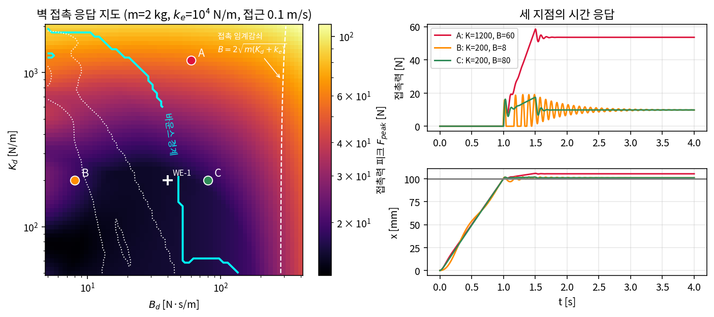
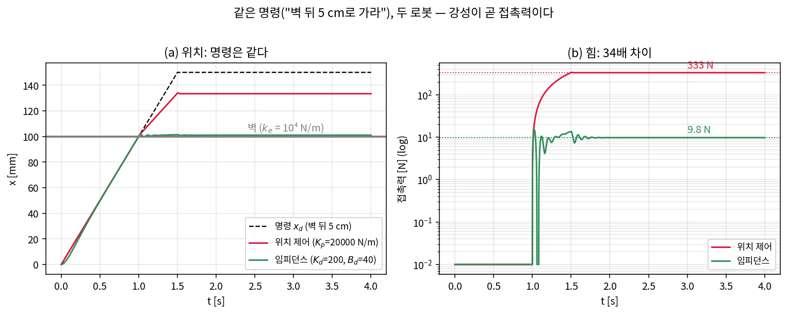
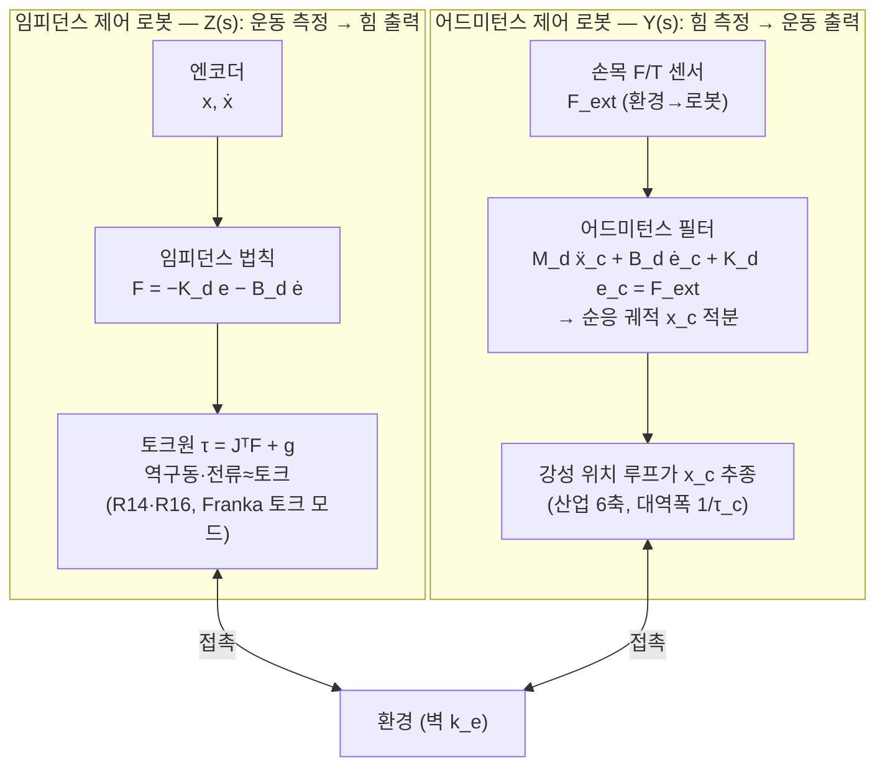
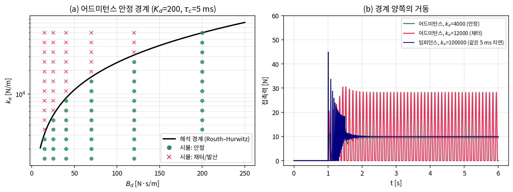
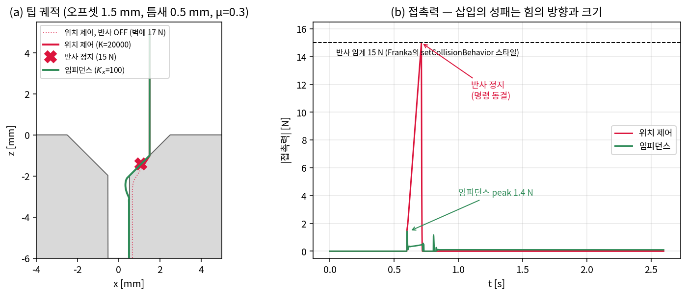
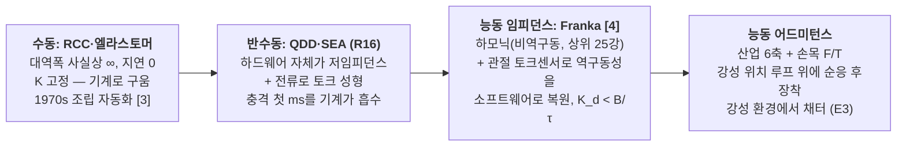

# Lec R21. 임피던스·컴플라이언스 제어 — 접촉을 다루는 법

> 하위제어 트랙 21일차 (Part R5 제어, 다섯 번째). 선수 지식: R10(매니퓰레이터 방정식·수동성), R12(접촉·마찰), R16(QDD·하드웨어 순응), R17(2차계·감쇠비·지연), R19(computed torque), R20(op-space·$\Lambda$·$\tau = J^\top F$).
> 기초 참고서: Modern Robotics(이하 MR) §11.7. 원전: Hogan 1985 [2]. 이 강의는 R19·R20의 "오차를 0으로 죽이는 제어"가 접촉에서 왜 틀린 목표가 되는지에서 출발해, MR §11.7의 임피던스/어드미턴스 알고리즘을 1-DoF 접촉 시뮬의 수치로 체감하는 방식으로 재구성한 것이다.

## 한 장 요약



질량 2 kg짜리 로봇(태스크 공간 겉보기 관성, R20의 $\Lambda$)이 0.1 m/s로 다가가 강성 $10^4$ N/m 벽을 누른다 — 명령은 "벽 뒤 5 cm". 왼쪽 지도는 임피던스 파라미터 $(K_d, B_d)$ 평면에서 접촉력 피크(색), 바운스 경계(하늘색), 정착 시간(점선)을 그린 것이다. A(고강성): 정상 접촉력 53.6 N — 힘이 세다. B(저감쇠): 4번 튀고 3초 가까이 채터. C(적정): 피크 17.5 N, 1.6초 정착. **오차를 0으로 만드는 능력이 아니라, 벽과 어떤 "관계"를 맺을지가 설계 변수다** — 오늘 강의는 이 지도를 손계산으로 읽고, 그릴 수 있게 되는 것이다.

## 학습 목표

1. 목표 임피던스 $M_d\ddot e + B_d\dot e + K_d e = F_{ext}$를 쓰고, "위치가 아니라 (운동↔힘의) 관계를 제어한다"는 Hogan의 중심 사상을 설명할 수 있다.
2. 위치 제어 로봇과 임피던스 로봇이 같은 벽에서 내는 정상 접촉력을 직렬 스프링 $k_s = K k_e/(K + k_e)$로 손계산하고(333 N vs 9.8 N, 34배), 접촉 순간 감쇠비가 추락하는 이유($\zeta \propto 1/\sqrt{K+k_e}$)를 유도할 수 있다.
3. 임피던스와 어드미턴스의 쌍대 — 무엇을 측정하고 무엇을 내는가 — 를 블록 다이어그램으로 그리고, 어떤 하드웨어(역구동 토크 로봇 vs 강성 위치 로봇)에 어느 쪽이 맞는지 논증할 수 있다.
4. 로봇+환경 **결합 시스템**의 특성방정식으로 접촉 안정성을 분석할 수 있다: 임피던스+지연의 한계 $K_d < B_d/\tau$ (환경 무관), 어드미턴스의 한계 $k_e < k_{e,max}(B_d, K_d)$ (강성 환경에서 파탄).
5. 수동 컴플라이언스(RCC)와 능동 컴플라이언스의 트레이드오프를 말하고, Franka 내장 임피던스 파라미터(관절 $[0, 14250]$ N·m/rad, 병진 $[10, 3000]$ N/m)를 오늘 지도 위에 놓을 수 있다.

## 왜 이 강의가 필요한가

R17부터 R20까지의 제어기는 전부 한 가지 목표를 향했다: 추종 오차를 0으로. 자유 공간에서는 옳다. 그런데 접촉하는 순간 이 목표는 **물리적으로 달성 불가능**해진다 — 벽 뒤 5 cm에 목표를 찍으면(표면 위치를 5 cm 잘못 알았다면 흔한 일이다) 오차 0은 벽을 뚫어야 달성된다. 오차를 0으로 죽이도록 튜닝된 제어기는 그 불가능에 힘으로 답한다: 강성 $2\times10^4$ N/m짜리 위치 제어는 $10^4$ N/m 벽에 **333 N**을 꽂는다(그림 2). 부품은 튕겨 나가고, 표면은 긁히고, 로봇은 e-stop.

근본 원인은 게인 튜닝이 아니라 **문제 설정**이다. 접촉이 생기면 로봇과 환경은 물리적으로 결합된 하나의 시스템이 되고, 그 인터페이스에서 위치와 힘을 **동시에 마음대로 정할 수 없다** — 위치를 정하면 힘은 환경이 정하고($F = k_e \delta$), 힘을 정하면 위치는 환경이 정한다. Hogan(1985)의 답 [2]: 그렇다면 로봇이 제어할 것은 위치도 힘도 아니고, 둘 사이의 **관계** — 외력에 대해 어떻게 물러날지의 동적 규칙, 즉 기계 임피던스다. 이것이 오늘의 중심 사상이고, R22(직접 힘 제어)가 "힘이 태스크 스펙일 때"의 다른 답을 다루면, R24(WBC)가 전신·다접촉으로 확장한다.

상위 트랙과의 연결이 특히 굵은 날이다. VLA의 action은 위치·관절각뿐이고 힘이 없다(상위 26강) — 그런데도 접촉 태스크가 실기에서 돌아가는 것은, 학습 정책 **아래층**에 오늘 배우는 임피던스가 깔려 있어서 "약간 틀린 위치 명령"이 힘 폭발 대신 부드러운 순응으로 번역되기 때문이다. Franka가 상위 25강의 로봇 표에서 "하모닉+전관절 토크센서"라는 비싼 구성을 고른 이유도, R16의 QDD가 같은 문제를 하드웨어로 푼 이유도 오늘 재조립된다.

## 본문

### 1. 접촉의 산수 — 강성이 곧 접촉력이다



*그림 2: 같은 명령("벽 뒤 5 cm로 가라"), 같은 벽($k_e = 10^4$ N/m), 다른 강성. (a) 위치는 둘 다 벽 근처에서 멈춘다 — 위치만 보면 큰 차이가 없다. (b) 힘은 34배 다르다: 위치 제어($K_p = 2\times10^4$ N/m) 333 N vs 임피던스($K_d = 200$) 9.8 N. 성패는 위치가 아니라 힘에서 갈린다.*

계산은 중학교 물리다. 로봇의 가상 스프링($K$)과 벽의 스프링($k_e$)이 **직렬**로 연결되므로, 명령을 벽 뒤 $\delta$만큼 넣으면 정상 접촉력은

$$
F_{ss} = \underbrace{\frac{K\,k_e}{K + k_e}}_{k_s\ (직렬\ 강성)} \cdot \delta
$$

$K \gg k_e$면 $k_s \to k_e$: 힘은 **벽의 강성으로** 커진다(위치 로봇이 금속을 만나면 재앙인 이유 — R22에서 이 민감도가 힘 제어의 출발점이 된다). $K \ll k_e$면 $k_s \to K$: 힘은 **내 강성으로** 제한된다 — 표면 위치를 몰라도 안전하다. 접촉을 다루는 첫째 원리: **불확실한 접촉에서는 내가 벽보다 물러야 한다.**

### 2. 핵심 수식

#### E1. 목표 임피던스 — 위치가 아니라 "관계"를 명령한다

**직관**: 제어기에게 "여기 있어라"(위치) 대신 "**이런 스프링-댐퍼-질량인 척 해라**"라고 명령한다. 목표점은 스프링의 걸이일 뿐이고, 로봇이 실제로 어디 있을지는 외력과의 협상으로 정해진다. 벽이 밀면 물러나고, 놓으면 돌아온다 — 접촉이 있든 없든 같은 법칙이 성립하므로, 접촉 감지·모드 전환이 **필요 없다**.

**물리·기하적 의미**: 오차 $e = x - x_d$에 대해 로봇 EEF가 가상의 질량-댐퍼-스프링(M-B-K)처럼 거동하게 만든다. $K_d$는 "밀리는 정도"(N/m), $B_d$는 "밀리는 속도에 대한 저항"(N·s/m), $M_d$는 "충격에 대한 관성"(kg)이다. R17의 PD 게인이 여기서 물리량으로 **재해석**된다: $K_p$는 사실 강성이었고 $K_d$는 감쇠였다 — 자유 공간에서는 수렴 속도의 튜닝 노브였던 것이, 접촉에서는 환경에 내는 힘의 직접 결정자가 된다.

**형식**: 외력 $F_{ext}$(환경이 로봇에 가하는 힘)에 대해 목표 거동은

$$
M_d\,\ddot e + B_d\,\dot e + K_d\,e = F_{ext} \qquad (\text{MR 식 11.64 [1]})
$$

토크 로봇에서의 구현은 R20의 op-space 법칙에서 한 항을 **빼는 것**이다. MR 식 11.65 [1]의 구조: $\tau = J^\top[\underbrace{\tilde\Lambda \ddot x + \tilde\eta}_{동역학\ 보상} - (M_d\ddot e + B_d \dot e + K_d e)]$. 실무 표준 단순화가 중요하다 — $\ddot x$ 측정은 노이즈 지옥이므로 **관성 성형 항을 버리고 $M_d = \Lambda(q)$(로봇 고유 관성)로 둔다**. 그러면 남는 것은:

$$
\tau = J^\top\big(-K_d\,e - B_d\,\dot e\big) + g(q)
\quad\Rightarrow\quad
\Lambda\,\ddot e + B_d\,\dot e + K_d\,e \approx F_{ext}
$$

R20 토론 질문 6의 답이 이것이다: **관성을 성형하지 않으면 힘 센서가 필요 없다** — 스프링·댐퍼는 위치·속도(엔코더)만으로 렌더링되고, $F_{ext}$는 측정하지 않아도 방정식이 알아서 성립한다(외력은 물리가 넣어 준다). 반대로 $M_d \ne \Lambda$로 바꾸고 싶으면 $F_{ext}$를 재서 되먹여야 한다(MR §11.7.1 [1]) — 접촉 순간의 충격을 결정하는 관성만은 소프트웨어로 공짜로 못 바꾼다(R16의 교훈 그대로).

접촉이 감쇠비를 훔쳐 간다는 것도 여기서 유도된다. 접촉 중 결합 강성은 $K_d + k_e$이므로:

$$
\zeta_{contact} = \frac{B_d}{2\sqrt{m\,(K_d + k_e)}} \ll \zeta_{free} = \frac{B_d}{2\sqrt{m\,K_d}}
$$

WE-1의 수치로 $\zeta$: 1.00 → **0.140** — 자유 공간에서 임계감쇠였던 게인이 벽을 만나는 순간 7배 언더댐핑이 된다(그림 1에서 접촉 임계감쇠선 $B = 2\sqrt{m(K_d + k_e)} \approx 286$이 우리가 쓰는 $B$보다 훨씬 오른쪽에 있는 이유). 접촉 튜닝을 자유 공간 감각으로 하면 안 되는 수학적 이유다.

#### E2. 임피던스 vs 어드미턴스 — 무엇을 재고, 무엇을 내는가

**직관**: 같은 관계식 (E1)을 구현하는 두 가지 인수분해가 있다. **임피던스 제어**: 운동을 재서(엔코더) 힘을 낸다 — "네가 나를 움직이면 나는 이만큼 저항하겠다". **어드미턴스 제어**: 힘을 재서(F/T 센서) 운동을 낸다 — "네가 나를 밀면 나는 이만큼 움직여 주겠다". 수학적으로는 서로 역함수($Y(s) = Z(s)^{-1}$, MR §11.7 [1])지만, **어느 쪽 신호를 측정하고 어느 쪽을 출력할 수 있는가는 하드웨어가 정한다.**



**물리·기하적 의미**: 임피던스 로봇은 "스프링-댐퍼인 척하는" 물리 법칙을 토크로 직접 새긴다 — 잘 되려면 토크가 곧 출력이어야 하므로 **역구동성**(감속비 작고 마찰 적음, R15·R16)이 관건이고, 마찰·백래시가 렌더링을 오염시키는 하한이 된다. 어드미턴스 로봇은 기존의 강성 위치 제어(대부분의 산업 로봇)를 **그대로 두고**, 그 위에 "측정한 힘 → 물러날 궤적"을 계산하는 필터를 얹는다(MR 식 11.66의 구조: $\ddot x_c = M_d^{-1}(F_{ext} - B_d\dot e_c - K_d e_c)$, $F_{ext}$는 E1과 같은 "환경이 로봇에 가하는 힘" [1]) — F/T 센서와 소프트웨어만으로 뻣뻣한 로봇에 순응을 후장착한다. 벽이 미는 방향($F_{ext} < 0$)으로 $x_c$가 물러나는 부호다.

**형식 — 쌍대의 실패 방향이 반대다** (MR §11.7.1~11.7.2의 결론 [1]):

| | 임피던스 제어 | 어드미턴스 제어 |
|---|---|---|
| 측정 → 출력 | 운동 → 힘 | 힘 → 운동 |
| 필요 하드웨어 | 토크원(역구동/토크센서) | 강성 위치 루프 + 손목 F/T |
| 잘하는 것 | **낮은 임피던스**(부드러움) 렌더링 | **높은 임피던스**(뻣뻣함) 렌더링 |
| 못하는 것 | 높은 강성 (지연·양자화 → 발진, E3) | 낮은 관성 (작은 힘 → 큰 가속 명령 → 발진) |
| 궁합 맞는 환경 | 강성 환경(벽·금속)도 안정 | 부드러운 환경·자유 공간 |
| 대표 기체 | Franka 토크 모드, QDD 다리(R16) | 산업 6축+F/T, 협동로봇 핸드가이딩 |

마지막 두 줄이 E3의 예고다: 각자 잘하는 강성 대역이 반대이고, **불안정해지는 환경도 반대다.**

#### E3. 접촉 안정성 — 로봇 혼자가 아니라 결합 시스템의 극점

**직관**: 접촉 순간 로봇과 벽은 하나의 진동계가 된다. 안정성은 로봇 제어기 단독이 아니라 **로봇+환경 결합 시스템**의 특성방정식이 정한다 — 그래서 "실험실 벽에서는 멀쩡했는데 고객사 금속 지그에서 발진"이 일어난다. 환경이 루프 게인의 일부인 것이다.

**물리·기하적 의미**: 두 구현 모두 완벽하면(지연 0) 수동성(R10)에 의해 어떤 수동 환경과도 안정이다. 문제는 **지연**이다 — 임피던스는 액추에이터·토크루프 지연($\tau$), 어드미턴스는 내부 위치 루프의 유한 대역폭($\tau_c$)이 끼어들며, 지연은 위상을 깎는다(R17). 어느 쪽이 먼저 부러지는지가 쌍대적으로 갈린다.

**형식**: 1-DoF, 1차 지연 $\tau$를 넣고 접촉 중 특성방정식을 쓰면(유도는 WE-3):

$$
\text{임피던스: } \tau m s^3 + m s^2 + (B_d + \tau k_e)s + (K_d + k_e) = 0
\;\;\xrightarrow{\text{Routh–Hurwitz}}\;\;
\boxed{K_d < B_d/\tau}\ \ (k_e\ \text{무관!})
$$

$$
\text{어드미턴스: } (\tau_c s + 1)(M_d s^2 + B_d s + K_d) + k_e = 0
\;\;\xrightarrow{\text{R–H}}\;\;
\boxed{k_e < \frac{(M_d + \tau_c B_d)(B_d + \tau_c K_d)}{\tau_c M_d} - K_d}
$$

임피던스의 한계는 **자기 강성의 상한**이다 — $B_d = 40$, $\tau = 5$ ms면 $K_d < 8000$ N/m. 환경이 아무리 단단해도($k_e = 10^6$에서도 결합 극점 최대 실부 $-0.72 < 0$ — 검증 코드) 안정이 유지된다. 어드미턴스의 한계는 **환경 강성의 상한**이다 — 같은 $(K_d{=}200, B_d{=}40, M_d{=}2, \tau_c{=}5\,\mathrm{ms})$로 $k_{e,max} = 8820$ N/m: 고무는 되고 금속은 안 된다. 어드미턴스 로봇을 강성 환경에 대면 접촉력이 채터(접촉-이탈 반복)로 폭주하는 것이 그림 3(b)다. **부드러운 로봇 흉내(어드미턴스)는 단단한 세상에서 부러지고, 단단한 로봇 흉내(임피던스)는 자기 지연에 부러진다.**



*그림 3: (a) 어드미턴스 안정 경계 — Routh–Hurwitz 해석 곡선(검정)과 시뮬 분류(초록 안정/빨강 채터)가 일치. $B_d$를 키우면 버티는 $k_e$가 늘지만 상한은 유한하다. (b) 경계 양쪽의 시간 응답: $k_e = 4000$은 정착, $12000$은 영구 채터. 같은 5 ms 지연을 가진 임피던스 로봇(남색)은 $k_e = 10^5$에서도 정착한다.*

### 3. Worked Example

#### WE-1 (손계산 + 검증): 벽 접촉의 산수 전부

설정: $m = 2$ kg, $k_e = 10^4$ N/m, 벽 $x_w = 0.10$ m, 명령 $x_{goal} = 0.15$ m(벽 뒤 5 cm), 접근 0.1 m/s. 임피던스 $K_d = 200$, $B_d = 40$.

**① 정상 접촉력**: $k_s = \frac{200 \times 10^4}{200 + 10^4} = 196.08$ N/m, $F_{ss} = 196.08 \times 0.05 = 9.80$ N.
**② 위치 제어와 비교**: $K_p = 2\times10^4 \Rightarrow k_s = 6666.7$ N/m, $F_{ss} = 333.3$ N — **34.0배**.
**③ 접촉 감쇠비**: $\zeta_{free} = \frac{40}{2\sqrt{2 \cdot 200}} = 1.00$(임계감쇠) → $\zeta_{contact} = \frac{40}{2\sqrt{2 \cdot 10200}} = 0.140$, $\omega_n = \sqrt{10200/2} = 71.4$ rad/s. 언더댐핑이므로 힘 오버슛을 예상: 시뮬 실측 $F_{peak} = 15.10$ N($F_{ss}$의 1.54배), 바운스 1회, 5% 정착 1.69 s.

**검증 코드** (전체: `images/lecR21/gen_figs.py`):

```python
m, ke, delta = 2.0, 1.0e4, 0.05
K, B = 200.0, 40.0
ks = K*ke/(K + ke)
print(ks, ks*delta)                          # 196.08, 9.804 N
print(B/(2*np.sqrt(m*K)), B/(2*np.sqrt(m*(K+ke))))   # 1.00, 0.140
Fp, bounce, t_settle, Fss = sim_impedance(K, B)      # 접촉 시뮬 (dt=1e-4)
print(Fp[0], bounce[0], t_settle[0])         # 15.10 N, 1회, 1.69 s
```

#### WE-2 (코드): $K_d \cdot B_d$ 스윕 — 접촉 응답의 지도 (그림 1)

한 장 요약의 지도. $K_d \in [50, 2000]$, $B_d \in [5, 400]$ 로그 격자 60×60 = 3600개 시뮬을 벡터화로 돌린 것이다. 시뮬 한 개의 뼈대는 오일러 적분 다섯 줄이다 (전체: `images/lecR21/gen_figs.py`):

```python
def sim_impedance(K, B, ke=1e4, dt=1e-4):        # K, B 는 배열로 넣으면 3600개 동시 시뮬
    x = v = 0.0
    for t in np.arange(0, 6.0, dt):
        xd, vd = xd_of(t)                        # 벽 뒤 5 cm 로 0.1 m/s 램프
        Fc = ke * np.clip(x - x_w, 0.0, None)    # 벽 = 단방향 스프링 (R12의 페널티 모델)
        u  = K*(xd - x) + B*(vd - v)             # E1: 임피던스 법칙 (M_d = m 그대로)
        v += dt * (u - Fc) / m                   # 접촉력 피크·바운스·정착시간을 기록
        x += v * dt
```

접촉이 조건문 하나(`clip`)로 들어오는 것에 주목 — 제어 법칙 `u`에는 접촉 관련 분기가 **없다**. E1에서 말한 "접촉 감지 불필요"가 코드에서는 이렇게 보인다. 세 지점의 정량 비교:

| 지점 | $(K_d, B_d)$ | $F_{ss}$ | $F_{peak}$ (배율) | 바운스 | 5% 정착 |
|---|---|---|---|---|---|
| A 고강성 | (1200, 60) | 53.6 N | 58.5 N (1.09×) | 0회 | 1.52 s |
| B 저감쇠 | (200, 8) | 9.8 N | 19.1 N (1.95×) | **4회** | 2.94 s |
| C 적정 | (200, 80) | 9.8 N | 17.5 N (1.78×) | 0회 | 1.64 s |

읽는 법: ① 정상 힘은 $K_d$가 정한다(색이 세로로 변함 — A는 깔끔하지만 힘 자체가 5배). ② 바운스는 $B_d$가 정한다(하늘색 경계 왼쪽이 접촉-이탈 반복 구역 — 접촉 유지가 목표라면 출입 금지). ③ 접촉 임계감쇠선($B = 2\sqrt{m(K_d + k_e)}$, 흰 점선)은 지도의 오른쪽 끝 — 실무 튜닝은 전부 언더댐핑 영역에서 벌어진다. 태스크가 "부드럽게 만나서 유지"라면 남서쪽(낮은 $K$)에서 바운스 경계 오른쪽($B$ 충분)이 답이다.

#### WE-3 (손계산 + 코드): 결합 특성방정식과 쌍대 한계 (그림 3)

**어드미턴스 유도**: 접촉 중 $F = k_e x$(로봇이 벽을 누르는 힘, 즉 $-F_{ext}$; regulation, $x_d = 0$ 근방). 내부 위치 루프를 1차 $x = x_c/(\tau_c s + 1)$로, 필터를 E2대로 $(M_d s^2 + B_d s + K_d)x_c = F_{ext} = -F$로 놓고 결합하면 $(\tau_c s + 1)(M_d s^2 + B_d s + K_d) + k_e = 0$. 3차식 $a_3 s^3 + a_2 s^2 + a_1 s + a_0$의 Routh–Hurwitz 조건 $a_2 a_1 > a_3 a_0$:

$$
(M_d + \tau_c B_d)(B_d + \tau_c K_d) > \tau_c M_d (K_d + k_e)
\;\Rightarrow\;
k_{e,max} = \frac{(2 + 0.005{\cdot}40)(40 + 0.005{\cdot}200)}{0.005 \cdot 2} - 200 = \frac{2.2 \times 41}{0.01} - 200 = 8820\ \mathrm{N/m}
$$

시뮬 전환 실측: 8474~8684 N/m(시뮬 판정 기준은 말미 2초 진동폭 > $0.2 F_{ss}$ — 경계 바로 아래의 느린 감쇠가 불안정으로 분류되어 해석값보다 약간 이르다. 해석 8820과 부합, 그림 3a의 곡선). **임피던스 유도**: 같은 지연을 토크 경로에 넣으면 $(ms^2 + k_e)(\tau s + 1) + B_d s + K_d = 0$, R–H 조건은 $m(B_d + \tau k_e) > \tau m(K_d + k_e)$ — 양변의 $\tau k_e$가 **소거**되어 $B_d > \tau K_d$, 즉 $K_d < B_d/\tau = 8000$ N/m. 환경이 식에서 사라진다. 시뮬 확인: $K_d = 6000$ 안정(피크 192.7 N, 바운스 0), $K_d = 10000$ 발산(바운스 64회). 결합 극점 직접 계산:

```python
tau, m = 5e-3, 2.0
# 임피던스+지연(τ=5ms): 어떤 ke 에서도 안정 (K=200, B=40)
for ke in (1e4, 1e5, 1e6):
    r = np.roots([tau*m, m, 40 + tau*ke, 200 + ke])
    print(ke, r.real.max())      # -9.31, -4.30, -0.72  (전부 < 0)
# 어드미턴스: ke 가 크면 불안정
for ke in (4e3, 1e4, 1e5):
    poly = np.polymul([tau, 1.0], [2.0, 40.0, 200.0]); poly[-1] += ke
    print(ke, np.roots(poly).real.max())   # -5.00, +1.10, +45.32
```

같은 지연, 같은 게인 — 임피던스는 벽이 단단할수록 극점이 허수축에 접근만 하고($-0.72$), 어드미턴스는 $k_e = 10^4$에서 이미 넘는다($+1.10$). E2 표의 "궁합" 행이 이 수치다.

#### WE-4 (코드): peg-in-hole 미니 — 재밍의 물리와 컴플라이언스의 답 (그림 4)

2-DoF 질점 peg(0.5 kg)를 틈새 0.5 mm 구멍에 10 mm/s로 내린다. 챔퍼 2 mm(45°), 마찰 $\mu = 0.3$, 횡방향 정렬 오차 **1.5 mm**(비전·캘리브레이션 오차로 흔한 수준). 안전 반사: 접촉력 15 N 초과 시 정지(Franka의 `setCollisionBehavior` 스타일 [4]). 제어는 WE-2의 법칙을 축별 대각 행렬로 확장한 것뿐이다:

```python
def sim_peg(Kx, Kz, x_off=1.5e-3, dt=1e-5, F_stop=15.0):
    K = np.array([Kx, Kz]); B = 2*np.sqrt(m_peg*K)       # 축별 임계감쇠
    p = np.array([x_off, 5*mm]); v = np.zeros(2); stopped = None
    for t in np.arange(0, 2.6, dt):
        z_d = max(5*mm - v_down*t, -15*mm)               # 명령: 오프셋 그대로 하강
        pd = np.array([x_off, z_d]); vd = np.array([0.0, -v_down if z_d > -15*mm else 0.0])
        Fc = contact_force(p, v)                         # 윗면·챔퍼·구멍벽 + 쿨롱 마찰(R12)
        if F_stop and stopped is None and np.linalg.norm(Fc) > F_stop:
            stopped = t                                  # 반사: 15 N 초과 → 이후 명령 동결
        if stopped is not None: pd, vd = p.copy(), np.zeros(2)
        u = K*(pd - p) + B*(vd - v)
        v += dt*(u + Fc)/m_peg;  p += v*dt
```

| 제어 | $(K_x, K_z)$ | 결과 | 최종 깊이 | $F_{peak}$ |
|---|---|---|---|---|
| 강성 위치 제어 | (20000, 20000) | **재밍 — 반사 정지 (t=0.71 s)** | −1.42 mm | 15.0 N |
| 같은 제어, 반사 OFF | (20000, 20000) | 들어가긴 함 — 벽을 갈면서 | −14.98 mm | 31.0 N (말미 16.7 N 유지) |
| 컴플라이언스 | ($K_x{=}100$, $K_z{=}1500$) | **성공** | −15.00 mm | **1.44 N** |



*그림 4: (a) 팁 궤적 — 위치 제어(빨강)는 챔퍼에서 15 N을 때려 반사 정지(X). 반사를 끄면(점선) 들어가지만 벽에 17 N을 유지하며 간다. 컴플라이언스(초록)는 챔퍼 반력이 페그를 옆으로 밀어 구멍 중심으로 스스로 정렬된다. (b) 접촉력 이력 — 성패는 힘의 크기와 방향에서 갈린다.*

메커니즘이 교훈이다. 강성 위치 제어는 "명령 위치가 옳다"고 우기므로 챔퍼 반력이 커질 뿐 횡방향으로 물러나지 않는다 — 오차 1.5 mm를 힘 15 N으로 번역하고 멈춘다(재밍의 준정적 분석이 Whitney 1982 [3]). 횡방향이 무른($K_x = 100$) 컴플라이언스는 챔퍼의 경사 반력을 **정렬 신호로 사용**한다: 반력의 횡성분이 페그를 구멍 쪽으로 밀고, 로봇은 순순히 밀려서 중심을 찾는다. 환경의 기하가 공짜 피드백 제어기가 되는 것 — 이것을 기계 장치(엘라스토머 스프링)로 구운 것이 **RCC**(Remote Center Compliance, 아래 §4)다. 방향별 강성 설계에도 주목하라: 진행 방향($z$)은 단단히(1500 — 삽입력 전달), 정렬 방향($x$)은 무르게(100) — 강성은 스칼라가 아니라 **태스크 기하에 맞추는 행렬**이다.

세 번째 행(반사 OFF)은 실무에서 자주 놓치는 함정이다. 반사를 꺼 버리면 강성 제어도 "성공"처럼 보인다 — 깊이는 들어갔으니까. 그러나 힘 이력을 보면 구멍 벽을 **17 N으로 갈면서** 내려간 것이다(그림 4a 점선): 성공률 지표에는 안 잡히고 부품 긁힘·마모·발열로 나타나는 실패다. 상위 30강에서 본 "데모 영상 vs 수치" 문제의 물리판 — 접촉 태스크의 평가는 성공률만이 아니라 **힘 이력**을 봐야 한다.

### 4. 컴플라이언스의 스펙트럼 — 기계에서 소프트웨어까지



왼쪽으로 갈수록 빠르고(지연 0) 확실하지만 굳어 있고, 오른쪽으로 갈수록 유연하지만(태스크마다 $K, B$ 재프로그램) 지연·대역폭의 세금(E3)을 낸다. 실전 시스템은 섞는다 — 어차피 관절·링크의 유연성으로 약간의 수동 컴플라이언스는 항상 존재하고(MR §11.6 끝 [1]), 그 위에 능동층을 쌓는 것이다.

**RCC가 "Remote"인 이유** [3]: 손목에 스프링을 그냥 달면 컴플라이언스 중심이 손목에 생겨서, 페그 끝의 접촉력이 손목 둘레의 **회전**을 만든다 — 페그가 기울며 구멍에 두 점으로 끼이는 웨징(wedging)의 지름길이다. RCC는 스프링·링크 기하를 조합해 컴플라이언스 중심을 장치 바깥, **페그 끝단**에 투영한다: 끝단의 횡력은 순수 병진으로, 모멘트는 끝단 둘레 순수 회전으로 응답해 재밍·웨징 조건(Whitney의 준정적 기하 분석 [3])을 피한다. WE-4를 질점으로 단순화하며 숨긴 회전 자유도가 실물 삽입에서는 이만큼 중요하다 — 능동 임피던스로 같은 효과를 내려면 강성 행렬 $K_d$를 끝단 좌표계에서 대각으로 설계하면 된다(R20의 태스크 좌표 선택 문제와 동일한 구도).

**관절 강성과 태스크 강성의 환율**: Franka의 두 인터페이스(관절/Cartesian)는 같은 것의 두 좌표 표현이다. 관절 스프링 $\tau = -K_\theta\,\Delta q$를 EEF에서 보면, $\Delta q = J^{-1}\Delta x$와 $F = J^{-\top}\tau$(R05의 쌍대)를 꿰어

$$
K_x = J^{-\top}(q)\,K_\theta\,J^{-1}(q)
$$

— 강성은 벡터가 아니라 **합동 변환(congruence)으로 좌표를 갈아입는 2차형식**이다(R20의 $\Lambda$와 같은 변환 족). 수치 감각: R20 WE-1의 자세($J = \begin{bmatrix} -1 & -1 \\ 1 & 0 \end{bmatrix}$)에서 관절 강성 $K_\theta = \mathrm{diag}(3000, 2000)$ N·m/rad을 넣으면 $K_x = \begin{bmatrix} 2000 & 2000 \\ 2000 & 5000 \end{bmatrix}$ N/m, 고유값 **1000~6000 N/m** — 대각 관절 강성이 EEF에서는 방향 따라 6배 다른 **기울어진 타원**이 된다(검증: `gen_figs.py`). 관절 임피던스만 설정하고 "EEF가 균일하게 부드럽다"고 착각하면 안 되는 이유이고, 태스크가 접촉 방향을 아는 경우 Cartesian 인터페이스가 맞는 이유다.

**Franka 내장 임피던스의 실체** [4]: FCI 문서 기준으로 이렇게 읽으면 된다. ① 위치·속도 명령 모드에서는 **내부 관절 임피던스 컨트롤러**가 항상 아래에 깔려 있고, `setJointImpedance`로 관절 강성 $K_\theta \in [0, 14250]$ N·m/rad를, `setCartesianImpedance`로 EEF 강성(병진 $[10, 3000]$ N/m, 회전 $[1, 300]$ N·m/rad)을 지정한다 — 오늘 지도(그림 1)에서 병진 최대 3000 N/m는 "산업 로봇처럼 뻣뻣" 코너다($k_e = 10^4$ 벽에 5 cm 오차 시 $F_{ss} \approx 115$ N). ② 반면 **토크 명령 모드에서는 이 내장 임피던스가 적용되지 않는다**("user-provided torques are not affected") — 중력·마찰만 자동 보상되고, E1의 법칙을 사용자가 1 kHz로 직접 짠다. 즉 "Franka의 임피던스"는 하드웨어 스프링이 아니라, 토크센서 피드백 위에서 도는 **소프트웨어 렌더링**이다 — 상위 25강에서 "하모닉+전관절 토크센서" 구성을 QDD와 대비했던 것이 정확히 이 지점이다: 하모닉의 비역구동성·마찰을 토크센서 루프로 지워 역구동성을 흉내 내고, 그 위에 임피던스를 렌더링한다. ③ WE-4의 15 N 반사는 `setCollisionBehavior`(접촉/충돌 힘 임계) 계열 안전층의 모사다.

### 딥러닝 배경자를 위한 번역

- **임피던스 성형 = 손실함수 성형이다.** 가상 스프링의 포텐셜 $V = \frac{1}{2}e^\top K_d e$는 문자 그대로 **이차 손실 지형**이고, 로봇의 물리는 그 위에서 momentum($\Lambda$)과 감쇠($B_d$)를 가진 gradient flow를 실행한다(R20 번역 박스의 연장). 접촉은 지형에 갑자기 나타나는 **제약**이다. 강성 위치 제어 = 제약 위반에 거대한 penalty weight — 제약 근처에서 gradient(힘)가 폭발한다. 임피던스를 낮추는 것 = penalty를 soft하게 — 제약과 손실이 온건한 힘으로 협상한다. $K_d$ 행렬의 방향별 설계(WE-4)는 좌표별 가중치가 다른 손실 설계다.
- **"위치가 아니라 관계를 학습" — 컴플라이언스가 접촉 태스크 학습을 쉽게 만드는 이유** (상위 26강 질문 4의 답). action이 위치 셋포인트뿐이어도, 그 아래층이 임피던스면 "action 오차 → 접촉력"의 사상이 기울기 $k_s \approx K_d$짜리 온건한 선형이 된다: 1.5 mm 틀린 action이 1.4 N(성공)이 되느냐 15 N(재밍·에피소드 종료)이 되느냐가 아래층 강성에서 갈린다(WE-4). 학습 관점에서 전자는 **매끄러운 보상 지형**, 후자는 절벽이다. residual policy(고전 제어기 위에 잔차만 학습, R19 읽을거리)와 임피던스 게인을 action에 포함하는 variable impedance action space가 접촉 학습에서 유리하다고 보고되는 구조적 이유가 이것이다.
- **임피던스/어드미턴스 = 같은 관계의 두 인수분해 — 어느 변수를 예측하고 어느 변수를 적분할 것인가.** $Z$와 $Y = Z^{-1}$은 수학적으로 등가지만, 노이즈가 어느 입력에 실리고 어느 출력이 물리적으로 싸게 나오는지에 따라 실패 모드가 갈린다(E2 표) — forward model과 inverse model 중 무엇을 학습할지 고르는 문제와 같은 구도다.
- **접촉 안정 한계 $K_d < B_d/\tau$는 학습률 상한과 동형이다.** R17에서 "지연 = stale gradient"였다 — 여기서도 지연 $\tau$가 렌더링 가능한 곡률(강성)의 상한을 정한다. 곡률 큰 손실(뻣뻣한 스프링)일수록 stale한 업데이트가 발산을 부르는 것: $\eta < 2/\lambda_{max}$의 물리판. 그림 1은 문자 그대로 하이퍼파라미터 안정성 지도다.

## 흔한 오해

1. **"임피던스 제어는 힘 제어의 일종이다 — 원하는 힘을 명령한다"** — 아니다. 임피던스 제어는 힘을 명령하지 않는다. 힘은 위치 오차의 **부산물**($F \approx k_s\,\delta$)이고, 원하는 힘을 정확히 내려면 표면 위치를 알아야 한다(모르는 게 현실). "표면에 정확히 5 N"이 태스크 스펙이면 힘을 측정해서 피드백하는 직접 힘 제어가 필요하다 — R22의 주제. 임피던스는 "힘의 크기를 지정"이 아니라 "힘이 커지는 방식을 지정"하는 간접 힘 제어다(간접/직접 분류는 [5]).
2. **"부드러울수록(저강성) 항상 안전하고 좋다"** — 공짜가 아니다. $K_d$를 낮추면 자유 공간 추종이 무너지고(중력·마찰 잔차에 밀림 — R19에서 모델 보상이 필요했던 이유), 외란에 흐느적거리며, 삽입력도 못 낸다(WE-4에서 $K_z$는 1500으로 **높게** 둔 이유). 감쇠도 마찬가지: 그림 1의 B 지점처럼 $B_d$가 부족하면 저강성이어도 4번 튀며, 접촉 유지가 목표인 태스크에서는 바운스가 실패다. 정답은 "무조건 무르게"가 아니라 **태스크 방향별로 필요한 만큼만** — 그리고 그 지도가 그림 1이다.
3. **"Franka 같은 토크 로봇이면 어떤 임피던스든 렌더링할 수 있다"** — 렌더링 가능한 임피던스 범위(햅틱스의 Z-width [6])는 양끝이 다 막혀 있다. 위는 지연이 막고($K_d < B_d/\tau$, E3 — 토크루프·센서 지연이 있는 한 유한), 아래는 마찰·백래시·토크 리플이 막는다(0.1 N을 렌더링하고 싶어도 정지마찰이 그보다 크면 불가능 — 하모닉의 마찰을 토크센서로 지우는 Franka 방식과 애초에 마찰이 작은 QDD 방식이 갈리는 지점, R16). 관성의 하한도 있다: $M_d < \Lambda$ 렌더링은 가속도 측정·힘 센서 없이는 안 되고(E1), 충격의 첫 수 ms는 어차피 제어 대역 밖이라 하드웨어 관성이 그대로 나타난다(R16 오해 4).
4. **"어드미턴스 제어는 임피던스를 못 쓰는 로봇의 열화판이다"** — 반대 방향의 강점이 있다. 높은 강성 렌더링은 어드미턴스가 **더 잘한다**(강성 위치 루프를 그대로 쓰므로 — MR §11.7.2 [1]). 사람 손을 잡고 가르치는 핸드가이딩(부드러운 환경), 무거운 부품의 파워 어시스트가 어드미턴스의 홈그라운드다. 갈리는 기준은 우열이 아니라 ① 가진 하드웨어(토크원인가, 위치 루프+F/T인가)와 ② 만날 환경의 강성(E3의 쌍대 한계)이다.

## 실습 (1.5~2시간)

**MuJoCo로 접촉 실험 — 페널티 시뮬을 물리엔진으로 재현하기.** (CPU로 충분. 검증 스크립트: `images/lecR21/check_mujoco.py`)

1. **(10분) 모델 만들기**: 슬라이드 관절 하나짜리 질량 2 kg + 벽.

```xml
<mujoco model="wall1d">
  <option timestep="1e-4" gravity="0 0 0"/>
  <worldbody>
    <body name="mass">
      <joint name="x" type="slide" axis="1 0 0"/>
      <geom name="tip" type="sphere" size="0.05" mass="2"
            solref="-2500 -1" solimp="0.5 0.5 0.001" condim="1"/>
    </body>
    <!-- 벽 왼면 x=0.15 → 반경 0.05 구의 중심이 x_w=0.10 에서 접촉 -->
    <geom name="wall" type="box" pos="0.25 0 0" size="0.1 0.2 0.2"
          solref="-2500 -1" solimp="0.5 0.5 0.001" condim="1"/>
  </worldbody>
</mujoco>
```

   음수 `solref`는 (강성, 감쇠) 직접 지정 문법인데, **유효 강성은 solimp의 $d_{max}$ 제곱으로 나뉘어 $2500/0.5^2 = 10^4$ N/m가 된다** [7]. 시뮬의 접촉 파라미터가 이렇게 뒤에서 조정되는 메커니즘은 R26에서 해부한다. 침투가 구 반경을 넘으면 접촉 모델이 왜곡되므로 반경을 넉넉히(0.05 m) 잡을 것.
2. **(25분) 그림 1·2 재현**: E1의 임피던스 법칙을 `d.qfrc_applied`로 넣고 같은 램프 명령을 준다. 재현 목표(`check_mujoco.py` 실행 출력, 접촉력은 `mj_contactForce`의 법선 성분):

| 설정 | $F_{ss}$ (직렬 예측) | $F_{peak}$ | 바운스 |
|---|---|---|---|
| WE-1: $K{=}200, B{=}40$ | 9.80 N (9.80) | 13.63 N | 1회 |
| B: $K{=}200, B{=}8$ | 9.80 N (9.80) | 16.25 N | 4회 |
| A: $K{=}1200, B{=}60$ | 53.57 N (53.57) | 58.41 N | 0회 |
| 위치 제어 $K{=}2{\times}10^4$ | **333.33 N** (333.33) | 337.89 N | 0회 |

   정상 접촉력이 손계산(WE-1)과 소수점까지 일치하는지, 바운스 횟수가 페널티 시뮬(그림 1의 B: 4회)과 재현되는지 확인하라. $F_{peak}$는 접촉 모델(페널티 vs 솔버)에 따라 다소 다르다 — 정상값은 물리(직렬 스프링)가, 과도값은 접촉 모델이 정한다는 것 자체가 R26의 예고다.
3. **(25분) 어드미턴스로 개조**: 같은 모델에서 제어를 바꾼다 — 측정한 접촉력을 어드미턴스 필터(MR 식 11.66)에 넣어 순응 궤적 $x_c$를 적분하고, 내부 위치 루프(1차 지연 $\tau_c = 5$ ms: `x += dt/tau_c*(xc - x)` 대신 고게인 PD로 구현해도 좋다)가 추종하게 한다. 벽 강성을 `solref` 첫 값으로 스윕하며($10^3 \to 6{\times}10^3$, 유효 강성 $4{\times}10^3 \to 2.4{\times}10^4$ N/m — 해석 경계를 가운데 두는 범위) 채터가 시작되는 $k_e$를 찾아 WE-3의 해석 경계 8820 N/m와 비교하라.
4. **(30분) 2-DoF peg-in-hole**: `gen_figs.py`의 WE-4 기하(틈새 0.5 mm, 챔퍼 2 mm)를 MuJoCo XML(box 3개로 구멍 만들기)로 옮기고, $(K_x, K_z) = (20000, 20000)$과 $(100, 1500)$을 비교한다. 반사 정지(15 N)를 넣으면 강성 쪽이 챔퍼에서 멈추는가? $x$ 오프셋을 0.5~3 mm로 스윕해 "컴플라이언스가 구제 가능한 오차 범위"를 찾아보라.
5. **(20분) Franka 워크시트**: FCI 문서 [4]의 `setCartesianImpedance` 범위(병진 10~3000 N/m)를 그림 1 지도 위에 가로선 두 개로 그려 넣어라. ① 최소 10 N/m와 최대 3000 N/m 각각에서 $k_e = 10^4$ 벽에 5 cm 위치 오차가 몇 N이 되는지 계산하고, ② 조립 태스크에 권할 강성 대역과 그 이유, ③ "토크 모드에서는 이 파라미터가 무의미한 이유"를 한 단락으로 정리해 Claude에게 검증받는다.

## Claude와 토론할 질문

1. 임피던스 제어기는 접촉 감지도 모드 전환도 없이 자유 공간과 접촉을 같은 법칙으로 통과한다(E1). 이것이 "접촉 시점이 불확실한" 태스크(표면 위치 오차, 물체 위치 오차)에서 왜 구조적 강건성인지, 하이브리드 제어(R22에서 배울 모드 전환)와 대비해 논하라.
2. R20 질문 6의 답을 완성하라: $M_d = \Lambda$(관성 성형 포기)면 힘 센서가 왜 필요 없는지 E1의 식에서 보이고, 반대로 $M_d = \Lambda/10$(가벼운 척)을 렌더링하려면 무엇을 측정해 어떤 항을 만들어야 하는지, 그것이 왜 노이즈에 취약한지(MR §11.7.1) 설명하라.
3. E3의 쌍대 — 임피던스 한계는 $K_d < B_d/\tau$(환경 무관), 어드미턴스 한계는 $k_e$ 상한(자기 게인으로 조정 가능) — 를 근거로, 다음 조합의 안정성을 예측하라: ① Franka 토크 모드로 금속 지그 디버링, ② 산업 6축+F/T 어드미턴스로 같은 작업, ③ 같은 어드미턴스로 사람 손 잡고 티칭. 예측 후 각 조합의 실무 처방(게인·필터·모드)을 설계하라.
4. Z-width(오해 3)의 양끝을 하드웨어 계보로 분해하라: 지연은 위를, 마찰은 아래를 깎는다 — 그러면 QDD(R16), 하모닉+토크센서(Franka), 하모닉+F/T 없는 산업 로봇 각각의 Z-width는 어떤 모양인가? "보행 로봇이 QDD를 고른 이유"를 접촉 임피던스의 언어로 다시 말해 보라.
5. RCC(수동)는 대역폭이 사실상 무한한데 왜 모든 로봇이 RCC를 달지 않는가? "태스크마다 다른 K가 필요하다"는 답에서 출발해, 수동+능동 하이브리드(예: 부드러운 그리퍼 패드 + 능동 임피던스)의 설계 공간을 논하라 — 관절·링크 유연성이라는 "공짜 수동 컴플라이언스"(MR §11.6)는 어느 쪽에 넣어야 하나?
6. VLA의 action space에 강성을 추가한다고 하자(variable impedance action: $[\Delta x, K_d]$). 학습 관점의 득(접촉 태스크의 보상 지형 평탄화, 태스크별 순응 조절)과 실(action 차원 증가, 데모에서 강성 라벨을 어떻게 얻나 — teleop 기기는 강성을 기록하지 않는다)을 상위 26강의 action 목록과 연결해 논증하라.
7. 사람 팔은 공동수축(co-contraction — 길항근을 동시에 당김)으로 관절 강성을 실시간으로 올린다. 에너지를 이중으로 쓰는 비효율인데도 정밀 작업·불확실한 접촉 직전에 사람이 이것을 하는 이유를 오늘의 언어(E1·E3)로 설명하고, 로봇의 "가변 강성 액추에이터(VSA)"가 무엇을 흉내 내려는 것인지 논하라.

## 읽을거리

1. **MR §11.7** [1] (~30분): 임피던스 정의($Z(s)$, 식 11.62~11.64), 임피던스/어드미턴스 알고리즘(§11.7.1~11.7.2)의 원전. 우리가 1-DoF 수치로 채운 뼈대가 그대로 있다. §11.5~11.6(힘·하이브리드)은 R22에서 읽는다.
2. **Hogan 1985 Part I** [2] (§1~3만, ~40분): "환경은 어드미턴스, 조작기는 임피던스여야 한다"는 원전의 논증과 '관계를 제어한다'는 문제 설정. 수식 전개보다 서론·문제 설정의 언어를 읽는 것이 목적.
3. **Franka FCI 문서** [4] (내장 컨트롤러·인터페이스 절, ~20분): `setJointImpedance`/`setCartesianImpedance`/토크 모드의 실물 스펙 — 실습 5의 재료.

## 자가 점검

1. $M_d\ddot e + B_d\dot e + K_d e = F_{ext}$의 각 항을 물리로 설명하고, "위치가 아니라 관계를 제어한다"를 위치 제어와의 차이(같은 명령, 34배 힘 — WE-1)로 수치까지 들어 말할 수 있는가?
2. 직렬 강성 $k_s = K k_e/(K+k_e)$에서 두 극한($K \gg k_e$, $K \ll k_e$)의 의미와, 접촉 감쇠비 추락($\zeta$: 1.00 → 0.140)을 손으로 유도할 수 있는가?
3. 임피던스와 어드미턴스가 각각 무엇을 측정하고 무엇을 내는지, 어느 하드웨어·환경과 궁합인지 표(E2)를 백지에 재현할 수 있는가?
4. 결합 특성방정식에서 임피던스 한계 $K_d < B_d/\tau = 8000$과 어드미턴스 한계 $k_{e,max} = 8820$을 Routh–Hurwitz로 유도하고, "$\tau k_e$가 소거되는" 임피던스 쪽의 특별함을 짚을 수 있는가?
5. peg-in-hole에서 강성 제어가 재밍하고(1.5 mm → 15 N 반사 정지) 컴플라이언스가 성공하는(1.44 N) 메커니즘 — 챔퍼 반력을 정렬 신호로 쓰는 — 을 설명하고, $K_x \ne K_z$로 둔 이유를 말할 수 있는가?

## 참고문헌

> 웹 문서는 2026-07-09 접속 기준.

[1] K. Lynch, F. Park, "Modern Robotics: Mechanics, Planning, and Control," Cambridge Univ. Press, 2017. 무료 PDF: https://hades.mech.northwestern.edu/images/7/7f/MR.pdf
— **뒷받침**: §11.7 — 임피던스 정의와 $Z(s)/Y(s)$(식 11.62~11.63과 직후의 정의), 목표 임피던스(식 11.64), 임피던스 제어 법칙과 관성 성형 생략·$M_d$ 단순화(식 11.65, §11.7.1), 어드미턴스 필터(식 11.66, §11.7.2), "임피던스 로봇은 저임피던스에, 어드미턴스(고감속) 로봇은 고강성 렌더링에 강하다"는 쌍대(E2 표·오해 4); §11.6 끝 — 관절·링크 유연성의 불가피한 수동 컴플라이언스(§4).

[2] N. Hogan, "Impedance Control: An Approach to Manipulation: Part I—Theory," ASME Journal of Dynamic Systems, Measurement, and Control, vol. 107, 1985.
— **뒷받침**: "위치·힘이 아니라 동적 관계(임피던스)를 제어한다"는 중심 사상(E1)과 조작기-환경을 결합 시스템으로 보는 관점(E3)의 원전.

[3] D. E. Whitney, "Quasi-Static Assembly of Compliantly Supported Rigid Parts," ASME Journal of Dynamic Systems, Measurement, and Control, vol. 104, no. 1, pp. 65–77, 1982.
— **뒷받침**: peg-in-hole 준정적 분석 — 재밍/웨징 조건과 컴플라이언스 센터, RCC가 삽입을 성공시키는 기하학적 메커니즘(WE-4, §4의 RCC).

[4] Franka Robotics, FCI(Franka Control Interface)·libfranka 문서. https://frankarobotics.github.io/docs/
— **뒷받침**: §4·실습 5 — 내부 임피던스 컨트롤러와 `setJointImpedance`($K_\theta \in [0, 14250]$ N·m/rad), `setCartesianImpedance`(병진 $[10, 3000]$ N/m, 회전 $[1, 300]$ N·m/rad), 토크 명령은 내장 임피던스의 영향을 받지 않음("user-provided torques are not affected") 및 중력·마찰 자동 보상(R19와 동일 출처), `setCollisionBehavior` 계열 접촉/충돌 임계(WE-4의 15 N 반사 모티프).

[5] L. Villani, J. De Schutter, "Force Control," in B. Siciliano, O. Khatib (eds.), Springer Handbook of Robotics, 2nd ed., Springer, 2016.
— **뒷받침**: 간접(임피던스·컴플라이언스) vs 직접(힘/하이브리드) 힘 제어 분류 — 이 강의(간접)와 R22(직접)를 가르는 표준 분류의 출처 (R22와 동일 출처).

[6] J. E. Colgate, J. M. Brown, "Factors Affecting the Z-Width of a Haptic Display," Proc. IEEE Int. Conf. on Robotics and Automation (ICRA), 1994.
— **뒷받침**: 오해 3·토론 질문 4 — 렌더링 가능한 임피던스 범위(Z-width) 개념과 감쇠·샘플링이 그 폭을 정한다는 논의의 원전.

[7] Google DeepMind, MuJoCo 문서. https://mujoco.readthedocs.io
— **뒷받침**: 실습 — `solref`/`solimp`의 음수 직접 지정 문법과 유효 강성 스케일링, `mj_contactForce` API 의미론 (R11·R19·R20과 동일 출처).

*수치 재현성: 본문·그림의 모든 수치(WE-1의 $k_s$ 196.08 N/m·$F_{ss}$ 9.804 N·위치 제어 6666.7 N/m·333.3 N(34.0배)·$\zeta$ 1.00→0.140·$\omega_n$ 71.4 rad/s·$F_{peak}$ 15.10 N(1.54배)·바운스 1회·정착 1.69 s, WE-2의 A/B/C 표(58.5/19.1/17.5 N, 바운스 0/4/0, 정착 1.52/2.94/1.64 s)와 그림 2의 333.3 vs 9.80 N·위치 피크 339 N, WE-3의 해석 경계 8820 N/m·시뮬 전환 8474~8684·임피던스 한계 8000($K_d{=}6000$ 안정 192.7 N/$K_d{=}10^4$ 발산 바운스 64회)·결합 극점 −9.31/−4.30/−0.72와 −5.00/+1.10/+45.32, WE-4의 peg-in-hole 표(−1.42/−14.98/−15.00 mm, 15.0/31.0/1.44 N, 반사 정지 t=0.71 s, 잔류 16.7 N), §4의 Franka 계산 115.4 N과 합동 변환 $K_x$ = [[2000, 2000], [2000, 5000]]·고유값 1000/6000 N/m)는 `images/lecR21/gen_figs.py`의, 실습 재현 표(9.80/9.80/53.57/333.33 N, 피크 13.63/16.25/58.41/337.89 N, 바운스 1/4/0/0회, 유효 벽 강성 $10^4$ N/m)는 `images/lecR21/check_mujoco.py`의 실행 출력이다 — numpy 1.26 / mujoco 3.2.5 기준 재현 확인.*
