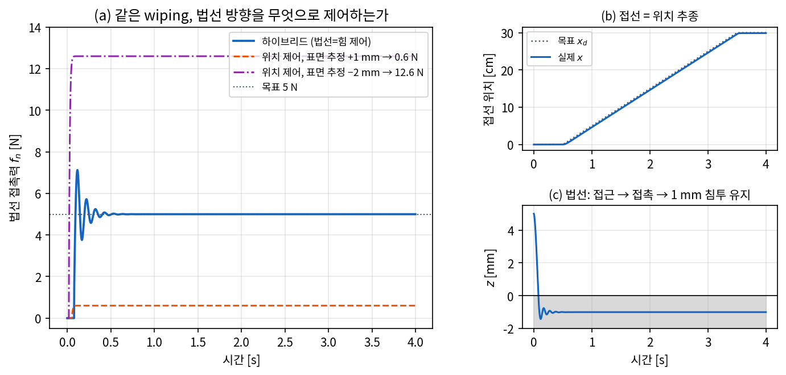
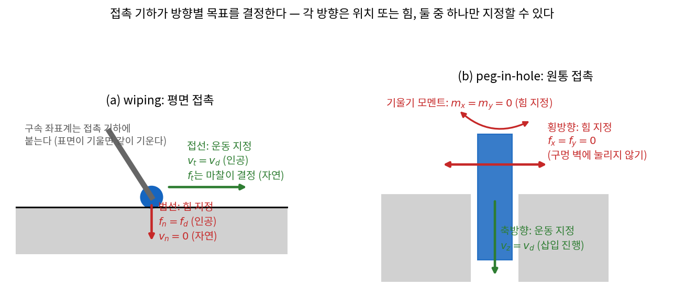
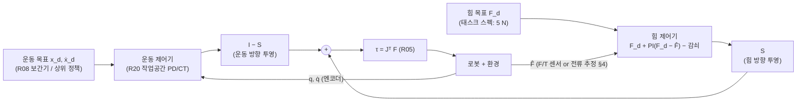
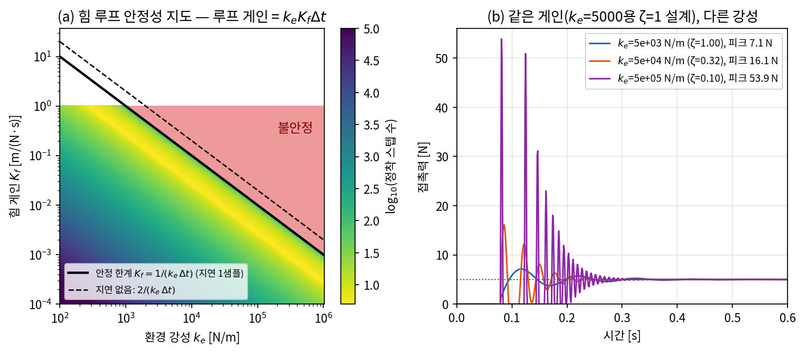
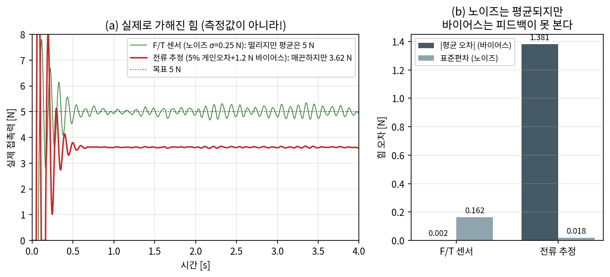
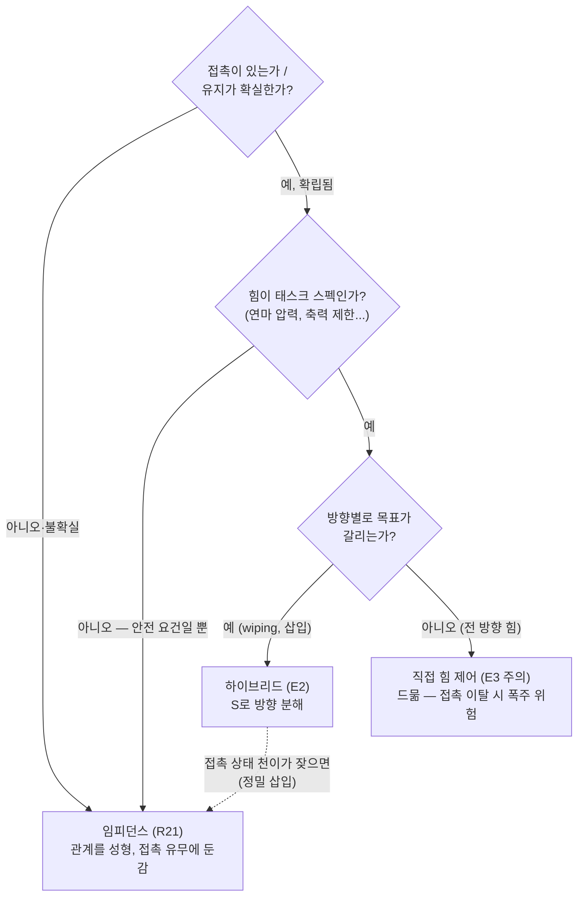

# Lec R22. 힘 제어와 하이브리드 제어 — 방향마다 다른 목표

> 하위제어 트랙 22일차 (Part R5 제어, 여섯 번째). 선수 지식: R05(정역학 쌍대 $\tau = J^\top F$), R12(마찰·접촉), R17(게인·안정성·지연), R19(computed torque), R20(작업공간 제어), R21(임피던스 — 접촉의 간접 제어).
> 기초 참고서: Modern Robotics(이하 MR) Ch.11 §11.5~11.6. 이 강의는 그 내용을 "표면 닦기(wiping)" 하나의 태스크를 끝까지 정량화하는 방식으로 재구성한 것이다.

## 한 장 요약



표면을 5 N으로 누르며 닦는 태스크. **접선 방향은 위치를**(b), **법선 방향은 힘을**(a) 제어한다 — 같은 로봇, 같은 순간, 방향마다 다른 목표. 이것이 힘/위치 하이브리드 제어다. (a)의 대조군이 오늘의 문제의식이다: 법선까지 위치 제어로 하면 표면 높이 추정이 **1~2 mm**만 틀려도 힘이 목표 5 N에서 0.6 N(+1 mm, 접촉 유지 실패 직전)이나 12.6 N(−2 mm, 과압)으로 튄다 — 강성 환경에서 힘은 위치 오차를 환경 강성 $k_e$배 확대한 신호이기 때문이다. 힘 피드백을 단 파란 선은 표면이 어디 있는지 정확히 몰라도 5 N을 유지한다. 오늘은 이 그림의 세 요소 — 방향 분해는 누가 정하나(접촉 기하), 분해를 법칙으로 어떻게 쓰나(선택 행렬), 힘 루프는 왜 다루기 까다로운가($k_e$의 저주) — 를 유도하고 수치로 검증한다.

## 학습 목표

1. 접촉 기하로부터 **자연 구속/인공 구속**을 도출하고, wiping·peg-in-hole·조립 태스크의 방향별 제어 목표 표를 만들 수 있다.
2. 선택 행렬 $S$를 쓰는 **Raibert–Craig 하이브리드 제어 법칙** $\tau = J^\top[\,S\,F_{\text{force}} + (I-S)\,F_{\text{motion}}]$을 백지에 쓰고 각 항의 역할과 좌표계 주의사항을 설명할 수 있다.
3. 강성 환경에서 힘 루프의 루프 게인이 $k_e$에 비례함을 유도하고, 이산 힘 루프의 안정 한계 $K_f < 2/(k_e \Delta t)$(지연 1샘플이면 $1/(k_e\Delta t)$)를 손계산·시뮬 양쪽으로 검증할 수 있다.
4. F/T 센서(노이즈)와 전류 기반 추정(바이어스)의 트레이드오프를 정량 실험으로 비교하고, 태스크별로 어느 쪽을 쓸지 판단할 수 있다.
5. R21의 임피던스와 오늘의 직접 힘 제어가 갈리는 지점 — "힘이 태스크 스펙인가, 안전 요건인가" — 을 설계 언어로 설명할 수 있다.

## 왜 이 강의가 필요한가

R21에서 접촉을 다루는 첫 번째 방법을 배웠다: 임피던스 — 힘을 직접 명령하지 않고 위치와 힘의 **관계**(가상 스프링-댐퍼)를 성형해서, 접촉이 일어나면 "적당히 순응"하게 만드는 간접 전략이었다. 그런데 어떤 태스크는 스펙 자체가 힘이다. 연마는 "표면에 20 N", 디버링은 "날에 일정 압력", 나사 조립은 "축력 제한", 폴리싱·와이핑은 "법선 5 N 유지". 이때 임피던스는 원리적으로 부정확하다 — 임피던스가 내는 힘은 $f = K(x_d - x)$, 즉 **위치 오차의 부산물**이라서, 원하는 힘을 내려면 표면 위치를 알고 $x_d$를 역산해야 하는데 그 표면 위치를 모르는 것이 현실이기 때문이다.

수치로 보자. 위치 제어(강성 $k_p$)로 강성 $k_e$인 표면을 누르면 유효 강성은 직렬 연결 $k_s = k_p k_e/(k_p + k_e)$다(R21의 그 직렬 스프링). 본문 시뮬 값($k_p = 2\times10^4$, $k_e = 5\times10^3$ N/m)이면 $k_s = 4000$ N/m — 표면 추정 오차 **1 mm당 힘 오차 4 N**. 목표가 5 N이니 1 mm에 태스크가 무너진다. 산업 현장의 금속 접촉은 $k_e \sim 10^5{\sim}10^6$ N/m라 상황이 100배 나쁘다. 결론: **힘을 맞추려면 힘을 측정해서 피드백해야 한다**(직접 힘 제어).

그런데 힘만 제어할 수도 없다. wiping에서 접선 방향으로는 여전히 궤적을 따라가야 하고, 애초에 자유 공간 방향으로 "힘을 내라"는 명령은 정의조차 안 된다(흔한 오해 1). 그래서 방향을 나눠 어떤 방향은 힘, 어떤 방향은 위치를 제어한다 — 힘/위치 하이브리드 [2]. 그리고 이 분해는 제어 엔지니어가 임의로 정하는 게 아니라 **접촉 기하가 정해 준다**(자연/인공 구속 [3]). 이 강의는 Part R5 접촉 3부작(R21 임피던스 → R22 힘/하이브리드 → R24 WBC의 접촉 제약)의 가운데 조각이고, 상위 트랙과의 연결도 굵다: VLA의 action space에는 힘이 없다(상위 26강의 action 목록을 다시 보라 — 전부 위치·관절각이다). 접촉 태스크에서 학습 정책이 이 층을 어떻게 빌려 쓰는지가 오늘의 마지막 논점이다.

## 본문

### 1. 접촉 기하가 목표를 결정한다



*그림 2: 접촉이 생기면 방향마다 "지정할 수 있는 것"이 갈린다. 각 방향에서 위치(운동)와 힘 중 **하나만** 자유롭게 지정할 수 있고, 나머지 하나는 물리가 정한다.*

벽에 손을 대고 있는 상황을 생각하자. 법선 방향으로 "위치"는 내 마음대로 정할 수 없다 — 벽이 있으니 $v_n = 0$이다(물리가 강제하는 **자연 구속**, natural constraint). 대신 법선 방향으로 얼마나 세게 누를지는 내가 정할 수 있다($f_n = f_d$ — 제어기가 부과하는 **인공 구속**, artificial constraint). 접선 방향은 반대다: 미끄러지는 속도는 내가 정하지만($v_t = v_d$, 인공), 그때 손에 걸리는 마찰력은 물리가 정한다($f_t$는 마찰 원뿔이 결정 — R12, 자연). 이 상보적 배분이 Mason의 구속 프레임워크다 [3]. 핵심 규칙: **물리가 운동을 구속한 방향은 힘을 지정할 수 있고, 운동이 자유로운 방향은 운동을 지정해야 한다.** 한 방향에 둘 다 지정하는 것은 과잉 지정(벽을 뚫으라는 명령), 둘 다 안 하는 것은 과소 지정이다.

#### E1. 자연/인공 구속 — 접촉이 만드는 방향 분해

**직관**: 접촉은 6차원 태스크 공간을 두 부분으로 쪼갠다. "밀 수 있는 방향"(운동이 막힘 → 힘 지정)과 "움직일 수 있는 방향"(운동 지정). 태스크 설계의 첫 단계는 수식이 아니라 이 표를 채우는 것이다.

**물리·기하적 의미**: 그림 2의 두 사례를 표로 채우면 (이상적 강체 접촉, 6차원 twist/wrench 기준):

| 태스크 | 운동 지정 (인공) | 힘 지정 (인공) | 대응하는 자연 구속 |
|---|---|---|---|
| wiping (평면 접촉) | $v_x, v_y$ (닦는 궤적), $\omega_z$ | $f_z = f_d$, $m_x = m_y = 0$ (면에 밀착) | $v_z = 0,\ \omega_x = \omega_y = 0$ / $f_x, f_y$는 마찰이 결정 |
| peg-in-hole (원통 끼움) | $v_z$ (삽입 진행), $\omega_z$ | $f_x = f_y = 0,\ m_x = m_y = 0$ (벽에 눌리지 않기) | $v_x = v_y = 0,\ \omega_x = \omega_y = 0$ / $f_z$는 마찰+끼임이 결정 |
| 문/밸브 열기 (경첩·축 구속) | 경첩 축 회전 $\omega_{\text{hinge}}$ 1개 | 나머지 5방향 렌치 = 0 (경첩과 싸우지 않기) | 경첩이 5방향 운동을 전부 구속 |

읽는 법: 각 행에서 운동 지정 + 힘 지정 = 항상 **6개**. 접촉이 강할수록(구속 수 $k$↑) 운동 자유가 줄고 힘 지정 슬롯이 늘어난다. 문 열기 행이 시사적이다 — 힘 지정 5방향의 목표가 전부 **0**이다: "메커니즘이 정해 둔 길을 거스르는 힘을 내지 마라." 위치 제어 로봇이 문을 여닫다 경첩을 뜯어내는 사고(궤적이 원호에서 1 cm만 벗어나도 $k_e$배의 힘)가 정확히 이 행을 무시한 결과다.

**형식**: 접촉을 Pfaffian 구속 $A(q)\,\mathcal{V} = 0$ ($A \in \mathbb{R}^{k\times 6}$, $\mathcal{V}$는 EEF twist)으로 쓰면, 허용 운동은 $\ker A$ (차원 $6-k$), 접촉이 지탱할 수 있는 렌치는 $\mathrm{row}(A)$ (차원 $k$)에 산다. 두 부분공간은 일률(power)이 0이 되는 상보 관계다: 허용 운동 $\mathcal{V}$와 구속 렌치 $F$에 대해 $F^\top \mathcal{V} = 0$ — **구속력은 허용 운동에 일을 하지 않는다**(마찰 없는 이상화). 그래서 운동 지정은 $\ker A$에서, 힘 지정은 $\mathrm{row}(A)$에서 해야 하고, 서로 간섭하지 않는다 (MR §11.6.1). 마찰이 있으면 이 직교성이 흐려진다는 것(접선 힘 ≠ 0)은 WE-2에서 수치로 확인한다.

### 2. 하이브리드 제어 법칙 — 선택 행렬로 방향 스위칭



#### E2. Raibert–Craig 하이브리드 법칙

**직관**: 두 개의 제어기를 병렬로 돌린다 — 하나는 위치를(R20), 하나는 힘을. 그리고 방향별 스위치 $S$로 "이 방향 담당은 너"라고 갈라 준 다음, 두 렌치를 더해서 $J^\top$로 토크로 바꾼다(R05의 정역학 쌍대가 제어 법칙의 뼈대가 되는 순간이다). Raibert와 Craig가 1981년에 제안한 구도가 지금도 산업 하이브리드 제어의 골격이다 [2].

**물리·기하적 의미**: $S = \mathrm{diag}(s_1, \dots, s_6)$, $s_i \in \{0, 1\}$은 E1의 표를 행렬로 옮긴 것이다 — $s_i = 1$이면 그 방향은 힘 제어, $0$이면 운동 제어. wiping이면 구속 좌표계에서 $S = \mathrm{diag}(0,0,1,1,1,0)$ ($z$힘과 $x,y$모멘트 지정). 중요한 주의: **$S$는 접촉 기하에 붙은 구속 좌표계에서 대각이다.** 표면이 15° 기울면 $S$도 같이 돌려야 한다: 월드 기준으로는 $S_w = R\,S\,R^\top$. 기하 추정이 5° 틀리면 힘 명령의 $\sin 5° \approx 8.7\%$가 위치 방향으로 새고, 위치 루프는 그것을 외란으로 맞선다 — 두 루프의 조용한 줄다리기(토론 질문 2).

**형식**: 구속 좌표계에서

$$
\tau \;=\; J^\top(q)\Big[\, S\,\underbrace{\big(F_d + K_{fp}\,e_F + K_{fi}\textstyle\int e_F\,dt - K_{v}\,\mathcal{V}\big)}_{\text{힘 제어기: 피드포워드+PI+감쇠}} \;+\; (I - S)\,\underbrace{\big(K_p\,e_x + K_d\,\dot e_x\big)}_{\text{운동 제어기 (R20)}} \Big], \qquad e_F = F_d - \hat F
$$

세 가지 설계 포인트. ① 힘 쪽의 **피드포워드 $F_d$**: 원하는 힘을 일단 그대로 밀고, PI는 오차만 다듬는다 — 피드포워드가 없으면 오차가 생겨야만 힘이 나온다(R19의 피드포워드 논리 그대로). ② 힘 오차의 **미분항이 없다**: 대신 속도 감쇠 $-K_v \mathcal{V}$를 쓴다. 접촉 중에는 $\dot f = k_e \dot\delta = -k_e \dot z$이므로 **속도 피드백이 곧 힘 미분 피드백**이고($k_e$배 스케일), 노이즈투성이 힘 신호를 미분하는 것보다 깨끗한 엔코더 속도를 쓰는 쪽이 압도적으로 낫다. ③ 동역학 보상: 정밀하게 하려면 두 항 앞에 태스크 공간 관성(R20의 $\Lambda$)과 $C, g$ 보상을 얹는다 — MR §11.6.2는 구속 다양체 위에서 동역학을 분해한 완전판을 제시한다(사영 행렬 $P(q)$가 우리 $I - S$의 좌표 불변 일반화다). 오늘의 시뮬은 질량 보상 없이도 충분한 저속 영역에서 논다.

### 3. 힘 루프는 왜 까다로운가 — $k_e$의 저주

#### E3. 힘 루프의 루프 게인에는 환경 강성이 들어 있다

**직관**: 위치 루프의 플랜트는 로봇 자신이지만, **힘 루프의 플랜트에는 환경이 포함된다.** 힘 센서가 읽는 것은 $f = k_e \delta$ — 침투 깊이 $\delta$를 $k_e$배 확대한 신호다. 즉 힘 제어란 "돋보기 배율($k_e$)을 모르는 채 돋보기 너머의 위치를 조종하는 일"이고, 배율이 클수록 같은 게인이 더 공격적으로 작동한다. 부드러운 스펀지에서 얌전하던 게인이 강철판에서는 발산한다.

**물리·기하적 의미**: 두 얼굴로 나타난다. (i) **정적**: 위치 0.1 mm 오차 → $k_e = 10^5$이면 10 N 오차. 힘의 세계에서 위치 정밀도 요구가 $k_e$배 가혹해진다. (ii) **동적**: 힘 루프의 강성 항이 $k_e$에 비례하므로 고유진동수 $\omega_n \propto \sqrt{k_e}$, 같은 감쇠 게인이면 감쇠비 $\zeta \propto 1/\sqrt{k_e}$ — 강성이 100배면 $\zeta$가 10분의 1로 떨어져 접촉-이탈을 반복하는 바운싱(채터)이 시작된다(그림 3b). $k_e$를 모르면 **최악의(가장 강성인) 환경 기준으로 보수적으로** 게인을 잡을 수밖에 없고, 그 대가는 부드러운 환경에서의 굼뜬 응답이다.

**형식**: 가장 투명한 모델 — 어드미턴스형 이산 힘 루프(안쪽 속도 루프는 이상적이라 가정, 주기 $\Delta t$)로 뼈대를 보자. 힘 오차 $e_k = f_d - f_k$에 비례한 속도로 밀어 넣는다: $v_k = K_f\,e_k$. 접촉 중 $f = k_e\delta$이므로 $f_{k+1} = f_k + k_e K_f e_k \Delta t$, 즉

$$
e_{k+1} = \big(1 - \underbrace{k_e K_f \Delta t}_{\text{루프 게인 } a}\big)\,e_k
\qquad\Rightarrow\qquad
\text{안정} \iff |1 - a| < 1 \iff 0 < K_f < \frac{2}{k_e \Delta t}
$$

측정이 한 샘플 늦으면(F/T 필터·버스 지연) $e_{k+1} = e_k - a\,e_{k-1}$, 특성식 $z^2 - z + a = 0$의 근이 단위원 안에 있을 조건은 $a < 1$ — **지연 한 샘플이 게인 예산을 절반으로 깎는다**(R17의 "지연의 대가"가 힘 루프에서 두 배로 아픈 이유). 숫자로: $\Delta t = 1$ ms, $k_e = 10^4$ N/m이면 한계 $K_f < 0.2$, deadbeat($a = 1$, 한 스텝 수렴)는 $K_f = 0.1$ m/(N·s). 그런데 $k_e$가 $[10^3, 10^5]$ 어디인지 모른다면? 최악 기준으로 $K_f \le 0.01$ — 이 게인으로 부드러운 $k_e = 10^3$ 환경을 만나면 $a = 0.01$, 시정수 $\tau \approx \Delta t / a \approx 100$ ms(3$\tau$ 정착 0.3초). **강성을 100배 모르면 응답을 100배 양보한다.** 이것이 힘 제어 게인이 늘 보수적인 이유고, 환경 강성을 온라인 추정하려는 연구(적응 힘 제어)의 동기다.

토크 레벨로 내려가면(E2의 직접 힘 제어) 같은 결론이 연속시간 2차계로 나타난다. 접촉 중 침투 $\delta$에 대해 질량 $m$의 법선 동역학에 E2의 제어를 넣으면:

$$
m\,\ddot\delta + K_v\,\dot\delta + \underbrace{k_e(1 + K_{fp})}_{\text{환경+P게인 강성}}\,\delta = \text{const}
\quad\Rightarrow\quad
\omega_n = \sqrt{\tfrac{k_e(1+K_{fp})}{m}},\qquad
\zeta = \frac{K_v}{2\sqrt{m\,k_e(1+K_{fp})}}
$$

설계 손잡이는 $K_v$인데 분모에 $\sqrt{k_e}$가 앉아 있다 — $k_e$가 100배면 같은 $K_v$로 $\zeta$가 1/10. WE-2의 게인 설계와 WE-3(a)의 스윕이 이 식의 수치 검증이다.



*그림 3: (a) 이산 힘 루프(지연 1샘플)의 안정성 지도(특성근 $|z|$로 계산한 정착 스텝 수). 붉은 영역이 불안정, 검은 실선이 $K_f = 1/(k_e\Delta t)$ — 지도의 경계가 손계산 한계와 정확히 겹친다(재귀식을 직접 돌려도 $a = 1.01$에서 발산이 시작된다). 노란 골짜기(빠른 정착)는 좁고, 안전하게 쓰려면 왼쪽 아래(보수적)로 내려와야 한다. (b) 연속 시뮬: $k_e = 5000$에서 $\zeta = 1$이 되도록 설계한 게인을 그대로 두고 강성만 10배·100배 — $\zeta$가 0.32, 0.10으로 떨어지며 100배에서는 접촉-이탈 바운싱(스파이크 열)이 나타난다. 피크 힘 7.1 → 16.1 → 53.9 N.*

### 4. 힘을 어떻게 아는가 — F/T 센서 vs 전류 기반 추정

힘 피드백에는 힘 측정이 필요하다. 두 가지 길이 있고, 트레이드오프가 선명하다:

| | 손목 6축 F/T 센서 | 모터 전류 기반 추정 (R14·R16) |
|---|---|---|
| 원리 | 스트레인게이지/정전용량 변형 측정 | $\hat\tau = K_t i$ → $\hat F = (J^\top)^{\dagger}\hat\tau$ (R05 쌍대의 역방향) |
| 오차의 성질 | **노이즈**(백색)·온도 드리프트 | **바이어스**(감속기 마찰·리플 — 모델에 없는 토크) |
| 숨은 비용 | 툴 중량·관성 보상 필요, 충격 시 포화, 가격 | 감속비가 크면 마찰이 신호를 삼킴(하모닉에서 최악, R15) |
| 잘 맞는 곳 | 손목 너머 접촉(파지물 조작), 정밀 조립 | QDD처럼 저감속·저마찰 관절(R16의 proprioception [4]), 팔 전체 어디든 접촉 감지 |

둘의 오차는 **종류가 다르다** — 그리고 피드백 루프는 이 차이에 비대칭으로 반응한다. 노이즈는 평균 0이라 적분기와 필터가 지워 준다(대가: E3의 지연 → 게인 예산 감소). 바이어스는 측정 자체가 체계적으로 틀린 것이라 **피드백이 볼 수 없다** — 루프는 "측정값 5 N"을 완벽히 달성하고, 실제 힘은 딴 값이 된다. WE-3b에서: 게인 오차 5% + 바이어스 1.2 N인 전류 추정으로 5 N을 명령하면 실제 힘은 $(5 - 1.2)/1.05 = 3.62$ N에 정착한다 — 매끈하고 안정적으로, **28% 틀린 채로**. 제3의 길도 있다: Franka처럼 각 관절에 토크 센서를 박는 것(전류 추정의 바이어스 원인인 감속기 **뒤에서** 측정) [5] — 센서 값은 깨끗하지만 관절 공간 측정이라 손목 힘으로 환산할 때 모델을 거친다. 외력 추정을 체계화한 모멘텀 옵저버는 R27에서 다룬다.

F/T 센서 쪽에도 숨은 모델 의존이 있다: 센서가 읽는 것은 접촉력만이 아니라 **접촉력 + 툴 중력 + 툴 관성력**의 합이다. 접촉력을 꺼내려면 $\hat F_{\text{contact}} = F_{\text{meas}} - m_{\text{tool}}\,g(R) - m_{\text{tool}}\,a$를 계산해야 하고 — 자세에 따라 도는 중력항(R02의 회전이 여기서도), 가속도항까지 빼야 한다. 툴 질량·무게중심을 5%만 틀려도 자세 변화에 따라 수 N이 출렁이는 "가짜 접촉력"이 생긴다. 힘 제어 태스크가 대개 저가속·준정적으로 설계되는 이유 중 하나가 이 관성항 오염이다.



*그림 4: 같은 힘 루프, 다른 측정. F/T(노이즈 σ=0.25 N)는 실제 힘이 5 N 주위에서 떨리지만 평균은 정확하다(바이어스 0.002 N). 전류 추정(마찰 바이어스 1.2 N)은 매끈하지만 3.62 N에 정착 — 오차 1.381 N을 **루프는 감지조차 못 한다**. 처방도 다르다: 노이즈는 필터·평균(온라인), 바이어스는 캘리브레이션(오프라인, R28) 또는 마찰 자체가 작은 하드웨어(R16).*

### 5. 임피던스냐 힘 제어냐 — 갈림길

R21과 오늘을 한 표에 놓고 정리하자. 둘 다 "접촉을 다루는 제어"지만 지정하는 대상이 다르다:

| | 임피던스 (R21) | 직접 힘 / 하이브리드 (R22) |
|---|---|---|
| 지정하는 것 | 위치-힘 **관계** ($M$-$B$-$K$) | 힘의 **값** ($f_d$) + 나머지 방향 위치 |
| 힘 정확도 | 표면 위치·강성 추정에 종속 (WE-1: 4 N/mm) | 힘 센서 정확도에 종속 (그림 4) |
| 접촉이 끊기면 | 아무 일 없음 — 스프링이 목표로 복귀 | **위험** — 오차 적분 폭주 (흔한 오해 1) |
| 환경 지식 | 몰라도 안전, 알면 정확 | $k_e$가 게인 예산을 지배 (E3) |
| 필요한 측정 | $q, \dot q$뿐 (힘 센서 불요!) | 힘 측정 필수 (§4) |
| 대표 태스크 | 삽입 초기 탐색, 인간 협업, 미지 환경 접촉 | 연마·디버링·와이핑·체결 — 힘이 스펙인 일 |



*그림 5: 접촉 제어 선택 가이드 — R21과 R22가 실무에서 갈리는 지점.*

실전 시스템은 이 그림을 **시간 축 위의 모드 전환**으로 구현한다. wiping 한 사이클만 해도: ① 자유 공간 접근은 위치/임피던스(힘 루프는 접촉 없이는 정의 불능), ② 접촉 검출(힘 문턱값 — WE-2 코드의 `f > 0.5` 그 줄)에서 힘 적분기를 리셋하고 하이브리드로 전환, ③ 작업 중 힘이 갑자기 0으로 떨어지면(모서리 이탈, 미끄러짐) 즉시 임피던스로 복귀 — 이 전환 로직의 견고함이 접촉 제어 제품의 실력이고, 산업 컨트롤러(예: Franka의 force control 인터페이스 [5])가 모드 전환·문턱값·이탈 감지를 패키지로 파는 이유다. 학습 정책이 접촉 태스크를 할 때도 이 상태 기계는 하위층 어딘가에 있어야 한다 — 정책이 그것까지 배우게 할지, 하위층에 박아 둘지가 R30의 설계 논점 중 하나다.

### 6. Worked Example

#### WE-1 (손): 위치 제어로 힘을 맞출 수 있는가 — 판정 계산

**설정**: 표면 강성 $k_e = 10^4$ N/m, 목표 5 N ± 0.5 N.

힘 오차 = $k_e \times$ 침투 오차이므로 허용 위치 오차는 $0.5/10^4 = 0.05$ mm. 산업 로봇의 위치 반복정밀도가 ±0.1 mm급이니 **반복정밀도만으로 이미 예산의 2배**다 — 표면 위치 추정 오차(비전 기준 mm급)는 시작도 안 했다. 판정: 불가능. 위치 루프 강성 $k_p = 2\times10^4$가 유한한 것을 반영하면 민감도는 직렬 강성 $k_s = k_p k_e/(k_p + k_e)$로 조금 누그러지지만($k_e = 5000$이면 $k_s = 4000$ N/m → 4 N/mm) 결론은 같다. 본문 시뮬 검증: 표면 추정 0 / +1 / −2 mm에서 정상 접촉력 4.60 / 0.60 / 12.60 N — 오차 기울기가 정확히 4 N/mm다(+0 mm에서도 5 N이 아닌 이유는 두 외란의 합이다: 명령 침투 1 mm가 로봇·환경 직렬 스프링에 나눠져 힘이 $k_p/(k_p{+}k_e) = 0.8$배로 깎이고(−1.0 N), 미지 툴 하중 3 N이 더 눌러서 +0.6 N — 합계 −0.4 N. 힘 루프였다면 적분기가 둘 다 지웠다).

#### WE-2 (손 + 코드): wiping 하이브리드 제어 — 설계 손계산 3개와 시뮬 검증

2-DoF 질점 EEF(유효 질량 $m = 2$ kg)로 그림 1을 만든 시뮬. 접선 $x$: 위치 PD($k_{p,x} = 400$, $k_{d,x} = 2\sqrt{k_{p,x} m} = 56.57$), 법선 $z$: E2의 힘 제어기($K_{fp} = 1$, $K_{fi} = 200$, 감쇠 $K_{v}$), 표면 $k_e = 5000$ N/m, 마찰 $\mu = 0.3$, **제어기가 모르는** 툴 하중 $W = 3$ N. 설계 손계산 세 개:

1. **감쇠 게인**: 접촉 중 법선 오차 동역학의 강성은 $k_e(1 + K_{fp})$ (환경 스프링 + P게인이 만드는 전기적 스프링). $\zeta = 1$이 되려면 $K_v = 2\sqrt{m\,k_e(1+K_{fp})} = 2\sqrt{2 \cdot 10^4} = 282.8$, $\omega_n = \sqrt{k_e(1{+}K_{fp})/m} = 70.7$ rad/s.
2. **적분기가 없으면**: 평형에서 $0 = -f_d - K_{fp}(f_d - f) - W + f$ → 정상 힘 $f = f_d + \frac{W}{1+K_{fp}} = 5 + 1.5 = 6.5$ N. 미지 하중의 절반이 힘 오차로 남는다.
3. **접선 정상 오차**: 마찰 $\mu f_d = 1.5$ N이 위치 PD에는 외란 → $e_x = \mu f_d / k_{p,x} = 3.75$ mm. **법선 힘이 접선 위치 오차를 만든다** — E1의 직교성이 마찰 때문에 깨지는 현장이다.

```python
import numpy as np
m, dt, k_e, b_e, mu, W, f_d = 2.0, 1e-3, 5000.0, 10.0, 0.3, 3.0, 5.0
kp_x, kd_x = 400.0, 2*np.sqrt(400.0*m)
K_fp, K_fi = 1.0, 200.0
K_v = 2*np.sqrt(m*k_e*(1+K_fp))                    # 손계산 1: 282.84

x, v, I_f, in_contact = np.array([0.0, 0.005]), np.zeros(2), 0.0, False
log = []
for k in range(4000):
    t = k*dt
    d_pen = max(0.0, -x[1])
    f = max(k_e*d_pen + b_e*(-v[1]), 0.0) if d_pen > 0 else 0.0
    xd, vd = (0.1*(min(t,3.5)-0.5), 0.1) if 0.5 <= t < 3.5 else ((0.0,0.0) if t < 0.5 else (0.3,0.0))
    ux = kp_x*(xd - x[0]) + kd_x*(vd - v[0])       # 접선: 위치 PD
    if not in_contact:
        uz = 60.0*(-0.05 - v[1])                   # guarded approach
        if f > 0.5: in_contact, I_f = True, 0.0
    if in_contact:
        e_f = f_d - f; I_f += e_f*dt
        uz = -(f_d + K_fp*e_f + K_fi*I_f) - K_v*v[1]   # 법선: FF + PI + 감쇠 (E2)
    fric = -mu*f*np.tanh(v[0]/1e-3)                # 쿨롱 마찰 (R12)
    v += np.array([(ux+fric)/m, (uz - W + f)/m])*dt
    x += v*dt
    log.append([t, x[0], x[1], f, xd])
log = np.array(log); s = log[:,0] >= 1.0
print(f"힘 오차 max: {np.abs(log[s,3]-f_d).max()*1000:.1f} mN, "
      f"x RMS: {np.sqrt(np.mean((log[s,1]-log[s,4])**2))*1000:.2f} mm, "
      f"평균 침투: {-log[s,2].mean()*1000:.3f} mm")
```

출력: `힘 오차 max: 0.2 mN, x RMS: 3.38 mm, 평균 침투: 1.000 mm`. 검증 셋 — 침투는 $f_d/k_e = 1$ mm 정확히. 적분기를 끄면(`use_integral=False` 방식으로 `I_f` 갱신 제거) 정상 힘 6.500 N — 손계산 2와 일치. wipe 중 평균 접선 오차 3.65 mm — 손계산 3(3.75 mm)과 일치(0.10 mm 차이는 tanh 때문이 아니라 로그가 적분 한 스텝 **뒤의** $x$를 시각 $t$의 $x_d$와 짝지어 기록하기 때문이다: $0.1\ \text{m/s} \times 1\ \text{ms} = 0.10$ mm). 힘 오차 0.2 mN은 이상적 센서의 상한 성능이다 — 현실은 WE-3b가 보여 준다.

#### WE-3 (코드): 두 개의 스트레스 테스트

**(a) 강성 스윕** — WE-2의 게인($k_e = 5000$에서 $\zeta = 1$)을 고정하고 실제 강성만 바꾼다 (`gen_figs.py`, 그림 3b):

| 실제 $k_e$ [N/m] | 500 | 5000 (설계점) | $5\times10^4$ | $5\times10^5$ |
|---|---|---|---|---|
| 예측 $\zeta = K_v/2\sqrt{mk_e(1{+}K_{fp})}$ | 3.16 | 1.00 | 0.32 | 0.10 |
| 접촉 피크 힘 [N] | 7.5 | 7.1 | 16.1 | 53.9 |
| 접촉 이탈 비율 | 0% | 0% | 0.5% | 2.2% |

강성 100배에 피크 힘 7.6배, 그리고 바운싱 시작 — E3의 $\zeta \propto 1/\sqrt{k_e}$가 그대로 관측된다. 부드러운 쪽(500)은 그저 굼뜰 뿐 안전하다: **강성 추정이 틀릴 거라면 부드러운 쪽으로 틀려라**(게인은 최강성 기준).

**(b) 센서 트레이드오프** — 같은 루프에 측정 모델만 교체 ($t \ge 2$ s 창, 그림 4):

| 측정 | 평균 오차 (바이어스) | 표준편차 (노이즈) |
|---|---|---|
| 이상적 | 0.000 N | 0.000 N |
| F/T: 백색 σ=0.25 N + 50 Hz LPF | **+0.002 N** | 0.162 N |
| 전류 추정: 게인 오차 5% + 마찰 바이어스 1.2 N | **−1.381 N** | 0.018 N |

전류 쪽 정상값은 손으로 나온다: 루프는 측정값을 5 N으로 만들므로 $(1.05)f + 1.2 = 5 \Rightarrow f = 3.619$ N, 오차 1.381 N — 시뮬과 소수점까지 일치. F/T의 0.162 N 떨림과 전류의 1.381 N 확신에 찬 오차 중 무엇이 나쁜가는 태스크가 정한다: 연마 품질(평균 압력)이면 F/T 승, 접촉 감지·충돌 반응(빠르고 어디서나)이면 전류 승.

### 딥러닝 배경자를 위한 번역

- **선택 행렬 = 방향별 손실 마스킹.** 하이브리드 제어는 출력(렌치) 공간을 둘로 쪼개 각 부분공간에 다른 손실(힘 오차 / 위치 오차)을 거는 multi-task 문제다. $S$와 $I-S$가 직교 사영이라 두 "손실의 그래디언트"가 간섭하지 않는다 — task interference를 파라미터가 아니라 **출력 공간 분해**로 없앤 설계. 마찰은 이 분해를 완벽히 못 하게 만드는 잔여 상관(WE-2 손계산 3)이다.
- **$K_f < 2/(k_e\Delta t)$는 $\eta < 2/L$이다.** E3의 힘 루프 $e_{k+1} = (1 - k_eK_f\Delta t)e_k$는 곡률 $L$인 2차 손실 위의 경사하강 $e_{k+1} = (1-\eta L)e_k$와 **같은 식**이다: 게인=학습률, 환경 강성=손실 곡률. "곡률을 모르면 학습률을 보수적으로"는 여러분이 아는 그 규칙이고, 적응 힘 제어는 Adam처럼 곡률을 온라인 추정하는 셈이다. 지연 1샘플이 예산을 절반으로 깎는 것은 stale gradient의 대가(R17)와 동형.
- **바이어스 vs 노이즈 = label bias vs label noise.** 노이즈 라벨은 데이터(시간 평균)가 많으면 이긴다. 바이어스 라벨은 아무리 모아도 그 값으로 수렴한다 — 전류 추정의 1.381 N이 그것이다. 처방이 학습(온라인 필터)이 아니라 캘리브레이션(오프라인 시스템 식별, R28)인 이유.
- **action space에 힘이 없다는 것의 의미.** 상위 26강의 action 목록(ΔEEF, 관절각, …)에는 힘 차원이 없다 — 데모 데이터에도 힘 기록이 없는 경우가 대부분이다(상위 25강에서 손목 F/T가 달린 플랫폼이 드물었던 것을 기억하라). 그러면 "5 N으로 눌러라"는 supervision이 존재하지 않는 것이고, 정책은 힘을 **위치의 부산물**(침투 깊이, 팔 처짐, 이미지 속 표면 눌림)로만 간접 학습한다 — 그 단서는 강성이 다른 표면에서 일반화가 깨진다(E3의 정적 얼굴). 실전 시스템이 학습 정책 아래에 임피던스/힘 하위층(R21·R22)을 두고, 정책은 셋포인트만 내게 하는 구조적 이유다(R30에서 종합).

## 흔한 오해

1. **"힘 제어는 임피던스 제어의 상위 호환이다"** — 아니다. 힘 제어는 접촉이 **유지된다는 가정** 위의 제어다. 자유 공간에서 $f_d = 5$ N을 명령하면 측정 힘 0, 오차 5 N, 적분기 폭주 — 로봇이 허공을 향해 가속한다(MR §11.5도 순수 힘 제어의 이 위험을 명시한다). 접촉 여부가 불확실한 과도 구간(접근, 삽입 초기, 미끄러져 이탈)은 임피던스(R21)가 안전하고, 접촉이 확립된 뒤 힘 스펙이 필요할 때 하이브리드로 넘어간다. 실무 표준은 "임피던스로 만나고, 힘 제어로 일한다"는 모드 전환이다.
2. **"선택 행렬은 월드 좌표축에 맞춰 정하면 된다"** — $S$는 **접촉 기하에 붙은 구속 좌표계**에서 정의된다. 경사면·곡면에서는 표면 법선을 추정해 $S$를 계속 회전시켜야 하고(실습 4), 법선 추정이 틀린 각도만큼 힘 명령이 위치 방향으로 새서 두 루프가 서로를 외란으로 만든다. "하이브리드가 안 된다"는 하소연의 절반은 제어 문제가 아니라 접촉 기하 추정 문제다.
3. **"환경이 강성일수록 힘 게인을 올려야 정확해진다"** — 정반대다. E3: 루프 게인 $= k_e K_f \Delta t$에 이미 $k_e$가 곱해져 있으므로, 강성 환경일수록 게인을 **내려야** 한다. 그림 3(b)의 바운싱이 "강철판에서 갑자기 로봇이 두드린다"는 현장 증상의 정체다.
4. **"F/T 센서를 달면 힘 제어는 해결"** — 센서는 측정 문제만 푼다. E3의 안정성 한계, 필터 지연의 게인 예산 삭감, 툴 중량·관성 보상(센서가 읽는 것은 접촉력 + 툴 중력·관성력의 합이다), 충격 포화는 그대로 남는다. 그리고 그림 4의 교훈: 좋은 측정의 반대말은 나쁜 측정이 아니라 **틀린 줄 모르는 측정**이다.

## 실습 (1.5~2시간)

**MuJoCo로 wiping 하이브리드 제어 구현.** WE-2를 진짜 물리 엔진(접촉 솔버, R26 예고)으로 옮긴다.

1. 모델과 제어 루프. 주의 하나 — MuJoCo의 접촉 마찰은 두 geom의 **element-wise 최대**로 결합되므로 [6], 테이블에 마찰을 명시하지 않으면 plane 기본값 $\mu = 1$이 이긴다 (접선 오차가 3.75 mm가 아니라 12.5 mm로 나오면 이것이다):

```python
import mujoco, numpy as np
XML = """
<mujoco model="wipe2d">
  <option timestep="0.001" gravity="0 0 -9.81"/>
  <worldbody>
    <geom name="table" type="plane" size="1 1 0.1" solref="0.02 1" friction="0.3 0.005 0.0001"/>
    <body name="eef" pos="0 0 0.02">
      <joint name="jx" type="slide" axis="1 0 0" damping="0.5"/>
      <joint name="jz" type="slide" axis="0 0 1" damping="0.5"/>
      <geom name="tip" type="sphere" size="0.01" mass="2.0" friction="0.3 0.005 0.0001"/>
      <site name="tip_site" type="sphere" size="0.012"/>
    </body>
  </worldbody>
  <actuator><motor joint="jx"/><motor joint="jz"/></actuator>
  <sensor><touch site="tip_site"/></sensor>
</mujoco>"""
m = mujoco.MjModel.from_xml_string(XML); d = mujoco.MjData(m)
f_d, dt = 5.0, m.opt.timestep
kp_x, kd_x = 400.0, 56.6
K_fp, K_fi, K_v = 0.2, 100.0, 600.0      # 적분 우세 게인 (아래 2번 참조)
gc = 2.0*9.81                             # EEF 자중 보상
I_f, in_contact, f_lp = 0.0, False, 0.0
log = []
for k in range(4000):
    t = k*dt
    f_lp += 0.239*(float(d.sensordata[0]) - f_lp)   # touch 센서 + 50 Hz LPF
    f = f_lp
    xd, vd = (0.1*(min(t,3.5)-0.5), 0.1) if 0.5 <= t < 3.5 else ((0.0,0.0) if t < 0.5 else (0.3,0.0))
    ux = kp_x*(xd - d.qpos[0]) + kd_x*(vd - d.qvel[0])
    if not in_contact:
        uz = gc + 60.0*(-0.02 - d.qvel[1])
        if f > 0.5: in_contact, I_f = True, 0.0
    if in_contact:
        e_f = f_d - f; I_f += e_f*dt
        uz = gc - (f_d + K_fp*e_f + K_fi*I_f) - K_v*d.qvel[1]
    d.ctrl[:] = [ux, uz]; mujoco.mj_step(m, d)
    log.append([t, d.qpos[0], d.qpos[1], f, xd])
```

   재현 목표(wipe 창 $t \in [1.0, 3.4]$): 힘 평균 **5.000 N**, 표준편차 **1.30 N**, 접선 평균 오차 **3.77 mm**(≈ 손계산 $\mu f_d/k_{p,x} = 3.75$ mm).

2. **채터를 일부러 만나기**: LPF를 끄고(`f = float(d.sensordata[0])`) WE-2의 게인($K_{fp}=1, K_{fi}=200, K_v=283$)으로 되돌리면 — 힘 표준편차 **7.44 N**, 피크 **17.5 N**, 접촉 이탈 비율 **68.8%**(wipe 창에서 touch 센서가 0을 읽는 비율). 왜 numpy에서는 조용했던 게인이 여기서 날뛰는가? 다음 항목이 답이다.
3. **환경 강성을 측정하라**: wipe를 멈추고($x_d = 0$) 정착 후 침투 $\delta$와 힘으로 $k_e = f/\delta$를 재면 **$\sim 9\times10^5$ N/m** — numpy 모델(5000)의 180배다(`solref="0.02 1"`이 만드는 constraint는 생각보다 강성이다 — solref/solimp의 의미는 R26에서). E3로 이 $k_e$의 게인 한계를 계산하고, 1번의 게인(P를 줄이고 적분 우세 + LPF)이 왜 그렇게 생겼는지 역설계하라.
4. **경사면 확장**: 테이블을 15° 기울인 box geom으로 바꾸고, 표면 좌표계 $R$(법선 $\hat n$)을 구해 힘 제어를 $\hat n$ 방향, 위치 제어를 접선 방향으로 — $S$를 회전시키는 연습(흔한 오해 2). 법선 각도를 일부러 5° 틀리게 주고 두 루프가 싸우는 것을 관찰하라.
5. **R21과의 비교 실험**: 법선을 임피던스로 바꾼다 — $u_z = k_z(z_d - z) - b_z\dot z$, $z_d$는 표면 추정에서 역산. 표면 추정을 ±1 mm 틀리게 주고 힘 오차를 하이브리드와 비교하면 WE-1의 표(±4 N/mm)가 재현된다. 토론: 이 실험에서 임피던스가 이기는 조건은 무엇인가? (힌트: 접촉 이탈이 잦은 태스크, $k_z$를 아주 낮출 수 있을 때 — $k_z \ll k_e$면 직렬 강성 $\approx k_z$라 표면 오차에 둔감해진다. 대가는?)
6. (심화) **peg-in-hole**: 구멍(box 두 개 틈 0.5 mm 클리어런스)에 핀 삽입 — E1 표대로 횡방향 힘 0, 축방향 속도 지정. 위치 제어만으로 시도했을 때 걸림(jamming)이 나는 오정렬 크기를 찾고, 하이브리드로 몇 배 커지는지 측정하라 (README의 R22 실습 항목).

## Claude와 토론할 질문

1. E1의 상보성: 한 방향에 힘과 위치를 **동시에** 지정하면 물리적으로 무슨 일이 벌어지는가? "벽을 뚫으라는 명령"을 제어 루프 관점(두 적분기의 줄다리기, 와인드업)에서 추적해 보라. 반대로 아무것도 지정 안 된 방향이 있으면?
2. 경사면 각도를 5° 잘못 알면 5 N 힘 명령 중 $5\sin 5° \approx 0.44$ N이 접선으로 샌다. 이 0.44 N을 접선 위치 루프($k_{p,x} = 400$)는 어떻게 받아내고, 반대로 위치 루프의 명령이 법선으로 새는 성분은 힘 루프에 어떤 외란이 되는가? 어느 쪽 누설이 더 위험한지 E3의 논리로 논하라.
3. E3의 $K_f < 2/(k_e\Delta t)$와 경사하강의 $\eta < 2/L$: $L$이 손실의 곡률이라면 $k_e$는 무엇의 곡률인가? (힌트: 접촉 포텐셜 에너지 $\frac{1}{2}k_e\delta^2$) 이 대응에서 "적응 힘 제어"의 딥러닝 쌍둥이는 무엇인가?
4. 전류 기반 추정의 바이어스 1.381 N은 R28의 캘리브레이션으로 얼마나 지울 수 있을까? 마찰의 어떤 성질(방향 의존, 온도, 히스테리시스, 정지마찰)이 끝까지 남는가? QDD(R16)가 이 문제를 하드웨어로 푼 것이라면, Franka의 관절 토크 센서 [5]는 어디서 푼 것인가?
5. 힘 신호가 없는 데모 데이터(카메라 + 관절각)로 wiping을 모방학습하면, 정책은 "5 N 누르기"를 무엇으로 대신 배우는가? 그 대리 단서가 스펀지→유리로 표면이 바뀌면 왜 깨지는지 E3의 정적 민감도로 설명하라. 힘 신호를 데이터에 넣는다면 어디에(관측? action? 보상?) 넣는 것이 맞는가 — 상위 26강의 action 파이프라인 위에서 논하라.
6. 정밀 삽입(클리어런스 0.1 mm)에서 순수 하이브리드가 고전하는 이유: 삽입 중 접촉 상태가 천이(1점 → 2점 → 라인 접촉)하며 **E1의 표 자체가 계속 바뀐다**. 상태마다 $S$를 갈아끼우는 대신 임피던스 + 나선 탐색(spiral search)이 산업 표준이 된 이유를 "구속 추정의 불확실성" 관점에서 정리하라.
7. Helix 02의 1 kHz 하위층이나 Atlas의 MPC급 전신 제어(상위 24강) 위에서 VLA가 접촉 태스크를 수행한다면, 상위 정책이 하위층에 내려야 할 최소 인터페이스는 무엇일까 — 목표 렌치? 임피던스 파라미터? 선택 행렬 $S$ 자체? 각 선택지에서 "정책이 배워야 할 것"과 "하위층이 보장해야 할 것"의 경계를 그려 보라 (R30의 예고).

## 읽을거리

1. **MR Ch.11 §11.5~11.6** [1] (~40분): 힘 제어(§11.5)와 하이브리드(§11.6)의 원전 — 우리가 질점으로 단순화한 것의 완전판(구속 다양체 위 동역학 분해)이 §11.6.2에 있다. §11.7(임피던스)은 R21에서 이미 읽었다.
2. **Raibert & Craig 1981** [2] (~30분, 구조만): 선택 행렬 구도의 원 논문. 45년 전 논문이라 세부는 낡았지만 Fig의 병렬 루프 구조가 오늘날 구현과 같다는 것, 그리고 당시에 이미 힘 루프 안정성이 골칫거리였다는 것을 확인하라.
3. (선택) **Villani & De Schutter, "Force Control"** [7] (개관 절만, ~30분): 간접(임피던스) vs 직접(힘/하이브리드) 분류로 R21~R22 전체를 부감하는 표준 서베이 챕터.

## 자가 점검

1. wiping과 peg-in-hole의 자연/인공 구속 표를 백지에 그리고, 각 행이 왜 합해서 6인지 설명할 수 있는가?
2. 하이브리드 법칙 $\tau = J^\top[S(F_d + \text{PI} - K_v\mathcal{V}) + (I-S)(K_pe + K_d\dot e)]$를 쓰고 — 피드포워드 $F_d$의 역할, 힘 미분 대신 속도 감쇠를 쓰는 이유, $S$가 사는 좌표계를 각각 말할 수 있는가?
3. $k_e = 10^4$ N/m, $\Delta t = 1$ ms에서 안정 게인 한계(0.2)와 deadbeat 게인(0.1), 지연 1샘플일 때의 한계(0.1)를 즉답하고, $k_e \in [10^3, 10^5]$ 불확실성이 응답 시간을 어떻게 깎는지(~100 ms) 계산할 수 있는가?
4. "위치 제어로 힘 맞추기"의 민감도 공식(직렬 강성 $k_pk_e/(k_p{+}k_e)$ × 표면 오차)과 4 N/mm 사례, 그리고 시뮬의 4.60/0.60/12.60 N을 재현할 수 있는가?
5. 전류 추정 바이어스 1.2 N + 게인 오차 5%가 만드는 정상 힘 3.619 N을 손으로 유도하고, "노이즈는 필터로, 바이어스는 캘리브레이션으로"를 각 오차의 통계적 성질로 정당화할 수 있는가?

## 참고문헌

> 웹 문서는 2026-07-08 접속 기준.

[1] K. Lynch, F. Park, "Modern Robotics: Mechanics, Planning, and Control," Cambridge Univ. Press, 2017. 무료 PDF: https://hades.mech.northwestern.edu/images/7/7f/MR.pdf
— **뒷받침**: Ch.11 §11.5(힘 제어 법칙 — 피드포워드+PI 구성, 자유 공간에서 순수 힘 제어의 위험), §11.6(하이브리드 운동-힘 제어: §11.6.1 자연/인공 구속과 Pfaffian 구속 $A(q)\mathcal{V}=0$의 상보 부분공간, §11.6.2 구속 다양체 위 동역학 분해 — E1·E2의 원전이자 좌표 불변 완전판).

[2] M. H. Raibert, J. J. Craig, "Hybrid Position/Force Control of Manipulators," ASME Journal of Dynamic Systems, Measurement, and Control, vol. 103, no. 2, pp. 126–133, 1981.
— **뒷받침**: E2의 선택 행렬 $S$에 의한 방향 분해와 병렬 힘/위치 루프 구도(하이브리드 제어의 원전) — 본문 "Raibert–Craig 하이브리드 법칙" 명명의 근거.

[3] M. T. Mason, "Compliance and Force Control for Computer Controlled Manipulators," IEEE Transactions on Systems, Man, and Cybernetics, vol. 11, no. 6, pp. 418–432, 1981.
— **뒷받침**: E1의 자연 구속/인공 구속 개념과 구속 좌표계(compliance frame) 프레임워크의 원전.

[4] P. M. Wensing, A. Wang, S. Seok, D. Otten, J. Lang, S. Kim, "Proprioceptive Actuator Design in the MIT Cheetah: Impact Mitigation and High-Bandwidth Physical Interaction for Dynamic Legged Robots," IEEE Transactions on Robotics, vol. 33, no. 3, 2017.
— **뒷받침**: §4의 전류 기반 힘 추정(proprioceptive actuation)이 저감속·저마찰 설계에서 유효하다는 근거 (R16과 동일 출처).

[5] Franka Robotics, FCI(Franka Control Interface) 문서. https://frankarobotics.github.io/docs/
— **뒷받침**: §4의 "제3의 길" — 관절 토크 센서 내장 구성과 토크 인터페이스 (상위 25·26강, R19와 동일 출처).

[6] Google DeepMind, MuJoCo 문서. https://mujoco.readthedocs.io
— **뒷받침**: 실습의 touch 센서·solref/solimp 의미론, 접촉 마찰이 두 geom의 element-wise 최대로 결합된다는 규칙(실습 1의 함정 설명).

[7] L. Villani, J. De Schutter, "Force Control," in B. Siciliano, O. Khatib (eds.), Springer Handbook of Robotics, 2nd ed., Springer, 2016.
— **뒷받침**: 읽을거리 3 — 간접(임피던스) vs 직접(힘/하이브리드) 힘 제어의 표준 분류 (본문 그림 5의 구도와 동일한 분류 체계).

*수치 재현성: 본문·그림의 모든 수치(WE-1·한 장 요약의 직렬 강성 4000 N/m와 4.60/0.60/12.60 N, WE-2의 $K_v = 282.84$·$\omega_n = 70.7$ rad/s·힘 오차 max 0.2 mN·x RMS 3.38 mm·침투 1.000 mm·무적분 정상 힘 6.500 N·접선 오차 3.65 mm(예측 3.75 mm), E3의 deadbeat $K_f = 0.1$·지연 포함 한계 $a<1$·보수 설계 시정수 ≈100 ms, WE-3a의 $\zeta$ 3.16/1.00/0.32/0.10과 피크 7.5/7.1/16.1/53.9 N·접촉 이탈 0/0/0.5/2.2%, WE-3b의 F/T +0.002±0.162 N과 전류 −1.381±0.018 N(예측 3.619 N), 실습의 MuJoCo 수치 5.000 N·std 1.30 N·접선 오차 3.77 mm·채터 std 7.44 N·피크 17.5 N·접촉 이탈 68.8%·측정 강성 ~9×10⁵ N/m)는 본문 코드 블록과 `images/lecR22/gen_figs.py`의 실행 출력이다 — numpy 1.26 / mujoco 3.2.5 기준 재현 확인.*
