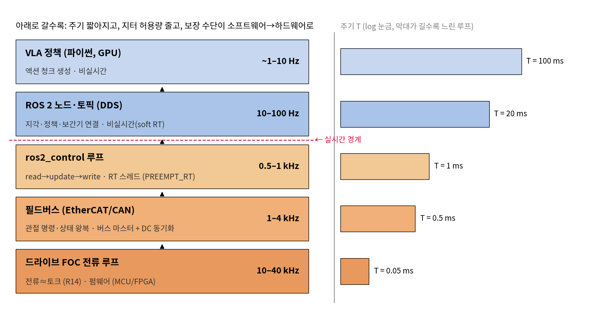
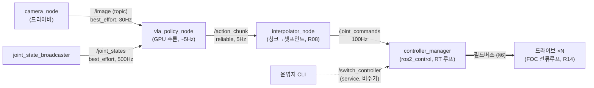
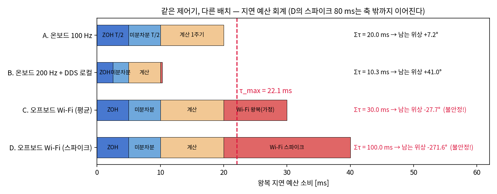
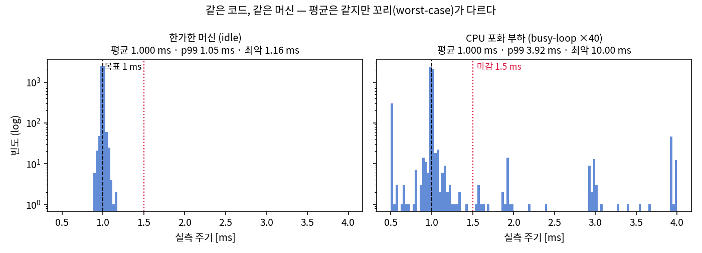
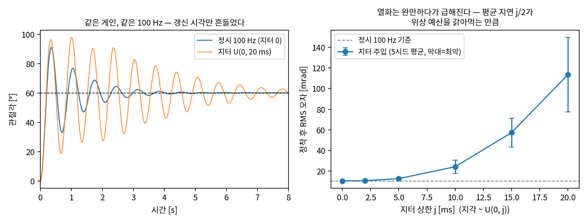
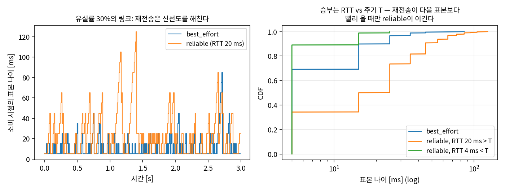
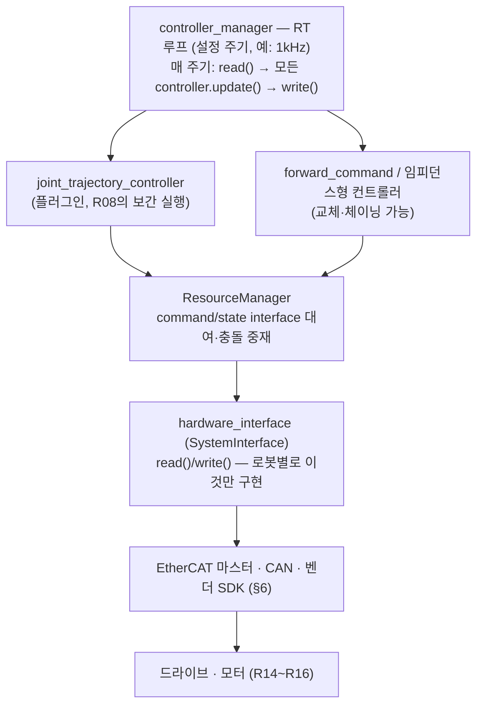

# Lec R25. 로봇 소프트웨어 스택 — ROS 2, 실시간, 필드버스

> 하위제어 트랙 25일차 (Part R6 시스템 통합, 첫 번째). 선수 지식: R17(지연·위상여유·$\tau_{\max}$), R14(전류 루프), 상위 26강(Action 파이프라인)을 참조하면 좋다.
> 이 강의는 Modern Robotics의 범위 밖이다 — 기준 자료는 ROS 2·ros2_control·EtherCAT의 공식 문서다(참고문헌).

## 한 장 요약



R05~R19에서 배운 수학은 전부 "함수"였다 — $\tau = J^\top F$, $u = K_p e + \cdots$. 실제 로봇에서 그 함수들은 **프로세스, 스레드, 패킷**으로 구현되고, 각 층은 자기 주기 $T$를 약속해야 한다. 위(VLA 정책)로 갈수록 느려도 되지만, 아래로 갈수록 주기가 짧아지고 **약속을 어겼을 때의 대가**가 커진다. 그래서 어느 선 아래부터는 일반 OS의 "최선을 다함"으로는 부족해 실시간 커널·필드버스·펌웨어가 등장한다. 오늘 강의는 이 그림의 각 층에 이름을 붙이고(ROS 2, ros2_control, EtherCAT), "약속을 지킨다"를 수치로 정의하고(지터·WCET·지연 예산), 약속이 깨질 때 제어가 얼마나 상하는지를 R17의 진자로 직접 측정한다.

## 학습 목표

1. ROS 2의 핵심 개념(노드/토픽/서비스/액션, DDS, QoS)을 설명하고, 어떤 신호에 어떤 QoS가 맞는지 판단할 수 있다.
2. 주기·지터·WCET를 정의하고, "실시간 = 빠름이 아니라 **최악의 경우가 유계**"임을 측정으로 보일 수 있다.
3. 센서→계산→액추에이터 왕복의 지연 예산을 R17의 $\tau_{\max} = \varphi_m/\omega_c$와 연결해 회계할 수 있다.
4. 일반 리눅스가 주기를 보장하지 못하는 이유와 처방(PREEMPT_RT, SCHED_FIFO, 메모리 잠금)을 나열할 수 있다.
5. EtherCAT/CAN의 구조적 차이(대역폭·토폴로지·distributed clock)와 ros2_control의 계층(controller ↔ hardware_interface)을 그림으로 그릴 수 있다.

## 왜 이 강의가 필요한가

상위 26강은 "Franka는 1kHz 토크 지령, UR은 RTDE 500Hz"라는 숫자를 아무렇지 않게 썼다. 그런데 생각해 보면 이상하다: 여러분이 아는 컴퓨터는 그런 약속을 못 한다. 파이썬 스크립트는 GC가 돌면 수십 ms 멈추고, 리눅스는 부하가 걸리면 태스크를 밀어낸다. 딥러닝 서빙에서 p99 지연을 줄이려 애써 본 사람이라면 안다 — 꼬리(tail)는 언제나 있다. 그런데 R17에서 배웠듯 제어 루프는 지연에 관해 평균이 아니라 **최악값**으로 죽는다. 1kHz 약속을 "99%만" 지키는 시스템은 초당 10번 약속을 어기는 시스템이다.

이 간극을 메우는 것이 로봇 소프트웨어 스택이다: **비실시간 세계**(파이썬, GPU, ROS 2 토픽)와 **실시간 세계**(RT 스레드, 필드버스, 펌웨어)를 한 로봇 안에서 공존시키고, 그 경계에서 신호를 안전하게 주고받는 공학. 이것을 모르면 R17~R19에서 배운 제어기를 실물에 올리는 순간 "시뮬에서는 됐는데 실기에서 떨린다"는 미궁에 빠지고, VLA를 로봇에 붙일 때(상위 26강; R30에서 종합할 것이다) 어디에 무엇을 배치해야 하는지 판단할 수 없다.

## 본문

### 1. 두 세계와 그 경계

한 장 요약의 스택은 사실 두 세계다.

- **비실시간(위쪽)**: VLA 정책, 지각, 로깅, 시각화. 늦어도 되는 것이 아니라, **늦음을 시스템 설계로 흡수**하는 층이다 — 액션 청크는 피드포워드라서(R08, R17 토론 4) 정책이 200ms 늦어도 하위 루프가 로봇을 붙잡고 있다.
- **실시간(아래쪽)**: ros2_control 루프, 필드버스, 전류 루프(R14). 여기서 "늦음"은 곧 위상 손실이고(R17 E3), 위상 손실은 곧 성능·안정성 손실이다.

경계에는 항상 **큐(버퍼)** 가 있다: 정책이 청크를 큐에 넣으면 RT 루프가 자기 주기로 꺼내 쓴다. 상위 26강의 LeRobot 비동기 추론이 정확히 이 구조였다[8]. 오늘 배우는 것은 이 그림의 각 부품이 실제로 무엇인가다.

### 2. ROS 2 최소 개념 — 노드, 토픽, 서비스, 그리고 QoS

ROS(Robot Operating System)는 이름과 달리 OS가 아니라 **미들웨어 + 도구 + 생태계**다[1]. ROS 2의 최소 어휘:

- **노드(node)**: 하나의 기능 단위 프로세스(카메라 드라이버, 정책, 제어기). 딥러닝 파이프라인의 "스테이지"에 해당.
- **토픽(topic)**: 이름 붙은 **pub/sub 스트림**. 발행자와 구독자는 서로를 모른다(익명·다대다) — 센서 데이터, 관절 상태, 명령처럼 **계속 흐르는** 신호용.
- **서비스(service)**: 요청-응답 RPC. "컨트롤러 전환", "파라미터 읽기"처럼 **가끔 일어나는** 상호작용용.
- **액션(action)**: 목표-피드백-결과가 있는 장기 실행 서비스("이 궤적을 수행하라").

ROS 2가 ROS 1과 갈라진 핵심은 통신층이다: 자체 프로토콜과 중앙 마스터 대신 표준 분산 통신 규격인 **DDS**를 채택했고(마스터 없음, 노드들이 서로를 자동 발견), DDS 구현체는 `rmw` 추상층 아래에서 교체 가능하다[1]. 그리고 DDS에서 물려받은 것이 **QoS(Quality of Service)** — 토픽마다 통신의 "계약 조건"을 고르는 장치다[1]:

| QoS 정책 | 선택지 | 뜻 |
|---|---|---|
| reliability | `reliable` / `best_effort` | 유실 시 재전송하는가, 그냥 버리는가 |
| history + depth | `keep_last(n)` / `keep_all` | 큐에 몇 개까지 쌓아 두는가 |
| durability | `volatile` / `transient_local` | 늦게 온 구독자에게 과거 표본을 주는가 |
| deadline / lifespan / liveliness | 주기 약속 / 유통기한 / 생존 신호 | 계약 위반을 **감지**하는 장치 |

발행자와 구독자의 QoS가 호환돼야 연결된다 — best_effort 발행자에 reliable을 요구하는 구독자를 붙이면 **데이터가 한 건도 안 온다**(실습 A-3에서 직접 겪는다)[1]. 어느 쪽을 골라야 하는가가 E3의 주제다. 전형적 로봇 한 대의 노드 그래프:



주의: 이 그래프에서 ROS 2 토픽이 담당하는 것은 **위쪽 절반**뿐이다. `controller_manager`에서 모터까지는 토픽이 아니라 함수 호출과 필드버스다(§6~7) — 토픽으로 1kHz 토크 루프를 돌리지 않는 이유가 오늘 강의의 핵심 논점 중 하나다.

### 3. 핵심 수식

#### E1. 주기와 지터 — 평균이 아니라 최악값 (WCET)

**직관**: 코드에 "10ms마다"라고 썼다고 10ms마다 도는 것이 아니다. 일반 OS는 평균은 잘 지키지만 **약속(보장)은 하지 않는다**. 그리고 R17에서 봤듯, 제어 루프를 부수는 것은 평균 지연이 아니라 최악의 지연이다.

**물리·기하적 의미**: 지터는 **시변 지연**이다. R17 E3에서 지연 $\tau$는 이득을 안 바꾸고 위상만 $\omega\tau$ 깎는 도둑이었다. 갱신 시각이 요동하면 매 주기 다른 크기로 위상을 도둑맞는다 — 평균 성분은 고정 지연처럼 위상여유를 상시 잠식하고, 요동 성분은 루프에 외란을 주입한다. 안정성 판정에 들어가는 것은 그 **상한(sup)** 이다.

**형식**: 명목 주기 $T$, 실제 $k$번째 갱신 시각 $t_k = kT + \delta_k$ ($\delta_k \ge 0$: 지각). 이때

$$
\text{지터} \;\sigma = \operatorname{std}(t_k - t_{k-1}), \qquad
\text{WCET} \; C_{\mathrm{wc}} = \sup_k(\text{계산 시간}), \qquad
\delta_{\max} = \sup_k \delta_k
$$

**하드 실시간**은 $C_{\mathrm{wc}} + \delta_{\max} < T$(모든 마감을 지킨다)를 **증명 또는 보장**하는 시스템이고, 소프트 실시간은 확률적으로만 지키는 시스템이다. 제어 성능 쪽 조건은 R17 WE-3의 등가 지연에 지터를 더해:

$$
\tau_{\mathrm{eff}}^{\mathrm{wc}} \;=\; \underbrace{\tfrac{T}{2} + \tfrac{T}{2}}_{\text{ZOH + 차분}} + \; C_{\mathrm{wc}} + \delta_{\max} \;<\; \tau_{\max} = \frac{\varphi_m}{\omega_c}
$$

여기서 요점은 좌변에 평균이 아니라 전부 **최악값**이 들어간다는 것 — 이것이 "p99로 관리하는 서빙"과 "sup으로 관리하는 제어"의 분기점이다(번역 박스).

#### E2. 지연 예산 — 왕복 시간의 회계

**직관**: 센서에서 액추에이터로 돌아오는 길에 시간이 새는 곳이 대여섯 군데다. 각각은 무해해 보여도 **합산**이 $\tau_{\max}$를 넘으면 루프가 부러진다. 그래서 실무는 지연을 "예산"으로 관리한다 — 층마다 할당하고, 초과분은 어디선가 깎아 온다.

**물리·기하적 의미**: R17의 $\tau_{\max} = \varphi_m/\omega_c$는 위상 저금통이고 각 홉(샘플링, 계산, 전송, 구동)은 인출자다. 서로 다른 두 제약을 구분해야 한다: ① **처리량 제약** — 매 주기 안에 일을 끝내야 한다(1kHz 버스면 read-계산-write가 1ms 안에), ② **위상 제약** — 왕복 지연의 합이 $\tau_{\max}$ 미만이어야 한다. ①을 지키고도 ②를 어길 수 있다(느린 주기로 성실하게 도는 루프).

**형식**: 
$$
\tau_{\mathrm{e2e}} = \underbrace{\tau_{\mathrm{sense}}}_{\text{센서 래치}} + \underbrace{\tau_{\mathrm{up}}}_{\text{상행 전송}} + \underbrace{C}_{\text{계산}} + \underbrace{\tau_{\mathrm{down}}}_{\text{하행 전송}} + \underbrace{\tfrac{T}{2} + \tfrac{T}{2}}_{\text{ZOH·차분}} \;\;\overset{!}{<}\;\; \tau_{\max}
$$

**손계산 (R17의 PD 설계 재사용)**: R17 WE-3의 공격적 PD($K_p{=}900, K_d{=}59$, 플랜트 $\frac{1}{s(s+1)}$)를 다시 꺼낸다. 수치로 재확인하면 $\omega_c = 60.8$ rad/s, $\varphi_m = 76.9°$, 따라서 $\tau_{\max} = 22.1$ ms. 배치 시나리오별 예산:

| 시나리오 | 구성 | $\Sigma\tau$ | 남는 위상 |
|---|---|---|---|
| A. 온보드 100Hz | ZOH 5 + 차분 5 + 계산 1주기 10 | 20.0 ms | **+7.2°** (아슬아슬) |
| B. 온보드 200Hz + DDS 로컬 | 2.5 + 2.5 + 5 + 0.3(가정) | 10.3 ms | **+41.0°** |
| C. 오프보드 Wi-Fi (평균) | A + 왕복 10 ms(가정) | 30.0 ms | **−27.7° → 불안정** |
| D. 오프보드 Wi-Fi (스파이크) | A + 스파이크 80 ms | 100.0 ms | −271.6° |



같은 제어기인데 **배치**가 안정성을 결정한다. C가 보여주는 것: Wi-Fi로 피드백 토크 루프를 닫는 것은 평균으로도 이미 불가능하다 — 그런데 VLA 청크는 Wi-Fi로 보내도 된다(피드포워드라서 이 예산 밖이다; 토론 5). 검증 코드는 세 줄 산수다:

```python
import numpy as np
w = np.logspace(-1, 3, 200000)
L = (59*1j*w + 900)/(1j*w*(1j*w + 1))          # R17 WE-3의 루프 전달함수
i = np.argmin(abs(abs(L) - 1)); wc = w[i]
pm = 180 + np.degrees(np.angle(L[i]))
print(wc, pm, np.radians(pm)/wc)               # 60.8 rad/s, 76.9°, 0.0221 s
for tau in (0.020, 0.0103, 0.030, 0.100):      # 시나리오 A~D
    print(f"Στ={tau*1e3:5.1f} ms → 남는 위상 {pm - np.degrees(wc*tau):+6.1f}°")
```

#### E3. QoS의 산수 — 재전송은 신선도의 적일 수 있다

**직관**: 유실된 패킷의 재전송을 요구하는 순간, 당신은 "과거를 배달받는 계약"을 맺은 것이다. 제어 피드백이 원하는 것은 과거의 완전한 기록이 아니라 **가장 최신의 상태 한 장**이다 — 다음 표본이 어차피 $T$ 뒤에 또 온다.

**물리·기하적 의미**: 유실률 $p$의 링크에서, 유실을 방치하는 비용은 "다음 표본까지 대기"(주기 $T$ 단위)이고, 재전송의 비용은 왕복시간 RTT 단위 + **순서 보장의 연쇄 지연**(head-of-line blocking: 하나가 늦으면 뒤가 전부 늦는다)이다. 승부는 $\mathrm{RTT}$ 대 $T$의 크기 비교로 갈린다.

**형식**: 소비 시점에 손에 든 최신 표본의 나이(staleness)의 기대값은, 연속 유실 횟수가 기하분포를 따르므로

$$
\mathbb{E}[\text{나이}]_{\mathrm{BE}} \approx \tfrac{T}{2} + d + T\,\frac{p}{1-p},
\qquad
\mathbb{E}[\text{지연}]_{\mathrm{REL}} \approx d + \mathrm{RTT}\,\frac{p}{1-p} \;(+\ \text{HOL, 꼬리는 무계})
$$

($d$: 편도 전송시간). **같은 인자 $\frac{p}{1-p}$가 양쪽에 붙고, 계수만 $T$ 대 RTT로 다르다.** 게다가 reliable의 재전송 횟수는 기하분포라 최악 지연에 상한이 없다 — 마감이 있는 루프에는 치명적 성질이다. 그래서 ROS 2의 sensor-data 프로파일이 best_effort + keep_last인 것이다[1]. 수치 검증은 WE-3.

### 4. Worked Examples

#### WE-1 (코드 + 측정): 1kHz 루프의 실제 지터 — 일반 리눅스는 무엇을 약속하지 않는가

"가짜 제어 루프"를 돌리며 `time.monotonic`으로 실측 주기를 기록한다. 대기 전략은 **절대 마감**(다음 마감 시각까지 잔여만 잔다)이다:

```python
import time, numpy as np

def measure(T=0.001, n=5000, strategy="absolute"):
    periods, t_prev = [], time.monotonic()
    t_next = t_prev + T
    for _ in range(n):
        if strategy == "naive":
            time.sleep(T)                      # 상대 대기: "T초 자면 되겠지"
        else:
            dt = t_next - time.monotonic()     # 절대 마감: 잔여 시간만
            if dt > 0: time.sleep(dt)
            t_next += T
        now = time.monotonic()
        periods.append(now - t_prev); t_prev = now
    return np.array(periods) * 1e3             # ms
```

우리 머신(20코어, 일반 커널 6.8)에서의 결과 — 한가할 때와, busy-loop 프로세스 40개로 CPU를 포화시켰을 때:

```
idle     평균 1.0000 ms | σ  12.2 µs | p99 1.046 ms | 최악 1.162 ms  | 마감(1.5ms) 초과율 0.00%
loaded   평균 1.0000 ms | σ 497.7 µs | p99 3.924 ms | 최악 9.997 ms  | 마감(1.5ms) 초과율 2.38%
```



읽는 법: ① **평균은 두 경우 모두 정확히 1ms다** — 평균만 보면 아무 문제가 없다. ② 부하가 걸리자 최악값이 **10ms**, 즉 열 주기를 통째로 결식했다. E1의 언어로 $\delta_{\max}$가 주기의 10배 — 하드 RT 관점에서는 완전한 실격이다. ③ 부하 히스토그램의 0.5ms 쪽 봉우리는 지각 뒤의 **따라잡기 주기**다(절대 마감 스케줄링이 밀린 마감을 만회). ④ 참고로 상대 대기(naive)는 매 주기 오버헤드만큼 늦어져 5000주기에 **+365ms 드리프트**가 쌓인다(절대 마감은 +0.1ms) — 주기 루프의 기본기가 절대 마감인 이유. 이 측정은 머신·순간 부하에 따라 달라진다: 여러분 머신에서 직접 돌려 보는 것까지가 이 예제다(실습 C-1).

#### WE-2 (손 + 코드): 지터를 R17의 진자에 주입 — 열화의 정량화

R17 실습의 그 진자(MuJoCo, 막대 1kg·0.5m), 그 Z-N 게인 $(6.0, 22.0, 0.41)$, 그 100Hz다. 다른 것 하나: 갱신 마감 $kT$에 지각 $\delta_k \sim U(0, j)$를 주입한다. 제어기 코드는 지각을 모른 채 고정 $T$를 가정한다(순진하지만 흔한 구현).

**손계산 (예상)**: R17 실습에서 이 플랜트의 100Hz 지속 진동 주기는 $T_u \approx 0.545$ s, 즉 $\omega_u = 2\pi/T_u \approx 11.5$ rad/s였다. 지터 $U(0, 20\,\text{ms})$의 평균 성분은 $j/2 = 10$ ms의 추가 지연 — 진동 주파수에서 위상을 $\omega_u \cdot 0.01 = 0.115$ rad $\approx 6.6°$ 더 깎는다. Z-N 게인은 원래 임계의 60%에 두는 공격적 튜닝이므로, 몇 도의 추가 손실로도 감쇠가 눈에 띄게 죽을 것이다.

```python
def run_pid(gains=(6.0, 22.0, 0.41), f_ctrl=100.0, jit_ms=0.0, seed=0,
            T_end=8.0, target=np.pi/3):          # 진자 XML은 R17 실습과 동일
    Kp, Ki, Kd = gains
    rng = np.random.default_rng(seed)
    mujoco.mj_resetData(m, d)
    T = 1.0/f_ctrl; ei, e_prev, u = 0.0, None, 0.0
    t_upd, k, qs = 0.0, 0, []
    for i in range(int(T_end/m.opt.timestep)):
        t = i*m.opt.timestep
        if t >= t_upd:                            # 갱신 시각 도달?
            e = target - d.qpos[0]; ei += e*T
            de = 0.0 if e_prev is None else (e - e_prev)/T
            e_prev = e; u = Kp*e + Ki*ei + Kd*de
            k += 1
            t_upd = k*T + rng.uniform(0, jit_ms*1e-3)   # 마감 + 지각
        d.ctrl[0] = u; mujoco.mj_step(m, d); qs.append(d.qpos[0])
    ...
```

결과 (5시드, 정착 후 $t>3$ s RMS 오차; 위 발췌의 전체 실행 스크립트는 `images/lecR25/gen_figs.py`):

```
정시 100Hz      : 10.35 mrad
지터 U(0, 5ms)  : 12.59 mrad
지터 U(0,10ms)  : 24.16 mrad (최악 30.61)
지터 U(0,15ms)  : 57.24 mrad
지터 U(0,20ms)  : 113.54 mrad (최악 149.71)   ← 11배 열화
2% 확률 50ms 스톨: 15.51 mrad (최악 21.49)
```



왼쪽: 지터 $U(0,20\,\text{ms})$는 게인도 주기도 안 바꿨는데 정착을 사실상 지워 버린다 — 손계산이 예상한 대로, 임계 근처 루프의 감쇠가 위상 추가 손실로 무너진 것이다. 오른쪽: 열화는 $j{=}5$ ms까지 완만하다가 급해진다. 두 가지 교훈: ① WE-1의 "부하 걸린 일반 리눅스"(p99 ≈ 4 ms, 최악 10 ms)는 이 곡선에서 이미 왼쪽 무릎을 지난 위치다. ② 드문 긴 스톨(2%에 50ms — GC pause의 캐리커처)은 RMS로는 순해 보이지만 **최악 편차**를 키운다 — 평균 지표가 놓치는 종류의 고장이다(흔한 오해 2).

#### WE-3 (손 + 코드): 토픽 통신 흉내 — reliability vs 신선도

유실률 $p=0.3$의 링크로 100Hz 센서 토픽($T=10$ ms)을 보낸다. 소비자는 매 주기 중간에 "손에 든 최신 표본"의 나이를 잰다.

**손계산**: $\frac{p}{1-p} = 0.429$. E3에 따라 best_effort의 평균 나이 $\approx 5 + 0.2 + 10 \times 0.429 = 9.5$ ms. reliable(RTT 20 ms)은 순서 보장이 없다고 쳐도 $5.2 + 20 \times 0.429 = 13.8$ ms — 여기에 head-of-line이 얹힌다.

```python
def qos_sim(p=0.3, T=0.010, RTT=0.020, d=0.0002, n=1000, seed=42):
    rng = np.random.default_rng(seed)
    t_pub = np.arange(n)*T
    ok = rng.random(n) >= p
    arr_be  = np.where(ok, t_pub + d, np.inf)   # best_effort: 유실은 영영 안 옴
    n_retry = rng.geometric(1-p, size=n) - 1    # reliable: 재시도 횟수 ~ 기하분포
    arr_rel = np.maximum.accumulate(t_pub + d + RTT*n_retry)  # 순서 보장 = HOL
    ...  # 매 주기 t_k + T/2에 최신 도착 표본의 나이를 집계 (전체: images/lecR25/gen_figs.py)
```

```
best_effort        평균 나이  9.63 ms | p99  45.0 ms | 최악  85.0 ms
reliable RTT=20ms  평균 나이 23.28 ms | p99  85.1 ms | 최악 125.0 ms
reliable RTT= 4ms  평균 나이  6.20 ms | p99  25.0 ms | 최악  25.0 ms
```



손계산과 대조: best_effort 9.63 ≈ 9.5 ✓. reliable(RTT 20ms)은 독립 근사 13.8보다 훨씬 나쁜 23.3 — 차액 약 9.5ms가 **head-of-line blocking의 가격**이다. 반전은 셋째 줄: RTT가 주기보다 짧으면($4 < 10$ ms) reliable이 이기고 최악값도 유계가 된다. 규칙: **재전송이 다음 표본보다 빨리 도착할 수 있을 때만 reliable을 고려하라.** 유선 LAN의 로컬 토픽이 대개 그 경우고, Wi-Fi·원격은 대개 아니다.

### 5. 실시간의 실체 — 커널은 무엇을 보장해야 하는가

WE-1에서 본 지각의 출처는 코드가 아니라 **시스템**이다: 일반 스케줄러(CFS)는 공정성을 최적화할 뿐 마감을 모른다. 인터럽트 처리, 페이지 폴트, CPU 주파수 전환, 커널 내부의 비선점 구간이 전부 $\delta_k$의 재료다. 처방은 층층이 쌓는다:

1. **PREEMPT_RT 커널**: 커널 내부 대부분을 선점 가능하게 바꿔 "커널이 바빠서 못 깨워 줌"을 짧게 만든다. 20년 가까이 패치로 살다가 리눅스 v6.12(2024)부터 메인라인에 들어왔다[5]. Franka FCI가 1kHz 통신의 전제로 요구하는 것이 바로 이것이다[6].
2. **RT 스케줄링 클래스**: 제어 스레드를 `SCHED_FIFO` 우선순위로 — "이 스레드가 준비되면 일반 태스크는 전부 비켜라".
3. **메모리 잠금**(`mlockall`)과 사전 할당: 페이지 폴트와 런타임 malloc을 루프 밖으로. RT 루프 안에서는 **할당도, 락 대기도, 시스템 콜도, 파이썬도 없다** — 그래서 실제 스택은 "C++ RT 루프 + 파이썬 비RT 나머지"로 갈라진다.
4. **CPU 격리**: 제어 스레드에 코어를 전용 배정(isolcpus 등)해 간섭원을 물리적으로 치운다.
5. **측정**: 표준 도구는 rt-tests의 `cyclictest`[5] — 우리 WE-1과 같은 일을 커널 타이머 수준에서 하며, 보고서의 1순위 지표가 평균이 아니라 **max**다.

핵심 문장 하나로: **실시간은 속도가 아니라 예측 가능성이고, 그것은 라이브러리가 아니라 시스템 전체(커널+스케줄링+메모리+코드 규율)의 속성이다.** ROS 2를 설치한다고 생기지 않는다(흔한 오해 1).

### 6. 필드버스 — 마지막 1미터의 네트워크

RT 스레드가 계산한 토크 지령은 각 관절의 드라이브(R14의 전류 루프가 사는 곳)까지 **매 주기, 정시에, 전 관절 동시에** 도착해야 한다. 이 요구에 맞춘 통신이 필드버스다.

**EtherCAT**[3]: 이더넷의 물리층(100 Mbit/s 전이중)을 쓰되 TCP/IP 스택을 버렸다. 마스터가 프레임 하나를 쏘면 데이지체인으로 연결된 슬레이브들이 프레임이 **통과하는 도중에**(processing on the fly) 자기 데이터를 읽고 쓴다 — 노드당 지연이 수 µs가 아니라 수백 ns 급이고, 프레임 하나로 전 관절을 갱신한다. ETG의 대표 수치: 분산 I/O 1000점을 30 µs에, 서보 100축을 100 µs 주기로[3]. 그리고 **Distributed Clocks(DC)**: 슬레이브들의 하드웨어 시계를 전파 지연 보상까지 해서 동기화해, 모든 드라이브가 1 µs보다 훨씬 작은 오차로 **같은 순간에** 명령을 적용하고 상태를 래치한다[3]. 여러 관절이 하나의 강체 운동을 만들어야 하는 로봇(R05의 자코비안이 전제하는 "동시각 관절 상태")에서 이 동기화는 사치가 아니라 전제다(토론 4).

**CAN**[4]: 자동차에서 온 2선 차동 버스. 모든 노드가 한 버스를 공유하고, 프레임 ID가 곧 우선순위가 되는 **비파괴 중재**로 충돌을 해결한다 — 높은 우선순위 메시지의 지연이 유계라는 점이 제어 친화적이다. 대신 classic CAN은 최대 1 Mbit/s: 8바이트 데이터 프레임 하나가 스터핑 포함 약 110~130비트 ≈ **프레임당 ~0.13 ms**를 먹는다. 관절 하나에 명령+상태 왕복이면 1kHz에서 버스 하나가 관절 3~4개에서 포화된다는 산수 — QDD 계열 다관절 로봇이 CAN 버스를 여러 가닥 쓰거나(R16) CAN FD(데이터 구간 수 Mbit/s[4]), EtherCAT으로 옮겨 가는 이유다.

| | EtherCAT | CAN (classic) |
|---|---|---|
| 대역폭 | 100 Mbit/s 전이중 | ≤ 1 Mbit/s (FD: 데이터 구간 수 Mbit/s) |
| 갱신 방식 | 프레임 통과 중 읽기/쓰기, 1프레임=전 노드 | 프레임당 1노드, ID 우선순위 중재 |
| 주기 규모 | 수십 µs~1 ms에 수십~수백 축 | 1 ms에 버스당 3~4 관절(왕복 기준) |
| 동기화 | **DC: 하드웨어 시계, ≪1 µs**[3] | 별도 SYNC 메시지, ms급 (CANopen) |
| 토폴로지 | 라인/트리/스타, 스위치 불필요 | 버스 + 종단저항 |
| 로봇에서 | 산업 매니퓰레이터·서보 드라이브 표준 | QDD 모듈(R16)·모바일 베이스·차량 |

이 표의 상단(주기·동기화)이 fig1의 아래 두 층을 하드웨어로 보장하는 장치다. 참고: Franka 1kHz[6]·UR 500Hz[7] 같은 외부 인터페이스 수치는 이 내부 버스 위에 세워진 **공개 창구**의 주기다 — 상위 26강에서 소비자로서 봤던 숫자를, 오늘은 공급자의 입장에서 본 것이다.

### 7. ros2_control — 제어기와 하드웨어 사이의 계약

R17~R19에서 만든 제어기를 매번 로봇별 SDK에 붙이는 것은 낭비다. ros2_control은 그 사이에 표준 계약을 끼운다[2]:



구조의 요점 세 가지[2]:

- **주기 루프의 단일화**: `controller_manager`가 고정 주기로 `read()`(하드웨어→상태) → `update()`(모든 컨트롤러 계산) → `write()`(명령→하드웨어)를 돈다. 토픽의 비동기 세계와 달리 이 루프는 §5의 규율로 보호되는 RT 구간이다.
- **하드웨어 추상화**: 로봇 제작자는 `SystemInterface`의 read/write만 구현하면 되고, 그 위의 컨트롤러들은 로봇을 모른다. 같은 `joint_trajectory_controller`가 Franka에서도, UR에서도, MuJoCo/Gazebo 시뮬(내부는 R26에서 열 것이다)에서도 돈다 — 시뮬↔실기 전환이 설정 파일 교체가 되는 이유.
- **자원 중재**: 두 컨트롤러가 같은 관절의 command interface를 동시에 잡지 못하게 `ResourceManager`가 대여를 관리하고, 전환은 서비스(`switch_controller`)로 원자적으로 일어난다.

VLA와의 접점을 명시하면: 상위 26강의 action 파이프라인에서 "보간/IK/필터 100~1000Hz" 층이라 불렀던 것이 구현으로는 대개 **ros2_control의 컨트롤러 하나**다. 정책(비RT)이 토픽으로 청크를 밀어 넣으면, 컨트롤러(RT)가 매 주기 셋포인트를 뽑아 쓴다 — 두 세계의 경계가 정확히 여기다.

### 딥러닝 배경자를 위한 번역

- **토픽은 스트리밍 데이터 파이프라인이다.** DataLoader의 prefetch 큐, Kafka의 파티션과 같은 그림 — QoS depth가 버퍼 크기, best_effort의 드롭은 "오래된 배치는 버리고 최신을 학습"이고, reliable+keep_all은 backpressure다. 데이터 **수집·로깅**(LeRobot 데이터셋 기록)은 완전성이 목적이라 reliable 쪽, **제어 피드백**은 신선도가 목적이라 best_effort 쪽 — 같은 시스템 안에서 목적별로 계약이 갈린다.
- **실시간은 tail latency 문제의 극한이다.** 추론 서빙에서 여러분은 p99를 관리한다. 제어 루프는 p100(sup)으로 죽는다 — "초당 한 번의 100ms 스파이크"는 서빙 대시보드에선 초록불, 1kHz 토크 루프에선 사고다. GPU 배칭이 대표적 트레이드: 처리량을 사고 꼬리를 판다 — 그래서 정책 추론(배칭 가능, 비RT)과 제어 루프(배칭 금지, RT)를 **물리적으로 분리**하는 것이 이 바닥의 표준 해법이다.
- **ros2_control의 하드웨어 추상화는 프레임워크의 backend 추상화다.** 같은 모델 코드가 CUDA/ROCm/TPU에서 돌도록 디바이스 층을 자르듯, 같은 컨트롤러가 Franka/UR/시뮬에서 돌도록 hardware_interface에서 자른다. "새 가속기 지원 = 커널 몇 개 구현"이 "새 로봇 지원 = read/write 구현"에 대응된다.

## 흔한 오해

1. **"ROS 2를 쓰면 실시간이 된다"** — ROS 2는 실시간을 **주지** 않는다. DDS 채택과 executor 구조로 RT-호환 노드를 짤 수 있게 되었을 뿐, 보장은 §5의 시스템 스택(RT 커널 + SCHED_FIFO + 메모리 잠금 + RT 구간의 코드 규율)에서 온다[1][5]. 데모에서 지터가 작아 보였다면 대개 머신이 한가했기 때문이다(fig2 왼쪽).
2. **"평균 지터가 작으면 안전하다"** — 제어의 안정성 조건에는 평균이 아니라 상한이 들어간다(E1). WE-1의 부하 실험은 평균 1.0000ms 그대로 최악만 10ms로 늘었고, WE-2의 "2% 스톨"은 RMS는 순해 보여도 최악 편차를 키웠다. cyclictest가 max를 1순위로 보고하는 이유다.
3. **"reliable QoS가 항상 더 안전하다"** — 유실률 30% 링크에서 reliable(RTT 20ms)은 best_effort보다 평균 나이가 2.4배 나빴다(WE-3). 재전송은 과거를 배달하고, 순서 보장은 지각을 전염시킨다(head-of-line). 센서 스트림의 기본값이 best_effort + keep_last인 것은 타협이 아니라 원리다[1].
4. **"EtherCAT은 그냥 빠른 산업용 이더넷이다"** — 본질은 속도가 아니라 구조다: TCP/IP 스택 없이 프레임 통과 중에 읽고 쓰는 링(레이턴시가 노드당 ns급), 그리고 하드웨어 시계 동기화(DC, ≪1 µs)[3]. "빠른 이더넷"으로는 100축을 같은 µs에 움직이게 만들 수 없다.

## 실습 (1.5~2시간)

**목표: 주기와 QoS를 몸으로 잰다.** 환경에 따라 경로를 고르라 (A→B→C 순으로 선호).

**경로 A — ROS 2가 설치된 환경** (Ubuntu + ROS 2 Jazzy/Humble):

1. (15분) 두 터미널에서 `ros2 run demo_nodes_cpp talker` / `ros2 run demo_nodes_py listener`. `ros2 topic list`, `ros2 topic info /chatter --verbose`로 QoS를 확인하고, `ros2 node info /talker`로 노드 관점을 본다.
2. (20분) `ros2 topic hz /chatter`로 실측 주기·지터를 관찰. 이어서 `ros2 topic pub -r 1000 /fast std_msgs/msg/Int32 "{data: 1}"`로 1kHz 발행자를 만들고 `ros2 topic hz /fast`로 1kHz가 실제로 나오는지, 부하(WE-1의 busy-loop)를 걸면 어떻게 되는지 측정 — WE-1의 히스토그램과 대조.
3. (20분) QoS 호환성 체험: `ros2 topic echo /chatter --qos-reliability best_effort`는 되지만, best_effort 발행자에 reliable 구독을 걸면 데이터가 오지 않는 것을 확인하라(§2의 호환 규칙).
4. (선택 15분) `sudo apt install rt-tests` 후 `sudo cyclictest -t1 -p80 -i1000 -l10000` — max 항목을 WE-1과 비교.

**경로 B — 도커** (ROS 2 미설치): `docker run -it --rm ros:jazzy` 로 컨테이너를 열고(`docker exec -it <id> bash`로 두 번째 셸), 경로 A의 1~3을 그대로 수행한다. 컨테이너 안에서도 지터의 성질은 같다 — 오히려 "가상화 층이 지터에 얼마를 더하는가"를 측정해 보라.

**경로 C — 파이썬만으로** (오늘 코드의 확장):

1. (30분) WE-1을 자기 머신에서 재현하고, 가능하면 `sudo chrt -f 80 python3 ...`(SCHED_FIFO)로 재실행해 최악값이 얼마나 줄어드는지 비교하라. 두 히스토그램을 겹쳐 그릴 것.
2. (30분) WE-2의 순진한 구현을 고쳐 보라: 적분·미분에 고정 $T$ 대신 **실측 경과시간**을 쓰면 $U(0,20\text{ms})$ 지터에서 RMS가 얼마나 회복되는가? 회복되지 않는 잔여 열화는 어디서 오는가(힌트: ZOH 구간의 연장은 코드로 못 지운다).
3. (30분) WE-3에 keep_last(depth) 개념을 추가하라: reliable이라도 depth=1이면(오래된 것을 덮어쓰면) head-of-line이 어떻게 완화되는가? depth ∈ {1, 5, ∞} 스윕.

## Claude와 토론할 질문

1. GPU 추론(~200ms)을 하는 정책 노드와 1kHz 제어 루프를 한 프로세스에 두면 구체적으로 무엇이 잘못되는가? (GIL, 우선순위 역전, 캐시 오염) 상위 24강 Helix 02가 S2/S1/S0를 물리적으로 분리한 것을 오늘의 언어로 재설명하라.
2. 추론 서빙의 SLA(p99)와 제어 루프의 마감(sup)이 요구하는 시스템 설계가 어떻게 다른지 — GPU 배칭·동적 스케일링·재시도 같은 서빙의 표준 기법 각각이 RT 루프에서 왜 금지되는지 따져 보라.
3. 30Hz 카메라 토픽에 reliable + keep_all을 걸면 E3의 언어로 무슨 일이 벌어지는가? 큐 깊이의 시간 진화를 그려 보고, "지연이 계속 자라는 시스템"의 조건을 유실률과 처리율로 표현하라.
4. EtherCAT DC가 없어서 24개 드라이브가 서로 수백 µs 어긋난 시각에 토크를 적용한다면, 어떤 태스크에서 먼저 문제가 보일까? (양팔 협조, 보행 착지 순간, 고속 궤적의 관절 간 위상) R05의 "동시각 관절 상태" 가정과 연결하라.
5. E2의 시나리오 C(Wi-Fi 토크 루프)는 불안정인데, VLA 액션 청크를 Wi-Fi로 보내는 것(상위 26강의 오프보드 GPU)은 왜 괜찮은가? "피드백 경로의 지연"과 "피드포워드 경로의 지연"이 각각 무엇을 해치는지 구분하라 — R17 토론 4의 완성판.
6. WE-1을 파이썬 대신 C로 짜면 무엇이 좋아지고 무엇은 그대로인가? 언어가 해결하는 지터 성분과 커널이 해결하는 성분을 분리해 보라.
7. Franka가 FCI에 PREEMPT_RT를 요구하는 이유[6]를 E1·E2로 역산하라: 1ms 주기에서 사용자 PC에 허용되는 $\delta_{\max}$는 대략 어느 규모여야 하며, fig2의 loaded 분포는 왜 실격인가?

## 읽을거리

1. **ROS 2 공식 문서의 Concepts 절**(docs.ros.org, ~40분): Nodes/Topics/Services/Actions와 QoS 설정 페이지까지만. 튜토리얼 전체를 따라갈 필요는 없다 — 실습 A가 그 축약본이다.
2. **ros2_control 문서의 Getting Started/Architecture**(control.ros.org, ~30분): §7의 mermaid가 실제 문서의 어느 그림에 대응하는지 확인하는 정도면 충분.
3. **EtherCAT Technology 소개 페이지**(ethercat.org, ~20분): processing-on-the-fly 애니메이션과 Distributed Clocks 절만. 프로토콜 상세(메일박스, CoE)는 필요할 때.

## 자가 점검

1. 지터·WCET·데드라인을 정의하고, 왜 제어 안정성에는 평균이 아니라 상한이 들어가는지(E1) WE-1·WE-2의 수치로 논증할 수 있는가?
2. $\tau_{\max} = \varphi_m/\omega_c$(R17)에서 출발해 E2의 4개 배치 시나리오(+7.2°/+41.0°/−27.7°/−271.6°)를 손으로 재현할 수 있는가?
3. best_effort와 reliable의 평균 신선도 차이를 $p/(1-p)$ 인자로 유도하고, "reliable이 이기는 조건은 RTT < T"를 WE-3의 세 수치(9.63/23.28/6.20 ms)로 설명할 수 있는가?
4. EtherCAT의 processing-on-the-fly와 DC, CAN의 비파괴 중재를 각각 한 문장으로 설명하고, "1kHz에서 CAN 버스당 관절 3~4개" 산수를 재현할 수 있는가?
5. ros2_control의 read→update→write 루프와 hardware_interface의 역할을 그리고, 새 로봇을 지원하려면 무엇만 구현하면 되는지 말할 수 있는가?

## 참고문헌

> 웹 문서는 2026-07-08 접속 기준.

[1] Open Robotics, ROS 2 공식 문서 (Concepts: Nodes, Topics, Services, Quality of Service settings). https://docs.ros.org
— **뒷받침**: §2의 노드/토픽/서비스/액션 정의, DDS 채택·마스터 없는 발견·rmw 추상층, QoS 정책 표(reliability/history/durability/deadline/lifespan/liveliness)와 발행-구독 QoS 호환 규칙, sensor-data 프로파일이 best_effort + keep_last라는 사실 (E3·흔한 오해 3).

[2] ros2_control 공식 문서. https://control.ros.org
— **뒷받침**: §7 전체 — controller_manager의 고정 주기 read→update→write 루프, 컨트롤러 플러그인 구조와 switch_controller 서비스, ResourceManager의 command/state interface 중재, SystemInterface 구현만으로 하드웨어를 추가하는 추상화.

[3] EtherCAT Technology Group, "EtherCAT Technology Introduction". https://www.ethercat.org/en/technology.html
— **뒷받침**: §6 — processing-on-the-fly 동작 원리, 100 Mbit/s 전이중, "분산 I/O 1000점 30 µs·서보 100축 100 µs" 성능 예시, Distributed Clocks 동기화 정확도(≪1 µs), 스위치 없는 라인/트리/스타 토폴로지.

[4] CAN in Automation (CiA), CAN 기술 문서. https://www.can-cia.org
— **뒷받침**: §6 — classic CAN 최대 1 Mbit/s, ID 기반 비파괴 중재, CAN FD의 데이터 구간 고속화, CANopen(CiA 402 드라이브 프로파일)과 SYNC 기반 동기화. 프레임당 ~0.13 ms·버스당 3~4 관절은 프레임 비트 수(8바이트 데이터 프레임 ≈ 110~130비트)에서 계산한 본문의 산수다.

[5] The Linux Foundation, Real-Time Linux 프로젝트 위키. https://wiki.linuxfoundation.org/realtime/start
— **뒷받침**: §5 — PREEMPT_RT의 목적(커널 선점성으로 최악 지연 단축)과 cyclictest(rt-tests)의 용법. 메인라인 병합(v6.12, 2024)은 커널 릴리스 공지 기준.

[6] Franka Robotics, FCI(Franka Control Interface) 문서. https://frankarobotics.github.io/docs/
— **뒷받침**: 1kHz 명령 주기와 PREEMPT_RT 실시간 커널 요구 (§5·토론 7, 상위 26강·R19와 동일 출처).

[7] Universal Robots, RTDE 가이드. https://docs.universal-robots.com/tutorials/communication-protocol-tutorials/rtde-guide.html
— **뒷받침**: e-Series RTDE 500Hz (§6 말미, 상위 26강과 동일 출처).

[8] Hugging Face, LeRobot async inference 문서. https://huggingface.co/docs/lerobot/en/async
— **뒷받침**: §1의 "정책은 큐에 넣고 RT 루프가 꺼내 쓴다" 구조의 실제 구현 사례 (상위 26강 실습과 동일 출처).

*수치 재현성: 본문·그림의 수치(WE-1의 idle σ 12.2 µs·p99 1.046 ms·최악 1.162 ms, loaded σ 497.7 µs·p99 3.924 ms·최악 9.997 ms·초과율 2.38%·드리프트 +365 ms/+0.1 ms, WE-2의 RMS 10.35/10.63/12.59/24.16/57.24/113.54 mrad와 스톨 15.51 mrad, WE-3의 나이 9.63/23.28/6.20 ms와 p99·최악, E2의 $\omega_c = 60.8$·$\varphi_m = 76.9°$·$\tau_{\max} = 22.1$ ms와 시나리오별 잔여 위상 +7.2/+41.0/−27.7/−271.6°)는 본문 코드 블록과 `images/lecR25/gen_figs.py`의 실행 출력이다 — numpy 1.26 / scipy 1.15 / mujoco 3.2.5 기준. 단 WE-1의 시간 측정치는 머신·순간 부하에 따라 달라지는 값으로, 기록된 실측(20코어, 일반 커널 6.8)은 `images/lecR25/p_*.npy`에 캐시되어 있다(재측정하려면 삭제 후 재실행).*
