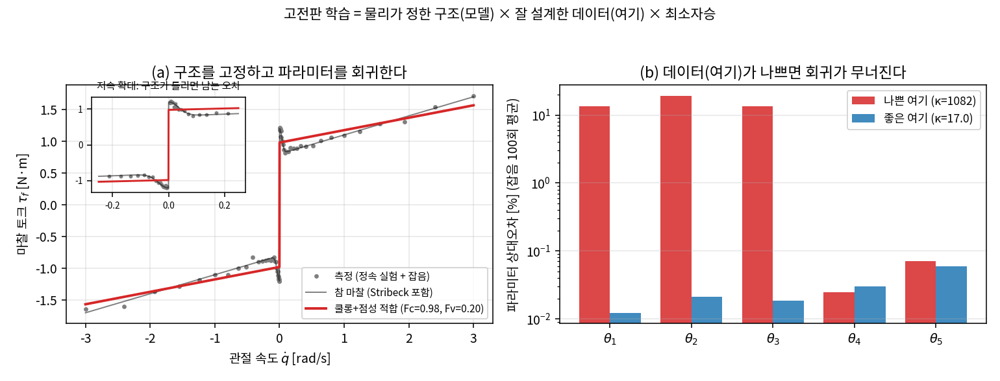
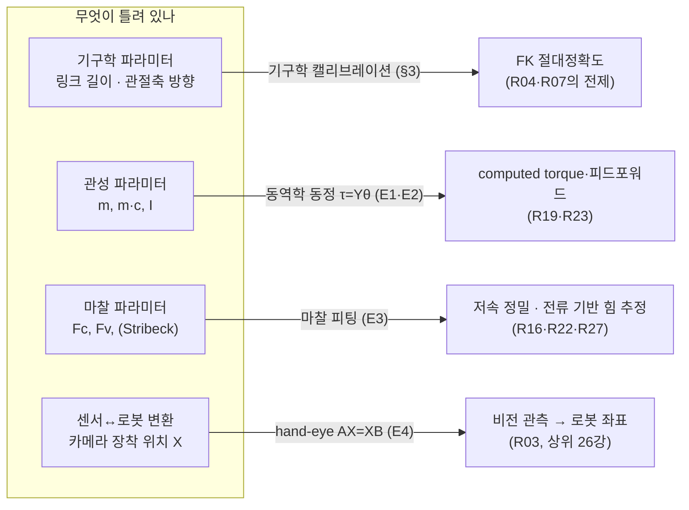
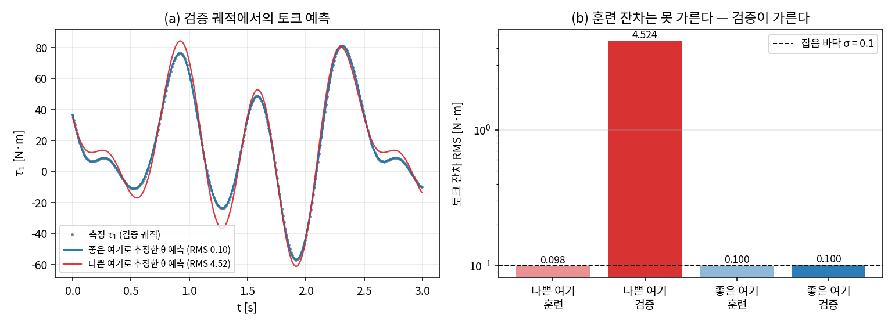
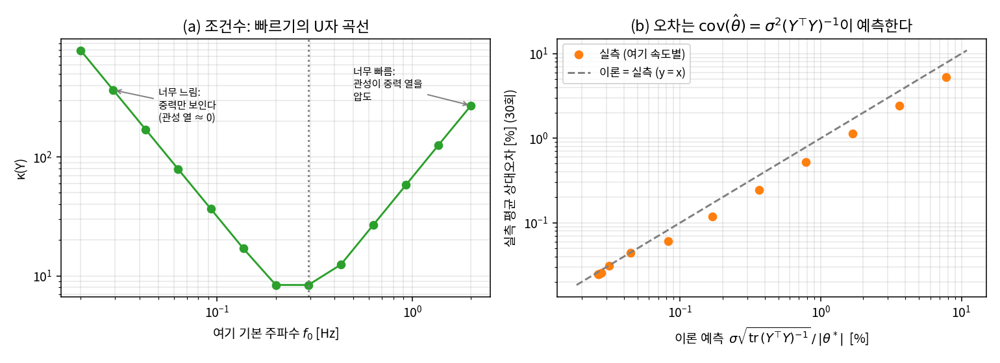
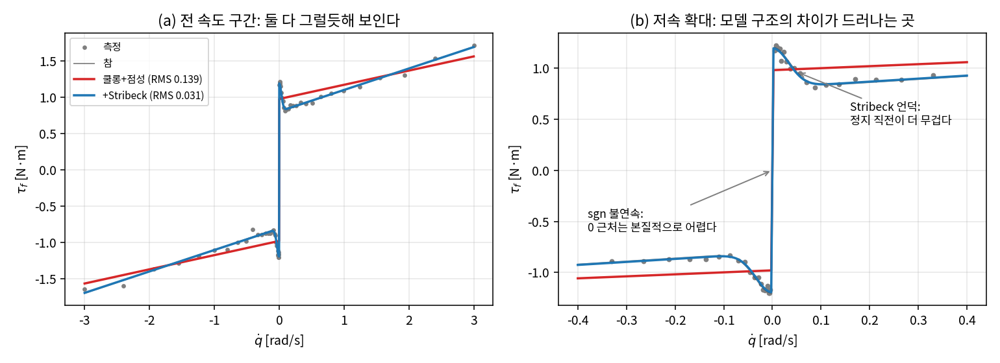
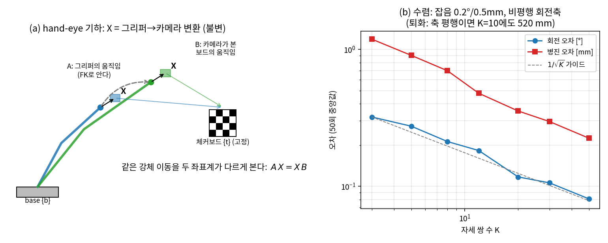

# Lec R28. 시스템 식별과 캘리브레이션 — 고전판 "학습"

> 하위제어 트랙 28일차. 선수 지식: R10(매니퓰레이터 방정식), R19(computed torque), R02·R03(회전과 SE(3)), R18(공분산과 추정의 감각).
> 기초 참고서: MR Ch.8 §8.4(폐형식 동역학 — 관성 파라미터가 1차로 등장하는 구조)와 부록 C(D–H 파라미터의 식별 문제). 단 시스템 식별 방법론 자체는 MR의 범위 밖이라 표준 문헌 [2][3][4][5]로 보강한다.

## 한 장 요약



이 그림에 오늘 강의의 전부가 있다. 왼쪽: 마찰을 "쿨롱 + 점성"이라는 **물리가 정한 구조**로 고정하고 파라미터 2개만 데이터로 회귀했다 — 전 구간에서는 그럴듯하지만, 확대해 보면 구조가 담지 못한 현상(Stribeck 언덕)이 저속에 잔차로 남는다. 오른쪽: 같은 로봇·같은 회귀인데 **데이터(여기 궤적)의 품질**에 따라 관성 파라미터의 오차가 세 자릿수 차이 난다(조건수 κ = 1082 vs 17). 즉 고전 로봇공학에도 "학습"이 있다 — 모델 구조는 물리가 설계하고, 파라미터만 데이터로 맞춘다. 성패를 가르는 두 질문도 딥러닝과 같다: **구조(가설 공간)가 맞는가, 데이터가 어느 방향을 비추는가.**

## 학습 목표

1. 매니퓰레이터 방정식이 관성 파라미터에 **선형**임($\tau = Y(q,\dot q,\ddot q)\,\theta$)을 유도하고, 2R 팔의 회귀자 $Y$와 base parameter 5개를 직접 구성할 수 있다.
2. $\mathrm{cov}(\hat\theta) = \sigma^2 (Y^\top Y)^{-1}$로부터 **여기(excitation) 궤적의 품질이 동정 정확도를 결정**함을 설명하고, 조건수 스윕으로 확인할 수 있다.
3. 쿨롱+점성(+Stribeck) 마찰 모델을 피팅하고, 저속 영역이 왜 본질적으로 어려운지 설명할 수 있다.
4. hand-eye 캘리브레이션을 $AX = XB$로 정식화하고, 해가 유일해지는 조건(비평행 회전축 2개 이상)을 말할 수 있다.
5. "구조 고정 + 파라미터 회귀"(ID)와 "구조도 학습"(신경망)의 트레이드오프 — 데이터 효율·일반화·외삽 — 를 실험 수치로 논할 수 있다.

## 왜 이 강의가 필요한가

R19의 마지막 실험을 기억하자: computed torque는 완전한 모델에서 PD 대비 2265배 정확했지만, 제어기가 믿는 질량이 −20% 틀린 것만으로 413배 악화됐고(0.075 → 31.1 mm), 0.5 kg 페이로드 하나에 1300배 악화됐다. 그때 대책의 계보가 셋으로 갈라진다고 했다 — 강건 제어, 잔차 학습, 그리고 **모델을 실측으로 맞추는 시스템 식별**. 오늘이 그 세 번째 길이다.

문제는 "모델의 숫자들이 어디서 오는가"이다. CAD가 주는 질량·관성은 케이블, 그리스, 모터 회전자, 조립 공차를 모른다. URDF에 적힌 링크 길이는 가공·조립 오차만큼 틀려 있고, 마찰은 CAD 어디에도 없으며, 손목에 단 카메라가 로봇 좌표계 어디에 붙어 있는지는 자로 잴 수 없다. 이 간극을 **측정 데이터로 메우는 절차**가 식별(identification)과 캘리브레이션(calibration)이고, R26에서 나열한 sim2real 갭의 원인 목록 중 "파라미터 오차" 항목을 지우는 유일한 방법이다.

그리고 이 강의는 하위 트랙에서 딥러닝 배경자가 가장 "홈그라운드"에 가까이 오는 날이다. 오늘 할 일은 전부 회귀다 — 단, 특징(feature)을 신경망이 아니라 물리가 설계했다는 점이 다르다. 그 차이가 무엇을 사고 무엇을 포기하는지가 오늘의 마지막 논점이자, 상위 트랙 전체와의 접점이다.

## 본문

### 1. 지도: 네 가지 "맞추기" 문제

로봇에서 부정확한 것은 한 종류가 아니고, 각각 다른 절차·다른 센서·다른 수학이 붙는다:



넷은 용도가 다르지만 수학은 하나로 수렴한다: **모델 구조를 고정하고, 남은 미지수를 최소자승으로 회귀한다** [2]. 관성 동정이 이 틀의 가장 깨끗한 사례라서(놀랍게도 완전 선형이다) 강의의 중심에 놓고, 마찰(약간 비선형)과 hand-eye(회전 때문에 비선형이지만 분리 가능)로 확장한 뒤, 기구학 캘리브레이션은 같은 틀의 변주로 짧게 정리한다.

미리 짚어둘 용어 하나 — 스펙시트의 **반복정밀도(repeatability)** 는 "같은 명령에 같은 곳으로 돌아오는가"(수십 µm 수준이 흔하다)이고, **절대정확도(accuracy)** 는 "명령한 좌표에 실제로 가는가"(캘리브레이션 전에는 mm 단위로 틀리는 것이 보통)이다. 캘리브레이션이 메우는 것은 후자다 — 로봇 단독 teach-and-repeat 작업에는 반복정밀도면 충분하지만, 카메라가 좌표를 불러주는 순간(= VLA를 포함한 모든 비전 기반 조작) 절대정확도와 hand-eye가 성패를 정한다.

### 2. 핵심 수식

#### E1. 동역학의 파라미터 선형성 — $\tau = Y(q, \dot q, \ddot q)\,\theta$

**직관**: R10의 매니퓰레이터 방정식 $M(q)\ddot q + C(q,\dot q)\dot q + g(q) = \tau$는 상태 $(q, \dot q, \ddot q)$에 대해 지독하게 비선형이다. 그런데 **미지수를 바꿔 세우면** — 상태는 측정해서 아는 값이고, 모르는 것은 질량·관성이라고 보면 — 방정식은 그 미지 파라미터들의 **1차식**이다. 비선형 동역학의 동정이 선형 회귀 한 번으로 끝난다는, 로봇공학에서 가장 운 좋은 사실 중 하나다.

**물리·기하적 의미**: 뉴턴 역학에서 힘은 (질량)×(운동의 함수)의 합으로만 나타난다 — $m\ddot x$, $I\dot\omega$, $mgl\cos q$ 어디에도 $m^2$이나 $\sin(I)$는 없다. 라그랑주 유도(R10)로 봐도 같다: 운동에너지 $T = \frac{1}{2}\dot q^\top M(q)\dot q$의 $M$이 관성 파라미터에 1차이고, 운동방정식은 $T, V$의 미분(선형 연산)으로만 만들어지므로 선형성이 끝까지 보존된다. MR §8.4의 폐형식 (8.78)–(8.80) — $M(\theta) = \mathcal{A}^\top\mathcal{L}^\top\mathcal{G}\mathcal{L}\mathcal{A}$, $c(\theta,\dot\theta)$, $g(\theta)$ — 에서도 관성 블록 $\mathcal{G}$가 방정식에 1차로만 들어가는 것을 확인할 수 있다 [1].

**형식**: R10에서 유도한 2R 팔의 $M, C, g$를 파라미터 기준으로 다시 묶으면, 미지수 6개 $(m_1, l_{c1}, I_1, m_2, l_{c2}, I_2)$가 다음 **5개 조합**으로만 등장한다:

$$
\theta_1 = I_1 + I_2 + m_1 l_{c1}^2 + m_2(l_1^2 + l_{c2}^2), \quad
\theta_2 = m_2 l_1 l_{c2}, \quad
\theta_3 = I_2 + m_2 l_{c2}^2, \quad
\theta_4 = m_1 l_{c1} + m_2 l_1, \quad
\theta_5 = m_2 l_{c2}
$$

이때 $M_{11} = \theta_1 + 2\theta_2 \cos q_2$, $M_{12} = \theta_3 + \theta_2 \cos q_2$, $M_{22} = \theta_3$, 코리올리 계수 $h = \theta_2 \sin q_2$, $g_1 = G(\theta_4 \cos q_1 + \theta_5 \cos(q_1{+}q_2))$, $g_2 = G\,\theta_5 \cos(q_1{+}q_2)$가 되어, 전체가

$$
\tau = \underbrace{Y(q, \dot q, \ddot q)}_{2 \times 5,\ \text{전부 아는 값}} \; \theta, \qquad
Y = \begin{bmatrix}
\ddot q_1 & c_2(2\ddot q_1 + \ddot q_2) - s_2(\dot q_2^2 + 2\dot q_1 \dot q_2) & \ddot q_2 & G c_1 & G c_{12} \\
0 & c_2 \ddot q_1 + s_2 \dot q_1^2 & \ddot q_1 + \ddot q_2 & 0 & G c_{12}
\end{bmatrix}
$$

로 정리된다 ($c_2 = \cos q_2$ 등). 이 $\theta$를 **base parameters**(최소 식별 파라미터)라 한다 [2]. 두 가지가 중요하다. ① 개별 값 $(m_2, l_{c2})$ 등은 **원리적으로 분리 불가**다 — 어떤 실험을 해도 $m_2 l_{c2}$라는 곱으로만 토크에 나타난다. ② 그러나 제어(computed torque, RNEA)가 필요로 하는 것도 정확히 이 조합들뿐이라, base만 알면 충분하다. 공간 로봇은 링크당 파라미터가 10개(질량 1 + 1차 모멘트 3 + 관성 텐서 6)이고 마찬가지로 일부 조합만 식별 가능하다 — 일반 로봇의 $Y$와 base 집합은 라이브러리가 계산해 준다(Pinocchio의 `computeJointTorqueRegressor`; 미설치 환경이면 `pip install pin`).

관절 마찰을 점성 모델로 넣으면 $\tau_f = d\,\dot q$도 $d$에 선형이므로, $Y$에 $\dot q$ 열을 붙여 **관성과 마찰을 한 회귀로 동시 동정**할 수 있다 — 실습에서 그렇게 한다.

#### Worked Example WE-1 (손계산 + 코드): 회귀자 한 줄 검산

R10의 균일 막대 팔($m_i = 1$, $l_i = 1$, $l_{ci} = 0.5$, $I_i = \frac{1}{12}$)의 참 base 값은 $\theta^* = (\frac{5}{3}, \frac{1}{2}, \frac{1}{3}, \frac{3}{2}, \frac{1}{2}) = (1.66667, 0.5, 0.33333, 1.5, 0.5)$.

상태 $q = (0, \frac{\pi}{2})$, $\dot q = (1, 2)$, $\ddot q = (1, 0)$에서 손으로: $c_1 = 1$, $c_2 = 0$, $s_2 = 1$, $c_{12} = 0$이므로

$$
Y = \begin{bmatrix} 1 & 0\cdot 2 - 1\cdot(2^2 + 2 \cdot 1 \cdot 2) & 0 & 9.81 & 0 \\ 0 & 0 + 1 \cdot 1^2 & 1 & 0 & 0 \end{bmatrix}
= \begin{bmatrix} 1 & -8 & 0 & 9.81 & 0 \\ 0 & 1 & 1 & 0 & 0 \end{bmatrix}
$$

$$
Y\theta^* = \big(1 \cdot \tfrac{5}{3} - 8 \cdot \tfrac{1}{2} + 9.81 \cdot \tfrac{3}{2},\ \ \tfrac{1}{2} + \tfrac{1}{3}\big) = (12.3817,\ 0.8333)\ \mathrm{N\,m}
$$

```python
import numpy as np
G = 9.81
TH = np.array([5/3, 1/2, 1/3, 3/2, 1/2])          # R10 균일 막대의 base parameters

def regressor(q, qd, qdd):
    c1, c2, s2, c12 = np.cos(q[0]), np.cos(q[1]), np.sin(q[1]), np.cos(q[0]+q[1])
    return np.array([
        [qdd[0], c2*(2*qdd[0]+qdd[1]) - s2*(qd[1]**2 + 2*qd[0]*qd[1]), qdd[1], G*c1, G*c12],
        [0.0,    c2*qdd[0] + s2*qd[0]**2,                qdd[0]+qdd[1], 0.0,  G*c12]])

q, qd, qdd = np.array([0, np.pi/2]), np.array([1., 2.]), np.array([1., 0.])
print(regressor(q, qd, qdd) @ TH)                   # → [12.3817  0.8333]
```

R10의 `M, C, g` 함수로 $M\ddot q + C\dot q + g$를 직접 계산해 비교하면 랜덤 200개 상태에서 최대 차이 $7.1 \times 10^{-15}$ — **재편성은 항등이다**. 여담 하나: 참값에서 $\theta_2 = l_1 \theta_5$인 것은 우연이 아니라 둘 다 $m_2 l_{c2}$에서 왔기 때문인데, 회귀는 이 관계를 모른 채 두 열을 따로 추정한다. 그래서 추정 결과에서 $\hat\theta_2 \approx l_1 \hat\theta_5$가 저절로 성립하는지가 공짜 무결성 검사가 된다.

#### E2. 추정의 정밀도 — $\mathrm{cov}(\hat\theta) = \sigma^2 (Y^\top Y)^{-1}$, 그리고 여기(excitation)

**직관**: $N$개 시점의 데이터를 쌓으면 $\tau_{1:N} = Y_{1:N}\,\theta + \varepsilon$이고 답은 최소자승 $\hat\theta = (Y^\top Y)^{-1} Y^\top \tau$다. 그런데 이 답의 품질은 **데이터를 어떻게 모았는가**에 달려 있다. 로봇을 천천히 살살 움직이면 $\ddot q \approx 0$이라 $Y$의 관성 열들이 통째로 0에 가깝다 — 중력 항은 잘 맞겠지만 관성 파라미터는 잡음이 정한 아무 숫자가 된다. **데이터가 비추지 않은 방향은 회귀가 알 수 없다.**

**물리·기하적 의미**: $Y^\top Y$(정보 행렬)의 고유벡터는 "이 실험이 파라미터 공간의 어느 조합을 얼마나 세게 여기했는가"다. 고유값이 작은 방향 = 실험이 만들어낸 토크 변화가 거의 없는 파라미터 조합 = 추정 분산이 폭발하는 방향. 조건수 $\kappa(Y) = \sigma_{\max}/\sigma_{\min}$는 "가장 잘 보이는 조합과 가장 안 보이는 조합의 비율"이고, 이것이 크면 일부 파라미터가 사실상 미정이다.

**형식**: 잡음이 iid, 분산 $\sigma^2$일 때 (Gauss–Markov)

$$
\mathrm{cov}(\hat\theta) = \sigma^2 (Y^\top Y)^{-1}, \qquad
\mathbb{E}\|\hat\theta - \theta^*\|^2 = \sigma^2\, \mathrm{tr}\big[(Y^\top Y)^{-1}\big]
$$

여기서 **여기 궤적 설계**라는 고전 로봇공학 특유의 단계가 나온다: 궤적 $q(t)$는 우리가 고를 수 있으므로, $\mathrm{tr}[(Y^\top Y)^{-1}]$ 또는 $\kappa(Y)$를 **최소화하는 궤적을 최적화로 설계**한다. 표준 레시피는 관절별 유한 Fourier 급수(멀티사인)로 궤적을 매개화하고, 관절 한계·속도·토크 제약 아래 계수를 최적화하는 것이다 [3]. 주기 궤적은 여러 주기를 평균해 잡음을 깎는 보너스도 준다.

#### Worked Example WE-2 (코드): 여기가 다르면 세 자릿수가 갈린다

같은 2R 팔, 같은 토크 잡음($\sigma = 0.1$ N·m), 같은 표본 수($N = 1000$)로 두 실험을 비교한다 — **나쁜 여기**: 0.05 Hz 단일 사인, 두 관절 거의 동상(최대 속도 0.22 rad/s). **좋은 여기**: 0.5 Hz 기본파 포함 고조파 5개($k = 1{\sim}5$), 무작위 위상(최대 6.65 rad/s).

```python
# 핵심 발췌 — 전체 코드·시드는 ../images/lecR28/gen_figs.py
def multisine(T, N, f0, H, rng, amp):
    """관절별 멀티사인 여기: q(t) = Σ_k (amp/k) sin(2πk f0 t + φ_k). 해석적 q̇, q̈ 동봉."""
    t = np.linspace(0, T, N)
    q, qd, qdd = np.zeros((3, N, 2))
    for j in range(2):
        for k in range(1, H + 1):
            w, ph, a = 2*np.pi*k*f0, rng.uniform(0, 2*np.pi), amp/k
            q[:, j] += a*np.sin(w*t + ph); qd[:, j] += a*w*np.cos(w*t + ph)
            qdd[:, j] += -a*w**2*np.sin(w*t + ph)
    return q, qd, qdd

def stack_Y_tau(q, qd, qdd, sigma, rng):        # τ 측정 = 참 모델 + 잡음
    Y = np.vstack([regressor(q[i], qd[i], qdd[i]) for i in range(len(q))])
    tau = np.hstack([tau_true(q[i], qd[i], qdd[i]) for i in range(len(q))])
    return Y, tau + rng.normal(0, sigma, len(tau))

# 나쁜 여기: 0.05 Hz 단일 사인·동상  /  좋은 여기: 0.5 Hz + 고조파 5·무작위 위상
Y_bad,  tau_bad  = stack_Y_tau(*bad_traj,  sigma=0.1, rng=rng)   # κ(Y_bad)  = 1081.8
Y_good, tau_good = stack_Y_tau(*good_traj, sigma=0.1, rng=rng)   # κ(Y_good) = 16.97
th_bad  = np.linalg.lstsq(Y_bad,  tau_bad,  rcond=None)[0]
th_good = np.linalg.lstsq(Y_good, tau_good, rcond=None)[0]
# 검증: 훈련에 없던 궤적에서 잔차 비교 → 4.524 vs 0.1004 N·m
print(np.sqrt(np.mean((Y_val @ th_bad - tau_val)**2)),
      np.sqrt(np.mean((Y_val @ th_good - tau_val)**2)))
```

잡음 100회 실현 평균의 결과(참값 대비 상대오차):

| | $\theta_1$ | $\theta_2$ | $\theta_3$ | $\theta_4$ (중력) | $\theta_5$ (중력) | 전체 $\|\hat\theta{-}\theta^*\|/\|\theta^*\|$ |
|---|---|---|---|---|---|---|
| 나쁜 여기 (κ=1082) | 13.5% | 19.2% | 13.5% | 0.02% | 0.07% | **10.70%** |
| 좋은 여기 (κ=17) | 0.012% | 0.021% | 0.018% | 0.03% | 0.06% | **0.028%** |

예상대로 나쁜 여기에서도 **중력 항($\theta_4, \theta_5$)만은 정확**하다 — 천천히 움직여도 중력 토크는 크니까. 무너진 것은 관성 항들뿐이고, 대표 1회의 추정값 $\hat\theta = (2.45, 0.169, 0.444, 1.50, 0.50)$을 보면 $\theta_1$이 47%나 틀렸는데도(참 1.667) **훈련 잔차 RMS는 0.0984 vs 0.0995 N·m로 좋은 여기와 구분이 안 된다.** 둘 다 잡음 바닥 $\sigma = 0.1$에 붙어 있기 때문이다. 정체가 드러나는 것은 **다른 궤적(검증)에서**: 나쁜 여기의 $\hat\theta$는 검증 잔차 4.52 N·m로 폭발하고, 좋은 여기는 0.100 N·m — 잡음 바닥 그대로다.



이론 검증까지: $\sigma\sqrt{\mathrm{tr}[(Y^\top Y)^{-1}]}/\|\theta^*\|$가 예측하는 상대오차는 나쁜 여기 12.9%, 좋은 여기 0.029% — 실측(10.7%, 0.028%)과 일치한다. 여기 기본 주파수를 0.02 → 2 Hz로 스윕하면(그림 3) 조건수는 U자를 그리고(너무 느리면 관성이 안 보이고, 너무 빠르면 관성이 중력 열을 압도한다 — κ 최소 8.4 @ 0.29 Hz), 파라미터 오차는 전 구간에서 공분산 공식의 예측선 $y = x$ 위에 올라앉는다. 주의: κ가 목표 함수의 전부는 아니다 — 2 Hz에서 κ는 272로 나빠지지만 오차는 0.025%로 스윕 최소 수준인데, 절대 정보량($Y^\top Y$ 자체의 크기)이 커졌기 때문이다. 실무 설계는 κ가 아니라 공분산 기반 기준(d-optimality 등)을 토크·속도 제약과 함께 최적화한다 [3].



#### E3. 마찰 모델 — $\tau_f = F_c\,\mathrm{sgn}(\dot q) + F_v \dot q$ (+ Stribeck)

**직관**: 감속기·베어링·실(seal)의 마찰은 1차 근사로 "방향만 반대인 일정 토크(쿨롱 $F_c$) + 속도 비례(점성 $F_v$)"다. 실측하면 하나가 더 보인다: **막 움직이기 시작하는 저속에서 마찰이 오히려 더 큰** 언덕(Stribeck 효과) — 정지 마찰 $F_s > F_c$에서 속도가 붙으며 $F_c$로 내려온다 [4].

**물리·기하적 의미**: R12의 접촉 마찰(마찰 원뿔)과 물리는 같은 쿨롱 법칙이지만, 여기서는 관절 내부의 회전 마찰을 **집중 파라미터 모델**로 요약하는 것이다. $\mathrm{sgn}(\dot q)$의 불연속은 장식이 아니라 본질이다: 속도 0 근처에서 마찰은 "움직임에 저항하는 무엇이든" 되는 구속력이라 단일 함수값이 없고(정지 마찰), 방향 반전 시 히스테리시스(pre-sliding)가 있으며, 온도·부하에 따라 변한다. 그래서 **저속 데이터는 원리적으로 지저분하다** — 이것이 R19에서 마찰 보상을 뺀 이유이자, 초저속 정밀 제어가 어려운 이유다.

**형식**:

$$
\tau_f(\dot q) = \Big[F_c + (F_s - F_c)\,e^{-(\dot q/v_s)^2}\Big]\mathrm{sgn}(\dot q) + F_v\,\dot q
$$

$(F_c, F_v)$는 **선형** 파라미터(E1의 틀로 회귀 가능), $(F_s, v_s)$는 **비선형** 파라미터(반복 최적화 필요)다. 표준 실험은 관절을 여러 정속도로 돌리며 정상상태 토크를 재는 것 — $\ddot q = 0$이므로 관성이 사라지고 마찰(+중력)만 남는다. 동적 마찰 모델(LuGre 등)은 pre-sliding까지 상태변수로 담지만 [4], 정적 모델로 충분한 응용이 많다.

#### Worked Example WE-3 (코드): 구조가 틀리면 어디가 아픈가

참 마찰 $F_c = 0.8$, $F_v = 0.3$, $F_s = 1.2$, $v_s = 0.05$인 관절의 정속 실험 60점($|\dot q| \in [0.005, 3]$ rad/s, 토크 잡음 $\sigma = 0.03$)에 세 가지 피팅:

```python
# 발췌 — 데이터 생성과 stribeck 함수 정의는 ../images/lecR28/gen_figs.py
A = np.column_stack([np.sign(v), v])                    # 쿨롱+점성: 선형 LS
Fc, Fv = np.linalg.lstsq(A, tau_f, rcond=None)[0]
p, _ = curve_fit(stribeck, v, tau_f, p0=[0.5,0.5,1.0,0.1])   # Stribeck: 비선형
```

| 모델 / 데이터 | $\hat F_c$ | $\hat F_v$ | 전구간 RMS 잔차 |
|---|---|---|---|
| 쿨롱+점성, 전 구간 | 0.979 (+22%) | 0.196 (−35%) | 0.139 |
| 쿨롱+점성, $\|\dot q\| \ge 0.3$만 | **0.800** | **0.300** | 0.204 (자기 구간에선 0.039) |
| + Stribeck ($\hat F_s{=}1.19$, $\hat v_s{=}0.048$) | 0.808 | 0.296 | **0.031** (≈ 잡음 바닥) |

읽는 법: ① 쿨롱+점성을 **전 구간**에 피팅하면 Stribeck 언덕이 $F_c$를 끌어올리고 $F_v$를 끌어내려 **둘 다 편향**된다(bias) — 구조가 틀리면 파라미터가 "잘못된 현상을 흡수"한다. ② 언덕 바깥($|\dot q| \ge 0.3$)만 쓰면 편향이 사라진다 — 소수점 셋째 자리까지 참값이다. 모델이 유효한 영역을 아는 것이 파라미터를 늘리는 것만큼 중요하다. ③ 저속 구간($|\dot q| < 0.15$)의 잔차는 쿨롱+점성 0.158 vs Stribeck 0.026 — 어느 응용이 저속을 쓰는가에 따라 필요한 모델 용량이 정해진다.



#### E4. hand-eye 캘리브레이션 — $AX = XB$

**직관**: 그리퍼에 카메라를 달았다(eye-in-hand). 카메라가 로봇 좌표로 물체 위치를 불러주려면 **그리퍼→카메라 변환 $X \in SE(3)$**를 알아야 하는데, 이것은 자로 잴 수 없다(렌즈 광학 중심은 하우징 안 어딘가다). 대신 이렇게 잰다: 로봇을 움직이면 그리퍼의 이동 $A$는 FK로 알고(R04), 같은 순간 카메라가 본 고정 체커보드의 "겉보기 이동" $B$는 비전으로 안다. **두 관측은 같은 물리적 이동을 다른 좌표계에서 본 것**이므로, 그 관계식이 $X$를 결정한다.

**물리·기하적 의미**: 자세 1, 2에서 base→그리퍼 변환을 $T_{bg_1}, T_{bg_2}$(FK), 카메라→보드 변환을 $T_{c_1 t}, T_{c_2 t}$(체커보드 PnP)라 하면, 보드는 고정이므로 $T_{bg_1} X\, T_{c_1 t} = T_{bg_2} X\, T_{c_2 t} = T_{bt}$. 정리하면

$$
\underbrace{\big(T_{bg_2}^{-1} T_{bg_1}\big)}_{A}\, X = X\, \underbrace{\big(T_{c_2 t}\, T_{c_1 t}^{-1}\big)}_{B}
$$

즉 $B = X^{-1} A X$ — 같은 강체 운동을 다른 좌표계에서 쓴 **켤레(conjugation)** 관계이고, R03의 아래첨자 소거 규율로 그대로 유도된다. 같은 나사 운동을 그리퍼 좌표로 쓴 것이 $A$, 카메라 좌표로 쓴 것이 $B$이고, 켤레는 회전각을 보존하며 회전축을 $X$로 돌려 보낸다.

**형식** (Tsai–Lenz의 분리 풀이 [5]): 회전 블록은 $R_A R_X = R_X R_B$. 축-각 벡터(R02)로 쓰면 $\boldsymbol\alpha_i = R_X \boldsymbol\beta_i$ — "$A$의 회전축 = $X$로 돌린 $B$의 회전축". 이는 벡터쌍 정합 문제(Wahba)라 R02에서 배운 **SVD 사영**으로 닫힌 해가 나온다: $H = \sum_i \boldsymbol\beta_i \boldsymbol\alpha_i^\top$의 SVD에서 $R_X = V\,\mathrm{diag}(1,1,\det)\,U^\top$. 회전을 알면 병진 블록은 선형이 된다:

$$
(R_{A_i} - I)\,t_X = R_X\, t_{B_i} - t_{A_i}
$$

**해의 존재/유일 조건**: 회전 $R_{A_i}$ 하나에 대해 $(R_{A_i} - I)$는 rank 2이고 영공간이 회전축이다 — 축 방향 성분은 그 움직임으로는 안 보인다. 따라서 **서로 평행하지 않은 회전축 2개 이상**이 있어야 $t_X$(와 $R_X$)가 유일하게 정해진다 [5]. 순수 병진 이동은 회전 정보가 0이라 아무리 모아도 $R_X$에 기여하지 않는다.

#### Worked Example WE-4 (코드): 풀리는 조건과 무너지는 조건

분리 풀이 전체가 이 정도로 짧다 — R02(SVD 사영)와 R03(변환 합성)이 그대로 재료다:

```python
from scipy.spatial.transform import Rotation as Rot

def solve_handeye(As, Bs):                       # As, Bs: 4×4 상대 변환 K쌍
    # ① 회전: α_i = R_X β_i (축-각 벡터의 정합) → Wahba 문제, SVD 닫힌 해 (R02)
    al = np.array([Rot.from_matrix(A[:3, :3]).as_rotvec() for A in As])
    be = np.array([Rot.from_matrix(B[:3, :3]).as_rotvec() for B in Bs])
    U, S, Vt = np.linalg.svd(be.T @ al)          # H = Σ β_i α_iᵀ
    D = np.diag([1, 1, np.sign(np.linalg.det(Vt.T @ U.T))])
    R_X = Vt.T @ D @ U.T                         # det = +1 보장 (반사 제거)
    # ② 병진: (R_Ai − I) t_X = R_X t_Bi − t_Ai 를 쌓아 최소자승
    L = np.vstack([A[:3, :3] - np.eye(3) for A in As])
    rhs = np.hstack([R_X @ B[:3, 3] - A[:3, 3] for A, B in zip(As, Bs)])
    t_X = np.linalg.lstsq(L, rhs, rcond=None)[0]
    return R_X, t_X                              # σ_min(L)이 퇴화 경보기
```

참값 $X$: 회전 = z축 90° 후 x축 12°, 병진 $t_X = (30, -60, 100)$ mm로 시뮬레이션 데이터를 만들고(`gen_figs.py`), 이 풀이로 복원한다:

- **무잡음, $K = 10$쌍**: 회전 오차 $1.0 \times 10^{-14}$°, 병진 $1.2 \times 10^{-13}$ mm — 풀이 자체는 정확하다.
- **현실적 잡음**(카메라 자세 0.2°/0.5 mm), $K = 10$: 회전 0.150°, 병진 0.66 mm. $K$를 3→50으로 늘리면 중앙값 오차 0.320°/1.19 mm → 0.081°/0.22 mm로 대략 $1/\sqrt{K}$ 수렴(그림 5b).
- **퇴화 실험**: 회전축을 전부 z축 근방(±0.01 지터)으로 제한하면 같은 $K = 10$, 같은 잡음에서 회전 4.7°, 병진 **519.6 mm** — 병진 스택 행렬의 최소 특이값이 1.27 → 0.033으로 무너지고, 축 정합 행렬 $H$의 특이값이 $(4.19, 0.001, 0)$으로 rank 1이 된다. **E2와 같은 병리다**: 데이터 양이 아니라 데이터가 비추는 방향이 문제고, 여기서 "여기 설계"는 **회전축이 다양한 자세 세트를 고르는 것**이다.



### 3. 기구학 캘리브레이션 — 같은 틀의 변주

FK의 파라미터(각 관절축의 방향·위치, 링크 오프셋, 엔코더 영점)도 공차만큼 틀려 있고, 이를 잡는 것이 기구학 캘리브레이션이다. 수학은 이제 익숙한 패턴이다: 명목 파라미터 $\phi_0$ 근방에서 1차 전개하면

$$
\Delta x \;=\; \frac{\partial f}{\partial \phi}\Big|_{q,\phi_0}\, \Delta\phi \;=\; J_\phi(q)\,\Delta\phi
$$

— EEF 오차를 **파라미터에 대한 자코비안**(R05의 자코비안과 같은 원리, 미분 대상만 $q$에서 $\phi$로 바뀜)으로 회귀한다. 여러 자세에서 EEF를 외부 계측(레이저 트래커, 볼바, 또는 "평면에 닿았다" 같은 구속 관측)으로 재고, $J_\phi$를 쌓아 최소자승 — E2의 공분산·여기 논리가 자세 선택에 그대로 적용된다 [2]. 한 가지 표기 문제가 실무를 괴롭힌다: D–H 파라미터는 인접 관절축이 거의 평행일 때 **ill-conditioned**다 — 축 방향의 미세한 변화가 공통 수선의 위치를 널뛰게 해, 미세 오차의 식별에 특히 부적합하다(MR 부록 C [1]). R04에서 PoE를 본류로 삼은 이유가 캘리브레이션에서 다시 확인되는 셈이다.

### 4. 이것이 고전판 "학습"이다 — 무엇이 다른가

오늘 한 일을 딥러닝의 언어로 다시 쓰면: 가설 공간을 물리로 좁혀 놓고($\tau = Y\theta$, 마찰 곡선, $AX{=}XB$), 능동적으로 설계한 데이터로, 볼록 최적화(대부분 닫힌 해)를 풀었다. 신경망 학습과 정면 비교하면:

| | 시스템 ID (구조 고정 + 회귀) | 신경망 (구조도 학습) |
|---|---|---|
| 무엇을 배우나 | 파라미터만 — 구조는 물리 법칙 | 구조(특징)와 파라미터를 동시에 |
| 파라미터 수 | 2R: 7개, 산업 6축: 수십 개 (base) | $10^5 \sim 10^9$ |
| 데이터 | 잘 설계한 궤적 **수십 초** (WE-2: 10 s로 0.03%) | 시연 수백~수만 개 |
| 데이터 설계 | 여기 최적화 — 능동적, 이론이 안내 [3] | 대개 수동 수집 + 증강 |
| 외삽 | **물리가 보장**: 훈련에 없던 속도·자세·조합에서도 같은 θ가 유효 | 분포 밖에서 원리적 보장 없음 (상위 13강의 compounding error, 30강의 LIBERO-Plus 붕괴) |
| 표현력 | 구조 밖 현상은 **원리적으로 못 담음** (WE-3의 Stribeck 잔차) | 데이터가 비추면 무엇이든 담음 |
| 불확실성 | $\mathrm{cov}(\hat\theta)$ 닫힌 식 | 앙상블·보정 등 별도 기법 |
| 실패 양상 | 잔차·조건수로 **진단 가능** | 조용히 틀리기 쉬움 |

데이터 효율 격차의 출처는 신비가 아니다: LS는 **숫자 5~7개**만 데이터에서 가져오고 함수의 나머지 모양($\cos q$, $\dot q^2$의 자리)은 물리가 공짜로 준다. 반면 $\tau = \mathrm{NN}(q, \dot q, \ddot q)$를 배우는 신경망은 그 모양까지 입력 공간 전역에서 데이터로 확인해야 하고, 코리올리처럼 속도의 **2차**인 항은 훈련 속도 범위 밖으로 절대 외삽되지 않는다. 거꾸로 ID의 약점은 표에서 자명하다 — 구조가 틀린 곳(히스테리시스, 링크 유연성, 케이블 장력, 접촉)에서는 파라미터를 아무리 잘 맞춰도 잔차가 남고, 그 잔차가 정확히 **학습이 파고드는 자리**다(R19의 결론 재방문). 현대적 절충이 residual learning — 물리 모델이 큰 그림을, 신경망이 구조 밖 잔차를 맡는다 — 이고, 상위 트랙의 sim2real에서 파라미터를 아예 분포로 흩뿌리는 domain randomization은 "동정을 포기한 대가를 정책의 강건성으로 지불"하는 반대 방향의 선택이다.

### 딥러닝 배경자를 위한 번역

- **시스템 ID는 선형 회귀다. 단, 특징 추출기 $Y(q,\dot q,\ddot q)$를 물리가 손으로 설계했다.** 여러분이 아는 "좋은 표현을 얻으면 선형 프로브로 충분하다"의 극한 사례 — 뉴턴 역학이 최강의 pretrained feature extractor 역할을 한다.
- **여기 궤적 설계 = active learning / optimal experiment design.** 입력 분포를 학습자가 고를 수 있고, 무엇이 좋은 입력인지 닫힌 식($\mathrm{cov} = \sigma^2(Y^\top Y)^{-1}$)이 알려 준다. teleop 시연 수집에서 "어떤 시연을 더 모아야 하나"를 감으로 정하는 것과 대비되는 사치다.
- **훈련/검증 분리는 1997년의 로봇공학에도 있었다.** WE-2에서 훈련 잔차(0.098 vs 0.100)는 무용했고 검증 잔차(4.52 vs 0.10)가 진실을 말했다 — 나쁜 여기의 회귀는 "쉬운 훈련 분포에 과적합"된 것이다.
- **base parameter 비식별성 = gauge freedom.** $m_2$와 $l_{c2}$는 곱으로만 관측된다 — 신경망에서 이웃 층의 스케일을 주고받아도 같은 함수인 것과 같은 "같은 출력, 다른 파라미터" 대칭. 다행히 제어가 쓰는 것도 곱뿐이라 문제가 안 된다.
- **Stribeck·LuGre로의 확장 = 모델 용량 증가.** 파라미터 2 → 4 → 상태변수 모델로 갈수록 표현력이 늘지만 식별은 어려워지고 과적합 위험이 생긴다 — 용량 선택 문제의 고전판이며, 판단 기준도 같다(검증 잔차, 그리고 응용이 요구하는 영역).

## 흔한 오해

1. **"CAD/URDF 값이면 충분하다"** — 실습의 "CAD 명목 모델"은 base 기준 17.8% 틀렸고, computed torque 추종 오차를 동정 모델 대비 15배(저게인에서는 41배) 키웠다. CAD에는 감속기 회전자의 반사 관성 $n^2 J_m$(R15), 케이블·그리스·마찰이 없다 — 게다가 R19에서 봤듯 페이로드를 집는 순간 어차피 파라미터는 변한다.
2. **"훈련 잔차가 작으면 좋은 모델이다"** — WE-2의 반례: 파라미터가 47% 틀린 추정도 훈련 잔차는 잡음 바닥에 붙는다. 여기가 부족한 실험은 "못 본 방향"을 잡음으로 채우고, 그 오류는 같은 궤적 위에서는 절대 드러나지 않는다. 검증 궤적, 최소한 조건수라도 봐야 한다.
3. **"동정으로 개별 질량·무게중심을 알아낼 수 있다"** — 원리적으로 불가능하다(base parameter만 식별 가능). 이것은 실패가 아니다: 제어·시뮬레이션이 소비하는 것도 그 조합들뿐이다. 다만 동정된 base 값을 URDF의 개별 $(m, c, I)$ 칸에 되박으려면 물리적 일관성(양의 질량, 관성 텐서의 삼각 부등식)을 만족하는 해를 골라야 한다 — 아무 해나 넣으면 시뮬레이터가 비물리 모델이 된다.
4. **"hand-eye든 뭐든 데이터를 많이 모으면 좋아진다"** — 방향이 없으면 양은 무력하다. WE-4의 퇴화 실험: 회전축이 한 방향에 몰리면 $K = 10$이 아니라 $10^4$을 모아도 축 방향 성분은 복원되지 않는다(잡음 평균만 될 뿐, rank 결손은 그대로). 필요한 것은 표본 수가 아니라 **회전축의 다양성** — E2의 언어로, $Y^\top Y$의 최소 고유값이다.

## 실습 (1.5~2시간): 숨긴 파라미터를 되찾아 computed torque 살리기

**전체 파이프라인** (검증 스크립트: `../images/lecR28/check_mujoco.py`):


1. **셋업**: 스크립트의 2R MJCF는 "진짜" 파라미터(비균일 질량 $m_1{=}1.3$, $m_2{=}0.75$, 치우친 무게중심, 관절 점성 $d = 0.15/0.09$)를 담고 있다 — **먼저 보지 말 것**. 여러분이 아는 것은 R10의 균일 막대 CAD 명목값뿐이라고 가정한다. 스크립트 서두의 설정 검증은 해석 회귀자와 MuJoCo `mj_inverse`가 $10^{-14}$까지 일치함을 확인한다(E1이 MuJoCo 안에서도 항등이라는 뜻).
2. **수집**: PD 제어로 멀티사인 여기 궤적(0.4 Hz × 고조파 5)을 20 s 추종하며 $(q, \tau_{\text{지령}})$을 500 Hz로 기록한다.
3. **미분의 현실**: $q$에 엔코더 잡음($5 \times 10^{-5}$ rad)을 얹고, 4차 Butterworth 8 Hz **zero-phase 필터**(`filtfilt`) 후 `np.gradient` 2회로 $\dot q, \ddot q$를 재구성한다:

```python
from scipy.signal import butter, filtfilt
b, a = butter(4, 8.0, fs=500)                   # 여기 대역(2 Hz)의 4배로 컷오프
Qf   = filtfilt(b, a, Q_meas, axis=0)           # 비인과(zero-phase) — 오프라인의 특권
Qdf  = np.gradient(Qf,  1/500, axis=0)
Qddf = np.gradient(Qdf, 1/500, axis=0)
```

   필터 없이 해 보라 — 이중 차분이 잡음을 $1/\Delta t^2$배 증폭해 회귀가 망가진다. (비인과 필터를 써도 되는 것이 오프라인 동정과 실시간 추정(R27)의 결정적 차이다.)
4. **회귀와 채점**: 마찰 열을 붙인 $Y$($2N \times 7$)를 쌓아 한 방에 푼다:

```python
Y   = np.vstack([regressor7(Qf[i], Qdf[i], Qddf[i]) for i in idx])   # 관성 5 + 점성 2
TAU = np.hstack([TAU_LOG[i] for i in idx])       # 기록해 둔 지령 토크
th_hat = np.linalg.lstsq(Y, TAU, rcond=None)[0]
```

   결과: κ(Y) = 29.6, 전체 상대오차 **0.14%** (base 5개는 0.08% 이내, 마찰은 −1.5%/+2.2%). CAD 명목값은 17.8% 틀려 있었다. $\hat\theta_2 = 0.4125$와 $l_1\hat\theta_5 = 0.4122$의 일치(WE-1의 무결성 검사)도 확인하라.
5. **폐루프 검증**: 다른 검증 궤적에서 computed torque(R19)에 세 모델을 태운다 — CAD 명목 28.76 mrad / **동정 1.89 mrad** / 참값 오라클 1.82 mrad. 동정 모델이 오라클의 1.04배까지 성능을 회복한다(명목 대비 15.2배). 저게인($K_p = 25$)에서는 격차가 41배로 벌어진다 — 게인이 낮을수록 피드포워드 모델의 질이 그대로 드러난다(R19 흔한 오해 1의 재확인).
6. **(심화) 포화의 함정**: 액추에이터 `ctrlrange`를 ±300 → ±100으로 좁혀 재실행해 보라. 지령 토크가 기록되고 **실제 토크는 잘려 나가는** 순간 회귀의 좌변이 거짓말이 되어, 같은 파이프라인이 0.14% → 3.2%로 나빠지고 폐루프 개선은 소멸한다(세 모델 모두 80~90 mrad — 이번엔 제어기도 포화하기 때문). 식별의 대전제는 "기록한 $\tau$가 정말 가해진 $\tau$인가"이다.
7. **(심화) 여기를 직접 설계**: 여기 주파수·고조파 수·진폭을 바꿔 κ(Y)와 4단계 오차의 관계를 그려 보라. WE-2의 U자가 재현되는가?

## Claude와 토론할 질문

1. $\tau = Y\theta$ 선형성은 어디까지 가는가? 기어 탄성, 링크 유연성, Stribeck의 $v_s$, 백래시 — 각각 선형 파라미터인가 아닌가, 아니라면 어떤 식별 전략이 남는가?
2. 여기 궤적 설계를 active learning으로 봤을 때, 상위 트랙의 teleop 데이터 수집에서 대응물은 무엇인가? DAgger(상위 13강)의 "정책이 방문하는 상태에서 라벨을 모아라"와 d-optimality의 "정보 행렬을 키우는 입력을 골라라"는 같은 원리인가, 다른 원리인가?
3. 동정된 base parameter를 MuJoCo/URDF의 개별 링크 값으로 되돌리는 문제(오해 3)를 구체적으로 풀어 보라: 어떤 자유도가 남고, 물리적 일관성 제약은 무엇이며, 아무 해나 넣으면 시뮬의 무엇이 틀어지는가?
4. 저속 정밀이 필요한 응용에서 "Stribeck 데이터를 더 모은다 vs 모델을 LuGre로 바꾼다 vs 그 영역을 피드백(높은 게인·적분기)에 떠넘긴다" — 각 선택의 비용을 R17·R19의 개념으로 비교하라.
5. hand-eye의 "비평행 회전축 2개" 조건을 R18의 가관측성 언어로 다시 말해 보라. 순수 병진만 있는 데이터에서 그래도 식별되는 성분은 무엇인가?
6. computed torque 대신 임피던스 제어(R21)를 쓰면 동정 정확도의 중요성이 어떻게 달라지는가? 그래도 끝까지 중요하게 남는 항은 무엇인가?
7. "물리 모델 + 신경망 잔차"(residual learning)에서 잔차 네트워크가 물리 항까지 잠식하지 않게 하려면 어떤 설계(입력 선택, 정칙화, 학습 순서)가 필요한가? E2의 비식별성 논리로 설명해 보라.

## 읽을거리

1. **Hollerbach, Khalil & Gautier, "Model Identification" (Springer Handbook of Robotics, Ch.6)** [2] (~1시간): 기구학 캘리브레이션과 관성 동정을 하나의 최소자승 틀로 묶는 이 강의의 원전. 관성 파라미터 동정과 기구학 캘리브레이션의 정식화 절까지만 — 세부 알고리즘 변형은 필요할 때.
2. **Swevers et al., "Optimal Robot Excitation and Identification"** [3] (~30분): 초록과 §II(Fourier 여기 매개화)까지만 — WE-2의 스윕이 왜 그 모양인지의 이론적 배경.
3. **MR 부록 C** [1] (~20분): D–H 파라미터가 캘리브레이션에서 ill-conditioned가 되는 이유 — R04에서 PoE를 택한 결정의 후일담으로 읽기.

## 자가 점검

1. 2R 회귀자 $Y$의 5개 열이 각각 어떤 물리 항(관성/코리올리·원심/중력)에서 왔는지 말하고, WE-1의 손계산을 재현할 수 있는가?
2. $\mathrm{cov}(\hat\theta) = \sigma^2(Y^\top Y)^{-1}$에서 출발해, 느린 여기 궤적이 왜 중력 항만 정확하게 만드는지 설명할 수 있는가?
3. 쿨롱+점성 피팅에서 데이터의 속도 범위가 $\hat F_c$를 0.98에서 0.80으로 바꾼 메커니즘(구조 오류의 흡수)을 설명할 수 있는가?
4. $AX = XB$에서 $A$, $B$, $X$가 각각 무엇이고, 해가 유일해지는 조건과 그 조건이 깨질 때의 증상(어느 성분이 안 보이는가)을 말할 수 있는가?
5. "ID가 신경망보다 데이터 효율이 수천 배 좋은 이유"와 "그럼에도 신경망이 필요한 이유"를 각각 한 문장으로, 오늘의 실험 수치를 들어 말할 수 있는가?

## 참고문헌

> 웹 문서는 2026-07-09 접속 기준.

[1] K. Lynch, F. Park, "Modern Robotics: Mechanics, Planning, and Control," Cambridge Univ. Press, 2017. 무료 PDF: https://hades.mech.northwestern.edu/images/7/7f/MR.pdf
— **뒷받침**: 매니퓰레이터 방정식과 §8.4 폐형식 (8.78)–(8.80)에서 관성 블록 $\mathcal{G}$가 1차로 등장하는 구조(E1), 부록 C의 D–H 파라미터 ill-conditioning과 식별 난점(§3). 단 시스템 식별 방법론 자체는 MR에 절이 없어 [2][3]으로 보강.

[2] J. Hollerbach, W. Khalil, M. Gautier, "Model Identification," in B. Siciliano, O. Khatib (eds.), Springer Handbook of Robotics, 2nd ed., Springer, 2016, pp. 113–138. https://doi.org/10.1007/978-3-319-32552-1_6
— **뒷받침**: 기구학 캘리브레이션과 관성 파라미터 동정을 공통 최소자승 틀로 정식화(§1·§3), base parameter(최소 식별 파라미터) 개념(E1).

[3] J. Swevers, C. Ganseman, D. B. Tükel, J. De Schutter, H. Van Brussel, "Optimal Robot Excitation and Identification," IEEE Trans. Robotics and Automation, vol. 13, no. 5, pp. 730–740, 1997.10.
— **뒷받침**: 여기 궤적의 유한 Fourier 급수(멀티사인) 매개화와 공분산 기반 최적 여기 설계(d-optimality), 제약(관절·토크 한계) 하 최적화(E2).

[4] B. Armstrong-Hélouvry, P. Dupont, C. Canudas de Wit, "A Survey of Models, Analysis Tools and Compensation Methods for the Control of Machines with Friction," Automatica, vol. 30, no. 7, pp. 1083–1138, 1994.
— **뒷받침**: 쿨롱/점성/Stribeck 정적 마찰 모델의 분류, 저속·방향 반전(pre-sliding) 영역의 어려움과 동적 모델(LuGre 계열)의 동기(E3).

[5] R. Y. Tsai, R. K. Lenz, "A New Technique for Fully Autonomous and Efficient 3D Robotics Hand/Eye Calibration," IEEE Trans. Robotics and Automation, vol. 5, no. 3, pp. 345–358, 1989.6. https://doi.org/10.1109/70.34770
— **뒷받침**: $AX = XB$ 정식화, 회전 먼저·병진 나중의 분리 풀이, 비평행 회전축 2개 이상이라는 유일해 조건(E4).

[6] Google DeepMind, MuJoCo 문서. https://mujoco.readthedocs.io
— **뒷받침**: 실습의 MJCF `inertial`/`damping` 규약, `mj_inverse`(역동역학)의 의미.

*수치 재현성: 본문·그림의 수치 중 회귀·여기·마찰·hand-eye(WE-1의 $Y$와 $Y\theta^* = [12.3817, 0.8333]$·항등 검증 $7.1\times10^{-15}$, WE-2의 κ 1081.8/16.97·속도 0.220/6.65 rad/s·파라미터 오차 표·전체 10.70%/0.028% vs 이론 12.88%/0.029%·훈련 0.0984/0.0995·검증 4.524/0.1004 N·m·나쁜 여기 $\hat\theta$ = (2.45, 0.169, 0.444, 1.50, 0.50), 스윕의 κ 최소 8.38 @ 0.29 Hz·0.02 Hz의 790/5.2%·2 Hz의 271.6/0.025%, WE-3의 피팅 표(0.979/0.196/0.139, 0.800/0.300/0.204/0.039, 0.808/0.296/1.193/0.0475/0.031)와 저속 잔차 0.158/0.026, WE-4의 무잡음 $10^{-14}$급·잡음 K=10의 0.150°/0.66 mm·퇴화 4.7°/519.6 mm·$\sigma_{\min}$ 1.27→0.0331·$\sigma(H)$ = (4.185, 0.001, 0)·K 스윕 0.320°/1.19 mm → 0.081°/0.22 mm)는 `images/lecR28/gen_figs.py`의, 실습 수치(mj_inverse 대조 $1.07\times10^{-14}$, κ(Y) 29.6, 동정 0.14% vs CAD 명목 17.8%와 파라미터별 표, computed torque 28.760/1.891/1.824 mrad(15.2배·오라클 대비 1.04배), 저게인 88.45/2.164 mrad(41배))는 `images/lecR28/check_mujoco.py`의 실행 출력이다. 6단계 포화 실험 수치(3.23%, 89.5/87.9/80.2 mrad)는 같은 스크립트에서 `ctrlrange`만 ±100으로 바꾼 실행의 기록이다 — numpy 1.26 / scipy 1.15 / mujoco 3.2.5 기준 재현 확인.*
