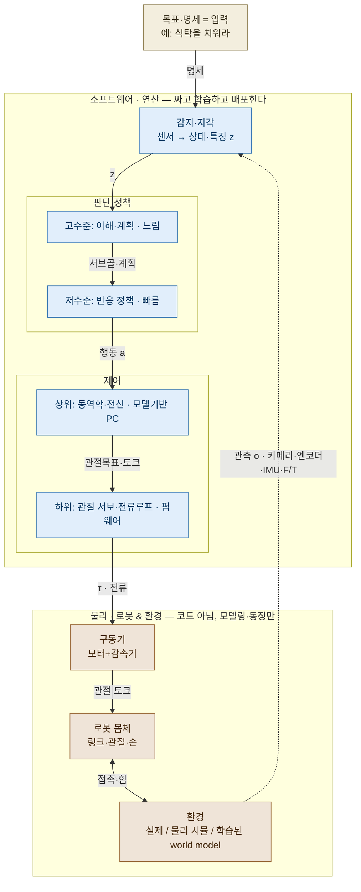
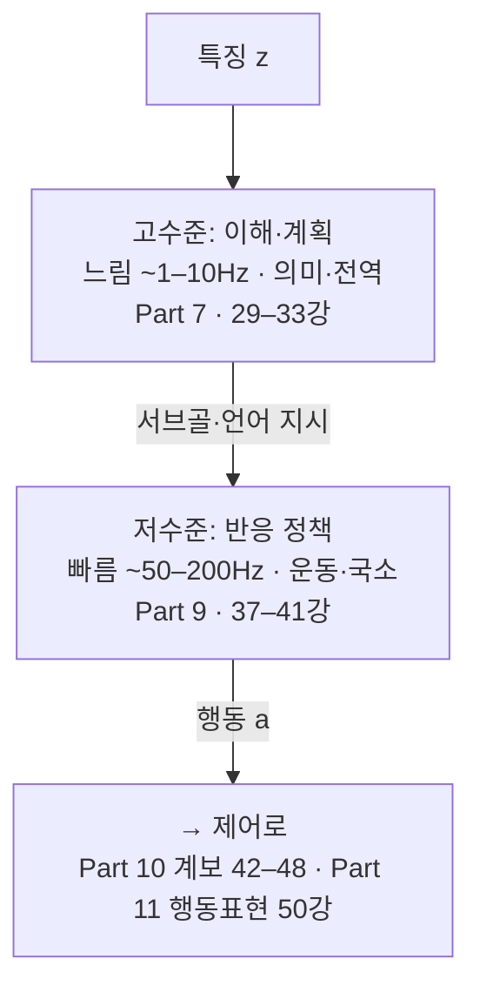
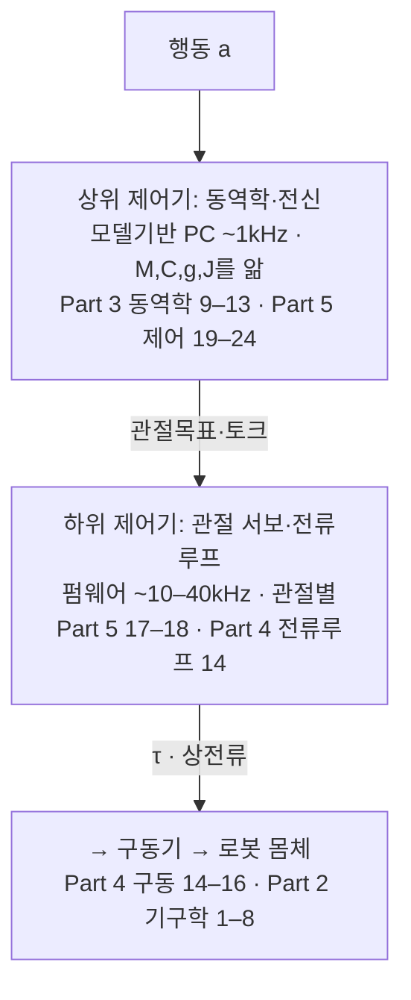
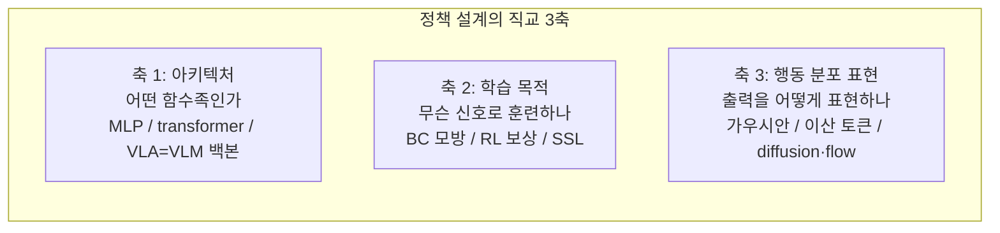

# Lec 00. Physical AI 로봇 시스템 해부 — 전체 지도

> 공용 오리엔테이션. 모든 학습자의 1일차. 선수 지식: 없음.
> 이 강의의 목표는 지식 전달이 아니라 **지도 설치**다. 이후 이 커리큘럼의 모든 강의가 이 지도 위 한 자리를 차지한다 — "이 강의는 시스템의 어느 부분을 파는가"를 항상 이 그림으로 짚는다.

## 한 장 요약



Physical AI로 구동되는 로봇 시스템은 **하나의 닫힌 루프**다: 센서로 세계를 보고(감지) → 무엇을 할지 정하고(판단) → 명령을 운동으로 바꾸고(제어) → 힘을 만들어(구동) → 몸이 움직여(로봇) → 세계를 바꾸고(환경) → 그 변화를 다시 본다. 이 루프는 열린 사슬이 아니라 **로봇과 환경을 통과해 닫힌다.**

세 가지만 먼저 못 박자. 이후 모든 강의가 이 세 구분 위에 놓인다:

1. **신호는 위(느리고 똑똑함)에서 아래(빠르고 단순함)로 흐른다.** 감지·판단은 코드로 돌아가는 **연산**(파란 박스), 구동·로봇·환경은 코드가 아니라 **물리**(갈색 박스)다. 물리는 새로 짤 수 없고 모델링·동정(識別)만 가능하며, 어떤 아키텍처로도 **제거되지 않는다**.
2. **판단과 제어는 각각 상·하 두 층으로 갈린다** — 그리고 그 갈림이 서로 판박이다. 판단은 "느리고 전역적인 이해·계획(고수준)" + "빠르고 국소적인 반응 정책(저수준)"으로, 제어는 "로봇 전체 모델을 아는 상위 제어기" + "관절별로 도는 하위 제어기"로 나뉜다. **위는 느리고 전역·모델을 알고, 아래는 빠르고 국소적**이라는 하나의 원리가 두 곳에 반복된다.
3. **행동 a는 로봇이 아니라 제어기로 간다.** 정책이 내는 행동 a(목표: EEF 포즈·관절각·청크)는 상위 제어기로 들어가고, 제어기 내부에서 **τ(관절 토크)**가 만들어져 구동기→로봇 몸체로 간다. "정책이 로봇을 직접 움직인다"는 흔한 오해다.

블록을 잇는 화살표(z, a, τ, o)는 **인터페이스(계약)** — 단위·좌표계·주기·정규화를 약속한다. sim-to-real·파인튜닝 실패의 대부분이 이 계약 위반에서 난다. 그리고 **환경은 세 가지 형태**를 갖는다: 실제 세계 / 물리 시뮬레이터 / 학습된 world model. 시뮬과 world model도 "실제가 아닌 환경"으로서 이 자리에 들어온다(Part 12에서 상세).

> 벤더들은 이 층들에 "System 2 / System 1 / System 0" 같은 이름을 붙인다. 그러나 그 경계가 회사마다 달라서(예: GR00T와 Helix가 다르게 그음) 전체 지도에는 쓰지 않는다 — 그 얘기는 Part 10(모델별)·15(프론티어·논문 읽기)에서 엄밀한 단서와 함께 다룬다.

## 학습 목표

1. 로봇 시스템을 닫힌 루프(감지→판단→제어→구동→로봇→환경→감지)로 그리고, 각 블록이 **연산인지 물리인지**, 사이를 잇는 인터페이스가 무엇인지 말할 수 있다.
2. 판단(고수준/저수준)과 제어(상위/하위)의 상·하 갈림과, 두 갈림에 공통된 "느린 전역 / 빠른 국소" 원리를 설명할 수 있다.
3. 행동 a → 제어기 → τ → 구동기 → 로봇의 신호 사슬을 정확히 그릴 수 있다(a는 로봇으로 직행하지 않는다).
4. 정책 하나를 설계할 때의 직교 3축(아키텍처·학습 목적·행동 표현)을 구분하고, "VLA vs RL" 같은 문장이 왜 범주 오류인지 설명할 수 있다.
5. 임의의 로봇 시스템·논문을 이 지도 위에 분해하고, 각 요소를 이 커리큘럼의 어느 강의가 다루는지 짚을 수 있다.

## 왜 이 강의가 필요한가

다음 문장을 보자. 요즘 어디서나 들을 수 있다:

> "VLA를 RL로 파인튜닝하고, diffusion으로 action을 생성해서, controller 없이 로봇을 직접 제어한다."

문법적으로 매끄럽지만 서로 **종류가 다른 네 개념**이 평평하게 섞여 있다. VLA는 정책의 한 종류(아키텍처), RL은 정책을 훈련하는 신호(학습 목적), diffusion은 행동 분포를 표현하는 방식(파라미터화), "controller 없이"는 시스템 구성(물리·계약을 지울 수 있다)에 대한 주장이다 — 그리고 마지막은 물리적으로 성립하지 않는다(뒤에서).

이런 혼동은 실제 비용을 낳는다. "우리는 RL 대신 VLA로 간다"는 비교 불가능한 논쟁이 벌어지고, 논문을 읽을 때 "이 모델의 새로움"이 시스템의 어느 자리의 새로움인지 못 짚는다. 이 강의는 그 혼동을 막는 지도를 설치한다. 64강(논문 읽기)에서 이 지도는 "층위 진단"이라는 실전 도구로 돌아온다.

## 본문

### 1. 시스템의 요소와 그 안에서 어느 강의가 무엇을 파는가

로봇이 "컵을 치워라"를 수행하는 0.01초를 갈라 보면 신호가 위 그림의 경로로 흐르고, 플랜트에서 일어난 운동이 센서를 통해 지각으로 되돌아온다. 아래 표는 각 요소가 **연산/인터페이스/물리 중 무엇**인지, 그리고 **이 커리큘럼의 어느 Part·강의가 그것을 파고드는지**를 한눈에 보여준다. 이 표가 오늘 강의의 실질적 지도다.

| 요소 | 종류 | 하는 일 (입력→출력) | 대표 주기 | 파고드는 Part · 강의 |
|---|---|---|---|---|
| 목표·명세 | 입력 | 지시·목표 → 문맥 | 비주기 | Part 7 (29–33강), Part 10 (48강 플래너) |
| **감지·지각** | 🟦 연산 | 센서 → 특징 z | 10~30 Hz | Part 6 (25–28 딥러닝), Part 8 (34–36 VLM) |
| └ 관측 o | ↔ 인터페이스 | 센서 원신호의 형식 | — | Part 11 (49 센서), Part 14 (59 추정) |
| **판단 고수준**: 이해·계획 | 🟦 연산 | z → 서브골·계획 | 1~10 Hz | Part 7 (29–33 Transformer·LLM) |
| **판단 저수준**: 반응 정책 | 🟦 연산 | 서브골 → 행동 a | 50~200 Hz | Part 9 (37–41 모방·생성·RL) |
| └ 행동 a | ↔ 인터페이스 | 관절각/EEF/토큰/청크 | — | Part 11 (50 Action의 여정), Part 10 (42–48 계보) |
| **제어 상위**: 동역학·전신 | 🟦 연산 | a → 관절목표·토크 지령 | ~1 kHz | Part 3 (9–13 동역학), Part 5 (19–24 제어) |
| **제어 하위**: 관절 서보·전류루프 | 🟦 연산(펌웨어) | 지령 → τ·전류 | 10~40 kHz | Part 5 (17–18), Part 4 (14 전류루프) |
| └ 토크 τ | ↔ 인터페이스 | 제어→구동의 형식 | — | Part 4 (14), Part 14 (58 필드버스) |
| **구동기** | 🟫 물리+펌웨어 | 전류 → 관절 토크 | — | Part 4 (14–16 모터·감속기·QDD), Part 11 (49) |
| **로봇 몸체** | 🟫 물리 | 토크 → 운동 | 연속시간 | Part 2 (1–8 기구학) |
| **환경** (실제/시뮬/월드모델) | 🟫 물리 | 운동·접촉 → 세계 변화 | 연속시간 | Part 3 (12–13 접촉·보행), **Part 12 (51–54 시뮬)** |
| (전체를 감싸는 통합·평가) | — | — | — | Part 13 (55–57), Part 14 (58–62) |
| (프론티어·논문 읽기) | — | — | — | Part 15 (63–65) |

**읽는 법 — 종류가 다르면 공부법도 다르다:**

- 🟦 **연산 블록**은 코드다 → 짜 보고, 학습시키고, 뜯어본다. (강의의 worked example·실행 코드가 여기 집중)
- 🟫 **로봇 & 환경**은 코드가 아니다 → 수식으로 모델링하고, 시뮬레이터로 재현하고, 실측으로 동정한다. '제거' 대상이 아니라 '이해' 대상.
- ↔ **인터페이스**는 계약이다 → 단위·좌표계·주기·정규화가 맞는지 **검사**한다. 버그가 여기 산다.

대략 **Part 2–5는 로봇의 몸과 제어(로봇 배경자에게 익숙), Part 6–10은 지능(AI 배경자에게 익숙)**을 판다. 두 흐름이 만나는 지점이 바로 **행동 표현 a**이고(50강), 전체를 하나로 잇는 종합이 62강이다. 어느 배경이든 이 지도의 빈 칸이 자신의 학습 목록이다.

### 2. 확대도 — 판단과 제어는 같은 모양으로 갈린다

큰 그림의 두 블록을 확대하면, 상·하 갈림이 **판박이**임이 보인다.

**판단·정책 확대:**



**제어 확대:**



두 확대도의 공통 원리: **상위 = 느림·전역·모델 기반, 하위 = 빠름·국소.** 판단의 상위(VLM 이해)와 제어의 상위(전신 동역학)는 "느리지만 전체를 본다"는 점에서, 판단의 하위(반응 정책)와 제어의 하위(관절 서보)는 "빠르지만 국소적"이라는 점에서 같은 자리에 있다. 이 대칭 하나로 두 영역을 동시에 이해한다.

### 3. 설계 축 — 정책(판단 저수준)을 "만드는" 세 개의 독립 선택

§1·§2가 시스템을 블록으로 갈랐다면, 이제 그중 **판단 저수준(정책)** 블록 하나를 확대하자. 그것을 *만드는* 선택은 다시 서로 **독립적인 세 축**으로 갈린다 (계층이 아니라 설계 선택):



이 세 축이 **직교**한다 — 한 축의 선택이 다른 축을 강제하지 않는다:

| 시스템 | 아키텍처 | 학습 목적 | 행동 분포 표현 |
|---|---|---|---|
| OpenVLA (43강) | VLA (7B VLM) | BC | 이산 토큰 (AR) |
| π0 (44강) | VLA (3B VLM + expert) | BC | flow matching |
| π*0.6/RECAP (45강) | VLA | BC + **오프라인 RL** | flow matching |
| Diffusion Policy (39강) | CNN/transformer (VLM 아님) | BC | diffusion |
| 보행 RL 정책 (13·16강) | 소형 MLP | **RL** (시뮬 보상) | 가우시안 |

같은 열에 다른 값이 자유롭게 조합된다. 그러므로 "VLA vs RL"은 축 1의 값과 축 2의 값을 비교하는 **범주 오류**다 — "SUV vs 디젤"과 같은 문장 구조다. 올바른 비교는 같은 축 안에서만: "BC만 vs BC+RL"(축 2, 45강 RECAP), "이산 토큰 vs flow"(축 3, 44강 FAST 논쟁).

### 4. 핵심 수식

#### E1. 시스템 = 타입이 있는 함수 합성

**직관**: 각 블록은 "신호를 다른 종류의 신호로 바꾸는 함수"다. 시스템 전체는 그 함수들의 합성이고, 로봇이 움직인다는 것은 이 합성이 폐루프로 도는 것이다.

**물리·기하적 의미**: 각 화살표(블록 경계)에는 **계약**이 있다 — 단위(rad? m?), 좌표계(어느 프레임?), 주기(몇 Hz?), 범위(정규화?). 두 블록이 "정렬"됐다는 건 이 계약이 맞는다는 뜻이고, sim-to-real·파인튜닝 실패의 상당수가 이 계약 위반(단위 불일치, 좌표계 뒤집힘, 정규화 통계 불일치 — 50강의 q01/q99 함정)으로 환원된다.

**형식**: 상태 $x$, 관측 $o$, 특징 $z$, 행동 $a$, 토크 $\tau$에 대해

$$
o_t = h(x_t), \qquad z_t = \phi(o_t), \qquad a_t = \pi_\theta(z_t), \qquad \tau_t = C(x_t^{\,\mathrm{loc}},\, a_t), \qquad \dot{x} = f(x, \tau)
$$

종류를 붙여 읽으면: $h$는 센서 = **관측 인터페이스**, $\phi$는 지각(**연산**), $\pi_\theta$는 정책(**연산**, 내부적으로 고수준∘저수준), $C$는 제어기(**연산**, 내부적으로 상위∘하위; 로컬 상태 $x^{\mathrm{loc}}$ — 엔코더 값 — 를 따로 보고, 출력 τ가 **토크 인터페이스**), $f$는 동역학(**물리 = 로봇+환경**)이다. **결정적으로, $a$는 $f$가 아니라 $C$의 입력**이다 — 정책의 행동은 제어기를 거쳐 τ가 된 뒤에야 로봇에 닿는다. 어떤 시스템을 봐도 이 다섯 함수가 어디 있는지 물어라 — 특히 $f$는 코드에 안 보여도 언제나 물리로 존재한다.

#### E2. 정책의 직교 분해

**직관**: "무엇으로(함수족), 무엇을 향해(손실), 어떤 형식으로(출력 분포)"는 서로 다른 질문이다.

**물리·기하적 의미**: 같은 함수족 $\pi_\theta$ 위에서 학습 목적은 파라미터 공간의 **다른 벡터장**(gradient field)을 만든다. 같은 아키텍처가 BC 목적으로는 시연 분포를 향해, advantage 가중 목적으로는 보상 있는 모드를 향해 움직인다 — 도착지가 다른 것이지 차종이 다른 게 아니다.


**형식**: 동일한 $\pi_\theta(a|z)$에 대해

$$
\mathcal{L}_{\mathrm{BC}}(\theta) = -\mathbb{E}_{(z,a^*)\sim\mathcal{D}}\big[\log \pi_\theta(a^*|z)\big]
\qquad \text{vs} \qquad
J_{\mathrm{RL}}(\theta) = \mathbb{E}_{\pi_\theta}\Big[\sum_t \gamma^t r_t\Big]
$$

왼쪽은 데이터셋 $\mathcal{D}$의 로그우도(지도학습), 오른쪽은 자기 행동이 만든 궤적의 보상 기대값. $\pi_\theta$의 구조와 출력 형식은 두 식 어디에도 강제되지 않는다 — 그래서 직교다. (RL 자세한 내용은 41강.)

#### E3. 다중 주기와 Zero-Order Hold — 위층이 느려도 되는 이유와 그 대가

**직관**: 정책이 2 Hz로 생각해도 로봇이 부드럽게 움직이는 이유는 아래층이 그 사이를 메우기 때문이다. 가장 단순한 메움이 "마지막 명령 유지"(ZOH)다.

**물리·기하적 의미**: ZOH는 명령을 계단 함수로 만든다. 계단 모서리는 고주파 성분이라 플랜트 공진을 때리거나 저크로 나타난다. 그래서 실무 스택은 ZOH 위에 보간·필터 계층을 얹는다(50강의 보간 계층, 8강).

**형식**: 정책 주기 $T_\pi$, 제어 주기 $T_c \ll T_\pi$일 때 ZOH는 $a(t) = a_k$ for $t \in [\,kT_\pi,\ (k+1)T_\pi\,)$. 그리고 지연 $\tau_d$가 있으면 교차 주파수 $\omega_c$에서 위상이 $\omega_c \tau_d$만큼 깎이고, 위상 여유 $\phi_m$의 루프가 견디는 최대 지연은

$$
\tau_{d,\max} \approx \frac{\phi_m}{\omega_c}
$$

(17강에서 유도). 위층이 느려도 되는 조건은 "위층 명령 변화가 아래층 폐루프 대역폭보다 충분히 느릴 것" — 계층화가 공짜가 아니라 **대역 분리라는 계약** 위에 선다.

### 5. Worked Example

#### WE-1 (손으로): 문장 타입 체크

서두 문장을 지도에 배치하자. "VLA를 RL로 파인튜닝하고, diffusion으로 action을 생성해서, controller 없이 로봇을 직접 제어한다."

| 문장 조각 | 좌표 | 판정 |
|---|---|---|
| "VLA를" | 정책(연산), 축 1(아키텍처) | ✓ 유효 |
| "RL로 파인튜닝" | 축 2(학습 목적) | ✓ 유효 — 축 1과 독립이므로 "VLA를 RL로"는 가능한 조합 |
| "diffusion으로 action 생성" | 축 3(행동 분포 표현) | ✓ 유효 — 단 "RL이면서 diffusion"은 두 축의 조합이지 하나의 기법이 아님 |
| "controller 없이 직접 제어" | 제어(연산)+물리에 대한 주장 | ✗ **타입 오류** — 행동 a는 제어기를 거쳐 τ가 되어야 로봇에 닿는다. 액추에이터의 전류루프(물리 근처)도 제거 불가. 가능한 건 제어기를 얇게 만들거나(위치 서보 직결) 학습 모델에 암묵화하는 것. "없앴다"가 아니라 "옮겼다"가 정확 |

교정된 문장: "VLM 백본 정책(축 1)을 BC로 사전학습한 뒤 RL 신호로 추가 훈련(축 2)했고, 행동 분포는 diffusion으로 표현(축 3)하며, 출력 행동 a는 관절 위치 명령(인터페이스)으로 온보드 제어기(상위+하위)에 전달되어 τ가 되어 구동기로 간다." — 길지만 모든 조각이 제 자리에 있다.

#### WE-2 (코드): 2 Hz 정책 + 100 Hz 제어기 — 주기 간극 실험

E3을 눈으로 확인한다. 2 Hz "정책"이 띄엄띄엄 궤적을 내고 100 Hz "제어기"가 추종할 때, ZOH와 선형 보간의 차이:

```python
import numpy as np

T, dt = 3.0, 0.01                    # 100 Hz 제어 루프
t  = np.arange(0, T, dt)
Tp = 0.5                             # 정책 주기 = 2 Hz
ref = 0.6*np.sin(2*np.pi*0.7*t)      # 정책이 '의도한' 연속 궤적
kp  = np.arange(0, T, Tp)
ap  = 0.6*np.sin(2*np.pi*0.7*kp)     # 정책이 실제로 내는 표본들

zoh = np.array([ap[min(int(ti//Tp), len(ap)-1)] for ti in t])   # E3의 계단 함수

def plant_track(cmd):                # 1차 플랜트 + P 제어기 (제어기+플랜트의 최소 모형)
    x, out = 0.0, []
    for c in cmd:
        x += dt * (-2.0*x + 8.0*(c - x))
        out.append(x)
    return np.array(out)

err_zoh = np.abs(plant_track(zoh) - ref).mean()
print(f"ZOH 평균 추종 오차: {err_zoh:.4f}")   # 보간을 넣으면 얼마나 줄어드는지 직접 비교
```

아래 그림이 결과다. 왼쪽(ZOH)은 명령이 계단이라 플랜트가 의도 궤적에서 체계적으로 벗어나고, 오른쪽(선형 보간 한 층 추가)은 같은 2 Hz 정책으로도 훨씬 매끄럽다 — **"층을 하나 넣는다"가 무엇을 사는 행위인지**의 최소 예제다. 50강의 temporal ensembling·RTC는 이 그림의 고급 버전이다.


### 제어 배경자를 위한 번역 / 딥러닝 배경자를 위한 번역

**제어 배경이라면**: 이 지도는 cascade 제어 구조의 확장판이다 — 외루프(지각·판단 = 연산)가 내루프(제어·구동)에 셋포인트를 주는 익숙한 구도에서, 외루프가 "학습된 확률적 생성기"로 바뀌었을 뿐이다. 새로 익힐 것은 축 2·3의 어휘(손실함수, 분포 표현)와 Part 6–10.

**딥러닝 배경이라면**: 이 지도는 모델 서빙 파이프라인의 물리 확장판이다 — 단 **로봇 & 환경**은 코드가 아니라 **재배포가 불가능하고 예외 대신 부러진다**. 새로 익힐 것은 제어~물리의 어휘(Part 2–5)와, "지연·주기가 정확성만큼 중요하다"는 감각(E3).

## 흔한 오해

1. **"VLA와 RL 중 하나를 골라야 한다"** — 범주 오류. VLA는 축 1(아키텍처), RL은 축 2(학습 목적). π*0.6은 VLA이면서 RL로 훈련됐다(45강). 올바른 질문: "BC만으로 충분한가, RL 신호를 더할 가치가 있는가".
2. **"정책이 로봇을 직접 움직인다 / end-to-end면 제어기가 없다"** — 행동 a는 제어기를 거쳐 τ가 되고, 전류루프·동역학(물리)은 언제나 남는다. "end-to-end"는 연산 블록을 한 덩어리로 흡수해 코드에서 경계를 지운 것일 뿐, 물리와 인터페이스는 형식만 바뀌어 존재한다(50강 실측 스택).
3. **"diffusion policy는 RL의 일종이다"** — diffusion은 축 3(분포 표현), 대부분의 diffusion policy는 축 2가 BC다. "generative = RL"이 아니다.
4. **"주기는 엔지니어링 디테일이다"** — E3처럼 주기는 안정성·성능의 1차 변수다. RT-2가 1~3 Hz라는 사실은 그 능력만큼 중요한 스펙이다(42·50강).

## 실습 (1.5~2시간)

**내 시스템 분해 워크시트.** 잘 아는 시스템 하나를 고른다 — 회사 로봇셀, 자율주행 스택, 드론, 혹은 48강의 기업 시스템(공개 자료가 있는 Figure Helix 추천).

1. §1의 요소 표(감지·판단[고/저]·제어[상/하]·구동·로봇·환경 + 인터페이스)를 그리고 각 칸에 그 시스템의 실제 구성요소를 채운다. **각 인터페이스의 신호(물리량·좌표계·단위·주기)를 명시**하고, 각 요소가 연산인지 물리인지 표시한다. 빈 칸이 자신의 학습 지도다.
2. 그 시스템의 "학습된 부분"에 대해 축 1·2·3을 판정한다.
3. E1의 다섯 함수($h,\phi,\pi,C,f$)가 각각 어느 코드/하드웨어에 사는지 지목한다. 특히 "$a$가 로봇으로 직행한다"고 쓴 곳이 있으면 "제어기를 거쳐 τ로" 고쳐 쓴다.
4. Claude에게 워크시트를 검증받고, "층을 없앴다"고 쓴 곳이 있으면 "어디로 옮겼는가"로 고친다.
5. (선택, 30분) WE-2 코드를 실행하고 보간 함수를 추가해 ZOH 대비 오차 감소를 수치로 확인한다.

## Claude와 토론할 질문

1. 이 지도에서 "지능"은 어디에 사는가? 한 블록을 지목할 수 있는가, 아니면 루프 전체의 속성인가?
2. 행동 표현 a를 바꾸면(관절각 → ΔEEF) 위(정책)·아래(제어 상위) 블록에 각각 무엇이 연쇄로 바뀌는가?
3. 판단의 상/하 갈림과 제어의 상/하 갈림이 정말 같은 원리인가? 다른 점은 무엇인가?
4. 축 1·2·3이 "완전히" 직교하는가? 한 축이 다른 축을 기울이는 사례(예: 이산 토큰 ↔ AR 아키텍처 친화성)를 찾아 반박해 보라.
5. "우리 팀은 모방학습 대신 VLA를 쓰기로 했다"의 타입 오류를 지적하고 교정하라.
6. 48강의 Helix 02(3계층)와 Agility(엔지니어링 스택 + 학습 WBC)를 이 지도에 배치하면 무엇이 같고 다른가?
7. 환경의 세 형태(실제/시뮬/world model)는 이 루프에서 무엇을 공유하고 무엇이 다른가? (Part 12 예고)

## 읽을거리

1. **π0 논문 (arXiv:2410.24164) Fig 1~3만** (~15분): 실물 시스템 하나가 이 지도의 어디를 학습으로 채웠는지 첫 사례로 관찰. 본문은 44강.
2. **Figure Helix 블로그** (figure.ai/news/helix, ~15분): 계층을 명시적으로 나눈 상용 시스템 — 실습 1의 모범 답안에 가깝다.
3. (선택) Modern Robotics Ch.1 (MR PDF, ~20분): Part 2–5가 다룰 "물리·제어" 영역의 조감.

## 자가 점검

1. 로봇 시스템을 닫힌 루프로 그리고, 각 블록이 연산/물리 중 무엇인지·인터페이스가 무엇인지 안 보고 말할 수 있는가?
2. 판단(고/저)·제어(상/하)의 상·하 갈림과 공통 원리("느린 전역/빠른 국소")를 설명할 수 있는가?
3. 행동 a → 제어기 → τ → 구동기 → 로봇 사슬을 안 보고 그릴 수 있는가? (a가 로봇으로 직행하지 않는 이유 포함)
4. 정책 설계 3축을 말하고, "VLA vs RL"이 왜 범주 오류인지 반례(π*0.6)로 설명할 수 있는가?
5. 환경의 세 형태를 말하고, ZOH가 무엇이며 왜 그 위에 보간을 얹는지 설명할 수 있는가?

## 참고문헌

> 본문 수치·주장의 출처. 웹 문서는 2026-07 접속 기준. 이 강의의 "닫힌 루프 + 연산/인터페이스/물리" 지도는 본 커리큘럼의 자체 설계다(설계 근거: README 부록 E). 아래는 구체 사례·수식의 출처다.

[1] K. Black et al. (Physical Intelligence), "π0: A Vision-Language-Action Flow Model for General Robot Control," arXiv:2410.24164, 2024.10. https://arxiv.org/abs/2410.24164
— **뒷받침**: 표의 π0 행(VLA × BC × flow matching), 연산 블록을 학습으로 채운 실물 사례.

[2] Physical Intelligence, "π*0.6" (RECAP), arXiv:2511.14759, 2025.11. https://arxiv.org/abs/2511.14759
— **뒷받침**: "VLA이면서 RL로 훈련" 반례(축 1·2 직교성).

[3] C. Chi et al., "Diffusion Policy," arXiv:2303.04137, 2023.3. https://arxiv.org/abs/2303.04137
— **뒷받침**: 표의 Diffusion Policy 행(비-VLM × BC × diffusion — "diffusion=RL 아님").

[4] M. J. Kim et al., "OpenVLA," arXiv:2406.09246, 2024.6. https://arxiv.org/abs/2406.09246
— **뒷받침**: 표의 OpenVLA 행(VLA × BC × 이산 AR 토큰).

[5] Figure AI, "Helix," 기술 블로그, 2025.2. https://www.figure.ai/news/helix
— **뒷받침**: 계층을 명시적으로 분리한 상용 시스템(7~9 Hz / 200 Hz 대역 분리).

[6] K. Lynch, F. Park, "Modern Robotics: Mechanics, Planning, and Control," Cambridge Univ. Press. 무료 PDF: https://hades.mech.northwestern.edu/images/7/7f/MR.pdf
— **뒷받침**: 제어·동역학·기구학의 표준 정식화(Part 2–5의 기초 참고서), E3의 제어 이론 배경(Ch.11).

[7] R. S. Sutton, A. G. Barto, "Reinforcement Learning: An Introduction," 2nd ed., MIT Press, 2018. 무료: http://incompleteideas.net/book/the-book.html
— **뒷받침**: E2의 RL 목적함수 표기, 에이전트–환경 폐루프.

[8] Hugging Face, LeRobot async inference 문서. https://huggingface.co/docs/lerobot/en/async
— **뒷받침**: 정책–제어기 주기 분리의 실무 구현(E3의 현실판).

<!-- lecture-nav -->

---

[📖 전체 목차](../README.md)　｜　다음: [Lec 01. 로봇 해부학 — 링크, 관절, 그리고 자유도](../part02-kinematics/lec01-robot-anatomy.md) ➡
