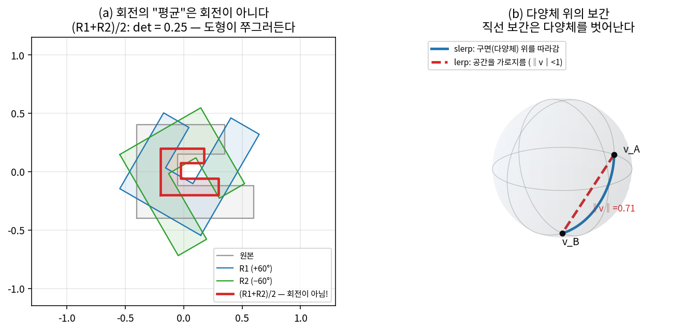
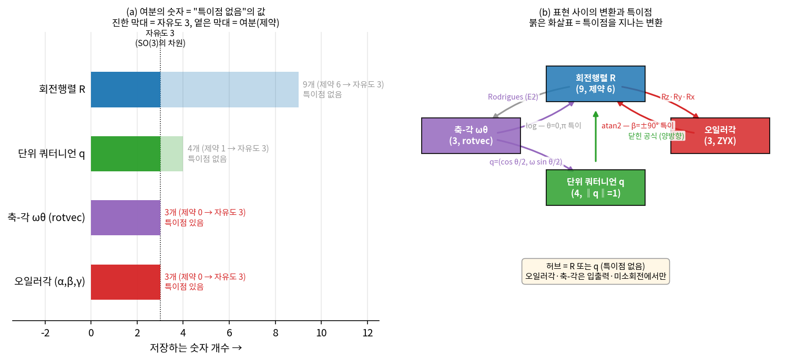
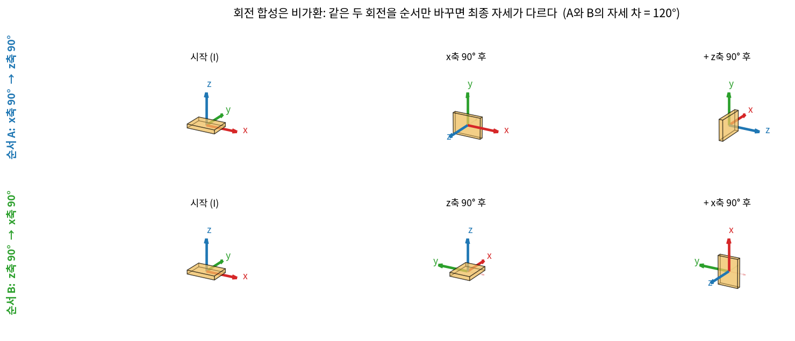
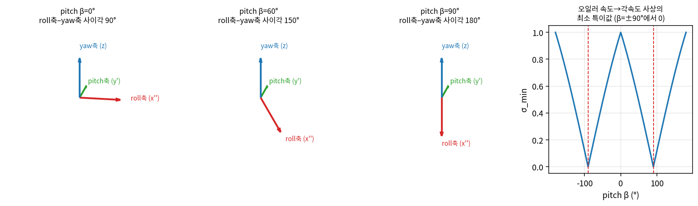
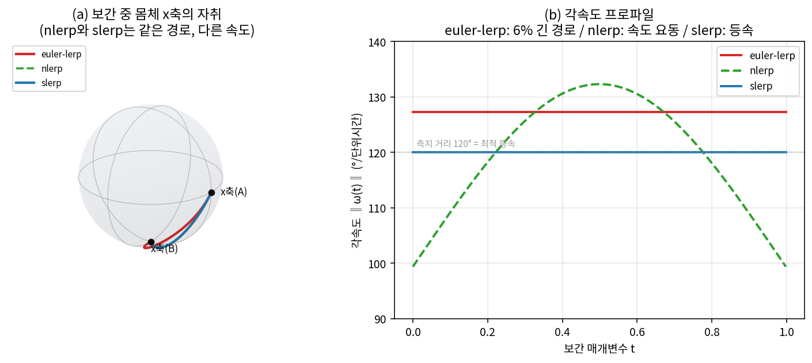
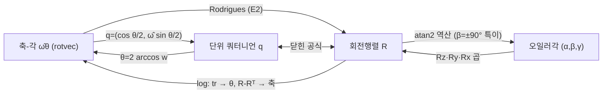

# Lec 02. 회전의 수학 — SO(3)와 그 표현들

> 하위제어 트랙 2일차. 선수 지식: 1강(C-space, "각도를 실수로 다루면 랩어라운드에서 깨진다"는 복선).
> 기초 참고서: Modern Robotics(이하 MR) Ch.3 §3.2 + Appendix B. 이 강의는 그 내용을 딥러닝 배경자의 언어로 재구성한 것이다.

## 한 장 요약



왼쪽: 회전행렬 두 개를 산술평균 내면 $\det = 0.25$짜리 "쭈그러뜨리는 변환"이 나온다 — **회전들의 집합은 덧셈에 닫혀 있지 않다.** 오른쪽: 구면 위 두 점을 직선(lerp)으로 보간하면 구면을 떠난다($\|v\| = 0.71$까지 꺼진다). 회전의 집합 SO(3)는 벡터공간이 아니라 9차원 공간에 박힌 **3차원 곡면(다양체)**이고, 오늘 배우는 네 가지 표현(회전행렬·오일러각·축-각·쿼터니언)은 이 곡면에 좌표를 붙이는 서로 다른 방법이다. 어느 표현도 완벽하지 않다 — 각각 무엇이 깨지는지(짐벌락, 이중 덮개, 로그의 특이점)를 알고 골라 쓰는 것이 오늘의 목표다.

## 학습 목표

1. SO(3)의 정의($R^\top R = I$, $\det R = +1$)와 그 기하적 의미를 설명하고, 주어진 행렬이 회전인지 코드로 검사할 수 있다.
2. Rodrigues 공식을 유도 요점과 함께 쓰고, 축-각 → 회전행렬 변환을 손으로 계산할 수 있다.
3. 짐벌락을 "표현의 특이점"으로 정의하고, 수치 실험으로 재현할 수 있다.
4. 단위 쿼터니언의 곱과 회전 작용($q\,p\,q^*$)을 계산하고, 이중 덮개($q \equiv -q$)가 학습·보간에서 일으키는 문제를 설명할 수 있다.
5. 네 표현의 장단을 비교해 상황(합성·보간·저장·신경망 출력)별로 올바른 표현을 고를 수 있다.

## 왜 이 강의가 필요한가

로봇의 상태와 행동에는 반드시 **자세(orientation)**가 들어간다. 50강에서 다루는 ΔEEF 7차원 action의 3성분이 회전이고, 4강의 정기구학이 내놓는 것도 위치+회전이며, 59강에서 다룰 IMU 기반 자세 추정의 상태변수도 회전이다. 문제는 회전이 벡터가 아니라는 것 — 더할 수도, 평균 낼 수도, 성분별로 보간할 수도 없다. 이걸 모른 채 "각도도 그냥 숫자"로 취급하면: 데이터 평균에서 자세가 쭈그러들고(한 장 요약 a), 오일러각 보간에서 팔이 이상한 경로로 휘돌고(WE-3), pitch 90° 근처에서 자세 추정이 발산하고(WE-2), 신경망의 회전 출력이 특정 자세 근처에서만 학습이 안 되는(Zhou et al.[2], 본문 §6) 사고가 난다. 전부 실제로 일어나는 사고고, 전부 오늘 한 강의로 예방된다.

## 본문

### 1. 하나의 회전, 네 벌의 옷

물리적 회전은 하나다: "어떤 축 둘레로 어떤 각도만큼 돌렸다." 그런데 이를 숫자로 적는 방법이 여럿이고, 각각 다른 곳에서 깨진다:

| 표현 | 숫자 개수 | 제약 조건 | 어디서 깨지나 | 합성(연달아 회전) | 보간 | 주 용도 |
|---|---|---|---|---|---|---|
| 회전행렬 $R$ | 9 | $R^\top R{=}I$, $\det{=}1$ (제약 6개) | 안 깨짐 (유일 표현) | 행렬곱 (~27 곱셈) | 직접 불가 (다양체 이탈) | 기구학 계산의 표준 (3강~) |
| 오일러각 | 3 | 없음 | **짐벌락** + 규약 12종 + 다가성 | 공식 없음 (행렬 경유) | 성분 lerp는 위험 (WE-3) | 사람이 읽는 UI·스펙시트·URDF `rpy` |
| 축-각 $\hat\omega\theta$ | 3 | $\|\hat\omega\|{=}1$ | $\theta{=}0$에서 축 부정, $\theta{=}\pi$ 근처 로그 불안정 | 공식 없음 | 소각도에서 근사적 가능 | 미소 회전·오차·최적화 잔차 (5강·7강) |
| 단위 쿼터니언 $q$ | 4 | $\|q\|{=}1$ (제약 1개) | **이중 덮개** $q \equiv -q$ | 쿼터니언곱 (~16 곱셈) | **slerp** (자연스러움) | 자세 추정·보간·저장 (59강) |

읽는 법: **3개의 숫자로 3차원 회전을 특이점 없이 전역적으로 표현하는 방법은 존재하지 않는다** (지구 전체를 찢김 없이 한 장의 평면 지도에 담을 수 없는 것과 같은 이유다). 그래서 여분의 숫자를 쓰고 제약을 거는 것(행렬 9개, 쿼터니언 4개)과, 최소 개수를 쓰고 특이점을 감수하는 것(오일러각·축-각 3개) 사이의 트레이드오프가 생긴다.



위 표를 한 그림으로 압축한 것이다. (a) 각 표현이 저장하는 숫자 개수(진한 막대 = 실제 자유도 3, 옅은 막대 = 제약이 먹는 여분): SO(3)의 차원은 3인데(점선), 행렬은 9개·쿼터니언은 4개를 쓰고 그 여분으로 **특이점을 산다**. 최소 개수(3개)만 쓰는 오일러각·축-각은 대신 특이점을 떠안는다 — 이것이 §1 표의 "어디서 깨지나" 열의 근본 원인이다. (b) 네 표현 사이의 변환과 각 변환이 특이점을 지나는지(붉은 화살표): 실무에서 **허브를 R 또는 q로 두는**(§5) 이유가 여기 있다 — 이 둘만이 특이점 없이 서로, 그리고 나머지와 오간다. `gen_figs.py`로 생성.

### 2. 핵심 수식

#### E1. SO(3)의 정의 — 회전이란 무엇인가

**직관**: 회전은 "물체를 통째로 돌리는" 변환이다 — 길이를 안 바꾸고, 각도를 안 바꾸고, 왼손/오른손 방향(카이랄리티)도 안 바꾼다.

**물리·기하적 의미**: $R$의 세 열은 "회전된 좌표계의 x·y·z축을 원래 좌표계에서 본 것"이다. 세 축이 서로 수직인 단위벡터라는 조건이 $R^\top R = I$(정규직교)이고, 오른손 좌표계가 오른손 좌표계로 가야 한다는 조건이 $\det R = +1$이다. $\det R = -1$이면 거울 반사 — 물리적 강체는 할 수 없는 변환이다.

**형식**:

$$
SO(3) = \{\, R \in \mathbb{R}^{3\times3} \;\big|\; R^\top R = I,\ \det R = +1 \,\}
$$

9개 숫자에 독립 제약 6개($R^\top R = I$는 대칭이라 식 6개)가 걸리므로 자유 파라미터는 $9-6 = 3$: **SO(3)는 3차원 다양체**다 — 1강에서 "강체의 자세 자유도 = 3"이라 센 것과 정확히 일치한다. 닫힘성도 확인해 두자: $R_1 R_2 \in SO(3)$ (곱은 회전), $R^{-1} = R^\top \in SO(3)$ (역회전은 전치) — 회전은 곱셈에 대해 군(group)을 이루지만, 한 장 요약 (a)가 보였듯 **덧셈에 대해서는 닫혀 있지 않다**. 표기 규약: 이 커리큘럼에서 $R_{ab}$는 "좌표계 $b$의 자세를 좌표계 $a$에서 표현한 것"이고, 합성은 아래첨자가 사슬처럼 이어질 때만 유효하다: $R_{ac} = R_{ab}R_{bc}$ (3강에서 SE(3)로 확장).

#### E2. Rodrigues 공식 — 축-각에서 회전행렬로

**직관**: 어떤 회전이든 "축 하나 + 각도 하나"로 쓸 수 있다(오일러 회전 정리). 축 $\hat\omega$ 둘레로 각속도 1로 $\theta$초 돌린 결과가 $R$이다.

**물리·기하적 의미**: 점 $p$가 축 $\hat\omega$ 둘레를 돌 때 속도는 $\dot p = \hat\omega \times p$다. 외적을 행렬로 쓰면($\hat\omega \times p = [\hat\omega]\,p$):

$$
[\hat\omega] = \begin{bmatrix} 0 & -\omega_3 & \omega_2 \\ \omega_3 & 0 & -\omega_1 \\ -\omega_2 & \omega_1 & 0 \end{bmatrix}
\qquad \text{(반대칭 행렬, "hat" 연산)}
$$

$\dot p = [\hat\omega] p$는 **선형 상미분방정식**이고, 그 해는 지수함수다: $p(\theta) = e^{[\hat\omega]\theta} p(0)$. 즉 회전행렬은 반대칭 행렬의 지수다 — "각속도를 시간만큼 적분하면 회전이 된다."

**형식 (유도 요점)**: 행렬 지수를 급수로 펼치고, 반대칭 행렬의 핵심 항등식 $[\hat\omega]^3 = -[\hat\omega]$ ($\|\hat\omega\|=1$일 때)를 쓰면 3차 이상 항이 전부 $[\hat\omega]$과 $[\hat\omega]^2$로 되돌아온다. $\sin$과 $\cos$의 테일러 급수로 묶이면서:

$$
R = e^{[\hat\omega]\theta} = I + \sin\theta\,[\hat\omega] + (1 - \cos\theta)\,[\hat\omega]^2
\qquad \text{(Rodrigues 공식, MR §3.2.3)}
$$

무한급수가 **딱 세 항으로 닫힌다** — 손계산이 가능한 이유다(WE-1). 역방향(로그 사상, $R \to \hat\omega\theta$)은 $\theta = \arccos\frac{\operatorname{tr} R - 1}{2}$, $[\hat\omega] = \frac{1}{2\sin\theta}(R - R^\top)$로 구하며, $\theta = 0$(축 부정)과 $\theta = \pi$($\sin\theta = 0$, 별도 처리 필요) 근처가 특이하다(MR §3.2.3). 이 $\hat\omega\theta \in \mathbb{R}^3$가 회전의 **지수좌표**(rotation vector)로, 3강에서 twist로, 4강에서 PoE 정기구학으로 확장되는 이 커리큘럼의 본류다.

#### E3. 단위 쿼터니언 — 곱과 회전 작용

**직관**: 복소수 $e^{i\theta}$가 2차원 회전을 표현하듯, 4차원 수 체계인 쿼터니언의 단위원소가 3차원 회전을 표현한다. "축-각을 삼각함수에 절여 놓은 4-벡터"라고 생각하면 된다.

**물리·기하적 의미**: 축 $\hat\omega$, 각 $\theta$인 회전은

$$
q = \left(\cos\tfrac{\theta}{2},\ \hat\omega \sin\tfrac{\theta}{2}\right) = (w,\ \mathbf{v}) \in S^3, \qquad \|q\| = 1
$$

**반각** $\theta/2$이 들어가는 것에 주목 — 회전 작용에서 $q$가 두 번 곱해지기 때문에 각도가 두 배가 되어 돌아온다(WE-1에서 손으로 확인한다). 반각의 대가가 **이중 덮개**다: $\theta$에 $2\pi$를 더하면 $q$가 $-q$가 되는데 회전은 같다. 즉 $q$와 $-q$는 항상 같은 회전이고, 단위 쿼터니언의 구 $S^3$는 SO(3)를 정확히 두 겹으로 덮는다.

**형식**: 쿼터니언 곱(합성 규칙)과 벡터 회전 작용:

$$
q_1 \otimes q_2 = \bigl(w_1 w_2 - \mathbf{v}_1 \cdot \mathbf{v}_2,\;\; w_1\mathbf{v}_2 + w_2\mathbf{v}_1 + \mathbf{v}_1 \times \mathbf{v}_2\bigr)
$$

$$
(0,\ p') = q \otimes (0,\ p) \otimes q^*, \qquad q^* = (w, -\mathbf{v})
$$

$\mathbf{v}_1 \times \mathbf{v}_2$ 항 때문에 **비가환**($q_1 \otimes q_2 \ne q_2 \otimes q_1$)이다 — 회전 합성이 순서에 민감하다는 사실(책을 x축→z축으로 돌리기 vs z축→x축)이 대수에 그대로 새겨져 있다. 실무 관점의 장점: 저장 4개(행렬 9개), 합성 곱셈 ~16회(행렬 ~27회), 그리고 수치 오차 누적 시 **정규화가 그냥 4-벡터 나누기**다(행렬은 직교성 복원에 Gram-Schmidt/SVD가 필요). MR Appendix B.



방금 말한 "책을 x축→z축 vs z축→x축"을 실제 강체로 돌려 본 것이다. 위 줄(순서 A: x축 90° → z축 90°)과 아래 줄(순서 B: z축 90° → x축 90°)은 **완전히 같은 두 회전을 순서만 바꿔** 적용했는데, 마지막 패널의 최종 자세가 서로 다르다(자세 차 정확히 120° — WE-3에서 나올 $R_A^\top R_B$의 측지 거리와 같은 값이다). 대수적으로는 $R_z R_x \ne R_x R_z$, 쿼터니언으로는 위 식의 $q_1 \otimes q_2 \ne q_2 \otimes q_1$ — 곱 공식의 외적 항이 바로 이 순서 의존성의 출처다. 이는 "회전은 벡터공간이 아니다"(한 장 요약)의 또 다른 얼굴이다: 벡터 덧셈은 가환이지만 회전 합성은 그렇지 않다. `gen_figs.py`로 생성.

### 3. 오일러각과 짐벌락 — 표현의 특이점

오일러각은 "회전 3개를 정해진 축 순서로 합성"하는 표현이다. 이 강의에서는 항공·로봇에서 표준인 **ZYX (yaw-pitch-roll)** 규약을 쓴다:

$$
R(\alpha, \beta, \gamma) = R_z(\alpha)\, R_y(\beta)\, R_x(\gamma)
$$

사람에게 친숙하고("기수를 30° 들고") 숫자 3개뿐이라 스펙시트·URDF `rpy`(3강)에 두루 쓰이지만, 두 가지 함정이 있다. 첫째, **규약이 12가지**(유효한 축 순서 12종: 세 축이 모두 다른 Tait-Bryan 6종 + 첫·끝 축이 같은 순수 오일러 6종. 고정축/이동축 해석까지 갈리면 사실상 24종 — 문서마다 다르다. "오일러각"이라는 말만 믿고 데이터를 섞으면 안 된다). 둘째, **짐벌락**:



pitch $\beta = 90°$가 되면 roll축(몸체 x'')이 yaw축(월드 z)과 정렬된다(그림에서 사이각 90°→150°→180°). 세 손잡이 중 두 개가 같은 방향을 돌리게 되어 **실효 자유도가 3에서 2로 떨어진다** — 이 자세에서는 (i) 서로 다른 오일러각들이 같은 회전을 표현하고(WE-2에서 수치로 확인), (ii) 특정 방향의 회전은 오일러각의 미소 변화로 만들 수 없으며, (iii) 같은 물리적 회전 경로가 오일러각 공간에서는 불연속 점프로 나타난다. 그림 오른쪽 패널: 오일러각 속도 → 각속도 사상의 최소 특이값이 $\beta = \pm90°$에서 0으로 붕괴한다(행렬식은 정확히 $-\cos\beta$). 중요한 것은 **로봇이 아니라 표현이 특이해진다**는 점이다 — 물리적 강체는 그 자세에서 아무 문제없이 어느 방향으로든 돌 수 있다. 6강에서 만날 기구학적 특이점(그건 진짜 기계의 문제다)과 대비된다.

### 4. Worked Examples

#### WE-1 (손 + 코드): z축 90° 회전 — 세 표현으로 같은 답 얻기

**손계산 1 — Rodrigues**: $\hat\omega = (0,0,1)$, $\theta = 90°$.

$$
[\hat\omega] = \begin{bmatrix} 0&-1&0\\ 1&0&0\\ 0&0&0 \end{bmatrix}, \qquad
[\hat\omega]^2 = \begin{bmatrix} -1&0&0\\ 0&-1&0\\ 0&0&0 \end{bmatrix}
$$

$\sin 90° = 1$, $1 - \cos 90° = 1$이므로 $R = I + [\hat\omega] + [\hat\omega]^2$:

$$
R = \begin{bmatrix} 1&0&0\\0&1&0\\0&0&1 \end{bmatrix}
  + \begin{bmatrix} 0&-1&0\\1&0&0\\0&0&0 \end{bmatrix}
  + \begin{bmatrix} -1&0&0\\0&-1&0\\0&0&0 \end{bmatrix}
  = \begin{bmatrix} 0&-1&0\\ 1&0&0\\ 0&0&1 \end{bmatrix}
$$

검산: 1열 $(0,1,0)$ = "회전된 x축" — x축이 y축 자리로 갔다. z축 반시계 90°가 맞다.

**손계산 2 — 쿼터니언**: $q = (\cos 45°,\ 0,\ 0,\ \sin 45°) \approx (0.7071, 0, 0, 0.7071)$. $p = (1,0,0)$을 돌려 보자. $c = \cos 45°$, $s = \sin 45°$로 두고 E3의 곱 공식을 두 번:

$$
q \otimes (0, p) = \bigl(0,\ (c,\ s,\ 0)\bigr), \qquad
\bigl(0,(c,s,0)\bigr) \otimes q^* = \bigl(0,\ (c^2 - s^2,\ 2cs,\ 0)\bigr)
$$

$c^2 - s^2 = \cos 90°= 0$, $2cs = \sin 90° = 1$ — 결과 $(0, 1, 0)$. **반각으로 만든 $q$가 두 번 곱해지며 배각 공식을 통해 온전한 90°가 복원되는 것**을 방금 손으로 목격했다. 이것이 E3의 $\theta/2$의 정체다.

**검증 코드** (실행 확인, 이하 모든 출력은 실제 실행값):

```python
import numpy as np

def hat(w):
    return np.array([[0., -w[2], w[1]], [w[2], 0., -w[0]], [-w[1], w[0], 0.]])

def rodrigues(axis, th):
    K = hat(np.asarray(axis, float))
    return np.eye(3) + np.sin(th)*K + (1 - np.cos(th))*K @ K

R = rodrigues([0, 0, 1], np.pi/2)
print(R.round(6))                    # [[0,-1,0],[1,0,0],[0,0,1]]
print("R @ e_x =", (R @ [1, 0, 0]).round(6))          # [0, 1, 0]
print("직교성:", np.allclose(R.T @ R, np.eye(3)), " det =", round(np.linalg.det(R), 6))

def qmul(a, b):                      # (w,x,y,z) 규약
    w1, v1 = a[0], np.asarray(a[1:]); w2, v2 = b[0], np.asarray(b[1:])
    return np.r_[w1*w2 - v1 @ v2, w1*v2 + w2*v1 + np.cross(v1, v2)]

q  = np.r_[np.cos(np.pi/4), np.sin(np.pi/4) * np.array([0, 0, 1.])]
p  = np.r_[0., 1, 0, 0]
qc = q * np.array([1, -1, -1, -1])   # 켤레 q*
print("q ⊗ (0,e_x) ⊗ q* =", qmul(qmul(q, p), qc).round(6))   # [0, 0, 1, 0]

from scipy.spatial.transform import Rotation as Rot
print("scipy 대조:", np.abs(Rot.from_rotvec([0, 0, np.pi/2]).as_matrix() - R).max())
```

출력: 손계산한 $R$과 정확히 일치, `직교성: True, det = 1.0`, 쿼터니언 경로도 $(0, 0, 1, 0)$ — 벡터부 $(0,1,0)$, scipy와의 최대 차 `1.1e-16`. **주의**: scipy의 `as_quat()`은 $(x,y,z,w)$ 순서(w가 마지막)다. 우리 손계산과 MR은 $(w,x,y,z)$ — 라이브러리 간 데이터를 옮길 때 가장 흔한 사고 지점이다.

#### WE-2 (코드): 짐벌락 수치 실험

pitch 90°에서 (i) 서로 다른 오일러각이 같은 $R$을 주는지, (ii) 각속도 사상의 랭크가 실제로 떨어지는지 확인한다.

```python
import numpy as np
Rz = lambda a: np.array([[np.cos(a), -np.sin(a), 0], [np.sin(a), np.cos(a), 0], [0, 0, 1.]])
Ry = lambda a: np.array([[np.cos(a), 0, np.sin(a)], [0, 1, 0], [-np.sin(a), 0, np.cos(a)]])
Rx = lambda a: np.array([[1, 0, 0], [0, np.cos(a), -np.sin(a)], [0, np.sin(a), np.cos(a)]])
euler = lambda a, b, g: Rz(a) @ Ry(b) @ Rx(g)      # ZYX: yaw α, pitch β, roll γ
deg = np.deg2rad

# (i) β=90°: yaw와 roll이 10°, 20°나 30°, 40°나 — 차이 γ-α=10°만 같으면 같은 R
A = euler(deg(10), deg(90), deg(20))
B = euler(deg(30), deg(90), deg(40))
print("최대 차:", np.abs(A - B).max())              # 1.1e-16 — 완전히 같은 회전!

# (ii) 오일러각 속도 → 각속도: ω = α̇·ẑ + β̇·(Rz ŷ) + γ̇·(Rz Ry x̂)
def J_euler(a, b):
    return np.column_stack([np.array([0, 0, 1.]),           # yaw 축
                            Rz(a) @ np.array([0, 1, 0.]),    # pitch 축
                            Rz(a) @ Ry(b) @ np.array([1, 0, 0.])])  # roll 축
for b in [0, 30, 60, 85, 90]:
    J = J_euler(deg(30), deg(b))
    s = np.linalg.svd(J, compute_uv=False)
    print(f"β={b:3}°  σ_min={s[-1]:.4f}  det={np.linalg.det(J):+.4f}")
```

출력:

```
β=  0°  σ_min=1.0000  det=-1.0000
β= 30°  σ_min=0.7071  det=-0.8660
β= 60°  σ_min=0.3660  det=-0.5000
β= 85°  σ_min=0.0617  det=-0.0872
β= 90°  σ_min=0.0000  det=-0.0000
```

해석: (i) $\beta = 90°$에서 $R(10°, 90°, 20°)$과 $R(30°, 90°, 40°)$의 차가 기계 정밀도 수준(1.1e-16) — 실제로 이 자세에서 $R$은 $\gamma - \alpha$에만 의존함을 손으로도 보일 수 있다(E2 아래 행렬들을 직접 곱해 보라). "회전행렬 → 오일러각" 역변환이 이 자세에서 **답을 정할 수 없는** 이유다. (ii) 행렬식이 정확히 $-\cos\beta$를 따라가며 90°에서 0 — roll축과 yaw축이 정렬되어(그림 2) 세 번째 열이 첫 열의 상수배가 된다. 90° "에서만" 문제가 아니라 **근처에서부터** 문제다: $\sigma_{\min} = 0.06$인 $\beta = 85°$에서는 특정 방향 각속도를 내려면 오일러각 속도가 ~16배로 요동해야 한다. 미분이 필요한 모든 곳(제어·추정·학습)에서 오일러각을 기피하는 이유다. 이 "오일러각 속도 ≠ 각속도, 둘 사이 사상이 특이해질 수 있다"는 구도는 5강의 자코비안에서 정확히 같은 형태로 재등장한다.

#### WE-3 (코드): 보간 대결 — euler-lerp vs nlerp vs slerp

자세 $R_A = R_z(90°)$에서 $R_B = R_y(90°)$로 1초 동안 부드럽게 가고 싶다. 세 방법을 비교한다:
① 오일러각을 성분별 lerp, ② 쿼터니언을 lerp 후 정규화(nlerp), ③ **slerp**(구면 선형 보간): $R(t) = R_A \exp\!\bigl(t \log(R_A^\top R_B)\bigr)$ — E2의 로그로 "남은 회전"을 꺼내 $t$배만 적용하는, 다양체 위의 직선(측지선)이다.

```python
import numpy as np
from scipy.spatial.transform import Rotation as Rot
# Rz, Ry, Rx, euler, deg는 WE-2와 동일
eA, eB = np.array([90., 0., 0.]), np.array([0., 90., 0.])   # ZYX 오일러각
RA, RB = euler(*deg(eA)), euler(*deg(eB))
w_AB = Rot.from_matrix(RA.T @ RB).as_rotvec()               # log(R_A^T R_B)
print(f"측지 거리: {np.rad2deg(np.linalg.norm(w_AB)):.2f}°")  # 120.00°

qA, qB = Rot.from_matrix(RA).as_quat(), Rot.from_matrix(RB).as_quat()
if qA @ qB < 0: qB = -qB              # 이중 덮개 처리: 같은 반구로!
paths = {
 'euler-lerp': lambda t: euler(*deg(eA + t*(eB - eA))),
 'nlerp': lambda t: Rot.from_quat((v := (1-t)*qA + t*qB) / np.linalg.norm(v)).as_matrix(),
 'slerp': lambda t: RA @ Rot.from_rotvec(t * w_AB).as_matrix(),
}
ts = np.linspace(0, 1, 2001); dt = ts[1] - ts[0]
for name, path in paths.items():
    Rs = [path(t) for t in ts]
    sp = np.array([np.linalg.norm(Rot.from_matrix(Rs[i].T @ Rs[i+1]).as_rotvec()) / dt
                   for i in range(len(ts)-1)])              # 각속도 ‖ω(t)‖
    print(f"{name:10s} 경로 길이 {np.rad2deg(sp.sum()*dt):6.2f}°  "
          f"‖ω‖ 범위 [{np.rad2deg(sp.min()):6.2f}, {np.rad2deg(sp.max()):6.2f}] °/s")
```

출력:

```
측지 거리: 120.00°
euler-lerp 경로 길이 127.28°  ‖ω‖ 범위 [127.28, 127.28] °/s
nlerp      경로 길이 120.00°  ‖ω‖ 범위 [ 99.26, 132.32] °/s
slerp      경로 길이 120.00°  ‖ω‖ 범위 [120.00, 120.00] °/s
```



**읽기**: 두 자세 사이의 진짜 거리(측지 거리)는 120°다 — 놀랍게도 손으로 나온다: $R_A^\top R_B = R_z(-90°) R_y(90°)$의 trace가 0이므로 $\theta = \arccos\frac{0-1}{2} = 120°$ (E2의 로그 공식).
- **euler-lerp**는 127.28°(정확히 $90°\sqrt{2}$ — yaw 속도 90°/s와 pitch 속도 90°/s가 항상 수직이라 피타고라스)를 돈다. 필요보다 **6% 더 긴 경로**고, 그림 3(a)에서 x축 자취가 측지 경로 바깥으로 부푼다(자취 길이 109.4° vs 98.0°). 이 예제는 우연히 등속이지만 일반적으론 속도도 요동한다 — 예로 $B$의 roll만 60°로 바꾸면 ‖ω‖가 140.7~174.9°/s를 오간다(직접 확인해 보라). 짐벌락 근처를 지나는 경로면 훨씬 험해진다.
- **nlerp**는 경로는 측지선인데 **속도가 요동**한다(99.3~132.3°/s, 최대/최소 = 1.333). 로봇 셋포인트로 쓰면 관절이 중간에 가속했다 끝에서 감속하는 원치 않는 속도 프로파일이 생긴다.
- **slerp**[3]는 측지 경로를 정확히 등속 120°/s로 — 이 문제의 정답이다. 코드의 `if qA @ qB < 0: qB = -qB` 한 줄에 주목: 이중 덮개 때문에 같은 회전 쌍이라도 부호 선택이 어긋나면 "먼 쪽으로 도는" 240° 경로가 나온다(흔한 오해 4).

### 5. 표현 사이의 지도



실무 규칙: **허브는 회전행렬 또는 쿼터니언**으로 두고, 오일러각은 입출력(사람·스펙시트)에서만, 축-각은 미소 회전·잔차에서만 쓴다. 모든 변환을 실습에서 직접 구현하고 scipy와 대조한다.

### 6. 신경망은 어떤 표현으로 회전을 출력해야 하나

딥러닝 배경자에게 가장 실용적인 절이다. 신경망 $f: \text{이미지} \to \text{회전}$을 학습시킬 때 출력 표현 선택이 성능을 좌우한다:

- **각도 하나(요 각 등)**: 1강에서 예고한 대로 $\theta$를 직접 회귀하면 $0° \equiv 360°$ 랩어라운드에서 손실이 폭발한다. $(\sin\theta, \cos\theta)$ 2차원으로 출력하고 `atan2`로 복원하는 것이 표준 — 원 $S^1$을 찢지 않고 유클리드 공간 $\mathbb{R}^2$에 임베딩하는 것이다.
- **SO(3) 전체**: 같은 논리의 3차원 버전이 Zhou et al.[2]의 결과다 — **4차원 이하의 모든 SO(3) 표현(오일러각·축-각·쿼터니언 포함)은 불연속점을 가진다**: 표적 회전이 연속으로 변해도 표적 출력값이 점프하는 지점(짐벌락, $q \leftrightarrow -q$ 경계, $\theta = \pi$)이 반드시 존재하고, 연속함수인 신경망은 그 근방을 잘 맞출 수 없다. 처방은 **6D 표현**: 회전행렬의 **첫 두 열**(6개 숫자)을 출력하게 하고, Gram-Schmidt로 정규직교화한 뒤 외적으로 세 번째 열을 만든다. 연속이고, 어떤 6개 숫자가 나와도 유효한 회전으로 사영된다. 회전 출력이 필요한 자세 추정·파지 네트워크의 사실상 표준이 되었다.
- **쿼터니언을 굳이 출력한다면**: 손실을 $\min(\|q - \hat q\|, \|q + \hat q\|)$ 또는 측지 거리로 — 그냥 MSE는 이중 덮개 때문에 같은 회전에 다른 벌점을 준다.
- **VLA의 action은 왜 무사한가**: 50강의 ΔEEF action의 회전 3성분은 **미소 회전**이라 축-각(rotvec)이 특이점($\theta = 0$은 "회전 없음"으로 연속 처리 가능, $\theta = \pi$는 도달 안 함)에서 멀리 떨어져 안전하다 — 표현의 함정은 "전역 자세"를 다룰 때 문제되고, "작은 변위"에서는 3-파라미터 표현이 오히려 간결하고 좋다. 같은 이유로 5강의 미소 회전 이론이 축-각 기반이다.

### 딥러닝 배경자를 위한 번역

- **SO(3)는 임베딩 공간에 박힌 다양체다** — $\mathbb{R}^{3\times3}$이라는 9차원 공간 안의 3차원 곡면. "임베딩 벡터는 더하고 평균 내도 되지만 회전은 안 된다"가 오늘의 요지다. 단위 구면 위 임베딩(정규화된 특징)과 정확히 같은 구조: 평균 내면 구면을 떠나고(한 장 요약), 올바른 보간은 측지선(slerp)이다.
- **표현 선택은 출력 파라미터화 문제다** — 같은 함수(회전)를 놓고 어떤 좌표로 회귀할지의 문제. 짐벌락·이중 덮개는 "파라미터화의 chart가 찢어지는 지점"이고, Zhou et al.의 6D는 "찢어지지 않는 과잉 파라미터화 + 사영층"이라는, 딥러닝에서 익숙한 처방(예: simplex 출력에 softmax)이다.
- **$q$와 $-q$의 이중 덮개는 라벨 모호성이다** — 같은 입력에 두 개의 유효한 표적이 있는 상황. 데이터 전처리에서 반구를 통일하거나(WE-3의 부호 뒤집기) 손실을 모호성-불변으로 설계하는 것: multi-crop 라벨 정렬과 같은 부류의 문제다.
- **로그/지수 사상은 인코더/디코더다** — 다양체(SO(3))와 평평한 접공간($\mathbb{R}^3$, 축-각) 사이의 왕복. "평평한 데서 계산(더하기·평균·경사하강)하고 다양체로 돌아온다"는 패턴은 5~7강의 IK와 자세 최적화, 그리고 리 군 위의 최적화 전반의 기본기다.

## 흔한 오해

1. **"회전행렬 9개 숫자는 낭비다. 3개면 되는데"** — 3개짜리 전역 표현엔 반드시 특이점이 있다(§1). 9개(또는 4개)는 낭비가 아니라 **특이점 없음의 값**이다. 저장이 아까우면 쿼터니언 4개가 스위트스폿.
2. **"짐벌락은 로봇이 움직이지 못하게 되는 것"** — 아니다. 짐벌락은 **표현(오일러각)의 특이점**이지 기계의 특이점이 아니다. 강체는 pitch 90°에서 멀쩡히 어느 방향으로든 돈다 — 오일러각이라는 장부가 그 움직임을 기록하지 못할 뿐. 기계 자체가 자유도를 잃는 기구학적 특이점은 6강에서 다룬다 — 이름이 닮았지만 다른 현상이다.
3. **"오일러각으로 저장해도 어차피 변환하면 되니 상관없다"** — 변환 자체는 되지만, (i) 규약 12종 중 무엇인지 메타데이터가 없으면 데이터가 오염되고, (ii) $\beta = \pm 90°$ 근처 역변환이 수치적으로 불안정하며, (iii) 각도 보간·평균·회귀를 "무심코" 성분별로 하게 되는 것이 진짜 위험이다(WE-3).
4. **"쿼터니언 보간은 slerp 함수만 부르면 끝"** — $q_A \cdot q_B < 0$이면 부호를 먼저 뒤집어야 한다. 안 그러면 120° 대신 240°를 도는 "먼 길" 보간이 나온다. 학습 데이터의 쿼터니언 시퀀스도 같은 이유로 **부호 연속화**(인접 프레임과 내적이 양수가 되도록) 전처리가 필요하다 — 안 하면 궤적 데이터에 있지도 않은 "점프"가 생긴다.

## 실습 (1.5~2시간)

**`rotlib.py` — 표현 4종 상호 변환 라이브러리를 NumPy로 만들고 scipy로 검증한다.**

1. (40분) 다음 시그니처를 구현한다. 규약을 파일 맨 위에 주석으로 박아 두라 — 쿼터니언 $(w,x,y,z)$, 오일러 ZYX intrinsic:

```python
# rotlib.py — 쿼터니언 (w,x,y,z) / 오일러각 ZYX intrinsic (yaw,pitch,roll) [rad]
def axang_to_R(axis, th): ...      # Rodrigues (E2) — WE-1에서 이미 완성
def R_to_axang(R): ...             # 로그 사상: θ=arccos((trR-1)/2), 특이 처리 포함
def quat_mul(q1, q2): ...          # E3 곱 공식 — WE-1의 qmul
def quat_to_R(q): ...              # 힌트: q⊗(0,eᵢ)⊗q*를 세 열로 세우면 된다
def R_to_quat(R): ...              # 힌트: trace로 w를 먼저, 수치 안정 버전은 심화
def euler_to_R(a, b, g): ...       # WE-2의 euler
def R_to_euler(R): ...             # atan2 3개, β=±90° 근처 경고 출력
def slerp(qa, qb, t): ...          # 부호 통일 → 사이각 Ω → sin 가중 합
```

2. (30분) **라운드트립 무작위 검증**: `scipy.spatial.transform.Rotation.random(1000)`으로 무작위 회전 1000개를 만들고, (표현 → R → 표현 → R) 왕복 후 원래 R과의 최대 오차가 1e-10 이하인지 확인한다. 오일러 라운드트립만은 $\beta \approx \pm90°$ 표본에서 실패할 것이다 — **왜 실패하는지 설명할 수 있으면 이 강의는 합격이다.**
3. (20분) **scipy와 전 함수 대조**: `as_matrix / from_rotvec / as_quat / as_euler('ZYX')`와 자기 구현을 1000개 표본에서 비교. `as_quat`의 $(x,y,z,w)$ 순서와 부호 자유($q$ vs $-q$)를 보정하는 어댑터를 짜 보라 — 실전에서 라이브러리 섞어 쓸 때 반드시 필요한 근육이다.
4. (20분) **WE-3 재현+확장**: 자기 slerp로 그림 3을 재현하고, 끝점을 짐벌락 근처($\beta = 85°$)로 옮겨 euler-lerp가 얼마나 험해지는지 ‖ω‖ 범위로 정량화한다.
5. (심화, 시간 남으면) 무작위 회전 100개의 "평균 자세"를 (i) 행렬 산술평균+SVD 사영, (ii) 쿼터니언 부호 통일 후 평균+정규화로 각각 구해 비교한다 — 회전 평균이 왜 자명하지 않은지 체감하는 실험.

## Claude와 토론할 질문

1. "3개 숫자로 SO(3)를 특이점 없이 전역 표현할 수 없다"를 지도 제작(지구 → 평면 지도)의 비유로 설명해 보라. 어디까지가 정확한 비유이고 어디서부터 비유가 깨지는가?
2. WE-2에서 $\beta = 90°$일 때 $R$이 $\gamma - \alpha$에만 의존함을 행렬 곱으로 직접 보여라. 그렇다면 $\beta = -90°$에서는 어떤 조합에 의존하겠는가?
3. 쿼터니언의 반각 $\theta/2$는 어디서 오는가? WE-1의 손계산에서 배각 공식이 나타난 지점을 짚고, "$q$가 두 번 작용한다"는 말로 재구성해 보라.
4. IMU 자세 추정(59강)에서 상태를 오일러각으로 두면 어떤 자세에서 필터가 발산하겠는가? 쿼터니언으로 두면 대신 어떤 새 문제(제약 유지, 이중 덮개)를 관리해야 하는가?
5. Zhou et al.의 "4차원 이하 표현은 불연속" 결과에도 불구하고 VLA의 Δ회전 action에는 3차원 축-각이 문제없이 쓰인다. 두 상황의 차이를 "출력이 커버해야 하는 SO(3)의 영역"으로 설명해 보라.
6. 학습 데이터셋의 자세 라벨이 쿼터니언인데 절반쯤이 반대 부호로 저장되어 있다면, 학습에는 정확히 어떤 증상이 나타날까? BC(37강)의 다봉성 문제와 어떻게 구별하겠는가?
7. slerp가 "SO(3)의 측지선"이라는 말과 "등속 회전"이라는 말이 같은 내용인 이유를 E2(지수 사상)로 설명해 보라.

## 읽을거리

1. **MR §3.2** (~40분): 회전행렬의 성질, 각속도, 지수좌표·Rodrigues·로그의 원전. §3.1(자유도 복습)은 훑기만.
2. **MR Appendix B** (~20분): 오일러각·롤-피치-요·축-각·단위 쿼터니언 정리. 규약 표만 봐도 값어치를 한다.
3. **Zhou et al., "On the Continuity of Rotation Representations in Neural Networks"** [2] (~30분): §3(불연속성 정의)과 §4(6D 표현 구성)까지만 — 실험 절은 결과 표만 훑으면 된다.

## 자가 점검

1. $R^\top R = I$와 $\det R = +1$ 각각이 기하적으로 무엇을 보장하는지 말할 수 있는가? ($\det R = -1$이면 무엇인가?)
2. Rodrigues 공식을 쓰고, 급수가 세 항으로 닫히는 이유($[\hat\omega]^3 = -[\hat\omega]$)를 설명할 수 있는가? z축 90°를 30초 안에 손으로 계산할 수 있는가?
3. 짐벌락을 "표현의 특이점"으로 정의하고, 기구학적 특이점(6강)과 무엇이 다른지 한 문장으로 말할 수 있는가?
4. $q$와 $-q$가 같은 회전인 이유를 반각 공식에서 끌어낼 수 있는가? 이것이 보간과 학습 각각에서 일으키는 사고를 하나씩 들 수 있는가?
5. "신경망 회전 출력은 6D가 표준"의 근거(4차원 이하의 불연속성)와 6D 표현의 구성(두 열 + Gram-Schmidt)을 설명할 수 있는가?

## 참고문헌

> 웹 문서는 2026-07-08 접속 기준.

[1] K. Lynch, F. Park, "Modern Robotics: Mechanics, Planning, and Control," Cambridge Univ. Press, 2017. 무료 PDF: https://hades.mech.northwestern.edu/images/7/7f/MR.pdf
— **뒷받침**: §3.2 — SO(3) 정의와 성질(E1), 반대칭 행렬과 각속도, 지수좌표·Rodrigues 공식·로그 사상(E2)과 $\theta = 0, \pi$ 특이 처리; Appendix B — 오일러각(규약·짐벌락), 축-각, 단위 쿼터니언(E3)과 이중 덮개.

[2] Y. Zhou, C. Barnes, J. Lu, J. Yang, H. Li, "On the Continuity of Rotation Representations in Neural Networks," CVPR 2019. arXiv:1812.07035. https://arxiv.org/abs/1812.07035
— **뒷받침**: "4차원 이하의 SO(3) 표현은 불연속" 결과와 6D 표현(행렬 두 열 + Gram-Schmidt) 처방(본문 §6, 번역 박스), 회귀 네트워크에서의 성능 근거.

[3] K. Shoemake, "Animating Rotation with Quaternion Curves," Proc. SIGGRAPH '85 (Computer Graphics 19(3)), 1985.
— **뒷받침**: slerp의 원전 — WE-3의 "측지 경로 + 등속" 성질과 쿼터니언 보간 정식화.

[4] SciPy 문서, `scipy.spatial.transform.Rotation`. https://docs.scipy.org/doc/scipy/reference/generated/scipy.spatial.transform.Rotation.html
— **뒷받침**: 실습의 대조 기준 구현; `as_quat`의 $(x,y,z,w)$ 순서(WE-1의 주의), `Rotation.random` 표본화.

[5] 이 강의의 그림·수치는 `images/lec02/gen_figs.py`와 본문 코드로 전부 재생성 가능하다 (NumPy + SciPy, 실행 확인: 2026-07-08).
— **뒷받침**: WE-1~WE-3의 모든 출력값(1.1e-16, σ_min 표, 120°/127.28°, 99.26~132.32°/s 등)과 그림 1~3.

<!-- lecture-nav -->

---

⬅ 이전: [Lec 01. 로봇 해부학 — 링크, 관절, 그리고 자유도](lec01-robot-anatomy.md)　｜　[📖 전체 목차](../README.md)　｜　다음: [Lec 03. 강체 변환 — SE(3), 동차변환, 좌표계의 규율](lec03-se3-transforms.md) ➡
