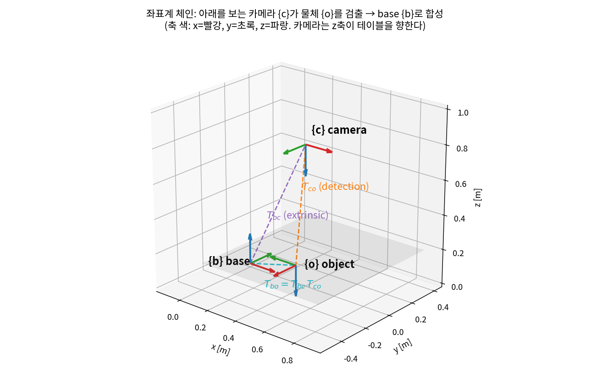
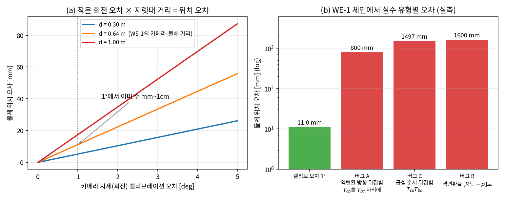
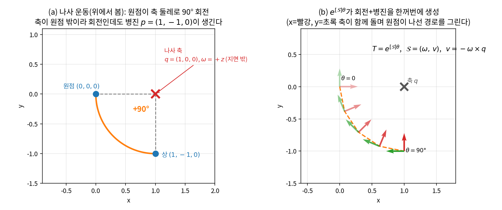
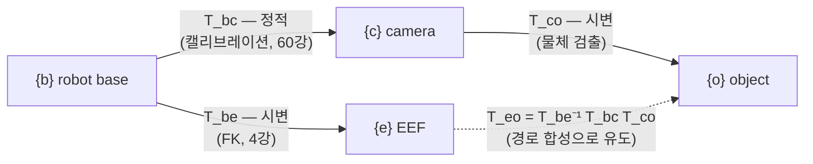
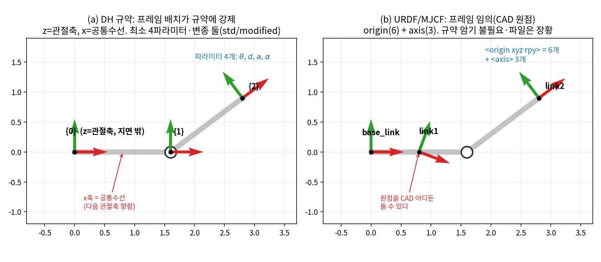

# Lec 03. 강체 변환 — SE(3), 동차변환, 좌표계의 규율

> 하위제어 트랙 3일차. 선수 지식: 1강(DoF·C-space), 2강(SO(3)·회전 표현).
> 기초 참고서: Modern Robotics(이하 MR) §3.3 + 부록 C. 이 강의는 MR §3.3.1~3.3.2의 표기와 결과(및 §3.3.3의 지수좌표 맛보기)를 딥러닝 배경자의 언어로 재구성한 것이다.

## 한 장 요약



로봇 시스템의 모든 정보는 **어떤 좌표계(frame) 기준의 값**이다. 위 그림에서 카메라 {c}는 물체 {o}를 자기 기준($T_{co}$, 검출)으로 보고, 로봇은 base {b} 기준의 값이 필요하다. 캘리브레이션이 준 $T_{bc}$와 곱하면 $T_{bo}=T_{bc}T_{co}$ — 아래첨자가 도미노처럼 소거된다. 오늘 강의는 이 4×4 행렬 하나($SE(3)$의 원소)와, 그것을 **틀리지 않고** 곱하는 규율을 배운다. 규율이 깨지면 어떤 일이 생기는지는 아래 그림이 보여준다 — 표기 실수는 수백 mm, 캘리브레이션 오차는 수 mm의 **조용한** 오차가 된다.

## 학습 목표

1. 동차변환 행렬 $T \in SE(3)$의 구조(회전+병진)를 설명하고, 합성과 역변환을 손으로 계산할 수 있다.
2. $T_{ab}$ 아래첨자 표기와 소거 규칙(MR §3.3.1)으로 임의의 프레임 체인 수식이 유효한지 판정할 수 있다.
3. 프레임 실수 3종(역방향, 곱셈 순서, 전치≠역)과 캘리브레이션 오차가 만드는 위치 오차를 정량 추정할 수 있다.
4. twist(공간 속도)와 지수좌표가 무엇을 표현하는지 말할 수 있다 — 유도와 활용은 4~5강에서.
5. DH 규약과 URDF 방식의 차이를 알고, 산업 매뉴얼의 DH 표와 URDF 파일을 혼동 없이 해독할 수 있다.

## 왜 이 강의가 필요한가

2강에서 회전(자세)을 다뤘지만 로봇의 상태는 자세만이 아니다 — **위치+자세 = 포즈(pose)**이고, 로봇 시스템은 포즈들의 그물이다. 카메라 관측은 카메라 프레임, 물체 검출값은 물체 프레임, VLA의 액션은 base 프레임 또는 EEF 프레임(50강: OpenVLA류의 ΔEEF, GR00T N1.7의 상대 EEF), 시뮬레이터는 또 자기 월드 프레임 기준이다. 이 값들은 전부 `(3,)`이나 `(4,4)` 텐서일 뿐이라 **어느 프레임 기준인지가 shape에 드러나지 않는다**. 프레임 계약이 하나라도 어긋나면 학습은 돌아가고 loss도 내려가는데 로봇만 엉뚱한 곳을 집는, 가장 잡기 어려운 부류의 버그가 된다. 딥러닝에서 정규화 통계를 train/test에 다르게 쓴 것과 같은 **silent failure**다. 오늘은 그 계약을 쓰는 언어($SE(3)$)와 문법(아래첨자 규율)을 배운다. 이것이 4강의 FK(변환의 곱), 5강의 자코비안(twist), 60강의 hand-eye 캘리브레이션의 공용 기반이다.

## 본문

### 1. 포즈는 왜 4×4 행렬인가

강체 하나의 배치는 회전 $R \in SO(3)$과 위치 $p \in \mathbb{R}^3$의 쌍이다. 문제는 합성이다. 프레임 {b} 기준의 점 $p_b$를 {a} 기준으로 옮기는 연산은

$$p_a = R_{ab}\, p_b + p_{ab}$$

— 선형이 아니라 **아핀(affine)**이라서, 두 번 연달아 적용하면 $(R_1, p_1)\circ(R_2, p_2) = (R_1 R_2,\ R_1 p_2 + p_1)$처럼 회전이 병진 항에 끼어드는 꼬인 규칙이 나온다. 여기에 고전적인 트릭을 쓴다: 점에 1을 덧붙여 $\tilde p = [p;\,1] \in \mathbb{R}^4$로 만들면(동차좌표), 아핀 연산이 **행렬 곱 하나**가 된다:

$$
\begin{bmatrix} p_a \\ 1 \end{bmatrix}
=
\underbrace{\begin{bmatrix} R_{ab} & p_{ab} \\ 0 & 1 \end{bmatrix}}_{T_{ab}}
\begin{bmatrix} p_b \\ 1 \end{bmatrix}
$$

이제 포즈의 합성 = 행렬 곱, 역 = 역행렬. 부기(bookkeeping)가 선형대수가 된다. 이 4×4 행렬들의 집합이 $SE(3)$(Special Euclidean group)다.

### 핵심 수식

#### E1. 동차변환의 정의·합성·역변환

**직관**: 포즈 하나 = "회전 + 이동" 묶음. 4×4 행렬에 넣으면 이어 붙이기(합성)가 그냥 곱셈이 되고, 되돌리기(역)가 역행렬이 된다.

**물리·기하적 의미**: $SE(3)$는 $SO(3) \times \mathbb{R}^3$의 단순한 곱집합이 아니라 회전이 병진에 개입하는 **반직접곱(semidirect product)** 구조다. "회전 오차와 위치 오차를 따로 보면 된다"는 직관이 깨지는 근본 이유가 이 결합이다(흔한 오해 3). 차원은 $3+3=6$ — 1강에서 "공간 강체는 6-DoF"라고 센 것의 수학적 실체이며, $SE(3)$가 바로 자유 강체 하나의 C-space다.

**형식**:

$$
SE(3) = \left\{ T = \begin{bmatrix} R & p \\ 0 & 1 \end{bmatrix} \;\middle|\; R \in SO(3),\ p \in \mathbb{R}^3 \right\}
$$

$$
T_1 T_2 = \begin{bmatrix} R_1 R_2 & R_1 p_2 + p_1 \\ 0 & 1 \end{bmatrix},
\qquad
T^{-1} = \begin{bmatrix} R^T & -R^T p \\ 0 & 1 \end{bmatrix}
$$

역변환 유도 요점: $p_a = R\,p_b + p$를 $p_b$에 대해 풀면 $p_b = R^T p_a - R^T p$. 회전 블록만 전치하고 **병진은 $-p$가 아니라 $-R^T p$** — 이걸 틀리는 것이 아래 WE-2의 버그 B이고, 오늘 실험에서 1600mm짜리 오차를 만든다. 군(group) 성질(결합법칙, 항등원 $I_4$, 역원, 곱에 닫힘)은 정의에서 바로 따라오며, **가환이 아니다**: 일반적으로 $T_1 T_2 \neq T_2 T_1$ (버그 C).

#### E2. 좌표계 표기의 규율 — 아래첨자 소거 (MR §3.3.1)

**직관**: $T_{ab}$는 "**{a}의 눈으로 본 {b}의 포즈**"라고 읽는다. 첨자가 도미노처럼 맞물릴 때만 곱셈이 의미를 가진다: $T_{a\underline{b}} T_{\underline{b}c} = T_{ac}$. 맞물리지 않는 곱을 쓰고 있다면 이미 틀린 것이다.

**물리·기하적 의미**: 같은 행렬 $T_{ab}$가 세 가지 역할을 한다(MR §3.3.1) — ① 프레임 {b}의 {a} 기준 **표현**(그 자체가 데이터), ② {b} 좌표로 쓰인 벡터·프레임을 {a} 좌표로 바꾸는 **기준 변경 연산자**, ③ 강체를 실제로 움직이는 **변위 연산자**. 셋을 구분하는 습관이 "이 행렬을 왼쪽에 곱하나 오른쪽에 곱하나"라는 실무 질문의 답을 준다(토론 질문 2).

**형식**: 프레임 $\{a\},\{b\},\{c\}$와 점 $p$에 대해

$$
T_{ab} T_{bc} = T_{ac}, \qquad T_{ab}^{-1} = T_{ba}, \qquad \tilde p_a = T_{ab}\, \tilde p_b
$$

소거 규칙은 **차원 분석이나 einsum 인덱스 체크와 같은 문법 검사**다: `einsum('ab,bc->ac')`가 성립하듯 첨자 사슬이 이어져야 한다. 예컨대 $T_{bc}T_{co}T_{oe}$는 유효($=T_{be}$), $T_{co}T_{bc}$는 무효 — 컴파일러가 없으니 사람이 문법 검사기가 되어야 한다. 체인의 방향을 거슬러 갈 때는 역변환으로 첨자를 뒤집는다: $T_{eo} = T_{be}^{-1} T_{bo} = T_{eb} T_{bo}$.

#### E3. Twist와 지수좌표 — 맛보기 (상세는 4강)

**직관**: 포즈는 곱셈으로 쌓이는 곱셈의 세계지만, **순간 속도는 6개 숫자짜리 벡터**로 더하고 뺄 수 있다. 강체의 "움직임 그 자체"는 선형의 세계에 산다.

**물리·기하적 의미**: 임의의 강체 변위는 하나의 **나사(screw) 운동** — 어떤 축 둘레로 돌면서 그 축 방향으로 미끄러지는 운동 — 과 같다(Chasles–Mozzi 정리, MR §3.3.3). 그 축과 속도를 담은 6-벡터가 twist $\mathcal{V} = (\omega, v) \in \mathbb{R}^6$이다. 기하적으로 $SE(3)$는 굽은 공간(6차원 다양체)이고 twist는 그 위의 **접벡터**다 — 접공간에서 다양체로 돌아가는 사상이 행렬 지수다.

**형식**: 회전축 단위벡터 $\omega$, 축 위의 점 $q$에 대해(순수 회전의 경우 $v = -\omega \times q$)

$$
[\mathcal{S}] = \begin{bmatrix} [\omega] & v \\ 0 & 0 \end{bmatrix} \in se(3),
\qquad
T = e^{[\mathcal{S}]\theta}
$$

여기서 $[\omega]$는 2강에서 본 3×3 반대칭 행렬이다. 2강의 Rodrigues 공식($SO(3)$의 지수좌표)이 $SE(3)$로 확장된 것 — 오늘은 "이런 물건이 있고 4×4 행렬과 왕복 가능하다"까지만. 이 표현이 4강에서 FK의 본류(PoE)가 되고, 5강에서 자코비안의 열이 된다.

### Worked Example

#### WE-1 (손계산 + 코드): 카메라-로봇-물체 체인 — hand-eye 문제 맛보기

**설정**: base {b} 위 $(0.4,\,0,\,0.8)$m에 카메라가 테이블을 수직으로 내려다보게 고정되어 있다(캘리브레이션 결과). 카메라 광축(z)이 아래를 향하도록 $R_{bc} = \mathrm{Rot}(\hat x, 180°)$:

$$
T_{bc} = \begin{bmatrix} 1 & 0 & 0 & 0.4 \\ 0 & -1 & 0 & 0 \\ 0 & 0 & -1 & 0.8 \\ 0&0&0&1 \end{bmatrix}
$$

물체 검출기가 카메라 기준으로 $p_{co} = (0.1,\,0.2,\,0.6)$, $R_{co} = \mathrm{Rot}(\hat z, 90°)$를 출력했다.

**손계산 1 — 물체는 base 기준 어디인가?** $T_{bo} = T_{bc} T_{co}$:

$$
p_{bo} = R_{bc}\,p_{co} + p_{bc} = \begin{bmatrix} 0.1 \\ -0.2 \\ -0.6 \end{bmatrix} + \begin{bmatrix} 0.4 \\ 0 \\ 0.8 \end{bmatrix} = \begin{bmatrix} 0.5 \\ -0.2 \\ 0.2 \end{bmatrix},
\qquad
R_{bo} = R_{bc} R_{co} = \begin{bmatrix} 0 & -1 & 0 \\ -1 & 0 & 0 \\ 0 & 0 & -1 \end{bmatrix}
$$

물체는 base 앞 50cm, 오른쪽 20cm, 테이블 높이 20cm에 있다 — 한 장 요약 그림의 {o}가 정확히 이 값이다.

**손계산 2 — 역변환.** $T_{cb} = T_{bc}^{-1}$: $R_{bc}^T = R_{bc}$(180° 회전은 대칭)이고 $-R_{bc}^T p_{bc} = -(0.4,\,0,\,-0.8) = (-0.4,\,0,\,0.8)$. **$-p_{bc} = (-0.4,\,0,\,-0.8)$이 아니다** — 세 번째 성분의 부호가 다르다.

**손계산 3 — 그리퍼 기준으로는?** EEF가 물체 바로 위 $(0.5,\,-0.2,\,0.5)$에서 아래를 보고 있다면($R_{be} = \mathrm{Rot}(\hat x, 180°)$), 잡기에 필요한 것은 $T_{eo} = T_{be}^{-1} T_{bo}$:

$$
p_{eo} = R_{be}^T (p_{bo} - p_{be}) = R_{be}\begin{bmatrix}0\\0\\-0.3\end{bmatrix} = \begin{bmatrix} 0 \\ 0 \\ 0.3 \end{bmatrix},
\qquad R_{eo} = \mathrm{Rot}(\hat z, 90°)
$$

물체는 그리퍼가 바라보는 방향(z) 앞 30cm에, 90° 돌아간 채 있다. **소거 검사**: $T_{e\underline{b}} T_{\underline{b}c} T_{c o}$ — 첨자 사슬이 $e\!\to\!b\!\to\!c\!\to\!o$로 이어지므로 유효.

**검증 코드**:

```python
import numpy as np
np.set_printoptions(suppress=True)        # 1e-16대 부동소수점 잔차를 0.으로 표시

def make_T(R, p):
    T = np.eye(4); T[:3,:3] = R; T[:3,3] = p; return T

def inv_T(T):
    R, p = T[:3,:3], T[:3,3]
    return make_T(R.T, -R.T @ p)          # 병진은 -p가 아니라 -R^T p !

def rot_x(a):
    c, s = np.cos(a), np.sin(a)
    return np.array([[1,0,0],[0,c,-s],[0,s,c]])

def rot_z(a):
    c, s = np.cos(a), np.sin(a)
    return np.array([[c,-s,0],[s,c,0],[0,0,1]])

T_bc = make_T(rot_x(np.pi),   [0.4,  0.0, 0.8])   # 캘리브레이션(extrinsic)
T_co = make_T(rot_z(np.pi/2), [0.1,  0.2, 0.6])   # 물체 검출
T_be = make_T(rot_x(np.pi),   [0.5, -0.2, 0.5])   # EEF 포즈 (FK, 4강)

T_bo = T_bc @ T_co                    # base 기준 물체
T_eo = inv_T(T_be) @ T_bo             # 그리퍼 기준 물체
print("p_bo =", T_bo[:3,3])           # → [ 0.5 -0.2  0.2]
print("p_eo =", T_eo[:3,3])           # → [ 0.   0.   0.3]
print("T_bc^-1 병진 =", inv_T(T_bc)[:3,3].round(9) + 0.)   # → [-0.4  0.   0.8]
print("검산:", np.allclose(T_bc @ inv_T(T_bc), np.eye(4)),
      np.isclose(np.linalg.det(T_bo[:3,:3]), 1.0))  # → True True
```

출력이 손계산과 완전히 일치한다: `p_bo = [0.5 -0.2 0.2]`, `p_eo = [0. 0. 0.3]`, 역변환 병진 `[-0.4 0. 0.8]`.

**손계산 4 — 오른쪽 곱 vs 왼쪽 곱 (변위 연산자, E2의 ③).** "그리퍼를 5cm 전진시켜라"는 명령을 $X = [I,\ (0,0,0.05)]$로 쓰면, **어느 쪽에 곱하느냐가 기준 프레임을 결정한다**:

- $T_{be}' = T_{be} X$ (오른쪽 곱 = **자기(body) 프레임** 기준): 그리퍼의 z축은 아래(테이블)를 향하므로 $p' = p_{be} + R_{be}(0,0,0.05) = (0.5,\,-0.2,\,0.45)$ — **물체 쪽으로 하강**한다.
- $T_{be}' = X T_{be}$ (왼쪽 곱 = **base(공간) 프레임** 기준): $p' = p_{be} + (0,0,0.05) = (0.5,\,-0.2,\,0.55)$ — base의 z, 즉 **위로 상승**한다.

```python
X = make_T(np.eye(3), [0, 0, 0.05])
print((T_be @ X)[:3,3])   # → [ 0.5  -0.2   0.45]  자기 z(아래)로: 접근
print((X @ T_be)[:3,3])   # → [ 0.5  -0.2   0.55]  base z(위)로: 후퇴
```

같은 "z로 +5cm"가 접근이 되기도, 후퇴가 되기도 한다. VLA의 ΔEEF 액션이 base 기준인지 EEF 기준인지가 계약에 없으면 정확히 이 모호성이 데이터에 스며든다(토론 질문 4).

#### WE-2 (코드): 어긋난 프레임 하나가 오차로 증폭되는 실험

WE-1 체인에서 두 종류의 어긋남을 심어 본다 — **연속적 오차**(캘리브레이션 부정확)와 **이산적 실수**(표기 버그).

```python
from scipy.linalg import expm

def axis_rot(axis, th):                       # 2강의 지수좌표 exp([w]θ)
    w = np.asarray(axis, float); w /= np.linalg.norm(w)
    K = np.array([[0,-w[2],w[1]],[w[2],0,-w[0]],[-w[1],w[0],0]])
    return expm(K * th)

p_true = T_bo[:3,3]
def err_mm(p): return np.linalg.norm(p - p_true) * 1000

# (1) 캘리브레이션 회전 오차: 카메라 자세가 1도 틀어짐
T_bc_bad = make_T(T_bc[:3,:3] @ axis_rot([1,0,0], np.deg2rad(1.0)), T_bc[:3,3])
print(f"캘리브 1도 오차 → {err_mm((T_bc_bad @ T_co)[:3,3]):.2f} mm")   # 11.04 mm

# (2) 버그 A: 역변환 방향 뒤집힘 — T_cb를 T_bc 자리에
print(f"버그 A → {err_mm((inv_T(T_bc) @ T_co)[:3,3]):.0f} mm")         # 800 mm

# (3) 버그 B: 역변환을 [R^T, -p]로 잘못 구현
T_cb_wrong = make_T(T_bc[:3,:3].T, -T_bc[:3,3])
print(f"버그 B (되돌린 물체 위치 기준) → "
      f"{np.linalg.norm((T_cb_wrong @ T_bo)[:3,3] - T_co[:3,3])*1000:.0f} mm")  # 1600 mm

# (4) 버그 C: 곱셈 순서 뒤집힘 — T_co @ T_bc
print(f"버그 C → {err_mm((T_co @ T_bc)[:3,3]):.0f} mm")                # 1497 mm
```

실행 결과와 해석 (아래 그림이 이 수치다):



- **캘리브레이션 회전 오차** 1°는 카메라-물체 거리 $d=0.64$m에서 **11.04mm**가 된다. 근사식 $\Delta p \approx \theta\, d_\perp$ (라디안 × 지렛대 거리): $0.01745 \times 0.6325 = 11.0$mm — 회전 오차는 거리에 비례해 위치 오차로 **증폭**된다(그림 (a); 5°면 55.2mm). mm 정밀도가 필요한 삽입 태스크에서 hand-eye 캘리브레이션(60강)이 각도 싸움인 이유다.
- **표기 버그**는 오더가 다르다: 버그 A 800mm, 버그 C 1497mm, 버그 B 1600mm — 로봇이 테이블 반대편이나 허공을 집으러 간다. 역설적으로 **큰 버그가 잡기 쉽고**(즉시 눈에 보임), 캘리브 오차나 "거의 맞는" 프레임은 그럴듯하게 움직이다가 접촉 순간에만 실패해서 데이터 탓, 정책 탓으로 오진되기 쉽다.

#### WE-3 (손계산 + 코드): 나사 운동 맛보기 — 지수좌표가 진짜로 동차변환을 만든다

E3를 한 번만 손으로 만져 보자. 점 $q=(1,0,0)$을 지나는 수직축($\omega = (0,0,1)$) 둘레로 90° 도는 순수 회전 나사 운동. 축이 원점을 지나지 않으므로 $v = -\omega \times q = (0,-1,0)$이 붙는다.



*그림: (a) 위에서 본 나사 운동 — 원점 $(0,0,0)$이 축 $q=(1,0,0)$ 둘레로 +90° 돌아 상 $(1,-1,0)$이 되는, 아래 손계산과 동일한 기하. 축이 원점 밖이라 순수 회전인데도 병진 $p=(1,-1,0)$이 생긴다(Chasles–Mozzi, E3). (b) $T=e^{[\mathcal{S}]\theta}$로 $\theta$를 0→90°까지 훑으면 x(빨강)·y(초록) 좌표축이 함께 돌며 원점이 나선 경로를 그린다 — 6-벡터 $\mathcal{S}=(\omega,v)$ 하나가 4×4 동차변환 전체를 인코딩함을 보인다. images/lec03/gen_figs.py로 생성.*

**손계산 (기하로)**: 원점은 축에서 $(-1,0,0)$만큼 떨어져 있다. 축 둘레로 +90° 돌리면 $(-1,0,0) \to (0,-1,0)$, 축 위치를 되더하면 원점의 상은 $(1,-1,0)$.

**검증 코드 (대수로)**:

```python
from scipy.linalg import expm
w, q = np.array([0,0,1.]), np.array([1.,0,0])
v = -np.cross(w, q)                       # = (0, -1, 0)
S = np.zeros((4,4))
S[:3,:3] = np.array([[0,-w[2],w[1]],[w[2],0,-w[0]],[-w[1],w[0],0]])
S[:3,3] = v
T = expm(S * np.pi/2)                     # e^{[S]θ} ∈ SE(3)
print(T @ np.array([0,0,0,1.]))           # → [ 1. -1.  0.  1.]
```

행렬 지수에 넣었을 뿐인데 회전($R=\mathrm{Rot}(\hat z,90°)$)과 병진($p=(1,-1,0)$)이 **한꺼번에, 올바르게** 나온다 — 축 하나 + 각도 하나(6개 숫자 $\mathcal{S}\theta$)가 4×4 동차변환 전체를 인코딩한다. 관절 하나가 만드는 운동이 정확히 이런 나사 운동이므로, 4강에서 FK가 $T = e^{[\mathcal{S}_1]\theta_1} \cdots e^{[\mathcal{S}_n]\theta_n} M$이라는 지수들의 곱(PoE)이 된다.

### 2. 프레임 그래프로 보기 — 시스템 전체의 좌표계 계약

실제 시스템은 프레임이 수십 개다. 변환들을 그래프로 그리면 관리가 된다:



임의 두 프레임 사이 변환 = **그래프에서 경로를 따라 곱하고, 화살표를 거슬러 갈 때는 역변환**. ROS의 tf2가 하는 일이 정확히 이것이고(프레임 트리 + 타임스탬프), 각 간선이 "정적인가(캘리브 1회) 시변인가(매 스텝 갱신)"를 구분하는 것이 시스템 설계의 첫 문서다. 카메라가 손목에 달린 eye-in-hand 구성이면 간선이 $B\to E\to C$로 바뀌고 $T_{ec}$가 정적, 체인에 FK 오차가 끼어든다(토론 질문 3).

프레임 계약 문서에 간선마다 최소한 적어야 할 것:

| 항목 | 예 (위 그래프의 $T_{bc}$) |
|---|---|
| 이름과 방향 | `base → camera_link` ($T_{bc}$: camera를 base 기준으로) |
| 축 방향 규약 | base: z-up, x-forward / camera: z-forward (광학 규약, REP 103 참조) |
| 단위·표현 | 미터, 회전은 쿼터니언 (w, x, y, z) 순서 — 2강의 표현 계약 |
| 정적/시변 | 정적 — hand-eye 캘리브레이션으로 결정 (60강), 카메라 재장착 시 갱신 |
| 검증 방법 | 마커를 알려진 base 좌표에 놓고 재투영 오차 < 5mm 확인 |

"쿼터니언 순서"까지 적는 것이 과하다고 느껴진다면 — (w,x,y,z)와 (x,y,z,w)의 혼용은 scipy와 일부 로봇 SDK 사이에서 실제로 일어나는 사고다(2강에서 본 표현 다양성의 대가). 계약은 아무리 자세해도 지나치지 않다.

### 3. DH 규약 vs URDF 방식 — 같은 것을 적는 두 문화

로봇의 기구 구조(링크 간 고정 오프셋 + 관절축)를 적는 표기법이 역사적으로 두 갈래다.

| | **DH 규약** (Denavit–Hartenberg) | **URDF/MJCF 방식** |
|---|---|---|
| 관절당 파라미터 | 4개 ($\theta,\ d,\ a,\ \alpha$) | origin 6개(xyz+rpy) + 축 3개 |
| 프레임 배치 | 규약이 강제 (z축=관절축, x축=공통수선) | 임의 — CAD 원점 그대로 가능 |
| 장점 | 최소 파라미터, 구형 교과서·산업 매뉴얼의 표준 | 규약 암기 불필요, 임의 트리 구조, 도구 생태계(ROS·MuJoCo·Pinocchio) 표준 |
| 함정 | **변종이 둘**(standard vs modified/Craig) — 같은 로봇의 DH 표가 문서마다 다르다. 프레임이 물리 링크 위치와 어긋남. 인접 축 평행 시 모호 | 파라미터 중복(같은 포즈의 rpy 여러 개, 2강), 파일이 장황 |



*그림: 같은 2-링크 평면 팔에 좌표계를 붙이는 두 문화의 대조. (a) DH 규약은 프레임 배치가 규약에 **강제**된다 — z축은 관절축(지면 밖), x축은 공통수선(다음 관절축을 향함)이라 원점이 물리 관절과 어긋날 수 있고, 관절당 파라미터는 $\theta,d,a,\alpha$ 4개뿐이지만 변종이 둘(standard/modified)이다. (b) URDF/MJCF는 프레임이 **임의** — CAD 원점을 그대로 써도 되고(`<origin xyz rpy>` 6개 + `<axis>` 3개), 규약 암기는 불필요하나 파일이 장황하다. 위 비교표를 시각화한 것. images/lec03/gen_figs.py로 생성.*

URDF에서 관절 하나는 이렇게 생겼다 — `<origin>`이 부모 링크 프레임에서 자식 링크 프레임까지의 **고정 동차변환**이고, 관절 변수는 `<axis>` 둘레 회전으로 그 뒤에 곱해진다:

```xml
<joint name="joint2" type="revolute">
  <parent link="link1"/> <child link="link2"/>
  <origin xyz="0 0.135 0" rpy="0 1.5708 0"/>  <!-- T_parent,child(q=0): 병진+회전 -->
  <axis xyz="0 1 0"/>                          <!-- 관절축 (자식 프레임 기준) -->
</joint>
```

즉 URDF의 기구 정의는 오늘 배운 언어로 "링크마다 $T$ 하나 + 회전축" — FK는 이들의 곱이다(4강). MR은 어느 쪽도 본류로 삼지 않고 **PoE(지수곱)**를 쓴다 — 프레임을 관절마다 붙일 필요조차 없애는 방식으로, 4강에서 본격적으로 다룬다. DH는 MR 부록 C에 정리되어 있다. 실무 지침: 남의 DH 표를 받으면 **어느 변종인지부터** 확인하고(standard인지 modified인지에 따라 변환 순서가 다르다), 항상 몇 개 관절각에서 FK를 수치로 대조해 검증하라 — 4강 실습에서 실제로 한다.

### 딥러닝 배경자를 위한 번역

- **좌표계 계약 = 데이터 파이프라인의 스키마다.** 프레임 규약은 텐서 shape에 드러나지 않는다 — 어느 프레임 기준이든 위치는 `(3,)`이다. 스키마 문서와 런타임 assert만이 방어선이라는 점에서, 정규화 통계·채널 순서(RGB/BGR)·라벨 인덱스 mismatch와 정확히 같은 부류의 문제다. 50강에서 본 "모델마다 다른 action space"는 이 스키마 문제의 로봇판이고, 그 뿌리가 오늘의 $T_{ab}$다.
- **아래첨자 소거 = einsum 인덱스 체크.** $T_{ab}T_{bc}=T_{ac}$는 `einsum('ab,bc->ac')`와 같은 문법이다. 차이는 einsum은 인덱스가 안 맞으면 에러를 내지만, 프레임이 안 맞는 행렬 곱은 **조용히 성공**한다는 것 — 그래서 사람이 타입 체커가 되는 규율이 필요하다(실습에서 assert로 자동화해 본다).
- **$SE(3)$는 비가환 군 = 순서가 의미다.** $T_1 T_2 \neq T_2 T_1$은 "회전 후 이동"과 "이동 후 회전"이 다르다는 물리적 사실이다. 행렬 곱이라 미분가능하므로, 포즈를 다루는 신경망 파이프라인 안에 변환 합성을 넣어 end-to-end로 흘릴 수 있다(예: 학습 가능한 extrinsic 보정).
- **twist는 다양체의 접공간에 산다.** $SE(3)$ 위에서 직접 덧셈·평균·보간을 할 수 없는 것은 회전(2강)과 같은 사정이고, 속도·오차·그래디언트 같은 "작은 양"은 접공간($se(3)$, 6차원 벡터)에서 다루면 선형대수가 된다. Riemannian 최적화에서 접공간으로 당겨와 업데이트하고 retraction으로 되돌리는 구도와 동형이다.

## 흔한 오해

1. **"동차변환의 역은 전치다."** — 회전행렬은 $R^{-1}=R^T$지만 $T$는 아니다: $T^{-1} = [R^T,\ -R^T p]$이지 $T^T$도 $[R^T,\ -p]$도 아니다. WE-2의 버그 B(1600mm)가 이 오해의 가격표다. `np.linalg.inv(T)`는 수치적으로 맞긴 하나 해석식보다 느리고 부동소수점 오차가 크다 — 구조를 아는 자가 이긴다.
2. **"$T_{ab}$는 '{a}를 {b}로 옮기는' 변환이다."** — 방향이 거꾸로 읽히기 쉬운 표기다. $T_{ab}$는 "{a} 기준으로 표현한 {b}", 연산자로 쓰면 **{b} 좌표의 벡터를 {a} 좌표로** 바꾼다($\tilde p_a = T_{ab}\tilde p_b$). 헷갈릴 때마다 소거 규칙으로 검산하라 — 첨자가 맞물리는 방향이 곧 정답이다.
3. **"회전 오차와 위치 오차는 별개다."** — $SE(3)$의 반직접곱 구조 때문에 회전 오차는 지렛대 거리에 비례하는 위치 오차를 만든다($\Delta p \approx \theta d$). 1°는 "겨우 1°"가 아니라 1m 앞에서 17mm다. 회전에 둔감한 지표(예: 위치 MSE만 보는 평가)는 이 증폭을 놓친다.
4. **"URDF는 DH 파라미터로 되어 있다."** — 아니다. URDF의 `<origin xyz rpy>`는 임의 6-DoF 오프셋이며 DH의 4-파라미터 제약과 무관하다. 역으로, 산업 매뉴얼의 DH 표를 URDF로 옮길 때는 변종(standard/modified) 확인 + FK 수치 대조 없이는 신뢰할 수 없다.

## 실습 (1.5~2시간)

**세 프레임 체인 계산기를 만들고, 심어진 버그를 테스트로 잡는다.**

1. **(30분) 미니 프레임 라이브러리 `frames.py`**: `make_T(R,p)`, `inv_T(T)`, `compose(*Ts)`, `transform_point(T,p)`를 구현하되, 모든 입력에서 다음을 assert하라 — $R^TR=I$(허용오차 1e-9), $\det R = +1$, 마지막 행 $[0,0,0,1]$. WE-1의 세 손계산(p_bo, p_eo, 역변환)을 재현해 통과 확인.
2. **(30분) 성질 기반 테스트**: 무작위 포즈 100개(2강의 축-각으로 무작위 회전 생성)에 대해 ① $T\,\mathrm{inv}(T)=I$, ② $\mathrm{inv}(T_1 T_2) = \mathrm{inv}(T_2)\,\mathrm{inv}(T_1)$ (순서 뒤집힘!), ③ 점 변환 왕복 $p = \mathrm{inv}(T)(T p)$, ④ $\det R = 1$ 보존을 검사하는 `test_frames.py`를 작성.
3. **(30분) 버그 심기 게임**: 페어(또는 Claude)에게 다음 4종 중 하나를 몰래 심게 한다 — (a) `inv_T`의 병진을 `-p`로, (b) `inv_T`의 회전을 전치 없이 `R` 그대로, (c) `compose`의 곱 순서 스왑, (d) rpy→행렬 변환의 축 순서 바꿈. **어떤 테스트가 어떤 버그를 잡는지 표**를 만들라. 특히 (a)를 ①이 잡는지, ③만 잡는지 확인 — 테스트의 사각지대를 발견하는 것이 목적이다.
4. **(20분) 오차 증폭 재현**: WE-2를 확장해 회전 오차 축 3개 × 크기 0~5°를 스윕하고, 병진 캘리브 오차(예: 5mm)와 같은 그래프에 그려 비교하라. "회전 오차만 거리에 비례해 자란다"를 눈으로 확인.
5. **(심화, 20분) MuJoCo 대조**: 1강 실습의 3링크 팔 XML에 카메라 `<body>`를 추가하고, `data.body(name).xpos` / `.xmat`(base 기준 포즈, 즉 $T_{b\cdot}$)를 읽어 자기 라이브러리의 체인 계산과 대조하라.

## Claude와 토론할 질문

1. 아래첨자 소거 규칙을 코드 수준에서 **강제**할 수 있을까? 프레임 id를 타입/제네릭으로 갖는 `Pose[A,B]` 래퍼를 설계해 보고, ROS tf2가 문자열 frame_id + 트리 탐색으로 이 문제를 어떻게 푸는지 비교하라.
2. $T' = XT$와 $T' = TX$는 각각 "어느 프레임 기준의 변위 $X$"인가? MR §3.3.1의 변위 연산자 해석으로 설명하고, "EEF를 자기 z축 방향으로 5cm 전진"을 두 방식으로 각각 써 보라.
3. 카메라가 손목에 달린 eye-in-hand 구성에서 $T_{bo}$의 체인을 다시 써 보라. 고정 카메라와 비교해 어떤 오차 원인이 추가되고(FK 오차), 어떤 것이 사라지는가(원거리 지렛대)? 삽입 태스크에 유리한 쪽은?
4. VLA의 ΔEEF 액션 "x로 +5cm"가 base 프레임 기준인 데이터셋과 EEF 프레임 기준인 데이터셋이 섞여 학습되면 무슨 일이 생기는가? 모델이 이 불일치를 "학습으로 흡수"할 수 있는 조건과 없는 조건을 논하라 (50강의 action space 이질성 문제의 뿌리).
5. 포즈를 신경망이 **출력**해야 한다면 어떤 표현이 좋은가? 4×4 행렬 16개를 직접 회귀하면 무엇이 깨지는가? (2강의 회전 표현 논의 + 위치를 결합해 후보를 서너 개 만들고 장단 비교)
6. 회전은 덧셈이 안 되는데(2강) twist(각속도 포함)는 왜 6차원 벡터로 더해도 되는가? "다양체 위의 점 vs 접공간의 벡터" 구도로 설명해 보라 — 이 답이 5강의 자코비안이 선형 사상일 수 있는 이유와 어떻게 연결되는가?
7. 시뮬레이터(z-up), 카메라 광학 규약(z-forward), 일부 그래픽 툴(y-up)이 한 파이프라인에 섞여 있다. 프레임 계약 문서에 최소한 무엇을 명시해야 하는가? ROS REP 103이 정한 항목들을 체크리스트로 뽑아 보라.

## 읽을거리

1. **MR §3.3.1~3.3.2** (~40분): 동차변환·표기 규율·twist의 원전. §3.3.3(지수좌표 상세 유도)은 4강 직전에 읽으면 된다.
2. **ROS REP 103 "Standard Units of Measure and Coordinate Conventions"** (~10분): 좌표계 계약을 실무 표준으로 못박은 짧은 문서 — "계약을 문서화한다"가 무엇인지의 모범.
3. (선택) **URDF joint 스펙** (wiki.ros.org/urdf/XML/joint, ~10분): `<origin>`/`<axis>`의 공식 정의 — 본문 §3의 원자료.

## 자가 점검

1. $T_{bc}$와 $T_{co}$가 주어졌을 때 $T_{ob}$를 계산하는 절차를 첨자 소거로 써 내려갈 수 있는가?
2. $T^{-1} = [R^T,\ -R^T p]$를 $p_a = Rp_b + p$에서 30초 안에 유도할 수 있는가? 병진이 $-p$가 아닌 이유는?
3. $T_{ab}T_{bc}T_{cd}$, $T_{ab}T_{cb}$, $T_{ba}^{-1}T_{bc}$ 각각의 유효성과 결과 첨자를 즉답할 수 있는가?
4. 회전 캘리브 오차 1°가 0.6m 지렛대에서 몇 mm 위치 오차가 되는지 암산할 수 있는가($\theta d$)? 표기 버그와 캘리브 오차 중 어느 쪽이 "잡기 어려운" 이유는?
5. DH 4-파라미터와 URDF `<origin xyz rpy>`의 차이, 그리고 DH 표를 받았을 때 제일 먼저 확인할 것을 말할 수 있는가?

## 참고문헌

> 웹 문서는 2026-07-08 접속 기준.

[1] K. Lynch, F. Park, "Modern Robotics: Mechanics, Planning, and Control," Cambridge Univ. Press, 2017. 무료 PDF: https://hades.mech.northwestern.edu/images/7/7f/MR.pdf
— **뒷받침**: §3.3.1 — 동차변환의 정의·합성·역변환($T^{-1}=[R^T, -R^Tp]$), $T_{ab}$ 표기와 아래첨자 소거 규칙, 변환 행렬의 세 가지 용법; §3.3.2 — twist, $se(3)$, 나사 축과 $v=-\omega\times q$; §3.3.3 — 지수좌표 $T=e^{[\mathcal{S}]\theta}$, Chasles–Mozzi 정리; 부록 C — DH 파라미터와 변종 논의. 본문 E1~E3와 §3의 근거.

[2] Open Robotics, URDF XML 사양 (joint). http://wiki.ros.org/urdf/XML/joint
— **뒷받침**: §3의 `<origin xyz rpy>`·`<axis>` 의미(부모→자식 고정 변환 + 관절축), "URDF는 DH가 아니다"(흔한 오해 4).

[3] T. Foote 외, ROS REP 103: "Standard Units of Measure and Coordinate Conventions." https://www.ros.org/reps/rep-0103.html
— **뒷받침**: 좌표계 방향·단위 계약의 실무 표준 사례 (읽을거리 2, 토론 질문 7).

[4] J. J. Craig, "Introduction to Robotics: Mechanics and Control," 3rd ed., Pearson, 2005.
— **뒷받침**: modified DH 규약(§3 표의 "변종이 둘"의 한쪽) — standard DH와의 차이는 MR 부록 C에서도 대조됨.

[5] Google DeepMind, MuJoCo 문서. https://mujoco.readthedocs.io
— **뒷받침**: 실습 5의 `body xpos/xmat`(base 기준 포즈) 의미와 MJCF의 body `pos`/`quat` 방식(§3 표의 URDF/MJCF 열).

[6] M. J. Kim et al., "OpenVLA: An Open-Source Vision-Language-Action Model," arXiv:2406.09246, 2024.6. https://arxiv.org/abs/2406.09246
— **뒷받침**: "OpenVLA류의 ΔEEF 액션"(왜 이 강의가 필요한가, 토론 질문 4) — action space 좌표계 계약 문제의 사례, 50강과 동일 출처 계열.

<!-- lecture-nav -->

---

⬅ 이전: [Lec 02. 회전의 수학 — SO(3)와 그 표현들](lec02-rotation-so3.md)　｜　[📖 전체 목차](../README.md)　｜　다음: [Lec 04. 정기구학 — 지수곱(PoE)과 DH](lec04-forward-kinematics.md) ➡
