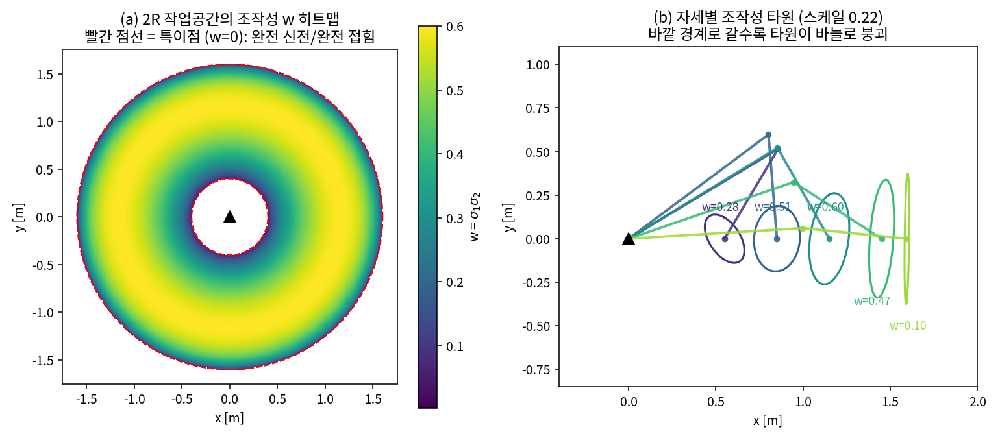
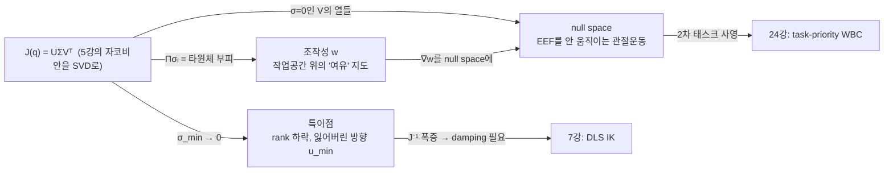
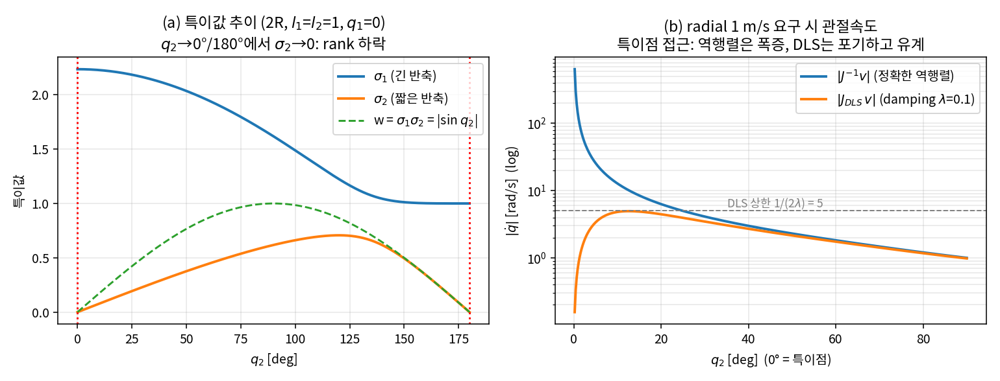
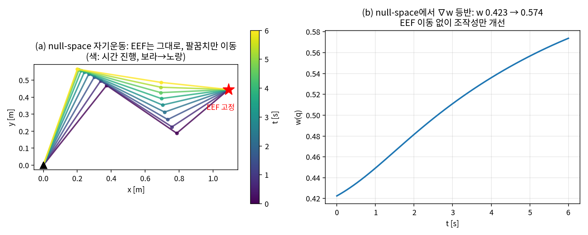

# Lec 06. 특이점과 조작성 — 로봇이 못 가는 방향

> 하위제어 트랙 6일차 (Part R2). 선수 지식: 5강(자코비안).
> 기초 참고서: Modern Robotics(이하 MR) §5.3(특이점 분석)·§5.4(조작성). 이 강의는 그 내용을 SVD라는 딥러닝 배경자에게 익숙한 렌즈 하나로 재구성한 것이다.

## 한 장 요약



왼쪽: 2R 팔($l_1=1,\ l_2=0.6$)의 작업공간 위에 **조작성 $w$**를 칠한 것. 빨간 점선(팔을 완전히 편 바깥 경계, 완전히 접은 안쪽 경계)에서 $w=0$ — 이곳이 **특이점(singularity)**이다. 오른쪽: 각 자세에서 "단위 크기의 관절속도로 낼 수 있는 EEF 속도"의 집합인 **조작성 타원(manipulability ellipsoid)**. 작업공간 한가운데서는 통통한 타원(어느 방향이든 잘 움직임)이 경계로 갈수록 바늘로 붕괴한다 — 바늘의 사라진 축 방향으로는 **아무리 빠르게 관절을 돌려도 손끝이 못 간다**. 오늘 강의는 이 붕괴를 $J$의 SVD로 정확히 읽고, 여유자유도가 있을 때 null-space로 무엇을 할 수 있는지 배우는 것이다.

## 학습 목표

1. 특이점을 두 가지 방식 — $\operatorname{rank}(J)$ 하락, 최소 특이값 $\sigma_{\min}\to 0$ — 으로 정의하고 서로 같은 말임을 설명할 수 있다.
2. $J$의 SVD에서 조작성 타원체의 축과 반축을 읽어내고, 2R 팔에서 손으로 계산할 수 있다.
3. Yoshikawa 조작성 $w=\sqrt{\det(JJ^\top)}$를 계산하고, 2R에서 닫힌형 $w = l_1 l_2 |\sin q_2|$를 유도할 수 있다.
4. 특이점 근처에서 요구 관절속도가 $1/\sigma_{\min}$으로 폭증함을 수치 실험으로 보이고, damping(DLS)이 ridge regression과 같은 수식임을 설명할 수 있다.
5. 여유자유도 로봇에서 null-space 사영 $\dot q = J^+ v + (I - J^+J)\dot q_0$로 "EEF를 고정한 채 2차 태스크 수행"을 구현할 수 있다.

## 왜 이 강의가 필요한가

5강에서 자코비안 $\dot x = J(q)\,\dot q$를 배웠다 — 관절속도에서 EEF 속도로 가는 **선형 사상**. 선형이면 뒤집으면 되겠네($\dot q = J^{-1}\dot x$), 라고 생각한 순간 로봇이 부서진다. 팔을 거의 다 뻗은 자세에서 "손끝을 바깥으로 1 m/s"를 요구하면 IK는 수백 rad/s의 관절속도를 답으로 내놓는다(아래 WE-2에서 실측: 특이점에서 1° 떨어진 자세에서 128 rad/s ≈ 7,300°/s — 협동로봇 관절 한계의 수십 배). 실기라면 속도 리미트 초과로 보호정지, 운이 나쁘면 폭주다.

이것이 VLA와 무관한 고전 이야기가 아니다. 50강에서 봤듯 RT-2·OpenVLA·Diffusion Policy는 **EEF 공간의 액션**을 내놓고, 그것을 관절 명령으로 바꾸는 IK/보간 계층이 아래에 있다. 학습 정책은 특이점을 모른다 — 데이터에 그런 라벨이 없으니까. 정책이 태연하게 내놓은 EEF 명령이 특이 자세 근처를 지나가면, 그 폭증을 감당하는 것은 하위 계층의 damping이다(7강). 오늘은 "무엇이, 왜, 얼마나" 폭증하는지를 정량화하고, 여유자유도라는 탈출구를 배운다. 딥러닝 배경자에게 좋은 소식: 필요한 도구가 전부 이미 아는 것들이다 — SVD, ill-conditioning, ridge regularization, gradient projection.

## 본문

### 1. 특이점 만나보기

팔을 앞으로 쭉 뻗어 보라. 손끝을 왼쪽·오른쪽·위·아래로는 움직일 수 있지만, **몸에서 더 멀어지는 방향으로는 움직일 수 없다**. 관절을 어떻게 조합해도 안 된다. 방금 당신의 팔은 특이점에 있었다.

수학으로 옮기면: $J(q)$는 $t \times n$ 행렬($t$=태스크 차원, $n$=관절 수)이고, EEF가 낼 수 있는 속도의 집합은 $J$의 **열공간(column space)** $\{J\dot q\}$다. 일반 자세에서 열공간은 태스크 공간 전체($\operatorname{rank} J = t$)지만, 특정 자세에서 열들이 선형종속이 되며 rank가 떨어진다:

$$
q_{\text{sing}} \;:\; \operatorname{rank} J(q_{\text{sing}}) < \max_q \operatorname{rank} J(q)
$$

이것이 MR §5.3의 특이점 정의다. rank가 떨어지는 순간 **어떤 EEF 속도 방향이 열공간에서 사라진다** — 팔을 뻗었을 때의 "몸에서 멀어지는 방향"이 그것이다. 그리고 rank는 이산적이지만 그 근처의 병듦은 연속적이다: 특이점에 "정확히" 있지 않아도 가까우면 이미 문제다. 이 "가까움"을 재는 자가 SVD다.

오늘 배울 개념들의 관계를 미리 그려 두면:



하나의 분해(SVD)에서 세 개념이 전부 나온다. $U$ 쪽(출력 공간)을 읽으면 특이점, $\Sigma$를 읽으면 조작성, $V$ 쪽(입력 공간)을 읽으면 null space다.

### 2. 핵심 수식

#### E1. 자코비안의 SVD — 타원체로 보는 $J$

**직관**: 어떤 선형 사상도 "회전 → 축별 늘이기 → 회전"으로 분해된다. $J$가 관절속도를 EEF 속도로 보낼 때 각 축을 얼마나 늘이는지가 특이값 $\sigma_i$이고, $\sigma_{\min}$이 0에 닿는 순간이 특이점이다.

**물리·기하적 의미**: 단위 관절속도 공 $\{\dot q : \|\dot q\| = 1\}$ ("관절 노력 1"의 등고선)을 $J$로 보내면 EEF 속도 공간의 **타원체**가 된다 — 축 방향은 $U$의 열 $u_i$, 반축 길이는 $\sigma_i$. 이것이 조작성 타원체다(MR §5.4). $\sigma_i$가 큰 방향은 "관절 조금 돌려도 손끝이 잘 나가는" 방향, $\sigma_{\min}$ 방향은 가장 힘겨운 방향, $\sigma_{\min}=0$이면 그 방향($u_{\min}$)으로는 **불가능**. 한 장 요약 (b)의 타원들이 정확히 이 그림이다.

**형식**: $J = U\Sigma V^\top$ ($U \in \mathbb{R}^{t\times t}$, $V \in \mathbb{R}^{n\times n}$ 직교, $\Sigma$ 대각). 타원체 방정식의 유도 요점: 단위 공 $\|\dot q\|=1$의 상(image)의 경계점 $v = J\dot q$에서, 최소노름 원상 $\dot q = J^+v$를 대입하면

$$
1 = \|\dot q\|^2 = v^\top (J^+)^\top J^+ v = v^\top (JJ^\top)^{-1} v
$$

즉 타원체는 $v^\top(JJ^\top)^{-1}v = 1$이고(MR §5.4), $JJ^\top = U\Sigma^2U^\top$이므로 축은 $u_i$, 반축은 $\sigma_i$다. 유용한 파생 지표:

$$
\operatorname{rank} J = \#\{\sigma_i > 0\}, \qquad \kappa(J) = \frac{\sigma_{\max}}{\sigma_{\min}} \ (\text{조건수: 타원체의 찌그러짐})
$$

$V$의 역할도 잊지 말 것: $\sigma_i = 0$에 대응하는 $V$의 열은 **관절이 움직여도 EEF가 (1차 근사로) 안 움직이는 방향**, 즉 $J$의 null space다 — E3의 주인공.

#### E2. Yoshikawa 조작성 $w$ — 타원체의 부피

**직관**: 타원체가 얼마나 통통한지를 숫자 하나로 요약하고 싶다. 부피가 자연스럽다.

**물리·기하적 의미**: $w$는 조작성 타원체의 부피에 비례한다(반축의 곱이므로). 특이점에서 타원체가 납작해지며 $w=0$ — 그래서 $w$는 **작업공간 위에 칠할 수 있는 "특이점까지의 여유" 지도**가 된다(한 장 요약 (a)). 로봇 베이스 배치, 작업대 높이 결정, 여유자유도의 2차 목적 함수(WE-3)에 쓰인다.

**형식** (Yoshikawa 1985 [2]):

$$
w(q) = \sqrt{\det\!\big(J(q)J(q)^\top\big)} = \sigma_1 \sigma_2 \cdots \sigma_t
$$

($\det(JJ^\top) = \det(U\Sigma^2U^\top) = \prod \sigma_i^2$이므로.) 정방 $J$면 $w = |\det J|$. 2R 팔에서 닫힌형을 유도해 보면 (WE-1의 $J$로):

$$
\det J = l_1 l_2 (\sin(q_1{+}q_2)\cos q_1 - \cos(q_1{+}q_2)\sin q_1) = l_1 l_2 \sin q_2
\;\;\Rightarrow\;\; w = l_1 l_2 |\sin q_2|
$$

팔꿈치가 90°일 때 최대, 완전히 펴거나(0°) 접으면(180°) 0. **주의**: $w$는 부피라서 "바늘처럼 길쭉하지만 부피는 큰" 타원체를 좋게 평가할 수 있다 — 방향 불균형이 걱정이면 조건수 $\kappa$나 $\sigma_{\min}$을 함께 봐야 한다. 또 회전과 병진이 섞인 6차원 $J$에서는 단위(m vs rad) 섞임 문제로 $w$의 절대값 비교가 무의미해진다 — 보통 병진/회전 블록을 나눠 계산한다.

#### E3. Null-space 사영 — 여유자유도의 사용법

**직관**: 관절이 태스크보다 많으면($n > t$), 태스크를 정확히 수행하는 관절속도가 유일하지 않다. "태스크는 그대로 두고 남는 자유로 부업(2차 태스크)을 하라"를 수식 한 줄로 쓴 것.

**물리·기하적 의미**: $J$의 null space $\mathcal{N}(J) = \{\dot q : J\dot q = 0\}$는 **EEF를 (순간적으로) 전혀 움직이지 않는 관절운동**의 집합이다 — 1강에서 본 여유자유도의 속도 버전. 차원은 $n - t$ (3R 평면 팔이면 1). 사람으로 치면 손을 문고리에 고정한 채 팔꿈치를 위아래로 휘젓는 운동이다. 이 부분공간으로 아무 벡터나 사영해 넣으면 EEF는 모른 채 자세만 바뀐다 — 특이점 회피, 관절한계 회피, 장애물 회피가 전부 여기 들어간다.

**형식**: full row rank인 $J$의 (Moore–Penrose) 의사역행렬 $J^+ = J^\top(JJ^\top)^{-1}$에 대해, $J\dot q = v$의 일반해는

$$
\dot q = \underbrace{J^+ v}_{\text{최소노름 태스크 해}} + \underbrace{(I - J^+ J)\,\dot q_0}_{\text{null-space 성분}}, \qquad \forall \dot q_0 \in \mathbb{R}^n
$$

$P = I - J^+J$는 $\mathcal{N}(J)$ 위로의 직교 사영자다. 태스크를 침범하지 않음은 한 줄로 확인된다: $J(I - J^+J) = J - JJ^\top(JJ^\top)^{-1}J = 0$. $\dot q_0$로 2차 목적 $h(q)$의 기울기(예: $h = w$, 조작성 최대화)를 넣는 것이 고전적 redundancy resolution이다 [3]. 우선순위가 여러 층이면? — 이 사영을 재귀적으로 쌓은 것이 24강의 whole-body control이다.

### 3. Worked Example

이 절의 모든 수치는 아래 검증 코드의 실제 출력이다.

#### WE-1 (손 + 코드): 2R 팔의 SVD와 rank 하락

$l_1 = l_2 = 1$인 2R 평면 팔. 5강에서 유도한 자코비안:

$$
J(q) = \begin{bmatrix} -l_1 s_1 - l_2 s_{12} & -l_2 s_{12} \\ l_1 c_1 + l_2 c_{12} & l_2 c_{12} \end{bmatrix}
$$

**손계산 ① — 건강한 자세 $q = (0°, 90°)$**: $s_1{=}0, c_1{=}1, s_{12}{=}1, c_{12}{=}0$이므로

$$
J = \begin{bmatrix} -1 & -1 \\ 1 & 0 \end{bmatrix}, \qquad
JJ^\top = \begin{bmatrix} 2 & -1 \\ -1 & 1 \end{bmatrix}
$$

$JJ^\top$의 특성방정식 $\lambda^2 - 3\lambda + 1 = 0 \Rightarrow \lambda = \tfrac{3 \pm \sqrt5}{2} = 2.618,\ 0.382$. 특이값은 그 제곱근:

$$
\sigma_1 = \sqrt{2.618} = 1.618, \qquad \sigma_2 = \sqrt{0.382} = 0.618
$$

(공교롭게 황금비 $\varphi$와 $1/\varphi$다.) 조작성 $w = \sigma_1\sigma_2 = 1.0 = l_1 l_2 |\sin 90°|$ — E2의 닫힌형과 일치.

**손계산 ② — 완전 신전 $q = (0°, 0°)$**: $s_1 = s_{12} = 0$, $c_1 = c_{12} = 1$이므로

$$
J = \begin{bmatrix} 0 & 0 \\ 2 & 1 \end{bmatrix}
$$

두 열 $(0,2)^\top$과 $(0,1)^\top$이 평행 — **rank 1**. 열공간은 $y$축(접선 방향)뿐이고, 사라진 방향 $u_2 = (1,0)$은 정확히 radial(더 뻗는) 방향이다. 특이값: $\sigma_1 = \|(2,1)\|$ 방향의 늘이기 $= \sqrt5 \approx 2.236$, $\sigma_2 = 0$. 덤으로 null 방향 $v_2 \propto (-1, 2)$: "베이스를 $-\delta$, 팔꿈치를 $+2\delta$" 돌리면 1차 근사로 EEF가 안 움직인다 — 특이점에서는 비여유 로봇에도 순간적 null space가 생긴다.

**검증 코드**:

```python
import numpy as np

def J2R(q, l1=1.0, l2=1.0):
    s1, c1 = np.sin(q[0]), np.cos(q[0])
    s12, c12 = np.sin(q[0]+q[1]), np.cos(q[0]+q[1])
    return np.array([[-l1*s1 - l2*s12, -l2*s12],
                     [ l1*c1 + l2*c12,  l2*c12]])

U, S, Vt = np.linalg.svd(J2R([0, np.pi/2]))
print(S, S[0]*S[1])            # [1.618 0.618]  1.0

U0, S0, Vt0 = np.linalg.svd(J2R([0, 0]))
print(S0)                      # [2.2361 0.    ]  ← sqrt(5), 0
print(U0[:, 1], Vt0[1, :])     # 잃은 방향 [1, 0] / null 방향 [-0.447, 0.894] = (-1,2)/√5

for q2 in np.random.uniform(-np.pi, np.pi, 3):   # w = l1 l2 |sin q2| 무작위 검증
    w = np.prod(np.linalg.svd(J2R([0.86, q2]), compute_uv=False))
    print(f"{w:.6f} == {abs(np.sin(q2)):.6f}")
```

출력이 손계산과 일치한다: $\sigma = (1.618, 0.618)$, $w = 1.0$; 완전 신전에서 $\sigma = (2.236, 0)$, 잃은 방향 $(1,0)$, null 방향 $(-0.447, 0.894)$.

#### WE-2 (손 + 코드): 특이점 접근 — 요구 관절속도의 폭증과 damping

완전 신전에서 $q_2 = \varepsilon$만큼 떨어진 자세에서, radial 방향 EEF 속도 1 m/s를 요구하면 $\dot q = J^{-1}v$의 크기는?

**손계산**: $q_1 = 0,\ q_2 = \varepsilon$에서 ($c \equiv \cos\varepsilon,\ s \equiv \sin\varepsilon$)

$$
J = \begin{bmatrix} -s & -s \\ 1{+}c & c \end{bmatrix}, \quad
\det J = -sc + s(1{+}c) = s, \quad
J^{-1} = \frac{1}{s}\begin{bmatrix} c & s \\ -(1{+}c) & -s \end{bmatrix}
$$

$v = (1, 0)$ (radial)을 넣으면 $\dot q = \tfrac{1}{s}(c,\ -(1{+}c))^\top$이므로

$$
\|\dot q\| = \frac{\sqrt{c^2 + (1{+}c)^2}}{\sin\varepsilon} \;\xrightarrow{\ \varepsilon \to 0\ }\; \frac{\sqrt{5}}{\varepsilon}
$$

$\varepsilon = 1°$이면 $\sqrt5/\sin 1° = 128.1$ rad/s. 분모의 $\sin\varepsilon$이 바로 $\det J = \sigma_1 \sigma_2$에서 온 것 — 폭증의 근원은 $1/\sigma_{\min}$이다. 방향도 읽어 두자: $\varepsilon \to 0$에서 $\dot q \propto (1, -2)$인데, 이는 WE-1의 null 방향 $(-1, 2)$과 같은 직선이다. 일반적으로 $J^{-1}v = \sum_i \frac{u_i^\top v}{\sigma_i} v_i$에서 $1/\sigma_{\min}$ 항이 지배하므로 폭증 성분은 $v_{\min}$(거의 null인 관절 방향)을 따른다 — **EEF를 거의 못 움직이는 방향으로 미친 듯이 휘저어야** 잃어가는 radial 속도를 쥐어짜낼 수 있다는 뜻이다.

**검증 코드**:

```python
lam = 0.1
for eps_deg in [30, 10, 5, 1, 0.1]:
    J = J2R([0.0, np.deg2rad(eps_deg)])
    v = np.array([1.0, 0.0])                                  # radial 요구
    qd     = np.linalg.solve(J, v)                            # 정확한 역
    qd_dls = J.T @ np.linalg.solve(J @ J.T + lam**2*np.eye(2), v)  # DLS (7강 예고)
    S = np.linalg.svd(J, compute_uv=False)
    print(eps_deg, S[1], S[0]/S[1], np.linalg.norm(qd), np.linalg.norm(qd_dls))
```

실행 결과 (반올림):

| $q_2$ | $\sigma_{\min}$ | 조건수 $\kappa$ | $\|J^{-1}v\|$ [rad/s] | $\|\dot q_{\text{DLS}}\|$ ($\lambda{=}0.1$) |
|---|---|---|---|---|
| 30° | 0.231 | 9.4 | 4.11 | 3.47 |
| 10° | 0.078 | 28.6 | 12.76 | 4.82 |
| 5° | 0.039 | 57.3 | 25.60 | 3.38 |
| 1° | 0.0078 | 286.5 | **128.11** | 0.78 |
| 0.1° | 0.00078 | 2864.8 | **1281.17** | 0.08 |

읽는 법: ① 정확한 역행렬은 $1/\sin q_2$로 폭증한다 — 1°에서 128 rad/s는 협동로봇 관절 속도 한계(보통 π~2π rad/s 수준)의 수십 배다. ② DLS는 $1/(2\lambda) = 5$ rad/s를 절대 넘지 않는다(10° 부근, 즉 $\sigma_{\min} \approx \lambda$에서 최대 4.82). ③ 공짜가 아니다: 1°에서 DLS가 실제로 만든 EEF 속도는 $(0.006, -0.010)$ — 요구한 $(1, 0)$을 사실상 **포기**했다. 불가능한 방향을 정확히 추종하는 대신 유한한 관절속도를 지키는 트레이드오프이며, $\lambda$의 선택 문제와 유도는 7강에서 다룬다.



*(a) $q_2$를 0→180°로 스윕하면 $\sigma_2$가 양 끝(특이점)에서 0에 닿는다. (b) 같은 실험의 연속 버전: 역행렬(파랑)은 발산, DLS(주황)는 $1/(2\lambda)$에서 포화.*

#### WE-3 (코드): 3R null-space 자기운동 — EEF 고정한 채 조작성 올리기

3R 평면 팔($L = [0.6, 0.5, 0.4]$, 1강의 그 팔)은 위치 태스크($t{=}2$)에 대해 여유자유도 1을 가진다. E3의 $\dot q_0$에 조작성 기울기 $\nabla w$를 넣어 **EEF를 고정한 채 특이점에서 멀어지는** 자기운동(self-motion)을 만든다:

```python
L = np.array([0.6, 0.5, 0.4])
def fk3(q):
    a = np.cumsum(q)
    return np.array([np.sum(L*np.cos(a)), np.sum(L*np.sin(a))])
def J3(q):
    a = np.cumsum(q); Jm = np.zeros((2, 3))
    for j in range(3):
        Jm[0, j] = -np.sum(L[j:]*np.sin(a[j:]))
        Jm[1, j] =  np.sum(L[j:]*np.cos(a[j:]))
    return Jm
def manip(q):
    Jm = J3(q); return np.sqrt(np.linalg.det(Jm @ Jm.T))
def grad_manip(q, h=1e-6):                       # 수치 기울기 (5강의 유한차분 재활용)
    return np.array([(manip(q + h*e) - manip(q - h*e)) / (2*h)
                     for e in np.eye(3)])

q = np.array([0.9, -1.5, 1.3]); x_star = fk3(q)  # 시작 자세와 고정 목표
dt, K = 0.01, 5.0
for _ in range(600):
    Jm = J3(q)
    Jp = Jm.T @ np.linalg.inv(Jm @ Jm.T)          # J+ (full row rank)
    qdot = Jp @ (K*(x_star - fk3(q))) \
         + (np.eye(3) - Jp @ Jm) @ (2.0*grad_manip(q))   # E3 그대로
    q = q + dt*qdot
print(manip(q), np.linalg.norm(fk3(q) - x_star))
```

실행 결과: 6초(600스텝) 동안 관절은 $(+19.0°, +6.4°, -71.5°)$나 움직였는데 — 팔꿈치가 크게 접힌다 — **EEF 오차는 $6.1\times10^{-6}$ m**로 고정된 채, 조작성은 $w = 0.423 \to 0.574$로 올라간다. 첫 항($J^+$ 피드백)이 수치 적분 드리프트를 잡아주고, 둘째 항이 null space 안에서 $\nabla w$를 오른다 — 두 항은 서로 직교해서 간섭하지 않는다.



*(a) 시간에 따른 팔 자세(보라→노랑). 빨간 별(EEF)은 그대로인데 팔꿈치만 이동한다. (b) 그동안 조작성 $w$는 단조 증가.*

### 4. 실제 로봇에서: 특이점은 어디에 숨어 있나

- **6R 산업용 팔(UR5e류)**의 고전적 3분류 — 어깨(shoulder: 손목 중심이 축 1 위), 팔꿈치(elbow: 팔 완전 신전, 오늘의 2R 예제와 동형), 손목(wrist: 축 4와 6이 정렬). 특히 손목 특이점은 **작업공간 한가운데**에 있어서 경계만 피한다고 안전하지 않다. 6-DoF 팔은 여유가 없으므로($n = t = 6$) 피해서 "돌아가는" 것 외에 방법이 없다 — 1강의 DoF 표에서 UR5e를 "여유 없음, 특이점 회피 여지도 없음"이라 적어 둔 이유가 오늘 풀렸다.
- **7-DoF 팔(Franka)**은 $n - t = 1$의 null space가 항상 있어 WE-3처럼 팔꿈치를 돌려 특이점·관절한계를 피하면서 같은 EEF 자세를 유지할 수 있다. 단, 7-DoF라고 특이점이 없는 게 아니다(흔한 오해 4).
- **VLA 파이프라인**에서는: 정책이 EEF 액션을 내놓음(50강) → IK 계층이 관절로 변환(7강) → 이때 DLS damping과 $\sigma_{\min}$ 모니터링이 특이점 방어선. teleop 데이터 수집 단계에서도 시연자가 특이 자세 근처를 지나가면 관절속도 스파이크가 데이터에 그대로 박힌다 — 데이터 필터링에서 $w(q)$를 진단 지표로 쓸 수 있다.

### 5. 한 표로 정리

| 보고 싶은 것 | 계산 | 읽는 법 | 오늘 어디서 |
|---|---|---|---|
| 특이점 여부 | $\operatorname{rank} J$ 또는 $\sigma_{\min}$ | $\sigma_{\min} = 0$이면 특이점, 작으면 근처 | E1, WE-1 |
| 잃어버린 EEF 방향 | $\sigma{=}0$의 $U$ 열 $u_{\min}$ | 그 방향 속도 명령은 불가능/폭증 | WE-1 (radial) |
| 못 쓰는 관절운동 | $\sigma{=}0$의 $V$ 열 = null 방향 | EEF 안 움직이는 관절운동; 폭증도 이 방향 | WE-1·WE-2 |
| 자세의 "여유" | $w = \prod\sigma_i$ | 0에 가까울수록 위험; 지도로 칠하기 | E2, fig1 |
| 방향 불균형 | $\kappa = \sigma_{\max}/\sigma_{\min}$ | 크면 ill-conditioned; IK 안전 모니터 | WE-2 표 |
| 여유자유도 활용 | $(I - J^+J)\dot q_0$ | EEF 몰래 2차 태스크 수행 | E3, WE-3 |

전부 `np.linalg.svd(J)` 호출 한 번에서 나온다. 로봇 상태 모니터에 SVD 하나 넣는 것이 오늘 강의의 실무 요약이다.

### 딥러닝 배경자를 위한 번역

- **특이점 = rank-deficient 야코비안 = ill-conditioned least squares.** $J\dot q = v$ 풀기는 선형 회귀이고, $\sigma_{\min} \to 0$은 그 문제의 Hessian($J^\top J$)의 최소 고유값이 0으로 가는 것이다. 조건수 $\kappa$가 크면 해가 데이터(여기서는 $v$)의 작은 변화에 민감해진다 — 훈련이 불안정한 ill-conditioned loss landscape와 같은 병리, 같은 진단 도구(스펙트럼).
- **DLS의 damping = ridge regression, 문자 그대로.** $\min_{\dot q} \|J\dot q - v\|^2 + \lambda^2\|\dot q\|^2$의 해 $\dot q = (J^\top J + \lambda^2 I)^{-1}J^\top v$는 Tikhonov 정칙화/weight decay와 동일 수식이다. SVD로 보면 각 성분 이득이 $\sigma_i/(\sigma_i^2 + \lambda^2)$로 필터링된다 — 큰 $\sigma$는 거의 그대로($1/\sigma$), 작은 $\sigma$는 눌러버림(최대 이득 $1/2\lambda$). WE-2의 표가 이 필터의 실측이다.
- **null-space 사영 = gradient projection.** "주 태스크의 제약을 깨지 않는 부분공간으로 2차 목적의 기울기를 사영"은 제약 최적화의 projected gradient, multi-task 학습에서 충돌하는 기울기를 사영하는 기법들과 같은 기하다. 주 태스크의 해집합(다양체) 위를 걸어다니며 2차 목적을 최적화하는 것.
- **$w = |\det J|$는 normalizing flow의 $\log|\det J|$와 같은 대상이다.** flow가 change-of-variables에서 확률 부피의 왜곡을 $|\det J|$로 추적하듯, 조작성은 관절속도 공이 EEF 속도 타원체로 왜곡되는 부피비를 잰다. flow에서 $\det J \to 0$이 "붕괴된 분포"이듯 로봇에서는 "붕괴된 운동 능력"이다.

## 흔한 오해

1. **"특이점은 작업공간 경계에만 있다"** — 2R에서는 우연히 그렇다(신전=바깥 경계, 접힘=안쪽 경계). 그러나 6R의 손목 특이점은 작업공간 **한복판**에서 일어난다. 경계 회피와 특이점 회피는 다른 문제다.
2. **"특이점은 측도 0의 집합이니 정확히 밟을 일이 없고, 따라서 무시해도 된다"** — 밟는 게 문제가 아니라 **근처**가 문제다. WE-2에서 봤듯 요구 관절속도는 $1/\sigma_{\min}$으로 연속적으로 폭증한다: 특이점에서 5° 떨어져도 이미 25 rad/s다. 위험 지역은 점이 아니라 두꺼운 튜브다.
3. **"특이점은 무조건 나쁘다"** — 속도 관점에서만 그렇다. 5강의 쌍대 $\tau = J^\top F$로 보면 힘 타원체의 반축은 $1/\sigma_i$ — 속도 타원체와 **역수 관계**다(MR §5.4). 속도를 잃은 방향으로는 관절 토크 없이 큰 힘을 버틸 수 있다: 팔을 쭉 펴서 벽을 미는 자세, 무거운 것을 뼈로 버티는 자세가 그것이다. 특이점은 "운동의 최악, 버티기의 최적"이다.
4. **"7-DoF 로봇은 여유가 있으니 특이점이 없다"** — $J$가 $6\times7$이어도 rank가 6 아래로 떨어지는 자세는 존재한다. 여유자유도는 특이점을 없애주는 게 아니라 **피해 다닐 null space라는 통로**를 줄 뿐이고, 그 통로를 쓰는 것이 WE-3의 알고리즘이다.

## 실습 (1.5~2시간)

**조작성 지도 만들기 + 특이점 통과 실험.** (1~3은 NumPy, 4는 MuJoCo)

1. **2R 조작성 히트맵** (30분): 한 장 요약 (a)를 재현하라. 작업공간 격자 위에서 $\cos q_2 = (r^2 - l_1^2 - l_2^2)/(2 l_1 l_2)$로 $q_2$를 복원하면 IK 없이 $w = l_1 l_2|\sin q_2|$를 칠할 수 있다. 여러 자세에서 `J @ 단위원`으로 조작성 타원도 겹쳐 그릴 것 (b). 생성 스크립트 `images/lec06/gen_figs.py`와 대조.
2. **3R 조작성 지도 — 여유의 가치** (30분): 3R은 같은 EEF 위치에 무한히 많은 $q$가 있으므로 "지도"가 자명하지 않다. 목표점 격자마다 ① 무작위 IK 해 하나의 $w$, ② WE-3의 null-space 등반을 돌린 후의 $w$를 각각 히트맵으로 그려 비교하라. ②−①의 차이가 **여유자유도가 사주는 조작성**이다.
3. **특이점 통과 실험 — damping이 필요한 이유 체감** (30분): 2R EEF에 "작업공간 안쪽 점 → 바깥 경계를 뚫고 나가는 직선" 궤적을 명령하고 $\dot q = J^{-1}\dot x_d$를 오일러 적분하라. 경계에 접근하며 $\|\dot q\|$가 발산하고 적분이 깨지는 것을 관찰한 뒤, $J^{-1}$을 WE-2의 DLS로 바꿔 재실행 — 로봇이 경계에서 얌전히 "미끄러지는" 것을 보라. $\lambda \in \{0.01, 0.1, 0.5\}$로 스윕하며 추종 오차 vs 최대 관절속도 트레이드오프를 플롯. 이 곡선이 7강의 출발점이다.
4. **(심화) MuJoCo에서 $\sigma_{\min}$ 모니터** (30분): 1강 실습의 `arm3r.xml`을 재사용해 MuJoCo 자코비안으로 같은 값이 나오는지 확인하라:

```python
import numpy as np, mujoco
m = mujoco.MjModel.from_xml_path("arm3r.xml"); d = mujoco.MjData(m)
d.qpos[:] = [0.9, -1.5, 1.3]; mujoco.mj_forward(m, d)
jacp = np.zeros((3, m.nv)); jacr = np.zeros((3, m.nv))
mujoco.mj_jacSite(m, d, jacp, jacr, m.site("ee").id)
J = jacp[:2, :]                          # 평면 팔이므로 x,y 행만
sig = np.linalg.svd(J, compute_uv=False)
print(sig, np.prod(sig[:2]))             # w = 0.4225 — WE-3의 시작값과 일치해야 함
```

   팔을 서서히 신전시키는 궤적을 주고 매 스텝 $\sigma_{\min}$과 $w$를 로깅해 "특이점 경보기"를 만들어 보라. (Menagerie의 Franka로 확장하면 $6\times7$ 자코비안 — null space 차원도 확인.)

## Claude와 토론할 질문

1. 5강의 $\tau = J^\top F$를 이용해 "속도 타원체와 힘 타원체의 반축이 역수"임을 SVD로 유도해 보라. 사람이 무거운 짐을 들 때 팔을 펴는 이유를 이 언어로 설명하면?
2. $w$, $\sigma_{\min}$, 조건수 $\kappa$ — IK 안전 모니터에 하나만 쓸 수 있다면 무엇을 고르겠는가? 각각이 놓치는 병리 사례를 만들어 보라.
3. VLA가 EEF 액션을 내놓는 이상 특이점 처리는 필연이다: 정책이 데이터에서 암묵적으로 배우게 할 것인가, 하위 IK 계층이 damping으로 막을 것인가, 아니면 50강의 계층 구조 어디에 안전 필터를 둘 것인가? 각 선택의 실패 모드를 논하라.
4. DLS의 $\lambda$를 상수 대신 $\sigma_{\min}$의 함수로 만드는 adaptive damping을 설계해 보라. "특이점에서 멀 때는 정확하게, 가까울 때만 눌러라"를 수식으로 쓰면?
5. WE-3에서 2차 태스크가 여러 개면(조작성 + 관절한계 회피 + 팔꿈치 높이) 어떻게 되나? 우선순위를 주는 방법을 고민해 보고, 24강의 task-priority WBC가 이 질문의 답임을 확인하라.
6. normalizing flow에서는 $\log|\det J|$가 0에서 멀어지도록(가역성 유지) 아키텍처를 설계한다. 로봇에서 "$w$가 항상 큰 로봇"을 기구학적으로 설계할 수 있을까? 링크 길이 비율, 관절 배치의 관점에서 논하라.
7. 흔한 오해 2의 "위험 튜브"의 두께를 정의해 보라: 최대 관절속도 $\dot q_{\max}$와 요구 EEF 속도 $v$가 주어지면 접근 금지 영역 $\sigma_{\min} < ?$의 경계는 어디인가?

## 읽을거리

1. **MR §5.3~5.4** (~40분): 특이점 분석과 조작성 타원체의 원전. 6R 팔의 특이점 사례 분석(§5.3의 예제들)까지 읽을 것. §5.1의 공간 자코비안 표기가 낯설면 5강의 해석 자코비안으로 바꿔 읽어도 오늘 범위에서는 무방하다.
2. **Buss, "Introduction to Inverse Kinematics with Jacobian Transpose, Pseudoinverse and Damped Least Squares Methods"** (2004, ~30분): §1~DLS 절까지만 — 7강의 예습을 겸한다. 오늘 배운 SVD 언어로 읽으면 유도가 전부 자명해 보일 것이다.
3. (선택) **Yoshikawa 원논문 [2]** (~30분): $w$의 원 정의와 force ellipsoid까지. 1985년 논문이 지금도 그대로 쓰인다.

## 자가 점검

1. 특이점의 정의를 rank로, 그리고 $\sigma_{\min}$으로 각각 말하고 두 정의가 동치인 이유를 설명할 수 있는가?
2. 조작성 타원체의 축·반축이 $J = U\Sigma V^\top$의 어디에서 나오는지, $V$의 null 방향은 무엇을 뜻하는지 답할 수 있는가?
3. 2R 팔의 $w = l_1 l_2|\sin q_2|$를 1분 안에 유도하고, 완전 신전에서 $J$의 rank가 1임을 손으로 보일 수 있는가?
4. "특이점에서 1° 떨어진 자세, radial 1 m/s 요구"의 관절속도 크기를 $1/\sin q_2$ 스케일링으로 어림잡을 수 있는가 (~$\sqrt5/\sin 1° \approx 128$ rad/s)?
5. $J(I - J^+J) = 0$을 한 줄로 증명하고, WE-3에서 이 사실이 왜 "EEF 드리프트 $10^{-6}$ m 유지"로 나타나는지 설명할 수 있는가?

## 참고문헌

> 웹 문서는 2026-07-08 접속 기준. 그림은 `images/lec06/gen_figs.py`로 생성 (본문 수치는 동일 코드로 검증).

[1] K. Lynch, F. Park, "Modern Robotics: Mechanics, Planning, and Control," Cambridge Univ. Press, 2017. 무료 PDF: https://hades.mech.northwestern.edu/images/7/7f/MR.pdf
— **뒷받침**: 특이점 정의와 6R 특이점 사례(§5.3), 조작성 타원체 $v^\top(JJ^\top)^{-1}v=1$과 힘 타원체의 역수 관계(§5.4), 의사역행렬 기반 역속도 기구학(§6.3).

[2] T. Yoshikawa, "Manipulability of Robotic Mechanisms," The International Journal of Robotics Research, vol. 4, no. 2, 1985.
— **뒷받침**: 조작성 지표 $w=\sqrt{\det(JJ^\top)}$의 원 정의 (E2), 조작성/힘 타원체 개념.

[3] B. Siciliano, L. Sciavicco, L. Villani, G. Oriolo, "Robotics: Modelling, Planning and Control," Springer, 2009.
— **뒷받침**: 여유자유도 로봇의 null-space 사영 해 $\dot q = J^+v + (I-J^+J)\dot q_0$와 2차 목적(조작성 등) 기울기 투입에 의한 redundancy resolution (Ch.3 미분 기구학의 해당 절) — E3·WE-3의 정식화.

[4] S. R. Buss, "Introduction to Inverse Kinematics with Jacobian Transpose, Pseudoinverse and Damped Least Squares Methods," UCSD, 2004 (튜토리얼 원고). https://www.math.ucsd.edu/~sbuss/ResearchWeb/ikmethods/iksurvey.pdf
— **뒷받침**: DLS 정식화 $\min\|J\dot q - v\|^2 + \lambda^2\|\dot q\|^2$와 SVD 필터 해석 (WE-2, 번역 박스의 "DLS = ridge") — 상세 유도는 7강.

[5] Google DeepMind, MuJoCo 문서. https://mujoco.readthedocs.io
— **뒷받침**: 실습 4의 `mj_jacSite` API (site 자코비안) 사용법.
