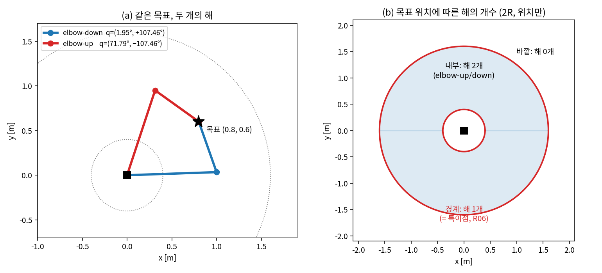
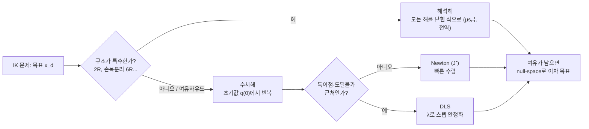
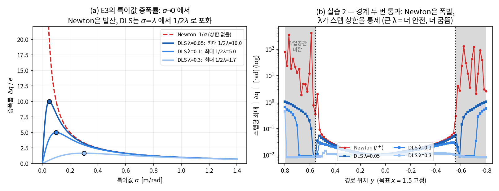
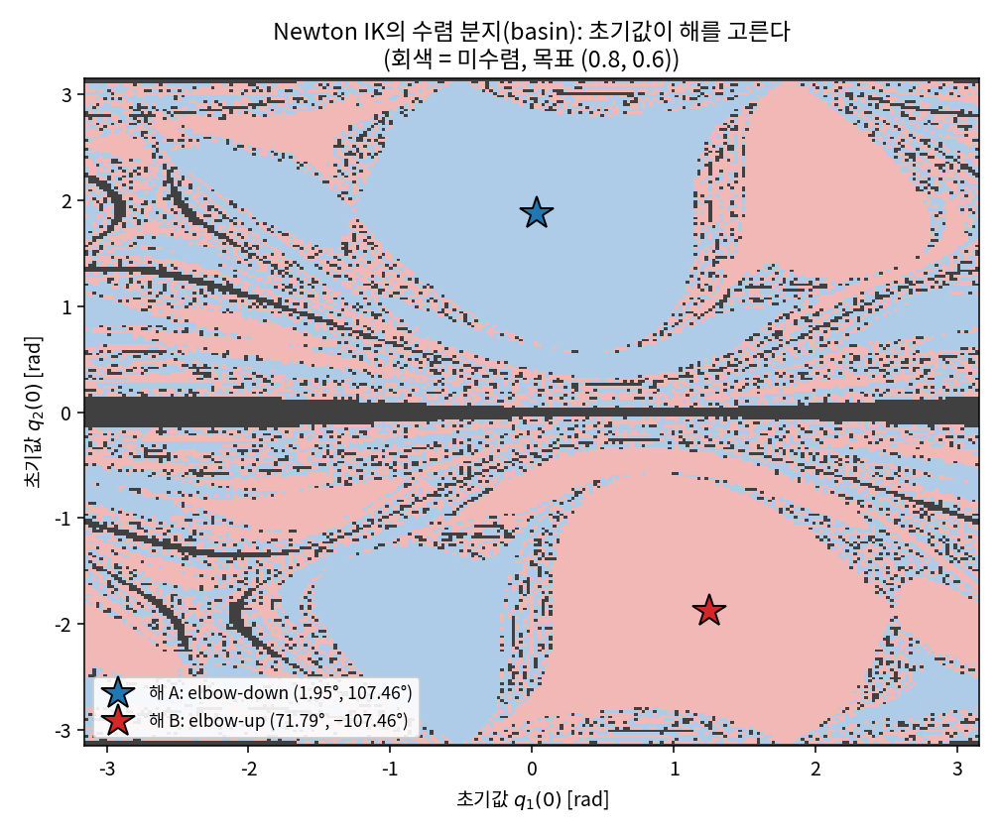
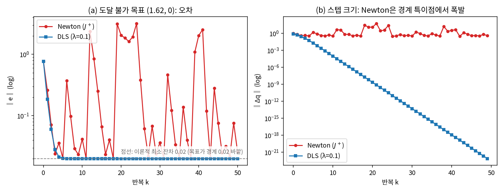

# Lec 07. 역기구학 — 해석해, 수치해, 그리고 다해성

> 하위제어 트랙 7일차 (Part R2). 선수 지식: 1강(작업공간·여유자유도), 4강(FK), 5강(자코비안), 6강(특이점·SVD).
> 기초 참고서: Modern Robotics(이하 MR) Ch.6. 이 강의는 MR §6.1~6.2를 딥러닝 배경자의 언어로 재구성한 것이다.

## 한 장 요약



왼쪽: 같은 목표점 (0.8, 0.6)에 도달하는 2R 팔의 관절 구성은 **두 개**다(elbow-down/up) — IK는 함수가 아니라 **관계**다. 오른쪽: 목표가 어디 있느냐에 따라 해는 2개(작업공간 내부), 1개(경계 = 6강의 특이점), 0개(바깥)로 변한다. 오늘 강의는 이 해들을 **닫힌 식으로 구하는 법**(해석해), **반복으로 구하는 법**(뉴턴법·DLS), 그리고 **여러 해 중 어느 것이 나오는가**(다해성·basin)를 다룬다.

## 학습 목표

1. IK가 잘 정의된 함수가 아닌 이유(해 0/1/2/∞개)를 작업공간 기하로 설명할 수 있다.
2. 2R 팔의 해석해를 코사인 법칙으로 유도하고 elbow-up/down 두 해를 손으로 계산할 수 있다.
3. 뉴턴-랩슨 수치 IK를 유도·구현하고, 특이점 근처에서 왜 발산하는지 SVD로 설명할 수 있다.
4. Damped least squares(DLS)를 정칙화 최적화 문제에서 유도하고, ridge regression과의 동치성을 보일 수 있다.
5. 여유자유도 로봇에서 null-space projection으로 이차 목표를 넣는 코드를 작성할 수 있다.

## 왜 이 강의가 필요한가

4강에서 FK $x = f(q)$를 배웠다. 그런데 실무의 질문은 대부분 반대 방향이다 — "컵이 저기 있으니 손끝을 저기로 보내라." 즉 $q = f^{-1}(x)$를 풀어야 한다. 문제는 $f$가 비선형이고, 역이 **존재하지 않거나(도달 불가), 유일하지 않거나(elbow-up/down), 무한히 많다(여유자유도)**는 것이다.

이 문제는 학습 정책의 시대에도 사라지지 않았다. 50강에서 봤듯 RT-2·OpenVLA류 VLA는 ΔEEF 액션을 내놓는데, 그것을 관절 명령으로 바꾸는 **IK 계층이 로봇 쪽에서 100~1000Hz로 돌아간다**. VLA가 관절공간을 출력하는 경우(π0, ACT)에도, teleop 데이터 수집 장치와 리타게팅 파이프라인 안에서 IK는 여전히 돈다. 그리고 개념적으로 더 중요한 것: **IK의 다해성은 로봇 행동 데이터가 다봉(multimodal)인 기구학적 뿌리다.** 같은 컵을 잡는 시연이 시연자마다 elbow-up/down으로 갈리면, MSE로 회귀한 정책은 두 해의 평균 — 유효하지 않은 관절각 — 을 내놓는다(39강이 이 문제로 시작한다). 오늘 배우는 것이 그 이야기의 수학적 원본이다.

참고로 여러분은 이미 수치 IK를 한 번 썼다 — 1강 WE-2의 `ik()` 함수가 바로 오늘 유도할 DLS다. 그때 "7강에서 유도"라고 미뤄둔 빚을 오늘 갚는다.

## 본문

### 1. IK는 함수가 아니다 — 문제의 형태

정기구학은 언제나 잘 정의된 함수다: 관절각을 넣으면 EEF 자세가 **하나** 나온다. 역방향은 그렇지 않다:

| 목표 위치 | 해의 개수 | 기하적 상황 |
|---|---|---|
| 작업공간 바깥 | 0 | 팔이 닿지 않음 |
| 작업공간 경계 | 1 | 팔을 완전히 뻗음/접음 — **6강의 특이점과 같은 곳** |
| 작업공간 내부 (n = t) | 유한 개 (2R이면 2, 손목분리 6R이면 최대 8) | 거울상 해들 |
| 작업공간 내부 (n > t) | ∞ (연속족, $(n-t)$차원 다양체) | 여유자유도 — 1강의 self-motion |

그래서 "IK를 푼다"는 말은 사실 세 가지 다른 문제를 뭉뚱그린 것이다: ① 해가 있는가(존재), ② 모든 해를 나열할 수 있는가(해석해), ③ 그중 하나로 빠르게 수렴할 수 있는가(수치해). 알고리즘 선택은 이 구분에서 나온다:



### 핵심 수식

#### E1. 2R 해석해 — 코사인 법칙이 팔꿈치를 정한다

**직관**: 어깨(원점), 팔꿈치, 손끝(목표)은 삼각형을 이룬다. 세 변의 길이가 전부 알려져 있다 — $l_1$, $l_2$, 그리고 목표까지의 거리 $r$. 변을 다 알면 각은 코사인 법칙이 정해준다. 팔꿈치를 얼마나 접을지는 **목표까지의 거리만으로** 결정되고, 방향은 그 다음에 어깨각이 맞춘다.

**물리·기하적 의미**: $\cos q_2$가 $[-1, 1]$을 벗어나면 삼각형이 만들어지지 않는다 — 존재 조건 $|l_1 - l_2| \le r \le l_1 + l_2$가 바로 1강에서 본 고리형 작업공간이다(한 장 요약 (b)). 내부에서는 $\pm\arccos$의 두 부호가 거울상 두 해(elbow-down/up)를 주고, 경계에서는 $\arccos(\pm 1)$이 한 점으로 합쳐진다 — **해가 합쳐지는 곳이 특이점이라는 것은 우연이 아니다**(토론 질문 3).

**형식**: 목표 $(x, y)$, $r^2 = x^2 + y^2$일 때 (MR §6.1의 2R 예제):

$$
\cos q_2 = \frac{r^2 - l_1^2 - l_2^2}{2\, l_1 l_2}, \qquad q_2 = \pm \arccos(\cdot)
$$

$$
q_1 = \operatorname{atan2}(y, x) - \operatorname{atan2}\big(l_2 \sin q_2,\; l_1 + l_2 \cos q_2\big)
$$

유도 요점: 첫 식은 어깨-팔꿈치-손끝 삼각형에 코사인 법칙(팔꿈치의 외각이 $q_2$). 둘째 식은 "목표 방향각 $\gamma$에서, 팔 전체가 이루는 벡터가 첫 링크 방향과 이루는 각 $\beta$를 빼는" 것 — $\beta$의 분자·분모가 각각 목표 벡터의 링크1 수직/평행 성분이다. $\operatorname{atan2}$를 쓰는 이유: 사분면 정보를 잃지 않기 위해(2강에서 본 것과 같은 주의).

#### E2. 뉴턴-랩슨 수치 IK — 선형화하고, 풀고, 반복한다

**직관**: $f$는 비선형이라 직접 못 뒤집지만, 5강에서 배웠듯 **현재 위치 근방에서는 $J$가 선형 근사**를 준다. "지금 오차 $e$를 없애려면 관절을 어떻게 움직여야 하나?"를 선형 문제 $J\,\Delta q = e$로 바꿔 풀고, 이동한 곳에서 다시 선형화한다. 뉴턴법의 벡터 버전이며, 최적화 어휘로는 $\tfrac{1}{2}\|e\|^2$에 대한 **Gauss-Newton**이다.

**물리·기하적 의미**: $J^+ e$는 "오차 $e$를 만드는 **최소 노름** 관절 변화"다(무한히 많은 $\Delta q$ 중 가장 게으른 것). 문제는 특이점: 6강에서 봤듯 $J = U \Sigma V^\mathsf{T}$에서 $J^+$는 특이값을 $1/\sigma_i$로 뒤집는데, $\sigma_i \to 0$이면 $1/\sigma_i \to \infty$ — **오차의 그 방향 성분이 아무리 작아도 스텝이 폭발한다.** WE-2에서 실측한다.

**형식**: 목표 $x_d$, 반복 $k$에서 (MR §6.2):

$$
e_k = x_d - f(q_k), \qquad q_{k+1} = q_k + J^+(q_k)\, e_k
$$

여기서 $J^+$는 Moore-Penrose 의사역행렬($n > t$면 $J^+ = J^\mathsf{T}(J J^\mathsf{T})^{-1}$ — 최소 노름 해). 해 근방에서는 수렴이 매우 빠르지만(뉴턴법의 유산), **국소적**이다: 어느 해로 가는지는 초기값이 정하고(§2), 특이점 근처·도달 불가 목표에서는 발산한다. 자세(orientation)까지 포함하려면 $e$의 회전 성분을 로그 사상으로 정의해야 하는데(MR은 body twist로 정식화), 오늘은 위치 IK로 개념을 잡고 회전 오차는 실습 심화로 미룬다.

#### E3. Damped least squares — 큰 스텝에 벌금을 매긴다

**직관**: 뉴턴법의 병은 "오차를 **완벽히** 지우는 스텝"을 고집하는 것이다. 특이점 근처에서는 그 완벽주의가 수십 rad짜리 관절 점프를 요구한다. 처방: **오차를 줄이되, 스텝 크기에도 벌금을 매기는 절충**. 딥러닝 어휘로 정확히 **ridge regression(L2 정칙화)**이고, 최적화 어휘로는 Gauss-Newton을 Levenberg-Marquardt로 바꾸는 것이다.

**물리·기하적 의미**: SVD로 보면 모든 것이 보인다. $J^+$가 $1/\sigma_i$로 증폭하는 자리에 DLS는

$$
\frac{\sigma_i}{\sigma_i^2 + \lambda^2}
$$

를 넣는다. $\sigma_i \gg \lambda$면 $\approx 1/\sigma_i$(뉴턴과 동일), $\sigma_i \to 0$이면 $\to 0$(**폭발 대신 그 방향을 포기**). 증폭률의 최대값은 $\sigma_i = \lambda$에서 $1/(2\lambda)$ — λ가 스텝 크기의 상한을 직접 통제한다. 대가는 편향: 특이 방향의 오차는 다 못 지우고 잔차가 남는다(WE-2에서 잔차 0.02가 정확히 관측된다).

**형식**: 감쇠 계수 $\lambda > 0$에 대해

$$
\Delta q^* = \arg\min_{\Delta q}\; \|J \Delta q - e\|^2 + \lambda^2 \|\Delta q\|^2
$$

미분해서 0으로 놓으면 $(J^\mathsf{T} J + \lambda^2 I)\,\Delta q = J^\mathsf{T} e$, 즉

$$
\Delta q^* = (J^\mathsf{T} J + \lambda^2 I)^{-1} J^\mathsf{T} e \;=\; J^\mathsf{T} (J J^\mathsf{T} + \lambda^2 I)^{-1} e
$$

두 형태의 동치는 push-through 항등식 $J^\mathsf{T}(JJ^\mathsf{T} + \lambda^2 I) = (J^\mathsf{T} J + \lambda^2 I)J^\mathsf{T}$에서 나온다 — 실무에서는 $t \times t$ 크기인 오른쪽 형태가 싸다($t=6 \ll n$). $\lambda \to 0$이면 $J^+$로 돌아가고, $\lambda \to \infty$면 $\Delta q \to J^\mathsf{T} e / \lambda^2$ — 자코비안 전치법(= $\tfrac{1}{2}\|e\|^2$의 경사하강, 5강의 쌍대 $\tau = J^\mathsf{T} F$가 "오차를 힘처럼 관절에 사상"하는 것)의 방향으로 수렴한다. DLS의 원류는 Wampler와 Nakamura-Hanafusa의 1986년 동시 발견이다 [2][3].

**λ를 고르는 감각** — 하이퍼파라미터가 늘 그렇듯 정답은 없지만 단위와 상한이 감을 준다:

- λ의 단위는 $J$의 특이값과 같다 (여기서는 m/rad). "이 σ 아래는 특이하다고 보겠다"는 문턱을 λ로 쓰는 것이 출발점이다.
- 최대 증폭률이 $1/(2\lambda)$이므로, 허용할 최대 스텝에서 역산할 수 있다: 오차 1cm에 스텝 0.5 rad까지만 허용하고 싶으면 $1/(2\lambda) \le 50$, 즉 $\lambda \ge 0.01$.
- 특이점에서 멀 때 λ는 순수한 편향(수렴 지연)이므로, 조작성·최소 특이값이 문턱 아래로 갈 때만 λ를 켜는 **적응형**이 실무 표준에 가깝다 [3] — 흔한 오해 3과 토론 질문 3에서 이어진다.



두 패널이 E3의 핵심 주장을 한 λ 스윕으로 못 박는다(`images/lec07/gen_figs.py`로 생성). **(a)** 특이값 증폭률 — 뉴턴의 $1/\sigma$(빨강 점선)는 $\sigma \to 0$에서 상한 없이 솟는 반면, DLS의 $\sigma/(\sigma^2 + \lambda^2)$는 $\sigma = \lambda$에서 최대 $1/(2\lambda)$로 포화하고(점으로 표시: λ=0.05→10, 0.1→5, 0.3→1.7) 그 아래 특이 방향은 조용히 포기한다. 위 본문에서 "λ가 스텝 상한을 직접 통제한다"고 한 말이 곧 이 세 봉우리 높이다. **(b)** 실습 2의 직선 경로 $(1.5, 0.8)\to(1.5,-0.8)$을 warm start로 추종할 때 스텝당 최대 $\|\Delta q\|$ — 회색 띠($|y| > \sqrt{1.6^2-1.5^2}\approx 0.557$)가 작업공간 **바깥** 구간이다. 뉴턴은 경계를 두 번 넘나드는 순간 스텝이 $10^2$~$10^3$ rad로 폭발($\sigma \to 0$에서 (a)의 빨간 곡선을 그대로 탄다)하지만, DLS는 λ가 정한 천장 아래에 머문다. λ가 클수록 더 안전하지만(낮은 천장) 도달 가능 구간에서도 더 굼떠지는 안전-성능 교환이 눈에 보인다 — 흔한 오해 3의 그림 버전이다.

### 2. 다해성 — 어느 해로 가는가는 초기값이 정한다

해석해는 모든 해를 나열해 주지만, 수치해는 **하나의 해로 굴러떨어질 뿐**이다. 어느 해인가? 뉴턴법의 고전적 답: **초기값의 수렴 분지(basin of attraction)가 정한다.**



위 그림(WE-3 실험의 고해상도 버전 — `images/lec07/gen_figs.py`로 생성)은 목표 (0.8, 0.6)에 대해 초기값 $(q_1(0), q_2(0))$ 격자 각각에서 뉴턴 IK를 돌려, elbow-down 해(파랑)로 갔는지 elbow-up 해(빨강)로 갔는지 칠한 것이다. 관찰할 것 세 가지:

- **큰 분지**: 각 해 주변에는 "가까운 초기값은 가까운 해로"라는 상식이 통하는 매끈한 영역이 있다. 실무 규칙 "직전 시점의 해를 초기값으로 쓰면(warm start) 해 분기가 튀지 않는다"의 근거다.
- **프랙탈 경계**: 두 분지의 경계는 매끈하지 않고 뒤엉켜 있다 — 뉴턴법 일반의 성질(Newton fractal)이다. 경계 근처 초기값에서는 어느 해가 나올지 사실상 예측 불가.
- **미수렴 띠(회색)**: $q_2(0) \approx 0$(팔을 뻗은 특이 구성 근처)에서 출발하면 첫 스텝부터 $J^+$가 폭발해 수렴하지 못한다 — E2의 실패 모드가 초기값 공간에 그대로 새겨져 있다.

### 3. 여유자유도 — 남는 차원은 null-space로 쓴다

$n > t$면(예: 7-DoF 팔의 6-DoF 태스크) 해가 연속족이라 "그 중 어떤 해"를 고르는 기준이 더 필요하다. 6강에서 본 null space가 그 통로다: $J$의 null space 방향($J\,z' = 0$인 $z'$)으로는 관절을 움직여도 EEF가 안 움직이므로, **주 태스크를 깨지 않고 이차 목표를 밀어 넣을 수 있다**:

$$
\Delta q = J^+ e \;+\; \underbrace{(I - J^+ J)}_{\text{null-space projector}}\, z
$$

$z$는 이차 목표의 경사 방향 — 관절한계 회피($z \propto -\nabla \sum_i (q_i - \bar{q}_i)^2$), 조작성 최대화(6강), 선호 자세 유지 등. $(I - J^+ J)$가 $z$에서 "EEF를 움직이는 성분"을 걸러내므로 주 태스크는 1차 근사에서 불변이다. 실습 4에서 EEF가 기계 정밀도($10^{-16}$ 수준)로 고정된 채 관절만 재배치되는 것을 확인한다. 태스크가 3개 이상 위계를 이루는 일반화(WBC)는 24강에서 다룬다.

### Worked Example

#### WE-1 (손 + 코드): 2R 해석해를 손으로 풀고 FK로 역검증

$l_1 = 1.0$, $l_2 = 0.6$ (1강 WE-2와 같은 팔), 목표 $(0.8, 0.6)$.

**손계산**:

1. $r^2 = 0.8^2 + 0.6^2 = 1.0$ — 3-4-5 삼각형이라 숫자가 깨끗하다.
2. $\cos q_2 = \dfrac{1.0 - 1.0 - 0.36}{2 \cdot 1.0 \cdot 0.6} = \dfrac{-0.36}{1.2} = -0.3$ → $q_2 = \pm 1.8755\,\text{rad} = \pm 107.458°$.
3. $\gamma = \operatorname{atan2}(0.6, 0.8) = 36.870°$ (3-4-5 각).
4. elbow-down($q_2 > 0$): $\sin q_2 = +0.9539$이므로 $\beta = \operatorname{atan2}(0.6 \times 0.9539,\; 1 - 0.18) = \operatorname{atan2}(0.5724, 0.82) = 34.915°$, $q_1 = 36.870° - 34.915° = 1.955°$.
5. elbow-up($q_2 < 0$): $\beta$의 부호가 뒤집혀 $q_1 = 36.870° + 34.915° = 71.785°$.

**검증 코드**:

```python
import numpy as np

l1, l2 = 1.0, 0.6
def fk(q):
    q1, q2 = q
    return np.array([l1*np.cos(q1) + l2*np.cos(q1+q2),
                     l1*np.sin(q1) + l2*np.sin(q1+q2)])

def ik2r(x, y, elbow='down'):
    c2 = (x*x + y*y - l1**2 - l2**2) / (2*l1*l2)
    if abs(c2) > 1: return None                      # 도달 불가
    q2 = np.arccos(c2) if elbow == 'down' else -np.arccos(c2)
    q1 = np.arctan2(y, x) - np.arctan2(l2*np.sin(q2), l1 + l2*np.cos(q2))
    return np.array([q1, q2])

for e in ('down', 'up'):
    q = ik2r(0.8, 0.6, e)
    print(e, np.round(q, 6), np.round(np.degrees(q), 4), '-> FK:', np.round(fk(q), 10))
```

출력:

```
down [0.034116 1.875489] [  1.9547 107.4576] -> FK: [0.8 0.6]
up [ 1.252886 -1.875489] [  71.7851 -107.4576] -> FK: [0.8 0.6]
```

손계산과 일치하고, 두 해 모두 FK를 통과시키면 정확히 (0.8, 0.6)으로 돌아온다. **IK를 짰으면 반드시 FK로 역검증하라** — 비용이 거의 없는 이 습관이 부호 실수의 대부분을 잡는다.

#### WE-2 (코드): 특이점 근처에서 Newton vs DLS — 발산과 안정

목표를 작업공간 경계(반경 1.6) 바로 **바깥**인 $(1.62, 0)$에 놓는다. 최선의 도달점은 경계점 $(1.6, 0)$이므로 이론적 최소 잔차는 정확히 $0.02$다.

```python
def jac(q):
    q1, q2 = q
    s1, c1, s12, c12 = np.sin(q1), np.cos(q1), np.sin(q1+q2), np.cos(q1+q2)
    return np.array([[-l1*s1 - l2*s12, -l2*s12],
                     [ l1*c1 + l2*c12,  l2*c12]])

def ik_iter(q0, target, method='newton', lam=0.1, iters=50):
    q = np.array(q0, float); errs, steps = [], []
    for _ in range(iters):
        e = target - fk(q); errs.append(np.linalg.norm(e)); J = jac(q)
        if method == 'newton':
            dq = np.linalg.pinv(J) @ e                                  # E2
        else:
            dq = J.T @ np.linalg.solve(J @ J.T + lam**2*np.eye(2), e)   # E3
        steps.append(np.linalg.norm(dq)); q = q + dq
    return q, np.linalg.norm(target - fk(q)), max(errs), max(steps)

for m in ('newton', 'dls'):
    q, fin, emax, smax = ik_iter([0.3, 0.5], np.array([1.62, 0.0]), m)
    print(f"{m:6s} 최종오차 {fin:.4f}  최대오차 {emax:.2f}  최대스텝 {smax:.2f}"
          f"  최종 FK {np.round(fk(q), 3)}")
```

출력:

```
newton 최종오차 0.0257  최대오차 3.19  최대스텝 57.66  최종 FK [ 1.594 -0.003]
dls    최종오차 0.0200  최대오차 0.77  최대스텝 0.79  최종 FK [ 1.6 -0. ]
```



읽는 법: 뉴턴법은 50번을 돌아도 정착하지 못하고 오차가 3.19까지 튀어 오르는 진동을 반복한다 — 한 반복에서 **57.66 rad**(아홉 바퀴!)짜리 관절 스텝이 나온다. 팔을 뻗을수록 $J$의 최소 특이값이 0으로 가고, 남은 반경 방향 오차를 $1/\sigma$가 증폭하기 때문이다. 반면 DLS의 오차 이력을 앞에서부터 찍어 보면

$$
0.7667 \to 0.1864 \to 0.0597 \to 0.0281 \to 0.0213 \to 0.0202 \to 0.0200 \to 0.0200 \to \cdots
$$

스텝이 0.79 rad를 넘지 않은 채 잔차 0.0200 — **이론적 최소** — 에 단조 수렴하며, 최종 구성은 경계점 $(1.6, 0)$을 정확히 가리키는 뻗은 팔($q \approx (0,0)$)이다. "도달 불가 목표에는 가능한 최선으로 응답한다"는 성질은 실시간 제어에서 결정적이다: VLA가 가끔 작업공간 밖 액션을 내놓아도(50강) 하위 IK가 조용히 포화해 준다.

공정성을 위해 반대 조건도 확인하자. 같은 코드로 평범한 내부 목표 $(0.8, 0.6)$을 풀면:

```
newton 최종오차 0.0000  최대오차 1.24  최대스텝 3.22  최종 FK [0.8 0.6]
dls    최종오차 0.0000  최대오차 0.69  최대스텝 2.42  최종 FK [0.8 0.6]
```

둘 다 기계 정밀도로 수렴한다 — DLS의 보험료(수렴 몇 회 지연)는 특이점에서 멀 때는 거의 공짜다. 도구 선택의 요지: **뉴턴은 "해가 확실히 있고 특이점에서 멀 때"의 스프린터, DLS는 "무슨 입력이 올지 모르는 실시간 루프"의 마라토너다.**

#### WE-3 (코드): basin 실험 — 초기값이 해를 고른다

목표 (0.8, 0.6)에 대해 초기값을 $[-\pi, \pi]^2$의 121×121 격자로 뿌리고 뉴턴 IK를 돌린다:

```python
target = np.array([0.8, 0.6])
n = 121
grid = np.linspace(-np.pi, np.pi, n)
basin = np.zeros((n, n), int)
for i, a in enumerate(grid):
    for j, b in enumerate(grid):
        q = np.array([a, b])
        for _ in range(60):
            e = target - fk(q)
            if np.linalg.norm(e) < 1e-8: break
            dq = np.linalg.pinv(jac(q)) @ e
            if np.linalg.norm(dq) > 50: break        # 발산 가드
            q = q + dq
        if np.linalg.norm(target - fk(q)) < 1e-6:
            basin[j, i] = 1 if np.sin(q[1]) > 0 else 2   # 1=down, 2=up
print("elbow-down %.1f%% / elbow-up %.1f%% / 미수렴 %.1f%%" % tuple(
    (basin == k).mean()*100 for k in (1, 2, 0)))

for q0 in ([0.5, 1.0], [0.5, -1.0]):
    q = np.array(q0, float)
    for _ in range(60):
        q = q + np.linalg.pinv(jac(q)) @ (target - fk(q))
    print(q0, "->", np.round((q + np.pi) % (2*np.pi) - np.pi, 4))
```

출력:

```
elbow-down 44.0% / elbow-up 45.2% / 미수렴 10.9%
[0.5, 1.0] -> [0.0341 1.8755]
[0.5, -1.0] -> [ 1.2529 -1.8755]
```

초기값 공간이 두 해에 거의 반반(44.0% vs 45.2%)으로 갈리고, 10.9%는 수렴에 실패한다. $q_2(0)$의 부호만 바꾼 두 초기값이 서로 다른 해로 간다 — WE-1의 두 해석해가 각각의 어트랙터임을 수치해 쪽에서 재확인한 것이다. §2의 basin 지도(그림 3)가 이 코드의 고해상도 버전이다(`images/lec07/gen_figs.py`).

### 딥러닝 배경자를 위한 번역

- **수치 IK는 "최적화로서의 추론"이다** — 순전파 한 번으로 답이 나오는 게 아니라, 손실 $\tfrac{1}{2}\|x_d - f(q)\|^2$을 내리며 반복 정련한다. GAN inversion(출력에서 latent를 역산), 디퓨전의 iterative refinement와 같은 패턴이고, "초기값·스텝 규칙·수렴 판정"이라는 설계 축도 동일하다.
- **세 방법은 여러분이 아는 최적화기와 일대일 대응이다**: 자코비안 전치법 = 경사하강(SGD), 뉴턴법($J^+$) = Gauss-Newton, DLS = **Levenberg-Marquardt = ridge regression**. $(J^\mathsf{T}J + \lambda^2 I)^{-1}J^\mathsf{T}e$에서 $\lambda^2$이 weight decay 자리에 있는 것을 보라. "정규방정식이 ill-conditioned일 때 L2를 더한다"는 처방이 로봇에서는 "특이점에서 관절이 폭주할 때 λ를 더한다"로 번역된다.
- **다해성 = 다봉 손실 지형** — IK 손실은 최소점이 여러 개(2R이면 2개)인 지형이고, basin 지도는 "초기화가 어느 minimum을 고르는가"의 기구학 버전이다. 이 다봉성이 데이터에 새겨지면(시연자마다 다른 elbow) MSE 회귀는 봉우리 사이 평균을 내놓는다 — 39강에서 Diffusion Policy가 등장하는 바로 그 이유의 뿌리.
- **null-space projection은 gradient projection이다** — 주 태스크의 제약을 깨지 않는 부분공간으로 이차 목표의 경사를 사영하는 것. 제약 최적화의 projected gradient, 멀티태스크 학습의 gradient surgery와 같은 기하다.

## 흔한 오해

1. **"IK는 함수다 — 입력마다 답이 하나 나온다"** — 관계다. 해가 0, 1, 2, ..., ∞개일 수 있고(§1의 표), 라이브러리 IK가 "답 하나"를 돌려주는 것은 초기값·선호 기준으로 **하나를 골라 준 것**이다. 무엇을 기준으로 골랐는지 모르면 해 분기가 튀는 순간(팔꿈치가 갑자기 반대로 꺾이는 순간) 디버깅할 수 없다.
2. **"수치 IK가 발산하면 구현 버그다"** — 도달 불가 목표, 특이점 근처, 관절한계는 문제 **자체**의 성질이다. WE-2의 뉴턴 발산은 버그 없는 코드의 정상(?) 동작이다. 올바른 질문은 "왜 터졌나"가 아니라 "터지는 입력에서 무엇을 반환하도록 설계할 것인가"(DLS의 답: 가능한 최선 + 유한한 스텝).
3. **"λ는 클수록 안전하다"** — 안전과 성능의 교환이다. λ가 크면 스텝 상한 $1/(2\lambda)$은 작아지지만 수렴이 느려지고 정상 잔차(편향)가 커진다. 그래서 실무는 고정 λ 대신 **조작성이 낮을 때만 λ를 켜는 적응형**(Nakamura-Hanafusa의 singularity-robust inverse [3])을 자주 쓴다 — learning rate 스케줄과 같은 종류의 튜닝 문제다.
4. **"해석해는 구식이고 수치해가 항상 낫다"** — 반대에 가깝다. 구조가 허락하면(2R, 손목분리형 6R 등 — MR §6.1) 해석해는 마이크로초에 **모든** 해를 전역적으로 나열하고 실패 판정도 정확하다. 산업 로봇 제어기의 표준이 여전히 해석해인 이유다. 수치해는 여유자유도·일반 구조에서 어쩔 수 없이 쓰는 국소적 도구이고, 실무 표준은 혼합 — 해석해(또는 직전 해)로 시드하고 수치로 정련한다.

## 실습 (1.5~2시간)

**1강 WE-2의 `ik()`를 일반화한 IK 미니 라이브러리 + 특이점 통과 실험.**

1. **(40분) `ik_lib.py` 작성.** 시그니처 예시:

```python
def solve_ik(fk, jac, target, q0, method="newton",   # "newton" | "dls" | "transpose"
             lam=0.1, alpha=1.0, z_fn=None,           # z_fn: 이차 목표 (null-space)
             tol=1e-8, max_iters=100):
    """반환: (q, converged, info)  — info에 오차·스텝 이력 포함"""
```

E2·E3·자코비안 전치를 한 함수의 옵션으로 통합하고, `z_fn`이 주어지면 §3의 $(I - J^+J)z$ 항을 더한다. WE-1의 2R로 세 방법이 모두 해석해와 일치하는지 단위 테스트를 만든다 (FK 역검증 포함).

2. **(30분) 특이점 통과 실험.** 2R 팔의 EEF를 직선 경로 $(1.5, 0.8) \to (1.5, -0.8)$을 따라 100 스텝으로 추종시킨다 (각 스텝에서 직전 해를 초기값으로 warm start). 이 경로는 $|y| > \sqrt{1.6^2 - 1.5^2} \approx 0.557$인 양 끝 구간이 작업공간 **바깥**, 가운데 구간이 안이다 — 경계를 두 번 가로지른다. 골격:

```python
path = [np.array([1.5, t]) for t in np.linspace(0.8, -0.8, 100)]
q, hist = np.array([0.5, 1.0]), []               # 임의 시작 구성
for x_d in path:
    q, conv, info = solve_ik(fk, jac, x_d, q, method="dls", lam=0.1, max_iters=20)
    hist.append([np.linalg.norm(x_d - fk(q)), max(info["steps"])])
```

`method="newton"`과 `"dls"`(λ = 0.05, 0.1, 0.3)로 각각 추종하며 스텝별 $\|\Delta q\|$와 추종 오차를 플롯하라. 확인할 것: 뉴턴은 경계를 넘나드는 순간 폭주하는가? DLS는 벗어난 구간에서 경계에 "달라붙어" 따라가다가($\|e\| \approx r_{\text{path}} - 1.6$) 복귀하는가? λ가 클수록 복귀가 굼떠지는가?
3. **(20분) basin 재현·변형.** WE-3를 돌려 그림 3을 재현하고, 목표를 경계 근처 $(1.55, 0)$으로 옮겨 미수렴 영역이 어떻게 자라는지 관찰하라.
4. **(20분) null-space 과제.** 1강 WE-2의 3R 팔($L = [0.6, 0.5, 0.4]$)에서 EEF를 고정한 채 $z = 0.1\,(q_{\text{pref}} - q)$, $q_{\text{pref}} = (0, 0.9, 0)$을 null-space로 흘려 넣어라 (§3 식). 200회 반복 후 관절은 눈에 띄게 재배치되지만 EEF 이동량이 $10^{-15}$ 이하임을 확인하라 — self-motion manifold 위를 미끄러진 것이다.
5. **(심화, 선택) MuJoCo 검증.** 1강 실습의 `arm3r.xml`을 로드해, 여러분의 `solve_ik`(수치 자코비안 버전)가 낸 해를 `mj_forward`로 넣고 `site("ee").xpos`가 목표와 일치하는지 확인하라. 회전까지 포함한 6-DoF IK로의 확장은 5강의 기하 자코비안 + 회전 오차(로그 사상)를 붙이면 된다 — Menagerie의 Franka로 시도해 보라.

## Claude와 토론할 질문

1. 해석해에서 두 해가 합쳐지는 곳(경계)과 자코비안이 rank를 잃는 곳(6강의 특이점)이 같은 장소인 이유를, $\arccos$의 미분이 $\pm 1$에서 발산한다는 사실과 연결해 설명해 보라.
2. WE-2에서 뉴턴법의 스텝이 57 rad까지 튀었다. 실물 로봇에서 이런 IK 출력이 그대로 관절 명령이 되면 무슨 일이 벌어지는가? 이를 막는 계층(속도 제한, 8강의 보간, 61강의 안전 필터)들을 50강의 제어 계층 그림 위에 배치해 보라.
3. DLS의 λ를 고정하지 않고 최소 특이값(또는 조작성, 6강)의 함수로 켜고 끄는 적응형 설계를 스케치해 보라. 딥러닝의 learning rate warmup/decay와 어떤 점이 같고 어떤 점이 다른가?
4. basin 경계가 프랙탈이라는 사실은 "IK 솔버는 결정론적 코드"라는 직관과 어떻게 공존하는가? 연속 제어 루프에서 warm start가 이 문제를 어떻게 실질적으로 봉인하는지 논하라.
5. 시연 데이터에 elbow-up과 elbow-down이 섞여 있을 때 (a) 관절공간 MSE 회귀, (b) 관절공간 diffusion policy, (c) EEF 공간 액션 + 하위 IK, 세 설계가 각각 다해성을 어떻게 처리하는지 비교하라 (39강의 다봉성 논의의 기구학 버전).
6. 7-DoF 팔에서는 해가 1차원 연속족이다. "IK를 푼다"의 정의를 다시 내려 보라 — null-space 기준($z$)의 선택이 사실상 해를 정의한다는 관점에서, π0가 아예 관절공간 액션을 출력하는 설계(50강)는 이 선택 문제를 누구에게 떠넘긴 것인가?
7. C-space가 토러스라는 사실(1강)은 IK 해 개수에 어떤 영향을 주는가? $q^*$와 $q^* + 2\pi$를 "같은 해"로 볼 것인가는 어느 계층(IK? 보간? 관절한계?)이 결정해야 하는가?

## 읽을거리

1. **MR Ch.6 (§6.1~6.2)** (~50분): 해석 IK(§6.1 — 2R과 6R 예제)와 뉴턴-랩슨 수치 IK(§6.2, body twist 기반 정식화)의 원전. §6.3(속도 IK와 여유자유도)까지 읽으면 §3이 깊어진다.
2. **S. Buss, "Introduction to Inverse Kinematics with Jacobian Transpose, Pseudoinverse and Damped Least Squares Methods"** [4] (~40분): 세 방법을 한 흐름에 정리한 표준 튜토리얼 노트. §1~6(DLS까지)만 읽으면 된다 — 뒷부분(SDLS)은 선택.
3. (선택) 26강의 실습 "2링크 암 IK를 MLP로 근사"를 오늘의 눈으로 재방문: 학습 기반 근사가 다해성 앞에서 무엇을 잘못 배우는지 예측해 보라.

## 자가 점검

1. $\cos q_2$ 공식을 코사인 법칙에서 30초 안에 유도하고, 해 존재 조건이 고리형 작업공간과 같은 식임을 보일 수 있는가?
2. 뉴턴-랩슨 IK의 업데이트 식을 쓰고, 서로 다른 실패 모드 세 가지(도달 불가·특이점·나쁜 초기값)를 WE-2·WE-3의 실측 수치로 예시할 수 있는가?
3. DLS를 최적화 문제로 쓰고 닫힌 해를 유도한 뒤, ridge regression·Levenberg-Marquardt와의 대응을 말할 수 있는가?
4. $J^+$와 DLS의 특이값 증폭률($1/\sigma$ vs $\sigma/(\sigma^2+\lambda^2)$)을 비교하고, 후자의 최대값이 $\sigma = \lambda$에서 $1/(2\lambda)$임을 보일 수 있는가?
5. null-space projection 식을 쓰고, "EEF를 고정한 채 자세를 바꾸는" 코드 골격을 즉석에서 적을 수 있는가?

## 참고문헌

> 웹 문서는 2026-07-08 접속 기준.

[1] K. Lynch, F. Park, "Modern Robotics: Mechanics, Planning, and Control," Cambridge Univ. Press, 2017. 무료 PDF: https://hades.mech.northwestern.edu/images/7/7f/MR.pdf
— **뒷받침**: Ch.6 — 해석 IK의 2R·6R 예제와 코사인 법칙 유도(§6.1), 뉴턴-랩슨 수치 IK와 의사역행렬 반복(§6.2), 속도 IK·여유자유도(§6.3). E1·E2의 정식화와 "손목분리 6R 최대 8해" 주장의 근거.

[2] C. W. Wampler, "Manipulator Inverse Kinematic Solutions Based on Vector Formulations and Damped Least-Squares Methods," IEEE Trans. Systems, Man, and Cybernetics, vol. 16, no. 1, 1986.
— **뒷받침**: DLS를 IK에 도입한 원류 문헌 중 하나 (E3의 출처 표기).

[3] Y. Nakamura, H. Hanafusa, "Inverse Kinematic Solutions with Singularity Robustness for Robot Manipulator Control," ASME J. Dynamic Systems, Measurement, and Control, vol. 108, 1986.
— **뒷받침**: singularity-robust inverse — DLS의 동시 발견 및 "특이점 근처에서만 감쇠를 켜는 적응형 λ"(흔한 오해 3)의 원류.

[4] S. R. Buss, "Introduction to Inverse Kinematics with Jacobian Transpose, Pseudoinverse and Damped Least Squares Methods," 미출판 튜토리얼 노트, UCSD, 2004(초판 기준). https://www.math.ucsd.edu/~sbuss/ResearchWeb/ikmethods/iksurvey.pdf
— **뒷받침**: 자코비안 전치·의사역행렬·DLS의 통합 정리(읽을거리 2). 미출판 노트이나 원저자 공개 자료로 널리 인용됨.

[5] Google DeepMind, MuJoCo 문서. https://mujoco.readthedocs.io
— **뒷받침**: 실습 5의 모델 로드·`mj_forward`·site 좌표 API.

*본문·그림의 수치 실험(WE-1 해석해 검증, WE-2의 Newton 최대 스텝 57.66 rad·DLS 잔차 0.0200, WE-3의 basin 비율 44.0/45.2/10.9%)은 모두 본문 코드와 `images/lec07/gen_figs.py`의 실행 출력이다 — numpy 1.21 기준 재현 확인.*

<!-- lecture-nav -->

---

⬅ 이전: [Lec 06. 특이점과 조작성 — 로봇이 못 가는 방향](lec06-singularity-manipulability.md)　｜　[📖 전체 목차](../README.md)　｜　다음: [Lec 08. 보간과 시간 파라미터화 — 학습 스택 아래에서 살아남는 최소 궤적론](lec08-interpolation-timing.md) ➡
