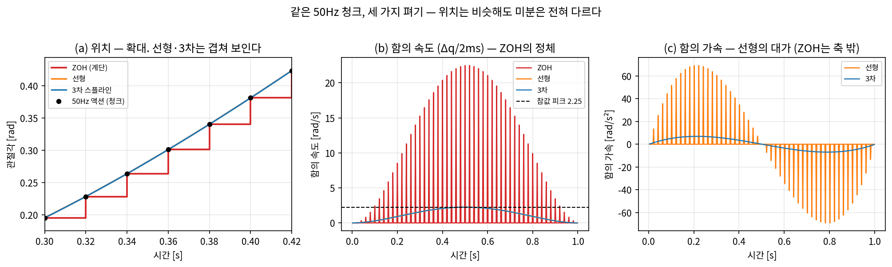
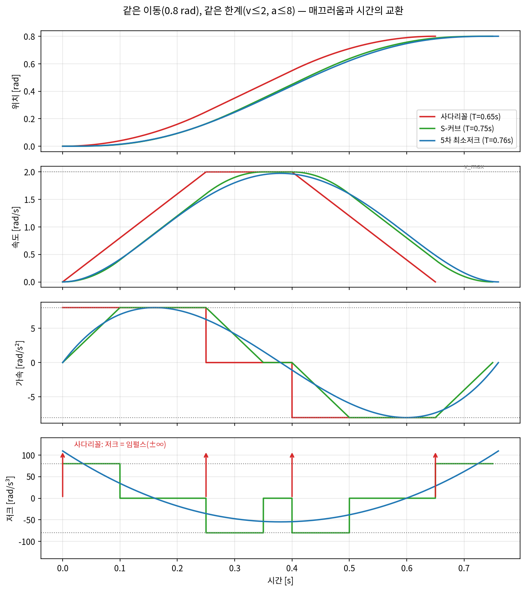
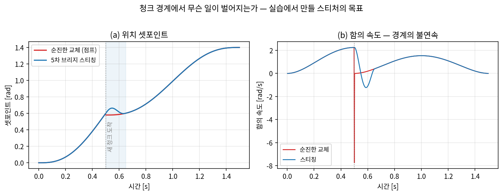

# Lec 08. 보간과 시간 파라미터화 — 학습 스택 아래에서 살아남는 최소 궤적론

> 하위제어 트랙 8일차 (Part R2 마지막). 선수 지식: 2강(회전 표현·지수/로그 사상), 3강(SE(3)), 4강(FK), 5강(자코비안), 7강(IK).
> **커리큘럼 방침 주의**: 이 강의는 MR Ch.9(궤적 생성)·Ch.10(모션 플래닝)을 참조하지 않는다. RRT류 모션 플래닝과 본격 궤적 계획이 맡던 층은 이 커리큘럼에서 **학습 정책(VLA)이 대체**한다고 본다(AI·VLA 파트 Part 4~5가 그 이야기다). 남는 것은 정책 출력(수십 Hz 액션 청크)과 제어기 입력(수백 Hz~kHz 셋포인트) 사이의 얇은 **보간 계층**이고, 오늘은 그것만 배운다. 표준 교과 내용(다항식·사다리꼴)의 전거는 Craig[1]와 Tedrake[2]다.

## 한 장 요약



VLA가 내놓은 50Hz 액션 청크(검은 점)를 500Hz 제어기가 먹을 셋포인트로 펴는 세 가지 방법. (a) 위치만 보면 선형과 3차는 구분도 안 된다. (b) 그러나 셋포인트가 **함의하는 속도**를 보면 ZOH(그대로 유지)는 참값 2.25 rad/s의 10배인 22.5 rad/s짜리 스파이크 열차다. (c) 함의 가속에서는 선형조차 참값 6.9 rad/s²의 10배(69 rad/s²)를 요구한다 — 3차만 참값에 붙는다. **기계는 위치가 아니라 미분을 느낀다.** 오늘 강의는 이 세 곡선의 차이를 만들고, 재고, 없애는 법이다.

## 학습 목표

1. 경로(path)와 궤적(trajectory)을 구분하고, 시간 파라미터화 $s(t)$가 왜 별도의 설계 변수인지 설명할 수 있다.
2. 3차/5차 다항식 보간의 계수를 경계조건 선형계에서 유도하고, rest-to-rest 5차의 계수·피크 속도/가속/저크를 손으로 계산할 수 있다.
3. 사다리꼴/S-커브 속도 프로파일의 도달 시간을 손으로 계산하고, "저크 제한의 대가 = $a/j$"를 유도할 수 있다.
4. 관절공간 vs 작업공간 보간의 트레이드오프를 말하고, SE(3) 보간을 (위치 lerp + 회전 slerp)로 올바르게 구현할 수 있다 — 성분별 보간이 왜 틀리는지 포함.
5. 이전 청크의 끝 속도와 연속이 되도록 새 액션 청크를 이어붙이는 스티처(stitcher)를 구현할 수 있다.

## 왜 이 강의가 필요한가

50강의 제어 계층 그림을 떠올리자: VLA는 1~50Hz로 액션을 내고, 관절 제어기는 100Hz~1kHz로 돌고, 그 아래 전류 루프는 수십 kHz다. 정책과 제어기 사이의 주파수 갭 — 예컨대 50Hz 청크와 500Hz 서보 사이의 10배 — 을 누군가 메워야 한다. 이것이 50강에서 "보간/IK/필터 계층"이라 불렀던 층이고, LeRobot의 async inference 문서[5]가 "정책이 청크를 보내면 로봇 쪽에서 펴서 실행한다"고 할 때의 그 "펴기"다.

"그냥 마지막 액션을 유지(ZOH)하면 되지 않나?"가 딥러닝 배경자의 자연스러운 첫 답이다. 한 장 요약이 그 답의 비용을 보여준다: 위치 셋포인트의 계단 하나하나가 제어기에게는 **속도 스파이크 명령**이다. 실물 제어기는 이걸 관용하지 않는다 — Franka의 1kHz 인터페이스는 수신한 명령 열의 속도·가속·**저크**까지 검사해서 한계를 넘으면 명령을 거부한다[8]. 7강 마지막에 봤던 "뉴턴 스텝이 57 rad 튀는" IK 출력이 그대로 관절 명령이 되면 안 되는 것과 같은 이유로, 학습 정책의 출력도 날것으로는 제어기에 못 들어간다.

고전 로봇공학은 이 주제로 교과서 몇 장을 쓴다: 최적 시간 궤적, via-point 스플라인, 동역학 제약 시간 스케일링, 그리고 그 위의 모션 플래닝. 우리는 그 층 대부분을 배우지 않는다 — **"어디로 어떻게 움직일까"는 학습 정책이 답하는 시대**라는 것이 이 커리큘럼의 방침이고, 실제로 AI·VLA 파트의 어떤 VLA도 RRT를 부르지 않는다. 그러나 정책이 아무리 좋아져도 주파수 갭과 미분 연속성 요구는 물리와 통신이 만드는 제약이라 사라지지 않는다. 오늘 배우는 것은 그 살아남은 최소한이다: 다항식 하나, 속도 프로파일 하나, 회전 보간 하나, 그리고 청크 경계를 잇는 법.

## 본문

### 0. 지형: 궤적론에서 무엇이 죽고 무엇이 살아남았나


고전 스택에서 플래너와 궤적 계획이 하던 일("어디로, 얼마나 빨리")은 학습 정책이 흡수했다. 그러나 그림 오른쪽 절반 — 청크를 잇고, 펴고, 제어기에 먹이는 층 — 은 그대로 남았다. 이 층이 오늘의 전부다. 관절 제어기부터 아래는 Part R4~R5에서 다룬다.

### 1. 경로 vs 궤적 — 시간 파라미터화라는 분리

**경로(path)**는 기하다: 시작 구성 $q_0$에서 끝 구성 $q_f$까지 지나는 점들의 집합, 매개변수로 쓰면 $q(s)$, $s \in [0,1]$. **궤적(trajectory)**은 경로에 시계를 단 것이다: $s(t)$, $t \in [0,T]$를 정하면 $q(t) = q(s(t))$가 된다. 이 분리가 중요한 이유는 두 질문이 독립적으로 설계 가능하기 때문이다:

- **어느 공간에서 어떤 모양으로 갈 것인가** (경로) — 가장 단순한 답: 직선 $q(s) = q_0 + s\,(q_f - q_0)$. 어느 공간의 직선인지(관절공간? 작업공간?)는 §4에서.
- **$s$를 시간의 어떤 함수로 올릴 것인가** (시간 파라미터화, time scaling) — $s(t)$의 매끄러움이 곧 궤적의 매끄러움이다. $\dot q = \dot s\,(q_f - q_0)$이므로 $s(t)$의 미분 불연속은 그대로 속도 불연속이 된다.

학습 스택에서의 번역: VLA 청크는 "경로+타이밍이 이미 섞인" 이산 표본이다. 보간 계층이 하는 일은 그 표본에서 연속 $q(t)$를 복원하는 것 — 즉 오늘의 도구들은 청크라는 이산 신호의 **재구성 필터**다.

### 2. 핵심 수식 E1 — 다항식 보간: 경계조건 수 = 계수 수

**직관**: "출발할 때와 도착할 때 어떤 상태이고 싶은가"를 나열하면, 그 개수만큼의 계수를 가진 다항식이 유일하게 결정된다. 위치 2개만 맞추면 1차(선형), 속도까지 4개면 3차, 가속까지 6개면 5차(quintic).

**물리·기하적 의미**: 몇 계 도함수까지 경계에서 제어하느냐가 **세그먼트를 이어붙일 때 제어기에 전달되는 충격의 등급**을 정한다. 선형끼리 이으면 속도가 점프하고(C⁰), 3차끼리 이으면 속도는 이어지지만 가속이 점프하며(C¹), 5차는 가속까지 잇는다(C²). 가속 점프는 곧 토크 스텝($\tau = M\ddot q + \cdots$, 10강에서 다룬다)이므로, "몇 차를 쓰나"는 수학 취향이 아니라 기계에 가할 충격의 사양이다.

**형식**: $q(t) = \sum_{k=0}^{5} a_k t^k$에 경계조건 6개를 부과하면 선형계가 된다:

$$
\begin{bmatrix} 1 & 0 & 0 & 0 & 0 & 0 \\ 0 & 1 & 0 & 0 & 0 & 0 \\ 0 & 0 & 2 & 0 & 0 & 0 \\ 1 & T & T^2 & T^3 & T^4 & T^5 \\ 0 & 1 & 2T & 3T^2 & 4T^3 & 5T^4 \\ 0 & 0 & 2 & 6T & 12T^2 & 20T^3 \end{bmatrix}
\begin{bmatrix} a_0 \\ a_1 \\ a_2 \\ a_3 \\ a_4 \\ a_5 \end{bmatrix}
=
\begin{bmatrix} q_0 \\ \dot q_0 \\ \ddot q_0 \\ q_T \\ \dot q_T \\ \ddot q_T \end{bmatrix}
$$

행 1~3은 $t=0$에서의 위치·속도·가속, 행 4~6은 $t=T$에서의 같은 양이다. 정지→정지(rest-to-rest, $\dot q = \ddot q = 0$ 양끝) 특수해는 닫힌 형태가 있다. $\Delta = q_T - q_0$, $\tau = t/T$로 두면

$$
q(t) = q_0 + \Delta\,\underbrace{(10\tau^3 - 15\tau^4 + 6\tau^5)}_{s(\tau)},\qquad
|\dot q|_{\max} = \frac{15\,\Delta}{8\,T},\quad
|\ddot q|_{\max} = \frac{10\,\Delta}{\sqrt{3}\,T^2},\quad
|\dddot q|_{\max} = \frac{60\,\Delta}{T^3}
$$

이 "10-15-6" 형상은 저크 제곱 적분 $\int \dddot q^2 dt$를 최소화하는 **최소저크(minimum-jerk) 궤적**이기도 하다 — Flash & Hogan이 인간 팔의 reaching 운동이 바로 이 모양임을 보인 고전이 있다[3]. 시연 데이터로 배우는 정책이 내놓는 청크가 대체로 부드러운 이유의 한 뿌리다. 3차(cubic)는 같은 방식으로 4×4 계가 되고 rest-to-rest 해는 $s(\tau) = 3\tau^2 - 2\tau^3$인데, 끝점 가속이 $\pm 6\Delta/T^2 \neq 0$이라 세그먼트를 이어붙이면 가속이 점프한다 — 청크 스티칭에 5차를 쓰는 이유다.

### 3. 핵심 수식 E2 — 사다리꼴과 S-커브: 시간과 매끄러움의 교환

**직관**: 최대한 빨리 가려면 "최대 가속으로 밟고 → 최대 속도로 순항하고 → 최대 감속으로 세운다". 속도 그래프가 사다리꼴이 된다. 저크(가속의 변화율)까지 제한하면 사다리꼴의 모서리가 둥글려져 S-커브가 된다.

**물리·기하적 의미**: 속도 곡선 아래 면적이 이동 거리 $L$이다. $|\dot q| \le v$, $|\ddot q| \le a$ 제약 아래 면적 $L$을 최단 시간에 채우려면 **곡선이 항상 어느 한 한계에 붙어 있어야** 한다 — 그래서 사다리꼴은 (한계쌍 $v, a$에 대해) 시간 최적이다. 대가는 가속의 불연속: 모서리마다 가속이 $0 \leftrightarrow \pm a$로 점프하므로 저크는 임펄스(±∞)다. 토크가 계단으로 튀며 구조 진동을 두드린다. S-커브는 저크를 $|\dddot q| \le j$로 묶어 그 임펄스를 유한한 램프로 바꾼 것이다.

**형식**: 순항 구간이 존재할 때(사다리꼴: $L \ge v^2/a$, S-커브: 추가로 $v \ge a^2/j$ 및 $L \ge v(v/a + a/j)$),

$$
T_{\text{사다리꼴}} = \frac{L}{v} + \frac{v}{a}, \qquad
T_{\text{S-커브}} = \frac{L}{v} + \frac{v}{a} + \frac{a}{j}
$$

유도 요점(면적 논증): 가속·감속 삼각형이 잘라먹는 면적을 순항으로 보상하면 총 시간에 $v/a$가 더해지고, 저크 램프가 가속 사다리꼴을 다시 둥글리면 같은 논리로 $a/j$가 한 번 더 더해진다. **각 한계가 정확히 한 항씩 시간을 청구한다** — $L/v$는 속도 한계의, $v/a$는 가속 한계의, $a/j$는 저크 한계의 값이다. 저크 제한의 대가가 $a/j$라는 이 관계가 "S-커브 파라미터를 얼마로 두나"라는 실무 질문의 답을 준다: 진동 억제로 버는 정착 시간이 $a/j$보다 크면 이득이다.



같은 이동(0.8 rad), 같은 한계($v \le 2$, $a \le 8$)에서 사다리꼴(0.65s) < S-커브(0.75s) < 5차(0.76s) 순으로 느려진다. 아래 저크 행이 대가의 정체를 보여준다: 사다리꼴은 ±∞ 임펄스, S-커브는 ±80으로 유계, 5차는 연속이지만 끝점에서 109 rad/s³ — **5차는 저크를 "직접" 제한하지 못한다**(끝점 저크 $60\Delta/T^3$은 $T$를 늘려야만 줄어든다). 5차가 S-커브보다 느린 이유도 같은 그림에 있다: 5차의 속도·가속은 한계에 순간만 닿고 대부분의 시간을 한계 아래서 보낸다.

### 4. 핵심 수식 E3 — SE(3) 보간: 위치는 lerp, 회전은 slerp

**직관**: 위치는 벡터공간에 살므로 성분별 직선 보간(lerp)이 된다. 회전은 아니다 — 2강에서 봤듯 SO(3)는 휘어진 다양체이고, 회전행렬을 성분별로 평균 내면 회전행렬이 아닌 것이 나온다.

**물리·기하적 의미**: 올바른 회전 보간은 SO(3) 위의 **측지선**을 따라가는 것 — 시작 자세에서 끝 자세로 가는 **단일 고정축 회전**(2강의 축-각)을 일정한 각속도로 도는 것이다. 이것이 slerp(spherical linear interpolation)[4]다. 2강의 지수·로그 사상으로 쓰면 구조가 투명하다: 두 자세의 "차이 회전"을 로그로 축-각 벡터로 내리고, 그 벡터를 $s$배 해서 지수로 되올린다.

**형식**: $R_0, R_1 \in SO(3)$, $s \in [0,1]$에 대해

$$
R(s) = R_0 \, \exp\!\big(s \log(R_0^{\top} R_1)\big),
\qquad \text{쿼터니언으로: } \mathrm{slerp}(p, q; s) = \frac{\sin((1-s)\theta)}{\sin\theta}\,p + \frac{\sin(s\theta)}{\sin\theta}\,q
$$

($\cos\theta = \langle p, q \rangle$, 그리고 $\langle p, q \rangle < 0$이면 $q \to -q$로 뒤집는다 — 2강의 double cover 문제. 뒤집지 않으면 "먼 길로 도는" 보간이 나온다.) SE(3) 포즈 보간은 위치 lerp + 회전 slerp의 병렬 실행이 표준 레시피이고, Tedrake의 pick-and-place 예제가 정확히 이 조합으로 그리퍼 궤적을 만든다[2].

성분별 보간이 얼마나 틀리는지는 코드 두 줄로 보인다:

```python
import numpy as np
from scipy.spatial.transform import Rotation as R, Slerp

# 성분별 보간의 실패: I 와 Rz(179°)의 "중간"을 행렬 성분 평균으로
R0, R1 = np.eye(3), R.from_euler('z', 179, degrees=True).as_matrix()
M = 0.5*(R0 + R1)
print(f"성분별 평균의 행렬식 det = {np.linalg.det(M):.6f}")   # → 0.000076 (회전이면 1)

# slerp: 측지선 보간 — 각속도가 일정하다
sl = Slerp([0, 1], R.from_euler('z', [0, 179], degrees=True))
angles = sl(np.linspace(0, 1, 11)).as_euler('zyx', degrees=True)[:, 0]
print(np.round(np.diff(angles), 1))                            # → 모두 17.9°
```

거의 반대 방향인 두 자세의 성분별 "중간"은 행렬식 0.000076짜리 — 강체를 거의 납작하게 뭉개는 — 변환이다. slerp는 매 스텝 정확히 17.9°씩 돈다.

**어느 공간에서 보간할 것인가.** 같은 두 구성 사이라도 보간하는 공간에 따라 다른 운동이 나온다:

| | 관절공간 보간 | 작업공간(SE(3)) 보간 |
|---|---|---|
| EEF 경로 | 곡선 (FK가 직선을 구부림, 4강) | 직선 + slerp — 예측 가능 |
| IK 호출 | 끝점에서 1회 | **매 셋포인트마다** (7강) |
| 특이점 | 안전 (관절 좌표는 항상 유효) | 경로가 특이점 근처를 지나면 관절 속도 폭발 (6강) |
| 다해성 | 없음 | IK 가지(elbow-up/down)가 도중에 바뀌면 점프 (7강) |
| 쓰는 곳 | π0·ACT류 관절공간 액션, 큰 재배치 이동 | ΔEEF 액션(RT-2·OpenVLA류), 직선성이 중요한 삽입·용접 |

VLA 파이프라인과의 연결(50강): 액션이 관절공간이면 보간도 관절공간에서 끝나고, ΔEEF면 작업공간 보간(lerp+slerp) 후 매 셋포인트를 IK로 내린다 — 7강에서 배운 DLS가 이 안쪽 루프에서 돈다.

### 5. Worked Example

#### WE-1 (손 + 코드): 5차 다항식 계수

**문제**: 관절을 $q_0 = 0.2$ rad에서 $q_T = 1.0$ rad로 $T = 0.5$ s에 정지→정지로 옮기는 5차 다항식을 구하라.

**손계산**: rest-to-rest이므로 닫힌형을 쓴다. $\Delta = 0.8$, $s(\tau) = 10\tau^3 - 15\tau^4 + 6\tau^5$를 $t = T\tau$로 되돌리면 $a_0 = q_0 = 0.2$, $a_1 = a_2 = 0$, 그리고

$$
a_3 = \frac{10\Delta}{T^3} = \frac{8}{0.125} = 64,\qquad
a_4 = -\frac{15\Delta}{T^4} = -\frac{12}{0.0625} = -192,\qquad
a_5 = \frac{6\Delta}{T^5} = \frac{4.8}{0.03125} = 153.6
$$

피크들: $|\dot q|_{\max} = \frac{15 \times 0.8}{8 \times 0.5} = 3.0$ rad/s (중앙 $t = T/2$에서), $|\ddot q|_{\max} = \frac{10 \times 0.8}{\sqrt{3} \times 0.25} = 18.48$ rad/s², $|\dddot q|_{\max} = \frac{60 \times 0.8}{0.125} = 384$ rad/s³ (양 끝점에서).

**검증 코드** (경계조건 → 선형계 풀이의 일반형 — 스티처에서 재사용한다):

```python
import numpy as np
T, q0, qf = 0.5, 0.2, 1.0
A = np.array([[1, 0, 0,    0,       0,        0],       # q(0)
              [0, 1, 0,    0,       0,        0],       # dq(0)
              [0, 0, 2,    0,       0,        0],       # ddq(0)
              [1, T, T**2, T**3,    T**4,     T**5],    # q(T)
              [0, 1, 2*T,  3*T**2,  4*T**3,   5*T**4],  # dq(T)
              [0, 0, 2,    6*T,     12*T**2,  20*T**3]])# ddq(T)
a = np.linalg.solve(A, np.array([q0, 0, 0, qf, 0, 0]))
print("a0..a5 =", np.round(a, 4))
t = np.linspace(0, T, 200001)
qd   = sum(k*a[k]*t**(k-1) for k in range(1, 6))
qdd  = sum(k*(k-1)*a[k]*t**(k-2) for k in range(2, 6))
qddd = sum(k*(k-1)*(k-2)*a[k]*t**(k-3) for k in range(3, 6))
print(f"피크 {abs(qd).max():.4f} / {abs(qdd).max():.4f} / {abs(qddd).max():.1f}")
```

출력: `a0..a5 = [0.2, 0., 0., 64., -192., 153.6]`, 피크 3.0000 / 18.4752 / 384.0 — 손계산과 일치.

#### WE-2 (손 + 코드): 사다리꼴 vs S-커브 도달 시간

**문제**: $L = 0.8$ rad을 $v = 2$ rad/s, $a = 8$ rad/s² 한계로 옮긴다. (i) 사다리꼴 총 시간, (ii) 저크 한계 $j = 80$ rad/s³를 추가한 S-커브 총 시간.

**손계산**: 존재 조건 확인 — $L = 0.8 \ge v^2/a = 0.5$ ✓ (사다리꼴 순항 존재), $v = 2 \ge a^2/j = 0.8$ ✓ (가속 한계 도달), $L = 0.8 \ge v(v/a + a/j) = 0.7$ ✓ (S-커브 순항 존재).

- 사다리꼴: $t_a = v/a = 0.25$ s, 순항 $t_c = L/v - v/a = 0.4 - 0.25 = 0.15$ s → $T = 2(0.25) + 0.15 = \mathbf{0.65}$ s. (공식으로: $L/v + v/a = 0.4 + 0.25 = 0.65$ ✓)
- S-커브: $T = L/v + v/a + a/j = 0.4 + 0.25 + 0.1 = \mathbf{0.75}$ s. 저크 제한의 대가 = $a/j = 0.1$ s.

**검증 코드** (공식이 아니라 **저크를 그대로 수치 적분**해서 끝위치가 $L$이 되는지 본다):

```python
import numpy as np
L, v, a, j = 0.8, 2.0, 8.0, 80.0
t_j = a/j; t_c2 = (L - v*(v/a + t_j))/v          # S-커브 순항 시간
dt = 1e-6
segs = [(+j, t_j), (0, v/a - t_j), (-j, t_j), (0, t_c2),
        (-j, t_j), (0, v/a - t_j), (+j, t_j)]     # 7세그먼트 저크 프로파일
jerk = np.concatenate([np.full(int(round(d/dt)), jv) for jv, d in segs])
acc = np.cumsum(jerk)*dt; vel = np.cumsum(acc)*dt; pos = np.cumsum(vel)*dt
print(f"총 시간 {len(jerk)*dt:.3f}s, 끝위치 {pos[-1]:.4f}, "
      f"피크 속도 {vel.max():.4f}, 피크 가속 {acc.max():.4f}")
```

출력: `총 시간 0.750s, 끝위치 0.8000, 피크 속도 2.0000, 피크 가속 8.0000` — 손계산 0.75 s와 일치하고, 속도·가속이 정확히 한계에 닿는다. fig2가 이 두 프로파일(+같은 제약을 만족하는 5차, $T = 0.76$ s)의 4단 플롯이다.

#### WE-3 (코드): 50개 액션 청크(50Hz)를 500Hz 셋포인트로 펴기

한 장 요약(fig1)을 만든 실험. "참" 운동은 최소저크 $0 \to 1.2$ rad, 1초(E1의 10-15-6 형상)이고, 정책은 이것을 50Hz로 표본한 청크 50개를 내놓았다고 하자. 이를 500Hz로 펴는 세 가지:

```python
import numpy as np
from scipy.interpolate import CubicSpline
s = lambda tau: 10*tau**3 - 15*tau**4 + 6*tau**5
t50 = np.linspace(0, 1, 51); q50 = 1.2*s(t50)     # 시작 상태 + 50개 액션
t500 = np.arange(0, 1, 0.002)                     # 500Hz 셋포인트 시각
zoh = q50[np.searchsorted(t50, t500, side='right') - 1]
lin = np.interp(t500, t50, q50)
cub = CubicSpline(t50, q50)(t500)
for name, q in [("ZOH", zoh), ("선형", lin), ("3차", cub)]:
    v = np.diff(q)/0.002; acc = np.diff(v)/0.002
    print(name, np.abs(np.diff(q)).max()*1000, np.abs(v).max(), np.abs(acc).max())
```

| 펴기 | 최대 셋포인트 스텝 | 함의 속도 피크 | 함의 가속 피크 |
|---|---|---|---|
| 참값 (연속 운동) | — | 2.25 rad/s | 6.9 rad/s² |
| ZOH | 44.95 mrad | **22.48 rad/s** | 11238 rad/s² |
| 선형 | 4.50 mrad | 2.25 rad/s | **69.1 rad/s²** |
| 3차 스플라인 | 4.50 mrad | 2.25 rad/s | 6.9 rad/s² |

읽는 법: ZOH의 함의 속도 피크는 참값의 정확히 **업샘플 비율(500/50 = 10)배**다 — 20 ms 동안 갈 거리를 2 ms에 가라는 명령이기 때문. 선형은 속도는 살리지만 knot마다 속도가 꺾여 가속이 10배로 튄다(같은 산수). 3차에 와서야 세 줄이 모두 참값과 일치한다. 이것이 "보간 계층은 몇 차로 할 것인가"의 정량적 답이다: **제어기가 몇 계 미분까지 느끼는 층이냐에 따라** — 속도 제어면 선형까지, 토크 제어(가속 개입)면 3차 이상.

### 딥러닝 배경자를 위한 번역

- **보간 = 시간축 업샘플링이다.** ZOH ↔ nearest-neighbor, 선형 ↔ bilinear, 3차 ↔ bicubic — 이미지 업샘플링에서 nearest가 블록 아티팩트를 만들 듯, ZOH는 속도 스파이크라는 시간축 아티팩트를 만든다. WE-3의 표는 super-resolution의 PSNR 표와 같은 구조다.
- **10-15-6은 이미 아는 함수다** — 그래픽스/셰이더의 `smootherstep`과 동일한 다항식. 부드러운 게이팅/스케줄(warmup-decay 커브)을 손으로 그려본 적이 있다면 최소저크 형상을 이미 쓴 것이다.
- **저크 제한 = 출력 평활화 정칙화.** $\int \dddot q^2 dt$를 누르는 것은 출력의 고주파를 벌하는 정칙화 항이고, S-커브의 $j$는 그 정칙화 세기다. 과하면 오버스무딩 — $a/j$만큼 느려지고(E2), 정책이 의도한 날쌘 동작이 뭉개진다. bias를 사서 variance(진동)를 줄이는 거래다.
- **temporal ensembling(38강)과 혼동 말 것.** ACT의 temporal ensembling[7]은 겹치는 여러 청크의 **예측을 가중 평균**하는 정책 층의 평활화이고, 오늘의 보간은 확정된 셋포인트 열을 시간축에서 펴는 제어 층의 평활화다. 층이 다르고, 둘 다 쓸 수 있다.

## 흔한 오해

1. **"보간은 사소한 후처리다 — 정책이 좋으면 필요 없다."** 아무리 완벽한 50Hz 청크도 500Hz 제어기 앞에서는 이산 신호다. WE-3에서 봤듯 참 운동을 완벽히 표본한 청크조차 ZOH로 펴면 10배 속도 스파이크가 된다 — 문제는 정책 품질이 아니라 **표본화 정리**다. 실물 스택(Franka 1kHz[8], UR 500Hz)이 보간 계층 없이 도는 경우는 없다.
2. **"포즈는 6개 숫자니까 성분별로 보간하면 된다."** 위치 3개는 된다. 회전 3개(오일러각)나 9개(행렬 성분)는 안 된다 — E3에서 성분별 평균의 행렬식이 0.000076까지 무너지는 걸 봤다. 2강에서 "회전은 벡터공간이 아니다"라고 배운 것의 실무 청구서가 바로 보간에서 날아온다. 쿼터니언도 lerp 후 정규화는 등각속도가 깨지고, 부호 정렬 없는 slerp는 먼 길로 돈다.
3. **"속도만 연속이면 충분하다."** 토크 제어 로봇에서 가속 불연속은 토크 스텝이고(fig2의 사다리꼴 모서리), 감속기·구조물의 공진을 두드린다 — 15강에서 다룰 백래시·강성 문제와 직결된다. 반대 극단도 오해다: 무한히 매끄럽게 만들수록 좋은 게 아니라 **$a/j$씩 시간을 지불**한다(E2). 몇 계까지 연속으로 할지는 아래층 하드웨어(14~16강)가 정하는 사양이다.
4. **"청크 안쪽만 부드러우면 된다."** 실전의 불연속은 대부분 **청크 경계**에서 온다: 새 청크는 낡은 관측으로 계산되어 현재 상태와 어긋난 채 도착한다(fig3). 50강의 Real-Time Chunking[6]과 LeRobot async[5]가 정확히 이 문제를 다루는 장치이고, 오늘 실습이 그 미니어처다.

## 실습 (1.5~2시간): 청크 스티처 구현



시나리오: 로봇이 청크 A(최소저크 $0 \to 1.2$ rad, 1초)를 실행 중이다. $t = 0.5$ s에 새 청크 B가 도착하는데, 낡은 관측 기반이라 $q = 0.58$에서 **정지 출발**로 계산되어 있다(실제 로봇은 $q = 0.6$, $\dot q = 2.25$ rad/s로 움직이는 중). 순진하게 갈아타면 위치가 점프하고 속도 명령이 2.25 → 0으로 무너진다. 스티처의 일: 현재 (위치, 속도)에서 새 청크 위의 한 점 (위치, 속도, 가속)으로 가는 **5차 브리지**를 깔아 C² 연속으로 갈아탄다.

1. **(20분) 재료 준비**: WE-1의 경계조건 선형계를 일반화한 `quintic_coeffs`와, 최소저크 청크 생성기를 만든다.

```python
import numpy as np

def quintic_coeffs(T, q0, v0, a0, qT, vT, aT):
    A = np.array([[1,0,0,0,0,0], [0,1,0,0,0,0], [0,0,2,0,0,0],
                  [1,T,T**2,T**3,T**4,T**5],
                  [0,1,2*T,3*T**2,4*T**3,5*T**4],
                  [0,0,2,6*T,12*T**2,20*T**3]])
    return np.linalg.solve(A, np.array([q0,v0,a0,qT,vT,aT]))

def minjerk_chunk(q0, qf, T):
    """t ↦ (q, dq, ddq) — 청크의 연속 보간기 (E1의 10-15-6)"""
    D = qf - q0
    def f(t):
        tau = np.clip(t/T, 0, 1)
        return (q0 + D*(10*tau**3 - 15*tau**4 + 6*tau**5),
                D*(30*tau**2 - 60*tau**3 + 30*tau**4)/T,
                D*(60*tau - 180*tau**2 + 120*tau**3)/T**2)
    return f
```

2. **(20분) 문제 재현**: 청크 A를 500Hz로 실행하다 $t = 0.5$에서 청크 B(`minjerk_chunk(0.58, 1.4, 1.0)`)로 순진하게 교체하고, 함의 속도(2 ms 유한차분)를 플롯하라. 경계에서 함의 속도 점프 최대 **10.0 rad/s**가 나와야 한다(위치 점프 −15.5 mrad + 속도 붕괴 2.25→0의 합작).

3. **(40분) 스티처 구현**: 다음 함수를 완성하라.

```python
def stitch(q_now, v_now, a_now, chunk, t_bridge):
    """chunk: 도착한 새 청크의 보간기 (t=0이 도착 시각).
    반환: t ↦ q — t < t_bridge는 5차 브리지, 이후는 새 청크."""
    qT, vT, aT = chunk(t_bridge)
    c = quintic_coeffs(t_bridge, q_now, v_now, a_now, qT, vT, aT)
    def setpoint(t):
        if t < t_bridge:
            return sum(c[k]*t**k for k in range(6))
        return chunk(t)[0]
    return setpoint
```

   `t_bridge = 0.15` s로 위 시나리오에 적용하면 브리지 경계값은 $(0.6,\ 2.25,\ 0) \to (0.6018,\ 0.3999,\ \cdot)$이고, 함의 속도 점프 최대가 10.0 → **0.125 rad/s**로 떨어져야 한다(80배 개선). fig3이 목표 상태다.

4. **(20분) 브리지 길이 스윕**: $t_{\text{bridge}} \in \{0.05, 0.1, 0.15, 0.3\}$로 바꿔가며 (i) 함의 속도·가속 피크, (ii) 위치 오버슛을 기록하라. fig3에서 보이듯 브리지는 $q = 0.66$까지 **오버슛한 뒤 되돌아온다** — 2.25 rad/s의 운동량을 정지 근처의 청크에 잇는 데는 감속 거리가 필요하기 때문이다. 짧은 브리지 = 급감속(가속 피크↑), 긴 브리지 = 새 청크 반영 지연. 이 트레이드오프가 50강 Real-Time Chunking[6]이 "실행 중 프리픽스는 고정하고 뒷부분만 다시 생성"이라는 다른 해법을 택한 이유다.
5. **(심화, 20분) MuJoCo 검증**: 1강 실습의 `arm3r.xml`에서 관절 하나에 PD 제어(`d.ctrl` 대신 `qfrc_applied`에 $k_p(q_{\text{ref}} - q) - k_d \dot q$)로 순진한 교체 vs 스티칭 셋포인트를 각각 추종시키고, 인가 토크의 피크를 비교하라. 셋포인트의 불연속이 토크 스파이크로 번역되는 것을 눈으로 확인하는 것이 목표다.

## Claude와 토론할 질문

1. 보간 계층은 왜 학습으로 대체되지 않았을까? Helix 02의 S0(1kHz 정책, 48강)처럼 정책 자체가 kHz로 돌면 이 강의는 불필요해지는가 — 아니면 문제가 한 층 아래로 이동할 뿐인가?
2. ZOH의 22.5 rad/s 속도 스파이크는 실제 로봇에서 "그대로" 실행되지 않는다. 어느 층(제어기 게인, 모터 토크 한계, 감속기 관성)이 이를 걸러내며, 그 필터링의 대가는 무엇인가? (14~17강의 예고편)
3. 저크 제한은 항상 $a/j$만큼 시간을 지불한다. 그런데도 산업 로봇 제어기가 예외 없이 S-커브를 쓰는 이유를 감속기 수명·반복 정밀도·정착 시간 관점에서 논하라.
4. temporal ensembling(38강)과 오늘의 스티처는 각각 무엇을 평균/보간하는가? 정책이 다봉 분포(39강)를 낼 때 둘 중 어느 쪽이 "두 모드의 평균"이라는 함정에 빠질 수 있는가?
5. 작업공간 직선 보간이 6강의 특이점 근처를 지나는 2R 시나리오를 구성하고, 같은 두 끝점을 관절공간에서 보간하면 무엇이 좋아지고 무엇이 나빠지는지 말하라.
6. 인간 시연이 대체로 최소저크(Flash-Hogan[3])라면, 시연으로 배운 정책의 청크도 이미 부드러울 것이다. 그럼에도 보간·스티칭 계층이 필요한 이유를 "청크 내부"와 "청크 경계"로 나눠 논증하라.
7. LeRobot async inference[5]에서 네트워크 지연으로 청크가 예정보다 늦게 도착하면, 스티처가 구제할 수 있는 것과 없는 것은 각각 무엇인가? (힌트: 실습 4단계의 트레이드오프)

## 읽을거리

1. **Craig, "Introduction to Robotics" Ch.7 (Trajectory Generation)**[1] (~1시간): 3차 다항식·via point·linear with parabolic blends(=사다리꼴)까지만. 직교공간 스킴의 자세 표현 논의는 2~3강을 마친 지금 비판적으로 읽을 수 있다.
2. **Tedrake, "Robotic Manipulation"의 Basic Pick and Place 장**[2] (~40분): lerp+slerp로 실제 그리퍼 궤적을 만드는 부분까지만 — 미분 IK 이후는 7강 복습이므로 훑기.
3. **LeRobot async inference 문서**[5] + **PI의 Real-Time Chunking 블로그**[6] (~30분): 오늘 실습의 실물 대응물. RTC의 "inpainting" 비유가 실습 4단계의 트레이드오프를 어떻게 우회하는지에 주목.

## 자가 점검

1. 5차 다항식의 경계조건 6개를 나열하고, rest-to-rest 닫힌형 계수($10\Delta/T^3$, $-15\Delta/T^4$, $6\Delta/T^5$)를 유도할 수 있는가?
2. 사다리꼴 프로파일의 총 시간 $L/v + v/a$와 순항 존재 조건 $L \ge v^2/a$를 면적 논증으로 설명할 수 있는가?
3. "저크 제한의 대가 = $a/j$"를 30초 안에 설명하고, WE-2의 수치(0.65 vs 0.75 s)로 예시할 수 있는가?
4. 회전을 성분별로 보간하면 안 되는 이유와, slerp가 보장하는 두 가지(SO(3) 유지, 등각속도)를 말할 수 있는가?
5. 움직이는 로봇에 새 청크를 잇는 5차 브리지의 경계조건 6개를 쓰고, 브리지 길이의 트레이드오프를 설명할 수 있는가?

## 참고문헌

> 웹 문서는 2026-07-08 접속 기준.

[1] J. J. Craig, "Introduction to Robotics: Mechanics and Control," 4th ed., Pearson, 2018.
— **뒷받침**: 다항식 보간(3차, 경계조건 접근)과 사다리꼴 프로파일(linear function with parabolic blends)의 표준 교과 전거 — E1·E2의 내용은 이 책 궤적 생성 장(3판 기준 Ch.7)의 범위다. MR Ch.9 대신 이 책을 전거로 쓴다(커리큘럼 방침).

[2] R. Tedrake, "Robotic Manipulation: Perception, Planning, and Control," 온라인 교과서. https://manipulation.csail.mit.edu/
— **뒷받침**: E3의 실무 레시피 — pick-and-place 궤적을 위치 선형 보간 + 쿼터니언 slerp로 구성하는 예제(Basic Pick and Place 장).

[3] T. Flash, N. Hogan, "The Coordination of Arm Movements: An Experimentally Confirmed Mathematical Model," Journal of Neuroscience, 5(7), 1985.
— **뒷받침**: 최소저크 궤적(E1의 10-15-6 형상)이 인간 reaching 운동을 기술한다는 원전 — 번역 박스·토론 질문 6의 근거.

[4] K. Shoemake, "Animating Rotation with Quaternion Curves," Proc. SIGGRAPH '85, 1985.
— **뒷받침**: slerp의 원전(E3의 쿼터니언 보간 공식).

[5] Hugging Face, "Asynchronous Inference" (LeRobot 문서). https://huggingface.co/docs/lerobot/en/async
— **뒷받침**: 정책 서버가 보낸 액션 청크를 로봇 클라이언트가 이어 실행하는 실무 구조 — "왜 이 강의가 필요한가"와 실습·토론 질문 7의 실물 대응물.

[6] Physical Intelligence, "Real-Time Chunking" (연구 블로그). https://www.pi.website/research/real_time_chunking
— **뒷받침**: 청크 경계 불연속 문제의 정식화와 실시간 이어붙이기 해법 — 흔한 오해 4, 실습 4단계의 논의 근거 (50강과 동일 출처).

[7] T. Zhao et al., "Learning Fine-Grained Bimanual Manipulation with Low-Cost Hardware" (ACT/ALOHA), arXiv:2304.13705, 2023.4. https://arxiv.org/abs/2304.13705
— **뒷받침**: temporal ensembling — 번역 박스와 토론 질문 4에서 보간과 구분해야 할 정책 층의 평활화.

[8] Franka Robotics, "Franka Control Interface (FCI) 문서 — libfranka interface specifications". https://frankarobotics.github.io/docs/
— **뒷받침**: 1kHz 명령 인터페이스가 명령 열의 속도·가속·저크 한계를 검사한다는 실무 근거("왜 이 강의가 필요한가") (50강·README와 동일 출처).

*본문·그림의 수치(WE-1 피크 3.0000/18.4752/384.0, WE-2 총 시간 0.65/0.75 s, WE-3 표, fig2의 T=0.65/0.75/0.76 s, 실습의 −15.5 mrad·10.0→0.125 rad/s·오버슛 0.66)는 모두 본문 코드와 `images/lec08/gen_figs.py`의 실행 출력이다 — numpy 1.26 기준 재현 확인.*

<!-- lecture-nav -->

---

⬅ 이전: [Lec 07. 역기구학 — 해석해, 수치해, 그리고 다해성](lec07-inverse-kinematics.md)　｜　[📖 전체 목차](../README.md)　｜　다음: [Lec 09. 동역학의 재료 — 질량, 관성텐서, 운동량](../part03-dynamics/lec09-dynamics-ingredients.md) ➡
