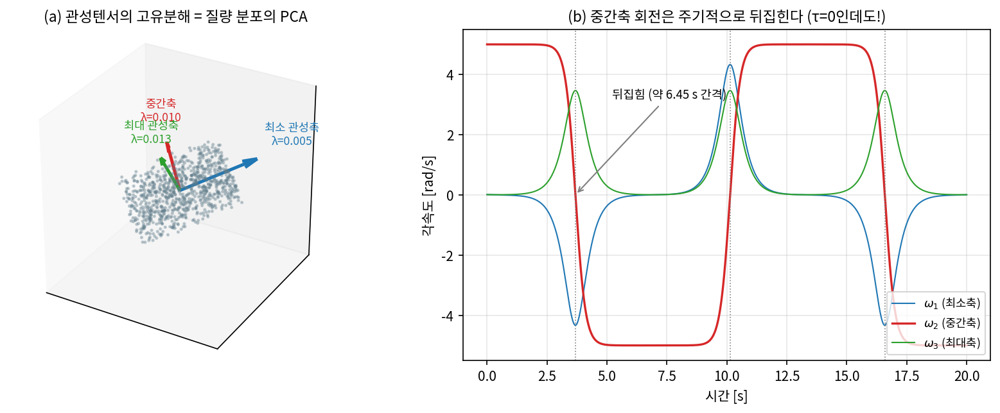
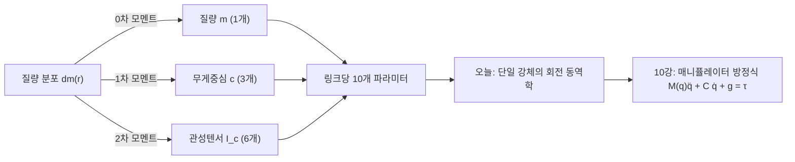
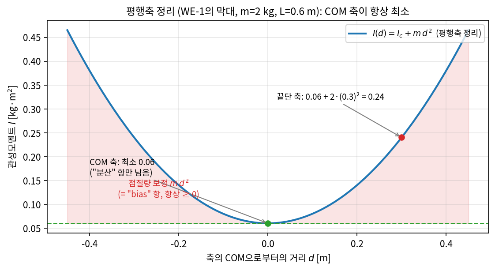
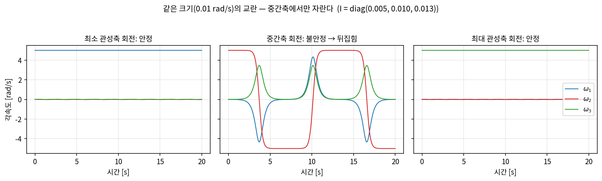
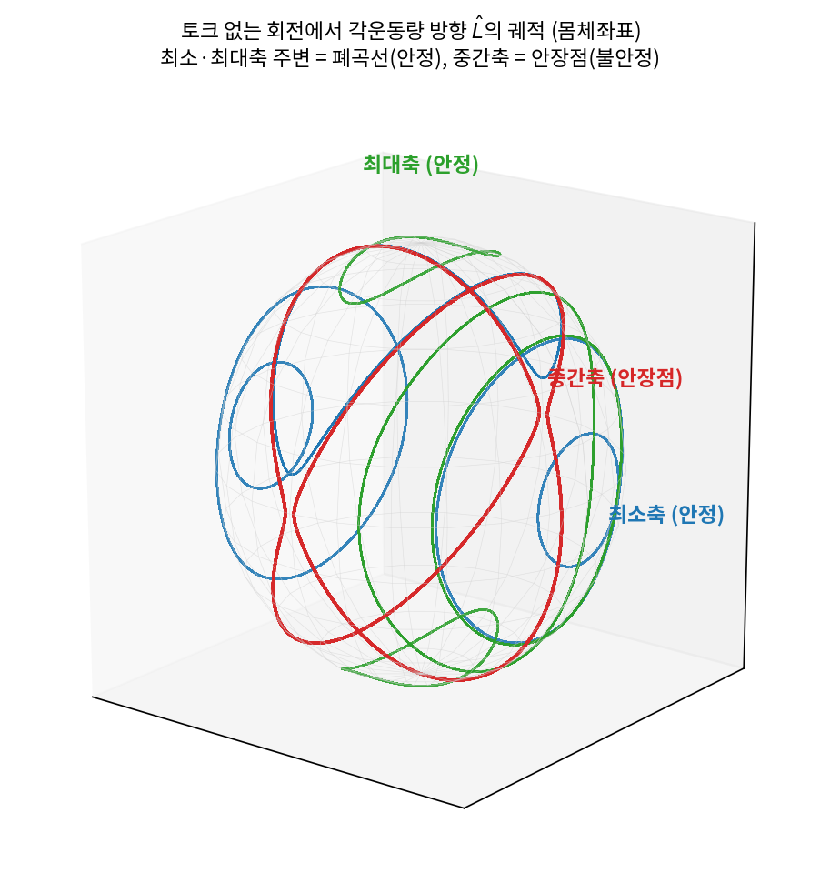

# Lec 09. 동역학의 재료 — 질량, 관성텐서, 운동량

> 하위제어 트랙 9일차 — Part R3(동역학)의 시작. 선수 지식: 2강(회전·SO(3)), 5강(자코비안·각속도).
> 기초 참고서: Modern Robotics(이하 MR) Ch.8 §8.2. 이 강의는 단일 강체의 회전 동역학을 딥러닝 배경자의 언어로 재구성한 것이다.

## 한 장 요약



왼쪽: 관성텐서는 질량 분포의 **2차 모멘트 행렬**이고, 그 고유분해는 점구름의 PCA와 같은 계산이다 — 고유벡터가 주축, 고유값이 주관성모멘트. 오른쪽: 토크가 **0인데도** 중간 관성축 둘레의 회전은 약 6.45초마다 뒤집힌다(Dzhanibekov 효과). 각운동량은 완벽히 보존되면서 일어나는 일이다. 오늘 강의가 끝나면 왼쪽 행렬 하나로 오른쪽 곡선 전체를 예측할 수 있게 된다.

## 학습 목표

1. 질량·무게중심·관성텐서·(선/각)운동량을 정의하고, 관성텐서를 질량 분포의 2차 모멘트(공분산과 동형)로 해석할 수 있다.
2. 균일 막대와 직육면체의 관성텐서를 손으로 계산하고 몬테카를로 코드로 검증할 수 있다.
3. 평행축 정리를 유도 요점과 함께 설명하고, "왜 COM 축이 항상 최소인가"를 분산 분해로 답할 수 있다.
4. 오일러 방정식 $I\dot\omega + \omega \times I\omega = \tau$를 유도 요점과 함께 쓰고, 중간축 불안정을 선형화로 예측한 뒤 `solve_ivp`로 재현할 수 있다.
5. URDF/MJCF의 `inertial` 태그를 읽고, 잘못된 관성값이 시뮬레이션 거동을 어떻게 바꾸는지 실험으로 보일 수 있다.

## 왜 이 강의가 필요한가

1~8강은 전부 **기하**였다 — 로봇이 "어떤 자세를 취할 수 있는가"(FK·IK)와 "속도가 어떻게 사상되는가"(자코비안)를 다뤘지만, 질량은 한 번도 등장하지 않았다. 그런데 실제 질문은 이렇다: 이 팔을 0.5초 안에 저기로 보내려면 **토크가 얼마나** 필요한가? 로봇을 밀면 **어떻게 반응**하는가? 이 질문에 답하는 것이 동역학이고, 10강에서 만날 매니퓰레이터 방정식 $M(q)\ddot q + C(q,\dot q)\dot q + g(q) = \tau$가 그 답의 형식이다.

오늘은 그 방정식의 **재료**를 준비한다. 링크 하나의 동역학적 정체성은 단 10개의 숫자다: 질량 $m$(1개), 무게중심 $c$(3개), 관성텐서 $I$(대칭이라 6개). 10강의 $M(q)$는 이 링크별 10개짜리 묶음들이 기구학을 타고 합성된 것에 불과하다. 그리고 이 10개는 딥러닝 엔지니어가 로봇 시뮬레이터를 만질 때 **가장 먼저, 가장 자주 잘못 건드리는 곳**이다 — URDF에 관성을 대충 넣은 시뮬레이터는 "물리적으로 다른 로봇"이고, 거기서 수집·평가한 정책의 성능은 실기로 이전되지 않는다(sim2real 갭의 고전적 원인, 51강·52강). 시뮬 물리를 읽고 의심할 수 있으려면 오늘의 재료가 필요하다.

## 본문

### 1. 병진의 재료: 질량, 무게중심, 운동량

강체 $B$의 질량 분포 $dm$에서 동역학이 쓰는 모멘트는 세 가지뿐이다:



$$
m = \int_B dm, \qquad c = \frac{1}{m}\int_B r\, dm
$$

**무게중심(center of mass, COM)** 이 특별한 이유: 강체 내부의 점들은 서로 힘을 주고받지만(내력), 뉴턴 제3법칙으로 전부 상쇄되어, 외력의 합 $F$만 남는다. 그 결과 병진 운동은 "모든 질량이 COM에 모인 점질량"처럼 행동한다:

$$
p = m\,\dot c \quad (\text{선운동량}), \qquad \dot p = F
$$

회전이 아무리 요란해도 이 식은 성립한다 — 공중제비 도는 체조선수의 COM은 깨끗한 포물선을 그린다. 병진의 재료는 이것으로 끝이다: 질량은 스칼라 하나면 충분하다. 문제는 회전이다.

회전의 운동량인 **각운동량**은 COM 기준으로 $L_c = I_c\,\omega$로 쓰이고($\omega$는 5강에서 EEF 속도의 절반으로 만났던 그 각속도), $\dot L_c = \tau_c$(COM 기준 토크)가 회전판 뉴턴 법칙이다. 여기서 처음으로 스칼라가 아닌 재료 — 관성텐서 $I_c$ — 가 등장한다.

### 핵심 수식

#### E1. 관성텐서 — 회전의 "질량"은 행렬이다

**직관**: 드럼스틱을 길이 축으로 비틀며 돌리기는 쉽고, 가로로 휘두르며 돌리기는 어렵다. 같은 물체인데 **돌리는 축에 따라 저항이 다르다**. 방향마다 다른 "질량"은 스칼라로 못 쓰고, 3×3 행렬이 필요하다.

**물리·기하적 의미**: 단위축 $\hat n$ 둘레로 돌릴 때의 스칼라 관성은 $\hat n^\top I \hat n = \int (\text{축까지 수직거리})^2 dm$ — 질량이 축에서 **멀수록 제곱으로** 비싸진다. $I$는 대칭 양의 정부호(질량이 전부 한 직선 위에 있는 극단에서만 준정부호)이므로 고유분해가 가능하고, 고유벡터 셋이 **주축(principal axes)**, 고유값 $I_1 \le I_2 \le I_3$이 **주관성모멘트**다. 주축 좌표계에서 $I$는 대각행렬이 된다 — 모든 강체는 "자기만의 정렬된 좌표계"를 갖고 있다.

**형식**: COM 기준 위치 $r = (x,y,z)$에 대해

$$
I_c = \int_B \left( \lVert r\rVert^2 \mathbf{1}_3 - r\,r^\top \right) dm
\;=\;
\begin{bmatrix}
\int (y^2{+}z^2)\,dm & -\int xy\,dm & -\int xz\,dm \\
\cdot & \int (x^2{+}z^2)\,dm & -\int yz\,dm \\
\cdot & \cdot & \int (x^2{+}y^2)\,dm
\end{bmatrix}
$$

(MR §8.2.1의 회전 관성 행렬.) 각운동량과 운동에너지는 $L_c = I_c\omega$, $T = \tfrac12 \omega^\top I_c\, \omega$. 그리고 질량 2차 모멘트 $\Sigma = \int r r^\top dm$ (점구름 공분산의 질량 가중판)에 대해 다음 항등식이 성립한다:

$$
I_c = \operatorname{tr}(\Sigma)\,\mathbf{1}_3 - \Sigma
$$

즉 $I_c$와 $\Sigma$는 **같은 고유벡터**를 공유하고 고유값만 $\lambda_I = \operatorname{tr}(\Sigma) - \lambda_\Sigma$로 뒤집힌다. 질량이 **가장 넓게 퍼진 방향**($\Sigma$ 최대 고유값 = PCA 제1주성분)이 **가장 돌리기 쉬운 축**($I$ 최소 고유값)이다 — 그 축 둘레로는 질량이 축에 붙어 있기 때문.

#### E2. 평행축 정리 — 축을 옮기면 반드시 비싸진다

**직관**: 문은 경첩(가장자리) 둘레로 돌지 COM 둘레로 돌지 않는다. COM이 아닌 점 기준의 관성이 필요할 때, 적분을 다시 하는 대신 **점질량 보정 하나**만 더하면 된다. 그리고 그 보정은 항상 양수다: COM 축이 모든 평행축 중 최소다.

**물리·기하적 의미**: 새 축 둘레 회전 = "COM 둘레 자체 회전" + "COM 자체가 새 축 둘레를 도는 원운동"의 합. 두 번째 항은 전체 질량 $m$이 COM에 모인 점질량의 관성 $m d_\perp^2$이다. 통계로 번역하면 정확히 분산 분해다: $\mathbb E\lVert x - a\rVert^2 = \mathbb E\lVert x - \mu\rVert^2 + \lVert \mu - a\rVert^2$ — "임의 점 기준 2차 모멘트 = 평균 기준 분산 + 평균의 치우침". 관성이 최소가 되는 기준점이 COM인 것과 2차 모멘트를 최소화하는 점이 평균인 것은 **같은 정리**다.

**형식**: COM에서 $d$만큼 떨어진 점 $p$ 기준으로

$$
I_p = I_c + m\left( \lVert d\rVert^2 \mathbf{1}_3 - d\,d^\top \right)
$$

**유도 요점**: $I_p$ 정의에 $r' = r + d$를 대입해 전개하면 교차항에 $\int r\, dm$이 나오는데, $r$이 COM 기준이므로 **정의상 0** — 남는 것이 $I_c$와 점질량 항뿐이다. 스칼라 형태(축 $\hat n$, 축간 수직거리 $d_\perp$)로는 $I_{\hat n}(p) = I_{\hat n}(c) + m\,d_\perp^2$. 보정항 $m(\lVert d\rVert^2\mathbf 1 - dd^\top)$은 양의 준정부호이므로 어느 축으로도 관성은 줄지 않는다.



*그림 2: WE-1의 막대에서 축을 COM에서 $d$만큼 평행이동할 때의 관성 $I(d) = I_c + m d^2$. 포물선의 최솟값이 COM 축 — "2차 손실의 최솟값은 평균"과 같은 명제다. (생성 코드: `../images/lec09/gen_figs.py`)*

어디에 쓰나: URDF/MJCF는 링크 관성을 **COM 기준·관성 좌표계 기준**으로 저장하는데, 11강에서 다룰 동역학 알고리즘(RNEA 등)은 관절 축 기준 값이 필요해서 매 스텝 이 정리(의 일반화)로 변환한다. 그리퍼가 물체를 쥐면 "링크+물체" 합성체의 $I$를 만들 때도, 15강의 반사 관성 논의에서도 다시 만난다.

#### E3. 오일러 방정식 — 회전판 F=ma와 중간축 정리

**직관**: 병진은 $\dot p = F$로 끝인데 회전은 왜 복잡한가? **관성 자체가 자세에 따라 변하기 때문**이다. $I$가 상수인 좌표계(몸체좌표)로 옮겨 타면 방정식은 깔끔해지지만, 움직이는 좌표계에 탄 대가로 수송항 $\omega \times I\omega$가 청구된다.

**물리·기하적 의미**: $\omega \times I\omega$는 자이로스코픽(gyroscopic) 항이다. 일률을 계산하면 $\omega^\top(\omega \times I\omega) = 0$ — **에너지를 만들지도 없애지도 않고**, 각속도 성분들 사이에서 에너지를 "섞기만" 한다. 이 항 때문에 토크가 0이어도 $\dot\omega \neq 0$일 수 있다: 월드좌표에서 상수인 것은 $L$이지 $\omega$가 아니다($\omega = I^{-1}L$에서 $I$의 방향이 계속 변하므로).

**형식**: 몸체좌표(주축 정렬)에서

$$
I\,\dot\omega + \omega \times I\omega = \tau
\qquad\Longleftrightarrow\qquad
\begin{aligned}
I_1\dot\omega_1 &= (I_2 - I_3)\,\omega_2\omega_3 + \tau_1\\
I_2\dot\omega_2 &= (I_3 - I_1)\,\omega_3\omega_1 + \tau_2\\
I_3\dot\omega_3 &= (I_1 - I_2)\,\omega_1\omega_2 + \tau_3
\end{aligned}
$$

**유도 요점**: 관성좌표계의 뉴턴 법칙 $\dot L_s = \tau_s$에서 시작한다. $L_s = R\,L_b = R\,I_b\,\omega_b$를 미분하고 2강의 $\dot R = R[\omega_b]$를 쓰면 $\tau_s = R(I_b\dot\omega_b + \omega_b \times I_b\omega_b)$ — 양변을 몸체좌표로 돌리면 위 식이다 (MR §8.2.1).

**중간축 정리 (Dzhanibekov의 수학)**: $\tau = 0$, 축 2 둘레의 회전 $\omega = (0, \Omega, 0)$ 근방에서 교란 $\omega_1, \omega_3$을 선형화하면

$$
\ddot\omega_1 = \frac{(I_2 - I_3)(I_1 - I_2)}{I_1 I_3}\,\Omega^2\,\omega_1
$$

계수가 양수 — 즉 **지수적으로 자라는** 조건은 $I_1 < I_2 < I_3$ (축 2가 중간축)일 때뿐이고, 성장률은 $\lambda = \Omega\sqrt{(I_3-I_2)(I_2-I_1)/(I_1 I_3)}$. 최소축·최대축 둘레에서는 계수가 음수라 교란이 진동만 한다(둘 다 안정 — 에너지 최대인 축도 안정이라는 점에 주의). 이것이 우주정거장에서 스핀하는 윙너트가 주기적으로 뒤집히는 Dzhanibekov 효과이고, 지상에서는 테니스 라켓 정리로 알려져 있다[3]. WE-3에서 수치로 전부 확인한다.



*그림 3: 같은 크기(0.01 rad/s)의 교란을 세 주축 회전에 각각 주입한 결과. 중간축에서만 교란이 지수적으로 자라 회전이 뒤집힌다. (생성 코드: `../images/lec09/gen_figs.py`)*



*그림 4: 토크 없는 회전에서 $\hat L$(몸체좌표)이 그리는 궤적. 최소·최대 관성축 주변은 폐곡선(안정 중심점), 중간축은 안장점 — 최적화 지형의 saddle과 같은 위상 구조다.*

### Worked Example

#### WE-1 (손계산 + 코드): 균일 막대 — 관성과 평행축

질량 $m=2\,\mathrm{kg}$, 길이 $L=0.6\,\mathrm{m}$ 균일 막대, 막대에 수직인 축.

**손계산 (중심 축)**: 선밀도 $\rho = m/L$로

$$
I_{\text{center}} = \int_{-L/2}^{L/2} x^2 \rho\, dx = \frac{\rho L^3}{12} = \frac{mL^2}{12} = \frac{2 \times 0.36}{12} = 0.06\ \mathrm{kg\,m^2}
$$

**손계산 (끝단 축)** — 두 가지 방법이 같은 답을 내야 한다:
- 직접 적분: $\int_0^L x^2 \rho\,dx = mL^2/3 = 0.24$
- 평행축 정리: $I_{\text{center}} + m(L/2)^2 = 0.06 + 2(0.3)^2 = 0.06 + 0.18 = 0.24$ ✓

**검증 코드**:

```python
import numpy as np
m, L = 2.0, 0.6
xs = (np.arange(200_000) + 0.5)/200_000 * L - L/2    # 막대를 점질량 20만 개로 이산화
dm = m / len(xs)
I_center = np.sum(dm * xs**2)                        # 중심 통과 수직축
I_end    = np.sum(dm * (xs + L/2)**2)                # 끝단 통과 수직축
print(f"I_center = {I_center:.6f}   (이론 mL²/12 = {m*L**2/12:.6f})")
print(f"I_end    = {I_end:.6f}   (이론 mL²/3  = {m*L**2/3:.6f})")
print(f"평행축:    {I_center + m*(L/2)**2:.6f}   (I_center + m(L/2)²)")
```

실행 출력:

```
I_center = 0.060000   (이론 mL²/12 = 0.060000)
I_end    = 0.240000   (이론 mL²/3  = 0.240000)
평행축:    0.240000   (I_center + m(L/2)²)
```

#### WE-2 (손계산 + 코드): 직육면체 — 주축, 공분산 항등식, 평행축

질량 $m = 1.2\,\mathrm{kg}$, 변 $a \times b \times c = 0.30 \times 0.20 \times 0.10\,\mathrm{m}$ (x·y·z 정렬) 균일 직육면체.

**손계산**: 표준 공식 $I_{xx} = \frac{m}{12}(b^2 + c^2)$ 등에서

$$
I_{xx} = \tfrac{1.2}{12}(0.04 + 0.01) = 0.005,\quad
I_{yy} = \tfrac{1.2}{12}(0.09 + 0.01) = 0.010,\quad
I_{zz} = \tfrac{1.2}{12}(0.09 + 0.04) = 0.013
$$

가장 긴 변(x, 0.30 m) 방향 축이 최소 관성(0.005) — 질량이 그 축에 가장 붙어 있다. E1의 항등식도 손으로 확인 가능: $\Sigma = \operatorname{diag}(\frac{ma^2}{12}, \frac{mb^2}{12}, \frac{mc^2}{12}) = \operatorname{diag}(0.009, 0.004, 0.001)$이고 $\operatorname{tr}(\Sigma) = 0.014$이므로 $\lambda_I = 0.014 - (0.009, 0.004, 0.001) = (0.005, 0.010, 0.013)$ ✓.

**평행축 손계산**: z축을 xy 모서리($d = (0.15, 0.10, 0)$)로 옮기면 $I_{zz}' = 0.013 + 1.2(0.15^2 + 0.10^2) = 0.013 + 0.039 = 0.052$.

**검증 코드** (몬테카를로 + 고유분해):

```python
import numpy as np
from scipy.spatial.transform import Rotation
rng = np.random.default_rng(0)
m, a, b, c = 1.2, 0.30, 0.20, 0.10

# (1) 몬테카를로: 상자 내부 균일 점구름 400만 개 (COM 기준)
N = 4_000_000
pts = rng.uniform(-0.5, 0.5, (N, 3)) * np.array([a, b, c])
w = m / N                                            # 점당 질량
def inertia(pts, w):                                 # I = Σ wᵢ(‖rᵢ‖²·1 − rᵢrᵢᵀ)
    r2 = np.sum(pts**2, axis=1)
    return w * (np.sum(r2)*np.eye(3) - pts.T @ pts)
I_mc = inertia(pts, w)
print("MC 대각:", np.round(np.diag(I_mc), 6), " 해석해: [0.005 0.01 0.013]")

# (2) 관성텐서 = tr(Σ)·1 − Σ  (Σ = 질량 2차 모멘트 = "질량 공분산")
Sigma = w * (pts.T @ pts)
print("항등식 오차:", np.abs(I_mc - (np.trace(Sigma)*np.eye(3) - Sigma)).max())

# (3) 기울어진 상자: 고유분해로 주축·주관성모멘트 복원 (= PCA)
R = Rotation.from_rotvec([0.4, -0.3, 0.7]).as_matrix()
evals, evecs = np.linalg.eigh(inertia(pts @ R.T, w))
print("고유값:", np.round(evals, 6), "/ 주축 정렬도:", np.round(np.abs(evecs.T @ R).max(axis=1), 5))

# (4) 평행축 정리: 축을 xy 모서리(d = [a/2, b/2, 0])로 이동
d = np.array([a/2, b/2, 0.0])
I_corner  = inertia(pts + d, w)                      # 새 기준점에서 직접 계산
I_steiner = I_mc + m*(d @ d*np.eye(3) - np.outer(d, d))
print(f"모서리 Izz: 직접 {I_corner[2,2]:.6f} / 정리 {I_steiner[2,2]:.6f} (손계산 0.052)")
print("행렬 전체 오차:", np.abs(I_corner - I_steiner).max())
```

실행 출력:

```
MC 대각: [0.004998 0.010005 0.013004]  해석해: [0.005 0.01 0.013]
항등식 오차: 1.249000902703301e-16
고유값: [0.004998 0.010005 0.013004] / 주축 정렬도: [1. 1. 1.]
모서리 Izz: 직접 0.052000 / 정리 0.052004 (손계산 0.052)
행렬 전체 오차: 4.822334943255235e-06
```

읽는 법: (1) 400만 표본의 몬테카를로가 해석해를 0.1% 이내로 재현. (2) 관성텐서-공분산 항등식은 **기계 정밀도**(1e-16)로 성립 — 근사가 아니라 대수적 항등식이다. (3) 상자를 임의 회전 $R$로 기울여도 고유분해가 주관성모멘트를 그대로 복원하고 고유벡터는 $R$의 열과 정렬(정렬도 1.0) — 관성텐서의 고유분해는 질량 점구름의 PCA다. (4) 평행축 정리의 잔차 4.8e-6은 표본 COM이 정확히 0이 아닌 데서 오는 통계 오차다.

#### WE-3 (코드): 오일러 방정식 적분 — Dzhanibekov 재현

WE-2의 직육면체 $I = \operatorname{diag}(0.005, 0.010, 0.013)$을 중간축(y) 둘레로 $\Omega = 5\,\mathrm{rad/s}$ 회전시키고 0.01 rad/s 교란을 준다. 선형화 예측(E3): $\lambda = 5\sqrt{0.003 \times 0.005 / (0.005 \times 0.013)} = 2.4019\ \mathrm{s^{-1}}$.

```python
import numpy as np
from scipy.integrate import solve_ivp

I = np.diag([0.005, 0.010, 0.013])                   # WE-2의 직육면체 (kg·m²)
I_inv = np.linalg.inv(I)

def euler_eq(t, w):                                  # I ω̇ = −ω × (I ω),  τ = 0
    return I_inv @ (-np.cross(w, I @ w))

w0 = [0.01, 5.0, 0.01]                               # 중간축 회전 + 0.01 rad/s 교란
sol = solve_ivp(euler_eq, [0, 20], w0, rtol=1e-10, atol=1e-12,
                dense_output=True, max_step=0.01)
t = np.linspace(0, 20, 20001);  w = sol.sol(t)

L  = I @ w                                           # 각운동량 (몸체좌표)
KE = 0.5 * np.sum(w * (I @ w), axis=0)
Lm = np.linalg.norm(L, axis=0)
print(f"|L| 상대 드리프트 {np.ptp(Lm)/Lm[0]:.1e} / 에너지 상대 드리프트 {np.ptp(KE)/KE[0]:.1e}")

flips = t[np.where(np.diff(np.sign(w[1])) != 0)[0]]  # ω₂ 부호 반전 시각
print("뒤집힘 시각:", np.round(flips, 3), "/ 간격:", np.round(np.diff(flips), 3))

I1, I2, I3 = np.diag(I);  Om = 5.0                   # 선형화 성장률과 비교
lam = Om * np.sqrt((I3-I2)*(I2-I1)/(I1*I3))
mask = (np.abs(w[0]) > 0.02) & (np.abs(w[0]) < 0.5) & (t < flips[0])
fit = np.polyfit(t[mask], np.log(np.abs(w[0][mask])), 1)[0]
print(f"교란 성장률: 선형화 이론 {lam:.4f} 1/s vs 시뮬 피팅 {fit:.4f} 1/s")

for ax, name in [(0, "최소축"), (2, "최대축")]:        # 나머지 두 축은 안정
    w0s = np.full(3, 0.01); w0s[ax] = 5.0
    s = solve_ivp(euler_eq, [0, 20], w0s, rtol=1e-10, atol=1e-12, max_step=0.01)
    dev = np.abs(s.y[[i for i in range(3) if i != ax]]).max()
    print(f"{name} 회전: 교란 최대 {dev:.4f} rad/s (시작 0.01) → 안 자란다")
```

실행 출력:

```
|L| 상대 드리프트 3.2e-11 / 에너지 상대 드리프트 6.5e-11
뒤집힘 시각: [ 3.683 10.134 16.584] / 간격: [6.451 6.45 ]
교란 성장률: 선형화 이론 2.4019 1/s vs 시뮬 피팅 2.4165 1/s
최소축 회전: 교란 최대 0.0175 rad/s (시작 0.01) → 안 자란다
최대축 회전: 교란 최대 0.0153 rad/s (시작 0.01) → 안 자란다
```

읽는 법: 각운동량 크기와 운동에너지가 1e-11 수준으로 보존되는(적분이 물리를 존중한다는 증거) 와중에, $\omega_2$는 3.68초에 처음 뒤집히고 이후 6.45초 간격으로 반복해서 뒤집힌다. 뒤집히기 전 조용한 구간에서 교란은 정확히 이론 성장률 $e^{2.4t}$로 자란다(피팅 2.42). 최소·최대축 회전에서는 같은 교란이 0.018 rad/s를 넘지 못한다. **보존 법칙을 하나도 어기지 않으면서 일어나는 극적인 거동** — 이것이 비선형 동역학의 맛이다.

### 딥러닝 배경자를 위한 번역

- **관성텐서는 질량 분포의 공분산 행렬(의 쌍둥이)이다** — $I = \operatorname{tr}(\Sigma)\mathbf 1 - \Sigma$로 정보량이 완전히 같고, **주축 분해 = PCA**다(WE-2에서 수치로 확인). 방향만 반대로 읽으면 된다: 데이터가 가장 퍼진 주성분 방향 = 관성이 가장 작은 축.
- **평행축 정리는 bias-variance 분해다** — $\mathbb E\lVert x-a\rVert^2 = \operatorname{Var} + \lVert\mu - a\rVert^2$와 동일한 대수. "COM 축 관성이 항상 최소"는 "2차 손실을 최소화하는 예측값은 평균"과 같은 명제다.
- **$\omega \times I\omega$는 좌표계를 몸에 실은 대가**다 — 파라미터가 상수가 되는 좌표(몸체좌표)로 갈아탄 대신 수송항이 생겼다. 에너지를 만들지 않고(일률 0) 성분 간에 섞기만 하는 반대칭 구조라는 점에서, 최적화의 회전 벡터장(순환하지만 포텐셜을 바꾸지 않는 성분)과 닮았다.
- **중간축은 안장점(saddle point)이다** — 그림 4의 위상 구조 그대로, $|L|$ 고정 구면 위에서 에너지의 극소(최대축)·극대(최소축)는 안정한 중심이고 안장(중간축)만 불안정하다. GD가 saddle에서 밀려나듯 회전 상태도 중간축에서 밀려난다. 단, 대응이 반대인 부분이 교훈적이다: 여기서는 에너지 **극대도 안정**하다 — 소산이 없는 보존계라서다. 실제 위성처럼 미세한 에너지 소산이 있으면 최대 관성축만 장기 안정이 된다(초기 위성 설계의 유명한 교훈).
- **10개 관성 파라미터는 시뮬레이터의 "가중치"다** — 잘못 넣으면 물리가 달라지는데, 데이터(URDF)에 그냥 적혀 있어서 아무도 의심하지 않는다. 60강의 시스템 식별은 이 가중치를 실측 데이터로 회귀하는 "고전판 학습"이다.

## 흔한 오해

1. **"관성텐서는 그 물체의 상수다"** — 몸체좌표에서만 상수다. 월드좌표에서는 자세에 따라 $I_{\text{world}} = R\,I_b\,R^\top$로 계속 변한다. 오일러 방정식을 굳이 몸체좌표에서 쓰는 이유이자, $\omega \times I\omega$ 항이 생기는 이유다.
2. **"토크가 없으면 각속도도 일정하다"** — 보존되는 것은 각운동량 $L$(월드좌표)이지 $\omega$가 아니다. $\omega = I^{-1}L$에서 $I$의 방향이 변하므로 $\omega$는 변할 수 있고, 중간축 근방에서는 극적으로 변한다(WE-3). "$F=0$이면 $v$ 일정"의 회전판 유추는 구형 대칭($I \propto \mathbf 1$)일 때만 성립한다.
3. **"질량만 맞으면 시뮬레이션은 대충 맞는다"** — 관성은 질량이 아니라 질량 **분포**(거리의 제곱 가중)다. 같은 1 kg이라도 분포에 따라 관성이 수십 배 달라지고, 실습 4단계에서 보듯 분포 정보를 지우면(등방 관성) 정성적 거동 자체가 사라진다. URDF에서 `mass`만 실측하고 `inertia`를 단위행렬 스케일로 때우는 것은 다른 로봇을 만드는 일이다.
4. **"불안정한 축은 '가장 에너지가 높은' 최소 관성축일 것"** — 최소축·최대축 둘 다 안정하고 **중간축만** 불안정하다(중간축 정리). 직관과 어긋나는 대표 사례라서, 시뮬레이터 검증용 단위 테스트로도 훌륭하다 — 물리엔진이 이걸 재현 못 하면 회전 적분이 틀린 것이다(실습 3단계).

## 실습 (1.5~2시간)

**MJCF의 inertial 읽기 + Dzhanibekov를 MuJoCo로 재현하기.** (전부 CPU로 충분)

1. **관성 파라미터가 어디 사는지 확인** — 아래 MJCF를 로드하고 MuJoCo가 계산한 관성을 WE-2 손계산과 대조한다:

```python
import numpy as np, mujoco

XML = """
<mujoco model="dzhanibekov">
  <option gravity="0 0 0" integrator="RK4" timestep="0.001"/>
  <worldbody>
    <body name="box">
      <freejoint/>
      <geom type="box" size="0.15 0.10 0.05" density="200"/>
    </body>
  </worldbody>
</mujoco>
"""
m = mujoco.MjModel.from_xml_string(XML)
bid = mujoco.mj_name2id(m, mujoco.mjtObj.mjOBJ_BODY, "box")
print(m.body_mass[bid], m.body_inertia[bid], m.body_iquat[bid])
# → 1.2 [0.005 0.01  0.013] [1. 0. 0. 0.]
```

   `size`는 **반변(half-size)**이므로 이 상자가 WE-2의 0.30×0.20×0.10 m 상자다(부피 0.006 m³ × 밀도 200 = 1.2 kg). `<inertial>` 태그를 생략하면 MuJoCo가 geom 밀도에서 관성을 자동 계산해 **주축 좌표계로 대각화**해 저장한다 — `body_inertia`가 주관성모멘트, `body_iquat`가 주축 프레임이다[4]. URDF라면 같은 정보가 `<inertial><mass><inertia ixx=... ixy=.../></inertial>`에 명시적으로 들어간다[5].

2. **Dzhanibekov를 물리엔진으로 재현** — 자유 낙하체에 중간축 스핀을 주고 $\omega_y$의 부호 반전을 기록한다:

```python
d = mujoco.MjData(m)
d.qvel[3:6] = [0.01, 5.0, 0.01]        # freejoint 각속도 (몸체좌표) = WE-3과 동일
flips, prev = [], np.sign(d.qvel[4])
for _ in range(20000):                  # 20 s
    mujoco.mj_step(m, d)
    s = np.sign(d.qvel[4])
    if s != prev and s != 0:
        flips.append(d.time); prev = s
print(np.round(flips, 3))               # → [ 3.684 10.135 16.585]
```

   WE-3의 `solve_ivp` 결과(3.683 / 10.134 / 16.584 s)와 1 ms 이내로 일치한다 — MuJoCo의 회전 적분이 오일러 방정식을 정확히 풀고 있다는 확인이자, 우리의 손 유도가 물리엔진과 같은 물리라는 확인이다.

3. **잘못된 관성값 실험** — 질량 분포 정보를 지워 보자:

```python
m.body_inertia[bid] = [0.009333]*3      # tr(I)/3 : 같은 "평균 관성"의 등방(구) 근사
d2 = mujoco.MjData(m)
d2.qvel[3:6] = [0.01, 5.0, 0.01]
# ... 같은 루프 → 부호 반전 0회. 뒤집힘이 사라진다.
```

   질량도, 관성의 trace도 같은데 거동이 정성적으로 다르다(흔한 오해 3). 이어서 ① $I_{yy}$만 10배로 키우면? ② `timestep=0.01`, `integrator="Euler"`로 바꾸면 에너지가 보존되는가? (52강의 적분기 이야기의 예고편) — 각각 뒤집힘 시각이 어떻게 변하는지 기록하라.

4. **실제 로봇의 관성 읽기** — MuJoCo 공식 humanoid 모델을 받아 body별 질량·주관성모멘트·전신 COM을 출력한다:

```bash
curl -sLO https://raw.githubusercontent.com/google-deepmind/mujoco/main/model/humanoid/humanoid.xml
```

```python
m = mujoco.MjModel.from_xml_path("humanoid.xml")
d = mujoco.MjData(m); mujoco.mj_forward(m, d)
for i in range(1, m.nbody):
    name = mujoco.mj_id2name(m, mujoco.mjtObj.mjOBJ_BODY, i)
    print(f"{name:<16}{m.body_mass[i]:6.3f} kg  {np.round(m.body_inertia[i], 5)}")
print("총 질량:", round(m.body_subtreemass[0], 3), "kg / 전신 COM:", np.round(d.subtree_com[0], 4))
# → thigh_right 4.752 kg [0.07495 0.07495 0.00823] ... 총 질량: 40.844 kg / 전신 COM: [0.0157 0. 0.8498]
```

   확인할 것: ① 허벅지(thigh)의 주관성모멘트가 (0.075, 0.075, 0.008)로 심하게 비등방인 이유를 캡슐 geom의 형상으로 설명하라(긴 축 둘레가 9배 싸다). ② 전신 COM 높이 0.85 m — 13강의 보행 역학(LIP)에서 이 숫자가 주인공이 된다. ③ 이 모델 관성은 전부 `density`에서 자동 계산된 값이다: 실제 인체·실제 로봇과 얼마나 다를 수 있는지, 그 오차가 어떤 태스크에서 문제가 될지 토론을 준비하라.

5. **워크시트** — 자기 회사 로봇(또는 SO-101)의 URDF에서 링크 3개의 `<inertial>`을 뽑아 ① 주관성모멘트로 대각화하고 ② 물리적으로 그럴듯한지(양의 정부호? 삼각 부등식 $I_1 + I_2 \ge I_3$ 만족? 형상 대비 말이 되는 크기?) 검사한 표를 만들어 Claude에게 검증받는다.

## Claude와 토론할 질문

1. 관성텐서가 대칭 양의 **준**정부호로 퇴화하는 질량 분포는 무엇인가? 그 극한(모든 질량이 한 직선 위)에서 오일러 방정식은 어떻게 되나? 실제 로봇 링크에서 이 근처까지 가는 부품은?
2. 평행축 정리가 "항상 커지는" 쪽으로만 작동하는 이유를 bias-variance 분해로 설명해 보라. 그렇다면 URDF에 적힌 관성이 삼각 부등식 $I_1 + I_2 \ge I_3$을 어겨야 한다면 무엇이 잘못된 것인가? (힌트: $I_1 + I_2 - I_3 = 2\int z^2 dm \ge 0$)
3. WE-3에서 교란을 0.01 → 0.001 rad/s로 줄이면 첫 뒤집힘 시각은 어떻게 변하는가? 지수 성장 $\lambda = 2.40$에서 예측해 보고 시뮬로 확인하라. 뒤집힘 "주기"가 관성비와 교란 크기에 각각 어떻게 의존하는지 정리해 보라.
4. 시뮬레이터의 관성 오류가 sim2real 갭을 만드는 구체적 시나리오를 세 개 설계해 보라 — 각각 "느린 위치 제어 태스크", "동적 던지기 태스크", "보행"에서. 어느 태스크가 관성 오류에 가장 민감한가?
5. 감속기 뒤에서 고속 회전하는 모터 로터의 관성은 링크 쪽에서 보면 감속비 제곱으로 증폭되어 보인다($n^2 J_m$, 15강에서 유도한다). 오늘 배운 관성텐서와 이 "반사 관성"은 어떻게 합쳐지는가? 로터 관성이 지배적인 관절에서 $M(q)$는 어떤 구조가 되나?
6. 60강의 관성 파라미터 식별은 10개 파라미터를 데이터에서 회귀한다. "물리적으로 실현 가능한"(어떤 실제 질량 분포에서 나올 수 있는) 파라미터라는 제약은 어떤 수학적 조건인가? 오늘의 공분산 대응($\Sigma \succeq 0$)으로 표현해 보라.
7. 고양이는 공중에서 각운동량 0을 유지하면서 몸을 뒤집는다. 강체에서는 불가능한 이 일이 다물체에서 가능한 이유는? (힌트: $L = I(q)\,\omega$에서 $I$가 내부 자세 $q$의 함수) — 휴머노이드의 공중 자세 제어와 13강의 centroidal momentum으로 이어지는 질문이다.

## 읽을거리

1. **MR §8.2.1** (~40분): 회전 강체 동역학의 원전 — 관성 행렬, 주축, 오일러 방정식, 스타이너(평행축) 정리가 전부 이 절에 있다. §8.2.2의 twist–wrench 6차원 일반화는 11강 전에 훑어만 두면 된다.
2. **MuJoCo XML reference의 `body/inertial` 절 + `compiler` 절** (mujoco.readthedocs.io, ~15분): `inertiafromgeom`, `balanceinertia` 등 시뮬레이터가 관성을 다루는 실제 규칙.
3. (선택, 영상 ~14분) Veritasium, "The Bizarre Behavior of Rotating Bodies" — Dzhanibekov 효과의 실제 우주 영상과 직관적 해설. 오늘의 수학을 눈으로 확인하는 용도.

## 자가 점검

1. 관성텐서의 정의를 쓰고, $I_{xx} = \int (y^2 + z^2)\,dm$의 $(y^2+z^2)$가 "무엇까지의 거리"인지 말할 수 있는가?
2. $0.30 \times 0.20 \times 0.10$ m, 1.2 kg 직육면체의 주관성모멘트 세 개를 1분 안에 계산하고, 최소 관성축이 어느 변 방향인지 답할 수 있는가?
3. 평행축 정리의 행렬형을 쓰고, 유도에서 교차항이 사라지는 이유(COM의 정의)와 "COM 축이 최소"인 이유를 설명할 수 있는가?
4. 오일러 방정식에서 $\omega \times I\omega$가 생기는 기원(움직이는 좌표계)과, $\tau = 0$인데 $\omega$가 변할 수 있는 이유를 각운동량 보존과 모순 없이 설명할 수 있는가?
5. URDF/MJCF에서 링크 관성이 저장되는 위치와 기준(COM 기준, 주축 또는 명시 프레임)을 말하고, MuJoCo `body_inertia`·`body_iquat`의 의미를 설명할 수 있는가?

## 참고문헌

> 웹 문서는 2026-07-08 접속 기준.

[1] K. Lynch, F. Park, "Modern Robotics: Mechanics, Planning, and Control," Cambridge Univ. Press, 2017. 무료 PDF: https://hades.mech.northwestern.edu/images/7/7f/MR.pdf
— **뒷받침**: §8.2.1(단일 강체 동역학의 고전적 정식화) — 관성 행렬 정의와 주축(E1), 스타이너 정리(E2), 몸체좌표 오일러 방정식과 유도(E3), $\dot R = R[\omega_b]$ 표기(2강와 공통).

[2] H. Goldstein, C. Poole, J. Safko, "Classical Mechanics," 3rd ed., Addison-Wesley, 2002.
— **뒷받침**: Ch.5(강체 운동방정식) — 오일러 방정식, 토크 없는 회전의 주축 안정성 분석(중간축 정리의 표준 유도), 관성 타원체.

[3] M. Ashbaugh, C. Chicone, R. Cushman, "The Twisting Tennis Racket," Journal of Dynamics and Differential Equations, vol. 3, no. 1, pp. 67–85, 1991.
— **뒷받침**: 중간축 정리("테니스 라켓 정리")의 수학적 분석 — 본문 E3의 뒤집힘 현상이 엄밀히 해석된 원전. (Dzhanibekov의 1985년 우주 관찰 일화 자체는 구술 전승 성격이라 수치 주장에는 쓰지 않음.)

[4] Google DeepMind, MuJoCo 문서. https://mujoco.readthedocs.io
— **뒷받침**: 실습의 `inertial`/`inertiafromgeom` 자동 계산 규칙, `body_inertia`(주관성모멘트)·`body_iquat`(주축 프레임) 의미, `size`=half-size 규약; humanoid 모델 출처(google-deepmind/mujoco 저장소 `model/humanoid/humanoid.xml`, 실행 확인: 총 질량 40.844 kg).

[5] Open Robotics, URDF XML specification — link/inertial. http://wiki.ros.org/urdf/XML/link
— **뒷받침**: URDF `<inertial>` 태그의 형식(mass, COM origin, 대칭 관성 6성분) — 실습 1·5단계의 대응 관계.

[6] (2차, 영상) Veritasium, "The Bizarre Behavior of Rotating Bodies," YouTube, 2019. https://www.youtube.com/watch?v=1VPfZ_XzisU
— **뒷받침**: 읽을거리 3 — Dzhanibekov 효과의 실증 영상 자료(수치 주장 없음, 시각 자료 용도).

<!-- lecture-nav -->

---

⬅ 이전: [Lec 08. 보간과 시간 파라미터화 — 학습 스택 아래에서 살아남는 최소 궤적론](../part02-kinematics/lec08-interpolation-timing.md)　｜　[📖 전체 목차](../README.md)　｜　다음: [Lec 10. 라그랑주 동역학 — 매니퓰레이터 방정식](lec10-lagrangian-dynamics.md) ➡
