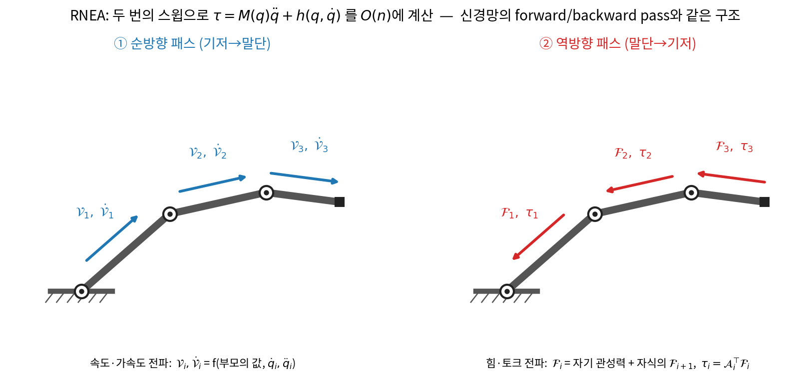
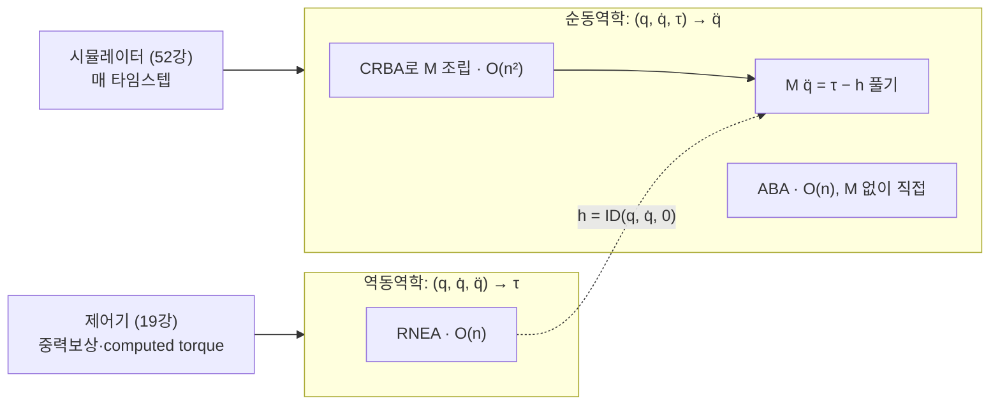
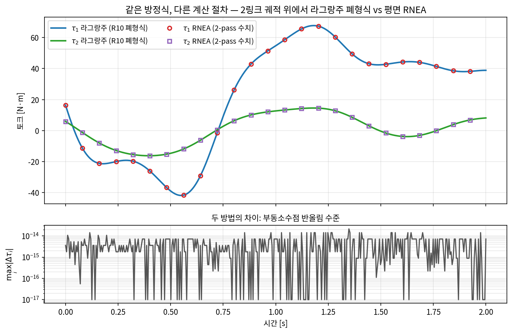
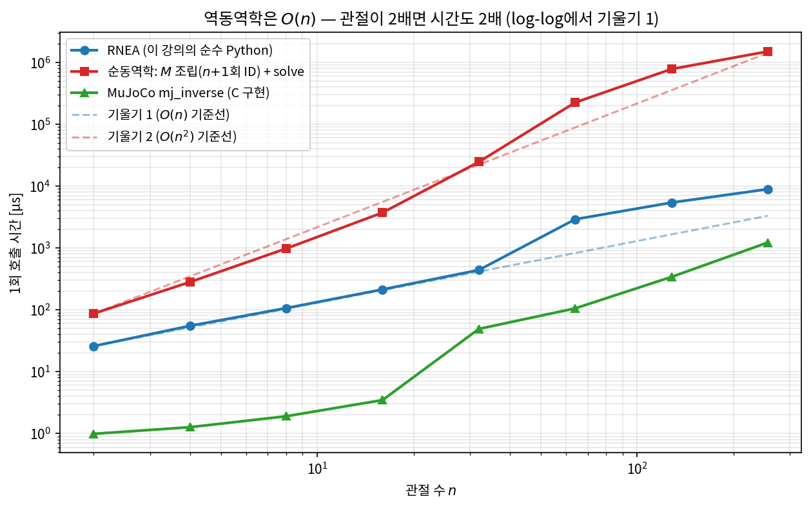

# Lec 11. 뉴턴-오일러와 계산 동역학 — 라이브러리가 실제로 쓰는 알고리즘

> 하위제어 트랙 Part R3 3일차 (전체 11일차). 선수 지식: 9강(관성텐서), 10강(라그랑주 동역학, 매니퓰레이터 방정식).
> 기초 참고서: MR Ch.8 — §8.2(단일 강체), §8.3(뉴턴-오일러 역동역학), §8.5(순동역학). 이 강의는 그 내용을 "라이브러리 내부"의 관점에서 재구성한 것이다.

## 한 장 요약



10강의 매니퓰레이터 방정식 $M(q)\ddot q + C(q,\dot q)\dot q + g(q) = \tau$를 **기호로 전개하지 않고**, 사슬을 두 번 스윕하는 것만으로 $\tau$를 계산할 수 있다. ① 기저에서 말단으로 속도·가속도를 전파하고(순방향), ② 말단에서 기저로 힘·토크를 전파한다(역방향). 이것이 **재귀 뉴턴-오일러 알고리즘(RNEA)** — 관절 수 $n$에 대해 $O(n)$이고, MuJoCo·Pinocchio가 매 스텝 실제로 실행하는 코드다. 그리고 이 두 스윕은 여러분이 매일 쓰는 신경망의 forward/backward pass와 **구조적으로 같은 물건**이다.

## 학습 목표

1. 단일 강체의 뉴턴-오일러 방정식을 쓰고, 각 항(특히 자이로스코픽 항)의 물리적 의미를 설명할 수 있다.
2. RNEA의 2-pass 구조를 의사코드 수준으로 설명하고, 평면 버전을 NumPy로 직접 구현할 수 있다.
3. 역동역학 ID: $(q,\dot q,\ddot q)\!\to\!\tau$ 와 순동역학 FD: $(q,\dot q,\tau)\!\to\!\ddot q$ 의 관계를 $M(q)\ddot q = \tau - h(q,\dot q)$로 설명하고, **ID 호출만으로** $M$과 $h$를 추출할 수 있다.
4. RNEA가 $O(n)$인 이유와, 라그랑주 기호 유도가 관절 수에 대해 스케일하지 않는 이유를 대비해 설명할 수 있다.
5. MuJoCo의 `mj_inverse`·`qfrc_bias`로 역동역학과 중력보상 토크를 계산할 수 있다.

## 왜 이 강의가 필요한가

10강에서 2링크 암의 $M, C, g$를 sympy로 유도해 봤다 — 링크 2개인데도 식이 이미 지저분했다. 7-DoF Franka로 가면 폐형식 전개의 항 수가 수천 개 규모로 폭발하고, 휴머노이드(30+ DoF)면 기호 유도는 사실상 포기다. 그런데 시뮬레이터는 매 타임스텝(수백 µs 예산) 동역학을 풀어야 하고, 토크 제어기는 1kHz로 중력·관성 보상값을 요구한다(50강의 제어 계층, 19강에서 본격화). 이 간극을 메우는 것이 오늘의 주제다: **방정식을 "전개"하지 않고 "평가"하는 재귀 알고리즘**. RNEA(역동역학), CRBA(관성행렬), ABA(순동역학)는 특정 라이브러리의 구현 디테일이 아니라 계산 강체동역학의 표준 3종 세트이고 [2], MuJoCo 문서에도 그 이름 그대로 등장한다 [3]. 이걸 모르면 라이브러리는 영원히 블랙박스고, 알고 나면 `mj_inverse` 한 줄이 무엇을 하는지 손으로 재현할 수 있다.

## 본문

### 1. 두 개의 동역학 질문

동역학 계산은 방향이 두 개다. 같은 방정식 $M(q)\ddot q + h(q,\dot q) = \tau$ (여기서 $h \equiv C\dot q + g$, 코리올리+중력의 뭉치)를 어느 쪽으로 푸느냐의 차이:

| | 입력 → 출력 | 누가 쓰나 | 표준 알고리즘 | 복잡도 |
|---|---|---|---|---|
| **역동역학 (ID)** | $(q,\dot q,\ddot q) \to \tau$ | 제어기: "이 운동을 내려면 토크가 얼마냐" (computed torque·중력보상, 19강) | **RNEA** | $O(n)$ |
| **순동역학 (FD)** | $(q,\dot q,\tau) \to \ddot q$ | 시뮬레이터: "이 토크를 주면 어떻게 움직이냐" (MuJoCo의 매 스텝, 52강) | **ABA** 또는 CRBA+분해 | $O(n)$ / $O(n^2)$+$O(n^3)$ |

이름에 주의: 딥러닝 직관으로는 "역(inverse)"이 붙은 쪽이 어려울 것 같지만, 여기서는 **역동역학이 쉬운 쪽**이다(흔한 오해 2). 이 절의 목표는 ID를 완전히 손에 넣고, FD를 ID로부터 조립하는 것이다.

### 2. 핵심 수식

#### E1. 단일 강체의 뉴턴-오일러 방정식

**직관**: 강체 하나의 운동 법칙은 두 문장이다 — "질량중심은 힘을 받은 만큼 가속한다"(뉴턴), "몸은 토크를 받은 만큼 각가속한다 — 단, 이미 돌고 있으면 공짜 토크가 하나 더 붙는다"(오일러).

**물리·기하적 의미**: 뉴턴 쪽은 익숙하다. 오일러 쪽의 추가 항 $\omega \times \mathcal{I}_c\,\omega$가 핵심인데, 관성텐서의 주축이 회전 때문에 계속 방향을 바꾸므로 각운동량 $\mathcal{I}_c\omega$를 유지하는 데만도 토크가 필요하다는 뜻이다(자이로스코픽 항). 9강의 Dzhanibekov 효과 — 토크 없이도 회전축이 뒤집히던 현상 — 가 바로 이 항의 작품이다.

**형식**: 질량 $m$, 질량중심 기준 관성텐서 $\mathcal{I}_c$, 질량중심 속도 $v_c$, 각속도 $\omega$에 대해

$$
f = m\,\dot v_c, \qquad \tau_c = \mathcal{I}_c\,\dot\omega + \omega \times \mathcal{I}_c\,\omega
$$

MR §8.2는 이 둘을 6차원 공간 표기 하나로 묶는다: twist $\mathcal{V} = (\omega, v)$, wrench $\mathcal{F} = (\tau, f)$, 공간 관성행렬 $\mathcal{G} = \mathrm{diag}(\mathcal{I}_b,\, m I_{3\times3})$에 대해

$$
\mathcal{F}_b = \mathcal{G}_b \dot{\mathcal{V}}_b - [\mathrm{ad}_{\mathcal{V}_b}]^{\!\top} \mathcal{G}_b \mathcal{V}_b
$$

둘째 항이 자이로스코픽 항의 6차원 일반화다. 오늘 이 표기는 "이렇게 한 줄로 쓸 수 있다"는 것만 알면 되고, worked example은 평면(2D)으로 내려가서 $\omega$가 스칼라가 되어 $\omega \times \mathcal{I}\omega$ 항이 사라진 버전을 다룬다 — 평면에서 관성 주축이 방향을 못 바꾸기 때문이다.

#### E2. RNEA의 2-pass 구조

**직관**: 사슬에서 링크 $i$의 속도는 "부모의 속도 + 내 관절이 보탠 것"이다. 그러니 기저부터 차례로 훑으면 모든 링크의 속도·가속도가 한 번에 나온다(순방향). 반대로 링크 $i$가 부모에게 전달하는 힘은 "내 관성력 + 자식이 나에게 넘긴 힘"이다. 그러니 말단부터 거꾸로 훑으면 모든 관절 토크가 한 번에 나온다(역방향). **각 링크를 정확히 두 번 방문하고 끝** — 그래서 $O(n)$이다.

**물리·기하적 의미**: 순방향 pass는 기구학(운동의 전파), 역방향 pass는 역학(힘의 전파)이고, 사슬의 연결 구조가 곧 계산 그래프다. 중간 결과($\mathcal{V}_i, \dot{\mathcal{V}}_i$)를 저장해 뒀다가 역방향에서 재사용하는 것이 효율의 원천 — 라그랑주 폐형식이 같은 삼각함수 조합을 수천 번 중복 계산하는 것과 대비된다.

**형식** (MR §8.3, 몸체 좌표계 재귀 — 의사코드 수준): 관절 $i$의 스크류 축 $\mathcal{A}_i$, 링크 간 변환 $T_{i,i-1}(q_i)$, 링크 공간 관성 $\mathcal{G}_i$에 대해

```text
# 순방향 (i = 1 … n): 속도·가속도 전파
V_i  = Ad_{T_(i,i-1)}(V_(i-1)) + A_i q̇_i
V̇_i = Ad_{T_(i,i-1)}(V̇_(i-1)) + ad_(V_i)(A_i) q̇_i + A_i q̈_i

# 역방향 (i = n … 1): 힘·토크 전파
F_i  = Ad_{T_(i+1,i)}ᵀ(F_(i+1)) + G_i V̇_i − ad_(V_i)ᵀ(G_i V_i)
τ_i  = F_iᵀ A_i
```

$\mathrm{Ad}$(변환의 수반)와 $\mathrm{ad}$(twist의 수반)는 3강에서 본 "twist/wrench를 다른 좌표계로 옮기는 규칙"이다. 두 가지 실전 트릭이 이 재귀를 완성한다:

- **중력 트릭**: 기저 가속도를 $\dot{\mathcal{V}}_0 = (0, -\mathfrak{g})$로 두면(중력 반대 방향으로 가속하는 기저), 중력 항이 별도 처리 없이 모든 링크에 자동 배달된다. 등가원리의 계산적 활용이다.
- **말단 외력**: 말단이 환경을 미는 wrench $\mathcal{F}_{\text{tip}}$이 있으면 $\mathcal{F}_{n+1} = \mathcal{F}_{\text{tip}}$으로 역방향 pass를 시작하면 된다. $\dot q = \ddot q = 0$으로 두면 이 재귀가 정확히 5강의 정역학 $\tau = J^\top F$로 퇴화한다 — 같은 뼈대다.

마지막 줄 $\tau_i = \mathcal{F}_i^\top \mathcal{A}_i$는 "관절이 감당해야 하는 토크 = 관절을 통과하는 wrench를 관절 축 방향으로 사영한 것". 축과 수직인 성분은 베어링(구조물)이 공짜로 받아 준다.

#### E3. ID ↔ FD: $M(q)\ddot q = \tau - h(q,\dot q)$

**직관**: RNEA는 $(q,\dot q,\ddot q)\mapsto\tau$인 블랙박스 함수다. 그런데 매니퓰레이터 방정식이 $\ddot q$에 대해 **선형**이므로, 이 블랙박스를 영리하게 찔러 보는 것만으로 $M$과 $h$를 전부 끄집어낼 수 있다.

**물리·기하적 의미**: $\ddot q = 0$을 넣으면 관성력이 사라지고 코리올리+중력만 남는다 — 그것이 $h$다. 중력을 끄고 $\dot q = 0$, $\ddot q = e_j$(단위 벡터)를 넣으면 "$j$번 관절만 단위 가속할 때 각 관절이 받는 토크" — 그것이 $M$의 $j$번째 열이다. 관성행렬이란 원래 그런 뜻이다.

**형식**: $\text{ID}(q,\dot q,\ddot q) = M(q)\ddot q + h(q,\dot q)$이므로

$$
h = \text{ID}(q, \dot q, 0), \qquad
M e_j = \text{ID}_{g=0}(q, 0, e_j), \qquad
\text{FD}: \ \ddot q = M^{-1}\!\left(\tau - h\right)
$$

- 이 "ID $n{+}1$회 호출"은 $O(n^2)$이고, 같은 $M$을 링크 관성의 부분합으로 더 싸게 조립하는 전용 알고리즘이 **CRBA**(Composite-Rigid-Body Algorithm)다 [2].
- FD는 여기에 선형계 풀이($O(n^3)$, 실전에선 희소성 활용)가 붙는다. **ABA**(Articulated-Body Algorithm)는 아예 $M$을 만들지 않고 "이 링크에서 말단까지를 하나의 유효 관성으로 뭉친" *articulated-body inertia*를 재귀로 계산해 $\ddot q$를 $O(n)$에 직접 얻는다 [2]. 오늘은 아이디어까지만 — 구현은 라이브러리에 맡긴다.



### 3. Worked Example

공통 설정: 1강과 같은 기하($l_1=1.0$, $l_2=0.6$ m)의 2링크 평면 암에 점질량 $m_1=2.0$, $m_2=1.0$ kg을 각 링크 끝에 두고, 중력 $g=9.81$ m/s² ($-y$ 방향). 검산용 폐형식은 10강에서 유도한 매니퓰레이터 방정식에 점질량 조건($l_{ci}=l_i$, $I_i=0$)을 대입해 얻는다.

#### WE-1 (손계산): 정적 역방향 pass = 중력보상 토크

$q=(0,0)$(수평으로 쭉 뻗음), $\dot q = \ddot q = 0$. 순방향 pass는 자명하고(모든 속도·가속도 0, 중력 트릭으로 모든 질량중심의 유효 가속도만 $(0, +g)$), 역방향 pass를 손으로 따라간다:

- **링크 2** (말단부터): 관성력 $f_2 = m_2 \cdot (0, g) = (0,\ 9.81)$ N. 관절 2에서 질량까지 팔길이 $l_2$이므로 모멘트 $n_2 = l_2 \cdot m_2 g = 0.6 \times 9.81 = 5.886$ → $\tau_2 = 5.886$ N·m.
- **링크 1**: 자기 관성력 $m_1(0,g) = (0, 19.62)$ N에 자식이 넘긴 $f_2$를 더해 $f_1 = (0,\ 29.43)$ N. 모멘트는 세 조각 — 자기 질량 팔길이 $l_1 \cdot m_1 g = 19.62$, 자식의 모멘트 $n_2 = 5.886$, 자식 힘의 팔길이 $l_1 \cdot 9.81 = 9.81$. 합해서 $\tau_1 = 19.62 + 5.886 + 9.81 = 35.316$ N·m.

검산: 10강의 중력 항에 점질량을 대입한 $g_1 = (m_1{+}m_2)g\,l_1 c_1 + m_2 g\, l_2 c_{12} = 3{\times}9.81{+}5.886 = 35.316$ ✓. "역방향 pass가 하는 일"의 최소 사례이자, 실습에서 만들 **중력보상 토크** 그 자체다.

#### WE-2 (코드): 평면 RNEA 전체 구현 vs 10강 라그랑주 폐형식

평면에서는 E2의 6차원 재귀가 확 줄어든다. 모든 관절 축이 $z$이므로 각속도·각가속도는 스칼라 덧셈이 되고, $\mathrm{Ad}/\mathrm{ad}$는 2D 회전과 외적으로 내려온다. 링크 $i$ 좌표계에서 ($p_i = (l_{i-1}, 0)$: 관절 $i$의 부모좌표 위치, $c_i$: 관절→질량중심 거리, $v^\perp \equiv (-v_y, v_x)$는 "$z$축 각가속도 × 벡터"의 평면 버전, $a \times b \equiv a_x b_y - a_y b_x$):

**순방향** ($i = 1 \dots n$, 시작값 $\omega_0 = \alpha_0 = 0$, $a_0 = (0, +g)$ — 중력 트릭):

$$
\omega_i = \omega_{i-1} + \dot q_i, \qquad \alpha_i = \alpha_{i-1} + \ddot q_i
$$

$$
a_i = R(q_i)^{\!\top}\!\left(a_{i-1} + \alpha_{i-1}\, p_i^{\perp} - \omega_{i-1}^2\, p_i\right),
\qquad
a_{c,i} = a_i + \alpha_i\, c_i^{\perp} - \omega_i^2\, c_i
$$

**역방향** ($i = n \dots 1$, 시작값 $f_{n+1} = 0$, $\tau_{n+1} = 0$):

$$
f_i = m_i\, a_{c,i} + R(q_{i+1})\, f_{i+1}
$$

$$
\tau_i = I_{zz,i}\,\alpha_i \;+\; c_i \times m_i a_{c,i} \;+\; \tau_{i+1} \;+\; p_{i+1} \times R(q_{i+1})\, f_{i+1}
$$

첫 두 항이 링크 $i$ 자신의 오일러·뉴턴 기여, 뒤 두 항이 자식에게서 넘어온 모멘트와 힘의 팔길이 기여다 — WE-1에서 손으로 더한 세 조각이 바로 이 구조였다. 아래는 임의 링크 수·임의 질량중심 위치·COM 관성을 받는 일반 구현이다:

```python
import numpy as np

def rnea_planar(q, qd, qdd, l, m, c, Izz, gravity=9.81):
    """평면 n링크 RNEA. l: 링크 길이, c: 관절→COM 거리(x방향), Izz: COM 관성."""
    n = len(q)
    perp = lambda v: np.array([-v[1], v[0]])            # 2D에서 α × p
    cross2 = lambda a, b: a[0]*b[1] - a[1]*b[0]         # 2D 외적 (스칼라)
    # ---- 순방향: 속도·가속도 전파 ----
    w = np.zeros(n); al = np.zeros(n); a_c = np.zeros((n, 2))
    w_prev, al_prev, a_prev = 0.0, 0.0, np.array([0.0, gravity])  # 중력 트릭
    for i in range(n):
        ci, si = np.cos(q[i]), np.sin(q[i])
        R_T = np.array([[ci, si], [-si, ci]])           # 부모좌표 → 내 좌표
        p = np.array([l[i-1], 0.0]) if i > 0 else np.zeros(2)
        w[i] = w_prev + qd[i]; al[i] = al_prev + qdd[i]
        a_o = R_T @ (a_prev + al_prev*perp(p) - w_prev**2 * p)   # 관절 원점 가속도
        cc = np.array([c[i], 0.0])
        a_c[i] = a_o + al[i]*perp(cc) - w[i]**2 * cc             # COM 가속도
        w_prev, al_prev, a_prev = w[i], al[i], a_o
    # ---- 역방향: 힘·토크 전파 ----
    tau = np.zeros(n); f_next = np.zeros(2); n_next = 0.0
    for i in range(n-1, -1, -1):
        if i < n-1:                                     # 자식이 넘긴 힘·모멘트
            cj, sj = np.cos(q[i+1]), np.sin(q[i+1])
            f_child = np.array([[cj, -sj], [sj, cj]]) @ f_next
            n_child = n_next + cross2(np.array([l[i], 0.0]), f_child)
        else:
            f_child = np.zeros(2); n_child = 0.0
        cc = np.array([c[i], 0.0])
        f_i = m[i]*a_c[i] + f_child                     # 뉴턴
        tau[i] = Izz[i]*al[i] + cross2(cc, m[i]*a_c[i]) + n_child  # 오일러
        f_next, n_next = f_i, tau[i]
    return tau

# --- 10강 폐형식 (2링크 점질량) ---
def lagrange_2link(q, qd, qdd, l1, l2, m1, m2, g=9.81):
    c2, s2 = np.cos(q[1]), np.sin(q[1])
    M = np.array([[(m1+m2)*l1**2 + m2*l2**2 + 2*m2*l1*l2*c2, m2*l2**2 + m2*l1*l2*c2],
                  [m2*l2**2 + m2*l1*l2*c2,                   m2*l2**2]])
    Cv = np.array([-m2*l1*l2*s2*(2*qd[0]*qd[1] + qd[1]**2), m2*l1*l2*s2*qd[0]**2])
    gv = np.array([(m1+m2)*g*l1*np.cos(q[0]) + m2*g*l2*np.cos(q[0]+q[1]),
                   m2*g*l2*np.cos(q[0]+q[1])])
    return M @ np.asarray(qdd) + Cv + gv, M, Cv, gv

l1, l2, m1, m2 = 1.0, 0.6, 2.0, 1.0
print(rnea_planar([0,0],[0,0],[0,0], [l1,l2],[m1,m2],[l1,l2],[0,0]))  # WE-1 검산

q, qd, qdd = np.array([0.3, 0.5]), np.array([1.0, -0.5]), np.array([2.0, 1.0])
tau_rnea = rnea_planar(q, qd, qdd, [l1,l2], [m1,m2], [l1,l2], [0,0])
tau_lag, M, Cv, gv = lagrange_2link(q, qd, qdd, l1, l2, m1, m2)
print(tau_rnea, tau_lag, np.abs(tau_rnea - tau_lag).max())
```

실행 결과: 정적 케이스는 `[35.316  5.886]` — WE-1 손계산과 일치. 동적 테스트점 $q=(0.3, 0.5)$, $\dot q=(1.0, -0.5)$, $\ddot q=(2.0, 1.0)$에서는

$$
\tau_{\text{RNEA}} = (42.144858,\ 6.521570) = \tau_{\text{라그랑주}}, \qquad \max|\Delta\tau| \approx 1.8\times10^{-15}
$$

이때 폐형식의 내역은 $M\ddot q$ 성분에 $M = \begin{pmatrix} 4.4131 & 0.8866 \\ 0.8866 & 0.36 \end{pmatrix}$, $C\dot q = (0.2157,\ 0.2877)$, $g = (32.2164,\ 4.1008)$ — 이 자세에서는 토크의 대부분이 중력이다(중력보상이 중요한 이유, 19강). 궤적 전체에서 두 방법을 겹쳐 그린 것이 아래 그림이다. **같은 방정식, 다른 계산 절차** — 차이는 부동소수점 반올림(궤적상 최대 $2.1\times10^{-14}$)뿐이다.



#### WE-3 (코드): ID 블랙박스에서 M·h 추출, MuJoCo 대조, O(n) 확인

E3의 추출 레시피를 그대로 실행한다 (WE-2의 함수·테스트점 이어서):

```python
def id_call(q_, qd_, qdd_, grav):
    return rnea_planar(q_, qd_, qdd_, [l1,l2], [m1,m2], [l1,l2], [0,0], gravity=grav)

h = id_call(q, qd, [0,0], 9.81)                              # h = ID(q, q̇, 0)
M_ext = np.column_stack([id_call(q, [0,0], e, 0.0) for e in np.eye(2)])  # M의 열
qdd_fd = np.linalg.solve(M_ext, tau_rnea - h)                # FD 재구성
print(h, M_ext, qdd_fd)
```

출력: $h = (32.4321,\ 4.3885)$ — 폐형식의 $C\dot q + g = (0.2157{+}32.2164,\ 0.2877{+}4.1008)$과 일치. $M_{\text{ext}}$는 위 $M$과 $10^{-16}$ 수준에서 일치, FD 재구성 $\ddot q = (2.0,\ 1.0)$ — 넣었던 가속도가 정확히 되돌아온다. **ID를 손에 넣으면 FD는 공짜**라는 E3의 요지다.

같은 문제를 MuJoCo에 검산시킨다. MuJoCo 모델은 관성을 명시해야 하므로 이번엔 막대 링크(COM 중앙, $I_{zz}=ml^2/12$)로 두 쪽을 맞춘다:

```python
import mujoco
I1, I2 = m1*l1**2/12, m2*l2**2/12
xml = f"""
<mujoco>
  <option gravity="0 -9.81 0"/>
  <worldbody>
    <body><joint type="hinge" axis="0 0 1"/>
      <inertial pos="{l1/2} 0 0" mass="{m1}" diaginertia="1e-9 {I1} {I1}"/>
      <geom type="capsule" fromto="0 0 0 {l1} 0 0" size="0.02" density="0" contype="0" conaffinity="0"/>
      <body pos="{l1} 0 0"><joint type="hinge" axis="0 0 1"/>
        <inertial pos="{l2/2} 0 0" mass="{m2}" diaginertia="1e-9 {I2} {I2}"/>
        <geom type="capsule" fromto="0 0 0 {l2} 0 0" size="0.02" density="0" contype="0" conaffinity="0"/>
      </body></body>
  </worldbody>
</mujoco>"""
mm = mujoco.MjModel.from_xml_string(xml); dd = mujoco.MjData(mm)
dd.qpos[:], dd.qvel[:], dd.qacc[:] = q, qd, qdd
mujoco.mj_inverse(mm, dd)                                    # 역동역학
tau_rod = rnea_planar(q, qd, qdd, [l1,l2], [m1,m2], [l1/2,l2/2], [I1,I2])
print(dd.qfrc_inverse, tau_rod)
```

출력: `mj_inverse` = $(25.911688,\ 3.080785)$, 우리 RNEA(막대 관성) = $(25.911688,\ 3.080785)$ — 차이 $3.6\times10^{-15}$. 우리가 만든 30줄짜리 함수가 MuJoCo의 역동역학과 기계 정밀도로 같은 답을 낸다.

마지막으로 $O(n)$을 실측한다. 관절 수를 2→256으로 스윕하며 1회 호출 시간을 재면(그림 생성 스크립트 `../images/lec11/gen_figs.py`), 순수 Python RNEA는 $n=2,4,8,16,32$에서 약 $26 \to 55 \to 107 \to 214 \to 440$ µs — **$n$이 2배면 시간도 2배**, log-log 기울기 1이다. 반면 "M 조립($n{+}1$회 ID) + solve"로 만든 순동역학은 기울기 ~2로 벌어져 $n=16$에서 이미 RNEA의 ~17배다. C로 구현된 MuJoCo `mj_inverse`는 같은 $O(n)$ 기울기를 유지한 채 $n=8$ 사슬을 약 2 µs에 처리한다 — 1kHz 제어 루프(예산 1000 µs) 안에 역동역학이 우습게 들어가는 이유다.



### 4. 라이브러리가 실제로 쓰는 것

- **MuJoCo**: 바이어스 힘($C\dot q + g$)은 RNE로, 관성행렬 $M$은 CRB로 계산하고, $M$을 관절 트리의 희소성을 살린 $L^\top DL$ 분해로 푼다 [3]. 즉 FD를 ABA가 아니라 "CRBA + 희소 분해" 경로로 푼다 — 접촉 제약(12강)을 같은 분해로 함께 처리하기 위해서다. `data.qfrc_bias`가 RNE의 출력이고, `mj_inverse`가 ID 전체다.
- **Pinocchio**: Featherstone 표기 그대로 `pin.rnea`, `pin.crba`, `pin.aba`를 노출한다 [4]. 알고리즘의 해석적 미분(∂τ/∂q 등)까지 제공해서 최적화 기반 제어(23강)와 학습 파이프라인에서 널리 쓰인다. 이 강의 실습 환경에는 미설치라 검증은 MuJoCo/NumPy로 했지만, `pip install pin` 한 줄이면 오늘 만든 `rnea_planar`와 같은 답을 내는 산업급 구현을 쓸 수 있다.
- 오늘 직접 짠 평면 RNEA는 이 라이브러리들의 **최소 모형**이다. 공간(3D) 버전은 E2의 6차원 재귀로 확장되고(MR §8.3), 트리 구조(휴머노이드)로도, 부유 기저(floating base)로도 일반화된다 [2].

### 5. 이 알고리즘은 스택 어디에 있는가

오늘 배운 것이 앞으로 어디서 다시 등장하는지 좌표를 찍어 두자:

| 등장 위치 | 무엇으로 | 어느 방향 |
|---|---|---|
| 19강 computed torque·중력보상 | 제어 주기(~1kHz)마다 ID 1회 — 오늘 실습이 그 최소형 | ID |
| 23강 MPC | 예측 구간의 모델 rollout — FD를 수십 번 | FD |
| 52강 시뮬레이션 내부 | 매 타임스텝의 $\ddot q$ 계산 + 접촉 솔버가 $M$의 분해를 재사용 | FD |
| 60강 시스템 식별 | $\tau = Y(q,\dot q,\ddot q)\,\theta$ — RNEA가 관성 파라미터에 선형이라는 성질 활용 | ID |
| 50강 제어 계층 | Franka가 토크 지령에 자동으로 얹는 중력·마찰 보상의 정체 | ID |

요컨대 학습 정책(VLA)이 무엇을 출력하든, 그 아래에서 초당 수백~수천 번 돌아가는 것이 이 두 개의 재귀다.

### 딥러닝 배경자를 위한 번역

| RNEA | 신경망 학습 |
|---|---|
| 순방향 pass: 기저→말단으로 $\mathcal{V}_i, \dot{\mathcal{V}}_i$ 전파 | forward pass: 입력→출력으로 activation 전파 |
| 중간량 $\mathcal{V}_i, \dot{\mathcal{V}}_i$ 저장 후 역방향에서 재사용 | activation을 저장했다가 backward에서 재사용 |
| 역방향 pass: 말단→기저로 $\mathcal{F}_i$ 누적 | backward pass: 출력→입력으로 gradient 누적 |
| $\tau_i = \mathcal{A}_i^\top \mathcal{F}_i$ (축 방향 사영) | VJP — 벡터를 로컬 야코비안 방향으로 사영 |
| 링크 2번 방문 = $O(n)$ | 레이어 2번 방문 = $O(\text{depth})$ |

- **구조 동형이지만 내용은 다르다**: backward가 나르는 것이 RNEA에선 gradient가 아니라 물리적 wrench다. 동형성의 뿌리는 "체인 구조 위에서 한쪽 방향으로는 상태가, 반대 방향으로는 쌍대량이 전파된다"는 공통 구도이고, 실제로 RNEA의 역방향 pass가 정역학 극한에서 $\tau = J^\top F$(5강) — 즉 진짜 VJP — 로 퇴화한다.
- **라그랑주 기호 유도 vs RNEA = symbolic diff vs reverse-mode autodiff**. sympy로 $M, C, g$를 전개하는 것은 수식 트리를 통째로 펼치는 symbolic differentiation이라 expression swell로 죽는다. RNEA는 수치를 그래프에 흘려보내며 중간 결과를 재사용한다 — autodiff가 심층망에서 이기는 이유와 정확히 같은 이유로 이긴다.
- **$O(n)$ 재귀 = 동적 계획법**. "부모의 답을 알면 내 답은 상수 시간" — 부분 문제의 중첩을 메모이제이션으로 제거하는 표준 수법이 기계 사슬 위에서 실행되는 것.
- **ID는 teacher forcing, FD는 자유 rollout**. ID는 궤적 전체($q,\dot q,\ddot q$)를 정답으로 받아 각 시점을 독립적으로 평가하므로 오차가 쌓일 곳이 없다. FD는 자기 출력을 적분해 다음 입력을 만들므로 모델 오차가 복리로 쌓인다 — 37강의 compounding error와 같은 구도이고, 시뮬레이터 드리프트(52강)의 뿌리다.

## 흔한 오해

1. **"라그랑주 동역학과 뉴턴-오일러 동역학은 다른 물리다"** — 같은 운동방정식의 두 유도·계산 경로다. WE-2에서 봤듯 출력 토크는 부동소수점 수준에서 동일하다. 차이는 관점(에너지 vs 힘 평형)과 계산 특성(폐형식 통찰 vs $O(n)$ 수치 평가)이지 물리가 아니다.
2. **"'역'동역학이니까 순동역학보다 어렵겠지"** — 반대다. ID는 재귀 한 바퀴($O(n)$, 역행렬 없음)로 끝나고, FD가 $M^{-1}$이 필요한 어려운 쪽이다(그림 3에서 FD 곡선이 위에 있다). 역기구학(7강)이 정기구학보다 어려웠던 것과 방향이 반대라 더 헷갈리기 쉽다.
3. **"시뮬레이터는 내 로봇의 $M(q)$ 수식을 어딘가에 갖고 있다"** — 없다. MuJoCo는 매 스텝 RNE/CRB를 **수치로** 재실행할 뿐, 기호식은 어디에도 없다 [3]. "모델 기반" = "수식 전개"가 아니라 "URDF/MJCF의 관성 파라미터 + 재귀 알고리즘"이다.
4. **"`qfrc_bias`는 중력 보상값이다"** — 절반만 맞다. `qfrc_bias` $= C(q,\dot q)\dot q + g(q)$로 코리올리·원심력까지 포함한다. 정지 상태($\dot q=0$)에서만 순수 중력 항과 같다. 실습에서 이 차이를 직접 확인한다.

## 실습 (1.5~2시간)

**MuJoCo 중력보상 — 팔을 "무중력처럼" 띄우기** (19강 computed torque의 예고편).

1. WE-3의 2링크 XML로 모델을 만들고, 보상 없이 2초 시뮬레이션해 팔이 떨어지는 것을 확인한다.
2. 매 스텝 `qfrc_bias`를 그대로 되먹인다:

```python
import mujoco, numpy as np
m = mujoco.MjModel.from_xml_string(xml)   # WE-3의 xml (timestep 기본 0.002s)
d = mujoco.MjData(m); q0 = np.array([0.3, 0.5])

d.qpos[:] = q0                             # (a) 보상 없음
for _ in range(1000): mujoco.mj_step(m, d)
print("보상 없음:", np.round(d.qpos, 4))    # → [-1.3779  1.3931] 떨어짐

mujoco.mj_resetData(m, d); d.qpos[:] = q0  # (b) 중력보상
for _ in range(1000):
    mujoco.mj_forward(m, d)                # qfrc_bias 갱신
    d.qfrc_applied[:] = d.qfrc_bias        # τ = C q̇ + g 를 그대로 인가
    mujoco.mj_step(m, d)
print("보상 있음:", np.round(d.qpos, 6))    # → [0.3 0.5] 드리프트 0
```

3. 초기 속도 $\dot q_1 = 0.5$ rad/s를 주고 (b)를 반복하라. 팔이 감속 없이 **등속으로 표류**한다(2초 후 $q_1 = 0.3 + 0.5\times2 = 1.3$, $\dot q$ 불변) — 완전 보상된 팔은 우주정거장의 물체처럼 이중적분기 $M\ddot q = \tau_{\text{ext}}$가 된다. `mujoco.viewer.launch`로 열어 마우스로 툭툭 쳐 보면 "무중력" 감각이 온다.
4. (b)에서 `qfrc_bias` 대신 "정지 상태의 중력 항만"(WE-1 방식으로 직접 계산한 $g(q)$)을 넣으면 무엇이 달라지는가? 빠르게 움직일 때 코리올리 항의 크기를 로깅해 비교하라 (흔한 오해 4의 정량화).
5. (심화) [MuJoCo Menagerie](https://github.com/google-deepmind/mujoco_menagerie)의 Franka `panda.xml`로 같은 실험을 반복하라. 7-DoF에서도 코드가 한 줄도 안 바뀌는 것 — 그것이 $O(n)$ 재귀 알고리즘의 힘이다. 실제 Franka가 토크 지령에 중력·마찰 보상을 자동으로 얹어 주는 것(50강)이 정확히 이 계산이다.
6. (선택) 로컬 환경이 되면 `pip install pin` 후 `pin.rnea(model, data, q, v, a)`로 WE-2의 테스트점을 재검증하고, `pin.crba`·`pin.aba`로 E3의 추출 실험을 반복해 보라.

## Claude와 토론할 질문

1. RNEA에서 속도·가속도는 왜 기저→말단으로, 힘은 왜 말단→기저로 흐르는가? 방향을 서로 바꾸면 정확히 어디서 정보가 부족해지는가?
2. "RNEA 역방향 pass = backprop"의 동형성은 어디까지 정확한가? backward가 나르는 양(gradient vs wrench), 선형성, "손실 함수"에 해당하는 것의 유무를 따져 경계를 그어 보라.
3. 중력 트릭($\dot{\mathcal{V}}_0 = (0,-\mathfrak{g})$)이 물리적으로 정당한 이유를 등가원리로 설명해 보라. 엘리베이터 안의 로봇에는 어떤 함의가 있는가?
4. "ID $n{+}1$회 호출"과 CRBA는 둘 다 $M$을 주는데 CRBA가 더 싸다. 전자가 낭비하는 계산이 무엇인지 짚어 보라 (힌트: $\ddot q = e_j$ 호출들 사이에 겹치는 일).
5. MuJoCo는 FD에 ABA 대신 CRB+희소 분해를 쓴다 [3]. 접촉 제약(12강에서 다룬다)이 있는 시뮬레이션에서는 왜 $M$과 그 분해를 명시적으로 갖고 있는 쪽이 유리할지 추론해 보라.
6. RNEA의 출력은 관성 파라미터(질량, COM, 관성텐서)에 **선형**이다: $\tau = Y(q,\dot q,\ddot q)\,\theta$. 이 사실이 60강의 시스템 식별(관성 파라미터 회귀)을 선형 최소제곱 문제로 만들어 주는 이유를 설명해 보라.
7. VLA 정책은 토크가 아니라 관절각 청크를 낸다(50강). 그렇다면 이 강의의 ID는 학습 기반 스택의 어느 층에서, 누구를 위해 돌고 있는가?

## 읽을거리

1. **MR Ch.8 §8.1~8.3** (~60분): 단일 강체의 공간 표기(§8.2)와 RNEA(§8.3)의 원전. §8.5(순동역학)는 구조만 훑기. §8.4의 폐형식은 "RNEA로 이런 식을 만들 수도 있다" 수준으로만.
2. **Featherstone, "Rigid Body Dynamics Algorithms," Ch.5** (~40분): RNEA의 표준 서술. Ch.6(CRBA)·Ch.7(ABA)은 알고리즘 표(pseudocode)만 눈에 익혀 두면 라이브러리 소스를 읽을 때 이정표가 된다.
3. **MuJoCo 문서 "Computation" 장** (~20분): 오늘 배운 이름들(RNE, CRB, 희소 분해)이 실제 제품 문서에 어떻게 등장하는지 확인 — "라이브러리가 실제로 쓰는 알고리즘"의 물증.

## 자가 점검

1. 오일러 방정식의 $\omega \times \mathcal{I}\omega$ 항이 왜 생기는지, 평면 문제에서는 왜 사라지는지 말할 수 있는가?
2. RNEA 2-pass의 각 pass가 무엇을 전파하고 무엇을 저장·재사용하는지, 왜 $O(n)$인지 30초 안에 설명할 수 있는가?
3. WE-1의 정적 backward pass($\tau = (35.316, 5.886)$)를 손으로 재현할 수 있는가?
4. ID 블랙박스만 주어졌을 때 $h$와 $M$을 추출해 FD를 만드는 레시피를 코드 골격으로 쓸 수 있는가?
5. `qfrc_bias`에 무엇이 들어 있고, 그것으로 중력보상 제어를 어떻게 만드는지 말할 수 있는가?

## 참고문헌

> 웹 문서는 2026-07-08 접속 기준.

[1] K. Lynch, F. Park, "Modern Robotics: Mechanics, Planning, and Control," Cambridge Univ. Press, 2017. 무료 PDF: https://hades.mech.northwestern.edu/images/7/7f/MR.pdf
— **뒷받침**: §8.2 단일 강체의 공간 표기(E1의 $\mathcal{F} = \mathcal{G}\dot{\mathcal{V}} - \mathrm{ad}^\top_{\mathcal{V}}\mathcal{G}\mathcal{V}$), §8.3 뉴턴-오일러 역동역학(E2의 2-pass 재귀, 중력 트릭, 말단 wrench 처리), §8.5 순동역학(E3의 $M$ 추출·FD 구성).

[2] R. Featherstone, "Rigid Body Dynamics Algorithms," Springer, 2008.
— **뒷받침**: RNEA($O(n)$ 역동역학, Ch.5)·CRBA(관성행렬 조립, Ch.6)·ABA($O(n)$ 순동역학과 articulated-body inertia, Ch.7)가 계산 강체동역학의 표준 3종이라는 본문 주장, 트리·부유 기저로의 일반화.

[3] Google DeepMind, MuJoCo 문서 — Computation 장. https://mujoco.readthedocs.io/en/stable/computation/index.html
— **뒷받침**: MuJoCo가 바이어스 힘에 RNE, 관성행렬에 CRB, 그리고 트리 희소성을 살린 $L^\top DL$ 분해를 쓴다는 서술(본문 §4, 흔한 오해 3, 토론 질문 5); `qfrc_bias` $= C\dot q + g$, `mj_inverse`의 의미(WE-3, 실습).

[4] J. Carpentier et al., Pinocchio — 강체동역학 알고리즘 라이브러리. https://github.com/stack-of-tasks/pinocchio
— **뒷받침**: `pin.rnea`/`pin.crba`/`pin.aba` API와 해석적 미분 제공, `pip install pin` 설치 경로(본문 §4, 실습 6). 이 환경에는 미설치라 수치 검증은 [3]의 MuJoCo와 NumPy로 수행.

<!-- lecture-nav -->

---

⬅ 이전: [Lec 10. 라그랑주 동역학 — 매니퓰레이터 방정식](lec10-lagrangian-dynamics.md)　｜　[📖 전체 목차](../README.md)　｜　다음: [Lec 12. 접촉, 마찰, 파지 — 불연속의 물리](lec12-contact-friction-grasping.md) ➡
