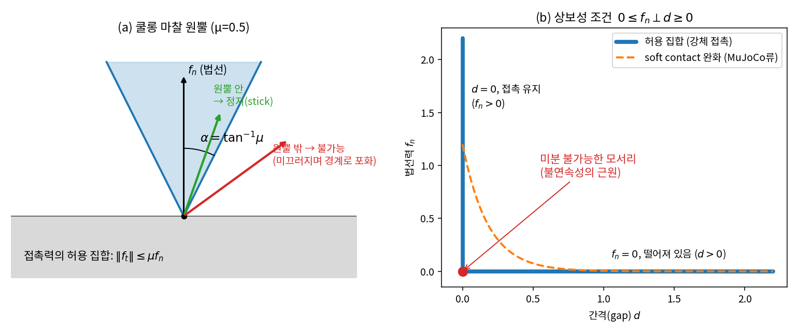
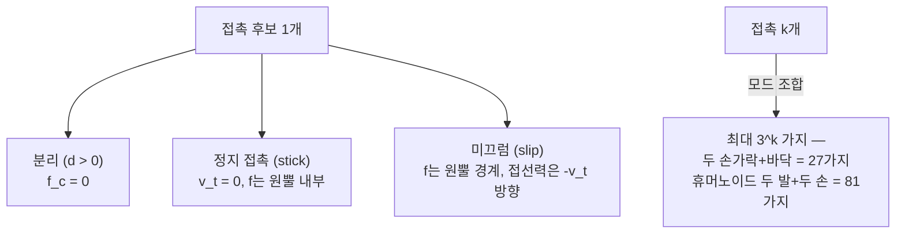
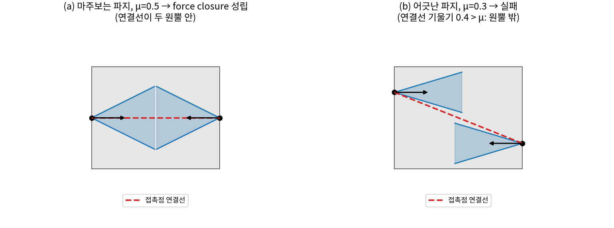
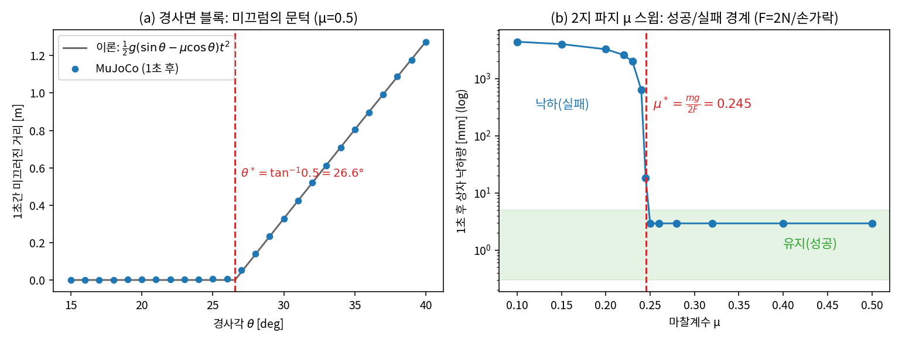
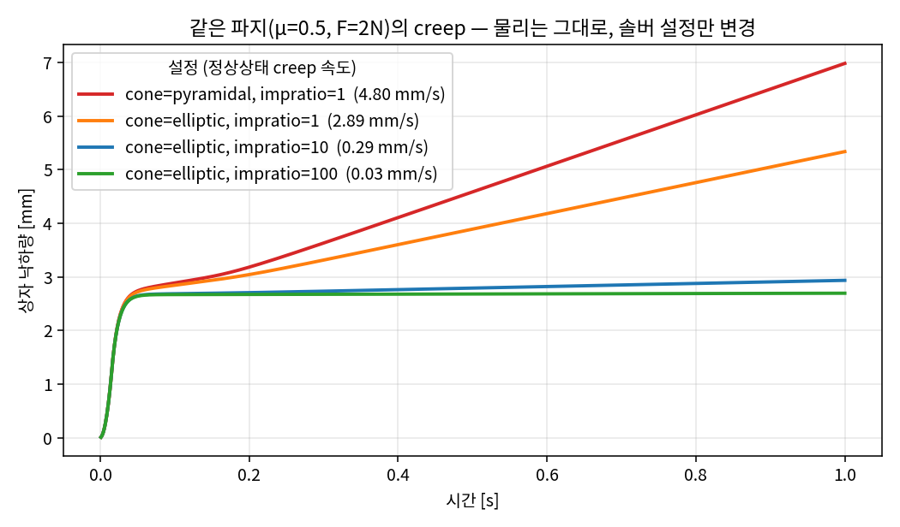

# Lec 12. 접촉, 마찰, 파지 — 불연속의 물리

> 하위제어 트랙 12일차 (Part R3 동역학). 선수 지식: 10강(매니퓰레이터 방정식), 11강(계산 동역학).
> 기초 참고서: Modern Robotics(이하 MR) Ch.12. 이 강의는 MR §12.1(접촉 기구학·form closure)과 §12.2(접촉 힘·마찰 원뿔·force closure)를 딥러닝 배경자의 언어로 재구성한 것이다.

## 한 장 요약



왼쪽: 접촉이 낼 수 있는 힘은 **원뿔 모양의 집합**으로 제한된다 — 힘이 원뿔 안이면 붙어 있고(stick), 원뿔 밖의 힘은 물리적으로 불가능하며 미끄러진다(slip). 오른쪽: 법선력과 간격의 관계는 함수가 아니라 **L자 모양의 집합**이다 — "떨어져 있으면 힘 0, 힘이 있으면 붙어 있음"이라는 if-then이 물리 법칙 안에 박혀 있다. 지금까지의 동역학(10~11강)은 매끄러운 미분방정식이었다. 오늘부터는 **부등식과 스위치**다. 이 두 그림이 "왜 접촉 시뮬레이션이 어려운가"와 "왜 접촉 태스크가 학습하기 어려운가"의 물리적 근원 전부다.

## 학습 목표

1. 쿨롱 마찰 원뿔을 정의하고, 정지/미끄럼을 부등식($\tan\theta$ vs $\mu$)으로 판정할 수 있다.
2. 상보성 조건 $0 \le f_n \perp d \ge 0$을 쓰고, 접촉 동역학이 왜 매끄러운 ODE가 아닌지 설명할 수 있다.
3. 파지 행렬 $G$를 세우고, force closure 판정을 선형계획(LP) feasibility 문제로 구현할 수 있다.
4. form closure와 force closure를 구분하고, 각각에 필요한 최소 접촉 수를 말할 수 있다.
5. MuJoCo의 접촉 파라미터(`friction`, `cone`, `impratio`)가 같은 파지를 성공/실패로 가르는 것을 실험으로 재현하고, soft contact의 대가(creep)를 설명할 수 있다.

## 왜 이 강의가 필요한가

10~11강의 동역학 $M(q)\ddot q + C(q,\dot q)\dot q + g(q) = \tau$는 아름답게 매끄럽다 — 모든 항이 $C^\infty$이고, 미분가능하고, 적분기가 잘 먹는다. 그런데 로봇이 **실제로 일하는 순간**은 전부 접촉이다: 잡고, 딛고, 끼우고, 민다. 접촉이 시작되는 순간 방정식에 $J^\top f_c$가 추가되는데(5강의 정역학 쌍대), 이 $f_c$는 상태의 함수가 아니라 **부등식 제약(마찰 원뿔)과 스위치(상보성)를 만족하는 미지수**다. 결과적으로 동역학이 접촉 모드마다 다른 방정식으로 갈라진다.

이 구조가 AI·VLA 파트에서 만난 여러 현상의 근원이다: 왜 파지 데모는 성공률 90%에서 멈추는가(접촉 위치 오차가 closure 여유를 갉아먹는다), 왜 sim2real 갭의 최대 원천이 접촉인가(시뮬레이터는 불연속을 '완화'해서 푼다 — 51강), 왜 미분가능 시뮬레이터가 만능이 아닌가(모서리에서 gradient가 무의미해진다). 오늘은 이 문장들을 수식 3개와 실험으로 바꾼다. 파지의 성립 조건(force closure)까지 가면, "파지 성공"이라는 라벨 뒤에 있는 볼록기하가 보인다.

## 본문

### 1. 접촉이 들어오면 동역학이 갈라진다

접촉 없는 로봇의 운동방정식(10강)에 접촉력이 들어오면:

$$
M(q)\ddot q + C(q,\dot q)\dot q + g(q) = \tau + J_c^\top(q)\, f_c
$$

$J_c$는 접촉점의 자코비안이고(5강에서 $\tau = J^\top F$로 본 그 쌍대), 문제는 $f_c$다. 스프링-댐퍼처럼 $f_c = k\,x$로 쓸 수 있는 함수가 아니라, 접촉마다 세 가지 **모드** 중 하나를 골라야 결정된다:



어느 모드인지는 미리 알 수 없고, **그 스텝의 힘과 운동을 실제로 풀어봐야** 안다. 모드가 바뀌는 순간 방정식 자체가 바뀌므로 동역학은 조각별(piecewise)로만 매끄럽다. 아래 핵심 수식 세 개는 각각 (E1) 한 접촉이 낼 수 있는 힘의 집합, (E2) 모드를 가르는 스위치, (E3) 여러 접촉의 힘 집합을 모아 "물체를 잡았다"를 판정하는 조건이다.

### 2. 핵심 수식

#### E1. 쿨롱 마찰과 마찰 원뿔

**직관**: 접촉면이 낼 수 있는 마찰력에는 한도가 있고, 그 한도는 누르는 힘에 비례한다. 한도 안에서는 마찰력이 "필요한 만큼만" 나온다 — 책상 위의 책을 살짝 밀면 정확히 미는 만큼의 마찰이 반대로 작용해 정지가 유지되고, 세게 밀면 한도에서 포화되며 미끄러진다.

**물리·기하적 의미**: 법선력 $f_n$과 접선력 $f_t$를 한 벡터로 보면, 허용되는 접촉력의 집합은 법선을 축으로 하는 **원뿔**이다. 반각(half-angle)은 $\alpha = \tan^{-1}\mu$ — 마찰계수는 "각도"다(그림 1a). 정지 상태의 접촉력은 반드시 원뿔 안에 있고, 미끄러질 때는 원뿔의 경계에서 미끄럼 반대 방향의 모서리에 놓인다. 고무($\mu \approx 1$, 반각 45°)와 테플론($\mu \approx 0.05$, 반각 3°)의 차이는 이 원뿔의 "너비" 차이다.

**형식**: 접촉 프레임(법선 $\hat n$, 접평면 $t$)에서 마찰 원뿔은

$$
\mathcal{FC} = \left\{ f = f_n \hat n + f_t \;:\; f_n \ge 0,\; \lVert f_t \rVert \le \mu f_n \right\}
$$

정지(stick)일 때는 $v_t = 0$이고 $f \in \mathcal{FC}$ (내부 어디인지는 정역학/동역학이 결정 — 마찰력은 **집합값**이다). 미끄럼(slip)일 때는 $f_t = -\mu f_n \,\hat v_t$로 유일하게 결정된다 (MR §12.2). 평면 문제에서는 원뿔이 두 개의 모서리 벡터 $\hat n \pm \mu \hat t$가 만드는 부채꼴이 되고, 이 두 모서리의 **양의 결합**으로 원뿔 전체를 정확히 표현할 수 있다 — E3의 판정이 LP가 되는 이유다. 3차원 원뿔은 다면체가 아니므로 모서리 $m$개로 이산화해 안쪽에서 근사한다(보수적 판정).

#### E2. 상보성 조건 — 불연속은 여기서 온다

**직관**: 접촉력과 간격은 동시에 양수일 수 없다. 떨어져 있으면($d>0$) 힘은 정확히 0이고, 힘이 있으면($f_n>0$) 간격은 정확히 0이다. "만약 닿아 있으면 밀고, 아니면 말고" — 프로그래머의 if문이 물리 법칙으로 승격된 것.

**물리·기하적 의미**: $(d, f_n)$ 평면에서 허용되는 상태는 두 반직선이 만나는 **L자 집합**이다(그림 1b). 이것은 함수 그래프가 아니다 — $d=0$에서 $f_n$은 0부터 무한대까지 아무 값이나 가능하다. 원점의 모서리가 미분 불가능성의 근원이고, 접선 방향에도 같은 구조의 스위치(정지↔미끄럼, 원뿔 내부↔경계)가 하나 더 있다.

**형식**:

$$
0 \le f_n \;\perp\; d \ge 0 \qquad \Longleftrightarrow \qquad f_n \ge 0,\;\; d \ge 0,\;\; f_n \cdot d = 0
$$

접촉이 여러 개면 이런 조건들이 운동방정식과 연립되어, 각 타임스텝마다 **선형 상보성 문제(LCP)** 를 풀어야 한다 — 강체 접촉의 표준 정식화다[5]. LCP는 매끄러운 방정식 풀이가 아니라 조합적 탐색(어느 접촉이 활성인가)을 품은 문제여서, 시뮬레이터들은 이를 정확히 푸는 대신 **완화(regularize)** 한다. MuJoCo는 접촉을 살짝 부드럽게 만들어 볼록 최적화로 바꾸는데[3][4], 그 대가가 아래 §4에서 직접 측정할 **creep**(붙어 있어야 할 접촉이 서서히 흘러내리는 현상)이다. 솔버의 내부는 52강에서 해부한다.

#### E3. 파지 행렬과 force closure

**직관**: 손가락 여러 개가 각자 원뿔만큼의 힘을 낼 수 있을 때, 그 힘들의 조합으로 물체에 걸리는 **어떤 방향의 외란(힘+토크)도 상쇄**할 수 있으면 물체를 "잡은" 것이다. 어느 방향 하나라도 못 막으면 그 방향으로 빠져나간다.

**물리·기하적 의미**: 각 접촉력은 물체 좌표계에서 렌치(wrench: 힘과 토크의 묶음, 평면에서는 $(f_x, f_y, \tau_z)$ 3차원)를 만든다. 접촉 $i$의 마찰 원뿔을 렌치 공간으로 옮긴 것이 $G_i \mathcal{FC}_i$이고, force closure란 이 원뿔들의 **양의 결합(볼록 원뿔의 합)이 렌치 공간 전체를 덮는 것**이다. 기하적으로: 원뿔 조각들을 이어붙여 원점을 완전히 감싸면 성립.

**형식**: 접촉점 $p_i$의 접촉력 $f_i$가 만드는 물체 렌치는 $w_i = G_i f_i$. 평면 점접촉의 파지 행렬은

$$
G_i = \begin{bmatrix} 1 & 0 \\ 0 & 1 \\ -p_{i,y} & p_{i,x} \end{bmatrix}, \qquad
w = \sum_i G_i f_i = G \, f_c
$$

(위 두 행이 힘, 마지막 행이 토크 $\tau_z = p_x f_y - p_y f_x$. MR은 모멘트를 첫 성분으로 쓰는 순서라 행 배치만 다르다.) **Force closure** ⇔ $\{\, G f_c : f_i \in \mathcal{FC}_i \,\}$의 양의 스팬이 렌치 공간 전체($\mathbb{R}^3$ 평면 / $\mathbb{R}^6$ 공간). 판정: 원뿔을 모서리로 이산화해 렌치 열벡터 행렬 $F = [w_1 \cdots w_k]$를 만들면,

$$
\text{force closure} \iff \operatorname{rank}(F) = n_w \;\;\text{그리고}\;\; \exists\, k \ge \mathbf{1}:\; F k = 0
$$

즉 "모든 모서리를 조금씩이라도 쓰면서 합력이 0이 되게 할 수 있는가"라는 **LP feasibility 문제**다 — MR §12.1의 form closure 판정을 마찰 원뿔 모서리에 적용한 것이다[1]. 용어 구분: **form closure**는 마찰 없이($\mu=0$) 기하 구속만으로 물체를 가두는 것(평면 최소 4접촉, 공간 최소 7접촉 필요), **force closure**는 마찰을 활용하는 것(마주보는 2접촉으로도 가능). 마찰이 접촉 2개를 절약해 주는 대신, 그 보증은 $\mu$라는 불확실한 물성에 의존하게 된다.

### 3. Worked Example

#### WE-1 (손 + MuJoCo): 경사면 블록 — 부등식이 문턱을 만든다

**손계산**: 경사각 $\theta$의 면 위 질량 $m$인 블록. 법선력 $f_n = mg\cos\theta$, 정지 유지에 필요한 접선력은 $mg\sin\theta$. E1의 부등식에 넣으면

$$
mg\sin\theta \le \mu \, mg\cos\theta \iff \tan\theta \le \mu
$$

$\mu = 0.5$이면 문턱은 $\theta^* = \tan^{-1} 0.5 = 26.57°$. 문턱을 넘으면 미끄럼 모드로 전환되어 $a = g(\sin\theta - \mu\cos\theta)$로 가속: $\theta = 30°$에서 $a = 9.81(0.5 - 0.5 \times 0.8660) = 0.657\,\text{m/s}^2$, 1초 후 변위 $d = a/2 = 0.329$ m.

**검증 코드** (경사면 대신 중력 벡터를 기울이면 모델이 간단해진다):

```python
import numpy as np, mujoco

XML = """
<mujoco>
  <option timestep="0.001"/>
  <worldbody>
    <geom type="plane" size="5 5 0.1" friction="0.5 0.005 0.0001"/>
    <body pos="0 0 0.05">
      <freejoint/>
      <geom type="box" size="0.05 0.05 0.05" mass="1" friction="0.5 0.005 0.0001"/>
    </body>
  </worldbody>
</mujoco>
"""
mu = 0.5                                    # atan(0.5) = 26.57°
for th_deg in [20, 25, 26, 27, 28, 30, 35]:
    th = np.radians(th_deg)
    m = mujoco.MjModel.from_xml_string(XML)
    m.opt.gravity[:] = 9.81 * np.array([np.sin(th), 0, -np.cos(th)])  # 중력 기울이기 = 경사면
    d = mujoco.MjData(m)
    while d.time < 1.0:
        mujoco.mj_step(m, d)
    a = max(9.81 * (np.sin(th) - mu*np.cos(th)), 0.0)
    print(f"θ={th_deg:2d}°  MuJoCo x변위={d.qpos[0]:+.4f} m   이론={a/2:.4f} m")
```

실제 출력:

```
θ=20°  MuJoCo x변위=+0.0018 m   이론=0.0000 m
θ=25°  MuJoCo x변위=+0.0050 m   이론=0.0000 m
θ=26°  MuJoCo x변위=+0.0056 m   이론=0.0000 m
θ=27°  MuJoCo x변위=+0.0522 m   이론=0.0416 m
θ=28°  MuJoCo x변위=+0.1404 m   이론=0.1373 m
θ=30°  MuJoCo x변위=+0.3287 m   이론=0.3286 m
θ=35°  MuJoCo x변위=+0.8046 m   이론=0.8044 m
```

문턱(26~27° 사이)과 문턱 위의 가속도가 손계산과 일치한다(30°: 0.3287 vs 0.3286). 두 가지 관찰: ① 문턱 **아래**에서도 mm 단위의 변위가 있다 — 이것이 soft contact의 creep이다(E2에서 예고, §4에서 정량화). ② 문턱 **직후**(27°)는 이론보다 크다 — 완화된 원뿔은 경계가 칼같지 않다. 그림 3(a)가 전체 스윕이다.

#### WE-2 (손 + 코드): 평면 2접촉 파지의 force closure 판정

폭 2인 상자를 양옆에서 잡는다. 접촉 1은 $p_1 = (-1, 0)$에서 법선 $\hat n_1 = (+1, 0)$, 접촉 2는 $p_2 = (1, 0)$에서 $\hat n_2 = (-1, 0)$, $\mu = 0.5$.

**손계산**: 각 접촉의 원뿔 모서리는 $f = \hat n \pm \mu \hat t$. 렌치 $(f_x, f_y, \tau_z)$로 옮기면 ($\tau_z = p_x f_y - p_y f_x$):

$$
F = \begin{bmatrix} 1 & 1 & -1 & -1 \\ 0.5 & -0.5 & -0.5 & 0.5 \\ -0.5 & 0.5 & -0.5 & 0.5 \end{bmatrix}
$$

① $k = (1,1,1,1)$이면 $Fk = 0$ — 네 모서리를 똑같이 쓰면 합력이 0 (내력만 남는 squeeze). ② 첫 3열의 행렬식은 $4\mu^2 = 1 \ne 0$이므로 $\operatorname{rank}(F) = 3$. 두 조건이 모두 성립 → **force closure**. 반면 $\mu = 0$이면 모서리가 $(\pm 1, 0, 0)$뿐이라 rank 1 — 마찰 없는 2접촉은 절대 안 된다(위아래 방향과 회전을 못 막는다).

**검증 코드** (`scipy.optimize.linprog`로 E3의 LP를 그대로):

```python
import numpy as np
from scipy.optimize import linprog

def wrench_edges(contacts, mu):
    """평면 접촉들의 마찰 원뿔 모서리 렌치를 열로 모은 행렬 F (3 x 2C)."""
    cols = []
    for p, n in contacts:
        n = np.asarray(n, float) / np.linalg.norm(n)
        t = np.array([-n[1], n[0]])                    # 접선
        for s in (+1, -1):
            f = n + s*mu*t                             # 원뿔 모서리 (평면은 2개가 전부)
            cols.append([f[0], f[1], p[0]*f[1] - p[1]*f[0]])
    return np.array(cols).T

def force_closure(contacts, mu):
    """MR의 판정: rank(F)=3 이고 Fk=0, k>=1 이 실행가능하면 True."""
    F = wrench_edges(contacts, mu)
    if np.linalg.matrix_rank(F) < 3:
        return False
    res = linprog(c=np.ones(F.shape[1]), A_eq=F, b_eq=np.zeros(3),
                  bounds=[(1, None)] * F.shape[1])
    return res.success

antipodal = [((-1, 0.0), (1, 0)), ((1, 0.0), (-1, 0))]   # 마주보는 파지
offset    = [((-1, 0.4), (1, 0)), ((1, -0.4), (-1, 0))]  # 어긋난 파지

print("antipodal, μ=0.5 :", force_closure(antipodal, 0.5))
print("antipodal, μ=0.0 :", force_closure(antipodal, 0.0))
print("offset,    μ=0.3 :", force_closure(offset, 0.3))
print("offset,    μ=0.5 :", force_closure(offset, 0.5))
for mu in [0.39, 0.40, 0.41]:
    print(f"offset,    μ={mu:.2f} :", force_closure(offset, mu))
```

실제 출력:

```
antipodal, μ=0.5 : True
antipodal, μ=0.0 : False
offset,    μ=0.3 : False
offset,    μ=0.5 : True
offset,    μ=0.39 : False
offset,    μ=0.40 : False
offset,    μ=0.41 : True
```

`offset`은 접촉이 위아래로 $\pm 0.4$ 어긋난 파지다. 두 접촉점을 잇는 선의 기울기가 $0.8/2 = 0.4$이므로, 그 선이 두 원뿔 안에 들어오려면 $\mu > 0.4$가 필요하다 — **평면 2접촉 force closure의 기하 조건**("연결선이 두 마찰 원뿔의 내부에 있을 것", MR §12.2의 평면 그래픽 판정)이고, LP가 정확히 $\mu = 0.40 \to 0.41$에서 뒤집히는 것으로 확인된다(경계값 0.40은 내부가 아니라 False). 그림 2가 이 두 배치의 기하다.



#### WE-3 (MuJoCo): μ 스윕 — 같은 파지가 성공에서 실패로 넘어가는 경계

두 손가락이 질량 0.1 kg 상자를 양쪽에서 $F = 2$ N씩 조인 채 공중에 든다. **손계산**: 접촉 2개가 낼 수 있는 최대 마찰력은 $2\mu F$, 이것이 중량 $mg = 0.981$ N 이상이어야 유지:

$$
2\mu F \ge mg \iff \mu \ge \mu^* = \frac{mg}{2F} = \frac{0.981}{4} = 0.245
$$

**검증 코드** (inline XML — 실습에서 이 모델을 계속 쓴다):

```python
import numpy as np, mujoco

GRASP_XML = """
<mujoco model="two_finger_grasp">
  <option timestep="0.001" gravity="0 0 -9.81" cone="elliptic" impratio="10"/>
  <worldbody>
    <body name="box" pos="0 0 0.2">
      <freejoint/>
      <geom name="box" type="box" size="0.02 0.02 0.02" mass="0.1"
            friction="{mu} 0.005 0.0001"/>
    </body>
    <body name="finger_l" pos="-0.03 0 0.2">
      <joint name="slide_l" type="slide" axis="1 0 0"/>
      <geom name="pad_l" type="box" size="0.005 0.03 0.03" mass="0.05"
            friction="{mu} 0.005 0.0001"/>
    </body>
    <body name="finger_r" pos="0.03 0 0.2">
      <joint name="slide_r" type="slide" axis="-1 0 0"/>
      <geom name="pad_r" type="box" size="0.005 0.03 0.03" mass="0.05"
            friction="{mu} 0.005 0.0001"/>
    </body>
  </worldbody>
  <actuator>
    <motor joint="slide_l" gear="1"/>
    <motor joint="slide_r" gear="1"/>
  </actuator>
</mujoco>
"""

def grasp_drop(mu, squeeze=2.0, T=1.0):
    """양쪽에서 squeeze[N]씩 조인 채 T초 뒤 상자가 흘러내린 거리 [mm]."""
    m = mujoco.MjModel.from_xml_string(GRASP_XML.format(mu=mu))
    d = mujoco.MjData(m)
    z0 = d.qpos[2]                      # 상자 초기 높이
    d.ctrl[:] = squeeze
    while d.time < T:
        mujoco.mj_step(m, d)
    return (z0 - d.qpos[2]) * 1000

print("이론 경계: μ* = mg/(2F) =", 0.1*9.81/(2*2.0))
for mu in [0.20, 0.24, 0.245, 0.25, 0.28, 0.35, 0.50]:
    drop = grasp_drop(mu)
    print(f"μ={mu:5.3f}  낙하 {drop:8.2f} mm  → {'유지' if drop < 5 else '실패'}")
```

실제 출력:

```
이론 경계: μ* = mg/(2F) = 0.24525000000000002
μ=0.200  낙하  3265.81 mm  → 실패
μ=0.240  낙하   635.67 mm  → 실패
μ=0.245  낙하    18.18 mm  → 실패
μ=0.250  낙하     2.94 mm  → 유지
μ=0.280  낙하     2.94 mm  → 유지
μ=0.350  낙하     2.94 mm  → 유지
μ=0.500  낙하     2.94 mm  → 유지
```

경계가 이론값 0.245의 ±2% 안에서 갈라진다(0.240 실패 / 0.250 유지). 성공 케이스의 잔여 2.94 mm는 손가락이 닿기 전 상자가 낙하한 거리와 접촉이 자리 잡는 과도기의 몫이고(이후의 잔여 creep은 0.3 mm/s 수준 — §4), μ와 무관하게 일정하다. μ가 경계보다 2% 위인 0.250은 유지, 경계 그 자체인 0.245는 서서히 미끄러진다(18 mm): **force closure는 여유(margin)가 없으면 수치적으로도 물리적으로도 취약하다.**



### 4. 시뮬레이터가 치르는 대가 — soft contact와 creep

WE-3의 XML에 `cone="elliptic" impratio="10"`이 박혀 있는 이유가 이 절이다. 위 실험을 MuJoCo **기본 설정**(pyramidal 원뿔, impratio=1)으로 돌리면, $\mu = 0.5$로 이론 여유가 2배나 되는데도 상자가 **초속 4.8 mm로 계속 흘러내린다**(1초에 7 mm). 접촉 완화 파라미터를 바꿔 가며 정상상태 미끄럼 속도를 재면 ($\mu = 0.5$, 실측):

| 설정 | creep 속도 |
|---|---|
| `cone="pyramidal"`, `impratio="1"` (기본값) | 4.80 mm/s |
| `cone="elliptic"`, `impratio="1"` | 2.89 mm/s |
| `cone="elliptic"`, `impratio="10"` | 0.29 mm/s |
| `cone="elliptic"`, `impratio="100"` | 0.03 mm/s |



네 곡선 모두 초기 ~2.7 mm(손가락이 닿기 전 자유낙하 + 접촉 과도기)는 공통이고, 그 뒤의 **기울기**가 creep 속도다 — 물리 파라미터는 하나도 다르지 않은데 궤적이 갈라진다.

E2에서 말한 완화의 대가가 이것이다: MuJoCo는 상보성의 모서리를 볼록하고 매끄러운 문제로 둥글려 푸는데[3][4], 둥글린 마찰 원뿔은 하중이 걸린 접촉을 **아주 조금씩 미끄러지게 허용**한다. `impratio`(마찰 방향 임피던스를 법선 대비 몇 배로 딱딱하게 할지)를 키우면 creep이 줄지만 문제의 조건수가 나빠진다 — 정확도와 풀기 쉬움의 트레이드오프를 노브 하나로 잡는 셈이다. "시뮬에서는 잘 잡는데 이상하게 스르륵 빠진다"는 증상의 1번 용의자가 이 설정이고, 반대로 이 완화 덕분에 MuJoCo는 빠르고 안정적이며 RL 학습에 쓸 만해진다. 솔버 내부(LCP vs 볼록 완화, `solref`/`solimp`)는 52강에서 다룬다.

### 딥러닝 배경자를 위한 번역

- **상보성 조건은 물리에 박힌 하드 게이트다.** $f_n(d)$의 그래프(그림 1b)는 ReLU를 90° 돌린 모양 — 한쪽에선 gradient가 정확히 0이고, 모서리에선 정의가 안 된다. 접촉이 있는 시뮬레이션의 미분은 조각별로만 존재하고, 접촉 모드가 바뀌는 파라미터 지점에서는 미분이 **사건의 발생 여부 자체가 바뀌는 것**을 표현하지 못한다. 미분가능 시뮬레이터가 모서리를 스무딩해도, 그렇게 얻은 gradient가 실제 성능 개선 방향과 어긋날 수 있다는 것이 알려져 있다[6] — "미분가능"과 "그 미분이 유용함"은 다른 문제다.
- **접촉 모드는 이산 latent variable이다.** $k$개 접촉이면 모드가 최대 $3^k$: 같은 관측에서도 어느 모드에 들어가느냐로 결과가 갈라진다. 데이터에는 성공한 모드 시퀀스들이 섞여 들어오므로, 정책이 이를 평균 내면 어떤 모드에도 속하지 않는 행동이 나온다 — 행동의 다봉성(39강 Diffusion Policy의 존재 이유)의 접촉역학 버전이다.
- **force closure 판정은 LP feasibility, 즉 볼록 최적화의 "제약을 만족하는 점이 존재하는가" 문제다.** 파지 계획은 그 역문제(feasible한 접촉 배치 찾기)이고, 고전 파지 연구는 이 볼록성을 무기로 삼았다. 학습 기반 파지는 이 판정을 데이터로 암묵화한 것이라 볼 수 있다 — 대신 $\mu$나 접촉 위치의 불확실성까지 데이터가 흡수한다.
- **soft contact는 regularization이고, `impratio`는 그 강도 노브다.** 풀기 어려운 불연속 문제를 볼록·매끄러운 문제로 바꾸는 대신 bias(creep)를 지불한다 — label smoothing이나 온도 완화와 같은 구조의 거래. domain randomization으로 $\mu$를 흔드는 것은 이 bias까지 포함한 "접촉 모델 전체의 불확실성"에 대한 data augmentation이다(51강).

## 흔한 오해

1. **"마찰력 = $\mu N$이다"** — 아니다. $\mu N$은 **한도**다. 정지 접촉의 마찰력은 평형이 요구하는 만큼만 나오는 집합값이고(책상 위 책에 마찰력이 상시 작용하지 않는다), 미끄러질 때만 $\mu N$으로 포화된다. "부등식 $\lVert f_t \rVert \le \mu f_n$"이 정확한 문장이다.
2. **"form closure와 force closure는 같은 말"** — form closure는 마찰 없이 기하 구속만으로 가두는 것(평면 4접촉, 공간 7접촉 이상 필요), force closure는 마찰을 믿고 접촉 수를 줄이는 것(2접촉 가능). 지그·고정구(fixture)가 form closure를 고집하는 이유: 마찰은 기름 한 방울에 배신당하지만 기하는 배신하지 않는다.
3. **"force closure면 파지는 성공한다"** — force closure는 "상쇄하는 힘이 **존재**한다"는 조건일 뿐이다. 무한한 힘, 정확한 접촉 위치, 정확한 $\mu$를 가정하며, 액추에이터 한계·제어기·접촉 위치 오차는 별개 문제다. WE-3에서 경계 위 2%의 여유로도 유지가 되지만 경계 그 자체에선 흘러내렸다 — 실무 질문은 "closure인가"가 아니라 "**여유가 얼마인가**"다.
4. **"시뮬의 μ를 실측에 맞추면 접촉은 리얼하다"** — 실물 접촉은 면접촉·변형·점착·속도의존 마찰을 갖고, 시뮬은 점접촉·강체·완화된 쿨롱 모델(creep 포함)이다. 같은 $\mu$ 값이어도 **모델 구조 자체가 다르다**. 접촉이 sim2real 갭의 구조적 원천(51강)인 이유이고, μ 하나가 아니라 접촉 모델 파라미터 전체를 랜덤화하는 이유다.

## 실습 (1.5~2시간)

**두 손가락 파지 시뮬레이터로 접촉 파라미터 민감도 체험하기.** WE-3의 `GRASP_XML`을 그대로 쓴다.

1. **재현** (20분): WE-3 코드를 실행해 μ 경계를 확인한다. `mujoco.viewer.launch(m, d)` 또는 `mujoco.Renderer`로 성공/실패 케이스를 눈으로 본다 (헤드리스 환경이면 낙하량 수치로 충분).
2. **힘-마찰 트레이드오프** (20분): `squeeze=4.0`으로 조이는 힘을 2배로 하면 경계가 $\mu^* = 0.981/8 = 0.123$으로 절반이 되는지 스윕으로 확인한다 (실측: 0.120 실패 / 0.125 유지). "미끄러우면 세게 쥔다"의 정량화 — 단, 실물에서는 물체 파손과 액추에이터 한계가 세게 쥐기의 상한을 만든다.
3. **solver 민감도** (30분): §4의 표를 재현한다 — `cone`을 `pyramidal`/`elliptic`으로, `impratio`를 1/10/100으로 바꿔가며 $\mu = 0.5$ 고정으로 1초 뒤 낙하량과 최종 속도(`d.qvel[2]`)를 기록. **물리 파라미터($\mu$)를 하나도 안 바꿨는데 결과가 바뀌는 것**이 포인트다. `timestep`을 0.01로 키우면 어떻게 되는지도 시험해 보라.
4. **외란 렌치** (20분): 유지되는 파지($\mu = 0.5$)에 `d.qfrc_applied[box 주소]`로 수평력·토크 외란을 점점 키우며 가한다. 어느 방향이 가장 먼저 무너지는가? WE-2의 렌치 공간 그림과 연결해 해석한다.
5. **워크시트** (20분): 자기가 아는 실패 사례("시뮬에선 잡히는데 실물에선 빠진다" 또는 그 반대)를 하나 골라, 오늘 배운 개념(원뿔 여유, creep, 접촉 위치 오차, μ 불확실성) 중 무엇이 원인 후보인지 Claude와 진단해 본다.

## Claude와 토론할 질문

1. 정지 마찰이 "함수가 아니라 집합값"이라는 사실은 왜 표준 ODE 적분기(예: RK4)와 근본적으로 충돌하는가? E2의 LCP 정식화가 이를 어떻게 우회하는지 설명해 보라.
2. WE-2의 LP 판정에서 "두 접촉점의 연결선이 양쪽 마찰 원뿔 안에 있으면 force closure"라는 기하 조건을 유도해 보라. 왜 연결선이 원뿔 **경계**에 있는 μ=0.4에서는 성립하지 않는가?
3. 접촉 모드 수가 $3^k$로 폭발하는 것과 학습 정책이 다봉 분포를 다뤄야 하는 것(39강)의 관계를, "데이터에 어떤 모드들이 섞여 기록되는가"의 관점에서 논해 보라.
4. domain randomization에서 $\mu$를 흔드는 것과 `impratio`·`solref` 같은 솔버 파라미터를 흔드는 것은 각각 어떤 불확실성을 모델링하는 것인가? 어느 쪽이 sim2real에 더 본질적일까?
5. 그리퍼 패드를 고무($\mu \approx 1$)로 만들면 정책 학습이 왜 쉬워지는가? "원뿔 반각 = 오차 허용 각도"라는 관점에서, 접촉 위치 예측 오차와 μ의 트레이드오프를 정량적으로 말해 보라.
6. 미분가능 시뮬레이터가 상보성 모서리를 스무딩하면 무엇을 얻고 무엇을 잃는가[6]? "미분이 존재함"과 "그 미분이 학습에 유용함"이 갈라지는 구체적 시나리오를 만들어 보라.
7. 산업 현장의 지그는 form closure, 사람 손은 force closure에 가깝다. 두 전략의 트레이드오프(불확실성 내성 vs 범용성)를 오늘 수식으로 설명하고, 휴머노이드 핸드는 어느 쪽에 베팅한 것인지 논해 보라.

## 읽을거리

1. **MR Ch.12 (§12.1.1, §12.1.7, §12.2)** (~60분): 접촉 기구학의 1차 근사, form closure 판정 LP, 마찰 원뿔과 force closure의 원전. §12.1의 나머지 그래픽 방법과 조작 계획 절은 훑기만 해도 된다.
2. **MuJoCo 문서 "Computation" 장의 Contact 절** (mujoco.readthedocs.io, ~30분): soft contact 모델, `cone`/`impratio`/`solref`의 공식 정의 — 실습 3에서 돌린 노브들의 정체. 52강의 예습이기도 하다.
3. (선택) Suh et al., "Do Differentiable Simulators Give Better Policy Gradients?" (ICML 2022): 서론과 그림만 봐도 "접촉 모서리에서 gradient가 왜 배신하는가"의 감이 온다.

## 자가 점검

1. 마찰 원뿔의 반각이 $\tan^{-1}\mu$임을 유도하고, "마찰력은 집합값"이라는 문장을 책상 위 책의 예로 설명할 수 있는가?
2. 상보성 조건 $0 \le f_n \perp d \ge 0$을 쓰고, 이것이 왜 접촉 동역학을 조각별로만 매끄럽게 만드는지 그림 1(b)로 설명할 수 있는가?
3. 경사면 블록의 미끄럼 문턱($\tan\theta = \mu$)을 30초 안에 유도하고, 문턱 위의 가속도를 쓸 수 있는가?
4. 평면 2접촉 파지가 주어졌을 때 force closure 판정 코드(원뿔 모서리 → 렌치 행렬 → LP)의 골격을 쓸 수 있는가?
5. MuJoCo에서 μ가 충분히 큰데도 파지가 서서히 흘러내리는 원인과 두 가지 대처(`cone="elliptic"`, `impratio` 증가), 그리고 그 대처의 대가를 말할 수 있는가?

## 참고문헌

> 웹 문서는 2026-07-08 접속 기준.

[1] K. Lynch, F. Park, "Modern Robotics: Mechanics, Planning, and Control," Cambridge Univ. Press, 2017. 무료 PDF: https://hades.mech.northwestern.edu/images/7/7f/MR.pdf
— **뒷받침**: Ch.12 — 마찰 원뿔과 쿨롱 마찰(§12.2), form closure의 정의·최소 접촉 수(평면 4/공간 7)·LP 판정(§12.1), force closure와 평면 2접촉의 그래픽 조건(§12.2). E1·E3와 WE-2 판정의 원전.

[2] R. Murray, Z. Li, S. Sastry, "A Mathematical Introduction to Robotic Manipulation," CRC Press, 1994. 무료 PDF: https://www.cds.caltech.edu/~murray/mlswiki/
— **뒷받침**: 파지 행렬(grasp map) $G$의 표기와 정식화(Ch.5) — E3의 보조 원전.

[3] Google DeepMind, MuJoCo 문서 (Computation/Contact). https://mujoco.readthedocs.io
— **뒷받침**: soft contact 모델, `cone`(pyramidal/elliptic)·`impratio`·`friction` 파라미터의 의미 — §4의 creep 실험과 실습 3의 설정. 두 geom의 마찰 결합 규칙은 문서 기준(우선순위 같으면 원소별 최대값)이며 본 강의에서는 양쪽에 같은 μ를 지정해 의존성을 제거했다.

[4] E. Todorov, T. Erez, Y. Tassa, "MuJoCo: A physics engine for model-based control," IROS 2012.
— **뒷받침**: 접촉을 볼록 최적화로 완화해 푸는 MuJoCo 솔버의 설계 철학 — §4 "완화의 대가" 논의.

[5] D. Stewart, J. Trinkle, "An implicit time-stepping scheme for rigid body dynamics with inelastic collisions and Coulomb friction," Int. J. Numer. Methods Eng., 39, 1996.
— **뒷받침**: 강체 접촉의 LCP 시간적분 정식화(E2의 형식 문단, 52강 예고).

[6] H.J.T. Suh, M. Simchowitz, K. Zhang, R. Tedrake, "Do Differentiable Simulators Give Better Policy Gradients?" ICML 2022, arXiv:2202.00817. https://arxiv.org/abs/2202.00817
— **뒷받침**: 접촉 불연속 근처에서 미분가능 시뮬레이터의 gradient가 편향될 수 있다는 주장(번역 박스·토론 질문 6).

<!-- lecture-nav -->

---

⬅ 이전: [Lec 11. 뉴턴-오일러와 계산 동역학 — 라이브러리가 실제로 쓰는 알고리즘](lec11-newton-euler.md)　｜　[📖 전체 목차](../README.md)　｜　다음: [Lec 13. 부족구동과 보행의 역학 — 넘어짐은 발산 모드다](lec13-underactuation-locomotion.md) ➡
