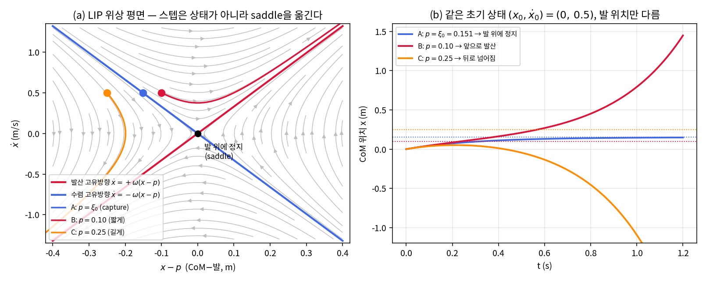
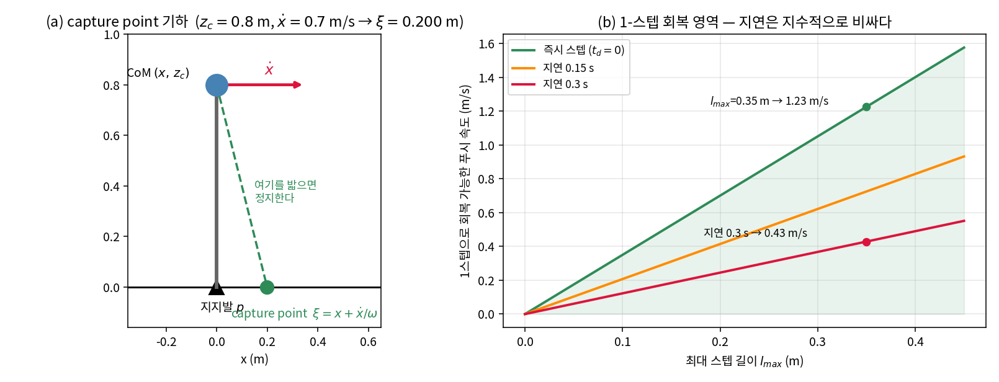
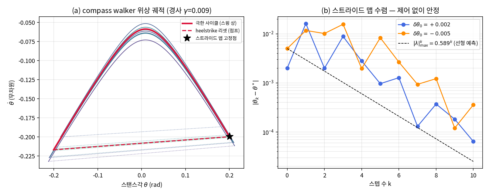
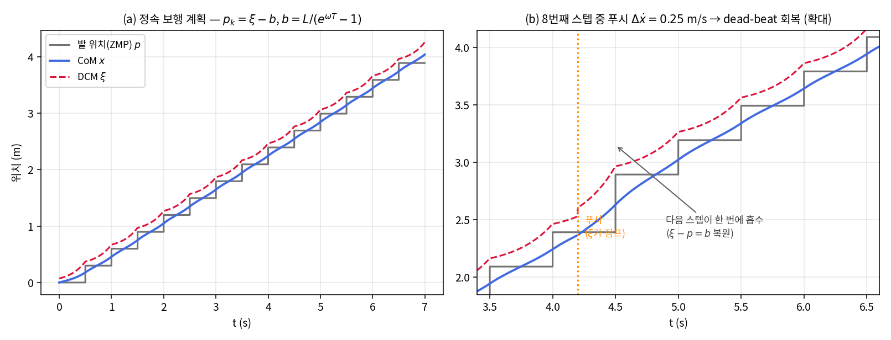

# Lec 13. 부족구동과 보행의 역학 — 넘어짐은 발산 모드다

> 하위제어 트랙 13일차, Part R3(동역학)의 마지막 강의. 선수 지식: 10강(매니퓰레이터 방정식), 12강(접촉과 마찰).
> 이 강의는 MR의 범위 밖이다(보행은 MR이 다루지 않는다) — Tedrake의 무료 노트와 LIP/capture point 원전 논문을 기초 자료로 쓴다(참고문헌).

## 한 장 요약



왼쪽: 보행 로봇의 질량중심(CoM)을 지지발 좌표에서 보면 **saddle**이다 — 파란 방향(수렴)과 빨간 방향(발산)이 있고, 상태의 발산 성분은 지수적으로 자란다. 오른쪽: **같은 물리 상태**($x_0=0$, $\dot x_0=0.5$ m/s)라도 발을 어디에 딛느냐에 따라 발 위에 정지(A)하거나, 앞으로 발산(B)하거나, 뒤로 넘어진다(C). 스텝은 상태 $(x,\dot x)$를 바꾸는 게 아니라 **saddle의 위치 $p$를 옮기는 행위**다. 보행 제어란 이 발산 방향을 발 위치 선택으로 관리하는 일이고, 오늘 강의는 그 전부를 수식 4개로 압축한다.

## 학습 목표

1. 부족구동(underactuation)을 "구동 입력의 rank < 자유도"로 정의하고, 보행 로봇이 왜 **본질적으로**(모터를 더 달아도) 부족구동인지 설명할 수 있다.
2. 선형 도립진자(LIP) 동역학 $\ddot x = (g/z_c)(x-p)$를 유도하고, 해를 수렴/발산 성분으로 분해할 수 있다.
3. capture point $\xi = x + \dot x/\omega$를 발산 성분의 정지 조건으로 유도하고, 푸시 회복 스텝을 손으로 계산할 수 있다.
4. ZMP를 정의하고, "ZMP ∈ 지지다각형" 조건이 무엇을 보장하고 무엇을 보장하지 않는지 구분할 수 있다.
5. 수동보행(compass walker)을 시뮬레이션해 극한 사이클로의 수렴을 확인하고, 스트라이드 맵 고유값으로 보행 안정성을 판정할 수 있다.

## 왜 이 강의가 필요한가

10~12강까지의 로봇은 전부 **바닥에 볼트로 고정된 팔**이었다 — 모든 관절에 모터가 있고, 어떤 관절 가속도든 토크로 만들 수 있는 완전구동(fully-actuated) 시스템. 그 세계에서는 "원하는 궤적을 따라가라"가 잘 정의된 문제다.

보행 로봇은 다르다. 몸통을 잡아주는 볼트가 없다. 공중에 뜬 순간 몸통의 6자유도는 **어떤 모터로도 직접 구동할 수 없고**, 발이 땅에 있어도 지면은 **밀 수만 있지 당길 수 없다**(12강의 단방향 접촉 + 마찰 원뿔). 즉 보행 로봇은 설계를 아무리 잘해도 부족구동이며, "넘어짐"이라는 지수적 발산 모드를 항상 품고 있다.

이 물리는 학습으로 없어지지 않는다. 48강의 Helix 02가 S0(1kHz 심 학습 전신 제어기)를 두는 이유, 보행 RL의 보상이 "속도 추종 + 넘어지면 종료"로 설계되는 이유, 16강에서 다룰 QDD 액추에이터가 보행 RL의 하드웨어 전제가 된 이유 — 전부 오늘 배우는 발산 모드 관리 문제의 다른 표현이다. 학습된 보행 정책을 읽고 평가하려면, 그 정책이 **물리적으로 무엇을 해내고 있는지**를 먼저 알아야 한다.

## 본문

### 1. 부족구동: 정의와 기원

#### 핵심 수식 E1 — 부족구동의 정의

**직관**: "모든 방향으로 마음대로 가속할 수 없는 시스템". 완전구동 로봇 팔은 어느 순간이든 임의의 관절 가속도 $\ddot q$를 토크로 실현할 수 있다. 부족구동 시스템은 갈 수 있는 가속도 방향이 제한되어 있어, **지금의 운동량과 동역학이 시키는 대로 일부는 흘러가야** 한다.

**물리·기하적 의미**: 보행 로봇의 일반화좌표는 $q = (q_{\text{base}},\, q_{\text{joint}})$ — 몸통(floating base)의 6자유도 + 관절들. 모터는 관절에만 있다. 몸통은 오직 **접촉력을 통해 간접적으로만** 움직일 수 있는데, 접촉력은 12강에서 봤듯 단방향($f_z \ge 0$)이고 마찰 원뿔 안에 있어야 한다. "허용된 가속도의 집합"이 원뿔로 잘려 있는 것이다.

**형식**: 10강의 매니퓰레이터 방정식에 입력 행렬 $B$와 접촉력을 명시하면

$$
M(q)\ddot q + C(q,\dot q)\dot q + g(q) = B\tau + J_c(q)^{\mathsf T} f_c,
\qquad B = \begin{bmatrix} 0_{6\times m} \\ I_m \end{bmatrix}
$$

$n = \dim \dot q$, $m = $ 모터 수일 때 $\operatorname{rank} B = m < n$ 이면 **부족구동**이다 [1][2]. 보행 로봇은 floating base 6행이 항상 0이므로 관절 모터를 아무리 늘려도 $m \le n-6$. 접촉력 $f_c$가 부족분을 메워주지만, $f_c$는 우리가 직접 지정하는 입력이 아니라 **단방향·마찰 제약이 걸린 종속 변수**다 — 이 제약이 아래 ZMP 조건(E4)으로 나타난다.

### 2. 선형 도립진자 (LIP)

전신 동역학($n \gtrsim 30$)으로 보행을 직접 설계하는 것은 무겁다. 1절의 통찰 — "결국 문제는 몸통(질량중심)의 발산" — 을 살리면, 로봇 전체를 **질량점 하나 + 길이를 조절하는 다리**로 요약할 수 있다. 이것이 Kajita의 선형 도립진자 모드(Linear Inverted Pendulum Mode)다 [3].

#### 핵심 수식 E2 — LIP 동역학과 그 해

**직관**: 빗자루를 손바닥 위에 거꾸로 세운 상황. 질량중심이 지지점 바로 위에 있지 않으면 기울어진 쪽으로 **점점 빨리** 넘어간다. "높이를 일정하게 유지한다"는 가정 하나가 이 낙하를 선형 방정식으로 만든다.

**물리·기하적 의미**: 질량점 $m$이 높이 $z_c$에 있고 지지점(발)이 $p$에 있을 때, 지지점 둘레의 모멘트 균형에서 $m\ddot x\, z_c = mg\,(x - p)$ — 중력이 만드는 전도 모멘트를 수평 가속이 받아낸다. 질량 $m$은 소거되고, 남는 파라미터는 단 하나:

$$
\omega = \sqrt{g / z_c}
$$

이 $\omega$가 시스템의 **고유 시간 척도**다. $z_c = 0.9$ m이면 $\omega = 3.30$ rad/s, 시정수 $1/\omega \approx 0.30$ s — 사람 크기의 로봇이 "0.3초 안에 반응하지 못하면 손쓸 수 없이 기울어지는" 이유다.

**형식**:

$$
\ddot x = \frac{g}{z_c}(x - p) = \omega^2 (x - p)
$$

해는 지수함수의 합(쌍곡선 함수)이다:

$$
x(t) = p + (x_0 - p)\cosh\omega t + \frac{\dot x_0}{\omega}\sinh\omega t
$$

$\cosh$, $\sinh$는 $e^{+\omega t}$와 $e^{-\omega t}$의 조합이므로, 좌표를 바꾸면 완전히 분리된다:

$$
\xi = x + \frac{\dot x}{\omega} \;\;(\text{발산 성분}),\qquad
\eta = x - \frac{\dot x}{\omega} \;\;(\text{수렴 성분})
$$

$$
\dot\xi = \omega(\xi - p) \;\Rightarrow\; \xi(t) = p + (\xi_0 - p)e^{+\omega t},
\qquad
\dot\eta = -\omega(\eta - p) \;\Rightarrow\; \eta(t) = p + (\eta_0 - p)e^{-\omega t}
$$

한 장 요약 (a)의 saddle이 바로 이것이다: $\eta$는 내버려 둬도 발 위로 수렴하고, **문제는 오직 $\xi$ 하나** — $e^{+\omega t}$로 자라는 1차원 발산 모드다. 2차 시스템을 통째로 제어할 필요가 없다. 발산하는 절반만 관리하면 된다.

### 3. Capture Point: 발산 성분의 정지 조건

#### 핵심 수식 E3 — capture point

**직관**: "밀렸다. **지금 당장 어디를 밟으면** 멈춰 설 수 있나?" — 그 지점이 capture point다. 사람이 밀렸을 때 반사적으로 내딛는 바로 그 위치다.

**물리·기하적 의미**: 앞 절에서 발산 성분의 동역학은 $\dot\xi = \omega(\xi - p)$였다. 발을 정확히 $p = \xi$에 두면 $\dot\xi = 0$ — 발산 성분이 **그 자리에 얼어붙는다**. 남은 수렴 성분 $\eta$는 저절로 발 위로 감기므로, 로봇은 새 발 위에서 점근적으로 정지한다. 즉 capture point는 "발산 모드의 평형 조건"이다 [4].

**형식**:

$$
\xi = x + \frac{\dot x}{\omega}, \qquad p = \xi \;\Rightarrow\; \xi(t) \equiv \xi_0,\;\; x(t) \to p \;(t\to\infty)
$$

- $p < \xi$ (발이 짧다): $\xi - p > 0$이 $e^{\omega t}$로 증폭 — 앞으로 발산. 다음 스텝이 필요하다.
- $p > \xi$ (발이 길다): $\xi - p < 0$이 증폭 — 뒤로 넘어진다.
- 문헌에 따라 같은 양을 **DCM**(Divergent Component of Motion)이라 부르고 3D로 확장한다 [9]. instantaneous capture point [8]도 같은 대상이다.



그림 (b)가 실전의 핵심이다: 1-스텝으로 회복 가능한 푸시 속도는 최대 스텝 길이에 비례($\dot x_{max} = \omega\, l_{max}$)하지만, **반응 지연 $t_d$에는 지수적으로 감소**한다($\times e^{-\omega t_d}$) — 지연 0.3 s면 회복 가능 영역이 1/2.86로 줄어든다(WE-2). 발이 닿는 범위 안에 $\xi$가 없으면 여러 스텝이 필요하며, 이것이 N-스텝 capturability 이론으로 일반화된다 [8].

### 4. ZMP와 지지다각형

지금까지 "발 위치 $p$"라고 뭉뚱그린 것의 정체를 밝히자. LIP의 $p$는 발바닥의 한 점이 아니라 **압력이 걸리는 중심점**이고, 발목 토크로 발 안에서 옮길 수 있는 **연속 제어 입력**이다.

#### 핵심 수식 E4 — ZMP(Zero-Moment Point)와 지지다각형 조건

**직관**: 발바닥이 지면에 "판처럼 붙어" 있으려면, 지면 반력의 압력 중심이 발바닥 **안에** 있어야 한다. 압력 중심이 발끝에 도달하면 발뒤꿈치가 들리고, 발은 발끝을 축으로 회전하기 시작한다 — 제어할 수 없는 자유도가 하나 새로 열리는 것이다.

**물리·기하적 의미**: ZMP는 지면 위에서 **접촉력 합력의 수평 모멘트가 0이 되는 점**이다 [7]. 단방향 접촉(12강)에서 압력은 음수가 될 수 없으므로, ZMP는 수학적으로 접촉 영역(지지다각형)의 볼록포 안에만 존재할 수 있다. "ZMP가 다각형 밖에 있다"는 말은 실제로는 "그런 운동을 만들려면 지면이 발을 당겨야 한다 — 불가능하니 발이 구른다"는 뜻이다.

**형식**: 평지 위의 질량점 모델($\ddot z = 0$)에서

$$
p_{\text{zmp}} = x - \frac{z_c}{g}\,\ddot x, \qquad p_{\text{zmp}} \in \text{지지다각형(support polygon)}
$$

LIP 식 $\ddot x = \omega^2(x - p)$를 대입하면 $p_{\text{zmp}} = p$ — **LIP의 지지점 $p$가 곧 ZMP**임이 확인된다(WE-1 코드에서 수치로 검산한다). 종합하면 보행 제어의 입력 예산은 두 층이다: 발이 붙어 있는 동안은 발 안에서 ZMP를 옮기고(연속, 범위 = 발 크기), 그것으로 부족하면 발 자체를 옮긴다(이산, 스텝). 발 크기가 유한한 한 **스텝은 필연**이며, 이 두 층을 최적화로 통합하는 방법은 23강(볼록 MPC 보행)과 24강(WBC)에서 다룰 것이다.

### 5. 수동보행과 극한 사이클

반대편 극단에서 오는 통찰이 있다. McGeer는 1990년에 **모터도 센서도 제어기도 없이** 완만한 경사를 스스로 걸어 내려가는 2족 기계를 만들었다 [5]. 중력이 에너지를 공급하고, heelstrike 충돌이 에너지를 소모하며, 둘이 균형을 이루는 주기 운동 — **극한 사이클(limit cycle)** — 이 존재하고 심지어 안정하다.

보행은 하이브리드 동역학이다:


안정성 판정은 궤적이 아니라 **스텝 단위의 맵**으로 한다: 충돌 직후 상태 $z_k = (\theta_k, \dot\theta_k)$가 다음 충돌 직후 $z_{k+1} = P(z_k)$로 가는 스트라이드 맵(Poincaré 맵)을 만들고, 고정점 $z^* = P(z^*)$에서 선형화한 야코비안의 고유값이 모두 $|\lambda| < 1$이면 사이클은 안정 — 섭동이 **스텝마다 기하급수적으로** 죽는다. WE-3에서 이것을 전부 수치로 확인한다.

이 관점의 교훈: 걷기는 "정밀 추종해야 할 궤적"이 아니라 "동역학이 원래 갖고 있는 어트랙터"에 가깝고, 좋은 보행 제어(그리고 좋은 보행 하드웨어 — 16강의 역구동성)는 그 자연 동역학과 싸우지 않고 **어트랙터의 흡인 영역을 넓히는** 일이다.

### Worked Example

#### WE-1 (손 + 코드): LIP 한 걸음 — 발 위치가 운명을 가른다

$z_c = 0.9$ m, $g=9.81$, 초기 상태 $x_0 = 0$, $\dot x_0 = 0.5$ m/s. 발 위치 3종을 비교한다.

**손계산**: $\omega = \sqrt{9.81/0.9} = 3.3015$ rad/s, $e^{\omega\cdot 1\text{s}} = 27.15$, $e^{-\omega\cdot 1\text{s}} = 0.0368$.

$$
\xi_0 = 0 + \frac{0.5}{3.3015} = 0.1514 \text{ m}, \qquad \eta_0 = -0.1514 \text{ m}
$$

- **A. $p = \xi_0 = 0.1514$** (capture): $\xi$는 그대로. $\eta(1) = 0.1514 + (-0.1514 - 0.1514)(0.0368) = 0.1403$. 따라서 $x(1) = \tfrac{\xi + \eta}{2} = 0.1459$ m, $\dot x(1) = \tfrac{\omega(\xi - \eta)}{2} = 0.0184$ m/s — 발 위에서 거의 정지.
- **B. $p = 0.10$** (짧게): $\xi(1) = 0.10 + (0.1514 - 0.10)\times 27.15 \approx 1.497$ m — 앞으로 발산.
- **C. $p = 0.25$** (길게): $\xi(1) = 0.25 + (0.1514 - 0.25)\times 27.15 \approx -2.43$ m — 뒤로 넘어짐.

**검증 코드** (폐형해와 RK4 수치적분을 맞대어 "코드가 곧 정의"):

```python
import numpy as np
g, zc = 9.81, 0.9
w = np.sqrt(g/zc)                      # 3.3015
x0, v0 = 0.0, 0.5
xi0 = x0 + v0/w                        # 0.1514

def lip_closed(p, t):                  # 폐형해
    x = p + (x0-p)*np.cosh(w*t) + (v0/w)*np.sinh(w*t)
    v = (x0-p)*w*np.sinh(w*t) + v0*np.cosh(w*t)
    return x, v

def lip_rk4(p, tf, dt=1e-4):           # 수치적분 (정의 그 자체)
    s = np.array([x0, v0])
    f = lambda s: np.array([s[1], w**2*(s[0]-p)])
    for _ in range(int(tf/dt)):
        k1=f(s); k2=f(s+dt/2*k1); k3=f(s+dt/2*k2); k4=f(s+dt*k3)
        s = s + dt/6*(k1+2*k2+2*k3+k4)
    return s

for p in [xi0, 0.10, 0.25]:
    x1, v1 = lip_closed(p, 1.0)
    assert np.allclose([x1, v1], lip_rk4(p, 1.0), atol=1e-6)
    print(f"p={p:.4f}: x(1)={x1:+.4f}  xdot(1)={v1:+.4f}  xi(1)={x1+v1/w:+.4f}")

xdd = w**2*(0.3-0.1)                   # ZMP 자기일관성 검산 (E4)
print("x - zc/g*xdd =", 0.3 - zc/g*xdd)   # → 0.1000 = p
```

실행 출력: `A: x(1)=+0.1459, ẋ(1)=+0.0184` / `B: ξ(1)=+1.4969` / `C: ξ(1)=-2.4261` — 손계산과 일치하고, ZMP 검산은 $x - \tfrac{z_c}{g}\ddot x = 0.1000 = p$를 돌려준다.

#### WE-2 (손 + 코드): 푸시 회복 스텝

서 있는 로봇($z_c = 0.8$ m → $\omega = 3.5018$)이 밀려서 $\dot x = 0.7$ m/s를 얻었다. 어디를 밟아야 하나?

**손계산**: $\xi = 0 + 0.7/3.5018 = 0.200$ m. 그 지점에 스텝하면 폐형해로 $t=1.5$ s에서 $|x - p| \approx 1.0$ mm, $\dot x \approx 3.7$ mm/s — 사실상 정지(코드로 확인: $-0.001046$ m, $+0.003663$ m/s).

**한계 계산**: 최대 스텝 길이 $l_{max} = 0.35$ m이면 즉시 스텝 기준 회복 가능 최대 푸시는 $\dot x_{max} = \omega\, l_{max} = 1.226$ m/s. 그런데 반응(지각+계획+스윙)에 $t_d = 0.3$ s가 걸리면 그동안 $\xi$가 $e^{\omega t_d} = 2.859$배 자라므로, 한계는 $1.226/2.859 = 0.429$ m/s로 추락한다. **지연은 선형이 아니라 지수로 비싸다** — 50강에서 본 "제어 계층의 주기 예산"이 보행에서 훨씬 가혹해지는 이유이고, 그림 2(b)가 이 계산이다.

#### WE-3 (코드): compass walker의 수동 극한 사이클

Garcia 등의 "가장 단순한 보행 모델" [6] — 힙에 질량이 몰린 2링크 compass gait의 극한(다리 질량→0), 경사 $\gamma$, 무차원 시간($\sqrt{l/g}$ 단위). 스탠스각 $\theta$, 다리 사이각 $\phi$:

$$
\ddot\theta = \sin(\theta - \gamma), \qquad
\ddot\phi = \ddot\theta + \dot\theta^2 \sin\phi - \cos(\theta-\gamma)\sin\phi
$$

heelstrike($\phi = 2\theta$, 스윙발 접지)에서 각운동량 보존으로 리셋:

$$
\theta^+ = -\theta^-, \quad \dot\theta^+ = \dot\theta^-\cos 2\theta^-, \quad
\phi^+ = -2\theta^-, \quad \dot\phi^+ = \dot\theta^-\cos 2\theta^- (1 - \cos 2\theta^-)
$$

```python
import numpy as np
from scipy.optimize import fsolve
gamma = 0.009                                        # 경사 (rad)

def dyn(s):
    th, phi, thd, phid = s
    thdd = np.sin(th - gamma)
    return np.array([thd, phid, thdd,
                     thdd + thd**2*np.sin(phi) - np.cos(th-gamma)*np.sin(phi)])

def rk4(s, dt):
    k1=dyn(s); k2=dyn(s+dt/2*k1); k3=dyn(s+dt/2*k2); k4=dyn(s+dt*k3)
    return s + dt/6*(k1+2*k2+2*k3+k4)

def one_step(th0, thd0, dt=2e-4, tmax=15.0):
    """충돌 직후 (theta, theta_dot) -> 다음 충돌 직후. 넘어지면 None."""
    s = np.array([th0, 2*th0, thd0, (1-np.cos(2*th0))*thd0]); t = 0.0
    while t < tmax:
        s2 = rk4(s, dt)
        g_old, g_new = s[1]-2*s[0], s2[1]-2*s2[0]
        if s2[0] < -0.05 and g_old < 0 <= g_new:     # heelstrike 가드
            a, b = s, s2                             # (theta=0 부근 스침은 무시)
            for _ in range(60):                      # 이분법으로 충돌 시각 정밀화
                m = rk4(a, dt/2); dt = dt/2
                if m[1]-2*m[0] < 0: a = m
                else: b = m
            s = b
            return -s[0], np.cos(2*s[0])*s[2], t
        s, t = s2, t+dt
        if abs(s[0]) > 1.5: return None
    return None

P = lambda z: np.array(one_step(*z)[:2] if one_step(*z) else [10, 10])
zs = fsolve(lambda z: P(z) - z, [0.2, -0.2])         # 스트라이드 맵 고정점
J = np.array([(P(zs + e) - P(zs))/1e-6
              for e in 1e-6*np.eye(2)]).T            # 유한차분 야코비안
print(zs, one_step(*zs)[2], np.abs(np.linalg.eigvals(J)))
```

실행 결과(그림 3이 이 코드의 시각화다):

- **고정점**: $\theta^* = 0.20031$ rad, $\dot\theta^* = -0.19983$, 스텝 주기 $\tau^* = 3.882$(무차원). $l = 1$ m로 환산하면 시간 단위 $\sqrt{l/g} = 0.319$ s → 주기 1.24 s, 보폭 $2\sin\theta^* = 0.398$ m, 속도 0.321 m/s — 제어기 없이 사람 비슷한 리듬으로 걷는다.
- **안정성**: 스트라이드 맵 고유값 $-0.190 \pm 0.557 j$, $|\lambda|_{max} = 0.589 < 1$ → 안정. 섭동 $\delta\theta_0 = +0.002$는 10스텝 만에 오차 $2.0\times 10^{-3} \to 6.3\times 10^{-5}$로 죽는다(복소 고유값이라 나선형으로, 단조 감소는 아니다).
- **그러나** $\delta\theta_0 = +0.01$이면 넘어진다 — **흡인 영역이 매우 좁다**. 수동보행이 "존재 증명"으로 그친 이유이자, 제어(또는 학습)가 하는 일이 "사이클 만들기"가 아니라 "흡인 영역 넓히기"임을 보여주는 수치다.



### 딥러닝 배경자를 위한 번역

- **극한 사이클 = 학습된 보행 정책이 수렴시키는 어트랙터.** RL로 훈련한 보행 정책은 기준 궤적을 재생하는 게 아니라, 폐루프 동역학(정책+물리)의 상태공간에 **안정한 주기 어트랙터를 조각**한다. 그 안정성의 수학이 오늘 본 스트라이드 맵의 spectral radius($|\lambda|_{max}<1$)다 — RNN의 안정성 분석이나 Lyapunov 지수와 같은 도구, 다른 대상.
- **발산 모드 억제 = 보행 RL 보상 설계의 물리적 의미.** "CoM 속도 추종 보상 + 넘어지면 에피소드 종료"라는 표준 보상은, 오늘의 언어로 "$\xi$를 지지다각형 근처에 붙잡는 정책에만 return이 쌓인다"는 뜻이다. termination이 곧 발산 모드 벌점이고, 정책이 배우는 것은 사실상 $\xi$ 기반 발 위치 선택이다(41강의 보상 설계와 연결).
- **$\omega$는 시스템이 학습·제어에 강제하는 시간 척도다.** 지연에 회복 영역이 $e^{-\omega t_d}$로 줄어드는 것은 stale gradient가 학습을 망치는 것의 물리 버전 — 제어 주기·추론 지연·액추에이터 대역폭(16강의 QDD가 파는 것)이 전부 $1/\omega \approx 0.3$ s보다 충분히 짧아야 한다.
- **주의: 여기의 saddle은 최적화의 saddle point와 다른 대상이다.** 손실 지형의 saddle은 파라미터 공간의 임계점이고, LIP의 saddle은 상태공간의 평형점이다. 수학(고유값 부호가 갈린다)은 같고 가리키는 물체가 다르다.

## 흔한 오해

1. **"ZMP가 지지다각형 안에 있으면 안 넘어진다"** — 아니다. ZMP 조건은 "발이 지면에서 구르지 않는다"는 **순간 조건**일 뿐이다. 발이 멀쩡히 붙어 있어도 $\xi$가 발 밖에 있으면 CoM은 발산 중이고, 스텝 없이는 넘어진다. ZMP는 현재의 접촉을, capturability는 미래의 정지 가능성을 말한다 — 서로 다른 질문이다 [8].
2. **"부족구동은 모터를 더 달면 해결된다"** — floating base의 6자유도에는 모터를 달 곳이 없다. 지면 반력이라는 "간접 입력"만 존재하고 그것은 원뿔로 제약된다(E1). 게다가 McGeer가 보였듯 부족구동은 결함이 아니라 **자원**이기도 하다 — 자연 동역학이 공짜로 걸어준다 [5].
3. **"보행 제어 = 기준 궤적 추종"** — 극한 사이클 안정성(orbital stability)은 궤적 추종과 다르다. 사이클 **위의 어느 위상에 있는지**는 강제하지 않고 사이클로 돌아오는 것만 보장하는 쪽이, 시계에 맞춰 관절각을 추종하는 것보다 푸시에 강건하다. 시간을 위상 변수로 바꾸는 이 관점 전환이 보행 문헌 전체를 관통한다 [2].
4. **"capture point가 발 닿는 범위 밖이면 끝"** — 1-스텝 불가여도 N-스텝 회복이 가능하고 [8], 스텝 말고도 발목 토크(ZMP 이동), 힙·팔 휘두르기(각운동량 — LIP가 무시한 항)라는 예산이 남아 있다. 사람이 밀렸을 때 팔을 휘젓는 것이 세 번째 예산이다.

## 실습 (1.5~2시간)

**LIP 걸음 계획기 장난감 구현 + 푸시 외란 실험.** (전부 NumPy. MuJoCo·pinocchio 불필요 — pinocchio를 쓰고 싶다면 `pip install pin`으로 설치할 수 있지만 이 실습 범위 밖이다.)

1. **정속 보행 계획기**: 목표 속도 $v_d$, 스텝 주기 $T$가 주어지면 보폭 $L = v_d T$이고, 정상 보행에서 스텝 시작 시점의 DCM-발 오프셋은 (스텝마다 $\xi - p$가 반복된다는 조건에서 유도해 보라)

$$
b = \frac{L}{e^{\omega T} - 1}
$$

$z_c=0.9$, $T=0.5$ s, $L=0.3$ m이면 $e^{\omega T} = 5.211$, $b = 0.0712$ m. 골격:

```python
import numpy as np
g, zc, T, v_d = 9.81, 0.9, 0.5, 0.6
w = np.sqrt(g/zc); L = v_d*T; b = L/(np.exp(w*T)-1)
x, xi = 0.0, b                       # CoM, DCM (xi = x + xdot/w)
dt, log = 1e-3, []
for k in range(20):                  # 20 스텝
    p = xi - b                       # ← 발 위치 규칙: 항상 현재 DCM 뒤 b 지점
    for i in range(int(T/dt)):
        xi += dt*w*(xi - p)          # DCM 동역학 (E3)
        x  += dt*w*(xi - x)          # CoM은 DCM을 따라온다 (정의에서 유도)
        # if k == 8 and i == 200: xi += 0.25/w   # ← 2번 실험: 푸시
        log.append((k, p, x, xi))
```

스텝별 평균 CoM 속도를 찍어 보라 — 0.358, 0.552, 0.589, … 로 시작해 몇 스텝 만에 0.598 m/s로 수렴해야 한다(과도 상태는 $e^{-\omega t}$로 죽는 $\eta$ 성분; 목표 0.600과의 0.3% 차이는 오일러 이산화 오차다 — RK4로 바꿔 확인해 보라).

2. **푸시 외란**: 주석 처리된 줄을 켜서 8번째 스텝 중간에 $\Delta\dot x = 0.25$ m/s를 가하라. 발 위치 규칙 $p = \xi - b$가 다음 스텝 시작에서 **발산 성분을 한 번에**(dead-beat) 복구함 — $\xi - p$가 즉시 $b$로 돌아옴 — 을 확인하고, CoM 속도는 그 뒤 2~3스텝의 $e^{-\omega t}$ 과도를 거쳐 복귀함을 관찰하라(이유: 이 규칙은 스텝 시작 조건 $\xi - p = b$를 강제로 재설정하고, 나머지는 스스로 수렴하는 $\eta$뿐이다). 규칙을 "고정 보폭 $p_{k+1} = p_k + L$"로 바꾸면 같은 푸시에 어떻게 되는가?



3. **지연 실험**: 푸시 감지 후 $t_d$초 동안 발 위치를 못 바꾸게 하고, 넘어지지 않는 최대 푸시를 $t_d \in \{0, 0.1, 0.2, 0.3\}$에서 이분법으로 측정하라. WE-2의 예측 $\dot x_{max} \propto e^{-\omega t_d}$과 비교.
4. **(심화) compass walker 놀이**: WE-3 코드로 경사 $\gamma$를 0.004~0.019까지 스윕하며 고정점과 $|\lambda|_{max}$의 변화를 그려 보라. Garcia 등은 경사가 커지면 주기 배가(period doubling)를 거쳐 혼돈에 이른다고 보고한다 [6] — 스텝 주기가 두 값을 번갈아 오가기 시작하는 경사를 찾아보라.

## Claude와 토론할 질문

1. E1의 정의로 보면 드론, 자동차, 위성, 그리고 "볼트로 고정된 7-DoF 팔이 물컵을 미는 상황"은 각각 완전구동인가 부족구동인가? 접촉이 낀 조작(12강)이 부족구동 문제가 되는 지점은 어디인가?
2. LIP의 세 가정(질량점, 높이 일정, 발목 토크 없음)을 하나씩 깨면 각각 어떤 항이 되살아나는가? 힙 전략(상체 회전)은 어느 가정의 위반으로 모델링되는가?
3. capture point 제어는 왜 "상태 2차원 중 1차원만 제어"하고도 충분한가? 이것을 18강에서 다룰 LQR로 풀면 무엇이 같고 무엇이 다를까?
4. 보행 RL에서 "넘어짐 종료 + 속도 보상"만으로 학습된 정책이 사실상 capture point 규칙을 재발명한다는 주장을 검증할 실험을 설계해 보라 (힌트: 학습된 정책의 발 위치를 $\xi$에 회귀).
5. WE-3의 수동보행은 흡인 영역이 좁아 $\delta\theta = 0.01$에도 넘어졌다. "같은 극한 사이클을 유지하면서 흡인 영역만 넓히는" 제어 입력은 어떤 모양이어야 할까? (Tedrake의 에너지 성형 논의 [2] 참고)
6. 48강의 Helix 02는 S0(1kHz 전신 제어기) 위에 S1(200Hz)을 올린다. 오늘의 언어로: 어느 층이 $\omega$와 싸우고, 어느 층이 발 위치를 고르는가? VLA(S2)가 $\xi$를 직접 다루지 않아도 되는 이유는?
7. 사족보행은 이족보다 왜 쉬운가를 지지다각형과 capture point의 언어로 설명하라. 그리고 "정적 보행 vs 동적 보행"의 구분을 오늘 수식으로 다시 정의해 보라.

## 읽을거리

1. **Tedrake, "Underactuated Robotics" 노트** (underactuated.mit.edu) — Ch.1(부족구동 정의)과 보행 모델 장(rimless wheel → compass gait → 커브드 발)만. 온라인에서 시뮬레이션을 직접 돌려볼 수 있다. (~1.5h)
2. **Pratt et al., "Capture Point" (Humanoids 2006)** [4] — §I~III까지만: capture point의 정의와 유도, 그 이상(학습 부분)은 훑기. (~30분)
3. **Kajita et al., "The 3D Linear Inverted Pendulum Mode" (IROS 2001)** [3] — §II까지만: 3D LIP의 유도. 나머지는 패턴 생성 세부라 23강 이후에 읽는 게 낫다. (~20분)

## 자가 점검

1. "보행 로봇은 모터를 몇 개 달아도 부족구동"인 이유를 매니퓰레이터 방정식의 $B$ 행렬로 설명할 수 있는가?
2. $\ddot x = \omega^2(x-p)$의 해를 $\xi, \eta$로 분해하고, 각각의 시간 상수와 물리적 의미를 말할 수 있는가?
3. $z_c = 0.8$ m 로봇이 0.7 m/s로 밀렸을 때의 capture point를 암산(±10%)으로 구할 수 있는가? ($\approx 0.2$ m)
4. "ZMP ∈ 지지다각형"이 보장하는 것과 보장하지 않는 것을 각각 한 문장으로 말할 수 있는가?
5. 스트라이드 맵의 고유값 $|\lambda|_{max} = 0.589$라는 숫자에서 "10스텝 후 섭동이 대략 몇 배로 줄어드는지"를 유도할 수 있는가?

## 참고문헌

> 웹 문서는 2026-07-08 접속 기준.

[1] K. Lynch, F. Park, "Modern Robotics: Mechanics, Planning, and Control," Cambridge Univ. Press, 2017. 무료 PDF: https://hades.mech.northwestern.edu/images/7/7f/MR.pdf
— **뒷받침**: Ch.8 — E1이 확장한 매니퓰레이터 방정식 $M\ddot q + C\dot q + g = \tau$의 형식과 표기(10강에서 유도). 보행 자체는 MR 범위 밖.

[2] R. Tedrake, "Underactuated Robotics: Algorithms for Walking, Running, Swimming, Flying, and Manipulation," 무료 온라인 노트. https://underactuated.mit.edu
— **뒷받침**: 부족구동의 정의(E1의 "임의 가속 불가" 관점, Ch.1), rimless wheel·compass gait의 극한 사이클 분석과 Poincaré 맵 안정성, 흔한 오해 3의 orbital stability 논의, 토론 질문 5의 에너지 성형.

[3] S. Kajita, F. Kanehiro, K. Kaneko, K. Yokoi, H. Hirukawa, "The 3D Linear Inverted Pendulum Mode: A simple modeling for a biped walking pattern generation," IEEE/RSJ IROS, 2001.
— **뒷받침**: E2의 LIP — 높이 일정 구속으로 선형화된 도립진자 모델과 $\ddot x = (g/z_c)x$ 동역학의 원전.

[4] J. Pratt, J. Carff, S. Drakunov, A. Goswami, "Capture Point: A Step toward Humanoid Push Recovery," IEEE-RAS Int. Conf. on Humanoid Robots, 2006.
— **뒷받침**: E3의 capture point $\xi = x + \dot x/\omega$ 정의와 푸시 회복 스텝(WE-2)의 원전.

[5] T. McGeer, "Passive Dynamic Walking," Int. J. Robotics Research, 9(2), 1990.
— **뒷받침**: §5 — 무동력 경사 보행 기계의 존재와 극한 사이클 안정성; 흔한 오해 2의 "부족구동은 자원" 논거.

[6] M. Garcia, A. Chatterjee, A. Ruina, M. Coleman, "The Simplest Walking Model: Stability, Complexity, and Scaling," ASME J. Biomechanical Engineering, 120(2), 1998.
— **뒷받침**: WE-3의 모델 방정식·heelstrike 리셋 규칙, $\gamma = 0.009$에서의 안정 보행(고정점 $\theta^* \approx 0.2003$ — 본 강의 수치 재현과 일치), 실습 4의 주기 배가→혼돈 보고.

[7] S. Kajita, H. Hirukawa, K. Harada, K. Yokoi, "Introduction to Humanoid Robotics," Springer, 2014.
— **뒷받침**: E4 — ZMP의 정의(접촉력 합력의 수평 모멘트가 0인 점)와 지지다각형 조건, $p_{\text{zmp}} = x - (z_c/g)\ddot x$ 관계.

[8] T. Koolen, T. de Boer, J. Rebula, A. Goswami, J. Pratt, "Capturability-based Analysis and Control of Legged Locomotion, Part 1: Theory and application to three simple gait models," Int. J. Robotics Research, 31(9), 2012.
— **뒷받침**: N-스텝 capturability(그림 2(b)의 1-스텝 영역 일반화, 흔한 오해 1·4), instantaneous capture point 용어.

[9] J. Englsberger, C. Ott, A. Albu-Schäffer, "Three-Dimensional Bipedal Walking Control Based on Divergent Component of Motion," IEEE Trans. on Robotics, 2015.
— **뒷받침**: E3의 "DCM" 명칭과 3D 확장이 존재한다는 언급.
