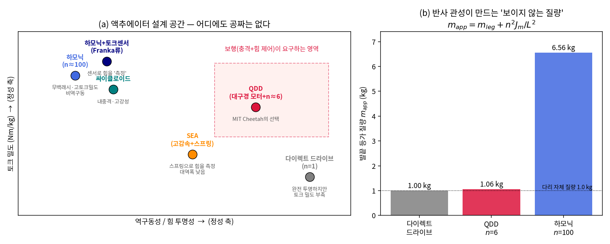
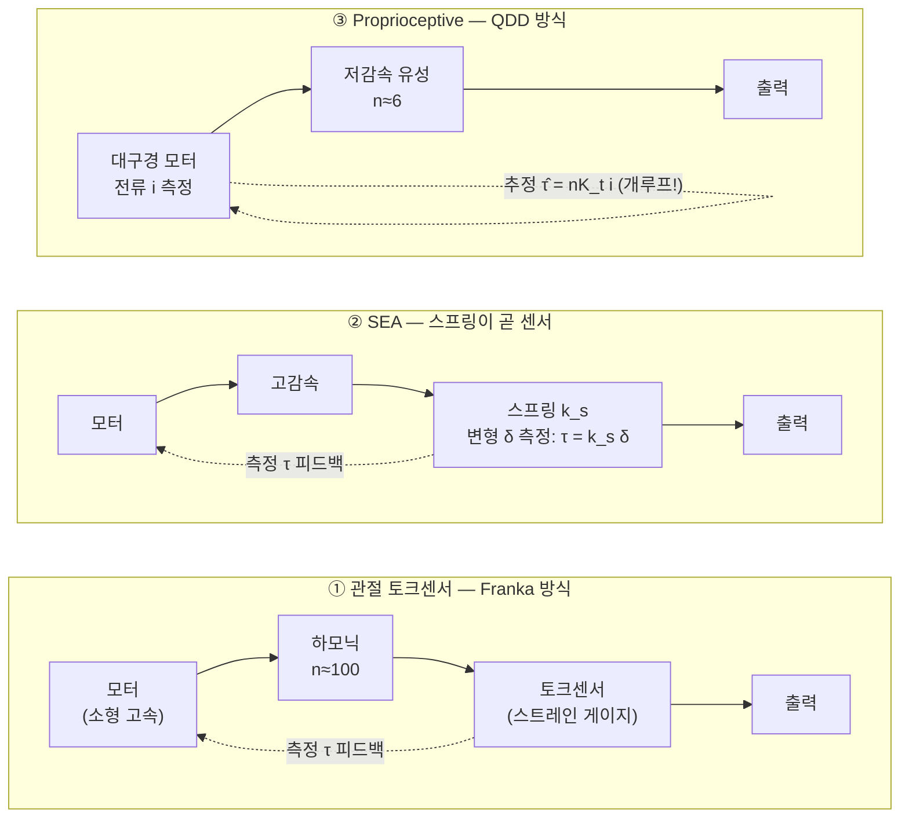
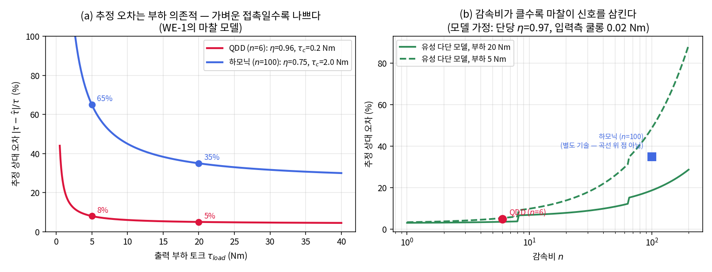
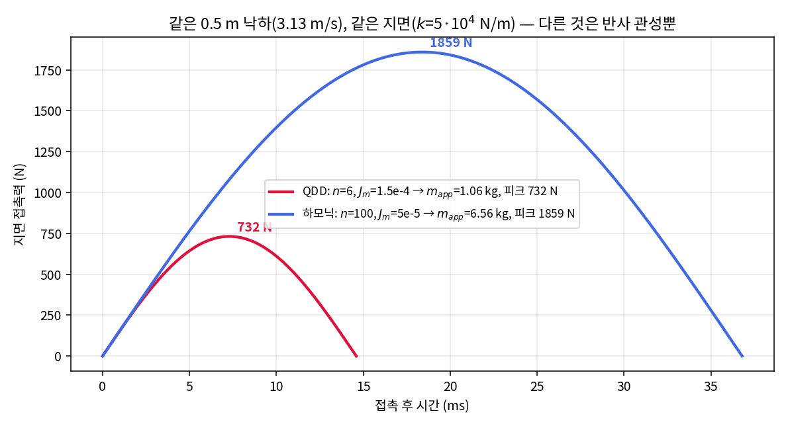
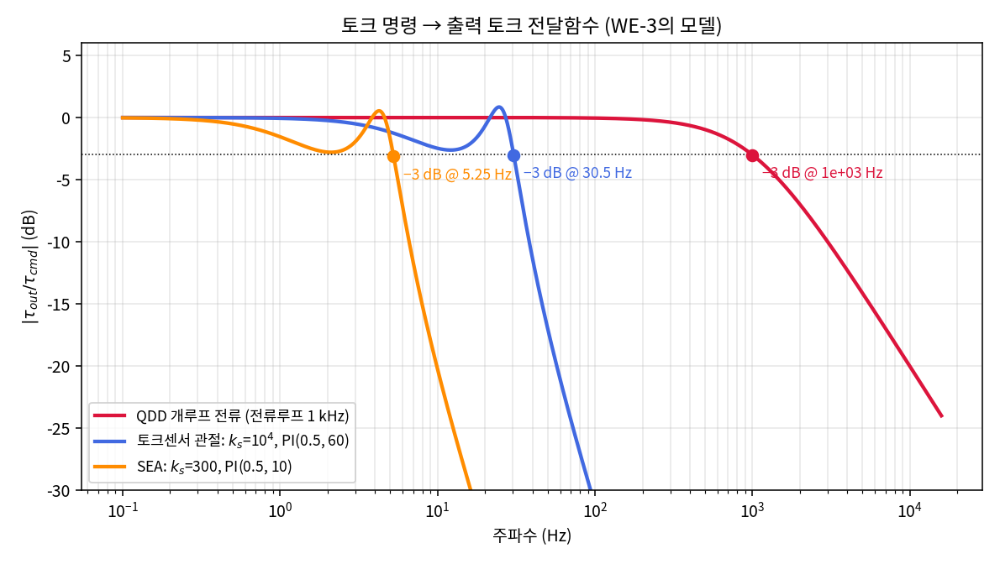
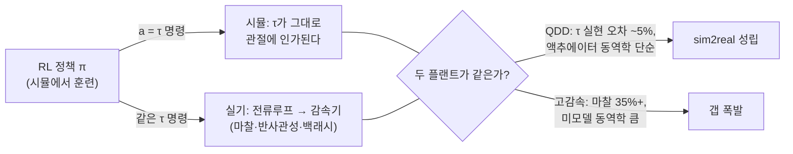
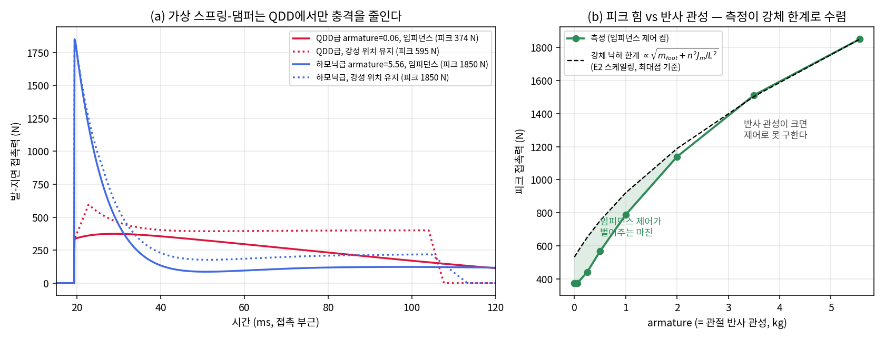

# Lec 16. QDD와 proprioceptive actuation — MIT Cheetah가 바꾼 설계 철학

> 하위제어 트랙 16일차, Part R4(액추에이터) 3일차. 선수 지식: 14강(모터·토크 상수 $K_t$·전류 루프), 15강(감속기·반사 관성 $n^2 J_m$), 13강(착지 충격이 왜 문제인지).
> 액추에이터 설계 자체는 MR 범위 밖이지만, 기어링·마찰·겉보기 관성의 표기는 MR §8.9를 기준으로 삼는다 [1]. 오늘의 주교재는 교과서가 아니라 논문 한 편 — Wensing et al., "Proprioceptive Actuator Design in the MIT Cheetah" [2]다.

## 한 장 요약



(a) 액추에이터 설계 공간: 가로축은 역구동성(밖에서 밀면 얼마나 순순히 밀리는가 = 힘의 투명성), 세로축은 토크 밀도. **오른쪽 위는 비어 있다 — 공짜가 없다.** 산업 로봇의 답(하모닉, 왼쪽 위)과 MIT Cheetah의 답(QDD, 중앙 오른쪽)은 같은 트레이드오프의 다른 꼭짓점이다. (b) 그 선택의 대가를 하나의 숫자로: 발끝에서 본 등가 질량 $m_{app} = m_{leg} + n^2 J_m / L^2$. 다리 질량은 똑같이 1 kg인데, 하모닉 관절의 발은 지면 입장에서 6.56 kg짜리 망치다. 오늘 강의는 이 두 그림 사이의 인과를 수식 세 개로 잇는다.

## 학습 목표

1. proprioceptive actuation을 정의할 수 있다: **대구경 모터 + 저감속 + 전류 기반 토크 추정**의 세 요소가 왜 한 세트인지 설명할 수 있다.
2. 전류 기반 토크 추정 $\hat\tau = n K_t i$의 상대 오차 모델 $e \approx (1-\eta) + \tau_c/\tau_{load}$를 유도하고, 오차가 감속비와 부하에 어떻게 의존하는지 계산할 수 있다.
3. 반사 관성이 착지 피크 힘을 $F_{peak} = v\sqrt{k\, m_{app}}$로 결정함을 유도하고, QDD(n=6)와 하모닉(n=100)의 충격을 정량 비교할 수 있다.
4. 힘을 아는 세 방식 — 관절 토크센서 피드백(Franka), 직렬 탄성(SEA), 개루프 전류(QDD) — 의 토크 대역폭 차이를 전달함수 모델로 비교할 수 있다.
5. "action이 토크인 보행 RL이 왜 QDD를 전제하는가"를 sim2real 관점에서 논증할 수 있다.

## 왜 이 강의가 필요한가

14강에서 "모터 수준에서는 전류가 곧 토크($\tau = K_t i$)"임을, 15강에서 "감속기는 토크를 벌지만 반사 관성·마찰·비역구동성이라는 가격표가 붙는다"는 것을 배웠다. 오늘은 그 두 사실이 하나의 **설계 철학**으로 통합되는 순간을 본다.

2010년대 초까지 로봇 관절의 표준 답은 산업용 매니퓰레이터의 답이었다: 작고 빠른 모터 + 고감속(n≈100) 하모닉 드라이브 + 위치 제어. 위치 반복정밀도가 지표인 세계에서 이것은 최적해다. 그런데 다리 로봇은 다르다 — **다리의 본업은 위치 추종이 아니라 초당 수 회씩 지면과 충돌하고 접촉력을 조절하는 것**이다(13강). 고감속 관절로 다리를 만들면 (i) 착지 충격이 기어를 부수고, (ii) 접촉력을 알 방법이 없고(마찰이 전류 신호를 삼킨다), (iii) 힘을 제어할 대역폭이 안 나온다. MIT Cheetah 팀은 이 문제를 센서나 소프트웨어를 더하는 대신 **플랜트 자체를 다시 설계**하는 것으로 풀었고 [2][3], 그 선택이 10년 뒤 보행 RL의 하드웨어 전제가 됐다. 이 이야기를 모르면 49강의 하드웨어 표에서 "QDD·역구동·전류∝토크"가 왜 한 묶음으로 등장하는지, Unitree G1과 Franka가 왜 정반대의 관절을 쓰는지 읽을 수 없다.

## 본문

### 1. 문제 설정 — 로봇은 접촉력을 어떻게 아는가

보행·조작에서 제어기가 원하는 것은 결국 **관절 토크(= 접촉력, $\tau = J^\top F$, 5강)를 알고, 만들고, 빠르게 바꾸는 능력**이다. 다리가 액추에이터에 거는 요구를 정리하면 세 줄이다 [2]:

- **충격 내성**: 달리기의 착지는 제어가 개입하기 전에 끝나는 사건이다(수 ms). 그 순간 기어가 받는 힘은 하드웨어 파라미터(반사 관성)가 결정한다 → E2.
- **힘의 인지**: 지면 반력을 모르면 힘 제어도, 접촉 감지도, 미끄러짐 대응도 없다. 문제는 "어떻게 아는가" → E1.
- **힘의 대역폭**: 발이 닿는 순간부터 떼는 순간까지 수백 ms 안에 힘 프로파일을 그려야 한다. 명령에서 실현까지의 지연이 성능을 정한다 → E3.

공학이 내놓은 답은 세 갈래다:



①과 ②는 **측정해서 되먹인다**: 출력 쪽에 변형 요소(토크센서도 사실 아주 뻣뻣한 스프링이다)를 넣고 그 변형을 읽어 피드백한다. 정확하지만, 뒤에서 보듯 피드백 루프가 대역폭을 제한하고 감속기의 마찰·관성 문제는 그대로 남는다. ③은 발상이 다르다 — **측정하지 않는다.** 모터 전류는 어차피 FOC 루프(14강)가 kHz로 재고 있으니, 감속기만 충분히 "투명"하면 전류가 곧 출력 토크다. proprioception(고유수용감각)이라는 이름은 여기서 온다: 근육의 힘을 피부(외부 센서)가 아니라 내부 신호로 아는 것. 이게 성립하려면 감속기 마찰이 작아야 하고 → 감속비가 낮아야 하고 → 그 만큼의 토크를 모터가 직접 내야 하니 → 대구경 모터가 필요하다. **세 요소는 취향의 조합이 아니라 하나의 논리 사슬이다** [2].

대구경이 답인 이유는 14강의 모터 물리에서 나온다: 공극(air gap) 전단응력이 일정할 때 토크는 $\tau \propto r_{gap}^2 \ell$ (반경 제곱 × 축 길이), 질량은 대략 $\propto r_{gap} \ell$이므로 **같은 질량이면 반경이 클수록 토크 밀도가 높다**. 그래서 Cheetah의 모터는 얇고 넓적한 팬케이크형이다 — 항공기 프로펠러용 모터와 닮은 이유다 [2][3].

### 2. 핵심 수식

#### E1. 전류 기반 토크 추정 — 정확도는 감속비의 함수다

**직관**: $\tau = K_t i$는 모터 안에서는 물리 법칙 수준으로 믿을 수 있다(14강). 문제는 그 토크가 감속기를 **통과한 뒤**다. 감속기 마찰이 떼어가는 몫을 우리는 모르므로, 그 몫이 곧 추정 오차다.

**물리·기하적 의미**: 마찰은 감속비와 함께 자란다. 입력축의 쿨롱 마찰 $\tau_{c,in}$은 출력에서 $n\,\tau_{c,in}$으로 증폭되고, 감속비를 높이려면 단수(stage)나 맞물림이 늘어 효율 $\eta$도 떨어진다(하모닉은 예압된 flexspline의 면접촉 때문에 특히). 반면 **신호(부하 토크)는 그대로**이므로, 신호 대 마찰 비는 감속비가 클수록 나빠진다. 게다가 오차의 $\tau_c/\tau_{load}$ 항은 부하가 가벼울수록 커진다 — **가벼운 접촉을 감지하는 일이 가장 어렵다**는 뜻이다(그림 2a).

**형식**: 감속기를 효율 $\eta$ + 출력측 쿨롱 마찰 $\tau_c$로 모델링하면 실제 출력 토크와 추정치는

$$
\tau_{out} = \eta\, n K_t i - \tau_c \operatorname{sgn}(\dot q), \qquad \hat\tau = n K_t i
$$

상대 오차는 (구동 방향, $\eta \approx 1$ 근사에서)

$$
e \;=\; \frac{\hat\tau - \tau_{out}}{\tau_{load}} \;\approx\; (1-\eta) \;+\; \frac{\tau_c}{\tau_{load}}
$$

첫 항은 부하와 무관한 바닥 오차(효율 손실), 둘째 항은 경부하에서 폭발하는 항이다. 정지 근처에서는 $\operatorname{sgn}(\dot q)$의 불연속(stiction) 때문에 이 모델조차 낙관적이다 — 정지 상태의 미세한 힘 추정은 전류로는 안 되고, 59강의 모멘텀 옵저버 같은 동역학 기반 추정이 필요해진다.



*그림 2. (a) 추정 오차는 부하 의존적 — 같은 관절이라도 40 Nm를 버틸 때와 2 Nm의 가벼운 접촉을 느낄 때의 오차가 다르다. (b) 감속비를 올리면(유성 다단 모델: 단당 $\eta$=0.97, 입력측 쿨롱 0.02 Nm) 마찰이 신호를 삼킨다. 수치는 WE-1과 `gen_figs.py`에서 재현.*

#### E2. 반사 관성과 착지 충격 — 15강의 회수

**직관**: 발이 지면을 때리는 순간, 지면이 상대하는 것은 다리 질량만이 아니라 **감속비 제곱으로 증폭된 로터 관성까지 포함한 등가 질량**이다(15강). 충격의 첫 몇 ms 동안 제어기는 아무것도 못 하므로(E3), 이 질량은 소프트웨어로 지울 수 없는 하드웨어의 운명이다.

**물리·기하적 의미**: 모멘트암 $L$의 다리 끝에서 본 등가 질량은 $m_{app} = m_{leg} + n^2 J_m / L^2$. 지면을 강성 $k$의 스프링으로 보면, 낙하 에너지가 전부 스프링에 저장되는 순간 힘이 최대가 된다. **피크 힘이 $\sqrt{m_{app}}$에 비례**한다는 것이 요점 — 반사 관성을 100배 키워도 충격이 100배가 되지는 않는다. $m_{leg}$에 더해진 뒤 제곱근이 붙어 완화되기 때문인데, 그래도 WE-2의 설계점에서는 2.5배, 반사 관성이 지배하는 극한에서는 $\sqrt{100}=10$배까지 커진다.

**형식**: 접촉 속도 $v$, 에너지 보존 $\tfrac{1}{2} m_{app} v^2 = \tfrac{1}{2} F_{peak}^2 / k$에서

$$
F_{peak} \;=\; v \sqrt{k\, m_{app}} \;=\; v \sqrt{k \left( m_{leg} + \frac{n^2 J_m}{L^2} \right)}
$$

(무감쇠·선형 지면 모델. 접촉 중에 계속 작용하는 중력까지 넣으면 수치가 조금 커진다 — WE-2의 RK4로 확인. 지면 감쇠는 별도 논의.) 같은 논리의 쌍대가 **역구동성**이다: 밖에서 발을 밀 때 느껴지는 저항도 $m_{app}$(+마찰)이므로, 충격에 강한 관절 = 밀면 밀리는 관절 = 전류로 힘이 보이는 관절. 세 성질은 한 뿌리다.

#### E3. 토크 대역폭 — 측정해서 되먹이는가, 애초에 아는가

**직관**: 개루프 전류 방식의 힘 대역폭은 전류 루프의 대역폭(수백 Hz~kHz, 14강) 그대로다 — 피드백할 것이 없으니 잃을 것도 없다. 반면 토크센서·SEA는 탄성 요소의 변형을 **측정해서 되먹이는 폐루프**이고, 폐루프의 게인은 탄성 요소와 로터 관성이 만드는 공진($\omega_r = \sqrt{k_s/J_r}$) 아래로 묶인다. 스프링이 물렁할수록(SEA) 공진이 낮아지고 대역폭도 낮아진다.

**물리·기하적 의미**: 토크센서는 "아주 뻣뻣한 SEA"다. 뻣뻣할수록 대역폭은 올라가지만 충격 완화 능력은 사라지고, 물렁할수록 그 반대 — 측정 기반 방식은 이 스프링 강성 눈금 위 어딘가를 골라야 한다. proprioceptive 방식은 이 눈금 밖으로 나간다: 측정을 포기하는 대신 **모델($K_t$)을 믿고** 개루프로 간다. 그 신뢰가 성립하는 조건이 바로 E1(저감속)이다.

**형식**: 로터 관성 $J_r$(출력 환산), 탄성 $k_s$, 토크 PI 제어기 $C(s) = K_p + K_i/s$, 출력 고정(접촉) 가정에서 루프 전달함수와 폐루프는

$$
L(s) = \frac{k_s (K_p s + K_i)}{s\,(J_r s^2 + b s + k_s)}, \qquad T(s) = \frac{L}{1+L}, \qquad \text{개루프 전류: } T(s) = \frac{\omega_i}{s + \omega_i}
$$

($b$는 구조 감쇠, $\omega_i$는 전류 루프 대역폭.) WE-3에서 세 방식의 −3 dB 주파수를 같은 조건으로 잰다.

### 3. Worked Example

#### WE-1 (손 + 코드): 감속비별 토크 추정 오차

**손계산**. 모델 가정(전형적 카탈로그 값 수준으로 잡은 것 — 정밀값이 아니라 자릿수가 논점):
- QDD(단일단 유성, n=6): $\eta = 0.96$, $\tau_c = 0.2$ Nm
- 하모닉(n=100): $\eta = 0.75$, $\tau_c = 2.0$ Nm

부하 20 Nm(체중 지지급)과 5 Nm(가벼운 접촉)에서:

$$
e_{QDD}(20) = 0.04 + \tfrac{0.2}{20} = 5\%, \quad e_{QDD}(5) = 0.04 + \tfrac{0.2}{5} = 8\%
$$
$$
e_{HD}(20) = 0.25 + \tfrac{2.0}{20} = 35\%, \quad e_{HD}(5) = 0.25 + \tfrac{2.0}{5} = 65\%
$$

**검증 코드**:

```python
for name, eta, tau_c in [("QDD n=6", 0.96, 0.2), ("하모닉 n=100", 0.75, 2.0)]:
    for tl in [5.0, 20.0]:
        e = (1 - eta) + tau_c / tl
        print(f"{name}: 부하 {tl:4.0f} Nm -> 오차 {100*e:.1f}%")
# QDD n=6:    5 Nm -> 8.0%   /  20 Nm -> 5.0%
# 하모닉 n=100: 5 Nm -> 65.0%  /  20 Nm -> 35.0%
```

QDD의 5~8%는 "센서 없이 힘 제어를 한다"고 말할 수 있는 수준이고, 하모닉의 35~65%는 못 쓰는 수준이다. **같은 수식, 다른 설계점 — 이것이 proprioceptive "actuation"이 소프트웨어 기법이 아니라 하드웨어 철학인 이유다.**

#### WE-2 (손 + 코드): 착지 충격 — 같은 낙하, 다른 관절

**손계산**. 다리 질량 $m_{leg} = 1$ kg, 모멘트암 $L = 0.3$ m, 지면 강성 $k = 5 \times 10^4$ N/m, 낙하 0.5 m → $v = \sqrt{2 \cdot 9.81 \cdot 0.5} = 3.13$ m/s.

- QDD: 대구경 로터 $J_m = 1.5\times10^{-4}$ kg·m², $n=6$ → $m_{app} = 1 + \frac{36 \cdot 1.5\times10^{-4}}{0.09} = 1.06$ kg
- 하모닉: 소형 고속 로터 $J_m = 5\times10^{-5}$, $n=100$ → $m_{app} = 1 + \frac{10^4 \cdot 5\times10^{-5}}{0.09} = 6.56$ kg

$$
F_{QDD} = 3.13\sqrt{5\times10^4 \cdot 1.06} \approx 721 \text{ N}, \qquad
F_{HD} = 3.13\sqrt{5\times10^4 \cdot 6.56} \approx 1793 \text{ N}
$$

로터는 QDD 쪽이 3배 무거운데도(대구경!) 감속비 제곱이 지배해 충격은 하모닉이 **2.5배**다.

**검증 코드** (중력 포함 RK4 — 해석해보다 약간 큰 값이 나와야 정상):

```python
import numpy as np
g, k, v0 = 9.81, 5e4, np.sqrt(2*9.81*0.5)
def peak(m_app, dt=1e-6):
    s, F = np.array([0.0, v0]), 0.0
    for _ in range(60000):
        f = lambda s: np.array([s[1], g - k*max(s[0], 0.0)/m_app])
        k1=f(s); k2=f(s+dt/2*k1); k3=f(s+dt/2*k2); k4=f(s+dt*k3)
        s = s + dt/6*(k1+2*k2+2*k3+k4)
        F = max(F, k*max(s[0], 0.0))
        if s[0] < 0 and s[1] < 0: break
    return F
for name, Jm, n in [("QDD", 1.5e-4, 6), ("하모닉", 5e-5, 100)]:
    m_app = 1.0 + n**2*Jm/0.3**2
    print(f"{name}: m_app={m_app:.2f} kg, 피크 {peak(m_app):.0f} N")
# QDD: m_app=1.06 kg, 피크 732 N  /  하모닉: m_app=6.56 kg, 피크 1859 N
```

시뮬 피크 비 $1859/732 = 2.54$ ≈ $\sqrt{6.56/1.06} = 2.49$ — E2의 $\sqrt{m_{app}}$ 스케일링이 그대로 확인된다.



*그림 3. 같은 0.5 m 낙하, 같은 지면 — 다른 것은 반사 관성뿐. 피크만 2.5배가 아니다: 접촉 반주기 $\pi\sqrt{m_{app}/k}$도 15 → 37 ms로 길어져, 기어가 받는 역적(임펄스 $\approx 2\,m_{app} v$)은 약 6배다. 초기 상승률 $dF/dt|_{t=0} = k\,v$는 두 경우 같다 — 하모닉 쪽은 같은 기울기로 더 높이, 더 오래 오른다.*

#### WE-3 (코드): 토크 명령 → 출력 대역폭

E3의 세 시스템을 같은 로터 관성($J_r = 0.5$ kg·m² 출력 환산)으로 비교한다. 토크센서 관절은 $k_s = 10^4$ Nm/rad, SEA는 $k_s = 300$ Nm/rad, 각각 안정한 PI 게인을 물렸다:

```python
import numpy as np
from scipy import signal
w = np.logspace(-1, 4.2, 40000) * 2*np.pi
Jr = 0.5
def closed_pi(ks, Kp, Ki, zeta=0.4):
    b = 2*zeta*np.sqrt(ks*Jr)
    num = np.array([Kp*ks, Ki*ks])                    # L(s) 분자
    den = np.array([Jr, b, ks, 0.0])                  # L(s) 분모
    return signal.TransferFunction(num, np.polyadd(den, np.pad(num, (2, 0))))
wi = 2*np.pi*1000                                     # 전류 루프 1 kHz
for name, sys in [("QDD 개루프 전류", signal.TransferFunction([wi], [1, wi])),
                  ("토크센서 k_s=1e4, PI(0.5,60)", closed_pi(1e4, 0.5, 60.0)),
                  ("SEA k_s=300, PI(0.5,10)", closed_pi(300.0, 0.5, 10.0))]:
    _, mag, _ = signal.bode(sys, w=w)
    f3 = (w/2/np.pi)[np.where(mag < mag[0]-3.0)[0][0]]
    print(f"{name}: -3dB @ {f3:.3g} Hz")
# QDD 개루프 전류: -3dB @ 998 Hz
# 토크센서: -3dB @ 30.4 Hz  /  SEA: -3dB @ 5.24 Hz
```



*그림 4. 개루프 전류는 전류 루프 대역폭(≈1 kHz)을 그대로 물려받고, 측정-피드백 방식은 탄성 요소 공진 아래로 묶인다. 물론 이 수치는 이 모델·이 게인의 결과다(더 공격적인 튜닝으로 토크센서 쪽을 끌어올릴 수 있다) — 요점은 절대값이 아니라 **개루프에는 안정성 제약 자체가 없다**는 구조적 차이다.*

### 4. 설계 철학의 실물들 — Cheetah 계보와 Franka

| | MIT Cheetah 계보 (QDD) | Franka FR3 (토크센서) | ANYmal 초기 (SEA) |
|---|---|---|---|
| 감속 | 유성 1단, Cheetah 5.8:1 [2] / Mini Cheetah 6:1 [4] | 하모닉 (고감속) | 고감속 + 스프링 |
| 힘을 아는 법 | 전류로 추정 (개루프) | 전 관절 스트레인게이지 측정 [7] | 스프링 변형 측정 [5] |
| 힘 대역폭 | 전류 루프 그대로 (높음) | 폐루프 (중간) | 스프링이 낮춤 (낮음) |
| 충격 내성 | $m_{app}$ 작음 + 역구동 → 강함 | 낮음 (하모닉 보호 필요) | 스프링이 흡수 → 강함 |
| 위치 정밀도·강성 | 낮음 (백래시·저강성) | 높음 — 조작에 최적 | 낮음 |
| 대표 후손 | Unitree 계열, 다수 보행 로봇 (49강) | 연구용 매니퓰레이터 표준 | 토크센서형으로 이행 |

Mini Cheetah의 관절 모듈은 이 철학의 염가 증명이다: 드론용 대구경 모터를 개조해 6:1 유성 기어를 물린 모듈로 피크 17 Nm를 내고, 백플립을 하고 나서도 살아남는다 [4]. 반대편의 Franka는 같은 트레이드오프에서 정반대를 골랐다 — 조작(manipulation)은 위치 정밀도와 정지 상태의 미세한 힘 측정이 본업이고 충돌은 예외 상황이므로, 하모닉의 정밀도를 취하고 힘은 센서로 산다 [7]. **어느 쪽이 옳은 게 아니라, 태스크가 다르면 최적점이 다르다** — 그림 1(a)의 지도에서 자기 태스크가 요구하는 영역을 찾는 것이 액추에이터 선정의 전부다.

이 지도는 49강의 하드웨어 표를 읽는 열쇠이기도 하다. Unitree G1/H1의 "QDD형 저감속 유성"은 Cheetah 철학의 상업화이고, 싸이클로이드(DYD류, 15강)는 "하모닉급 감속비를 유지하면서 충격 내성을 기계 구조로 사는" 제3의 절충이며, 취미용 버스서보(SO-101의 STS3215)는 고감속+온보드 위치 PID — 그림 1(a)의 왼쪽 위 구석에서 힘의 투명성을 전부 포기한 최저가 설계다. 표의 "역구동성", "전류∝토크" 같은 열이 이제 독립된 스펙이 아니라 **하나의 설계 변수(감속비)의 세 얼굴**로 보여야 한다.

### 5. 왜 이 선택이 보행 RL을 가능하게 했나

보행 RL의 표준 레시피(41강)는 시뮬레이터에서 정책 $\pi(a|s)$를 훈련해 실기로 옮기는 것이고, action $a$는 보통 관절 토크이거나 토크로 환산되는 저수준 명령이다. 이 파이프라인이 성립하려면:



1. **명령한 토크가 실제로 나와야 한다.** 시뮬의 τ는 완벽하게 인가되지만 실기의 τ는 E1의 오차를 안고 실현된다. QDD의 5~8%는 도메인 랜덤화로 덮이는 수준이고, 고감속의 수십 %는 아니다.
2. **충격에 하드웨어가 살아남아야 한다.** RL 훈련·평가는 수천 번의 험한 착지를 포함한다. E2에서 봤듯 QDD는 충격 자체가 작고, 역구동성 덕에 남는 충격도 로터가 뒤로 밀리며 흡수한다.
3. **모델링할 액추에이터 동역학이 단순해야 한다.** 반례가 증명이다: SEA 기반 ANYmal은 액추에이터의 복잡한 동역학(스프링+고감속+마찰) 때문에 시뮬과 실기의 괴리가 컸고, Hwangbo et al.은 이를 **실측 데이터로 actuator net을 따로 학습**해서 시뮬에 심는 것으로 해결해야 했다 [6]. QDD에서는 그 층이 거의 항등 사상이라 이 절차가 없거나 가볍다 — Mini Cheetah 기반 RL 연구들이 별도 액추에이터 모델 없이 고속 보행을 옮긴 것과 대조적이다 [8].

정리하면: **proprioceptive actuation은 "정책의 action space가 곧 물리적으로 실현되는 인터페이스"를 하드웨어로 보장하는 설계**다. VLA가 위치 청크를 내는 조작(50강)에서는 이 요구가 덜하지만, 접촉이 본업인 보행에서 action=τ를 고르는 순간 플랜트의 순응성은 선택이 아니라 전제가 된다.

### 딥러닝 배경자를 위한 번역

- **proprioceptive actuation은 관측 가능성(observability)의 설계다.** 접촉력이라는 외부 상태를 추정하는 문제에서, 남들은 센서를 추가하거나(토크센서) 추정기를 붙였지만(옵저버), Cheetah 팀은 **데이터 생성 과정 자체를 바꿔서** 내부 신호(전류)에 외부 정보(접촉력)가 높은 SNR로 실리게 만들었다. feature engineering이 아니라 데이터 분포 설계 — "센서가 나쁘면 모델을 키우지 말고 측정 과정을 고쳐라"의 하드웨어 버전이다.
- **E1의 오차 모델은 SNR 논증이다.** 신호(부하 토크)는 고정인데 노이즈(마찰)는 감속비에 비례해 자란다. 고감속 관절의 전류 신호로 접촉을 읽으려는 것은 label noise 65%짜리 데이터로 회귀하는 것과 같다.
- **반사 관성은 아키텍처가 정하는 inductive bias다.** 훈련(제어)으로 지울 수 없고, 배포 후 모든 상호작용에 곱해진다. E3의 대역폭 한계는 그 편향을 소프트웨어로 상쇄하려 할 때 부딪히는 학습률 상한과 같다 — 실습에서 직접 확인한다.
- **sim2real의 §5 논증은 "train-test 분포 일치"다.** action이 τ일 때 시뮬 플랜트와 실기 플랜트가 같은 함수여야 정책이 전이된다. QDD는 플랜트를 단순하게 만들어 분포를 맞추는 쪽이고, actuator net [6]은 시뮬을 실기에 맞게 fine-tuning하는 쪽이다.

## 흔한 오해

1. **"QDD는 기어가 없는 다이렉트 드라이브다"** — 아니다. 이름 그대로 '준(quasi)'-다이렉트: 보통 한 자릿수 감속비(5.8~10:1)의 유성 기어를 쓴다. 완전 다이렉트(n=1)는 토크 밀도가 모자라 다리 로봇 크기에서 성립하지 않는다(그림 1a의 왼쪽 아래) — 저감속의 이득(투명성)과 감속의 이득(토크)의 절충점이 QDD다.
2. **"전류로 토크를 아는 것은 아무 로봇에서나 된다"** — 수식으로는 어느 관절이든 $\hat\tau = n K_t i$를 계산할 수 있지만, 고감속 관절에서는 마찰이 신호를 삼켜(WE-1: 35~65%) 접촉 감지용으로는 쓸 수 없다. 추정의 정확도는 알고리즘이 아니라 **설계의 함수**다. (고감속 로봇도 마찰 모델을 정교하게 동정하면 개선된다 — Franka가 토크지령 시 마찰 보상을 하듯 [7] — 그러나 모델 기반 보정의 한계는 60강에서 다시 본다.)
3. **"토크센서가 있으면 항상 더 좋다"** — 측정은 추정보다 정확하지만, (i) 측정을 피드백하는 순간 대역폭 제약이 생기고(WE-3), (ii) 충격 내성과 반사 관성 문제는 센서가 해결해 주지 않으며(E2는 센서 유무와 무관), (iii) 정지 마찰 아래의 미세 상호작용에서는 토크센서가 명확히 우월하다. 그래서 Franka(조작)와 Cheetah(보행)의 선택이 갈린 것이다 — 태스크를 빼고 우열을 말할 수 없다.
4. **"임피던스 제어(소프트웨어)로 반사 관성을 지울 수 있다"** — 21강에서 배울 임피던스 제어는 겉보기 강성·감쇠를 바꿔 주지만, **충격의 첫 수 ms는 제어 대역폭 밖**이라 하드웨어 관성이 그대로 나타난다. 실습에서 확인한다: 반사 관성이 큰 관절은 어떤 제어 모드에서도 피크 힘이 같다(1850 N). 관성만은 하드웨어로 사야 한다.

## 실습 (1.5~2시간)

**MuJoCo 1-DoF "다리" 낙하 실험** — `armature`로 반사 관성을, `motor` 액추에이터의 토크 명령으로 가상 스프링-댐퍼(임피던스 제어의 맛보기, 21강 예고)를 구현한다.

1. 아래 XML을 `leg1dof.xml`로 저장한다. 몸통(5 kg)이 수직 슬라이드로 자유 낙하하고, 다리 관절(`ext`)의 `armature`가 반사 관성 $n^2 J_m / L^2$ 역할을 한다 (슬라이드 관절이므로 단위는 kg — WE-2의 QDD급 0.06, 하모닉급 5.56을 그대로 쓴다). 발의 초기 높이는 0.5 m다:

```xml
<mujoco model="leg1dof">
  <option timestep="1e-4" gravity="0 0 -9.81"/>
  <worldbody>
    <geom name="floor" type="plane" size="2 2 0.1" solref="0.002 1"/>
    <body name="torso" pos="0 0 0.93">
      <joint name="z" type="slide" axis="0 0 1"/>
      <geom name="body" type="sphere" size="0.08" mass="5" contype="0" conaffinity="0"/>
      <body name="leg" pos="0 0 -0.25">
        <joint name="ext" type="slide" axis="0 0 1" range="-0.15 0.15" armature="0.06"/>
        <geom name="foot" type="sphere" size="0.03" mass="0.5" pos="0 0 -0.15"/>
      </body>
    </body>
  </worldbody>
  <actuator><motor name="leg_motor" joint="ext" ctrlrange="-400 400"/></actuator>
</mujoco>
```

2. 매 스텝 `d.ctrl[0] = kv*(0 - q) - bv*qd` (가상 스프링 $k_v$=2000 N/m, 댐퍼 $b_v$=100 N·s/m)로 다리 관절을 구동하고, `mj_contactForce`로 발-지면 접촉력을 기록한다. 비교 조건은 강성 위치 유지(`kp`=4e4, `kd`=200 — "위치 제어 관절" 흉내).
3. **2×2 실험**: armature {0.06, 5.56} × 제어 {임피던스, 강성 위치}. 기대 결과(생성 스크립트 `images/lec16/gen_figs.py`의 fig5 블록과 대조): QDD급은 임피던스가 피크를 **595 → 374 N**으로 줄이지만, 하모닉급은 두 모드 모두 **1850 N** — 소프트웨어가 손댈 수 없는 구간이 존재함을 눈으로 확인하라(흔한 오해 4).
4. armature를 {0, 0.06, 0.25, 0.5, 1.0, 2.0, 3.5, 5.56}으로 스윕해 피크 힘 곡선을 그린다 (374 → 1850 N). E2의 $\sqrt{m_{app}}$ 스케일링 곡선과 겹쳐 보고, 임피던스 제어가 벌어주는 마진이 반사 관성이 커질수록 사라지는 것을 확인하라.
5. WE-2의 해석 모델과 대조: 이 시뮬의 발 질량은 0.5 kg이므로 강체 낙하 한계는 $F \propto \sqrt{0.5 + \text{armature}}$ 꼴이다. 스윕 곡선(4번)이 armature가 클수록 이 한계에 붙는 것을 확인하라 — 관성이 지배하면 제어는 구경꾼이 된다.
6. (심화) $k_v$를 500~8000으로 흔들며 "물렁한 다리"와 "뻣뻣한 다리"의 피크 힘·침하 깊이 트레이드오프를 그려 본다 — 21강 임피던스 성형의 예고편이다. `solref`를 바꿔 지면 강성에 대한 민감도도 확인.



*그림 5. 실습 기대 결과. (a) 가상 스프링-댐퍼는 반사 관성이 작을 때만 충격을 줄인다. (b) 피크 힘 vs armature — 측정값(초록)이 E2의 강체 낙하 한계(점선)로 수렴한다.*

## Claude와 토론할 질문

1. Cheetah 관절에 토크센서를 "그냥 추가"하면 어떤가? 비용·배선 말고도, 센서가 관절에 넣는 컴플라이언스와 충격 취약성, 그리고 개루프 전류 대비 실익이 있는 조건을 논하라.
2. E1 모델이 낙관적인 지점: 정지 마찰(stiction) 근처에서 전류 기반 추정은 왜 실패하는가? 정지 상태에서 가해지는 1 N의 외력을 감지하려면 무엇이 필요한가(59강의 모멘텀 옵저버 예고).
3. Franka가 QDD를 쓰지 않는 이유를 태스크 요구(위치 정밀도, 백래시, 정지 상태 힘 분해능, 안전 인증)에서 역산해 보라. 반대로 Cheetah에 하모닉+토크센서를 쓰면 무엇부터 부서지는가?
4. Unitree G1(49강)의 관절은 이 강의의 설계 공간 어디에 있는가? "QDD형 저감속 유성"이라는 표현에서 예상되는 감속비 범위와, 휴머노이드가 사족보다 토크 밀도 압박이 심한 이유(팔은 간헐 부하, 다리는 체중 지지)를 논하라.
5. action이 관절각 청크인 VLA 조작(50강)과 action이 τ인 보행 RL은 하드웨어에 요구하는 것이 어떻게 다른가? "위치 명령 로봇에서는 QDD의 이점이 사라지는가"를 임피던스 하한(21강 예고)과 연결해 논증하라.
6. E2의 단순 모델이 틀리는 지점들을 나열하라: 무릎 각도에 따른 유효 모멘트암 변화, 발 질량 vs 다리 전체 질량, 지면의 비선형성, 감쇠. 각각이 피크 힘을 어느 방향으로 움직이는가?
7. 저감속의 열 비용: 같은 출력 토크에 QDD는 하모닉보다 큰 모터 전류가 필요하다($i = \tau/(nK_t)$, 14강의 $i^2R$ 발열). Cheetah류가 이것을 견디는 방식(대구경 = 큰 $K_t$, 간헐적 고토크, 열용량 활용)을 14강의 열 한계 논의와 연결해 설명하라.

## 읽을거리

1. **Wensing et al., "Proprioceptive Actuator Design in the MIT Cheetah" [2]** (§I~III, ~40분): 이 강의의 원전. 설계 공간 분석(§II — 그림 1a의 원본 논리)과 임팩트 완화·대역폭 논증까지 읽으면 충분. 실험 상세(§V 이후)는 훑기만.
2. **Katz et al., "Mini Cheetah" [4]** (§II Actuator Design만, ~15분): 철학이 저비용 모듈로 압축되는 과정. 취미용 부품으로 재현된다는 사실 자체가 논점.
3. (선택) **Hwangbo et al. [6]** (actuator net 부분만): 반대편 증거 — 액추에이터가 투명하지 않을 때 sim2real에 무엇이 더 필요해지는지.

## 자가 점검

1. proprioceptive actuation의 세 요소(대구경·저감속·전류 추정)가 왜 논리적으로 한 세트인지 사슬로 말할 수 있는가?
2. $e \approx (1-\eta) + \tau_c/\tau_{load}$를 유도하고, WE-1의 5%/8%/35%/65%를 손으로 재계산할 수 있는가?
3. $F_{peak} = v\sqrt{k\,m_{app}}$를 에너지 보존으로 유도하고, QDD와 하모닉의 피크 비가 왜 2.5배인지($\sqrt{m_{app}}$ 비) 설명할 수 있는가?
4. 세 힘 제어 방식의 대역폭 순서(개루프 전류 > 토크센서 피드백 > SEA)와 그 구조적 이유(피드백 루프와 탄성 공진)를 말할 수 있는가?
5. "보행 RL이 QDD를 전제한다"의 세 논거(토크 실현 정확도, 충격 생존, 액추에이터 동역학의 단순함)를 반례(ANYmal actuator net)와 함께 설명할 수 있는가?

## 참고문헌

> 웹 문서는 2026-07-08 접속 기준.

[1] K. Lynch, F. Park, "Modern Robotics: Mechanics, Planning, and Control," Cambridge Univ. Press, 2017. 무료 PDF: https://hades.mech.northwestern.edu/images/7/7f/MR.pdf
— **뒷받침**: §8.9 (Actuation, Gearing, and Friction) — 기어링에 의한 겉보기 관성(반사 관성)·마찰의 정식화와 표기. E1·E2의 모델링 관례가 이 절을 따른다.

[2] P. M. Wensing, A. Wang, S. Seok, D. Otten, J. Lang, S. Kim, "Proprioceptive Actuator Design in the MIT Cheetah: Impact Mitigation and High-Bandwidth Physical Interaction for Dynamic Legged Robots," IEEE Transactions on Robotics, vol. 33, no. 3, 2017.
— **뒷받침**: 이 강의의 핵심 문헌. proprioceptive actuation 개념과 설계 공간 논증(§1·그림 1a), 대구경 모터의 토크 밀도 스케일링(공극 반경 논증), MIT Cheetah의 저감속(5.8:1) 선택, 임팩트 완화·고대역 힘 제어 주장(E2·E3의 문제 설정).

[3] S. Seok, A. Wang, M. Y. Chuah, D. J. Hyun, J. Lee, D. M. Otten, J. H. Lang, S. Kim, "Design Principles for Energy-Efficient Legged Locomotion and Implementation on the MIT Cheetah Robot," IEEE/ASME Transactions on Mechatronics, vol. 20, no. 3, 2015.
— **뒷받침**: 대구경 모터·저감속 설계 원칙의 에너지 효율 측면(§1의 팬케이크형 모터 서술), Cheetah 설계 철학의 계보.

[4] B. Katz, J. Di Carlo, S. Kim, "Mini Cheetah: A Platform for Pushing the Limits of Dynamic Quadruped Control," IEEE ICRA, 2019.
— **뒷받침**: §4 표의 Mini Cheetah 행 — 6:1 유성 감속, 모듈 피크 토크 17 Nm, 저비용 대구경 모터 개조 방식, 백플립 등 험한 동작 생존.

[5] G. A. Pratt, M. M. Williamson, "Series Elastic Actuators," IEEE/RSJ IROS, 1995.
— **뒷받침**: §1·E3의 SEA — 직렬 스프링으로 힘을 측정·제어하는 구조와 그 대역폭 트레이드오프의 원전.

[6] J. Hwangbo, J. Lee, A. Dosovitskiy, D. Bellicoso, V. Tsounis, V. Koltun, M. Hutter, "Learning agile and dynamic motor skills for legged robots," Science Robotics, vol. 4, no. 26, 2019. arXiv:1901.08652. https://arxiv.org/abs/1901.08652
— **뒷받침**: §5 논거 3 — SEA 기반 ANYmal의 sim2real에서 실측 데이터로 actuator net을 학습해 시뮬에 삽입한 사례.

[7] Franka Robotics, FCI/libfranka 문서. https://frankarobotics.github.io/docs/
— **뒷받침**: §4 표의 Franka 행 — 전 관절 토크센서, 1 kHz 토크 인터페이스, 토크지령 시 중력·마찰 보상 (25·50강과 동일 출처).

[8] G. B. Margolis, G. Yang, K. Paigwar, T. Chen, P. Agrawal, "Rapid Locomotion via Reinforcement Learning," RSS 2022. arXiv:2205.02824. https://arxiv.org/abs/2205.02824
— **뒷받침**: §5 논거 3 — Mini Cheetah(QDD)에서 시뮬 훈련 정책으로 고속 주행을 실현한 보행 RL 사례.

[9] Google DeepMind, MuJoCo 문서. https://mujoco.readthedocs.io
— **뒷받침**: 실습의 `armature`(관절 반사 관성 파라미터)·`solref`·`mj_contactForce` 의미.

*수치 재현성: 본문·그림의 모든 수치(WE-1의 추정 오차 5/8/35/65%, WE-2의 $m_{app}$ 1.06/6.56 kg·$v_0$ 3.13 m/s·해석 피크 721/1793 N·RK4 피크 732/1859 N·피크 비 2.54≈2.49·그림 3의 접촉 시간 약 15/37 ms(해석 반주기 14.5/36.0 ms)와 임펄스 비 $2 m_{app} v$ 기준 약 6배, WE-3의 −3 dB 998 Hz/30.4 Hz/5.24 Hz, 실습의 피크 374/595/1850 N과 armature 스윕 374→1850 N)는 본문 코드 블록과 `images/lec16/gen_figs.py`의 실행 출력이다 — numpy 1.26 / scipy 1.15 / mujoco 3.2.5 기준 재현 확인.*

<!-- lecture-nav -->

---

⬅ 이전: [Lec 15. 감속기와 전동 — 토크를 사고 속도를 파는 시장](lec15-gears-transmissions.md)　｜　[📖 전체 목차](../README.md)　｜　다음: [Lec 17. 피드백 제어 최소 코스 — 딥러닝 엔지니어를 위한 하루 압축](../part05-control/lec17-feedback-control-basics.md) ➡
