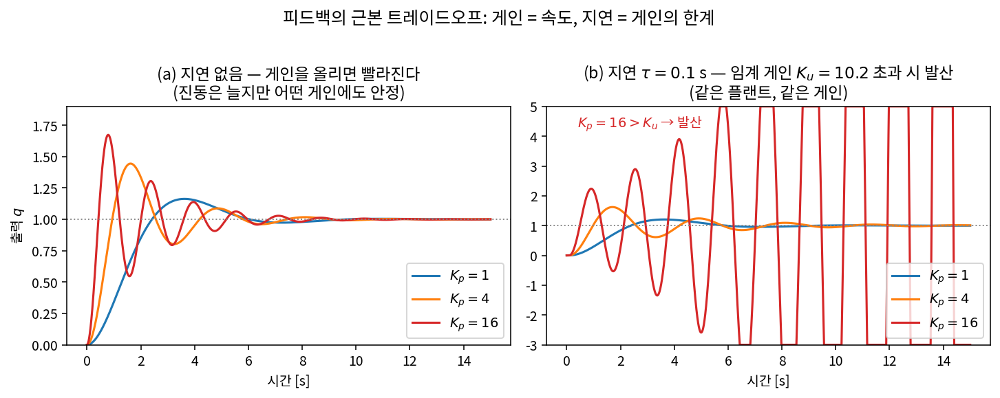
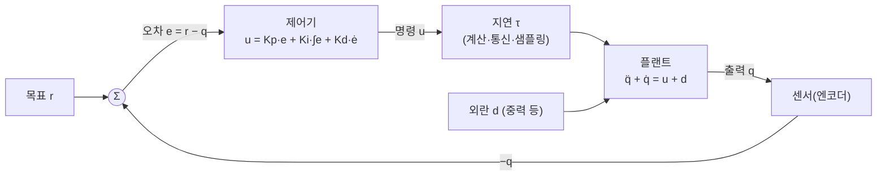
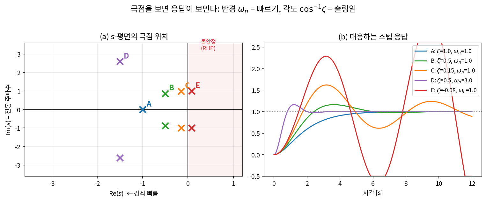
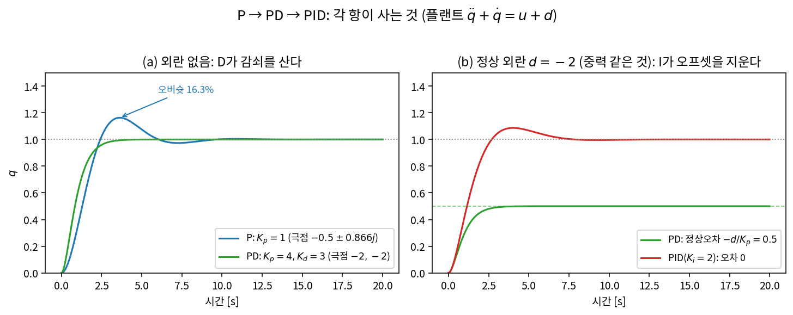
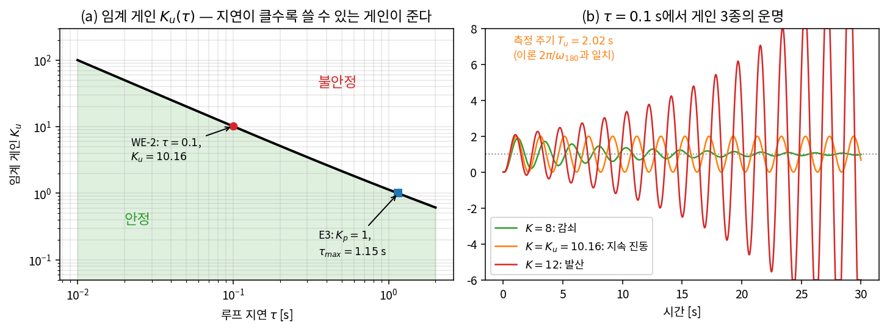
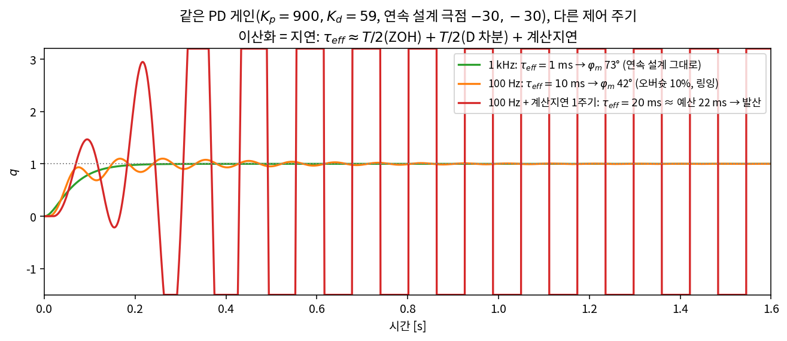

# Lec 17. 피드백 제어 최소 코스 — 딥러닝 엔지니어를 위한 하루 압축

> 하위제어 트랙 17일차, Part R5(제어) 1일차. 선수 지식: 공용 0강(특히 E3 — 오늘 그 유도를 완성한다), 10강(매니퓰레이터 방정식), 14강(전류 루프).
> 기초 참고서: Modern Robotics(이하 MR) Ch.11 §11.1~11.4, Åström & Murray "Feedback Systems"(무료 PDF, [2]). 이 강의는 한 학기짜리 고전 제어를 "VLA 스택 아래에서 살아남는 최소량"으로 압축한 것이다.

## 한 장 요약



같은 플랜트, 같은 P 게인. 왼쪽(지연 없음)에서는 게인을 16배로 올려도 진동만 늘 뿐 언제나 수렴한다. 오른쪽에 **루프 지연 0.1초**를 넣는 순간, $K_p=16$은 발산한다 — 임계 게인 $K_u = 10.2$가 생겼기 때문이다. 오늘 강의는 이 두 그림 사이에서 일어난 일을 정확히 말할 수 있게 되는 것이다: **게인은 속도를 사고, 지연은 게인의 한계를 정한다.** 학습률을 올리다 loss가 발산해 본 적이 있다면, 사실 이 그림을 이미 본 것이다.

## 학습 목표

1. 2차 시스템의 극점 $(\zeta, \omega_n)$에서 스텝 응답의 모양(오버슛·정착시간·진동 주파수)을 읽어낼 수 있다.
2. PID 각 항의 역할과 부작용을 설명하고, 2차 플랜트에 원하는 극점을 놓는 게인을 손으로 계산할 수 있다.
3. 지연이 이득은 안 바꾸고 위상만 깎는다는 사실에서 $\tau_{\max} \approx \varphi_m/\omega_c$를 유도하고(0강 E3 완성), 지연 있는 루프의 임계 게인을 계산할 수 있다.
4. 이산 구현(샘플링·차분·계산지연)을 등가 지연 $\tau_{\text{eff}}$로 환산해 "제어 주기는 몇 Hz여야 하는가"에 수치로 답할 수 있다.
5. MuJoCo 1-DoF 진자에 PID를 구현해 손 튜닝·Ziegler-Nichols 튜닝을 수행하고, 100Hz vs 1kHz 제어 주기의 차이를 실험으로 보일 수 있다.

## 왜 이 강의가 필요한가

50강에서 본 대로, VLA가 액션 청크를 아무리 똑똑하게 내도 그 청크는 결국 100~1000Hz의 피드백 루프가 실행한다. 그 루프가 발진하면 로봇은 "떨고", 게인이 낮으면 "쳐진다" — 학습 정책의 성능 이전에 하위 루프의 품질이 천장을 정한다. Part R4(14~16강)에서 토크를 만드는 물리를 배웠으니, 이제 그 토크로 **명령을 따르게 만드는 루프**를 배울 차례다.

이 강의는 Part R5 여덟 강의의 어휘 사전이기도 하다. 극점·감쇠비·대역폭·위상여유라는 네 단어 위에 18강(LQR — 튜닝을 최적화로), 19강(computed torque — 비선형을 지워 오늘의 선형 오차 동역학으로 환원), 21강(임피던스 — $K_p, K_d$의 물리적 재해석), 23강(MPC)이 순서대로 쌓인다. 그리고 딥러닝 배경자에게는 보너스가 있다: 피드백 제어의 안정성 이론은 **여러분이 경험으로만 아는 학습 동역학(학습률·모멘텀·stale gradient)의 해석적 원형**이다.


## 본문

### 1. 피드백이라는 아이디어

개루프(open-loop) 제어는 "모델을 믿고 명령을 미리 계산해 쏘는 것"이다. 모델이 완벽하고 외란이 없으면 충분하다 — 그러나 10강에서 봤듯 실제 플랜트에는 우리가 모르는 마찰, 부하 변화, 중력이 있다. 폐루프(closed-loop) 피드백의 아이디어는 단순하다: **출력을 측정해서 목표와의 오차에 비례해 미는 것.** 오차가 있어야만 작동하지만, 바로 그 덕분에 "무엇이 오차를 만들었는지"를 몰라도 교정된다. 모델 불확실성과 외란을 한 방에 흡수하는 이 성질이, 1kHz 피드백 루프가 모든 로봇의 최하층에 있는 이유다(50강).



**오늘의 실험대.** 10강의 매니퓰레이터 방정식 $M(q)\ddot q + C(q,\dot q)\dot q + g(q) = \tau$를 1-DoF로 줄이고 관성 $M=1$, 점성마찰 $b=1$로 두면:

$$
\ddot q + \dot q = u + d
$$

$u$는 토크 명령, $d$는 정상 외란(중력이라 생각하라). 관절 하나의 위치 제어가 이 모양이고, 19강에서 배울 computed torque의 요점이 "다관절 비선형 로봇을 정확히 이 꼴로 만드는 것"이므로, 이 장난감이 곧 본편이다. 참고로 속도만 제어하면 $\dot v + v = u$ — 극점 하나($s=-1$)짜리 **1차 시스템**으로, 시상수 $1/|s|$초 만에 63%까지 오르는 단조 응답이 전부다. 재미있는 일(진동, 오버슛)은 극점이 두 개일 때부터 시작된다.

### 2. 핵심 수식

#### E1. 2차 표준형 — 극점 두 개가 응답의 모든 것을 결정한다

**직관**: 피드백 루프의 응답은 대부분 "얼마나 빠른가"와 "얼마나 출렁이는가" 두 숫자로 요약된다. 그 두 숫자가 고유진동수 $\omega_n$과 감쇠비 $\zeta$다.

**물리·기하적 의미**: 폐루프 특성식의 근(=극점)을 복소평면에 찍으면, **원점에서의 반경이 $\omega_n$(빠르기), 허수축과의 각도가 $\cos^{-1}\zeta$(출렁임)** 이다. 실부 $-\zeta\omega_n$은 진폭 포락선 $e^{-\zeta\omega_n t}$의 감쇠율, 허부 $\omega_d = \omega_n\sqrt{1-\zeta^2}$는 실제 진동 주파수. 극점이 왼쪽으로 갈수록 빨리 죽고, 허수축에 붙을수록 오래 울리고, **오른쪽 반평면으로 넘어가면 발산한다**. 그림 2에서 다섯 극점과 다섯 응답을 짝지어 보라.



**형식**: 표준형 $\ddot e + 2\zeta\omega_n \dot e + \omega_n^2 e = 0$의 특성식과 근:

$$
s^2 + 2\zeta\omega_n s + \omega_n^2 = 0, \qquad s = -\zeta\omega_n \pm j\,\omega_n\sqrt{1-\zeta^2}
$$

$\zeta < 1$(부족감쇠)이면 진동하며 수렴, $\zeta = 1$(임계감쇠)이면 진동 없이 가장 빠르게, $\zeta > 1$(과감쇠)이면 굼뜨게 수렴한다. 스텝 응답의 요약 공식 (MR §11.2.2):

$$
\text{오버슛 } M_p = e^{-\pi\zeta/\sqrt{1-\zeta^2}}, \qquad \text{2\% 정착시간 } t_s \approx \frac{4}{\zeta\omega_n}
$$

$\zeta = 0.5$이면 $M_p = e^{-0.5\pi/0.866} \approx 16.3\%$ — 아래 WE-1에서 손으로 확인한다.

#### E2. PID — 특성식의 계수를 손가락으로 조작하는 장치

**직관**: 오차의 **현재**($K_p e$: 지금 얼마나 틀렸나), **과거**($K_i \int e$: 그동안 얼마나 밀렸나), **미래**($K_d \dot e$: 어느 방향으로 가고 있나)에 각각 비례해 민다.

**물리·기하적 의미**: P는 목표에 매단 **가상 스프링**(강성 $K_p$), D는 **가상 댐퍼**(점성 $K_d$), I는 정상 외란(중력·마찰 바이어스)을 오차가 0이 될 때까지 학습하는 **자동 바이어스 보정기**다. 21강에서 이 "가상 스프링-댐퍼"라는 해석이 임피던스 제어라는 이름으로 접촉의 세계까지 확장된다.

**형식**: 제어 법칙과, 오늘의 플랜트에 넣었을 때의 폐루프 특성식:

$$
u = K_p e + K_i \int_0^t e\,dt + K_d \dot e
$$

$$
\text{PD: } s^2 + (1 + K_d)\,s + K_p = 0 \qquad \text{PID: } s^3 + (1+K_d)\,s^2 + K_p\,s + K_i = 0
$$

PD의 식을 E1의 표준형과 겹쳐 읽으면 $K_p = \omega_n^2$, $1 + K_d = 2\zeta\omega_n$ — **게인 튜닝이란 특성식의 계수를, 곧 극점을 옮기는 일**이다. 각 항의 대가도 여기서 읽힌다:

| 항 | 사는 것 | 대가 |
|---|---|---|
| $K_p\uparrow$ | 빠름($\omega_n = \sqrt{K_p}$), 정상오차 $\downarrow$ | $\zeta = \frac{1+K_d}{2\sqrt{K_p}} \propto 1/\sqrt{K_p}$ — 출렁임 증가 |
| $K_i$ | 정상오차 완전 제거(외란의 적분 학습) | 차수 +1, 위상 $-90°$ 추가 → 안정성 잠식, 포화 시 windup |
| $K_d$ | 감쇠(위상 리드) — 오버슛 억제 | 고주파 이득 $\propto K_d\omega$ → 센서 노이즈 증폭 |

#### E3. 지연 — 위상을 훔치는 도둑, 그리고 $\tau_{\max} = \varphi_m/\omega_c$ (0강 E3의 유도 완성)

**직관**: 지연된 피드백은 "과거의 오차"에 반응하는 것이다. 진동의 반주기만큼 늦으면 교정이 정확히 **거꾸로** 작용해, 루프가 자기 진동을 스스로 증폭한다.

**물리·기하적 의미**: 지연 $\tau$의 주파수 응답은 $e^{-j\omega\tau}$ — 크기는 모든 주파수에서 정확히 1이고(**이득을 전혀 안 바꾸고**), 위상만 $-\omega\tau$ 라디안 깎는다. 빠른 진동일수록(큰 $\omega$) 같은 시간 지연이 더 큰 위상 각도를 훔친다. "루프가 얼마나 빠르게 반응하려 드는가"($\omega_c$)와 "위상 여유가 얼마나 남았는가"($\varphi_m$)의 비율이 곧 버티는 지연의 한계다.

**형식**: 루프 전달함수 $L(s) = C(s)G(s)$(제어기×플랜트)에 대해, **크로스오버 주파수** $\omega_c$는 $|L(j\omega_c)| = 1$인 주파수(루프가 아직 "힘이 있는" 가장 높은 주파수 ≈ 폐루프 대역폭), **위상여유** $\varphi_m = 180° + \angle L(j\omega_c)$는 그 주파수에서 위상이 $-180°$(교정이 거꾸로 뒤집히는 각)까지 남은 여유다. 지연을 추가하면:

$$
L_\tau(j\omega) = L(j\omega)\,e^{-j\omega\tau} \;\Rightarrow\; |L_\tau| = |L| \ (\omega_c \text{ 불변}), \quad \angle L_\tau(j\omega_c) = \angle L(j\omega_c) - \omega_c \tau
$$

크기가 안 변하므로 $\omega_c$가 그대로이고, 불안정 경계는 위상여유가 소진되는 순간이다:

$$
\varphi_m - \omega_c\,\tau_{\max} = 0 \quad\Longrightarrow\quad \boxed{\tau_{\max} = \frac{\varphi_m}{\omega_c}}
$$

0강에서 약속만 했던 식이 이것이다. 근사처럼 보이지만, "지연은 $\omega_c$를 움직이지 않는다"는 사실 덕분에 (크로스오버가 하나뿐인 루프에서는) **정확한 경계**다. 따름정리 하나가 이 트랙 전체를 관통한다: **대역폭을 2배로 올리면 허용 지연은 절반이 된다.** 빠른 루프일수록 신선한 데이터를 요구한다 — 50강의 주기 계층(전류 수십 kHz > 토크 1kHz > VLA 수 Hz)은 이 반비례의 건축학이다.

### 3. Worked Example

#### WE-1 (손 + 코드): P → PD → PID — 극점을 옮기며 스텝 응답 바꾸기

**손계산 ① P만 ($K_p = 1$)**: 특성식 $s^2 + s + 1 = 0$ → $s = -0.5 \pm 0.866j$. E1과 대조하면 $\omega_n = 1,\ \zeta = 0.5$ → 오버슛 $16.3\%$, 피크 시각 $t_p = \pi/\omega_d = \pi/0.866 = 3.63$ s. 그리고 중요한 관찰: $K_p$를 아무리 올려도 실부는 $-b/2M = -0.5$에 고정이다 — **P 게인은 진동만 빠르게 할 뿐 감쇠(정착)를 못 산다.**

**손계산 ② PD ($\zeta=1$, $\omega_n=2$ 목표)**: 원하는 특성식 $(s+2)^2 = s^2 + 4s + 4$. 계수 비교로 $K_p = 4$, $1 + K_d = 4 \Rightarrow K_d = 3$. 극점 $-2, -2$(임계감쇠) — 진동 없이 P보다 4배 빠르다. 그러나 정상 외란 $d = -2$(중력)를 걸면 평형에서 $K_p e_{ss} = -d$ → $e_{ss} = 0.5$. **스프링은 늘어난 채 버틴다.**

**손계산 ③ PID ($K_i = 2$ 추가)**: 특성식 $s^3 + 4s^2 + 4s + 2 = 0$. 3차의 안정 판별(Routh 조건: 모든 계수 $>0$이고 $a_2 a_1 > a_0$): $4 \cdot 4 = 16 > 2$ ✓. 적분기가 외란을 통째로 흡수해 $e_{ss} = 0$. 대가: 극점이 $-2.84,\ -0.58 \pm 0.61j$로 흩어지며 지배극이 느려졌다($\zeta \approx 0.69,\ \omega_n \approx 0.84$).

**검증 코드**:

```python
import numpy as np

# 극점: 특성식의 근
print("P  (Kp=1):        ", np.round(np.roots([1, 1, 1]), 3))
print("PD (Kp=4,Kd=3):   ", np.round(np.roots([1, 4, 4]), 3))
print("PID(Kp=4,Ki=2,Kd=3):", np.round(np.roots([1, 4, 4, 2]), 3))

# 시간영역 검증: 플랜트 q'' + q' = u + d
def sim(Kp, Ki, Kd, d=0.0, T=25.0, dt=1e-4):
    q = qd = ei = 0.0; qs = []
    for _ in range(int(T/dt)):
        e = 1.0 - q; ei += e*dt
        u = Kp*e + Ki*ei - Kd*qd          # r 상수이므로 ė = -q̇
        qd += (u - qd + d)*dt; q += qd*dt; qs.append(q)
    return np.array(qs)

q = sim(1, 0, 0)                          # P
print(f"P: 오버슛 {100*(q.max()-1):.1f}% (이론 16.3%), 피크 t={q.argmax()*1e-4:.2f}s (이론 3.63s)")
q = sim(4, 0, 3, d=-2.0)                  # PD + 정상 외란
print(f"PD + 외란: 정상오차 {1-q[-1]:.4f} (이론 -d/Kp = 0.5)")
q = sim(4, 2, 3, d=-2.0)                  # PID + 정상 외란
print(f"PID + 외란: 정상오차 {1-q[-1]:.2e} (이론 0)")
```

출력: 극점 `[-0.5±0.866j]`, `[-2, -2]`, `[-2.839, -0.58±0.606j]`; 오버슛 `16.3%`·피크 `3.63s`, PD 정상오차 `0.5000`, PID 정상오차 `-5.07e-07`. 손계산 세 개가 전부 수치로 재현된다.



#### WE-2 (손 + 코드): 지연이 만드는 임계 게인 — 게인을 올리다 부러지는 지점

플랜트 $G(s) = \frac{1}{s(s+1)}$(오늘의 플랜트), P 제어, 루프 지연 $\tau = 0.1$ s. 루프 위상은 $\angle L = -90° - \arctan\omega - \omega\tau$. 발진 조건(위상 $= -180°$)은:

$$
\arctan\omega_{180} + \tau\,\omega_{180} = \frac{\pi}{2}
$$

**손계산**: $\omega = 3$: $1.249 + 0.3 = 1.549 < \pi/2 = 1.571$. $\omega = 3.2$: $1.268 + 0.32 = 1.588 > \pi/2$ — 근은 그 사이에 있다. $\omega_{180} \approx 3.11$ rad/s. 그 주파수에서 $|G| = \frac{1}{\omega\sqrt{\omega^2+1}}$이므로 임계 게인은

$$
K_u = \omega_{180}\sqrt{\omega_{180}^2 + 1} \approx 3.11 \times 3.27 \approx 10.2, \qquad T_u = \frac{2\pi}{\omega_{180}} \approx 2.02 \text{ s}
$$

지연이 없으면 위상이 $-180°$에 닿는 유한한 $\omega$가 없어 $K_u = \infty$(그림 1a) — **임계 게인이라는 개념 자체가 지연(또는 고차 동역학)의 산물**이다.

**검증 코드** (주파수 영역 답 vs 지연 버퍼 시뮬레이션):

```python
import numpy as np
from scipy.optimize import brentq

tau = 0.1
w180 = brentq(lambda w: np.arctan(w) + tau*w - np.pi/2, 0.1, 50)
Ku   = w180*np.sqrt(w180**2 + 1)
print(f"w180 = {w180:.3f} rad/s, Ku = {Ku:.2f}, Tu = {2*np.pi/w180:.3f} s")

def sim_delay(K, tau, T=40.0, dt=1e-4):
    n = int(T/dt); q = qd = 0.0
    buf = np.zeros(int(round(tau/dt)) + 1)   # e(t-tau)를 꺼내는 버퍼
    qs = np.zeros(n)
    for i in range(n):
        buf = np.roll(buf, 1); buf[0] = 1.0 - q
        u = K*buf[-1] if i*dt >= tau else 0.0
        qd += (u - qd)*dt; q += qd*dt; qs[i] = q
    return qs

for K in [8.0, Ku, 12.0]:
    qs = sim_delay(K, tau)
    a_mid, a_late = np.ptp(qs[100000:200000]), np.ptp(qs[300000:])
    print(f"K={K:5.2f}: 진폭비(30~40s / 10~20s) = {a_late/a_mid:.3f}")
qs = sim_delay(Ku, tau); tail = qs[200000:]
zc = np.where(np.diff(np.sign(tail - tail.mean())) > 0)[0]
print(f"K=Ku 진동 주기 측정 = {np.mean(np.diff(zc))*1e-4:.3f} s")
```

출력: `Ku = 10.16, Tu = 2.020 s`; 진폭비 $K{=}8 \to 0.127$(감쇠), $K{=}K_u \to 1.000$(지속 진동), $K{=}12 \to 5.173$(발산); 측정 주기 `2.020 s` — 손계산과 시뮬레이션이 소수 셋째 자리까지 일치한다. 이 $(K_u, T_u)$ 쌍이 실습에서 쓸 Ziegler-Nichols 튜닝의 입력이다 [3].

**E3의 수치 확인**: 같은 플랜트에서 $K_p = 1$이면 $\omega_c = 0.786$ rad/s, $\varphi_m = 90° - \arctan(0.786) = 51.8° = 0.905$ rad → $\tau_{\max} = 0.905/0.786 = 1.151$ s. 위 코드의 `sim_delay`를 $K = 1$로 두고 $\tau$를 바꿔 보면, $\tau = 0.6$이면 감쇠(진폭비 0.024), $\tau = 1.151$이면 지속 진동(1.002), $\tau = 1.5$면 발산(3.355) — 공식이 경계를 정확히 짚는다.



#### WE-3 (손 + 코드): 이산 구현 — 샘플링은 공짜가 아니다

실제 제어기는 주기 $T$마다 센서를 읽고 명령을 내며, 다음 갱신까지 명령을 **붙잡아 둔다**(Zero-Order Hold, 0강 E3). 이 "붙잡아 둠"은 평균 $T/2$의 지연과 같고, $\dot e$를 후방 차분 $\frac{e_k - e_{k-1}}{T}$로 근사하는 것이 또 $T/2$를, 명령 계산에 한 주기를 쓰면(흔하다) $T$를 더 먹는다:

$$
\tau_{\text{eff}} \;\approx\; \underbrace{\tfrac{T}{2}}_{\text{ZOH}} \;+\; \underbrace{\tfrac{T}{2}}_{\text{D 차분}} \;+\; \underbrace{n\,T}_{\text{계산지연}}
$$

**손계산**: 공격적인 PD 설계 $K_p = 900,\ K_d = 59$(연속 특성식 $s^2 + 60s + 900$, 이중극 $-30$). 이 루프의 $\omega_c = 60.8$ rad/s, $\varphi_m = 76.9° = 1.34$ rad → E3의 지연 예산 $\tau_{\max} = 22.1$ ms. 이제 제어 주기를 대입한다:

| 구현 | $\tau_{\text{eff}}$ | 위상 손실 $\omega_c\tau_{\text{eff}}$ | 남는 $\varphi_m$ | 예측 | 실측 (아래 코드) |
|---|---|---|---|---|---|
| 1 kHz | 1 ms | 3.5° | 73.4° | 연속 설계 그대로 | 오버슛 0.0%, 정착 0.198 s |
| 100 Hz | 10 ms | 34.8° | 42.0° | 링잉 | 오버슛 10.0%, 정착 0.739 s |
| 100 Hz + 계산 1주기 | 20 ms | 69.7° | 7.2° (예산의 90% 소진) | 한계선 | **발산** |

**검증 코드**:

```python
import numpy as np
Kp, Kd = 900.0, 59.0            # 연속 설계: s^2+60s+900 → 이중극 -30

def sim_zoh(Ts, n_delay=0, T=3.0, dt=1e-5):
    """플랜트는 dt로 촘촘히, 제어기는 Ts마다 갱신(ZOH)."""
    n = int(T/dt); q = qd = 0.0
    u, e_prev, queue = 0.0, None, [0.0]*(n_delay+1)
    sp = int(round(Ts/dt)); qs = np.zeros(n)
    for i in range(n):
        if i % sp == 0:                       # 제어 주기마다만 u 갱신
            e = 1.0 - q
            de = 0.0 if e_prev is None else (e - e_prev)/Ts
            e_prev = e
            queue.append(Kp*e + Kd*de); u = queue.pop(0)
        qd += (u - qd)*dt; q += qd*dt; qs[i] = q
    return qs

for name, Ts, nd in [("1 kHz", 1e-3, 0), ("100 Hz", 1e-2, 0), ("100 Hz+1주기", 1e-2, 1)]:
    qs = sim_zoh(Ts, nd)
    if np.abs(qs).max() > 100: print(f"{name}: 발산"); continue
    idx = np.where(np.abs(qs - 1) > 0.02)[0]
    print(f"{name}: 오버슛 {100*(qs.max()-1):5.1f}%, 2% 정착 {(idx[-1]+1)*1e-5:.3f} s")
```

출력: `1 kHz: 오버슛 -0.0%, 정착 0.198 s / 100 Hz: 오버슛 10.0%, 정착 0.739 s / 100 Hz+1주기: 발산`.



두 가지 단서. (i) 마지막 행에서 예측은 "여유 7° 잔존"인데 실측은 발산이다 — $\tau_{\text{eff}}$ 환산은 $\omega_c T$가 작을 때의 1차 근사라서 $\omega_c$가 나이퀴스트 주파수($\pi/T$)에 접근하면 **낙관적**이 된다. 경계 근처 설계는 이산 영역 해석이나 시뮬레이션으로 재검증해야 한다. (ii) 실무 어림: **크로스오버는 샘플링 주파수의 1/10~1/20 아래로**. $\omega_c = 60.8$ rad/s ≈ 9.7 Hz인 이 설계에 100 Hz는 턱걸이고 1 kHz는 안전하다 — Franka의 토크 인터페이스가 1 kHz를 요구하는 이유[5], 그리고 50강의 주기 계층(전류 수십 kHz > 토크 1 kHz > 궤적 100 Hz > VLA 수 Hz)이 이 어림의 실물이다.

### 딥러닝 배경자를 위한 번역

- **$K_p$는 학습률이다.** 경사하강 $x_{k+1} = x_k - \eta\nabla f$는 "오차(기울기)에 비례해 미는" 이산 P 제어 그 자체다. $\eta$를 올리면 빨라지다 진동하고 결국 발산하는 것은 그림 1의 게인 스윕과 같은 현상 — 2차 손실 근처에서는 문자 그대로 같은 수식이다.
- **모멘텀은 시스템을 2차로 만든다.** heavy-ball 모멘텀을 단 SGD의 동역학은 정확히 $\ddot e + 2\zeta\omega_n\dot e + \omega_n^2 e = 0$ 꼴 — 모멘텀 계수가 $\zeta$를 정한다. 학습 곡선이 출렁이며 수렴한다면 여러분은 부족감쇠($\zeta < 1$) 영역에서 학습 중인 것이다.
- **적분항은 바이어스 보정 상태다.** 오차가 남는 한 계속 누적되어 정상 바이어스(중력)를 지운다 — 옵티마이저가 느린 이동 통계(모멘트 추정, running stats)를 유지하는 것과 같은 "느린 적분 상태" 패턴이고, 부작용(포화 시 windup)까지 닮았다.
- **지연은 stale gradient다.** 비동기 분산 학습에서 $k$-스텝 묵은 기울기로 갱신하면 발산 한계 학습률이 staleness에 반비례해 내려간다 — $\tau_{\max} = \varphi_m/\omega_c$의 학습판. "지연이 크면 게인(학습률)을 낮춰라"는 두 세계 공통의 법칙이다.
- **대역폭은 수렴 속도의 상한이다.** $\omega_c$ 위의 주파수에서 루프는 힘이 없다 — 아무리 게인을 올려도 (안정성을 지키는 한) 그보다 빨리 반응할 수 없다. 학습에서 조건수와 노이즈가 유효 학습률의 상한을 정하는 것과 평행하다.

## 흔한 오해

1. **"게인을 올리면 언젠가는 반드시 불안정해진다"** — 이상적 2차 플랜트 + P 제어는 어떤 게인에도 안정이다(그림 1a: 실부가 $-b/2M$에 고정). 불안정의 진짜 재료는 게인이 아니라 **위상 손실**(지연·샘플링·미모델 고차 동역학)이고, 게인은 그 손실이 물어뜯을 크로스오버를 위로 밀어 올릴 뿐이다. "게인 때문에 발산했다"는 진단은 항상 "어떤 위상 손실과 만나서"가 생략된 문장이다.
2. **"D항은 미래를 예측하니 많을수록 좋다"** — D의 고주파 이득은 $K_d\omega$로 무한히 자란다. 엔코더 양자화 노이즈(고주파!)를 그대로 증폭해 모터를 갈아대므로, 실무의 D는 항상 저역 필터를 단 "더러운 미분"이고, 그 필터가 다시 위상을 깎는다. D는 감쇠를 사는 항이지 예지력이 아니다.
3. **"$K_i$를 키워야 더 정확해진다"** — 정상오차 제거는 적분기의 **존재**가 하는 일이지 크기가 하는 일이 아니다(0이 될 때까지 쌓이므로). $K_i$를 키우면 정확도는 그대로인 채 위상만 잃고, 액추에이터 포화와 만나면 windup으로 거대한 오버슛을 만든다(실습 5).
4. **"PID는 낡은 기술이라 학습 정책이 대체한다"** — 48강의 Helix 02조차 최하층은 1kHz 서보이고, VLA 액션 청크의 종착지는 언제나 관절 PID/전류 루프다(50강, 14강). 층이 다르면 역할이 다르다: 정책은 "무엇을 할지"를, PID는 "명령을 물리로 붙잡는 일"을 맡는다. 0강의 좌표계에서 PID는 정책이 아니라 제어기다.

## 실습 (1.5~2시간)

**MuJoCo 1-DoF 진자에 PID 위치 제어 — 손 튜닝, Ziegler-Nichols, 그리고 제어 주기.**

1. **모델과 루프** (20분): 아래를 저장하고 실행 골격을 완성한다.

```python
import numpy as np, mujoco

XML = """
<mujoco model="pendulum1dof">
  <option timestep="0.0005" gravity="0 0 -9.81"/>
  <worldbody>
    <body name="pole" pos="0 0 1">
      <joint name="hinge" type="hinge" axis="0 1 0" damping="0.05"/>
      <geom type="capsule" fromto="0 0 0  0 0 -0.5" size="0.02" mass="1.0"/>
    </body>
  </worldbody>
  <actuator><motor joint="hinge" ctrlrange="-20 20"/></actuator>
</mujoco>
"""
m = mujoco.MjModel.from_xml_string(XML); d = mujoco.MjData(m)

def run_pid(Kp, Ki, Kd, f_ctrl, T=8.0, target=np.pi/3):
    mujoco.mj_resetData(m, d)
    sub = int(round(1.0/(f_ctrl*m.opt.timestep)))   # 제어 1주기당 물리 스텝 수
    Ts = sub*m.opt.timestep; ei, e_prev, u = 0.0, None, 0.0; qs = []
    for i in range(int(T/m.opt.timestep)):
        if i % sub == 0:
            e = target - d.qpos[0]; ei += e*Ts
            de = 0.0 if e_prev is None else (e - e_prev)/Ts; e_prev = e
            u = Kp*e + Ki*ei + Kd*de
        d.ctrl[0] = u; mujoco.mj_step(m, d); qs.append(d.qpos[0])
    return np.array(qs)
```

2. **손 튜닝** (30분): 목표 $60°$($\pi/3$)로, 1kHz에서 P → PD → PID 순서로 게인을 올려 본다. WE-1의 각본이 재현되는지 확인하라: PD(5, 0, 0.5)는 **중력 오프셋** 약 0.324 rad을 남기고(진자의 $mg\frac{L}{2}\sin q$가 정상 외란 $d$다), PID(5, 10, 0.5)는 오차 $10^{-5}$ rad 이하로 지운다(오버슛 ~17%). 각 게인이 응답의 무엇을 바꾸는지 감각으로 익혀라 — 이것이 "게인 튜닝"이라는 실무의 실체다.
3. **Ziegler-Nichols** (30분): $K_i = K_d = 0$으로 두고 100Hz에서 $K_p$를 2씩 올리며 지속 진동을 찾아라. $K_u \approx 10$, 진동 주기 $T_u \approx 0.545$ s가 나온다. 고전 Z-N 규칙 [3] $K_p = 0.6K_u,\ K_i = K_p/(T_u/2),\ K_d = K_p T_u/8$ → $(6.0,\ 22.0,\ 0.41)$을 넣으면 — 정착은 하지만 오버슛 ~52%의 사나운 응답이 나온다. Z-N은 1942년의 "그럭저럭한 출발점" 규칙이지 최적이 아니다. 손 튜닝 결과와 비교하고, 어느 게인을 줄이면 얌전해지는지 실험하라.
4. **제어 주기 체험** (30분): 같은 탐색을 1kHz에서 반복하라 — $K_p = 400$까지 올려도 지속 진동이 없다. **임계 게인은 플랜트의 속성이 아니라 플랜트 + 제어 주기의 속성**이다(WE-3). 100Hz와 1kHz 각각에서 "쓸 수 있는 최대 게인"으로 튜닝한 응답을 겹쳐 그려, 50강 주기 계층의 근거를 눈으로 확인하라.
5. **(심화) windup** (20분): `ctrlrange="-3 3"`으로 토크를 조이고 목표를 $150°$로 줘 보라. 포화 중에도 적분기가 계속 쌓여, PID(5, 10, 0.5)가 오버슛 ~256°로 꼭대기($180°$)를 훌쩍 넘어 한 바퀴 가까이 돌고($q_{\max} \approx 406°$), 8초가 지나도 목표에 정착하지 못한 채 헤맨다. 적분항 클램프 한 줄(`ei = np.clip(ei, -0.2, 0.2)`)을 추가하면 오버슛 ~30°에 목표 정확 도달 — anti-windup이 "구현 디테일"이 아니라 안정성 장치인 이유다.

## Claude와 토론할 질문

1. "게인을 올리면 불안정해진다"는 통념이 참이 되는 정확한 조건은? 그림 1의 (a)와 (b)의 차이를 위상의 언어로 설명해 보라.
2. SGD + momentum을 E1의 2차 시스템으로 사상해 보라: 학습률과 모멘텀 계수가 $\omega_n, \zeta$에 어떻게 대응하는가? "출렁이며 수렴하는 학습 곡선"은 $s$-평면 어디에 있는가?
3. 비동기 분산 학습의 stale gradient에 $\tau_{\max} = \varphi_m/\omega_c$를 적용해 보라: staleness가 2배가 되면 안전한 학습률은 어떻게 바뀌어야 하나? 어떤 가정이 로봇 루프와 다른가?
4. VLA는 3~50Hz로 액션을 내는데(50강) 왜 전체 로봇이 그 느린 루프의 지연 한계로 무너지지 않는가? (힌트: 청크는 피드포워드다 — 어느 층의 피드백이 어느 주파수 대역을 책임지는가, 0강의 계층)
5. D항 없이 감쇠를 늘리는 다른 방법이 있는가? 모터 속도 피드백(속도 내부 루프)은 $K_d\dot e$와 무엇이 같고 무엇이 다른가? (힌트: 노이즈, 그리고 14강의 전류 루프 위에 속도 루프가 얹히는 이유)
6. 우리 진자에서 Z-N이 52% 오버슛을 낸 이유를 Z-N의 설계 목표(1/4 진폭 감쇠)와 연결해 설명하라. 1942년 규칙이 아직 쓰이는 이유는 무엇이라 생각하는가?
7. Franka가 1kHz 토크 루프를 요구하는 이유를 오늘 수식으로 역산해 보라: 관절 루프의 $\omega_c$가 수십 rad/s라면 $\tau_{\text{eff}}$ 예산은 얼마이고, 1kHz는 그중 얼마를 쓰는가?

## 읽을거리

1. **MR Ch.11 §11.1~11.2** (~40분): 오차 동역학과 1차·2차 응답의 원전. §11.4의 단일 관절 PID까지 읽으면 19강(computed torque)의 예습이 된다. §11.5(힘 제어)는 22강에서.
2. **Åström & Murray, "Feedback Systems" 2판, PID Control 장(Ch.11)** (fbswiki.org, ~1시간): Z-N을 포함한 튜닝 규칙, anti-windup, 구현 절까지만. 주파수 영역이 더 궁금하면 이득·위상여유를 다루는 앞 장(Ch.10)을 훑어라.
3. (선택) 공용 0강의 E3 절 복습 (~10분): 오늘 완성한 $\tau_{\max}$ 공식이 시스템 계층 설계에서 어떻게 쓰였는지 되짚기.

## 자가 점검

1. $\zeta = 0.5$인 2차 시스템의 오버슛(≈16%)과, $\zeta\omega_n$에서 2% 정착시간을 암산할 수 있는가?
2. $\ddot q + \dot q = u$에 극점 $-2, -2$를 놓는 PD 게인($K_p = 4, K_d = 3$)을 계수 비교로 30초 안에 구할 수 있는가?
3. "지연은 이득을 안 바꾸고 위상만 깎는다"에서 $\tau_{\max} = \varphi_m/\omega_c$까지의 유도를 재현하고, 왜 이것이 근사가 아니라 경계인지 말할 수 있는가?
4. 이산 구현의 등가 지연 $\tau_{\text{eff}} \approx T/2 + T/2 + nT$의 세 항이 각각 어디서 오는지 설명할 수 있는가?
5. $(K_u, T_u)$에서 Z-N 게인을 계산하고, 같은 플랜트인데 100Hz와 1kHz에서 $K_u$가 다른 이유를 한 문장으로 말할 수 있는가?

## 참고문헌

> 웹 문서는 2026-07-08 접속 기준.

[1] K. Lynch, F. Park, "Modern Robotics: Mechanics, Planning, and Control," Cambridge Univ. Press, 2017. 무료 PDF: https://hades.mech.northwestern.edu/images/7/7f/MR.pdf
— **뒷받침**: Ch.11 — §11.1 제어 시스템 개관, §11.2 오차 동역학(E1의 1차·2차 표준형, 오버슛·정착시간 공식), §11.3~11.4 속도/토크 입력 모션 제어(PID, 정상상태 오차와 적분항 — E2·WE-1의 골격).

[2] K. J. Åström, R. M. Murray, "Feedback Systems: An Introduction for Scientists and Engineers," 2nd ed., Princeton Univ. Press, 2021. 무료 PDF: https://fbswiki.org
— **뒷받침**: PID Control 장(2판 Ch.11) — PID 각 항의 역할·anti-windup·Z-N 튜닝 규칙(실습 3); Frequency Domain Analysis 장(Ch.10) — 이득·위상여유와 크로스오버(E3의 어휘), 지연의 위상 손실.

[3] J. G. Ziegler, N. B. Nichols, "Optimum Settings for Automatic Controllers," Transactions of the ASME, vol. 64, pp. 759–768, 1942.
— **뒷받침**: 실습 3의 ultimate-sensitivity 튜닝 규칙($K_u, T_u$에서 $K_p = 0.6K_u,\ T_i = T_u/2,\ T_d = T_u/8$)의 원전 — 설계 목표가 1/4 진폭 감쇠라 오버슛이 큰 것(토론 질문 6).

[4] Google DeepMind, MuJoCo 문서. https://mujoco.readthedocs.io
— **뒷받침**: 실습의 MJCF 형식(`option/timestep`, `joint/damping`, `actuator/motor`, `ctrlrange`)과 `mj_step` API.

[5] Franka Robotics, FCI(libfranka) 문서. https://frankarobotics.github.io/docs/
— **뒷받침**: 상용 토크 제어 인터페이스가 1kHz 제어 주기를 요구한다는 사례(WE-3 말미, 토론 질문 7 — 50강과 동일 출처).

*본문·그림의 수치(WE-1 극점·오버슛 16.3%·피크 3.63 s·정상오차 0.5→0, WE-2의 $K_u = 10.16$·$T_u = 2.020$ s·진폭비 0.127/1.000/5.173, E3의 $\omega_c = 0.786$·$\varphi_m = 51.8°$·$\tau_{\max} = 1.151$ s, WE-3 표의 오버슛 0/10.0%·정착 0.198/0.739 s·발산, 실습의 중력 오프셋 0.324 rad·$K_u \approx 10$·$T_u \approx 0.545$ s·Z-N 게인 (6.0, 22.0, 0.41)·오버슛 52%·windup 오버슛 256°→30°)는 모두 본문 코드와 `images/lec17/gen_figs.py`의 실행 출력이다 — numpy 1.26 / scipy 1.15 / mujoco 3.2.5 기준 재현 확인.*

<!-- lecture-nav -->

---

⬅ 이전: [Lec 16. QDD와 proprioceptive actuation — MIT Cheetah가 바꾼 설계 철학](../part04-actuators/lec16-qdd-integrated-actuators.md)　｜　[📖 전체 목차](../README.md)　｜　다음: [Lec 18. 상태공간, LQR, 칼만 필터 — 최적화로서의 제어와 추정](lec18-state-space-lqr-kalman.md) ➡
