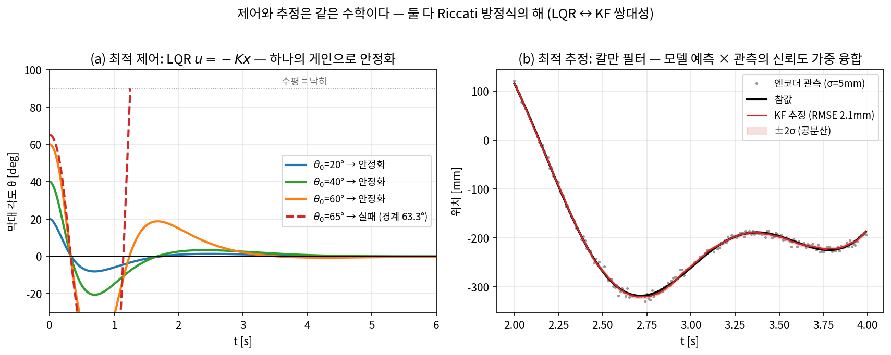
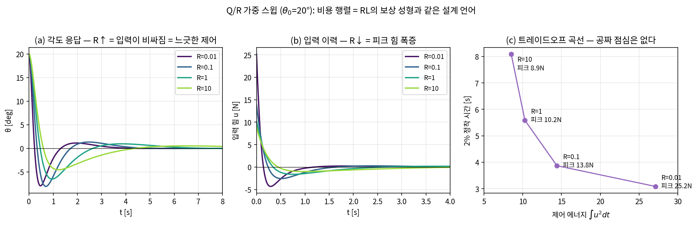
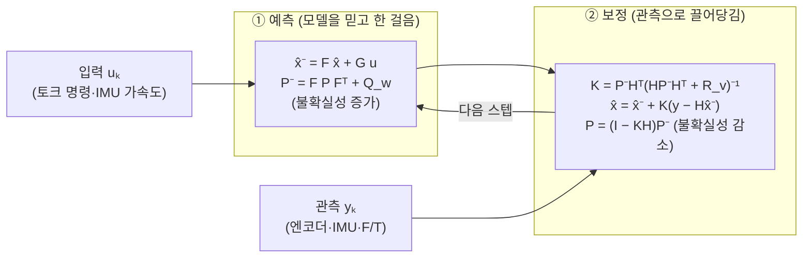
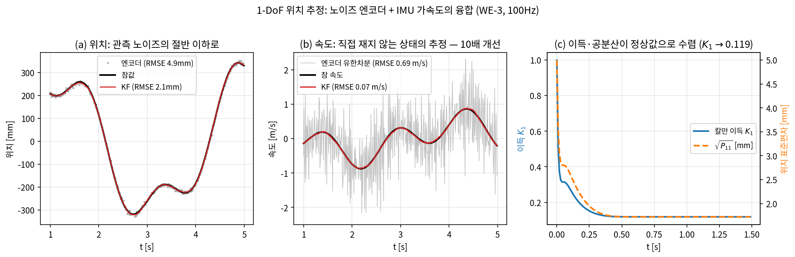
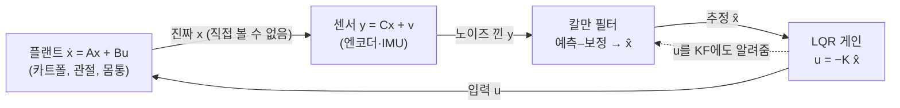
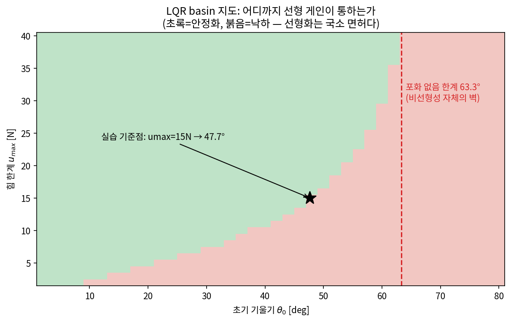

# Lec 18. 상태공간, LQR, 칼만 필터 — 최적화로서의 제어와 추정

> 하위제어 트랙 18일차 (Part R5 제어, 두 번째). 선수 지식: 17강(피드백·PID·극점), 10강(매니퓰레이터 방정식), 13강(선형 도립진자).
> 이 주제는 MR 범위 밖이다 — 기초 참고서는 Åström & Murray, *Feedback Systems*(무료: fbswiki.org) [1]과 Tedrake, *Underactuated Robotics* [3].

## 한 장 요약



왼쪽: 카트폴(도립진자)을 **단 하나의 게인 행렬** $u = -Kx$로 안정화한다. 이 $K$는 튜닝한 것이 아니라 2차 비용을 최소화하는 **최적화의 해**이고, 초기각 63.3°까지 통하다가 그 밖에서 무너진다 — 선형화는 국소 면허다. 오른쪽: 노이즈 낀 엔코더 관측(회색 점)과 모델 예측을 **신뢰도(공분산)로 가중 평균**해 참값(검정)에 달라붙는 추정(빨강)을 만든다. 놀라운 사실: 이 두 문제는 **같은 Riccati 방정식**을 푼다. 제어와 추정은 쌍대(dual)다.

## 학습 목표

1. 임의의 (선형화된) 동역학을 상태공간 $\dot x = Ax + Bu,\ y = Cx$로 쓰고, 평형점 선형화를 수행할 수 있다.
2. 가제어성·가관측성의 rank 판정을 계산하고, "제어로 도달 가능한 부분공간 / 관측으로 복원 가능한 정보"라는 의미를 설명할 수 있다.
3. LQR을 "가치함수가 2차식인 벨만 방정식의 해석해"로 설명하고, `solve_continuous_are`로 게인을 구해 비선형 시뮬레이션에서 검증할 수 있다.
4. 칼만 필터의 예측–보정 2단을 베이즈 갱신으로 설명하고, 엔코더+IMU 융합을 바닥부터 구현할 수 있다.
5. LQG 분리 원리와 그 한계, 그리고 선형 게인의 유효 범위(basin)를 실험으로 정량화할 수 있다.

## 왜 이 강의가 필요한가

17강에서 PID 게인 3개를 손으로 튜닝했다. 그 방법은 관절 하나(입력 1, 출력 1)까지다. 카트폴만 돼도 상태 4개·입력 1개 — 게인 4개가 서로 얽혀서 "P를 올리니 D가 모자라는" 손튜닝 지옥이 시작되고, 휴머노이드의 질량중심 제어(상태 12개+)면 손튜닝은 불가능하다. 오늘의 첫 번째 전환: **게인을 튜닝하지 말고, 비용함수를 쓰고 최적화로 게인을 뽑는다**(LQR). 두 번째 전환: 지금까지 상태 $x$를 안다고 가정했지만 실제 로봇의 센서는 노이즈가 있고, 속도는 대개 직접 재지도 못한다(엔코더 유한차분의 노이즈 폭발 — 오늘 수치로 확인한다). **추정도 최적화다**(칼만 필터). 이 두 개가 23강(MPC = 제약이 붙은 LQR의 일반화), 24강(WBC), 59강(EKF·센서 융합)의 공통 기초이고, 딥러닝 쪽 독자에게는 보너스가 있다 — LQ 세팅은 **RL의 벨만 방정식이 해석적으로 풀리는 유일한 코너**라서(41강), 여러분이 아는 가치함수·정책의 개념이 여기서 손계산과 만난다.

## 본문

### 1. 상태공간: 모든 선형 시스템은 행렬 두 개다

10강의 매니퓰레이터 방정식 $M(q)\ddot q + C(q,\dot q)\dot q + g(q) = \tau$는 2차 비선형 ODE다. 제어 이론의 표준 문법은 이것을 **1차 벡터 ODE**로 다시 쓰는 것이다: 상태 $x = (q, \dot q)$를 정의하면 $\dot x = f(x, u)$. 평형점 $(x^*, u^*)$ 근처에서 테일러 전개해 1차 항만 남기면 선형 시스템을 얻는다.

오늘의 실험대는 **카트폴**이다: 질량 $M{=}1.0$ kg 카트 위에 길이 $l{=}0.5$ m 막대 끝 질량 $m{=}0.1$ kg. 상태는 $x = (x_{\text{cart}}, \theta, \dot x_{\text{cart}}, \dot\theta)$, 입력은 카트를 미는 힘 $F$, $\theta$는 **수직(위)에서 잰 각도**다. 도립 평형 $\theta = 0$ 근처에서 선형화하면:

$$
A = \begin{bmatrix} 0 & 0 & 1 & 0 \\ 0 & 0 & 0 & 1 \\ 0 & -\tfrac{mg}{M} & 0 & 0 \\ 0 & \tfrac{(M+m)g}{Ml} & 0 & 0 \end{bmatrix}
= \begin{bmatrix} 0 & 0 & 1 & 0 \\ 0 & 0 & 0 & 1 \\ 0 & -0.981 & 0 & 0 \\ 0 & 21.582 & 0 & 0 \end{bmatrix},
\qquad
B = \begin{bmatrix} 0 \\ 0 \\ 1 \\ -2 \end{bmatrix}
$$

$A$의 고유값에 $+\sqrt{21.582} \approx +4.65$가 있다 — 17강의 언어로 **우반평면 극점**, 즉 개루프 불안정. 손을 놓으면 $e^{4.65t}$로 넘어진다. 13강의 LIP($\ddot x = \omega^2(x - p)$)와 정확히 같은 구조라는 것을 눈여겨보라 — 도립진자는 보행의 최소 모델이기도 했다.

#### E1. 상태공간 모델

**직관**: "시스템의 미래를 예측하는 데 충분한 최소 정보(상태)를 정하면, 동역학은 '상태가 상태에 어떻게 되먹임되는가($A$)'와 '입력이 상태를 어떻게 미는가($B$)' 두 행렬로 끝난다."

**물리·기하적 의미**: 상태는 마르코프성의 담보다 — $x(t)$를 알면 과거 이력은 잊어도 된다. $A$는 시스템의 자체 흐름(불안정 극점 = $A$의 우반평면 고유값), $B$는 액추에이터가 상태공간에 꽂는 방향이다. 몇 차 미분방정식이든, 몇 입력이든 같은 꼴로 담긴다: 이 **표준화**가 이후 모든 도구(LQR·KF·MPC)를 시스템 무관하게 만든다.

**형식**:

$$
\dot x = Ax + Bu, \qquad y = Cx, \qquad x \in \mathbb{R}^n,\ u \in \mathbb{R}^m,\ y \in \mathbb{R}^p
$$

해는 $x(t) = e^{At}x(0) + \int_0^t e^{A(t-\tau)}Bu(\tau)\,d\tau$ — 자유 응답과 입력의 합성곱(convolution)의 합. 비선형 $\dot x = f(x,u)$는 평형점에서 $A = \partial f/\partial x,\ B = \partial f/\partial u$로 국소 근사한다(5강에서 만든 자코비안이 여기서 또 나온다).

### 2. 가제어성·가관측성: 이 시스템은 애초에 다룰 수 있는가

게인을 설계하기 전에 물어야 할 질문이 있다. **입력이 모든 상태 방향을 밀 수 있는가?**(가제어성) **출력에서 모든 상태를 복원할 수 있는가?**(가관측성) 답이 "아니오"면 어떤 제어기도, 어떤 필터도 그 방향은 포기해야 한다.

#### E2. 가제어성 rank 판정

**직관**: $B$는 입력이 직접 미는 방향, $AB$는 "민 것이 동역학을 타고 한 번 굴러간" 방향, $A^2B$는 두 번 굴러간 방향… 이들을 다 모아도 $\mathbb{R}^n$을 못 채우면, 못 채운 방향은 **어떤 입력 이력으로도 도달 불가능**하다.

**물리·기하적 의미**: 도달 가능 집합은 부분공간 $\mathrm{range}(\mathcal{C})$이고, 가제어성은 그것이 전체 공간이라는 뜻이다. 카트폴에서 힘은 카트에만 걸리지만($B$의 각가속 성분은 반작용) $A$가 카트 운동을 막대 각도로 실어 나르기 때문에 상태 4개가 전부 도달 가능하다 — **직접 못 미는 상태도 동역학을 경유해 민다**. 부족구동(13강)이 절망이 아닌 이유가 이 한 줄이다.

**형식**: 가제어성 행렬

$$
\mathcal{C} = \begin{bmatrix} B & AB & A^2B & \cdots & A^{n-1}B \end{bmatrix}, \qquad \text{가제어} \iff \mathrm{rank}\,\mathcal{C} = n
$$

$n-1$차에서 멈추는 근거는 Cayley–Hamilton 정리($A^n$은 $I, A, \dots, A^{n-1}$의 선형결합)다. **가관측성은 완전한 쌍대**: $\mathcal{O} = [C;\ CA;\ \cdots;\ CA^{n-1}]$의 rank가 $n$이면 출력 이력에서 초기 상태를 유일하게 복원할 수 있다. $(A, B)$의 가제어성 = $(A^\top, B^\top)$의 가관측성 — 이 쌍대성이 §5에서 "LQR과 KF가 같은 방정식"인 이유로 다시 나온다.

#### WE-1 (손 + 코드): rank로 시스템 진단하기

**손계산 — 이중 적분기** ($\ddot p = u$, 상태 $(p, \dot p)$):

$$
A = \begin{bmatrix} 0 & 1 \\ 0 & 0 \end{bmatrix},\ B = \begin{bmatrix} 0 \\ 1 \end{bmatrix}
\ \Rightarrow\
\mathcal{C} = \begin{bmatrix} B & AB \end{bmatrix} = \begin{bmatrix} 0 & 1 \\ 1 & 0 \end{bmatrix},\ \mathrm{rank} = 2\ \checkmark
$$

힘은 속도만 직접 바꾸지만($B$), 속도가 위치로 흘러가므로($AB$) 둘 다 제어된다.

**손계산 — 같은 입력을 받는 쌍둥이**: $\dot x_1 = -x_1 + u,\ \dot x_2 = -x_2 + u$:

$$
\mathcal{C} = \begin{bmatrix} 1 & -1 \\ 1 & -1 \end{bmatrix},\ \mathrm{rank} = 1
$$

합 $(x_1 + x_2)$ 방향만 밀 수 있고 **차 $(x_1 - x_2)$는 어떤 $u(t)$로도 못 바꾼다** — 두 관절을 하나의 텐던으로 묶은 커플링 구동(1강의 "DoF ≠ 모터 수")이 정확히 이 상황이다.

**검증 코드**:

```python
import numpy as np

def ctrb(A, B):
    n = A.shape[0]
    return np.hstack([np.linalg.matrix_power(A, k) @ B for k in range(n)])

# (a) 이중 적분기: 힘 하나로 위치·속도 둘 다
A1 = np.array([[0., 1.], [0., 0.]]); B1 = np.array([[0.], [1.]])
print("이중 적분기 rank:", np.linalg.matrix_rank(ctrb(A1, B1)))    # 2

# (b) 같은 입력을 받는 쌍둥이: '차이' 방향은 밀 수 없다
A2 = -np.eye(2); B2 = np.array([[1.], [1.]])
print("쌍둥이 rank:", np.linalg.matrix_rank(ctrb(A2, B2)))          # 1

# (c) 카트폴 (WE-2의 A, B): 힘 1개로 상태 4개 전부
M, m, l, g = 1.0, 0.1, 0.5, 9.81
A = np.array([[0,0,1,0],[0,0,0,1],[0,-m*g/M,0,0],[0,(M+m)*g/(M*l),0,0]], float)
B = np.array([[0],[0],[1/M],[-1/(M*l)]])
print("카트폴 rank:", np.linalg.matrix_rank(ctrb(A, B)))            # 4

# (d) 가관측성은 쌍대: 무엇을 재는가에 따라 갈린다
for name, C in [("y=x(카트 위치)", np.array([[1.,0,0,0]])),
                ("y=θ(막대 각도)", np.array([[0.,1,0,0]]))]:
    O = np.vstack([C @ np.linalg.matrix_power(A, k) for k in range(4)])
    print(name, "가관측성 rank:", np.linalg.matrix_rank(O))
```

출력: `2, 1, 4` 그리고 가관측성은 `y=x → rank 4`, `y=θ → rank 2`. 마지막 줄이 함정 문제다 — **막대 각도만 재면 카트가 어디 있는지 영원히 알 수 없다**($x, \dot x$가 $\theta$ 동역학에 전혀 안 들어가므로). 카트 위치만 재면 반대로 전부 복원 가능하다. 센서 선택이 rank를 결정한다.

### 3. LQR: 게인 튜닝을 최적화 문제로 바꾼다

#### E3. LQR — 2차 비용과 Riccati 방정식

**직관**: "상태 오차의 죄값($x^\top Qx$)과 입력 사용료($u^\top Ru$)의 평생 합을 최소화하는 피드백을 찾아라." 답이 놀랍다 — 최적 정책은 시불변 **선형** 피드백 $u = -Kx$ 하나이고, $K$는 행렬 방정식 하나를 풀면 나온다.

**물리·기하적 의미**: $Q$는 "어느 상태 오차가 얼마나 아픈가", $R$은 "액추에이터가 얼마나 비싼가"의 가격표다. 게인을 직접 만지는 대신 **가격을 만지면 최적화가 게인을 계산해 준다** — 튜닝 언어의 교체가 LQR의 실용적 핵심이다. $P$는 가치함수의 곡률로, $V(x) = x^\top Px$는 "상태 $x$에서 출발할 때 남은 최소 비용"이다.

**형식**:

$$
J = \int_0^\infty \left( x^\top Q x + u^\top R u \right) dt
\quad\Rightarrow\quad
u^* = -Kx,\quad K = R^{-1}B^\top P
$$

$$
\underbrace{A^\top P + PA - PBR^{-1}B^\top P + Q = 0}_{\text{대수 Riccati 방정식 (ARE)}}
$$

유도 요점은 벨만/HJB 방정식이다(41강의 연속시간판): $0 = \min_u [\,x^\top Qx + u^\top Ru + \nabla V^\top (Ax + Bu)\,]$에 **2차식 가설 $V = x^\top Px$를 대입**하면, $u$에 대한 최소화가 $u = -R^{-1}B^\top Px$를 주고, 되넣으면 모든 $x$에 대해 성립해야 하는 조건이 위의 ARE로 붕괴한다 [3]. 함수공간에서 풀어야 할 벨만 방정식이 $n \times n$ 행렬 방정식이 된 것 — **가치함수가 2차식인 RL의 해석해**라는 말의 정확한 의미다. ($Q \succeq 0,\ R \succ 0$에서 $(A,B)$가 안정화 가능하고 $(A, Q^{1/2})$가 검출 가능(불안정 모드가 비용에 보이면)하면, 안정화하는 해 $P \succeq 0$가 유일하게 존재한다 [1].)

#### WE-2 (손 + 코드): 스칼라로 손을 풀고, 카트폴로 확인한다

**손계산 — 가장 작은 LQR**: $\dot x = u$ ($A = 0, B = 1$), $Q = 4, R = 1$. ARE는

$$
0 \cdot P + P \cdot 0 - P^2/1 + 4 = 0 \ \Rightarrow\ P = 2, \qquad K = R^{-1}BP = 2
$$

최적 정책은 $u = -2x$, 가치함수는 $V(x) = 2x^2$, 닫힌루프는 $\dot x = -2x$. 게인이 $\sqrt{Q/R}$로 나오는 것에 주목 — 상태 벌점을 4배 올려도 게인은 2배만 오른다(비용의 제곱근 감쇠).

**코드 — 카트폴 LQR + 비선형 검증**:

```python
from scipy.linalg import solve_continuous_are
from scipy.integrate import solve_ivp

Q = np.diag([1., 10., 0.1, 0.1]); R = np.array([[0.1]])
P = solve_continuous_are(A, B, Q, R)          # Riccati를 풀고
K = np.linalg.solve(R, B.T @ P)               # K = R⁻¹BᵀP
print("K =", np.round(K, 3))
print("닫힌루프 고유값:", np.round(np.linalg.eigvals(A - B @ K), 3))

def cartpole(t, s, K, umax):                  # 선형화 전의 비선형 원본
    x, th, xd, thd = s
    F = np.clip(-(K @ s)[0], -umax, umax)
    sn, cs = np.sin(th), np.cos(th)
    den = M + m*sn**2
    xdd = (F + m*sn*(l*thd**2 - g*cs)) / den
    thdd = (-F*cs - m*l*thd**2*sn*cs + (M+m)*g*sn) / (l*den)
    return [xd, thd, xdd, thdd]

def fallen(t, s, K, umax): return abs(s[1]) - np.pi/2
fallen.terminal = True                        # 수평을 넘으면 중단 = 실패

for deg in [20, 40, 60, 65]:
    sol = solve_ivp(cartpole, [0, 10], [0, np.radians(deg), 0, 0],
                    args=(K, 1e9), rtol=1e-8, atol=1e-10, events=fallen)
    ok = sol.status == 0 and abs(sol.y[1, -1]) < 0.01
    print(f"θ0={deg}° → {'안정화' if ok else '낙하'}")
```

출력:

```
K = [[ -3.162 -39.608  -4.425  -8.48 ]]
닫힌루프 고유값: [-5.168+1.718j -5.168-1.718j -1.099+0.94j  -1.099-0.94j ]
θ0=20° → 안정화   θ0=40° → 안정화   θ0=60° → 안정화   θ0=65° → 낙하
```

읽는 법: (1) 고유값 4개가 전부 좌반평면 — 선형 이론상 안정. (2) **선형화로 설계한 게인이 비선형 원본에서 60°까지 버틴다**. 5° 근방에서만 유효할 것 같던 선형화의 유효 범위가 의외로 넓다(이진 탐색으로 좁히면 경계는 63.3°). (3) 그러나 65°에서는 낙하 — 어떤 게인 튜닝으로도 못 넘는 **비선형성 자체의 벽**이 있다(θ→90°에서 힘의 각도 회복 효과 $\propto \cos\theta \to 0$). 이 한계가 23강(MPC)의 존재 이유다.

#### Q/R 스윕: 비용 행렬은 보상 성형이다



같은 $Q$에서 입력 가격 $R$만 흔든 결과($\theta_0 = 20°$, 수치는 본문 코드로 재현):

| $R$ | $K_\theta$ | 피크 $\|u\|$ | 2% 정착 시간 | $\int u^2 dt$ |
|---|---|---|---|---|
| 0.01 | −72.2 | 25.2 N | 3.08 s | 27.1 |
| 0.1 | −39.6 | 13.8 N | 3.87 s | 14.4 |
| 1.0 | −29.3 | 10.2 N | 5.58 s | 10.3 |
| 10 | −25.5 | 8.9 N | 8.09 s | 8.5 |

$R$을 1000배 흔들어도 시스템은 항상 안정 — LQR은 (가제어라면) **안정성을 공짜로 주고**, Q/R은 안정한 응답들 사이의 스타일을 고른다. 빠른 정착을 사려면 피크 힘으로 지불한다(그림 (c)의 파레토 곡선). 시작점 휴리스틱: 각 상태·입력의 "최대 허용값"의 제곱 역수로 대각을 채우는 것(Bryson 규칙으로 통용)이며, 그 뒤는 시뮬 돌려보며 조정 — RL에서 보상 계수를 다듬는 과정과 같은 종류의 노동이다.

### 4. 칼만 필터: 추정은 신뢰도 가중 평균이다

이제 반대편 문제. $u = -Kx$를 쓰려면 $x$가 필요한데, 센서는 $y = Cx + (\text{노이즈})$만 준다. 속도는 재지도 못한다. 엔코더를 유한차분하면? $\sigma = 5$ mm 노이즈를 100 Hz로 차분하는 순간 $\sqrt{2}\,\sigma / \Delta t \approx 0.7$ m/s의 속도 노이즈가 된다 — 쓸 수 없다. 필요한 것은 **동역학 모델로 예측하고, 관측으로 보정하는** 재귀 추정기다.



#### E4. 칼만 필터 — 예측·보정과 최적 이득

**직관**: 두 정보원이 있다 — "모델이 예측한 상태"(불확실성 $P^-$)와 "센서가 말하는 상태"(불확실성 $R_v$). 최적 융합은 **불확실한 쪽을 덜 믿는 가중 평균**이고, 칼만 이득 $K$가 바로 그 가중치다. 예측만 하면 불확실성이 자라고, 보정이 그것을 깎는다 — 이 팽창–수축의 재귀가 필터다.

**물리·기하적 의미**: 이것은 가우시안 베이즈 갱신 그 자체다. prior $\mathcal{N}(\hat x^-, P^-)$에 likelihood $\mathcal{N}(y; H\hat x, R_v)$를 곱하면 posterior도 가우시안이고, 그 평균·공분산이 정확히 보정식이다. 선형 동역학 + 가우시안 노이즈에서는 이 절차가 **근사가 아니라 정확한 사후분포**이며, 그런 의미에서 "최적 추정기"다 [2]. 공분산 $P$는 필터가 스스로 계산하는 자기 신뢰도 보고서다(단, "모델이 맞다는 가정 아래"의 보고서 — 흔한 오해 3).

**형식** (이산시간, $x_k = Fx_{k-1} + Gu_k + w,\ y_k = Hx_k + v$, $w \sim \mathcal{N}(0, Q_w),\ v \sim \mathcal{N}(0, R_v)$ — $u_k$는 스텝 $k$ 동안 가해진 입력):

$$
\text{예측:}\quad \hat x^-_k = F\hat x_{k-1} + Gu_k, \qquad P^-_k = FP_{k-1}F^\top + Q_w
$$

$$
\text{보정:}\quad K_k = P^-_kH^\top (HP^-_kH^\top + R_v)^{-1}, \qquad \hat x_k = \hat x^-_k + K_k(y_k - H\hat x^-_k), \qquad P_k = (I - K_kH)P^-_k
$$

유도 요점: 보정식은 잔차(innovation) $y - H\hat x^-$와 추정 오차의 결합 가우시안에서 조건부 평균을 구한 것으로, "추정 오차 공분산을 최소화하는 이득"을 미분으로 구해도 같은 $K_k$가 나온다 [2]. 정상상태에서 $P^-$는 상수로 수렴하는데, 그 수렴값이 만족하는 방정식이 **또 하나의 Riccati 방정식**이다 — $A \to A^\top,\ B \to C^\top,\ Q \to Q_w,\ R \to R_v$로 바꾼 LQR의 ARE와 동형(추정–제어 쌍대성 [1]).

#### WE-3 (손 + 코드): 한 스텝 손계산, 그리고 엔코더+IMU 융합

**손계산 — 스칼라 한 스텝**: 예측이 $\hat x^- = 0$, $P^- = 4$ (표준편차 2)인데 관측 $y = 2$가 노이즈 분산 $R_v = 1$로 들어왔다:

$$
K = \frac{P^-}{P^- + R_v} = \frac{4}{5} = 0.8, \qquad \hat x = 0 + 0.8(2 - 0) = 1.6, \qquad P = (1 - 0.8) \cdot 4 = 0.8
$$

검산은 역분산 가중 평균으로: 평균 $= \frac{0/4 + 2/1}{1/4 + 1/1} = 1.6$ ✓, 분산 $= (1/4 + 1/1)^{-1} = 0.8$ ✓. **칼만 보정 = 가우시안 베이즈 갱신**이 산수로 확인된다. 관측이 4배 더 정밀하니 추정은 관측 쪽으로 80% 끌려간다.

**코드 — 1-DoF 위치 추정 (노이즈 엔코더 + IMU 가속도)**: 관절이 왕복 운동하는데, 위치는 노이즈 엔코더(σ=5mm)로, 가속도는 노이즈 IMU(σ=0.4m/s²)로 들어온다. IMU를 이중적분하면 드리프트하고, 엔코더를 차분하면 노이즈가 폭발한다 — 융합만이 답이다(59강의 미니어처).

```python
rng = np.random.default_rng(0)
dt = 0.01                                     # 100 Hz, 8초
t = np.arange(0, 8, dt)
p_true = 0.3*np.sin(1.5*t) + 0.1*np.sin(4.3*t)            # 참 궤적 (왕복 운동)
v_true = 0.45*np.cos(1.5*t) + 0.43*np.cos(4.3*t)
a_true = -0.675*np.sin(1.5*t) - 1.849*np.sin(4.3*t)

sig_a, sig_enc = 0.4, 0.005                   # IMU 노이즈 [m/s²], 엔코더 노이즈 [m]
a_meas = a_true + sig_a*rng.standard_normal(t.size)
y_enc  = p_true + sig_enc*rng.standard_normal(t.size)

F = np.array([[1, dt], [0, 1]])               # 상태 전이 (등가속 모델)
G = np.array([[0.5*dt**2], [dt]])             # 가속도 입력의 경로
H = np.array([[1., 0.]])                      # 엔코더는 위치만 잰다
Qw = G @ G.T * sig_a**2                       # 프로세스 노이즈 = IMU 노이즈의 전파
Rv = np.array([[sig_enc**2]])

xh = np.zeros((2, 1)); P = np.eye(2)*1e-2
est = np.zeros((t.size, 2)); K1 = np.zeros(t.size)
for k in range(t.size):
    xh = F @ xh + G * a_meas[k]               # ① 예측: IMU를 적분해 한 걸음
    P  = F @ P @ F.T + Qw                     #    불확실성은 커진다
    Kk = P @ H.T @ np.linalg.inv(H @ P @ H.T + Rv)   # ② 보정: 신뢰도 가중치
    xh = xh + Kk * (y_enc[k] - H @ xh)        #    잔차(innovation)만큼 당긴다
    P  = (np.eye(2) - Kk @ H) @ P             #    불확실성은 줄어든다
    est[k] = xh.ravel(); K1[k] = Kk[0, 0]

rmse = lambda a, b: np.sqrt(np.mean((a - b)**2))
v_fd = np.diff(y_enc, prepend=y_enc[0]) / dt  # 비교군: 엔코더 유한차분
print(f"위치 RMSE: 엔코더 {rmse(y_enc, p_true)*1e3:.2f} mm → KF {rmse(est[:,0], p_true)*1e3:.2f} mm")
print(f"속도 RMSE: 유한차분 {rmse(v_fd[1:], v_true[1:]):.3f} m/s → KF {rmse(est[:,1], v_true):.3f} m/s")
print(f"정상상태 칼만 이득 K1 = {K1[-1]:.3f}")
```

출력:

```
위치 RMSE: 엔코더 4.86 mm → KF 2.10 mm
속도 RMSE: 유한차분 0.686 m/s → KF 0.070 m/s
정상상태 칼만 이득 K1 = 0.119
```



읽는 법: (1) 위치는 관측 노이즈의 절반 이하(4.86→2.10mm). (2) 진짜 승부는 속도 — **직접 재지 않는 상태를 유한차분 대비 10배 정확하게**(0.686→0.070 m/s) 추정한다. 유한차분의 0.686은 이론치 $\sqrt 2 \sigma/\Delta t = 0.707$과 일치. (3) 이득 $K_1$이 0.119로 수렴 — 정상상태 KF는 결국 상수 이득 관측기이고, 그 상수가 Riccati의 해다.

### 5. LQG: 둘을 합치면, 그리고 분리 원리

상태를 모르는 채 최적 제어를 하려면? **LQG**(Linear Quadratic Gaussian) = KF로 $\hat x$를 만들고 LQR 게인에 물린다: $u = -K\hat x$.



놀라운 정리 — **분리 원리**: 선형·가우시안·2차 비용 세팅에서는 추정기와 제어기를 **따로 설계해도 합친 것이 최적**이다. $K$는 노이즈를 모른 채 설계하고, KF는 제어 목적을 모른 채 설계했는데, 조합이 출력 피드백 최적해다 [1]. "지각 모듈과 정책 모듈을 분리 학습해도 되는가"라는 오래된 질문에 선형 세계가 주는 답이 "예"인 셈이다. 단, 경고가 있다: 이 최적성은 **강건성을 보장하지 않는다**. LQR 단독은 위상여유 60° 이상의 훌륭한 마진을 갖지만, LQG로 조합하는 순간 보장 마진은 **없다**(Doyle의 1978년 한 페이지 논문 — 초록이 "There are none."으로 유명하다 [4]). 모델이 정확할 때 최적인 것과 모델이 틀렸을 때 안전한 것은 다른 문제다 — 60강(시스템 식별)이 중요한 이유.

### 딥러닝 배경자를 위한 번역

- **LQR은 RL이 닫힌 형태로 풀리는 유일한 코너다.** MDP의 언어로: 상태공간 연속, 전이 선형, 보상 $-x^\top Qx - u^\top Ru$, 그러면 최적 가치함수는 정확히 2차식 $-x^\top Px$, 최적 정책은 정확히 선형 $u = -Kx$. 정책 네트워크·가치 네트워크가 학습으로 근사하는 것을 여기선 Riccati가 해석적으로 준다. 41강의 HJB·벨만 방정식의 "풀 수 있는 특수해"로 기억하라.
- **Riccati 방정식은 가치 반복(value iteration)의 고정점이다.** 유한 구간 LQR에서 $P_k$를 뒤에서 앞으로 갱신하는 Riccati 재귀는 문자 그대로 backward induction이고, 무한 구간의 ARE는 그 재귀가 수렴한 고정점이다. `solve_continuous_are` 한 줄은 "수렴할 때까지 가치 반복"의 해석적 지름길이다.
- **Q/R은 보상 성형(reward shaping)이다.** 게인(정책 파라미터)을 직접 만지지 않고 비용(보상)을 만져 행동을 바꾼다 — §3의 스윕 표가 보여주듯 같은 최적화기에 다른 보상을 주는 실험이다. RL에서 보상 계수 튜닝이 policy를 바꾸는 것과 동일한 설계 루프.
- **칼만 필터는 은닉 상태 추론이고, RNN/SSM의 조상이다.** KF는 선형-가우시안 은닉 마르코프 모델의 정확한 posterior 추론이다(WE-3의 손계산이 바로 베이즈 갱신). "이전 은닉 상태 + 입력 → 다음 은닉 상태, 관측으로 게이팅"이라는 구조는 RNN과 같고, S4/Mamba류 SSM 레이어의 $x_{k+1} = \bar Ax_k + \bar Bu_k$는 문자 그대로 상태공간 모델이다 [6] — 차이는 KF의 $A, K$가 물리 모델과 노이즈 통계에서 유도되는 반면 SSM은 데이터에서 학습된다는 것.
- **LQG 분리 원리는 "인코더 따로, 정책 따로"의 원형이다.** 관측 → 상태 추정(표현 학습) → 정책이라는 파이프라인 분해가 선형 세계에서는 무손실임이 증명된다. 비선형·비가우시안 세계에서는 보장이 깨지고(end-to-end 학습의 논거), 심지어 선형 세계에서도 강건성은 별개다(Doyle [4]) — "모듈 분해 vs end-to-end" 논쟁의 수학적 뿌리.

## 흔한 오해

1. **"LQR은 선형 시스템 전용이니 실제 로봇에는 못 쓴다"** — 실제 로봇의 LQR은 거의 전부 **선형화 + LQR**이고, 이것이 잘 통한다: 오늘 카트폴은 63°까지, 13강의 LIP 기반 보행 제어도 같은 구도다. 유효 범위(basin)가 유한할 뿐이며(그림 4), 궤적을 따라 선형화를 갱신하는 TVLQR, 평형점마다 게인을 바꿔 끼우는 gain scheduling으로 확장한다 [3]. "선형 = 장난감"이 아니라 "선형 = 국소 면허, 면허 범위는 실험으로 측정"이 올바른 태도다.
2. **"Q·R을 정하는 '올바른' 값이 이론에서 나온다"** — 안 나온다. Q/R은 물리 상수가 아니라 **설계 의도의 언어**다(보상 성형). 이론이 보장하는 것은 "어떤 Q/R을 골라도 (가제어라면) 안정"이라는 바닥선이고, 어느 안정 응답을 원하는지는 태스크가 정한다. Bryson 규칙은 단위 정규화용 시작점일 뿐이다.
3. **"칼만 필터 = 좋은 저역통과 필터"** — 두 가지가 다르다. 첫째, KF는 모델로 **예측**하므로 스무딩 필터 특유의 위상 지연을 크게 줄이고, 관측하지 않는 상태(속도)까지 추정한다(WE-3에서 10배). 둘째, 공분산 $P$는 "모델과 노이즈 통계가 가정대로일 때"의 신뢰도다 — 모델이 틀리면(마찰 무시, 편향 있는 IMU) KF는 **작은 공분산을 보고하며 자신 있게 틀린다**. 노이즈에 강한 것과 모델 오차에 강한 것은 다르다(59강에서 대책을 다룬다).
4. **"LQR이 강건하니 LQG도 강건하다"** — 분리 원리는 **최적성**의 정리지 **강건성**의 정리가 아니다. LQR의 유명한 보장 마진(이득 마진 $[\tfrac12, \infty)$, 위상여유 ±60°)은 상태를 직접 잴 때 이야기고, 추정기를 끼우는 순간 보장은 사라진다 [4]. "각 모듈이 최적이면 합체도 견고하다"는 추론은 선형 세계에서조차 틀린다.

## 실습 (1.5~2시간)

**MuJoCo 카트폴에 LQR 게인 꽂기 — 그리고 부러지는 지점 찾기.** (CPU로 충분)

1. 아래 XML을 인라인 로드한다. 본문의 해석 모델과 같은 파라미터가 되도록 `inertial`을 명시했다(카트 1.0 kg, 막대 끝점 질량 0.1 kg @ 0.5 m):

```xml
<mujoco model="cartpole">
  <option timestep="0.002" gravity="0 0 -9.81"/>
  <worldbody>
    <body name="cart" pos="0 0 0.2">
      <joint name="slide" type="slide" axis="1 0 0"/>
      <inertial pos="0 0 0" mass="1.0" diaginertia="1e-4 1e-4 1e-4"/>
      <geom type="box" size="0.12 0.06 0.04" rgba=".2 .4 .8 1" density="0"/>
      <body name="pole" pos="0 0 0">
        <joint name="hinge" type="hinge" axis="0 1 0"/>
        <inertial pos="0 0 0.5" mass="0.1" diaginertia="1e-9 1e-9 1e-9"/>
        <geom type="capsule" fromto="0 0 0  0 0 0.5" size="0.015" rgba=".8 .3 .2 1" density="0"/>
      </body>
    </body>
  </worldbody>
  <actuator><motor joint="slide" gear="1" ctrlrange="-100 100"/></actuator>
</mujoco>
```

2. WE-2의 $K$를 그대로 500 Hz 루프에 물린다:

```python
import mujoco
m = mujoco.MjModel.from_xml_string(XML)   # XML은 위 문자열
d = mujoco.MjData(m)

def run(theta0_deg, umax=1e9, T=10.0):
    mujoco.mj_resetData(m, d)
    d.qpos[:] = [0.0, np.radians(theta0_deg)]
    for _ in range(int(T / m.opt.timestep)):
        s = np.array([d.qpos[0], d.qpos[1], d.qvel[0], d.qvel[1]])
        d.ctrl[0] = np.clip(-(K @ s)[0], -umax, umax)
        mujoco.mj_step(m, d)
        if abs(d.qpos[1]) > np.pi/2: return False
    return abs(d.qpos[1]) < 0.01
```

3. **실패 경계 찾기**: `run(60)`은 성공, `run(64)`는 실패다. 이진 탐색으로 경계를 좁혀라 — 63.27°가 나와야 하며, 본문 `solve_ivp` 모델의 63.26°와 0.01° 차이로 일치한다(같은 물리를 두 적분기로 확인한 셈 — 52강의 예고). 힘 한계를 걸면(`umax=15`) 경계가 47.7°로 내려온다. 실물 모터에는 항상 한계가 있다 — **제약을 정면으로 다루는 도구가 23강의 MPC다**.



4. **basin 지도 그리기**: 초기각 × 힘 한계 격자에서 성공/실패를 칠해 그림 4를 재현하라(생성 스크립트 `images/lec18/gen_figs.py`의 fig4 블록과 대조). 낙하 판정을 "10초 뒤 $|\theta| < 0.01$"로 했을 때와 "수평 통과"로 했을 때 경계가 달라지는지도 확인.
5. **시뮬레이터를 직접 선형화**(심화): 해석 선형화 대신 `mujoco.mjd_transitionFD(m, d, 1e-6, 1, A_d, B_d, None, None)` [5]로 이산 $A_d, B_d$를 뽑고 $(A_d - I)/\Delta t$로 연속 근사하면, 본문의 $-0.981$과 $21.582$가 그대로 복원된다(작은 이산화 잔차 항 제외). 유도 없이 시뮬레이터에서 $A, B$를 뽑는 이 기법은 모델이 복잡해질수록 유용하다.
6. **KF를 루프에 넣기**(심화, LQG): `d.qpos`에 σ=1mm 노이즈를 섞어 관측으로 쓰고, WE-3식 KF로 $\hat x$를 만들어 `run()`의 피드백을 $-K\hat x$로 바꿔라. 노이즈 크기를 키우면 어디서부터 무너지는가?

## Claude와 토론할 질문

1. 쌍둥이 시스템(WE-1b)의 불가제어 방향 $x_1 - x_2$는 "제어를 포기해야 하는 방향"이다. 실제 로봇에서 이런 불가제어 모드가 생기는 설계 사례를 두 개 찾아보라(힌트: 텐던 커플링, 자유 회전 캐스터).
2. 카트폴 LQR의 카트 위치 게인이 정확히 $K_1 = \sqrt{Q_{11}/R} = \sqrt{10}$으로 나온다. 우연인가? (힌트: 플랜트에 적분기가 있을 때 LQR의 return difference 등식이 저주파에서 어떻게 단순화되는가 — [1]의 주파수 영역 논의)
3. LQR의 무한 구간 비용이 유한하려면 닫힌루프가 안정해야 한다 — 그렇다면 "LQR은 안정성을 공짜로 준다"는 §3의 서술에서, 공짜가 아닌 전제조건은 무엇인가? (가제어성이 깨지면 어디서 무엇이 실패하는가)
4. 13강의 capture point 제어는 발 위치라는 "이산 입력"으로 DCM 1차원만 제어했다. 같은 LIP를 연속 LQR로 제어하면 무엇이 좋아지고 무엇이 나빠지는가? (ZMP 제약은 어느 쪽이 다루기 쉬운가 — 23강 복선)
5. WE-3에서 IMU 노이즈 $\sigma_a$를 10배 올리면 정상상태 칼만 이득 $K_1$은 어느 방향으로 움직이는가? 코드를 돌리기 전에 "신뢰도 가중 평균" 직관으로 예측하고 확인하라.
6. VLA 정책(50강)은 관측 이미지에서 행동을 직접 낸다 — 명시적 상태 추정기가 없다. LQG 분리 원리의 관점에서 이 설계가 정당화되는 조건과 위험해지는 조건을 논하라. (비선형·비가우시안에서 분리 최적성이 깨진다는 사실은 end-to-end의 논거인가, 아니면 무관한가?)
7. Doyle 1978 [4]의 "보장 마진 없음"은 LQG에 무엇을 추가해야 복구되는가? (LTR, H∞ 같은 키워드를 조사해 개요만 — 우리 커리큘럼 범위 밖이지만 존재는 알아둘 것)

## 읽을거리

1. **Åström & Murray, *Feedback Systems* 2판 Ch.7–8** (fbswiki.org, ~2시간) [1]: 가제어성(reachability)→상태 피드백→LQR(Ch.7), 가관측성→관측기→칼만 필터→LQG(Ch.8). 카트폴과 같은 balance system이 러닝 예제로 나온다. 증명은 건너뛰고 예제 중심으로.
2. **Tedrake, *Underactuated Robotics*의 LQR 장** (underactuated.mit.edu, ~40분) [3]: HJB에서 ARE가 떨어지는 유도와 TVLQR — 오늘 E3의 유도 요점을 완전판으로. 노트북 데모까지만.
3. (선택) **Kalman 1960 원논문** [2]의 서론(~15분): "필터링을 상태공간에서 다시 정식화한다"는 문제 선언만 읽어도 이 논문이 왜 혁명이었는지 보인다. 유도는 현대 표기가 아니라서 비추천.

## 자가 점검

1. 매니퓰레이터 방정식을 상태공간 $\dot x = f(x, u)$로 바꾸고 평형점에서 $A, B$를 정의할 수 있는가?
2. 가제어성 행렬의 열들이 각각 무엇을 의미하는지("민 방향이 동역학을 타고 굴러간 것") 말하고, 쌍둥이 시스템의 rank 1을 30초 안에 손으로 보일 수 있는가?
3. 스칼라 LQR($\dot x = u,\ Q = 4,\ R = 1$)의 ARE를 세우고 $P = 2,\ K = 2$를 유도할 수 있는가?
4. 칼만 보정 한 스텝($P^- = 4,\ R_v = 1,\ y = 2$)을 역분산 가중 평균으로 검산할 수 있는가?
5. "LQR 게인이 비선형 카트폴에서 63°까지 통했다"는 사실에서, 선형화 기반 제어의 한계와 23강(MPC)의 필요를 한 문단으로 설명할 수 있는가?

## 참고문헌

> 웹 문서는 2026-07-08 접속 기준.

[1] K. J. Åström, R. M. Murray, "Feedback Systems: An Introduction for Scientists and Engineers," 2nd ed., Princeton Univ. Press, 2021. 무료 공개: https://fbswiki.org
— **뒷받침**: E1의 상태공간 표현과 선형화, E2의 가제어성(reachability) rank 판정과 가제어–가관측 쌍대성, E3의 LQR 정식화와 해의 존재 조건, §5의 관측기·칼만 필터·분리 원리(2판 Ch.7 State Feedback, Ch.8 Output Feedback), 토론 질문 2의 주파수 영역 논의.

[2] R. E. Kalman, "A New Approach to Linear Filtering and Prediction Problems," Transactions of the ASME—Journal of Basic Engineering, 82(Series D), pp. 35–45, 1960.
— **뒷받침**: E4의 예측–보정 재귀와 최적 이득의 원전; "선형-가우시안에서 정확한 최적 추정"이라는 본문 주장.

[3] R. Tedrake, "Underactuated Robotics: Algorithms for Walking, Running, Swimming, Flying, and Manipulation," 무료 온라인 노트. https://underactuated.mit.edu
— **뒷받침**: E3의 유도 요점(HJB에 $V = x^\top Px$를 대입해 ARE를 얻는 절차), 카트폴 LQR과 유효 범위(region of attraction) 논의, 흔한 오해 1의 TVLQR.

[4] J. C. Doyle, "Guaranteed Margins for LQG Regulators," IEEE Transactions on Automatic Control, AC-23(4), pp. 756–757, 1978.
— **뒷받침**: §5와 흔한 오해 4 — "LQG에는 보장 마진이 없다"(LQR 단독의 마진 보장이 추정기 결합 시 사라짐).

[5] Google DeepMind, MuJoCo 문서 및 API 레퍼런스. https://mujoco.readthedocs.io
— **뒷받침**: 실습의 MJCF `inertial`/`motor` 의미론과 `mjd_transitionFD`(유한차분 선형화) API. 본 강의에서 실행·검증함(해석 모델과 basin 경계 0.01° 이내 일치).

[6] A. Gu, K. Goel, C. Ré, "Efficiently Modeling Long Sequences with Structured State Spaces," arXiv:2111.00396, 2021.11. https://arxiv.org/abs/2111.00396
— **뒷받침**: 번역 박스의 "SSM 레이어 = 학습된 상태공간 모델 $x_{k+1} = \bar Ax_k + \bar Bu_k$" 대응(S4).

*수치 재현성: 본문·그림의 모든 수치(WE-1 rank 2/1/4와 가관측성 4/2, WE-2의 $K = [-3.162, -39.608, -4.425, -8.480]$·닫힌루프 고유값·60° 안정/65° 낙하, Q/R 스윕 표, WE-3의 위치 4.86→2.10 mm·속도 0.686→0.070 m/s·$K_1 = 0.119$, 실습의 basin 경계 63.26°/63.27°(solve_ivp/MuJoCo)와 47.7°(umax=15 N), `mjd_transitionFD`의 $A$ 복원)는 본문 코드 블록과 `images/lec18/gen_figs.py`의 실행 출력이다 — numpy 1.26 / scipy 1.15 / mujoco 3.2.5 기준 재현 확인.*

<!-- lecture-nav -->

---

⬅ 이전: [Lec 17. 피드백 제어 최소 코스 — 딥러닝 엔지니어를 위한 하루 압축](lec17-feedback-control-basics.md)　｜　[📖 전체 목차](../README.md)　｜　다음: [Lec 19. 관절 제어와 computed torque — 비선형을 지우는 기술](lec19-joint-control-computed-torque.md) ➡
