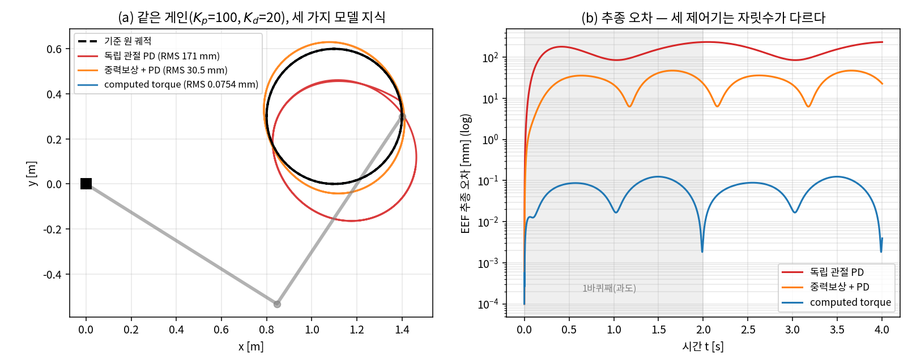
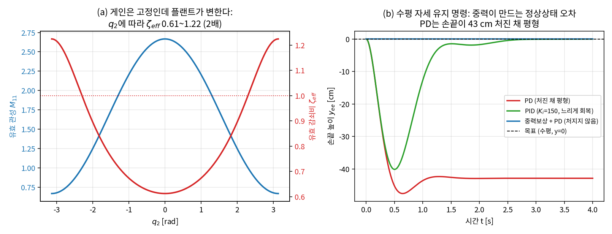
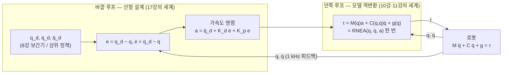
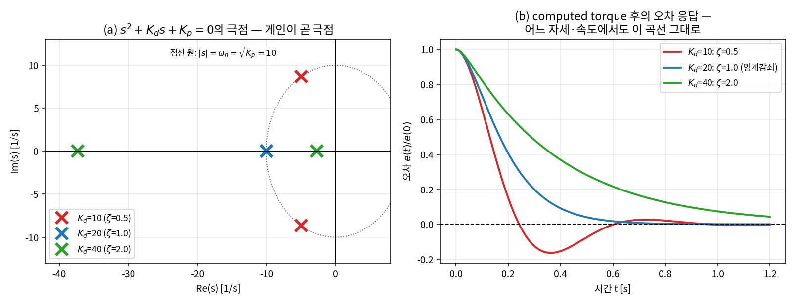
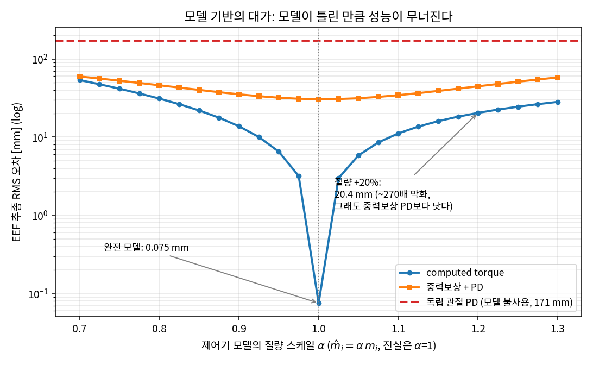

# Lec 19. 관절 제어와 computed torque — 비선형을 지우는 기술

> 하위제어 트랙 19일차 (Part R5 제어, 세 번째). 선수 지식: 17강(PID·2차 표준형·극점), 18강(게인 설계를 최적화로 보는 감각), 10강(매니퓰레이터 방정식 M·C·g), 11강(역동역학 계산과 `qfrc_bias`).
> 기초 참고서: Modern Robotics(이하 MR) Ch.11 §11.4. 이 강의는 그 내용을 10강에서 유도한 2링크의 M·C·g를 그대로 재사용해 수치로 체감하는 방식으로 재구성한 것이다.

## 한 장 요약



같은 로봇(2링크, 10강의 그 팔), 같은 게인($K_p{=}100, K_d{=}20$), 같은 원 궤적. 다른 것은 **제어기가 로봇의 물리를 얼마나 아는가**뿐이다. 아무것도 모르는 독립 관절 PD는 RMS 170.8 mm — 원이 찌그러진 타원이 된다. 중력 $g(q)$만 알면 30.5 mm. M·C·g를 전부 알고 비선형을 통째로 상쇄하는 **computed torque**는 0.075 mm — 오른쪽 log 축이 보여주듯 셋은 **자릿수가 다르다**. 오늘 강의는 이 세 제어기를 유도하고, 이 격차가 어디서 오는지, 그리고 마지막 제어기의 아킬레스건(모델 오차)이 무엇인지를 다룬다.

## 학습 목표

1. 독립 관절 PID가 다관절 로봇에서 겪는 세 가지 문제(구성 의존 관성, 관성 결합, 중력)를 10강의 M·C·g로 정량적으로 설명할 수 있다.
2. 중력 보상 제어 $\tau = g(q) + K_p e + K_d \dot e$가 "평형점 이동"을 제거하는 원리를 손계산으로 보일 수 있다.
3. computed torque 법칙을 쓰고, 오차 동역학 $\ddot e + K_d \dot e + K_p e = 0$이 나오는 유도를 3줄로 재현할 수 있으며, $M \succ 0$이 어디에 쓰이는지 짚을 수 있다.
4. $K_p, K_d$ 선택이 오차 동역학의 극점 배치임을 이해하고, 임계감쇠 게인($K_d = 2\sqrt{K_p}$)을 즉시 계산할 수 있다.
5. 모델 오차(질량 ±20%, 미지 페이로드)가 computed torque를 얼마나 깨는지 실험으로 정량화하고, 그 결과를 학습 기반 제어(residual learning)의 문제의식과 연결할 수 있다.

## 왜 이 강의가 필요한가

17강에서 관절 하나짜리 PID를 튜닝했고, 18강에서 게인을 최적화로 뽑는 법(LQR)을 배웠다. 둘 다 **선형 플랜트**의 이야기였다. 그런데 10강에서 유도한 진짜 로봇의 방정식 $M(q)\ddot q + C(q,\dot q)\dot q + g(q) = \tau$는 비선형이고 관절끼리 얽혀 있다. 그러면 관절마다 PID를 하나씩 달면(산업 현장의 기본값이다) 무슨 일이 벌어지는가?

- 관절 1이 느끼는 관성 $M_{11}(q_2)$는 팔을 접었다 펴는 것만으로 **4배** 변한다(10강 그림 2). 같은 게인인데 플랜트가 변하니, 17강에서 애써 맞춘 감쇠비가 자세에 따라 0.61에서 1.22까지 떠다닌다.
- 관절 2를 가속하면 관절 1에 토크가 튄다(관성 결합, 10강 실습 3 — 토크를 받지 않은 관절이 $-4.29\,\mathrm{rad/s^2}$로 딸려 갔다). 관절 1의 PID에게 이것은 정체불명의 외란이다.
- 중력은 자세 의존 바이어스다. 수평 자세에서 어깨에 19.62 N·m — PD의 가상 스프링은 이 무게에 눌려 **처진 채 평형**한다.

이 문제를 정면 돌파하는 것이 오늘의 computed torque(= inverse dynamics control)다: **모델로 비선형을 지우고, 남은 것을 17강의 선형 세계로 만든다.** 이것은 Part R5의 분수령이기도 하다 — 20강(작업공간 제어)은 이 기술을 EEF 좌표로, 21강(임피던스)은 접촉으로, 24강(WBC)는 전신으로 확장한다. 그리고 딥러닝 배경자에게는 예고편이 하나 있다: computed torque는 "물리 지식이 학습을 대체하는" 가장 순수한 사례고, 그 약점(모델 오차)이 정확히 **학습이 파고드는 자리**다.

## 본문

### 1. 독립 관절 PID가 보는 세계 — 문제의 진단


오늘의 지도: 왼쪽에서 오른쪽으로 갈수록 제어기에 **모델 지식**이 주입되고, 피드백이 홀로 짊어지던 부담이 줄어든다. 먼저 왼쪽 끝의 문제를 정확히 진단하자.

#### E1. 독립 관절 PID의 오차 동역학 — 우변에 로봇 전체가 외란으로 앉아 있다

**직관**: 관절 $i$의 PID는 자신의 플랜트가 "고정된 2차 시스템"(17강의 $M\ddot q + b\dot q = u$)이라고 믿는다. 실제로는 관성이 자세에 따라 변하고, 이웃 관절의 운동이 힘으로 넘어오고, 중력이 자세마다 다른 바이어스를 건다. PID 입장에서 이 모든 것은 **자기가 만들지 않은 오차**다.

**물리·기하적 의미**: 세 문제를 10강의 2링크 수치로 짚으면 — ① $M_{11}$은 팔을 폈을 때 $\frac{8}{3} \approx 2.67$, 완전히 접었을 때 $\frac{2}{3} \approx 0.67\,\mathrm{kg\,m^2}$: 4배 변동. 게인이 고정이면 유효 감쇠비 $\zeta_{\text{eff}} = K_d / (2\sqrt{K_p M_{11}})$가 0.61~1.22로 2배 흔들린다(그림 2a) — 어떤 자세에선 출렁이고 어떤 자세에선 굼뜨다. ② 비대각 $M_{12} \neq 0$: 이웃의 가속이 내 관절의 토크 외란이 된다. ③ $g(q)$: 속도가 0이어도 남는 정상 외란 — 17강 WE-1의 그 $d$가 자세의 함수가 된 것.

**형식**: 독립 관절 PD $\tau = K_p e + K_d \dot e$ ($e = q_d - q$, $K_p, K_d$ 대각)를 매니퓰레이터 방정식에 대입하고 $\ddot q = \ddot q_d - \ddot e$로 정리하면:

$$
M(q)\,\ddot e + K_d\,\dot e + K_p\,e \;=\; \underbrace{M(q)\,\ddot q_d + C(q,\dot q)\,\dot q + g(q)}_{\text{PID가 감당해야 할 "외란"}}
$$

좌변만 보면 17강의 2차 시스템 같지만, ① 오차의 "질량"이 $M(q)$라서 시변·비대각(결합)이고 ② 우변에 **로봇의 동역학 전체**가 강제항으로 들어앉아 있다. 우변이 0이 아닌 한 $e = 0$은 해가 아니다 — 오차는 우변 크기에 비례해 남는다. 한 장 요약의 170.8 mm가 바로 이 우변의 크기다.



*그림 2: (a) 게인은 고정인데 플랜트가 변한다 — $M_{11}(q_2)$와 유효 감쇠비. (b) 수평 자세 유지 명령: PD는 손끝이 42.8 cm 처진 채 평형하고, 적분항(PID)은 그것을 천천히 지우며, 중력보상은 처음부터 처지지 않는다.*

### 2. 첫 번째 처방: 중력 보상 — 평형점을 제자리로

#### E2. 중력 보상 + PD

**직관**: PD의 가상 스프링(17강·21강)은 중력과 **타협한 지점**에서 평형한다 — 목표가 아니라 목표 아래 어딘가에서. 그렇다면 중력이 거는 토크를 모델로 계산해 미리 얹어 주면, 스프링이 버텨야 할 정상 하중이 사라지고 평형점이 정확히 $e = 0$으로 돌아온다.

**물리·기하적 의미**: 그림 2(b)의 수치로 — 수평 자세 유지 명령에서 PD($K_p{=}100$)의 평형은 $K_p(-q^*) = g(q^*)$를 푸는 자세 $q^* = [-0.192, -0.048]$ rad, 손끝이 **42.8 cm** 처진다(1차 근사 $e_{ss} \approx K_p^{-1} g(q_0) = [0.196, 0.049]$ rad과 거의 일치 — 손계산 가능). 적분항도 이 처짐을 지우지만 **오차를 겪으면서 천천히 학습**하고, 자세가 바뀌면 다시 학습해야 한다. 중력 보상은 모델이 있으니 **즉시, 모든 자세에서** 지운다. 에너지 관점으로는 포텐셜 $V(q)$를 제어로 상쇄해 "중력 없는 세계"에서 PD를 돌리는 것 — 10강 실습 4에서 확인한 "중력 없으면 PD만으로 수렴"의 실전 버전이다.

**형식**:

$$
\tau = g(q) + K_p e + K_d \dot e
$$

셋포인트($\dot q_d = 0$)에서는 이것으로 충분히 강력하다: 로봇 에너지 + 가상 스프링 에너지를 Lyapunov 함수로 쓰면, 수동성(10강 E3) 덕분에 **전역 점근 안정**이 증명된다(정확한 $g$만 알면 M·C를 몰라도!) [2]. 그러나 **추종**에서는 우변에 $M\ddot q_d + C\dot q$가 그대로 남는다 — 한 장 요약에서 30.5 mm가 남은 이유. 움직이는 목표를 쫓으려면 관성과 코리올리까지 지워야 한다.

### 3. 완전한 처방: computed torque — 플랜트를 이길 수 없으면 플랜트를 바꿔라

#### E3. computed torque 법칙과 선형 오차 동역학

**직관**: 지금까지는 "주어진 플랜트에 맞는 게인"을 찾았다. computed torque는 질문을 뒤집는다 — **게인이 잘 통하는 플랜트를 제어로 만들어 버리자.** 모델 M·C·g로 비선형을 한 톨도 남기지 않고 상쇄하면, 남는 것은 관절마다 독립인 이중 적분기다. 그 위에서라면 17강에서 배운 선형 설계가 글자 그대로 적용된다.

**물리·기하적 의미**: 구조가 두 루프다(아래 도식). **안쪽 루프**는 모델 역변환 — "원하는 가속도 $a$"를 받아 그것을 실현할 토크를 역동역학으로 계산한다(이 계산이 정확히 11강의 RNEA 한 번 호출, $O(n)$이라 1 kHz에서 돈다). 안쪽 루프가 성공하면 로봇의 인터페이스가 "토크 입력, 비선형 응답"에서 "**가속도 입력, $\ddot q = a$**"로 바뀐다. **바깥 루프**는 그 위에서 노는 선형 PD — 어느 자세든, 어느 속도든, 페이로드가 몇 kg이든(모델에 있는 한) **똑같은 오차 응답**을 보게 된다. 게인 튜닝의 일반화 문제가 사라지는 것이다.



**형식** — 법칙과 유도. 제어 법칙은:

$$
\tau \;=\; M(q)\big(\underbrace{\ddot q_d + K_d \dot e + K_p e}_{\text{가속도 명령 } a}\big) \;+\; C(q, \dot q)\,\dot q \;+\; g(q)
$$

유도는 3줄이다. 이것을 플랜트 $M\ddot q + C\dot q + g = \tau$에 대입하면:

$$
M(q)\,\ddot q = M(q)\big(\ddot q_d + K_d\dot e + K_p e\big)
\;\;\xRightarrow{\;M \succ 0 \text{ 이므로 } M^{-1} \text{ 존재}\;}\;\;
\ddot q = \ddot q_d + K_d \dot e + K_p e
$$

$\ddot e = \ddot q_d - \ddot q$를 쓰면:

$$
\boxed{\;\ddot e + K_d\,\dot e + K_p\,e = 0\;}
$$

유도의 요점 세 가지에 밑줄을 긋자. ① $C\dot q$와 $g$는 **좌우에서 문자 그대로 소거**된다 — 근사가 아니라 대수적 상쇄다(모델이 정확하다면). ② 남은 $M\ddot q = M(\cdots)$에서 양변의 $M$을 지우는 데 $M \succ 0$(10강 E3 — 운동에너지가 양수라는 물리)이 쓰인다. 이 덕분에 선형화가 **국소가 아니라 전역**이다 — 18강의 카트폴 선형화가 63°짜리 국소 면허였던 것과 대조적으로, 매니퓰레이터는 feedback linearization이 모든 자세에서 성립하는 축복받은 시스템이다 [1][2]. ③ $K_p, K_d$가 대각이면 오차 방정식은 관절별로 **완전히 분리된 상수계수 선형 ODE** — E1에서 우변에 앉아 있던 로봇 전체가 사라졌다.

이제 게인 선택은 17강의 극점 배치 그 자체다. 관절마다 $s^2 + K_d s + K_p = 0$, 즉 $\omega_n = \sqrt{K_p}$, $\zeta = K_d / (2\sqrt{K_p})$:

$$
K_p = 100,\ K_d = 20 \;\Rightarrow\; s = -10,\, -10 \ (\text{임계감쇠 } \zeta = 1,\ \omega_n = 10\,\mathrm{rad/s})
$$

우리가 내내 쓴 게인이 사실은 "실극점 두 개를 $-10$에 겹쳐 놓겠다"는 선언이었던 것이다. 임계감쇠를 유지하는 규칙 $K_d = 2\sqrt{K_p}$를 쓰면 튜닝 손잡이는 사실상 $\omega_n$ 하나로 줄어든다.



*그림 3: (a) $K_p = 100$ 고정, $K_d$ 선택에 따른 극점 — 게인이 곧 극점이다. (b) 대응하는 오차 응답. computed torque 아래에서는 이 곡선이 자세·속도와 무관하게 **그대로** 재현된다 — 그림 2(a)의 "떠다니는 감쇠비"와 대비해 보라.*

"그대로 재현된다"는 말을 코드로 확인해 두자 — **오차 동역학이 예언이 되는지**의 검사다. 임의 목표 자세로의 셋포인트 제어에서, 비선형 2링크의 오차가 임계감쇠 해석해와 겹쳐야 한다:

```python
q_d, e0 = np.array([0.5, 0.8]), np.array([0.1, -0.05])   # 임의 목표, 초기 오차
q, qd = q_d - e0, np.zeros(2)
# ... CT 법칙 τ = M(q)(Kd·ė + Kp·e) + C q̇ + g 로 dt=1e-4 시뮬레이션
#     (WE-2와 동일 골격 — 전체 코드: gen_figs.py의 ct_setpoint_check)
ana = np.outer((1 + 10*ts)*np.exp(-10*ts), [1, 1]) * e0  # 임계감쇠 해석해 (17강 E1)
print(np.abs(E_sim - ana).max())                          # 1.93e-05 rad
```

비선형·결합 시스템의 두 관절이 각자, 17강에서 배운 스칼라 공식 $e(t) = e_0(1 + \omega_n t)e^{-\omega_n t}$를 최대 $1.9 \times 10^{-5}$ rad 오차로 따라간다(잔차는 제어 이산화의 흔적). **제어기가 시스템의 응답을 문자 그대로 설계해 버린 것**이다 — 목표 자세를 어디로 바꿔도, 초기 속도를 줘도 같은 곡선이 나온다는 것까지 확인해 보라.

용어 정리: 이 기법의 이름은 문헌마다 **computed torque control = inverse dynamics control = feedback linearization**(로봇 특수 사례)로 통용된다 [1][2]. MR은 "computed torque"를 PID형 바깥 루프와 함께 §11.4.2에서 다룬다.

### Worked Example

#### WE-1 (손계산 + 검증): 한 시점의 computed torque

수평으로 뻗은 자세 $q = [0, 0]$, 정지 상태 $\dot q = 0$. 목표가 살짝 어긋나 $e = [0.1, -0.05]$ rad, $\dot e = 0$, $\ddot q_d = 0$이라 하자. 10강 WE-2의 수치를 그대로 재사용한다: $M(q_2{=}0) = \begin{bmatrix} 8/3 & 5/6 \\ 5/6 & 1/3 \end{bmatrix}$, $g(0,0) = [19.62,\ 4.905]$ N·m, 정지 상태라 $C\dot q = 0$.

가속도 명령: $a = K_p e = [10, -5]\ \mathrm{rad/s^2}$. 토크는:

$$
M a = \begin{bmatrix} \tfrac{8}{3}(10) + \tfrac{5}{6}(-5) \\ \tfrac{5}{6}(10) + \tfrac{1}{3}(-5) \end{bmatrix}
= \begin{bmatrix} 22.5 \\ 6.667 \end{bmatrix}
\;\Rightarrow\;
\tau = Ma + g = \begin{bmatrix} 42.12 \\ 11.57 \end{bmatrix} \mathrm{N \cdot m}
$$

읽는 법: 어깨 토크 42.12의 절반 가까이(19.62)가 중력 몫이고, $Ma$의 비대각 기여($\frac{5}{6} \times (-5) = -4.17$)가 "관절 2를 감속시키려는 계획이 관절 1의 토크를 깎는" 결합 보상이다. 독립 관절 PD라면 $\tau = K_p e = [10, -5]$를 냈을 것이다 — 어깨에 필요한 토크의 1/4에 불과하고(중력 몫 19.62조차 못 덮는다), 결합은 아예 모른다.

**검증 코드** (10강 WE-3의 `M_mat/C_mat/g_vec` 재사용):

```python
import numpy as np
# 10강 WE-3의 M_mat, C_mat, g_vec 정의를 그대로 가져온다 (파라미터 동일)
Kp, Kd = np.diag([100., 100.]), np.diag([20., 20.])
q, qd = np.zeros(2), np.zeros(2)
e, ed = np.array([0.1, -0.05]), np.zeros(2)

a   = Kp @ e + Kd @ ed                                   # 가속도 명령
tau = M_mat(q) @ a + C_mat(q, qd) @ qd + g_vec(q)
print(tau)                                               # [42.12  11.5717]

# 이 토크를 넣으면 정말 q̈ = a 가 나오는가? (순동역학으로 확인)
qdd = np.linalg.solve(M_mat(q), tau - C_mat(q, qd) @ qd - g_vec(q))
print(qdd)                                               # [10. -5.] = a  ✓
```

출력: $\tau = [42.12, 11.5717]$, 그리고 순동역학에 되돌려 넣으면 $\ddot q = [10, -5] = a$ — **비선형 로봇이 명령한 가속도를 그대로 낸다.** 오차 동역학으로는 $\ddot e = -K_p e = [-10, 5]$: 각 관절이 독립적으로, $-10$의 이중 극점을 따라 목표로 수렴하기 시작한다.

#### WE-2 (코드): 원 궤적 추종 — 세 제어기의 자릿수 대결

한 장 요약(그림 1)을 만든 실험. 중심 $(1.1, 0.3)$, 반경 0.3 m의 원을 2초에 한 바퀴(EEF 속도 최대 ~0.94 m/s, 관절 가속도 최대 4.9 rad/s²) — 티치펜던트 속도가 아니라 제법 다이내믹한 궤적이다. 기준 관절 궤적 $q_d(t)$는 2R 해석 IK(7강)로, $\dot q_d, \ddot q_d$는 수치 미분으로 얻는다(실무라면 8강의 보간기가 셋을 한꺼번에 준다). 플랜트는 RK4로 1 ms 적분, 제어도 1 kHz.

```python
# 세 제어기 — 다른 것은 모델 지식뿐 (전체 코드: images/lec19/gen_figs.py)
def ctrl_pd(i, q, qd):        # 모델 지식 없음
    return Kp@(q_traj[i]-q) + Kd@(qd_traj[i]-qd)

def ctrl_gcomp(i, q, qd):     # g(q)만
    return g_vec(q) + Kp@(q_traj[i]-q) + Kd@(qd_traj[i]-qd)

def ctrl_ct(i, q, qd):        # M·C·g 전부 (E3)
    e, ed = q_traj[i]-q, qd_traj[i]-qd
    return M_mat(q)@(qdd_traj[i] + Kd@ed + Kp@e) + C_mat(q, qd)@qd + g_vec(q)
```

2바퀴째(과도 응답 제외) EEF 오차 RMS:

| 제어기 | 모델 지식 | RMS 오차 | 비고 |
|---|---|---|---|
| 독립 관절 PD | 없음 | 170.8 mm | 원이 눈에 띄게 찌그러짐 (그림 1a) |
| 중력보상 + PD | $g(q)$ | 30.5 mm | 5.6배 개선 — 그러나 $M\ddot q_d + C\dot q$가 남는다 |
| computed torque | $M, C, g$ | **0.0754 mm** | 중력보상 대비 405배, PD 대비 2265배 |

E1의 진단이 그대로 수치로 나타난다: PD의 오차는 "우변" 크기에 비례하고, 중력 보상은 우변에서 $g$만 지우고, computed torque는 우변을 0으로 만든다. 남은 0.075 mm는 수치 미분된 $\ddot q_d$의 오차와 1 kHz 이산화(zero-order hold)의 잔여물이다.

#### WE-3 (코드): 모델 기반의 대가 — 질량이 20% 틀리면

computed torque의 대수적 상쇄는 **제어기의 모델 $\hat M, \hat C, \hat g$와 진짜 물리가 같을 때** 이야기다. 제어기가 믿는 질량·관성을 $\alpha$배로 틀어보자($\hat m_i = \alpha m_i$, 진실은 $\alpha = 1$) — 데이터시트 오차, 마모, 그리고 무엇보다 **집어 든 물건**이 현실에서 $\alpha \neq 1$을 만든다.

```python
def pset(a): return (a*m1, a*m2, a*I1, a*I2)      # 제어기의 '믿음'만 스케일
for a in (0.8, 1.0, 1.2):
    print(a, rms(simulate(ctrl_ct, pset(a))))      # 플랜트는 항상 진실(α=1)
```

| 제어기 모델 | CT의 RMS | 중력보상+PD의 RMS |
|---|---|---|
| $\alpha = 0.8$ (질량 −20%) | 31.1 mm (413배 악화) | 46.1 mm |
| $\alpha = 1.0$ (완전 모델) | 0.075 mm | 30.5 mm |
| $\alpha = 1.2$ (질량 +20%) | 20.4 mm (**271배 악화**) | 44.7 mm |



*그림 4: 완전 모델의 계곡. computed torque의 성능 곡선은 $\alpha = 1$에서 바늘처럼 깊고, 모델이 틀린 만큼 가파르게 무너진다 — 그래도 이 범위에서는 여전히 모델 안 쓰는 PD(빨간 점선)보다, 같은 오차를 가진 중력보상 PD보다 낫다.*

읽는 법 세 가지. ① **완전 모델의 이득은 깨지기 쉽다**: ±20% 오차로 세 자릿수의 우위가 한 자릿수로 줄었다. 상쇄가 대수적 완전 소거에서 "큰 항 빼기 큰 항"의 잔차로 바뀌기 때문이다. ② 그래도 **발산하지는 않는다**: 바깥 루프의 피드백($K_p, K_d$)이 잔차를 외란으로 받아 억제한다 — 모델이 틀려도 성능이 "연속적으로" 열화하는 것은 피드백의 공로다. ③ 미지 페이로드는 이 실험의 현실판이다 — 실습에서 0.5 kg을 몰래 달아 보면 0.075 mm가 98.8 mm로 뛴다(1300배). **로봇이 물건을 집는 순간 자기 동역학이 바뀐다**는 사실은, 조작(manipulation) 로봇에서 모델 기반 제어가 근본적으로 안게 되는 조건이다. 대책의 계보가 여기서 갈라진다: 모델을 실측으로 맞추는 시스템 식별(60강), 열화를 견디게 게인을 설계하는 강건 제어, 그리고 **모델이 못 담는 잔차를 데이터로 배우는 학습**(번역 박스).

### 4. 이 기술은 어디로 이어지는가

오늘의 "모델로 지우고, 남은 선형계에 게인을 놓는다"는 패턴은 Part R5 나머지 전체의 원형(template)이다:

| 강의 | 오늘의 패턴이 변주되는 방식 |
|---|---|
| 20강 작업공간 제어 | 같은 상쇄를 **EEF 좌표에서** — 관절 오차 대신 태스크 오차 $x_d - x$에 선형 동역학을 놓는다 (자코비안 5강가 다리) |
| 21강 임피던스 제어 | 오차를 0으로 죽이는 대신 **원하는 M-B-K 응답을 남긴다** — "비선형을 지우고 원하는 동역학을 써 넣는다"의 일반화. 접촉이 있으면 "오차 0"이 애초에 틀린 목표다 |
| 23강 MPC | 모델을 상쇄가 아니라 **예측**에 쓴다 — 토크·관절 한계처럼 상쇄로 못 다루는 제약이 있을 때 |
| 24강 WBC | 여러 태스크의 가속도 명령을 우선순위로 조정한 뒤, 오늘의 안쪽 루프(역동역학)로 토크화 — 휴머노이드 스택의 심장 |
| 60강 시스템 식별 | WE-3의 $\alpha$를 1로 끌어오는 작업 — CT의 성능은 곧 식별의 품질이다 |

AI·VLA 파트과의 접점도 명확해졌다: VLA 정책(50강)이 내놓는 액션 청크가 보간기(8강)를 거쳐 $q_d, \dot q_d, \ddot q_d$가 되고, 그 아래에서 오늘의 제어기가 돈다. **학습 정책은 "어디로"를, computed torque는 "물리를 뚫고 정확히 거기로"를 맡는 분업** — 정책 입장에서는 아래층이 비선형을 지워 줄수록 세계가 예측 가능해진다.

### 딥러닝 배경자를 위한 번역

- **computed torque는 "아는 물리로 문제를 선형으로 고쳐서 푸는" reparameterization이다.** batch/layer normalization이 최적화 지형을 고르게 만들어 하나의 학습률이 모든 방향에 통하게 하듯, 안쪽 루프의 $M^{-1}$ 정규화는 하나의 $(K_p, K_d)$가 모든 자세·속도·관절에 통하게 만든다. 차이는 통계 대신 **물리 법칙**으로 정규화한다는 것 — 그래서 데이터가 0장 필요하고, 훈련 분포 밖(안 가본 자세)에서도 성립한다. **학습 없이 얻는 일반화**의 교과서적 사례다.
- **모델 오차 민감도는 distribution shift 취약성의 고전판이다.** WE-3의 그림 4는 "훈련 분포($\alpha = 1$인 세계)에서 최적화된 시스템이 테스트 분포(페이로드 추가)에서 급락하는" 곡선 — 37강의 compounding error 곡선과 구조가 같다. 다른 점도 배울 만하다: 고전 제어는 피드백 덕에 열화가 **연속적**이고(271배 나빠져도 발산은 안 함), "얼마나 틀려도 안정한가"를 해석적으로 재는 강건성 이론이 있다. 학습 정책의 OOD 실패는 대개 이런 완충이 없다.
- **residual learning이 노리는 자리가 정확히 여기다.** M·C·g가 잘 담는 것(강체 동역학)은 공식이 맡고, 못 담는 것(마찰, 케이블, 미지 페이로드, 유연성)만 학습이 잔차로 맡는 분업 — 고전 제어기를 base policy로 두고 그 위에 RL 정책을 더하는 residual RL [4]이 이 아이디어의 직계다. "물리가 0차 근사를 공짜로 주고, 데이터는 잔차만 설명하면 된다"는 구도는 학습 문제를 극적으로 쉽게 만든다.
- **오차 동역학 설계는 "수렴 곡선을 먼저 정하고 시스템을 거기 맞추는" 발상이다.** 학습에서는 loss landscape가 주어지고 옵티마이저가 적응하지만, computed torque는 반대로 **원하는 수렴 곡선(그림 3b)을 먼저 선언하고** 플랜트를 변환해 그것을 강제한다. 이 "성능을 사전에 보증하는" 문화가 고전 제어와 학습 커뮤니티의 가장 깊은 기질 차이다.

## 흔한 오해

1. **"게인을 충분히 올리면 모델 없이도 computed torque만큼 된다"** — 이상적 시뮬에서는 절반만 맞다: PD 게인을 100배($K_p = 10^4$, 임계감쇠 유지) 올리면 170.8 → 1.70 mm로, 오차는 대략 $1/K_p$로 준다. 그러나 여전히 $K_p = 100$짜리 CT(0.075 mm)보다 22배 나쁘고, 실물에서는 이 길이 막혀 있다: $K_d$가 엔코더 차분 노이즈를 증폭하고(18강에서 봤듯 5 mm 노이즈 차분 = 0.7 m/s 노이즈), 토크가 포화하며, 샘플링 지연과 미모델 유연 모드가 게인 상한을 정한다(17강의 위상여유). 게다가 고게인 = 고강성이라 접촉 시 위험하다(21강). **모델은 게인이 못 사는 것을 산다.**
2. **"중력 보상이면 동역학 보상은 끝난 것"** — 10강 흔한 오해 2의 추종 버전. 셋포인트 유지는 완벽하지만(그림 2b), 움직이는 순간 $M\ddot q_d + C\dot q$가 그대로 남아 30.5 mm를 만든다(WE-2). C는 속도의 2차라서 궤적이 2배 빨라지면 이 잔차는 4배 — "느린 데모에서 통했는데 빠르게 하니 무너진다"의 단골 원인이다.
3. **"computed torque는 피드포워드 제어다"** — 아니다. 법칙의 $M(q), C(q,\dot q), g(q)$는 **측정된 현재 상태**에서 평가된다 — 상태 의존 피드백이다. 진짜 피드포워드 버전($M(q_d)\ddot q_d + C(q_d, \dot q_d)\dot q_d + g(q_d)$를 미리 계산해 PID에 얹는 것, MR §11.4.1.2의 feedforward 제어 [1])도 존재하고 계산을 오프라인으로 뺄 수 있지만, 오차가 커지면 상쇄가 어긋난다. 구분 기준: 괄호 안이 $q$면 피드백 선형화, $q_d$면 피드포워드.
4. **"그러니 산업 로봇 제어기는 다 computed torque겠군"** — 의외로 아니다. 감속비 100:1급 산업 로봇에서는 반사 관성 $n^2 J_m$(15강)이 관절 관성을 지배해 $M(q)$의 변동이 상대적으로 희석되고, 큰 감속기 마찰이 결합 토크를 가려 버린다 — 관절이 기계적으로 "거의 선형·거의 독립"이 되므로 독립 관절 캐스케이드 PID(14강)로 충분한 경우가 많다. computed torque가 결정적인 곳은 그 반대편: 직접구동/QDD(16강), 저감속 고속 경량 팔, 토크 인터페이스 로봇(Franka — 50강의 "토크 지령 + 자동 중력·마찰 보상"이 안쪽 루프의 일부를 회사가 대신 구현해 둔 것이다 [5]).

## 실습 (1.5~2시간)

**MuJoCo 2링크에서 세 제어기 대결 — 그리고 몰래 페이로드.** (CPU로 충분)

11강에서 배운 사실을 무기로 쓴다: `mj_forward` 후 `qfrc_bias`가 정확히 $C\dot q + g$이고, `mj_fullM`이 $M$을 준다 — **M·C·g를 손으로 유도하지 않아도 시뮬레이터가 모델을 준다.** 진짜 플랜트(`m_true`)와 제어기가 아는 모델(`m_nom`)을 별도 MjModel로 두는 것이 이 실습의 핵심 장치다.

1. 10강 WE-3의 2링크 XML을 재사용하되 `timestep="0.001"`, EEF에 `<site name="ee" pos="1 0 0"/>`를 단다. 기준 궤적은 WE-2와 같은 원(해석 IK + 수치 미분).

2. 세 제어기를 `qfrc_bias`로 구성한다:

```python
import mujoco, numpy as np
m_true = mujoco.MjModel.from_xml_string(XML)        # 진짜 플랜트
m_nom  = mujoco.MjModel.from_xml_string(XML)        # 제어기의 '믿음' (일단 동일)
d_true, d_nom = mujoco.MjData(m_true), mujoco.MjData(m_nom)
Mn = np.zeros((2, 2))

def controller(i, mode):
    q, qd = d_true.qpos.copy(), d_true.qvel.copy()
    e, ed = q_traj[i]-q, qd_traj[i]-qd
    d_nom.qpos[:], d_nom.qvel[:] = q, qd
    mujoco.mj_forward(m_nom, d_nom)
    bias = d_nom.qfrc_bias.copy()                   # = C(q,q̇)q̇ + g(q)  (11강)
    if mode == 'pd':
        return Kp@e + Kd@ed
    if mode == 'gcomp':                             # g(q)만 필요하면: 속도를 0으로
        d_nom.qvel[:] = 0; mujoco.mj_forward(m_nom, d_nom)
        return d_nom.qfrc_bias.copy() + Kp@e + Kd@ed
    mujoco.mj_fullM(m_nom, Mn, d_nom.qM)            # computed torque (E3)
    return Mn@(qdd_traj[i] + Kd@ed + Kp@e) + bias

# 루프: d_true.qfrc_applied[:] = tau; mujoco.mj_step(m_true, d_true)
```

3. **재현**: 2바퀴째 RMS가 PD 170.8 / 중력보상 30.5 / CT 0.0754 mm — WE-2의 NumPy 시뮬과 소수점까지 일치해야 한다(같은 물리를 두 구현으로 교차 검증한 것 — 10강 WE-3과 같은 정신).

4. **몰래 페이로드**: `m_true`의 XML에만 링크 2 끝에 점질량을 단다(`<body pos="1 0 0"><inertial pos="0 0 0" mass="0.5" diaginertia="1e-6 1e-6 1e-6"/></body>`). 제어기는 여전히 명목 모델을 믿는다. 결과(재현 목표):

| 페이로드 | PD | 중력보상+PD | computed torque |
|---|---|---|---|
| 없음 | 170.8 mm | 30.5 mm | 0.075 mm |
| 0.2 kg | 211.4 mm | 55.8 mm | 36.8 mm |
| 0.5 kg | 276.6 mm | 113.3 mm | 98.8 mm |

   읽을 것: CT의 우위가 1300배(0.075→98.8 mm)로 붕괴하지만 **순위는 유지**된다 — 모델의 "맞는 부분"은 여전히 일하고 있고, 피드백이 잔차를 받아낸다. "완전 모델의 계곡"(그림 4)을 페이로드 축으로 다시 그려 보라.

5. **게인 스케일 실험**: PD의 $K_p$를 10배·100배 올려($K_d = 2\sqrt{K_p}$ 유지) 오차가 $1/K_p$로 주는 것, 그래도 CT를 못 따라잡는 것을 확인하라(흔한 오해 1의 수치). 여기에 토크 한계 `np.clip(tau, -25, 25)`를 걸면 어느 제어기가 먼저 무너지는가?

6. **(심화) 한 줄 computed torque**: MuJoCo의 역동역학을 직접 쓰면 안쪽 루프가 한 줄이 된다 — `d_nom.qacc[:] = a_ref; mujoco.mj_inverse(m_nom, d_nom); tau = d_nom.qfrc_inverse.copy()` [3]. RNEA(11강)가 제어기의 심장이 되는 순간이다. 위 방식과 결과가 일치하는지 확인하라.

## Claude와 토론할 질문

1. E3의 3줄 유도에는 숨은 가정이 최소 넷 있다 — 정확한 M·C·g, 토크 명령의 즉시 실현, $q, \dot q$의 정확한 측정, 연속시간 제어. 각각이 실물에서 어떻게 깨지고(14강 전류루프, 18강 추정, 60강 식별), 어느 것이 가장 아픈지 논하라.
2. computed torque의 $K_p, K_d$는 단위가 $[1/s^2], [1/s]$다 — 토크 게인이 아니라 **가속도 게인**이다. 이것이 "관절마다 다른 게인을 튜닝할 필요가 없다"는 실무적 이득과 어떻게 연결되는가? 반대로 독립 관절 PID의 게인에는 어떤 물리량이 섞여 들어가 있나?
3. 마찰은 M·C·g 어디에도 없다. 쿨롱+점성 마찰이 있는 로봇에서 computed torque의 오차 동역학은 어떻게 오염되는가? 적분항을 추가한 PID형 CT(MR §11.4.2)는 무엇을 고치고, 어떤 부작용(17강의 windup)을 다시 데려오는가?
4. 고게인 PD와 정확한 모델의 CT가 자유 공간에서 비슷한 추종 성능을 낸다 해도, 벽에 부딪히는 순간 둘의 거동은 전혀 다르다. 어느 쪽이 왜 위험한가? (힌트: 유효 강성 — 21강의 예고)
5. Franka는 중력·마찰 보상까지만 컨트롤러에 내장하고 완전한 computed torque는 사용자 코드에 맡긴다 [5]. 회사 입장에서 합리적인 선을 그은 것이라면, 그 근거는 무엇일까? (힌트: 회사가 알 수 없는 것 — 페이로드, 태스크 궤적)
6. residual RL [4]의 설계 문제: base를 중력보상 PD로 할 때와 완전 CT로 할 때, 학습 정책이 배워야 할 잔차의 크기와 성질이 어떻게 다른가? 페이로드가 매번 바뀌는 pick-and-place라면 어느 base가 유리한가?
7. WE-3의 "271배 악화"를 딥러닝의 OOD 실패와 비교했을 때, 구조적으로 같은 점(훈련=모델이 맞는 세계에 과적합)과 다른 점(피드백에 의한 연속적 열화, 안정성의 해석적 보증)을 정리하라. VLA 정책에는 이 "연속적 열화"에 해당하는 안전망이 있는가, 있다면 어느 층에 있는가(50강의 제어 계층)?

## 읽을거리

1. **MR Ch.11 §11.4** [1] (~50분): 단일 관절 토크 제어(§11.4.1)에서 다관절 computed torque(§11.4.2)까지의 원전. 우리가 생략한 PID형 변형과 피드포워드 변형이 여기 있다. §11.5(힘 제어)는 22강에서 읽는다.
2. **MLS Ch.4의 제어 절** [2] (~30분): computed torque의 지수 수렴 증명과 PD+중력보상의 전역 안정성 정리 — E2·E3의 "증명 완전판". Lyapunov 논증을 한 번은 원문으로 볼 것.
3. (선택) **Residual RL for Robot Control** [4] (초록 + Fig.1~2, ~20분): "고전 제어기 + 학습 잔차"의 실기 실증. 번역 박스의 마지막 항목이 실제 시스템에서 어떻게 생겼는지.

## 자가 점검

1. 독립 관절 PID의 세 가지 문제를 수치와 함께 말할 수 있는가? (관성 4배 변동 → $\zeta_{\text{eff}}$ 2배, 결합 $M_{12}$, 중력 처짐 42.8 cm)
2. 중력보상 PD의 평형 이동 제거를 1차 근사 손계산($e_{ss} \approx K_p^{-1} g$)으로 보이고, 셋포인트와 추종에서 이 제어기의 성능이 왜 갈리는지 설명할 수 있는가?
3. computed torque 법칙을 백지에 쓰고, $\ddot e + K_d \dot e + K_p e = 0$까지의 3줄 유도를 재현하며, $M \succ 0$이 쓰이는 지점을 짚을 수 있는가?
4. $K_p = 100$일 때 임계감쇠 $K_d$와 극점 위치를 즉답할 수 있는가? ($K_d = 20$, $s = -10$ 이중근)
5. 세 제어기의 원 추종 RMS(170.8 / 30.5 / 0.075 mm)와 모델 오차 ±20%의 효과(0.075 → 20~31 mm)를 재현하는 실험의 구조 — 특히 "플랜트 모델과 제어기 모델을 분리"하는 장치를 설명할 수 있는가?

## 참고문헌

> 웹 문서는 2026-07-08 접속 기준.

[1] K. Lynch, F. Park, "Modern Robotics: Mechanics, Planning, and Control," Cambridge Univ. Press, 2017. 무료 PDF: https://hades.mech.northwestern.edu/images/7/7f/MR.pdf
— **뒷받침**: Ch.11 §11.4 — 단일 관절 토크 제어와 피드포워드 변형(§11.4.1.2)·PID형 computed torque(§11.4.1.3), 다관절 computed torque/inverse dynamics 제어 법칙과 선형 오차 동역학·PD+중력보상의 Lyapunov 논증(§11.4.2); §11.2의 오차 동역학 표기(17강과 공용).

[2] R. Murray, Z. Li, S. Sastry, "A Mathematical Introduction to Robotic Manipulation," CRC Press, 1994. 무료 PDF: https://www.cds.caltech.edu/~murray/books/MLS/pdf/mls94-complete.pdf
— **뒷받침**: Ch.4(동역학과 제어) — computed torque의 지수 수렴 증명, PD+중력보상의 전역 점근 안정성(Lyapunov·수동성 논증), feedback linearization으로서의 위치 지정 (E2·E3, 읽을거리 2).

[3] Google DeepMind, MuJoCo 문서. https://mujoco.readthedocs.io
— **뒷받침**: 실습의 `qfrc_bias`(= $C\dot q + g$), `mj_fullM`, `qfrc_applied`, `mj_inverse`/`qfrc_inverse` API 의미론 (11강과 동일 출처).

[4] T. Johannink, S. Bahl, A. Nair, J. Luo, A. Kumar, M. Loskyll, J. A. Ojea, E. Solowjow, S. Levine, "Residual Reinforcement Learning for Robot Control," arXiv:1812.03201, 2018.12. https://arxiv.org/abs/1812.03201
— **뒷받침**: 번역 박스·토론 질문 6 — "고전 제어기 위에 잔차만 학습"하는 residual RL 접근의 원전격 실증.

[5] Franka Robotics, FCI(Franka Control Interface) 문서. https://frankarobotics.github.io/docs/
— **뒷받침**: 흔한 오해 4·토론 질문 5 — 토크 지령 모드에서 중력·마찰 자동 보상이 내장되어 있다는 사실 (50강·10강과 동일 출처).

*수치 재현성: 본문·그림의 모든 수치(E1의 $M_{11}$ 2.67/0.67·$\zeta_{\text{eff}}$ 0.61~1.22, E2의 평형 $q^* = [-0.192, -0.048]$·처짐 42.8 cm, E3의 해석해 대조 $1.9 \times 10^{-5}$ rad, WE-1의 $\tau = [42.12, 11.5717]$·$\ddot q = [10, -5]$, WE-2의 RMS 170.8/30.5/0.0754 mm와 배율 5.6/405/2265, WE-3의 $\alpha$ 스윕 31.1/0.075/20.4 mm(413배/271배)와 중력보상 46.1/30.5/44.7 mm, 흔한 오해 1·실습 5의 고게인 PD 17.1/1.70 mm, 실습의 MuJoCo 재현치와 페이로드 표 36.8/98.8/55.8/113.3/211.4/276.6 mm, 그림 3의 극점 $-10$ 이중근)는 본문 코드 블록과 `images/lec19/gen_figs.py`의 실행 출력이다 — numpy 1.26 / scipy 1.15 / mujoco 3.2.5 기준 재현 확인.*

<!-- lecture-nav -->

---

⬅ 이전: [Lec 18. 상태공간, LQR, 칼만 필터 — 최적화로서의 제어와 추정](lec18-state-space-lqr-kalman.md)　｜　[📖 전체 목차](../README.md)　｜　다음: [Lec 20. 작업공간 제어 — 손끝의 좌표에서 직접 제어하기](lec20-operational-space-control.md) ➡
