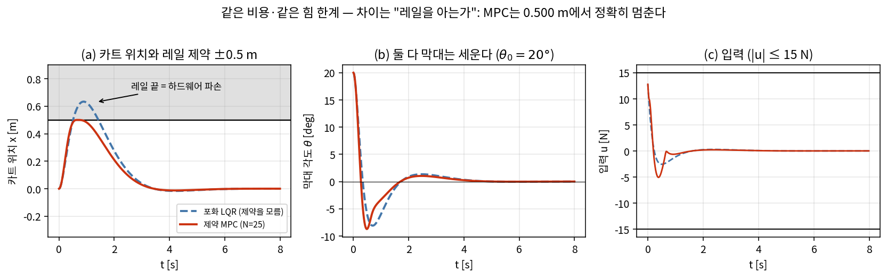
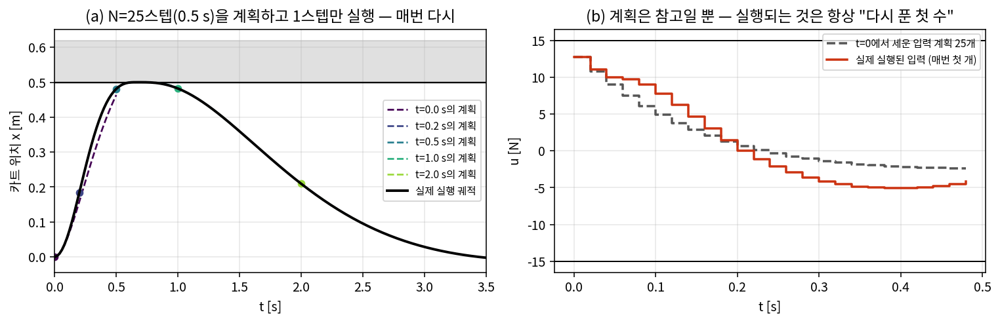
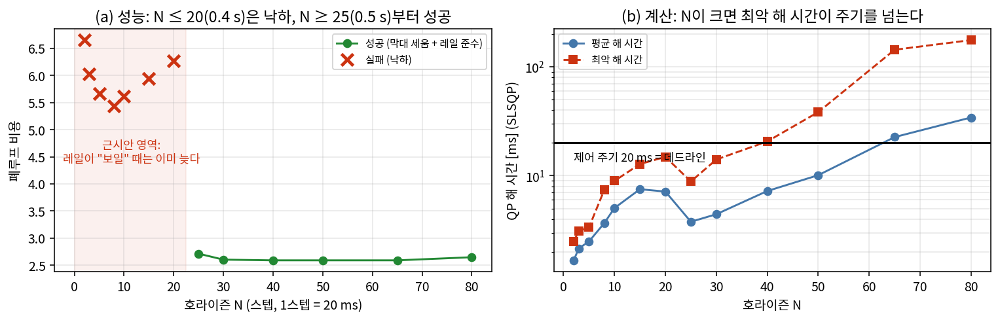
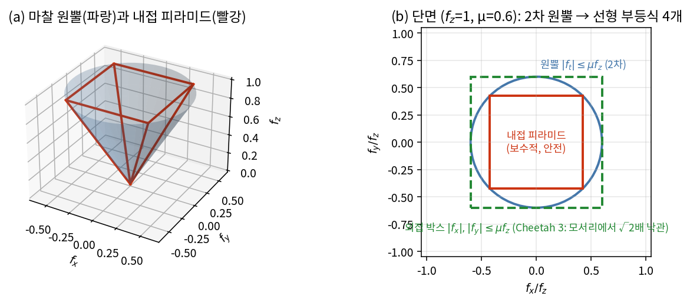
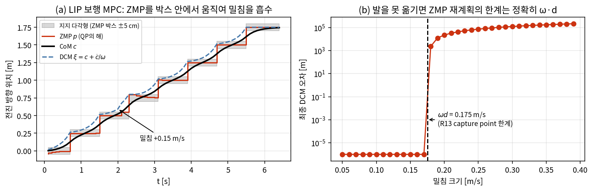
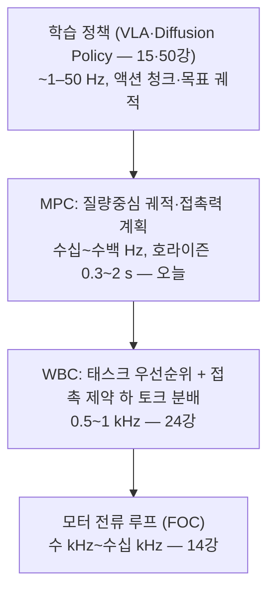

# Lec 23. 모델 예측 제어(MPC) — 매 순간 최적화로 제어하기

> 하위제어 트랙 23일차 (Part R5 제어, 일곱 번째). 선수 지식: 17강(피드백·주기), 18강(상태공간·LQR·Riccati), 13강(LIP·ZMP·capture point), 12강(마찰 원뿔).
> 이 주제는 MR 범위 밖이다 — 기초 참고서는 Rawlings·Mayne·Diehl, *Model Predictive Control*(무료 PDF) [4]와 Boyd·Vandenberghe, *Convex Optimization*(무료 PDF) [2].

## 한 장 요약



18강의 카트폴, 같은 비용 행렬, 같은 힘 한계($|u| \le 15$ N)다. 다른 것은 단 하나 — **카트 레일이 ±0.5 m에서 끝난다는 사실을 아는가**. 포화 LQR(파랑 점선)은 막대를 세우지만 카트가 0.633 m까지 나간다: 실물이라면 엔드스톱 충돌이다. 제약 MPC(빨강)는 정확히 0.500 m에서 멈추고 같은 일을 해낸다 (폐루프 비용 2.335 → 2.714, 16% 추가 지불). 오늘 배우는 것: ① 유한 구간 최적화 문제를 매 주기 새로 풀고 ② 첫 입력만 실행하는 **receding horizon**, ③ 제약을 정면으로 다루는 **QP**, 그리고 ④ 그 계산이 제어 주기 안에 끝나야 한다는 **예산**.

## 학습 목표

1. 유한 구간 제약 최적제어 문제를 쓰고, 동역학 등식을 소거해 QP(2차 계획법)로 변환할 수 있다.
2. 무제약 receding horizon MPC가 LQR과 **동일**함을 수치로 증명하고, terminal cost의 역할을 가치함수로 설명할 수 있다.
3. receding horizon("N스텝 계획, 1스텝 실행")이 개루프 최적화를 폐루프 피드백으로 바꾸는 메커니즘을 설명할 수 있다.
4. 입력·상태 제약 MPC를 scipy로 구현하고, 포화 LQR과 정량 비교하며, 호라이즌 길이 ↔ 계산 예산 트레이드오프를 측정할 수 있다.
5. 보행 convex MPC의 구도(질량중심 동역학 + 접촉력 결정변수 + 마찰 원뿔의 선형화)를 설명하고 LIP-ZMP 미니 버전을 구현할 수 있다.

## 왜 이 강의가 필요한가

18강의 마지막 수치를 기억하라 — 힘 한계 $u_{\max}=15$ N을 거는 순간 LQR의 회복 가능 영역이 63.3°에서 47.7°로 내려앉았다. LQR은 **제약이 없는 세계**의 최적해다. `clip()`으로 잘라 쓰면 제약을 "당하는" 것이지 "아는" 것이 아니다. 그런데 실제 로봇은 제약 덩어리다: 모터 토크·전류 한계(14강), 관절 가동 범위(1강), 작업장의 벽과 레일, ZMP는 지지 다각형 안(13강), 접촉력은 마찰 원뿔 안(12강). 제약이 활성화되는 곳이 바로 성능의 경계 — 로봇을 한계까지 모는 제어(점프하는 사족, 밀쳐진 휴머노이드)일수록 제약 위에서 산다. MPC는 이 제약들을 최적화 문제의 부등식으로 **명시하고 매 주기 다시 푸는** 제어다. 대가는 계산이다: LQR은 게인 하나를 오프라인에서 구해 곱셈 한 번으로 쓰지만, MPC는 **매 제어 주기마다 최적화 문제를 하나씩** 푼다. 그래서 "MPC의 주기는 솔버가 결정한다" — 이 강의의 후반부는 그 예산 감각이다. 휴머노이드·사족의 하위 스택 표준(다음 24강의 WBC와 한 쌍)이자, 딥러닝 쪽 독자에게는 익숙한 구도의 원형이기도 하다: Diffusion Policy의 예측–실행–재계획(39강)은 MPC의 receding horizon에 학습 모델을 끼운 것이다.

## 본문

### 1. 아이디어: 유한한 미래를 통째로 최적화하고, 한 걸음만 걷는다

MPC 루프는 네 박자다:


"N수 앞을 읽고 한 수만 둔다"는 체스 엔진과 같은 구도다. 핵심 질문 두 개가 이 강의의 뼈대다: **(A)** 계획을 N개 세워놓고 왜 하나만 쓰는가? (§E3 — 그것이 피드백의 원천이다) **(B)** 매 주기 최적화를 "풀 수 있다"는 보장은 어디서 오는가? (§E4 — 볼록성, 그리고 §2의 계산 예산)

### 핵심 수식

#### E1. 유한 구간 제약 최적제어 문제

**직관**: "지금부터 N스텝 동안의 입력열을 통째로 변수로 놓고, 모델로 미래를 시뮬레이션하면서 비용이 최소가 되는 입력열을 찾아라 — 단, 한계를 넘는 계획은 아예 후보에서 제외."

**물리·기하적 의미**: 비용의 앞부분(스테이지 비용)은 18강의 LQR 비용을 N스텝에서 자른 것이다. 잘린 자리에 붙는 **terminal cost** $x_N^\top P x_N$이 "호라이즌 너머의 미래"를 요약하는 어림값 — 정확히 18강의 가치함수 $V(x) = x^\top P x$ 자리다. 제약은 실행 가능한 계획의 집합을 조각하는 벽이고, LQR과 MPC를 가르는 것은 이 벽의 존재다.

**형식**: 이산 선형 모델(18강의 연속 모델을 ZOH 이산화)과 초기조건 $x_0$ = 현재 측정에 대해

$$
\min_{u_0, \dots, u_{N-1}} \ \sum_{k=0}^{N-1} \left( x_k^\top Q x_k + u_k^\top R u_k \right) + x_N^\top P x_N
$$

$$
\text{s.t.} \quad x_{k+1} = A_d x_k + B_d u_k, \qquad |u_k| \le u_{\max}, \qquad |[x_k]_{\text{pos}}| \le x_{\max}
$$

결정변수는 입력열 $U = (u_0, \dots, u_{N-1})$뿐이다 — 상태열은 모델이 결정하므로 변수가 아니다(E2에서 소거). 제약이 선형 부등식이고 비용이 2차식이므로 이 문제는 **QP**(quadratic program)다 [2][4].

#### E2. 배치 소거와 무제약 해석해 — "무제약 MPC = LQR"

**직관**: "동역학 등식은 제약이 아니라 대입이다." $x_1 = A_d x_0 + B_d u_0$, $x_2 = A_d^2 x_0 + A_d B_d u_0 + B_d u_1$, … 전부 $U$의 1차식이므로 비용에 되넣으면 $U$만의 2차식이 남는다.

**물리·기하적 의미**: $J(U)$는 $U$-공간의 **볼록 포물면 그릇**이다($H \succ 0$, $R \succ 0$이므로). 무제약이면 그릇의 바닥이 닫힌 형태로 나오고, 그 첫 성분 $u_0^*$가 $x_0$의 **선형 함수**가 된다 — 즉 무제약 receding horizon MPC는 결국 선형 게인이고, terminal cost로 Riccati 해 $P$(18강의 DARE)를 쓰면 그 게인이 **모든 N에서 LQR 게인과 정확히 일치**한다. 제약이 없다면 MPC는 LQR을 매 주기 비싸게 다시 푸는 낭비일 뿐이라는 것 — 이것이 "제약이 MPC의 존재 이유"의 정확한 의미다.

**형식**: 스택 $X = (x_1, \dots, x_N)$, $\bar Q = \mathrm{blkdiag}(Q, \dots, Q, P)$, $\bar R = \mathrm{blkdiag}(R, \dots, R)$로 쓰면

$$
X = S_x x_0 + S_u U \quad\Rightarrow\quad J(U) = U^\top H U + 2 x_0^\top F^\top U + \text{const}, \qquad H = S_u^\top \bar Q S_u + \bar R
$$

$$
\nabla J = 0 \ \Rightarrow\ U^* = -H^{-1} F x_0, \qquad u_0^* = -K_N x_0 \ \ (\text{첫 블록 행})
$$

유도 요점: $S_x$의 $k$번째 블록은 $A_d^k$(자유 응답), $S_u$는 입력이 동역학을 타고 전파되는 하삼각 블록 Toeplitz다. terminal $P$가 DARE 해면 backward induction(Riccati 재귀)과 배치 최소자승이 같은 답을 주므로 $K_N = K_{\text{LQR}}$이 모든 $N \ge 1$에서 성립한다 [4].

### Worked Example

#### WE-1 (손): 가장 작은 MPC — 황금비가 나온다

스칼라 시스템 $x_{k+1} = x_k + u_k$, $q = r = 1$. **N=2 MPC를 손으로 풀자** (terminal 가중도 1): $J = x_0^2 + u_0^2 + x_1^2 + u_1^2 + x_2^2$. 뒤에서부터(backward induction):

$$
\min_{u_1}\left[ u_1^2 + (x_1 + u_1)^2 \right] \ \Rightarrow\ u_1 = -\tfrac{1}{2} x_1, \quad \text{cost-to-go} = \tfrac{1}{2} x_1^2 \ \Rightarrow\ V_1(x_1) = \tfrac{3}{2} x_1^2
$$

$$
\min_{u_0}\left[ u_0^2 + \tfrac{3}{2}(x_0 + u_0)^2 \right] \ \Rightarrow\ u_0 = -\tfrac{1.5}{2.5} x_0 = -0.6\, x_0
$$

receding horizon으로 쓰면 정책은 $u = -0.6x$ (폐루프 $x^+ = 0.4x$). 한편 **무한 구간 LQR**은? DARE $P = 1 + P - \frac{P^2}{1+P}$ 를 정리하면 $P^2 - P - 1 = 0$, 즉

$$
P = \frac{1+\sqrt 5}{2} = \varphi \approx 1.618 \ (\text{황금비}), \qquad K_\infty = \frac{P}{1+P} = \varphi - 1 \approx 0.618
$$

N=2의 0.6은 0.618의 근사다. Riccati 재귀를 계속 돌리면 $P_k = 1, \tfrac{3}{2}, \tfrac{8}{5}, \tfrac{21}{13}, \dots \to \varphi$ — **피보나치 비율을 타고 황금비로 수렴**한다(가치 반복의 고정점, 18강 번역 박스). 그리고 terminal cost로 $\varphi$를 쓰면? $\min_{u_0}[u_0^2 + \varphi(x_0+u_0)^2] \Rightarrow u_0 = -\frac{\varphi}{1+\varphi}x_0 = -0.618\,x_0$ — **N=1짜리 MPC가 무한 구간 LQR과 정확히 일치**한다. terminal cost가 정확한 가치함수면 호라이즌은 한 스텝이면 충분하다.

#### WE-2 (코드): 카트폴에서 "무제약 MPC = LQR" 수치 증명 — 그리고 근시안의 정체

18강 카트폴을 50 Hz로 이산화하고, 배치 MPC의 첫 입력 게인 $K_N$을 DLQR 게인과 비교한다:

```python
import numpy as np
from scipy.linalg import expm, solve_discrete_are, block_diag

M, m, l, g = 1.0, 0.1, 0.5, 9.81                      # 18강과 동일한 카트폴
A = np.array([[0,0,1,0],[0,0,0,1],[0,-m*g/M,0,0],[0,(M+m)*g/(M*l),0,0]], float)
B = np.array([[0.],[0.],[1/M],[-1/(M*l)]])
dt = 0.02                                             # 제어 주기 50 Hz
aug = np.zeros((5,5)); aug[:4,:4], aug[:4,4:] = A, B
Md = expm(aug*dt); Ad, Bd = Md[:4,:4], Md[:4,4:]      # ZOH 이산화

Q = np.diag([1., 10., 0.1, 0.1]); R = np.array([[0.1]])
P = solve_discrete_are(Ad, Bd, Q, R)                  # 이산 Riccati (DARE)
Kd = np.linalg.solve(R + Bd.T@P@Bd, Bd.T@P@Ad)
print("K_dlqr =", np.round(Kd.ravel(), 3))            # [-2.79 -36.614 -3.933 -7.851]

def batch(N):                                          # E2의 Sx, Su
    Sx = np.vstack([np.linalg.matrix_power(Ad, k+1) for k in range(N)])
    Su = np.zeros((4*N, N))
    for k in range(N):
        for j in range(k+1):
            Su[4*k:4*k+4, j:j+1] = np.linalg.matrix_power(Ad, k-j) @ Bd
    return Sx, Su

def mpc_gain(N, Pt):                                   # 무제약 MPC '첫 입력'의 게인
    Sx, Su = batch(N)
    Qbar = block_diag(*([Q]*(N-1) + [Pt]))
    H = Su.T@Qbar@Su + np.kron(np.eye(N), R)
    return np.linalg.solve(H, Su.T@Qbar@Sx)[:1]        # U* = -K_full x0 의 첫 행

for N in [1, 10, 20, 50]:                              # terminal = Q (미래 가치 추정 없음)
    K_N = mpc_gain(N, Q)
    rho = max(abs(np.linalg.eigvals(Ad - Bd@K_N)))
    print(f"N={N:2d}, terminal=Q: ||K_N-K_dlqr||={np.linalg.norm(K_N-Kd):6.2f}, ρ={rho:.4f}")
for N in [1, 5]:                                       # terminal = P (정확한 가치함수)
    print(f"N={N}, terminal=P: ||K_N-K_dlqr||={np.linalg.norm(mpc_gain(N,P)-Kd):.2e}")
```

출력:

```
K_dlqr = [ -2.79  -36.614  -3.933  -7.851]
N= 1, terminal=Q: ||K_N-K_dlqr||= 37.69, ρ=1.0962
N=10, terminal=Q: ||K_N-K_dlqr||= 31.94, ρ=1.0517
N=20, terminal=Q: ||K_N-K_dlqr||= 18.33, ρ=1.0116
N=50, terminal=Q: ||K_N-K_dlqr||=  9.50, ρ=0.9938
N=1, terminal=P: ||K_N-K_dlqr||=0.00e+00
N=5, terminal=P: ||K_N-K_dlqr||=1.47e-13
```

읽는 법: (1) **terminal cost가 DARE 해 $P$면 N=1에서도 LQR과 기계 정밀도로 일치** — WE-1의 결론이 4차 시스템에서 재현된다. (2) terminal을 그냥 $Q$로 두면(호라이즌 너머의 가치를 무시하면) 폐루프 스펙트럼 반경 $\rho$가 N=20(0.4초 호라이즌)에서도 1을 넘는다 — **불안정**. 개루프 $\rho = 1.0974$($e^{4.65 \cdot 0.02}$, 18강의 불안정 극점)와 비교하면 N=1 MPC는 사실상 아무것도 못 하고 있다. N=50(1초)에 이르러서야 $\rho < 1$. 근시안(myopia)의 정체가 이것이다: **호라이즌이 짧은 게 문제가 아니라, 잘린 미래의 가치 평가가 없는 것이 문제다.** 딥러닝 언어로 — n-step return에 부트스트랩할 가치함수가 없으면 n이 시스템의 시간스케일(불안정 극점의 배가 시간 ~0.15 s)보다 한참 길어야 하는 것과 같다.

#### E3. Receding horizon — 피드백이 생기는 메커니즘

**직관**: "계획은 틀리라고 세우는 것이다." N개의 입력을 다 실행하면 개루프다 — 첫 계산 이후 로봇은 눈을 감고 걷는다. 첫 입력만 쓰고 **다음 주기에 새로 측정한 $x_0$로 문제를 다시 풀면**, 외란·모델 오차가 매 주기 계획에 반영된다. 재계획이 곧 피드백이다.

**물리·기하적 의미**: E2에서 $u_0^*$는 $x_0$의 함수였다. receding horizon은 이 대응을 **암묵적 정책**(implicit policy)으로 쓰는 것이다: $u = \kappa_{\text{MPC}}(x) \equiv$ "현재 $x$에서 QP를 푼 해의 첫 블록". 제약이 없으면 $\kappa$는 선형($-K x$), 제약이 있으면 **조각별 아핀**(piecewise affine) — 활성 제약의 조합마다 다른 아핀 법칙이 적용되고, 제약이 안 걸리는 영역에서는 정확히 LQR로 되돌아간다 [4].

**형식**:

$$
u(t_k) = u_0^*\big(x(t_k)\big), \qquad u_1^*, \dots, u_{N-1}^* \ \text{폐기}, \qquad t_{k+1}\text{에서 전체 재계산}
$$



그림 (a): 레일 제약 카트폴(아래 WE-3)에서 각 시점의 25스텝 계획(점선)과 실제 실행 궤적(검정). 계획들은 매번 조금씩 다르다 — 선형 모델과 비선형 현실의 차이를 재계획이 매 주기 흡수하기 때문. (b): t=0에 세운 입력 계획(회색)과 실제 실행된 입력열(빨강)은 다르다. **실행되는 것은 언제나 "방금 다시 푼 첫 수"다.** AI·VLA 파트 37강의 compounding error가 개루프 실행의 병이었다면, 재계획은 그 병에 대한 제어 쪽의 처방이다.

#### E4. 제약 QP — MPC의 존재 이유

**직관**: 그릇($J$)은 그대로인데 벽(제약)이 생겼다. 최솟값이 벽 안쪽이면 LQR과 같은 답, 벽에 걸리면 **벽을 따라 미끄러진 지점**이 답이다. `clip()`은 "무제약 답을 구한 뒤 벽으로 자르는 것" — 벽을 따라 미끄러진 최적점과는 다른 점이다.

**물리·기하적 의미**: 볼록 비용 + 선형 제약 = **볼록 QP**: 국소 최적해가 곧 전역 최적해고, 유일하며, 실시간 솔버가 다항 시간에 푼다 [2]. 제어기가 매 주기 "반드시 풀린다"는 보장이 필요하므로 이 볼록성은 사치가 아니라 안전 요건이다. 활성 제약이 없으면 KKT 조건이 $\nabla J = 0$으로 줄어 LQR로 복귀 — E3의 조각별 아핀 구조가 여기서 나온다.

**형식**:

$$
\min_U \ U^\top H U + 2 x_0^\top F^\top U \qquad \text{s.t.} \quad \underbrace{-u_{\max} \le U \le u_{\max}}_{\text{입력 박스}}, \quad \underbrace{|S_x^{\text{pos}} x_0 + S_u^{\text{pos}} U| \le x_{\max}}_{\text{상태(레일) 제약 — } U\text{의 선형 부등식}}
$$

상태 제약도 E2의 소거를 거치면 $U$의 선형 부등식일 뿐이다. 전용 QP 솔버(OSQP, qpOASES 등)가 표준이지만, 이 강의에서는 scipy만 쓴다: 박스 제약뿐이면 `lsq_linear`(경계 있는 최소자승 — 우리 QP와 정확히 동치), 일반 선형 부등식은 `minimize(method='SLSQP')`.

#### WE-3 (코드): 레일 제약 MPC vs 포화 LQR — 제약을 "아는" 제어의 가치

한 장 요약의 실험이다. 비선형 카트폴(RK4, 50 Hz 제어)에 레일 $|x| \le 0.5$ m, 힘 한계 $|u| \le 15$ N:

```python
from scipy.optimize import minimize

def f_nl(s, F):                                        # 비선형 카트폴 (18강과 동일)
    x, th, xd, thd = s
    sn, cs = np.sin(th), np.cos(th); den = M + m*sn**2
    return np.array([xd, thd, (F + m*sn*(l*thd**2 - g*cs))/den,
                     (-F*cs - m*l*thd**2*sn*cs + (M+m)*g*sn)/(l*den)])

def rk4(s, F, h):
    k1=f_nl(s,F); k2=f_nl(s+h/2*k1,F); k3=f_nl(s+h/2*k2,F); k4=f_nl(s+h*k3,F)
    return s + h/6*(k1+2*k2+2*k3+k4)

def make_mpc(N, umax, xmax=None):                      # E1~E4를 그대로 코드로
    Sx, Su = batch(N)
    Qbar = block_diag(*([Q]*(N-1) + [P]))              # terminal = DARE 해 P
    H = Su.T@Qbar@Su + np.kron(np.eye(N), R); H = 0.5*(H+H.T)
    F_ = Su.T@Qbar@Sx
    rows = np.arange(N)*4                              # 스택 X에서 카트 위치 행
    Gp, Sp = Su[rows,:], Sx[rows,:]
    prev = {'U': np.zeros(N)}
    def ctrl(s):
        fv = F_@s
        cons = []
        if xmax is not None:                           # 레일: U의 선형 부등식
            c0 = Sp@s
            cons = [{'type':'ineq','fun':lambda U: xmax-(c0+Gp@U),'jac':lambda U:-Gp},
                    {'type':'ineq','fun':lambda U: xmax+(c0+Gp@U),'jac':lambda U: Gp}]
        res = minimize(lambda U: U@H@U/2 + fv@U, np.r_[prev['U'][1:], 0.],
                       jac=lambda U: H@U + fv, method='SLSQP',
                       bounds=[(-umax, umax)]*N, constraints=cons,
                       options={'maxiter': 200, 'ftol': 1e-9})
        prev['U'] = res.x                              # warm start: 이전 해를 한 칸 시프트
        return res.x[0]                                # receding horizon: 첫 입력만
    return ctrl

def simulate(ctrl, th0_deg, umax, T=8.0, nsub=10):     # 50 Hz 제어, 500 Hz 적분
    s = np.array([0., np.radians(th0_deg), 0., 0.]); h = dt/nsub
    S, U = [s.copy()], []
    for k in range(int(T/dt)):
        u = float(np.clip(ctrl(s), -umax, umax)); U.append(u)
        for _ in range(nsub): s = rk4(s, u, h)
        S.append(s.copy())
        if abs(s[1]) > np.pi/2: break
    return np.array(S), np.array(U)

S, U = simulate(lambda s: -(Kd@s)[0], 20., 15.)        # 포화 LQR
print(f"포화 LQR: max|x| = {np.max(np.abs(S[:,0])):.3f}")        # 0.633 — 레일 침범
S, U = simulate(make_mpc(25, 15., 0.5), 20., 15.)      # 제약 MPC
print(f"제약 MPC: max|x| = {np.max(np.abs(S[:,0])):.4f}")        # 0.5000 — 정확히 준수
```

세 가지 시나리오로 회복 가능 최대 초기각을 이진 탐색하면 (`images/lec23/gen_figs.py` + 본문 코드):

| 시나리오 ($\theta_0$ 경계) | 포화 LQR | 제약 MPC (N=25) |
|---|---|---|
| 힘 무제한 | 61.9° | 무제약 MPC = LQR이므로 동일 (E2) |
| $\|u\| \le 15$ N (입력 제약만) | 47.6° | **47.6° — 동률!** |
| $\|u\| \le 15$ N + 레일 ±0.5 m 준수 요구 | 16.2° | **22.9° (1.4배)** |

읽는 법: (1) 힘 무제한 61.9°는 18강의 63.3°(500 Hz 연속 게인)보다 약간 좁다 — 50 Hz 이산화의 대가(17강의 "지연·주기의 대가"). (2) **입력 제약만으로는 동률**이라는 결과에 주목하라. 단일 입력에서 `clip`은 방향을 왜곡하지 못하고, 큰 각도에서는 "어차피 최대 힘으로 미는 것"이 최적에 가깝기 때문이다 — MPC가 항상 이기는 마법이 아니다(흔한 오해 2). (3) 차이는 **상태 제약**에서 벌어진다: 레일을 지키려면 "지금 브레이크를 밟아야 0.3초 뒤에 멈춘다"는 **미래를 담은 추론**이 필요한데, `clip`은 현재밖에 모른다. 같은 20°에서 LQR은 레일을 0.133 m 침범하고(실기라면 파손), MPC는 0.500 m에서 정확히 멈춘다 — 추가 지불한 폐루프 비용은 16%다(2.335 → 2.714).

### 2. 호라이즌 N과 계산 예산 — "MPC의 주기는 솔버가 결정한다"



레일 시나리오($\theta_0 = 20°$)에서 N을 쓸어 보면 (수치는 `gen_figs.py`, 해 시간은 이 저술 환경 실측):

| N (호라이즌) | 결과 | 폐루프 비용 | 해 시간 평균 / 최악 [ms] |
|---|---|---|---|
| 2~20 (0.04~0.4 s) | **낙하** | 5.4~6.7 | 0.5~2.0 / 0.8~4.3 |
| 25 (0.5 s) | 성공 | 2.714 | 0.9 / 2.1 |
| 30~40 (0.6~0.8 s) | 성공 | 2.591~2.604 | 1.3~3.0 / 3.5~7.0 |
| 50 (1.0 s) | 성공 | 2.591 | 4.9 / **24.8 — 데드라인 초과** |
| 65 (1.3 s) | 성공 | 2.591 | 8.5 / **44.1** |
| 80 (1.6 s) | 성공 | 2.648 | 15.5 / **64.2** |

세 가지 교훈: **① 너무 짧으면 근시안** — N≤20은 카트가 레일에 닿을 무렵에야 제약이 호라이즌에 들어오고, 그때는 이미 멈출 수 없는 속도다(제동 거리 부족). 특기할 것은 이들이 레일을 "지키면서" 낙하한다는 점: terminal cost $P$는 레일을 모르는(무제약) 가치함수라서, 호라이즌이 제약을 덮지 못하면 그 오차를 그대로 물려받는다. **② 충분하면 그만** — N=25(0.5 s)를 넘으면 비용은 2.59에서 포화한다(N=80의 미세한 상승은 SLSQP 수렴 한계). 필요한 호라이즌의 스케일은 태스크의 물리(여기서는 제동에 걸리는 시간 ≈ 0.5 s)가 정한다. **③ 계산은 초선형으로 자란다** — 최악 해 시간이 N=50부터 제어 주기 20 ms를 넘는다(평균은 아직 5 ms — 최악값은 OS 지터가 지배해 런마다 요동하며, 재실행하면 N=40에서도 20 ms를 넘나든다. 그 요동까지 포함해 버텨야 하는 것이 실시간 제어다). **평균이 아니라 최악이 기준**이다: 한 주기라도 데드라인을 놓치면 그 주기 동안 제어기는 없는 것과 같다(17강의 지연 = 위상 손실 [1]). 실무 처방: 전용 QP 솔버(OSQP·qpOASES — SLSQP보다 수십~수백 배 빠름), warm start(위 코드의 시프트), 문제의 희소성 활용, 그리고 데드라인 미스 시 이전 해의 다음 입력을 쓰는 fallback. Cheetah 3의 보행 QP는 이런 기법으로 **0.2~0.3 ms**(최악 ~0.5 ms)에 풀렸다 [3].

### 3. 보행 convex MPC — 질량중심으로 몸 전체를 요약한다

휴머노이드·사족의 몸 전체 동역학은 비선형에 고차원이지만(10~13강), 보행 MPC의 표준 수는 **몸을 질량중심 하나로 요약**하는 것이다. MIT Cheetah 3의 convex MPC [3]가 이 구도의 원전: 상태는 단일 강체(몸통)의 자세·속도, **결정변수는 각 발의 접촉력** $f_i$, 회전 동역학의 자이로스코픽 항을 무시해 선형화하면 E1과 같은 꼴의 QP가 된다. 남는 비선형은 마찰 원뿔(12강) — 이것도 선형화한다:



$$
\|f_t\| \le \mu f_z \ (\text{2차 원뿔}) \quad\longrightarrow\quad |f_x| \le \tfrac{\mu}{\sqrt 2} f_z, \ |f_y| \le \tfrac{\mu}{\sqrt 2} f_z \ (\text{내접 피라미드, 선형 부등식 4개})
$$

내접이면 보수적(안전), Cheetah 3처럼 외접 박스($|f_x|, |f_y| \le \mu f_z$)를 쓰면 모서리에서 $\sqrt 2$배 낙관적이다 [3] — 어느 쪽이든 QP 호환. "접촉력이 원뿔 안"이라는 12강의 물리가 부등식 몇 줄로 최적화에 들어가는 순간이다.

**미니 버전 — LIP 보행 MPC**: 13강의 선형 도립진자 $\ddot c = \omega^2 (c - p)$에서 ZMP $p$를 결정변수로 놓고, 발자국 중심 $p^{\text{ref}}$ 추종 + 말단 DCM 조건(capture point, 13강)을 비용으로, **지지 다각형 $|p - p^{\text{ref}}| \le d$를 박스 제약으로** 걸면 경계 있는 최소자승 — `lsq_linear` 한 줄이다:

```python
# 핵심부 (전체는 images/lec23/gen_figs.py의 fig4 블록)
# 상태 x=(c, ċ), LIP 이산화 Al, Bl / 호라이즌 Nl=16 (1.6 s), 10 Hz 재계획
A_ls = np.vstack([np.eye(Nl), 10.*xi_su])              # ZMP 추종 + 말단 DCM(가중 10)
b_ls = np.concatenate([pref, [10.*(pref[-1] - xi_row@x)]])
sol = lsq_linear(A_ls, b_ls, bounds=(pref-d, pref+d), method='bvls')   # 지지 다각형 박스
p0 = sol.x[0]                                          # receding horizon: 첫 ZMP만 적용
```



$z_0 = 0.8$ m($\omega = 3.50$), 보폭 0.25 m/0.8 s, 지지 박스 ±5 cm로 8걸음: ZMP는 항상 박스 안(최대 편차 3.9 cm), 평균 전진 속도 0.273 m/s. t=2.0 s에 **+0.15 m/s 밀침**을 줘도 MPC가 ZMP를 박스 안에서 앞으로 옮겨 흡수한다(최종 DCM 오차 0.0000 m). 밀침을 키우면? 그림 (b) — **0.17 m/s까지는 흡수, 0.18 m/s부터 발산**한다. 13강의 capture point 이론이 예측하는 한계 $\Delta \dot c_{\max} = \omega d = 3.50 \times 0.05 = 0.175$ m/s와 정확히 일치한다. 그 너머를 버티려면 발 디딤 위치 자체를 결정변수에 넣어야 하고(발자국도 선형 변수로 넣으면 볼록성이 유지된다), 그것이 실전 휴머노이드 보행 MPC의 표준 확장이다.

### 4. 제어 스택 속의 MPC — 그리고 주기의 계층



각 층의 주기는 아래로 갈수록 빨라지고, MPC 층의 주기는 정확히 "QP가 풀리는 속도"다(§2). 48강의 Atlas LBM이 "MPC급 전신 제어 위에" 학습 정책을 얹는다고 했던 그 아래층이 이 그림의 MPC+WBC이고, 24강에서 WBC를 채우면 이 스택이 완성된다.

### 딥러닝 배경자를 위한 번역

- **MPC는 테스트타임 최적화다.** 파라미터를 훈련하는 대신 **추론 시점에** 행동을 최적화한다 — model-based RL에서 world model로 행동열을 계획하는 것(planning)과 같은 구도이고, 실제로 그 문헌들은 이 절차를 그대로 "MPC"라고 부른다. 차이는 모델의 출처뿐이다: 물리 방정식(오늘) vs 학습된 world model(63강).
- **Terminal cost는 value bootstrap이다.** "N스텝 lookahead + 말단 가치"는 RL의 n-step return + $V(s_{t+n})$과 동형이다. 가치함수가 정확하면(DARE의 $P$) N=1로 충분하고(WE-1·WE-2 — TD(0)에 대응), 가치함수가 틀리면(레일을 모르는 $P$) 호라이즌이 그 오차를 메꿔야 한다(§2의 근시안). "짧은 호라이즌 + 좋은 가치함수 vs 긴 호라이즌 + 대충의 가치함수"라는 트레이드오프는 양쪽 분야가 공유하는 설계 축이다.
- **Receding horizon은 Diffusion Policy가 쓰는 바로 그 구도다** (39강). DP는 16스텝 행동을 생성해 8스텝만 실행하고 재계획한다 [6] — "N개 계획, 일부 실행, 재계획"이라는 MPC의 뼈대에 QP 솔버 대신 학습된 생성 모델을 끼운 것. MPC가 가진 것(명시적 제약, 볼록성의 전역 최적 보장)과 DP가 가진 것(다봉 분포, 지각 입력)이 정확히 상보적이라는 점이 두 세계의 접점이다.
- **MPC의 증류 = amortized optimization.** 매 주기 최적화가 비싸면, MPC를 오프라인에서 많이 풀어 그 입출력을 신경망으로 근사할 수 있다(explicit MPC의 학습판 — 정책 증류와 같은 산수). 추론 비용을 학습으로 선지불하는 이 이동은 48강의 "최적화 제어 → 신경망 제어기" 흐름의 뿌리다.

## 흔한 오해

1. **"MPC는 LQR과 다른, 근본적으로 새로운 최적 제어 이론이다"** — 무제약이면 **정확히 LQR이다**(WE-2: 오차 $10^{-13}$). MPC가 새로 가져오는 것은 이론이 아니라 **제약의 명시적 처리 + 온라인 재계획**이라는 구현 형식이다. "MPC를 쓴다"는 말의 정보량은 "무엇을 제약으로 걸었나"에 있다.
2. **"제약은 포화(clip)로 충분하다 / 반대로, MPC는 포화 LQR보다 항상 낫다"** — 둘 다 틀렸다. 입력 박스 + 단일 입력의 카트폴에서는 회복 경계가 **동률**(47.6°)이었다 — 큰 오차에서 "최대 힘"은 clip도 MPC도 같은 결론이기 때문. 차이는 **상태 제약**(미래를 알아야 지킬 수 있는 한계: 레일 16.2° vs 22.9°), **다입력의 방향 왜곡**(성분별 clip은 힘 벡터의 방향을 비튼다 — 12강의 마찰 원뿔에서 치명적), 그리고 제약 근처에서의 성능에서 벌어진다.
3. **"호라이즌은 길수록 좋다"** — 성능은 물리가 정한 스케일(제동 거리, 보행 주기)에서 포화하고, 계산은 초선형으로 자란다(§2: N=50부터 최악 해 시간이 20 ms 주기 초과). 데드라인을 놓친 최적해는 해가 아니다. 올바른 방향은 N을 늘리는 것이 아니라 **terminal cost를 좋게 만드는 것**(WE-1: 정확한 가치함수면 N=1) — RL이 lookahead 대신 가치함수를 학습하는 이유와 같다.
4. **"최적화가 풀렸으니 안전하다"** — 세 가지 함정이 있다. ① 보장은 **모델이 맞을 때**의 이야기다(선형화 모델의 MPC는 핵심 수식 절의 basin 한계를 그대로 가진다). ② 외란이 크면 **제약을 만족하는 해가 아예 없을 수 있다**(infeasible) — 실무는 상태 제약을 슬랙 변수로 완화(soft constraint)하고 위반에 큰 벌점을 문다 [4]. ③ 모델이 비선형이면(SQP·iLQR류) 해는 국소 최적일 뿐이다. "볼록 MPC"라는 수식어가 붙는 이유가 ③의 부재를 보장한다는 뜻이다.

## 실습 (1.5~2시간)

**MuJoCo 카트폴에서 MPC 루프 돌리기 — 그리고 데드라인 재기.** (CPU로 충분)

1. 18강 실습의 카트폴 XML을 그대로 쓴다. WE-2·WE-3의 코드(`Ad, Bd, P, make_mpc`)를 준비하고, 50 Hz MPC 루프를 돌린다 (MuJoCo 타임스텝 2 ms × 10 서브스텝 = 제어 주기 20 ms):

```python
import mujoco, time
m = mujoco.MjModel.from_xml_string(XML)      # 18강 실습의 카트폴 XML
d = mujoco.MjData(m)
mpc = make_mpc(25, umax=15., xmax=0.5)
d.qpos[:] = [0.0, np.radians(20)]
solve_times, miss = [], 0
for k in range(400):                          # 8초
    s = np.array([d.qpos[0], d.qpos[1], d.qvel[0], d.qvel[1]])
    t0 = time.perf_counter()
    d.ctrl[0] = np.clip(mpc(s), -15, 15)
    st = time.perf_counter() - t0
    solve_times.append(st); miss += (st > 0.02)
    for _ in range(10): mujoco.mj_step(m, d)  # 2 ms × 10
print(f"θ_final={np.degrees(d.qpos[1]):.3f}°, 데드라인 미스 {miss}/400, "
      f"해 시간 avg {np.mean(solve_times)*1e3:.2f} / max {np.max(solve_times)*1e3:.2f} ms")
```

   이 저술 환경의 실측: 막대 직립(θ_final ≈ −0.001°), **max|x| = 0.5000 m**(본문 해석 모델과 일치 — 18강에서 확인한 "같은 물리, 두 적분기"의 재판), 해 시간 평균 0.93 ms / 최악 2.86 ms, 미스 0/400.
2. **"MPC의 주기는 솔버가 결정한다"를 체감하라**: N을 25 → 50 → 80으로 키우며 미스 횟수를 세라. 미스가 나기 시작하는 N이 여러분 머신의 실시간 한계다. 미스가 났을 때의 fallback(이전 해를 한 칸 시프트해 사용)을 구현해 보라 — warm start 딕셔너리 `prev`에 이미 재료가 있다.
3. **제약을 눈으로**: `d.qpos[0]`의 최대값을 기록해 레일 준수를 확인하고, XML에 x=±0.5 위치의 벽 geom을 추가해 포화 LQR(18강의 게인)이 실제로 부딪히는 것을 관찰하라.
4. **cvxpy 설치 시도**: `pip install cvxpy` 후 같은 QP를 `cp.Minimize(cp.quad_form(U,H) + 2*f@U)` + 제약으로 풀고 OSQP 해 시간을 SLSQP와 비교하라. **설치가 실패해도 진행에 지장 없다** — 이 강의의 모든 코드는 scipy만 쓴다.
5. (심화) 시뮬레이션 도중 막대에 외란 토크 펄스를 주고(`d.qfrc_applied` [5]), 재계획이 그것을 흡수하는 과정을 fig2처럼 "계획 vs 실행"으로 그려 보라.

## Claude와 토론할 질문

1. 계획한 N개의 입력을 전부 실행하면 무엇이 무너지는가? AI·VLA 파트 37강의 compounding error·distribution shift와 연결해, "재계획 주기가 길어질수록 개루프에 가까워진다"를 논증하라.
2. WE-2에서 terminal=Q인 MPC는 N=20에도 불안정했다. 불안정 극점의 시간스케일(배가 시간 ~0.15 s)과 필요한 호라이즌(~1 s)의 관계를 설명하고, terminal cost를 P로 바꾸면 왜 N=1로 충분한지 가치함수의 언어로 말하라.
3. N 스윕에서 N=15~20은 "레일은 지키면서 낙하"했다. 레일을 아는 제약과 레일을 모르는 terminal cost의 충돌로 이 현상을 설명하라 — RL에서 가치함수의 systematic bias가 일으키는 실패와 어떤 점이 닮았는가?
4. 입력 제약만으로는 포화 LQR과 MPC가 동률이었다(47.6°). 이 동률이 깨지는 조건 세 가지를 설계하라 (힌트: 다입력 방향 왜곡, 상태 제약, 비최소위상 응답). 각각을 검증할 최소 실험도 스케치하라.
5. Diffusion Policy(39강)를 MPC의 언어로 분해하라: 모델·비용·솔버·호라이즌·재계획 주기는 각각 무엇에 대응하는가? DP에 없는 MPC의 요소(명시적 제약)와 MPC에 없는 DP의 요소(다봉 분포·지각)는 시스템에서 어떻게 상호 보완되는가?
6. Cheetah 3의 convex MPC [3]는 볼록성을 사려고 무엇을 버렸는가 (자이로스코픽 항, 발 위치 고정, 마찰 박스의 √2 낙관 등)? 각 근사가 실패하는 상황을 하나씩 들어 보라.
7. 데드라인 미스가 난 주기에 취할 수 있는 전략들(이전 해 시프트, 호라이즌 축소, 저품질 조기 종료 해 사용)의 장단을 17강의 지연-위상 논리로 비교하라. "평균 해 시간이 아니라 최악 해 시간이 설계 기준"인 이유는?

## 읽을거리

1. **Rawlings·Mayne·Diehl, *MPC* 2판 Ch.1** (무료 PDF [4], ~1시간): MPC 정식화·terminal cost·receding horizon의 표준 서술. §1.1~1.3(문제 설정과 예제)까지만 — 안정성 증명(Ch.2)은 존재만 알아두면 된다.
2. **Boyd·Vandenberghe, *Convex Optimization* §4.4** (무료 PDF [2], ~30분): QP의 정의와 볼록성. "왜 볼록이면 실시간에 풀리는가"의 근거. KKT(Ch.5)는 E4의 조각별 아핀 구조가 궁금할 때만.
3. **Di Carlo et al., Cheetah 3 convex MPC** [3] (§III~IV만, ~30분): 단일 강체 근사 → QP 정식화 → 마찰 선형화의 실전판. 오늘 §3의 원전이며 4쪽이면 골자가 다 나온다.

## 자가 점검

1. 유한 구간 MPC 문제(E1)를 쓰고, 스테이지 비용·terminal cost·제약 각각의 역할을 한 줄씩 말할 수 있는가?
2. WE-1의 황금비 예제를 손으로 재현할 수 있는가 — N=2 backward induction으로 $u_0 = -0.6x_0$, terminal $\varphi$로 $-0.618x_0$?
3. "무제약 receding horizon MPC = LQR"의 수치 증거와, 그럼에도 MPC를 쓰는 이유(제약)를 30초 안에 설명할 수 있는가?
4. 레일 시나리오의 수치 두 쌍(침범 0.633 vs 0.500 m, 경계 16.2° vs 22.9°)으로 "제약을 아는 제어의 가치"를 설명할 수 있는가?
5. 마찰 원뿔을 선형 부등식 4개로 근사하는 식을 쓰고, 내접(보수)과 외접(낙관)의 차이를 그림으로 그릴 수 있는가?

## 참고문헌

> 웹 문서는 2026-07-08 접속 기준.

[1] K. J. Åström, R. M. Murray, "Feedback Systems: An Introduction for Scientists and Engineers," 2nd ed., Princeton Univ. Press, 2021. 무료 공개: https://fbswiki.org
— **뒷받침**: 18강에서 이어지는 상태공간·LQR·최적 제어 배경(E1~E2의 전제), §2의 지연·주기 논의의 기초(17강·18강과 동일 출처).

[2] S. Boyd, L. Vandenberghe, "Convex Optimization," Cambridge Univ. Press, 2004. 무료 PDF: https://web.stanford.edu/~boyd/cvxbook/
— **뒷받침**: E1·E4의 QP 정의(§4.4), "볼록이면 국소 최적 = 전역 최적·유일해"(E4의 실시간 보장 논거), KKT 조건.

[3] J. Di Carlo, P. M. Wensing, B. Katz, G. Bledt, S. Kim, "Dynamic Locomotion in the MIT Cheetah 3 Through Convex Model-Predictive Control," IEEE/RSJ IROS, 2018. DOI: 10.1109/IROS.2018.8594448
— **뒷받침**: §3의 보행 convex MPC 구도 — 단일 강체 근사(자이로스코픽 항 무시로 선형화), 접촉력을 결정변수로 하는 QP, 마찰 원뿔의 선형 부등식 처리(식 (23)–(24)의 $|f_x|,|f_y| \le \mu f_z$ 외접 박스, "square pyramid"), §2의 QP 해 시간 0.2~0.3 ms·최악 ~0.5 ms(논문 Fig. 4의 해 시간 분포; 본문 서술은 "under 1 ms, 20–30 Hz").

[4] J. B. Rawlings, D. Q. Mayne, M. M. Diehl, "Model Predictive Control: Theory, Computation, and Design," 2nd ed., Nob Hill Publishing, 2017. 무료 PDF: https://sites.engineering.ucsb.edu/~jbraw/mpc/
— **뒷받침**: E1~E3의 MPC 정식화와 receding horizon·조각별 아핀 정책, terminal cost와 안정성의 관계, 흔한 오해 4의 soft constraint(슬랙 완화) 관행.

[5] Google DeepMind, MuJoCo 문서. https://mujoco.readthedocs.io
— **뒷받침**: 실습의 MJCF·`mj_step`·`qfrc_applied` 의미론. 실습 1의 수치(θ 직립, max|x|=0.5000 m, 해 시간)는 본 강의에서 실행·검증함.

[6] C. Chi et al., "Diffusion Policy: Visuomotor Policy Learning via Action Diffusion," arXiv:2303.04137, 2023.03. https://arxiv.org/abs/2303.04137
— **뒷받침**: 번역 박스의 "16스텝 예측 / 8스텝 실행 후 재계획" — receding horizon 구도의 학습판(15·50강과 동일 출처).

*수치 재현성: 본문·그림의 모든 수치(WE-1의 황금비 $P=\varphi$·게인 0.618·N=2의 $-0.6$, WE-2의 $K_{\text{dlqr}}=[-2.790, -36.614, -3.933, -7.851]$·terminal=Q의 $\rho$ 표(1.0962→0.9938)·terminal=P의 오차 $\le 1.5\times10^{-13}$, WE-3의 경계 표(61.9°/47.6°/47.6°/16.2°/22.9°)와 레일 수치(0.633/+0.133/0.500 m, 비용 2.335/2.714, peak 12.78 N), §2의 N 스윕 표(성공/실패·비용·해 시간), §3의 LIP 수치(ZMP 편차 0.039 m, 속도 0.273 m/s, 밀침 한계 실측 0.17~0.18 vs 이론 $\omega d = 0.175$ m/s), 실습 1의 MuJoCo 수치(max|x|=0.5000 m, 0.93/2.86 ms, 미스 0/400)는 본문 코드 블록과 `images/lec23/gen_figs.py`의 실행 출력이다 — numpy 1.26 / scipy 1.15 / mujoco 3.2.5 기준 재현 확인. 해 시간·데드라인 관련 수치는 실행 머신에 따라 달라진다.*

<!-- lecture-nav -->

---

⬅ 이전: [Lec 22. 힘 제어와 하이브리드 제어 — 방향마다 다른 목표](lec22-force-hybrid-control.md)　｜　[📖 전체 목차](../README.md)　｜　다음: [Lec 24. 전신 제어(WBC) — 태스크들의 우선순위 사회](lec24-whole-body-control.md) ➡
