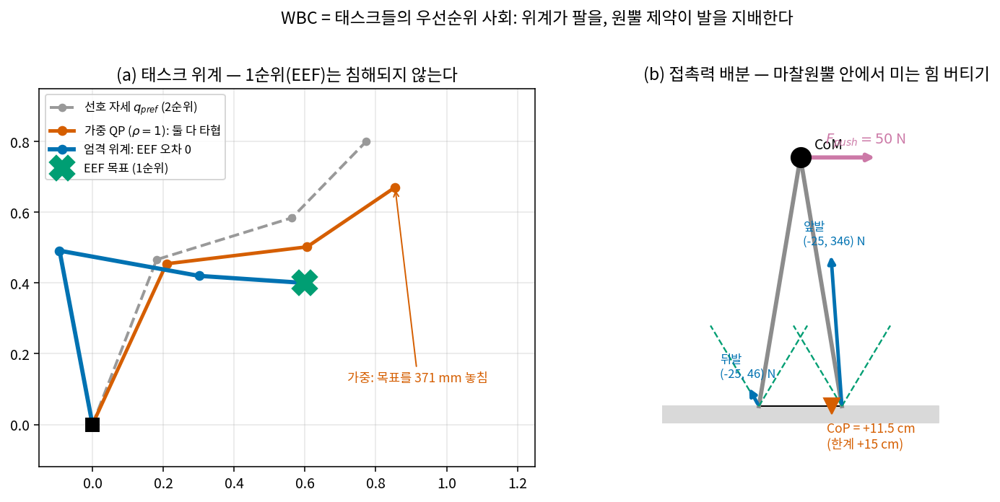
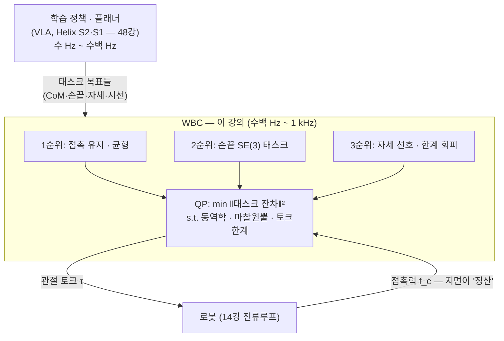
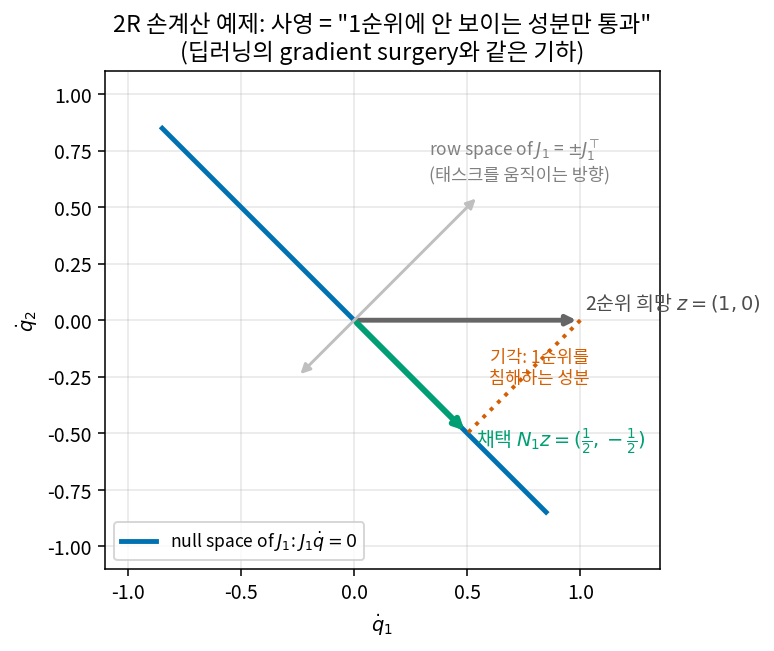
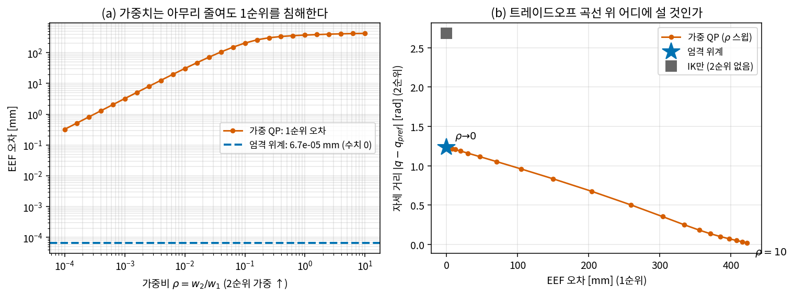
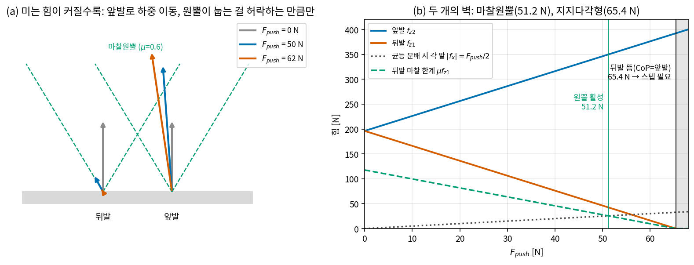
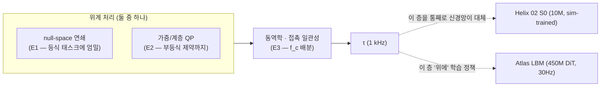
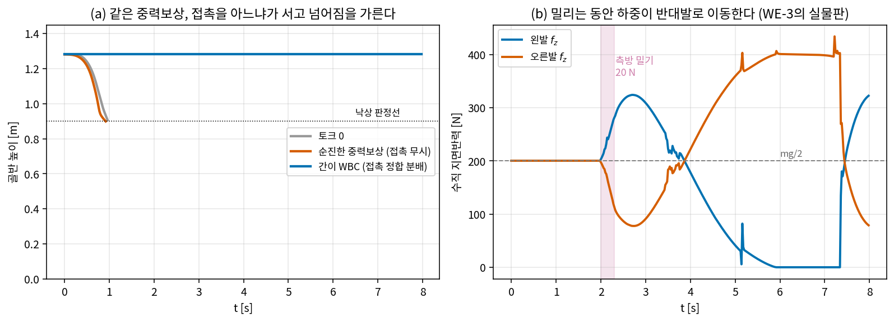

# Lec 24. 전신 제어(WBC) — 태스크들의 우선순위 사회

> 하위제어 트랙 24일차 (Part R5 제어, 여덟 번째 · 마지막). 선수 지식: 5강(τ=JᵀF), 6강(null-space 사영·의사역행렬), 10강(매니퓰레이터 방정식), 12강(마찰 원뿔·단방향 접촉), 13강(부족구동·ZMP·지지다각형), 19강(computed torque), 20강(op-space·동역학적 일관 사영), 23강(QP·receding horizon·마찰 피라미드).
> WBC는 MR의 범위 밖이다 — 원전 논문(Khatib의 posture 제어, Sentis-Khatib의 위계, Escande의 HQP, Di Carlo의 접촉력 QP)을 기초 자료로 쓴다(참고문헌).

## 한 장 요약



왼쪽: 3R 팔에 태스크 두 개를 줬다 — 1순위 "EEF를 X표에"와 2순위 "선호 자세(회색)로". 둘은 양립 불가능하다(선호 자세의 손끝은 목표에서 0.435 m 떨어져 있다). **가중 합**(주황)은 둘을 타협해 목표를 371 mm 놓치지만, **엄격 위계**(파랑)는 1순위를 침해하지 않는 성분만 2순위에서 걸러 받아 EEF 오차 0을 유지한 채 자세를 최대한 회복한다. 오른쪽: 서 있는 로봇을 50 N으로 밀면, 몸을 지탱하는 지면반력은 두 발의 **마찰 원뿔 안에서** 다시 배분되어야 한다 — 하중은 앞발로 쏠리고(346 vs 46 N) CoP는 발끝 한계(+15 cm)를 향해 +11.5 cm 이동한다. 전신 제어(Whole-Body Control)란 이 두 그림을 매 제어 주기(수백 Hz~1 kHz)마다 **하나의 최적화 문제로 동시에** 푸는 것이다.

## 학습 목표

1. null-space 사영에 의한 태스크 위계($\dot q = J_1^+ v_1 + N_1 z$, $\tau = \tau_1 + N_1^\top \tau_2$)를 유도하고, "상위 태스크 불침해"를 수치로 검증할 수 있다.
2. 같은 다중 태스크 문제의 **가중 QP** 정식화와 위계의 차이를 설명하고, "가중치를 아무리 키워도 위계가 되지 않는 이유"를 오차 스케일링($\propto \rho$)으로 보일 수 있다.
3. WBC QP의 표준 형태 — 결정변수 $(\ddot q, f_c, \tau)$, 동역학 등식, 접촉 불이동, 마찰 원뿔, 토크 한계 — 를 쓰고 각 블록의 물리적 의미를 말할 수 있다.
4. 접촉 제약 하의 토크 분배 문제를 2접촉 "서 있는 로봇"에서 손으로 풀고, 두 실패 경계(마찰 원뿔 활성 51.2 N, 지지다각형 이탈 65.4 N)를 해석해로 구할 수 있다.
5. MuJoCo humanoid에서 "접촉을 모르는 중력보상은 넘어지고, 접촉 정합 토크 분배는 선다"를 재현하고, 그 차이가 무엇을 의미하는지 설명할 수 있다.

## 왜 이 강의가 필요한가

지금까지 Part R5는 태스크가 **하나**인 세계였다: 19강는 관절 궤적 하나, 20강은 EEF 태스크 하나(+ null-space 자세 힌트), 23강은 비용 함수 하나. 그런데 휴머노이드는 다르다. 같은 순간에 **균형을 유지**하고(깨지면 나머지가 무의미), **두 손으로 물건을 옮기고**, **시선을 대상에 두고**, **관절 한계를 피해야** 한다 — 태스크가 사회를 이룬다. 게다가 이 사회는 두 가지 물리적 제약 위에 서 있다. 첫째, floating base 6 DoF에는 모터가 없어서(13강의 부족구동) 몸을 움직이는 힘의 일부는 반드시 **지면반력**에서 와야 한다. 둘째, 그 지면반력은 우리가 정하는 값이 아니라 단방향·마찰 원뿔(12강) 안에서만 존재하는 **종속 변수**다. "여러 태스크 + 부족구동 + 접촉 제약"을 매 주기 하나의 최적화로 푸는 층이 WBC고, 이것이 휴머노이드 하위 스택의 표준이다. 48강에서 본 Helix 02의 S0(1 kHz 전신 제어기)와 Atlas LBM이 올라타는 "MPC급 전신 제어"가 정확히 이 층이다 [5][6] — 학습 정책이 내놓는 손끝·몸통 목표를 **실행 가능한 관절 토크로 컴파일하는 컴파일러**라고 불러도 좋다.

## 본문

### 1. 문제 설정: 태스크는 많고, 힘의 출처는 제한된다



floating base 로봇의 운동방정식은 10강의 매니퓰레이터 방정식에 두 가지가 추가된 형태다:

$$
M(q)\ddot q + C(q,\dot q)\dot q + g(q) = S^\top \tau + J_c^\top f_c
$$

$S = [\,0_{n\times 6}\ \ I_n\,]$은 **선택 행렬** — 일반화 좌표 $6+n$개 중 관절 $n$개에만 모터 토크가 들어간다는 뜻이고(위 6행이 13강의 부족구동), $J_c^\top f_c$는 접촉력이 관절 공간으로 당겨져 들어오는 항이다(5강의 정역학 쌍대). 이 식의 위 6행을 읽으면 WBC의 존재 이유가 나온다: **베이스를 움직이는 힘은 오직 $f_c$뿐이다.** 중력에 맞서 서 있는 것도, 밀렸을 때 버티는 것도, 접촉력을 원뿔 안에서 잘 배분하는 문제로 귀결된다. 위 6행은 물리적으로 "로봇 전체의 뉴턴-오일러 방정식"이다 — 총운동량의 변화율 = 중력 + 접촉력의 합. 이 6행만 떼어내 CoM 좌표로 다시 쓴 것이 centroidal dynamics이고, 실전 스택은 흔히 이 6행을 MPC(23강)가 미리 풀어 CoM·접촉력 궤적을 내고, 나머지 전부를 이 강의의 WBC가 매 주기 채우는 분업을 쓴다 [4]. 태스크가 여럿이라는 것(§2~3)과 힘의 출처가 제약되어 있다는 것($f_c$의 원뿔, §4) — 이 둘을 동시에 다루는 것이 WBC다.

그렇다면 "태스크"란 정확히 무엇인가? WBC에서 태스크는 언제나 **자코비안 + 목표**의 쌍이다 — $J_i \dot q = v_i$(속도 수준) 또는 $J_i \ddot q + \dot J_i \dot q = a_i^{des}$(가속도 수준). 휴머노이드의 전형적인 메뉴:

| 태스크 | 차원 | 자코비안 | 전형적 취급 |
|---|---|---|---|
| 접촉 불이동 (발이 지면에 붙어 있음) | 접촉점당 3 (발당 최대 6) | $J_c$ | 태스크가 아니라 **등식 제약**으로 승격 (E2) |
| CoM 위치 / 균형 | 2~3 | $J_{com}$ | 1순위 — 깨지면 나머지가 무의미 |
| 손끝 SE(3) 자세 (조작) | 손당 6 | 5강의 기하 자코비안 | 2순위 |
| 시선 (카메라를 대상에) | 2 | 헤드 체인 자코비안 | 3순위 |
| 자세 선호·관절한계 회피 | $n$ (전관절) | $I$ | 최하위 — 남는 자유도의 청소부 |

WBC 라이브러리에 "태스크를 추가한다"는 것은 이 표의 한 행 — $(J_i,\ \text{목표},\ \text{순위 또는 가중치})$ — 을 등록하는 일이다. 오늘 강의의 전부는 이 행들이 **충돌할 때** 무슨 일이 일어나는가다.

### 2. 핵심 수식 E1 — null-space 사영에 의한 태스크 위계

**직관**: 회사의 결재 라인과 같다. 2순위 태스크는 하고 싶은 일($z$)을 제안하지만, 1순위 태스크의 진행에 **영향을 주는 성분은 결재에서 잘려나가고** 영향 없는 성분만 통과한다. 몇 순위든 같은 규칙이 재귀적으로 적용된다 — 상위 태스크들이 쓰고 남은 자유도 안에서만 움직여라.

**물리·기하적 의미**: 6강에서 봤듯 관절속도 공간은 $J_1$의 row space(1순위 태스크를 움직이는 방향)와 null space(1순위에 보이지 않는 방향)로 직교 분해된다. 사영자 $N_1 = I - J_1^+ J_1$은 임의의 제안 $z$에서 null space 성분만 남긴다. 아래 그림이 전부다 — 기각되는 점선 성분이 "1순위를 침해했을 성분"이다. 딥러닝에서 충돌하는 태스크 기울기를 직교 사영으로 수술하는 gradient surgery(PCGrad [7])와 **같은 기하**다.



**형식** (속도 수준): 1순위 태스크 $J_1 \dot q = v_1$, 2순위 희망 $\dot q \approx z$일 때

$$
\dot q = J_1^+ v_1 + N_1 z, \qquad N_1 = I - J_1^+ J_1
$$

1순위 불침해는 한 줄 증명이다: $J_1 \dot q = J_1 J_1^+ v_1 + J_1 N_1 z = v_1 + 0$ ($J_1 N_1 = J_1 - J_1 J_1^+ J_1 = 0$). 태스크가 3개 이상이면 재귀한다 — $k$순위는 상위 태스크 전부를 쌓은 $J_{1:k-1} = [J_1; \dots; J_{k-1}]$의 null space 안에서만 허용된다:

$$
\dot q_k = \dot q_{k-1} + (J_k N_{k-1})^+ (v_k - J_k \dot q_{k-1}), \qquad N_{k-1} = I - J_{1:k-1}^+ J_{1:k-1}
$$

이것이 Sentis-Khatib 위계 WBC의 골격이다 [2]. **토크 수준**에서는 같은 구조가 $\tau = \tau_1 + N_1^\top \tau_2 + \dots$ 꼴이 되는데, 이때는 **동역학적으로 일관된** $N_1 = I - \bar J_1 J_1$($\bar J_1 = M^{-1}J_1^\top \Lambda_1$, Khatib의 일반화 역행렬)을 써야 "2순위 토크가 1순위 **가속도**를 만들지 못한다"($J_1 M^{-1} N_1^\top = 0$, $\because J_1 M^{-1} J_1^\top = \Lambda_1^{-1}$)가 성립한다 [1][2]. 토크에 실제로 곱해지는 $N_1^\top = I - J_1^\top \bar J_1^\top$이 바로 20강 실습에서 손으로 만든 그 사영자다 — 속도 수준의 $I - J^+J$는 운동학 사영, $I - J^\top \bar J^\top$는 동역학 사영.

**손계산 (2R)**: $l_1 = l_2 = 1$, $q = (0°, 90°)$에서 EEF의 $x$방향 자코비안 행은 $J_1 = [-(s_1 + s_{12}),\ -s_{12}] = [-1, -1]$. 1순위 태스크: "$\dot x = 0$ 유지"(벽 접촉 유지라 생각하자). 2순위 희망: $z = (1, 0)$ — 어깨만 돌리고 싶다.

$$
N_1 = I - \frac{J_1^\top J_1}{J_1 J_1^\top} = I - \tfrac{1}{2}\begin{bmatrix}1 & 1\\ 1 & 1\end{bmatrix} = \begin{bmatrix}\tfrac12 & -\tfrac12\\ -\tfrac12 & \tfrac12\end{bmatrix}, \qquad N_1 z = \begin{bmatrix}\tfrac12 \\ -\tfrac12\end{bmatrix}
$$

어깨를 $+\tfrac12$ 돌리는 대신 팔꿈치를 $-\tfrac12$ 접어 $x$를 상쇄한다. 검증: $J_1 (N_1 z) = -\tfrac12 + \tfrac12 = 0$.

```python
import numpy as np
J1 = np.array([[-1.0, -1.0]]); z = np.array([1.0, 0.0])
N1 = np.eye(2) - np.linalg.pinv(J1) @ J1
print(N1 @ z)            # [ 0.5 -0.5]
print(J1 @ (N1 @ z))     # [-3.3e-16] ← 1순위 침해량 = 수치 0
```

#### Worked Example 1 — 3R 팔의 2태스크 위계: 우선순위는 정말 지켜지는가

평면 3R 팔($L = 0.5/0.4/0.3$ m)에 **서로 충돌하는** 두 태스크를 준다: 1순위 "EEF를 $(0.6, 0.4)$에"(태스크 차원 2), 2순위 "선호 자세 $q_{pref} = (1.2, -0.9, 0.5)$로"(차원 3, 여유는 $3-2=1$뿐이므로 완전 달성 불가). $\dot q = J^+ (k_1 e_1) + N\, k_2 (q_{pref} - q)$를 적분하면(전체 코드: `images/lec24/gen_figs.py`):

| 제어 | EEF 오차 (1순위) | $\|q - q_{pref}\|$ (2순위) |
|---|---|---|
| 1순위만 (IK) | $1.0 \times 10^{-11}$ m | 2.683 rad |
| **위계 (1순위 + N·2순위)** | $6.7 \times 10^{-8}$ m | **1.240 rad** |

2순위를 켜자 자세 거리가 2.683 → 1.240 rad로 절반 이하가 됐는데 **1순위 오차는 여전히 수치 0**이다. 위계의 불변량 — 적분 내내 측정한 침해량 $\max \|J_1 N_1 z\| = 3.1 \times 10^{-15}$ — 이 "결재에서 잘려나감"의 수치 증거다. (위계의 EEF 오차 $10^{-8}$이 IK만($10^{-11}$)보다 미세하게 큰 이유: 사영은 **속도 수준**에서 엄밀하고, $N_1$이 $q$에 따라 변하므로 이산 적분에서 2차 오차가 샌다. 67 nm — 무시 가능하지만 "위계는 1차 근사에서의 보장"임을 기억하라.)

**재귀 한 단 더 — 결재 예산은 소진된다.** 같은 3R 팔에 태스크를 셋 쌓아 보자: 1순위 EEF 위치(2차원), 2순위 "팔꿈치 관절만 $0.3$ rad/s로"(1차원), 3순위 자세 희망(3차원). 태스크 차원 합 $2 + 1 = 3 =$ DoF이므로 3순위 차례에 남는 null space는 없어야 한다:

```python
import numpy as np
L, q0 = np.array([0.5, 0.4, 0.3]), np.array([0.3, 0.3, 0.3])   # WE-1의 3R 팔
def fk(q):
    p, a = np.zeros(2), 0.0
    for li, qi in zip(L, q):
        a += qi; p = p + li*np.array([np.cos(a), np.sin(a)])
    return p
def jac(q, eps=1e-7):               # 수치 자코비안 (5강의 유한차분)
    J = np.zeros((2, 3))
    for j in range(3):
        dq = q.copy(); dq[j] += eps
        J[:, j] = (fk(dq) - fk(q)) / eps
    return J
J1 = jac(q0)                        # 1순위: EEF 위치 (2×3)
J2 = np.array([[0., 1., 0.]])       # 2순위: 팔꿈치 관절 속도 (1×3)
v1, v2, z3 = np.array([0.10, -0.05]), np.array([0.3]), np.ones(3)
qd1 = np.linalg.pinv(J1) @ v1                      # 1순위
N1  = np.eye(3) - np.linalg.pinv(J1) @ J1
qd2 = qd1 + np.linalg.pinv(J2 @ N1) @ (v2 - J2 @ qd1)   # 2순위 (E1 재귀식)
Jb  = np.vstack([J1, J2])
N2  = np.eye(3) - np.linalg.pinv(Jb) @ Jb
qd3 = qd2 + N2 @ z3                                # 3순위
print(np.linalg.norm(J1 @ qd3 - v1), np.linalg.norm(J2 @ qd3 - v2))
                          # 3.78e-15, 1.89e-15 ← 1·2순위 둘 다 정확히 달성
print(np.linalg.norm(N2), np.round(N2 @ z3, 12))
                          # ||N2|| = 3.35e-15 → 3순위 몫 = [0, 0, -0] ← 한 방울도 못 받음
```

1·2순위는 잔차 $10^{-15}$로 정확히 달성되고, $\|N_2\| = 3.4 \times 10^{-15}$ — 3순위의 몫은 **정확히 영벡터**다(전체 코드: `gen_figs.py`). 위계는 공평하지 않다: 순위가 낮으면 아무것도 받지 못할 수 있다. 휴머노이드($n_v$ 30±)에서 자세 태스크를 최하위에 두어도 항상 뭔가 받는 이유는 단지 관절 수가 태스크 차원 합보다 많기 때문이다 — 여유자유도(1강·6강)가 위계 사회의 "재분배 재원"인 셈이다.

### 3. 핵심 수식 E2 — QP 정식화: 가중이냐 위계냐

**직관**: 여러 태스크를 다루는 두 번째 방법은 전부 비용으로 섞는 것이다 — $\min \sum_i w_i \|J_i \dot q - v_i\|^2$. 딥러닝의 multi-task loss와 정확히 같은 선택지: 손실 가중합(soft)이냐, 사전식(lexicographic) 순서(hard)냐.

**물리·기하적 의미**: 가중 합의 해는 모든 태스크 잔차의 **타협점**이다. $w_2/w_1 \to 0$ 극한에서 위계에 수렴하지만, 유한한 가중치에서는 반드시 1순위가 침해된다 — 그리고 침해량은 가중비에 **비례**한다(아래 WE-2에서 log-log 기울기 ≈ 1로 확인). 반대로 위계는 침해량이 구조적으로 0인 대신, 수치 조건이 나빠지는 자기만의 병이 있다(흔한 오해 1).

**형식**: 오늘날 실전 WBC의 표준형은 태스크를 가속도 수준에서 쓰고 제약을 명시한 QP다 [3][4]:

$$
\min_{\ddot q,\ f_c,\ \tau} \ \sum_i w_i \left\| J_i \ddot q + \dot J_i \dot q - a_i^{des} \right\|^2
\quad \text{s.t.} \quad
\begin{cases}
M\ddot q + C\dot q + g = S^\top \tau + J_c^\top f_c & \text{(동역학)}\\
J_c \ddot q + \dot J_c \dot q = 0 & \text{(접촉 불이동)}\\
f_c \in \text{마찰 원뿔(선형화)} & \text{(12강·23강)}\\
|\tau| \le \tau_{max} & \text{(14강)}
\end{cases}
$$

엄격한 위계가 필요하면 이 QP를 우선순위별로 **연쇄**해서 푼다: 1순위 QP를 풀고, 그 최적 잔차를 등식으로 고정한 채 2순위 QP를 풀고, … — 이것이 hierarchical QP(HQP)이고, 활성 집합을 공유하며 빠르게 푸는 방법이 Escande-Mansard-Wieber의 기여다 [3]. 위계와 QP는 대립물이 아니라, **위계는 등식 제약 QP의 폐형해**라는 관계다: $\min_{\dot q} \|\dot q - z\|^2$ s.t. $J\dot q = v_1$의 KKT 해가 정확히 $J^+ v_1 + N z$다 (gen_figs.py에서 KKT 행렬을 직접 풀어 사영식과 대조 — 차이 $1.1 \times 10^{-14}$).

#### Worked Example 2 — 같은 문제의 가중 QP: 얼마를 줘도 위계가 안 된다

WE-1과 같은 두 태스크를 가중 최소제곱 $\min_{\dot q} \|J\dot q - k_1 e_1\|^2 + \rho \|\dot q - k_2 (q_{pref}-q)\|^2$로 풀면 (정규방정식 $(J^\top J + \rho I)\dot q = J^\top k_1 e_1 + \rho k_2 (q_{pref}-q)$, 매 스텝 폐형해):

| $\rho = w_2/w_1$ | EEF 오차 (1순위) | 자세 거리 (2순위) |
|---|---|---|
| 0.01 | 30.5 mm | 1.160 |
| 0.1 | 204.2 mm | 0.676 |
| 1.0 | 371.3 mm | 0.136 |
| 위계 | $6.7\times10^{-8}$ m | 1.240 |

작은 $\rho$ 구간에서 log-log 기울기 **0.986 ≈ 1**: 1순위 오차는 $\rho$에 정비례해서, $\rho$를 10분의 1로 줄이면 오차도 10분의 1이 될 뿐 **절대 0이 되지 않는다**. 균형(1순위)이 "매우 중요"한 게 아니라 "협상 불가"인 휴머노이드에서 가중치 방식의 한계가 이것이다 — 그림 2(b)의 트레이드오프 곡선 위 어느 점을 고르는 문제와, 곡선 밖의 별(위계)로 점프하는 문제는 다른 문제다.



### 4. 핵심 수식 E3 — 접촉 제약 하의 토크 분배

**직관**: 서 있는 로봇에게 "버텨"라는 태스크는 결국 **두 발이 지면에서 받아낼 힘의 나눠 갖기** 문제다. 각 발은 원뿔 모양의 메뉴(12강) 안에서만 힘을 낼 수 있고, 합쳐서 몸의 힘·모멘트 평형을 정확히 맞춰야 한다. WBC의 QP에서 $f_c$ 블록이 매 주기 푸는 것이 이 문제다 — MIT Cheetah 3의 convex MPC가 접촉력을 결정변수로 만든 이유이기도 하다(23강) [4].

**물리·기하적 의미**: 답이 존재하는 영역에는 **두 개의 벽**이 있다. ① 마찰 원뿔: 수평력 요구가 $\mu f_z$를 넘는 발이 생기면 미끄러진다. ② 지지다각형(13강): 요구 CoP가 발 바깥으로 나가면 어떤 힘 배분으로도 못 버틴다 — 뒤발 수직력이 0이 되며 로봇이 앞으로 구른다. 두 벽 안쪽에서는 해가 무한히 많으므로(2접촉 4변수 vs 평형 3식) 최적화로 하나를 고른다 — 보통 $\min \|f\|^2$ (모든 발에 고르게).

**형식**: 접촉점 $p_i$의 힘 $f_i$에 대해

$$
\sum_i f_i = -F_{ext} + m g \hat z\text{의 평형}, \quad \sum_i p_i \times f_i \ \text{평형}, \qquad f_{z,i} \ge 0, \quad |f_{x,i}| \le \mu f_{z,i}
$$

**손계산 (2접촉 서 있는 로봇)**: 질량 40 kg($mg = 392.4$ N), CoM 높이 $h = 0.9$ m, 발 위치 $x = \mp 0.15$ m, $\mu = 0.6$. CoM 높이에서 수평 밀기 $F$를 받으면 평형 3식은:

$$
f_{x1} + f_{x2} = -F, \qquad f_{z1} + f_{z2} = mg, \qquad 0.15(f_{z2} - f_{z1}) = hF
$$

셋째 식(CoM 기준 모멘트)에서 $f_{z2} - f_{z1} = 6F$, 따라서 **$f_{z1} = mg/2 - 3F$**: 미는 힘 1 N당 뒤발 하중이 3 N씩 앞발로 이동한다. $F = 50$ N이면 $f_{z1} = 196.2 - 150 = 46.2$ N, $f_{z2} = 346.2$ N. $\min\|f\|^2$는 수평력을 균등 분배($f_{x} = -25$ N씩)하므로 뒤발의 원뿔 여유는 $\mu f_{z1} - 25 = 27.72 - 25 = 2.72$ N — 아슬아슬하게 안쪽이다. 두 벽의 해석해:

- **원뿔 활성**: $F/2 = \mu(mg/2 - 3F)$ → $F = \dfrac{\mu\, mg}{1 + 6\mu} = 51.2$ N. 이후 최적해는 균등 분배를 포기하고 수평력을 앞발로 몰아준다(SLSQP 확인: $F=55$에서 $f_{x1} = -18.7$, $f_{x2} = -36.3$ — 뒤발 원뿔 여유 정확히 0, **활성 제약**).
- **지지다각형 이탈**: $f_{z1} \ge 0$ → $F \le \dfrac{mg\, x_2}{h} = 65.4$ N (동치: CoP $= hF/mg \le 0.15$ m). scipy `linprog` 실행 가능성 + 이분법으로 65.4 N 재확인 — 그 너머는 **어떤 토크 분배도 없고, 스텝(13강의 capture point)만이 답이다.**



#### Worked Example 3 — 검증 코드 (scipy, cvxpy 불필요)

```python
import numpy as np
from scipy.optimize import minimize
mg, h, x1, x2, mu = 40*9.81, 0.9, -0.15, 0.15, 0.6
def grf_qp(F):                       # f = (fx1, fz1, fx2, fz2)
    cons = [{'type':'eq','fun': lambda f: f[0]+f[2]+F},
            {'type':'eq','fun': lambda f: f[1]+f[3]-mg},
            {'type':'eq','fun': lambda f: x1*f[1]+x2*f[3]+h*(f[0]+f[2])},
            {'type':'ineq','fun': lambda f: mu*f[1]-abs(f[0])},
            {'type':'ineq','fun': lambda f: mu*f[3]-abs(f[2])},
            {'type':'ineq','fun': lambda f: f[1]},
            {'type':'ineq','fun': lambda f: f[3]}]
    return minimize(lambda f: f@f, [0, mg/2, 0, mg/2],
                    constraints=cons, method='SLSQP').x
print(np.round(grf_qp(50.0), 2))   # [-25.  46.2 -25.  346.2] ← 손계산과 일치
print(np.round(grf_qp(55.0), 2))   # [-18.72 31.2 -36.28 361.2] ← 원뿔 활성, 재분배
```

실전 WBC는 이 문제를 원뿔을 4~8면 피라미드로 선형화(23강)한 뒤 전용 QP 솔버로 1 kHz급에서 푼다 — 구조는 위 코드와 완전히 같고, 크기와 속도만 다르다 [3][4].

### 5. 조립: 실전 WBC와 학습 스택의 관계



세 가지 위계 처리 방식을 한 표로 정리하면 — 이 표가 실무 WBC 라이브러리의 설계 결정 그 자체다:

| | null-space 사영 연쇄 (E1) | 가중 QP (E2) | 계층 QP (HQP) [3] |
|---|---|---|---|
| 상위 태스크 보장 | 구조적 침해 0 (등식 태스크만) | 침해 $\propto \rho$ — 절대 0 아님 | 구조적 침해 0 |
| 부등식 제약 (원뿔·토크한계) | 못 다룸 | s.t. 블록으로 자연스럽게 | 모든 순위에서 다룸 |
| 특이점 근처 거동 | $J^+$ 폭발, 하위 태스크 불연속 | 연속 ($\rho$가 damping 역할, 7강의 DLS와 동형) | 완화 가능하나 구현 복잡 |
| 계산 비용 | 의사역행렬 몇 번 — 가장 싸다 | QP 1회 | QP 연쇄 (활성집합 공유로 고속화 [3]) |
| 전형적 사용처 | 팔 여유자유도(6강·20강), 교육·프로토타입 | 실전 휴머노이드·사족의 다수 [4] | "협상 불가" 위계가 진짜 필요할 때 |

48강의 두 사례가 이 층의 현재를 요약한다. Boston Dynamics의 Atlas LBM은 30 Hz 학습 정책을 기존 "MPC급 전신 제어" **위에** 얹었다 — 정책은 몸이 뭘 할지를 내고, 실행 가능한 토크로의 컴파일은 여전히 모델 기반 층이 맡는다 [6]. Figure의 Helix 02는 반대로 S0(10M 파라미터, 1 kHz)이라는 sim-trained 신경망으로 이 층 **자체를** 대체했다 — "손으로 짠 C++ 109,504줄을 대체"가 그 공식 표현이다 [5]. 어느 쪽이든 이 강의에서 배우는 문제(태스크 위계 + 접촉 하 토크 분배)는 사라지지 않았다. 누가 푸느냐(QP 솔버냐 신경망이냐)가 바뀌었을 뿐이고, S0가 배우는 함수는 사실상 이 QP의 해 사상 $(\text{상태}, \text{태스크}) \mapsto \tau$다.

### 딥러닝 배경자를 위한 번역

- **태스크 위계 = lexicographic multi-objective.** 가중합 손실($\sum w_i L_i$)과 사전식 순서(1순위 최적해 집합 안에서 2순위 최적화)의 구분은 최적화에서 오래된 주제다. WE-2의 "오차 ∝ ρ" 실험은 soft constraint가 hard constraint를 흉내 낼 때 치르는 대가의 정량판이다.
- **null-space 사영 = gradient surgery.** PCGrad가 태스크 A와 충돌하는 태스크 B의 기울기 성분을 직교 사영으로 제거하는 것 [7]과 E1의 $N_1 z$는 같은 연산이다. 차이는 WBC의 "충돌"은 자코비안이 정의하는 기하적 사실이고, 사영이 매 주기 엄밀하게 적용된다는 것.
- **WBC = 정책 출력의 컴파일러.** 학습 정책의 출력(EEF 목표, CoM 목표)은 그대로는 실행 불가능한 "소스 코드"다. WBC는 이를 동역학·접촉·액추에이터 제약을 만족하는 "기계어"(토크)로 번역한다. Atlas LBM이 학습 정책을 전신 제어 위에 얹은 구조 [6]는 "컴파일러는 검증된 것을 쓰고 프로그램만 학습한다"는 선택이고, Helix 02의 S0 [5]는 "컴파일러까지 학습으로 다시 짠다"는 선택이다.
- **위계는 attention mask, 가중은 soft attention** — 정보를 완전히 차단하느냐(구조적 0), 작게 섞느냐(연속 가중)의 차이라고 기억해도 좋다.

## 흔한 오해

1. **"가중치를 충분히 크게 주면 위계와 같다"** — WE-2가 반례다: 1순위 오차는 $\rho$에 비례해 줄어들 뿐 0이 되지 않고, $\rho \to 0$으로 몰수록 정규방정식의 조건수가 나빠져 수치가 먼저 깨진다. 역방향의 순진함도 있다: 엄격 위계는 상위 태스크가 특이점에 가까워지면(6강) $J_1^+$이 폭발하고 null space가 갑자기 줄어 하위 태스크가 **불연속하게** 얼어붙는다. 실무가 가중 QP + 큰 가중비를 자주 쓰는 이유는 게으름이 아니라 이 연속성 때문이다 [3].
2. **"접촉력은 시뮬레이터/지면이 알아서 정해주는 결과값이니 제어기가 신경 쓸 일이 아니다"** — 반은 맞다(지면이 정산한다, 12강). 그러나 정산 결과가 원뿔 안에 있도록 **토크를 고르는 것**은 제어기의 일이다. 실습에서 보듯, 접촉을 모르는 중력보상 토크는 "지면이 이미 지탱하는 몫"까지 이중으로 밀어 넣어 로봇을 스스로 넘어뜨린다. WBC의 $f_c$는 예측 변수이지 측정값이 아니다 — 측정과 예측이 다를 때(외란·모델 오차) 무엇을 믿을지는 59강(모멘텀 옵저버)에서 다루게 된다.
3. **"1순위 = 안전"이 아니다** — 위계는 **태스크 사이**의 침해만 다룬다. 마찰 원뿔·토크 한계·관절 한계는 태스크가 아니라 **부등식 제약**으로, 모든 순위 위에 군림해야 한다(E2의 s.t. 블록). "균형 태스크를 1순위로 뒀으니 안전하다"는 문장은 원뿔 제약이 QP에 없으면 거짓이다 — fig3(b)의 51.2 N과 65.4 N 사이 구간이 정확히 "태스크는 만족, 제약이 해를 재배치"하는 영역이다.
4. **"이제 RL이 WBC를 대체했으니 배울 필요 없다"** — Helix 02의 S0가 이 층을 신경망으로 대체한 것은 사실이다 [5]. 그러나 ① 그 신경망이 근사하는 함수가 바로 이 강의의 최적화 문제이고, ② 훈련 데이터(시뮬레이션의 리타게팅 모션)를 만들고 실패를 진단하는 언어가 여전히 CoM·원뿔·지지다각형이며, ③ Atlas LBM·수많은 연구 스택은 지금도 QP 기반 WBC 위에서 돈다 [4][6]. 층을 이해 못 하면 그 층을 대체한 모델도 디버깅할 수 없다.

## 실습 (1.5~2시간)

**MuJoCo humanoid로 "토크 분배가 실제로 무엇을 푸는가" 체감하기.** 완전한 WBC 구현이 아니라, 접촉 정합 토크 분배의 유무가 서고 넘어짐을 가르는 것을 보는 것이 목표다. (CPU로 충분. 전체 코드·재현 수치: `images/lec24/check_mujoco.py`)

1. **(10분) 모델 준비**: MuJoCo 저장소의 표준 humanoid를 받는다 — `curl -sLO https://raw.githubusercontent.com/google-deepmind/mujoco/main/model/humanoid/humanoid.xml`. 로드 후 확인: `nq=28, nv=27, nu=21` → **구동 안 되는 DoF = 6** (floating base, 13강). 총질량 40.84 kg, $mg = 400.7$ N.
2. **(15분) 접촉이 내야 하는 힘 보기**: 선 자세에서 `qvel=0, qacc=0`으로 역동역학(11강의 `mj_inverse`)을 부른다:

```python
import mujoco, numpy as np
m = mujoco.MjModel.from_xml_path("humanoid.xml"); d = mujoco.MjData(m)
print(m.nq, m.nv, m.nu)                 # 28 27 21 → 구동 안 되는 DoF 6개
mujoco.mj_forward(m, d)
d.qvel[:] = 0; d.qacc[:] = 0
mujoco.mj_inverse(m, d)
print(np.round(d.qfrc_inverse[:6], 2))  # [0. 0. 400.68 -0. -6.28 0.]
```

   서 있기 위해 베이스에 필요한 수직력 400.7 N($=mg$)과 피치 모멘트가 나온다. **모터는 이 6개 성분을 못 낸다.** 지면반력만이 낼 수 있다.
3. **(30분) 간이 토크 분배기**: 접촉점들의 자코비안 $J_c$를 `mj_jac`으로 모으고, E3의 축소판 — $\min f^\top W f$ s.t. $(J_c^\top f)[:6] = \text{qfrc\_bias}[:6]$ ($W$는 접선력 벌점) — 을 KKT 선형계 하나로 푼다(WE-2의 KKT와 같은 코드 패턴):

```python
def grf_dist(d, w_t=10.0):     # min f^T W f  s.t. (Jc^T f)[:6] = qfrc_bias[:6]
    nc = d.ncon
    Jc = np.zeros((3*nc, m.nv))
    for i in range(nc):
        c = d.contact[i]
        jacp = np.zeros((3, m.nv)); jacr = np.zeros((3, m.nv))
        mujoco.mj_jac(m, d, jacp, jacr, c.pos, m.geom_bodyid[max(c.geom1, c.geom2)])
        Jc[3*i:3*i+3] = jacp
    A, b = Jc[:, :6].T, d.qfrc_bias[:6]          # 등식은 베이스 6행만 — 그곳만 접촉이 유일한 힘
    W = np.diag(np.tile([w_t, w_t, 1.0], nc))    # 접선력 벌점 = 마찰원뿔의 값싼 완화판
    KKT = np.block([[W, A.T], [A, np.zeros((6, 6))]])
    f = np.linalg.lstsq(KKT, np.r_[np.zeros(3*nc), b], rcond=None)[0][:3*nc]
    return Jc.T @ f                               # 관절공간으로 당겨온 접촉력 (5강의 Jᵀf)
tau_ff = d.qfrc_bias[6:] - grf_dist(d)[6:]        # 피드포워드 토크 = 중력·바이어스 − 지면이 내주는 몫
```

   분배된 수직력 합이 400.7 N $= mg$와 일치하는지 확인. 원뿔을 부등식으로 정직하게 넣으려면 WE-3처럼 SLSQP로 바꾸면 된다 — 여기서는 접선 벌점 $W$로 충분하다.
4. **(30분) 세 제어기 대결**: 같은 정착 자세에서 8초씩, 토크는 `d.qfrc_applied[6:]`로 인가(베이스 6행은 건드리지 않는다 — 부족구동을 존중해야 정직한 실험이다). 관절별 한계는 모터 사양(`actuator_gear`)으로 클립:
   - **토크 0**: 0.97초에 낙상.
   - **순진한 중력보상**($\tau = \text{qfrc\_bias}[6:]$, 접촉 무시): **0.92초에 낙상 — 토크 0보다도 빨리 넘어진다.** 지면이 이미 지탱하는 몫을 다리가 이중으로 밀기 때문(흔한 오해 2).
   - **간이 WBC**(3의 분배 + 약한 자세 PD + CoM→발목 피드백): 8초 내내 직립, $\max|\Delta \text{com}_x| = 0.0$ mm.
5. **(20분) 밀기 실험**: 몸통에 0.3초 수평력. 전방 +30 N까지는 회복(CoM 이탈 31.6 mm), **+40 N에서 낙상**. 임펄스성 밀기는 13강의 capture point로 환산하는 것이 옳다: 40 N × 0.3 s → CoM 속도 +0.29 m/s → capture point 이동 **8.6 cm**. 발끝의 기하 여유는 14.2 cm이므로 아직 지지다각형 안이지만, 스텝도 힙 전략도 없는 우리의 순수 발목 전략이 회복하는 영역은 그보다 좁다 — 6.5 cm(30 N)까지가 한계였다. 측방 20 N 동안 발 하중이 200/200 → **265/133 N**으로 재배분되는 것을 `mj_contactForce`로 관측 — fig3의 실물판.



6. **(심화) 균형 피드백의 부호를 스텝 응답으로 정하기**: CoM 피드백을 끈 기본 제어 위에서 두 발목 피치에 +4 N·m씩 0.5초 주면 CoM이 **−19.8 mm** 이동한다 — "+토크 → CoM 뒤로"라는 이 실험 하나로 피드백 부호가 결정된다. roll 쪽(ankle_x)도 같은 방법으로 정해 보라. 여러분이 방금 한 일 — 입력을 넣고 응답을 보고 모델(부호·이득)을 정하는 것 — 은 시스템 식별의 가장 원시적인 형태이고, 60강에서 본격화된다.

## Claude와 토론할 질문

1. E1의 속도 수준 사영($I - J^+J$)과 토크 수준의 동역학적 일관 사영($I - J^\top \bar J^\top$, 20강)은 무엇이 다른가? 관성이 균일($M = I$)하면 왜 같아지는가?
2. WE-2에서 1순위 오차가 $\rho$에 정비례했다. 정규방정식 $(J^\top J + \rho I)\dot q = \dots$에서 이 비례 관계를 1차 섭동으로 유도해 보라. 딥러닝의 L2 정칙화가 해를 원점으로 끌어당기는 양과 같은 구조인가?
3. 흔한 오해 1의 딜레마 — 위계의 불연속 vs 가중의 침해 — 를 실제 휴머노이드 낙상 시나리오로 만들어 보라. 어느 쪽 실패가 더 진단하기 어려운가?
4. E3에서 $\min\|f\|^2$는 여러 실행 가능한 배분 중 하나를 고르는 기준일 뿐이다. 다른 기준(원뿔 여유 최대화, 관절 토크 최소화)은 각각 언제 유리한가? 원뿔 여유 최대화가 LP가 되는 이유는?
5. 실습 4에서 "순진한 중력보상이 토크 0보다 빨리 넘어진다"를 자유물체도로 설명하라. 고정 베이스 팔(19강)에서는 같은 보상이 왜 무해했는가?
6. Helix 02의 S0가 이 강의의 QP를 신경망으로 대체했을 때, 잃는 것(제약 만족의 보증, 해석 가능성)과 얻는 것(속도, 모델 오차에 대한 강건성, 비볼록 목적)을 정리하라. 어떤 검증 체계가 그 손실을 메울 수 있는가? (61강에서 다룰 안전 계층과 연결된다)
7. VLA 정책(50강)이 관절각 청크를 직접 내는 로봇과, CoM·EEF 태스크를 내고 WBC가 토크로 컴파일하는 로봇 — 학습 데이터 수집, sim2real, 실패 모드 관점에서 각각 유불리를 논하라. Atlas LBM은 왜 후자를 골랐을까 [6]?

## 읽을거리

1. **Sentis & Khatib 2005** [2] (§2~3, ~40분): 태스크 위계 WBC의 원전 — E1의 재귀 구조와 동역학적 일관 사영이 휴머노이드 스케일로 조립되는 것을 본다. 수식 표기가 20강과 이어져 읽기 수월하다.
2. **Di Carlo et al. 2018** [4] (§III~IV, ~30분): 접촉력을 결정변수로 하는 QP의 실전 최소형 — 23강에서 읽었다면 이번에는 "MPC 없이 매 주기 QP만 떼어 읽기"로 재독. WE-3가 이 논문의 2D 축소판이다.
3. (선택) **Escande et al. 2014** [3] (§1~2만, ~30분): 위계를 부등식 제약까지 일반화한 HQP. 도입부의 문제 정의만 읽어도 "위계 vs 가중" 논쟁이 어떻게 정식화되는지 보인다.
4. (선택) **Atlas LBM 블로그** [6] · **Helix 02 블로그** [5] (~15분씩): 이 강의의 층이 2025~26년 상용 스택에서 각각 "밑층"과 "대체 대상"으로 등장하는 모습.

## 자가 점검

1. $\dot q = J_1^+ v_1 + N_1 z$에서 $J_1 \dot q = v_1$이 유지되는 한 줄 증명과, 2R 손계산($N_1 z = (\tfrac12, -\tfrac12)$)을 백지에 재현할 수 있는가?
2. WE-1의 세 수치(자세 거리 2.683 → 1.240 rad, EEF 오차 수치 0, 침해량 $3.1\times10^{-15}$)가 각각 무엇의 증거인지 말할 수 있는가?
3. "가중 QP의 1순위 오차 ∝ $\rho$"(기울기 0.986)와 "위계는 등식 QP의 KKT 해"($1.1\times10^{-14}$)를 재현하는 실험 구조를 설명할 수 있는가?
4. 서 있는 로봇의 $f_{z1} = mg/2 - 3F$를 평형 3식에서 유도하고, 두 실패 경계(51.2 N 원뿔 / 65.4 N 지지다각형)를 해석해로 구할 수 있는가?
5. MuJoCo 실습의 대비 — 순진한 중력보상 0.92 s 낙상 vs 접촉 정합 분배 직립 — 의 원인을 "베이스 6행은 접촉만이 채운다"로 설명할 수 있는가?

## 참고문헌

> 웹 문서는 2026-07-09 접속 기준.

[1] O. Khatib, "A Unified Approach for Motion and Force Control of Robot Manipulators: The Operational Space Formulation," IEEE Journal of Robotics and Automation, vol. 3, no. 1, pp. 43–53, 1987.2. https://doi.org/10.1109/JRA.1987.1087068
— **뒷받침**: null-space 위계의 뿌리 — 동역학적으로 일관된 일반화 역행렬 $\bar J$와 posture(null-space) 제어, 토크 수준 사영 $\tau_1 + N_1^\top \tau_2$의 원형 (E1 형식 절, 20강과 동일 출처).

[2] L. Sentis, O. Khatib, "Synthesis of Whole-Body Behaviors through Hierarchical Control of Behavioral Primitives," International Journal of Humanoid Robotics, vol. 2, no. 4, pp. 505–518, 2005.12. https://doi.org/10.1142/S0219843605000594
— **뒷받침**: 다단 태스크 위계의 재귀 정식화(E1의 $k$순위 재귀식)와 휴머노이드 전신 제어로의 확장 — "태스크 위계 WBC"라는 구도 자체 (읽을거리 1).

[3] A. Escande, N. Mansard, P.-B. Wieber, "Hierarchical Quadratic Programming: Fast Online Humanoid-Robot Motion Generation," The International Journal of Robotics Research, vol. 33, no. 7, pp. 1006–1028, 2014. https://doi.org/10.1177/0278364914521306
— **뒷받침**: 부등식 제약을 포함한 계층 QP(HQP)의 정식화와 고속 해법 — E2의 "위계를 QP 연쇄로" 절, 흔한 오해 1의 위계 vs 가중 실무 논의 (읽을거리 3).

[4] J. Di Carlo, P. M. Wensing, B. Katz, G. Bledt, S. Kim, "Dynamic Locomotion in the MIT Cheetah 3 Through Convex Model-Predictive Control," IEEE/RSJ IROS, 2018. DOI: 10.1109/IROS.2018.8594448
— **뒷받침**: 접촉력을 결정변수로 하는 QP 기반 배분과 마찰 원뿔의 선형화(E2 제약 블록·E3·WE-3의 실전 원형) — 23강과 동일 출처.

[5] Figure AI, "Helix 02," 기술 블로그, 2026.1. https://www.figure.ai/news/helix-02
— **뒷받침**: S0 = 10M 파라미터 1 kHz sim-trained 전신 제어기가 종래 수기 제어 스택("C++ 109,504줄")을 대체했다는 사례 (§5, 흔한 오해 4) — 48강과 동일 출처, 회사 발표 수치.

[6] Boston Dynamics, "Large behavior models help Atlas find new footing," 기술 블로그, 2025.10. https://bostondynamics.com/blog/large-behavior-models-atlas-find-new-footing/
— **뒷받침**: 450M DiT 30 Hz 학습 정책이 기존 MPC급 전신 제어 위에 얹히는 구조 (§5, 번역 박스, 토론 질문 7) — 48강과 동일 출처, 회사 발표.

[7] T. Yu, S. Kumar, A. Gupta, S. Levine, K. Hausman, C. Finn, "Gradient Surgery for Multi-Task Learning," NeurIPS 2020, arXiv:2001.06782. https://arxiv.org/abs/2001.06782
— **뒷받침**: 번역 박스의 "null-space 사영 = gradient surgery(PCGrad)" 동형성 — 충돌 기울기의 직교 사영 제거.

[8] Google DeepMind, MuJoCo 문서. https://mujoco.readthedocs.io
— **뒷받침**: 실습의 `mj_inverse`/`qfrc_inverse`, `qfrc_bias`, `qfrc_applied`, `mj_jac`, `mj_contactForce` API 의미론과 표준 humanoid 모델(nq=28, nv=27, nu=21) — 11강·19강와 동일 출처.

*수치 재현성: 본문·그림의 수치 중 3R 위계·가중 QP·지면반력 배분(WE-1의 충돌 0.435 m·자세 거리 2.683/1.240 rad·침해량 $3.1\times10^{-15}$, E1 재귀 3태스크의 잔차 $3.8/1.9\times10^{-15}$·$\|N_2\|=3.4\times10^{-15}$, WE-2의 30.5/204.2/371.3 mm·기울기 0.986·KKT 대조 $1.1\times10^{-14}$, WE-3·fig1·fig3의 $f_z$ 46.2/346.2 N·원뿔 여유 2.72 N·경계 51.18/65.4 N·CoP +11.5 cm)는 `images/lec24/gen_figs.py`의, MuJoCo 실습 수치(base 렌치 [0,0,400.68,0,−6.28,0], 분배 수직력 합 400.7 N, 낙상 0.97/0.92 s vs 직립 8 s·0.0 mm, 전방 밀기 30 N 회복(31.6 mm)/40 N 낙상과 capture point 환산 6.5/8.6 cm·발끝 여유 14.2 cm, 측방 20 N의 200/200→265/133 N, 발목 스텝 응답 −19.8 mm)는 `images/lec24/check_mujoco.py`의 실행 출력이다 — numpy 1.26 / scipy 1.15 / mujoco 3.2.5 기준 재현 확인.*

<!-- lecture-nav -->

---

⬅ 이전: [Lec 23. 모델 예측 제어(MPC) — 매 순간 최적화로 제어하기](lec23-mpc.md)　｜　[📖 전체 목차](../README.md)　｜　다음: [Lec 25. 딥러닝, 왜 로봇에 필요한가](../part06-deep-learning/lec25-why-deep-learning.md) ➡
