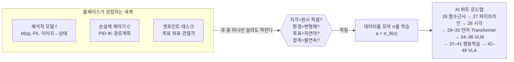
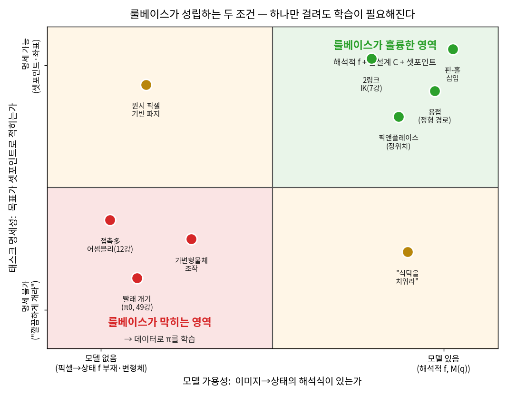
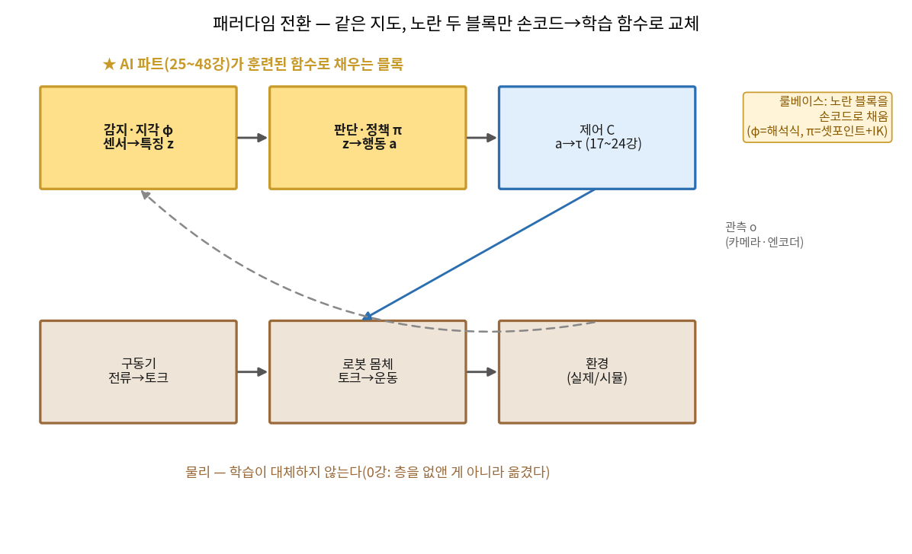
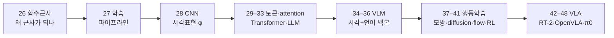
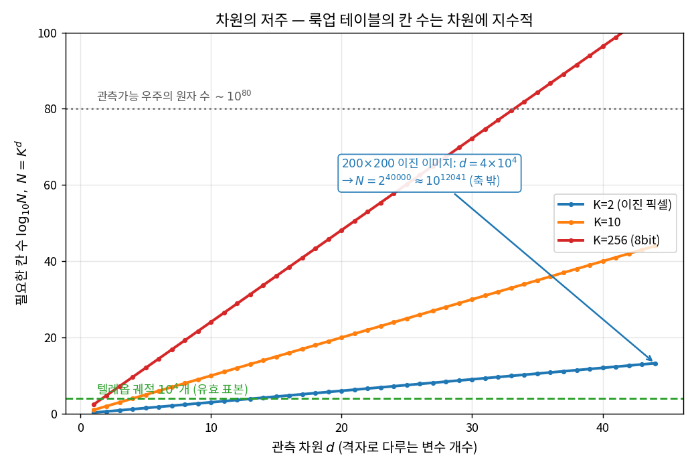
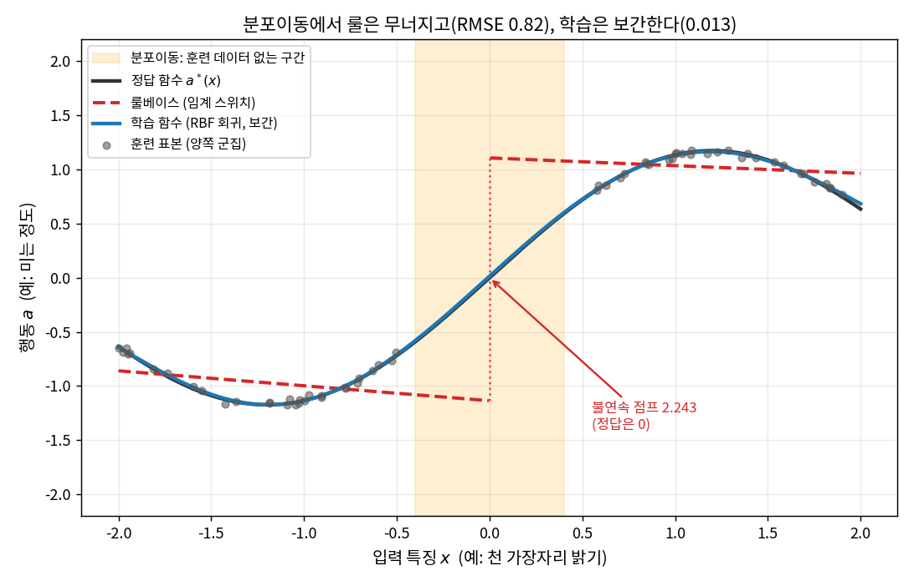

# Lec 25. 딥러닝, 왜 로봇에 필요한가

> Part 6(딥러닝 기초) 1일차 — 로봇 배경자의 AI 파트 첫날. 선수 지식: 0강(전체 지도, 특히 연산/인터페이스/물리 구분과 정책 설계 3축). 7강(해석적 IK)과 12강(접촉 불연속)을 봤다면 이 강의의 실패 사례가 더 선명하다.

## 한 장 요약



룰베이스(해석적 $f$ + 손설계 $C$ + 셋포인트 명세)는 **"모델을 쓸 수 있고 태스크를 명세할 수 있을 때"** 훌륭하다. 그러나 지각이 원시 픽셀이거나·환경이 변형체이거나·목표가 자연어이거나·접촉이 불연속이면 — **넷 중 하나만 걸려도** 룰베이스가 막힌다. 그때 "엔지니어가 $f, C$, 태스크를 명세한다"가 **"데이터를 모아 정책 $\pi$를 학습한다"**로 바뀐다. 이것이 이 커리큘럼 AI 절반의 출발점이다.

## 학습 목표

1. 룰베이스가 성립하는 두 전제(모델 가용성 · 태스크 명세성)를 말하고, 그것이 깨지는 네 축(픽셀 지각·변형체·자연어 목표·접촉 불연속)을 **빨래 개기** 하나로 설명할 수 있다.
2. 차원의 저주 $N=K^d$로 "관측을 룩업 테이블로 다룰 수 없다 → 근사(일반화)가 필수"임을 수로 유도할 수 있다.
3. "명세 vs 학습"의 대비를 형식으로 쓸 수 있다 — $a=\pi(o)$는 손코드로 못 쓰지만 데이터로 근사 가능한 **하나의 함수**임을(26강 universal approximation 예고).
4. 패러다임 전환을 0강 지도 위에 배치할 수 있다 — 학습은 지각 $\varphi$·정책 $\pi$ 블록을 채우고, 제어 $C$·물리 $f$는 고전제어로 남는다("층을 없앤 게 아니라 옮겼다").
5. Part 6~10의 로드맵(26→48)을 그리고, 각 강의가 이 지도의 어느 블록을 채우는지 말할 수 있다.

## 왜 이 강의가 필요한가

로봇공학자는 이미 강력한 도구 상자를 갖고 있다. 기구학으로 손끝을 원하는 좌표에 보내고(4·7강), 동역학으로 토크를 예측하고(10·11강), 제어로 그 명령을 물리로 붙잡는다(17~24강). 이 도구 상자에는 조용한 전제가 둘 깔려 있다: **(1) 세계를 기술하는 모델 $f$를 쓸 수 있다**(링크 길이·질량·관성을 알고, 센서가 상태를 직접 준다), **(2) 태스크를 셋포인트로 명세할 수 있다**(목표 포즈·관절각·힘 프로파일). 이 두 전제가 참인 한, 딥러닝은 필요 없다 — 아니, **써서는 안 된다**. 해석적 IK가 있는데 신경망으로 IK를 근사하는 것은 손해다(정확도·검증가능성·데이터 비용 모두).

문제는 현대 로봇이 요구받는 태스크의 상당수가 이 두 전제를 **동시에 깬다**는 것이다. "식탁을 치워라", "빨래를 개라" 같은 태스크에서는 (a) 지각이 원시 픽셀에서 오고(이미지→상태의 역사상 $f^{-1}$은 해석식이 없다), (b) 물체가 개방형·변형체이며(천은 무한 자유도 — $M(q)$가 없다), (c) 목표가 자연어이고(셋포인트가 아니다), (d) 접촉이 많아 동역학이 불연속이다(12강). 이 강의는 **"언제 도구 상자를 내려놓아야 하는가"**를 정확히 짚는다. 그 경계를 모르면 두 가지 실수를 한다 — 룰베이스로 될 일을 딥러닝으로 낭비하거나, 룰베이스로 안 될 일에 몇 달을 태운다. 64강(논문 읽기)에서 이 경계 감각은 "이 논문이 학습을 쓴 이유가 정당한가"를 판정하는 도구로 돌아온다.

## 본문

### 1. 룰베이스의 두 전제 — 그리고 그것이 깨지는 4사분면

로봇 제어 스택을 한 줄로 요약하면 0강 E1이다: $o=h(x),\ z=\varphi(o),\ a=\pi(z),\ \tau=C(x^{\mathrm{loc}},a),\ \dot x = f(x,\tau)$. **룰베이스**란 이 사슬에서 $\varphi$(지각)와 $\pi$(정책)를 **사람이 손으로 짠 함수**로 채우는 것이다: $\varphi$는 해석적 상태추정(엔코더→관절각, 마커→포즈), $\pi$는 셋포인트+IK(목표 좌표→관절 궤적, 7강). 이것이 가능하려면 두 가지가 참이어야 한다.

- **모델 가용성**: $\varphi$를 손으로 쓰려면 관측에서 상태로 가는 사상을 안다는 뜻이다. 엔코더는 관절각을 **직접** 준다 — $\varphi$가 항등함수에 가깝다. 그러나 카메라 이미지 $I\in\{0,\dots,255\}^{H\times W\times 3}$에서 "천이 어떻게 접혀 있는가"로 가는 $\varphi$에는 **닫힌형이 없다**.
- **태스크 명세성**: $\pi$를 IK로 쓰려면 목표가 셋포인트여야 한다. "손끝을 $(x,y,z)$로"는 IK가 푼다(역사상 존재, 7강). "깔끔하게 개라"는 IK의 입력이 아니다 — 목표 자체가 좌표가 아니라 언어다.

이 두 축으로 태스크를 4사분면에 놓으면, 룰베이스의 영토가 정확히 어디까지인지 보인다.



*그림 1: 세로축 = 태스크 명세성(목표가 셋포인트로 적히는가), 가로축 = 모델 가용성(이미지→상태 해석식이 있는가). **우상 사분면**(둘 다 O)이 고전 제어의 홈그라운드다 — 핀-홀 삽입, 정형 경로 용접, 정위치 픽앤플레이스, 2링크 IK(7강). 나머지 세 사분면은 하나 이상이 깨져 룰베이스가 막힌다: 좌상(모델 없음, 원시 픽셀 파지), 우하(목표가 자연어, "식탁을 치워라"), **좌하(둘 다 없음, 빨래 개기 = π0 시연, 49강)**. 이 강의의 논지는 "좌상·우하·좌하 어디로든 벗어나면 학습이 필요하다"이다. `gen_figs.py`의 `fig1_quadrant`가 생성.*

### 2. 관통 사례 — 빨래 개기가 네 축을 모두 깨는 방식

추상적 4사분면을 하나의 태스크로 못박자. **빨래 개기**(49강에서 다룰 실제 π0 시연[1])는 네 축을 **동시에** 깬다. 로봇공학자가 이 태스크를 고전 도구로 공격하려다 어디서 막히는지 순서대로 보자.

- **(a) 지각이 원시 픽셀이다.** 고전 파이프라인의 첫 단계는 상태추정: "지금 천이 어떤 상태인가?"를 알아야 한다. 강체라면 6-DoF 포즈면 끝난다. 그런데 천의 상태는 **접힌 모양 전체** — 이미지에서 이 상태로 가는 $\varphi$에는 해석식이 없다. 마커를 붙일 수도 없다(천이니까). 여기서 이미 $\varphi$를 손코드로 못 쓴다.
- **(b) 환경이 변형체다.** 설령 상태를 안다 해도, 다음 단계는 동역학 모델 $M(q)\ddot q + \dots = \tau$로 "이렇게 밀면 저렇게 된다"를 예측하는 것이다. 천은 자유도가 **무한**이다 — 유한 차원 $q$가 없으니 $M(q)$ 자체가 없다. 10·11강의 동역학 기계 전체가 입력을 잃는다.
- **(c) 목표가 자연어다.** "깔끔하게 갠 상태"는 셋포인트가 아니다. 무수히 많은 접힘이 모두 "깔끔"할 수 있고, 그중 하나를 좌표로 고정하는 순간 그건 이미 원래 태스크가 아니다. IK의 입력(목표 포즈)이 존재하지 않는다.
- **(d) 접촉이 불연속이다.** 천을 집고·펴고·누르는 매 순간 접촉이 붙었다 떨어진다 — 12강에서 본 **불연속 동역학**이다. 매끄러운 $f$를 가정하는 고전 제어(선형화·자코비안 기반)가 발밑에서 흔들린다.

네 축 중 **어느 하나만** 걸려도 룰베이스가 막힌다는 것이 핵심이다. 예를 들어 강체를 카메라로만 봐야 하면 (a)만으로, 강체·시각도 되지만 목표가 "식탁을 보기 좋게 치워라"면 (c)만으로 막힌다. 빨래는 그 넷을 한꺼번에 보여주는 **극단적 표본**일 뿐이다. 그리고 바로 이 태스크를 π0가 학습으로 해냈다는 사실(49강)이, 왜 로봇공학에 딥러닝이 들어왔는가에 대한 가장 구체적인 답이다.

> **경계를 오해하지 말 것.** 이 논지는 "빨래는 어려우니 딥러닝"이 아니다. 핵심은 **어느 축이 깨졌는가**다. 축이 하나도 안 깨지면(우상 사분면) 딥러닝은 손해다. 그래서 다음 절의 수식은 "왜 깨진 축에서는 손코드가 원리적으로 불가능한가"를 수로 못박는다.

### 3. 명세에서 학습으로 — 같은 지도, 두 블록만 교체

패러다임 전환의 정확한 문장은 이렇다: **"엔지니어가 $f, C$, 태스크를 명세한다" → "데이터를 모아 $\pi$를 학습한다".** 여기서 흔한 과장을 미리 잘라내자. 학습이 **제어와 물리를 대체하는 게 아니다.** 0강의 언어로: 학습은 지각 $\varphi$·정책 $\pi$ 블록을 **훈련된 함수**로 채우고, 제어 $C$(17~24강)와 물리 $f$(로봇+환경)는 **그대로 남는다.** VLA가 내는 액션 청크 $a$의 종착지는 여전히 관절 PID·전류 루프다(17강, 50강). "층을 없앤 게 아니라 옮겼다"(0강).



*그림 4: 0강의 닫힌 루프 지도. **노란 두 블록**(지각 $\varphi$, 정책 $\pi$)이 룰베이스에서는 손코드($\varphi$=해석적 상태추정, $\pi$=셋포인트+IK), 학습에서는 **훈련된 함수**로 채워진다. 파란 블록(제어 $C$)과 갈색 블록(구동·로봇·환경 = 물리)은 **어느 패러다임에서도 고전 제어·물리로 남는다.** 이 그림이 이 강의의 한 문장 요약이다 — 학습은 지도를 다시 그리지 않고, 두 블록의 채움 방식만 바꾼다. `gen_figs.py`의 `fig4_map_highlight`가 생성.*

전환 후의 로드맵도 이 지도 위에 얹힌다. Part 6~10은 노란 두 블록을 아래에서 위로 채운다:



- **26 함수근사**: $a=\pi(o)$가 "손코드로 못 쓰지만 근사 가능한 하나의 함수"라는 이 강의의 약속을 universal approximation으로 갚는다.
- **27 파이프라인 · 28 CNN**: 데이터로 함수를 맞추는 절차와, 픽셀에서 특징으로 가는 $\varphi$(2절 (a)의 해법).
- **29–36 Transformer·VLM**: 자연어 목표를 다루는 백본(2절 (c)의 해법).
- **37–41 행동학습 · 42–48 VLA**: 변형체·불연속 접촉을 데이터로 학습하는 정책(2절 (b)(d)의 해법)과 그 계보.

### 핵심 수식

오리엔테이션이므로 수식은 가볍되 형식을 갖춘다. **E1**은 "왜 손코드가 원리적으로 불가능한가"(차원의 저주), **E2**는 "그러나 왜 근사는 가능한가"(명세 vs 학습)를 못박는다. 선택적 **E3**은 그 결론을 0강 폐루프에 다시 앉힌다.

#### E1. 표현력의 벽 — 차원의 저주 $N = K^d$

**① 직관**: 관측이 원시 픽셀이면 "본 적 있는 관측 → 정답 행동"을 표로 저장하는 룩업 방식은 즉시 파산한다. 표의 칸 수가 관측 차원에 대해 **지수적**으로 폭발하기 때문이다. 그래서 "본 것을 외운다"가 아니라 "안 본 것으로 **일반화**한다"가 필수다 — 이 일반화의 다른 이름이 함수 근사다.

**② 물리·기하적 의미**: 관측공간을 격자로 나눠 각 칸에 행동을 적는다고 하자. 축(변수)이 $d$개, 각 축을 $K$칸으로 나누면 격자의 칸 수는 $K^d$다. $d$가 몇 개면 감당되지만($K{=}10, d{=}4$이면 $10^4$칸), 픽셀은 $d\sim10^4{\sim}10^5$다. 유효 표본(실제로 모은 궤적)은 아무리 많아야 $10^4{\sim}10^6$ — 칸 수에 비하면 **거의 모든 칸이 비어 있다.** 텔레옵으로 우주가 끝날 때까지 시연해도 격자를 채울 수 없다. 결론은 강제된다: 빈 칸을 **채운 칸으로부터 보간**할 수밖에 없고, 그 보간기가 곧 학습된 함수다. 그림 2가 이 폭발을 로그스케일로 보여준다.



*그림 2: $\log_{10}N = d\log_{10}K$. $K{=}2$(이진 픽셀)조차 $d$에 선형인 자릿수로 폭발하고, $200{\times}200$ 이진 이미지($d{=}4{\times}10^4$)면 $N=2^{40000}\approx10^{12041}$ — 관측가능 우주의 원자 수 $10^{80}$을 $10^{11961}$배 넘어선다(축 밖, 화살표). 초록 파선이 텔레옵으로 모을 수 있는 유효 표본 $10^4$ 수준이다. **칸 수와 표본 수의 이 격차가 "룩업 불가 → 일반화 필수"의 전부다.** WE-1의 수치를 재현하며, `gen_figs.py`의 `fig2_curse`가 생성.*

**③ 형식**: 관측 $o\in\mathcal{O}$를 축마다 $K$칸으로 이산화한 격자의 칸 수와, 채워지는 비율은

$$
N = K^{d}, \qquad \text{채워진 칸 비율} \;\le\; \frac{N_{\text{data}}}{K^{d}} \;\xrightarrow[\;d\gg1\;]{}\; 0
$$

$d{=}40000,\ K{=}2$이면 $N=2^{40000}$, $\log_{10}N = 40000\log_{10}2 \approx 12041$. $N_{\text{data}}=10^4$을 넣으면 채워진 비율은 $10^{4-12041}=10^{-12037}$ — 사실상 0이다. 룩업(암기)은 원리적으로 불가능하고, 남는 길은 **매끄러운 함수 $\pi_\theta$로 관측공간 전체를 채우는 근사**뿐이다. "왜 그런 함수가 존재하는가"는 26강(universal approximation)이 답한다.

#### E2. 명세 vs 학습 — 닫힌형 역사상은 없어도, 그것은 하나의 함수다

**① 직관**: 룰베이스는 목표(셋포인트)에서 행동으로 가는 사상을 **사람이 수식으로 적는다.** 셋포인트 태스크에는 그 역사상(IK)이 실제로 존재한다(7강). 그러나 "깔끔하게 개라"에서 행동으로 가는 사상은 **닫힌형이 없다** — 아무도 그 수식을 쓸 수 없다. 핵심 통찰은 이것이다: **수식을 못 쓴다고 함수가 없는 게 아니다.** 관측에서 좋은 행동으로 가는 대응은 분명히 존재한다(사람은 그 대응을 실행한다). 다만 그것을 **손이 아니라 데이터로** 근사할 뿐이다.

**② 물리·기하적 의미**: 7강의 해석적 IK를 대비 축으로 삼자. IK는 목표 포즈 $p^*$에서 관절각 $q$로 가는 역사상 $q=\mathrm{IK}(p^*)$이고, 이 사상은 기구학 방정식 $p=\mathrm{FK}(q)$의 역으로 **닫힌형이 존재**한다(혹은 DLS로 수치적으로 푼다). 그래서 셋포인트 태스크는 손코드 $\pi$로 충분하다. 반면 "개라"에는 대응하는 방정식 자체가 없다 — $\mathrm{FK}$에 해당하는 해석적 태스크 모델이 없으므로 그 역도 없다. 그러나 관측 $o$(픽셀+언어)에서 좋은 행동 $a$로 가는 대응 $\pi^\*$는 여전히 **하나의 함수**로서 존재한다. 우리는 그 함수의 수식을 모를 뿐, 그 함수의 **입출력 예시(시연 데이터)**는 모을 수 있다. 함수를 예시로부터 복원하는 것 — 그것이 학습이다.

**③ 형식**: 두 패러다임을 나란히 쓰면

$$
\underbrace{q = \mathrm{IK}(p^{*})}_{\text{명세: 닫힌형 역사상 존재(7강)}}
\qquad\text{vs}\qquad
\underbrace{a = \pi^{*}(o),\;\; \pi^{*}=\arg\min_{\pi}\ \mathbb{E}_{(o,a^{*})\sim\mathcal{D}}\big[\ell(\pi(o),a^{*})\big]}_{\text{학습: 손코드 불가, 데이터로 근사}}
$$

왼쪽은 사람이 수식으로 적는 함수, 오른쪽은 데이터셋 $\mathcal{D}=\{(o_i,a_i^*)\}$의 입출력 쌍에서 손실 $\ell$을 최소화해 **복원**하는 함수다. $\pi_\theta$가 파라미터 $\theta$로 매개되고, $\arg\min$이 경사하강으로 풀린다는 것 — 이 두 가지가 26·27강의 내용이다. 로봇공학자에게 오른쪽 식은 낯설지 않다: **관측 파라미터로부터 시스템을 맞추는 최소자승**이고(60강의 시스템 식별과 같은 골격), 다만 맞추는 대상이 관성 파라미터가 아니라 정책 함수일 뿐이다.

#### (선택) E3. 0강 폐루프의 재확인 — 무엇이 바뀌고 무엇이 남는가

**① 직관**: 학습은 폐루프의 두 블록만 바꾼다. 나머지는 손대지 않는다.

**② 물리·기하적 의미**: 0강 E1의 다섯 함수 중 $\varphi$(지각)와 $\pi$(정책)만 손코드에서 학습 함수로 교체된다. 센서 $h$는 물리(하드웨어), 제어기 $C$는 고전제어(17~24강), 동역학 $f$는 물리(로봇+환경) — 이 셋은 **어느 패러다임에서도 불변**이다. 그림 4의 색이 이 불변/가변을 그대로 나타낸다.

**③ 형식**: 폐루프를 다시 쓰되, 학습이 채우는 부분을 $\theta$로 표시하면

$$
o_t = h(x_t), \quad z_t = \varphi_{\theta}(o_t), \quad a_t = \pi_{\theta}(z_t), \quad \tau_t = C(x_t^{\mathrm{loc}}, a_t), \quad \dot x = f(x,\tau)
$$

$\varphi_\theta, \pi_\theta$만 $\theta$를 갖고(학습됨), $h, C, f$에는 $\theta$가 없다(불변). end-to-end VLA는 $\varphi_\theta$와 $\pi_\theta$를 하나의 큰 $\pi_\theta$로 합칠 뿐, $C$와 $f$를 흡수하지 못한다 — 물리는 재배포가 불가능하기 때문이다(0강, 흔한 오해 4).

### Worked Example

#### WE-1 (손계산 + 검증): 룩업은 왜 원리적으로 불가능한가 — $2^{40000}$ 대 $10^4$

E1을 손으로 못박는다. $200\times200$ **이진** 이미지(픽셀당 흑/백만) 하나가 가질 수 있는 서로 다른 상태의 수를 세고, 텔레옵으로 실제 모을 수 있는 궤적 수와 비교한다. 손계산: 픽셀 수 $d = 200\times200 = 40000$, 각 픽셀이 2값이므로 상태 수 $N = 2^{40000}$. 자릿수는 $\log_{10}N = 40000\cdot\log_{10}2 = 40000\times0.30103 = 12041$. 즉 $N\approx10^{12041}$. 한편 대규모 텔레옵도 궤적은 $10^4$ 규모다. **상태 하나당 표본은커녕, 표본 하나당 상태가 $10^{12037}$개씩 배정된다** — 룩업/열거는 원리적으로 불가능하고 일반화가 유일한 길이다.

```python
import numpy as np

d = 200 * 200                       # 픽셀 수 = 40000 (관측 차원)
log10_states = d * np.log10(2)      # 2^d 의 자릿수
print(f"픽셀 수 d = {d}")
print(f"상태 수 = 2^{d}  →  자릿수 log10 = {log10_states:.0f}  (즉 약 10^{log10_states:.0f})")
# 픽셀 수 d = 40000
# 상태 수 = 2^40000  →  자릿수 log10 = 12041  (즉 약 10^12041)

N_traj = 10_000                     # 텔레옵으로 실제 모은 궤적 수
print(f"유효 표본 N = {N_traj}  =  10^{np.log10(N_traj):.0f}")   # 10^4
print(f"상태/표본 비 = 10^{log10_states - np.log10(N_traj):.0f}")  # 10^12037
print(f"참고: 우주 원자 수 ~10^80 보다 10^{log10_states - 80:.0f} 배 많다")  # 10^11961
```

출력이 손계산과 일치한다: $2^{40000}\approx10^{12041}$, 표본 대비 $10^{12037}$배, 우주 원자 수보다도 $10^{11961}$배 많다. 이 수는 **컬러·연속값 이미지면 더 커진다**($K{=}256$이면 $256^{40000}$). "관측을 외운다"는 발상이 왜 시작조차 불가능한지 — 이 여섯 줄이 그 전부다. 그림 2가 이 실험을 $K{=}2,10,256$으로 확장한 것이다.

#### WE-2 (코드): 룰은 분포이동에서 무너지고, 학습은 보간으로 일반화한다

E2를 눈으로 확인한다. 1D 토이 태스크: 스칼라 특징 $x$(예: 천 가장자리 밝기)에서 스칼라 행동 $a$(예: 미는 정도)로 가는 매끄러운 정답 $a^*(x)=\sin(1.4x)+0.15x$가 있다. 훈련 데이터는 **두 군집**에 몰려 있고 가운데 $[-0.4, 0.4]$에는 **구멍**이 있다(엔지니어가 두 조건에서만 시연을 모은 상황). **룰베이스**는 $x{=}0$에서 하드 스위치하는 손튜닝 구간규칙(각 군집에 직선 하나씩), **학습**은 같은 데이터에 맞춘 작은 RBF 회귀(순수 numpy)다. 그다음 운용점이 **구멍 쪽으로 이동**(분포이동)하면 무슨 일이 일어나는지 본다.

```python
import numpy as np
rng = np.random.default_rng(0)
def gt(x): return np.sin(1.4*x) + 0.15*x                 # 매끄러운 정답 a*(x)

# 훈련 데이터: 두 군집(가운데 [-0.4,0.4]는 비어 있음 = 분포의 구멍)
xl = rng.uniform(-2.0, -0.5, 30); xr = rng.uniform(0.5, 2.0, 30)
x_tr = np.sort(np.concatenate([xl, xr]))
y_tr = gt(x_tr) + 0.02*rng.standard_normal(x_tr.size)

# 룰베이스: x=0에서 하드 스위치, 각 군집에 직선 하나씩 (손튜닝 구간규칙)
ml, bl = np.linalg.lstsq(np.stack([xl, np.ones_like(xl)], 1), gt(xl), rcond=None)[0]
mr, br = np.linalg.lstsq(np.stack([xr, np.ones_like(xr)], 1), gt(xr), rcond=None)[0]
def rule(x):
    x = np.asarray(x, float); return np.where(x < 0.0, ml*x + bl, mr*x + br)

# 학습: RBF 릿지 회귀 (순수 numpy) — 관측공간 전체를 매끄럽게 채운다
centers = np.linspace(-2.0, 2.0, 12); gamma = 1.5
def rbf(x):
    x = np.asarray(x, float).reshape(-1, 1)
    return np.exp(-gamma*(x - centers.reshape(1, -1))**2)
Phi = rbf(x_tr); lam = 1e-2
w = np.linalg.solve(Phi.T@Phi + lam*np.eye(12), Phi.T@y_tr)
def learned(x): return (rbf(x)@w).ravel()

# 평가: 본 구역 vs 분포이동(구멍 [-0.4,0.4])
x_in  = np.sort(np.concatenate([rng.uniform(-2,-0.5,200), rng.uniform(0.5,2,200)]))
x_gap = np.linspace(-0.4, 0.4, 200)
def rmse(f, xs): return np.sqrt(np.mean((f(xs) - gt(xs))**2))
print(f"본 구역 : 룰 {rmse(rule, x_in):.4f} / 학습 {rmse(learned, x_in):.4f}")   # 0.1532 / 0.0107
print(f"분포이동: 룰 {rmse(rule, x_gap):.4f} / 학습 {rmse(learned, x_gap):.4f}")  # 0.8175 / 0.0126
print(f"구멍에서 배율 = {rmse(rule, x_gap)/rmse(learned, x_gap):.1f}배")            # 64.8배
j = rule(np.array([1e-6]))[0] - rule(np.array([-1e-6]))[0]
print(f"룰의 x=0 불연속 점프 = {j:.3f}  (정답은 0)")                                # 2.243
print(f"학습의 x=0 값 = {learned(np.array([0.0]))[0]:.4f}  (정답 0)")                # 0.0139
```

출력: 본 구역에서는 룰도 그럭저럭(RMSE 0.153) 학습은 더 좋고(0.011), **분포이동 구간에서 룰은 0.818로 무너지는데 학습은 0.013으로 버틴다 — 약 65배 차이.** 원인은 명확하다: 룰은 $x{=}0$에서 **2.243짜리 불연속 점프**를 만드는데(정답은 그 점에서 0), 학습 함수는 양쪽 군집 사이를 **매끄럽게 보간**해 구멍에서도 정답에 가깝다(0.014). 이것이 "왜 학습이 이기나"의 최소 예제다: 손튜닝 규칙은 **본 상황의 분류·분기**를 하지만, 매끄러운 함수는 **안 본 상황으로 일반화**한다. 그림 3이 이 실험을 그린다. 다만 주의 — 이 승리는 공짜가 아니라 **훈련 분포 근방**에서만 보장된다. 구멍이 아니라 훈련 범위를 완전히 벗어난 구간에서는 학습도 무너진다(분포이동 일반화의 한계는 27·57강).



*그림 3: 검정 = 정답 $a^*(x)$, 빨강 파선 = 룰(임계 스위치), 파랑 = 학습(RBF 보간), 회색 점 = 두 군집 훈련 표본, 노란 음영 = 분포이동(훈련 데이터 없는 구멍). 룰은 $x{=}0$에서 **2.243 점프**해 구멍에서 정답(0 부근)을 크게 벗어나고(RMSE 0.82), 학습은 매끄럽게 이어 붙여 정답을 따라간다(0.013). "손코드는 본 것을 분기하고, 학습은 안 본 것을 보간한다"의 시각적 증명. `gen_figs.py`의 `fig3_rule_vs_learn`이 생성.*

### 로봇공학자를 위한 번역

- **정책 학습 = 시스템 식별의 확장판.** 60강에서 관성 파라미터를 측정 데이터에 최소자승으로 맞추는 것과, E2의 $\pi^*=\arg\min_\theta\mathbb{E}[\ell(\pi_\theta(o),a^*)]$은 **같은 골격**이다 — "모델을 못 쓰면 데이터로 맞춘다". 다른 점은 맞추는 대상이 몇 개의 물리 상수가 아니라 수백만 파라미터의 함수라는 것, 그래서 **과적합**(소량 데이터에 관성 파라미터를 과하게 맞추면 다른 자세에서 틀리는 그 현상)이 훨씬 큰 문제가 된다(27·60강).
- **차원의 저주 = 격자 기반 방법의 한계.** 상태공간을 격자로 나눠 각 칸에 최적 행동을 저장하는 발상은 로봇공학자에게 낯설지 않다(격자 기반 경로계획, 이산 DP). 그것이 저차원에서만 되는 이유가 정확히 $N=K^d$다. 딥러닝은 "격자 대신 매끄러운 함수로 값을 표현"해 이 벽을 우회한다 — 함수근사가 곧 저주의 처방(26강).
- **보간 일반화 = 매끄러움 가정.** WE-2에서 학습이 이긴 근본 이유는 "가까운 입력은 가까운 출력을 낸다"는 매끄러움을 함수가 강제하기 때문이다. 이것은 제어에서 셋포인트 사이를 스플라인으로 잇는 감각(8강)과 같다 — 다만 잇는 공간이 관절이 아니라 관측→행동 사상일 뿐이다.

## 흔한 오해

1. **"딥러닝이 (고전) 제어를 대체한다"** — 아니다. 그림 4·E3이 보이듯 학습은 지각 $\varphi$·정책 $\pi$ 블록만 채우고, 제어 $C$(17~24강)와 물리 $f$는 그대로 남는다. VLA 액션 청크의 종착지는 언제나 관절 PID·전류 루프다(50강). "층을 없앤 게 아니라 옮겼다"(0강). 실제로 π0의 하위층도 고전 서보다.
2. **"룰베이스는 죽었다"** — 아니다. 우상 사분면(모델 가용 × 셋포인트 명세)에서는 룰베이스가 **여전히 최선**이고, 딥러닝을 쓰면 정확도·검증가능성·데이터 비용에서 손해다. 게다가 학습 스택의 **하위층 전체**(제어·전류루프)가 고전제어다. 핵심 질문은 "룰이냐 학습이냐"가 아니라 **"이 태스크의 어느 축이 깨졌는가"**다(그림 1).
3. **"데이터만 많으면 다 된다"** — 아니다. WE-2의 승리는 **훈련 분포 근방**에서만 보장된다. 분포이동·과적합·벤치마크 포화는 데이터 양으로 자동 해결되지 않는 별개 문제이며(27·57강), 오히려 "무엇을 얼마나 다양하게 모으는가"가 양보다 중요할 때가 많다(45·55강).
4. **"학습이면 물리를 몰라도 된다"** — 정반대다. 행동 $a$의 종착지가 물리(제어·구동·동역학)이므로, 물리를 모르면 (i) 인터페이스 계약(단위·좌표계·주기)을 못 맞춰 sim-to-real·파인튜닝이 깨지고(0강, 50강), (ii) "왜 이 태스크에 학습이 필요한가"(어느 축이 깨졌는가)를 진단하지 못한다. 이 커리큘럼이 로봇의 몸(Part 2~5)을 먼저 쌓은 이유가 이것이다.

## 실습 (사고실험 워크시트, ~1시간)

이 강의는 코드 실습 대신 **로드맵/사고실험 워크시트**다(가벼움). 목적은 "룰 vs 학습" 경계 감각을 자기 문제에 적용하는 것.

1. **내 태스크를 4사분면에 놓기** (20분): 잘 아는 로봇 태스크 셋을 고른다(예: 팔레타이징, 케이블 삽입, 어질리티 보행, 주방 정리). 각각을 그림 1의 두 축(모델 가용성 × 태스크 명세성)으로 판정하고, **어느 축이 깨졌는지** 한 줄로 적는다. 우상에 놓인 태스크는 "학습을 쓰면 왜 손해인가"도 적는다.
2. **빨래 개기 4축 분해 재현** (15분): 2절의 (a)(b)(c)(d)를 안 보고, 내가 고른 "가장 어려운 태스크" 하나에 대해 네 축 각각이 깨지는지/멀쩡한지 표로 만든다. 멀쩡한 축이 하나라도 있으면 "그 축은 고전 도구로 남길 수 있는가?"(하이브리드 설계)를 생각한다.
3. **패러다임 전환을 지도에 배치** (15분): 그림 4를 안 보고 내 시스템의 $\varphi, \pi, C, f$를 그린 뒤, "학습으로 채울 블록"과 "고전으로 남을 블록"을 색칠한다. "학습이 $C$나 $f$를 흡수한다"고 쓴 곳이 있으면 "실제로는 어디로 옮겨졌는가"로 고친다.
4. **로드맵 예측** (10분): 3절 로드맵(26→48)에서, 내가 2번에서 찾은 "깨진 축"을 해결하는 강의가 어디인지 짚는다(픽셀→28, 자연어→29–36, 변형체·접촉→37–41·42–48). 이것이 앞으로 이 축 절반을 읽는 개인 지도다.
5. **Claude에게 검증받기** (선택): 워크시트를 Claude에게 보여주고, "룰로 될 일을 학습으로 낭비한 칸"과 "학습이 필요한데 룰로 우긴 칸"이 있는지 물어본다.

## Claude와 토론할 질문

1. 그림 1의 4사분면에서, 실제 내 회사/연구의 로봇 태스크는 어디에 몰려 있는가? 그 분포가 "우리가 딥러닝을 도입해야 하는가"에 대해 무엇을 말해 주는가?
2. 빨래 개기의 네 축(픽셀·변형체·자연어·접촉) 중 **하나씩만** 걸린 태스크를 각각 하나 떠올려 보라. 그 경우에도 정말 룰베이스가 완전히 막히는가, 아니면 하이브리드(일부는 고전, 일부는 학습)가 가능한가?
3. WE-1의 $2^{40000}$은 "이진 이미지의 서로 다른 상태 수"다. 그러나 실제로 로봇이 마주치는 이미지는 이 공간에 **균일 분포**하지 않는다(자연 이미지는 저차원 다양체에 몰려 있다). 이 사실이 차원의 저주를 얼마나 완화하는가? 그래도 룩업이 불가능한 이유는?
4. E2에서 "수식을 못 쓴다고 함수가 없는 게 아니다"라고 했다. 그렇다면 "사람도 못 하는 태스크"는 학습으로 가능한가? 학습 가능성과 "정답 함수의 존재"는 같은 것인가 다른 것인가?
5. WE-2에서 학습이 이긴 것은 **보간**이었다. 만약 운용점이 훈련 범위를 완전히 벗어나면(외삽) 어떻게 되는가? 이것이 sim-to-real·분포이동 문제(27·57강)와 어떻게 연결되는가?
6. "학습은 $\varphi, \pi$만 채우고 $C, f$는 남는다"(E3)고 했다. 그런데 최근 일부 연구는 저수준 제어까지 학습한다(예: 보행 RL — 보행 역학은 13강). 이것은 E3의 반례인가, 아니면 "블록을 옮긴" 또 다른 사례인가? (힌트: 학습된 보행 정책의 출력은 무엇이고, 그 아래에 무엇이 남는가?)
7. 로봇공학자로서 당신이 이미 가진 어떤 직관(시스템 식별·격자 계획·스플라인 보간·게인 튜닝)이 앞으로 나올 딥러닝 개념(과적합·차원의 저주·일반화·경사하강)에 대응될 것 같은가? 하나를 골라 대응을 예측해 보라(26·27강에서 확인).

## 읽을거리

1. **Goodfellow, Bengio, Courville, "Deep Learning" (deeplearningbook.org) Ch.1(Introduction)만** (~30분): "왜 손설계 특징 대신 학습된 표현인가"의 표준 서술. §1.1의 "representation learning" 동기가 이 강의의 E1·E2와 정확히 겹친다. 수식은 아직 안 봐도 된다.
2. **3Blue1Brown, "But what is a neural network?" (Neural Networks 1편)** (~20분): 함수근사의 시각적 직관. 26강의 예습이자, E2의 "손코드로 못 쓰는 함수를 데이터로 근사"의 그림판.
3. (선택) **Levine et al. 2016, "End-to-End Training of Deep Visuomotor Policies" (arXiv:1504.00702) 초록 + Fig 1만** (~10분): "픽셀→토크를 통째로 학습"의 초기 사례. 이 강의의 "지각 $\varphi$·정책 $\pi$를 데이터로 채운다"가 로봇에서 실제로 시도된 첫 이정표 중 하나. 자세한 방법은 37강(모방학습)에서.

## 자가 점검

1. 룰베이스가 성립하는 두 전제(모델 가용성·태스크 명세성)를 말하고, 그것이 깨지는 네 축을 **빨래 개기** 하나로 설명할 수 있는가?
2. 그림 1의 4사분면을 안 보고 그리고, 임의의 태스크(예: 케이블 삽입, "식탁 치우기")를 올바른 사분면에 놓을 수 있는가?
3. $N=K^d$로 "$200\times200$ 이진 이미지의 상태 수 $\approx10^{12041}$ vs 표본 $10^4$"를 유도하고, 그로부터 "룩업 불가 → 일반화 필수"를 말할 수 있는가?
4. "닫힌형 역사상이 없어도 그것은 하나의 함수다"(E2)를, 해석적 IK(7강, 역사상 존재)와 "개라"(역사상 없음)의 대비로 설명할 수 있는가?
5. 패러다임 전환을 0강 지도 위에 배치하고, "학습이 채우는 블록"과 "고전으로 남는 블록"을 색칠하며 "층을 없앤 게 아니라 옮겼다"를 설명할 수 있는가?
6. WE-2에서 룰이 분포이동에 무너지고(불연속 점프) 학습이 보간으로 일반화하는 이유를 말할 수 있는가? 그 승리가 왜 훈련 분포 근방에서만 보장되는지도?
7. Part 6~10 로드맵(26→48)에서 각 강의가 "깨진 어느 축"을 해결하는지 짚을 수 있는가(픽셀→28, 자연어→29–36, 변형체·접촉→37–48)?

## 참고문헌

> 본문 수치·주장의 출처. 웹 문서는 2026-07-09 접속 기준. (2차) = 언론 등 2차 출처.

[1] K. Black et al. (Physical Intelligence), "π0: A Vision-Language-Action Flow Model for General Robot Control," arXiv:2410.24164, 2024.10. https://arxiv.org/abs/2410.24164 · 블로그: https://www.pi.website/blog/pi0
— **뒷받침**: 빨래 개기가 학습 정책으로 시연된 실제 사례(2절 관통 사례, 그림 1의 좌하 사분면). 상세 구조는 44강, 하드웨어 시연 맥락은 49강.

[2] I. Goodfellow, Y. Bengio, A. Courville, "Deep Learning," MIT Press, 2016. https://www.deeplearningbook.org
— **뒷받침**: "손설계 특징 대신 학습된 표현"의 동기(E1·E2, 읽을거리 1), 차원의 저주와 일반화의 표준 서술(Ch.5).

[3] S. Levine, C. Finn, T. Darrell, P. Abbeel, "End-to-End Training of Deep Visuomotor Policies," arXiv:1504.00702, 2016 (JMLR 2016). https://arxiv.org/abs/1504.00702
— **뒷받침**: 픽셀→토크(지각 $\varphi$·정책 $\pi$)를 데이터로 학습한 초기 이정표(읽을거리 3, 로봇공학자를 위한 번역). 상세 방법은 37강.

[4] 3Blue1Brown, "Neural Networks" 시리즈(1편: But what is a neural network?), 2017. https://www.3blue1brown.com/topics/neural-networks
— **뒷받침**: 함수근사의 시각적 직관(읽을거리 2, E2의 "데이터로 근사"의 그림판, 26강 예습).

*수치 재현성: 본문·그림의 numpy 토이 수치는 `images/lec25/gen_figs.py`와 본문 코드 블록의 실행 출력이다 — WE-1의 $2^{40000}\approx10^{12041}$·표본 대비 $10^{12037}$배·우주 원자 수 대비 $10^{11961}$배(순수 정수 계산), WE-2의 본 구역 RMSE 룰 0.1532/학습 0.0107·분포이동 룰 0.8175/학습 0.0126(≈65배)·룰의 $x{=}0$ 불연속 점프 2.243·학습의 $x{=}0$ 값 0.0139(시드 `default_rng(0)`, RBF 12중심·$\gamma{=}1.5$·$\lambda{=}10^{-2}$ 릿지). numpy 1.26 / matplotlib 3.5 기준 재현 확인. **이 토이는 개념 재현용 CPU 시뮬레이션이며 실제 대형 모델·정책이 아니다** — 빨래 개기 등 실물 시연 수치는 위 [1] 1차 출처.*

<!-- lecture-nav -->

---

⬅ 이전: [Lec 24. 전신 제어(WBC) — 태스크들의 우선순위 사회](../part05-control/lec24-whole-body-control.md)　｜　[📖 전체 목차](../README.md)　｜　다음: [Lec 26. 신경망 = 함수 근사기](lec26-neural-networks-function-approximation.md) ➡
