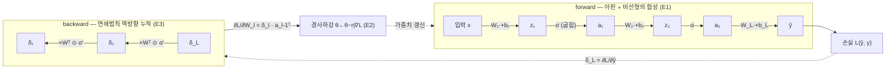
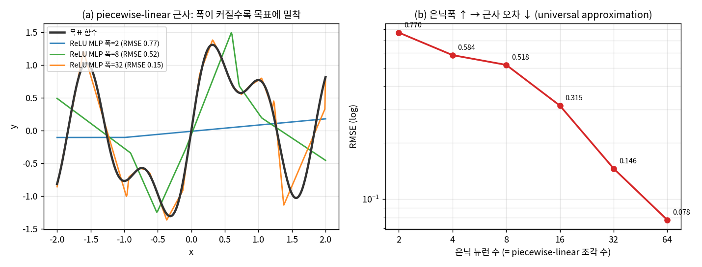
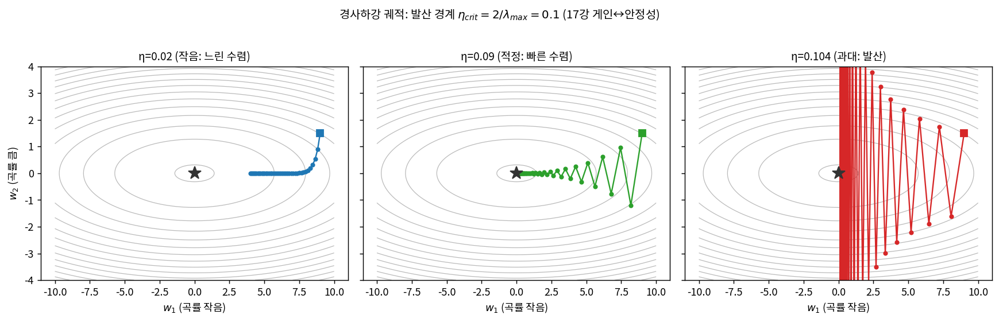
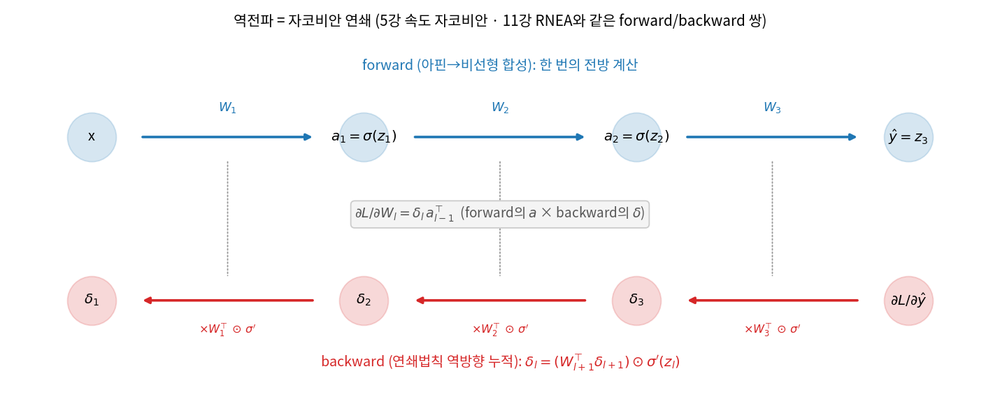
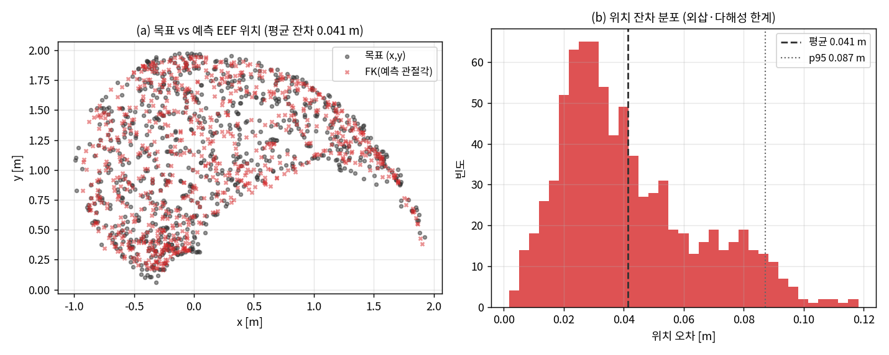

# Lec 26. 신경망 = 함수 근사기

> 선수 지식: 25강(왜 딥러닝인가). 관련: 5강(속도 자코비안=연쇄법칙), 7강(IK·DLS 댐핑), 11강(RNEA forward/backward 쌍), 17강(학습률↔안정성). 다음: 27강(학습 파이프라인).

## 한 장 요약



신경망(MLP)은 마법이 아니라 **선형변환(아핀) 사이에 비선형 굽힘(σ)을 끼워 만든 합성함수**다. 스플라인·최소자승·가우스-뉴턴 IK가 그랬듯, 이것도 "파라미터를 데이터에 맞춰 조정하는 함수 근사기"다 — 다른 점은 근사기의 basis가 **고정이 아니라 학습된다**는 것뿐이다. forward는 아핀∘비선형 합성, backward(역전파)는 그 합성의 자코비안을 거꾸로 곱해 기울기를 얻는 연쇄법칙, 경사하강은 그 기울기로 손실지형을 내려가는 최급강하다.

## 학습 목표

1. MLP를 "아핀 ∘ 비선형의 합성"으로 쓰고, 비선형 σ가 없으면 왜 전체가 다시 선형으로 붕괴하는지 설명할 수 있다.
2. 경사하강 $\theta\leftarrow\theta-\eta\nabla_\theta L$을 1차 테일러로 유도하고, 학습률 η의 수렴/발산 조건을 17강 게인↔안정성의 언어로 말할 수 있다.
3. 역전파가 연쇄법칙의 역방향 누적(= 자코비안 곱)임을 유도하고, 5강 속도 자코비안·11강 RNEA와 같은 forward/backward 쌍 구조임을 설명할 수 있다.
4. 2뉴런 MLP의 forward+backward를 손으로 계산하고 유한차분으로 검증할 수 있다.
5. from-scratch numpy MLP로 2링크 IK를 근사하고, 다해성 때문에 한 분지만 학습되는 것과 외삽 실패를 수치로 확인할 수 있다.

## 왜 이 강의가 필요한가

로봇공학자는 이미 함수 근사기를 매일 쓴다. 궤적을 스플라인으로 잇고(8강), 센서 캘리브레이션을 최소자승으로 맞추고(60강 시스템 식별), IK를 가우스-뉴턴/DLS로 푼다(7강). 이 강의의 한 문장 주장은 이것이다: **신경망은 그 함수 근사기들의 일반화이며, 새로 배울 것은 "basis를 사람이 고르는 대신 데이터로 학습한다"는 점 하나다.** 이 대응을 붙잡으면 이후 Part 6~10의 모든 것 — CNN(28강), attention(30강), Transformer(31강), diffusion policy(39강), π0의 action expert(44강) — 이 "더 정교하게 조립된 학습 가능한 함수 근사기"로 보인다.

이걸 "블랙박스"로 외우면 새 아키텍처 앞에서 무력하다. 왜 σ가 필수인지, 왜 학습률을 올리면 발산하는지(17강에서 게인 올리다 발진해 본 그 경험), 왜 역전파가 forward 한 번 비용으로 **모든** 기울기를 주는지를 직접 유도하고 손으로 계산해 본 사람만이, 44강에서 "action expert가 별도 가중치지만 attention을 공유한다"는 문장을 계산 그래프로 읽어낼 수 있다. 이 강의의 worked example은 정확히 그 유도와 검증을 CPU numpy로 시킨다 — 2뉴런 MLP를 손으로 미분해 유한차분과 1e-10까지 맞추고, from-scratch MLP로 2링크 IK를 근사한다.

## 본문

### 1. 함수 근사기라는 오래된 친구

"입력 $x$를 받아 출력 $y$를 내는 함수 $f_\theta$를, 데이터 $\{(x_i,y_i)\}$에 맞게 파라미터 $\theta$를 조정해 만든다." 이 문장은 신경망의 정의이자, 동시에 로봇공학자가 이미 아는 여러 도구의 정의다:

| 도구 | 근사 형태 $f_\theta(x)$ | basis | θ 결정 방법 |
|---|---|---|---|
| 최소자승 직선 | $\theta_1 x + \theta_0$ | 고정(1, x) | 정규방정식(닫힌 해) |
| 다항/스플라인 | $\sum_k \theta_k \phi_k(x)$ | 고정(사람이 고름) | 최소자승 |
| RBF 네트워크 | $\sum_k \theta_k\, e^{-\lVert x-c_k\rVert^2}$ | 반고정(중심 $c_k$) | 최소자승 |
| **MLP** | $W_L\,\sigma(\cdots\sigma(W_1 x+b_1)\cdots)+b_L$ | **학습됨** | **경사하강** |

핵심 차이는 마지막 두 열이다. 스플라인은 basis $\phi_k$를 사람이 고르고 그 위에서 계수만 최소자승으로 푼다. MLP는 **basis 자체($W_1,b_1$이 만드는 은닉 특징)를 데이터로부터 학습**하고, 닫힌 해가 없으므로 경사하강으로 반복해서 내려간다. 그래서 MLP는 "적응형 basis를 쓰는 비선형 최소자승"이라 부를 수 있다 — 그리고 그 비선형성을 반복적으로 푸는 방식이 가우스-뉴턴 IK(7강)와 형제다.

### 2. MLP의 해부 — 아핀과 굽힘의 교대

한 층은 두 연산의 합성이다. **아핀변환** $z = Wx+b$ 는 로봇공학자에게 익숙하다 — 회전·스케일·평행이동의 일반형이고, $W$의 특이값이 각 방향의 확대율, $b$가 이동이다(2강 SO(3), 5강 자코비안과 같은 선형대수). 그다음 **비선형 활성함수** $a=\sigma(z)$가 각 성분을 원소별로 굽힌다. 대표적으로:

- **ReLU**: $\sigma(z)=\max(0,z)$. 음수를 0으로 접는다 → 각 뉴런이 하나의 "접힘선(knot)"을 만들어 공간을 piecewise-linear 조각으로 자른다.
- **tanh**: $\sigma(z)=\tanh z$. 부드러운 S자, 도함수 $\sigma'(z)=1-\tanh^2 z$가 간단해 손계산에 좋다.



*그림 1: (a) 목표 함수 $\sin 3x + 0.5\sin 7x + 0.3x$를 1-은닉층 ReLU MLP로 근사. 은닉폭 2(파랑)는 접힘이 2개뿐이라 거의 직선, 폭 8(초록)은 큰 굴곡만, 폭 32(주황)는 세밀한 굴곡까지 따라간다 — **각 ReLU 뉴런 = 하나의 접힘선**, 폭이 곧 piecewise-linear 조각 수다. (b) 은닉폭 2→64에서 RMSE가 0.770→0.078로 단조 감소(로그축). 이것이 universal approximation(Cybenko/Hornik)의 실물: 폭을 늘리면 임의의 연속함수를 원하는 정밀도로 근사할 수 있다. 이 실험은 basis(ReLU 특징)를 랜덤 고정하고 출력 가중치만 **최소자승**으로 풀었다 — "MLP = 적응형 basis + 최소자승"을 문자 그대로 재현. `images/lec26/gen_figs.py`로 생성.*

여기서 자연스러운 의문: 층을 여러 개 쌓는데 왜 사이사이 σ가 꼭 필요한가? 아래 E1이 답한다 — **σ가 없으면 합성이 다시 하나의 아핀으로 붕괴**한다.

### 핵심 수식

세 수식이 이 강의의 뼈대다: **E1** MLP = 아핀∘비선형의 합성(무엇을 계산하나), **E2** 경사하강(어떻게 파라미터를 내리나), **E3** 역전파(기울기를 어떻게 싸게 얻나). 셋 다 로봇공학의 기존 개념 — 선형변환, 최급강하, 자코비안 연쇄 — 의 재조합이다.

#### E1. MLP = 아핀 ∘ 비선형의 합성 — 왜 σ가 필수인가

**① 직관**: 종이를 여러 번 접었다 폈다 하면 임의의 복잡한 주름을 만들 수 있다. MLP는 "선형변환으로 공간을 늘리고 회전한 뒤, σ로 한 번 접고, 다시 늘리고 접고"를 반복해 입력공간을 임의의 곡면으로 접어 나간다. 선형변환만으로는 아무리 반복해도 **접기가 없어** 곡면을 못 만든다.

**② 물리·기하적 의미**: 각 층의 아핀 $Wx+b$는 공간을 **회전·스케일·평행이동**(5강의 선형변환)하고, σ는 그 위에 **비선형 접기**를 넣는다. ReLU면 접힌 결과가 piecewise-linear 곡면(그림 1a), tanh면 매끄러운 곡면이다. 여러 층을 쌓으면 접힌 것을 다시 접어 조각 수가 지수적으로 늘 수 있다(깊이의 힘 — 28강 예고). 반대로 σ를 빼면 $W_2(W_1 x+b_1)+b_2 = (W_2 W_1)x + (W_2 b_1+b_2)$ 로 **두 층이 한 층으로 뭉개진다**. 아무리 깊이 쌓아도 곱 $W_L\cdots W_1$은 다시 하나의 행렬 — 표현력이 선형회귀와 같아진다.

**③ 형식(유도 요점)**: $L$층 MLP는 아핀 $g_l(a)=W_l a+b_l$과 비선형 $\sigma$의 교대 합성이다.

$$
\hat y = f_\theta(x) = g_L \circ \sigma \circ g_{L-1} \circ \cdots \circ \sigma \circ g_1 (x),
\qquad z_l = W_l a_{l-1}+b_l,\; a_l=\sigma(z_l),\; a_0=x.
$$

σ를 항등함수로 두면 $f_\theta(x) = \big(\prod_l W_l\big)x + c$ 로 아핀 하나가 된다 — **비선형이 표현력의 원천**이다. universal approximation(Cybenko 1989, Hornik 1991): 은닉폭이 충분하면 1-은닉층 MLP도 콤팩트 영역의 임의 연속함수를 원하는 정밀도로 근사한다. 그림 1(b)의 RMSE 0.770→0.078(폭 2→64)이 이 정리의 수치적 그림자다.

#### E2. 경사하강 $\theta\leftarrow\theta-\eta\nabla_\theta L$ — 손실지형의 최급강하

**① 직관**: 손실 $L(\theta)$을 안개 낀 산이라 하자. 발밑 기울기 $\nabla_\theta L$의 **반대 방향**이 가장 빠르게 내려가는 방향이고, 보폭 η만큼 그쪽으로 한 발 딛는다. 이것을 반복한다. 로봇공학자는 이 그림을 이미 안다 — 가우스-뉴턴 IK가 잔차 제곱합을 내려가는 것, DLS가 그 스텝을 댐핑하는 것(7강)이 같은 이야기다.

**② 물리·기하적 의미**: $-\nabla_\theta L$은 등고선에 수직인 최급강하 방향이고, η는 보폭(=학습률)이다. **여기가 17강과 만나는 자리다**: η가 너무 크면 골짜기를 건너뛰며 진동하다 발산하고, 너무 작으면 굼뜨다. 발산 경계는 손실의 곡률(헤시안의 최대 고유값 $\lambda_{\max}$)이 정한다 — 이차근사 $L\approx\frac12\theta^\top A\theta$에서 GD 갱신 $\theta\leftarrow(I-\eta A)\theta$가 수렴하려면 모든 고유값에서 $|1-\eta\lambda|<1$, 즉 $\eta < 2/\lambda_{\max}$. 이것은 17강에서 "게인을 임계값 이상 올리면 발산"과 **정확히 같은 구조**다: 학습률=게인, 손실 곡률=플랜트 이득, 발산 경계=임계 게인.



*그림 2: 비등방 이차 손실 $L=\frac12(w_1^2 + 20\,w_2^2)$($\lambda_{\max}=20$, 발산 경계 $\eta_{crit}=2/20=0.1$) 위 GD 궤적. (좌) η=0.02: 안정하지만 느려 40스텝 후에도 $|w|=4.01$로 멀다. (중) η=0.09($<\eta_{crit}$): 곡률 큰 $w_2$ 방향으로 지그재그하며 수렴($|w|=0.21$). (우) η=0.104($>\eta_{crit}$): 매 스텝 $w_2$가 부호를 바꾸며 커져 발산($|w|=32.6$). 학습률을 올리다 loss가 폭발해 본 경험이 곧 오른쪽 그림이며, 그 경계는 17강의 임계 게인과 같은 $\eta_{crit}=2/\lambda_{\max}$다. `gen_figs.py`로 생성.*

**③ 형식(유도 요점)**: 현재 $\theta$에서 손실의 1차 테일러 전개는 $L(\theta+\Delta)\approx L(\theta)+\nabla_\theta L^\top \Delta$. 고정 보폭 $\lVert\Delta\rVert=\eta\lVert\nabla L\rVert$ 안에서 $L$을 가장 줄이는 $\Delta$는 코시-슈바르츠에 의해 $\Delta = -\eta\,\nabla_\theta L$ (기울기 반대 방향). 그래서

$$
\theta_{k+1} = \theta_k - \eta\,\nabla_\theta L(\theta_k),\qquad
\text{수렴 조건(이차근사): } 0<\eta<\frac{2}{\lambda_{\max}(A)},\; A=\nabla^2_\theta L.
$$

실제 딥러닝은 전체 데이터 대신 미니배치로 $\nabla L$을 추정하고(SGD), 모멘텀·Adam 등으로 스텝을 다듬지만(27강), 골격은 이 한 줄이다.

#### E3. 역전파 = 연쇄법칙의 역방향 누적 (= 자코비안 곱)

**① 직관**: 출력에서 난 오차를 **층을 거꾸로 타고 내려가며** 각 가중치에게 "네가 이 오차에 얼마나 기여했나"를 배분한다. 배분의 규칙은 미적분의 연쇄법칙 하나뿐이다. 신경망이 아무리 깊어도 기울기는 마법이 아니라 **자코비안들의 곱**이다.

**② 물리·기하적 의미**: 이것은 로봇공학자가 두 번 본 구조다. (i) **5강**: EEF 속도 자코비안 $J=\partial x/\partial q$는 관절→말단의 미분을 **연쇄법칙으로 링크마다 곱해** 얻고, 힘은 그 전치로 거꾸로 전달된다($\tau=J^\top F$) — forward(속도)와 backward(힘)가 전치로 짝을 이룬다. (ii) **11강 RNEA**: 속도·가속도를 뿌리→말단으로 전파(forward)하고, 힘·토크를 말단→뿌리로 되짚는다(backward) — 정확히 두 번의 재귀 패스 쌍이다. 역전파도 똑같다: forward로 $a_l$을 뿌리→말단으로 흘리고, backward로 오차 신호 $\delta_l$을 말단→뿌리로 되짚는다. **reverse-mode 자동미분(AD)** 이 강력한 이유가 여기 있다: 출력이 스칼라(손실)일 때, forward 한 번 + backward 한 번(≈ 같은 비용)으로 **모든** 파라미터의 기울기를 동시에 얻는다. 파라미터마다 유한차분을 돌리면 파라미터 수만큼 forward가 필요하니, 수백만 파라미터에서 이 차이는 결정적이다.



*그림 3: forward(파랑, 위)는 아핀→비선형 합성으로 $x\to a_1\to a_2\to\hat y$를 한 번에 계산하고, backward(빨강, 아래)는 출력오차 $\partial L/\partial\hat y$에서 시작해 $\delta_l=(W_{l+1}^\top\delta_{l+1})\odot\sigma'(z_l)$로 오차 신호를 말단→뿌리로 되짚는다. 각 가중치의 기울기는 **forward의 활성 $a_{l-1}$와 backward의 오차 $\delta_l$의 외적** $\partial L/\partial W_l=\delta_l a_{l-1}^\top$. 이 forward/backward 쌍이 5강(속도↔힘, $\tau=J^\top F$)·11강(RNEA)과 같은 구조다. `gen_figs.py`로 도식 생성.*

**③ 형식(유도 요점)**: 손실 $L$에 대한 $z_l$의 민감도를 $\delta_l \equiv \partial L/\partial z_l$로 정의한다. 출력층(선형)에서 $\delta_L=\partial L/\partial\hat y$. 연쇄법칙으로 한 층 거꾸로 가면($z_{l+1}=W_{l+1}\sigma(z_l)+b_{l+1}$):

$$
\boxed{\;\delta_l = \big(W_{l+1}^\top\,\delta_{l+1}\big)\odot\sigma'(z_l)\;},\qquad
\frac{\partial L}{\partial W_l}=\delta_l\,a_{l-1}^\top,\qquad
\frac{\partial L}{\partial b_l}=\delta_l.
$$

$W_{l+1}^\top$는 아핀의 자코비안 전치(5강의 $J^\top$와 같은 역할), $\odot\sigma'(z_l)$은 비선형의 대각 자코비안이다. 두 자코비안을 곱해 오차를 한 층 내리고, 그 층의 가중치 기울기는 **들어온 오차 $\delta_l$ × 나갔던 활성 $a_{l-1}$** 의 외적이다. WE-1이 이 세 식을 손으로 확인하고 유한차분과 대조한다.

### Worked Example

#### WE-1 (손계산 + 검증): 2뉴런 tanh MLP의 forward·backward, 유한차분 대조

2-입력, 은닉 2뉴런(tanh), 1-출력(선형) 네트워크에서 한 샘플의 forward와 backward를 손으로 계산하고 유한차분으로 검증한다. 가중치와 입력을 고정한다:

$$
W_1=\begin{bmatrix}0.1&-0.2\\0.3&0.4\end{bmatrix},\;
b_1=\begin{bmatrix}0.1\\-0.1\end{bmatrix},\;
W_2=\begin{bmatrix}0.5&-0.6\end{bmatrix},\;
b_2=0.2,\quad x=\begin{bmatrix}1\\2\end{bmatrix},\; y=1.
$$

**forward(손계산)**: $z_1=W_1x+b_1=\begin{bmatrix}0.1-0.4+0.1\\0.3+0.8-0.1\end{bmatrix}=\begin{bmatrix}-0.2\\1.0\end{bmatrix}$ (깔끔한 값). $a_1=\tanh z_1=[-0.19738,\,0.76159]$. $z_2=W_2a_1+b_2=0.5(-0.19738)-0.6(0.76159)+0.2=-0.35564=\hat y$. 손실 $L=\tfrac12(\hat y-y)^2=\tfrac12(-1.35564)^2=0.91889$.

**backward(손계산)**: 출력 선형이므로 $\delta_2=\partial L/\partial z_2=\hat y-y=-1.35564$. 은닉층 $\delta_1=(W_2^\top\delta_2)\odot(1-a_1^2)$. $W_2^\top\delta_2=[0.5,-0.6]^\top(-1.35564)=[-0.67782,\,0.81338]$, $1-a_1^2=[0.96104,\,0.42005]$, 곱하면 $\delta_1=[-0.65142,\,0.34160]$. 가중치 기울기 $\partial L/\partial W_1=\delta_1 x^\top=\begin{bmatrix}-0.65142&-1.30283\\0.34160&0.68320\end{bmatrix}$, $\partial L/\partial W_2=\delta_2 a_1^\top=[0.26757,\,-1.03245]$.

```python
import numpy as np
W1 = np.array([[0.10, -0.20], [0.30, 0.40]]); b1 = np.array([0.10, -0.10])
W2 = np.array([[0.50, -0.60]]);               b2 = np.array([0.20])
x  = np.array([1.0, 2.0]);                     y  = np.array([1.0])

def forward(W1, b1, W2, b2, x):
    z1 = W1 @ x + b1;  a1 = np.tanh(z1)         # 은닉: 아핀 → tanh
    z2 = W2 @ a1 + b2; yhat = z2                 # 출력: 선형
    return z1, a1, z2, yhat

z1, a1, z2, yhat = forward(W1, b1, W2, b2, x)
L = 0.5 * np.sum((yhat - y)**2)
print("z1 =", np.round(z1, 5), " a1 =", np.round(a1, 5))   # z1=[-0.2 1.]  a1=[-0.19738 0.76159]
print("yhat =", round(float(yhat[0]), 5), " L =", round(float(L), 5))  # yhat=-0.35564  L=0.91889

# --- 역전파 (E3의 세 식) ---
delta2 = (yhat - y)                              # 출력 선형: δ₂ = ŷ - y
dW2 = np.outer(delta2, a1); db2 = delta2         # ∂L/∂W₂ = δ₂ a₁ᵀ
delta1 = (W2.T @ delta2) * (1 - a1**2)           # δ₁ = (W₂ᵀδ₂) ⊙ (1 - tanh²)
dW1 = np.outer(delta1, x);  db1 = delta1         # ∂L/∂W₁ = δ₁ xᵀ
print("delta1 =", np.round(delta1, 5))           # [-0.65142  0.3416 ]
print("dW1 =\n", np.round(dW1, 5))               # [[-0.65142 -1.30283][ 0.3416  0.6832 ]]

# --- 유한차분 검증: 모든 파라미터에 대해 중심차분 ---
eps = 1e-6
def loss_of(W1, b1, W2, b2):
    _, _, _, yh = forward(W1, b1, W2, b2, x)
    return 0.5 * np.sum((yh - y)**2)
def fd(arr):
    g = np.zeros_like(arr)
    for i in np.ndindex(arr.shape):
        o = arr[i]
        arr[i] = o + eps; Lp = loss_of(W1, b1, W2, b2)
        arr[i] = o - eps; Lm = loss_of(W1, b1, W2, b2)
        arr[i] = o;       g[i] = (Lp - Lm) / (2*eps)
    return g
maxdiff = max(np.max(np.abs(fd(W1) - dW1)), np.max(np.abs(fd(b1) - db1)),
              np.max(np.abs(fd(W2) - dW2)), np.max(np.abs(fd(b2) - db2)))
print(f"max |analytic - finite-diff| = {maxdiff:.2e}")   # 1.79e-10
```

출력이 손계산과 정확히 일치한다: $z_1=[-0.2,\,1.0]$, $\hat y=-0.35564$, $L=0.91889$, $\delta_1=[-0.65142,\,0.34160]$. 그리고 해석적 기울기와 유한차분의 최대 차이는 **$1.79\times10^{-10}$** — 역전파가 진짜로 연쇄법칙을 계산했다는 증거다. 이 여덟 줄의 backward가 GPT·π0의 수십억 파라미터에서도 글자 그대로 같은 세 식($\delta_l=(W_{l+1}^\top\delta_{l+1})\odot\sigma'$, $\partial L/\partial W_l=\delta_l a_{l-1}^\top$)으로 돈다.

#### WE-2 (코드): from-scratch numpy MLP로 2링크 IK 근사

이제 진짜 로봇 문제. 링크길이 $\ell_1=\ell_2=1$인 2링크 평면팔에서 **역기구학** $(x,y)\to(\theta_1,\theta_2)$를 MLP로 근사한다(7강 회수). 정답은 FK로 만든다: 관절각을 뽑아 $(x,y)=\text{FK}(\theta_1,\theta_2)$로 입력을, 그 $(\theta_1,\theta_2)$를 목표로 삼는다. 데이터를 **elbow-down 분지만**($\theta_2>0$)에서 뽑는 것이 핵심 — 7강에서 봤듯 IK는 다해(elbow-up/down)이고, 여기서 신경망이 어느 분지를 고르는지 관찰한다.

```python
import numpy as np
L1, L2 = 1.0, 1.0                                   # 2링크 평면팔
def fk(t1, t2):                                     # 정기구학 (4강)
    x = L1*np.cos(t1) + L2*np.cos(t1+t2)
    y = L1*np.sin(t1) + L2*np.sin(t1+t2)
    return np.stack([x, y], axis=-1)

rng = np.random.default_rng(0)                      # 결정론적 시드
th1 = rng.uniform(0.0, np.pi/2, 1200)
th2 = rng.uniform(0.3, np.pi-0.3, 1200)             # elbow-down 분지만 (θ₂>0)
Y = np.stack([th1, th2], axis=1); X = fk(th1, th2)  # 입력(x,y) → 목표(θ₁,θ₂)
Xm, Xs = X.mean(0), X.std(0); Xn = (X - Xm)/Xs      # 입력 표준화 (27강 예고)

def init(sizes, seed=1):                            # 2 → 32 → 32 → 2
    r = np.random.default_rng(seed); Ws=[]; bs=[]
    for i in range(len(sizes)-1):
        Ws.append(r.standard_normal((sizes[i+1], sizes[i])) * np.sqrt(2/sizes[i]) * 0.7)
        bs.append(np.zeros(sizes[i+1]))
    return Ws, bs
def forward(Ws, bs, A):
    a = A; caches = [a]; zs = []
    for l in range(len(Ws)):
        z = a @ Ws[l].T + bs[l]; zs.append(z)
        a = np.tanh(z) if l < len(Ws)-1 else z; caches.append(a)
    return a, zs, caches

Ws, bs = init([2, 32, 32, 2], seed=1); n = Xn.shape[0]
for ep in range(2500):                              # 배치 경사하강 (E2)
    yhat, zs, caches = forward(Ws, bs, Xn)
    delta = (yhat - Y) / n                          # δ_out (L = ½·평균 MSE)
    for l in reversed(range(len(Ws))):              # 역전파 (E3)
        gW = delta.T @ caches[l]; gb = delta.sum(0) # ∂L/∂W_l = δ a_{l-1}ᵀ
        if l > 0:
            delta = (delta @ Ws[l]) * (1 - np.tanh(zs[l-1])**2)   # δ_{l-1}
        Ws[l] -= 0.1*gW; bs[l] -= 0.1*gb            # θ ← θ − η∇L
print("train loss =", round(0.5*np.mean(np.sum((yhat-Y)**2, 1)), 6))   # 0.003545

# --- 검증: 예측 관절각을 FK로 되돌려 위치 잔차 ---
r2 = np.random.default_rng(7)
u1 = r2.uniform(0.0, np.pi/2, 800); u2 = r2.uniform(0.3, np.pi-0.3, 800)
Xt = fk(u1, u2); pred, _, _ = forward(Ws, bs, (Xt-Xm)/Xs)
pos = np.linalg.norm(fk(pred[:,0], pred[:,1]) - Xt, axis=1)
print(f"위치 잔차: 평균 {pos.mean():.4f} m, 중앙 {np.median(pos):.4f}, p95 {np.percentile(pos,95):.4f}")
# 위치 잔차: 평균 0.0415 m, 중앙 0.0355, p95 0.0872

# --- 다해성: 한 점이 elbow-up/down 둘 다로 도달 가능 ---
p = fk(0.6, 1.0); x, y = p; c2 = (x*x + y*y - 2)/2
th2d = np.arccos(c2); th2u = -th2d                  # 두 분지
th1d = np.arctan2(y,x) - np.arctan2(L2*np.sin(th2d), L1+L2*np.cos(th2d))
th1u = np.arctan2(y,x) - np.arctan2(L2*np.sin(th2u), L1+L2*np.cos(th2u))
pr, _, _ = forward(Ws, bs, ((p-Xm)/Xs)[None, :])
print(f"목표점 {np.round(p,3)} | down=({th1d:.3f},{th2d:.3f}) up=({th1u:.3f},{th2u:.3f}) net=({pr[0,0]:.3f},{pr[0,1]:.3f})")
# 목표점 [0.796 1.564] | down=(0.600,1.000) up=(1.600,-1.000) net=(0.668,0.918)
```

두 가지를 읽어라. **첫째, 근사가 된다**: 학습 손실 0.003545, 테스트 800점의 위치 잔차 평균 **0.0415 m**(중앙 0.0355, p95 0.0872) — 링크길이 1 대비 수 % 수준으로, MLP가 비선형 IK를 그럭저럭 근사했다(그림 4). **둘째, 다해성**: 목표점 $(0.796,1.564)$는 elbow-down $(0.600,1.000)$과 elbow-up $(1.600,-1.000)$ **둘 다**로 도달 가능한데, 네트워크는 학습한 분지인 elbow-down에 가까운 $(0.668,0.918)$을 낸다. 만약 두 분지를 섞어 학습했다면 네트워크는 둘의 **평균**(물리적으로 틀린 관절각)으로 뭉개졌을 것이다 — 이것이 "MLP가 IK를 완벽히 푼다"가 오해인 이유이고, DLS(7강)가 명시적 분지 선택으로 이를 피하는 지점이다.



*그림 4: (a) 테스트 800점의 목표 EEF 위치(검정 ●)와 네트워크가 낸 관절각을 FK로 되돌린 위치(빨강 ✕)가 대체로 겹친다 — MLP가 $(x,y)\to(\theta_1,\theta_2)$를 근사했다는 시각적 증거. (b) 위치 잔차 분포: 평균 0.041 m, p95 0.087 m. 잔차가 작지 않게 남는 이유는 학습 부족이 아니라 **유한 용량·외삽·경계 근처의 특이성**(팔이 뻗은 곳에서 자코비안이 나빠지는 6강 회수)이다. `gen_figs.py`가 본문 WE-2와 같은 시드·구조로 재현.*

### 로봇공학자를 위한 번역

| 딥러닝 개념 | 이미 아는 로봇/제어 개념 | 강의 |
|---|---|---|
| MLP = 학습 가능한 함수 근사기 | 스플라인·최소자승·RBF의 일반화(basis를 학습) | 8, 60 |
| 아핀변환 $Wx+b$ | 회전·스케일+이동(선형변환) | 2, 5 |
| 비선형 σ(굽힘) | 없으면 합성이 다시 선형 → 표현력 붕괴 | — |
| 경사하강 $\theta\leftarrow\theta-\eta\nabla L$ | 가우스-뉴턴 IK의 반복 스텝 / DLS 댐핑 | 7 |
| 학습률 η와 발산 $\eta<2/\lambda_{\max}$ | 게인↔안정성, 임계 게인(발진 경계) | 17 |
| 역전파 $\delta_l=(W_{l+1}^\top\delta_{l+1})\odot\sigma'$ | 자코비안 연쇄, $\tau=J^\top F$(속도↔힘 전치 쌍) | 5 |
| forward/backward 패스 쌍 | RNEA(속도·가속도 전파 ↔ 힘·토크 되짚기) | 11 |
| 입력 표준화 | 센서 스케일링·단위 정규화(인터페이스 계약) | 0, 27 |
| 다해성으로 인한 분지 평균화 | IK 다해(elbow-up/down), 특이점 근방 조작성 | 6, 7 |

한 줄 요약: **신경망 학습 = "적응형 basis를 쓰는 비선형 최소자승을, 자코비안 연쇄(역전파)로 기울기를 얻어, 최급강하(경사하강)로 푸는 것".** 세 조각(basis 학습·자코비안 연쇄·최급강하) 모두 로봇공학자가 이미 아는 도구다.

## 흔한 오해

1. **"신경망은 블랙박스다"** — 아니다. MLP는 아핀∘비선형의 **명시적 합성함수**(E1)이고, 모든 중간값 $z_l, a_l, \delta_l$을 WE-1처럼 뜯어볼 수 있다. "해석이 어렵다"(왜 이 가중치가 이 값인가)와 "정의가 불투명하다"는 다르다 — 계산 자체는 완전히 투명하고 결정론적이다. 뒤에서 배울 attention(30강)·residual stream(44강)도 이렇게 뜯어보는 훈련의 연장이다.

2. **"역전파는 마법이다"** — 연쇄법칙일 뿐이다(E3). WE-1에서 해석적 기울기와 유한차분이 $10^{-10}$까지 일치하는 것이 증거다. "놀라운" 부분은 정확성이 아니라 **효율**이다: reverse-mode AD가 forward 한 번 비용으로 모든 파라미터 기울기를 준다(유한차분은 파라미터 수만큼 forward 필요). 이 효율이 없으면 수십억 파라미터 학습이 불가능하다.

3. **"깊을수록 항상 낫다"** — 아니다. 깊이는 표현력을 지수적으로 키울 수 있지만(E1), 순진하게 깊이 쌓으면 기울기가 여러 자코비안 곱을 거치며 소실/폭발한다($\prod W^\top$의 특이값이 1에서 벗어나면 지수적으로 커지거나 작아진다). 그림 1은 **얕고 넓은**(1-은닉층, 폭↑) 네트워크만으로도 universal approximation이 성립함을 보인다. 깊이를 안전하게 쓰게 해주는 잔차연결·정규화가 28강(ResNet)·44강(residual stream)의 주제다.

4. **"MLP가 IK를 완벽히 푼다"** — WE-2가 반증한다. (i) **다해성**: elbow-up/down 두 해가 있는데 네트워크는 학습한 한 분지만 내거나, 섞어 학습하면 평균으로 뭉갠다. (ii) **외삽 실패**: 학습 영역 밖에서는 잔차가 급증한다(그림 4b의 꼬리). (iii) **경계 특이성**: 팔이 완전히 뻗은 곳에서 자코비안이 나빠져(6강) 근사가 어렵다. DLS(7강)는 이 세 문제를 명시적 댐핑·분지 선택으로 다루지만, MLP는 데이터가 말해준 것만 안다.

5. **"활성함수는 사소한 디테일이다"** — 정반대다. σ가 없으면 MLP 전체가 선형회귀로 붕괴한다(E1의 핵심). σ의 **선택**도 중요하다: ReLU는 piecewise-linear·계산 저렴·기울기 소실 완화(양수 구간 도함수 1)로 현대의 기본, tanh/sigmoid는 포화 구간에서 $\sigma'\approx0$이라 깊은 망에서 기울기가 죽는다. "선형변환 사이의 굽힘"이 표현력의 원천이라는 것을 잊지 말 것.

## 실습 (약 90분)

**A. from-scratch MLP 확장 (CPU, 필수 — 오늘의 핵심).** WE-2 코드를 출발점으로: (1) 은닉폭을 8·32·128로 바꿔 위치 잔차가 어떻게 변하는지 표로 정리하라(그림 1b의 IK판). (2) 학습률을 0.02·0.1·0.5·1.0으로 바꿔 손실 곡선을 그려라 — 어디서 진동/발산하는가? $\eta_{crit}$의 그림자를 관찰(E2·그림 2 회수). (3) **다해성 실험**: 데이터에 elbow-up 분지($\theta_2<0$)를 섞어 다시 학습하고, WE-2의 다해 목표점에서 네트워크가 무엇을 내는지 보라 — 평균으로 뭉개지는가? 위치 잔차는 왜 커지는가?

**B. 자동미분 감 잡기 (CPU, 선택, PyTorch 아주 조금).** WE-1과 **같은 가중치·입력**을 PyTorch로 옮겨 `loss.backward()` 후 `.grad`가 손계산과 일치하는지 확인하라. 목적은 "PyTorch가 우리가 손으로 한 그 연쇄법칙을 자동화한 것"임을 눈으로 보는 것이다(설명용, 5줄 이내).

```python
import torch
W1 = torch.tensor([[0.1,-0.2],[0.3,0.4]], requires_grad=True)
b1 = torch.tensor([0.1,-0.1], requires_grad=True)
x  = torch.tensor([1.0,2.0]); y = torch.tensor([1.0])
W2 = torch.tensor([[0.5,-0.6]], requires_grad=True); b2 = torch.tensor([0.2], requires_grad=True)
yhat = W2 @ torch.tanh(W1 @ x + b1) + b2
(0.5*(yhat-y).pow(2).sum()).backward()
print(W1.grad)   # WE-1의 dW1과 같아야 함: [[-0.6514 -1.3028][0.3416 0.6832]]
```

## Claude와 토론할 질문

1. "MLP는 적응형 basis를 쓰는 비선형 최소자승"이라는 요약이 어디까지 정확한가? 스플라인/RBF와 MLP의 진짜 경계는 무엇인가(basis 학습 vs 고정)? RBF의 중심 $c_k$를 학습시키면 그것도 신경망인가?
2. WE-2에서 elbow-up/down을 섞어 학습하면 네트워크가 평균으로 뭉개진다. 이 "다봉 출력을 단봉 회귀로 뭉개는" 문제가 39강 diffusion policy·40강 flow matching이 등장한 근본 이유와 어떻게 연결되는가?
3. 학습률 발산 경계 $\eta<2/\lambda_{\max}$와 17강의 임계 게인은 정말 같은 현상인가? 미니배치 노이즈(SGD)는 이 그림을 어떻게 바꾸는가?
4. 역전파가 forward 한 번 비용으로 모든 기울기를 준다는 것은 손실이 스칼라일 때다. 만약 출력이 고차원 벡터라면(자코비안 전체가 필요) forward-mode와 reverse-mode 중 무엇이 유리한가? 5강의 자코비안 계산과 어떻게 대응되는가?
5. "얕고 넓음 vs 깊고 좁음"의 트레이드오프를 이 강의의 그림 1과 흔한 오해 3으로 설명해 보라. 깊이가 실제로 이기는 경우는 어떤 태스크인가(28강 예고)?
6. WE-1의 tanh를 ReLU로 바꾸면 $\sigma'$가 0 또는 1이 된다. 유한차분 검증이 여전히 통과하는가? "죽은 ReLU"(항상 음수 입력이라 기울기 0인 뉴런)는 왜 생기고 어떻게 완화하는가?
7. 이 강의의 함수 근사기 관점에서, 60강 시스템 식별(관성 파라미터를 소량 데이터에 최소자승으로 맞추다 과적합)은 신경망의 과적합과 무엇이 같고 무엇이 다른가? 정칙화 λ와 DLS 댐핑(7강)의 대응은?

## 읽을거리

1. **3Blue1Brown, "Neural Networks" 시리즈 (영상 1~4)**: MLP·경사하강·역전파의 시각적 직관. **영상 3(역전파)·4(미적분)까지만** 보면 이 강의의 E2·E3와 정확히 겹친다(~1시간).
2. **A. Karpathy, micrograd (github.com/karpathy/micrograd)**: 100줄 스칼라 자동미분 엔진. `engine.py`의 `backward()`만 읽어라 — WE-1의 연쇄법칙이 그래프로 일반화된 모습이다(~30분).
3. **Goodfellow, Bengio, Courville, "Deep Learning" (deeplearningbook.org)**: 6.5절(역전파)만. 우리 E3의 표기와 살짝 다르지만 같은 유도다.

## 자가 점검

1. MLP를 아핀∘비선형의 합성으로 쓰고, σ를 빼면 왜 선형회귀로 붕괴하는지 두 층 예로 보일 수 있는가?
2. 경사하강 갱신식을 1차 테일러로 유도하고, 발산 조건 $\eta<2/\lambda_{\max}$를 17강의 임계 게인과 연결해 설명할 수 있는가?
3. 역전파의 세 식($\delta_l$ 점화식, $\partial L/\partial W_l$, $\partial L/\partial b_l$)을 쓰고, 각각이 5강·11강의 어떤 구조와 대응되는지 말할 수 있는가?
4. WE-1의 2뉴런 net에서 $z_1=[-0.2,1.0]$·$\hat y=-0.356$·$\delta_1=[-0.651,0.342]$가 나오는 과정을 손으로 재현하고, 유한차분이 $10^{-10}$까지 일치하는 의미를 설명할 수 있는가?
5. WE-2에서 MLP가 다해 IK의 한 분지만 고르는 이유와, 두 분지를 섞으면 왜 실패하는지 말할 수 있는가?
6. "신경망은 블랙박스", "역전파는 마법", "깊을수록 낫다" 세 오해를 각각 한 문장으로 교정할 수 있는가?
7. reverse-mode AD가 forward 한 번 비용으로 모든 기울기를 주는 이유와, 그것이 유한차분 대비 갖는 이점을 파라미터 수 관점에서 설명할 수 있는가?

## 참고문헌

> 본문 수치·주장의 출처. 웹 문서는 2026-07-09 접속 기준. (2차) = 강의/영상 등 2차 학습자료.

[1] G. Cybenko, "Approximation by superpositions of a sigmoidal function," *Mathematics of Control, Signals and Systems*, 2(4), 1989. https://link.springer.com/article/10.1007/BF02551274
— **뒷받침**: universal approximation(1-은닉층으로 임의 연속함수 근사) — E1·그림 1(b)의 "폭↑ → 오차↓" 근거.

[2] K. Hornik, "Approximation capabilities of multilayer feedforward networks," *Neural Networks*, 4(2), 1991. https://doi.org/10.1016/0893-6080(91)90009-T
— **뒷받침**: 활성함수 조건을 일반화한 universal approximation — E1의 "σ가 표현력의 원천".

[3] D. E. Rumelhart, G. E. Hinton, R. J. Williams, "Learning representations by back-propagating errors," *Nature* 323, 1986. https://www.nature.com/articles/323533a0
— **뒷받침**: 역전파(연쇄법칙 역방향 누적)의 정식화 — E3·WE-1의 $\delta_l$ 점화식.

[4] A. Karpathy, "micrograd" 및 "Neural Networks: Zero to Hero," github.com/karpathy/micrograd. https://github.com/karpathy/micrograd
— **뒷받침**: 스칼라 자동미분으로 본 역전파(그래프 일반화) — 실습·읽을거리 2, WE-1의 backward.

[5] I. Goodfellow, Y. Bengio, A. Courville, *Deep Learning*, MIT Press, 2016. https://www.deeplearningbook.org
— **뒷받침**: MLP·경사하강·역전파의 표준 표기(6장) — E1~E3 전반, 학습률·활성함수.

[6] (2차) 3Blue1Brown, "Neural Networks" 영상 시리즈. https://www.3blue1brown.com/topics/neural-networks
— **뒷받침**: E2(경사하강)·E3(역전파)의 시각적 직관 — 읽을거리 1.

*수치 재현성: 본문·캡션·코드 주석의 모든 수치는 `images/lec26/gen_figs.py`와 WE-1·WE-2 코드 블록의 실제 실행 출력이다 — WE-1의 $z_1=[-0.2,1.0]$·$\hat y=-0.35564$·$L=0.91889$·$\delta_1=[-0.65142,0.34160]$·유한차분 최대오차 $1.79\times10^{-10}$, WE-2의 학습 손실 0.003545·위치 잔차 평균 0.0415 m(중앙 0.0355·p95 0.0872)·다해 목표점 $(0.796,1.564)$에서 elbow-down $(0.600,1.000)$/elbow-up $(1.600,-1.000)$/net 예측 $(0.668,0.918)$, 그림 1의 RMSE 0.770→0.078(폭 2→64), 그림 2의 $\eta_{crit}=2/\lambda_{\max}=0.1$과 최종 $|w|$=4.01/0.21/32.6(η=0.02/0.09/0.104). numpy 1.26 / matplotlib 3.5 / torch 2.x(CPU) 기준 재현 확인. **이 토이들은 개념 재현용 CPU 시뮬레이션이며 실제 대형 신경망이 아니다** — 여기서 손으로 확인한 세 식(합성·최급강하·자코비안 연쇄)이 대형 모델에서도 글자 그대로 도는 골격이라는 점이 이 강의의 요지다.*

<!-- lecture-nav -->

---

⬅ 이전: [Lec 25. 딥러닝, 왜 로봇에 필요한가](lec25-why-deep-learning.md)　｜　[📖 전체 목차](../README.md)　｜　다음: [Lec 27. 학습 파이프라인 해부](lec27-training-pipeline.md) ➡
