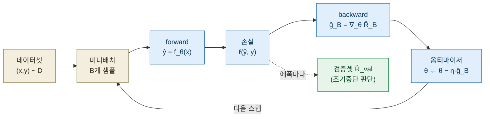
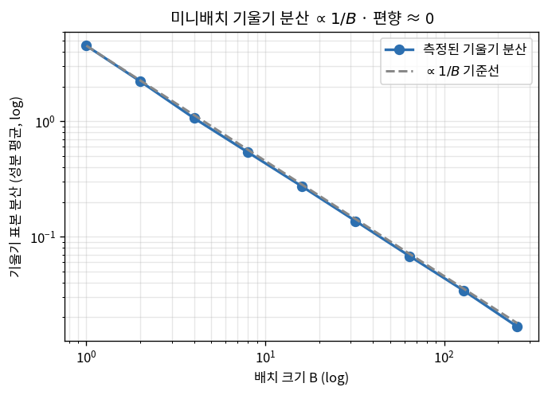
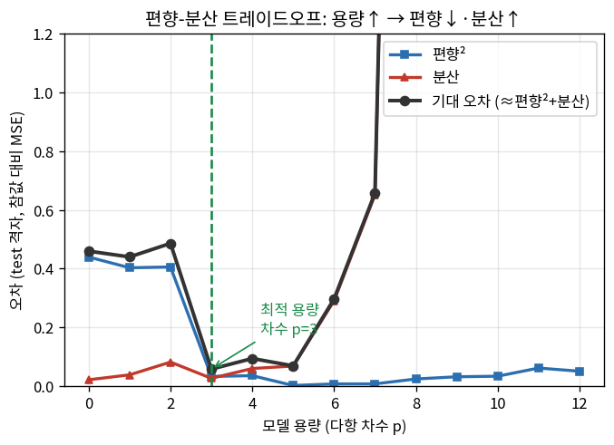
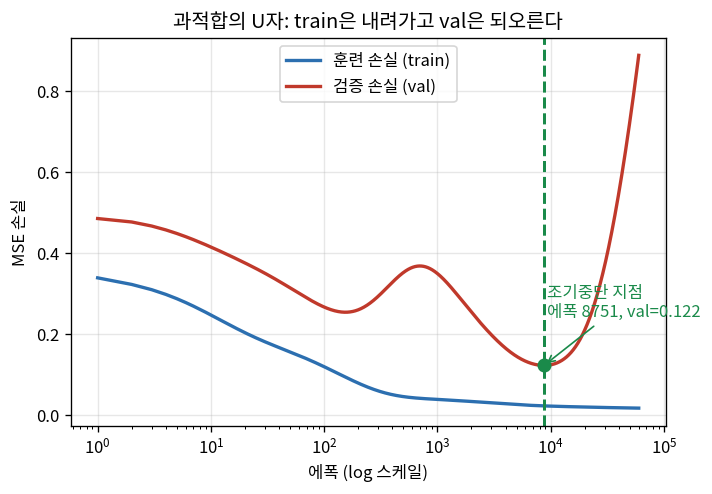
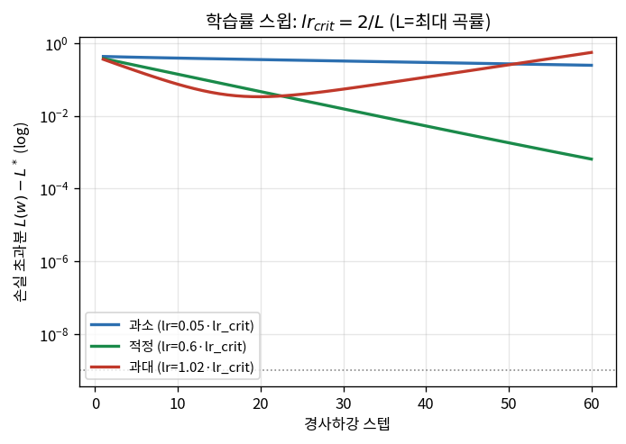

# Lec 27. 학습 파이프라인 해부

> 선수 지식: 26강(신경망=함수근사, ∇의 의미). 관련: 7강(DLS 댐핑 λ=정칙화), 17강(학습률↔안정성), 57강(벤치마크 과적합·포화), 60강(시스템 식별의 과적합).

## 한 장 요약



26강이 "무엇을 최적화하나(함수 $f_\theta$·기울기 $\nabla$)"였다면, 27강은 **"어떻게 훈련하나 — 유한한 데이터로부터 미지의 분포에 일반화하나"**다. 우리가 정말 줄이고 싶은 것은 훈련 손실이 아니라 **본 적 없는 데이터에서의 위험**이다. 그 간극(일반화 갭)을 관리하는 세 가지 도구 — 미니배치 SGD, 정칙화, 조기중단 — 이 오늘의 전부다. 그리고 마지막에: **GPU는 이 루프를 더 빠르게 돌릴 뿐, 더 똑똑하게 만들지 않는다.**

## 학습 목표

1. 경험적 위험 최소화(ERM)와 일반화 갭 $R-\hat R$을 정의하고, "훈련 손실 0"이 왜 목표가 아닌지 설명할 수 있다.
2. 미니배치 기울기가 전체 기울기의 **불편 추정**이고 그 분산이 $\propto 1/B$임을 유도·실측하고, 배치 크기·학습률·에폭의 관계를 설명할 수 있다.
3. 기대오차를 편향²+분산+노이즈로 분해하고, 모델 용량·데이터량·정칙화가 각 항을 어떻게 움직이는지 검증곡선의 U자로 설명할 수 있다.
4. L2 정칙화(릿지)가 7강의 DLS 댐핑 $\lambda$와 **같은 수식**임을 보이고, dropout·조기중단과의 관계를 말할 수 있다.
5. 순수 numpy로 학습 루프(train/val 분할·에폭별 손실·조기중단)를 구현하고, 데이터량·용량을 바꿔 과적합을 수치로 재현할 수 있다.

## 왜 이 강의가 필요한가

26강에서 신경망은 "파라미터 $\theta$로 접힌 함수"이고 학습은 "손실의 기울기를 따라 $\theta$를 미는 것"이었다. 그런데 여기엔 함정이 있다. 우리가 손에 쥔 것은 **유한한 데이터** $\{(x_i,y_i)\}_{i=1}^N$뿐이고, 그 위의 손실을 0까지 줄이는 것은 언제나 가능하다 — 데이터를 **외우면** 된다. 실제로 파라미터가 데이터보다 많으면(요즘 VLA는 3B 파라미터에 100만 궤적) 훈련 손실을 임의로 작게 만들 수 있다. 문제는 그렇게 외운 모델이 **새 상황에서 무너진다**는 것이다.

로봇공학자에게 이건 낯선 이야기가 아니다. 60강에서 배울 **시스템 식별**이 정확히 같은 함정을 갖는다 — 소량의 궤적 데이터에 관성 파라미터를 과하게 맞추면, 그 로봇의 그 궤적에서는 완벽하지만 새 동작에서 틀린다. 7강의 IK에서 자코비안이 특이점 근처에서 폭주할 때 **댐핑 $\lambda$**를 넣어 해를 얌전하게 만든 것도 같은 정신이다. 딥러닝의 "정칙화"는 여러분이 이미 20년 쓴 도구의 다른 이름이다.

이 강의를 수식·코드 없이 "과적합은 나쁘다, 데이터 많으면 좋다"로만 외우면 33강(파인튜닝: 소량 데이터에 3B 모델을 얹는다 — 과적합의 최전선), 41강(RL: 보상에 과적합), 57강(벤치마크 포화: 검증셋 누수)에서 무슨 일이 벌어지는지 진단할 수 없다. 오늘의 세 수식과 두 worked example은 그 진단력을 CPU numpy 토이로 심는다.

## 본문

### 1. 무엇을 최소화하는가 — 위험, 그리고 우리가 볼 수 없는 것

지도학습의 진짜 목표는 미지의 데이터 분포 $\mathcal D$ 위에서의 **기대 손실(위험)**을 낮추는 것이다:

$$
R(\theta) = \mathbb{E}_{(x,y)\sim\mathcal D}\big[\,\ell(f_\theta(x),\,y)\,\big].
$$

그런데 $\mathcal D$는 우리가 볼 수 없다 — 우리가 가진 건 그로부터 뽑힌 유한 표본뿐이다. 그래서 실제로 최소화하는 것은 그 표본 위의 **경험적 위험**:

$$
\hat R(\theta) = \frac{1}{N}\sum_{i=1}^N \ell\big(f_\theta(x_i),\,y_i\big).
$$

이 $\hat R$을 최소화하는 절차가 **경험적 위험 최소화(ERM)**다. 26강의 경사하강은 ERM의 실행기다. 그리고 우리가 정말 신경 쓰는 양은 둘의 차이:

$$
\underbrace{R(\theta) - \hat R(\theta)}_{\text{일반화 갭}}.
$$

훈련 손실 $\hat R$이 아무리 작아도, 갭이 크면 실전 위험 $R$은 크다. **훈련 손실 0은 목표가 아니라 종종 위험 신호다** — 갭이 벌어졌다는 뜻일 수 있으니까. 우리가 갭을 직접 볼 수는 없지만, $\mathcal D$에서 뽑은 **또 다른 표본(검증셋)** 위의 손실 $\hat R_{\text{val}}$로 $R$을 추정한다. 훈련셋과 검증셋의 손실이 갈라지기 시작하는 지점이 곧 갭이 벌어지는 순간이다(그림 1).

### 2. 미니배치 SGD — 왜 전부가 아니라 표본으로 미는가

$\hat R$의 기울기는 $N$개 전체에 대한 합이다: $\nabla\hat R = \frac1N\sum_i \nabla\ell_i$. $N$이 100만이면 한 스텝마다 100만 번 forward/backward를 해야 한다 — 너무 비싸다. **미니배치 SGD**는 매 스텝 $B$개($B\ll N$)를 무작위로 뽑아 기울기를 **추정**한다:

$$
\hat g_B = \frac{1}{B}\sum_{i\in\text{batch}} \nabla\ell_i, \qquad
\mathbb{E}[\hat g_B] = \nabla\hat R \;(\text{불편}), \qquad
\mathrm{Var}[\hat g_B] \propto \frac{1}{B}.
$$

핵심은 두 가지다. **불편성**: 배치를 iid로 뽑으면 그 평균 기울기의 기댓값은 정확히 전체 기울기다 — 편향이 없다. **분산 $\propto 1/B$**: 배치가 클수록 추정이 정확해지지만(분산↓), $1/B$이므로 수익이 체감한다(B를 4배 키워도 표준편차는 2배만 줄어든다). WE-1에서 이 두 성질을 직접 실측한다.

이 노이즈는 버그가 아니라 **기능**이다. 기울기에 섞인 확률적 잡음은 ① 얕은 안장점·좁은 계곡을 탈출하게 돕고, ② 암묵적 정칙화로 작동해 지나치게 날카로운 해를 피하게 한다. 그래서 "가장 정확한" 풀배치 GD가 항상 최선은 아니다.

**배치·학습률·에폭의 관계.** 에폭 하나 = 데이터 전체를 한 번 훑음 = $N/B$번의 스텝. 배치를 키우면 스텝당 계산은 늘지만 스텝 수는 줄고 기울기는 정확해진다 — 그래서 큰 배치는 보통 **더 큰 학습률**을 감당한다(노이즈가 작으니까). 17강의 언어로: 학습률은 "게인"이고, 큰 배치는 그 게인을 올려도 발진하지 않게 하는 안정성 여유를 준다. 학습률 자체의 한계(너무 크면 발산)는 그림 4·§4에서 다룬다.



*그림 2: 다항(3차) 회귀에서 배치 $B$개로 추정한 기울기의 분산(로그-로그). **파랑(측정)이 회색 점선($\propto 1/B$ 기준선)과 거의 겹친다** — 배치를 2배로 키울 때마다 분산이 거의 정확히 절반으로 준다(따라서 표준편차는 $1/\sqrt2$배). $B{=}1$에서 $B{=}256$까지 분산이 약 274배 줄어(이상적 배치 배율 256에 근접) 편향은 0에 머문다. E2·WE-1의 "$\mathrm{Var}\times B$ = 상수"를 시각화한 것 — "배치를 4배 키워도 잡음은 절반뿐"이라는 실전 규칙의 근거다. `gen_figs.py`가 6000회 재추출로 생성.*

### 3. 과적합·정칙화·조기중단 — 편향-분산의 세 손잡이

같은 모델을 오래 학습하거나 용량을 키우면 훈련 손실은 계속 내려간다. 그러나 검증 손실은 어느 순간 **바닥을 치고 되오른다**(그림 1). 이 U자가 과적합의 얼굴이다. 왜 U자인가? 기대 오차를 분해하면:

$$
\underbrace{\mathbb{E}[(\hat f - f^\ast)^2]}_{\text{기대 오차}} \;=\;
\underbrace{(\mathbb{E}[\hat f] - f^\ast)^2}_{\text{편향}^2} \;+\;
\underbrace{\mathrm{Var}[\hat f]}_{\text{분산}} \;+\;
\underbrace{\sigma^2}_{\text{줄일 수 없는 노이즈}}.
$$

- **용량↑** → 편향↓(더 유연한 함수), 분산↑(데이터 잡음까지 따라감). 그림 3의 U자.
- **데이터량↑** → 분산↓(같은 용량이라도 잡음이 평균화됨). WE-2에서 데이터 8배로 갭이 0.161→0.032로 준다.
- **정칙화 λ↑** → 분산↓·편향↑(해를 얌전하게 눌러 잡음을 덜 따라감).



*그림 3: 다항 차수 $p$(용량)를 0→12로 키우며, 300개 훈련셋 재추출로 편향²·분산·기대오차를 분해. **저용량(p≤2)은 편향이 지배**(참 함수를 못 따라감), **고용량(p≥6)은 분산이 폭발**(데이터 잡음까지 외움 — p=12에서 84까지). 검은 곡선(기대오차)이 **U자**를 그리고 그 바닥이 최적 용량 $p^\ast{=}3$(test 0.057). 그림 1이 이 U자를 시간축(에폭)에서 본 것이라면, 그림 3은 용량축에서 본 것 — 같은 편향-분산 트레이드오프의 두 얼굴이다(E3). `gen_figs.py`가 생성.*

이 세 손잡이를 다루는 실전 도구:

**L2 정칙화 (릿지) = 7강의 DLS 댐핑.** 손실에 $\lambda\lVert\theta\rVert^2$를 더한다. 선형 경우 해는 $\theta = (X^\top X + \lambda I)^{-1}X^\top y$ — **이건 7강의 damped least squares $\Delta q = J^\top(JJ^\top + \lambda^2 I)^{-1}e$와 정확히 같은 대수 구조**다. $\lambda$가 특이한 방향(작은 고유값)을 눌러 해의 폭주를 막는다. 로봇공학자는 이미 이 수식을 안다.

**Dropout.** 학습 중 뉴런을 확률 $p$로 무작위 0으로 만든다 → 앙상블 평균 효과 → 분산↓. 추론 때는 끈다.

**조기중단(early stopping).** 검증 손실이 최소가 되는 에폭에서 멈춘다(그림 1의 초록 점). 사실상 무료인 정칙화 — 학습을 덜 시킴으로써 "덜 외우게" 한다. 이것이 오늘의 가장 실용적인 도구다.



*그림 1: 15차 다항 모델을 18개 점(잡음 σ=0.22)에 경사하강으로 학습. **훈련 손실(파랑)은 단조 감소해 0.016까지** 내려가지만, **검증 손실(빨강)은 에폭 8751에서 0.122로 바닥을 친 뒤 0.888까지 되오른다**. 초록 점선이 조기중단 지점 — 여기서 멈추는 것이 최적이다. 왼쪽(에폭 초반)은 편향이 지배(둘 다 높음), 오른쪽은 분산이 지배(train은 낮은데 val은 폭발). 일반화 갭 = 두 곡선의 세로 거리. §3의 편향-분산 분해를 시간축(에폭)으로 본 그림이다. `gen_figs.py`가 생성.*

### 4. GPU가 하는 일 — 더 빠를 뿐, 더 똑똑하지 않다

위 루프의 forward/backward는 결국 **큰 행렬곱**의 연쇄다(26강: 층 = $Wx$, backward = 자코비안 곱). 미니배치는 $B$개 샘플을 한 행렬의 여러 행으로 쌓아 **하나의 큰 행렬곱**으로 만든다. GPU는 이 행렬곱을 수천 개 코어로 **병렬화**한다 — 그게 전부다.

두 개념만 기억하면 된다. **연산 강도(arithmetic intensity)** = 메모리에서 읽은 바이트당 하는 부동소수 연산 수. 행렬곱은 이 값이 높아(데이터 하나를 여러 번 재사용) GPU에 이상적이다. **처리량(throughput)** = 초당 연산 수. 큰 배치는 코어를 꽉 채워 처리량을 올린다 — 그래서 배치를 키운다.

결정적 포인트: **GPU는 같은 계산을 빠르게 할 뿐, 일반화를 개선하지 않는다.** 과적합·편향-분산·데이터 품질은 전부 GPU와 무관한 통계 문제다. "GPU를 더 사면 모델이 똑똑해진다"는 흔한 오해다 — GPU가 사는 것은 **더 많은 실험·더 큰 모델·더 많은 데이터 통과**이고, 그것이 간접적으로 도울 수는 있어도, 같은 데이터·같은 모델이면 CPU로 이틀 걸릴 학습을 2분에 끝낼 뿐 **결과의 일반화는 동일**하다. 이 강의의 모든 토이를 CPU numpy로 재현하는 이유가 이것이다.

GPU가 루프를 빠르게 돌려도, **각 스텝의 학습률은 여전히 안정성이 지배**한다 — 이건 17강 피드백 제어와 판박이다. 이차 손실에서 경사하강이 발산하지 않을 임계 학습률은 $lr_{\text{crit}} = 2/L$($L$ = 손실 곡률(헤시안)의 최대 고유값)이다. 그림 4가 이를 실측한다.



*그림 4: 같은 이차 손실에서 학습률만 바꿔 손실 초과분 $L(w)-L^\ast$의 궤적(로그). 손실 곡률 최대 고유값 $L{=}4.00$, 임계 학습률 $2/L{=}0.50$. **과소(파랑, $0.05\times lr_{\text{crit}}$)**는 60스텝에도 0.246에 머물러 느리고, **적정(초록, $0.6\times$)**은 매끄럽게 수렴(6.4×10⁻⁴), **과대(빨강, $1.02\times lr_{\text{crit}}$)**는 임계를 넘겨 발산(0.555, 되튐). 17강에서 게인을 임계 게인 $K_u$ 너머로 올리면 발진하는 것과 **정확히 같은 수식**이다 — 학습률↔게인, $2/L$↔임계 게인. "학습률을 올리다 loss가 발산해 본 적이 있다면, 사실 17강의 그림을 이미 본 것이다." `gen_figs.py`가 생성.*

### 핵심 수식

세 수식이 "유한 데이터로부터의 일반화"라는 하나의 문제를 세 각도에서 본다: **E1** 무엇을 최소화하나(ERM·일반화 갭), **E2** 어떻게 미나(미니배치 SGD의 불편성·분산), **E3** 어떻게 갭을 관리하나(편향-분산·정칙화·조기중단).

#### E1. 경험적 위험 최소화(ERM)와 일반화 갭

**① 직관**: 우리는 시험(미지 분포 $\mathcal D$)을 잘 보고 싶은데, 손에 든 건 **기출문제집**(훈련셋)뿐이다. 기출을 다 외우면(훈련 손실 0) 기출 점수는 만점이지만, 새 문제(시험)에서 무너질 수 있다. 우리가 정말 재고 싶은 것은 시험 점수 $R$인데 볼 수 있는 건 기출 점수 $\hat R$뿐 — 그 차이가 일반화 갭이다.

**② 물리·기하적 의미**: $\hat R$은 $R$의 몬테카를로 추정이다. 표본이 iid이고 충분히 많으면 **대수의 법칙**으로 $\hat R \to R$이라 갭이 작다. 문제는 우리가 $\hat R$을 **최소화하도록 $\theta$를 고른다**는 것 — 최적화가 표본의 우연한 잡음(그 훈련셋에만 있는 패턴)까지 파고들면 $\hat R$은 낮아지지만 $R$은 안 낮아진다. 이것이 갭의 원천이다. 로봇으로 치면: 특정 궤적 데이터에만 있는 측정 잡음에 관성 파라미터를 맞추는 것(60강).

**③ 형식(유도 요점)**: 위험과 경험적 위험을

$$
R(\theta) = \mathbb{E}_{(x,y)\sim\mathcal D}[\ell(f_\theta(x),y)], \qquad
\hat R(\theta) = \frac1N\sum_{i=1}^N \ell(f_\theta(x_i),y_i)
$$

로 두면, 임의 고정 $\theta$에 대해 $\mathbb{E}[\hat R(\theta)] = R(\theta)$이고 $\mathrm{Var}[\hat R] = \sigma_\ell^2/N$(표본 손실의 분산/$N$). 그러나 $\hat\theta = \arg\min_\theta \hat R(\theta)$에 대해서는 $\mathbb{E}[\hat R(\hat\theta)] \le R(\hat\theta)$ — 최적화가 훈련셋에 **낙관적 편향**을 만든다. 그래서 **독립된 검증셋**으로만 $R(\hat\theta)$를 불편 추정할 수 있다(검증셋으로 튜닝하는 순간 그것도 오염된다 → 57강 테스트 누수).

#### E2. 미니배치 SGD = 기울기의 불편 추정, 분산 $\propto 1/B$

**① 직관**: 전체 방향(참 기울기)을 알려면 $N$개 전부를 봐야 하지만, **$B$개만 봐도 방향의 좋은 추정**이 나온다 — 여론조사에서 전 국민 대신 표본 1000명을 묻는 것과 같다. 표본이 많을수록(B↑) 추정이 정확하지만, 정확도는 $1/B$로 늘어 수익이 체감한다.

**② 물리·기하적 의미**: 참 기울기는 고차원 손실 지형에서 **가장 가파른 내리막 방향**. 미니배치 기울기는 그 방향에 **잡음이 섞인 화살**이다. 잡음의 크기(분산)가 $1/B$이므로, $B=1$이면 화살이 크게 흔들리고(하지만 평균은 맞음), $B$가 크면 곧게 간다. 이 흔들림이 안장점 탈출·암묵적 정칙화를 만든다 — 17강에서 게인에 약간의 dither를 넣어 stiction을 넘는 것과 정신적으로 닮았다. 배치=편향 0·분산 유한이 SGD가 작동하는 통계적 이유다.

**③ 형식(유도 요점)**: 각 샘플 기울기 $\nabla\ell_i$를 iid 확률변수로 보면, 배치 평균 $\hat g_B = \frac1B\sum_{i\in\mathcal B}\nabla\ell_i$에 대해

$$
\mathbb{E}[\hat g_B] = \frac1B\sum \mathbb{E}[\nabla\ell_i] = \nabla\hat R \quad(\textbf{불편}),
\qquad
\mathrm{Var}[\hat g_B] = \frac{1}{B}\,\mathrm{Var}[\nabla\ell_i] \;\propto\; \frac1B.
$$

(iid 합의 분산은 분산의 합, $\frac1{B^2}\cdot B\,\mathrm{Var} = \frac1B\mathrm{Var}$.) 그래서 표준편차는 $1/\sqrt B$로 줄어 — **B를 4배 키워야 잡음이 절반**. WE-1이 이 등식을 $\mathrm{Var}\times B \approx$ 상수로 실측한다.

#### E3. 편향-분산 분해와 정칙화·조기중단

**① 직관**: 모델이 너무 단순하면(저용량) 참 함수를 못 따라가 **항상 틀린 쪽으로 틀린다**(편향). 너무 복잡하면(고용량) 데이터의 잡음까지 외워 **훈련셋마다 다르게 틀린다**(분산). 최적은 그 사이 — 검증곡선의 U자 바닥이다.

**② 물리·기하적 의미**: 여러 훈련셋을 뽑아 각각 학습시켜 보면, 저용량 모델들은 서로 비슷하게(분산↓) 그러나 참값에서 벗어나(편향↑) 예측한다. 고용량 모델들은 각자 데이터 잡음을 좇아 크게 흩어진다(분산↑). 정칙화 $\lambda$·데이터량·조기중단은 전부 이 **분산을 누르는** 손잡이다. 특히 L2는 7강 DLS와 같은 수식으로 파라미터를 원점으로 당겨 "작은 고유값 방향"의 폭주를 막는다 — 여러분이 특이점 근처 IK에서 이미 쓰는 그 댐핑.

**③ 형식(유도 요점)**: 참 $y = f^\ast(x)+\varepsilon$, $\mathbb{E}[\varepsilon]=0$, $\mathrm{Var}[\varepsilon]=\sigma^2$. 훈련셋 무작위성에 대한 예측 $\hat f(x)$의 기대 제곱오차는

$$
\mathbb{E}\big[(y-\hat f(x))^2\big] = \underbrace{(\,f^\ast(x)-\mathbb{E}[\hat f(x)]\,)^2}_{\text{편향}^2} + \underbrace{\mathrm{Var}[\hat f(x)]}_{\text{분산}} + \sigma^2.
$$

L2 정칙화 손실 $\hat R + \lambda\lVert\theta\rVert^2$의 선형해는 $\theta_\lambda = (X^\top X + \lambda I)^{-1}X^\top y$ — $\lambda$가 편향을 조금 늘리는 대가로 분산을 크게 줄인다. **조기중단**은 이 최소점을 시간축(에폭)에서 찾는 것: $e^\ast = \arg\min_e \hat R_{\text{val}}(\theta_e)$. 그림 1·3이 이 U자의 두 얼굴(시간축·용량축)이다.

### Worked Example

#### WE-1 (코드): 미니배치 기울기의 불편성과 분산 $\propto 1/B$ 실측

선형회귀 $y = Xw_{\text{true}} + \varepsilon$에서 손실 $\ell = (x\cdot w - y)^2$의 기울기는 $\nabla_w\ell = 2x(x\cdot w - y)$. 한 지점 $w_0$에서 ① 배치 기울기의 평균이 전체 기울기와 같은지(불편), ② 그 분산이 $1/B$로 주는지를 20000번 재추출로 실측한다. 핵심 검산: **$\mathrm{Var}\times B$가 B에 무관한 상수**여야 한다.

```python
import numpy as np

rng = np.random.default_rng(0)
N, d = 4000, 3
X = rng.standard_normal((N, d))
w_true = np.array([1.5, -2.0, 0.7])
y = X @ w_true + 0.5 * rng.standard_normal(N)

w0 = np.array([0.4, 0.4, 0.4])                 # 평가 지점 (최적 아님 → 기울기 ≠ 0)
g_full = (2.0 / N) * X.T @ (X @ w0 - y)         # 전체(배치=N) 기울기 = 참 기울기
print("g_full =", np.round(g_full, 4))          # [-2.3755  4.6911 -0.5799]

sampler = np.random.default_rng(42)
reps = 20000
print(f"{'B':>4} | {'bias':>10} | {'var':>9} | {'var*B':>7}")
for B in [1, 4, 16, 64]:
    G = np.empty((reps, d))
    for t in range(reps):
        idx = sampler.integers(0, N, B)          # iid 복원추출
        Xb, yb = X[idx], y[idx]
        G[t] = (2.0 / B) * Xb.T @ (Xb @ w0 - yb) # 배치 기울기
    bias = np.linalg.norm(G.mean(0) - g_full)    # 불편성: E[g_B] = g_full
    var = G.var(0).mean()                         # 성분별 분산의 평균
    print(f"{B:>4} | {bias:>10.4e} | {var:>9.4f} | {var*B:>7.3f}")
# 출력:
#    B |       bias |       var |   var*B
#    1 | 5.0298e-02 |   37.4727 |  37.473
#    4 | 3.7313e-02 |    9.4415 |  37.766
#   16 | 2.4351e-02 |    2.3290 |  37.263
#   64 | 7.2101e-03 |    0.5841 |  37.383
```

두 성질이 눈에 보인다. **불편성**: `bias`(배치 기울기 평균과 전체 기울기의 거리)가 $5.0\times10^{-2}$에서 $B{=}64$일 때 $7.2\times10^{-3}$로 — 0에 가깝고 표본이 많을수록 작아진다(추정오차 $\propto 1/\sqrt{\text{reps}\cdot B}$). **분산 $\propto 1/B$**: `var`가 $37.5\to9.4\to2.3\to0.58$로 B를 4배 할 때마다 ¼로 줄고, 그래서 **`var*B`는 37.3~37.8로 사실상 상수**다. 이것이 E2의 $\mathrm{Var}\times B = \mathrm{Var}[\nabla\ell_i]$ = 상수를 그대로 재현한 것 — "배치를 4배 키워도 기울기 잡음(표준편차)은 절반만 준다"는 실전 규칙의 근거다.

#### WE-2 (코드): 바닥부터 학습 루프 — 과적합과 조기중단을 수치로

순수 numpy로 2층 tanh MLP를 짜고(재현성), 미니배치 SGD로 학습한다. train/val을 나누고 에폭별 손실을 기록해, **(A) 소량 데이터에서 과적합**을 재현하고 **(B) 데이터를 8배로 늘려 일반화 갭이 줄어드는 것**을 수치로 본다. 참 함수는 $g(x)=\sin(2x)+0.3x$.

```python
import numpy as np

def g(x): return np.sin(2*x) + 0.3*x

def split_data(n_tr, n_va, noise, seed):
    r = np.random.default_rng(seed)
    xtr = r.uniform(-3, 3, n_tr); ytr = g(xtr) + noise*r.standard_normal(n_tr)
    xva = r.uniform(-3, 3, n_va); yva = g(xva) + noise*r.standard_normal(n_va)
    return xtr, ytr, xva, yva

def init_mlp(H, seed):
    r = np.random.default_rng(seed)
    return {'W1': r.standard_normal((1, H))*0.7, 'b1': np.zeros(H),
            'W2': r.standard_normal((H, 1))*0.7, 'b2': np.zeros(1)}

def forward(p, x):
    a1 = np.tanh(x[:, None] @ p['W1'] + p['b1'])   # 은닉 (n,H)
    return (a1 @ p['W2'] + p['b2'])[:, 0], a1

def loss(p, x, y):
    yp, _ = forward(p, x); return np.mean((yp - y)**2)

def grads(p, x, y):                                 # 손수 짠 역전파 (26강의 연쇄법칙)
    n = x.size; yp, a1 = forward(p, x)
    dout = (2.0/n) * (yp - y)[:, None]              # ∂L/∂out
    gW2 = a1.T @ dout; gb2 = dout.sum(0)
    dz1 = (dout @ p['W2'].T) * (1 - a1**2)          # tanh' = 1 - tanh²
    gW1 = x[:, None].T @ dz1; gb1 = dz1.sum(0)
    return {'W1': gW1, 'b1': gb1, 'W2': gW2, 'b2': gb2}

def train(H, n_tr, noise=0.25, epochs=1500, lr=0.03, B=8, seed_d=1, seed_w=2):
    xtr, ytr, xva, yva = split_data(n_tr, 500, noise, seed_d)
    p = init_mlp(H, seed_w); r = np.random.default_rng(123)
    tr_h, va_h = [], []
    for e in range(epochs):
        idx = r.permutation(n_tr)                    # 에폭마다 셔플
        for s in range(0, n_tr, B):                 # 미니배치 SGD
            bi = idx[s:s+B]; gr = grads(p, xtr[bi], ytr[bi])
            for k in p: p[k] -= lr*gr[k]            # θ ← θ − lr·ĝ_B
        tr_h.append(loss(p, xtr, ytr)); va_h.append(loss(p, xva, yva))
    tr_h, va_h = np.array(tr_h), np.array(va_h)
    return tr_h, va_h, int(np.argmin(va_h))         # 조기중단 = argmin val

trA, vaA, eA = train(H=40, n_tr=15)                 # A: 고용량·소량 → 과적합
trB, vaB, eB = train(H=40, n_tr=120)                # B: 같은 용량, 데이터 8배
print(f"[A N=15 ] e*={eA} val@e*={vaA[eA]:.4f} tr@end={trA[-1]:.4f} "
      f"val@end={vaA[-1]:.4f} gap={vaA[-1]-trA[-1]:.4f}")
print(f"[B N=120] e*={eB} val@e*={vaB[eB]:.4f} tr@end={trB[-1]:.4f} "
      f"val@end={vaB[-1]:.4f} gap={vaB[-1]-trB[-1]:.4f}")
# 출력:
# [A N=15 ] e*=1262 val@e*=0.1813 tr@end=0.0770 val@end=0.2376 gap=0.1606
# [B N=120] e*=1464 val@e*=0.0929 tr@end=0.1023 val@end=0.1342 gap=0.0319
```

**A(N=15)**: 훈련 손실은 0.077까지 내려가는데 검증 손실은 에폭 1262에서 0.181로 바닥을 친 뒤 0.238로 되오른다 — 일반화 갭 **0.161**. 조기중단 지점 $e^\ast=1262$가 코드로 나온다. **B(N=120, 데이터 8배)**: 같은 용량인데 갭이 **0.032**로 5배 줄었다 — "데이터를 늘리면 분산(따라서 갭)이 준다"(E3)를 그대로 확인. 만약 "데이터 많으면 과적합 없다"가 참이라면 B의 갭이 0이어야 하지만 0.032가 남는다 — 완전히 사라지진 않고 **작아질 뿐**이다(흔한 오해 2). 이 루프의 `grads`는 26강에서 배운 연쇄법칙 역전파를 손으로 짠 것이고, PyTorch 버전은 실습에서 자동미분으로 대체한다.

### 로봇공학자를 위한 번역

| 딥러닝 개념 | 로봇/제어의 대응 | 강의 |
|---|---|---|
| L2 정칙화 $\lambda\lVert\theta\rVert^2$, 릿지 | DLS 댐핑 $\lambda$ ($JJ^\top+\lambda^2 I$)$^{-1}$ | 7 |
| 과적합 (소량 데이터에 고용량) | 소량 궤적에 관성 파라미터 과적합 (시스템 식별) | 60 |
| 학습률↔발산 | 피드백 게인↔안정성 여유·지연 | 17 |
| 미니배치 기울기 잡음 | 게인 dither로 stiction 넘기, 확률적 탐색 | 17 |
| 조기중단 | "충분히 좋을 때 튜닝 멈추기"(과적합된 게인 스케줄 회피) | 17,60 |
| 검증셋으로 하이퍼파라미터 선택 | held-out 궤적으로 모델 검증 (train셋 재사용 금지) | 60 |

핵심 번역 하나만 새기면: **정칙화는 딥러닝의 발명이 아니다.** 여러분은 특이점 근처 IK에서 자코비안이 폭주할 때 이미 댐핑 $\lambda$를 넣어 왔다. 딥러닝의 릿지·조기중단·dropout은 전부 "유한한 노이즈 데이터에 유연한 모델을 맞출 때 폭주를 막는" 같은 문제의 도구다. GPU가 하는 것도 새롭지 않다 — 자코비안·관성행렬 곱을 대규모로 병렬화하는 것과 같은 행렬 연산의 가속일 뿐이다.

## 흔한 오해

1. **"훈련 손실 0이 목표다."** 아니다(E1). 목표는 미지 분포에서의 위험 $R$이고, $\hat R{=}0$은 종종 일반화 갭이 벌어졌다는 위험 신호다. WE-2 A에서 train 0.077로 내려갈수록 val은 0.238로 올랐다. **우리가 보는 건 기출 점수, 원하는 건 시험 점수**다.

2. **"데이터가 많으면 과적합은 없다."** 틀렸다. 데이터량↑은 분산(갭)을 **줄일 뿐** 0으로 만들지 않는다 — WE-2 B에서 8배 데이터로도 갭 0.032가 남았다. 게다가 **분포 이동**(sim→real, 새 로봇)이 있으면 데이터가 아무리 많아도 훈련 분포 밖에서 무너진다. 33강 파인튜닝·51강 sim-to-real의 핵심 난제다.

3. **"GPU가 모델을 더 똑똑하게 만든다."** 아니다(§4). GPU는 같은 행렬곱을 **더 빠르게** 할 뿐 — 일반화·편향-분산·데이터 품질은 GPU와 무관한 통계 문제다. GPU가 사는 것은 속도(→ 더 많은 실험·더 큰 모델을 **시도**할 여유)이고, 같은 데이터·같은 모델이면 CPU 결과와 일반화가 동일하다. 이 강의 전체를 CPU로 재현하는 이유.

4. **"검증셋으로 하이퍼파라미터를 고르는 건 테스트나 마찬가지다."** 미묘하게 틀렸다. 검증셋으로 **여러 번 선택**하면 그 검증셋에도 서서히 과적합된다(정보 누수) — 그래서 최종 평가는 **한 번도 안 본 테스트셋**으로 해야 한다. 검증셋을 수백 번 들여다보며 튜닝하면 그건 사실상 테스트셋을 훈련에 쓴 것이다. 57강 벤치마크 포화·리더보드 과적합이 정확히 이 현상이다.

5. **"정칙화는 딥러닝 전용 트릭이다."** 아니다(로봇공학자를 위한 번역). L2 릿지 $=(X^\top X+\lambda I)^{-1}X^\top y$는 7강 DLS 댐핑과 **같은 수식**이고, 여러분은 특이점 근처 IK에서 이미 20년 써 왔다. 조기중단·dropout도 "노이즈 데이터에 유연한 모델을 맞출 때 폭주를 막는" 같은 문제의 변주다.

## 실습 (약 1.5~2시간)

**A안 (CPU만, 추천): WE-2를 PyTorch로 다시 쓰고 정칙화를 실험.** WE-2의 numpy MLP를 `torch.nn.Sequential`(Linear-Tanh-Linear)로 옮기고 `torch.optim.SGD`로 학습한다. 자동미분(`loss.backward()`)이 손수 짠 `grads`를 대체함을 확인. 그 뒤 ① weight decay(=L2 λ)를 0/1e-3/1e-1로 스윕해 검증곡선 U자 바닥이 이동하는지, ② `nn.Dropout(0.3)`을 넣어 갭이 주는지, ③ 조기중단을 "val이 K에폭 연속 안 좋아지면 멈춤(patience)"으로 구현해 본다. GPU 불필요(모델이 작다).

```python
# 실습 골격 (설명용 — 세부는 직접 채운다)
import torch, torch.nn as nn
net = nn.Sequential(nn.Linear(1,40), nn.Tanh(), nn.Linear(40,1))
opt = torch.optim.SGD(net.parameters(), lr=0.03, weight_decay=1e-3)  # weight_decay = L2 λ
# for epoch: for minibatch: opt.zero_grad(); loss=((net(xb)-yb)**2).mean(); loss.backward(); opt.step()
# 에폭마다 val 손실 기록 → argmin이 조기중단 지점
```

**B안 (심화): 학습률·배치 스윕으로 그림 2·4를 직접 재현.** `gen_figs.py`의 fig2(분산∝1/B)·fig4(학습률 스윕)를 열어 배치 크기·학습률을 바꿔 가며 "언제 발산하는가"의 임계 학습률 $lr_{\text{crit}}=2/L$($L$=손실 곡률 최대 고유값)을 실측한다. 17강의 임계 게인과 같은 계산임을 확인.

## Claude와 토론할 질문

1. WE-2 B에서 데이터를 8배로 늘려도 갭이 0.032 남았다. 이 잔여 갭을 더 줄이려면 무엇을 바꿔야 하나 — 데이터, 용량, 정칙화 중? 각각의 예상 효과를 편향-분산으로 설명하라.
2. 배치 크기를 키우면 기울기가 정확해지는데(분산↓), 왜 실무에서 무작정 큰 배치를 안 쓰는가? (힌트: 노이즈의 정칙화 효과, 메모리, 스텝당 정보량.)
3. L2 정칙화가 7강 DLS 댐핑과 같은 수식이라면, 로봇 IK에서 λ를 키울 때 생기는 현상(느린 수렴·경로 이탈)은 딥러닝에서 무엇에 대응하는가?
4. "검증 손실이 최소인 에폭에서 멈춘다"는 조기중단은, 그 검증셋을 여러 실험에 재사용하면 왜 서서히 오염되는가? 이걸 막는 실무 관행은? (57강 예고 — 먼저 스스로 가설을.)
5. 33강 파인튜닝은 소량(수십~수백) 시연으로 3B 모델을 조정한다. 오늘의 과적합 관점에서 이게 왜 위험하고, 어떤 도구(정칙화·조기중단·LoRA)로 방어하는가?
6. GPU가 일반화를 개선하지 않는다면, 왜 큰 모델·큰 데이터가 실제로 성능을 올리는가? "GPU가 사는 것"과 "일반화를 만드는 것"을 분리해 설명하라.
7. WE-1에서 `var*B`가 상수임을 봤다. 만약 배치를 iid가 아니라 **연속된 시간 궤적에서** 뽑으면(로봇 데이터의 흔한 상황) 이 분산 공식이 왜 깨지는가? (힌트: 샘플 간 상관.)

## 읽을거리

1. **Goodfellow, Bengio, Courville, *Deep Learning*, Ch.5(머신러닝 기초)와 Ch.7(정칙화) 앞부분** (deeplearningbook.org, 무료): 5.2 용량·과적합, 5.4 편향-분산, 7.1 L2/L1, 7.8 조기중단만. 오늘 수식의 표준 레퍼런스.
2. **CS231n 강의노트 "Optimization"·"Neural Networks 3"**: 미니배치 SGD·학습률·정칙화의 실무 감각. 그림 위주로 (~30분).
3. **A. Karpathy, "Neural Networks: Zero to Hero" 1~2편(micrograd)**: 역전파와 학습 루프를 바닥부터 — WE-2와 같은 정신. 코드를 따라 치며 (~1시간, 선택).

## 자가 점검

1. $R$, $\hat R$, 일반화 갭을 수식으로 쓰고, "훈련 손실 0이 목표가 아닌" 이유를 한 문장으로 말할 수 있는가?
2. 미니배치 기울기가 불편이고 분산이 $1/B$임을 유도하고, "B를 4배 키우면 잡음은 절반"의 근거($1/\sqrt B$)를 말할 수 있는가?
3. 기대오차를 편향²+분산+노이즈로 분해하고, 용량↑·데이터↑·λ↑가 각 항을 어디로 움직이는지 표로 채울 수 있는가?
4. L2 정칙화 해 $(X^\top X+\lambda I)^{-1}X^\top y$가 7강 DLS와 같은 구조임을 보이고, λ의 역할을 두 분야 언어로 말할 수 있는가?
5. 그림 1의 U자에서 조기중단 지점을 짚고, 그 왼쪽·오른쪽이 각각 편향·분산 중 무엇이 지배하는지 말할 수 있는가?
6. "GPU가 모델을 똑똑하게 만든다"가 왜 틀렸는지, GPU가 실제로 사는 것이 무엇인지 구분할 수 있는가?
7. WE-2에서 데이터를 8배 늘렸을 때 갭이 0.161→0.032로 준 것을, 편향-분산 중 어느 항의 변화로 설명하는가? 왜 0이 되지 않는가?

## 참고문헌

> 본문 수치·주장의 출처. 웹 문서는 2026-07-09 접속 기준. 개념 정의는 표준 교재를, 재현 수치는 아래 재현성 각주 참조.

[1] I. Goodfellow, Y. Bengio, A. Courville, *Deep Learning*, MIT Press, 2016. https://www.deeplearningbook.org
— **뒷받침**: 위험/경험적 위험·ERM(Ch.5.2), 편향-분산 분해(Ch.5.4), L2/L1 정칙화(Ch.7.1), 조기중단(Ch.7.8), 미니배치 SGD의 불편성·분산(Ch.8.1). 오늘 E1·E2·E3의 표준 정의.

[2] D. Kingma, J. Ba, "Adam: A Method for Stochastic Optimization," arXiv:1412.6980, 2014.12. https://arxiv.org/abs/1412.6980
— **뒷받침**: 미니배치 확률적 최적화의 표준 옵티마이저(실습 A안의 옵티마이저 배경). 기울기의 불편 추정 위에서 적응적 학습률을 얹는다는 §2의 논지.

[3] N. Srivastava, G. Hinton, A. Krizhevsky, I. Sutskever, R. Salakhutdinov, "Dropout: A Simple Way to Prevent Neural Networks from Overfitting," JMLR 15, 2014. https://jmlr.org/papers/v15/srivastava14a.html
— **뒷받침**: dropout이 앙상블 평균으로 분산을 줄이는 정칙화임(§3, 흔한 오해 5, 실습 A안).

[4] S. Ioffe, C. Szegedy, "Batch Normalization: Accelerating Deep Network Training by Reducing Internal Covariate Shift," arXiv:1502.03167, 2015.2. https://arxiv.org/abs/1502.03167
— **뒷받침**: 미니배치 통계를 학습 안정화에 쓰는 실무 기법(§2 배치·학습률 관계의 배경, 2차적).

[5] A. Karpathy, "Neural Networks: Zero to Hero" (micrograd), 2022. https://github.com/karpathy/micrograd · https://karpathy.ai/zero-to-hero.html
— **뒷받침**: WE-2의 바닥부터 학습 루프(수동 역전파·미니배치)의 교육적 원형. 읽을거리 3.

[6] Stanford CS231n, "Convolutional Neural Networks for Visual Recognition" 강의노트(Optimization·Neural Networks 3). https://cs231n.github.io/
— **뒷받침**: 미니배치 SGD·학습률 스윕·정칙화의 실무 감각(§2·§4, 읽을거리 2, 2차 교육자료).

*수치 재현성: 본문·캡션·코드 주석의 모든 수치는 `images/lec27/gen_figs.py`와 두 Worked Example 코드 블록을 CPU에서 실행한 출력이다(numpy 1.26 / scipy 1.15 / matplotlib 3.5, 시드 `default_rng` 고정). 구체적으로 — 그림 1: 15차 다항·N=18, 조기중단 e*=8751·val 0.122·train@end 0.016·val@end 0.888. 그림 2: 미니배치 분산이 배치 B=1..256에서 var×B 근사 상수(1/B 스케일). 그림 3: 편향-분산 U자, 최적 차수 p*=3·test 최소 0.057, 고차수에서 분산 폭발(p=12에서 84). 그림 4: 손실 곡률 최대 고유값 L=4.00·임계 학습률 2/L=0.50, 과소/적정/과대 학습률의 최종 손실초과분 0.246/6.4e-4/0.555(과대는 발산). WE-1: 전체 기울기 [-2.376, 4.691, -0.580], 배치 기울기 분산 37.5/9.4/2.3/0.58(B=1/4/16/64), var×B ≈ 37.3~37.8 상수·bias 5e-2→7e-3. WE-2: N=15에서 e*=1262·gap 0.161, N=120에서 gap 0.032. **이 토이들은 개념 재현용 CPU 시뮬레이션이며 실제 대형 모델·GPU 학습이 아니다** — 실제 VLA의 학습 규모·과적합 양상은 33·43·44강의 1차 출처를 참조.*

<!-- lecture-nav -->

---

⬅ 이전: [Lec 26. 신경망 = 함수 근사기](lec26-neural-networks-function-approximation.md)　｜　[📖 전체 목차](../README.md)　｜　다음: [Lec 28. CNN과 시각 표현](lec28-cnn-visual-representations.md) ➡
