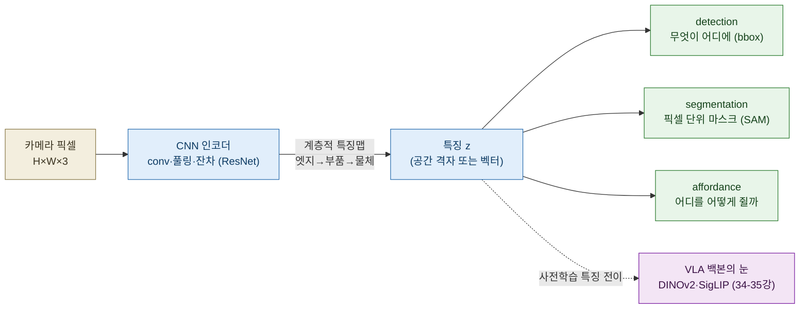
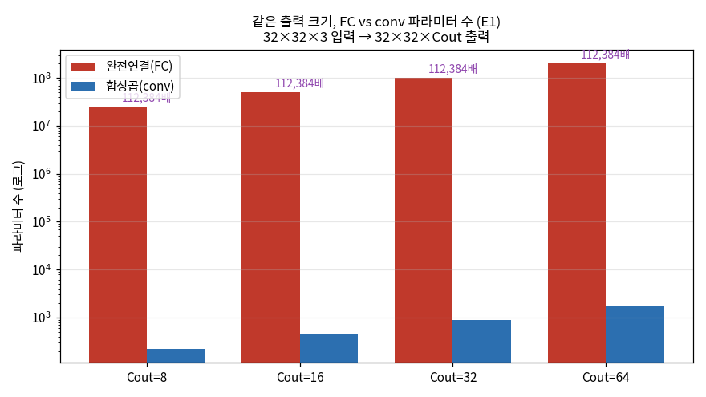
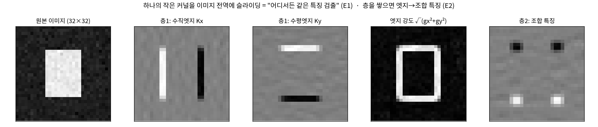
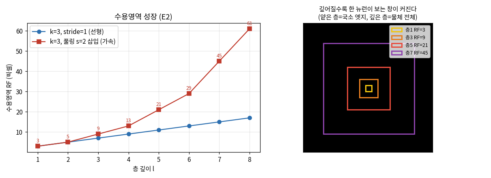
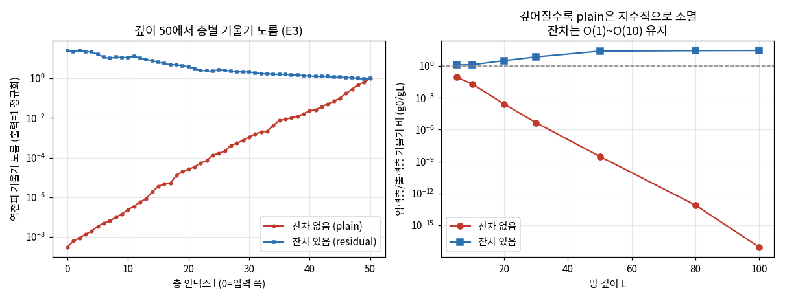

# Lec 28. CNN과 시각 표현

> 선수 지식: 26강(신경망=함수근사), 27강(학습 파이프라인·역전파). 5강(자코비안=연쇄법칙)을 떠올리면 E3가 쉽다. 이 강의는 Part 6(딥러닝 기초)의 ★ 정점이자, Part 8(34강 ViT · 35강 SigLIP · 36강 VLM 백본)과 VLA 백본으로 가는 다리다.

## 한 장 요약



CNN은 **로봇의 눈**이다 — 하나의 작은 필터를 이미지 전역에 슬라이딩해(가중치 공유) 엣지 같은 국소 특징을 뽑고, 층을 쌓아 그것을 부품·물체로 조합한다. ImageNet으로 사전학습한 이 특징이 detection·segmentation·affordance로, 그리고 VLA 백본의 시각 인코더로 그대로 전이된다.

## 학습 목표

1. 합성곱을 "가중치 공유·희소 선형연산"으로 정의하고, 그로부터 **평행이동 등변성**과 FC 대비 파라미터 급감을 설명·유도할 수 있다.
2. 수용영역(receptive field)이 깊이에 따라 성장하는 식 $RF_l = RF_{l-1}+(k_l-1)\prod_{i<l}s_i$을 쓰고, 얕은 층=엣지·깊은 층=물체라는 계층적 특징을 설명할 수 있다.
3. 잔차연결 $y=x+F(x)$가 왜 아주 깊은 망을 가능케 했는지 $\partial y/\partial x = I + \partial F/\partial x$로 유도하고, 26강 역전파의 vanishing gradient 문제와 연결할 수 있다.
4. ImageNet 사전학습 특징이 하위 태스크로 전이되는 이유를 "특징 재사용"으로 설명하고, VLA 백본이 왜 사전학습 인코더(DINOv2·SigLIP)를 쓰는지 말할 수 있다.
5. Sobel conv·등변성·잔차 기울기 보존을 numpy 토이로 재현하고, 실제 수치로 검증할 수 있다.

## 왜 이 강의가 필요한가

VLA는 결국 픽셀을 먹고 행동을 뱉는다(42~47강). 그 첫 관문 — **픽셀에서 행동에 쓸 특징을 뽑는 층** — 이 바로 이 강의다. 이걸 모르면 "왜 π0는 SigLIP을, GR00T는 DINOv2를 백본으로 쓰는가"(34~36강), "왜 로봇 카메라는 RGB만으로도 충분한가"(49강), "detection·segmentation·affordance가 조작 정책과 무슨 관계인가"를 원리로 설명할 수 없다.

26강에서 신경망이 임의 함수를 근사할 수 있음(만능근사)을 봤지만, 완전연결(FC)로 이미지를 먹으면 파라미터가 폭발한다 — 아래에서 **32×32 입력 한 장에 5천만 파라미터**가 나온다. 합성곱은 두 가지 사전지식(prior)으로 이 폭발을 막는다: **국소성**(가까운 픽셀끼리 관계 있다)과 **평행이동 불변성**(고양이는 어디 있든 고양이다). 이 두 prior가 왜 이미지에 딱 맞는지, 그리고 그 대가(회전에는 등변이 아님)가 무엇인지를 손으로 만져 봐야 34강 ViT가 이 prior를 어떻게 버리고 무엇으로 대체하는지가 보인다. 제어 배경자에게 이 강의는 특히 친숙하다 — 합성곱은 결국 **공간 위의 FIR 필터(임펄스 응답과의 상관)**이고, 역전파의 기울기 소멸은 **다단 곱셈 시스템의 게인 누적**이다.

## 본문

### 1. 합성곱이라는 아이디어 — FIR 필터를 이미지에

관절 하나의 위치 신호를 이동평균으로 매끈하게 만들어 본 적이 있다면, 합성곱은 이미 아는 연산이다. 1D에서 $(x*k)[n]=\sum_m x[n-m]k[m]$ — 커널 $k$를 신호 위로 밀며 곱해 더하는 FIR 필터. 이미지는 이걸 2D로 올린 것뿐이다. 딥러닝 CNN이 관습적으로 쓰는 것은 정확히는 **상관(cross-correlation)** $(I\star K)[i,j]=\sum_m\sum_n I[i+m,j+n]K[m,n]$이지만(커널을 뒤집지 않음), 학습으로 커널을 배우므로 뒤집힘 여부는 무의미하다. 핵심은 셋이다:

- **가중치 공유**: 같은 커널 하나를 이미지 전 위치에 쓴다 → "어디서든 같은 특징을 검출".
- **국소 수용영역**: 각 출력은 입력의 작은 창(예: 3×3)만 본다 → 희소 연결.
- **다채널**: 커널을 여러 개 두면 각자 다른 특징(수직엣지·수평엣지·코너…)을 잡는 특징맵 여러 장.

이 셋이 FC의 "모든 픽셀 ↔ 모든 출력" 조밀 연결을 **국소·공유**로 바꾸고, 그 결과가 파라미터 급감과 등변성이다. 그 급감이 얼마나 극적인지는 아래 그림 3이 한눈에 보여준다.



*그림 3: 같은 출력 텐서($32{\times}32{\times}C_{out}$)를 내는 데 드는 파라미터 수(로그 축). FC는 입력·출력 픽셀 수의 곱으로 폭발($C_{out}{=}16$에서 5034만)하지만, conv은 커널 크기에만 의존해 위치 수와 무관($448$)하다 — **112,384배** 차이(E1·WE-1b). 이 급감이 바로 "이미지에 FC를 쓰지 않는" 이유이며, 커널 하나를 전역에 공유한 대가로 얻는다. `gen_figs.py`로 생성.*



*그림 1: 32×32 토이 장면(밝은 사각형 물체 + 소량 센서 잡음)에 커널을 슬라이딩한 결과. 층1의 Sobel 수직/수평 커널은 물체의 세로/가로 경계를, 엣지 강도 $\sqrt{g_x^2+g_y^2}$는 윤곽 전체를 잡는다(얕은 층 = 엣지). 층2는 층1 특징을 다시 조합해 **코너 근처에 반응**한다(깊은 층 = 조합적 특징, E2). 커널을 사람이 손으로 준 것(Sobel)이지만, 학습된 CNN의 1층 커널도 이와 거의 같은 엣지/색 대비 검출기로 수렴한다는 것이 AlexNet 이래의 관찰이다. `images/lec28/gen_figs.py`로 생성.*

### 2. 계층적 특징과 수용영역 성장

CNN이 강력한 진짜 이유는 층을 쌓을 때 나온다. 1층 뉴런은 3×3 창(엣지)만 보지만, 2층 뉴런은 "1층 출력의 3×3"을 보므로 결국 **입력의 5×5**를 본다. 이 "한 뉴런이 보는 입력 창"이 수용영역(RF)이고, 깊어질수록 커진다 — 얕은 층은 엣지·코너 같은 국소 특징, 깊은 층은 그것들을 조합한 부품·물체를 본다. 이 조합 계층이 "고양이 = (귀 + 눈 + 털)의 배치"를 학습으로 세우는 방식이다.



*그림 2: (좌) 수용영역이 깊이에 따라 성장. $k=3$·stride 1만 쌓으면 RF가 $3,5,7,\dots,17$로 **선형** 성장하지만, 풀링(stride 2)을 끼우면 $3,5,9,13,21,29,45,61$로 **가속**된다 — 스트라이드가 곱해져 뒤쪽 층의 한 걸음이 원본에서 여러 픽셀이 되기 때문이다(E2). (우) 같은 것을 이미지 위 창 크기로: 층1은 3px 창(국소 엣지), 층7은 45px 창(물체 전체). ImageNet 해상도(224px)에서 물체를 통째로 보려면 이 RF 성장이 필수다. `gen_figs.py`로 생성.*

### 3. 왜 아주 깊어질 수 있었나 — 잔차연결과 ResNet

RF 논리대로면 "무조건 깊게" 쌓으면 될 것 같다. 그러나 2015년 이전에는 **깊게 쌓을수록 오히려 나빠지는 열화(degradation)** 가 관찰됐다 — 과적합이 아니라 훈련 오차 자체가 커졌다. 원인은 26강에서 본 **기울기 소멸(vanishing gradient)**: 역전파는 층마다 야코비안을 곱하는데(5강의 연쇄법칙), 각 곱의 게인이 1보다 작으면 앞쪽 층으로 갈수록 기울기가 지수적으로 죽는다. 제어 감각으로는 다단 곱셈 시스템의 루프 게인이 누적 감쇠하는 것과 같다.

He 등(2015)의 처방은 놀랄 만큼 단순하다: 블록의 출력을 $F(x)$ 대신 $y=x+F(x)$로 둔다(**항등 지름길**). 그러면 야코비안이 $\partial y/\partial x = I + \partial F/\partial x$가 되어, $\partial F/\partial x$가 아무리 작아도 **$+I$가 살아 있어** 기울기가 그대로 뒤로 흐른다. 곱셈 사슬에 덧셈 경로 하나를 뚫은 것이다. 이 한 줄로 152층 ResNet이 ImageNet을 갈아치웠고, 이 **residual stream**은 이후 Transformer(31·44강)에도 그대로 이식됐다 — 44강 π0 백본의 잔차 흐름이 정확히 이것이다.



*그림 4: (좌) 깊이 50 망에서 층별 역전파 기울기 노름(출력=1로 정규화). 잔차 없음(plain, 빨강)은 입력 쪽으로 갈수록 $10^{-9}$까지 지수적으로 소멸하는데, 잔차 있음(residual, 파랑)은 $O(1)$~$O(10)$을 유지한다. (우) 깊이를 늘리며 입력층/출력층 기울기 비 $g_0/g_L$: plain은 깊이 100에서 $\sim10^{-17}$로 사실상 학습 신호가 앞층에 도달하지 못하는데, 잔차는 $\sim29$로 안정. 이것이 "깊으면 항상 낫다"가 잔차 없이는 거짓인 이유이자, $y=x+F(x)$의 $+I$가 하는 일이다(E3·WE-2). `gen_figs.py`로 생성.*

### 4. 사전학습과 전이 — 왜 남의 특징을 빌려 쓰는가

ImageNet(Deng 2009, 1000클래스·약 128만 장)으로 훈련한 CNN의 앞~중간 층은 "일반적인 시각 특징"(엣지·질감·부품)을 배운다 — 이건 고양이 분류에만 쓸모 있는 게 아니라 **거의 모든 시각 태스크의 공통 어휘**다. 그래서 새 태스크(예: 로봇 그리핑)에서 데이터가 적어도, 사전학습 가중치로 초기화하고 뒤쪽만 미세조정하면 특징을 처음부터 배울 필요가 없다. 이것이 **전이학습**이고, 핵심은 "그냥 좋은 초기화"가 아니라 **특징 재사용**이다 — 소량 데이터로는 결코 못 배울 저수준 특징을 대량 데이터가 대신 세워 준다.

VLA로 오면 이 논리가 백본 선택을 지배한다. π0·OpenVLA·GR00T는 시각 인코더를 로봇 데이터로 처음 학습하지 않고 **웹 스케일 사전학습 인코더**를 쓴다: **DINOv2**(자기지도, 기하·대응에 강함)와 **SigLIP**(이미지-텍스트 대조학습, 의미·언어 정렬에 강함, 35강). 로봇 데이터는 비싸고 적으니, 시각 어휘는 웹에서 빌려 오고 정책만 로봇 데이터로 얹는 것이다(37강 모방학습의 데이터 병목과 직결).

### 5. detection · segmentation · affordance — 조작의 시각 기반

같은 CNN 특징 $z$ 위에 헤드만 바꾸면 조작에 필요한 세 질문에 답한다:

- **detection**: "무엇이 어디에" — 물체별 경계상자(bbox)와 클래스. 집을 물체를 찾는 첫 단계.
- **segmentation**: "픽셀 단위로 어디까지" — 물체 마스크. **SAM**(Kirillov 2023)은 프롬프트(점·상자)로 임의 물체를 분할하는 파운데이션 모델로, 로봇이 "이 물체"의 경계를 정확히 얻게 해 준다.
- **affordance**: "어디를 어떻게 쥘까" — 잡기 가능한 지점·자세. 픽셀에서 **행동 가능성**을 읽는 것으로, detection/segmentation보다 조작에 더 직접적이다.

이 셋이 "무엇을·어디서·어떻게 쥘까"의 시각 기반이다. 그리고 이 계보의 원류가 Levine 등(2016)의 **픽셀→토크 end-to-end 학습**이다 — 별도의 detection·pose 추정 파이프라인 없이 CNN이 픽셀에서 곧장 모터 토크로 가는 시각운동 정책을 학습해, "특징을 사람이 설계하지 않는다"는 VLA의 근본 태도를 처음 보였다.

### 핵심 수식

세 수식이 CNN의 뼈대다: **E1** 합성곱(가중치 공유 → 등변성·파라미터 급감), **E2** 수용영역 성장(계층적 특징), **E3** 잔차연결(깊이의 벽을 넘음).

#### E1. 합성곱 = 가중치 공유·희소 선형연산 → 평행이동 등변성

**① 직관**: 하나의 필터를 이미지 전역에 슬라이딩한다 = "어디서든 같은 특징을 검출한다". FC가 위치마다 다른 가중치를 쓰는 것과 달리, conv는 **같은 커널을 모든 위치에서 재사용**한다. 그래서 특징이 이동해도 검출은 따라 이동한다.

**② 물리·기하적 의미**: 가중치 공유의 대가로 얻는 성질이 **평행이동 등변성**(translation equivariance) — 입력을 한 칸 옮기면 출력도 정확히 한 칸 옮겨진다(불변이 아니라 등변: 위치 정보가 사라지지 않고 함께 이동). 여기에 국소 수용영역(각 출력이 작은 창만 봄)이 더해져 파라미터가 FC 대비 수만 배 준다. 이것이 이미지에 맞는 두 prior — 국소성과 평행이동 대칭 — 를 구조에 새긴 것이다.

**③ 형식(유도 요점)**: 2D 상관연산(딥러닝 관습)은

$$
(I \star K)[i,j] = \sum_{m=0}^{k-1}\sum_{n=0}^{k-1} I[i+m,\ j+n]\,K[m,n]
$$

**등변성**: 이동 연산자 $T_\Delta I[i,j]=I[i-\Delta_i,\ j-\Delta_j]$에 대해 $(T_\Delta I)\star K = T_\Delta(I\star K)$ — conv과 이동이 교환된다. **파라미터 수**: 입력 $H{\times}W{\times}C_{in}$을 같은 크기 $H{\times}W{\times}C_{out}$로 보낼 때, conv은 $C_{out}(C_{in}k^2)+C_{out}$개(위치에 무관), FC는 $(HWC_{in})(HWC_{out})+HWC_{out}$개. 아래 WE-1이 $32{\times}32{\times}3\to32{\times}32{\times}16$에서 **448 vs 50,348,032 = 112,384배**를 재현한다.

#### E2. 계층적 특징과 수용영역 성장

**① 직관**: 얕은 층은 엣지·코너 같은 국소 특징, 깊은 층은 그것들을 조합한 부품·물체를 본다. "한 뉴런이 원본에서 보는 창"(수용영역)이 깊이에 따라 커지기 때문이다.

**② 물리·기하적 의미**: RF는 층마다 커널 크기만큼 넓어지되, **앞 층들의 스트라이드가 곱해져** 뒤 층의 한 걸음이 원본에서 여러 픽셀이 된다. 그래서 stride 1만 쌓으면 RF가 선형으로 자라지만(느림), 풀링(stride 2)을 끼우면 기하급수적으로 커진다 — 적은 층으로 물체 전체를 담는 비결이다. 물체를 통째로 인식하려면 RF가 물체 크기 이상이어야 한다.

**③ 형식(유도 요점)**: 층 $l$의 커널 $k_l$·스트라이드 $s_l$에 대해

$$
RF_l = RF_{l-1} + (k_l - 1)\prod_{i<l} s_i, \qquad RF_0 = 1
$$

WE에 없이 그림 2에서 검증: $k{=}3,s{=}1$이면 $RF_l = 2l+1$(선형), 풀링을 매 층 끼우면 $3,5,9,13,21,29,45,61$로 8층 만에 61px에 도달. 곱 $\prod_{i<l}s_i$(= jump)가 성장을 가속하는 항이다.

#### E3. 잔차연결 $y=x+F(x)$ — 깊이의 벽을 넘다

**① 직관**: 블록에 **항등 지름길**을 하나 뚫는다. 그러면 역전파 기울기가 지름길로 안 죽고 뒤로 흐른다(26강 vanishing gradient의 처방). 블록이 아무것도 안 해도 되면 $F=0$을 배우면 되니, "항등 학습"이 공짜로 쉬워진다.

**② 물리·기하적 의미**: 역전파는 층마다 야코비안을 곱한다. plain 망은 $\partial F/\partial x$만 곱하므로 게인<1이면 앞층으로 갈수록 지수 소멸. 잔차 망은 $\partial y/\partial x = I + \partial F/\partial x$ — **$+I$ 덕에 곱의 사슬에 항상 1이 살아 있어** 기울기가 소멸하지 않는다. 다단 곱셈 시스템(제어)에 덧셈 우회로를 병렬로 놓아 신호 감쇠를 막는 것과 같다. 이것이 152층 같은 극단적 깊이를 가능케 했고, 같은 residual stream이 Transformer(31·44강)의 표준이 됐다.

**③ 형식(유도 요점)**: 블록 $y = x + F(x;\theta)$의 층 $L$에서 손실 $\mathcal{L}$의 기울기는 연쇄법칙으로

$$
\frac{\partial \mathcal{L}}{\partial x_l}
= \frac{\partial \mathcal{L}}{\partial x_L}\prod_{i=l}^{L-1}\Big(I + \frac{\partial F_i}{\partial x_i}\Big)
$$

곱의 각 인자에 $I$가 있어, $\partial F_i/\partial x_i$가 작아도 곱이 $\approx I$로 유지된다(plain은 $\prod \partial F_i/\partial x_i \to 0$). WE-2가 깊이 50에서 plain 입력층 기울기 $1.22{\times}10^{-8}$ 대 residual $1.01{\times}10^{2}$로 이 차이를 수치로 보인다.

### Worked Example

#### WE-1 (손계산 + 코드): Sobel conv, FC vs conv 파라미터, 등변성

세 가지를 손과 코드로 확인한다. **(a)** 왼쪽 어둡고($0$) 오른쪽 밝은($1$) 세로 엣지 이미지에 Sobel 수직엣지 커널을 상관연산하면, 엣지가 있는 두 열에서만 큰 응답이 나온다 — 손계산: 엣지 경계에 커널을 놓으면 $(-1{\cdot}0-2{\cdot}0-1{\cdot}0)+(1{\cdot}1+2{\cdot}1+1{\cdot}1)=4$, 평지(전부 0 또는 전부 1)에서는 좌우가 상쇄돼 0. 즉 **conv은 특징(엣지) 검출기**다. **(b)** 파라미터: conv은 커널 크기에만 의존($448$), FC는 입력·출력 픽셀 수의 곱($5\,034만$)으로 폭발 → **112,384배**. **(c)** 등변성: 입력을 오른쪽 1칸 옮기면 출력도 정확히 1칸 이동, 오차 정확히 $0$.

```python
import numpy as np

# --- (a) Sobel = 특징 검출기 ---
img = np.zeros((6, 6)); img[:, 3:] = 1.0        # 왼쪽 어둡고 오른쪽 밝은 세로 엣지
K = np.array([[-1, 0, 1], [-2, 0, 2], [-1, 0, 1]], float)   # Sobel 수직엣지 커널

def corr2d(I, K):                                # (I*K)[i,j]=ΣΣ I[i+m,j+n]K[m,n]
    kh, kw = K.shape
    out = np.zeros((I.shape[0]-kh+1, I.shape[1]-kw+1))
    for i in range(out.shape[0]):
        for j in range(out.shape[1]):
            out[i, j] = np.sum(I[i:i+kh, j:j+kw]*K)
    return out

edge = corr2d(img, K)
print(np.round(edge, 1))    # [[0 4 4 0] x4]  엣지 두 열만 4.0, 평지는 0
print("최대 응답 =", edge.max())                 # 4.0

# --- (b) FC vs conv 파라미터 수 ---
Cin, Cout, k, HW = 3, 16, 3, 32*32
conv_p = Cout*(Cin*k*k) + Cout                   # 필터 가중치 + 편향
fc_p = (HW*Cin)*(HW*Cout) + HW*Cout              # 같은 출력 텐서를 내는 FC
print(f"conv 파라미터 = {conv_p:,}")             # 448
print(f"FC   파라미터 = {fc_p:,}")               # 50,348,032
print(f"비율 = {fc_p/conv_p:,.0f}배")            # 112,384배

# --- (c) 평행이동 등변성 ---
big = np.zeros((12, 12)); big[4:8, 4:8] = 1.0    # 작은 물체
Kf = np.array([[1, 1, 1], [1, -8, 1], [1, 1, 1]], float)  # 블롭/윤곽 검출기
o0 = corr2d(big, Kf)
sh = np.zeros_like(big); sh[:, 1:] = big[:, :-1] # 입력을 오른쪽 1칸 이동
o1 = corr2d(sh, Kf)
err = np.max(np.abs(o0[:, :-1] - o1[:, 1:]))     # 출력도 정확히 1칸 이동?
print("등변성 오차 =", err)                       # 0.0
```

출력이 손계산과 일치한다: 엣지 응답 4.0, 파라미터 448 vs 50,348,032(112,384배), 등변성 오차 정확히 0.0. **"같은 커널을 전역에 공유"가 파라미터 급감과 등변성을 동시에 낳는다**는 E1의 전부가 이 스무 줄이다. 단, (c)의 등변성이 딱 떨어지는 것은 **정확히 정수 픽셀만큼 평행이동**했기 때문이다 — 회전이나 소수 픽셀 이동에서는 성립하지 않는다(흔한 오해 1).

#### WE-2 (코드): 잔차 유무에 따른 역전파 기울기 — vanishing의 심장

E3를 수치로 확인한다. 깊이 $L$의 곱셈 사슬에서 게인을 1보다 작게(각 층 표준편차 $0.7/\sqrt d$) 두면 plain 망은 기울기가 지수 소멸하고, 잔차 망은 보존된다. 각 층의 야코비안이 plain은 $\mathrm{diag}(\phi')W$, 잔차는 $I+\mathrm{diag}(\phi')W$인 것이 유일한 차이다.

```python
import numpy as np

def deep_grad(L, d=16, gain=0.7, seed=0, residual=False):
    r = np.random.default_rng(seed)
    Ws = [r.standard_normal((d, d))*(gain/np.sqrt(d)) for _ in range(L)]  # 게인<1
    h = r.standard_normal(d); pre = []
    for l in range(L):                            # 순전파
        z = Ws[l] @ h; pre.append(z); a = np.tanh(z)
        h = h + a if residual else a              # 잔차 유무
    g = np.ones(d)                                # 출력 기울기 = 1
    for l in reversed(range(L)):                  # 역전파(연쇄법칙, 5강)
        D = 1 - np.tanh(pre[l])**2                # tanh'
        J = (np.eye(d) + D[:, None]*Ws[l]) if residual else (D[:, None]*Ws[l])
        g = J.T @ g                               # ∂y/∂x = I+∂F/∂x  (잔차) vs ∂F/∂x
    return np.linalg.norm(g)                      # 입력층에 도달한 기울기 노름

for L in [10, 30, 50, 100]:
    gp = deep_grad(L, residual=False)
    gr = deep_grad(L, residual=True)
    print(f"깊이 {L:3d}: plain g0={gp:.2e}   residual g0={gr:.2e}")
# 깊이  10: plain g0=8.10e-02   residual g0=5.33e+00
# 깊이  30: plain g0=1.83e-05   residual g0=2.93e+01
# 깊이  50: plain g0=1.22e-08   residual g0=1.01e+02
# 깊이 100: plain g0=3.52e-17   residual g0=1.17e+02
```

깊이 50에서 plain의 입력층 기울기는 $1.22{\times}10^{-8}$ — 학습 신호가 앞층에 거의 도달하지 못한다. 깊이 100이면 $3.52{\times}10^{-17}$로 사실상 0. 반면 잔차 망은 깊이 100에서도 $1.17{\times}10^{2}$로 살아 있다. 유일한 코드 차이가 `h = h + a`의 `h +` 한 조각이라는 점이 E3의 위력을 요약한다 — **곱셈 사슬에 $+I$ 하나를 심은 것이 152층을 가능케 한 열쇠**다. 이 곡선 전체가 그림 4다.

### 로봇공학자를 위한 번역

- **합성곱 = 공간 위의 FIR 필터**. 이동평균·미분 필터를 신호에 쓰던 그 연산의 2D 학습판이다. 커널을 손으로 설계(Sobel)하는 대신 데이터로 배운다는 것만 다르다.
- **평행이동 등변성 = 시불변(LTI) 시스템의 공간판**. LTI 시스템에서 입력을 시간 이동하면 출력도 같이 이동하는 성질을, 공간 축에 옮긴 것이 등변성이다.
- **기울기 소멸 = 다단 곱셈 시스템의 게인 누적**. 직렬 곱의 게인이 1 미만이면 신호가 지수 감쇠하는 것과 같고, 잔차연결($+I$)은 그 사슬에 **게인 1의 병렬 우회로**를 놓아 감쇠를 막는 것이다.
- **전이학습 = 시스템 식별의 사전(prior)**. 60강 시스템 식별에서 소량 데이터에 관성 파라미터를 과적합하지 않으려 물리적 사전을 쓰듯, 사전학습 특징은 시각의 사전이다 — 소량 로봇 데이터로 못 세울 저수준 특징을 대량 데이터가 대신 세운다.

## 흔한 오해

1. **"CNN은 회전에도 불변이다"** — 아니다. conv이 보장하는 것은 **평행이동 등변성**뿐이다(WE-1c: 정수 픽셀 평행이동에서만 오차 0). 회전·크기 변화·소수 픽셀 이동은 자동으로 처리되지 않고, 데이터 증강이나 별도 구조로 다뤄야 한다. "불변(invariant)"과 "등변(equivariant)"도 구별하라 — conv은 등변(출력이 함께 이동), 풀링·전역평균이 불변에 가깝게 만든다.
2. **"풀링이 위치를 완전히 버린다"** — 풀링은 국소 창에서 위치 정밀도를 **줄일 뿐** 버리지 않는다. RF가 커져 "대략 어디"는 유지되고(그림 2), 그래서 detection·segmentation처럼 위치가 필요한 태스크도 CNN 특징 위에서 가능하다. 완전한 위치 무시는 마지막 전역평균 풀링에서나 일어난다.
3. **"깊으면 항상 낫다"** — 잔차 없이는 거짓이다. ResNet 원 논문이 보인 열화 현상 — 34층 plain 망이 18층보다 **훈련 오차가 높았다** — 이 vanishing gradient의 증거였다(WE-2·그림 4). 깊이는 잔차연결이라는 구조적 장치가 있어야 이득이 된다.
4. **"ViT가 CNN을 완전히 대체했다"** — 상보적이다(34강). ViT는 conv의 국소성 prior를 버리고 attention으로 전역 관계를 배우지만, 그 대가로 더 많은 데이터를 요구한다. 그리고 오늘날 VLA가 쓰는 최강 시각 인코더 중 하나인 **DINOv2는 ViT 백본이되 자기지도로 학습**되고, SigLIP도 마찬가지다 — "CNN이냐 ViT냐"보다 "무엇으로 사전학습했느냐"가 더 결정적이다.
5. **"사전학습은 그냥 좋은 초기화일 뿐이다"** — 전이의 본질은 **특징 재사용**이다. 소량 데이터로는 결코 못 배울 저수준 시각 어휘(엣지·질감·부품)를 대량 사전학습이 세워 주고, 하위 태스크는 그 위에 얇은 헤드만 얹는다. 그래서 VLA는 시각 인코더를 로봇 데이터로 처음 학습하지 않고 웹 스케일 인코더를 빌려 온다(37강 데이터 병목).

## 실습 (1.5~2시간)

**A안 (CPU만, 추천): numpy로 conv 인코더 손으로 짜기.** WE-1의 `corr2d`를 다채널·스트라이드·패딩 지원으로 확장하고, 2~3층을 쌓아 RF를 식(E2)으로 예측한 뒤 실제 출력 크기로 검증한다. 손 이미지(십자·사각·원)에 통과시켜 각 층 특징맵을 시각화하고, "어느 층에서 물체 전체가 한 뉴런에 담기는가"를 그림 2의 RF로 설명하라. 마지막으로 WE-2의 잔차 실험에서 게인(0.7 → 1.0 → 1.3)을 바꿔 "언제 폭발하고 언제 소멸하는가"를 관찰(제어의 임계 게인 감각).

**B안 (GPU 있으면, 설명 위주로 아주 작게): 사전학습 ResNet 특징 관찰.** torchvision의 사전학습 ResNet-18을 로드해(아래 스니펫) 1층 커널 64개를 이미지로 시각화 — Sobel 같은 엣지/색대비 검출기로 수렴했는지 확인. 그리고 중간 층 특징맵을 뽑아 "어느 층이 무엇에 반응하는가"를 관찰. **학습은 하지 말고** 사전학습 특징만 들여다본다.

```python
# B안: 설명용. torch/torchvision 필요(실습에서만). CPU로도 로드는 됨.
import torch, torchvision
m = torchvision.models.resnet18(weights='IMAGENET1K_V1').eval()
w = m.conv1.weight.data            # (64, 3, 7, 7): 1층 커널 64개
print(w.shape)                     # 이 64개를 7x7 RGB 패치로 그리면 엣지/색대비 검출기
# 중간 특징: x(1,3,224,224) 넣고 m.layer1 출력의 채널별 특징맵 관찰
```

Sobel 커널과 학습된 1층 커널이 얼마나 닮았는지, 어떤 이미지가 잘/못 압축되는지를 Claude와 토론하라.

## Claude와 토론할 질문

1. 등변성(equivariant)과 불변성(invariant)의 차이는? conv은 왜 등변이고, 최종 분류를 위해 어디서 불변성을 얻는가(전역평균 풀링)? 로봇 조작에는 등변과 불변 중 무엇이 더 필요한가(물체 위치를 알아야 하니까)?
2. 수용영역이 물체보다 작으면 무슨 일이 생기는가? 반대로 너무 크면? RF와 이미지 해상도·물체 크기의 관계를 그림 2로 설명하라.
3. 잔차연결의 $+I$가 없으면 왜 깊은 망이 열화하는가? WE-2의 게인을 0.7 → 1.0 → 1.3으로 바꾸면 plain/residual이 각각 어떻게 되는지 예측하고 실행으로 확인하라(힌트: 임계 게인).
4. VLA가 DINOv2(기하)와 SigLIP(의미)를 함께 쓰는 이유는? 하나로 충분하지 않은 시나리오는?(35·36강 예고 — 먼저 스스로 가설을 세워 보라.)
5. detection·segmentation·affordance 중 조작 정책에 가장 직접적인 것은? affordance가 나머지 둘과 다른 점은?
6. 로봇 카메라가 RGB만으로 충분한 이유(49강 예고)와, 깊이(depth)가 있으면 무엇이 쉬워지는가? CNN 특징은 깊이 없이 3D 정보를 어떻게 (불완전하게) 복원하는가?
7. Levine 2016의 픽셀→토크 end-to-end는 "특징을 사람이 설계하지 않는다"를 처음 보였다. 이 태도의 득(특징 자동 발견)과 실(해석·디버깅 어려움)은 무엇인가? 0강의 인터페이스 계약 관점에서 논하라.

## 읽을거리

1. **ResNet 논문 (arXiv:1512.03385) §1·§3.1~3.2와 Fig 1~2만** (~30분): 열화 현상과 잔차 블록의 정의. Fig 1(plain 34층 > 18층 훈련 오차)이 WE-2·그림 4의 근거다.
2. **CS231n conv 노트 (cs231n.github.io/convolutional-networks)** 의 "Conv Layer"·"Receptive Field" 절 (~30분): E1·E2의 표준 설명과 그림.
3. (선택) **SAM 블로그/논문 (arXiv:2304.02643) Fig 1~4만** (~15분): segmentation 파운데이션 모델이 로봇에 무엇을 주는지 감만.

## 자가 점검

1. 합성곱을 "가중치 공유·희소 선형연산"으로 정의하고, 그로부터 평행이동 등변성이 나오는 이유를 말할 수 있는가?
2. FC vs conv 파라미터 수가 왜 수만 배 차이 나는지 식으로 쓰고, WE-1의 448 vs 5034만(112,384배)을 재현할 수 있는가?
3. 수용영역 성장식 $RF_l = RF_{l-1}+(k_l-1)\prod_{i<l}s_i$을 쓰고, 풀링이 왜 성장을 가속하는지 설명할 수 있는가?
4. 잔차연결 $y=x+F(x)$의 $\partial y/\partial x = I+\partial F/\partial x$를 유도하고, 이것이 26강 vanishing gradient를 어떻게 푸는지 말할 수 있는가?
5. ImageNet 사전학습 특징이 하위 태스크로 전이되는 이유를 "특징 재사용"으로 설명하고, VLA 백본이 DINOv2·SigLIP을 쓰는 이유와 연결할 수 있는가?
6. "CNN은 회전 불변" · "깊으면 항상 낫다" · "ViT가 CNN을 완전 대체" 세 오해를 각각 한 문장으로 교정할 수 있는가?
7. detection·segmentation·affordance가 조작에서 각각 어떤 질문("무엇이 어디에" / "픽셀 단위 경계" / "어떻게 쥘까")에 답하는지 말할 수 있는가?

## 참고문헌

> 본문 수치·주장의 출처. 웹 문서는 2026-07 접속 기준. (2차) = 언론 등 2차 출처.

[1] Y. LeCun, L. Bottou, Y. Bengio, P. Haffner, "Gradient-based learning applied to document recognition," Proc. IEEE, 1998. https://ieeexplore.ieee.org/document/726791
— **뒷받침**: LeNet — conv·풀링·가중치 공유의 원형(E1·E2의 구조).

[2] A. Krizhevsky, I. Sutskever, G. Hinton, "ImageNet Classification with Deep Convolutional Neural Networks," NeurIPS, 2012. https://papers.nips.cc/paper/4824-imagenet-classification-with-deep-convolutional-neural-networks
— **뒷받침**: AlexNet — 학습된 1층 커널이 엣지/색대비 검출기로 수렴(그림 1 캡션), 딥 CNN이 ImageNet을 바꾼 전환점.

[3] K. Simonyan, A. Zisserman, "Very Deep Convolutional Networks for Large-Scale Image Recognition (VGG)," arXiv:1409.1556, 2014. https://arxiv.org/abs/1409.1556
— **뒷받침**: 작은 3×3 커널을 깊게 쌓아 RF를 키우는 설계(E2).

[4] K. He, X. Zhang, S. Ren, J. Sun, "Deep Residual Learning for Image Recognition," arXiv:1512.03385, 2015. https://arxiv.org/abs/1512.03385
— **뒷받침**: 잔차연결 $y=x+F(x)$(E3), 열화 현상(plain 34층 > 18층 훈련 오차 — 흔한 오해 3), 152층 ResNet의 ImageNet 성능. WE-2·그림 4의 개념 근거.

[5] J. Deng et al., "ImageNet: A Large-Scale Hierarchical Image Database," CVPR, 2009. https://www.image-net.org/ · O. Russakovsky et al., "ImageNet Large Scale Visual Recognition Challenge," arXiv:1409.0575, 2015. https://arxiv.org/abs/1409.0575
— **뒷받침**: ImageNet 1000클래스·약 128만 장, 사전학습·전이의 데이터 기반(§4).

[6] A. Kirillov et al. (Meta AI), "Segment Anything (SAM)," arXiv:2304.02643, 2023. https://arxiv.org/abs/2304.02643
— **뒷받침**: 프롬프트 기반 segmentation 파운데이션 모델(§5).

[7] M. Oquab et al. (Meta AI), "DINOv2: Learning Robust Visual Features without Supervision," arXiv:2304.07193, 2023. https://arxiv.org/abs/2304.07193
— **뒷받침**: 자기지도 시각 특징(기하·대응), VLA 백본의 사전학습 인코더 선택(§4·흔한 오해 4).

[8] X. Zhai et al. (Google), "Sigmoid Loss for Language Image Pre-Training (SigLIP)," arXiv:2303.15343, 2023. https://arxiv.org/abs/2303.15343
— **뒷받침**: 이미지-텍스트 대조학습 인코더(의미·언어 정렬), VLA 백본 선택(§4, 35강 예고).

[9] S. Levine, C. Finn, T. Darrell, P. Abbeel, "End-to-End Training of Deep Visuomotor Policies," arXiv:1504.00702, 2016. https://arxiv.org/abs/1504.00702
— **뒷받침**: 픽셀→토크 end-to-end 시각운동 정책(§5·토론 7), "특징을 사람이 설계하지 않는다"의 원류.

*수치 재현성: 본문·캡션·WE의 numpy 토이 수치는 `images/lec28/gen_figs.py`와 본문 코드 블록의 실행 출력이다 — WE-1의 Sobel 엣지 최대 응답 4.0·FC vs conv 파라미터 448 대 50,348,032(112,384배)·정수 픽셀 평행이동 등변성 오차 정확히 0.0, E2 수용영역 성장(k=3·s=1: 3,5,…,17 / 풀링 s=2: 3,5,9,13,21,29,45,61), WE-2·그림 4의 잔차 유무 역전파 기울기(plain 입력층 노름 깊이 50에서 1.22e-8·깊이 100에서 3.52e-17 대 residual 1.01e2·1.17e2). numpy 1.26 / scipy 1.15 / matplotlib 3.5 기준 재현 확인. **이 토이는 개념 재현용 CPU 시뮬레이션이며 실제 ResNet/ImageNet 학습이나 대형 모델이 아니다** — AlexNet·ResNet·ImageNet·SAM·DINOv2·SigLIP의 실측 수치·설계는 위 [2][4][5][6][7][8] 1차 출처.*
