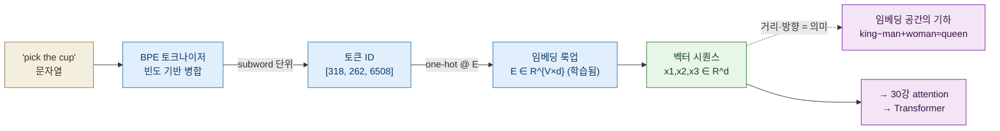
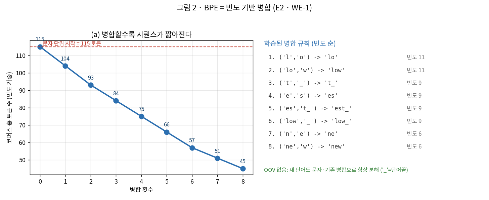
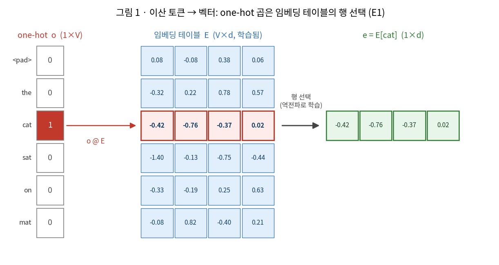
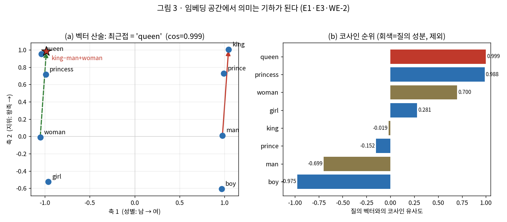
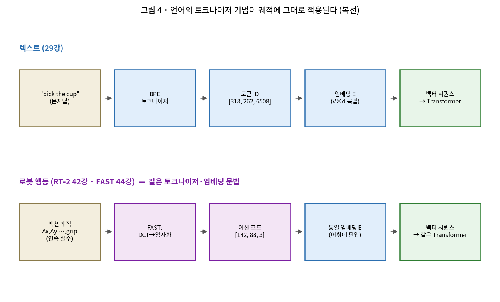

# Lec 29. 토큰과 임베딩

> 선수 지식: 26강(신경망=함수근사·역전파), 27강(학습 파이프라인). 28강까지는 입력이 **연속 신호**(이미지 픽셀)였다 — 이 강의는 처음으로 **이산 심볼**(문자·단어, 그리고 나중엔 로봇 행동)을 신경망이 다룰 벡터로 바꾼다. Part 7(Transformer·LLM)의 문을 여는 강의이자, 30강(attention)·42강(행동 토큰)·44강(FAST)으로 가는 다리다.

## 한 장 요약



토큰화는 **이산 심볼을 정수 ID로 쪼개는 것**(BPE: 자주 붙어 나오는 조각을 병합), 임베딩은 그 **ID를 학습된 벡터로 바꾸는 것**(룩업 테이블 E의 행 선택)이다. 벡터가 되는 순간 "의미"가 **기하**가 된다 — 거리는 유사도, 방향은 관계다. 그리고 결정적으로: **이 두 기법(BPE·임베딩)은 텍스트만의 것이 아니다.** 로봇 행동 궤적도 똑같이 토큰화·임베딩되어(42강 RT-2, 44강 FAST) 같은 Transformer로 흐른다.

## 학습 목표

1. 토크나이저·토큰 ID·임베딩 테이블·임베딩 벡터를 구분하고, `one-hot @ E = 행 선택`이 왜 룩업과 같은지 설명·유도할 수 있다.
2. BPE 병합 알고리즘을 손으로 3회 돌려 병합 규칙을 도출하고, 어휘 크기 ↔ 시퀀스 길이 트레이드오프와 "바이트 폴백 → OOV 없음"을 설명할 수 있다.
3. 코사인 유사도 $\cos(a,b)=a\!\cdot\!b/(\lVert a\rVert\lVert b\rVert)$를 정의하고, 임베딩 벡터 산술(king−man+woman)로 유추를 풀 수 있다.
4. 임베딩이 **고정 사전이 아니라 역전파로 학습되는 파라미터**임을, 그리고 코사인이 크기를 무시한다는 것을 수치로 보일 수 있다.
5. 언어의 토크나이저·임베딩 기법이 **로봇 행동 궤적에 그대로 적용됨**(RT-2 이산 행동 토큰, FAST의 DCT→양자화→BPE)을 설명할 수 있다.

## 왜 이 강의가 필요한가

26~28강의 신경망은 실수 벡터를 먹었다 — 이미지는 이미 $H\times W\times 3$ 실수 격자다. 그런데 언어는 다르다. `"cat"`은 실수가 아니라 **심볼**이고, 심볼 사이에는 "cat이 dog보다 2.7만큼 크다" 같은 자연스러운 수치 관계가 없다. 신경망은 미분 가능한 실수 연산만 할 줄 아는데, 어떻게 심볼을 먹일 것인가? 이 질문에 답하지 못하면 **Transformer도 LLM도 시작조차 못 한다** — 30강 attention은 벡터 시퀀스를 전제하고, 그 벡터가 어디서 오는지가 바로 이 강의다.

그리고 이 강의는 VLA 전체의 숨은 척추다. RT-2(42강)가 "로봇 행동을 텍스트 토큰처럼 뱉는다"고 할 때, FAST(44강)가 "궤적을 DCT→BPE로 압축한다"고 할 때, 그들이 재사용하는 것이 정확히 **여기서 배우는 BPE와 임베딩**이다. "언어 모델의 문법을 로봇에 이식한다"(Physical Intelligence의 베팅, 44강)는 말의 첫 문장이 바로 "행동도 토큰이다"이다. 이걸 개념적 비유로만 알면 새 논문의 액션 표현을 못 읽는다. 그래서 이 강의는 BPE 병합과 임베딩 유추를 **직접 손으로 돌리고 numpy로 재현**시킨다 — 44강에서 "언어의 그 기법 그대로"라고 말할 때 무엇이 그대로인지 몸으로 알기 위해서다.

## 본문

### 1. 왜 토큰인가 — 이산화의 두 갈래

신경망에 언어를 먹이는 길은 세 개고, 앞의 둘은 극단이다.

- **문자 단위**: 어휘(vocabulary)는 아주 작다(영어면 ~100개 바이트). OOV(사전에 없는 단어)가 원천적으로 없다. 대신 시퀀스가 **길다** — `"internationalization"` 한 단어가 20 토큰. attention은 시퀀스 길이 $L$에 $O(L^2)$이므로(30강) 길이는 곧 비용이다.
- **단어 단위**: 시퀀스가 짧다. 대신 어휘가 폭발하고(수십만 단어) 새 단어·오타·합성어를 만나면 즉시 OOV. "unhappiness"가 사전에 없으면 통째로 미지 토큰.
- **subword 단위 (BPE)**: 두 극단의 절충. 자주 나오는 덩어리(`the`, `ing`, `tion`)는 한 토큰으로 묶고, 드문 단어는 조각으로 분해한다. `"unhappiness"` → `un` + `happ` + `iness`. **어휘는 적당(1만~10만)하고, 바이트로 폴백하면 OOV가 없다.** 오늘날 거의 모든 LLM이 쓰는 방식이다.

핵심 트레이드오프를 한 문장으로: **어휘를 키우면 시퀀스가 짧아지고(연산 절약), 대신 각 토큰이 희귀해져 학습 신호가 희석된다.** BPE는 이 곡선 위의 실용적 지점을 빈도로 찾는 알고리즘이다.

### 2. BPE — 빈도가 어휘를 만든다

BPE(Byte-Pair Encoding)는 원래 데이터 압축 알고리즘(1994)인데, Sennrich et al.(2015)이 기계번역 어휘 구성에 가져왔다. 절차는 놀랍도록 단순하다:

1. 모든 텍스트를 가장 작은 단위(문자 또는 **바이트**)로 쪼갠다. → 이 단위 집합이 시작 어휘.
2. 코퍼스에서 **가장 자주 인접해 나오는 심볼 쌍**을 찾아 하나로 병합한다. → 새 심볼이 어휘에 추가.
3. 원하는 어휘 크기가 될 때까지 2를 반복한다. 각 병합은 **병합 규칙**으로 저장된다.

추론(토큰화) 때는 학습된 병합 규칙을 순서대로 적용한다. 바이트에서 출발하면 **어떤 문자열도 반드시 분해된다** — 이것이 "바이트 폴백 → OOV 없음"의 정확한 의미다. 그래서 GPT-2 이후 모델은 **byte-level BPE**를 쓴다(유니코드 어떤 글자든, 이모지든, 처리 가능).



*그림 2: (a) 작은 코퍼스(low×5, lower×2, newest×6, widest×3, slow×4; `_`=단어끝)를 문자 단위로 시작하면 빈도 가중 총 토큰 수가 **115개**. 병합을 8회 하면 **45개**로 준다 — 자주 나오는 조각(`lo`→`low`, `es`→`est_`)이 한 토큰으로 묶이기 때문. (b) 학습된 병합 규칙(빈도 순): `('l','o')`, `('lo','w')`, `('t','_')`, `('e','s')`, `('es','t_')`, `('low','_')`, `('n','e')`, `('ne','w')`. **`new`·`est`·`low` 같은 형태소가 데이터로부터 저절로 떠오른다** — 사람이 형태소 사전을 준 적이 없다. E2·WE-1에서 코드로 재현. `gen_figs.py`가 생성.*

주목할 점: 병합 규칙 4·5(`e`+`s`=`es`, `es`+`t_`=`est_`)는 **접미사 -est**를, 규칙 8(`ne`+`w`=`new`)는 어간을 스스로 발견했다. BPE는 언어학을 모르는데 형태소 비슷한 단위로 수렴한다 — 빈도만으로. 이 "데이터가 단위를 정한다"는 사고가 44강에서 "궤적의 단위도 데이터가 정한다(FAST)"로 이어진다.

### 3. 임베딩 — 정수 ID를 벡터로

토큰화가 끝나면 각 토큰은 정수 ID다(`cat`→2, `the`→1, …). 하지만 정수는 신경망에 못 먹인다 — "ID 2가 ID 1보다 크다"는 무의미하다(고양이가 관사보다 큰 게 아니다). 그래서 각 ID를 $d$차원 실수 벡터로 바꾼다. 이 벡터들을 쌓은 것이 **임베딩 테이블** $E\in\mathbb{R}^{V\times d}$ ($V$=어휘 크기, $d$=임베딩 차원, 예: GPT-2는 $d=768$).



*그림 1: 토큰 `cat`(ID=2)의 one-hot 벡터 $o=[0,0,1,0,0,0]$를 임베딩 테이블 $E$(6×4)에 곱하면 $E$의 **3번째 행**이 그대로 뽑힌다: $e=E[\text{cat}]=[-0.42,-0.76,-0.37,0.02]$. 즉 `one-hot @ E`는 값비싼 행렬곱이 아니라 **인덱싱(룩업)**과 정확히 같다 — 실제 구현은 `E[token_id]`. $E$의 모든 원소는 **역전파로 학습되는 파라미터**다(고정 사전이 아니다). E1·WE에서 재현. `gen_figs.py`가 생성.*

여기가 이 강의의 심장이다. 임베딩 테이블 $E$는 **랜덤으로 초기화되어, 손실을 줄이는 방향으로 다른 모든 가중치와 함께 학습된다.** 학습이 끝나면 놀라운 일이 벌어진다 — 의미가 비슷한 토큰들의 벡터가 공간에서 **가까이** 모이고, 의미 관계가 **방향**으로 나타난다. word2vec(Mikolov 2013)이 처음 극적으로 보인 것이 유명한 `king − man + woman ≈ queen`이다.



*그림 3: (a) 손으로 설계한 8단어 2D 임베딩(축1=성별, 축2=지위). `man→king` 벡터(빨강, 지위 +1)를 `woman`에 더하면(초록 점선) 도착점이 **queen에 정확히 겹친다**(★). 유추 = **평행사변형**. (b) 질의 벡터 `king−man+woman`과 각 단어의 코사인 유사도: queen **0.999**, princess 0.988, woman 0.700, …, boy −0.975. 질의 성분(king·man·woman, 회색)을 관례상 제외한 최근접이 queen. E1·E3·WE-2에서 재현. `gen_figs.py`가 생성.*

이것이 왜 대단한가? 우리는 "queen은 여성 왕족이다"라고 **가르친 적이 없다.** 다음 단어 예측이라는 과제만 시켰는데, 그 과제를 잘 풀려다 보니 임베딩 공간에 성별 축·지위 축이 저절로 생겼다. **의미가 기하로 배치된 것** — 이것이 임베딩의 마법이고, 30강 attention이 "벡터의 방향으로 관련성을 재는" 이유의 토대다.

### 4. 코사인 유사도 — attention의 전조

두 임베딩이 얼마나 "같은 방향"인가를 재는 표준 도구가 코사인 유사도다:

$$\cos(a,b)=\frac{a\cdot b}{\lVert a\rVert\,\lVert b\rVert}$$

내적 $a\cdot b$는 방향 일치도(같은 방향이면 큼)에 **크기**까지 섞인다. 코사인은 각 벡터를 단위길이로 정규화해 **순수한 각도**만 남긴다. 그림 3(b)의 순위가 바로 이 코사인이다. 이것을 기억하라 — 30강 attention의 점수 $q\cdot k/\sqrt{d}$는 **정규화 없는 코사인(스케일된 내적)**이고, softmax가 그 점수들을 가중치로 바꾼다. 즉 **attention은 "질의 벡터와 방향이 비슷한 것에 더 주목"하는 내용기반 룩업**이며, 그 씨앗이 여기 코사인 유사도다. 로봇공학자에게: 이건 상태 벡터끼리의 정렬도로 게인을 정하는 것과 같은 발상이다(아래 번역 절).

### 5. 복선 — 행동도 토큰이다

지금까지의 그림 1·2를 **한 글자도 안 바꾸고** 로봇에 옮길 수 있다. 이것이 VLA의 핵심 아이디어 중 하나다.



*그림 4: (위) 텍스트: 문자열 → BPE → 토큰 ID → 임베딩 → Transformer. (아래) 로봇 행동: 연속 궤적(Δx,Δy,…,grip) → **양자화 또는 FAST(DCT→양자화)** → 이산 코드 → **같은 임베딩·같은 Transformer**. 파이프라인의 뼈대가 동일하다. `gen_figs.py`가 생성.*

- **RT-2 (42강)**: 각 행동 차원을 256개 구간으로 **이산화**해 정수로 만들고, LLM 어휘의 잘 안 쓰는 토큰 자리에 배정한다. 그러면 로봇 행동이 문자 그대로 "단어"가 되어, 언어 모델이 다음 단어 예측하듯 다음 행동을 예측한다. 웹으로 배운 언어 지식이 행동 예측에 전이된다.
- **FAST (44강)**: 스텝별 순진한 양자화는 50Hz 고주파 궤적에서 붕괴한다(인접 스텝이 거의 같아 토큰이 낭비됨). FAST는 궤적을 **DCT**(주파수 변환)한 뒤 계수를 양자화·희소화하고, 그 위에 **BPE**를 얹어(바로 이 강의의 BPE!) 반복 패턴을 압축한다. "언어의 subword 병합을 궤적 계수열에 적용"하는 것이다.

그래서 이 강의를 "그냥 NLP 전처리"로 넘기면 안 된다. 여기서 익힌 **BPE 병합·바이트 폴백·임베딩 룩업**이 44강에서 로봇 궤적 토크나이저의 부품으로 그대로 재등장한다.

### 핵심 수식

토큰과 임베딩은 "이산 심볼을 미분 가능한 벡터로"라는 하나의 목표에 대한 세 조각이다: **E1** 임베딩=룩업(심볼→벡터), **E2** BPE=빈도 병합(어떤 심볼로 쪼갤까), **E3** 코사인=유사도(벡터가 된 뒤 의미를 재는 자).

#### E1. 임베딩 = 학습된 룩업 테이블 — one-hot 곱은 행 선택

**① 직관**: 각 토큰에 벡터공간의 **한 점**을 준다. 처음엔 아무 데나(랜덤) 흩어져 있지만, 학습이 이 점들을 의미가 통하도록 재배치한다. `e_i = E[i]` — ID $i$번 토큰의 임베딩은 테이블 $E$의 $i$번째 행이다.

**② 물리·기하적 의미**: 임베딩 공간의 **거리와 방향이 의미 관계**가 된다. 가까운 두 점 = 비슷한 토큰, 같은 방향 차이 = 같은 관계(king−man ≈ queen−woman, 성별 축). 이것은 로봇공학자가 아는 **구성 공간(configuration space)**과 같은 발상이다 — 관절각 벡터가 자세를 한 점으로 나타내듯, 임베딩은 의미를 한 점으로 나타낸다. 다만 그 좌표축을 사람이 정하지 않고 **학습이 정한다**.

**③ 형식(유도 요점)**: 토큰 ID $i$의 one-hot 벡터 $o_i\in\{0,1\}^{V}$($i$번만 1)를 테이블 $E\in\mathbb{R}^{V\times d}$에 곱하면

$$o_i^\top E = \sum_{k=1}^{V}(o_i)_k\,E[k,:] = E[i,:] = e_i$$

$o_i$의 $i$번만 1이므로 합은 **$i$번째 행 하나**만 남는다 — 곱셈이 곧 인덱싱이다(그래서 실제 구현은 $O(d)$ 룩업, $O(Vd)$ 곱셈이 아니다). 학습에서는 $\partial \mathcal{L}/\partial E[i,:]$가 **그 토큰이 등장한 위치에서만** 흘러 해당 행만 갱신된다 — $E$는 고정 사전이 아니라 **파라미터 행렬**이다.

#### E2. BPE = 빈도 기반 병합 — 압축과 어휘의 탄생

**① 직관**: 자주 함께 나오는 두 조각을 하나로 묶기를 반복한다. 자주 나오는 것일수록 짧은 표현을 주는 것 — 정보이론의 기본(허프만 부호화와 같은 정신).

**② 물리·기하적 의미**: 각 병합은 **어휘 크기를 1 늘리고 시퀀스를 짧게** 만든다(그림 2a: 115→45). $V$와 평균 시퀀스 길이 $L$은 **반비례로 거래**된다. 바이트에서 출발하면 병합을 아무리 해도 **모든 문자열이 분해 가능**(최악의 경우 바이트로) — OOV가 구조적으로 불가능하다. 이 "바닥이 있는 이산화"가 로봇 행동에도 필요하다(임의의 궤적을 항상 토큰화할 수 있어야 하므로).

**③ 형식(유도 요점)**: 코퍼스를 심볼열의 다중집합으로 보고, 인접쌍 $(a,b)$의 빈도를

$$f(a,b)=\sum_{\text{단어 }w}\text{count}(w)\cdot\#\{(a,b)\text{ 인접 등장 in }w\}$$

로 세어, $\arg\max_{(a,b)} f(a,b)$를 하나의 심볼 $ab$로 병합한다. 이를 $M$회 반복하면 병합 규칙 목록 $[(a_1,b_1),\dots,(a_M,b_M)]$과 어휘 $|\text{init}|+M$을 얻는다. 총 토큰 수는 각 병합마다 (병합쌍 등장 횟수)만큼 줄어든다 — WE-1에서 39→20으로 손 검산.

#### E3. 유사도 = 내적 / 코사인 — 방향이 의미다

**① 직관**: 두 임베딩이 얼마나 "같은 방향"을 가리키는가. 같은 방향이면 유사, 직교면 무관, 반대면 대조.

**② 물리·기하적 의미**: 내적 $a\cdot b=\lVert a\rVert\lVert b\rVert\cos\theta$는 **크기 × 방향일치**다. 코사인은 크기를 나눠 없애 **순수 각도**만 본다. 그래서 `king`과 `10·king`은 코사인 1(같은 의미)이지만 유클리드 거리는 크다 — **의미는 방향에 있고 크기는 대개 무관**(빈도·문맥 강도 등 다른 정보를 나를 뿐). 이것이 attention이 유클리드가 아니라 내적을 쓰는 이유의 절반이다.

**③ 형식(유도 요점)**:

$$\cos(a,b)=\frac{a\cdot b}{\lVert a\rVert\,\lVert b\rVert}\in[-1,1],\qquad a\cdot b=\sum_{k=1}^{d}a_k b_k$$

유추는 벡터 산술 후 코사인 최근접: $\hat w=\arg\max_{w\notin\{\text{질의성분}\}}\cos(e_{\text{king}}-e_{\text{man}}+e_{\text{woman}},\ e_w)$. 30강 attention 점수는 여기서 정규화를 빼고 $\sqrt d$로 스케일한 $q\cdot k/\sqrt d$이며, softmax가 이 점수들을 합=1의 가중치로 바꾼다.

### Worked Example

#### WE-1 (손계산 + 검증): 작은 코퍼스에 BPE 병합 3회

코퍼스(단어:빈도) `hug×4, pug×2, hugs×2, pugs×1`을 문자 단위로 시작한다(`_`=단어끝, 한 문자로 취급). 손으로 셀 두 가지: ① **초기 총 토큰 수** = 각 단어 문자수 × 빈도 = $4{\times}4+2{\times}4+2{\times}5+1{\times}5=39$. ② **첫 병합쌍**은 가장 빈번한 인접쌍 — `u`,`g`는 네 단어 모두에 있으므로 $f(u,g)=4+2+2+1=9$로 최대. 병합 후 `ug`가 어휘에 추가된다.

수치로 확인: 병합 1 `(u,g)` 빈도 9 → 30 토큰, 병합 2 `(ug,_)` 빈도 6(=hug_×4+pug_×2; hugs_/pugs_는 `ug` 뒤가 `s`라 제외) → 24, 병합 3 `(h,ug_)` 빈도 4 → 20. **3번 병합으로 39→20(거의 절반)**, 그리고 `hug_`가 통째로 한 토큰이 되었다.

```python
import numpy as np
corpus = {'hug_': 4, 'pug_': 2, 'hugs_': 2, 'pugs_': 1}   # '_' = 단어끝

def vocab_of(c):  return {tuple(w): f for w, f in c.items()}
def pair_freqs(v):
    p = {}
    for syms, f in v.items():
        for a, b in zip(syms[:-1], syms[1:]):
            p[(a, b)] = p.get((a, b), 0) + f
    return p
def apply_merge(v, pair):
    a, b = pair; new = {}
    for syms, f in v.items():
        out, i = [], 0
        while i < len(syms):
            if i < len(syms) - 1 and syms[i] == a and syms[i+1] == b:
                out.append(a + b); i += 2         # 인접쌍 병합
            else:
                out.append(syms[i]); i += 1
        new[tuple(out)] = new.get(tuple(out), 0) + f
    return new
def total(v):  return sum(len(s) * f for s, f in v.items())

v = vocab_of(corpus)
print("초기 토큰 수:", total(v))                  # 39  (손계산 4*4+2*4+2*5+1*5)
for step in range(3):
    pf = pair_freqs(v)
    best = max(pf, key=lambda k: (pf[k], -sum(ord(c) for c in k[0]+k[1])))
    v = apply_merge(v, best)
    print(f"병합{step+1}: {best} 빈도{pf[best]} → 토큰수 {total(v)}")
# 병합1: ('u', 'g') 빈도9 → 토큰수 30
# 병합2: ('ug', '_') 빈도6 → 토큰수 24
# 병합3: ('h', 'ug_') 빈도4 → 토큰수 20
```

출력의 세 줄이 손계산과 일치한다: 초기 39, 첫 병합 `(u,g)` 빈도 9, 3회 후 20. **"자주 붙는 것을 묶으면 시퀀스가 짧아진다"가 BPE의 전부**이고, 이 열두 줄이 그 핵심이다. 새 단어 `hugging_`이 와도 학습된 규칙으로 `h`+`ug`+`g`+`i`+`n`+`g`+`_` → (규칙 적용) `hug`+... 처럼 항상 분해된다 — **OOV 없음**. `gen_figs.py`는 이 실험을 5단어·8병합으로 키워 그림 2(115→45)를 만든다.

#### WE-2 (코드): 임베딩 유추 — king−man+woman의 최근접

E3를 눈으로 확인한다. 의미 축을 손으로 설계한 4차원 임베딩(축=성별, 왕족성, 젊음, 잡음)에서 벡터 산술로 유추를 푼다. 손계산의 핵심: `king`=[1,1,0,0], `man`=[1,0,0,0], `woman`=[-1,0,0,0]이면 `king−man+woman` = [1-1-1, 1-0+0, 0, 0] = **[-1,1,0,0]** — 이것이 정확히 `queen`의 벡터다. 그래서 코사인 1.0.

```python
import numpy as np
words = ['king','queen','man','woman','prince','princess']
E = np.array([[ 1,1,0,0],[-1,1,0,0],[ 1,0,0,0],
              [-1,0,0,0],[ 1,1,1,0],[-1,1,1,0]], float)
idx = {w: i for i, w in enumerate(words)}
def cos(a, b): return float(a @ b / (np.linalg.norm(a)*np.linalg.norm(b) + 1e-12))

q = E[idx['king']] - E[idx['man']] + E[idx['woman']]
print("q =", q)                                    # [-1.  1.  0.  0.]  = queen
sims = {w: round(cos(q, E[idx[w]]), 4) for w in words}
print(sims)   # {'king':0.0,'queen':1.0,'man':-0.7071,'woman':0.7071,'prince':0.0,'princess':0.8165}
best = max([w for w in words if w not in {'king','man','woman'}],
           key=lambda w: cos(q, E[idx[w]]))
print("최근접(질의 성분 제외):", best)              # queen

# 코사인은 크기를 무시한다 (오해 4): king 과 10*king 은 방향이 같다
k = E[idx['king']]
print("cos(king, 10*king) =", round(cos(k, 10*k), 4))       # 1.0
print("||king - 10*king|| =", round(float(np.linalg.norm(k-10*k)), 4))  # 12.7279
```

출력: `king−man+woman`=[-1,1,0,0]로 queen과 코사인 1.0, 최근접 queen(질의 성분 제외). 그리고 `cos(king,10·king)=1.0`인데 `‖king−10·king‖=12.73` — **코사인은 방향만 보고 크기를 버린다**(오해 4의 반례). `gen_figs.py`는 이 유추를 8단어·잡음 있는 학습 임베딩으로 키워 그림 3(queen 0.999)을 만든다 — 실제 word2vec은 이 축들을 데이터에서 자동으로 발견한다.

### 로봇공학자를 위한 번역

- **임베딩 공간 = 학습된 구성 공간(C-space)**: 관절각 벡터가 로봇 자세를 한 점으로 나타내듯, 임베딩은 의미를 한 점으로 나타낸다. 차이는 좌표축을 사람이 아니라 **역전파가 정한다**는 것. "king−man 방향 = 성별 축"은 사람이 심은 게 아니라 데이터가 배치한 것.
- **코사인 유사도 = 방향 정렬 기반 가중**: 상태 벡터끼리 얼마나 정렬됐는지로 관련성을 정하는 발상은, 상태에 따라 게인을 바꾸는 **게인 스케줄링**과 뿌리가 같다. 30강 attention이 바로 "질의 상태와 정렬된 키에 큰 가중치"를 주는 내용기반 가중혼합이다.
- **BPE = 신호의 적응적 양자화·부호화**: 자주 나오는 패턴에 짧은 코드를 주는 것은 제어에서 자주 쓰는 궤적 프리미티브에 짧은 이름을 붙이는 것과 같다. FAST(44강)가 DCT 계수열에 BPE를 얹는 순간, 이것은 문자 그대로 **궤적의 부호화**가 된다 — 회원님이 아는 신호처리·양자화의 언어로 읽으면 된다.
- **토큰 ID → 임베딩 = 이산 인덱스 → 연속 파라미터**: 룩업 테이블은 "이산 선택을 미분 가능하게 만드는" 표준 트릭이다. 이산 모드 선택(예: 기어 단수)을 연속 최적화에 넣고 싶을 때의 발상과 통한다.

## 흔한 오해

1. **"토큰 = 단어"** — 아니다. BPE 토큰은 **subword**(또는 byte)다. `unhappiness`는 여러 토큰(`un`+`happ`+`iness`)으로, 흔한 단어 `the`는 한 토큰으로, 이모지 하나는 여러 바이트 토큰으로 쪼개질 수 있다. "토큰 수 ≠ 단어 수"이고, 이 착각이 LLM의 문맥 길이·비용 계산을 틀리게 한다.
2. **"임베딩은 고정 사전이다(word2vec 파일을 불러오는 것)"** — 현대 LLM에서 임베딩 테이블 $E$는 **모델의 파라미터**로, 다른 가중치와 함께 역전파로 학습된다(E1). word2vec은 임베딩만 따로 학습한 초기 방식이고, GPT류는 임베딩을 모델 안에서 통째로 학습한다. "임베딩이 학습된다"를 놓치면 파인튜닝·LoRA(33강)에서 무엇이 갱신되는지 못 짚는다.
3. **"어휘(vocab)가 크면 무조건 좋다"** — 아니다(E2). 어휘를 키우면 시퀀스는 짧아지지만(연산 이득), 각 토큰이 희귀해져 **학습 신호가 희석되고 임베딩 테이블·출력층이 커진다**. 트레이드오프이지 공짜가 아니다. FAST(44강)가 "순진한 세밀 양자화는 토큰을 낭비한다"고 지적하는 것이 정확히 이 문제다.
4. **"코사인 유사도 = 유클리드 거리(가까우면 유사)"** — 다르다(E3). 코사인은 **크기를 무시하고 각도만** 본다. WE-2에서 `king`과 `10·king`은 코사인 1(완전 유사)이지만 유클리드 거리는 12.73으로 멀다. 임베딩에서 의미는 대개 **방향**에 있으므로 코사인(또는 정규화된 내적)이 표준이다.
5. **"토큰화는 사소한 전처리라 대충 해도 된다"** — 아니다. 토크나이저 선택은 시퀀스 길이($O(L^2)$ 비용)·희소성·다국어 성능·숫자 처리(자릿수 분해)를 좌우한다. 그리고 VLA에서는 **행동 토크나이저 설계가 성능의 급소**다 — 44강의 π0-FAST 전체가 "토크나이저를 바꿔 이산 AR을 되살린" 이야기다.

## 실습 (60~90분, CPU만)

**A안 (추천, 순수 개념): minbpe로 BPE 직접 훈련.** Karpathy의 `minbpe`(순수 파이썬, 의존성 없음)를 받아 ① 작은 텍스트 파일(예: 위키 문단 몇 개)로 `BasicTokenizer`를 vocab 512로 훈련 → 병합 규칙 목록을 출력해 그림 2처럼 "형태소가 떠오르는지" 관찰. ② 같은 문장을 vocab 256/512/1024로 토큰화해 **토큰 수 vs 어휘 크기** 곡선을 그려 트레이드오프를 눈으로 확인(WE-1의 확장). ③ 훈련에 없던 단어·이모지를 넣어 **OOV 없이 분해**되는지 확인.

**B안 (HF tokenizers, 실전 감각):** `transformers`로 GPT-2 토크나이저를 로드 → `"internationalization"`, `"로봇"`, `"3.14159"`, 이모지를 각각 토큰화해 **토큰 수와 ID**를 출력. "왜 긴 영어 단어·한국어·숫자는 잘게 쪼개지는가"를 Claude와 토론. `tokenizer.decode`로 왕복이 되는지 확인. 임베딩 층 `model.get_input_embeddings().weight.shape`로 $E$가 $V\times d$임을 실물로 확인($d$=768).

## Claude와 토론할 질문

1. 문자 단위 vs 단어 단위 vs BPE의 트레이드오프를 시퀀스 길이($O(L^2)$ 비용)·OOV·희소성 세 축으로 표로 정리해 보라. 어느 극단이 어느 상황에 유리한가?
2. 임베딩 차원 $d$를 키우면 무엇이 좋아지고 무엇이 나빠지는가? $d$와 어휘 크기 $V$는 어떻게 함께 정하는가? (파라미터 수 $V\times d$의 관점)
3. WE-2의 유추는 축을 사람이 설계했다. 실제 word2vec/LLM은 이 축을 다음 단어 예측만으로 어떻게 발견하는가? "성별 축"이 생기는 학습 신호의 출처는 무엇인가?
4. 코사인이 크기를 버린다면, 임베딩 벡터의 **크기(norm)**에는 어떤 정보가 담기는가? (힌트: 토큰 빈도·문맥 예측 확신도와의 상관)
5. RT-2(42강)는 행동을 256구간으로 이산화해 텍스트 토큰 자리에 넣는다. 이 "행동=단어" 대응의 장점(웹 지식 전이)과 한계(정밀도·시퀀스 길이)를 이 강의의 어휘로 설명하라.
6. FAST(44강)는 궤적을 DCT한 뒤 **BPE**를 얹는다. 왜 스텝별 직접 양자화가 아니라 주파수 변환 후에 BPE를 쓰는가? WE-1의 "빈도 병합"이 궤적 계수열에서 무엇을 묶겠는가?
7. 토크나이저는 훈련 코퍼스에 의존한다. 로봇 데이터로 훈련한 토크나이저와 웹 텍스트로 훈련한 토크나이저를 섞으면(VLA) 어떤 문제가 생길 수 있는가? (어휘 충돌·희소성)

## 읽을거리

1. **J. Alammar, "The Illustrated Word2vec"** — 임베딩 공간·유추의 시각적 직관. king−man+woman 그림까지만(~25분).
2. **A. Karpathy, "Let's build the GPT Tokenizer" (유튜브) + minbpe README** — BPE를 코드로 밑바닥부터. 병합 루프와 byte-level 파트만 봐도 이 강의의 실습이 된다(~40분, 실습 A안과 병행).
3. **HF LLM Course, "Tokenizers" 챕터** — subword 3종(BPE/WordPiece/Unigram) 비교. BPE 절만(~20분).

## 자가 점검

1. 토크나이저·토큰 ID·임베딩 테이블·임베딩 벡터를 각각 정의하고, `one-hot @ E`가 왜 룩업과 같은지 한 줄로 말할 수 있는가(E1)?
2. BPE 병합 알고리즘을 말로 설명하고, WE-1의 `hug/pug/hugs/pugs` 코퍼스에서 첫 병합쌍이 `(u,g)`이고 빈도 9인 이유를 손으로 셀 수 있는가(E2)?
3. "어휘 크기 ↔ 시퀀스 길이" 트레이드오프와 "바이트 폴백 → OOV 없음"을 각각 한 문장으로 설명할 수 있는가?
4. 코사인 유사도 식을 쓰고, `king`과 `10·king`의 코사인이 1인데 유클리드 거리는 큰 이유를 말할 수 있는가(E3·오해 4)?
5. `king−man+woman ≈ queen`을 벡터 산술로 재현하고, "의미가 기하가 된다"는 문장의 뜻을 그림 3(a)의 평행사변형으로 설명할 수 있는가?
6. 임베딩이 고정 사전이 아니라 **역전파로 학습되는 파라미터**임을, 그 갱신이 어느 행에서 일어나는지 포함해 말할 수 있는가(오해 2)?
7. RT-2(42강)와 FAST(44강)가 이 강의의 BPE·임베딩을 각각 어떻게 재사용하는지, "언어의 그 기법 그대로"가 무엇을 가리키는지 말할 수 있는가?

## 참고문헌

> 본문 수치·주장의 출처. 웹 문서는 2026-07 접속 기준. (2차) = 언론 등 2차 출처.

[1] T. Mikolov, K. Chen, G. Corrado, J. Dean, "Efficient Estimation of Word Representations in Vector Space (word2vec)," arXiv:1301.3781, 2013.1. https://arxiv.org/abs/1301.3781
— **뒷받침**: 임베딩 공간의 벡터 산술 유추(king−man+woman≈queen), 거리·방향=의미 관계(E1·E3·그림 3·WE-2의 개념 근거).

[2] R. Sennrich, B. Haddow, A. Birch, "Neural Machine Translation of Rare Words with Subword Units (BPE)," arXiv:1508.07909, 2015.8. https://arxiv.org/abs/1508.07909
— **뒷받침**: BPE를 어휘 구성에 도입, 빈도 기반 병합·subword 단위·희귀어 분해(E2·그림 2·WE-1). 고전 예시 코퍼스(low/lower/newest/widest)의 원형.

[3] A. Karpathy, "minbpe" (byte-level BPE 최소 구현) 및 "Let's build the GPT Tokenizer" (강의). https://github.com/karpathy/minbpe
— **뒷받침**: byte-level BPE·병합 루프·OOV 없는 분해(§2·실습 A안), GPT-2 이후 byte-level BPE 관행.

[4] A. Radford et al. (OpenAI), "Language Models are Unsupervised Multitask Learners (GPT-2)," 2019. https://cdn.openai.com/better-language-models/language_models_are_unsupervised_multitask_learners.pdf
— **뒷받침**: byte-level BPE 채택, 임베딩 차원 $d=768$(base) 규모(§3·실습 B안).

[5] Hugging Face, "Tokenizers" (LLM Course / tokenizers 라이브러리 문서). https://huggingface.co/learn/llm-course
— **뒷받침**: subword 토크나이저(BPE/WordPiece/Unigram) 비교·API(실습 B안·읽을거리 3). (공식 문서)

[6] B. Zitkovich et al. (Google DeepMind), "RT-2: Vision-Language-Action Models Transfer Web Knowledge to Robotic Control," CoRL, 2023. https://robotics-transformer2.github.io/
— **뒷받침**: 행동을 256구간 이산화해 텍스트 토큰 자리에 배정(§5·그림 4·복선). 소관은 42강. (구조·아이디어 참고, 수치는 42강에서 크로스체크)

[7] K. Pertsch et al. (Physical Intelligence), "FAST: Efficient Action Tokenization for Vision-Language-Action Models," arXiv:2501.09747, 2025.1. https://arxiv.org/abs/2501.09747
— **뒷받침**: 궤적을 DCT→양자화·희소화→**BPE**로 압축, 순진한 스텝별 양자화의 토큰 낭비 문제(§5·그림 4·오해 3·복선). 소관은 44강.

*수치 재현성: 본문·캡션·WE의 numpy 토이 수치는 `images/lec29/gen_figs.py`와 본문 코드 블록의 실행 출력이다 — WE-1의 BPE 초기 39토큰·병합 `(u,g)`빈도9·`(ug,_)`빈도6·`(h,ug_)`빈도4·3회 후 20토큰, 그림 2의 5단어 코퍼스 115→45토큰·병합규칙 8개, WE-2의 king−man+woman=[-1,1,0,0]·queen 코사인 1.0·`cos(king,10·king)=1.0`·`‖king−10·king‖=12.73`, 그림 3의 잡음 있는 8단어 임베딩에서 queen 0.999·princess 0.988·woman 0.700, 그림 1의 E[cat]=[-0.42,-0.76,-0.37,0.02] 룩업. numpy 1.26 / scipy 1.15 / matplotlib 3.5 기준 재현 확인. **이 토이는 개념 재현용 CPU 시뮬레이션이며 실제 word2vec/GPT 임베딩이나 대형 모델이 아니다**(임베딩 축을 사람이 설계했다) — word2vec·GPT-2·RT-2·FAST의 실측 임베딩·토크나이저·수치는 위 [1][4][6][7] 1차 출처.*

<!-- lecture-nav -->

---

⬅ 이전: [Lec 28. CNN과 시각 표현](../part06-deep-learning/lec28-cnn-visual-representations.md)　｜　[📖 전체 목차](../README.md)　｜　다음: [Lec 30. Attention 해부](lec30-attention.md) ➡
