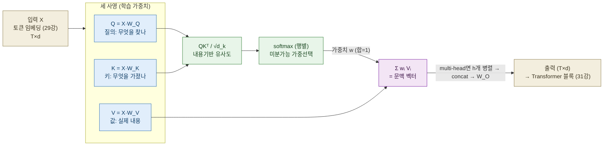
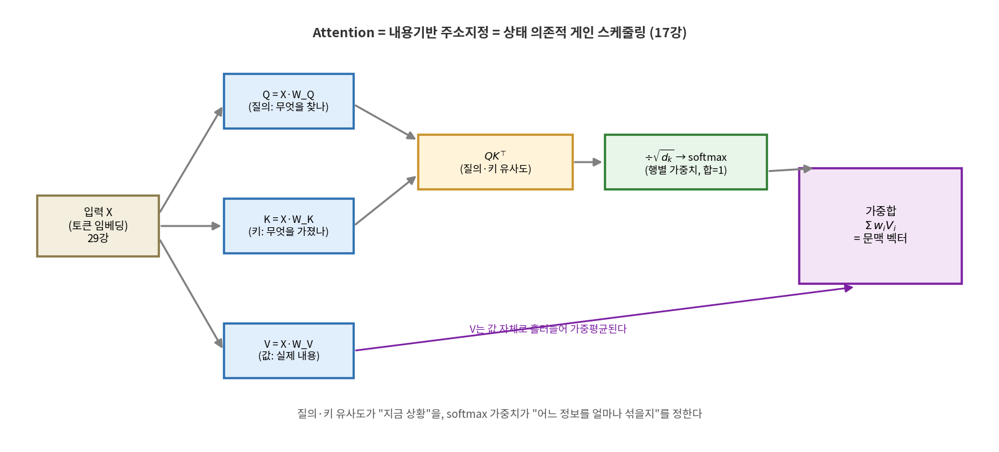
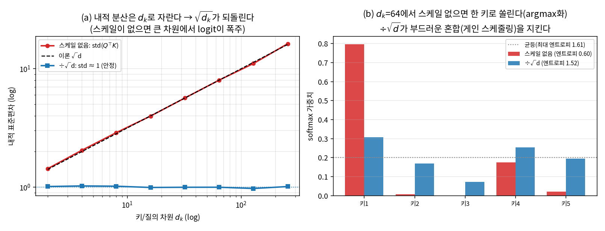
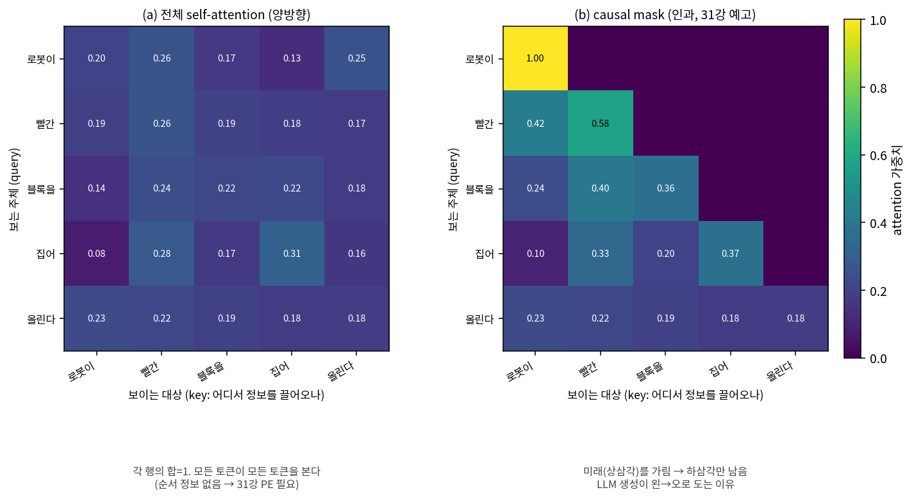
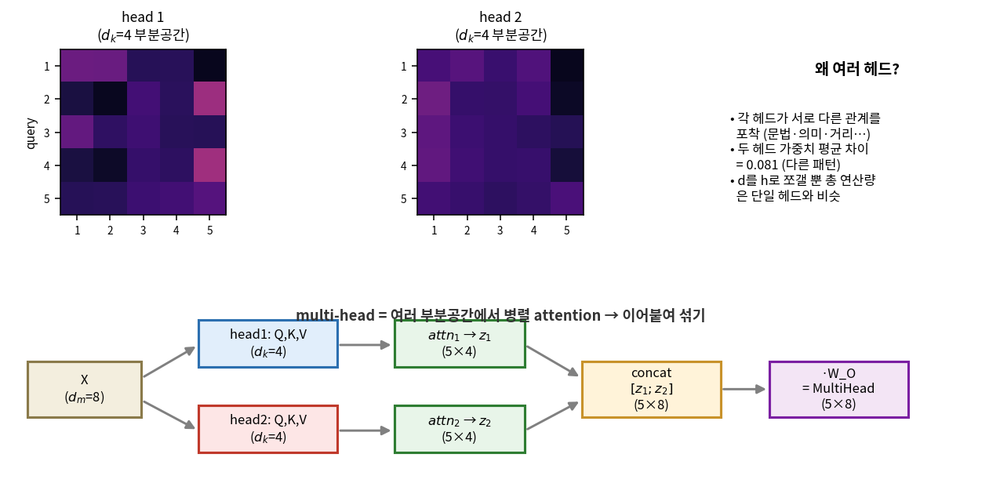

# Lec 30. Attention 해부

> 선수 지식: 29강(토큰·임베딩 — 시퀀스가 벡터 열 $X\in\mathbb{R}^{T\times d}$로 들어온다). 관련: 17강(게인 스케줄링·게인), 18강(칼만 게인), 26강(신경망=함수근사), 31강(다음 강 — PE·전체 Transformer), 44강(π0의 attention 공유). 이 강의는 Part 7(Transformer·LLM)의 심장이자, 34강 ViT부터 44강 π0까지 모든 백본이 딛는 한 연산을 판다.

## 한 장 요약



Attention = **내용기반 주소지정**. 각 토큰이 "질의(Q)"를 던지고, 모든 토큰의 "키(K)"와의 유사도로 "값(V)"들을 가중평균한다. 로봇 언어로는 **상태 의존적 게인 스케줄링(17강)** — 지금 상황(Q·K 유사도)에 따라 어떤 정보를 얼마나 섞을지를 데이터가 정한다.

## 학습 목표

1. 스케일드 닷프로덕트 attention $\mathrm{softmax}(QK^\top/\sqrt{d_k})V$을 쓰고, Q/K/V 각각의 역할과 $\sqrt{d_k}$ 스케일이 왜 필요한지 설명할 수 있다.
2. self-attention이 "시퀀스가 자기 자신을 보는" 연산임을, 그리고 그것이 **순서를 모른다(permutation-equivariant)**는 사실과 그 결과(31강 PE 필요)를 설명할 수 있다.
3. multi-head가 "여러 부분공간에서 병렬 attention"임을 $head_i \to \text{concat} \to W_O$로 쓰고, "그냥 반복이 아니다"를 수치로 보일 수 있다.
4. attention을 로봇의 게인 스케줄링·칼만 게인·내용기반 혼합에 대응시켜 설명할 수 있다.
5. attention 1회를 손으로 계산하고 numpy로 검증하며, causal mask 유무와 $\sqrt{d}$ 스케일 유무를 수치로 비교할 수 있다.

## 왜 이 강의가 필요한가

29강에서 시퀀스는 벡터 열 $X\in\mathbb{R}^{T\times d}$가 되었다. 이제 질문은 **"한 토큰의 표현을 어떻게 문맥에 맞게 갱신하는가"** — "블록을"이라는 단어의 의미는 그 앞의 "빨간"과 뒤의 "집어"에 따라 달라진다. 고전적 답은 RNN이었다: 왼쪽부터 순서대로 상태를 흘려보내며 문맥을 축적한다. 그러나 RNN은 (i) 순차적이라 병렬화가 안 되고, (ii) 멀리 떨어진 토큰의 정보가 여러 스텝을 거치며 희미해진다(장거리 의존성 소실). Attention은 이 둘을 한 번에 깬다 — **모든 토큰이 모든 토큰을 한 번의 행렬곱으로 직접 본다.**

이걸 "사람의 주의력" 같은 은유로만 외우면 새 아키텍처 앞에서 무력하다. attention은 은유가 아니라 **정확히 계산되는 가중평균**이고, 그 가중치가 어떻게 만들어지는지(Q·K 유사도 → softmax)를 손으로 계산해 본 사람만이 34강 ViT가 왜 패치를 토큰으로 넣는지, 44강 π0가 왜 "attention만 공유"할 수 있는지, causal mask가 왜 LLM 생성을 왼→오로 묶는지를 원리로 설명한다. 그리고 로봇 배경자에게는 지름길이 있다: attention의 골격은 여러분이 이미 아는 **게인 스케줄링**과 **칼만 게인**의 학습판이다 — 상황에 따라 혼합 비율이 바뀌는 데이터 의존적 가중합. 이 강의의 worked example은 정확히 그 계산을 CPU numpy로 손에 쥐여 준다.

## 본문

### 1. attention이라는 아이디어 — 내용으로 주소를 매기다

컴퓨터의 배열은 **위치**로 값을 꺼낸다: `a[3]`. 딕셔너리는 **키**로 꺼낸다: `d["블록"]` — 키가 정확히 일치해야 한다. Attention은 그 사이의 부드러운 버전이다: 질의 $q$와 모든 키 $k_i$의 **유사도**를 재서, 일치할수록 큰 가중치로 값 $v_i$들을 **섞어** 꺼낸다. "정확히 일치"(하드 주소)가 아니라 "얼마나 비슷한가"(소프트 주소)이므로 미분 가능하고, 그래서 학습된다.

이 관점을 로봇으로 옮기면 익숙하다. **게인 스케줄링(17강)**: 작동점(상태)에 따라 여러 개의 미리 튜닝된 게인/제어기를 상황에 맞게 가중혼합한다. Attention이 하는 일이 정확히 이것이다 — 다만 "작동점"이 질의 $q$이고, "어느 제어기를 얼마나 섞을지"를 정하는 스케줄이 softmax($q\cdot k_i$)이며, 섞이는 대상이 값 $v_i$다. **칼만 게인(18강)**도 같은 골격이다: 예측과 측정을 불확실성에 따라 가중혼합하는데, 그 혼합 비율(게인)이 상황(공분산)에 따라 바뀐다. Attention은 이 "상황 의존적 혼합"을 콘텐츠 유사도로 정의하고 데이터로 학습한 것이다.



*그림 1: 입력 X 한 벌에서 세 개의 학습 사영으로 Q(질의)·K(키)·V(값)가 나온다. Q·Kᵀ가 "질의와 키가 얼마나 맞는가"를 재고, $\div\sqrt{d_k}$ 후 행별 softmax가 합=1인 가중치를 만들며, 그 가중치로 V를 가중평균해 문맥 벡터가 나온다. 상단 배너의 대응(내용기반 주소지정 = 상태 의존적 게인 스케줄링)이 이 강의의 뼈대다. `images/lec30/gen_figs.py`로 생성.*

### 2. Q, K, V — 하나의 X, 세 개의 역할

핵심 통찰: 같은 토큰 표현 $X$를 **세 개의 다른 학습 행렬**로 사영해 세 개의 역할로 나눈다.

- $Q = XW_Q$ — **질의(query)**: "나는 지금 무슨 정보를 찾고 있나."
- $K = XW_K$ — **키(key)**: "나는 어떤 정보를 제공할 수 있다고 광고하나."
- $V = XW_V$ — **값(value)**: "실제로 전달되는 내용."

왜 셋으로 나누는가? "찾는 기준"(Q·K가 결정하는 **어디를 볼지**)과 "전달되는 내용"(V가 결정하는 **무엇을 가져올지**)을 **분리**하기 위해서다. 예: "블록을"이라는 토큰은 색을 묻는 질의를 던져 "빨간"에 높은 가중치를 주지만(Q·K), 실제로 끌어오는 것은 "빨간"의 색 정보(V)다. 만약 Q=K=V라면 "비슷한 것"만 볼 수 있어 표현력이 크게 준다. 세 사영이 이 자유도를 준다.

### 3. self vs cross, 그리고 순서 무지

**self-attention**은 Q, K, V가 **모두 같은 $X$**에서 나오는 경우다 — 시퀀스가 자기 자신을 본다. **cross-attention**은 Q는 한 시퀀스, K·V는 다른 시퀀스에서 나온다(예: 번역에서 디코더가 인코더를 봄 — Bahdanau의 원조 attention[2]이 이 형태였다). 이 강의는 Transformer의 주력인 self-attention에 집중한다.

여기서 로봇 배경자가 반드시 챙길 사실 하나: **attention은 순서를 모른다.** 토큰들을 섞어 넣으면 출력도 똑같이 섞여 나올 뿐, 값 자체는 안 바뀐다(permutation-equivariant). $\mathrm{softmax}(QK^\top/\sqrt d)V$ 어디에도 "위치 $i$"가 안 들어가기 때문이다 — 각 가중치는 오직 내용 유사도 $q_i\cdot k_j$에만 의존한다. "로봇이 블록을 집는다"와 "블록이 로봇을 집는다"를 구별하려면 순서 정보를 **따로 주입**해야 한다. 그것이 31강의 위치 인코딩(PE)이고, PE는 로봇 배경자에게 **시간 파라미터화(8강)** — 궤적을 시각 $t$로 매개하듯 토큰을 위치로 매개하는 것 — 로 번역된다. 이 강의는 순서 없는 attention의 "원자"를 다루고, 31강이 그 위에 시계(PE)와 잔차·정규화를 얹어 Transformer를 완성한다.

### 4. 계산 비용 — 병렬의 대가

attention 행렬 $QK^\top$은 $T\times T$다 — 모든 토큰 쌍의 유사도. 시퀀스 길이 $T$에 대해 **연산·메모리가 $O(T^2 d)$**로 자란다. RNN은 $O(T d^2)$로 $T$에 선형이지만 순차적이다. attention은 $T$에 제곱이지만 완전히 병렬이다(한 번의 큰 행렬곱). 짧은 시퀀스에서는 병렬성이 압도적으로 이기지만, $T$가 수천을 넘으면 이 $T^2$가 아프기 시작한다 — 이것이 롱컨텍스트 연구(FlashAttention, 희소 attention 등)의 출발점이다. "attention이면 RNN보다 항상 낫다"가 틀린 이유가 여기 있다(흔한 오해 5).

### 핵심 수식

세 수식이 이 강의의 전부다: **E1** 스케일드 닷프로덕트 attention(연산 자체), **E2** self-attention(같은 X, 순서 무지), **E3** multi-head(부분공간 병렬).

#### E1. 스케일드 닷프로덕트 attention — 내용기반 가중평균

**① 직관**: 각 질의가 모든 키와 얼마나 맞는지를 재서(내적), 그 점수를 합=1 가중치로 바꿔(softmax), 값들을 가중평균한다. "가장 잘 맞는 하나만 고르는" argmax가 아니라 "잘 맞을수록 많이 섞는" **부드러운 선택**이라 미분 가능하고, 그래서 역전파로 $W_Q,W_K,W_V$를 학습한다.

**② 물리·기하적 의미**: 내적 $q\cdot k$는 두 벡터의 정렬도(코사인 유사도 × 크기)다 — **내용이 비슷한 방향일수록 큰 점수**. softmax는 미분가능한 **soft argmax**: 온도가 낮으면(점수 차가 크면) 한 곳으로 쏠려 하드 선택에 가깝고, 높으면 고르게 섞인다. 그리고 $\sqrt{d_k}$ 스케일의 물리적 이유: $q,k$의 성분이 독립 단위분산이면 내적 $q\cdot k=\sum_{i=1}^{d_k} q_i k_i$의 **분산이 $d_k$에 비례**해 커진다(std $\approx\sqrt{d_k}$). 큰 차원에서 점수가 폭주하면 softmax가 한 키로 쏠려(argmax화) 기울기가 죽는다. $\div\sqrt{d_k}$가 점수 분산을 1로 되돌려 softmax를 "부드러운 게인 스케줄" 영역에 붙잡아 둔다. 아래 그림 4가 이 두 효과(분산 안정화·softmax 날카로움)를 수치로 보여준다.



*그림 4: (a) 랜덤 $q,k$의 내적 표준편차가 이론 곡선 $\sqrt{d_k}$를 정확히 따라 자라고($d_k{=}256$에서 std 16.22 ≈ $\sqrt{256}{=}16$), $\div\sqrt{d_k}$가 이를 std ≈ 1.01로 되돌린다. (b) $d_k{=}64$에서 한 질의가 5개 키를 볼 때 — 스케일이 없으면 한 키로 쏠려(최대 가중치 0.80, 엔트로피 0.60) 사실상 argmax가 되지만, $\div\sqrt{d}$는 부드러운 혼합(최대 0.31, 엔트로피 1.52 ≈ 균등 최대 1.61)을 지킨다. **큰 차원에서도 "게인 스케줄링"이 부드럽게 작동하게 하는 것이 $\sqrt{d_k}$의 일**이다. E1·WE-1에서 코드로 재현.*

**③ 형식(유도 요점)**: $X\in\mathbb{R}^{T\times d}$에서 $Q=XW_Q,\ K=XW_K,\ V=XW_V$ (각 $W\in\mathbb{R}^{d\times d_k}$). 그러면

$$
\mathrm{Attention}(Q,K,V) = \underbrace{\mathrm{softmax}\!\left(\frac{QK^\top}{\sqrt{d_k}}\right)}_{A\ \in\ \mathbb{R}^{T\times T},\ \text{행별 합}=1} V
$$

softmax는 **행별**로 적용한다: 각 행 $i$는 질의 $i$가 모든 키에 준 가중치이고 합이 1이다. 출력의 각 행 $\mathrm{out}_i = \sum_j A_{ij} v_j$ — 값들의 볼록결합(convex combination), 곧 데이터 의존적 가중평균이다. $\sqrt{d_k}$는 $\mathrm{Var}(q\cdot k)=d_k$(단위분산 성분 가정)를 상쇄해 logit 스케일을 안정화한다.

#### E2. self-attention — 시퀀스가 자기 자신을 본다

**① 직관**: 문맥의 관련 위치에서 정보를 끌어와 각 토큰의 표현을 갱신한다. "블록을"은 "빨간"을 봐서 색을, "집어"를 봐서 동작을 흡수한다 — 한 번의 연산으로, 거리에 무관하게.

**② 물리·기하적 의미**: Q, K, V가 모두 같은 $X$에서 나오므로 attention 행렬 $A$는 **토큰 간 관계 그래프**다 — $A_{ij}$ = "토큰 $i$가 토큰 $j$에 주는 주의". RNN이 정보를 왼→오로 **순차 전파**(거리 $|i-j|$만큼의 스텝, 그만큼 희미해짐)하는 것과 달리, self-attention은 **모든 쌍을 한 번에 병렬**로 잇는다 — 거리 1이든 100이든 한 홉이다. 대가는 §4의 $O(T^2)$. 그리고 §3에서 봤듯 $A$는 위치를 모른다: 입력을 치환하면 $A$의 행·열도 같이 치환될 뿐(equivariant). "순서를 안다"는 착각(흔한 오해 2)의 정확한 반례가 이 성질이다.



*그림 2: 5토큰 문장의 self-attention 가중치(행=질의, 열=키, 각 행 합=1). (a) 전체 self-attention은 모든 토큰이 모든 토큰을 본다 — 순서 정보가 없어 31강 PE가 필요하다. (b) causal mask(31강 예고)는 미래(상삼각)를 $-\infty$로 가려 하삼각만 남긴다: 토큰4는 1–4만 보고 토큰5(미래)에는 가중치 0. 이것이 LLM 생성이 왼→오로 도는 구조적 이유다. 두 경우 모두 행 합은 1로 유지된다. WE-2에서 코드로 재현.*

**③ 형식(유도 요점)**: self-attention은 E1에서 Q, K, V의 출처를 하나로 묶은 특수화다:

$$
\mathrm{SelfAttn}(X) = \mathrm{softmax}\!\left(\frac{(XW_Q)(XW_K)^\top}{\sqrt{d_k}}\right)(XW_V)
$$

임의 치환행렬 $P$에 대해 $\mathrm{SelfAttn}(PX)=P\,\mathrm{SelfAttn}(X)$ (permutation-equivariant). causal(인과) 변형은 점수에 마스크 $M$을 더한다: $M_{ij}=0\ (j\le i),\ -\infty\ (j>i)$ — 미래 토큰의 softmax 가중치를 0으로 만들어, 위치 $i$의 출력이 $1..i$에만 의존하게 한다(자기회귀 생성의 전제).

#### E3. multi-head — 여러 부분공간에서 병렬 attention

**① 직관**: 한 번의 attention은 "한 종류의 관계"만 잡는다. 문장에는 여러 관계가 동시에 있다 — 문법(주어-동사), 의미(형용사-명사), 거리(가까운 이웃). 그래서 attention을 $h$번 **병렬**로 돌리되, 각자 다른 부분공간에서 보게 한다.

**② 물리·기하적 의미**: $d$차원을 $h$개의 $d/h$차원 조각으로 쪼개, 각 head가 자기 부분공간에서 Q·K·V를 만들어 독립적으로 attention을 계산한다. 한 head는 "색-명사" 관계에, 다른 head는 "위치 이웃" 관계에 특화될 수 있다 — 이것이 "그냥 $h$번 반복이 아닌" 이유다(흔한 오해 3). 로봇 비유로는 **여러 개의 게인 스케줄을 병렬 운용**하는 것: 각 head가 서로 다른 스케줄링 변수(색·거리·문법)를 쓰는 별개의 게인 테이블이고, 마지막에 $W_O$가 그 결과들을 하나로 종합한다. 총 연산량은 단일 head와 비슷하다($d/h$로 줄인 차원을 $h$개 합치므로).



*그림 3: 상단 — 같은 X에서 두 head가 만든 attention 패턴이 **서로 다르다**(가중치 평균 차이 0.081). 각 head는 $d_k{=}4$짜리 부분공간에서 다른 관계를 본다. 하단 — 파이프라인: X를 head별 Q,K,V($d_k{=}4$)로 사영 → 각자 attention → 5×4 출력 → concat(5×8) → $W_O$ → MultiHead(5×8). "d를 쪼개 병렬 attention 후 이어붙여 섞기"가 multi-head의 정의다. WE-2 확장에서 재현.*

**③ 형식(유도 요점)**: head별 사영 $W_Q^i,W_K^i,W_V^i\in\mathbb{R}^{d\times d_k}$ ($d_k=d/h$)에 대해

$$
\mathrm{head}_i = \mathrm{Attention}(XW_Q^i,\ XW_K^i,\ XW_V^i),\qquad
\mathrm{MultiHead}(X)=\mathrm{Concat}(\mathrm{head}_1,\dots,\mathrm{head}_h)\,W_O
$$

$W_O\in\mathbb{R}^{d\times d}$는 이어붙인 head 출력을 다시 섞는 출력 사영이다. 각 head가 독립 부분공간을 보므로 표현 다양성이 생기고, $W_O$가 그 다양성을 통합한다.

### Worked Example

#### WE-1 (손계산 + 코드): 3토큰 attention 1회 — 스케일 유무 비교

3토큰, $d_k=2$. Q, K를 작은 정수로 주고, 값 V는 **one-hot**으로 둔다(그러면 출력이 곧 attention 가중치라 계산이 투명하다). 질의·키:

$$
Q=K=\begin{bmatrix}2&0\\0&2\\1&1\end{bmatrix},\qquad
V=\begin{bmatrix}1&0&0\\0&1&0\\0&0&1\end{bmatrix}
$$

**손계산 — 유사도**: $QK^\top$의 (1,·)행 = $q_1\cdot k_j$ = $[\,4,\ 0,\ 2\,]$ (토큰1은 자기 자신과 가장 잘 맞고, 토큰2와는 직교, 토큰3과는 중간). 전체 $QK^\top=\begin{bmatrix}4&0&2\\0&4&2\\2&2&2\end{bmatrix}$. **행3은 $[2,2,2]$로 모두 같다** — 토큰3의 질의 $[1,1]$이 세 키와 등거리라서.

**손계산 — 스케일 + softmax (행1)**: $\div\sqrt{2}$ → $[2.828,\ 0,\ 1.414]$. softmax:
$e^{2.828}{=}16.92,\ e^{0}{=}1,\ e^{1.414}{=}4.11$, 합 $22.03$ → 가중치 $[0.768,\ 0.045,\ 0.187]$. one-hot V이므로 출력 = 이 가중치. **행3**은 등거리라 $[0.333,0.333,0.333]$ — 정보가 없으면 균등 혼합.

**스케일이 없으면**: 행1 점수 $[4,0,2]$의 softmax = $[0.867,\ 0.016,\ 0.117]$ — **더 날카롭다**(최대 0.867 vs 스케일 0.768). $d_k$가 커질수록 이 차이가 벌어져 결국 argmax로 붕괴한다(그림 4b). 여기선 $d_k{=}2$라 차이가 작지만 방향은 같다.

```python
import numpy as np
np.set_printoptions(precision=4, suppress=True)

def softmax(z):                       # 행별 softmax (수치 안정화: 최댓값 빼기)
    z = z - z.max(axis=-1, keepdims=True)
    e = np.exp(z); return e / e.sum(axis=-1, keepdims=True)

Q = np.array([[2., 0.], [0., 2.], [1., 1.]])            # 질의
K = np.array([[2., 0.], [0., 2.], [1., 1.]])            # 키
V = np.array([[1., 0., 0.], [0., 1., 0.], [0., 0., 1.]])  # 값(one-hot)
d_k = 2

S = Q @ K.T                                             # 유사도 점수
print(S)                                                # [[4 0 2],[0 4 2],[2 2 2]]
W  = softmax(S / np.sqrt(d_k))                           # 스케일 O
print(W)          # 행1 [0.7679 0.0454 0.1867], 행3 [0.3333 0.3333 0.3333]
print(W @ V)      # one-hot V → 출력 = 가중치 (검증)

W_ns = softmax(S)                                        # 스케일 X
print(W_ns)       # 행1 [0.8668 0.0159 0.1173] (더 날카로움)
print(f"행1 최대가중치: 스케일 {W[0].max():.4f} vs 무스케일 {W_ns[0].max():.4f}")
# 출력: 스케일 0.7679 vs 무스케일 0.8668
```

세 줄이 손계산과 일치한다: $QK^\top$의 값들, 행1 가중치 $[0.768,0.045,0.187]$, 행3 균등 $[0.333]\times3$, 그리고 스케일이 softmax를 부드럽게(0.768 < 0.867) 만든다는 것. **attention은 신비가 아니라 이 여섯 줄이다.**

#### WE-2 (코드): self-attention 구현 + causal mask + 히트맵

이제 학습 사영이 있는 진짜 self-attention을 numpy로 짠다(그림 2의 수치를 생성하는 코드). 5토큰, $d=8$. 같은 X에서 Q, K, V가 나오는 것(=self)과, causal mask 한 줄이 무엇을 하는지가 핵심.

```python
import numpy as np
np.set_printoptions(precision=4, suppress=True)

def softmax(z):
    z = z - z.max(axis=-1, keepdims=True)
    e = np.exp(z); return e / e.sum(axis=-1, keepdims=True)

rng = np.random.default_rng(42)
T, d = 5, 8                                    # 5토큰, 임베딩 8차원
X  = rng.standard_normal((T, d))               # 같은 X에서 Q,K,V → self-attention
Wq = rng.standard_normal((d, d)) / np.sqrt(d)
Wk = rng.standard_normal((d, d)) / np.sqrt(d)
Wv = rng.standard_normal((d, d)) / np.sqrt(d)

def self_attention(X, causal=False):
    Q, K, V = X @ Wq, X @ Wk, X @ Wv
    S = Q @ K.T / np.sqrt(d)                    # (T,T) 유사도, √d 스케일
    if causal:                                 # 미래(상삼각)를 -inf로 가림
        S = S + np.where(np.triu(np.ones((T, T)), 1), -np.inf, 0.0)
    W = softmax(S)                             # 행별 가중치 (합=1)
    return W, W @ V

W,  _ = self_attention(X, causal=False)
Wc, _ = self_attention(X, causal=True)
print("전체 attention 행합:", W.sum(1))        # [1 1 1 1 1]
print("causal 토큰4 행:", np.round(Wc[3], 4))   # [0.095 0.3337 0.2023 0.369 0.] ← 미래=0
print("상삼각(미래) 전부 0?", np.allclose(Wc[np.triu_indices(T, 1)], 0))  # True
print("causal 행합:", Wc.sum(1))               # [1 1 1 1 1] (여전히 정규화)
```

출력: 전체 attention은 모든 행 합이 1(모든 토큰이 모든 토큰을 봄). causal은 토큰4가 $[0.095, 0.334, 0.202, 0.369, \mathbf{0}]$ — **미래 토큰5에 가중치 0**, 그러나 나머지가 재정규화되어 여전히 합=1. 마스크는 "$-\infty$를 더하면 softmax 후 정확히 0"이라는 성질을 쓴다. **multi-head 확장**: 위 `self_attention`을 $d_k{=}4$짜리로 두 번(head별 다른 $W$) 돌려 출력을 concat한 뒤 $W_O$를 곱하면 그림 3이 나온다 — 두 head의 attention 패턴이 평균 0.081만큼 다르다(부분공간 다양성). causal mask의 "왜"는 31강에서, 이 attention 원자 위에 PE·잔차·정규화를 얹어 Transformer를 완성한다.

### 로봇공학자를 위한 번역

- **attention = 상태 의존적 게인 스케줄링(17강).** 게인 스케줄링은 작동점(상태)에 따라 여러 게인/제어기를 가중혼합한다. attention은 "작동점"이 질의 $q$, "스케줄"이 softmax($q\cdot k_i$), "섞이는 대상"이 값 $v_i$인 학습된 게인 스케줄링이다. 차이: 스케줄 테이블을 사람이 튜닝하지 않고 $W_Q,W_K,W_V$로 데이터에서 학습한다.
- **softmax 가중합 = 칼만 게인식 혼합(18강).** 칼만 필터가 예측과 측정을 불확실성 기반 게인으로 혼합하듯, attention은 값들을 유사도 기반 가중치로 혼합한다. 둘 다 "상황에 따라 혼합 비율이 바뀌는 볼록결합"이다. attention 가중치는 항상 합=1인 볼록결합이라, 출력이 값들의 convex hull 안에 머문다 — 안정적 보간.
- **$\sqrt{d_k}$ 스케일 = 조건수·정규화 감각(27강).** 큰 차원에서 logit이 폭주해 softmax가 포화(기울기 소실)하는 것을, 스케일로 분산을 1에 맞춰 막는다. LayerNorm(31강)이 하는 조건수 개선과 같은 계열의 "수치 위생"이다.
- **multi-head = 병렬 게인 테이블.** 서로 다른 스케줄링 변수(색·거리·문법)를 쓰는 여러 게인 테이블을 병렬 운용하고 $W_O$로 종합하는 것 — MIMO 제어에서 여러 채널을 병렬로 다루다 마지막에 결합하는 구조와 닮았다.

## 흔한 오해

1. **"attention은 사람의 '주의'를 흉내 낸 것이다"** — 이름이 은유를 부르지만, attention은 인지 모형이 아니라 **정확히 계산되는 가중평균**이다(E1: $\sum_j A_{ij}v_j$, $A$는 softmax 유사도). "무엇에 주목하는가"는 결과적 해석이지 메커니즘이 아니다. WE-1의 여섯 줄이 전부이고, 그 안에 심리학은 없다 — 내적·softmax·가중합뿐이다.
2. **"attention은 토큰 순서를 안다"** — 모른다(E2, §3). $\mathrm{softmax}(QK^\top/\sqrt d)V$는 permutation-equivariant라, 토큰을 섞으면 출력도 똑같이 섞일 뿐 값은 안 바뀐다. "로봇이 블록을 집는다"와 "블록이 로봇을 집는다"를 구별하려면 순서를 **따로** 넣어야 한다 → 31강 PE(=시간 파라미터화 8강). causal mask는 순서를 "아는" 게 아니라 미래를 "가리는" 것(방향만 강제)일 뿐, 남은 토큰들 사이 순서 정보는 여전히 PE가 준다.
3. **"multi-head는 그냥 같은 attention을 h번 반복이다"** — 각 head는 **다른 부분공간**($W_Q^i$가 다름)을 보므로 서로 다른 관계를 잡는다(E3). WE-2 확장에서 두 head 가중치가 평균 0.081 다른 것이 그 증거다. 반복이라면 concat·$W_O$가 무의미할 것이다 — 다양성이 핵심이라 통합 사영 $W_O$가 붙는다.
4. **"softmax는 결국 argmax(가장 비슷한 하나만 고름)다"** — softmax는 미분가능한 **부드러운 선택**이다. WE-1 행1에서 최고 키가 0.768을 갖지만 나머지도 0.045·0.187로 살아 있다 — 여러 값을 섞는다. 온도(스케일)에 따라 argmax에 가까워지거나 균등해지고, 이 부드러움 덕에 역전파가 가능하다. $\sqrt{d_k}$ 스케일이 없으면 큰 차원에서 실제로 argmax로 붕괴하고(그림 4b), 그러면 기울기가 죽는다 — 스케일이 "부드러운 선택"을 지키는 이유다.
5. **"attention이면 RNN보다 항상 우월하다"** — 병렬성·장거리에서 강하지만 공짜가 아니다. $QK^\top$이 $T\times T$라 **비용이 $O(T^2)$**(§4)로, 아주 긴 시퀀스에서는 RNN의 $O(T)$보다 무겁다. FlashAttention·희소 attention·롱컨텍스트 연구가 전부 이 제곱 비용과 싸운다. "무조건 우월"이 아니라 "짧고 병렬 가능한 시퀀스에서 압도적, 아주 길면 비용이 문제"가 정확하다.

## 실습 (1.5~2시간)

**A. numpy로 attention 완전 구현 (CPU, 필수, ~50분).** WE-2를 확장한다. (1) `self_attention`을 배치·multi-head까지 일반화하라(`(B, T, d)` 입력, `h` head). (2) 임의 문장 하나를 5~8토큰으로 두고(임베딩은 랜덤이어도 됨) 전체/causal attention 히트맵을 그려 그림 2를 재현하라. (3) $d_k$를 4→256으로 키우며 $\sqrt{d_k}$ 스케일 유무의 softmax 엔트로피를 측정해 그림 4b를 재현하라 — "왜 스케일이 필요한가"를 직접 본다. (4) causal mask를 넣었다 뺐다 하며 토큰4의 출력이 어떻게 바뀌는지 관찰하라.

**B. (선택, GPU 없어도 됨) PyTorch로 최소 attention 블록 (~30분, 설명 위주).** `torch.nn.functional.scaled_dot_product_attention`과 여러분의 numpy 구현 출력을 같은 입력으로 비교해 일치를 확인하라(수치 오차 1e-5 이내). 그다음 `nn.MultiheadAttention`의 `attn_mask`로 causal을 켜 보고, 여러분의 마스크와 결과가 같은지 검증하라. nanoGPT의 `CausalSelfAttention` 클래스([4])를 열어 오늘 배운 네 줄(QKV 사영·$QK^\top/\sqrt d$·마스크·softmax·@V)을 짚어라 — "코드가 곧 정의"임을 확인하는 것이 목표다.

## Claude와 토론할 질문

1. attention을 게인 스케줄링(17강)에 대응시킬 때, "스케줄링 변수"·"게인 테이블"·"혼합"은 각각 attention의 무엇인가? 이 비유가 깨지는 지점(대응되지 않는 부분)은 어디인가?
2. Q, K, V를 세 개로 나누지 않고 Q=K=V로 두면 표현력이 어떻게 줄어드는가? 구체적 예("블록을"이 "빨간"의 색을 끌어오는)로 설명하라.
3. $\sqrt{d_k}$ 대신 $d_k$로 나누면? 상수 1로 나누면(=스케일 없음)? 각각 softmax와 기울기에 무슨 일이 생기는지 그림 4로 논증하라. (힌트: 분산이 얼마로 남는가.)
4. causal mask는 "순서를 안다"와 어떻게 다른가? causal이 강제하는 것은 순서인가 방향인가? PE 없이 causal mask만 있으면 모델은 위치를 구별할 수 있는가?
5. multi-head에서 head 수 $h$를 늘리되 $d$를 고정하면 head당 차원 $d_k=d/h$가 준다 — 이 트레이드오프(더 많은 관계 vs head당 표현력)를 어떻게 봐야 하는가? 극단($h=d$, $h=1$)에서 무슨 일이 생기나?
6. attention의 $O(T^2)$ 비용이 로봇 정책(44강 π0의 액션 청크 $H{=}50$)에서 문제가 되는가, 안 되는가? 왜? (힌트: $T$가 얼마인가. 웹텍스트의 수천 토큰과 비교하라.)
7. self-attention 출력은 값들의 볼록결합이라 항상 값들의 convex hull 안에 있다. 이것이 표현력의 제약인가 안정성의 이점인가? 잔차연결(28강, 31강)이 이 제약을 어떻게 푸는가?

## 읽을거리

1. **J. Alammar, "The Illustrated Transformer"** ([3], ~40분): Q/K/V·self-attention·multi-head를 그림으로. "Self-Attention in Detail"과 "Multi-Head"절까지만 읽으면 오늘 분량과 정확히 겹친다. 위치 인코딩·전체 블록은 31강에서.
2. **A. Karpathy, "Let's build GPT" / nanoGPT** ([4], attention 파트 ~30분): `CausalSelfAttention` 코드를 오늘 수식과 한 줄씩 대조. "코드가 곧 정의"의 표본.
3. **Vaswani et al., "Attention Is All You Need"** ([1], §3.2만, ~20분): 스케일드 닷프로덕트·multi-head의 원전 수식. $\sqrt{d_k}$의 근거(각주)와 Table은 훑어만.

## 자가 점검

1. $\mathrm{softmax}(QK^\top/\sqrt{d_k})V$을 안 보고 쓰고, Q·K·V 각각의 역할을 한 문장씩 말할 수 있는가?
2. $\sqrt{d_k}$로 나누는 이유를 "내적 분산 = $d_k$ → softmax 포화 → 기울기 소실"의 사슬로 설명하고, 그림 4로 뒷받침할 수 있는가?
3. "attention은 순서를 모른다"를 permutation-equivariance로 설명하고, 그래서 무엇(31강 PE)이 필요한지 말할 수 있는가?
4. WE-1의 3토큰 예제에서 $QK^\top$·softmax 가중치·출력을 손으로 재현하고, 스케일 유무가 날카로움을 어떻게 바꾸는지 수치로 말할 수 있는가?
5. causal mask가 무엇을 하는지($-\infty$ 더하기 → 미래 가중치 0 → 재정규화), 그것이 "순서를 아는 것"과 어떻게 다른지 설명할 수 있는가?
6. multi-head가 "반복이 아니다"를 부분공간 다양성으로 설명하고, $head_i\to\text{concat}\to W_O$를 쓸 수 있는가?
7. attention의 계산 비용 $O(T^2 d)$과 RNN의 $O(Td^2)$을 비교하고, 각각이 유리한 상황을 말할 수 있는가?

## 참고문헌

> 본문 수치·주장의 출처. 웹 문서는 2026-07-09 접속 기준. (2차) = 2차 출처.

[1] A. Vaswani et al. (Google Brain/Research), "Attention Is All You Need," arXiv:1706.03762, 2017.6. https://arxiv.org/abs/1706.03762
— **뒷받침**: 스케일드 닷프로덕트 attention $\mathrm{softmax}(QK^\top/\sqrt{d_k})V$(§3.2.1), $\sqrt{d_k}$ 스케일의 근거(큰 $d_k$에서 내적이 커져 softmax가 작은 기울기 영역으로 밀린다 — §3.2.1 각주), multi-head 정의 $\mathrm{Concat}(\mathrm{head}_i)W_O$(§3.2.2), self-attention의 병렬성·경로 길이 $O(1)$ vs RNN $O(T)$(§4, Table 2), 계산 복잡도 $O(T^2 d)$.

[2] D. Bahdanau, K. Cho, Y. Bengio, "Neural Machine Translation by Jointly Learning to Align and Translate," arXiv:1409.0473, 2014.9. https://arxiv.org/abs/1409.0473
— **뒷받침**: attention(정렬)의 원조 — 디코더가 인코더 상태를 내용기반 가중합으로 참조(cross-attention의 원형, §3).

[3] J. Alammar, "The Illustrated Transformer," 블로그, 2018. https://jalammar.github.io/illustrated-transformer/
— **뒷받침**: Q/K/V·self-attention·multi-head의 시각적 설명(읽을거리 1). (2차, 교육 자료)

[4] A. Karpathy, "Let's build GPT: from scratch, in code, spelled out" / nanoGPT. https://github.com/karpathy/nanoGPT · https://www.youtube.com/watch?v=kCc8FmEb1nY
— **뒷받침**: `CausalSelfAttention` 최소 구현(QKV 사영·$QK^\top/\sqrt d$·causal 마스크·softmax·@V), 실습 B의 코드 대조. (2차, 교육 자료)

[5] 3Blue1Brown, "Attention in transformers, visually explained" (Deep Learning Ch.6), 2024. https://www.3blue1brown.com/lessons/attention
— **뒷받침**: 내적=유사도, 질의·키·값의 기하학적 직관(E1 ①·②의 시각화). (2차, 교육 자료)

*수치 재현성: 본문·그림·Worked Example의 numpy 토이 수치는 `images/lec30/gen_figs.py`와 본문 코드 블록의 실행 출력이다 — WE-1의 $QK^\top$·행1 가중치 $[0.768,0.045,0.187]$(스케일) vs $[0.867,0.016,0.117]$(무스케일)·행3 균등 $[0.333]\times3$, WE-2의 causal 토큰4 행 $[0.095,0.334,0.202,0.369,0]$·전체/causal 행합=1, multi-head 두 head 가중치 평균 차이 0.081, 내적 분산 $d{=}256$에서 std 16.22 ≈ $\sqrt{256}$ → $\div\sqrt d$ 후 1.01, $d{=}64$ softmax 엔트로피 0.60(무스케일)/1.52($\div\sqrt d$)/1.61(균등 최대)·최대 가중치 0.80/0.31. numpy 1.26 / matplotlib 3.5 (시드 42 고정; WE-1은 고정 정수 입력이라 난수 없음) 기준 재현 확인. **이 토이는 개념 재현용 CPU 시뮬레이션이며 실제 대형 Transformer 가중치가 아니다** — 스케일드 닷프로덕트·multi-head의 정식 정의와 대규모 실증은 위 [1] 1차 출처.*

<!-- lecture-nav -->

---

⬅ 이전: [Lec 29. 토큰과 임베딩](lec29-tokens-embeddings.md)　｜　[📖 전체 목차](../README.md)　｜　다음: [Lec 31. Transformer 완성](lec31-transformer-complete.md) ➡
