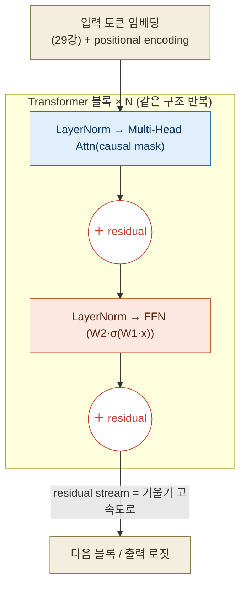
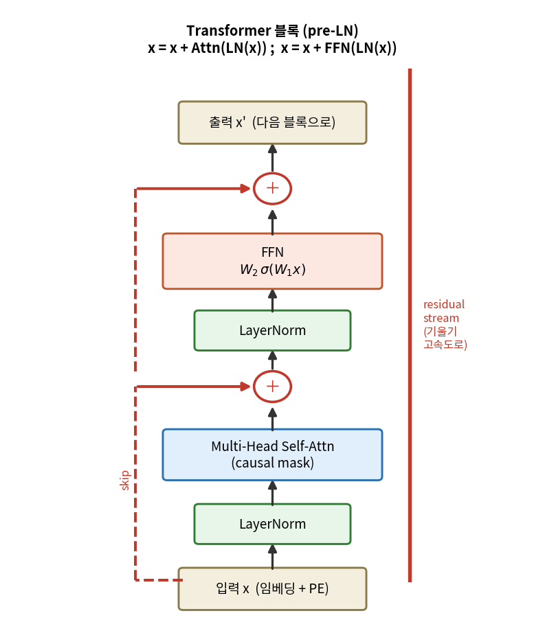
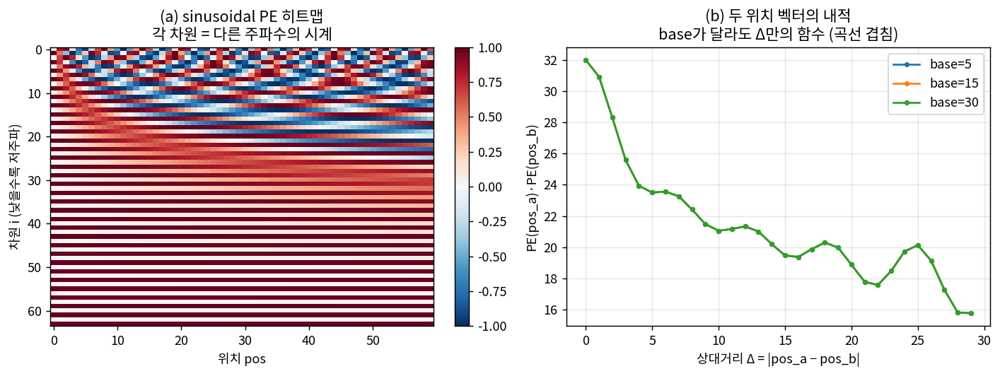
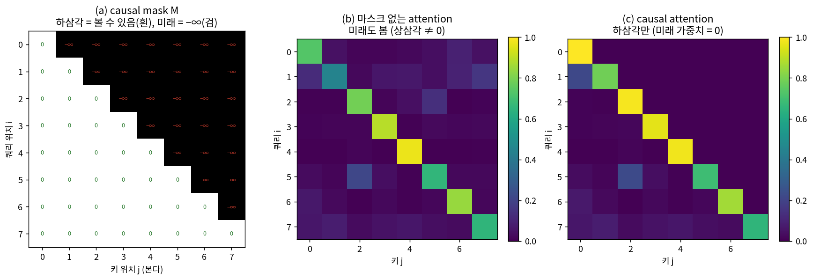
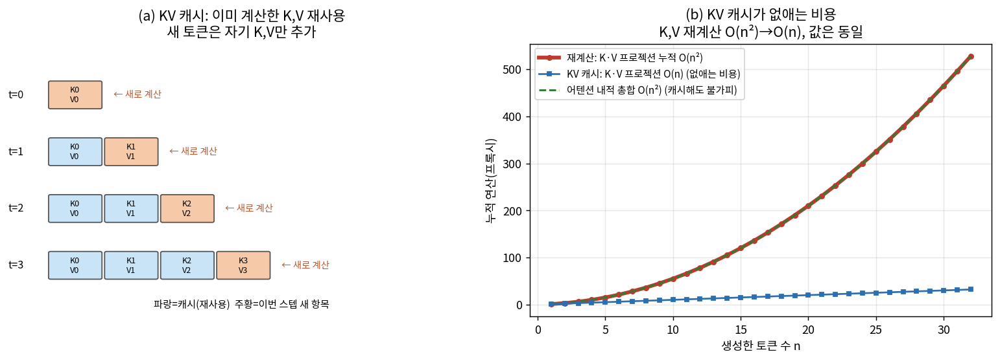

# Lec 31. Transformer 완성

> 선수 지식: 30강(attention = 내용기반 가중혼합·상태의존 게인). 관련: 8강(시간 파라미터화), 26강(역전파·연쇄법칙), 27강(정규화·과적합), 28강(잔차 $y=x+F(x)$). 다음: 32강(LLM 탄생), 44강(π0의 양방향 액션 마스크).

## 한 장 요약



30강의 attention은 "정보를 섞는" 한 연산일 뿐이었다. 이번 강의는 그것을 **실제로 작동하고 학습되는 블록**으로 조립한다 — attention(위치 간 정보 혼합)과 FFN(위치별 변환)을 **잔차(28강)**로 잇고 **LayerNorm(27강)**으로 정규화하며, 순서 정보는 **positional encoding(8강)**으로 주입하고, 자기회귀 생성은 **causal mask**로, 그 생성을 빠르게는 **KV 캐시**로. 이 다섯 부품이 GPT의 전부다.

## 학습 목표

1. pre-LN Transformer 블록 $x{=}x{+}\mathrm{Attn}(\mathrm{LN}(x));\ x{=}x{+}\mathrm{FFN}(\mathrm{LN}(x))$을 그리고, 잔차·LN 각각의 역할을 28·27강의 언어로 설명할 수 있다.
2. sinusoidal positional encoding을 쓰고, 두 위치 벡터의 내적이 **상대거리에만** 의존함을 수치로 보이며 8강 시간 파라미터화와 대비할 수 있다.
3. causal mask가 attention 가중치를 하삼각으로 만드는 것을 손·코드로 유도하고, KV 캐시가 **정확도가 아니라 속도**만 바꾼다는 것을 설명할 수 있다.
4. LayerNorm과 BatchNorm(27강)의 정규화 축 차이를 말하고, 왜 시퀀스 모델이 LayerNorm을 쓰는지 설명할 수 있다.
5. 미니 Transformer 블록을 numpy로 한 층 조립해 forward하고, 잔차 유무가 깊은 스택의 기울기 전파에 주는 차이를 수치로 재현할 수 있다.

## 왜 이 강의가 필요한가

30강에서 attention 하나를 이해했다고 GPT를 이해한 건 아니다. attention만 여러 층 쌓으면 **학습이 안 된다** — 기울기가 소멸하고(26강), 활성값이 폭주하며(조건수 악화), 게다가 attention은 순서를 전혀 모른다(집합 연산이다). 실제로 작동하는 Transformer는 이 세 병을 각각 **잔차·정규화·위치부호**라는 세 처방으로 고친 것이다. 이 처방들을 원리로 알아야 32강에서 "왜 GPT는 pre-LN인가", 34강에서 "왜 ViT도 같은 블록인가", 44강에서 "왜 π0는 텍스트엔 causal, 액션엔 양방향 마스크를 쓰는가"를 **새로운 점만** 짚어낼 수 있다.

로봇공학자에게 이 세 처방은 낯설지 않다. **잔차연결**은 28강에서 봤듯 $\partial y/\partial x = I + \partial F/\partial x$ — 항등 경로가 기울기를 통과시키는 **기울기 고속도로**다. **LayerNorm**은 매 층 입력의 스케일을 고정하는 **정규화/조건수 개선**이고, **KV 캐시**는 이미 계산한 것을 버리지 않는 **증분 계산**(칼만 필터가 전체 이력을 다시 안 푸는 것과 같은 정신, 18강)이다. 순서를 벡터로 주입하는 positional encoding은 8강에서 궤적을 시간 $s$로 파라미터화한 것의 다주파 버전이다.

## 본문

### 1. 블록의 골격 — 두 서브층, 각각 잔차 + 정규화

Transformer 블록은 두 개의 서브층을 쌓은 것이다:

- **서브층 1 — Multi-Head Self-Attention**: 위치들 사이에 정보를 섞는다(30강). "각 토큰이 다른 토큰을 얼마나 볼지"를 내용으로 정한다 — 상태의존 게인 스케줄링.
- **서브층 2 — FFN(Feed-Forward Network)**: 각 위치를 **독립적으로** 비선형 변환한다. $W_2\,\sigma(W_1 x)$, 보통 은닉폭을 4배로 넓혔다 좁힌다. attention이 "누구와 섞을까"라면 FFN은 "섞은 것을 어떻게 가공할까"다.

이 둘 각각을 **잔차**로 감싸고 **LayerNorm**을 붙인다. 현대 표준(GPT-2 이후)은 **pre-LN** — 정규화를 서브층 *앞*에 둔다:

$$
x \leftarrow x + \mathrm{Attn}\big(\mathrm{LN}(x)\big), \qquad
x \leftarrow x + \mathrm{FFN}\big(\mathrm{LN}(x)\big)
$$



*그림 1: pre-LN Transformer 블록. 왼쪽 굵은 빨강 세로선이 **residual stream** — 입력 $x$가 손실 없이 위로 흐르는 항등 경로이고, 각 서브층은 그 위에 **더할 것**만 계산한다(빨강 점선 skip = 항등, 원 안 ＋ = 잔차 덧셈). LayerNorm(초록)은 각 서브층 입력의 스케일을 고정하고, attention(파랑)은 위치 간 혼합, FFN(주황)은 위치별 변환. 블록을 N번 반복하면 스택이 된다. `images/lec31/gen_figs.py`가 이 구조를 그린다. 핵심 수식 E1의 그림 버전.*

**왜 pre-LN인가?** post-LN(원논문 방식, $\mathrm{LN}(x+\mathrm{Attn}(x))$)은 정규화가 잔차 경로 *위에* 놓여 항등 경로를 깨뜨린다 — 깊어지면 학습 초기에 기울기가 불안정해 warmup 스케줄이 필수였다. pre-LN은 잔차 경로를 정규화가 건드리지 않아(입력 $x$가 그대로 더해짐) 아주 깊은 스택도 안정적으로 학습된다(Xiong et al. 2020). 이것이 GPT 계열이 전부 pre-LN인 이유다.

### 2. 잔차 — 기울기 고속도로 (28강 회수)

블록의 각 서브층은 $F(x)$가 아니라 $x + F(x)$를 낸다. 28강의 논리가 그대로다:

$$
y = x + F(x) \;\Rightarrow\; \frac{\partial y}{\partial x} = I + \frac{\partial F}{\partial x}
$$

역전파에서 $N$개 블록을 지나면 기울기는 $\prod_k (I + \partial F_k/\partial x)$로 흐른다. 항등 $I$ 덕분에 각 인수가 최소 1의 성분을 가져 곱이 0으로 소멸하지 않는다 — **기울기 고속도로**. 잔차가 없으면 $\prod_k \partial F_k/\partial x$가 되고, 각 자코비안의 스펙트럴 반경이 1보다 작으면 곱이 지수적으로 소멸한다(26강 vanishing gradient). WE-2b에서 30층 스택으로 이 차이를 $2\times10^{-11}$ 대 $30$으로 재현한다. **잔차는 성능 옵션이 아니라 깊은 학습의 전제조건이다.**

### 3. LayerNorm — 정규화·조건수, BatchNorm과의 차이

LayerNorm은 각 토큰 벡터를 **그 벡터의 특징 차원을 따라** 평균 0·분산 1로 정규화한 뒤 학습 가능한 스케일 $\gamma$·시프트 $\beta$를 곱한다:

$$
\mathrm{LN}(x) = \gamma \odot \frac{x - \mu}{\sqrt{\sigma^2 + \epsilon}} + \beta, \qquad
\mu = \tfrac1d\sum_i x_i,\ \ \sigma^2 = \tfrac1d\sum_i (x_i-\mu)^2
$$

**BatchNorm과의 차이는 정규화 축이다(27강).** BatchNorm은 배치 축(같은 특징을 여러 샘플에 걸쳐)으로 평균/분산을 낸다 — 그래서 배치 크기·통계에 의존하고, 추론 시 running stats가 필요하며, **가변 길이 시퀀스와 자기회귀 생성**에서는 매 위치·매 스텝 통계가 달라져 곤란하다. LayerNorm은 **각 토큰 하나 안에서** 정규화하므로 배치·시퀀스 길이·생성 순서와 무관하다 — 시퀀스 모델이 LayerNorm을 쓰는 이유다. 효과는 27강의 정규화와 같다: 매 층 입력 스케일을 고정해 **손실 지형의 조건수를 개선**하고 학습률을 크게 쓸 수 있게 한다.

### 4. positional encoding — 순서를 벡터로 (8강 대비)

attention은 순열 등변(permutation-equivariant)이다 — 토큰 순서를 바꿔도 각 토큰의 출력은 자기 위치만 따라갈 뿐 "몇 번째인지"를 모른다. 언어에서 "개가 사람을 물었다"와 "사람이 개를 물었다"를 구별하려면 **위치 정보를 명시적으로 주입**해야 한다. sinusoidal 방식은 각 위치를 **여러 주파수의 사인/코사인 벡터**로 부호화한다:

$$
\mathrm{PE}(pos, 2i) = \sin\!\Big(\frac{pos}{10000^{2i/d}}\Big), \qquad
\mathrm{PE}(pos, 2i+1) = \cos\!\Big(\frac{pos}{10000^{2i/d}}\Big)
$$

낮은 차원 $i$는 고주파(빠른 시계), 높은 차원은 저주파(느린 시계) — **여러 주파수의 시계 다발**이다. 8강에서 궤적을 스칼라 시간 $s\in[0,1]$로 파라미터화한 것과 대비하면: 거기선 위치가 **하나의 스칼라**였지만, 여기선 그 스칼라를 **$d$개 주파수로 펼친 벡터**다. 왜 굳이 펼치나? 이 부호화의 결정적 성질 때문이다 — 두 위치 벡터의 내적이 **상대거리 $\Delta=|pos_a-pos_b|$의 함수**여서, attention이 "몇 칸 떨어졌는가"를 자연히 읽을 수 있다(WE-1b에서 수치로 확인). 또한 학습 때 안 본 긴 위치로 (근사) 외삽된다.



*그림 2: (a) sinusoidal PE 히트맵($d{=}64$, 위치 0~59). 위쪽 차원(저 $i$)은 위치를 따라 빠르게 진동(고주파), 아래쪽은 느리게(저주파) — **여러 주파수의 시계**. (b) 기준 위치 base $\in\{5,15,30\}$에서 $\mathrm{PE}(base)\cdot\mathrm{PE}(base{+}\Delta)$를 $\Delta$의 함수로 그린 것 — **세 곡선이 완전히 겹친다**(내적이 base가 아니라 $\Delta$에만 의존). $\Delta{=}0$에서 최대(자기 자신)이고 멀어질수록 감소한다. WE-1b가 이 겹침을 소수 넷째 자리까지($\Delta{=}3$일 때 어느 base든 25.5870) 검증한다. `gen_figs.py`로 생성.*

> **RoPE 한 줄**: 최신 LLM(LLaMA 등)은 PE를 입력에 더하는 대신 Q·K 벡터를 위치각만큼 **회전**시키는 RoPE(Su et al. 2021)를 쓴다. 회전군의 성질상 두 위치의 상대각이 곧 상대거리라 상대성이 더 깔끔하고 외삽이 낫다. 아이디어는 같다 — "상대거리를 attention이 읽게 하라". (로봇공학자에겐 익숙한 회전행렬이다.)

### 5. causal mask + KV 캐시 — 자기회귀 생성

**causal mask.** 언어 생성은 자기회귀다 — 토큰 $i$를 예측할 때 **미래 토큰 $j>i$를 보면 안 된다**(정답을 컨닝하는 꼴). attention 점수 행렬에서 미래 위치를 $-\infty$로 채우면 softmax 후 그 가중치가 0이 되어, attention이 **하삼각**만 남는다:

$$
M_{ij} = \begin{cases} 0 & j \le i \\ -\infty & j > i\end{cases}, \qquad
A = \mathrm{softmax}\!\Big(\tfrac{QK^\top}{\sqrt d} + M\Big)
$$

이 마스크 덕분에 한 번의 forward로 **모든 위치의 다음 토큰 예측을 병렬로** 학습할 수 있다(각 위치는 자기 과거만 보므로). 44강과의 대비가 중요하다: **텍스트는 인과(하삼각) 마스크**를 쓰지만, π0의 **액션 청크는 문장이 아니므로 양방향(마스크 없음)** attention을 쓴다 — 궤적은 통째로 하나의 계획이라 미래 스텝이 과거를 봐도 된다.



*그림 3: (a) causal mask $M$ — 하삼각(자신·과거, 흰 0)은 통과, 상삼각(미래, 검 $-\infty$)은 차단. (b) 마스크 없는 attention은 상삼각에도 가중치가 있어 미래를 본다. (c) causal attention은 **엄밀히 하삼각**만 남는다(미래 가중치 = 정확히 0). WE-1a가 이 하삼각 구조와 각 행 합=1(토큰0은 자기만 봐 가중치 1.0)을 검증한다. `gen_figs.py`로 생성.*

**KV 캐시.** 자기회귀 생성은 한 토큰씩 뽑는다. 소박하게 하면 토큰 $t$를 생성할 때마다 이전 $t$개 토큰의 K·V를 **전부 다시 계산**한다 — 총비용 $O(n^2)$. 그러나 이미 생성된 토큰들의 K·V는 **변하지 않는다**(causal이라 과거는 미래에 영향받지 않음). 그래서 계산한 K·V를 **캐시에 쌓아두고 새 토큰의 K·V 하나만 추가**하면, K·V 프로젝션 비용이 스텝당 $O(n^2)\to O(1)$로 준다(어텐션 내적 자체는 여전히 스텝당 $O(n)$이나 프로젝션 재계산이 사라진다). **핵심: 캐시는 수치를 한 비트도 바꾸지 않는다 — 순수한 속도 최적화다**(WE-2의 KV 파트에서 캐시 출력과 재계산 출력이 $10^{-16}$까지 동일함을 확인).



*그림 4: (a) KV 캐시 — 스텝 $t$마다 새 토큰의 K·V(주황)만 계산해 캐시(파랑)에 붙인다. (b) 누적 비용: 매 스텝 K·V를 전체 재계산하면 $\sum_t t = O(n^2)$(굵은 빨강), 캐시는 스텝당 K·V 1개씩이라 $O(n)$(파랑) — 이 격차가 캐시가 없애는 비용이다. 어텐션 내적 총합(초록 파선)도 $O(n^2)$라 빨강 곡선과 정확히 겹치며(둘 다 $O(n^2)$), 이것은 캐시로도 사라지지 않는 불가피한 비용이다. `gen_figs.py`로 생성. 44강 대비: flow 액션 expert는 청크를 한 번에 내므로 이 증분 디코딩과 다른 계산 패턴이다.*

### 핵심 수식

블록의 세 축을 세 수식으로 잡는다: **E1** 블록 = (attention + FFN) + residual + LN(구조), **E2** positional encoding(순서 주입), **E3** causal mask + KV 캐시(자기회귀 생성과 그 가속).

#### E1. Transformer 블록 — (attention + FFN) + residual + LayerNorm

**① 직관**: 한 블록은 두 가지 일을 한다 — **attention**으로 토큰들끼리 정보를 섞고(누가 누구를 볼까), **FFN**으로 각 토큰을 따로 가공한다(섞은 걸 어떻게 쓸까). 각 일에 **잔차**(원본을 보존하고 변화분만 더함)와 **정규화**(스케일 고정)를 씌운다.

**② 물리·기하적 의미**: residual stream은 입력이 손실 없이 위로 흐르는 **버스**이고, 각 서브층은 그 버스에서 값을 읽어(LN으로 정규화해) 변화분을 계산해 **다시 버스에 더한다**(28강 잔차 = 기울기 고속도로). 이 구조 덕에 100+층도 학습된다. attention은 위치 간(가로) 혼합, FFN은 위치별(세로) 변환 — 가로·세로를 번갈아 하는 것이 "관계를 읽고 그 결과를 가공"하는 계산의 최소 단위다. LayerNorm은 매 서브층 입력의 조건수를 고쳐(27강) 큰 학습률을 허용한다.

**③ 형식(유도 요점)**: pre-LN 블록은
$$
x \leftarrow x + \mathrm{Attn}(\mathrm{LN}(x)), \qquad x \leftarrow x + \mathrm{FFN}(\mathrm{LN}(x)), \qquad \mathrm{FFN}(u)=W_2\,\sigma(W_1 u + b_1)+b_2
$$
$\sigma$는 보통 GELU/ReLU, 은닉폭은 $4d$. 잔차 덕에 각 서브층의 자코비안은 $I + \partial(\text{서브층})/\partial x$가 되어 기울기가 항등 경로로 통과한다. 블록을 $N$번 쌓고 마지막에 LN + 선형(vocab 로짓)을 붙이면 GPT의 몸통이다.

#### E2. positional encoding — 여러 주파수의 시계, 상대거리를 선형으로

**① 직관**: attention은 순서를 모르니(집합 연산) 위치를 벡터로 더해 준다. 위치를 하나의 숫자가 아니라 **여러 주파수의 사인/코사인**으로 쓰면, 두 위치 사이의 "거리"를 attention이 내적으로 읽을 수 있다.

**② 물리·기하적 의미**: 8강에서 궤적을 시간 $s$로 파라미터화한 것과 대비 — 거기선 위치가 스칼라였지만 여기선 **다주파 벡터**다. 각 차원이 다른 주기의 시계라, 낮은 차원(고주파)은 인접 위치를, 높은 차원(저주파)은 먼 위치를 구별한다(이진수 자릿수처럼). 결정적 성질: 특정 상대거리 $\Delta$만큼 떨어진 두 위치는 (근사) **고정된 선형변환**으로 연결되어, 내적 $\mathrm{PE}(a)\cdot\mathrm{PE}(a{+}\Delta)$가 $a$와 무관하게 $\Delta$의 함수가 된다(그림 2b의 겹침). RoPE는 이 상대성을 회전으로 정확히 만든 버전이다.

**③ 형식(유도 요점)**: $\mathrm{PE}(pos,2i)=\sin(pos/10000^{2i/d})$, $\mathrm{PE}(pos,2i{+}1)=\cos(pos/10000^{2i/d})$. 주파수 $\omega_i = 10000^{-2i/d}$로 쓰면 한 쌍 $(2i,2i{+}1)$의 내적 기여는 $\sin(\omega_i a)\sin(\omega_i b)+\cos(\omega_i a)\cos(\omega_i b)=\cos(\omega_i(a-b))$ — **정확히 상대거리 $a-b$의 코사인**. 모든 주파수에 대해 합하면 내적 $= \sum_i \cos(\omega_i \Delta)$로 $\Delta$만의 함수. 입력에 $x + \mathrm{PE}(pos)$로 더해 주입한다.

#### E3. causal mask + KV 캐시 — 자기회귀 생성과 그 가속

**① 직관**: 미래를 못 보게 attention 점수의 상삼각을 $-\infty$로 막으면(causal mask), 한 번의 forward로 모든 위치의 "다음 토큰"을 동시에 학습·예측한다. 생성 때는 과거 토큰의 K·V가 안 변하니 **재사용**(KV 캐시)해 매 스텝 재계산을 없앤다.

**② 물리·기하적 의미**: 하삼각 마스크는 "인과율" — 정보가 과거→미래로만 흐른다(칼만 필터가 미래 관측 없이 추정하는 것과 같은 인과 구조, 18강). KV 캐시는 **증분 계산**이다: 칼만이 전체 이력을 다시 안 풀고 새 관측만 반영하듯, 새 토큰의 K·V만 붙인다. 44강과의 대비가 핵심 — 텍스트는 인과 마스크(순차), 액션 청크는 양방향 마스크(궤적은 문장이 아니라 통짜 계획).

**③ 형식(유도 요점)**: $M_{ij}=0\ (j\le i),\ -\infty\ (j>i)$, $A=\mathrm{softmax}(QK^\top/\sqrt d + M)$ → $A$는 하삼각. 생성 스텝 $t$에서 캐시 $\{K_{<t},V_{<t}\}$에 새 $k_t,v_t$를 append하고 $q_t$로 $\mathrm{softmax}(q_t[K_{\le t}]^\top/\sqrt d)[V_{\le t}]$만 계산 — K·V 프로젝션이 스텝당 $O(t)\to O(1)$. **출력은 재계산과 비트 단위로 동일**(WE-2 KV 파트: 최대차 $3.3\times10^{-16}$).

### Worked Example

#### WE-1 (손계산 + 코드): causal mask의 하삼각화, PE 내적의 상대거리 의존

**(a) causal mask.** 4토큰·8차원 self-attention에서 점수 $QK^\top/\sqrt d$의 상삼각을 $-\infty$로 채우면, softmax 후 각 행은 **자기와 과거에만** 가중치를 준다. 손으로 확인할 것: 토큰 0은 볼 게 자기뿐이라 가중치 $[1,0,0,0]$; 모든 행 합 = 1; 상삼각 원소 = 정확히 0.

**(b) PE 내적.** $d{=}64$에서 $\mathrm{PE}(a)\cdot\mathrm{PE}(a{+}\Delta)$가 $a$와 무관함을 본다. $\Delta{=}3$일 때 $(a,a{+}3)$을 $(5,8),(10,13),(20,23),(40,43)$로 바꿔도 내적이 **모두 25.5870**이면 상대거리 의존이 입증된다. $\Delta{=}0$이면 $\|\mathrm{PE}\|^2 = 32$(=$d/2$, 각 주파수쌍이 $\sin^2{+}\cos^2{=}1$을 $d/2$개 더한 값).

```python
import numpy as np

# (a) causal mask -> 하삼각 attention -------------------------------------
rng = np.random.default_rng(0)
T, d = 4, 8
X = rng.standard_normal((T, d))
def softmax_rows(S):
    S = S - S.max(-1, keepdims=True); e = np.exp(S); return e/e.sum(-1, keepdims=True)
scores = X @ X.T / np.sqrt(d)
mask = np.triu(np.ones((T, T)), k=1).astype(bool)      # True = 미래(가릴 곳)
sm = scores.copy(); sm[mask] = -np.inf
A = softmax_rows(sm)
print(np.round(A, 3))
# [[1.    0.    0.    0.   ]      토큰0: 자기만 봄
#  [0.017 0.983 0.    0.   ]
#  [0.165 0.217 0.618 0.   ]
#  [0.08  0.304 0.108 0.508]]     항상 하삼각
print("상삼각 최대:", A[np.triu_indices(T,1)].max())   # 0.0  (미래 가중치 정확히 0)
print("행 합:", np.round(A.sum(1), 6))                  # [1. 1. 1. 1.]

# (b) PE 내적 = 상대거리의 함수 -------------------------------------------
d_model = 64
def pe(pos, d=d_model):
    v = np.zeros(d); i = np.arange(d//2); denom = 10000.0**(2*i/d)
    v[0::2] = np.sin(pos/denom); v[1::2] = np.cos(pos/denom); return v
for a, b in [(5,8),(10,13),(20,23),(40,43)]:            # 전부 Δ=3
    print(f"PE[{a}]·PE[{b}] = {pe(a)@pe(b):.4f}")        # 모두 25.5870
print("Δ=0 자기내적:", pe(10)@pe(10))                    # 32.0000  (= d/2)
```

출력이 손계산과 일치한다: 하삼각(상삼각 최대 = 0.0), 행 합 = 1, 토큰0 = $[1,0,0,0]$; PE 내적은 $\Delta{=}3$에서 base와 무관하게 25.5870, 자기내적 32.0. **causal mask는 "미래를 0으로 지운다", PE는 "상대거리를 내적으로 읽게 한다"** — 이 두 줄이 그림 3·2를 만든 핵심이다.

#### WE-2 (코드): 미니 Transformer 블록 forward, 잔차 유무의 기울기 전파

E1을 numpy로 조립한다. 임베딩 + PE → LN → multi-head causal attention → 잔차 → LN → FFN → 잔차. 입출력 shape·수치를 검증하고, **잔차 유무가 깊은 스택에서 기울기에 주는 차이**를 본다.

```python
import numpy as np
rng = np.random.default_rng(42)
T, d, dff, Hh = 5, 16, 64, 2; dh = d//Hh
def softmax_rows(S):
    S = S - S.max(-1, keepdims=True); e = np.exp(S); return e/e.sum(-1, keepdims=True)
def layernorm(x, g, b, eps=1e-5):
    mu = x.mean(-1, keepdims=True); var = x.var(-1, keepdims=True)
    return g*(x-mu)/np.sqrt(var+eps) + b
def pe(pos, dd):
    v = np.zeros(dd); i = np.arange(dd//2); den = 10000.0**(2*i/dd)
    v[0::2] = np.sin(pos/den); v[1::2] = np.cos(pos/den); return v
def rp(*s): return rng.standard_normal(s)*0.2
Wq,Wk,Wv,Wo = rp(d,d),rp(d,d),rp(d,d),rp(d,d)
g1,b1,g2,b2 = np.ones(d),np.zeros(d),np.ones(d),np.zeros(d)
W1,W2 = rp(d,dff),rp(dff,d)
x0 = rp(T,d) + np.stack([pe(p,d) for p in range(T)])     # 임베딩 + PE
def mha(x):                                              # multi-head causal self-attn
    Q,K,V = x@Wq, x@Wk, x@Wv; out = np.zeros_like(x)
    m = np.triu(np.ones((T,T)),1).astype(bool)
    for h in range(Hh):
        s = slice(h*dh,(h+1)*dh)
        sc = Q[:,s]@K[:,s].T/np.sqrt(dh); sc[m] = -np.inf
        out[:,s] = softmax_rows(sc)@V[:,s]
    return out@Wo
def ffn(x): return np.maximum(0, x@W1)@W2                # ReLU FFN
def block_res(x): x = x+mha(layernorm(x,g1,b1)); return x+ffn(layernorm(x,g2,b2))
def block_nor(x): x = mha(layernorm(x,g1,b1));   return ffn(layernorm(x,g2,b2))
y = block_res(x0)
print("shape:", x0.shape, "->", y.shape)                 # (5,16) -> (5,16)
cr = np.sum(x0*block_res(x0),1)/(np.linalg.norm(x0,axis=1)*np.linalg.norm(block_res(x0),axis=1))
cn = np.sum(x0*block_nor(x0),1)/(np.linalg.norm(x0,axis=1)*np.linalg.norm(block_nor(x0),axis=1))
print(f"cos(입력,출력) 잔차有={cr.mean():.3f}  잔차無={cn.mean():.3f}")  # 0.396  0.038
```

한 블록 forward가 shape을 보존하고(5×16 → 5×16), 잔차가 있으면 출력이 입력 방향을 크게 유지한다(cos 0.396 vs 잔차 없으면 0.038 — 입력이 거의 지워짐). 잔차의 진짜 값어치는 **깊은 스택의 기울기**에서 드러난다:

```python
# 잔차 유무의 기울기 전파: y=x+F(x) vs y=F(x)를 30층 곱으로 (28강 ∂y/∂x=I+∂F/∂x)
rng = np.random.default_rng(0); d, N = 16, 30
def sub_jac():                                            # 서브층 자코비안 (스펙트럴 반경 0.8)
    A = rng.standard_normal((d,d)); return A/np.linalg.norm(A,2)*0.8
Js = [sub_jac() for _ in range(N)]; I = np.eye(d)
gN, gR = I.copy(), I.copy()
for J in Js:
    gN = J @ gN                                           # 잔차 없음: ∏ ∂F
    gR = (I+J) @ gR                                       # 잔차 있음: ∏ (I+∂F)
print(f"30층 후 기울기 노름  잔차無={np.linalg.norm(gN,2):.2e}  잔차有={np.linalg.norm(gR,2):.2f}")
# 잔차無=2.06e-11   잔차有=30.56
```

잔차가 없으면 30층 후 기울기가 $2\times10^{-11}$로 **소멸**하고(26강 vanishing gradient), 잔차가 있으면 $\approx 30$으로 살아남는다 — 항등 $I$가 매 층 기울기를 통과시키는 **기울기 고속도로**다(그림 1의 residual stream). 이것이 "attention만 쌓으면 왜 안 되는가"의 정량적 답이다.

```python
# KV 캐시: 캐시 출력 == 재계산 출력 (속도만 다르고 값은 동일)
rng = np.random.default_rng(7); Tn, dd = 6, 8
Xa = rng.standard_normal((Tn, dd))
Wq2,Wk2,Wv2 = [rng.standard_normal((dd,dd))*.3 for _ in range(3)]
Kc,Vc,oc,of = [],[],[],[]
for t in range(Tn):
    xt = Xa[t:t+1]; Kc.append((xt@Wk2)[0]); Vc.append((xt@Wv2)[0]); q = xt@Wq2
    Km,Vm = np.stack(Kc),np.stack(Vc)
    oc.append((softmax_rows(q@Km.T/np.sqrt(dd))@Vm)[0])              # 캐시
    P = Xa[:t+1]; of.append((softmax_rows((P@Wq2)[-1:]@(P@Wk2).T/np.sqrt(dd))@(P@Wv2))[0])  # 재계산
print("max|캐시-재계산| =", np.max(np.abs(np.array(oc)-np.array(of))))   # 3.33e-16
```

캐시와 재계산의 최대차가 $3.3\times10^{-16}$(부동소수 오차) — **KV 캐시는 정확도를 바꾸지 않는다**. 이것이 흔한 오해 4("캐시가 정확도를 바꾼다")의 반증이다.

### 로봇공학자를 위한 번역

- **잔차 = 기울기 고속도로**: 28강 그대로. $\partial y/\partial x = I + \partial F/\partial x$의 항등 경로는 다단 곱셈 시스템에서 게인이 소실되지 않게 하는 **바이패스**다. 제어의 적분기 anti-windup이 신호 경로를 확보하듯, 잔차는 기울기 경로를 확보한다.
- **LayerNorm = 정규화·조건수 개선**: 27강. 매 층 입력을 표준화하면 손실 지형의 조건수가 좋아져(자코비안 스케일 균일) 큰 학습률이 안전하다 — DLS의 스케일링이나 좌표 정규화와 같은 정신.
- **positional encoding = 다주파 시간 파라미터화**: 8강의 시간 $s$를 여러 주파수로 펼친 것. 상대거리를 내적으로 읽는 성질은 신호처리의 상관(correlation)과 같다.
- **causal mask = 인과율, KV 캐시 = 증분 추정**: 하삼각 마스크는 칼만 필터의 인과 구조(과거만으로 추정, 18강)와 같고, KV 캐시는 전체 이력을 다시 안 푸는 **증분 갱신**이다.

## 흔한 오해

1. **"positional encoding은 순서 번호 하나다"** — 아니다. 위치를 **여러 주파수의 사인/코사인 벡터**($d$차원)로 부호화한다(E2). 단일 스칼라라면 상대거리를 내적으로 읽는 성질(그림 2b)도, 긴 위치 외삽도 없다. "다주파 시계 다발"이 핵심이다.
2. **"LayerNorm = BatchNorm의 다른 이름이다"** — 정규화 **축**이 다르다(§3). BatchNorm은 배치 축(샘플들에 걸쳐 같은 특징), LayerNorm은 특징 축(한 토큰 안). 그래서 LayerNorm은 배치 크기·시퀀스 길이·생성 순서와 무관해 자기회귀 시퀀스 모델에 맞는다.
3. **"residual은 성능을 조금 올리는 옵션이다"** — 아니다. 깊은 학습의 **전제조건**이다(§2, WE-2b). 잔차가 없으면 30층에서 기울기가 $2\times10^{-11}$로 소멸해 학습 자체가 안 된다(26강). attention만 쌓으면 안 되는 이유가 이것이다.
4. **"KV 캐시는 정확도를 바꾼다"** — 아니다. **속도만** 바꾼다(§5, WE-2 KV 파트: 캐시와 재계산의 최대차 $3.3\times10^{-16}$). 과거 토큰의 K·V가 causal이라 안 변한다는 사실에 기반한 **정확한 재사용**이다. 정확도가 달라졌다면 구현 버그다.
5. **"블록을 많이 쌓으면 자동으로 좋아진다"** — 스택은 잔차·LN·적절한 초기화·pre-LN·데이터·정규화(27강)가 함께여야 학습된다. 깊이 자체가 성능을 보장하지 않는다 — 오히려 이 처방들이 없으면 깊을수록 나빠진다. 스케일링 법칙(32강)은 "제대로 학습되는 구조"를 전제로 한 경험곡선이다.

## 실습 (약 90분)

**A안 (CPU, 추천 — 코드가 곧 정의): nanoGPT 블록 한 층 읽고 만지기.** Karpathy nanoGPT의 `model.py`에서 `Block`·`CausalSelfAttention`·`LayerNorm`을 열어 이 강의의 E1~E3와 한 줄씩 대응시킨다. ① `Block.forward`가 `x = x + attn(ln1(x)); x = x + mlp(ln2(x))`인지 확인(pre-LN). ② causal mask가 `torch.tril`로 만들어지는지, 상삼각이 `-inf`로 채워지는지. ③ WE-2의 numpy 블록에 torch로 자동미분을 붙여 잔차 유무의 기울기 노름을 실제 `.backward()`로 재현(30층). ④ (있으면) KV 캐시 경로에서 생성 시 캐시 on/off 출력이 같은지 assert.

**B안 (CPU): PE·mask 시각화 확장.** `gen_figs.py`를 복사해 (1) PE 주파수 개수를 바꿔 히트맵이 어떻게 변하는지, (2) RoPE를 numpy로 구현해 sinusoidal PE와 상대거리 내적 곡선을 비교, (3) 양방향 마스크(액션용, 44강)와 causal 마스크의 attention 차이를 나란히 그린다. "왜 궤적엔 양방향이 맞는가"를 Claude와 토론.

## Claude와 토론할 질문

1. pre-LN과 post-LN에서 잔차 경로가 정규화에 의해 깨지는지 아닌지를 식으로 쓰고, 왜 pre-LN이 깊은 스택에서 warmup 없이 안정적인지 설명해 보라.
2. positional encoding을 **입력에 더하는데**(임베딩과 섞이는데) 왜 정보가 뭉개지지 않는가? (힌트: 학습이 임베딩·PE 부분공간을 분리할 수 있는가.)
3. LayerNorm을 배치 축으로 바꾸면(=BatchNorm) 자기회귀 생성에서 정확히 무엇이 깨지는가? running stats·가변 길이·생성 순서를 짚어 답하라.
4. KV 캐시는 K·V 프로젝션을 $O(n^2)\to O(n)$으로 줄이지만 어텐션 내적 자체는 여전히 $O(n^2)$다. 긴 컨텍스트에서 진짜 병목은 무엇이고, 왜 최신 모델이 attention의 이차 비용을 줄이려 하는가?
5. causal mask(텍스트)와 양방향 마스크(액션 청크, 44강)의 선택 기준은? "궤적은 문장이 아니다"를 마스크·인과율의 언어로 풀어 보라.
6. 잔차 없이 attention만 30층 쌓으면 기울기가 소멸한다(WE-2b). 그런데 왜 잔차가 있으면 기울기 노름이 오히려 **커지는가**(30.56)? 이것이 학습에 문제를 일으킬 수 있는가? (힌트: LayerNorm·초기화가 이 성장을 어떻게 통제하는가.)
7. RoPE(회전)와 sinusoidal(가산) PE 둘 다 "상대거리를 attention에 읽힌다". 회전군의 성질이 상대성을 왜 더 깔끔하게 만드는지, 로봇공학의 회전행렬 직관으로 설명해 보라.

## 읽을거리

1. **J. Alammar, "The Illustrated Transformer"** (전체) + **3Blue1Brown "Transformers"** 영상: 그림으로 블록·attention·PE를 (~40분). 수식보다 그림이 먼저 필요할 때.
2. **Vaswani et al. 2017 (arXiv:1706.03762) §3.1~3.5만**: 블록 구조·multi-head·PE 정의. 학습 세부·실험은 건너뛰어도 된다.
3. **Karpathy nanoGPT `model.py`** (약 300줄): 이 강의의 E1~E3가 그대로 코드다 — Block/CausalSelfAttention/LayerNorm만 읽으면 충분.

## 자가 점검

1. pre-LN 블록 $x{=}x{+}\mathrm{Attn}(\mathrm{LN}(x));\ x{=}x{+}\mathrm{FFN}(\mathrm{LN}(x))$을 안 보고 그리고, 잔차·LN·attention·FFN 각각의 역할을 한 줄씩 말할 수 있는가?
2. 잔차가 왜 깊은 학습의 전제조건인지 $\partial y/\partial x = I + \partial F/\partial x$로 설명하고, WE-2b의 $2\times10^{-11}$ 대 $30$을 그 언어로 해석할 수 있는가?
3. LayerNorm과 BatchNorm의 정규화 축 차이를 말하고, 왜 시퀀스 모델이 LayerNorm을 쓰는지 답할 수 있는가?
4. sinusoidal PE의 정의를 쓰고, 두 위치 내적이 상대거리에만 의존함을(그림 2b의 겹침, WE-1b의 25.5870) 설명할 수 있는가? 8강 시간 파라미터화와의 차이는?
5. causal mask가 attention을 하삼각으로 만드는 것을 손으로 보이고, 텍스트(causal)와 액션 청크(양방향, 44강)의 마스크 차이를 말할 수 있는가?
6. KV 캐시가 무엇을 재사용하고 무엇을 절약하며(K·V 프로젝션 $O(n^2)\to O(n)$), **왜 정확도를 바꾸지 않는지**($3.3\times10^{-16}$) 설명할 수 있는가?
7. "블록을 쌓으면 자동으로 좋아진다"가 왜 틀렸는지, 스택이 학습되려면 무엇이 함께여야 하는지 말할 수 있는가?

## 참고문헌

> 본문 수치·주장의 출처. 웹 문서는 2026-07-09 접속 기준.

[1] A. Vaswani et al., "Attention Is All You Need," arXiv:1706.03762, 2017.6. https://arxiv.org/abs/1706.03762
— **뒷받침**: Transformer 블록 구조(multi-head self-attention + position-wise FFN, 각 서브층에 residual + LayerNorm), sinusoidal positional encoding 정의 $\mathrm{PE}(pos,2i)=\sin(pos/10000^{2i/d})$, FFN 은닉폭 $4d$, causal(masked) self-attention.

[2] J. L. Ba, J. R. Kiros, G. E. Hinton, "Layer Normalization," arXiv:1607.06450, 2016.7. https://arxiv.org/abs/1607.06450
— **뒷받침**: LayerNorm이 특징 축(한 샘플 안)으로 정규화해 배치 크기·시퀀스 길이와 무관하다는 점, BatchNorm과의 축 차이.

[3] R. Xiong et al., "On Layer Normalization in the Transformer Architecture," arXiv:2002.04745, 2020.2. https://arxiv.org/abs/2002.04745
— **뒷받침**: pre-LN이 잔차 경로를 보존해 warmup 없이 깊은 스택을 안정적으로 학습, post-LN 대비 학습 초기 기울기 안정성.

[4] J. Su et al., "RoFormer: Enhanced Transformer with Rotary Position Embedding," arXiv:2104.09864, 2021.4. https://arxiv.org/abs/2104.09864
— **뒷받침**: RoPE가 Q·K를 위치각만큼 회전시켜 상대위치를 인코딩, 상대성·외삽 이점(§4 RoPE 문단).

[5] A. Karpathy, nanoGPT. https://github.com/karpathy/nanoGPT
— **뒷받침**: Block/CausalSelfAttention/LayerNorm 구현이 E1~E3의 코드 대응(pre-LN, tril causal mask, KV 캐시 경로), 실습 A안.

*수치 재현성: 핵심 수식·Worked Example·그림의 numpy 토이 수치는 `images/lec31/gen_figs.py`와 본문 코드 블록의 실행 출력이다 — causal attention의 하삼각화(상삼각 가중치 정확히 0, 행 합 1, 토큰0=$[1,0,0,0]$), PE 내적의 상대거리 의존($\Delta{=}3$일 때 base와 무관하게 25.5870, 자기내적 $=d/2=32$), 미니 블록 forward의 shape 보존(5×16→5×16)과 잔차 유무 cos(0.396 vs 0.038), 30층 스택 기울기 노름(잔차無 $2.06\times10^{-11}$ vs 잔차有 30.56), KV 캐시와 재계산의 최대차 $3.3\times10^{-16}$. numpy 1.26 / scipy 1.15 / matplotlib 3.5 기준 재현 확인. **이 토이는 개념 재현용 CPU 시뮬레이션이며 실제 대형 Transformer/GPT 가중치가 아니다** — pre-LN 안정성·RoPE 등 구조 주장은 위 [1]–[4] 1차 출처.*

<!-- lecture-nav -->

---

⬅ 이전: [Lec 30. Attention 해부](lec30-attention.md)　｜　[📖 전체 목차](../README.md)　｜　다음: [Lec 32. LLM의 탄생](lec32-birth-of-llm.md) ➡
