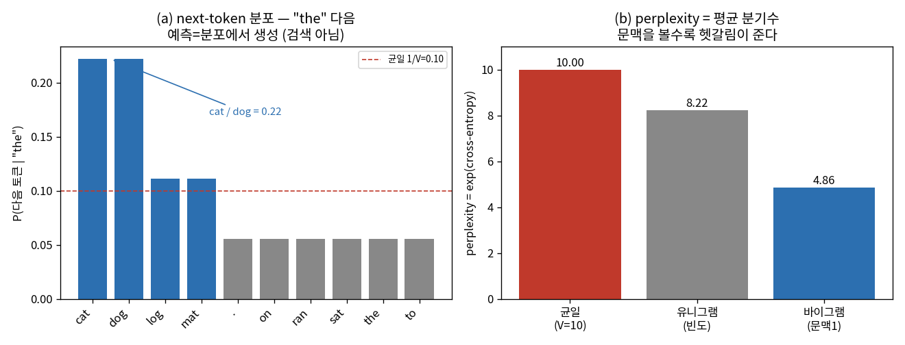
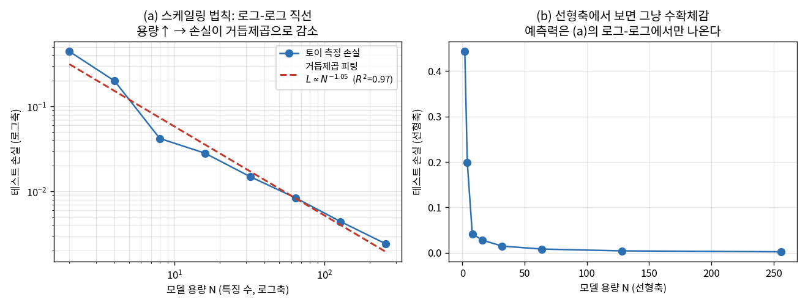
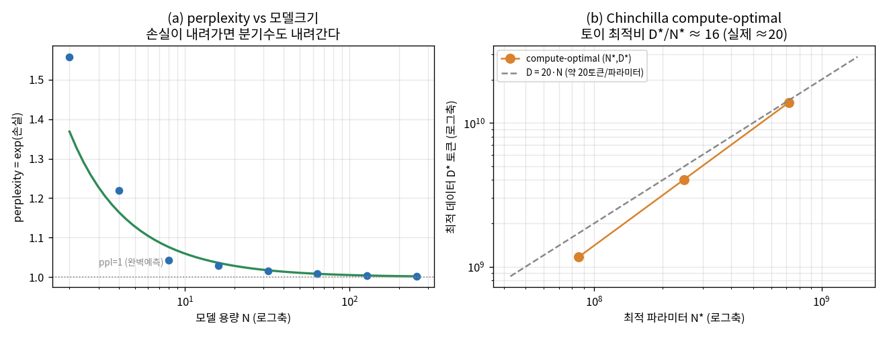
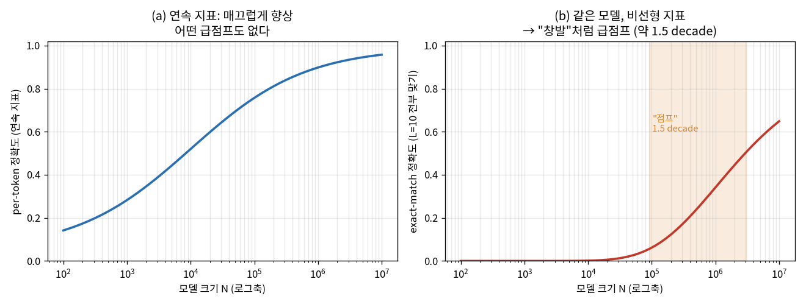

# Lec 32. LLM의 탄생

> 선수 지식: 31강(Transformer 완성 — attention·residual·LayerNorm·positional encoding). 26강(신경망=함수근사), 27강(학습 파이프라인·정칙화·과적합)을 봤다면 스케일링·창발 논쟁이 훨씬 선명하다. 29강(토큰·임베딩)의 "행동도 언어처럼 토큰"이라는 복선이 이 강의 끝에서 42강 RT-2로 회수된다.

## 한 장 요약


"다음 토큰 맞히기"라는 단 하나의 목적을 웹 규모로 스케일하면 — 손실이 거듭제곱으로 **예측 가능하게** 줄고(스케일링 법칙), 프롬프트 예시만으로 새 태스크를 푸는(**in-context learning**) 능력이 규모에서 출현한다. 이 사전학습된 세계 지식이 정확히 VLA(RT-2·π0)가 로봇으로 전이시키는 그 자산이다.

## 학습 목표

1. 자기회귀 언어모델링 목적 $L=-\sum_t \log p(x_t\mid x_{<t})$를 쓰고, **cross-entropy=압축**·**perplexity=평균 분기수**의 정보이론적 의미를 설명할 수 있다.
2. 스케일링 법칙 $L(N)\approx (N_c/N)^{\alpha_N}$이 왜 로그-로그 직선인지 유도하고, Chinchilla compute-optimal("약 20토큰/파라미터")을 제어공학의 경험적 성능 곡선에 대응시킬 수 있다.
3. in-context learning을 "가중치 갱신 없는 메타학습"으로 설명하고, few-shot 프롬프트가 왜 파인튜닝과 다른지 말할 수 있다.
4. "창발"의 신기루 논쟁(Wei vs Schaeffer)을 **지표 선택**의 문제로 재구성하고, 같은 매끄러운 향상이 비선형 지표에서 급점프로 보이는 착시를 numpy로 재현할 수 있다.
5. 사전학습→능력이 42강 RT-2/44강 π0의 웹 지식 전이의 근간임을 설명할 수 있다.

## 왜 이 강의가 필요한가

31강에서 Transformer라는 **아키텍처**를 완성했다. 그러나 아키텍처는 그릇일 뿐이다 — GPT-2와 GPT-3는 사실상 같은 그릇(decoder-only Transformer)인데, 하나는 "그럴듯한 문장 생성기"였고 다른 하나는 "예시 몇 개로 번역·산수·코딩을 하는" 물건이었다. 무엇이 달랐나? **규모 하나다.** 이 강의는 "같은 아키텍처를 스케일하면 무슨 일이 벌어지는가"라는, 지난 5년 AI의 가장 중요한 경험적 발견을 다룬다.

로봇공학자에게 이것이 왜 남의 일이 아닌가? 42강에서 RT-2는 로봇 데이터를 거의 늘리지 않고도 "멸종한 동물을 집어" 같은 지시를 이해했다. 그 능력은 로봇 데이터가 아니라 **웹 사전학습에서 상속**된 것이다. 44강 π0의 PaliGemma 백본, 46강 GR00T, 47강 SmolVLA — 이 계보 전체가 "먼저 웹으로 사전학습된 VLM을 로봇으로 전이한다"는 문법 위에 서 있다. 그 문법의 원산지가 이 강의다. 사전학습이 무엇을 만들어 내는지, 스케일링이 무엇을 약속하고 어디서 깨지는지, 창발이 진짜인지 지표 착시인지를 **직접 재현해 본 사람만이** VLA 논문의 "웹 지식 덕분에 일반화했다"는 주장을 곧이곧대로 믿을지 의심할지 판정할 수 있다.

이걸 "LLM은 마법이다"로 외우면 63강(프론티어)·64강(논문 읽기)에서 무력하다. 반대로 "스케일링이 영원히 성립한다"고 믿으면 Chinchilla 이후의 데이터 병목을 못 본다. 이 강의의 핵심 수식과 worked example은 정확히 이 균형 감각 — 스케일링의 힘과 그 한계, 창발의 실체와 그 착시 — 을 CPU numpy 토이로 손에 쥐여 준다.

## 본문

### 0. GPT-2에서 GPT-3로 — 규모가 종류를 바꾼 사건

2019년 GPT-2(1.5B)는 "인상적인 문장 생성기"였다. 2020년 GPT-3(175B)는 같은 아키텍처를 ~100배 키웠을 뿐인데, **프롬프트에 예시 몇 개를 넣으면 파인튜닝 없이 새 태스크를 수행**했다(few-shot). 번역, 세 자리 덧셈, SQL 생성 — 훈련 목적에 그런 태스크는 명시된 적이 없다. 목적은 시종일관 하나, **"다음 토큰 맞히기"**뿐이었다.

이 사건이 던진 세 질문이 이 강의의 뼈대다:
- **왜 next-token 예측만으로 세계 지식이 생기는가?** (§1, E1)
- **규모를 키우면 얼마나 좋아지는지 예측할 수 있는가?** (§2, E2)
- **예시만으로 새 태스크를 푸는 능력은 어디서 오는가 — 그리고 그건 진짜 "새 능력"인가?** (§3, E3)

### 1. next-token 예측 = 압축 = 세계 모델

언어모델은 시퀀스 $x_1,\dots,x_T$의 확률을 조건부의 곱으로 분해한다: $p(x_{1:T})=\prod_t p(x_t\mid x_{<t})$. 학습은 이 조건부 분포 $p_\theta(x_t\mid x_{<t})$를 데이터에 맞히는 것, 즉 **다음 토큰 예측**이다. 겉보기엔 하찮다 — "the cat sat on the ___" 빈칸 채우기. 그러나 이 빈칸을 정말 잘 채우려면 문법·사실·상식·추론을 전부 알아야 한다. "물은 100°C에서 ___"의 빈칸을 맞히려면 물리를 알아야 하고, "$17 \times 3 =$ ___"을 맞히려면 산수를 해야 한다. **압축이 곧 이해**라는 정보이론의 오래된 직관이 여기서 실물이 된다: 데이터를 짧게 압축(=낮은 cross-entropy)하려면 데이터를 생성한 규칙을 내부에 가져야 한다.



*그림 1: (a) 작은 코퍼스에서 "the" 다음 토큰의 예측 분포(bigram, add-1 평활). 모델은 사실 DB를 **검색**하는 게 아니라 확률 분포에서 **생성**한다 — "cat"과 "dog"가 각 0.22로 동률, 나머지는 낮다. (b) perplexity = exp(cross-entropy) = **평균 분기수**. 균일(아무것도 모름) 10 → 유니그램(빈도만) 8.22 → 바이그램(문맥 1토큰) 4.86. **문맥을 볼수록 다음 토큰의 불확실성(분기수)이 준다** — 이것이 "예측을 잘한다=세계를 안다"의 수치적 얼굴이다. WE-1·핵심 수식 E1을 `gen_figs.py`가 재현.*

### 2. 스케일링 법칙 — 성능이 예측 가능해진다

Kaplan et al.(2020)의 발견은 충격적이었다: 손실 $L$이 파라미터 수 $N$, 데이터 $D$, 연산 $C$에 대해 **깨끗한 거듭제곱 법칙**을 따른다. 로그-로그 축에서 직선. 이 말은 "10배 키우면 손실이 얼마가 될지를 훈련 전에 예측할 수 있다"는 뜻이다 — 로켓을 쏘기 전에 궤적을 계산하듯이. GPT-4급 모델의 하이퍼파라미터가 소규모 예비 실험의 외삽으로 정해지는 이유가 이것이다.



*그림 2: (a) 용량 $N$(랜덤 특징 수)을 2→256으로 키우며 회귀 손실을 측정 — **로그-로그에서 직선**, 거듭제곱 지수 $\alpha\approx1.05$($R^2=0.97$). (b) 같은 데이터를 선형축에 그리면 그저 "수확체감"으로 보인다 — 예측력은 오직 로그-로그에서만 드러난다. 실제 LLM의 $\alpha_N\approx0.076$(Kaplan)은 훨씬 완만하지만 "로그-로그 직선"이라는 **모양**은 우리 토이가 그대로 재현한다. WE-2·E2를 `gen_figs.py`가 생성.*

그런데 Kaplan의 처방("연산을 늘리면 대부분 모델을 키워라")은 2년 뒤 뒤집힌다. Hoffmann et al.(2022, **Chinchilla**)은 같은 연산 예산에서 **모델과 데이터를 균형 있게** 키워야 함을 보였다 — 대략 **파라미터 1개당 토큰 20개**($D\approx20N$). Kaplan 시대 모델들(GPT-3 175B를 300B 토큰으로)은 "너무 크고 덜 먹인" 상태였고, Chinchilla 70B는 GPT-3보다 작으면서 더 강했다. 이것이 오늘날 "작지만 많이 먹인" 모델(SmolLM, Llama)의 시대를 열었고, 데이터가 병목이라는 인식(§흔한 오해 3)의 출발점이다.



*그림 3: (a) 손실이 거듭제곱으로 내려가면 perplexity=exp(손실)도 매끄럽게 1(완벽 예측)로 수렴한다 — "손실 감소"의 직관적 얼굴. (b) 고정 연산 $C=6ND$에서 손실을 최소화하는 최적 $(N^*,D^*)$가 **직선 $D\approx cN$**을 그린다(Chinchilla). 우리 토이 손실모형 $L=a/N^{p}+b/D^{q}$에서 최적비 $D^*/N^*\approx16$ — 실제 Chinchilla의 ~20과 같은 자릿수다. `gen_figs.py`가 세 연산 예산에서 최적점을 스캔해 생성.*

### 3. 창발과 in-context learning — 그리고 신기루 논쟁

**In-context learning(ICL)**: GPT-3는 프롬프트에 "sea otter → loutre de mer, cheese → ___" 같은 예시를 넣으면, **가중치를 전혀 바꾸지 않고** 그 패턴을 이어 "fromage"를 낸다. 태스크를 "학습"하는 게 아니라 **문맥에서 태스크를 추론**해 즉석에서 수행한다. 이것을 "가중치 갱신 없는 메타학습"으로 본다 — 사전학습이 "예시로부터 규칙을 뽑아 적용하는 알고리즘 자체"를 가중치에 심었고, 추론 시엔 그 알고리즘을 프롬프트 위에서 돌릴 뿐이다.

**창발(emergent abilities)**: Wei et al.(2022)은 어떤 능력(다단계 산수, 특정 추론)이 작은 모델에선 거의 0이다가 어떤 규모를 넘으면 **급격히** 나타난다고 보고했다 — "규모의 상전이"처럼. 그러나 Schaeffer et al.(2023)의 반론이 결정적이다: 그 "급점프"의 상당수는 **지표 선택의 착시**다. exact-match(전부 맞아야 1)나 다지선다 정확도 같은 **비선형·불연속 지표**는, 밑바탕의 per-token 확률이 **매끄럽게** 좋아져도 급점프처럼 보이게 만든다.



*그림 4: **같은 모델**을 두 지표로 본 것. (a) per-token 정확도(연속 지표)는 규모에 따라 **매끄럽게** 향상 — 어떤 급점프도 없다. (b) 같은 모델의 exact-match(L=10개 토큰 전부 맞기, 비선형 지표)는 오래 0에 붙어 있다가 **약 1.5 decade에 걸쳐 급점프** — 딱 "창발"처럼 보인다. 착시의 정체: 매끄럽게 오르는 per-token 정확도 $a$를 $a^{10}$로 거듭제곱하면 낮은 $a$ 구간이 0으로 눌린다. Schaeffer의 논지를 `gen_figs.py`가 재현. **결론은 "창발이 가짜다"가 아니라 "능력의 존재는 지표와 무관하게 따져야 한다"**이다.*

균형 잡힌 입장: ICL과 복잡한 능력이 규모에서 **강해지는 것은 사실**이다. 다만 그것을 "마법적 상전이"로 신비화하면 안 되고, "언제 능력이 생기는가"는 어떤 지표로 재느냐에 달렸다. 이 감각이 64강에서 "이 논문의 창발 주장이 지표 착시인가"를 판정하는 도구가 된다.

### 4. 복선 회수 — 이것이 왜 VLA의 근간인가

여기까지가 순수 언어의 이야기였다. 그런데 이 세 발견이 **로봇으로 그대로 전이**된다. RT-2(42강)의 발상은 정확히 이것이다 — **행동을 토큰으로 취급**하면(29강 복선), 로봇 정책 학습이 next-token 예측이 되고, 웹으로 사전학습된 VLM의 세계 지식(§1)·일반화(§2)·문맥 적응(§3)을 로봇이 상속한다. π0(44강)의 PaliGemma 백본, GR00T·SmolVLA(46·47강)가 전부 "웹 사전학습 → 로봇 파인튜닝"의 2단 레시피를 쓴다. **사전학습이 만드는 자산 = VLA가 전이시키는 자산**이다. 그래서 이 강의가 Part 7의 정점이자 Part 10 계보의 발원지다.

### 핵심 수식

세 수식이 이 강의의 골격이다: **E1** 자기회귀 목적(사전학습이 무엇을 최적화하나), **E2** 스케일링 법칙(규모가 무엇을 약속하나), **E3** in-context learning(예시가 어떻게 태스크가 되나).

#### E1. 자기회귀 언어모델링 = next-token 예측 = 압축

**① 직관**: "다음 토큰 맞히기"라는 자기지도 과제 하나로 세계 지식을 가중치에 압축한다. 정답 레이블이 따로 필요 없다 — 텍스트 자체가 "앞을 보고 다음을 맞혀라"라는 무한한 문제집이다. 잘 맞히려면(=손실을 낮추려면) 문법·사실·추론 규칙을 내부에 가져야 하므로, **낮은 손실 ⟺ 좋은 세계 모델**이다.

**② 물리·기하적 의미**: cross-entropy는 정보이론의 **압축 비용**이다 — 모델 $q$로 데이터 $p$를 부호화할 때 토큰당 필요한 평균 비트(nat) 수. 이것을 지수화한 **perplexity $=\exp(\text{cross-entropy})$는 "평균 분기수"** — 모델이 매 스텝 몇 갈래로 헷갈리는가. 그림 1(b)처럼 균일(V갈래로 헷갈림)→유니그램→바이그램으로 갈수록 분기수가 준다. 로봇공학자의 언어로는: perplexity는 **불확실성의 유효 자유도**다. 좋은 예측기일수록 다음 상태의 가능한 갈래가 좁아진다 — 칼만 필터의 사후 공분산이 좁아지는 것과 같은 감각(18강).

**③ 형식(유도 요점)**: 파라미터 $\theta$의 최대우도추정(MLE)은 음의 로그우도(=cross-entropy) 최소화다.

$$
\mathcal{L}(\theta) = -\frac{1}{T}\sum_{t=1}^{T}\log p_\theta(x_t\mid x_{<t}), \qquad
\mathrm{PPL} = \exp\!\big(\mathcal{L}\big) = \exp\!\Big(-\tfrac1T\textstyle\sum_t \log p_\theta(x_t\mid x_{<t})\Big).
$$

여기서 $\log p_\theta$는 Transformer(31강)의 마지막 층 로짓에 softmax를 씌운 것이다. $\mathcal{L}$을 nat 단위로 재면 $\mathrm{PPL}$은 "동등한 균일 분포의 크기" — $\mathrm{PPL}=k$는 "매 스텝 $k$갈래로 균일하게 헷갈리는 것과 같은 불확실성". WE-1이 이 등식($\mathrm{PPL}=\exp\mathcal{L}$)과 "문맥이 분기수를 줄인다"를 수치로 검증한다.

#### E2. 스케일링 법칙 — 거듭제곱 감소와 compute-optimal

**① 직관**: 손실이 규모($N$: 파라미터, $D$: 데이터, $C$: 연산)의 **거듭제곱**으로 예측 가능하게 감소한다. "더 크게 = 더 좋게"가 단순한 구호가 아니라 **정량적 곡선**이라는 것 — 훈련 전에 손실을 외삽할 수 있다.

**② 물리·기하적 의미**: 거듭제곱 법칙은 로그-로그 축에서 **직선**이다(그림 2a). 이것은 로봇공학자에게 낯익은 **경험적 성능 예측 곡선**이다 — 모터의 토크-속도 곡선, 감속기의 효율-부하 곡선처럼, 물리적 이유는 복잡해도 로그축에서 깔끔한 관계가 나오고 그걸로 설계점을 잡는다. Chinchilla의 compute-optimal은 **제약 최적화**다: 고정 연산 예산 $C\approx6ND$(순전파+역전파의 대략적 FLOPs)라는 등고선 위에서 손실을 최소화하는 $(N,D)$를 찾으면 $D\approx20N$이 나온다(그림 3b). "예산이 정해졌을 때 파라미터와 데이터를 어떻게 배분하나"라는 순수 자원배분 문제다.

**③ 형식(유도 요점)**: 다른 요인이 충분할 때 각 축의 손실은

$$
L(N)\approx\Big(\frac{N_c}{N}\Big)^{\alpha_N},\quad
L(D)\approx\Big(\frac{D_c}{D}\Big)^{\alpha_D},\qquad
\log L = \text{const} - \alpha_N\log N .
$$

마지막 등식이 "로그-로그 직선, 기울기 $-\alpha_N$"이다. Hoffmann의 결합 형태 $L(N,D)=E+\dfrac{A}{N^{\alpha}}+\dfrac{B}{D^{\beta}}$를 $C=6ND$ 제약에서 최소화하면 $N^*\propto C^{a},\ D^*\propto C^{b}$ ($a+b=1$)이고 실측상 $a\approx b\approx0.5$ — 즉 $N$과 $D$를 **같은 비율로** 키워야 한다(그래서 $D^*/N^*$가 상수 ≈20). Kaplan의 $\alpha_N\approx0.076$은 완만하지만, "로그-로그 직선"과 "compute-optimal 균형"이라는 두 형식을 WE-2·그림 3이 토이로 재현한다.

#### E3. In-context learning — 예시가 문맥에서 태스크가 되다

**① 직관**: 프롬프트에 넣은 (입력→출력) 예시 $k$개가, **가중치를 바꾸지 않고** 모델을 그 태스크의 수행자로 만든다. 파인튜닝(가중치를 실제로 갱신)과 근본적으로 다르다 — ICL은 순전파 한 번, 학습률도 옵티마이저도 없다.

**② 물리·기하적 의미**: attention(30강)은 "문맥 내용에 따라 무엇을 어떻게 섞을지 정하는 **내용기반 게인 스케줄링**"이다. ICL은 이 게인 스케줄링을 극한으로 밀어붙인 것 — 프롬프트의 예시들이 attention을 통해 "지금 풀 태스크는 번역"이라는 **문맥 상태**를 구성하고, 그 상태에 조건부로 다음 토큰이 결정된다. 로봇공학의 대응: **적응 제어(adaptive control)**의 "온라인 시스템 식별 후 게인 조정"과 같은 구조다 — 단, 파라미터를 실제로 갱신하는 대신 **활성값(activation)에 태스크를 인코딩**한다. 그래서 "가중치는 그대로, 행동만 태스크에 맞게 바뀐다"가 가능하다.

**③ 형식(유도 요점)**: few-shot 프롬프트는 예시열 뒤에 질의를 붙인 하나의 시퀀스다.

$$
p_\theta\big(y_q \mid \underbrace{(x_1,y_1),\dots,(x_k,y_k)}_{\text{문맥의 예시들}},\, x_q\big)
$$

$\theta$는 고정 — 학습은 **문맥 안**에서만 일어난다. 메타학습적 해석: 사전학습이 $\theta$에 "예시로부터 함수를 추정해 질의에 적용하는" 알고리즘을 심었다면, 위 조건부는 그 알고리즘을 프롬프트 위에서 실행하는 것과 같다. WE-2b는 이것을 극단적으로 단순화한다 — 문맥의 $(x,y)$쌍으로 **선형회귀를 in-context로 풀어**, 예시가 $k\ge d$(자유도)를 넘는 순간 질의 오차가 급락함을 보인다. "가중치 갱신 없이 문맥만으로 태스크가 풀린다"의 최소 모형이다.

### Worked Example

#### WE-1 (손계산 + 검증): n-gram 언어모델의 perplexity

작은 코퍼스에서 next-token 예측이 무엇인지, perplexity가 왜 "분기수"인지 손으로 확인한다. 코퍼스는 "the cat sat on the mat . the dog sat on the log . the cat ran to the dog . the dog ran to the cat ." — 어휘 $V=10$, 토큰 28개. 손으로 확인할 것: ① "the" 다음엔 cat/dog가 자주 온다(각 4번 중 정규화). ② 문맥을 볼수록(유니그램→바이그램) perplexity가 준다. ③ **perplexity = exp(cross-entropy)** 등식.

균일 분포(아무것도 모름)의 perplexity는 $V=10$(10갈래로 균일하게 헷갈림). 빈도만 아는 유니그램은 8.22, 문맥 1토큰을 보는 바이그램(add-1 평활)은 **4.86**. 문맥 하나로 분기수가 절반이 됐다 — "예측을 잘한다 = 다음이 좁혀진다".

```python
import numpy as np
corpus = ("the cat sat on the mat . the dog sat on the log . "
          "the cat ran to the dog . the dog ran to the cat . ")
tokens = corpus.split()
vocab = sorted(set(tokens)); V = len(vocab)           # V = 10
tok2id = {t: i for i, t in enumerate(vocab)}
ids = np.array([tok2id[t] for t in tokens])           # 28 tokens

# 유니그램(빈도)
uni = np.bincount(ids, minlength=V).astype(float); uni_p = uni / uni.sum()
# 바이그램 + add-1 평활
big = np.ones((V, V))
for a, b in zip(ids[:-1], ids[1:]): big[a, b] += 1
big_p = big / big.sum(axis=1, keepdims=True)

def ppl_bigram(seq):
    lp = sum(np.log(big_p[a, b]) for a, b in zip(seq[:-1], seq[1:]))
    return np.exp(-lp / (len(seq) - 1))
def ppl_unigram(seq):
    return np.exp(-np.sum(np.log(uni_p[seq])) / len(seq))

print(f"균일 baseline = V = {V}")                      # 10
print(f"유니그램 perplexity = {ppl_unigram(ids):.4f}")  # 8.2201
print(f"바이그램 perplexity = {ppl_bigram(ids):.4f}")   # 4.8596

# next-token 분포: "the" 다음
a = tok2id['the']
for j in np.argsort(-big_p[a])[:4]:
    print(f"P({vocab[j]:>4s} | the) = {big_p[a, j]:.4f}")  # cat 0.2222, dog 0.2222, log 0.1111, mat 0.1111
```

출력의 핵심: 균일 10 → 유니그램 8.22 → 바이그램 4.86, 그리고 "the" 다음 cat/dog가 각 0.2222로 최빈. **모델은 사실을 검색하는 게 아니라 학습된 분포에서 생성한다**(흔한 오해 1) — cat과 dog 중 어느 쪽도 "정답"이 아니라 둘 다 22%의 확률 질량을 가진 갈래다. 이 여덟 줄이 E1(perplexity=exp(cross-entropy), 문맥이 분기수를 줄인다)의 전부를 재현한다. `gen_figs.py`가 이를 그림 1로 키운다.

#### WE-2 (코드): 스케일링 토이 — 용량↑ → 손실이 거듭제곱으로 감소

E2를 눈으로 확인한다. 고정된 목표 함수를 **용량이 커지는 모델**(랜덤 특징 수 $N=2\to256$)로 근사하며 테스트 손실을 잰다. 손계산 관점의 핵심: 손실이 $L\propto N^{-\alpha}$이면 $\log L = \text{const}-\alpha\log N$ — **로그-로그에서 기울기 $-\alpha$의 직선**. 그 기울기를 최소제곱으로 추정하면 $\alpha\approx1.05$($R^2=0.97$)가 나온다.

```python
import numpy as np
rng = np.random.default_rng(0)
def target(x): return np.sin(3*x) + 0.5*np.sin(7*x) + 0.3*np.cos(13*x)
Xtr = np.linspace(-1, 1, 400).reshape(-1, 1); ytr = target(Xtr).ravel()
Xte = rng.uniform(-1, 1, 2000).reshape(-1, 1); yte = target(Xte).ravel()

def rff_loss(n_feat, seed=1, gamma=6.0, ridge=1e-6):   # 랜덤 푸리에 특징 릿지회귀
    r = np.random.default_rng(seed)
    W = r.normal(0, np.sqrt(2*gamma), (1, n_feat)); b = r.uniform(0, 2*np.pi, n_feat)
    Ptr = np.cos(Xtr @ W + b) * np.sqrt(2.0/n_feat)
    Pte = np.cos(Xte @ W + b) * np.sqrt(2.0/n_feat)
    w = np.linalg.solve(Ptr.T @ Ptr + ridge*np.eye(n_feat), Ptr.T @ ytr)
    return np.mean((Pte @ w - yte)**2)

feats = np.array([2, 4, 8, 16, 32, 64, 128, 256])
losses = np.array([np.mean([rff_loss(n, seed=s) for s in range(8)]) for n in feats])
logN, logL = np.log(feats.astype(float)), np.log(losses)
slope, icpt = np.linalg.lstsq(np.vstack([logN, np.ones_like(logN)]).T, logL, rcond=None)[0]
r2 = 1 - np.sum((logL - (slope*logN + icpt))**2) / np.sum((logL - logL.mean())**2)
print(f"손실: {np.round(losses, 5)}")
# [0.44336 0.19904 0.04189 0.02812 0.01488 0.00839 0.00441 0.00241]
print(f"거듭제곱 지수 alpha = {-slope:.3f}, 로그-로그 R^2 = {r2:.3f}")  # alpha = 1.048, R^2 = 0.972
```

$N$을 2→256(128배)로 키우니 손실이 0.443→0.0024(약 184배) 줄었고, 로그-로그에서 기울기 −1.05의 직선($R^2=0.97$)이었다. **이것이 스케일링 법칙의 본질**이다 — 규모와 손실의 관계가 거듭제곱(로그축 직선)이라 예측 가능하다. 실제 LLM의 지수는 훨씬 완만하지만($\alpha_N\approx0.076$), "로그-로그 직선"이라는 형식은 동일하다. 선형축에 그리면(그림 2b) 그저 수확체감으로 보여 예측에 못 쓴다 — **로그-로그가 핵심**이다.

#### WE-2b (선택, 코드): in-context learning 맛보기 — 문맥으로 선형회귀 풀기

E3을 극한으로 단순화한다. 매 시행마다 **새로운** 선형함수 $w$를 뽑고(=새 태스크), 문맥에 $(x_i, y_i=w^\top x_i)$ 예시 $k$개와 질의 $x_q$를 준다. "in-context 예측기"는 문맥의 예시들로 $w$를 추정(최소제곱)해 $x_q$에 적용한다 — **가중치는 시행 간 전혀 갱신되지 않는다**. 관찰: 예시 수 $k$가 자유도 $d=3$을 넘는 순간 질의 오차가 급락한다.

```python
import numpy as np
rng = np.random.default_rng(3); d = 3
def icl(k):                                    # k = 문맥 예시 수
    errs = []
    for _ in range(2000):
        w = rng.normal(size=d)                 # 매 시행 새 태스크 (가중치 갱신 아님)
        Xc = rng.normal(size=(k, d)); yc = Xc @ w   # 문맥 예시
        xq = rng.normal(size=d); yq = xq @ w        # 질의
        w_hat = np.linalg.solve(Xc.T @ Xc + 1e-3*np.eye(d), Xc.T @ yc)  # 문맥으로 추정
        errs.append((xq @ w_hat - yq)**2)
    return np.mean(errs)
for k in [1, 2, 3, 4, 6, 10]:
    print(f"문맥 k={k:2d} -> 질의 MSE = {icl(k):.3e}")
# k=1: 1.925e+00  k=2: 1.089e+00  k=3: 3.486e-02  k=4: 3.132e-03  k=6: 3.109e-06  k=10: 1.705e-07
```

$k<d$일 때는 문맥이 태스크를 결정하기에 부족해 오차가 크고($k=2$: 1.09), $k=d=3$에서 급락(0.035), $k\ge4$부터 사실상 완벽($10^{-3}$ 수준 이하, $k\ge6$에선 $10^{-6}$)이다. **가중치를 한 번도 갱신하지 않았는데** 문맥의 예시 수만으로 성능이 바뀐다 — 이것이 ICL이 파인튜닝과 근본적으로 다른 점(흔한 오해 4)이다. 실제 LLM은 이 "문맥으로 함수를 추정해 적용하는" 알고리즘을 사전학습으로 가중치에 심는다고 해석된다.

### 로봇공학자를 위한 번역

- **cross-entropy / perplexity**는 예측 불확실성의 척도다 — 칼만 필터 사후 공분산의 정보이론판. perplexity가 낮다 = 다음 상태의 유효 자유도가 좁다 = 좋은 상태 예측기(18강).
- **스케일링 법칙**은 경험적 성능 곡선이다 — 모터 토크-속도 곡선처럼, 물리적 근거는 복잡해도 로그축에서 깔끔한 관계가 나오고 그걸로 **설계점(모델 크기·데이터)을 외삽**한다. Chinchilla의 $D\approx20N$은 "고정 예산 하 자원배분"이라는 순수 최적화.
- **in-context learning**은 적응 제어의 사촌이다 — "온라인 식별 후 게인 조정"과 같은 구조지만, 파라미터를 갱신하는 대신 **활성값에 태스크를 인코딩**한다. attention이 그 게인 스케줄링을 수행한다(30강).
- **사전학습→파인튜닝** 2단 레시피는 44강 π0의 "잡다한 대량 사전학습 → 고품질 소량 파인튜닝"과 문자 그대로 같은 문법이다.

## 흔한 오해

1. **"LLM은 사실 DB를 검색한다"** — 아니다. 모델은 학습된 **분포에서 생성**한다(E1, WE-1). "the" 다음 cat/dog가 각 0.22인 것은 DB 조회가 아니라 확률 질량의 분포다. 그래서 같은 프롬프트가 매번 다른 답을 낼 수 있고(샘플링), 훈련에 없던 조합도 만들며(일반화), 때로 그럴듯한 거짓(환각)을 낸다 — 전부 "검색이 아니라 생성"의 귀결이다.
2. **"창발은 마법/의식이다"** — 창발은 규모에서 나타나는 경험적 현상이지 상전이나 의식이 아니다. 게다가 그 "급점프"의 상당수는 **지표 선택의 착시**다(Schaeffer, E3·그림 4): 매끄럽게 좋아지는 per-token 정확도를 exact-match로 재면 급점프처럼 보인다. 능력의 존재는 "어떤 지표로 쟀나"를 먼저 물어야 판정된다 — "가짜다"가 아니라 "신비화하지 말고 지표를 보라"가 교훈이다.
3. **"스케일링은 영원히 성립한다"** — 거듭제곱 법칙에는 두 벽이 있다. (a) 손실에는 줄일 수 없는 항 $E$(자연어의 본질적 엔트로피)가 있어 0으로 못 간다. (b) Chinchilla가 보였듯 **데이터가 유한**하다 — $D\approx20N$을 맞추려면 모델을 키운 만큼 데이터도 키워야 하는데, 웹의 고품질 텍스트는 바닥이 있다. "무한히 키우면 무한히 좋아진다"는 스케일링의 **오독**이다.
4. **"in-context learning = 파인튜닝이다"** — 정반대다(E3, WE-2b). ICL은 **가중치를 전혀 바꾸지 않는다** — 순전파 한 번, 학습률도 옵티마이저도 없다. 태스크가 **활성값(문맥)에** 인코딩될 뿐이다. 파인튜닝은 가중치를 실제로 갱신한다(33강 LoRA). 프롬프트를 지우면 ICL 능력은 사라지지만, 파인튜닝 효과는 남는다 — 이 차이가 둘을 가른다.
5. **"perplexity가 낮으면 항상 유용하다"** — perplexity는 "다음 토큰 예측"만 잰다. 유용함(지시 따르기, 안전, 사실성)은 다른 축이다 — 사전학습된 저-perplexity 모델도 "무엇을 해야 하는지"는 모른다. 그 정렬(alignment)은 33강(RLHF/사후학습)의 몫이다. 낮은 perplexity는 **필요조건이지 충분조건이 아니다**.

## 실습 (1.5~2시간)

**A안 (CPU만, 추천): 실제 사전학습 모델로 perplexity·ICL 관찰.** HuggingFace에서 소형 사전학습 모델(예: `HuggingFaceTB/SmolLM2-135M` 또는 `gpt2`, 수백 MB)을 `transformers`로 로드 → (1) 짧은 문장 몇 개의 perplexity를 계산해 "문법적 문장 < 뒤섞은 문장"임을 확인(E1) → (2) few-shot 프롬프트로 in-context learning 시연: "sea otter => loutre, cheese =>" 같은 번역 예시 2~3개를 넣고 4번째를 모델이 잇게 해 본다(가중치 갱신 없음, E3) → (3) 예시 수(0/1/3-shot)를 늘리며 정답률이 오르는지 관찰. 온도(temperature)를 바꿔 "검색이 아니라 분포에서 생성"을 체감(흔한 오해 1).

**B안 (개념 심화, CPU): 스케일링·신기루 재현.** 본문 WE-2를 확장 — 랜덤 특징 수 대신 진짜 작은 MLP의 은닉 폭을 $N=4\to512$로 키우며 회귀 손실의 로그-로그 직선과 $\alpha$를 재현. 이어 그림 4를 직접 만들어 본다: 매끄러운 per-token 정확도 곡선을 하나 정하고, 지표를 exact-match($a^L$)로 바꾸면 "창발 급점프"가 나타남을 확인 — 그리고 $L$을 바꾸면 "점프 위치"가 이동함을 보여 **지표가 착시를 만든다**는 Schaeffer 논지를 손으로 검증(E3).

## Claude와 토론할 질문

1. "압축이 곧 이해"라는 주장에 반례는 없는가? perplexity를 낮추는데 이해와는 무관한 방법(암기, 표면 통계)이 있다면 그것과 진짜 이해를 어떻게 구분하나?
2. Kaplan(모델을 키워라)과 Chinchilla(균형 있게 키워라)는 왜 결론이 달랐나? 두 연구의 실험 설계 차이(학습률 스케줄 등)를 스스로 가설로 세워 보라.
3. WE-2b에서 문맥 예시가 $k<d$면 태스크가 결정되지 않아 오차가 크다. 실제 LLM의 few-shot에서 "예시가 부족하다"는 이 상황과 어떻게 대응되나? zero-shot이 되는 태스크와 안 되는 태스크의 차이는?
4. 창발이 "지표 착시"라는 Schaeffer의 반론을 인정한다면, "규모를 키울 가치가 있는 능력"은 어떻게 측정해야 하나? 연속 지표만 쓰면 되나, 아니면 exact-match가 실제로 중요한 태스크(코드 실행 등)는 급점프가 진짜인가?
5. in-context learning을 "적응 제어의 활성값판"으로 본 번역이 어디까지 유효한가? 적응 제어와 달리 ICL이 못 하는 것, 반대로 ICL만 하는 것은?
6. RT-2(42강)가 "웹 지식 덕분에 일반화했다"고 주장할 때, 그 능력이 §1(압축)·§2(스케일)·§3(ICL) 중 어디에서 온 것인지 어떻게 구분해 검증하겠는가?
7. perplexity가 낮은데 "유용하지 않은" 모델의 구체적 예를 만들어 보라. 그 간극을 메우는 것이 왜 33강(정렬)의 문제이고 사전학습의 문제가 아닌가?

## 읽을거리

1. **J. Alammar, "The Illustrated GPT-2" / 3Blue1Brown "GPT/Transformer" 영상**: next-token 예측과 생성의 직관만(~30분). 수식은 이미 31강에서 봤으니 "규모가 무엇을 바꾸나"에 집중.
2. **Kaplan et al.(2020) 스케일링 법칙, Fig 1만**: 로그-로그 직선 한 장이면 E2의 전부다(~15분). 유도는 건너뛰어도 좋다.
3. **Schaeffer et al.(2023) "창발은 신기루인가", Fig 1~2와 초록**: 지표 선택이 만드는 착시의 핵심 그림만(~20분). 이 반론을 알아야 창발 주장을 균형 있게 읽는다.

## 자가 점검

1. 자기회귀 목적 $L=-\sum_t\log p(x_t\mid x_{<t})$를 쓰고, "왜 다음 토큰 예측만으로 세계 지식이 압축되는가"를 cross-entropy=압축으로 설명할 수 있는가?
2. perplexity=exp(cross-entropy)=평균 분기수임을 말하고, WE-1에서 균일 10 → 바이그램 4.86으로 준 이유("문맥이 분기수를 줄인다")를 설명할 수 있는가?
3. 스케일링 법칙이 왜 로그-로그 직선인지 유도하고($\log L=\text{const}-\alpha\log N$), 선형축에서는 왜 예측에 못 쓰는지 말할 수 있는가?
4. Chinchilla compute-optimal($D\approx20N$)이 어떤 최적화 문제의 답인지, Kaplan과 왜 결론이 달랐는지 설명할 수 있는가?
5. in-context learning이 파인튜닝과 어떻게 다른지(가중치 갱신 여부) 말하고, WE-2b에서 $k\ge d$일 때 오차가 급락하는 것을 "문맥이 태스크를 결정한다"로 설명할 수 있는가?
6. 창발의 신기루 논쟁을 지표 선택 문제로 재구성하고, 같은 매끄러운 향상이 exact-match에서 왜 급점프로 보이는지($a^L$의 비선형성) 그림 4로 설명할 수 있는가?
7. 사전학습→능력이 42강 RT-2/44강 π0의 웹 지식 전이의 근간임을 "행동=토큰"(29강)과 연결해 설명할 수 있는가?

## 참고문헌

> 본문 수치·주장의 출처. 웹 문서는 2026-07 접속 기준. (2차)=언론 등 2차 출처.

[1] J. Kaplan et al. (OpenAI), "Scaling Laws for Neural Language Models," arXiv:2001.08361, 2020.1. https://arxiv.org/abs/2001.08361
— **뒷받침**: 손실의 거듭제곱 스케일링 $L(N)\approx(N_c/N)^{\alpha_N}$·로그-로그 직선, $\alpha_N\approx0.076$, $C\approx6ND$, "연산을 늘리면 대부분 모델을 키워라"는 초기 처방(E2, 그림 2).

[2] J. Hoffmann et al. (DeepMind), "Training Compute-Optimal Large Language Models" (Chinchilla), arXiv:2203.15556, 2022.3. https://arxiv.org/abs/2203.15556
— **뒷받침**: compute-optimal 균형(파라미터 1개당 토큰 ~20개, $D\approx20N$), 결합 손실 $L=E+A/N^\alpha+B/D^\beta$, Chinchilla 70B가 GPT-3 175B보다 강함, 데이터 병목 인식(E2, 그림 3, 흔한 오해 3).

[3] T. Brown et al. (OpenAI), "Language Models are Few-Shot Learners" (GPT-3), arXiv:2005.14165, 2020.5. https://arxiv.org/abs/2005.14165
— **뒷받침**: GPT-3 175B, few-shot in-context learning(가중치 갱신 없이 프롬프트 예시로 번역·산수 수행), §0의 "규모가 종류를 바꾼 사건"(E3, WE-2b).

[4] J. Wei et al., "Emergent Abilities of Large Language Models," arXiv:2206.07682, 2022.6. https://arxiv.org/abs/2206.07682
— **뒷받침**: 특정 능력이 규모 임계에서 급격히 나타난다는 창발 보고(§3, 그림 4의 논쟁 한쪽).

[5] R. Schaeffer, B. Miranda, S. Koyejo, "Are Emergent Abilities of Large Language Models a Mirage?," arXiv:2304.15004, 2023.4. https://arxiv.org/abs/2304.15004
— **뒷받침**: 창발 급점프의 상당수가 비선형·불연속 지표(exact-match 등)의 착시라는 반론, 연속 지표에선 매끄러운 향상(E3, 그림 4, 흔한 오해 2).

[6] A. Radford et al. (OpenAI), "Language Models are Unsupervised Multitask Learners" (GPT-2), OpenAI 기술 보고서, 2019. https://cdn.openai.com/better-language-models/language_models_are_unsupervised_multitask_learners.pdf
— **뒷받침**: GPT-2 1.5B, decoder-only 아키텍처(§0의 "GPT-2와 GPT-3는 같은 그릇"), 자기지도 사전학습으로 멀티태스크 능력.

[7] A. Vaswani et al., "Attention Is All You Need," arXiv:1706.03762, 2017.6. https://arxiv.org/abs/1706.03762
— **뒷받침**: 31강 회수 — attention=내용기반 게인 스케줄링(E3의 ICL 해석 기반).

*수치 재현성: 본문·그림의 numpy 토이 수치는 `images/lec32/gen_figs.py`와 본문 코드 블록의 실행 출력이다 — WE-1의 perplexity(균일 10 / 유니그램 8.22 / 바이그램 4.86)·"the" 다음 cat=dog=0.2222, WE-2의 스케일링 손실 0.443→0.0024·로그-로그 지수 $\alpha=1.05$($R^2=0.97$), WE-2b의 in-context 선형회귀 오차($k=3$에서 급락 $k$별 1.93/1.09/0.035/0.0031/···), 그림 3 Chinchilla 토이 최적비 $D^*/N^*\approx16$, 그림 4 창발-신기루 exact-match 급점프 ~1.5 decade. numpy 1.26 / scipy 1.15 / matplotlib 3.5 기준, 시드 고정으로 재현 확인. **이 토이들은 개념 재현용 CPU 시뮬레이션이며 실제 대형 LLM·GPU 훈련이 아니다** — Kaplan $\alpha_N\approx0.076$·Chinchilla $D\approx20N$·GPT-3 175B few-shot의 실측 수치는 위 [1][2][3] 1차 출처. GPT-2/GPT-3 파라미터 수는 [6][3].*

<!-- lecture-nav -->

---

⬅ 이전: [Lec 31. Transformer 완성](lec31-transformer-complete.md)　｜　[📖 전체 목차](../README.md)　｜　다음: [Lec 33. 사후학습: 모델 길들이기](lec33-post-training.md) ➡
