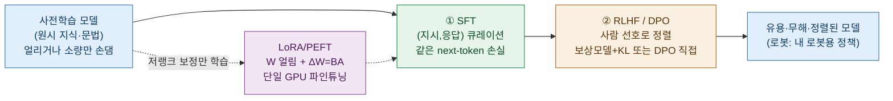
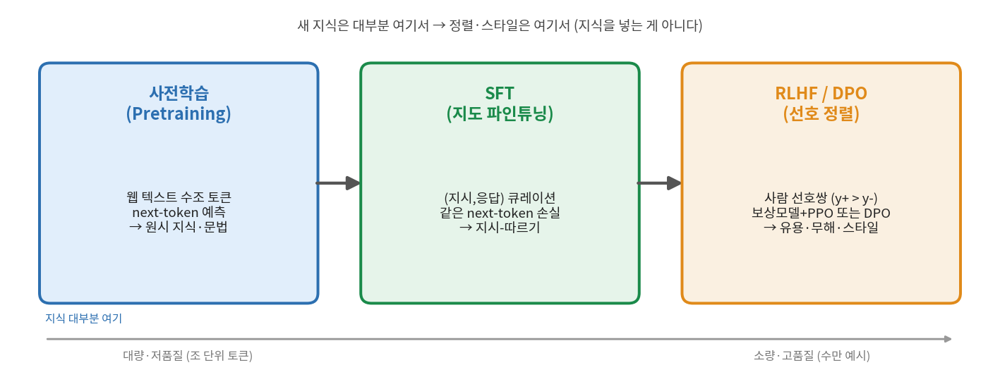
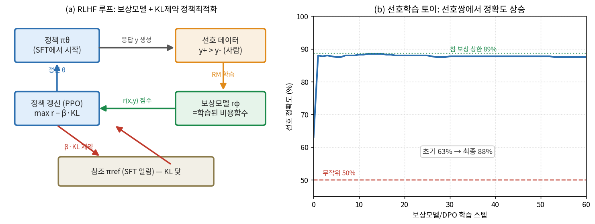
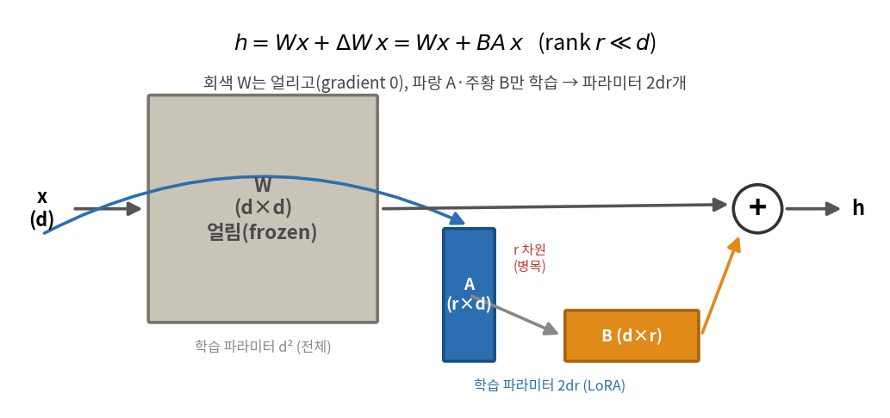
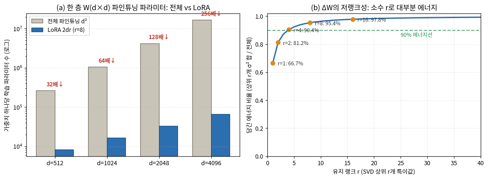

# Lec 33. 사후학습: 모델 길들이기

> 선수 지식: 32강(LLM의 탄생 — 사전학습이 만든 원시 모델). 관련: 27강(정칙화·과적합 — 오늘의 통계적 배경), 37강(행동복제=지도학습), 41강(RL·정책경사·보상), 44강(openpi LoRA 22.5GB), 45강(RECAP의 RL post-training), 56강(SmolVLA LoRA 실습).

## 한 장 요약



사전학습은 "말을 아는" 원시 모델을 만든다. **사후학습(post-training)**은 그것을 "말을 듣는" 모델로 길들인다 — 지식을 넣는 게 아니라 **정렬·스타일·형식**을 입히고(SFT·RLHF/DPO), 그것을 **단일 GPU에서** 할 수 있게 하는 것(LoRA)이 오늘의 전부다. 로봇공학자에게 이 강의의 결론은 하나다: **44·56강에서 π0/SmolVLA를 내 로봇에 맞추는 그 파인튜닝이 바로 이 세 도구다.**

## 학습 목표

1. 사후학습 3단계(SFT → RLHF/DPO)의 목적과 역할을 구분하고, "새 지식은 사전학습, 정렬은 사후학습"을 설명할 수 있다.
2. SFT가 27강 파인튜닝의 특수형(같은 next-token 손실, 큐레이션 데이터, 과적합 주의)임을 설명할 수 있다.
3. RLHF의 보상모델=학습된 비용함수(41강·역강화학습 비유)와 KL 제약의 역할을 쓰고, DPO가 보상모델 없이 같은 선호를 최적화하는 다른 경로임을 설명할 수 있다.
4. LoRA의 $W+\Delta W = W+BA$ ($r\ll d$)를 유도하고, 파라미터 절감률을 손으로 계산하며, "파인튜닝 업데이트가 저랭크"라는 관찰을 SVD 에너지로 검증할 수 있다.
5. numpy로 (a) LoRA 파라미터 절감과 ΔW 저랭크 근사, (b) LoRA(BA)만 학습해 전체 파인튜닝을 수치로 근사, (c) 선호쌍 보상모델의 정확도 상승을 재현할 수 있다.

## 왜 이 강의가 필요한가

32강에서 사전학습이 끝난 모델은 **원시 상태(base model)**다. GPT-3 base에게 "프랑스의 수도는?"이라고 물으면 답 대신 "이탈리아의 수도는? 스페인의 수도는?" 하고 **문서를 이어 쓴다** — 다음 토큰을 예측하도록만 배웠기 때문이다. 이 모델은 지식은 있지만 **지시를 따르지 않고, 무엇이 유용·무해한지 모른다**. 사전학습과 실사용 사이의 이 간극을 메우는 것이 사후학습이다.

로봇공학자에게 이건 추상적인 이야기가 아니다. 44강 π0, 56강 SmolVLA를 **내 로봇·내 태스크에 맞추는 일**이 정확히 이 강의다. 그런데 3B 모델을 전체 파인튜닝하려면 70GB+ VRAM이 필요하고(44강 openpi), 소량의 내 데이터(수백 시연)에 3B를 전부 맞추면 **과적합의 최전선**이다(27강). 두 문제의 답이 **LoRA**다: 큰 가중치는 얼리고 작은 저랭크 보정 $BA$만 학습해 **단일 GPU(22.5GB)**에서, **0.1~1% 파라미터**만으로 파인튜닝한다.

이 강의를 수식·코드 없이 "SFT는 파인튜닝, RLHF는 정렬, LoRA는 싸다"로만 외우면 45강 RECAP(로봇에 RL post-training을 적용)이나 56강 LoRA 실습에서 하이퍼파라미터를 만졌을 때 무슨 일이 벌어지는지 진단할 수 없다. 오늘의 세 수식과 두 worked example은 그 진단력을 CPU numpy 토이로 심는다 — 특히 **"LoRA r을 얼마로?"**의 답을 손으로 계산하게 한다.

## 본문

### 1. 사후학습이라는 아이디어 — 지식은 두고, 행동을 바꾼다

사전학습(32강)은 웹 텍스트 수조 토큰에 next-token 예측을 걸어 **문법·세계지식·추론의 씨앗**을 심는다. 이것은 비싸고(수천 GPU·수개월) 대부분의 지식이 여기서 들어온다. 사후학습은 그 위에 얹는 **값싼 마무리**다 — 데이터가 수만 예시, 계산이 사전학습의 1% 미만인 경우가 흔하다.



*그림 1: 사후학습 3단계. 왼쪽에서 오른쪽으로 **데이터는 대량·저품질(조 단위 토큰) → 소량·고품질(수만 예시)**로, 목적은 **지식 습득 → 지시-따르기 → 정렬·스타일**로 바뀐다. 핵심 메시지(상단): **새 지식은 대부분 사전학습에서 들어오고, SFT·RLHF는 그 지식을 "꺼내 쓰는 법·말하는 법"을 가르친다** — 지식을 넣는 게 아니다(흔한 오해 1). `gen_figs.py`가 생성.*

이 그림의 방향성이 오늘의 첫 번째 직관이다. **"사후학습이 모델을 똑똑하게 만든다"는 오해**다 — 사후학습은 이미 아는 것을 **유용한 형태로 끌어내고 정렬**할 뿐이다. 로봇 비유: 사전학습 = 다양한 시연으로 익힌 **일반 조작 스킬**(37강 행동복제의 대규모판), 사후학습 = 그 스킬을 **내 로봇의 관절 한계·내 태스크의 성공 기준**에 맞게 조율. 스킬 자체를 새로 만드는 게 아니다.

### 2. SFT — 지도 파인튜닝 (27강의 특수형)

**SFT(Supervised Fine-Tuning)**는 가장 단순하다: (지시, 응답) 쌍을 큐레이션해 **사전학습과 완전히 같은 next-token 손실**로 추가 학습한다. 예: `지시: "이 문장을 요약해줘. ..." → 응답: "..."`. 모델은 "지시 뒤에는 그 지시를 따르는 응답이 온다"는 패턴을 배운다.

수식적으로 새로울 게 없다 — 27강의 파인튜닝 그 자체다. 다만 세 가지가 특수하다:
- **데이터 큐레이션이 전부**다. 소량이라도 고품질 (지시,응답)이면 base 모델의 잠재력을 크게 끌어낸다. LIMA("Less Is More for Alignment") 계열의 관찰: 잘 고른 1,000개가 대충 모은 수만 개를 이긴다.
- **과적합의 최전선**(27강). 소량 데이터에 큰 모델을 오래 돌리면 **외운다** — 검증 손실이 되오른다(27강 그림 1의 U자). 그래서 SFT는 보통 1~3 에폭, 작은 학습률, 조기중단을 쓴다.
- **손실 마스킹**: 보통 **지시 부분의 손실은 끄고 응답 부분만** 학습한다(지시를 생성하는 법이 아니라 지시에 답하는 법을 배우게).

로봇에서 SFT의 대응물이 바로 **행동복제(37강)의 파인튜닝판**이다. π0/SmolVLA를 내 데이터로 파인튜닝하는 1단계가 정확히 이것 — (관측, 행동) 쌍에 같은 손실을 거는 지도학습이다.

### 3. RLHF/DPO — 사람 선호로 정렬 (41강 RL 회수)

SFT만으로는 부족하다. (지시,응답) 쌍은 "**하나의** 정답 응답"을 가정하지만, 실제로는 "어떤 응답이 **더** 유용·무해한가"라는 **상대 비교**가 더 자연스럽고 라벨링도 쉽다("A와 B 중 뭐가 나아?"). 이 **사람 선호(human preference)**로 모델을 정렬하는 것이 RLHF다.

**경로 1 — RLHF (보상모델 + PPO).** 두 단계다:
1. **보상모델 $r_\phi$ 학습**: 사람이 라벨한 선호쌍 $(y^+ \succ y^-)$으로, $r_\phi(x,y^+) > r_\phi(x,y^-)$가 되도록 학습(Bradley-Terry). 이 $r_\phi$는 **"사람이 무엇을 좋아하는가"를 학습한 스칼라 함수** — 즉 **학습된 목적함수**다.
2. **정책 최적화(PPO)**: 정책 $\pi_\theta$를 $r_\phi$를 최대화하도록 RL로 갱신하되, **참조 정책 $\pi_{\text{ref}}$(SFT 모델)에서 KL로 멀어지지 않게** 제약한다.



*그림 2: (a) RLHF 루프 — 정책이 응답 $y$를 내고, 사람 선호로 학습한 **보상모델 $r_\phi$(=학습된 비용함수)**가 점수를 주며, PPO가 $\max r - \beta\cdot\mathrm{KL}$을 최적화한다. **참조 $\pi_{\text{ref}}$(SFT 얼림)가 KL의 닻**이다 — 이게 없으면 정책이 보상모델의 허점을 파고들어(reward hacking) 이상한 출력으로 폭주한다. (b) 선호학습 토이 — 8차원 특징의 선호쌍에서 보상모델을 학습하니 선호 정확도가 **63%→87.5%**로 오른다(초록 점선 = 사람 라벨 자체의 잡음 때문에 참 보상으로도 못 넘는 상한). E2·WE와 같은 아이디어의 재현이다(이 그림은 60스텝·랜덤초기판, E2 본문 코드는 200스텝·영벡터초기판이라 최종 수치가 83.2%로 다르다 — 재현성 각주 참조). `gen_figs.py`가 생성.*

로봇공학자에게 이 구조는 낯익다. 보상모델 = **비용함수를 데이터로부터 배우는 것** = 41강 RL의 보상, 더 정확히는 **역강화학습(IRL)**의 정신이다 — LQR(18강)에서 $Q,R$을 손으로 정했다면, 여기선 사람 선호 데이터에서 그 목적함수를 **추정**한다. KL 제약은 신뢰영역(trust region) — MPC(23강)에서 한 스텝에 너무 멀리 가지 않게 제한하는 것과 같은 정신이다.

**경로 2 — DPO (보상모델 없이 직접).** RLHF는 보상모델 학습 + RL 루프 두 단계라 불안정하고 비싸다. **DPO(Direct Preference Optimization)**는 통찰 하나로 이를 우회한다: **KL 제약 하 보상 최대화의 최적 정책은 닫힌 형태로 보상과 연결되어 있어서, 보상모델을 명시적으로 만들 필요 없이 정책을 선호쌍에 직접 맞출 수 있다.** 결과는 **분류 손실 하나** — 선호쌍에서 "이긴 응답의 (참조 대비) 로그확률을 진 응답보다 높여라"는 지도학습이 된다. RL 루프가 사라져 **훨씬 안정적**이라 현재 오픈 커뮤니티의 기본 정렬법이다.

핵심: DPO는 RLHF와 **무관한 게 아니라**(흔한 오해 4), **같은 선호 최적화의 다른 경로**다 — 같은 목적함수를 RL 없이 푼다.

### 4. LoRA/PEFT — 저랭크 보정만 학습 (로봇에서 결정적)

여기가 로봇공학자에게 가장 중요한 절이다. 3B VLA를 전체 파인튜닝하려면 **가중치 + 기울기 + 옵티마이저 상태**를 전부 GPU에 올려야 해 70GB+가 든다(44강). **PEFT(Parameter-Efficient Fine-Tuning)**, 그중 **LoRA(Low-Rank Adaptation)**의 아이디어:

> 큰 사전학습 가중치 $W$는 **얼리고**(gradient 0), 그 옆에 **작은 저랭크 보정** $\Delta W = BA$만 붙여 그것만 학습한다.

$$
h = Wx + \Delta W\,x = Wx + BA\,x, \qquad B\in\mathbb{R}^{d\times r},\ A\in\mathbb{R}^{r\times d},\ r\ll d.
$$



*그림 3: LoRA 구조. 입력 $x$는 **얼린 $W$**(회색, gradient 0)와 **학습하는 저랭크 경로 $A\to B$**(파랑·주황)를 모두 지나 합쳐진다. 핵심은 가운데의 **$r$차원 병목** — $A$가 $d$차원을 $r$차원으로 압축하고 $B$가 다시 $d$차원으로 편다. 학습 파라미터는 $W$의 $d^2$개가 아니라 $A,B$의 **$2dr$개**뿐이다($r\ll d$). `gen_figs.py`가 생성.*

**왜 저랭크로 충분한가?** LoRA 논문의 핵심 관찰: **파인튜닝이 만드는 업데이트 $\Delta W$는 "내재적 랭크(intrinsic rank)"가 낮다.** 즉 사전학습에서 특정 태스크로 적응하는 데 필요한 변화는 **소수의 방향**으로 표현된다. 그래서 $r=8$처럼 작은 랭크로도 전체 파인튜닝에 근접한다(흔한 오해 2). 이것을 WE-1의 SVD 에너지로, WE-2의 실제 학습으로 확인한다.

**로봇공학자를 위한 즉시 번역**: 이건 27강에서 배운 **정칙화**의 극단이고, 7강 DLS 댐핑·27강 축약모델과 한 몸이다. DLS에서 자코비안의 작은 특이값 방향을 $\lambda$로 눌러 해를 **저차원 부분공간**에 가뒀듯, LoRA는 파인튜닝 업데이트를 **랭크-$r$ 부분공간**에 가둔다. $r$을 줄이는 것 = 댐핑을 세게 거는 것 = 과적합을 막는 것. **$r$이 곧 정칙화 손잡이다.**

**메모리 절감.** $d=1024$, $r=8$이면 층당 학습 파라미터가 $d^2 = 1{,}048{,}576$에서 $2dr = 16{,}384$로 **64배** 준다(1.56%). 게다가 얼린 $W$는 기울기·옵티마이저 상태가 필요 없어, 실제 VRAM 절감은 더 크다 — π0 LoRA가 70GB→22.5GB인 이유(44강). **QLoRA**(Dettmers 2023)는 여기에 base 가중치를 4비트로 양자화해 올려, 소비자 GPU 한 장에서도 대형 모델 파인튜닝을 가능케 했다.



*그림 4: (a) 한 층 $W(d\times d)$ 파인튜닝 파라미터 — 전체 $d^2$ vs LoRA $2dr$($r=8$), 로그 스케일. $d$가 커질수록 절감이 커진다($d{=}512$: 32배, $d{=}4096$: 256배). (b) **파인튜닝 업데이트 $\Delta W$의 저랭크성** — 토이 $\Delta W$의 SVD 상위 $r$개가 담는 에너지 비율. $r{=}4$면 90.4%, $r{=}8$이면 95.4%가 담긴다 — **소수 랭크로 대부분의 정보**가 들어오는 것이 LoRA가 성립하는 근거다. WE-1의 코드로 재현. `gen_figs.py`가 생성.*

### 핵심 수식

세 수식이 "원시 모델을 유용·정렬된 모델로, 그리고 단일 GPU에서"라는 하나의 목표를 세 각도에서 본다: **E1** SFT(같은 손실, 큐레이션 데이터), **E2** 선호학습(보상모델·PPO·DPO), **E3** LoRA(저랭크 보정·절감률).

#### E1. SFT — 같은 next-token 손실, 다른 데이터

**① 직관**: 사전학습과 **완전히 같은** 손실 함수를 쓴다 — 다음 토큰을 맞히는 교차엔트로피. 바뀌는 것은 오직 **데이터**: 웹 크롤 → 큐레이션된 (지시, 응답) 쌍. "새로운 학습법"이 아니라 "새로운 교재로 같은 공부"다.

**② 물리·기하적 의미**: 손실 지형은 같고, 우리는 사전학습이 도달한 좋은 골짜기에서 **조금만 이동**해 "지시-따르기 분포"로 옮긴다. 너무 많이 이동하면(큰 lr, 많은 에폭) 사전학습 지식을 **잊고(catastrophic forgetting)** 소량 SFT 데이터에 과적합한다(27강 U자). 그래서 SFT는 작은 걸음(작은 lr)·짧은 학습(1~3 에폭)의 **국소 적응**이다 — 처음부터 학습이 아니다(흔한 오해 3).

**③ 형식(유도 요점)**: 응답 토큰 $y_{1:T}$에 대한 조건부 로그가능도 최대화(=교차엔트로피 최소화):

$$
\mathcal{L}_{\text{SFT}}(\theta) = -\,\mathbb{E}_{(x,y)\sim \mathcal D_{\text{SFT}}}\;\sum_{t=1}^{T} \log \pi_\theta\!\big(y_t \mid x,\, y_{<t}\big).
$$

$x$는 지시(프롬프트), $y$는 목표 응답. **지시 토큰의 손실은 마스킹**(합에서 제외)하고 응답 토큰만 학습한다. 이 손실은 32강 사전학습 손실과 문자 그대로 같은 식 — 합의 범위(응답만)와 데이터 분포 $\mathcal D_{\text{SFT}}$(큐레이션)만 다르다.

#### E2. 선호학습 — 보상모델·PPO 목적, 그리고 DPO

**① 직관**: "정답 하나"가 아니라 "**A가 B보다 낫다**"는 비교로 배운다. 사람 선호를 스칼라 보상 $r_\phi$로 요약(보상모델)한 뒤 그 보상을 최대화(PPO)하거나, 그 중간 단계를 건너뛰고 정책을 선호쌍에 직접 맞춘다(DPO).

**② 물리·기하적 의미**: 보상모델은 **데이터로부터 배운 비용함수**다(41강·IRL). LQR에서 $Q,R$을 손으로 골랐다면 여기선 선호 데이터가 그것을 정한다. PPO의 **KL 제약**은 신뢰영역: 정책이 $\pi_{\text{ref}}$(SFT 모델)에서 멀어질수록 벌점을 줘, ① 사전학습 지식을 지키고 ② 보상모델의 허점을 파고드는 **reward hacking**을 막는다. $\beta$가 크면 얌전하지만 덜 정렬되고, 작으면 강하게 정렬되지만 폭주 위험 — 17강 게인 튜닝과 같은 트레이드오프다.

**③ 형식(유도 요점)**: 보상모델은 Bradley-Terry로 선호 확률을 모델링:

$$
P(y^+ \succ y^- \mid x) = \sigma\!\big(r_\phi(x,y^+) - r_\phi(x,y^-)\big),\qquad
\mathcal L_{\text{RM}} = -\,\mathbb{E}\big[\log \sigma\big(r_\phi(x,y^+) - r_\phi(x,y^-)\big)\big].
$$

PPO는 KL 제약 하 보상 최대화:

$$
\max_{\theta}\ \mathbb{E}_{x,\,y\sim\pi_\theta}\big[\,r_\phi(x,y)\,\big]\;-\;\beta\,\mathrm{KL}\!\big(\pi_\theta(\cdot\mid x)\,\|\,\pi_{\text{ref}}(\cdot\mid x)\big).
$$

**DPO**는 이 문제의 최적 정책이 $\pi^\star(y|x)\propto \pi_{\text{ref}}(y|x)\exp(r(x,y)/\beta)$임을 이용해 보상 $r$을 소거하고, 정책을 선호쌍에 **직접** 맞추는 분류 손실로 바꾼다:

$$
\mathcal L_{\text{DPO}} = -\,\mathbb{E}\Big[\log \sigma\Big(\beta\log\tfrac{\pi_\theta(y^+|x)}{\pi_{\text{ref}}(y^+|x)} - \beta\log\tfrac{\pi_\theta(y^-|x)}{\pi_{\text{ref}}(y^-|x)}\Big)\Big].
$$

두 식의 $\sigma(\cdot)$가 같은 Bradley-Terry 구조임에 주목 — DPO는 "정책 자신이 암묵적 보상모델"이라는 통찰이다. 아래 코드는 보상모델 학습(E2 앞식)을 토이로 재현한다:

```python
import numpy as np
def sigmoid(z): return 1/(1+np.exp(-z))

rng = np.random.default_rng(0)
D, N = 8, 400
w_star = rng.standard_normal(D)                       # 사람의 "숨은 취향"(참 보상)
phiA = rng.standard_normal((N, D)); phiB = rng.standard_normal((N, D))
gap  = (phiA - phiB) @ w_star                          # 참 보상차
win_a = rng.uniform(size=N) < sigmoid(gap)             # Bradley-Terry 라벨(잡음 포함)
dphi = np.where(win_a[:,None], phiA-phiB, phiB-phiA)   # (승자 - 패자) 특징차

w = np.zeros(D)                                        # 학습할 보상모델 r_phi = w·phi
for step in range(200):
    z = dphi @ w                                       # 승자-패자 보상차
    grad = ((sigmoid(z) - 1.0)[:,None] * dphi).mean(0) # BT/DPO 손실 gradient
    w -= 0.2 * grad
acc = np.mean((dphi @ w) > 0)                          # 학습 보상이 사람 승자를 맞힌 비율
cos = w @ w_star / (np.linalg.norm(w)*np.linalg.norm(w_star))
print(f"선호 정확도 = {acc*100:.1f}%")                  # 83.2%
print(f"학습 w ↔ 참 w* 코사인 = {cos:.3f}")             # 0.997
```

선호 정확도가 무작위 50%에서 **83.2%**로 오르고, 학습한 보상 벡터 $w$가 사람의 참 취향 $w^\star$와 **코사인 0.997**로 거의 일치한다. 즉 **선호 라벨만으로 "사람이 무엇을 좋아하는지"라는 목적함수를 복원**했다 — 이것이 보상모델·DPO가 하는 일의 전부다(BT 손실 gradient는 $\sigma(z)-1$로, 로지스틱 회귀와 같은 꼴). 정확도가 100%가 아니라 **83% 근처에서 포화**하는 이유는 사람 라벨 자체에 잡음이 있기 때문이다(BT 확률적 라벨): **참 취향 $w^\star$조차 이 잡음 섞인 라벨을 82.5%밖에 못 맞힌다** — 이것이 잡음이 만드는 원리적 상한이고, 학습 $w$는 유한 표본을 살짝 과적합해 그 언저리(83.2%)에 앉는다.

#### E3. LoRA — 저랭크 보정과 절감률

**① 직관**: 파인튜닝이 만드는 변화 $\Delta W$는 소수의 방향으로 표현된다(저랭크). 그러니 $\Delta W$ 전체($d^2$개)를 학습하지 말고, 그것을 두 얇은 행렬의 곱 $BA$($2dr$개)로 **인수분해**해 그것만 학습하자.

**② 물리·기하적 의미**: $A$($r\times d$)는 입력을 $r$차원 **병목**으로 압축하고 $B$($d\times r$)가 다시 편다 — 27강의 축약모델(reduced-order model), 7강 DLS의 저차원 부분공간과 같은 구조다. $r$은 정칙화 손잡이: 작으면 강한 정칙화(과적합 방지, 표현력 제한), 크면 약한 정칙화(전체 파인튜닝에 근접). "$\Delta W$가 저랭크"라는 관찰이 참이면 작은 $r$로 충분하다 — WE에서 이를 SVD 에너지와 실제 학습으로 검증한다.

**③ 형식(유도 요점)**: 층의 순전파를

$$
h = Wx + \Delta W\,x = Wx + BA\,x,\qquad
B\in\mathbb{R}^{d\times r},\ A\in\mathbb{R}^{r\times d},\ r\ll d
$$

로 두고, $W$는 얼려($\nabla_W=0$) $A,B$만 학습한다. 보통 $B=0$으로 초기화해 학습 시작 시 $\Delta W=0$(원래 모델과 동일)에서 출발하고, 스케일 $\alpha/r$을 곱해 랭크에 무관하게 크기를 맞춘다. 학습 파라미터 절감률:

$$
\frac{2dr}{d^2} = \frac{2r}{d}\ \xrightarrow{\ d=1024,\,r=8\ }\ \frac{16}{1024} = 1.5625\% \quad(\textbf{64배 절감}).
$$

$r/d$가 곧 절감의 핵심 비율 — $r=8$, $d=1024$면 파라미터의 1.56%만 학습한다.

### Worked Example

#### WE-1 (손계산 + 코드): LoRA 파라미터 절감과 ΔW의 저랭크 에너지

**파트 A — 절감률 손계산.** $d=1024$, $r=8$인 한 층 $W(d\times d)$를 보자. 전체 파인튜닝은 $d^2 = 1024^2 = 1{,}048{,}576$개를 학습한다. LoRA는 $B(d\times r)$와 $A(r\times d)$, 즉 $2dr = 2\cdot1024\cdot8 = 16{,}384$개다. 비율 $16{,}384/1{,}048{,}576 = 1.5625\%$ → **64배 절감**. 랭크를 바꾸면 절감이 선형으로 변한다: $r=1$이면 512배, $r=64$면 8배. **"$r$을 반으로 = 파라미터를 반으로"**가 손으로 보인다.

**파트 B — 왜 저랭크로 충분한가(SVD 에너지).** 파인튜닝 업데이트를 흉내 낸 $\Delta W$(128×128, 특이값이 급감하는 저랭크 구조 + 작은 꼬리)를 SVD해, 상위 $r$개 특이값이 담는 **에너지 비율** $\sum_{i\le r}\sigma_i^2 / \sum_i \sigma_i^2$를 본다. Eckart-Young 정리로 이 비율은 곧 "상위 $r$ 근사가 원본을 얼마나 재현하는가"다.

```python
import numpy as np

# 파트 A: 파라미터 절감 손계산
d, r = 1024, 8
full = d*d                 # 전체 파인튜닝
lora = 2*d*r               # LoRA (B: d×r, A: r×d)
print(f"전체 {full:,}  vs  LoRA {lora:,}  =  {100*lora/full:.4f}%  ({full//lora}배 절감)")
# 전체 1,048,576  vs  LoRA 16,384  =  1.5625%  (64배 절감)
for rr in [1, 8, 64]:
    print(f"  r={rr:2d}: {2*d*rr:>7,}개 ({full/(2*d*rr):.0f}배 절감)")
    # r= 1:   2,048개 (512배 절감) / r= 8:  16,384개 (64배) / r=64: 131,072개 (8배)

# 파트 B: ΔW의 저랭크성 — SVD 상위 r개가 담는 에너지 (Eckart-Young)
rng = np.random.default_rng(0)
d2 = 128
U, _ = np.linalg.qr(rng.standard_normal((d2, d2)))
V, _ = np.linalg.qr(rng.standard_normal((d2, d2)))
sv = np.array([10.0/(1+k)**1.1 for k in range(d2)]) + 0.02   # 급감하는 특이값 = 저랭크
dW = U @ np.diag(sv) @ V.T
s = np.linalg.svd(dW, compute_uv=False)
energy = np.cumsum(s**2) / np.sum(s**2)
for rr in [1, 2, 4, 8, 16]:
    print(f"  r={rr:2d}: 에너지 {energy[rr-1]*100:.2f}%")
    # r= 1: 66.65% / r= 2: 81.22% / r= 4: 90.43% / r= 8: 95.39% / r=16: 97.85%
```

출력이 손계산과 정확히 일치한다: 64배 절감, 그리고 **상위 8개 랭크가 에너지의 95.4%**를 담는다. 128차원 중 8차원(6.25%)이 정보의 95%를 담는다는 것 — 이것이 "$\Delta W$는 저랭크"의 정량적 의미이고, LoRA가 $r=8$로 작동하는 이유다. 그림 4(b)가 이 곡선이다.

#### WE-2 (코드): LoRA(BA)만 학습해 전체 파인튜닝을 근사한다

E3의 주장을 직접 검증한다. 사전학습 가중치 $W_0$(얼림)와, 목표 $W^\star = W_0 + \Delta W^\star$을 두되 **$\Delta W^\star$을 진짜 랭크 4로** 만든다(파인튜닝 업데이트가 저랭크라는 가정의 이상적 형태). 데이터 $Y = XW^{\star\top}$에 대해, $W_0$를 얼리고 **$\Delta W = BA$만** 경사하강으로 학습해, 여러 $r$에서 전체 파인튜닝(최소제곱해)에 얼마나 근접하는지 본다.

```python
import os
os.environ["OMP_NUM_THREADS"]="1"; os.environ["OPENBLAS_NUM_THREADS"]="1"   # 작은 문제엔 단일 스레드가 빠름
import numpy as np

rng = np.random.default_rng(1)
d, r_true, n = 64, 4, 2000                          # 참 업데이트 랭크 = 4
W0 = rng.standard_normal((d, d)) * 0.5              # 사전학습 가중치(얼림)
dW_star = (rng.standard_normal((d, r_true))*0.5) @ (rng.standard_normal((r_true, d))*0.5)
Wstar = W0 + dW_star                                # 목표 = W0 + 저랭크 업데이트
X = rng.standard_normal((n, d)); Y = X @ Wstar.T    # 목표 출력

# 전체 파인튜닝(비교 기준): 최소제곱해
Wfull = np.linalg.lstsq(X, Y, rcond=None)[0].T
err_full = np.linalg.norm(X @ Wfull.T - Y) / np.linalg.norm(Y)
print(f"전체 파인튜닝: 파라미터 {d*d}, 출력 상대오차 {err_full:.1e}")   # 4096, 2.0e-15

# LoRA: W0 얼림, ΔW = BA (rank r) 만 학습
def train_lora(r, steps=2500, lr=0.02):
    B = rng.standard_normal((d, r))*0.01; A = rng.standard_normal((r, d))*0.01
    T = Y - X @ W0.T                                 # 얼린 W0가 남긴 잔차 = BA가 맞출 것
    for _ in range(steps):
        e = X @ (B @ A).T - T                        # 예측 오차
        G = e.T @ X / n                              # dLoss/d(ΔW),  ΔW=BA
        gB, gA = G @ A.T, B.T @ G
        B, A = B - lr*gB, A - lr*gA
    dW_hat = B @ A
    err = np.linalg.norm(X @ (W0+dW_hat).T - Y) / np.linalg.norm(Y)
    dW_err = np.linalg.norm(dW_hat - dW_star) / np.linalg.norm(dW_star)
    return 2*d*r, err, dW_err

for r in [1, 2, 4, 8]:
    p, err, dWe = train_lora(r)
    print(f"LoRA r={r}: 파라미터 {p:>4}, 출력 상대오차 {err:.1e}, ΔW 상대오차 {dWe:.3f}")
    # r=1: 128, 5.2e-01, 0.758 / r=2: 256, 3.9e-01, 0.561
    # r=4: 512, 3.2e-16, 0.000 / r=8: 1024, 1.7e-04, 0.000
```

결과가 E3의 이야기를 그대로 말한다. **$r < r_{\text{true}}$(=1,2)면 저랭크 병목이 진짜 업데이트를 담지 못해 오차가 크다**(r=1: 출력오차 0.52, ΔW오차 0.758). **$r = r_{\text{true}}$(=4)면 512개 파라미터(전체 4096의 12.5%)만으로 출력오차 $3\times10^{-16}$ — 전체 파인튜닝과 사실상 동일**하게 $\Delta W$를 완벽 복원한다(ΔW오차 0.000). $r > r_{\text{true}}$(=8)도 잘 맞는다. 이것이 "LoRA는 성능을 크게 깎지 않는다"(흔한 오해 2)의 수치적 증거이자, **"$r$을 업데이트의 내재적 랭크 이상으로만 잡으면 된다"**는 실전 지침이다 — 로봇 파인튜닝에서 $r$을 8, 16, 32로 스윕해 보는 이유가 이것이다(56강).

### 로봇공학자를 위한 번역

| 딥러닝(사후학습) | 로봇/제어 대응 | 관련 강 |
|---|---|---|
| SFT (지시-응답 지도학습) | 행동복제 파인튜닝 (관측→행동) | 37 |
| 보상모델 $r_\phi$ (선호에서 학습) | 학습된 비용함수 / 역강화학습(IRL) | 41 |
| PPO의 KL 제약 $\beta\,\mathrm{KL}(\pi\|\pi_{\text{ref}})$ | 신뢰영역 / MPC의 스텝 제한 | 23 |
| 보상 가중치 $\beta$ 튜닝 | 게인 튜닝(강하게 vs 얌전하게) | 17 |
| LoRA 저랭크 $\Delta W=BA$ | DLS 댐핑 / 축약모델(저차원 부분공간) | 7, 27 |
| LoRA 랭크 $r$ | 정칙화 손잡이(작을수록 강한 정칙화) | 27 |
| 과적합(소량 SFT 데이터) | 소량 궤적에 관성 파라미터 과적합(시스템 식별) | 60 |
| catastrophic forgetting | 새 태스크 튜닝이 옛 태스크를 망침(일반화 vs 특화) | 45 |

핵심 번역 하나: **LoRA의 저랭크는 여러분이 아는 그 저차원 부분공간이다.** 7강 IK에서 자코비안의 작은 특이값 방향을 $\lambda$로 눌러 해를 안정한 부분공간에 가뒀듯, LoRA는 파인튜닝 업데이트를 랭크-$r$ 부분공간에 가둔다. "$\Delta W$가 저랭크"라는 관찰은 "적응에 필요한 자유도는 몇 개뿐"이라는 축약모델의 정신 그 자체다. 그리고 보상모델은 IRL — LQR의 $Q,R$을 손으로 고르는 대신 사람 선호에서 배우는 것이다.

## 흔한 오해

1. **"RLHF/SFT가 새 지식을 넣는다."** 대체로 아니다. 지식은 압도적으로 **사전학습**에서 들어온다(그림 1). SFT·RLHF는 그 지식을 **꺼내 쓰는 법(지시-따르기)과 말하는 법(정렬·스타일·안전)**을 가르친다. 사후학습으로 없던 사실을 안정적으로 주입하기는 어렵고(오히려 hallucination·forgetting을 유발), 그래서 "정렬은 스타일 문제"라는 말이 나온다. 로봇에서도 45강 RL post-training은 새 스킬을 만드는 게 아니라 이미 있는 스킬을 **다듬는다**.
2. **"LoRA는 성능을 크게 깎는다."** 대개 아니다. 파인튜닝 업데이트 $\Delta W$가 저랭크라서(WE-1: 상위 8랭크=95%), 작은 $r$로도 전체 파인튜닝에 근접한다 — WE-2에서 $r=4$가 전체 파인튜닝을 $10^{-16}$까지 복원했다. $r$이 업데이트의 내재적 랭크보다 **작을 때만** 성능이 깎인다(WE-2의 r=1,2). 실전에선 $r$을 스윕해 충분한 값을 찾는다.
3. **"파인튜닝 = 처음부터 학습."** 아니다(E1). SFT는 사전학습이 도달한 좋은 골짜기에서 **작은 걸음**으로 이동하는 국소 적응이다(작은 lr, 1~3 에폭). 처음부터 학습(random init)과 완전히 다르다 — 오히려 너무 많이 움직이면 사전학습 지식을 **잊는다**(catastrophic forgetting). LoRA는 이 "작은 걸음"을 구조적으로 강제하는 셈이다($W$ 얼림).
4. **"DPO는 RLHF와 무관한 다른 것이다."** 아니다. DPO는 **같은 선호 최적화**(KL 제약 하 보상 최대화)의 **다른 경로**다 — 보상모델과 RL 루프를 명시적으로 만드는 대신, 최적 정책의 닫힌 형태를 이용해 정책을 선호쌍에 직접 맞춘다(E2). 두 손실 다 Bradley-Terry $\sigma(\cdot)$ 구조를 공유한다. "DPO는 RL이 아니다"는 맞지만 "선호학습이 아니다"는 틀렸다.
5. **"사후학습은 언어 모델 전용이다."** 아니다. VLA도 정확히 이 파이프라인을 쓴다: **SFT**(π0/SmolVLA를 (관측,행동)으로 파인튜닝, 44·56강), **RL post-training**(45강 RECAP — 로봇에 RL로 정렬·개선), **LoRA**(44강 openpi 22.5GB, 56강 SmolVLA LoRA). 오늘 배운 세 도구가 곧 "내 로봇에 VLA를 얹는 법"이다.

## 실습 (60~90분)

**A안 (CPU만, 추천 — 개념의 심장): LoRA를 numpy로 완성.** WE-2를 확장한다. ① 참 업데이트 랭크 $r_{\text{true}}$를 4→8→16으로 바꾸며 "필요한 LoRA $r$"이 어떻게 따라 오르는지 확인. ② $\Delta W^\star$을 **완전 랭크**(저랭크 아님)로 만들어 보고, 이때 작은 $r$이 왜 실패하는지(에너지가 퍼져 있음) 관찰. ③ 데이터에 잡음을 넣고 $r$을 키우면 언제 과적합(검증오차 되오름)이 나오는지 — **$r$이 정칙화 손잡이**임을 27강 U자로 재현.

**B안 (GPU 있으면): PEFT로 진짜 LoRA SFT.** HF `peft` + `transformers`로 작은 base 모델(예: SmolLM2-135M/360M)에 LoRA를 걸고, 소형 (지시,응답) 데이터셋으로 몇 스텝 SFT한다. `print_trainable_parameters()`로 **학습 파라미터가 전체의 몇 %인지** 확인(보통 <1%). base vs SFT의 응답을 비교해 "지시-따르기"가 붙는 것을 눈으로 본다. 이 워크플로가 56강 SmolVLA LoRA 파인튜닝과 구조적으로 동일하다.

## Claude와 토론할 질문

1. WE-2에서 참 업데이트 랭크가 4일 때 $r=4$면 완벽, $r=2$면 실패했다. 실제 VLA 파인튜닝에서 "필요한 $r$"을 미리 알 수 없다면, 어떻게 정하는 게 합리적인가? ($r$을 늘리는 비용 vs 얻는 것)
2. LoRA $r$을 "정칙화 손잡이"라고 했다(작을수록 강한 정칙화). 그렇다면 데이터가 아주 적을 때(수십 시연)와 많을 때(수만 시연) $r$을 각각 어느 쪽으로 잡아야 할까? 27강 편향-분산으로 설명하라.
3. RLHF의 KL 제약 $\beta$를 0으로 만들면 무슨 일이 벌어질까? (reward hacking의 메커니즘을 그림 2(a)의 루프로 설명) MPC의 스텝 제한이나 신뢰영역과 무엇이 같고 다른가?
4. 보상모델이 "학습된 비용함수"라면, 로봇 태스크에서 이걸 어디에 쓸 수 있을까? (성공/실패 라벨 대신 "어느 시도가 더 나았나" 선호로 정책을 개선 — 45강 예고. 먼저 스스로 가설을 세워 보라.)
5. "사후학습은 새 지식을 넣지 못한다"가 맞다면, 내 로봇의 **새로운 물체·새로운 태스크**는 어떻게 배우게 하나? SFT로 되는 것과 안 되는 것의 경계는?
6. DPO가 보상모델을 없앴는데도 RLHF와 "같은 선호를 최적화한다"고 했다. 그렇다면 언제 굳이 보상모델+PPO(RLHF)를 쓰고 언제 DPO를 쓸까? (온라인 vs 오프라인, 안정성 vs 탐색)
7. QLoRA는 base 가중치를 4비트로 양자화해 올린다. 양자화가 저랭크 보정 $BA$의 학습을 방해하지 않는 이유는? (정보가 어디에 있고, 무엇을 얼리고 무엇을 학습하는가)

## 읽을거리

1. **Hu et al., "LoRA" (arXiv:2106.09685)의 §1·§4·Fig 1만**: 저랭크 가설과 $\Delta W=BA$ 구조. 나머지는 실습 시 참고 (~30분).
2. **HF LLM Course의 "Supervised Fine-Tuning"·"Preference Alignment(DPO)" 장**: SFT·DPO를 코드로 (~40분). RLHF 전체 이론은 읽지 말고 개념만.
3. **Rafailov et al., "DPO" (arXiv:2305.18290)의 Fig 1과 §4(유도 요점)만**: "정책이 곧 암묵적 보상모델"이라는 핵심 통찰 (~20분, 유도 전체는 건너뛰어도 됨).

## 자가 점검

1. 사후학습 3단계(SFT→RLHF/DPO)를 그리고, 각 단계에서 **무엇이 바뀌고 무엇이 안 바뀌는지**(지식 vs 정렬) 말할 수 있는가?
2. SFT가 왜 "27강 파인튜닝의 특수형"인지, 손실 식이 사전학습과 어떻게 같고 데이터가 어떻게 다른지 설명할 수 있는가?
3. 보상모델이 "학습된 비용함수"이고 KL 제약이 "신뢰영역"인 이유를, 41·23강 언어로 말할 수 있는가? RLHF와 DPO의 관계는?
4. LoRA의 $h = Wx + BA\,x$를 쓰고, $d=1024,r=8$의 절감률(1.5625%, 64배)을 손으로 계산할 수 있는가?
5. "파인튜닝 업데이트가 저랭크"라는 관찰을, WE-1의 SVD 에너지(상위 8랭크=95%)와 WE-2의 $r=4$ 완벽 복원으로 설명할 수 있는가?
6. LoRA $r$이 정칙화 손잡이임을 7강 DLS·27강 축약모델과 연결해 말할 수 있는가? $r$을 언제 키우고 줄이나?
7. 이 세 도구가 44강(π0 LoRA 22.5GB)·45강(RECAP RL)·56강(SmolVLA LoRA)에서 어떻게 쓰이는지, "사후학습은 언어 전용이 아니다"를 예로 들 수 있는가?

## 참고문헌

> 본문 수치·주장의 출처. 웹 문서는 2026-07-09 접속 기준. (2차) = 2차 출처.

[1] L. Ouyang et al. (OpenAI), "Training language models to follow instructions with human feedback (InstructGPT)," arXiv:2203.02155, 2022.3. https://arxiv.org/abs/2203.02155
— **뒷받침**: SFT→보상모델→PPO의 3단계 RLHF 파이프라인, base 모델이 지시를 안 따른다는 문제 설정, KL 제약 하 보상 최대화 목적, "정렬은 주로 유용·무해·스타일" 관점.

[2] P. Christiano et al., "Deep reinforcement learning from human preferences," arXiv:1706.03741, 2017.6. https://arxiv.org/abs/1706.03741
— **뒷받침**: 사람 선호쌍에서 보상모델(Bradley-Terry)을 학습해 RL로 정책을 최적화한다는 원형 아이디어(보상모델=학습된 목적함수).

[3] R. Rafailov et al., "Direct Preference Optimization: Your Language Model is Secretly a Reward Model," arXiv:2305.18290, 2023.5. https://arxiv.org/abs/2305.18290
— **뒷받침**: DPO 손실(정책=암묵적 보상모델), KL 제약 하 최적 정책의 닫힌 형태로 보상모델·RL 루프를 소거, RLHF와 같은 선호를 더 안정적으로 최적화.

[4] E. Hu et al. (Microsoft), "LoRA: Low-Rank Adaptation of Large Language Models," arXiv:2106.09685, 2021.6. https://arxiv.org/abs/2106.09685
— **뒷받침**: $\Delta W=BA$ ($r\ll d$), 파인튜닝 업데이트의 낮은 내재적 랭크 가설, $W$ 얼림+저랭크만 학습, $B=0$ 초기화·$\alpha/r$ 스케일, 파라미터 0.1~1%만 학습.

[5] T. Dettmers et al., "QLoRA: Efficient Finetuning of Quantized LLMs," arXiv:2305.14314, 2023.5. https://arxiv.org/abs/2305.14314
— **뒷받침**: base 가중치를 4비트로 양자화해 올리고 LoRA만 학습, 소비자 GPU 한 장에서 대형 모델 파인튜닝.

[6] Hugging Face, "LLM Course — Supervised Fine-Tuning / Preference Alignment" 및 `peft`·`trl` 라이브러리 문서. https://huggingface.co/learn
— **뒷받침**: SFT 손실 마스킹(응답만 학습), DPO 실전 워크플로, PEFT/LoRA `print_trainable_parameters` 사용(실습 B안).

[7] Hugging Face, "SmolLM2" 모델 카드. https://huggingface.co/HuggingFaceTB
— **뒷받침**: 실습 B안의 소형 base 모델(135M/360M) — 단일 GPU LoRA SFT 대상.

*수치 재현성: 핵심 수식·Worked Example·그림의 numpy 토이 수치는 `images/lec33/gen_figs.py`와 본문 코드 블록의 실행 출력이다 — LoRA 절감률(d=1024,r=8: 16,384/1,048,576=1.5625%, 64배; r=1:512배, r=64:8배), ΔW의 SVD 상위 r 에너지(r=1:66.65%, r=2:81.22%, r=4:90.43%, r=8:95.39%, r=16:97.85%), WE-2의 LoRA 복원(전체 파인튜닝 출력오차 2e-15; LoRA r=1:출력오차 0.519/ΔW오차 0.758, r=2:0.389/0.561, r=4:3e-16/0.000, r=8:1.7e-4/0.000), 선호학습 토이(정확도 50%→83.2%, 참 취향 코사인 0.997; 그림 4b는 60스텝판 63%→87.5%). numpy 1.26 / scipy 1.15 / matplotlib 3.5 기준 재현 확인(작은 문제라 단일 BLAS 스레드가 빠름). **이 토이는 개념 재현용 CPU 시뮬레이션이며 실제 LLM/VLA 모델·가중치가 아니다** — InstructGPT·DPO·LoRA·QLoRA의 실측 결과는 위 [1][3][4][5] 1차 출처, π0/SmolVLA LoRA 수치는 44·56강.*

<!-- lecture-nav -->

---

⬅ 이전: [Lec 32. LLM의 탄생](lec32-birth-of-llm.md)　｜　[📖 전체 목차](../README.md)　｜　다음: [Lec 34. ViT: 이미지를 패치 토큰으로](../part08-vlm/lec34-vit-patch-tokens.md) ➡
