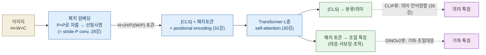
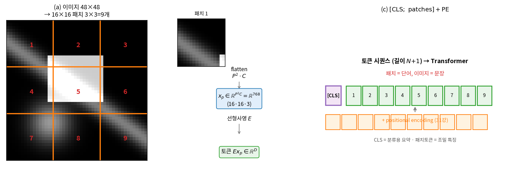
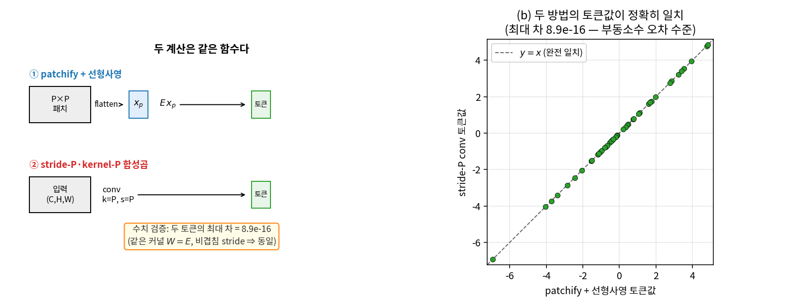
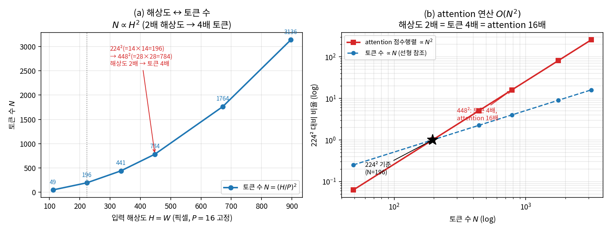
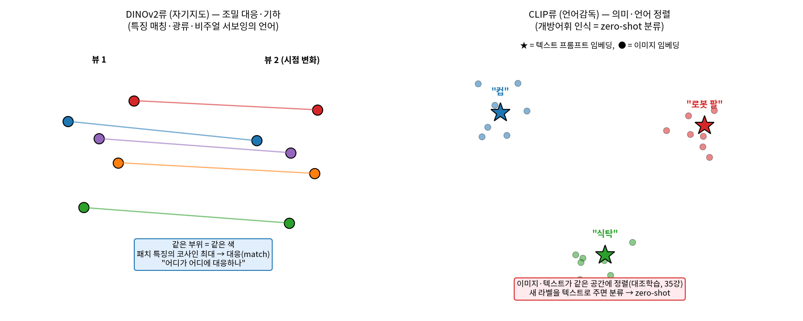
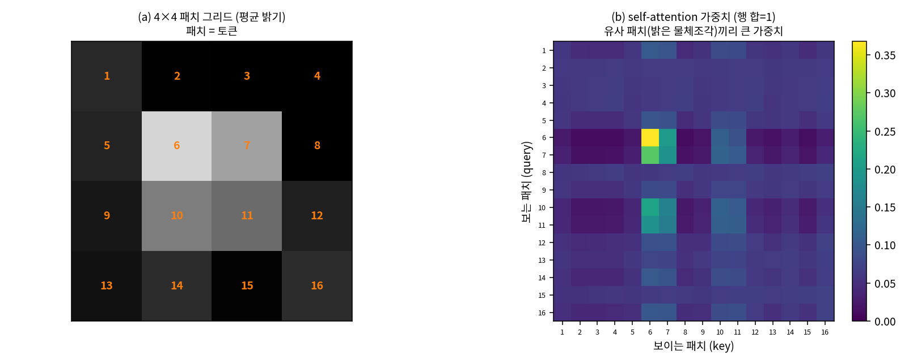

# Lec 34. ViT: 이미지를 패치 토큰으로

> 선수 지식: 28강(CNN·합성곱·등변성·잔차·사전학습), 31강(Transformer 완성·PE·잔차·마스크). 관련: 5강(특징 매칭·비주얼 서보잉), 30강(attention QKV), 35강(CLIP·SigLIP 대조학습, 바로 다음), 36강(LLaVA·VLM 백본), 46강(GR00T·Eagle 백본), 47강(SmolVLA). 이 강의는 Part 6의 CNN과 Part 7의 Transformer를 잇는 다리다 — **이미지를 패치 토큰 시퀀스로 바꿔 31강의 Transformer를 그대로 태운다.**

## 한 장 요약



ViT의 핵심 아이디어는 한 문장이다: **이미지를 16×16 패치로 잘라 각 패치를 하나의 "단어"(토큰)로 삼으면, 언어용 Transformer를 손대지 않고 그대로 태울 수 있다.** 그다음은 "무엇을 배우느냐"가 특징의 성격을 정한다 — 언어 감독(CLIP류)이면 의미, 자기지도(DINOv2류)면 기하·조밀 대응. VLA는 종종 둘 다 쓴다(46·47강).

## 학습 목표

1. 패치 임베딩을 정의하고, 토큰 수 $N=(H/P)(W/P)$·해상도↔토큰↔연산 $O(N^2)$의 관계를 쓸 수 있다.
2. patchify(비겹침 패치 선형사영)가 **stride-P·kernel-P 합성곱과 동치**임을 유도하고 수치로 검증할 수 있다(28강 회수).
3. ViT = "패치 토큰에 31강의 Transformer 그대로"임을 그리고, CNN의 국소 귀납편향을 버린 대가(데이터 굶주림)와 이득(전역 수용영역)을 설명할 수 있다.
4. **무엇을 배우느냐가 특징을 만든다** — DINOv2(자기지도·기하·조밀대응) vs CLIP류(언어감독·의미)의 차이를 로봇 태스크(서보잉 vs 개방어휘 인식)와 연결할 수 있다.
5. 패치 자르기·patchify=conv 동치·패치 그리드 self-attention을 numpy 토이로 재현하고 실제 수치로 검증할 수 있다.

## 왜 이 강의가 필요한가

28강에서 CNN은 두 개의 사전지식(국소성 + 평행이동 대칭)을 **구조에 새겨** 이미지를 처리했다. 31강에서 Transformer는 그런 시각 전용 구조 없이 **순서 있는 토큰 시퀀스**를 attention으로 처리했다. 이 두 세계는 어떻게 만나는가? 답이 ViT다 — **이미지를 토큰 시퀀스로 바꾸기만 하면**, 31강의 블록(pre-LN · 잔차 · PE · attention)을 한 줄도 안 고치고 시각에 쓸 수 있다. 이 다리를 못 건너면 35강 SigLIP, 36강 VLM 백본, 그리고 44·46·47강 VLA 백본의 "눈"이 왜 전부 ViT 계열인지를 원리로 설명할 수 없다.

그리고 로봇공학자에게 이 강의는 익숙한 트레이드오프의 연속이다. 패치 크기 $P$를 정하는 것은 **센서 해상도를 정하는 것**과 같다 — 잘게 자르면(작은 $P$) 정밀하지만 토큰이 많아 대역폭(연산)을 먹고, 굵게 자르면 싸지만 미세 구조를 놓친다. "해상도를 올리면 공짜로 좋아진다"는 착각은 여기서 깨진다: 해상도 2배는 토큰 4배, attention 연산 **16배**다($O(N^2)$). 이 강의의 worked example은 정확히 이 스케일을 손과 numpy로 확정시키고, "patchify가 사실은 stride-P conv"임을 오차 $10^{-15}$까지 보여 28강과 31강이 한 점에서 만나는 것을 몸으로 알게 한다.

## 본문

### 1. 패치 = 단어 — patchify라는 한 수

이미지를 Transformer에 넣는 문제의 핵심은 "무엇을 토큰으로 삼을까"다. 픽셀 하나를 토큰으로? 224×224면 토큰이 50,176개 — attention이 $O(N^2)$이니 계산이 폭발한다(흔한 오해: 패치≠픽셀). Dosovitskiy 등(2020)의 답은 **비겹침 패치**다: 이미지를 $P\times P$ 격자로 자르고, 각 패치를 하나의 토큰으로 만든다. $P=16$이면 224×224 이미지는 $14\times14=196$개 패치 = 196개 토큰이 된다 — 다룰 만한 시퀀스 길이다.

각 패치는 $P\times P\times C$ 픽셀 블록이다. 이것을 하나의 벡터로 펼치면($P^2 C$차원, $16^2\cdot3=768$), 학습된 선형사영 $E$로 $D$차원 토큰 임베딩을 얻는다 — 29강의 **임베딩 룩업**과 정확히 같은 자리다(단어 ID→벡터가 여기선 패치→벡터). 그다음 문장 맨 앞에 학습되는 **[CLS] 토큰**을 붙이고, 31강의 **positional encoding**을 더해 순서(어느 패치가 어디였는지)를 주입한다. 이제 이 시퀀스는 언어 토큰 시퀀스와 형식이 완전히 같다.



*그림 1: patchify의 세 단계. **(a)** 48×48 토이 이미지를 $P{=}16$ 격자로 잘라 $3\times3{=}9$개 패치를 만든다(실제 ViT는 224²/16²=196개; 여기선 눈으로 보려고 축소). 각 패치가 하나의 토큰이 된다 — "패치=단어". **(b)** 패치 1을 $P^2C{=}768$차원 벡터로 펼치고(flatten), 학습된 선형사영 $E$로 $D$차원 토큰 $Ex_p$를 얻는다(29강 임베딩과 같은 연산). **(c)** [CLS] 토큰을 앞에 붙이고(길이 $N{+}1$) positional encoding(31강)을 더해 Transformer로 보낸다. [CLS]는 분류용 요약, 패치 토큰들은 조밀 특징(조밀 태스크의 핵심 — 흔한 오해 5). `images/lec34/gen_figs.py`가 생성.*

### 2. patchify는 사실 conv였다 — 28강과의 재회

비겹침 패치를 선형사영하는 연산을 다시 보면, 28강을 아는 사람에게 낯익은 무언가가 보인다. "커널 크기 = $P$, 스트라이드 = $P$인 합성곱"이 바로 **겹치지 않게 $P\times P$ 창을 밀며 각 창에 선형변환을 적용**하는 연산이다. 즉 **patchify + 선형사영 = stride-$P$·kernel-$P$ conv**다. 실제 ViT 구현(timm, HuggingFace)의 패치 임베딩 층은 문자 그대로 `nn.Conv2d(C, D, kernel_size=P, stride=P)` 한 줄이다.

이것은 단순한 구현 트릭이 아니라 개념적 다리다. 28강의 CNN은 **작은 커널(3×3)을 stride 1로 촘촘히·겹치게** 밀어 국소성과 평행이동 등변성을 얻었다. ViT의 패치 임베딩은 **큰 커널(16×16)을 stride=커널로 겹치지 않게** 한 번만 민다 — 그래서 패치 *내부*에는 conv의 국소 처리가 남지만, 패치 *사이*의 관계는 conv가 아니라 attention이 맡는다. "CNN의 국소 귀납편향을 어디까지 남기고 어디부터 attention에 넘기는가"의 스위치가 바로 이 패치 크기다. WE-1이 이 동치를 오차 $10^{-15}$까지 검증한다.



*그림 3: **(a)** 두 계산 경로 — ① 패치를 펼쳐 $E x_p$로 선형사영, ② 입력에 stride-$P$·kernel-$P$ conv. 커널 $W$를 선형사영 $E$와 같게 두면 두 경로는 **같은 함수**다. **(b)** 랜덤 이미지(12×12×3)·랜덤 $E$로 두 방법의 토큰값을 산점도로 그리면 완전히 $y{=}x$ 위에 놓인다 — 최대 차 $8.9\times10^{-16}$(부동소수 오차 수준). "patchify는 conv의 특수한 경우(큰 커널·겹침 없는 스트라이드)"라는 28강↔34강 다리가 이 그림이다. `gen_figs.py`가 생성.*

### 3. ViT = 패치 토큰에 Transformer 그대로

패치 토큰 시퀀스가 준비되면, 그다음은 새로울 게 없다 — 31강의 Transformer 블록을 $L$번 쌓고, 마지막에 [CLS] 토큰의 출력을 분류 헤드에 넣으면 끝이다. pre-LN, 잔차(기울기 고속도로), multi-head self-attention, FFN — 언어 모델과 **완전히 같은 부품**이다. 이것이 ViT 논문의 충격이었다: "이미지 전용 구조(conv) 없이도, 토큰화만 바꾸면 순수 Transformer가 이미지를 최고 수준으로 분류한다."

**무엇을 잃고 무엇을 얻는가.** CNN은 국소성·평행이동 등변성이라는 **귀납편향(inductive bias)**을 공짜로 갖고 시작한다 — 그래서 데이터가 적어도 잘 배운다. ViT는 이 편향을 버렸다. attention은 처음부터 **모든 패치가 모든 패치를 본다**(30강 self-attention) — 얕은 층에서도 전역 관계를 즉시 볼 수 있다는 이득이다(CNN은 깊은 층에 가서야 수용영역이 물체 전체를 덮었다, 28강 E2). 그러나 "가까운 픽셀이 관련 있다", "물체는 어디 있든 물체다" 같은 시각 상식을 **데이터로부터 처음부터 배워야** 한다 — 그 대가가 **데이터 굶주림**이다. ViT는 ImageNet(128만 장)만으로는 같은 크기 CNN에 뒤졌고, JFT-300M(3억 장) 같은 초대량 사전학습에서야 CNN을 앞질렀다(흔한 오해: "ViT는 데이터 적어도 된다"는 정반대다).



*그림 2: 패치 크기 $P{=}16$ 고정. **(a)** 입력 해상도 $H$가 커지면 토큰 수 $N{=}(H/P)^2 \propto H^2$ — **해상도 2배(224→448)면 토큰 4배**(196→784). **(b)** self-attention 점수행렬은 모든 토큰 쌍이라 $O(N^2)$ — 토큰 4배는 attention 연산 **16배**(log-log에서 기울기 2). "해상도를 올리면 공짜로 좋아진다"가 왜 틀린지의 정확한 그림이다(흔한 오해 4): 정밀도는 오르지만 연산이 제곱으로 폭발한다. 이것이 센서 해상도↔대역폭 트레이드오프의 딥러닝판. `gen_figs.py`가 생성.*

### 4. 무엇을 배우느냐가 특징을 만든다 — DINOv2(기하) vs CLIP류(의미)

같은 ViT 구조라도 **훈련 목적**이 다르면 완전히 다른 특징이 나온다. 이것이 이 강의에서 로봇공학자가 가장 챙겨야 할 통찰이다 — 아키텍처가 아니라 **목적이 특징을 만든다**(28강 흔한 오해 4의 심화).

- **CLIP류(언어 감독, 35강)**: 이미지와 그것을 설명하는 텍스트를 **같은 공간에 정렬**하도록 대조학습한다. 결과 특징은 **의미·언어 정렬**이 강하다 — "이건 컵이다", "이건 로봇 팔이다"를 텍스트로 물어 분류할 수 있다(개방어휘 인식 = zero-shot). 고전 비전으로 번역하면, 고정된 클래스 분류기 대신 **텍스트 프롬프트가 곧 분류기**가 되는 개방어휘 인식이다.
- **DINOv2류(자기지도, SSL)**: 라벨 없이 이미지 자체의 일관성(같은 이미지의 두 뷰가 같은 특징을 내도록)으로 학습한다(Caron 2021 DINO, Oquab 2023 DINOv2). 결과 특징은 **기하·조밀 대응**이 강하다 — 시점이 변해도 "같은 부위"의 패치 특징이 서로 가장 유사하다. 이것은 로봇공학자가 아는 **특징 매칭·광류·비주얼 서보잉**(5강)의 학습판이다: 패치 토큰 특징의 코사인 최대점을 찾으면 프레임 간 대응이 나온다.

VLA는 종종 **둘 다** 쓴다. 조작에는 "무엇을 잡을까"(의미, CLIP)와 "그것이 지금 정확히 어디 있나·어떻게 정렬됐나"(기하, DINOv2)가 모두 필요하기 때문이다. GR00T(46강)의 Eagle 백본, SmolVLA(47강)의 시각 인코더 선택이 이 두 성질의 균형 문제다. Prismatic VLM 연구(Karamcheti 2024)는 DINOv2+SigLIP를 **함께 쌓는** 것이 조작·공간 태스크에 유리함을 보였다.



*그림 4: **(왼쪽) DINOv2류 — 조밀 대응·기하.** 같은 물체의 두 뷰(시점 변화) 사이에서 패치 특징의 코사인이 최대인 짝을 이으면 "같은 부위"끼리 대응된다(같은 색). 이것이 5강 특징 매칭·비주얼 서보잉의 언어 — "어디가 어디에 대응하나". **(오른쪽) CLIP류 — 의미·언어 정렬.** 이미지 임베딩(●)이 텍스트 프롬프트 임베딩(★) 주변에 의미별로 모인다. 새 라벨을 텍스트로 주면 분류되므로 zero-shot(개방어휘 인식). "목적이 특징을 만든다"의 개념 대비도. `gen_figs.py`가 생성(개념 도식 — 실제 DINOv2/CLIP 임베딩이 아니라 numpy 토이).*

### 핵심 수식

세 수식이 ViT의 뼈대다: **E1** 패치 임베딩(패치=단어, 토큰 수·연산 스케일), **E2** ViT=패치 토큰 + Transformer(귀납편향의 교환), **E3** 목적이 특징을 만든다(SSL vs 대조).

#### E1. 패치 임베딩 — 이미지를 토큰 시퀀스로, 그리고 $O(N^2)$의 대가

**① 직관**: 이미지를 $P\times P$ 조각으로 잘라 각 조각을 하나의 "단어"로 삼는다. 조각을 선형사영하면 토큰 벡터가 되고, [CLS]와 위치 정보를 더하면 언어 시퀀스와 형식이 같아진다. 잘게 자를수록(작은 $P$) 정밀하지만 단어가 많아지고, 단어가 많아지면 attention 비용이 제곱으로 는다.

**② 물리·기하적 의미**: $P$는 **공간 이산화 격자**다 — 센서 해상도를 정하는 것과 같은 결정이다. 토큰 수 $N=(H/P)(W/P)$는 곧 시퀀스 길이이고, self-attention은 모든 토큰 쌍을 보므로 연산·메모리가 $O(N^2)$(30강 §4의 $O(T^2)$가 여기선 $O(N^2)$). 해상도를 올리면 $N\propto H^2$, attention은 $N^2\propto H^4$ — "정밀도는 선형, 비용은 제곱(토큰 기준)·4제곱(해상도 기준)". 이것이 로봇 카메라에서 "해상도를 올릴까 패치를 키울까"가 대역폭 예산 문제인 이유다. patchify가 stride-$P$ conv와 동치이므로(§2), 이 층은 28강 conv의 특수한 경우 — 커널이 크고 겹치지 않는다.

**③ 형식(유도 요점)**: 이미지 $I\in\mathbb{R}^{H\times W\times C}$를 겹치지 않는 $P\times P$ 패치로 자르면 $N=(H/P)(W/P)$개, 각 패치 $x_p\in\mathbb{R}^{P^2 C}$. 학습된 사영 $E\in\mathbb{R}^{D\times P^2 C}$로 토큰을 만들고, [CLS]와 PE를 더한다:

$$
z_0 = [\,x_{\text{cls}};\ E x_p^{(1)};\ E x_p^{(2)};\ \dots;\ E x_p^{(N)}\,] + E_{\text{pos}},\qquad
z_0 \in \mathbb{R}^{(N+1)\times D}
$$

**patchify=conv 동치**: $E$의 각 행을 $(C,P,P)$ 커널로 reshape하면, 위 사영은 $\mathrm{Conv2d}(C,D,\ k{=}P,\ s{=}P)$의 출력을 펼친 것과 정확히 같다. **연산 스케일**: self-attention 점수 $QK^\top$은 $(N{+}1)\times(N{+}1)$이므로 $O(N^2 D)$. $H\to 2H$면 $N\to 4N$, attention $\to 16\times$. WE-1이 $224{=}14{\times}14{=}196$, $448{=}28{\times}28{=}784$(4배)·attention 16배와 동치 오차 $2\times10^{-15}$를 재현한다.

#### E2. ViT = 패치 토큰에 Transformer 그대로 — 귀납편향의 교환

**① 직관**: 패치 토큰이 준비되면 31강의 Transformer를 한 줄도 안 고치고 태운다. attention은 첫 층부터 모든 패치를 한꺼번에 보므로 **전역 관계를 즉시** 읽는다. 대신 "가까운 픽셀이 관련 있다"는 시각 상식을 구조로 갖지 않아 **데이터로 처음부터 배워야** 한다.

**② 물리·기하적 의미**: CNN(28강)은 국소성·평행이동 등변성을 구조에 새겨(가중치 공유·작은 커널) **적은 데이터로도** 잘 배운다 — 편향이 강한 만큼 데이터가 덜 필요하다. ViT는 그 편향을 **거의 다 버린다**: 유일하게 남은 시각 편향은 "패치 내부는 하나로 묶는다"뿐이고, 패치 *사이*는 전부 attention이 데이터로 배운다. 편향-분산 관점에서 ViT는 **낮은 편향·높은 분산** — 대량 데이터로 분산을 눌러야 이득이 난다(JFT-300M에서 CNN 추월). 얻는 것은 전역 수용영역: CNN이 깊이를 쌓아야 얻던 "물체 전체를 한 뉴런이 봄"을 ViT는 얕은 층에서도 얻는다.

**③ 형식(유도 요점)**: pre-LN Transformer 블록(31강 E1)을 그대로:

$$
z_\ell' = z_{\ell-1} + \mathrm{MSA}(\mathrm{LN}(z_{\ell-1})),\qquad
z_\ell = z_\ell' + \mathrm{FFN}(\mathrm{LN}(z_\ell'))
$$

$\mathrm{MSA}$는 multi-head self-attention $\mathrm{softmax}(QK^\top/\sqrt{d_k})V$(30강). $L$층 뒤 [CLS] 토큰 출력 $z_L^{(0)}$을 분류 헤드에 넣는다: $y=\mathrm{head}(\mathrm{LN}(z_L^{(0)}))$. **CNN과의 유일한 차이는 입력단(patchify)뿐** — 블록 내부는 언어 Transformer와 동일하다. 이 "동일함"이 35·36강에서 이미지·텍스트를 **하나의 Transformer**로 섞을 수 있는 이유다.

#### E3. 무엇을 배우느냐가 특징을 만든다 — SSL(기하) vs 대조(의미)

**① 직관**: 같은 ViT라도 훈련 목적이 특징의 성격을 정한다. 자기 일관성으로 배우면(DINOv2) 기하·대응에 강한 특징이, 이미지-텍스트 정렬로 배우면(CLIP) 의미·언어에 강한 특징이 나온다. 목적이 곧 특징이다.

**② 물리·기하적 의미**: **DINOv2(SSL)**는 라벨 없이 "같은 이미지의 두 뷰가 같은 표현을 내도록" 학습한다 — 시점·크롭이 바뀌어도 불변인 것은 물체의 **기하 구조**이므로, 패치 특징이 조밀 대응(같은 부위끼리 유사)을 갖게 된다. 이는 5강 광류·특징 매칭이 밝기 항등성으로 대응을 찾던 것을, 학습된 특징의 코사인 유사도로 바꾼 것이다. **CLIP류(대조)**는 이미지·텍스트 쌍을 당기고 아닌 쌍을 밀어(35강 InfoNCE/sigmoid) 두 모달을 정렬한다 — 결과는 **의미 클러스터**이고, 텍스트가 분류기가 되어 zero-shot이 된다(고정 분류기 대비 개방어휘). 로봇에는 둘 다 필요해서(무엇을·어디에) VLA 백본은 종종 두 인코더를 함께 쓴다.

**③ 형식(유도 요점)**: 두 목적을 대비하면 —

$$
\underbrace{\mathcal{L}_{\text{SSL}} = -\sum_i p^{\text{teacher}}(v_i)\log p^{\text{student}}(v_i')}_{\text{DINO류: 두 뷰 }v_i,v_i'\text{의 일치}}
\qquad\text{vs}\qquad
\underbrace{\mathcal{L}_{\text{contrast}} = -\log\frac{e^{\langle f_I, f_T\rangle/\tau}}{\sum_j e^{\langle f_I, f_{T_j}\rangle/\tau}}}_{\text{CLIP류: 이미지 }f_I\text{ ↔ 텍스트 }f_T\text{ 정렬}}
$$

왼쪽은 라벨·텍스트 없이 이미지 내부 일관성만(기하 특징), 오른쪽은 텍스트 감독으로 의미 정렬(35강에서 상세). **같은 ViT 위에서 손실만 바꾸면 특징 성격이 갈린다** — 0강의 설계 축 2(학습 목적)가 시각 특징에서 발현되는 것. 어느 코드에도 특징 성격이 강제돼 있지 않고, 오직 목적이 정한다.

### Worked Example

#### WE-1 (손계산 + 코드): 224²·P=16 → 196 토큰, 해상도 스케일, patchify=conv

**손계산.** $P=16$일 때 224×224 이미지의 토큰 수는 $N=(224/16)(224/16)=14\times14=196$. 해상도를 2배(448)로 올리면 한 변의 패치가 $448/16=28$개라 $N'=28\times28=784$ — **토큰 4배**. self-attention 점수행렬은 $N\times N$이므로 연산은 $(N'/N)^2=4^2=$ **16배**. "해상도 2배 = 토큰 4배 = attention 16배"가 $O(N^2)$의 핵심이다. 그리고 patchify는 stride-$P$ conv이므로, 커널을 선형사영 $E$와 같게 두면 두 방법의 토큰이 **정확히 같아야** 한다.

```python
import numpy as np

# --- (a) 토큰 수와 해상도 스케일 ---
H = W = 224; P = 16
N = (H // P) * (W // P)
print(f"grid = {H//P}x{W//P}, 토큰 수 N = {N}")          # 14x14, 196
H2 = 448; N2 = (H2 // P) ** 2
print(f"해상도 {H}->{H2}: 토큰 {N}->{N2} ({N2//N}배), "
      f"attention N^2 {(N2/N)**2:.0f}배")                 # 784 (4배), 16배

# --- (b) 이미지를 패치로 자르기 + patchify = stride-P conv 동치 ---
rng = np.random.default_rng(0)
Cimg, S, Ps, D = 3, 32, 8, 6          # 32x32x3 이미지, 패치 8x8 → 4x4=16 토큰
G = S // Ps
img = rng.standard_normal((Cimg, S, S))
E = rng.standard_normal((D, Cimg*Ps*Ps)) * 0.2           # 선형사영 (D, C*P*P)

# 방법 A: patchify + 선형사영
toks_A = np.zeros((G*G, D)); k = 0
for gy in range(G):
    for gx in range(G):
        patch = img[:, gy*Ps:(gy+1)*Ps, gx*Ps:(gx+1)*Ps] # (C,P,P)
        toks_A[k] = E @ patch.reshape(-1); k += 1
print("patchify 토큰 shape =", toks_A.shape)              # (16, 6)

# 방법 B: stride-P·kernel-P conv (E의 행을 (C,P,P) 커널로 reshape)
Wc = E.reshape(D, Cimg, Ps, Ps)
toks_B = np.zeros((G*G, D)); k = 0
for gy in range(G):
    for gx in range(G):
        region = img[:, gy*Ps:(gy+1)*Ps, gx*Ps:(gx+1)*Ps]
        for d in range(D):
            toks_B[k, d] = np.sum(Wc[d]*region)           # conv = 원소곱 합
        k += 1
print(f"patchify vs conv 최대 차 = {np.max(np.abs(toks_A - toks_B)):.2e}")  # 2.22e-15
```

출력이 손계산과 일치한다: 토큰 수 196, 해상도 2배에 토큰 4배·attention 16배, patchify 토큰 shape (16, 6), 그리고 patchify와 conv의 최대 차 $2.22\times10^{-15}$ — 부동소수 오차 수준의 **완전 동치**다. **"이미지를 패치로 자르는 것"이 사실 "큰 커널·겹침 없는 conv"**라는 28강↔34강 다리가 이 스무 줄이다. 단, 이 동치는 stride=커널(겹침 없음)일 때만 — 겹치는 패치(예: 최근 일부 변형)에서는 성립하지 않는다.

#### WE-2 (코드): 패치 그리드 self-attention — 유사 패치 묶기 + 2D PE 인접성

E2·E3를 눈으로 확인한다. 4×4 패치 그리드에서 중앙 4개(6·7·10·11)만 밝은 물체 조각이고 나머지는 배경이다. 각 패치 특징 $[$밝기, 질감, PE$_x$, PE$_y]$에 self-attention(30강)을 돌리면, **유사한 패치(같은 물체 조각)끼리 큰 가중치**를 준다 — attention이 첫 층부터 전역으로 유사 패치를 묶는다는 E2의 핵심이다. 이어서 2D positional encoding이 **인접 패치를 특징공간에서 가깝게** 만드는 것을 내적으로 확인한다.

```python
import numpy as np

# 4x4 패치 그리드: 중앙 4개(패치 6,7,10,11)만 밝은 물체, 나머지 배경
G = 4
bright = np.zeros((G, G))
bright[1, 1] = bright[1, 2] = bright[2, 1] = bright[2, 2] = 0.9
texture = 0.1 + 0.2*bright
feat = np.zeros((G*G, 4))                          # [밝기, 질감, PE_x, PE_y]
for gy in range(G):
    for gx in range(G):
        k = gy*G + gx
        feat[k] = [bright[gy, gx], texture[gy, gx], gx/(G-1), gy/(G-1)]

# self-attention: softmax(F F^T / sqrt(d)). 내용(밝기·질감)에 큰 가중치, PE 약하게.
w = np.array([3.0, 3.0, 0.6, 0.6]); Fw = feat * w
scores = Fw @ Fw.T / np.sqrt(Fw.shape[1])
scores -= scores.max(axis=1, keepdims=True)
A = np.exp(scores); A /= A.sum(axis=1, keepdims=True)     # 행 합=1 (30강)

obj = [5, 6, 9, 10]                                       # 0-index: 패치 6,7,10,11
print(f"물체 패치 상호 attention 평균 = {A[np.ix_(obj,obj)].mean():.3f}")  # 0.235
print(f"전체 평균 = {A.mean():.3f}")                       # 0.062
print("패치6이 가장 크게 보는 패치(1-index):",
      (np.argsort(A[5])[::-1][:4] + 1).tolist())           # [11, 10, 7, 6]

# --- 2D positional encoding: 인접 패치일수록 PE 내적이 큼 ---
def pe_2d(gx, gy, d_model=16):
    dh = d_model // 2; pe = np.zeros(d_model)
    for i in range(dh // 2):
        wf = 1.0 / (10000 ** (2*i / dh))
        pe[2*i], pe[2*i+1] = np.sin(gx*wf), np.cos(gx*wf)
        pe[dh+2*i], pe[dh+2*i+1] = np.sin(gy*wf), np.cos(gy*wf)
    return pe

base = pe_2d(1, 1)
print(f"PE 내적: 기준·이웃(1,2) = {base@pe_2d(1,2):.3f}, "
      f"기준·먼곳(3,3) = {base@pe_2d(3,3):.3f}")            # 7.535, 5.127
print(f"PE 자기내적 = {base@base:.3f}")                     # 8.000
```

출력이 설계와 일치한다: 물체 패치들끼리의 상호 attention 평균 **0.235** 대 전체 평균 **0.062**(약 3.8배) — attention이 유사한 물체 조각을 묶는다. 패치 6이 가장 크게 보는 4개가 $[11,10,7,6]$으로 **전부 물체 패치**다(배경이 아님). 이것이 "얕은 층도 전역"(E2)의 축소판 — conv라면 인접 창만 봤을 관계를 attention은 그리드 반대편까지 한 번에 잇는다. 2D PE 내적은 이웃(7.535) > 먼 곳(5.127)으로 **인접 패치를 가깝게** 만들어(31강 상대거리 의존의 2D판) 위치 정보를 주입한다. 이 히트맵이 그림 5다.



*그림 5: **(a)** 48×48 이미지를 4×4로 풀링한 패치 그리드(평균 밝기). 중앙의 밝은 물체 조각이 패치 6·7·10·11. **(b)** self-attention 가중치 히트맵(행=query 패치, 열=key 패치, 각 행 합=1). 밝은 물체 패치들(6·7·10·11)이 **서로에게 큰 가중치**(밝은 셀)를 준다 — 배경 패치는 서로 옅다. attention이 위치가 아니라 **내용 유사도**로 패치를 묶는다는 30강 self-attention의 시각판이고, 얕은 층에서도 전역으로 유사 구조를 잇는 ViT의 힘(E2)이다. `gen_figs.py`가 생성.*

### 로봇공학자를 위한 번역

- **패치 크기 $P$ = 센서 해상도·이산화 격자.** 잘게 자르면(작은 $P$) 미세 구조를 잡지만 토큰↔대역폭이 폭발하고($O(N^2)$), 굵게 자르면 싸지만 미세 구조를 놓친다. 카메라 해상도·샘플링 주파수를 정하던 그 트레이드오프다(그림 2).
- **DINOv2 조밀 대응 = 특징 매칭·광류·비주얼 서보잉(5강)의 학습판.** 밝기 항등성으로 대응을 찾던 것을, 학습된 패치 특징의 코사인 최대점으로 바꾼 것. 시점이 변해도 "같은 부위"를 잇는다.
- **CLIP zero-shot = 개방어휘 인식.** 고정된 클래스 분류기 대신 **텍스트 프롬프트가 곧 분류기**다. 새 물체 이름을 텍스트로 주면 재학습 없이 인식 — 고정 분류기(닫힌 집합) 대비 개방 집합.
- **patchify = stride-P conv.** 이미지를 토큰으로 바꾸는 그 층이 사실 28강의 conv(큰 커널·겹침 없음)다. "완전히 새로운 것"이 아니라 conv의 특수한 경우(WE-1).
- **귀납편향-데이터 트레이드오프 = 모델 사전(prior)-데이터 트레이드오프.** 60강 시스템 식별에서 물리 사전이 강하면 소량 데이터로 되지만 편향이 생기고, 사전이 약하면 데이터가 많이 필요한 것과 같다. CNN=강한 사전(적은 데이터), ViT=약한 사전(대량 데이터).

## 흔한 오해

1. **"ViT가 CNN을 완전히 대체했다"** — 상보적이다. ViT는 국소성 편향을 attention으로 대체했지만 대량 데이터를 요구한다. 그리고 오늘날 VLA가 쓰는 최강 인코더 중 하나인 **DINOv2는 ViT 백본이되 자기지도로 학습**된 것이고, conv-Transformer 하이브리드(ConvNeXt·하이브리드 ViT)도 여전히 강하다. "CNN이냐 ViT냐"보다 "무엇으로 사전학습했느냐"(E3)가 더 결정적이다(28강 흔한 오해 4와 직결).
2. **"패치 = 픽셀"** — 패치는 **여러 픽셀의 블록**($P\times P\times C$, $16^2\cdot3=768$값)이다. 픽셀 하나를 토큰으로 삼으면 224²=50,176 토큰이 되어 attention이 폭발한다. patchify의 존재 이유가 바로 이 시퀀스 길이 압축이다(그림 1).
3. **"ViT는 데이터가 적어도 된다"** — 정반대다. conv의 귀납편향(국소성·평행이동 대칭)을 버렸으므로, 그 시각 상식을 **데이터로 처음부터 배워야** 한다(E2). ViT는 ImageNet만으로는 같은 크기 CNN에 뒤졌고, JFT-300M 같은 초대량 사전학습에서야 앞섰다. "편향이 없으니 대량 데이터가 필수"가 정확하다.
4. **"해상도를 올리면 공짜로 좋아진다"** — 토큰·연산이 제곱으로 는다(그림 2). 해상도 2배 = 토큰 4배 = attention **16배**($O(N^2)$, $N\propto H^2$). 정밀도는 오르지만 대가는 4제곱(해상도 기준). 실무는 패치 크기·해상도·연산 예산을 함께 저울질한다 — 무료 점심이 아니다.
5. **"[CLS] 토큰이 유일한 출력이다"** — [CLS]는 분류·전역 요약용이고, **패치 토큰 특징이 조밀 태스크(segmentation·대응·조작)의 핵심**이다. DINOv2가 로봇 조작에 유용한 이유가 정확히 이 패치 토큰의 조밀 대응(그림 4 왼쪽)이다. [CLS]만 보면 "어디"를 버리는 것 — 조작에는 "어디"가 필수다(28강 §5 affordance).

## 실습 (1.5~2시간)

**A안 (CPU만, 추천): numpy로 패치 임베딩 + ViT 앞단 손으로 짜기.** WE-1의 patchify를 (i) 임의 $P$·해상도로 일반화하고 토큰 수를 식으로 예측·검증, (ii) `nn.Conv2d(C,D,k=P,s=P)`와 동치임을 직접 만든 conv로 재확인. 그다음 WE-2의 self-attention을 [CLS] 토큰 하나를 앞에 붙여 확장하고, [CLS] 행이 어느 패치에 큰 가중치를 주는지 관찰하라("전역 요약"이 어떻게 형성되는가). 마지막으로 패치 크기 $P$를 8·16·32로 바꿔 토큰 수와 attention 비용이 어떻게 변하는지 표로 정리(그림 2 재현).

**B안 (GPU 있으면, 설명 위주로 아주 작게): 사전학습 DINOv2·CLIP 특징 관찰.** `torch.hub`로 DINOv2 ViT-S/14를 로드해(아래 스니펫) 이미지 두 장(같은 물체, 다른 시점)의 패치 토큰 특징을 뽑고, 한 프레임의 한 패치와 다른 프레임 모든 패치의 코사인을 계산해 **조밀 대응**을 시각화(그림 4 왼쪽의 실물판 — 특징 매칭). CLIP과 비교해 "의미 vs 기하"의 차이를 눈으로 확인. **학습은 하지 말고** 사전학습 특징만 본다.

```python
# B안: 설명용. torch 필요(실습에서만). 가중치 다운로드 필요 → 수치 주장 금지.
import torch
dino = torch.hub.load('facebookresearch/dinov2', 'dinov2_vits14').eval()
# x: (1,3,224,224) 정규화 이미지 → 패치 토큰 특징 (1, 256, 384)
# feats = dino.forward_features(x)['x_norm_patchtokens']
# 두 프레임 patch 토큰의 코사인 최대점 = 조밀 대응(그림 4 왼쪽 실물판)
```

프레임 간 대응이 얼마나 잘 잡히는지, 텍스처가 없는 면(대응 실패)은 어디인지를 5강 특징 매칭의 언어로 Claude와 토론하라.

## Claude와 토론할 질문

1. 패치 크기 $P$를 절반으로 줄이면(16→8) 토큰·attention 비용은 각각 몇 배가 되는가? 정밀도 이득과 비용을 로봇 카메라 대역폭 예산으로 논하라. 극단으로 $P=1$(픽셀 토큰)이면 무엇이 무너지는가?
2. CNN의 귀납편향(국소성·평행이동 등변성)을 버린 ViT가 왜 대량 데이터를 요구하는가? 편향-분산 관점에서 "적은 데이터면 CNN, 많은 데이터면 ViT"가 성립하는 이유를 28강 등변성과 연결하라.
3. DINOv2(기하)와 CLIP(의미) 중 (a) 물체를 정확히 정렬해 삽입하는 조작, (b) "빨간 컵을 집어" 같은 언어 지시 수행에 각각 무엇이 더 필요한가? VLA가 왜 둘 다 쓰는지(46·47강) 스스로 가설을 세워라.
4. patchify가 stride-$P$ conv라면, "ViT는 conv를 완전히 버렸다"는 말은 어디까지 맞는가? 패치 *내부*와 패치 *사이*에서 conv/attention의 역할을 구분하라.
5. [CLS] 토큰만 쓰는 태스크와 패치 토큰이 필요한 태스크를 각각 둘씩 들어라. 로봇 조작은 어느 쪽이며 왜인가(흔한 오해 5)?
6. 2D positional encoding이 없으면 ViT는 무엇을 못 하는가(WE-2)? attention이 순서를 모른다는 30강 permutation-equivariance가 이미지에서 어떻게 문제가 되는가?
7. 해상도를 448로 올리려는데 사전학습이 224였다면, positional encoding은 어떻게 처리해야 하는가?(힌트: PE 보간) 이것이 sim-to-real·파인튜닝에서 왜 인터페이스 계약(0강) 문제인가?

## 읽을거리

1. **ViT 논문 (arXiv:2010.11929) Fig 1·§3.1과 §4.1만** (~30분): 패치 임베딩·[CLS]·PE의 정의(E1)와 "대량 데이터에서 CNN 추월"(E2·흔한 오해 3). Fig 1 하나가 그림 1의 원본이다.
2. **DINOv2 블로그/논문 (arXiv:2304.07193) Fig 1·조밀 대응 데모만** (~20분): 자기지도 패치 특징의 조밀 대응(E3·그림 4 왼쪽)이 로봇에 무엇을 주는지 감만. PCA 시각화가 핵심.
3. (선택) **Umar Jamil "PaliGemma from scratch" 중 SigLIP 인코더 부분** (~20분): 36강 VLM 백본으로 가는 다리로, ViT 인코더가 VLM 안에서 어떻게 쓰이는지 코드로.

## 자가 점검

1. 패치 임베딩을 정의하고, 토큰 수 $N=(H/P)(W/P)$와 [CLS]·PE의 역할을 안 보고 쓸 수 있는가?
2. patchify가 stride-$P$·kernel-$P$ conv와 동치임을 설명하고, WE-1의 최대 차 $2.2\times10^{-15}$가 무엇을 뜻하는지 말할 수 있는가?
3. "해상도 2배 = 토큰 4배 = attention 16배"를 $N\propto H^2$·$O(N^2)$로 유도하고, "해상도는 공짜가 아니다"를 설명할 수 있는가?
4. ViT가 CNN의 어떤 귀납편향을 버렸고, 그 대가(데이터 굶주림)와 이득(전역 수용영역)이 무엇인지 편향-분산으로 말할 수 있는가?
5. DINOv2(기하·조밀대응)와 CLIP류(의미·언어정렬)의 차이를 "목적이 특징을 만든다"로 설명하고, 각각을 5강 서보잉·개방어휘 인식과 연결할 수 있는가?
6. "ViT가 CNN을 완전 대체" · "패치=픽셀" · "ViT는 데이터 적어도 됨" · "[CLS]가 유일 출력" 네 오해를 각각 한 문장으로 교정할 수 있는가?
7. WE-2에서 self-attention이 유사 패치(물체 조각)를 묶는 것(0.235 vs 0.062)이 왜 "얕은 층도 전역"(E2)의 증거인지, 2D PE 내적(이웃 7.535 > 먼곳 5.127)이 무엇을 주입하는지 말할 수 있는가?

## 참고문헌

> 본문 수치·주장의 출처. 웹 문서는 2026-07 접속 기준. (2차) = 언론 등 2차 출처.

[1] A. Dosovitskiy et al. (Google), "An Image is Worth 16x16 Words: Transformers for Image Recognition at Scale (ViT)," arXiv:2010.11929, 2020.10. https://arxiv.org/abs/2010.11929
— **뒷받침**: 패치 임베딩(16×16, [CLS], PE — E1·그림 1), ViT=패치 토큰+Transformer(E2), 대량 사전학습(JFT-300M)에서 CNN 추월·ImageNet만으로는 부족(흔한 오해 3·E2), patchify=선형사영 구조.

[2] M. Oquab et al. (Meta AI), "DINOv2: Learning Robust Visual Features without Supervision," arXiv:2304.07193, 2023.4. https://arxiv.org/abs/2304.07193
— **뒷받침**: 자기지도 ViT 특징의 기하·조밀 대응(E3·그림 4 왼쪽), 패치 토큰이 조밀 태스크의 핵심(흔한 오해 5), VLA 백본의 기하 특징원.

[3] M. Caron et al. (Meta AI), "Emerging Properties in Self-Supervised Vision Transformers (DINO)," arXiv:2104.14294, 2021.4. https://arxiv.org/abs/2104.14294
— **뒷받침**: 자기지도 ViT의 두 뷰 일관성 목적(E3의 $\mathcal{L}_{\text{SSL}}$), 라벨 없는 특징 학습·attention이 물체 구조에 반응.

[4] K. He et al. (Meta AI), "Masked Autoencoders Are Scalable Vision Learners (MAE)," arXiv:2111.06377, 2021.11. https://arxiv.org/abs/2111.06377
— **뒷받침**: 패치 마스킹 자기지도(SSL의 또 다른 목적, E3 문맥), 패치 토큰 표현 학습.

[5] A. Radford et al. (OpenAI), "Learning Transferable Visual Models From Natural Language Supervision (CLIP)," arXiv:2103.00020, 2021.2. https://arxiv.org/abs/2103.00020
— **뒷받침**: 이미지-텍스트 대조학습·zero-shot 개방어휘 인식(E3·그림 4 오른쪽·로봇공학자 번역), CLIP류 의미 특징(35강 예고).

[6] X. Zhai et al. (Google), "Sigmoid Loss for Language Image Pre-Training (SigLIP)," arXiv:2303.15343, 2023.3. https://arxiv.org/abs/2303.15343
— **뒷받침**: CLIP류 대조학습의 sigmoid 변형(E3의 $\mathcal{L}_{\text{contrast}}$ 문맥, 35·36강 VLM 백본으로 연결).

[7] S. Karamcheti et al., "Prismatic VLMs: Investigating the Design Space of Visually-Conditioned Language Models," arXiv:2402.07865, 2024.2. https://arxiv.org/abs/2402.07865
— **뒷받침**: DINOv2+SigLIP를 함께 쌓는 것이 공간·조작 태스크에 유리(§4의 "VLA는 둘 다 쓴다", 36강 예고).

*수치 재현성: 본문·캡션·WE의 numpy 토이 수치는 `images/lec34/gen_figs.py`와 본문 코드 블록의 실행 출력이다 — WE-1의 토큰 수 $14{\times}14{=}196$·해상도 2배 시 토큰 784(4배)·attention 16배·patchify vs conv 최대 차 $2.22\times10^{-15}$(본문 코드) / $8.9\times10^{-16}$(그림 3, 다른 랜덤 시드·크기), WE-2의 물체 패치 상호 attention 평균 0.235 대 전체 0.062·패치6 최근접 $[11,10,7,6]$·2D PE 내적 이웃 7.535>먼곳 5.127>자기 8.000, 그림 5의 밝은 패치 상호 attention 0.163 대 전체 0.062(그림용 다른 특징 구성). numpy 1.26 / scipy 1.15 / matplotlib 3.5 기준 재현 확인. **이 토이는 개념 재현용 CPU 시뮬레이션이며 실제 ViT/DINOv2/CLIP 모델·가중치나 대량 사전학습이 아니다** — ViT의 JFT-300M 추월·DINOv2 조밀 대응·CLIP zero-shot의 실측 수치·설계는 위 [1][2][5] 1차 출처.*

<!-- lecture-nav -->

---

⬅ 이전: [Lec 33. 사후학습: 모델 길들이기](../part07-transformers-llm/lec33-post-training.md)　｜　[📖 전체 목차](../README.md)　｜　다음: [Lec 35. CLIP에서 SigLIP으로](lec35-clip-siglip.md) ➡
