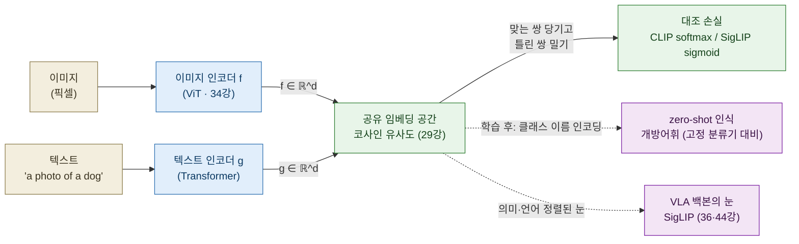
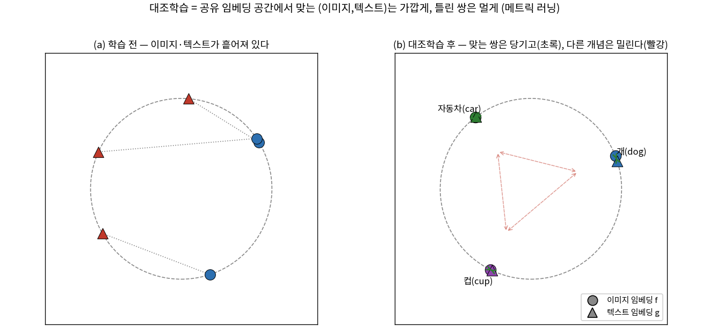
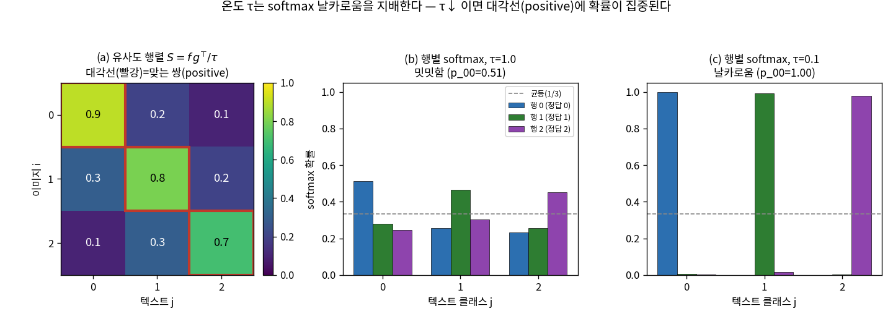
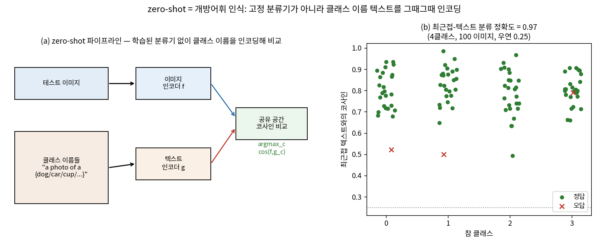
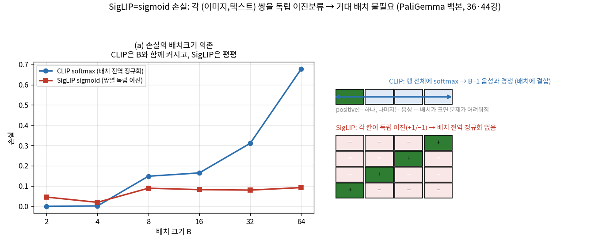

# Lec 35. CLIP에서 SigLIP으로

> 선수 지식: 34강(ViT — 패치 토큰·이미지의 시퀀스화). 29강(코사인 유사도·임베딩 공간의 기하), 28강(사전학습·특징 전이), 27강(학습 파이프라인·정칙화·일반화)을 떠올리면 훨씬 쉽다. 이 강의는 Part 8(VLM)의 두 번째 강의이자, 36강(LLaVA·VLM 백본 조립), 44강(π0의 SigLIP-So400m 백본)으로 가는 다리다.

## 한 장 요약



대조학습은 **이미지와 텍스트를 같은 공간에 넣고, 맞는 쌍은 가깝게·틀린 쌍은 멀게** 배치하는 메트릭 러닝이다(29강 코사인 유사도의 회수). 그 공간이 생기면 **클래스 이름을 텍스트로 인코딩해 비교**하는 것만으로 학습 없이 분류가 된다(zero-shot = 개방어휘 인식). CLIP은 배치 전역 softmax로, SigLIP은 쌍별 sigmoid로 그 정렬을 배우는데 — **손실만 다르고 나머지는 같다.** 그 작은 차이(배치 의존성 제거)가 SigLIP을 VLA 백본의 표준(PaliGemma의 SigLIP-So400m, 44강)으로 만든다.

## 학습 목표

1. 대조학습(CLIP InfoNCE)을 유사도 행렬 $S=fg^\top/\tau$의 행·열 cross-entropy로 쓰고, 대각선이 positive인 이유·온도 $\tau$의 역할을 설명·수치화할 수 있다.
2. zero-shot 분류를 $\arg\max_c \cos(f_\text{img}, g(\text{"a photo of a }c\text{"}))$로 정식화하고, 왜 이것이 "학습 없음"이 아니라 **사전학습은 대량·하위 라벨만 없음**인지 설명할 수 있다.
3. SigLIP의 sigmoid 손실을 쌍별 이진분류(라벨 +1/−1)로 쓰고, CLIP softmax와의 유일한 차이(배치 전역 정규화 유무)와 그 실용적 귀결(작은 배치·저해상도 강함)을 말할 수 있다.
4. 왜 SigLIP이 VLA 백본의 표준이 되었는지(효율·품질·작은 배치)를 36·44강의 조립도와 연결해 설명할 수 있다.
5. InfoNCE 손실과 zero-shot 정확도·CLIP/SigLIP 배치 의존성을 numpy 토이로 재현하고, "$\tau$가 왜 사소하지 않은가"·"왜 SigLIP은 거대 배치가 필요 없는가"를 수치로 보일 수 있다.

## 왜 이 강의가 필요한가

28강에서 우리는 "VLA는 시각 인코더를 로봇 데이터로 처음 학습하지 않고 웹 스케일 사전학습 인코더(DINOv2·SigLIP)를 빌려 온다"고 못 박았다. 그런데 **왜 하필 SigLIP인가?** π0(44강)의 백본 PaliGemma는 SigLIP-So400m을 쓰고, RT-2·GR00T·SmolVLA도 대조학습 계열 인코더를 눈으로 삼는다. 이 선택은 우연이 아니라 **하나의 손실함수 설계**에서 나온다. 그 설계를 모르면 "SigLIP이 좋대서 쓴다"는 주술에 그친다 — 새 백본(예: 47강 SmolVLM)이 왜 그런 인코더를 골랐는지, 저해상도·작은 배치에서 무엇이 유리한지 원리로 못 짚는다.

더 근본적으로, 이 강의는 **비전과 언어를 어떻게 정렬하는가**라는 VLM의 심장을 연다. 36강에서 LLaVA식 VLM을 조립할 때 "이미지 특징을 언어 공간에 넣는다"고 말하는데, 그 "언어와 정렬된 이미지 특징"이 정확히 여기서 대조학습으로 만들어진다. 그리고 대조학습은 SSL(자기지도 학습)의 한 갈래로, DINO·MAE·SimCLR과 함께 "라벨 없이 표현을 배우는" 큰 흐름의 일부다 — 이 계보가 63강 프론티어(SSL·world model)의 복선이다. 이걸 개념 비유로만 알면 무력하다. 그래서 이 강의는 InfoNCE를 3×3 행렬로 손계산하고, zero-shot과 CLIP/SigLIP 배치 의존성을 **직접 numpy로 재현**시킨다 — 44강에서 "SigLIP-So400m 백본"이라고 말할 때 무엇이 그 선택을 만들었는지 몸으로 알기 위해서다.

## 본문

### 1. 문제 설정 — 두 모달리티를 한 공간에

34강까지 이미지 인코더(ViT)는 픽셀을 특징으로 바꿨고, 29~33강에서 텍스트 인코더(Transformer)는 토큰을 특징으로 바꿨다. 두 인코더가 각자 좋은 표현을 만들어도, **그 두 표현이 서로 무관한 좌표계에 있으면** "이 이미지가 이 문장과 맞는가?"를 물을 수 없다. 필요한 것은 **공유 임베딩 공간** — 이미지 벡터 $f\in\mathbb{R}^d$와 텍스트 벡터 $g\in\mathbb{R}^d$가 **같은 $d$차원 공간**에 살아서, 코사인 유사도(29강) 한 번으로 "맞음/틀림"을 재는 구조다.

CLIP(Radford et al. 2021)의 아이디어는 놀랍도록 단순하다: 인터넷에서 긁은 **4억 쌍의 (이미지, 대체텍스트)** 를 놓고, "같은 쌍은 가깝게, 다른 쌍은 멀게" 두 인코더를 함께 학습한다. 라벨(고양이/개/...)은 없다 — **오직 "이 이미지와 이 텍스트가 원래 짝이었나"라는 일치 신호**만 쓴다. 그래서 대조학습은 지도학습이 아니라 SSL의 일종이다(흔한 오해 4).



*그림 1: (a) 학습 전 — 이미지 임베딩(원)과 텍스트 임베딩(삼각형)이 공유 공간(단위원)에 무작위로 흩어져, 짝(점선)이 멀다. (b) 대조학습 후 — 같은 개념의 이미지·텍스트가 겹치도록 **당겨지고**(초록 양방향 화살표), 서로 다른 개념(개/자동차/컵)은 **밀린다**(빨강 점선). 이것이 메트릭 러닝(거리학습)이다 — 라벨이 아니라 "쌍의 일치"만으로 의미 있는 거리 구조가 생긴다. `gen_figs.py`가 생성.*

로봇공학자에게 이 그림은 낯설지 않다. **특징 매칭·비주얼 서보잉**에서 두 뷰의 대응점을 "특징 공간에서 가까운 것"으로 찾듯, 대조학습은 이미지와 텍스트라는 두 모달리티의 대응을 "공유 공간에서 가까운 것"으로 만든다. 다만 그 특징 공간을 SIFT/ORB처럼 손으로 설계하지 않고 **데이터가 정한다**.

### 2. 유사도 행렬과 대조 손실 — 배치가 곧 문제다

대조학습의 계산은 **배치 하나를 행렬로** 본다. 크기 $B$ 배치의 이미지 임베딩을 행으로 쌓은 $F\in\mathbb{R}^{B\times d}$, 텍스트를 $G\in\mathbb{R}^{B\times d}$(각 행 단위정규화)라 하면, 유사도 행렬은

$$S = \frac{F G^\top}{\tau}\in\mathbb{R}^{B\times B}, \qquad S_{ij}=\frac{f_i\cdot g_j}{\tau}$$

$S_{ij}$는 $i$번째 이미지와 $j$번째 텍스트의 코사인 유사도를 온도 $\tau$로 나눈 값이다. **대각선 $S_{ii}$가 맞는 쌍(positive)** 이고, 나머지 $B^2-B$개는 배치 안의 다른 이미지·텍스트라 **틀린 쌍(negative)** 이다. 여기서 결정적 관찰: negative는 따로 만들 필요가 없다 — **배치 안의 다른 모든 쌍이 자동으로 negative**다. 배치가 클수록 각 positive가 상대해야 할 negative가 많아진다(이 점이 §4에서 SigLIP의 동기가 된다).



*그림 2: (a) 3×3 유사도 행렬 $S=fg^\top/\tau$ — 대각선(빨강 테두리)이 positive. WE-1의 행렬을 그대로 썼다. (b) 행별 softmax, $\tau=1$: 대각선 확률이 밋밋하다($p_{00}=0.51$, 우연 $1/3=0.33$과 큰 차이 없음). (c) $\tau=0.1$: 같은 행렬인데 softmax가 **날카로워져** 대각선에 확률이 거의 몰린다($p_{00}=1.00$). 온도 $\tau$가 "얼마나 확신하는가"를 지배한다 — 흔한 오해 5의 반례. E1·WE-1에서 수치로 재현. `gen_figs.py`가 생성.*

### 3. zero-shot — 학습 없이 분류하는 마법의 정체

대조학습으로 공유 공간이 생기면, **한 번도 본 적 없는 분류 문제를 학습 없이** 풀 수 있다. 절차는 이렇다. 개/고양이/자동차를 구분하고 싶다면, 각 클래스 이름을 문장으로 만들어(`"a photo of a dog"`) 텍스트 인코더에 넣어 $g_c$를 얻는다. 테스트 이미지 $x$는 이미지 인코더로 $f=f(x)$를 얻는다. 그리고 **가장 가까운 클래스 텍스트**를 고른다:

$$\hat c = \arg\max_c \cos\big(f(x),\ g(\text{"a photo of a }c\text{"})\big)$$

이것이 왜 대단한가? **분류기 가중치를 하위 태스크로 학습하지 않았다.** 고전 분류기(28강의 ImageNet 헤드)는 1000개 클래스에 대한 **고정된** 출력층을 가져서, 1001번째 클래스는 재학습 없이 못 다룬다. zero-shot은 반대다 — 클래스 집합이 **텍스트로 주어지므로 무한히 확장**된다(개방어휘). 로봇공학자에게 이것은 **개방어휘 인식**의 정확한 정의다: 고정 레이블 집합이 아니라, 인식할 대상을 자연어로 그때그때 명세한다.



*그림 3: (a) zero-shot 파이프라인 — 이미지는 인코더 $f$로, 클래스 이름들은 인코더 $g$로 임베딩한 뒤, 공유 공간에서 $\arg\max_c\cos(f,g_c)$. **학습된 분류기가 없다.** (b) numpy 토이(4클래스, 클래스당 노이즈 이미지 25장): 최근접-텍스트 분류 정확도 **0.97**(우연 0.25). 대부분 이미지가 자기 클래스 텍스트와 코사인 0.7~1.0으로 가깝고, 소수 오답(×)만 경계에서 발생. WE-2 Part A에서 재현. `gen_figs.py`가 생성.*

"zero-shot=학습 안 함"은 오해다(흔한 오해 2). **사전학습은 4억 쌍이라는 대량**이었다 — 다만 하위 태스크(이 개/고양이 구분)의 라벨을 안 봤을 뿐이다. 정확히 말하면 "하위 태스크 지도 없이(task-supervision-free)"이지 "학습 없이(training-free)"가 아니다.

### 4. CLIP vs SigLIP — 손실만 바꿨다

CLIP은 유사도 행렬에 **softmax cross-entropy**를 건다. 각 이미지(행)에 대해 "$B$개 텍스트 중 어느 것이 짝인가"를 맞히는 $B$-way 분류이고, 대칭으로 각 텍스트(열)에 대해서도 건다. 문제는 **softmax가 행 전체를 하나로 정규화**한다는 것 — 각 positive가 배치 안 $B-1$개 negative와 **동시에 경쟁**한다. 그래서 CLIP은 negative가 많을수록(배치가 클수록) 대조 신호가 강해지고, 실제로 **매우 큰 배치**(수천~수만)를 요구한다. 배치를 키우려면 GPU 메모리가 폭증한다.

SigLIP(Zhai et al. 2023)의 처방은 단 한 줄이다: **softmax를 sigmoid로 바꾼다.** 유사도 행렬의 **각 칸 $(i,j)$를 독립적인 이진분류**로 본다 — "이 이미지와 이 텍스트가 짝인가? 예(+1)/아니오(−1)". 대각선은 라벨 +1, 나머지는 −1인 $B^2$개의 독립 BCE(binary cross-entropy)다. **행 전체를 묶는 정규화가 없다.** 그 결과: 각 쌍의 손실이 다른 쌍과 무관해져 **배치 크기에 대한 결합이 사라진다** — 작은 배치로도 학습이 되고, 메모리·통신이 싸며, 저해상도에서 강하다.



*그림 4: (a) 같은 토이 데이터에서 배치 크기 $B$를 2→64로 키우며 손실 측정 — **CLIP softmax는 $B$와 함께 커지고**(0.0002→0.68; positive가 상대할 negative가 늘어 문제가 어려워짐), **SigLIP sigmoid는 거의 평평**(0.045→0.09; 각 쌍이 독립이라 배치에 무관). (b) 왜 그런가의 도식 — CLIP은 행 전체에 softmax(파랑 화살표, $B-1$ negative와 경쟁), SigLIP은 $B^2$개 칸이 각자 독립 이진(+1/−1). WE-2 Part B에서 재현. 이 배치 독립성이 SigLIP을 확장 쉽고 저비용으로 만든다. `gen_figs.py`가 생성.*

**여기서 오해를 하나 부순다: SigLIP은 CLIP과 근본이 다른 게 아니다**(흔한 오해 3). 두 인코더 구조, 공유 공간, 코사인 유사도, zero-shot 사용법 — 전부 같다. **딱 하나, 손실 함수(softmax → sigmoid)만 다르다.** 그런데 그 한 줄이 배치 의존성을 제거해서, 같은 계산 예산으로 더 크고 좋은 인코더를 학습하게 한다. 이것이 SigLIP-So400m(400M ViT)이 나온 배경이고, 다음 절의 VLA 백본 표준화로 이어진다.

### 5. 왜 SigLIP이 VLA 백본 표준이 되었나

44강에서 회수할 사실: **π0의 백본은 PaliGemma 3B = SigLIP-So400m(400M) + linear projector + Gemma 2B**다. RT-2(42강)·GR00T(46강)·SmolVLA(47강)도 대조학습 계열 인코더를 눈으로 삼는다. 왜 대조학습 인코더, 특히 SigLIP인가? 세 가지가 맞물린다:

- **의미·언어 정렬**: VLA는 "빨간 컵을 집어라" 같은 **언어 지시를 이미지에 결부**해야 한다. 대조학습 인코더의 특징은 이미 텍스트와 정렬돼 있어서(§1~3), 언어 조건 조작에 자연스럽다. 28강의 대비를 회수하면 — **DINOv2는 기하·대응(비주얼 서보잉식)에 강하고, SigLIP은 의미·언어 정렬에 강하다.** VLA가 언어를 따르려면 후자가 필요하다.
- **효율·품질·작은 배치**: SigLIP의 배치 독립성(§4)은 거대 배치 인프라 없이도 고품질 인코더를 학습·서빙하게 한다. 로봇 시스템은 온보드 자원이 빠듯하므로(49강), 저해상도·저비용에서 강한 인코더가 실용적으로 유리하다.
- **조립 가능성(36강 예고)**: SigLIP은 "이미지를 언어 공간 근처의 벡터로" 내놓으므로, projector(0강 인터페이스 계약·33강 어댑터)만 얹으면 LLM에 붙는다. 이 조립도가 36강 LLaVA/PaliGemma의 핵심이고, VLA는 그 위에 action expert(44강)를 더한 것이다.

즉 SigLIP은 "언어와 정렬된, 싸고 좋은 눈"이라서 VLA 백본의 기본값이 됐다. 이 선택을 원리로 이해하면 새 백본(47강 SmolVLM)이 왜 유사한 인코더를 고르는지 즉시 위치시킬 수 있다.

### 6. SSL 계보 — 대조학습은 큰 흐름의 한 갈래 (→63강 복선)

대조학습은 **자기지도 학습(SSL)** — 사람이 단 라벨 없이, 데이터 자체에서 만든 신호로 표현을 배우는 방법 — 의 한 갈래다. CLIP/SigLIP의 신호는 "이미지-텍스트 쌍의 일치"였다. 같은 SSL 우산 아래 세 이웃이 있다:

- **SimCLR(Chen et al. 2020)**: 텍스트 없이 **한 이미지의 두 증강(crop·color)** 을 positive 쌍으로, 다른 이미지를 negative로 하는 대조학습. "같은 사진의 두 뷰는 같아야 한다"는 신호. CLIP과 손실 구조(InfoNCE)가 같고, 짝의 정의만 다르다.
- **DINO(Caron et al. 2021)/DINOv2(Oquab et al. 2023)**: **자기증류(self-distillation)** — negative 없이, 학생 네트워크가 교사(자기 자신의 이동평균)의 출력을 맞히게 한다. 조밀(dense) 특징·기하 대응에 강해 비주얼 서보잉식 태스크에 유리(28강).
- **MAE(He et al. 2021)**: **마스킹 재구성** — 이미지 패치의 75%를 가리고 복원하게 한다(BERT의 이미지판, 생성적 SSL). 34강 ViT 위에서 돈다.

이 계보를 한 줄로: **"라벨 대신 데이터 구조를 감독 신호로."** 대조(SimCLR·CLIP), 증류(DINO), 재구성(MAE)은 그 신호를 만드는 세 방식이다. VLA의 눈은 대부분 이 SSL 인코더에서 온다(SigLIP=대조, DINOv2=증류). 63강(프론티어)에서 이 흐름이 **world model**(관측을 예측하며 표현을 배우는 것 — 재구성 SSL의 확장)로 이어진다. 지금은 "VLA의 눈은 SSL로 만든다"만 챙기면 된다.

### 핵심 수식

대조학습·zero-shot·SigLIP은 "비전과 언어를 어떻게 정렬하는가"라는 하나의 질문에 대한 세 조각이다: **E1** 대조 손실(어떻게 정렬을 배우나), **E2** zero-shot(정렬된 공간을 어떻게 쓰나), **E3** sigmoid 손실(왜 SigLIP이 배치에 자유로운가).

#### E1. 대조학습 — InfoNCE, 유사도 행렬의 행·열 cross-entropy

**① 직관**: 배치 안에서 "맞는 (이미지,텍스트) 쌍은 가깝게, 틀린 쌍은 멀게." 각 이미지에게 "$B$개 텍스트 중 네 짝을 골라라"는 객관식을 풀리는 것 — 정답은 대각선이다. 29강 코사인 유사도가 거리를, softmax가 그 거리를 확률로 바꾼다.

**② 물리·기하적 의미**: 이것은 **메트릭 러닝**(거리학습)이다 — 사람이 라벨을 주는 대신, "원래 짝이었다"는 쌍 정보만으로 임베딩 공간의 거리 구조를 조각한다. 로봇공학자의 언어로는 특징 매칭·비주얼 서보잉에서 대응점을 특징 공간의 근접으로 정의하는 것과 같다. **온도 $\tau$** 는 이 공간의 "선예도"를 정한다: $\tau$가 작으면 softmax가 날카로워져(그림 2c) positive에 확률을 몰고 gradient가 강하지만 불안정해지기 쉽고, 크면 밋밋해져(그림 2b) 신호가 약하다. $\tau$는 학습 가능한 스칼라로 두는 게 보통이다 — 사소한 하이퍼가 아니라 분포 날카로움·학습 안정을 지배하는 1차 변수다(흔한 오해 5).

**③ 형식(유도 요점)**: 단위정규화된 임베딩 $f_i, g_j$에 대해 유사도 $S_{ij}=f_i\cdot g_j/\tau$. 이미지→텍스트 방향 손실은 각 행에 대한 cross-entropy(정답=대각선), 텍스트→이미지는 각 열에 대해:

$$
\mathcal{L}_{i\to t}=-\frac{1}{B}\sum_{i=1}^{B}\log\frac{\exp(S_{ii})}{\sum_{j=1}^{B}\exp(S_{ij})},
\qquad
\mathcal{L}_{t\to i}=-\frac{1}{B}\sum_{j=1}^{B}\log\frac{\exp(S_{jj})}{\sum_{i=1}^{B}\exp(S_{ij})}
$$

$$
\mathcal{L}_{\mathrm{CLIP}}=\tfrac12\big(\mathcal{L}_{i\to t}+\mathcal{L}_{t\to i}\big)
$$

이것이 InfoNCE(van den Oord 2018)의 이미지-텍스트 판이다: positive 하나를 $B$개(1 positive + $B{-}1$ negative) 중 고르는 로그우도. **배치 안 다른 쌍이 곧 negative**이므로, 손실은 배치 크기에 명시적으로 결합된다(E3에서 이 결합이 SigLIP의 표적).

#### E2. zero-shot — 임베딩 공간의 최근접, 개방어휘

**① 직관**: 분류를 "학습된 출력층"이 아니라 "**클래스 이름 텍스트와의 거리**"로 푼다. 클래스가 텍스트로 주어지니, 클래스 집합을 마음대로 바꿔도 재학습이 없다.

**② 물리·기하적 의미**: 고정 분류기(28강 ImageNet 헤드)는 **닫힌 어휘** — 출력 뉴런이 고정돼 새 클래스를 못 받는다. zero-shot은 **개방어휘** — 인식 대상을 자연어로 명세하므로 무한 확장된다. 로봇에서 이것은 "미리 정한 물체 목록"이 아니라 "말로 지시하는 임의의 물체"를 인식·조작하는 능력의 토대다(42강 RT-2가 웹 지식을 행동에 전이하는 것의 지각 쪽 대응). 결정적으로 이것은 **학습 없음이 아니다**: 사전학습은 대량이었고(4억 쌍), 하위 태스크 라벨만 안 봤다.

**③ 형식(유도 요점)**: 클래스 집합 $\mathcal{C}=\{c_1,\dots,c_K\}$에 대해 각 이름을 프롬프트에 넣어 텍스트 임베딩 $g_c=g(\text{"a photo of a }c\text{"})$를 만들고(단위정규화), 이미지 $x$의 임베딩 $f(x)$와의 코사인 최근접:

$$
\hat c(x)=\arg\max_{c\in\mathcal{C}}\ \cos\big(f(x),\,g_c\big)=\arg\max_{c}\ f(x)\cdot g_c
$$

(둘 다 단위벡터라 코사인=내적.) 검색(retrieval)도 같은 식의 다른 방향일 뿐이다 — 질의 텍스트에 가장 가까운 이미지를 고르면 텍스트→이미지 검색. **분류·검색이 하나의 최근접 연산**으로 통합된다.

#### E3. SigLIP — 쌍별 sigmoid, 배치 전역 정규화의 제거

**① 직관**: 유사도 행렬의 각 칸을 "짝인가? 예/아니오"의 **독립 이진분류**로 본다. 행 전체를 묶는 softmax 대신, 칸마다 따로 sigmoid를 건다. 그래서 한 쌍의 손실이 배치 안 다른 쌍과 무관해진다 — 거대 배치가 필요 없다.

**② 물리·기하적 의미**: CLIP softmax는 각 positive를 $B-1$ negative와 **한 분모 안에서** 경쟁시킨다(E1) — negative가 많을수록(배치 클수록) 신호가 강해지므로 큰 배치를 요구하고 메모리가 폭증한다. SigLIP은 이 **전역 정규화를 없애** 각 칸을 독립 사건으로 만든다. 결과: 손실이 배치 크기에 자유롭고(그림 4a의 평평한 곡선), 확장이 쉽고, 저해상도·저자원에서 강하다 — 이것이 **VLA 백본 표준**(PaliGemma의 SigLIP-So400m, 36·44강)이 된 실용적 이유다. 라벨 불균형(대각선 $B$개 positive vs $B^2-B$개 negative)을 학습 가능한 **바이어스 $b$** 로 보정한다.

**③ 형식(유도 요점)**: 배치의 각 쌍 $(i,j)$에 라벨 $y_{ij}=+1$(짝, $i=j$) 또는 $-1$(비짝)을 주고, 로짓 $z_{ij}=f_i\cdot g_j/\tau + b$에 대해 쌍별 로지스틱(BCE) 손실:

$$
\mathcal{L}_{\mathrm{SigLIP}}=-\frac{1}{B}\sum_{i=1}^{B}\sum_{j=1}^{B}\log\sigma\!\big(y_{ij}\,z_{ij}\big),
\qquad \sigma(u)=\frac{1}{1+e^{-u}}
$$

CLIP(E1)과의 **유일한 차이는 안쪽 함수**다: softmax의 행 정규화 $\log\frac{e^{S_{ii}}}{\sum_j e^{S_{ij}}}$ 대신, 각 칸 독립의 $\log\sigma(y_{ij}z_{ij})$. 분모에 배치 전체가 들어가지 않으므로 배치 결합이 사라진다. 나머지(인코더·공유 공간·zero-shot 사용법)는 전부 동일하다 — "근본이 다르다"가 아니라 "손실만 다르다"(흔한 오해 3).

### Worked Example

#### WE-1 (손계산 + 검증): 3×3 유사도 행렬의 CLIP InfoNCE와 온도 효과

세 개의 (이미지,텍스트) 쌍이 있고, 이미 정규화된 임베딩으로 만든 코사인 유사도 행렬(온도 적용 전)이 아래와 같다고 하자. 대각선이 맞는 쌍이라 값이 크다:

$$
S_{\cos}=\begin{pmatrix} 0.9 & 0.2 & 0.1\\ 0.3 & 0.8 & 0.2\\ 0.1 & 0.3 & 0.7\end{pmatrix}
$$

손으로 확인할 두 가지. ① **$\tau=1$, 0번 이미지(행 0)의 softmax**: $\exp(0.9),\exp(0.2),\exp(0.1)=2.460,1.221,1.105$, 합 $4.786$ → 확률 $[0.514, 0.255, 0.231]$. 대각선 확률 $p_{00}=0.514$ — 우연 $1/3=0.33$보다 겨우 높다. 행 0의 손실 $=-\log 0.514=0.6657$. ② **온도를 낮추면** 같은 행렬인데 대각선 확률이 치솟는다: $\tau=0.1$이면 $p_{00}=0.999$. 이것이 $\tau$가 "확신의 날카로움"을 지배한다는 뜻이다.

전체 CLIP 손실(행·열 평균)은 $\tau=1$에서 $0.7432$, $\tau$를 $0.5\to0.1\to0.07$로 낮추면 $0.4791\to0.0087\to0.0011$로 급감한다 — 대각선이 이미 최댓값이라, $\tau$를 낮춰 softmax를 날카롭게 하면 손실이 0에 수렴한다.

```python
import numpy as np
np.set_printoptions(precision=3, suppress=True)

# 코사인 유사도 행렬 (행=이미지, 열=텍스트). 대각선 = 맞는 쌍(positive)
S = np.array([[0.9, 0.2, 0.1],
              [0.3, 0.8, 0.2],
              [0.1, 0.3, 0.7]])

def infonce(S, tau):                       # 행·열 cross-entropy (대각선=정답)
    L = S / tau
    def ce_rows(L):
        m = L.max(1, keepdims=True)
        logZ = m[:, 0] + np.log(np.exp(L - m).sum(1))
        return -(np.diag(L) - logZ)        # 행별 손실
    rl, cl = ce_rows(L), ce_rows(L.T)       # img->txt, txt->img
    return rl, cl, 0.5 * (rl.mean() + cl.mean())

# 손계산 검증: tau=1, 행 0의 softmax
L0 = S[0] / 1.0
p0 = np.exp(L0) / np.exp(L0).sum()
print("행0 확률:", np.round(p0, 3), " -log(p_00) =", round(-np.log(p0[0]), 4))
# 행0 확률: [0.514 0.255 0.231]  -log(p_00) = 0.6657

# 온도 효과: total 손실과 대각선 확률 p_00
for tau in [1.0, 0.5, 0.1, 0.07]:
    _, _, Ltot = infonce(S, tau)
    L0 = S[0] / tau; p = np.exp(L0 - L0.max()); p /= p.sum()
    print(f"tau={tau:<4}  total손실={Ltot:.4f}   p_00={p[0]:.4f}")
# tau=1.0   total손실=0.7432   p_00=0.5139
# tau=0.5   total손실=0.4791   p_00=0.6904
# tau=0.1   total손실=0.0087   p_00=0.9988
# tau=0.07  total손실=0.0011   p_00=0.9999
```

출력이 손계산과 일치한다: 행 0 확률 $[0.514,0.255,0.231]$·손실 $0.6657$, 그리고 $\tau$를 $1\to0.07$로 낮추면 total 손실 $0.7432\to0.0011$·$p_{00}$ $0.514\to1.000$. **"$\tau$는 사소한 하이퍼가 아니다"** 가 이 열 줄로 증명된다(흔한 오해 5) — 같은 유사도인데 $\tau$ 하나로 "겨우 우연보다 나음"과 "확실"을 오간다. 실제 CLIP은 $\tau$를 학습 가능한 스칼라로 두어 이 날카로움을 데이터가 정하게 한다. `gen_figs.py`가 이 행렬로 그림 2(τ=1 밋밋 vs τ=0.1 날카로움)를 만든다.

#### WE-2 (코드): zero-shot 최근접 분류 + CLIP softmax vs SigLIP sigmoid의 배치 의존성

E2·E3을 눈으로 확인한다. **Part A(zero-shot)**: 4클래스의 텍스트 프로토타입(단위벡터)을 만들고, 각 클래스에 노이즈를 얹은 이미지 임베딩을 생성한 뒤 $\arg\max_c\cos(f,g_c)$로 분류한다 — **학습 없이** 최근접 텍스트만으로. **Part B(CLIP vs SigLIP)**: 같은 (이미지,텍스트) 쌍 데이터에서 배치 크기 $B$를 2→64로 키우며 두 손실을 잰다. 핵심 관찰: **CLIP softmax는 $B$와 함께 커지고(배치에 결합), SigLIP sigmoid는 거의 평평(배치에 자유)**.

```python
import numpy as np
def l2norm(X): return X / np.linalg.norm(X, axis=1, keepdims=True)

# ---------- Part A: zero-shot 최근접-텍스트 분류 ----------
rng = np.random.default_rng(0)
D, C, N = 6, 4, 25
protos = l2norm(rng.standard_normal((C, D)))          # 클래스 이름 텍스트 임베딩 g_c
imgs, labels = [], []
for c in range(C):
    x = protos[c] + 0.35 * rng.standard_normal((N, D)) # 노이즈 있는 이미지 임베딩
    imgs.append(x); labels += [c] * N
imgs = l2norm(np.vstack(imgs)); labels = np.array(labels)
pred = (imgs @ protos.T).argmax(1)                     # argmax_c cos(f_img, g_c)
print("[A] zero-shot 정확도 =", round((pred == labels).mean(), 3),
      f"(4클래스·100이미지·우연 {1/C:.2f})")
# [A] zero-shot 정확도 = 0.97 (4클래스·100이미지·우연 0.25)

# ---------- Part B: CLIP softmax vs SigLIP sigmoid, 배치크기 의존 ----------
rng = np.random.default_rng(1)                         # 쌍 데이터 (별도 시드)
M = 64
z   = l2norm(rng.standard_normal((M, D)))              # 쌍마다 공유 잠재
img = l2norm(z + 0.15 * rng.standard_normal((M, D)))   # 이미지 뷰
txt = l2norm(z + 0.15 * rng.standard_normal((M, D)))   # 매칭 텍스트 뷰
tau, bias = 0.07, -10.0

def clip_loss(I, T):                                   # 배치 전역 softmax (행·열 CE)
    L = (I @ T.T) / tau
    def ce(L):
        m = L.max(1, keepdims=True)
        logZ = m[:, 0] + np.log(np.exp(L - m).sum(1))
        return (-(np.diag(L) - logZ)).mean()
    return 0.5 * (ce(L) + ce(L.T))

def siglip_loss(I, T):                                 # 쌍별 sigmoid BCE, 라벨 +1/−1
    B = I.shape[0]
    Z = (I @ T.T) / tau + bias
    Y = -np.ones((B, B)); np.fill_diagonal(Y, 1.0)     # 대각선 +1, 나머지 −1
    return -np.mean(np.log(1 / (1 + np.exp(-Y * Z))))

print("[B]  B   CLIP(softmax)  SigLIP(sigmoid)")
for B in [2, 4, 8, 16, 32, 64]:
    print(f"    {B:>3}   {clip_loss(img[:B], txt[:B]):>10.4f}    {siglip_loss(img[:B], txt[:B]):>10.4f}")
# [B]  B   CLIP(softmax)  SigLIP(sigmoid)
#       2       0.0002        0.0453
#       4       0.0015        0.0194
#       8       0.1482        0.0890
#      16       0.1645        0.0821
#      32       0.3107        0.0798
#      64       0.6774        0.0922
```

출력: Part A에서 **zero-shot 정확도 0.97**(우연 0.25) — 하위 라벨 하나 없이 최근접 텍스트만으로 분류가 된다. Part B에서 **CLIP 손실은 $0.0002\to0.6774$로 단조 증가**(배치가 커질수록 positive가 상대할 negative가 늘어 문제가 어려워짐)하는 반면 **SigLIP 손실은 $0.045\sim0.09$로 거의 평평**하다. 이 대비가 "CLIP은 큰 배치를 원하고, SigLIP은 배치에 자유롭다"(§4·E3)의 수치 증거다 — 손실 함수 한 줄(softmax→sigmoid)이 배치 결합을 끊는다. `gen_figs.py`가 이 데이터로 그림 3(zero-shot 0.97)·그림 4(배치 곡선)를 만든다.

### 로봇공학자를 위한 번역

- **대조학습 = 메트릭 러닝(거리학습)**: 특징 매칭·비주얼 서보잉에서 대응점을 "특징 공간의 근접"으로 찾듯, 대조학습은 이미지-텍스트 대응을 "공유 공간의 근접"으로 만든다. 다른 점: 그 특징 공간을 SIFT/ORB처럼 손설계하지 않고 4억 쌍이 정한다.
- **zero-shot = 개방어휘 인식(고정 분류기와 대비)**: 고전 분류기의 고정 레이블 집합(닫힌 어휘) 대신, 인식 대상을 자연어로 그때그때 명세(열린 어휘)한다. "미리 정한 물체 목록"에서 "말로 지시하는 임의 물체"로 — 언어 조건 조작의 지각 토대.
- **온도 $\tau$ = 게인/선예도 파라미터**: softmax의 날카로움을 정하는 $\tau$는 제어의 게인처럼 "너무 크면 둔하고 너무 작으면 불안정한" 1차 튜닝 변수다. 사소한 상수가 아니다(WE-1).
- **projector = 좌표/단위 변환 어댑터(0강 인터페이스 계약)**: SigLIP이 내는 "언어 정렬된 이미지 벡터"를 LLM 입력 공간에 맞추는 projector는, 두 서브시스템의 계약(단위·좌표)을 맞추는 어댑터다 — 36강에서 이 조립을 상세히 본다.
- **2단계 학습(인코더 사전학습 → 하위 파인튜닝) = 부분 캘리브레이션**: 웹으로 정렬시킨 인코더를 고정(또는 얼림)하고 상위만 조정하는 것은, 잘 캘리브된 센서를 그대로 두고 후단만 맞추는 것과 같다(27·33강, 44강 백본 얼림).

## 흔한 오해

1. **"CLIP은 이미지 분류기다"** — 아니다. CLIP은 **이미지-텍스트 정렬·검색** 모델이다. 분류는 그 정렬된 공간의 **부산물**(zero-shot): 클래스 이름을 텍스트로 인코딩해 최근접을 고르는 것일 뿐, 고정된 분류 헤드가 없다(E2). 그래서 클래스 집합을 자유로이 바꿀 수 있고(개방어휘), 이미지↔텍스트 검색도 같은 공간에서 된다.
2. **"zero-shot은 학습을 전혀 안 한다"** — 아니다. **사전학습은 4억 쌍이라는 대량**이었다 — 다만 하위 태스크(이 개/고양이 구분)의 라벨을 안 봤을 뿐이다. 정확히는 "하위 태스크 지도 없이(task-supervision-free)"이지 "training-free"가 아니다. WE-2의 0.97 정확도도 프로토타입 정렬이라는 사전 구조가 있어 나온다.
3. **"SigLIP은 CLIP과 근본이 다르다"** — 아니다. 인코더·공유 공간·코사인·zero-shot 사용법이 **전부 같고**, 오직 **손실 함수(softmax→sigmoid)만** 다르다(E3). 그 한 줄이 배치 전역 정규화를 없애 배치 의존성을 제거할 뿐, 새로운 아키텍처가 아니다. "근본이 다르다"고 외우면 왜 둘의 zero-shot 사용법이 동일한지 설명 못 한다.
4. **"대조학습은 지도학습이다"** — 아니다. 사람이 단 라벨(클래스명)이 없다. 감독 신호는 **"이 이미지와 이 텍스트가 원래 짝이었나"라는 쌍의 일치**뿐이고, 그 쌍은 웹에서 자동 수집된다. 그래서 SSL(자기지도)의 한 갈래다(§6). SimCLR은 짝을 "한 이미지의 두 증강"으로 정의해 텍스트조차 없이 같은 일을 한다.
5. **"온도 $\tau$는 사소한 하이퍼파라미터다"** — 아니다. $\tau$는 softmax 분포의 **날카로움과 학습 안정성**을 지배하는 1차 변수다(E1). WE-1에서 같은 유사도 행렬인데 $\tau$를 $1\to0.1$로 낮추면 대각선 확신이 $0.51\to0.999$로, total 손실이 $0.74\to0.009$로 바뀐다. 너무 작으면 gradient가 폭주해 불안정하고, 너무 크면 신호가 약하다 — 그래서 학습 가능한 스칼라로 둔다.

## 실습 (60~90분)

**A안 (CPU만, 추천 — 개념): InfoNCE·SigLIP 손실을 직접 구현·비교.** WE-1·WE-2를 확장한다. ① 임의의 $B\times d$ 이미지·텍스트 임베딩(numpy, 시드 고정)을 만들어 CLIP InfoNCE와 SigLIP sigmoid 손실을 각각 구현 → $\tau$를 $\{1,0.5,0.1,0.05\}$로 바꾸며 대각선 확률·손실 곡선을 그려 "$\tau$의 날카로움 효과"를 재현. ② 배치 크기 $B$를 $\{2,4,\dots,128\}$로 바꾸며 두 손실을 재고 그림 4를 재현 — "CLIP은 커지고 SigLIP은 평평"을 눈으로 확인. ③ zero-shot 토이(WE-2 Part A)에서 노이즈 세기 $\sigma$를 키우며 정확도가 언제 무너지는지 관찰하고, "임베딩 공간의 클래스 간 여백"과 연결해 Claude와 토론.

**B안 (GPU/Colab, 실전 감각 — 사전학습 가중치, 수치 주장 금지): 진짜 CLIP/SigLIP zero-shot.** HF `transformers`로 `openai/clip-vit-base-patch32`(또는 `google/siglip-base-patch16-224`)를 로드 → 이미지 몇 장과 클래스 프롬프트(`"a photo of a {cat/dog/mug/...}"`)를 넣어 zero-shot 확률을 출력 → 프롬프트를 바꿔("a blurry photo of...", "a sketch of...") 결과가 어떻게 변하는지 관찰(프롬프트 엔지니어링). CLIP과 SigLIP의 출력 형식 차이(softmax 확률 vs 독립 sigmoid 점수)를 확인. **사전학습 가중치 다운로드가 필요하므로 본문 수치 주장에는 쓰지 않는다** — 정성적 관찰만.

## Claude와 토론할 질문

1. CLIP이 큰 배치를 요구하는 이유를 E1의 "배치 안 다른 쌍 = negative"로 설명하라. SigLIP이 그 요구를 어떻게 없애는가(E3)? 작은 배치가 CLIP에서 왜 "너무 쉬운 문제"가 되는지 WE-2 Part B의 곡선으로 논하라.
2. zero-shot이 "학습 없음"이 아니라면, CLIP의 사전학습이 하위 분류에 옮겨 주는 것은 정확히 무엇인가? "특징 재사용"(28강)과 어떻게 이어지는가?
3. 온도 $\tau$를 너무 작게 두면 무슨 일이 생기는가(gradient·수치 안정)? 실제 CLIP은 왜 $\tau$를 학습 가능하게 두는가? 제어의 게인 튜닝과의 유비는 어디까지 유효한가?
4. VLA 백본이 DINOv2(기하) 대신, 또는 함께 SigLIP(의미)을 쓰는 이유는(§5, 28강)? 언어 지시가 없는 순수 조작 태스크라면 이 선택이 달라질까?
5. SimCLR은 텍스트 없이 "한 이미지의 두 증강"을 positive로 쓴다(§6). 이 짝 정의를 로봇 데이터에 적용한다면(예: 같은 궤적의 두 시점) 무엇이 positive이고 무엇이 negative여야 하는가?
6. zero-shot 프롬프트를 `"{c}"` 대신 `"a photo of a {c}"`로 감싸면 성능이 오른다(프롬프트 엔지니어링). 임베딩 공간에서 이 프롬프트가 하는 일을 E2의 최근접으로 설명하라.
7. 36강에서 SigLIP + projector + LLM으로 VLM을 조립한다. 이 강의의 "언어 정렬된 이미지 특징"이 projector·LLM에 각각 무엇을 넘겨주는가? 만약 인코더가 대조학습이 아니라 순수 MAE(재구성 SSL)였다면 조립이 더 어려울까, 왜?

## 읽을거리

1. **CLIP 논문 (arXiv:2103.00020) Fig 1~3 + §2**: 대조 사전학습 개념도와 zero-shot 절차만(~30분). 벤치마크 수치는 넘겨도 된다.
2. **SigLIP 논문 (arXiv:2303.15343) §2 + Fig 1~2**: sigmoid 손실 정의와 배치 의존성 그림만(~20분). "왜 sigmoid인가" 한 문단이 이 강의의 §4다.
3. (선택) **J. Alammar 계열 CLIP 해설 / HF CV Course의 CLIP·SigLIP 절**: 공유 공간·zero-shot 직관의 시각화(~20분). SSL 계보는 63강에서 확장하므로 여기선 대조학습까지만.

## 자가 점검

1. 유사도 행렬 $S=fg^\top/\tau$를 그리고, 대각선이 왜 positive인지·배치 안 다른 쌍이 왜 negative인지 안 보고 설명할 수 있는가(E1)?
2. CLIP InfoNCE를 행·열 cross-entropy로 쓰고, WE-1의 $\tau=1$·행 0에서 $p_{00}=0.514$·손실 $0.6657$을 손으로 재현할 수 있는가?
3. zero-shot 분류를 $\arg\max_c\cos(f,g_c)$로 쓰고, 이것이 왜 "학습 없음"이 아니라 "하위 라벨 없음"인지 한 문장으로 말할 수 있는가(E2·오해 2)?
4. SigLIP과 CLIP의 **유일한** 차이(손실 softmax→sigmoid)와 그 귀결(배치 의존성 제거)을 말하고, WE-2 Part B의 "CLIP 증가 vs SigLIP 평평"을 설명할 수 있는가(E3·오해 3)?
5. 온도 $\tau$가 왜 1차 변수인지, $\tau$를 낮출 때 대각선 확률·손실이 어떻게 변하는지 WE-1의 수치로 말할 수 있는가(오해 5)?
6. SigLIP이 VLA 백본 표준이 된 세 이유(의미·언어 정렬 / 효율·작은 배치 / 조립 가능성)를 44강 PaliGemma 조립도와 연결해 말할 수 있는가(§5)?
7. 대조학습이 SSL의 한 갈래임을, SimCLR·DINO·MAE와의 관계(짝의 정의·증류·재구성)로 위치시킬 수 있는가(§6, 63강 복선)?

## 참고문헌

> 본문 수치·주장의 출처. 웹 문서는 2026-07 접속 기준. (2차) = 언론 등 2차 출처.

[1] A. Radford et al. (OpenAI), "Learning Transferable Visual Models From Natural Language Supervision (CLIP)," arXiv:2103.00020, 2021.2. https://arxiv.org/abs/2103.00020
— **뒷받침**: 이미지-텍스트 대조 사전학습(4억 쌍), 유사도 행렬 행·열 softmax cross-entropy(E1), zero-shot 분류·검색($\arg\max_c\cos$, E2·그림 3), 학습 가능한 온도 $\tau$(오해 5·WE-1), 개방어휘·"학습 없음이 아님"(오해 1·2).

[2] X. Zhai et al. (Google), "Sigmoid Loss for Language Image Pre-Training (SigLIP)," arXiv:2303.15343, 2023.3. https://arxiv.org/abs/2303.15343
— **뒷받침**: sigmoid 쌍별 손실(라벨 +1/−1·학습 가능 바이어스, E3·WE-2), 배치 전역 정규화 제거·작은 배치·저해상도 강함(§4·그림 4), SigLIP-So400m(400M ViT) 계열(§5·오해 3).

[3] A. van den Oord, Y. Li, O. Vinyals, "Representation Learning with Contrastive Predictive Coding (InfoNCE)," arXiv:1807.03748, 2018.7. https://arxiv.org/abs/1807.03748
— **뒷받침**: InfoNCE 손실의 원형(1 positive + N−1 negative의 로그우도, E1·WE-1), 대조학습의 정보이론적 기반.

[4] T. Chen et al. (Google), "A Simple Framework for Contrastive Learning of Visual Representations (SimCLR)," arXiv:2002.05709, 2020.2. https://arxiv.org/abs/2002.05709
— **뒷받침**: 텍스트 없이 한 이미지의 두 증강을 positive로 쓰는 대조 SSL(§6·토론 5), CLIP과 공유하는 InfoNCE 손실 구조.

[5] M. Caron et al. (Meta), "Emerging Properties in Self-Supervised Vision Transformers (DINO)," arXiv:2104.14294, 2021.4. https://arxiv.org/abs/2104.14294 · M. Oquab et al. (Meta), "DINOv2," arXiv:2304.07193, 2023.4. https://arxiv.org/abs/2304.07193
— **뒷받침**: negative 없는 자기증류 SSL·조밀 특징·기하 대응(§6, 28강 회수), VLA 백본의 DINOv2/SigLIP 상보성(§5).

[6] K. He et al. (Meta), "Masked Autoencoders Are Scalable Vision Learners (MAE)," arXiv:2111.06377, 2021.11. https://arxiv.org/abs/2111.06377
— **뒷받침**: 마스킹 재구성 SSL(생성적 SSL, §6·토론 7), 63강 world model 복선.

[7] L. Beyer et al. (Google), "PaliGemma: A versatile 3B VLM for transfer," arXiv:2407.07726, 2024.7. https://arxiv.org/abs/2407.07726
— **뒷받침**: SigLIP-So400m(400M) + linear projector + Gemma 2B 조립(§5·36·44강). 소관은 36강, VLA 회수는 44강.

[8] K. Black et al. (Physical Intelligence), "π0: A Vision-Language-Action Flow Model for General Robot Control," arXiv:2410.24164, 2024.10. https://arxiv.org/abs/2410.24164
— **뒷받침**: π0 백본이 PaliGemma(=SigLIP-So400m 눈)임(§5, "SigLIP이 VLA 백본 표준"의 실물 사례). 소관은 44강. (구조 참고, 수치는 44강에서 크로스체크)

[9] A. Marafioti et al. (Hugging Face), "SmolVLM: Redefining small and efficient multimodal models," arXiv:2504.05299, 2025.4. https://arxiv.org/abs/2504.05299
— **뒷받침**: 소형·저자원 VLM이 대조학습 계열 인코더를 쓰는 최근 사례(§5, 47강 SmolVLA 백본 예고). 소관은 47강.

*수치 재현성: 본문·캡션·WE의 numpy 토이 수치는 `images/lec35/gen_figs.py`와 본문 코드 블록의 실행 출력이다 — WE-1의 3×3 행렬에서 $\tau{=}1$·행 0 softmax $[0.514,0.255,0.231]$·손실 $0.6657$, total 손실 $\tau{=}1/0.5/0.1/0.07$에서 $0.7432/0.4791/0.0087/0.0011$·대각선 확률 $p_{00}$ $0.514/0.690/0.999/1.000$, WE-2 Part A의 zero-shot 최근접-텍스트 정확도 $0.97$(4클래스·100이미지·우연 0.25), Part B의 배치 $B{=}2{\to}64$에서 CLIP softmax $0.0002{\to}0.6774$·SigLIP sigmoid $0.0453{\to}0.0922$. numpy 1.26 / matplotlib 3.5 기준 재현 확인(코드는 numpy만 사용, scipy·sklearn 불필요). **이 토이는 개념 재현용 CPU 시뮬레이션이며 실제 CLIP/SigLIP 모델·가중치가 아니다**(임베딩을 인공 생성했고, 4억 쌍 학습이 아니다) — CLIP·SigLIP·SimCLR·DINO·MAE·PaliGemma·π0·SmolVLM의 실측 수치·설계는 위 [1]–[9] 1차 출처.*
