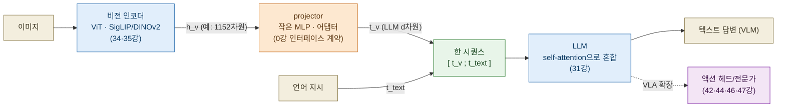
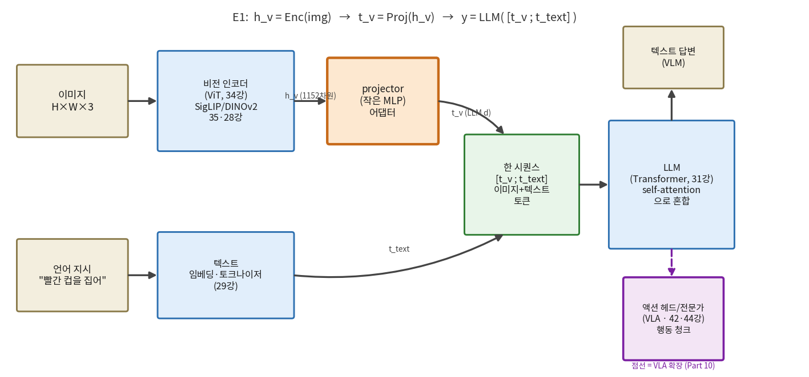
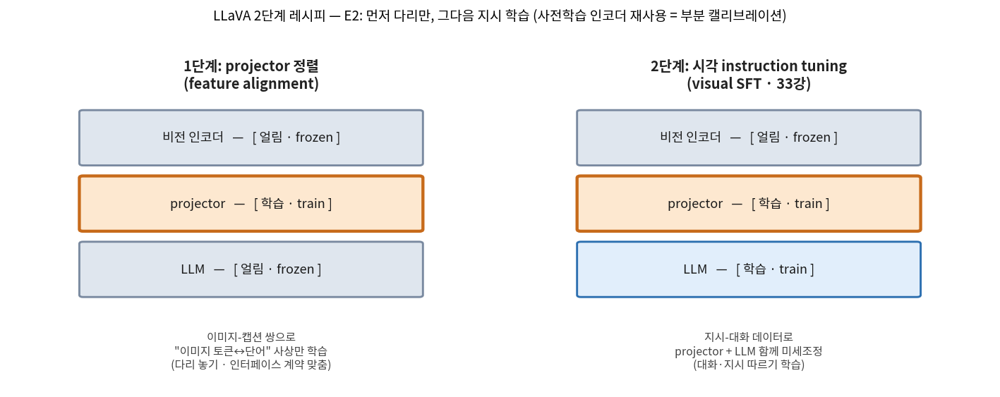
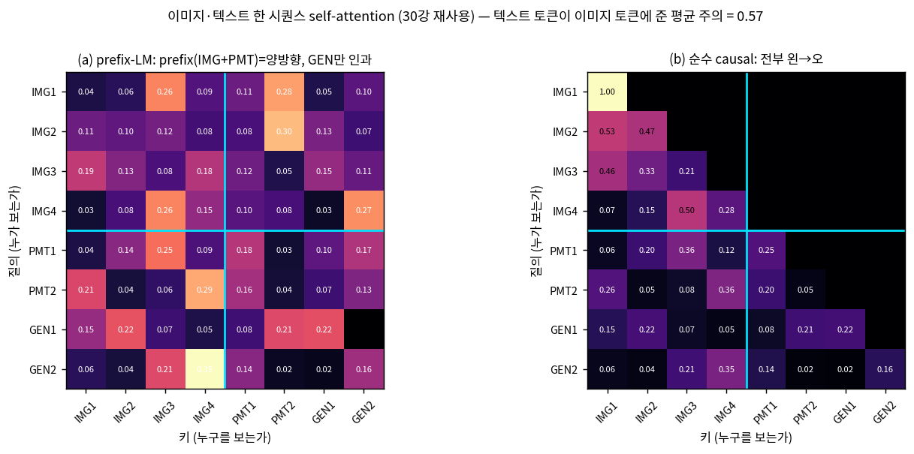
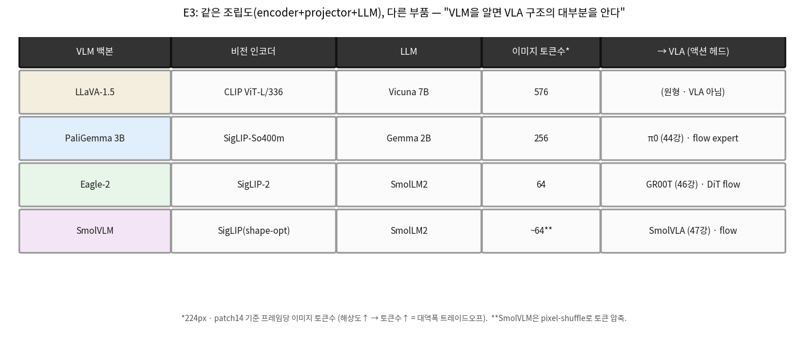

# Lec 36. VLM 조립: LLaVA 템플릿

> 선수 지식: 34강(ViT — 패치 토큰), 35강(CLIP·SigLIP — 대조학습). 관련: 0강(인터페이스 계약), 27강(정칙화·SFT), 28강(CNN·사전학습), 29강(토큰·임베딩), 30강(attention), 31강(Transformer 완성·PE·마스크), 33강(사후학습·SFT·LoRA·2단계). 이 강의는 **Part 8(VLM)의 ★ 정점**이자, 42~47강 모든 VLA를 "이 백본 + 액션 헤드"로 읽게 하는 관문이다.

## 한 장 요약



VLM = **비전 인코더 + projector + LLM**. 이미지를 인코더로 특징화하고(34·35강), projector로 LLM의 토큰 공간에 사영한 뒤, 언어 토큰과 **한 시퀀스**로 붙여 LLM에 넣는다. 이 세 블록 도식이 **모든 VLA 백본의 뼈대**다 — 점선의 액션 헤드 하나만 더 붙이면 Part 10의 π0·GR00T·SmolVLA가 된다.

## 학습 목표

1. VLM을 "비전 인코더 + projector + LLM"으로 분해하고, projector가 왜 **modality gap을 잇는 어댑터**(0강 인터페이스 계약)인지 설명할 수 있다.
2. LLaVA 2단계 레시피(1단계 projector 정렬 → 2단계 시각 instruction tuning)를 쓰고, 각 단계에서 무엇을 얼리고 무엇을 학습하는지 27·33강의 언어로 말할 수 있다.
3. 이미지 토큰이 LLM 안에서 텍스트 토큰과 **self-attention으로 섞이는 것**(30강)을 수치로 보이고, prefix-LM 마스크가 순수 causal과 어떻게 다른지 설명할 수 있다.
4. PaliGemma·Eagle·SmolVLM을 한 표로 대비하고, 각각이 π0·GR00T·SmolVLA의 백본임을 짚어 "VLM 조립도를 알면 VLA 구조의 대부분을 안다"를 정당화할 수 있다.
5. projector 파라미터 수·이미지 토큰 수·시퀀스/attention 예산을 손과 numpy로 계산하고, 미니 VLM forward를 짜서 이미지 토큰 유무에 따른 출력 차이를 재현할 수 있다.

## 왜 이 강의가 필요한가

34강에서 이미지는 패치 토큰이 되었고(ViT), 35강에서 이미지·텍스트가 **같은 임베딩 공간**으로 정렬되는 법(CLIP·SigLIP)을 봤다. 그런데 이 둘만으로는 "이미지를 보고 **말로 추론하고 지시를 따르는**" 모델이 안 된다 — CLIP은 이미지와 문장의 **유사도**만 잰다(검색·분류). "이 사진에서 컵이 왼쪽인가 오른쪽인가, 그래서 어떻게 집어야 하나"처럼 **생성·추론·대화**를 하려면 이미지를 **LLM에 먹여야** 한다. 문제는 인코더가 내는 특징 $h_v$와 LLM이 먹는 토큰이 **다른 언어**라는 것 — 차원도 다르고($1152$ vs $2304$), 정규화도, 의미 규약도 다르다. 이 간극(**modality gap**)을 잇는 것이 이 강의의 심장인 **projector**다.

이걸 "이미지를 그냥 LLM에 넣는다"로만 외우면 새 VLM·VLA 앞에서 무력하다. π0가 왜 PaliGemma를 통째로 백본으로 쓰는지(44강), GR00T가 왜 Eagle을(46강), SmolVLA가 왜 SmolVLM을(47강) 쓰는지 — 이 셋의 공통 뼈대가 정확히 오늘의 도식이다. 그리고 로봇공학자에게 이 강의는 특히 친숙하다: projector는 여러분이 매일 쓰는 **좌표·단위 변환 어댑터**(0강 인터페이스 계약)의 학습판이고, "인코더는 얼리고 다리만 먼저 맞춘다"는 LLaVA 1단계는 **부분 캘리브레이션**이며, 이미지 토큰을 시퀀스에 붙이는 것은 센서 채널을 하나 더 다는 것이다. 이 강의의 worked example은 정확히 그 조립을 CPU numpy로 손에 쥐여 준다 — projector 파라미터를 세고, 미니 VLM을 forward해 이미지 토큰이 텍스트 출력을 어떻게 바꾸는지 수치로 본다.

## 본문

### 1. 세 블록 — 눈, 다리, 뇌

VLM은 세 부품의 조립이다. 각 부품은 이미 앞 강의에서 따로 배웠다:

- **비전 인코더 (눈, 34·35강)**: 이미지를 패치 토큰 열 $h_v \in \mathbb{R}^{n_v \times d_v}$로 만든다. VLA 계열이 즐겨 쓰는 것은 **SigLIP**(이미지-텍스트 대조학습 → 의미·언어 정렬에 강함, 35강)과 **DINOv2**(자기지도 → 기하·대응에 강함, 28강). 로봇 데이터로 처음 학습하지 않고 **웹 스케일 사전학습 인코더를 빌려 온다**(28강 §4 전이학습).
- **projector (다리)**: 인코더 출력 $h_v$를 LLM의 토큰 공간으로 사영하는 **작은 MLP**. 차원을 $d_v \to d$로 바꾸고, 분포를 LLM이 먹을 수 있게 맞춘다. 이것이 오늘의 급소다.
- **LLM (뇌, 31·32·33강)**: 이미지 토큰과 텍스트 토큰이 섞인 한 시퀀스를 받아 self-attention으로 추론하고 답을 생성한다. Gemma·Vicuna·SmolLM2 등.

핵심 통찰: **인코더와 LLM은 이미 강력하다**(웹에서 사전학습됨). 부족한 것은 둘을 잇는 **다리 하나**뿐이다. 그래서 VLM 만들기의 첫걸음은 거대한 모델을 처음부터 학습하는 게 아니라, **작은 projector 하나를 정렬**하는 것이다(§2). 이 "작은 다리로 두 거인을 잇는다"가 LLaVA가 보인 결정적 발견이다.



*그림 1: VLM의 세 블록 조립도. 이미지는 비전 인코더(34·35강)로 특징 $h_v$가 되고(예: SigLIP-So400m는 $d_v{=}1152$), projector가 이를 LLM 토큰 공간 $d$로 사영해 이미지 토큰 $t_v$를 만든다. 이 $t_v$가 텍스트 토큰 $t_\text{text}$와 **한 시퀀스**로 붙어 LLM에 들어가고, self-attention이 둘을 섞어 답을 낸다. 상단 수식이 E1(=이 강의 전체)이다. **점선 = VLA 확장**: LLM 출력에 액션 헤드/전문가 하나만 붙이면(42·44·46·47강) VLM이 VLA가 된다 — 이 그림에서 실선 부분이 "백본", 점선 부분이 "행동"이다. `images/lec36/gen_figs.py`로 생성.*

### 2. LLaVA 2단계 레시피 — 다리부터 놓는다

거대한 인코더와 LLM을 처음부터 함께 학습하면 (i) 비싸고 (ii) 웹에서 얻은 지식이 소량 로봇/VQA 데이터에 덮여 손상된다. LLaVA(Liu 등 2023)의 처방은 33강 사후학습·27강 정칙화의 정확한 회수다:

- **1단계 — projector 정렬 (feature alignment)**: **인코더와 LLM은 얼리고(frozen), projector만 학습**한다. 이미지-캡션 쌍으로 "이미지 토큰 ↔ 단어" 사상만 배운다. 목표는 대화 능력이 아니라 **다리 놓기** — 인코더가 내는 특징을 LLM이 "외국어 단어"로 알아듣게 만드는 인터페이스 정렬이다.
- **2단계 — 시각 instruction tuning (visual SFT, 33강)**: **projector와 LLM을 함께** 미세조정한다(인코더는 여전히 얼림이 흔함). 지시-대화 데이터로 "이미지를 보고 질문에 답하고 지시를 따르는" 능력을 학습한다.



*그림 2: LLaVA 2단계 레시피 — 무엇을 얼리고(frozen) 무엇을 학습(train)하는가. **1단계**는 projector만 열어 "이미지 토큰↔단어" 다리를 놓고(인코더·LLM 얼림), **2단계**는 projector+LLM을 함께 열어 지시 따르기를 학습한다(인코더는 흔히 계속 얼림 — 웹 지식 보존). 사전학습 인코더를 재사용하는 것이 **부분 캘리브레이션** 비유의 핵심이다: 이미 교정된 센서(인코더)를 다시 재지 않고, 미교정 어댑터(projector)만 맞춘 뒤 상위 로직(LLM)을 튜닝한다. E2에서 형식화. `gen_figs.py`로 생성.*

**왜 인코더를 얼리는가?** 이것이 44강·33강 Knowledge Insulation(KI)로 이어지는 복선이다. 인코더는 웹에서 방대한 시각 어휘를 얻었는데(28강 전이), 소량 데이터로 파인튜닝하면 그 어휘가 **파국적 망각**으로 훼손된다. "웹 지식을 보존하려면 얼려라"가 VLM·VLA 공통 원칙이고, 이 판단 하나가 44강 π0가 "인코더를 왜 건드리지 않는가"의 답이다(흔한 오해 4).

### 3. 한 시퀀스 — 이미지 토큰은 LLM에겐 "외국어 단어"

projector를 거친 이미지 토큰 $t_v$는 텍스트 토큰 $t_\text{text}$와 **차원이 같아졌으므로**(둘 다 $\mathbb{R}^d$), 그냥 이어붙여 한 시퀀스를 만든다: $[\,t_v;\ t_\text{text}\,]$. LLM은 이 시퀀스를 **모두 같은 종류의 토큰**으로 취급한다 — self-attention은 토큰이 "이미지에서 왔는지 텍스트에서 왔는지" 묻지 않고 오직 내용 유사도만 본다(30강). 그래서 이미지 토큰은 LLM에게 **"외국어 단어"** 같다: 문법(attention)은 그대로, 어휘(projector가 만든 벡터)만 새로 배운 것.

여기서 **마스크**가 갈린다. 순수 causal LM(32강)은 모든 토큰이 왼→오로만 본다. 그러나 PaliGemma 계열은 **prefix-LM**을 쓴다: 이미지 토큰 + 프롬프트는 **하나의 prefix로 양방향**(서로 자유롭게 봄), 생성되는 답변 suffix만 인과다. 이미지는 "이미 다 주어진 관측"이므로 왼→오로 가릴 이유가 없다 — 궤적 청크가 문장이 아니라 통째로 하나의 계획인 것과 같은 통찰(44강 액션 양방향 attention의 뿌리).



*그림 3: 이미지 토큰 4개 + 프롬프트 2개(PMT) + 생성 2개(GEN)의 한 시퀀스 self-attention(30강 재사용, 시안색 선 = 이미지/텍스트 경계). **(a) prefix-LM**: prefix(IMG+PMT)는 양방향이라 서로 다 보고, 생성 토큰(GEN1·GEN2)만 인과 — GEN1은 GEN2(미래)를 못 보고 검게 남는다. **(b) 순수 causal**: 전부 왼→오라 상삼각이 전부 검다(IMG1은 자기만 봄). 제목의 "텍스트 토큰이 이미지 토큰에 준 평균 주의 = 0.57"이 핵심 — **텍스트가 이미지를 실제로 읽고 있다**는 수치 증거다. 두 경우 모두 행 합은 1로 유지된다(볼록결합). WE-2가 이 섞임을 코드로 재현한다. `gen_figs.py`로 생성.*

### 4. 미리보기 — 같은 조립도, 다른 부품

이 도식의 힘은 **범용성**이다. 유명 VLM은 전부 "인코더 + projector + LLM"이고, 부품만 다르다. 그리고 각 VLM이 곧 한 VLA의 백본이다:

| VLM 백본 | 비전 인코더 | LLM | 이미지 토큰수* | → VLA (소관 강의) |
|---|---|---|---|---|
| LLaVA-1.5 | CLIP ViT-L/336 | Vicuna 7B | 576 | (원형 · VLA 아님) |
| **PaliGemma 3B** | SigLIP-So400m (1152) | Gemma 2B (2304) | 256 | **π0** (44강) · flow expert |
| **Eagle-2** | SigLIP-2 | SmolLM2 | 64 | **GR00T** (46강) · DiT flow |
| **SmolVLM** | SigLIP(shape-opt) | SmolLM2 | ~64** | **SmolVLA** (47강) · flow |

\* 224px·patch14 기준 프레임당 이미지 토큰수. \*\* SmolVLM은 pixel-shuffle로 토큰 압축.



*그림 4: 같은 조립도(encoder+projector+LLM), 다른 부품. PaliGemma→π0, Eagle-2→GR00T, SmolVLM→SmolVLA. 이미지 토큰수의 차이(576→256→64)가 곧 **해상도↔대역폭 트레이드오프**(34강 패치 이산화): 토큰이 많으면 세밀하지만 시퀀스·연산이 커지고(§5·WE-1), 적으면 싸지만 정보가 준다. Eagle·SmolVLM이 pixel-shuffle로 토큰을 압축하는 이유가 온보드 로봇의 연산 예산이다. **"VLM을 알면 VLA 구조의 대부분을 안다"** — Part 10은 이 표의 마지막 열(액션 헤드)만 새로 배우면 된다. E3에서 형식화. `gen_figs.py`로 생성.*

### 핵심 수식

세 수식이 이 강의의 전부다: **E1** VLM 조립(인코더+projector+LLM), **E2** LLaVA 2단계 레시피, **E3** 이것이 VLA 백본의 뼈대.

#### E1. VLM = 비전 인코더 + projector + LLM

**① 직관**: 이미지를 인코더(34·35강)로 특징화하고, projector로 LLM의 토큰 공간에 사영해, 언어 토큰과 한 시퀀스로 붙여 LLM에 넣는다. 인코더와 LLM은 이미 웹에서 강력하니, 새로 배울 것은 둘을 잇는 **작은 다리(projector)**뿐이다.

**② 물리·기하적 의미**: projector가 잇는 것은 **modality gap** — 인코더가 사는 시각 특징 공간($\mathbb{R}^{d_v}$)과 LLM이 사는 토큰 임베딩 공간($\mathbb{R}^d$)은 차원도 규모도 의미 규약도 다르다. 이미지 토큰은 LLM에겐 **"외국어 단어"**이고, projector는 그 단어를 LLM 어휘에 심는 **어댑터**다. 이것이 정확히 **0강의 인터페이스 계약**(차원·정규화·좌표)을 사람이 손으로 맞추는 대신 **학습으로 맞추는** 것이다 — 로봇공학자가 두 서브시스템 사이에 두는 단위·좌표 변환기의 학습판. 작은 MLP 하나($d_v \to d$)면 충분하다는 것이 LLaVA의 핵심 발견이다(§5: 백본의 0.09%에 불과).

**③ 형식(유도 요점)**: 이미지 $\text{img}$, 텍스트 토큰 $t_\text{text} \in \mathbb{R}^{n_t \times d}$에 대해

$$
h_v = \mathrm{Enc}(\text{img}) \in \mathbb{R}^{n_v \times d_v}, \qquad
t_v = \mathrm{Proj}(h_v) \in \mathbb{R}^{n_v \times d}, \qquad
y = \mathrm{LLM}\big(\,[\,t_v;\ t_\text{text}\,]\,\big)
$$

$\mathrm{Proj}$는 선형($t_v = h_v W + b$, $W\in\mathbb{R}^{d_v\times d}$, PaliGemma) 또는 2층 MLP($h_v W_1 \to \mathrm{GeLU} \to W_2$, LLaVA-1.5). 결정적으로 $\mathrm{Proj}$가 $d_v \to d$로 **차원을 맞추므로** $t_v$와 $t_\text{text}$가 같은 공간에 놓여 concat이 성립한다. LLM 내부의 self-attention(30강)이 $[\,t_v; t_\text{text}\,]$를 섞어, 텍스트 토큰이 이미지 토큰을 "읽는다"(그림 3, WE-2).

#### E2. 학습 레시피 — LLaVA 2단계 (정렬 → instruction tuning)

**① 직관**: 먼저 **다리(projector)만** 정렬하고(인코더·LLM 얼림), 그다음 instruction tuning으로 대화·지시를 학습한다. 큰 두 모델을 처음부터 함께 흔들지 않고, 작은 다리를 먼저 맞춘 뒤 상위 로직만 튜닝한다.

**② 물리·기하적 의미**: 이것은 **부분 캘리브레이션**이다 — 이미 교정된 센서(사전학습 인코더, 34·35강)와 이미 훈련된 컨트롤러(LLM, 32강)는 다시 흔들지 않고, 그 사이 **미교정 어댑터(projector)만** 맞춘다. 27강 정칙화·33강 SFT/LoRA의 회수: 파라미터를 적게 열수록(1단계는 projector만) 소량 데이터에 대한 과적합·망각이 준다. 2단계에서 LLM을 열 때도 인코더는 얼려 **웹 시각 지식을 보존**한다(28강 전이의 방어) — 이 "무엇을 얼릴까"가 곧 44강 Knowledge Insulation의 씨앗이다.

**③ 형식(유도 요점)**: 파라미터를 $\theta_\text{enc}, \theta_\text{proj}, \theta_\text{llm}$로 나누면, 각 단계는 **어느 부분집합만 학습하는가**로 정의된다:

$$
\textbf{1단계: } \min_{\theta_\text{proj}} \ \mathcal{L}_\text{align}(\theta_\text{proj};\ \theta_\text{enc}, \theta_\text{llm}\ \text{고정})
\qquad
\textbf{2단계: } \min_{\theta_\text{proj},\, \theta_\text{llm}} \ \mathcal{L}_\text{SFT}(\theta_\text{proj}, \theta_\text{llm};\ \theta_\text{enc}\ \text{고정})
$$

두 손실 모두 다음 토큰 예측의 교차엔트로피(32·33강)다. 차이는 오직 **열린 파라미터 집합**뿐 — 1단계는 다리만, 2단계는 다리+뇌. 인코더 $\theta_\text{enc}$는 대개 두 단계 내내 얼려 웹 지식을 지킨다.

#### E3. 이것이 VLA 백본의 뼈대 — VLM + 액션 헤드

**① 직관**: VLA = VLM + 액션 헤드/전문가. 오늘의 조립도(encoder+projector+LLM)에 "행동을 내는 마지막 블록" 하나만 더 붙이면 로봇을 움직이는 VLA가 된다. VLM을 알면 VLA 구조의 대부분을 아는 것이다.

**② 물리·기하적 의미**: Part 10의 세 대표 모델이 전부 이 틀의 변주다 — **PaliGemma(SigLIP+Gemma) = π0 백본**(44강), **Eagle(SigLIP-2+SmolLM2) = GR00T 백본**(46강), **SmolVLM(SigLIP+SmolLM2) = SmolVLA 백본**(47강). 다른 것은 (i) 부품(어느 인코더·LLM), (ii) 이미지 토큰수(576→256→64, 해상도↔대역폭 트레이드오프, 34강), (iii) 마지막에 붙는 행동 표현(이산 토큰 42·43강 / flow 전문가 44·46·47강 / 0강 축 3)뿐이다. "새 VLA 논문"을 만나면 먼저 이 표의 어느 부품을 바꿨는지 물어라 — 대부분 백본은 기존 VLM이고 새로움은 마지막 열(액션)에 있다.

**③ 형식(유도 요점)**: VLM의 LLM 컨텍스트 $c = \mathrm{LLM}([\,t_v; t_\text{text}\,])$ 위에 행동 디코더 $g$를 얹으면

$$
\underbrace{c = \mathrm{LLM}\big([\,t_v;\ t_\text{text}\,]\big)}_{\text{VLM 백본 (E1)}}, \qquad
\underbrace{a = g(c,\ s)}_{\text{액션 헤드/전문가}}
$$

$g$가 이산 행동 토큰의 AR 디코더면 RT-2/OpenVLA(42·43강), 로봇 상태 $s$·노이즈를 조건으로 하는 flow expert면 π0/GR00T/SmolVLA(44·46·47강). 어느 쪽이든 **E1의 $c$가 눈·이해를 책임지고, $g$가 손·생성을 책임진다** — 이 분업이 Part 10 전체의 문법이다.

### Worked Example

#### WE-1 (손계산 + 코드): projector 파라미터·이미지 토큰·attention 예산

PaliGemma식 조립을 손과 코드로 계산한다: SigLIP-So400m($d_v{=}1152$) → Gemma 2B($d{=}2304$), 224px·patch14. 세 가지를 확인한다. **(a)** 선형 projector 파라미터 $= d_v \cdot d + d = 1152\cdot 2304 + 2304 = 2{,}656{,}512$(약 2.66M) — 백본($\approx 3\times10^9$)의 **0.09%**에 불과하다("다리는 작다"). **(b)** 이미지 토큰수 $= (224/14)^2 = 16^2 = 256$(패치 격자, 34강). 해상도를 448로 올리면 $32^2 = 1024$로 **4배**. **(c)** 텍스트 20토큰이면 시퀀스 $T = 256 + 20 = 276$이고, 이미지 토큰이 시퀀스의 **92.8%**를 차지한다 — attention 비용 $O(T^2)$의 대부분이 이미지다(30강 §4). 448px면 $T{=}1044$로 attention 원소가 **14.3배** 뛴다(그래서 Eagle·SmolVLM은 토큰을 압축한다).

```python
import numpy as np

d_v, d = 1152, 2304                         # SigLIP-So400m → Gemma 2B (hidden size)

# (a) 선형 projector 파라미터: W(d_v×d) + b(d)
lin = d_v*d + d
mlp = (d_v*d + d) + (d*d + d)               # 2층 MLP (LLaVA-1.5식)
print(f"선형 projector = {lin:,}")          # 2,656,512
print(f"2층 MLP projector = {mlp:,}")       # 7,967,232
print(f"선형/백본 = {100*lin/3.0e9:.4f}%")   # 0.0886%  ("다리는 작다")

# (b) 이미지 토큰 수 = (해상도/패치)^2
side = 224 // 14; n_img = side*side
print(f"224px·patch14 → {side}x{side} = {n_img} 토큰")   # 16x16 = 256
print(f"448px → {448//14}x{448//14} = {(448//14)**2} 토큰")  # 32x32 = 1024 (4배)

# (c) 시퀀스·attention 예산
n_txt = 20; T = n_img + n_txt
print(f"T = {n_img}+{n_txt} = {T}, attention 원소 = {T*T:,}")   # 276, 76,176
print(f"이미지 토큰 비율 = {100*n_img/T:.1f}%")                  # 92.8%
T448 = 1024 + n_txt
print(f"448px면 T={T448}, {(T448/T)**2:.1f}배 비쌈")            # 1044, 14.3배

# shape 흐름 검증
rng = np.random.default_rng(0)
h_v = rng.standard_normal((n_img, d_v))                 # 인코더: 256×1152
t_v = h_v @ (rng.standard_normal((d_v, d))/np.sqrt(d_v))# projector: 256×2304
seq = np.concatenate([t_v, rng.standard_normal((n_txt, d))], axis=0)
print(f"h_v{h_v.shape} → t_v{t_v.shape} → seq{seq.shape}")  # (256,1152)→(256,2304)→(276,2304)
```

출력이 손계산과 일치한다: projector 2,656,512(백본의 0.09%), 이미지 토큰 256(448px면 1024), $T{=}276$에 이미지 비율 92.8%, shape 흐름 $256\times1152 \to 256\times2304 \to 276\times2304$. **"projector는 작지만 이미지 토큰은 시퀀스를 지배한다"**가 이 스무 줄이다 — 이것이 VLM 설계의 두 급소(작은 다리 정렬 vs 큰 토큰 예산)를 동시에 보여준다.

#### WE-2 (코드): 미니 VLM forward — 이미지 토큰이 텍스트 출력을 바꾼다

E1을 눈으로 확인한다. 가짜 이미지 특징 → projector(선형) → LLM 토큰 시퀀스에 concat → self-attention(30강 재사용)이 이미지·텍스트 토큰을 섞는 것을 본다. 핵심 검증 셋: ① 텍스트 토큰이 이미지 토큰에 **주의를 준다**(섞임), ② 이미지 토큰이 **있을 때와 없을 때 텍스트 출력이 다르다**, ③ 이미지 **내용이 바뀌면** 텍스트 출력도 바뀐다(정말 이미지를 읽는다).

```python
import numpy as np
np.set_printoptions(precision=4, suppress=True)

def softmax(z):
    z = z - z.max(axis=-1, keepdims=True)
    e = np.exp(z); return e / e.sum(axis=-1, keepdims=True)

rng = np.random.default_rng(36)
d_v, d = 6, 8                                   # 인코더 6차원 → LLM 8차원 (토이)
n_img, n_txt = 3, 4

h_v = rng.standard_normal((n_img, d_v))         # 가짜 이미지 특징 (인코더 출력)
Wp  = rng.standard_normal((d_v, d)) / np.sqrt(d_v)   # projector (선형)
t_v = h_v @ Wp                                  # 이미지 토큰 → LLM 공간 (E1의 Proj)
t_text = rng.standard_normal((n_txt, d))        # 텍스트 토큰

Wq = rng.standard_normal((d, d)) / np.sqrt(d)   # LLM 한 층의 self-attention (30강)
Wk = rng.standard_normal((d, d)) / np.sqrt(d)
Wv = rng.standard_normal((d, d)) / np.sqrt(d)

def llm_layer(seq):
    Q, K, V = seq @ Wq, seq @ Wk, seq @ Wv
    A = softmax(Q @ K.T / np.sqrt(d))           # (T,T) 가중치, 행합=1
    return A, A @ V

# (1) 이미지+텍스트 한 시퀀스 → self-attention이 섞는다
seq_full = np.concatenate([t_v, t_text], axis=0)        # 7×8: [이미지3 ; 텍스트4]
A, out_full = llm_layer(seq_full)
print("행합:", np.round(A.sum(1), 3))                    # 전부 1
txt_to_img = A[n_img:, :n_img].sum(axis=1)              # 텍스트→이미지 주의
print("텍스트가 이미지를 본 주의:", np.round(txt_to_img, 4))  # [0.4341 0.3536 0.5253 0.499]
print("평균 =", round(float(txt_to_img.mean()), 3))         # 0.453

# (2) 이미지 없이 텍스트만 → 같은 텍스트 위치 출력이 달라진다
_, out_txt_only = llm_layer(t_text)
diff = np.linalg.norm(out_full[n_img:] - out_txt_only, axis=1)
print("이미지 유무에 따른 텍스트 출력 변화:", np.round(diff, 4))  # [0.2842 0.5387 0.4907 0.7693]
print("평균 변화 =", round(float(diff.mean()), 3))              # 0.521

# (3) 이미지 내용이 다르면 텍스트 출력도 다르다 = 정말 이미지를 읽는다
t_v2 = rng.standard_normal((n_img, d_v)) @ Wp          # 다른 이미지
_, out_img2 = llm_layer(np.concatenate([t_v2, t_text], 0))
diff2 = np.linalg.norm(out_img2[n_img:] - out_full[n_img:], axis=1)
print("이미지 내용이 바뀌면 텍스트 출력 변화 =", round(float(diff2.mean()), 3))  # 0.476
```

출력이 세 가지를 확인한다: 텍스트 토큰이 이미지 토큰에 평균 **0.453**의 주의를 주고(섞임), 이미지가 **있을 때 vs 없을 때** 텍스트 출력이 평균 **0.521** 달라지며, 이미지 **내용이 바뀌면** 평균 **0.476** 달라진다. **이미지 토큰은 장식이 아니라 실제로 LLM의 텍스트 출력을 좌우한다** — projector가 이미지를 LLM이 알아듣는 "단어"로 번역했기에 가능한 일이다. 이 30줄이 그림 3의 섞임을 코드로 재현한 것이고, VLM forward의 골격 전체다. 실제 VLM은 이 층을 수십 개 쌓고(31강), projector·LLM을 E2의 2단계로 학습한 것뿐이다.

### 로봇공학자를 위한 번역

- **projector = 좌표·단위 변환 어댑터(0강 인터페이스 계약).** 두 서브시스템(비전 센서, 언어 컨트롤러)이 다른 단위·차원·정규화를 쓸 때 사이에 두는 변환기 — 다만 사람이 손으로 설계하지 않고 **학습으로** 맞춘다. "modality gap을 잇는다"는 "좌표계를 정렬한다"의 딥러닝판이다.
- **LLaVA 1단계(projector만 학습) = 부분 캘리브레이션.** 이미 교정된 센서(인코더)·컨트롤러(LLM)는 다시 흔들지 않고 미교정 어댑터만 맞추는 것. 60강 시스템 식별에서 잘 아는 파라미터는 고정하고 미지 파라미터만 추정하는 것과 같은 절약.
- **이미지 토큰을 시퀀스에 붙이기 = 센서 채널 추가.** 상태 벡터에 새 센서를 concat하듯, 토큰 시퀀스에 이미지 토큰을 이어붙인다. 단, self-attention이 채널 간 관계를 **학습**한다는 점이 고정 게인 융합(칼만)과 다르다.
- **인코더 얼리기 = 검증된 모듈 재사용.** 잘 도는 하위 모듈(사전학습 인코더)을 재설계하지 않고 상위 로직만 바꾸는 것 — 웹 지식(28강 전이)을 소량 데이터가 덮어쓰지 못하게 막는 방어다.

## 흔한 오해

1. **"VLM은 이미지 캡셔너일 뿐이다"** — 아니다. VLM은 **범용 시각 추론·지시 따르기** 모델이다. 캡셔닝은 그 한 태스크일 뿐이고, LLaVA 2단계(E2)의 instruction tuning이 주는 것은 "이 사진에서 무엇을 어떻게 해야 하나"에 답하는 능력이다. 바로 이 지시 따르기가 VLA로 이어진다 — 캡셔너라면 로봇을 못 움직인다.
2. **"projector는 사소한 부품이다"** — projector는 **modality 정렬의 급소**다. 파라미터는 작지만(WE-1: 백본의 0.09%) LLaVA 1단계 학습의 **전부**가 이 다리를 놓는 것이고, 이것이 안 맞으면 LLM은 이미지 토큰을 "알아듣지 못한다". "작다"와 "덜 중요하다"는 다르다 — 0강의 인터페이스가 코드 몇 줄이어도 sim-to-real 실패의 급소인 것과 같다.
3. **"VLM과 VLA는 별개 계보다"** — VLA = VLM + 액션 헤드다(E3). 뼈대는 동일하고, PaliGemma→π0·Eagle→GR00T·SmolVLM→SmolVLA가 그 증거다(그림 4). "VLM 조립도를 알면 VLA 구조의 대부분을 안다" — Part 10은 마지막 열(행동 표현, 0강 축 3)만 새로 배운다.
4. **"인코더는 항상 파인튜닝한다"** — 자주 **얼린다**. 웹 스케일 시각 지식(28강 전이)을 소량 데이터가 덮어쓰지 못하게 보존하기 위해서다. LLaVA는 두 단계 내내 인코더를 얼리고, π0도 백본을 크게 흔들지 않는다(33·44강 Knowledge Insulation 맥락). "무엇을 얼릴까"가 VLM·VLA 설계의 핵심 판단이다.
5. **"이미지 토큰이 많을수록 좋다"** — 시퀀스·연산 예산과 트레이드오프다(WE-1c). 토큰이 많으면 세밀하지만 attention 비용이 $O(T^2)$로 폭발하고(30강 §4), 448px면 224px 대비 14.3배 비싸진다. Eagle(64)·SmolVLM(pixel-shuffle)이 토큰을 **줄이는** 이유가 온보드 로봇의 연산 예산이다 — 34강 해상도↔대역폭 트레이드오프의 실물이다.

## 실습 (1.5~2시간)

**A안 (CPU만, 추천): numpy로 미니 VLM 조립.** WE-2를 확장한다. (1) `llm_layer`를 여러 층 쌓고 잔차·LayerNorm(31강)을 넣어 "진짜 LLM 블록"에 가깝게 만들어라. (2) projector를 선형 → 2층 MLP(GeLU)로 바꿔 파라미터 수(WE-1)와 표현력 차이를 관찰하라. (3) 이미지 토큰수를 3→16→64로 늘리며 시퀀스 길이·attention 원소수가 어떻게 자라는지, "텍스트가 이미지를 본 주의"가 어떻게 변하는지 측정하라(그림 3·4의 토큰 예산 감각). (4) prefix-LM 마스크(그림 3a)와 순수 causal(3b)을 코드로 구현해 GEN 토큰 출력이 어떻게 달라지는지 비교하라.

**B안 (GPU 있으면, 설명 위주로 아주 작게): 사전학습 VLM 열어 보기.** HF `transformers`로 PaliGemma 또는 SmolVLM을 로드해(가중치 다운로드는 실습에서만), (i) 비전 인코더·projector·LLM 세 모듈의 이름과 파라미터 수를 출력하고, (ii) 이미지 하나를 넣어 이미지 토큰수(256 등)를 실제로 확인하며, (iii) projector 모듈의 `weight.shape`이 WE-1의 $d_v\times d$와 맞는지 검증하라. **학습은 하지 말고** 구조만 들여다본다. 56강에서 SmolVLM을 LoRA로 파인튜닝하는 실습으로 이어진다.

```python
# B안: 설명용. transformers 필요(실습에서만). 구조만 관찰, 학습 없음.
from transformers import AutoModelForImageTextToText
m = AutoModelForImageTextToText.from_pretrained("HuggingFaceTB/SmolVLM-Instruct")
for n, p in m.named_parameters():
    if 'connector' in n or 'projector' in n:      # projector 모듈 찾기
        print(n, tuple(p.shape))                  # d_v × d 형태 확인
```

## Claude와 토론할 질문

1. projector를 선형 대신 2층 MLP로 두면(LLaVA-1.5) 무엇이 좋아지고 무엇을 대가로 치르는가? "다리가 두꺼워진다"가 modality gap 정렬에 왜 도움이 되는가? (WE-1의 파라미터 수를 근거로.)
2. LLaVA 1단계에서 인코더·LLM을 얼리고 projector만 여는 것이 27강 정칙화·과적합 방지와 어떻게 연결되는가? 만약 1단계에서 LLM도 함께 열면 무슨 위험이 생기는가?
3. 이미지 토큰이 시퀀스의 92.8%를 차지한다(WE-1c). 이것이 롱컨텍스트·다중 카메라·비디오에서 어떤 병목을 낳는가? Eagle·SmolVLM의 pixel-shuffle 토큰 압축은 이 병목의 어느 부분을 푸는가?
4. prefix-LM(이미지+프롬프트 양방향)이 순수 causal보다 이미지 이해에 유리한 이유는? 이것이 44강 π0의 "액션 청크 양방향 attention"과 같은 통찰인 까닭을 설명하라.
5. VLA = VLM + 액션 헤드(E3)라면, 왜 그냥 VLM에 "행동을 텍스트로 출력"시키지 않고 별도 액션 헤드/전문가를 붙이는가? (힌트: 42·43강 이산 토큰 vs 44강 flow, 0강 축 3.)
6. π0(PaliGemma)·GR00T(Eagle)·SmolVLA(SmolVLM)가 서로 다른 백본을 고른 기준은 무엇이었겠는가? 온보드 연산·데이터 규모·언어 능력 중 무엇이 각 선택을 지배했을까?
7. DINOv2(기하)와 SigLIP(의미)를 **둘 다** 인코더로 쓰는 VLM/VLA도 있다(28강 토론 4의 예고). projector 관점에서 두 인코더 특징을 어떻게 하나의 토큰 시퀀스로 합칠 수 있는가? 그 이득과 비용은?

## 읽을거리

1. **LLaVA 논문 (arXiv:2304.08485) §3(구조)·§4(2단계 학습)만** (~30분): 그림 1(세 블록)과 2단계 레시피가 오늘 E1·E2의 근원이다. 프로젝션 행렬·instruction 데이터 생성만 보면 충분.
2. **PaliGemma 논문 (arXiv:2407.07726) §2(구조)만** (~20분): SigLIP-So400m + linear projector + Gemma 2B, prefix-LM, 256 이미지 토큰. 44강 π0 백본이 정확히 이것이다 — 그림 하나면 된다.
3. (선택) **Umar Jamil, "Coding PaliGemma from scratch"** (~영상, 발췌): projector·이미지 토큰 concat·prefix 마스크를 코드로 짚는다 — "코드가 곧 정의"의 표본. 전체를 볼 필요는 없고 projector·merge 부분만.

## 자가 점검

1. VLM을 "인코더+projector+LLM"으로 안 보고 그리고, 각 블록의 입출력 차원($h_v \in \mathbb{R}^{n_v\times d_v}$, $t_v \in \mathbb{R}^{n_v\times d}$)을 말할 수 있는가?
2. projector가 왜 modality gap을 잇는 어댑터인지, 그것이 0강 인터페이스 계약과 어떻게 같은지 설명할 수 있는가?
3. LLaVA 2단계에서 각 단계가 무엇을 얼리고 무엇을 학습하는지(1단계 projector만, 2단계 projector+LLM, 인코더 계속 얼림), 왜 그렇게 하는지 27·33강으로 말할 수 있는가?
4. 이미지 토큰과 텍스트 토큰이 한 시퀀스에서 self-attention으로 섞이는 것을 설명하고, prefix-LM이 순수 causal과 어떻게 다른지(그림 3) 말할 수 있는가?
5. WE-1의 projector 파라미터($1152\cdot2304+2304=2{,}656{,}512$)·이미지 토큰수($16^2=256$)·시퀀스 비율(92.8%)을 손으로 재현할 수 있는가?
6. VLA = VLM + 액션 헤드(E3)를 쓰고, PaliGemma→π0·Eagle→GR00T·SmolVLM→SmolVLA 매핑(그림 4)을 안 보고 채울 수 있는가?
7. "VLM은 캡셔너일 뿐" · "projector는 사소" · "인코더는 항상 파인튜닝" · "토큰 많을수록 좋다" 네 오해를 각각 한 문장으로 교정할 수 있는가?

## 참고문헌

> 본문 수치·주장의 출처. 웹 문서는 2026-07-09 접속 기준. (2차) = 교육 자료 등 2차 출처.

[1] H. Liu, C. Li, Q. Wu, Y. J. Lee, "Visual Instruction Tuning (LLaVA)," arXiv:2304.08485, 2023.4. https://arxiv.org/abs/2304.08485 · LLaVA-1.5: H. Liu et al., "Improved Baselines with Visual Instruction Tuning," arXiv:2310.03744, 2023.10.
— **뒷받침**: VLM = 비전 인코더(CLIP ViT-L) + projection + LLM(Vicuna)(E1), 2단계 레시피(1단계 projector 정렬·인코더/LLM 얼림 → 2단계 projector+LLM 시각 instruction tuning)(E2·그림 2), LLaVA-1.5의 CLIP ViT-L/336·576 이미지 토큰·2층 MLP projector(그림 4·WE-1).

[2] L. Beyer et al. (Google), "PaliGemma: A versatile 3B VLM for transfer," arXiv:2407.07726, 2024.7. https://arxiv.org/abs/2407.07726
— **뒷받침**: SigLIP-So400m(400M, $d_v{=}1152$) + linear projector + Gemma 2B($d{=}2304$) ≈ 3B, prefix-LM(이미지+프롬프트 양방향)(§3·그림 3), 224px·patch14 → 256 이미지 토큰·448px → 1024(WE-1·그림 4), π0 백본(44강 회수).

[3] S. Karamcheti et al. (Stanford), "Prismatic VLMs: Investigating the Design Space of Visually-Conditioned Language Models," arXiv:2402.07865, 2024.2. https://arxiv.org/abs/2402.07865
— **뒷받침**: VLM 설계 축(인코더 선택·projector·정렬 vs fine-tune)의 체계적 분석 — DINOv2+SigLIP 병용, 인코더 얼림/해제 트레이드오프(흔한 오해 4·토론 7).

[4] A. Marafioti et al. (Hugging Face), "SmolVLM: Redefining small and efficient multimodal models," arXiv:2504.05299, 2025.4. https://arxiv.org/abs/2504.05299 · 블로그: https://huggingface.co/blog/smolvlm
— **뒷받침**: SmolLM2 LLM + SigLIP 인코더, pixel-shuffle 이미지 토큰 압축(그림 4·흔한 오해 5), 온디바이스/온보드 효율, SmolVLA(47강)·56강 LoRA 실습 백본.

[5] NVIDIA, "GR00T N1: An Open Foundation Model for Generalist Humanoid Robots," arXiv:2503.14734, 2025.3. https://arxiv.org/abs/2503.14734
— **뒷받침**: Eagle-2 VLM 백본(SigLIP-2 + SmolLM2), 224px + pixel shuffle → 프레임당 64 이미지 토큰, GR00T-N1-2B 총 2.2B 중 VLM 1.34B(그림 4·§4). (Eagle→GR00T 매핑, 46강 소관.)

[6] K. Black et al. (Physical Intelligence), "π0: A Vision-Language-Action Flow Model for General Robot Control," arXiv:2410.24164, 2024.10. https://arxiv.org/abs/2410.24164
— **뒷받침**: PaliGemma 백본 + action expert(VLA = VLM + 액션 헤드, E3·그림 1 점선), 인코더/백본 재사용 맥락(흔한 오해 4). (PaliGemma→π0 매핑, 44강 소관.)

[7] A. Dosovitskiy et al., "An Image is Worth 16x16 Words (ViT)," arXiv:2010.11929, 2020.10. https://arxiv.org/abs/2010.11929 · X. Zhai et al. (Google), "Sigmoid Loss for Language Image Pre-Training (SigLIP)," arXiv:2303.15343, 2023.3. https://arxiv.org/abs/2303.15343 · M. Oquab et al. (Meta AI), "DINOv2," arXiv:2304.07193, 2023.4. https://arxiv.org/abs/2304.07193
— **뒷받침**: 패치 토큰화·이미지 토큰수(34강), SigLIP 대조학습 인코더(35강), DINOv2 자기지도 기하 특징(28강) — VLM 비전 인코더의 선택지(§1·그림 4).

[8] U. Jamil, "Coding a Multimodal (Vision) Language Model / PaliGemma from scratch," 교육 영상·저장소, 2024. https://github.com/hkproj/pytorch-paligemma
— **뒷받침**: projector·이미지 토큰 concat·prefix 마스크의 코드 수준 구현(읽을거리 3·WE-2 대조). (2차, 교육 자료)

*수치 재현성: 본문·그림·Worked Example의 numpy 토이 수치는 `images/lec36/gen_figs.py`와 본문 코드 블록의 실행 출력이다 — WE-1의 선형 projector 파라미터 $1152\cdot2304+2304=2{,}656{,}512$(백본의 0.0886%)·2층 MLP 7,967,232·이미지 토큰 256(448px면 1024, 4배)·시퀀스 $T{=}276$에서 이미지 비율 92.8%·448px attention 14.3배·shape 흐름 $(256,1152)\to(256,2304)\to(276,2304)$, WE-2의 텍스트→이미지 평균 주의 0.453·이미지 유무 텍스트 출력 변화 평균 0.521·이미지 내용 변화 시 0.476, 그림 3의 텍스트→이미지 평균 주의 0.57(시드 36). numpy 1.26 / matplotlib 3.5 기준 재현 확인. **이 토이는 개념 재현용 CPU 시뮬레이션이며 실제 LLaVA/PaliGemma/SmolVLM 가중치가 아니다** — 실측 구조·토큰수·학습 레시피는 위 [1][2][4][5] 1차 출처. PaliGemma(SigLIP-So400m 1152 + Gemma 2B 2304 + 256 토큰)·LLaVA(2단계·576 토큰)·Eagle(64 토큰)·SmolVLM(pixel-shuffle)의 부품 수치는 각 논문 1차 확인.*

<!-- lecture-nav -->

---

⬅ 이전: [Lec 35. CLIP에서 SigLIP으로](lec35-clip-siglip.md)　｜　[📖 전체 목차](../README.md)　｜　다음: [Lec 37. 모방학습이 무너지는 방식](../part09-robot-learning/lec37-imitation-learning-failure.md) ➡
