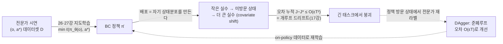
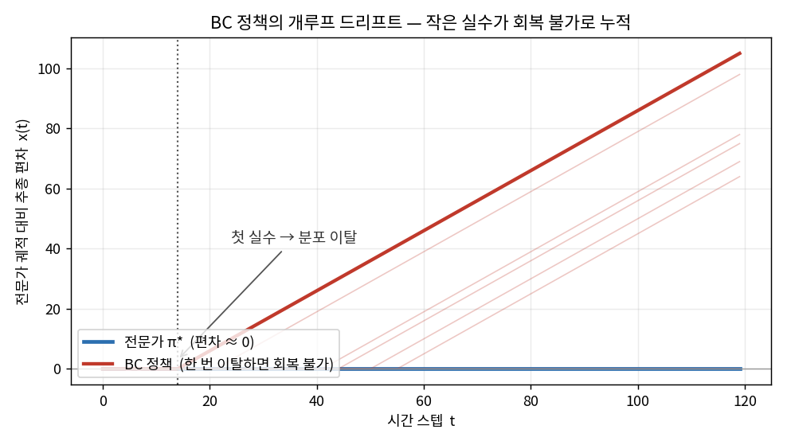
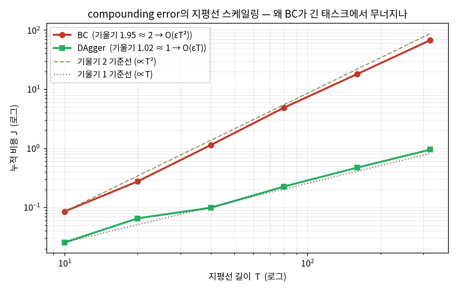
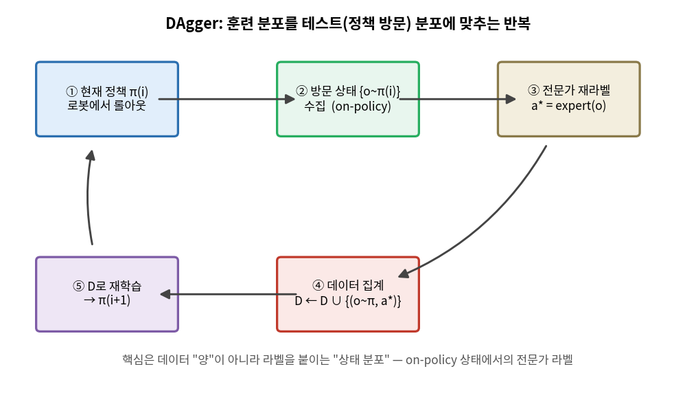
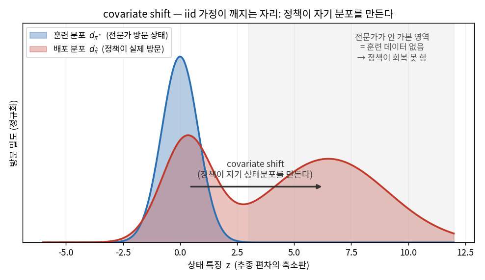

# Lec 37. 모방학습이 무너지는 방식

> Part 9 첫 강의. 선수 지식: 26강(경사하강·역전파), 27강(과적합·분포이동), 0강(정책 설계 3축). 관련: 17강(개루프 불안정), 23강(receding horizon), 38강(다음 — action chunking).
> 이 강의부터 Part 9는 0강 지도의 **판단 저수준(정책)** 블록을, 특히 **설계 축 2(학습 목적)**를 판다. 오늘은 그 가장 단순한 선택 — 모방(BC) — 과 그것이 배포에서 무너지는 근본 이유다.

## 한 장 요약



BC는 시연을 지도학습으로 흉내 내는 정책 학습의 첫걸음이다. 그런데 지도학습의 iid 가정이 **정책 자신에 의해** 깨진다 — 정책이 만든 실수가 정책이 겪는 상태분포를 바꾸고, 그 미방문 상태에서 오차가 더 커진다. 이 되먹임이 오차를 지평선 $T$에 대해 **초선형($O(\varepsilon T^2)$)**으로 키운다. 제어의 언어로는 **관측 없는 개루프 적분 드리프트**다. DAgger는 이 루프를 닫는다.

## 학습 목표

1. BC를 지도학습으로 정식화하고, 그것이 왜 **iid 가정 위반**(covariate shift) 위에 서는지 26·27강의 언어로 설명할 수 있다.
2. compounding error가 $O(\varepsilon T^2)$로 커지는 메커니즘을 유도하고, 이를 **개루프 드리프트·추측항법(17강)**에 대응시킬 수 있다.
3. DAgger가 훈련분포를 테스트분포에 맞춰 오차를 $O(\varepsilon T)$로 낮추는 원리를, "데이터 양이 아니라 라벨을 붙이는 상태 분포"의 관점에서 설명할 수 있다.
4. causal confusion(인과 혼동)이 왜 "데이터를 더 모으면" 오히려 악화될 수 있는지 설명할 수 있다.
5. 위 스케일링($T^2$ vs $T$)을 numpy 토이로 직접 재현하고 로그-로그 기울기로 검증할 수 있다.

## 왜 이 강의가 필요한가

0강에서 정책을 "만드는" 세 축을 갈랐다. 그중 **축 2(학습 목적)**의 가장 단순한 선택이 모방 — "전문가가 한 대로 따라 해라"다. 로봇공학자에게 이건 반가운 소식처럼 들린다: 강화학습의 보상 설계·탐험 지옥 없이, teleop으로 시연만 모으면 26강의 지도학습 파이프라인이 그대로 돌아간다. 실제로 42강 RT-1("스케일된 모방학습의 첫 실증"), 44강 π0, 그리고 회원님이 49강에서 볼 저가 리더-팔로워 암의 성공은 전부 이 단순한 레시피 위에 서 있다.

그런데 이 레시피에는 **구조적 함정**이 하나 있고, 그것을 모르면 "왜 우리 정책이 시연에서는 완벽한데 배포하면 30초 만에 이상한 데로 가버리나"를 영원히 이해하지 못한다. 함정의 이름은 compounding error이고, 그 뿌리는 **지도학습의 iid 가정이 로봇에서는 성립하지 않는다**는 데 있다. 이미지 분류기는 자기가 다음에 볼 이미지를 못 고르지만, **정책은 자기가 다음에 볼 상태를 스스로 만든다.** 이 한 문장이 이 강의 전부다.

이건 회원님에게 이미 익숙한 실패다. 17강에서 개루프 시스템이 왜 위험한지 배웠다 — 피드백 없이 적분하면 작은 오차가 드리프트로 쌓인다(추측항법의 위치 오차가 시간에 비례해 커지듯). BC의 배포 실패는 **바로 그 개루프 드리프트를, 정책이라는 비선형 함수에서 다시 만나는 것**이다. 그래서 이 강의는 "딥러닝의 새로운 함정"이 아니라 "회원님이 아는 개루프 불안정의 학습판"으로 읽어야 한다. 그리고 그 처방(DAgger)은 정확히 회원님이 아는 처방 — **루프를 닫아라(피드백을 넣어라)** — 의 데이터 버전이다. 이 감각을 잡으면 38강의 action chunking, 45강의 RECAP(DAgger의 산업화), 50강의 청크-개루프 트레이드오프가 전부 "개루프를 어떻게 견디거나 닫는가"의 변주로 읽힌다.

## 본문

### 1. BC = 지도학습, 그리고 숨은 가정

모방학습(imitation learning)의 가장 단순한 형태가 **행동 복제(Behavioral Cloning, BC)**다. 전문가(사람 teleop, 스크립트 정책, 또는 상위 플래너)가 남긴 시연 $\mathcal{D} = \{(o_i, a_i^*)\}$를 놓고, 관측 $o$를 행동 $a^*$로 보내는 함수 $\pi_\theta$를 지도학습으로 맞춘다. 손실도, 옵티마이저도, 과적합 걱정도 26·27강 그대로다 — 데이터만 (이미지, 라벨)에서 (관측, 행동)으로 바뀌었을 뿐이다.

여기까지는 문제가 없다. 문제는 **훈련이 끝난 뒤**에 생긴다. 분류기라면 훈련이 끝나면 테스트셋에서 정확도를 재고 끝이다 — 테스트 이미지는 훈련 이미지와 **같은 분포에서 독립적으로(iid)** 뽑힌다. 그런데 정책은 배포되면 **행동한다**. 그 행동이 다음 관측을 결정하고, 그 관측이 다음 행동을 결정한다. 정책은 자기가 볼 데이터의 분포를 **스스로 생성**한다. 이게 iid를 깬다.

### 2. compounding error — 개루프 드리프트의 학습판

작은 오차가 어떻게 재앙이 되는가. 시간 $t$에 정책이 전문가와 조금 다른 행동을 한다(확률 $\varepsilon$). 그 결과 로봇은 전문가가 **한 번도 방문한 적 없는** 상태로 조금 벗어난다. 그런데 그 상태에는 훈련 데이터가 없다 — 정책은 거기서 무엇을 해야 할지 배운 적이 없다. 그래서 회복은커녕 **더 큰 실수**를 하고, 더 낯선 상태로 간다. 오차가 눈덩이처럼 불어난다.



*그림 1: 같은 토이 세계에서 전문가(파랑)는 추종 편차 0을 유지하지만, BC 정책(빨강)은 매 스텝 확률 $\varepsilon$로 실수한다. 결정적 차이는 **실수 후**다 — 전문가가 안 가본 상태에는 라벨이 없어 정책이 회복하지 못하고, 편차가 지평선 끝까지 **선형으로 드리프트**한다(개루프 적분). 얇은 곡선들은 서로 다른 시드의 롤아웃으로, 이탈 시점만 다를 뿐 이탈 후엔 모두 같은 드리프트를 겪는다. 이것이 17강 개루프 불안정을 정책에서 다시 만나는 장면이다. `gen_figs.py`의 `rollout()`이 생성.*

이 되먹임을 정량화한 것이 Ross & Bagnell(2010)의 결과다. 핵심 직관: 시간 $t$까지 아직 이탈하지 않았을 확률은 대략 $(1-\varepsilon)^t$이므로, **이미 이탈했을 확률은 $\approx \varepsilon t$**로 시간에 비례해 커진다. 이탈하면 지평선 끝까지 비용을 치르므로, 시점 $t$의 이탈이 남기는 비용은 $\approx (T-t)$. 이 둘을 모든 $t$에 대해 합하면

$$
J(\hat\pi) - J(\pi^*) \;\lesssim\; \sum_{t=0}^{T-1} \varepsilon \,(T-t) \;\approx\; \varepsilon\,\frac{T^2}{2} \;=\; O(\varepsilon T^2).
$$

**$T$가 아니라 $T^2$**다. 이게 왜 치명적인가: 한 스텝 오차율 $\varepsilon$을 절반으로 줄이는 것(데이터 2배, 모델 2배로 어렵게 얻는다)보다, 태스크 지평선 $T$가 2배 길어지는 것(빨래 개기 vs 블록 집기)이 오차를 **4배** 키운다. 정밀도로 지평선을 이길 수 없다. 이것이 "시연에서 완벽한 정책이 긴 배포에서 무너지는" 수학적 이유다.

제어의 언어로 번역하면 정확히 **추측항법(dead reckoning)의 위치 오차**다: 가속도계만으로 위치를 이중 적분하면 바이어스 오차가 $t^2$로 자란다 — GPS(외부 관측)로 보정하지 않는 한. BC의 배포는 "관측으로 자기 오차를 보정하는 폐루프"가 아니라 "시연을 외운 개루프 재생"이고, 그래서 같은 $T^2$ 법칙을 따른다.



*그림 2: 이 강의의 심장. 같은 토이에서 지평선 $T$를 10~320으로 늘리며 누적 비용을 로그-로그로 찍었다. **BC(빨강)는 기울기 1.95 ≈ 2**로 자라 $O(\varepsilon T^2)$(황토 점선, 기울기 2 기준선과 평행), **DAgger(초록)는 기울기 1.02 ≈ 1**로 $O(\varepsilon T)$(회색 점선, 기울기 1 기준선과 평행). $T=320$에서 둘의 격차가 이미 70배가 넘는다 — 긴 태스크일수록 벌어진다. 로그-로그에서 "기울기 = 지수"이므로 이 그림 한 장이 E2·E3의 차수 차이를 눈으로 증명한다. 아래 WE-1·WE-2가 이 곡선을 코드로 생성한다.*

### 3. DAgger — 루프를 닫는다

처방은 회원님이 이미 안다: **피드백을 넣어라.** 문제가 "정책이 자기 상태분포를 만드는데 그 분포에 대한 라벨이 없다"는 것이라면, 해법은 "정책이 실제로 방문하는 상태에서 전문가에게 라벨을 받아라"다. 이것이 **DAgger**(Dataset Aggregation, Ross et al. 2011)다.



*그림 3: DAgger의 반복. ① 현재 정책을 로봇에서 굴려 ② 그 정책이 **실제로 방문한** 상태들 $\{o \sim \pi_i\}$을 모으고, ③ 그 상태 각각에 전문가가 "여기서 나라면 뭘 했을까"를 재라벨($a^* = \text{expert}(o)$)한다. ④ 이 (on-policy 상태, 전문가 라벨) 쌍을 기존 데이터에 **집계**하고 ⑤ 재학습한다. 반복하면 훈련분포가 테스트(정책 방문)분포에 수렴한다. 핵심은 데이터의 **양**이 아니라 라벨을 붙이는 **상태 분포**임에 주의. `gen_figs.py`가 도식을 그린다.*

왜 이게 $T^2$를 $T$로 바꾸는가. BC의 병은 "이탈하면 회복 불가"였다. DAgger는 정책이 이탈해서 방문한 그 상태에도 전문가 라벨을 붙여 주므로, 정책이 **실수로부터 회복하는 법**을 배운다. 이제 실수는 여전히 rate $\varepsilon$로 나지만, 각 실수는 몇 스텝 뒤 복구되어 비용이 $O(1)$로 그친다 — 지평선 끝까지 끌고 가지 않는다. 실수 $\times$ 비용 $= \varepsilon \times O(1)$이 매 스텝, 총 $T$스텝이면 **$O(\varepsilon T)$** — 선형이다. 개루프($T^2$)를 준폐루프($T$)로 바꾼 것이 정확히 17강에서 피드백이 개루프 드리프트를 잡는 그 메커니즘이다.

대가는 명확하다: **전문가가 배포 루프 안에 있어야 한다.** 롤아웃마다 전문가가 새 상태를 라벨링해야 하므로 사람 전문가에게는 비싸다. 그래서 실전에서는 "전문가가 실수 순간에만 개입해 보정"하는 형태로 산업화된다 — 45강 RECAP의 보정 teleop이 바로 이 DAgger의 운영판이다.

### 4. causal confusion — 데이터가 늘수록 나빠질 수 있는 병

compounding error가 "분포가 이동해서" 나는 병이라면, causal confusion(인과 혼동, de Haan et al. 2019)은 "분포 안에서조차" BC가 틀리는 병이다. 지도학습은 라벨과 **상관**되는 것을 잡지, **인과**를 구분하지 않는다. 시연에서 전문가의 과거 행동이 관측에 남긴 흔적(예: 대시보드의 브레이크등, 직전 프레임의 자기 손 위치)이 정답 행동과 강하게 상관되면, 정책은 진짜 원인(도로 위 보행자) 대신 그 **가짜 상관**을 지름길로 배운다.

역설적인 지점: **데이터를 더 모으면 이 지름길이 더 선명해져 오히려 악화될 수 있다.** 과적합과 정반대다 — 과적합은 데이터를 늘리면 낫지만, causal confusion은 잘못된 상관이 통계적으로 더 확실해질 뿐이다. 처방은 데이터 양이 아니라 **개입(intervention)**이다: DAgger처럼 on-policy로 굴려 가짜 상관이 깨지는 상태를 방문하게 하거나, 인과 구조를 명시적으로 학습시키는 것. "데이터 부족이 아니라 인과 부족"이라는 점에서 이 병은 흔한 오해 5번의 핵심이다.

### 핵심 수식

세 수식이 이 강의의 뼈대다: **E1** BC=지도학습(그리고 숨은 iid 위반), **E2** compounding error $O(\varepsilon T^2)$(개루프 드리프트), **E3** DAgger의 $O(\varepsilon T)$(루프를 닫음).

#### E1. BC = 지도학습, 단 데이터 분포가 정책에 의존한다

**① 직관**: 전문가 시연 $(o, a^*)$를 놓고 "관측이 이거면 행동은 저거"를 26·27강의 지도학습으로 외운다. 손실은 회귀(연속 행동, L1/L2)나 분류(이산 토큰, 크로스엔트로피) — 26강에서 배운 그 손실 그대로다. 새로 배울 것은 손실이 아니라 **데이터가 어디서 오는가**의 함정이다.

**② 물리·기하적 의미**: 지도학습의 일반화 보장은 "훈련·테스트가 같은 분포에서 iid"라는 가정 위에 선다(27강 분포이동). 분류기는 이 가정을 만족하지만, 정책은 배포되면 상태 $s_{t+1} = f(s_t, \pi_\theta(o_t))$로 **다음 관측을 자기 행동으로 결정**한다. 즉 테스트 시 관측이 뽑히는 분포 $d_{\hat\pi}$는 훈련 분포 $d_{\pi^*}$가 아니라 **정책 자신이 만드는 분포**다. 이 자기참조가 iid를 깬다 — 손실을 아무리 낮춰도 그것은 $d_{\pi^*}$ 위에서의 손실이지, 정작 배포에서 마주칠 $d_{\hat\pi}$ 위에서가 아니다.



*그림 4: BC의 병을 한 장으로. 훈련 분포 $d_{\pi^*}$(파랑)는 전문가가 방문한 좁은 띠에 몰려 있다. 그런데 정책이 배포되면 실수가 드리프트를 만들어, 실제 방문 분포 $d_{\hat\pi}$(빨강)가 오른쪽으로 이동·확산한다 — 전문가가 안 가본 회색 영역(훈련 데이터 없음)까지. 손실은 파랑 위에서 최소화됐지만 배포는 빨강 위에서 일어난다. 이 **분포 불일치가 covariate shift**이고, iid 가정이 깨지는 정확한 자리다. `gen_figs.py`가 두 가우시안 혼합으로 도식화.*

**③ 형식**: 손실 최소화 문제 자체는 평범하다,

$$
\theta^* = \arg\min_\theta \; \mathbb{E}_{(o,\,a^*)\sim \mathcal{D}}\big[\,\ell(\pi_\theta(o),\, a^*)\,\big],
\qquad \mathcal{D}\sim d_{\pi^*}.
$$

하지만 우리가 진짜 원하는 것은 배포 성능 $J(\hat\pi) = \mathbb{E}_{o\sim d_{\hat\pi}}[\cdots]$이고, 훈련은 $d_{\pi^*}$ 위에서 이뤄진다. $d_{\hat\pi}\neq d_{\pi^*}$인 한 낮은 훈련 손실이 낮은 배포 비용을 **보장하지 않는다.** 이 간극의 크기를 재는 것이 E2다.

#### E2. compounding error — $J(\hat\pi)-J(\pi^*) \le O(\varepsilon T^2)$

**① 직관**: 한 스텝 오차율이 $\varepsilon$일 때, 지평선 $T$의 태스크에서 누적 비용은 $\varepsilon T$가 아니라 **$\varepsilon T^2$**로 자란다. "작은 실수 → 미방문 상태 → 더 큰 실수"의 되먹임 때문이다. 오차가 상수가 아니라 **시간에 따라 커지는** 것이 핵심.

**② 물리·기하적 의미**: 이것은 **관측 없는 개루프 적분**이다(17강). 시점 $t$에 처음 이탈할 확률이 $\approx\varepsilon$이고, 이탈 후엔 회복 못 해 남은 $(T-t)$ 스텝 내내 비용을 낸다. "이미 이탈했을 확률"이 시간에 선형($\approx\varepsilon t$)으로 커지고, 그 각각이 남은 지평선만큼 비용을 남기니, 이중으로 쌓여 $T^2$가 된다. 추측항법의 위치 오차가 $t^2$로 자라는 것, 개루프 적분기가 바이어스를 발산시키는 것과 **같은 수학**이다. 폐루프(피드백)만이 이 적분을 잡는다.

**③ 형식(유도 요점)**: 상태분포 총변동 거리로 표현하면, 훈련·배포 분포의 차이가 시간에 따라 쌓여

$$
\lVert d_{\hat\pi}^{\,t} - d_{\pi^*}^{\,t}\rVert_1 \;\le\; 2\,\varepsilon\, t,
\qquad\Rightarrow\qquad
J(\hat\pi) - J(\pi^*) \;\le\; \sum_{t=0}^{T-1} 2\,\varepsilon\,t \;=\; \varepsilon\, T(T-1) \;=\; O(\varepsilon T^2).
$$

여기서 $\varepsilon$은 $d_{\pi^*}$ 위에서의 한 스텝 0/1 오차율(전문가와 다른 행동을 할 확률)이다. 유도의 심장은 가운데 부등식 — **분포 불일치가 매 스텝 $\varepsilon$씩 누적**된다는 것 — 이고, 나머지는 비용을 지평선에 대해 합하는 산술이다. WE-1이 이 $T^2$를 로그-로그 기울기 $\approx 2$로 재현한다.

#### E3. DAgger — on-policy 재라벨로 $O(\varepsilon T)$

**① 직관**: 정책이 방문하는 상태에서 전문가에게 라벨을 받아 데이터에 계속 **집계**하면, 훈련분포가 테스트분포에 맞춰진다($d_{\text{train}}\to d_{\hat\pi}$). 그러면 정책이 "실수 후 회복"을 배워, 오차가 지평선에 **선형**으로만 커진다.

**② 물리·기하적 의미**: E2가 개루프였다면 E3는 **루프를 닫는 것**이다. BC는 $d_{\pi^*}$(전문가 상태)에서만 라벨이 있어 그 밖에서 무력했다. DAgger는 $d_{\hat\pi}$(정책 상태)에서 라벨을 주입하므로 정책이 자기가 가는 곳에서 항상 옳은 행동을 안다 — 이것이 피드백이다. 실수는 여전히 나지만 $O(1)$ 스텝 만에 복구되어 지평선을 타고 증폭되지 않는다. "N스텝 계획 중 1스텝만 실행하고 다시 관측"하는 23강 receding horizon이 개루프 계획을 폐루프로 바꾸는 것과 같은 발상 — DAgger는 데이터 수집을 receding horizon화한 셈이다.

**③ 형식(유도 요점)**: 라운드 $i$마다 정책 $\pi_i$를 굴려 on-policy 상태를 모으고 전문가 라벨로 집계·재학습한다,

$$
\mathcal{D}_{i+1} \;\leftarrow\; \mathcal{D}_i \,\cup\, \big\{\,(o,\; a^*=\text{expert}(o)) \;:\; o \sim d_{\pi_i}\,\big\},
\qquad \pi_{i+1} = \arg\min_\theta \mathbb{E}_{\mathcal{D}_{i+1}}[\ell].
$$

집계된 데이터가 방문 분포를 덮으면(no-regret 온라인 학습으로) 배포 후회가 선형으로 묶여

$$
J(\hat\pi) - J(\pi^*) \;\le\; O(\varepsilon T)\qquad(\text{개루프 } O(\varepsilon T^2)\ \text{대비 한 차수 개선}).
$$

WE-2가 같은 토이에서 이 $O(\varepsilon T)$(기울기 $\approx 1$)를 재현하고, 라운드가 늘수록 비용이 내려오는 것을 수치로 보인다.

### Worked Example

#### WE-1 (코드 + 손검산): BC 오차가 지평선 $T$에 대해 초선형($\approx T^2$)

E2를 눈으로 확인한다. 토이 세계: 정책은 매 스텝 확률 $\varepsilon$로 실수해 전문가 미방문 상태로 **이탈**하고, 이탈하면 라벨이 없어 회복 못 한다(개루프). 비용 $J(T)$ = 이탈 상태에서 보낸 스텝 수의 기대값. 손검산 관점: 시점 $t$까지 이탈했을 확률이 $1-(1-\varepsilon)^t$이므로 $J(T)=\sum_{t}[1-(1-\varepsilon)^t]\approx \varepsilon T^2/2$ — Monte Carlo가 이 해석적 합과 맞아야 하고, $T$를 4배로 하면 비용이 $\approx 16$배(기울기 2)여야 한다.

```python
import numpy as np

# 매 스텝 확률 eps로 실수 → 전문가 미방문 상태로 이탈. 이탈하면 회복 불가(BC).
# 비용 J(T) = 이탈 상태에서 보낸 스텝 수 (개루프 드리프트가 지평선 끝까지 쌓임).
def bc_cost(T, eps, seed):
    r = np.random.default_rng(seed)
    off = False; cost = 0
    for t in range(T):
        if not off and r.random() < eps:   # on-policy 상태에서 실수 → 분포 이탈
            off = True
        cost += 1 if off else 0            # 이탈 후엔 회복 불가(그 상태를 배운 적 없다)
    return cost

eps = 0.0015
Ts  = np.array([10, 20, 40, 80, 160, 320])
J_bc = np.array([np.mean([bc_cost(T, eps, seed=11 + T*131 + k*99991)
                          for k in range(6000)]) for T in Ts])
theory = np.array([np.sum(1 - (1-eps)**np.arange(T)) for T in Ts])  # sum_t[1-(1-eps)^t]
slope  = np.polyfit(np.log(Ts), np.log(J_bc), 1)[0]

print("T          =", Ts.tolist())
print("J_BC       =", np.round(J_bc, 3).tolist())
print("theory     =", np.round(theory, 3).tolist())
print(f"loglog기울기 = {slope:.3f}")            # 1.952  (초선형: 비용 ~ eps*T^2/2)
print(f"J(320)/J(80) = {J_bc[-1]/J_bc[-3]:.2f}")  # 14.14 (T 4배 -> ~16배면 지수 2)
```

출력:
```
T          = [10, 20, 40, 80, 160, 320]
J_BC       = [0.081, 0.288, 1.174, 4.772, 17.584, 67.456]
theory     = [0.067, 0.282, 1.148, 4.56, 17.657, 65.707]
loglog기울기 = 1.952
J(320)/J(80) = 14.14
```

세 가지가 손검산과 맞는다: ① Monte Carlo(`J_BC`)가 해석적 합(`theory`)과 일치, ② 로그-로그 기울기 **1.952 ≈ 2**($O(\varepsilon T^2)$), ③ $T$ 4배($80\to320$)에 비용 **14.1배**($\approx 16$, 정확히 16이 아닌 것은 $\varepsilon T$가 커지며 포화가 시작되기 때문). 지평선을 2배 늘리면 오차가 4배 — **정밀도로 지평선을 이길 수 없다**는 것이 이 토이의 교훈이다. 그림 2가 이 곡선을 DAgger와 나란히 그린 것이다.

#### WE-2 (코드): DAgger가 $O(\varepsilon T^2)$를 $O(\varepsilon T)$로 낮춘다

E3를 확인한다. **같은 토이**, 단 하나의 차이: 전문가가 정책 방문 상태를 재라벨해 정책이 "실수 후 회복"을 배운다 — 코드로는 이탈 상태에서 확률 $\rho$로 복귀(라운드가 늘수록 $\rho\to1$). BC는 $\rho=0$(회복 불가). DAgger 수렴은 $\rho>0$. 손계산 관점: 정상상태 이탈 비율이 $\varepsilon/(\varepsilon+\rho)$로 **상수**가 되므로 비용이 $T$에 선형이어야 한다(기울기 1).

```python
import numpy as np

def cost(T, eps, rho, seed):
    r = np.random.default_rng(seed)
    off = False; c = 0
    for t in range(T):
        if not off:
            if r.random() < eps: off = True      # 실수 → 이탈
        else:
            if r.random() < rho: off = False     # DAgger로 배운 회복 (rho=0이면 BC)
        c += 1 if off else 0
    return c

def sweep(eps, rho, Ts, tag, N=6000):
    return np.array([np.mean([cost(T, eps, rho, seed=tag*1_000_003 + T*131 + k*99991)
                              for k in range(N)]) for T in Ts])

eps = 0.0015
Ts  = np.array([10, 20, 40, 80, 160, 320])
J_bc  = sweep(eps, 0.0, Ts, tag=1)     # 라운드 0 = BC (회복 불가)
J_dag = sweep(eps, 0.5, Ts, tag=2)     # DAgger 수렴 (강한 회복)
print("J_BC   =", np.round(J_bc, 3).tolist())
print("J_DAg  =", np.round(J_dag, 3).tolist())
print(f"BC   기울기 = {np.polyfit(np.log(Ts), np.log(J_bc), 1)[0]:.3f}")   # 1.952 (≈2)
print(f"DAg  기울기 = {np.polyfit(np.log(Ts), np.log(J_dag), 1)[0]:.3f}")  # 1.024 (≈1)
print(f"T=320 개선 = {J_bc[-1]/J_dag[-1]:.1f}배")                          # 71.2배

# 고정 T=200에서 DAgger 라운드별(회복확률 rho: 0 -> 1) 비용이 내려온다
T0 = 200
for m, rho in enumerate([0.0, 0.05, 0.15, 0.4, 0.8]):
    Jm = np.mean([cost(T0, eps, rho, seed=500 + m*777 + k*99991) for k in range(8000)])
    tag = "BC(라운드0)" if m == 0 else f"DAgger 라운드~{m}"
    print(f"  rho={rho:>4}  {tag:14s}  J(T=200) = {Jm:6.2f}")
```

출력:
```
J_BC   = [0.085, 0.276, 1.136, 4.87, 18.009, 67.51]
J_DAg  = [0.026, 0.065, 0.098, 0.226, 0.47, 0.949]
BC   기울기 = 1.952
DAg  기울기 = 1.024
T=320 개선 = 71.2배
  rho= 0.0  BC(라운드0)        J(T=200) =  26.96
  rho=0.05  DAgger 라운드~1    J(T=200) =   5.34
  rho=0.15  DAgger 라운드~2    J(T=200) =   1.93
  rho= 0.4  DAgger 라운드~3    J(T=200) =   0.75
  rho= 0.8  DAgger 라운드~4    J(T=200) =   0.39
```

두 가지가 드러난다: ① BC 기울기 **1.952**($T^2$) → DAgger 기울기 **1.024**($T$)로 **한 차수 개선**, 긴 지평선($T=320$)에서 **71배** 차이. ② 같은 $T=200$에서 라운드가 늘수록(회복력이 붙을수록) 비용이 $26.96\to5.34\to1.93\to0.75\to0.39$로 내려온다. 주목할 점: DAgger가 산 것은 **더 많은 데이터가 아니라 on-policy 상태에서의 라벨**이다 — 회복확률 $\rho$가 곧 "정책이 방문하는 곳을 전문가가 얼마나 덮었나"다. 이것이 흔한 오해 3의 핵심이다.

### 로봇공학자를 위한 번역

- **compounding error = 개루프 적분 드리프트(17강)·추측항법.** 관측으로 보정 안 하는 개루프 시스템에서 바이어스가 $t^2$로 발산하듯, BC의 배포 오차도 $T^2$로 자란다. "정밀도(작은 $\varepsilon$)로 지평선($T$)을 못 이긴다"는 것은 "고성능 IMU로도 GPS 없이 장시간 항법이 안 된다"와 같은 문장이다.
- **DAgger = 루프를 닫는 것(피드백).** 처방이 회원님 직관과 정확히 같다 — 개루프가 문제면 피드백을 넣어라. 다만 여기서 "피드백"은 센서 게인이 아니라 **on-policy 상태에서 전문가 라벨을 주입하는 데이터 루프**다. 23강 receding horizon("계획하고 한 스텝 실행, 다시 관측")과 같은 발상의 데이터 버전.
- **covariate shift = 플랜트가 입력에 의존하는 닫힌 루프.** 정책이 자기 상태분포를 만든다는 것은, 제어에서 폐루프 시스템의 상태 궤적이 제어기에 의존하는 것과 같다. iid를 가정하는 지도학습은 이 되먹임을 못 본다 — 그래서 "지도학습으로 정책을 배운다"는 문장에는 숨은 개루프 가정이 있다.
- **causal confusion = 상관과 인과의 혼동, 관측 가능성 문제.** 시스템 식별에서 입력이 충분히 여기(persistent excitation)되지 않으면 상관된 파라미터를 못 가르는 것과 닮았다 — 데이터를 늘려도 여기가 부족하면 안 풀리고, 개입(다른 입력을 넣어봄)이 필요하다.

## 흔한 오해

1. **"데이터를 충분히 많이 모으면 BC로도 된다"** — 아니다. compounding error는 데이터 **양**의 문제가 아니라 **분포**의 문제다(covariate shift, E1·E2). 전문가 상태 $d_{\pi^*}$의 데이터를 아무리 많이 모아도, 배포에서 마주치는 $d_{\hat\pi}$(정책이 실수로 이탈한 상태)에는 여전히 라벨이 없다. WE-1의 $T^2$는 $\varepsilon$을 줄여도(데이터를 늘려도) 상수 배만 낮출 뿐 **차수는 그대로**임을 보인다. 양이 아니라 **어느 상태의 데이터인가**가 문제다.
2. **"compounding error는 모델이 부정확해서 나는 문제다"** — 부정확이 방아쇠일 뿐, 병의 본질은 **분포 이동의 되먹임**이다. 완벽에 가까운 모델($\varepsilon$이 아주 작아도)도 지평선이 길면($T$가 크면) $\varepsilon T^2$가 커진다. 반대로 DAgger는 모델 정확도를 그대로 두고 **데이터 분포만** 바꿔 $T^2$를 $T$로 낮춘다(WE-2). 그러니 "더 정확한 모델"이 아니라 "루프를 닫는 것"이 처방이다.
3. **"DAgger는 그냥 데이터를 더 모으는 것이다"** — 핵심은 양이 아니라 **어디서 라벨을 받느냐**다. 전문가 시연을 100배 더 모아도 그것은 전부 $d_{\pi^*}$(전문가 상태)의 데이터다. DAgger의 데이터는 **정책이 방문한 on-policy 상태**에 붙은 전문가 라벨이다 — WE-2에서 개선을 만든 것은 데이터 개수가 아니라 회복확률 $\rho$(= 정책 방문 상태를 전문가가 덮은 정도)였다. "on-policy 상태 × 전문가 라벨"이 DAgger의 전부다.
4. **"모방(BC)은 강화학습의 하위호환이다"** — 범주가 다르다(0강 축 2). BC와 RL은 "정책을 무슨 신호로 훈련하나"의 **다른 선택**이지 우열이 아니다. BC는 보상 설계·탐험 없이 시연만으로 되고(그래서 42강 RT-1부터 44강 π0까지 표준), RL은 시연 너머의 최적화가 필요할 때 얹는다(45강 RECAP = BC + 오프라인 RL). "BC의 한계"는 "RL로 갈아타라"가 아니라 "DAgger로 루프를 닫거나, 필요하면 RL 신호를 더하라"다.
5. **"causal confusion은 과적합의 일종이다"** — 정반대에 가깝다. 과적합은 데이터를 늘리면 낫지만, causal confusion은 가짜 상관(예: 직전 행동의 흔적)이 데이터가 많을수록 **더 확실해져 악화**될 수 있다(§4). 병의 뿌리가 "표본 부족"이 아니라 "인과 부족"이라, 처방도 데이터 양이 아니라 **개입**(on-policy 롤아웃으로 상관을 깸, 또는 인과 구조 학습)이다. 회원님의 시스템 식별 감각으로는 "여기(excitation) 부족"에 가깝다.

## 실습 (1.5~2h, CPU만)

**A안 (추천, 개념 재현): BC vs DAgger 미니 실험을 직접 굴린다.** WE-1·WE-2의 토이를 확장한다. (1) $\varepsilon$을 0.001~0.02로 바꾸며 BC의 로그-로그 기울기가 언제까지 $\approx2$를 유지하는지, $\varepsilon T$가 1에 가까워지면 기울기가 왜 1로 내려가는지 관찰한다(포화). (2) DAgger의 회복확률 $\rho$를 라운드처럼 점증시키며 비용 곡선이 $T^2$에서 $T$로 눕는 과정을 애니메이션 없이 여러 곡선으로 겹쳐 그린다. (3) 여기에 "전문가 라벨에도 잡음 $\eta$가 있다"를 더해 보라 — DAgger가 완벽히 $O(\varepsilon T)$에 못 미치는 잔차의 출처를 토론.

**B안 (LeRobot, GPU 있으면 소개 위주): ACT/BC를 PushT에서 훈련해 배포 드리프트를 눈으로.** `pip install lerobot` → PushT 데이터셋으로 소형 BC 정책 훈련 → 롤아웃 성공률을 에피소드 길이별로 기록 → 긴 에피소드일수록 성공률이 떨어지는(=compounding) 경향을 확인. 이건 38강 ACT(action chunking으로 $T$를 실효적으로 줄이는 처방)의 예고편이다. *주의: 이 실습의 수치는 본문 수치 주장의 근거가 아니다 — 개념 관찰용.*

## Claude와 토론할 질문

1. WE-1에서 $\varepsilon T$가 1에 가까워지면 BC의 로그-로그 기울기가 2 아래로 내려간다(정책이 거의 항상 이탈해 비용이 $T$로 포화). 이 "포화"를 개루프 적분기의 어떤 물리와 대응시킬 수 있는가? 그리고 실제 로봇 태스크에서 $\varepsilon T \gtrsim 1$은 무엇을 뜻하는가?
2. action chunking(38강, 한 번에 $H$스텝을 내고 실행)은 compounding error를 어떻게 줄이는가? "$T$를 $T/H$로 줄인다"는 설명은 정확한가, 아니면 청크 내부는 여전히 개루프(50강)인가? $O(\varepsilon T^2)$ 공식에 $H$를 어떻게 넣겠는가?
3. DAgger는 "전문가가 배포 루프 안에 있어야 한다"가 대가다. 45강 RECAP은 이를 "실수 순간에만 개입"으로 산업화했다. 그 절충이 이론적 $O(\varepsilon T)$ 보장을 얼마나 지키는가, 아니면 깨는가?
4. causal confusion을 회원님의 시스템 식별/관측 가능성 언어로 다시 진술해 보라. "persistent excitation 부족"과 정확히 같은가, 다른 점은 무엇인가?
5. BC의 $\varepsilon$(한 스텝 오차율)을 실제로 낮추는 방법(더 큰 모델, 더 많은 시연, 더 나은 표현)과 $T$의 유효 길이를 낮추는 방법(청킹, 계층화, 재계획)은 각각 $O(\varepsilon T^2)$의 어느 인자를 건드리는가? 로봇 태스크에서 어느 쪽이 더 싼가?
6. "정책이 자기 상태분포를 만든다"는 covariate shift의 정의다. 이것을 0강의 "시스템은 로봇·환경을 통과해 닫힌 루프"라는 지도와 연결하라 — BC가 그 루프의 어느 계약(인터페이스)을 암묵적으로 위반하는가?
7. RL(축 2의 다른 선택)은 자기 궤적에서 보상으로 배우니 애초에 on-policy다. 그렇다면 RL은 compounding error가 없는가? 아니면 다른 형태(분포이동, 외삽)로 같은 병을 앓는가? (41강·45강 예고 — 먼저 가설을 세워 보라.)

## 읽을거리

1. **CS285 (Levine) Lecture 2 — Imitation Learning** (강의 영상/슬라이드, ~50분): 이 강의의 정본 교재. compounding error $O(\varepsilon T^2)$ 유도와 DAgger를 그림으로. **슬라이드의 "distribution shift" 유도 한 장과 DAgger 알고리즘 박스**까지만 봐도 충분하다.
2. **Ross et al., DAgger 논문 (arXiv:1011.0686)** — §1~3(문제 정식화와 알고리즘)만: no-regret 온라인 학습으로 $O(\varepsilon T)$를 얻는 논증. 증명 세부는 건너뛰고 **Theorem 문장과 Algorithm 1**만.
3. (선택) **de Haan et al., Causal Confusion in Imitation Learning (arXiv:1905.11979)** — Fig 1(브레이크등 예시)과 abstract만: "데이터가 많을수록 나빠진다"의 직관을 그림 하나로.

## 자가 점검

1. BC를 지도학습으로 정식화하고, "숨은 iid 위반"이 어디서 오는지(정책이 자기 상태분포를 만든다) 안 보고 설명할 수 있는가?
2. compounding error가 $O(\varepsilon T^2)$인 이유를 "이미 이탈했을 확률 $\approx\varepsilon t$ × 남은 지평선 $(T-t)$의 합"으로 유도할 수 있는가? 이것이 왜 개루프 드리프트(17강)와 같은지 말할 수 있는가?
3. $T$를 2배로 하면 BC 오차가 왜 4배가 되는지, "정밀도로 지평선을 못 이긴다"의 뜻을 WE-1의 수치로 설명할 수 있는가?
4. DAgger가 $O(\varepsilon T^2)$를 $O(\varepsilon T)$로 낮추는 메커니즘을 "on-policy 상태 × 전문가 라벨 = 루프를 닫음"으로 설명하고, 왜 "데이터를 더 모으는 것"과 다른지 말할 수 있는가?
5. causal confusion이 과적합과 어떻게 다르며(데이터를 늘리면 악화될 수 있음), 처방이 왜 "양"이 아니라 "개입"인지 설명할 수 있는가?
6. "모방(BC)은 RL의 하위호환"이 왜 범주 오류인지(0강 축 2) 반례(π0=BC, RECAP=BC+RL)로 설명할 수 있는가?
7. WE-1·WE-2의 로그-로그 기울기(BC≈1.95, DAgger≈1.02)가 각각 무엇을 뜻하는지, 그리고 그것이 E2·E3의 $O(\varepsilon T^2)$·$O(\varepsilon T)$와 어떻게 맞물리는지 말할 수 있는가?

## 참고문헌

> 본문 수치·주장의 출처. 웹 문서는 2026-07-09 접속 기준. 이 강의의 numpy 토이 수치는 아래 재현성 각주 참조.

[1] D. A. Pomerleau, "ALVINN: An Autonomous Land Vehicle in a Neural Network," NeurIPS, 1988. https://proceedings.neurips.cc/paper/1988/hash/812b4ba287f5ee0bc9d43bbf5bbe87fb-Abstract.html
— **뒷받침**: BC의 원형(신경망으로 주행 시연을 직접 모방한 최초 사례), "정책을 지도학습으로 배운다"의 계보.

[2] S. Ross, J. A. Bagnell, "Efficient Reductions for Imitation Learning," AISTATS, 2010. https://proceedings.mlr.press/v9/ross10a.html
— **뒷받침**: compounding error $J(\hat\pi)-J(\pi^*)\le O(\varepsilon T^2)$(한 스텝 오차 $\varepsilon$·지평선 $T$), 개루프 BC의 분포이동 정식화(E2).

[3] S. Ross, G. J. Gordon, J. A. Bagnell, "A Reduction of Imitation Learning and Structured Prediction to No-Regret Online Learning" (DAgger), arXiv:1011.0686, AISTATS 2011. https://arxiv.org/abs/1011.0686
— **뒷받침**: DAgger 알고리즘(on-policy 상태 재라벨·데이터 집계), no-regret 온라인 학습으로 오차 $O(\varepsilon T)$ 개선(E3), "훈련분포=테스트분포".

[4] P. de Haan, D. Jayaraman, S. Levine, "Causal Confusion in Imitation Learning," arXiv:1905.11979, NeurIPS 2019. https://arxiv.org/abs/1905.11979
— **뒷받침**: 가짜 상관(직전 행동 흔적 등)을 인과로 오학습, "데이터가 많을수록 악화될 수 있음", 개입(intervention)이 처방이라는 논지(§4·흔한 오해 5).

[5] S. Levine, CS285 "Deep Reinforcement Learning" Lecture 2 (Imitation Learning), UC Berkeley. https://rail.eecs.berkeley.edu/deeprlcourse/
— **뒷받침**: compounding error $O(\varepsilon T^2)$ 유도와 DAgger의 표준 교육 자료(distribution shift 슬라이드, 이 강의의 정본 교재).

[6] R. S. Sutton, A. G. Barto, "Reinforcement Learning: An Introduction," 2nd ed., MIT Press, 2018. http://incompleteideas.net/book/the-book.html
— **뒷받침**: 모방 vs 보상 학습의 구분(0강 축 2), on-policy/off-policy 개념(토론 질문 7의 배경).

*수치 재현성: 본문 그림·Worked Example의 numpy 토이 수치는 `images/lec37/gen_figs.py`와 본문 코드 블록의 실행 출력이다 — WE-1의 BC 비용 로그-로그 기울기 **1.952**(≈2, $O(\varepsilon T^2)$), Monte Carlo가 해석적 합 $\sum_t[1-(1-\varepsilon)^t]$와 일치, $J(320)/J(80)=14.14$; WE-2의 BC 기울기 1.952·DAgger 기울기 1.024(≈1, $O(\varepsilon T)$)·$T=320$에서 71.2배 개선, 고정 $T=200$ 라운드별 비용 $26.96/5.34/1.93/0.75/0.39$; 그림 1(드리프트)·그림 2(스케일링, BC slope 1.952 / DAgger slope 1.024)·그림 3(DAgger 루프)·그림 4(covariate shift 도식). numpy 1.26 / matplotlib 3.5 기준 재현 확인. **이 토이는 compounding error·DAgger의 스케일링 법칙을 개념 재현하는 CPU 시뮬레이션이며, 실제 로봇 정책·시연 데이터·학습이 아니다** — Ross&Bagnell·DAgger의 이론적 보장은 위 [2][3] 1차 출처.*

<!-- lecture-nav -->

---

⬅ 이전: [Lec 36. VLM 조립: LLaVA 템플릿](../part08-vlm/lec36-vlm-assembly-llava.md)　｜　[📖 전체 목차](../README.md)　｜　다음: [Lec 38. ACT와 action chunking](lec38-act-action-chunking.md) ➡
