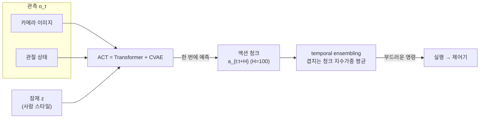
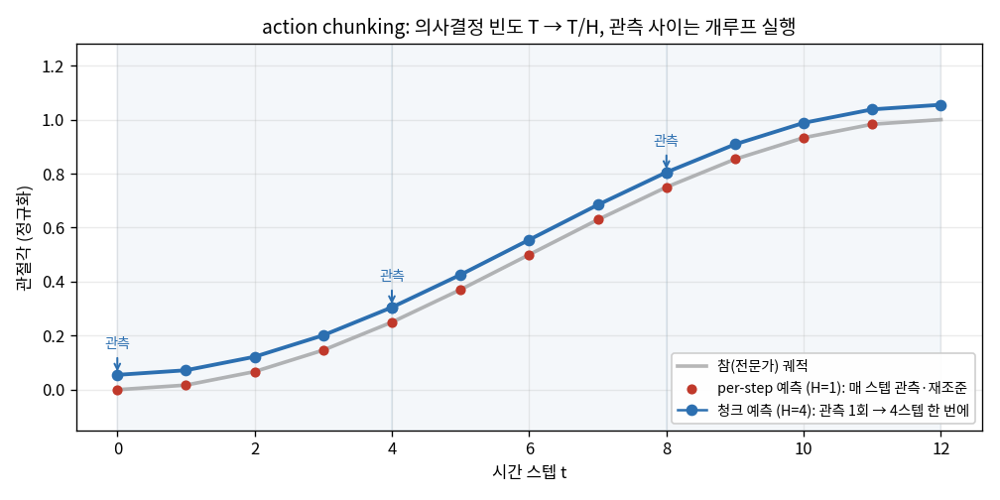
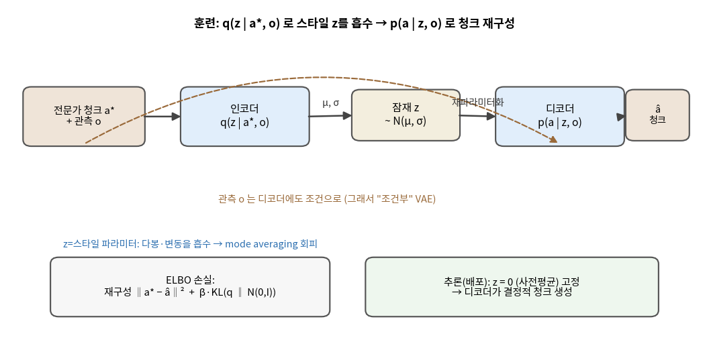
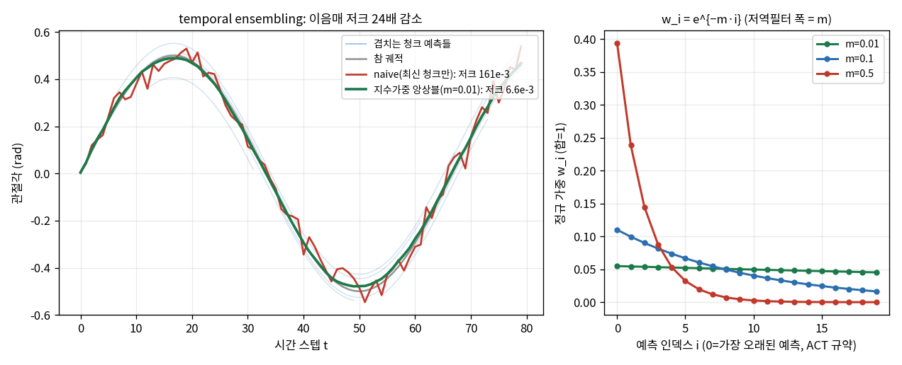
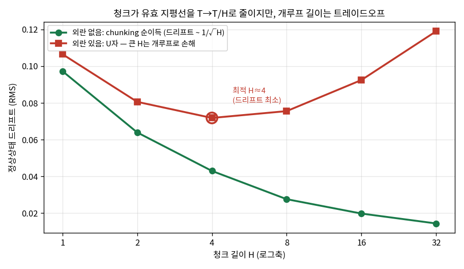

# Lec 38. ACT와 action chunking

> 선수 지식: 37강(모방학습·compounding error O(εT²)·DAgger). 관련: 8강(보간), 23강(receding horizon·MPC), 36강(Transformer 백본), 39강(다음: Diffusion Policy), 44강(π0의 청크), 49강(ALOHA 하드웨어), 50강(temporal ensembling·RTC 런타임).

## 한 장 요약



37강에서 BC는 O(εT²)로 무너졌다. ACT(2023)의 처방은 두 가지다 — **한 스텝이 아니라 H스텝 청크를 통째 예측**해 의사결정 빈도를 T→T/H로 줄이고(오차누적 지평선 단축), **CVAE의 잠재 z**로 사람 시연의 다봉·변동을 흡수해 깔끔한 청크를 낸다. 여기에 **temporal ensembling**이 겹치는 청크들의 이음매를 매끈하게 잇는다.

## 학습 목표

1. action chunking이 37강의 compounding error를 어떻게 완화하는지 "유효 지평선 T→T/H"로 설명하고, 왜 그것이 공짜가 아닌지(개루프 트레이드오프) 말할 수 있다.
2. CVAE의 인코더/잠재 z/디코더와 ELBO를 쓰고, z가 없으면 왜 mode averaging이 나는지 설명할 수 있다.
3. temporal ensembling의 지수가중 평균 $w_i=e^{-mi}$을 쓰고, 그것이 "예측 시점축의 저역필터"임을 설명할 수 있다.
4. chunking·CVAE·temporal ensembling을 각각 numpy 토이로 재현하고, "H↑→드리프트↓ 단 개루프 위험", "앙상블→이음매 저크 감소"를 수치로 보일 수 있다.
5. ACT를 receding horizon(23강)·MPC 예측지평선의 언어로 위치시키고, 39강 Diffusion Policy가 무엇을 바꾸는지 예고할 수 있다.

## 왜 이 강의가 필요한가

37강은 진단이었다 — BC의 오차는 궤적을 따라 $O(\varepsilon T^2)$로 눈덩이가 되고, DAgger는 그걸 전문가 재라벨링으로 막지만 사람 전문가를 루프에 다시 불러야 한다. **ACT는 DAgger 없이, 순수 BC만으로 compounding error에 맞서는 첫 실전 처방**이다. 아이디어는 제어공학자에게 낯익다: 매 순간 재조준하는 대신 **H스텝짜리 계획을 한 번에 세워 실행**한다 — MPC의 예측지평선(23강)을 학습 정책에 이식한 것이다. 그런데 계획을 통째 내려면 "같은 상황에 사람이 낸 여러 스타일의 시연"을 하나로 뭉개지 않고 표현해야 한다(그냥 평균 내면 왼쪽·오른쪽의 중간이라는 **어느 시연에도 없는 궤적**이 나온다 — mode averaging). ACT는 이 문제를 **CVAE의 잠재 z**로 푼다.

이걸 "청크로 내면 좋아진다"로만 외우면 39강 Diffusion Policy, 44강 π0 앞에서 무력하다. 왜 H를 키우면 드리프트가 주는지(재조준 빈도 T/H), 왜 무한정 키우면 안 되는지(개루프 구간이 외란에 무방비), z를 빼면 정확히 무엇이 깨지는지(다봉 → 평균 붕괴)를 **직접 재현해 본 사람만이** 이후 모든 청크 기반 정책의 설계를 "새로운 점만" 짚어낼 수 있다. 이 강의의 worked example은 정확히 그 세 재현을 CPU numpy 토이로 시킨다.

## 본문

### 0. ALOHA — 문제를 만든 하드웨어 (2023.4, arXiv 2304.13705)

ACT는 알고리즘이기 전에 **데이터 수집 장치**의 산물이다. ALOHA(A Low-cost Open-source HArdware)는 양팔 조작을 **~$20k의 저가 부품**으로 teleoperation하는 셋업 — 리더 암 2개를 사람이 움직이면 팔로워 암 2개가 따라가며, 그 관절각 궤적이 곧 시연 데이터다. 핵심 제약이 여기서 나온다: **50Hz로 절대 관절각을 기록**하고(양팔 6DoF + 그리퍼 = 14차원), 건전지 넣기·랩 뜯기 같은 **정교·고주파 양손 협응** 태스크를 노린다. 50Hz·정교 조작이라는 조건이 이후 모든 설계를 강제한다 — 이 주파수에서 인접 스텝 행동은 거의 같고(그래서 스텝별 예측은 낭비·불안정), 정교함은 폐루프 반응성을 요구한다(그래서 청크를 무한정 길게 못 한다). 하드웨어 상세는 49강.

### 1. action chunking — 의사결정 빈도를 낮춘다

37강의 compounding error를 한 줄로 되짚자: BC 정책은 관측 $o_t$마다 행동 $a_t$를 낸다. 각 예측의 작은 오차 $\varepsilon$가 로봇을 시연 분포 밖으로 밀고(covariate shift), 분포 밖에서는 예측이 **더** 나빠져 오차가 스노볼처럼 커진다 → 궤적 전체로 $O(\varepsilon T^2)$. 여기서 $T$는 **의사결정 횟수**다.

ACT의 첫 수는 단순하다 — **의사결정을 줄인다.** 관측 하나를 보고 다음 한 스텝만 내는 대신, **H=100스텝짜리 청크** $a_{t:t+H}$를 한 번에 예측하고 그 구간을 개루프로 실행한다(@50Hz면 2초). 그러면 재조준(관측 갱신·새 예측) 횟수가 $T$에서 $T/H$로 줄고, 스노볼을 시작시키는 "이벤트 수"도 그만큼 준다 — **유효 지평선이 $T \to T/H$로 짧아진다**(WE-1에서 수치로).



*그림 1: 같은 S자 셋포인트 이동을 (빨강) per-step 예측(H=1, 매 스텝 관측·재조준)과 (파랑) 청크 예측(H=4, 관측 1회 → 4스텝 한 번에)으로 실행. 파란 음영이 **개루프 구간** — 그 안에서 로봇은 새 관측 없이 계획을 실행한다. 청크가 길수록 재조준 빈도 $T/H$가 낮아져 오차누적 지평선이 짧아지지만, 개루프 구간이 길어져 외란에 무방비가 된다(그림 4·WE-1). ACT가 절대 관절각을 청크로 내는 것은 이 개루프 실행을 IK·상태 재계산 없이 그대로 셋포인트로 흘려보내기 위함이다(50강).*

이것이 왜 MPC(23강)의 사촌인가: MPC도 "N스텝 계획을 세우고 첫 입력만 실행 후 재계획"(receding horizon)한다. 차이는 두 가지다 — ① MPC는 첫 1스텝만 쓰고 매 스텝 다시 풀지만(폐루프), ACT는 청크 전체를 개루프로 실행한다(재계획 빈도 낮음). ② MPC는 모델로 미래를 최적화하지만, ACT는 데이터에서 청크를 **회귀 학습**한다. "청크=한 번 예측하고 끝"이 아니라, 실전에서는 청크가 끝나기 전에 새 청크를 겹쳐 내고 섞는다 — 그것이 §3의 temporal ensembling이고, MPC의 receding horizon에 더 가까워지는 지점이다.

### 2. CVAE — 사람의 다봉·변동을 잠재 z로 흡수

청크를 통째 내려면 새 문제가 생긴다. 같은 관측에서 사람은 **여러 방식**으로 시연한다 — 컵을 왼쪽으로도 오른쪽으로도 돌릴 수 있고, 속도·리듬도 제각각이다(행동 분포의 **다봉성**). BC가 이 다봉 분포에 단일 궤적을 회귀하면($L_2$ 손실), 최적해는 **모든 모드의 평균** — 왼쪽도 오른쪽도 아닌, **어느 시연에도 없는 중간 궤적**이 나온다. 이것이 **mode averaging**이고, 청크가 길수록(H=100) 더 치명적이다(평균 궤적이 물리적으로 불가능한 자세를 지날 수 있다).

ACT의 처방은 **CVAE**(조건부 변분 오토인코더, 36강 Transformer 백본 위에 얹음). 아이디어: 시연의 **스타일**(어느 모드인가, 어떤 리듬인가)을 잠재변수 $z$로 떼어내면, 디코더는 "이 관측 + 이 스타일 $z$"라는 **더 좁은 조건**에서 깔끔한 단일 청크를 내면 된다. 훈련 때 인코더 $q(z|a^\*,o)$가 전문가 청크 $a^\*$를 보고 그 스타일 $z$를 추론하고, 디코더 $p(a|z,o)$가 그 $z$로 청크를 복원한다. **배포 때는 $z=0$**(사전분포 평균)으로 고정 — "가장 전형적인 스타일"의 결정적 청크가 나온다.



*그림 2: ACT의 CVAE. **훈련**(윗줄): 전문가 청크 $a^\*$와 관측 $o$ → 인코더 $q(z|a^\*,o)$가 스타일 $z\sim N(\mu,\sigma)$를 추론 → 재파라미터화 → 디코더 $p(a|z,o)$가 청크 $\hat a$ 복원. 관측 $o$는 디코더에도 조건으로 들어가므로 "**조건부**" VAE다. **손실**: 재구성 $\lVert a^\*-\hat a\rVert^2$ + $\beta\cdot$KL$(q\Vert N(0,I))$ = ELBO. **배포**: $z=0$ 고정 → 디코더가 결정적 청크 생성. $z$가 다봉·변동을 흡수하므로 디코더는 mode averaging 없이 단일 모드를 깔끔히 낸다. 이 "z=스타일 파라미터" 관점이 39강 디퓨전(z 없이 분포 전체를 표현)과의 핵심 대비다.*

### 3. temporal ensembling — 겹치는 청크의 이음매를 매끈하게

청크를 개루프로 다 쓰고 다음 청크로 갈아타면 **경계에서 명령이 튄다**(청크 A의 마지막과 청크 B의 처음이 표본 노이즈·다봉성 때문에 불연속). ACT의 해법은 **매 스텝 새 청크를 예측**하되, 한 시각 $t$를 겨냥한 **여러 겹치는 예측**(방금 만든 청크도, 몇 스텝 전 청크도 $t$를 예측한다)을 **지수가중 평균**으로 섞는 것이다.

가중은 예측 인덱스 $i$에 대한 지수감쇠 $w_i=e^{-mi}$다. ACT 논문 규약대로 $i{=}0$이 **가장 오래된** 예측(가중 $e^0{=}1$로 최대)이고, 같은 시각 $t$를 겨냥한 최신 예측일수록 $i$가 커져 가중이 줄어든다 — 방금 뽑아 아직 뒤 스텝으로 확인되지 않은 예측보다, 여러 스텝에 걸쳐 반복 확인된 오래된 예측에 더 무게를 둔다. 이것은 시간축이 아니라 **예측 시점축의 저역필터** — 서로 다른 시점의 정책이 같은 순간에 대해 낸 의견들을 섞어 고주파(청크 교체가 만드는 이음매 불연속)를 깎는다(0강 ZOH 위의 보간 계층, 8강 보간의 회수). $m$이 필터 폭이다(주의: 직관과 반대다). **작을수록** 감쇠가 완만해 인덱스별 가중이 평평해지니, 풀 전체를 넓게 평균 내 매우 부드러울 뿐 아니라 정규화 후 **최신 예측도 상당한 가중을 유지**해 새 관측을 오히려 **빨리** 반영한다(논문: 작은 $m$일수록 새 관측을 빠르게 반영, $m{=}0.01$ 기본). 반대로 $m$이 크면 가중이 가장 오래된 예측 소수에 쏠려 평균이 좁고 새 관측 반영이 굼떠진다 — WE-2에서 작은 $m$이 저크를 가장 크게 줄이는 것과 일관된다.



*그림 3: (왼쪽) 매 스텝 만든 겹치는 청크 예측들(옅은 파랑)에 표본 노이즈가 실려, naive(최신 청크만, 빨강)는 청크 교체마다 튄다(저크 $161\times10^{-3}$). 지수가중 앙상블(초록, $m{=}0.01$)은 참 궤적에 붙는다(저크 $6.6\times10^{-3}$, **24배 감소**). (오른쪽) 정규 가중 $w_i=e^{-mi}$ 프로파일($i{=}0$이 가장 오래된 예측, ACT 규약) — $m$이 저역필터 폭이다. $m$이 작을수록(초록) 인덱스별 가중이 평평해져 넓게 평균(부드러움↑, 정규화 후 최신 예측도 가중 유지 → 새 관측 반영↑), 클수록(빨강) 가장 오래된 예측 소수에 쏠림(평균 좁음·새 관측 반영↓). 이 그림은 WE-2의 코드가 생성하며, 런타임 관점의 심화(RTC·비동기 큐)는 50강이다.*

### 핵심 수식

ACT의 세 축은 하나의 목표 — "compounding error를 순수 BC로 완화" — 를 향한다: **E1** action chunking(의사결정 빈도↓), **E2** CVAE(mode averaging 회피), **E3** temporal ensembling(청크 이음매 평활).

#### E1. action chunking — 유효 지평선 $T\to T/H$

**① 직관**: 관측 하나로 다음 한 스텝만 내지 말고, **H스텝을 한 번에** 내라. 그러면 관측을 보고 방향을 새로 정하는 "의사결정"이 $T$번에서 $T/H$번으로 준다 — 37강의 스노볼이 시작되는 횟수 자체가 줄어든다.

**② 물리·기하적 의미**: 37강에서 per-step BC의 최악 누적은 $O(\varepsilon T^2)$였다 — $T$번의 의사결정 각각이 이후 $O(T)$스텝에 걸쳐 covariate shift로 증폭되기 때문. 청크 $H$면 의사결정이 $T/H$번뿐이므로 증폭 이벤트 수가 $1/H$로 줄어, 드리프트(정상상태 이탈의 분산)가 대략 $1/H$로 감소한다(RMS로는 $\sim 1/\sqrt H$; WE-1). 이것은 23강 MPC의 **예측지평선**과 같은 통찰이다 — 미래를 통째로 계획하면 매 스텝 재결정의 불안정을 피한다. **대가**: 청크 구간은 개루프다. 외란·모델오차가 들어오면 청크가 끝날 때까지 교정 못 한다 → $H$가 너무 크면 반응성을 잃어 드리프트가 **다시 커진다**(WE-1의 U자).

**③ 형식**: 정책은 스텝 정책 $\pi(a_t|o_t)$가 아니라 **청크 정책**

$$
\pi_\theta\big(a_{t:t+H}\,\big|\,o_t\big),\qquad a_{t:t+H} = (a_t, a_{t+1}, \dots, a_{t+H-1})\in\mathbb{R}^{H\times d}
$$

를 학습한다($d$=행동 차원, ALOHA는 $d{=}14$). 재조준은 청크 경계에서만 일어나므로 의사결정 빈도가 $T\to T/H$. 손실은 여전히 BC(청크 회귀)지만, 다봉 데이터라 단순 $L_2$면 mode averaging → E2가 필요하다.

#### E2. CVAE — 스타일 잠재 $z$와 ELBO

**① 직관**: 같은 관측에 사람이 낸 여러 청크를 하나로 회귀하면 평균(어느 것도 아닌 것)이 나온다. 대신 "어느 스타일인가"를 잠재 $z$로 떼어내면, 디코더는 "이 관측 + 이 $z$"라는 좁은 조건에서 **하나의 깔끔한 청크**만 내면 된다.

**② 물리·기하적 의미**: $z$는 **스타일 파라미터**다 — 다봉성(왼/오)·변동(속도·리듬)을 흡수하는 저차원 좌표. 인코더 $q(z|a^\*,o)$는 전문가 청크에서 그 좌표를 읽고, 디코더 $p(a|z,o)$는 좌표를 청크로 되푼다. KL 항이 $z$의 분포를 표준정규로 당겨 **매끄러운 잠재공간**을 만들고(임의의 $z$가 그럴듯한 청크로 디코딩되게), 배포 때 $z{=}0$(사전평균)으로 "가장 전형적 스타일"을 결정적으로 뽑는다. 이 $z$가 없으면($q,p$를 결정적 오토인코더로 두면) 디코더는 다시 다봉 평균으로 붕괴한다 — 흔한 오해 2.

**③ 형식**: 조건부 로그우도의 변분하한(ELBO)을 최대화한다:

$$
\log p_\theta(a^\*|o) \;\ge\; \underbrace{\mathbb{E}_{q_\phi(z|a^\*,o)}\big[\log p_\theta(a^\*|z,o)\big]}_{\text{재구성 (청크 복원)}} \;-\; \beta\,\underbrace{\mathrm{KL}\big(q_\phi(z|a^\*,o)\,\Vert\,p(z)\big)}_{\text{잠재 정규화},\ p(z)=N(0,I)}
$$

가우시안 인코더 $q_\phi(z|a^\*,o)=N(\mu_\phi,\sigma_\phi^2)$에 재파라미터화 $z=\mu_\phi+\sigma_\phi\odot\epsilon$($\epsilon\sim N(0,I)$)로 역전파한다(26강). 재구성 항은 청크 $L_2$ $\lVert a^\*-\hat a\rVert^2$, KL 항은 닫힌형 $\tfrac12\sum(\mu^2+\sigma^2-\log\sigma^2-1)$. $\beta$가 "스타일을 얼마나 짜낼지"를 조율한다(β-VAE). 추론: $z{=}0 \Rightarrow \hat a = \text{디코더}(0, o)$.

#### E3. temporal ensembling — 예측 시점축의 정규 지수가중 평균

**① 직관**: 매 스텝 새 청크를 내면 한 시각 $t$를 겨냥한 예측이 여러 개 생긴다(방금 청크, 1스텝 전 청크, …). 최신 것만 쓰면(naive) 청크 교체마다 튄다. **모두 평균 내되, ACT는 갓 뽑은 예측일수록 덜 믿고 반복 확인된 오래된 예측을 더 믿는다.**

**② 물리·기하적 의미**: 가중을 예측 인덱스 $i$에 대한 지수감쇠로 준다 — 이것은 **예측 시점축의 저역필터**(시간축 필터가 아니다). 서로 다른 시점의 정책이 같은 순간에 낸 의견을 섞어, 청크 교체가 만드는 고주파 이음매를 깎는다. ACT 논문은 $w_i=e^{-mi}$에서 $i{=}0$을 **가장 오래된** 예측(가중 $1$)으로 두고, 새 관측 반영 속도를 $m$으로 조절한다(작은 $m$일수록 인덱스별 가중이 평평 → 넓게 평균·빠른 반영, $m{=}0.01$ 기본). 서로 다른 시점의 예측을 지수가중으로 융합한다는 점에서 **예측 앙상블의 저역필터**다(0강 ZOH 위 보간·8강). 대가는 **매 스텝 추론**(그래서 π0·RTC는 다른 길을 간다 — 50강).

**③ 형식**: 시각 $t$에서 그 시각을 커버하는 청크들의 예측 $a^{(i)}_t$($i{=}0..K$, $i{=}0$이 가장 오래된 예측 — ACT 규약)를 정규 지수가중 평균:

$$
\hat a_t = \sum_{i=0}^{K}\tilde w_i\,a^{(i)}_t,\qquad
\tilde w_i = \frac{e^{-m i}}{\sum_{j=0}^{K}e^{-m j}},\qquad
\sum_{j=0}^{K}e^{-mj}=\frac{1-e^{-m(K+1)}}{1-e^{-m}}
$$

**정규화** $\sum_i\tilde w_i=1$이 핵심이다(안 하면 청크가 쌓일수록 스케일이 변한다). "temporal ensembling = 단순 평균"은 오해다 — **예측이 만들어진 시점**에 대한 지수가중이지 시간창 균등가중이 아니다(흔한 오해 3). $m$이 필터 폭: 가중 질량의 절반이 인덱스 $\ln 2/m$ 안에 든다($m{=}0.1$이면 약 6.9).

### Worked Example

#### WE-1 (코드): chunking H와 유효 지평선 — 드리프트 감소와 개루프 트레이드오프

37강의 셋포인트 추종 토이를 확장한다. BC 정책은 청크 시작에서만 관측하고(재조준), 그때 covariate shift로 증폭된 방향 킥 $\text{kick}=\varepsilon(1+2|dev|)\xi$를 한 번 받는다($dev$=시연 분포로부터의 이탈). 청크 내부는 개루프로 참 정책을 실행한다. **손계산 관점**: 외란이 없으면 킥을 뽑는 이벤트가 $T/H$번뿐이므로(재조준 수), 드리프트 분산 $\propto 1/H$ → RMS $\propto 1/\sqrt H$. $H$를 1→16으로 16배 키우면 RMS는 $\sqrt{16}=4$배 줄어야 한다($0.097/4\approx0.024$; 아래 0.0198과 근사 일치).

```python
import numpy as np

def rollout(H, eps, dist, T=120, k=0.30, x_goal=1.0, n_trials=600, seed=0):
    rng = np.random.default_rng(seed)
    drifts = []
    for _ in range(n_trials):
        x, traj, t = 0.0, [0.0], 0
        while t < T:
            dev  = abs(x - x_goal)                          # 시연 분포로부터의 이탈
            kick = eps * (1.0 + 2.0*dev) * rng.standard_normal()  # covariate shift로 증폭
            x_int = x                                       # 정책 내부 예측(개루프)
            for h in range(H):
                if t >= T: break
                a = k*(x_goal - x_int) + (kick if h == 0 else 0.0)  # 재조준 킥 1회/청크
                x_int += a                                  # 내부 예측 전진(관측 없음)
                x     += a + dist*rng.standard_normal()      # 실제 전진(외란 개입)
                traj.append(x); t += 1
        traj = np.array(traj)
        drifts.append(np.sqrt(np.mean((traj[T//2:] - x_goal)**2)))  # 정상상태 드리프트
    return float(np.mean(drifts))

print("H | drift(외란0) | drift(외란0.03)")
for H in [1, 2, 4, 8, 16, 32]:
    print(f"{H:2d} |   {rollout(H,0.06,0.0):.4f}    |   {rollout(H,0.06,0.03):.4f}")
# H | drift(외란0) | drift(외란0.03)
#  1 |   0.0973    |   0.1066
#  2 |   0.0640    |   0.0806
#  4 |   0.0430    |   0.0718
#  8 |   0.0276    |   0.0756
# 16 |   0.0198    |   0.0925
# 32 |   0.0144    |   0.1190
```

두 열이 이 강의의 핵심 트레이드오프다. **외란 없음**(왼쪽): 드리프트가 $0.097\to0.014$로 단조 감소 — chunking의 순이득, $H$를 키울수록 유효 지평선 $T/H$가 짧아져 오차누적이 준다($1/\sqrt H$ 스케일 확인). **외란 있음**(오른쪽, $dist{=}0.03$): **U자** — $H{=}4$에서 최소(0.0718)를 찍고 다시 커져 $H{=}32$에선 0.1190으로 per-step($H{=}1$: 0.1066)보다도 **나빠진다**. 청크가 길수록 개루프 구간에서 외란을 교정 못 하기 때문이다. **"chunking이 항상 좋다"가 오해인 이유가 이 한 표에 있다** — 최적 $H$는 태스크의 외란·동특성이 정한다(ALOHA가 H=100을 고른 것은 50Hz의 낮은 외란·정교 조작 조건의 산물).



*그림 4: WE-1의 두 열을 로그 H축으로. (초록) 외란 없음 — 드리프트가 $1/\sqrt H$로 단조 감소(chunking 순이득: 유효 지평선 $T\to T/H$). (빨강) 외란 있음 — **U자**로 $H{\approx}4$에서 최소를 찍고, 큰 $H$에선 개루프 구간이 외란을 교정 못 해 다시 커진다($H{=}32$이 $H{=}1$보다 나쁨). 이 한 장이 23강 MPC의 "예측지평선 vs 모델오차" 트레이드오프와 정확히 같은 곡선이다 — 미래를 통째 계획하는 이득과 그동안 눈을 감는 위험의 균형. `gen_figs.py`가 WE-1과 동일 수식으로 생성한다.*

#### WE-2 (코드): temporal ensembling — 겹치는 청크의 이음매 저크 감소

E3을 눈으로 확인한다. 매 스텝 길이 $L{=}20$ 청크를 예측하되, 각 청크에 상수 오프셋 노이즈(사람 스타일 변동)를 실어 겹치게 만든다. **손계산 관점**: 인덱스 $i{=}0..4$($i{=}0$이 가장 오래된 예측, ACT 규약), $m{=}0.1$이면 미정규 가중 $e^0,e^{-0.1},\dots=1,0.905,0.819,0.741,0.670$, 합 $4.135$ → 정규화 $[0.242,0.219,0.198,0.179,0.162]$(합 1.000). 가장 오래된 예측에 살짝 무게가 실리되 감쇠가 완만해 다섯이 거의 균등 — "직전 ~7개 청크를 실질적으로 섞는" 넓은 저역필터다.

```python
import numpy as np

def make_chunks(T, L, noise, seed):
    rng = np.random.default_rng(seed)
    tt = np.arange(T + L)
    truth = 0.5*np.sin(2*np.pi*0.015*tt)               # 부드러운 참 궤적(관절각, rad)
    chunks = {s: truth[s:s+L] + noise*rng.standard_normal() for s in range(T)}  # 청크별 오프셋
    return truth[:T], chunks

def ensemble(T, L, chunks, m):
    out = np.zeros(T)
    for t in range(T):
        srange = [s for s in range(max(0, t-L+1), t+1) if t < s + L]  # t 커버 청크(오래된 것 먼저)
        preds = np.array([chunks[s][t-s] for s in srange])
        i = np.arange(len(srange))                     # 인덱스 i, i=0=가장 오래된 예측(ACT 규약)
        w = np.exp(-m*i); w /= w.sum()                 # 정규 지수가중, sum w = 1
        out[t] = (w*preds).sum()
    return out

def naive(T, chunks):  return np.array([chunks[t][0] for t in range(T)])  # 최신 청크만
def jerk(x):           return np.sqrt(np.mean(np.diff(x, n=3)**2))        # 이산 3차차분

T, L, noise = 80, 20, 0.04
truth, chunks = make_chunks(T, L, noise, seed=0)
nv = naive(T, chunks)
for m in [0.01, 0.1, 0.5]:
    en = ensemble(T, L, chunks, m)
    print(f"m={m:4.2f}  저크 naive→ens: {jerk(nv)*1e3:6.1f}→{jerk(en)*1e3:5.2f} (×10⁻³, "
          f"{jerk(nv)/jerk(en):.1f}배)  RMS오차 ens={np.sqrt(np.mean((en-truth)**2))*1e3:.1f}×10⁻³")
# m=0.01  저크 naive→ens:  161.2→ 6.59 (×10⁻³, 24.5배)  RMS오차 ens=10.2×10⁻³
# m=0.10  저크 naive→ens:  161.2→ 8.25 (×10⁻³, 19.5배)  RMS오차 ens=11.3×10⁻³
# m=0.50  저크 naive→ens:  161.2→31.48 (×10⁻³, 5.1배)   RMS오차 ens=19.2×10⁻³
# (naive RMS오차 = 38.8×10⁻³)
```

세 $m$이 필터 폭의 트레이드오프를 보여준다. **$m{=}0.01$**(넓은 필터, ACT 기본): 이음매 저크가 $161\to6.59$(×10⁻³)로 **24배** 줄고, 참 궤적 RMS 오차도 $38.8\to10.2$으로 개선 — 앙상블이 청크별 표본 노이즈를 평균으로 지운다. **$m$을 키우면**(0.1→0.5) 가중이 가장 오래된 예측 소수에 쏠려 평균이 좁아지고 저크 감소가 $19.5\to5.1$배로 약해진다 — 새 관측 반영도 굼떠진다(논문 규약: 큰 $m$일수록 새 관측을 느리게 반영). **"temporal ensembling = 단순 평균"이 오해인 이유**가 여기 있다: $m$이라는 필터 폭 하나가 평활 정도와 새 관측 반영 속도를 함께 조율하고, 균등가중($m{\to}0$의 극한)은 그중 한 점일 뿐이다. 그림 3이 왼쪽(궤적)·오른쪽(가중 프로파일)이다.

### 로봇공학자를 위한 번역

- **action chunking = MPC의 예측지평선(23강)을 학습 정책에 이식.** MPC가 "N스텝 계획, 1스텝 실행, 재계획"(receding horizon)이라면, ACT는 "H스텝 계획, H스텝 개루프 실행, 재계획". WE-1의 U자는 MPC 사용자에게 낯익다 — 지평선을 늘리면 예측이익이 있지만, 모델오차·외란이 있으면 긴 개루프가 손해다. 37강 O(εT²)는 곧 **개루프 적분 드리프트**(추측항법)이고, chunking은 재조준 사이 간격을 관리하는 것이다.
- **CVAE의 $z$ = 시연의 스타일을 담는 잠재 좌표.** 제어로 치면 "같은 셋포인트로 가는 여러 경로 중 어느 것인가"를 고르는 저차원 파라미터. 이것이 없으면(결정적 회귀) 다봉 데이터의 평균 = 물리적으로 이상한 궤적이 나온다. 39강 Diffusion Policy는 이 $z$를 없애고 **분포 전체**를 반복 샘플링으로 표현한다 — MPC의 확률적 사촌.
- **temporal ensembling = 예측 앙상블의 저역필터.** 칼만 필터(18강)가 예측·측정을 가중 융합하듯, 여기선 같은 시각을 겨냥한 서로 다른 시점의 정책 예측을 지수가중으로 융합한다(ACT 규약: 가장 오래된 예측에 가중 1, 최신일수록 감쇠). $m$은 필터 대역폭 손잡이다 — 작을수록 가중이 평평해 넓게 평균 내면서(부드러움↑) 최신 예측 가중도 유지해 새 관측을 빨리 반영한다(논문: 작은 $m$=빠른 반영).

## 흔한 오해

1. **"action chunking은 항상 좋다"** — 아니다(WE-1의 U자). 외란이 있으면 청크가 길수록 개루프 구간이 외란을 못 잡아 드리프트가 **다시 커진다**($H{=}32$이 $H{=}1$보다 나쁨). $H$는 태스크의 외란·동특성이 정하는 튜닝 변수다 — ALOHA의 H=100은 50Hz·저외란·정교 조작이라는 특수 조건의 산물이지 만능값이 아니다. 반응성이 필요한 접촉·동적 태스크는 짧은 청크를 쓴다.
2. **"CVAE의 $z$는 없어도 된다 / 그냥 오토인코더면 된다"** — $z$(그리고 그 위의 KL 정규화)가 다봉·변동을 흡수하는 장치다. 결정적 회귀로 다봉 데이터를 학습하면 **mode averaging** — 왼쪽·오른쪽 시연의 평균이라는 어느 시연에도 없는(때로 물리적으로 불가능한) 청크가 나온다. 청크가 길수록(H=100) 이 붕괴가 더 치명적이다. z는 "이번엔 어느 모드"를 디코더에 알려주는 조건이다.
3. **"temporal ensembling = 단순 평균이다"** — 아니다(E3). **예측이 만들어진 시점(인덱스 $i$)에 대한 지수가중**이고($w_i=e^{-mi}$, ACT 규약: $i{=}0$이 가장 오래된 예측·가중 1), **정규화**($\sum\tilde w_i=1$)와 **시점 정렬**(같은 시각 $t$를 겨냥한 예측들만 묶음)이 핵심이다. 시간창 균등가중과 달리 $m$이 새 관측 반영 속도를 조율한다 — WE-2에서 $m$이 부드러움↔반영속도를 조율하는 필터 폭이고, 균등가중($m{\to}0$)은 그중 한 점이다.
4. **"ACT는 Transformer라서 특별하다"** — Transformer(36강)는 백본일 뿐, ACT의 핵심 기여는 **chunking + CVAE + temporal ensembling**이다. 실제로 Diffusion Policy(39강)는 CNN/Transformer 양쪽으로 되고, 청크 아이디어는 백본과 독립이다. "무엇으로 짰나(아키텍처)"와 "무엇을 어떻게 표현·실행하나(청크·분포)"를 분리하라(0강 설계 3축).
5. **"청크는 한 번 예측하고 끝이다"** — 순수 개루프 청크(예측 후 통째 실행)는 최소 버전이다. 실전 ACT는 **매 스텝 새 청크를 겹쳐 내고 temporal ensembling으로 섞는다**(§3) — 이것이 receding horizon(23강)에 가까워지는 지점이다. $H$(청크 길이)와 재계획 주기를 혼동하지 말 것: 청크는 길어도(H=100) 재계획은 매 스텝 할 수 있다.

## 실습 (1.5~2h)

**A안 (추천, CPU만): LeRobot ACT를 PushT에서 훈련·관찰.** `pip install lerobot` → PushT 데이터셋으로 ACT 정책을 소량 스텝만 훈련(수렴 목표 아님, 파이프라인 관찰이 목표) → 설정에서 `chunk_size`(청크 길이 H)와 temporal ensembling 계수를 찾아 값을 바꿔가며 롤아웃 → "청크를 늘리면 부드러워지지만 반응이 굼떠진다"를 눈으로 확인. LeRobot 소스에서 CVAE 인코더가 훈련에만 쓰이고 추론 때 $z{=}0$으로 바이패스되는 부분을 찾아 읽어라(코드가 곧 정의). *주의: 여기서의 수치는 설명용이며, 본문 수치 주장은 WE의 numpy 토이 출력이다.*

**B안 (CPU만): WE-1·WE-2 확장.** WE-1에서 $dist$(외란)를 0/0.01/0.03/0.06으로 바꿔 U자의 최소점 $H^\*$가 어떻게 이동하는지 관찰(외란↑ → $H^\*$↓). WE-2에서 청크 노이즈·$L$·$m$을 바꿔 저크 감소율과 반응 지연의 트레이드오프를 표로 만들어라. "외란이 큰 태스크일수록 짧은 청크"라는 원리를 수치로 확인해 Claude와 토론.

## Claude와 토론할 질문

1. WE-1의 U자에서 최적 $H^\*$를 정하는 물리량은 무엇인가? 외란 세기·플랜트 시정수·재조준 지연으로 $H^\*$를 어림하는 식을 세워 보라(힌트: 23강 MPC 지평선 선택과 같은 구조).
2. CVAE의 $z$를 배포 때 $z{=}0$ 대신 사전분포에서 **샘플링**하면 무엇이 달라지는가? 다봉 태스크에서 이득/위험은? (39강 디퓨전의 다봉 샘플링 예고 — 먼저 스스로 가설을 세워라.)
3. temporal ensembling에서 $m$을 **작게** 하면(ACT 규약상 새 관측을 더 빨리 반영하면서 동시에 더 부드러워진다) 좋기만 할 것 같은데, 왜 $m{\to}0$(균등가중)으로 끝까지 밀지 않는가? 참 궤적이 급히 꺾이는 구간에서 넓은 평균이 무엇을 뭉개는지, 저크·지연·바이어스의 3자 균형으로 설명하라(18강 필터 대역폭 선택과 비교).
4. ACT는 절대 관절각을 청크로 낸다. 만약 ΔEEF(상대 엔드이펙터)를 청크로 낸다면 개루프 실행 중 무엇이 위험해지는가? (50강 action space와 IK 층 힌트.)
5. chunking은 compounding error를 줄이지만 근본적으로 없애지 못한다. 청크 경계에서 여전히 남는 오차의 출처는 무엇이며, 왜 DAgger(37강)와 상보적인가?
6. ACT의 CVAE와 39강 Diffusion Policy는 둘 다 다봉성을 다룬다. z를 명시적으로 두는 것(CVAE)과 분포를 반복 샘플링으로 표현하는 것(디퓨전)의 트레이드오프는? 어느 쪽이 mode averaging에 더 강한가?
7. WE-2에서 $m{=}0.01$일 때 저크가 24배 줄었지만 참 궤적 RMS 오차도 함께 줄었다. 만약 참 궤적이 급격히 꺾이는 구간(빠른 접촉)이라면 넓은 필터($m$ 작음)가 오히려 해가 될 수 있는가? 왜인가?

## 읽을거리

1. **ACT/ALOHA 논문 (arXiv:2304.13705) §3~4 (방법)만** (~30분): action chunking과 temporal ensembling 정의, CVAE 구조 그림. 실험 표는 훑기만.
2. **"Robot Learning: A Tutorial" (arXiv:2510.12403) ACT 절**: LeRobot 관점의 재정리 — 코드와 연결해 읽으면 실습 A안이 쉬워진다.
3. (선택) **Sohn et al. CVAE (NeurIPS 2015)**: 조건부 VAE의 원 논문 — ELBO 유도만. VAE가 처음이면 Kingma & Welling(arXiv:1312.6114) §2를 먼저.

## 자가 점검

1. action chunking이 37강의 $O(\varepsilon T^2)$를 어떻게 완화하는지 "유효 지평선 $T\to T/H$"로 설명하고, 왜 항상 좋지 않은지(WE-1의 U자·개루프 트레이드오프) 말할 수 있는가?
2. CVAE의 인코더/잠재 z/디코더와 ELBO(재구성+βKL)를 쓰고, z가 없으면 왜 mode averaging이 나는지 설명할 수 있는가? 배포 때 z를 어떻게 두는가?
3. temporal ensembling의 $\hat a_t=\sum_i\tilde w_i a^{(i)}_t$, $\tilde w_i\propto e^{-mi}$를 쓰고, 그것이 "예측 시점축 저역필터"임을(단순 평균이 아님을) 설명할 수 있는가?
4. ACT를 receding horizon(23강)·MPC 예측지평선의 언어로 위치시키고, MPC와의 두 차이(개루프 실행·회귀 학습)를 말할 수 있는가?
5. "ACT=Transformer라서 특별"이 왜 오해인지, 핵심 기여 세 가지(chunking·CVAE·ensembling)로 반박할 수 있는가?
6. WE-1에서 외란을 키우면 최적 $H^\*$가 어느 방향으로 움직이는지, WE-2에서 $m$을 키우면 저크·반응성이 어떻게 바뀌는지 예측할 수 있는가?
7. ACT(CVAE·z)와 39강 Diffusion Policy(분포 반복 샘플링)가 다봉성을 다루는 방식의 차이를 한 문장으로 말할 수 있는가?

## 참고문헌

> 본문 수치·주장의 출처. 웹 문서는 2026-07-09 접속 기준. (2차) = 언론 등 2차 출처.

[1] T. Z. Zhao, V. Kumar, S. Levine, C. Finn, "Learning Fine-Grained Bimanual Manipulation with Low-Cost Hardware," arXiv:2304.13705, 2023.4. https://arxiv.org/abs/2304.13705 · 프로젝트: https://tonyzhaozh.github.io/aloha/
— **뒷받침**: ACT = Transformer + CVAE로 action chunking 학습, temporal ensembling(지수가중 $w_i=e^{-mi}$, 겹치는 청크 평균), ALOHA 저가 양팔 teleop(~$20k), 50Hz 절대 관절각 14차원, 청크 길이 H(논문 실험 H=100 @50Hz≈2초), 건전지 넣기 등 정교 양손 태스크.

[2] D. P. Kingma, M. Welling, "Auto-Encoding Variational Bayes," arXiv:1312.6114, 2013.12. https://arxiv.org/abs/1312.6114
— **뒷받침**: VAE의 ELBO(재구성 + KL), 재파라미터화 트릭 $z=\mu+\sigma\odot\epsilon$, 인코더/디코더 가우시안.

[3] K. Sohn, H. Lee, X. Yan, "Learning Structured Output Representation using Deep Conditional Generative Models," NeurIPS 2015. https://papers.nips.cc/paper/2015/hash/8d55a249e6baa5c06772297520da2051-Abstract.html
— **뒷받침**: 조건부 VAE(CVAE)의 정식화 — 조건 $o$ 하에서 $q(z|a,o)$·$p(a|z,o)$, 조건부 ELBO. ACT의 CVAE 구조 근거.

[4] S. Ross, J. A. Bagnell, "Efficient Reductions for Imitation Learning," AISTATS 2010 및 S. Ross, G. Gordon, D. Bagnell, "A Reduction of Imitation Learning and Structured Prediction to No-Regret Online Learning (DAgger)," arXiv:1011.0686, 2011. https://arxiv.org/abs/1011.0686
— **뒷받침**: BC의 compounding error $O(\varepsilon T^2)$와 의사결정 횟수 $T$ 의존(37강 회수), chunking이 이를 $T\to T/H$로 완화하는 논리의 배경.

[5] HuggingFace/LeRobot, "Robot Learning: A Tutorial," arXiv:2510.12403, 2025.10. https://arxiv.org/abs/2510.12403 · 저장소: https://github.com/huggingface/lerobot
— **뒷받침**: ACT의 LeRobot 재구현 맥락(실습 A안), `chunk_size`·temporal ensembling 구현, PushT 벤치.

*수치 재현성: 핵심 수식·Worked Example·그림의 numpy 토이 수치는 `images/lec38/gen_figs.py`와 본문 코드 블록의 실행 출력이다 — WE-1의 드리프트 표(외란0: H=1..32 → 0.0973/0.0640/0.0430/0.0276/0.0198/0.0144 단조 감소, 외란0.03: 0.1066/0.0806/0.0718/0.0756/0.0925/0.1190 U자·최소 H=4), WE-2의 이음매 저크 감소(naive 161.2×10⁻³ → 앙상블 m=0.01: 6.59×10⁻³ 24.5배 / m=0.1: 8.25×10⁻³ 19.5배 / m=0.5: 31.5×10⁻³ 5.1배; naive RMS오차 38.8×10⁻³ → 앙상블 10.2×10⁻³), temporal ensembling 정규 지수가중 손계산(m=0.1, 인덱스 0..4·i=0=가장 오래된 예측 → [0.242,0.219,0.198,0.179,0.162], 합 1.000). numpy 1.26 / scipy 1.15 / matplotlib 3.5 기준 재현 확인. **이 토이는 개념 재현용 CPU 시뮬레이션이며 실제 ACT/ALOHA 모델·가중치가 아니다** — ACT(H=100·50Hz·14차원·CVAE·temporal ensembling)·ALOHA 하드웨어의 실측·설계 수치는 위 [1] 1차 출처.*

<!-- lecture-nav -->

---

⬅ 이전: [Lec 37. 모방학습이 무너지는 방식](lec37-imitation-learning-failure.md)　｜　[📖 전체 목차](../README.md)　｜　다음: [Lec 39. Diffusion Policy](lec39-diffusion-policy.md) ➡
