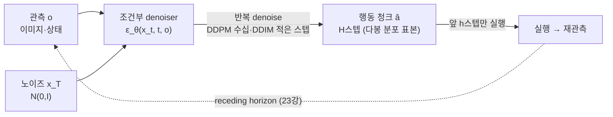
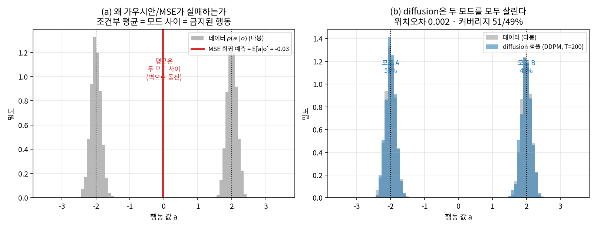
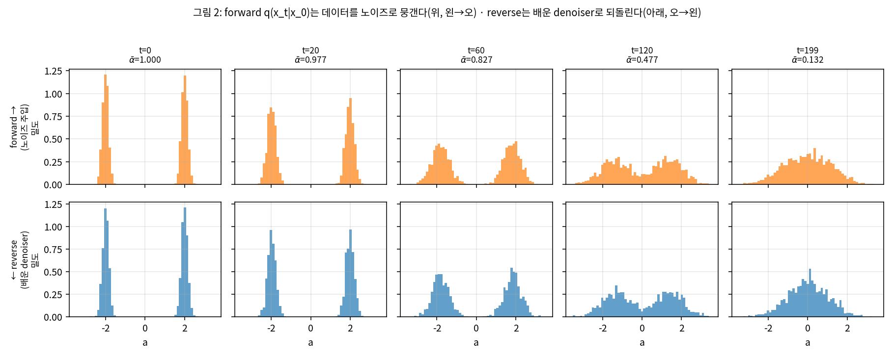
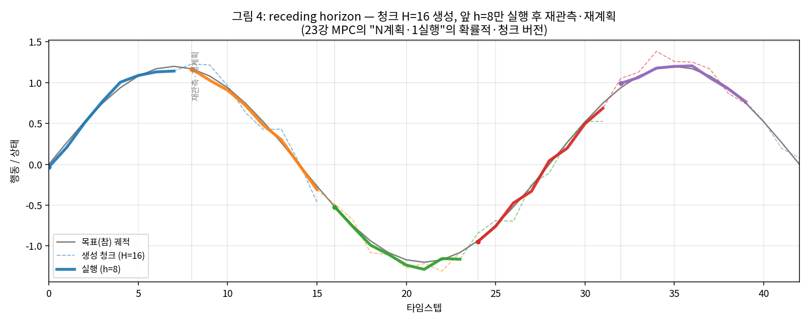
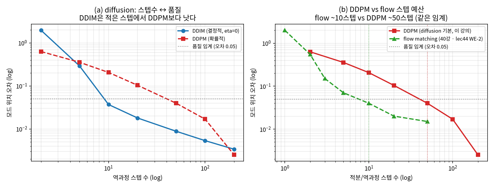

# Lec 39. Diffusion Policy

> 선수 지식: 38강(ACT·action chunking·CVAE·temporal ensembling), 26강(경사하강·역전파), 27강(과적합·분포이동). 관련: 23강(MPC·receding horizon — 이 강의의 사촌), 40강(flow matching — 다음 강, 스텝 수 대비), 44강(π0·flow expert), 50강(청크 실행).

## 한 장 요약



Diffusion Policy는 "행동을 **하나 예측**하지 말고 **분포에서 샘플**하라"는 처방이다. 같은 상황에 여러 옳은 행동이 있을 때(다봉성) 평균은 금지된 행동이 된다 — 38강 CVAE와 같은 동기의 더 강한 약이다. 노이즈를 조금씩 지우는 반복 정제(DDPM/DDIM)로 청크를 만들고, 그중 일부만 실행하고 다시 관측한다 — 이 마지막 구조가 정확히 23강 MPC의 receding horizon이다. Diffusion Policy는 **MPC의 확률적 사촌**이다.

## 학습 목표

1. 행동 분포의 **다봉성**을 정의하고, 왜 가우시안/MSE 회귀가 모드 사이 평균으로 붕괴하는지(mode averaging)를 수치와 그림으로 설명할 수 있다.
2. DDPM의 최소 수학(forward $q(x_t|x_0)$, 노이즈 예측 손실, reverse 샘플링)을 쓰고, "학습은 노이즈를 더하는 게 아니라 노이즈를 예측하는 것"임을 정확히 말할 수 있다.
3. DDPM(확률·다스텝)과 DDIM(결정·적은 스텝)의 차이를 설명하고, "diffusion은 수십 스텝, flow(40강)는 ~10스텝"의 수치 근거를 재현할 수 있다.
4. receding horizon 청크 실행(생성 H, 실행 $h<H$, 반복)이 23강 MPC와 같은 구조임을 그리고, 개루프 청크 실행이 왜 위험한지 설명할 수 있다.
5. 1D 다봉 타깃에서 MSE 회귀의 붕괴와 numpy DDPM의 모드 복원을, DDPM vs DDIM 스텝-품질 곡선과 함께 CPU 토이로 재현할 수 있다.

## 왜 이 강의가 필요한가

38강에서 ACT는 두 가지를 동시에 풀었다: **action chunking**(한 번에 여러 스텝을 내 compounding error를 줄임)과 **CVAE**(잠재변수로 다봉 행동을 표현). 그런데 CVAE의 잠재변수는 대개 단봉 가우시안이라, 표현할 수 있는 다봉성에 한계가 있다 — "왼쪽 아니면 오른쪽" 같은 뚜렷한 갈림은 담아도, 조작에서 흔한 복잡한 다봉 구조(여러 파지 방향, 여러 우회 경로)는 뭉갠다. Diffusion Policy는 같은 문제("행동은 다봉이다")에 **더 강한 처방**을 낸다: 행동 분포 자체를 생성모델(디퓨전)로 직접 표현한다.

왜 이게 급소인가. 0강의 **설계 축 3(행동 분포 표현)**에서 "가우시안 → 이산 토큰 → diffusion·flow"로 가는 사다리의 결정적 한 칸이 여기다. RT-2/OpenVLA(43강)의 이산 토큰, π0(44강)의 flow, GR00T·SmolVLA(46·47강)의 flow head — 이 모든 연속 액션 헤드의 직계 조상이 Diffusion Policy(2023)다. 그리고 flow matching(40강)은 디퓨전의 연속극한 사촌이라, **디퓨전을 먼저 이해하지 않으면 40강의 "왜 flow가 더 적은 스텝으로 되는가"가 공중에 뜬다**. 이 강의의 핵심 수식과 worked example은 정확히 그 대비(디퓨전 수십 스텝 vs flow ~10스텝)를 CPU numpy 토이로 재현해, 40강·44강의 수치와 정합시킨다.

로봇공학자에게 이 강의의 뼈대는 이미 아는 것이다. reverse denoising의 반복 정제는 **최적화 반복**(gradient descent가 손실 표면을 내려가듯, denoiser가 데이터 다양체로 밀어 넣는다)의 감각이고, receding horizon 청크 실행은 **23강 MPC 그 자체**다 — "미래를 예측하고, 앞부분만 실행하고, 다시 관측"이 학습 모델을 끼운 버전으로 돌아온다. 새로울 것은 "왜 하나가 아니라 분포인가"와 "노이즈로 되돌리는 생성 과정"의 두 가지뿐이다.

## 본문

### 1. 문제: 같은 상황, 여러 옳은 행동

T자 밀기(PushT) 과제를 생각하자. T블록을 목표 위치로 밀어야 하는데, 지금 로봇 손끝이 블록 **왼쪽**에 있다. 사람 시연자 절반은 블록을 시계 방향으로 돌리려 손끝을 위로 올렸고, 절반은 반시계로 돌리려 아래로 내렸다. 둘 다 옳다. 데이터셋에는 같은 관측 $o$에 대해 **두 개의 옳은 행동**이 들어 있다 — 위(+)로도, 아래(−)로도.

이제 이 데이터로 MSE 회귀(가우시안 정책의 최대우도)를 훈련하면 무슨 일이 벌어지는가? MSE의 최적해는 **조건부 평균** $\mathbb{E}[a|o]$다. 위(+2)와 아래(−2)의 평균은 **0 = 가운데 = 아무도 시연하지 않은, 블록을 정면으로 뭉개는 금지된 행동**이다. 이것이 **mode averaging**(모드 평균화)이고, 조작에서 BC가 무너지는 대표적 방식이다.



*그림 1: (a) 데이터 $p(a|o)$는 두 봉우리($-2, +2$)를 갖는 다봉 분포다. MSE 회귀의 최적 예측은 조건부 평균 $\mathbb{E}[a|o]=-0.03\approx0$ — 정확히 **두 모드 사이**, 어느 시연에도 없던 금지된 행동(벽으로 돌진)이다. (b) 같은 데이터에서 작은 DDPM(T=200)이 뽑은 샘플은 **두 모드를 모두 살린다**(커버리지 51/49%, 모드 위치오차 0.002). 평균이 아니라 표본이기 때문이다. 이 대비가 Diffusion Policy 전체의 동기다. 핵심 수식 E1·WE-1에서 코드로 생성.*

38강 CVAE와의 관계: CVAE도 다봉을 노렸지만, 잠재변수 사전분포가 단봉 가우시안이라 "가우시안 하나로 잘 안 갈라지는 다봉"에서 한계가 있었다. Diffusion Policy는 **잠재변수를 두지 않고** 행동 분포 자체를 반복 denoise로 그려낸다 — 봉우리의 개수·모양에 제약을 두지 않는다. 이것이 "더 강한 처방"의 의미다.

### 2. 아이디어: 노이즈를 더했다가, 배운 denoiser로 되돌린다

디퓨전의 두 과정은 이렇게 나뉜다:

- **forward(전방)** $q$: 데이터 $x_0$(하나의 행동 청크)에 노이즈를 **조금씩** 더해 $x_1, x_2, \dots, x_T$로 만든다. $T$가 크면 $x_T$는 순수 가우시안 노이즈 $N(0,I)$가 된다. 이 과정은 **학습이 없다** — 정해진 스케줄로 노이즈를 섞을 뿐이다.
- **reverse(역방)** $p_\theta$: 노이즈 $x_T$에서 출발해, 배운 denoiser로 노이즈를 **조금씩 지워** $x_{T-1}, \dots, x_0$로 되돌린다. 이 denoiser가 관측 $o$를 조건으로 받으면, "이 상황에서 그럴듯한 행동 청크"가 노이즈에서 자라난다.



*그림 2: 위 줄(forward, 왼→오): 두 봉우리 데이터가 노이즈 주입으로 점점 뭉개져($\bar\alpha$: 1.000→0.132) $t{=}199$에서 거의 순수 가우시안이 된다. 아래 줄(reverse, 오→왼): 배운 denoiser(여기선 해석적 참 노이즈)로 노이즈에서 출발해 되돌리면 $t{=}0$에서 **두 봉우리가 다시 살아난다**. forward는 데이터를 "지우는" 쉬운 방향, reverse는 그 역을 "배우는" 어려운 방향이다. $\bar\alpha_t$는 원신호가 남은 비율(E1). gen_figs.py에서 생성.*

**결정적으로, 학습은 "노이즈를 실제로 더하는 것"이 아니다.** 흔한 오해가 여기 산다. forward의 노이즈 주입은 훈련 데이터를 만드는 재료일 뿐이고, 신경망이 배우는 것은 "이 노이즈 낀 $x_t$에서, 섞인 노이즈 $\epsilon$이 무엇이었는지 맞혀라"이다 — 즉 **노이즈 예측 회귀**다(E1). 추론 때는 이 예측을 이용해 노이즈를 벗겨 나간다.

### 3. receding horizon — MPC의 확률적 사촌

디퓨전은 한 번에 **행동 청크**($H$스텝, 예: 16스텝)를 생성한다(38강 chunking 상속). 그런데 이 청크를 전부 실행하면 어떻게 되는가? 첫 관측 이후 로봇은 $H$스텝 동안 **눈을 감고 걷는다** — 외란·모델 오차가 쌓여도 못 고친다. 이것이 37강의 compounding error이자, 23강에서 본 **개루프 최적화의 위험**이다.

처방도 23강과 똑같다: 청크 $H$를 생성하되 **앞 $h<H$스텝만 실행**하고, 그 다음 새로 관측해 다시 청크를 생성한다. 재계획이 곧 피드백이다.



*그림 4: 매 관측 시점에서 diffusion이 청크 $H{=}16$스텝(점선)을 생성하고, 앞 $h{=}8$스텝(굵은 선)만 실행한 뒤 재관측·재계획한다(회색 점선 = 재계획 시점 0/8/16/24/32). 생성된 청크의 뒷부분(미래)은 예측 오차가 커지지만, 어차피 실행하지 않고 폐기하므로 문제되지 않는다 — 23강 MPC의 "N스텝 계획, 첫 입력만 실행"과 정확히 같은 구조다. gen_figs.py에서 생성.*

23강과의 대응을 못 박아 두자(로봇공학자를 위한 번역에서 더 확장):

| 23강 MPC | 39강 Diffusion Policy |
|---|---|
| 예측 지평선 $N$ | 청크 길이 $H$ (생성) |
| 첫 입력만 실행 | 앞 $h$스텝만 실행 |
| 모델 $A_d, B_d$로 미래 시뮬 | 학습된 denoiser로 청크 생성 |
| QP로 결정적 최적해 | 디퓨전으로 확률적 표본 |
| 재측정 → 재최적화 = 피드백 | 재관측 → 재생성 = 피드백 |

차이는 단 하나: MPC는 모델과 QP로 **결정적 최적해**를 내고, Diffusion Policy는 학습 denoiser로 **확률적 표본**을 낸다. 그래서 "MPC의 확률적 사촌"이다. $h/H$의 선택(얼마나 자주 재계획하나)은 50강의 temporal ensembling·RTC로 이어진다.

### 핵심 수식

세 수식이 Diffusion Policy의 뼈대다: **E1** 다봉성과 왜 MSE가 실패하는가(동기), **E2** DDPM/DDIM 최소 수학(생성 메커니즘), **E3** receding horizon 실행(폐루프 구조).

#### E1. 행동 다봉성과 mode averaging — 왜 가우시안/MSE가 실패하는가

**① 직관**: 같은 상황에 여러 옳은 행동이 있으면(왼/오), 그것들을 하나로 **평균내면 가운데 = 아무도 안 한 행동**이 된다. 정책은 "평균"이 아니라 "여러 봉우리를 가진 분포 전체"를 표현해야 한다.

**② 물리·기하적 의미**: 조작 데이터의 $p(a|o)$는 여러 봉우리를 갖는다 — 파지 방향, 우회 방향, 접근 각도가 이산적으로 갈린다. MSE 손실을 최소화하는 예측은 그 분포의 **1차 모멘트(평균)** 하나뿐이다. 두 봉우리 $\{-2, +2\}$의 평균은 $0$이고, 이 점은 확률밀도가 오히려 낮은 골짜기다 — **가장 그럴듯한 예측이 가장 있을 법하지 않은 행동**이 되는 역설. 이것이 그림 1(a)의 빨간 선이다. 이 실패는 38강 CVAE가 잠재변수로, 39강 디퓨전이 반복 정제로, 40강 flow가 벡터장으로 각각 해결한다 — 셋 다 "평균 대신 분포"라는 같은 목표.

**③ 형식**: 데이터가 혼합분포 $p(a|o) = \sum_k \pi_k\, \mathcal{N}(a; \mu_k, \sigma^2)$일 때, MSE 회귀(단봉 가우시안 정책의 최대우도)의 최적 예측은

$$
a^\star = \arg\min_{\hat a}\ \mathbb{E}_{a\sim p(a|o)}\big[(a-\hat a)^2\big] = \mathbb{E}[a|o] = \sum_k \pi_k \mu_k
$$

두 대칭 모드($\mu_1=-c,\ \mu_2=+c,\ \pi_1=\pi_2=\tfrac12$)면 $a^\star = 0$ — 모드 사이 골짜기다. 대조적으로 생성모델은 $\hat a \sim p(a|o)$로 **표본**을 뽑으므로 개별 표본은 항상 어느 한 봉우리에 떨어진다. WE-1에서 $\mathbb{E}[a|o]=-0.03$(붕괴) vs DDPM 표본 커버리지 51/49%(복원)로 이 식을 확인한다.

#### E2. DDPM/DDIM 최소 수학 — forward, 노이즈 예측 손실, reverse

**① 직관**: forward는 노이즈를 조금씩 더해 데이터를 뭉갠다(쉬움, 학습 없음). reverse는 배운 denoiser로 노이즈를 조금씩 지워 데이터를 되살린다(어려움, 학습). 신경망은 "섞인 노이즈가 무엇이었나"를 맞히도록 배운다 — 그게 전부다.

**② 물리·기하적 의미**: reverse의 한 스텝은 "현재의 노이즈 낀 추정을 데이터 다양체 쪽으로 한 걸음 미는" 연산이다 — **최적화 반복**의 감각과 정확히 같다(gradient descent가 손실 표면을 내려가듯). 예측된 노이즈 $\epsilon_\theta$는 로그밀도의 기울기(**score**) $\nabla_x \log p_t(x)$에 비례하므로, denoiser는 "확률이 높아지는 방향"을 가리킨다 — 즉 데이터 봉우리를 향한 힘이다. **DDPM**은 이 되돌림에 매 스텝 약간의 노이즈를 다시 섞는 확률적 과정이라 스텝이 많이 든다. **DDIM**은 같은 학습된 $\epsilon_\theta$를 쓰되 되돌림을 **결정적 ODE**로 바꿔(노이즈 재주입 제거) 큰 스텝을 건너뛴다 — 그래서 적은 스텝으로 된다. 이 "결정적 ODE로 스텝 줄이기"의 극한이 40강 flow matching이다.

**③ 형식**: 노이즈 스케줄 $\beta_1,\dots,\beta_T$, $\alpha_t = 1-\beta_t$, $\bar\alpha_t=\prod_{s\le t}\alpha_s$에 대해 forward는 한 방에 쓸 수 있다:

$$
q(x_t\,|\,x_0) = \mathcal{N}\!\big(x_t;\ \sqrt{\bar\alpha_t}\,x_0,\ (1-\bar\alpha_t)\,I\big)
\quad\Longleftrightarrow\quad
x_t = \sqrt{\bar\alpha_t}\,x_0 + \sqrt{1-\bar\alpha_t}\,\epsilon,\ \ \epsilon\sim\mathcal N(0,I)
$$

$\bar\alpha_t$는 **원신호가 남은 비율**(그림 2의 위 라벨: 1.000→0.132). 학습 손실은 **노이즈 예측 회귀**(MSE!):

$$
\mathcal{L}_{\mathrm{DDPM}} = \mathbb{E}_{t,\,x_0,\,\epsilon}\big[\,\lVert \epsilon - \epsilon_\theta(\underbrace{\sqrt{\bar\alpha_t}x_0+\sqrt{1-\bar\alpha_t}\,\epsilon}_{x_t},\ t,\ o) \rVert^2\,\big]
$$

(다봉이라 MSE가 실패했는데 여기서 MSE를 쓴다? 목표가 다르다 — 여기서는 **가우시안 노이즈** $\epsilon$을 맞히는데, $\epsilon$은 단봉이라 MSE가 옳다. 다봉성은 여러 $t$·여러 표본에 걸친 반복 denoise가 만든다.) 추론(reverse) 한 스텝:

$$
\underbrace{x_{t-1} = \frac{1}{\sqrt{\alpha_t}}\Big(x_t - \frac{1-\alpha_t}{\sqrt{1-\bar\alpha_t}}\,\epsilon_\theta(x_t,t,o)\Big) + \sigma_t z}_{\text{DDPM: } z\sim\mathcal N(0,I)\ \text{확률적}}
\qquad
\underbrace{x_{t-1} = \sqrt{\bar\alpha_{t-1}}\,\hat x_0 + \sqrt{1-\bar\alpha_{t-1}}\,\epsilon_\theta}_{\text{DDIM: } \sigma_t{=}0\ \text{결정적, 스텝 건너뜀}}
$$

여기서 $\hat x_0 = (x_t - \sqrt{1-\bar\alpha_t}\,\epsilon_\theta)/\sqrt{\bar\alpha_t}$는 현재 스텝의 $x_0$ 추정이다. DDPM은 매 스텝 $\sigma_t z$로 노이즈를 재주입(확률적), DDIM은 $\sigma_t=0$(결정적)이라 $t$를 건너뛸 수 있다. WE-2에서 DDPM은 오차 0.05 임계에 수십 스텝(~40–50), DDIM은 ~10스텝이 든다.

#### E3. Receding horizon — 확률적 청크의 폐루프 실행

**① 직관**: 청크 $H$스텝을 생성하지만 전부 믿지 말라. 앞 $h$스텝만 실행하고 다시 관측해 새 청크를 뽑아라. 실행하지 않은 뒷부분은 폐기 — "계획은 틀리라고 세운다"(23강).

**② 물리·기하적 의미**: 청크 하나를 통째로 실행하면 그 $H$스텝 동안 **개루프**다(37강 compounding error·17강 개루프 불안정). $h$스텝마다 재관측·재생성하면 외란·모델 오차가 매 재계획에 반영된다 — 23강 E3의 "재최적화가 곧 피드백"의 확률적 판. $h$가 작을수록(자주 재계획) 폐루프 대역이 넓어지지만 계산 부담이 크고, 청크 경계에서 행동이 튈 수 있다(불연속). 이 튐을 매끄럽게 하는 것이 50강의 temporal ensembling(겹치는 청크의 블렌딩 — 8강 보간·필터의 감각)과 RTC다.

**③ 형식**: 관측 $o_k$에서 청크 $\hat a_{k:k+H} \sim p_\theta(\cdot\,|\,o_k)$를 생성하고 앞 $h$개만 실행:

$$
\hat a_{k:k+H} \sim p_\theta(a\,|\,o_k),\qquad \text{실행: } a_{k},\dots,a_{k+h-1},\qquad \text{그 뒤 } o_{k+h}\text{ 관측} \to \text{반복}\ (h<H)
$$

$h=H$면 순수 개루프(재계획 없음), $h=1$이면 매 스텝 재계획(가장 촘촘한 폐루프, 가장 비쌈). 23강 MPC의 $N$(예측 지평선)↔$H$, "첫 입력만"↔"앞 $h$스텝만"이 정확히 대응한다. Diffusion Policy 원논문은 $H{=}16$ 생성, $h{=}8$ 실행 근방을 쓴다.

### Worked Example

#### WE-1 (코드): 1D 다봉 타깃 — MSE 붕괴 vs 작은 DDPM의 모드 복원

E1을 눈으로 확인한다. 같은 관측에서 두 옳은 행동 $\{-2, +2\}$(다봉)를 두고, ① MSE 회귀가 조건부 평균으로 붕괴하는지, ② 작은 DDPM이 두 모드를 살리는지 본다. DDPM의 denoiser는 데이터가 가우시안 혼합이라 **해석적 참 노이즈**로 대체한다(학습 없이 메커니즘만 재현 — 44강 WE-2의 flow 토이와 같은 방식의 diffusion 버전).

```python
import numpy as np

# ── 데이터: 같은 관측 o에서 두 옳은 행동 (왼쪽 -2, 오른쪽 +2) — 다봉 ──
modes = np.array([-2.0, 2.0]); sig = 0.15
rng = np.random.default_rng(0)
data = np.where(rng.random(4000) < 0.5, modes[0], modes[1]) + sig*rng.standard_normal(4000)

# ① MSE 회귀: 최적 예측 = 조건부 평균 E[a|o] → 두 모드의 평균 = 0 (금지된 행동)
print(f"MSE 최적 예측 E[a|o] = {data.mean():.3f}")     # -0.030  (목표는 ±2, 평균은 벽)

# ② 작은 DDPM: forward 스케줄, 참 노이즈(해석적 score)로 reverse
T = 200
betas = np.linspace(1e-4, 0.02, T); alphas = 1-betas; abar = np.cumprod(alphas)

def eps_star(x, t):                         # 참 노이즈 = -sqrt(1-abar)*score
    ab = abar[t]; var = ab*sig**2 + (1-ab); mu = np.sqrt(ab)*modes
    r = np.stack([0.5*np.exp(-0.5*(x-mu[k])**2/var) for k in range(2)], 1)
    r /= r.sum(1, keepdims=True) + 1e-30
    score = np.sum(r*(mu[None,:]-x[:,None])/var, 1)
    return -np.sqrt(1-ab)*score

x = np.random.default_rng(1).standard_normal(4000)   # x_T ~ N(0,1)
g = np.random.default_rng(2)
for t in range(T-1, -1, -1):                          # reverse: 노이즈를 조금씩 지운다
    e = eps_star(x, t)
    mean = (x - (1-alphas[t])/np.sqrt(1-abar[t])*e)/np.sqrt(alphas[t])
    x = mean + (np.sqrt(betas[t])*g.standard_normal(4000) if t>0 else 0.0)

asg = np.argmin(np.abs(x[:,None]-modes[None,:]), 1)
cov = [np.mean(asg==k) for k in range(2)]
rec = [x[asg==k].mean() for k in range(2)]
print(f"DDPM 복원 모드 = {rec[0]:.3f}, {rec[1]:.3f}")               # -1.995, 1.997
print(f"커버리지 {cov[0]*100:.0f}/{cov[1]*100:.0f}%, 위치오차 {max(abs(rec[0]+2), abs(rec[1]-2)):.4f}")
                                                                     # 51/49%, 0.0046
```

출력: MSE 예측은 $-0.030$(두 모드 사이 = 금지된 행동), DDPM 표본은 두 모드를 $-1.995/+1.997$로 복원하고 **커버리지 51/49%**(두 모드에 고르게)로 채운다. **핵심 교훈**: 같은 데이터, 같은 관측인데 — 하나를 예측(MSE)하면 벽으로 돌진하고, 분포에서 표본(DDPM)하면 두 옳은 행동을 모두 표현한다. 이것이 그림 1이고, Diffusion Policy 전체의 이유다. (44강 WE-2의 flow 토이가 같은 두 모드를 flow로 복원하는데, 여기 diffusion 버전과 짝을 이룬다.)

#### WE-2 (코드): DDPM(확률·다스텝) vs DDIM(결정·적은 스텝) — 스텝-품질

E2를 확인한다. **같은 학습된 denoiser**(해석적 참 노이즈)를 쓰되, 샘플러만 DDPM(확률적)/DDIM(결정적)으로 바꿔 스텝 수에 따른 모드 복원 품질을 잰다. 이 곡선이 "디퓨전은 수십 스텝, flow(40강)는 ~10스텝"의 수치 근거다.

```python
import numpy as np
modes = np.array([-2.0, 2.0]); sig = 0.15

def eps_star(x, t, abar):                     # 참 노이즈 (해석적 score)
    ab = abar[t]; var = ab*sig**2 + (1-ab); mu = np.sqrt(ab)*modes
    r = np.stack([0.5*np.exp(-0.5*(x-mu[k])**2/var) for k in range(2)], 1)
    r /= r.sum(1, keepdims=True) + 1e-30
    return -np.sqrt(1-ab)*np.sum(r*(mu[None,:]-x[:,None])/var, 1)

def sched(T): b = np.linspace(1e-4, 0.02, T); a = 1-b; return b, a, np.cumprod(a)

def err(x):                                   # 모드 위치 오차
    asg = np.argmin(np.abs(x[:,None]-modes[None,:]), 1)
    rec = [x[asg==k].mean() for k in range(2)]
    return max(abs(rec[0]+2), abs(rec[1]-2))

def ddpm(T, n, seed):                         # 확률적, 스케줄 길이=스텝수
    b, a, ab = sched(T); g = np.random.default_rng(seed); x = g.standard_normal(n)
    for t in range(T-1, -1, -1):
        e = eps_star(x, t, ab)
        m = (x - (1-a[t])/np.sqrt(1-ab[t])*e)/np.sqrt(a[t])
        x = m + (np.sqrt(b[t])*g.standard_normal(n) if t>0 else 0.0)
    return x

def ddim(ns, n, seed, T=1000):                # 결정적(eta=0), T개 중 ns개만 건너뜀
    _, _, ab = sched(T); ts = np.unique(np.linspace(0, T-1, ns).round().astype(int))
    x = np.random.default_rng(seed).standard_normal(n)
    for i in range(len(ts)-1, -1, -1):
        t = ts[i]; e = eps_star(x, t, ab)
        x0 = (x - np.sqrt(1-ab[t])*e)/np.sqrt(ab[t])              # x0 추정
        x = (np.sqrt(ab[ts[i-1]])*x0 + np.sqrt(1-ab[ts[i-1]])*e) if i>0 else x0
    return x

for ns in [2, 5, 10, 20, 50, 100]:
    print(f"스텝 {ns:3d}: DDPM 오차 {err(ddpm(ns,6000,200+ns)):.4f}   DDIM 오차 {err(ddim(ns,6000,100+ns)):.4f}")
# 스텝   2: DDPM 오차 0.6313   DDIM 오차 1.9718
# 스텝   5: DDPM 오차 0.3564   DDIM 오차 0.2934
# 스텝  10: DDPM 오차 0.2067   DDIM 오차 0.0371
# 스텝  20: DDPM 오차 0.1038   DDIM 오차 0.0180
# 스텝  50: DDPM 오차 0.0399   DDIM 오차 0.0089
# 스텝 100: DDPM 오차 0.0170   DDIM 오차 0.0054
```

읽는 법: 품질 임계를 오차 0.05로 잡으면 **DDPM은 수십 스텝**(이 그리드에선 50스텝에서 0.040으로 통과, 20스텝은 아직 0.104 — 40강이 더 촘촘한 그리드로 재면 같은 토이가 ~40스텝에서 통과해 flow의 **약 4배**), **DDIM은 ~10스텝**(0.037)에서 통과한다. DDIM이 큰 스텝을 건너뛸 수 있는 건 되돌림이 결정적 ODE라서다(E2). 그리고 40강 flow의 같은 두 모드 토이(lec44 WE-2)는 **~10 Euler 스텝**에서 오차 0.04로 포화한다 — 즉 **표준 diffusion(DDPM)은 수십 스텝(~40–50), DDIM·flow는 ~10스텝**. 이 서열이 그림 3이고, "flow가 왜 50Hz를 얻는가"(44강)의 뿌리다. DDIM이 flow에 필적하는 이유도 명확하다 — 둘 다 결정적 ODE 적분이며, flow는 그 극한을 처음부터 직선보간으로 설계한 것이다(40강).



*그림 3: (a) 같은 denoiser, 다른 샘플러 — DDIM(결정적)이 적은 스텝에서 DDPM(확률적)보다 낫다(예: 10스텝에서 0.037 vs 0.207). (b) diffusion 기본 샘플러 DDPM(수십 스텝)과 40강 flow matching(~10스텝, lec44 WE-2 수치)의 스텝 예산 대비 — 같은 오차 임계(0.05)를 flow는 ~10스텝, DDPM은 수십 스텝(이 그리드 50, 40강의 촘촘한 그리드로는 ~40 = flow의 약 4배)에 얻는다. 이 "수십 vs ~10"이 40강·44강 서술의 수치 근거다. WE-2·gen_figs.py에서 생성.*

### 로봇공학자를 위한 번역

- **Diffusion Policy ≈ 학습 모델을 끼운 MPC**(23강). "미래 청크 예측 → 앞부분만 실행 → 재관측"의 receding horizon 골격이 그대로다. 다른 점: 명시적 동역학 모델·QP 대신 **학습된 확률적 생성기**가 청크를 낸다. MPC가 결정적 최적해라면 Diffusion Policy는 다봉 분포에서의 표본 — "여러 옳은 계획"을 자연히 담는다.
- **reverse denoising ≈ 최적화 반복**. 예측 노이즈 $\epsilon_\theta$가 score $\nabla\log p$에 비례하므로, reverse 한 스텝은 "확률이 높아지는(데이터 봉우리로 가는) 방향으로 한 걸음"이다 — gradient ascent on log-density. 스텝 수는 이 반복을 몇 번 도느냐이고, DDIM은 큰 스텝으로 빨리 수렴하는 솔버 튜닝에 해당한다.
- **DDIM의 결정적 ODE ≈ 룽게-쿠타 감각의 예고**. 노이즈 재주입을 없앤 결정적 되돌림은 ODE 수치적분이고, 이 발상의 극한이 40강 flow의 Euler 적분이다. "스텝 수 ↔ 정확도" 트레이드오프를 ODE 솔버로 이해하면 39·40·44강이 하나로 꿰인다.
- **mode averaging ≈ 최소자승 추정의 한계**. 다봉 타깃에 최소자승(=조건부 평균)을 쓰면 봉우리 사이로 떨어진다 — 로봇공학자에게는 "비볼록 목표에 단일 선형 추정을 씌운 실패"로 익숙한 병이다.

## 흔한 오해

1. **"Diffusion Policy는 RL의 일종이다"** — 아니다(0강 축 구분). diffusion은 **축 3(행동 분포 표현)**의 선택이고, 대부분의 Diffusion Policy는 **축 2가 BC**(시연 모방)다. "생성모델 = RL"이 아니다. Diffusion Policy는 시연 데이터의 로그우도를 (노이즈 예측 형태로) 올리는 지도학습이며, 보상도 가치함수도 없다. RL과 결합하는 것은 별개 선택(45강 RECAP은 flow에 오프라인 RL을 얹지만 그건 축 2를 바꾼 것).
2. **"diffusion은 항상 느리다"** — DDPM(수십~수백 스텝)만 보면 그렇지만, DDIM은 결정적 ODE로 스텝을 크게 줄인다(WE-2: 10스텝에서 0.037). 다만 **flow(40강)보다는 여전히 스텝이 많은 경향** — 그래서 π0는 flow를 골라 50Hz를 얻었다(44강). "느리다"가 아니라 "샘플러와 스텝 수의 함수"가 정확하다.
3. **"학습할 때 노이즈를 실제로 더한다"** — forward의 노이즈 주입은 **훈련 데이터를 만드는 재료**일 뿐이고, 신경망이 배우는 것은 "이 $x_t$에 섞인 노이즈 $\epsilon$을 맞혀라"라는 **회귀**다(E2 손실). 추론 때 비로소 그 예측으로 노이즈를 벗긴다. "노이즈를 더하는 네트워크"가 아니라 "노이즈를 예측하는 네트워크".
4. **"다봉성은 드문 예외다"** — 조작에서는 흔하다. 파지 방향(위/아래), 우회 경로(왼/오), 접근 각도, 순서(먼저 A 집을까 B 집을까) — 사람 시연은 거의 항상 여러 유효 해를 담는다. 단봉 가우시안 정책이 매끄러운 벤치마크에서 되다가 실물 조작에서 무너지는 이유가 바로 이 다봉성이다(그림 1).
5. **"diffusion과 flow(40강)는 무관한 별개 기법이다"** — 연속극한에서 연결된다. DDIM의 결정적 되돌림은 확률흐름 ODE이고, flow matching은 그 ODE를 직선보간 속도장으로 처음부터 설계한 것이다(40강). 노이즈 예측 $\epsilon_\theta$와 flow의 속도장 $v_\theta$는 서로 변환 가능하다 — 그래서 39강을 알면 40강이 "더 곧은 경로"라는 한 문장으로 읽힌다.

## 실습 (1.5~2h)

**A안 (권장·CPU만): 1D 다봉 토이를 손으로 키우기.** WE-1·WE-2 코드를 실행한 뒤 확장한다. ① 모드를 3개(예: $-2, 0, +2$)로 늘려 MSE가 어디로 붕괴하는지, DDPM 커버리지가 어떻게 갈리는지 관찰. ② `sig`(모드 폭)를 0.15→0.5로 키우며 "남은 오차의 출처가 적분 오차만이 아님"(유한 폭)을 확인. ③ WE-2에서 스텝을 3,4,6,8,10으로 촘촘히 재서 DDPM/DDIM/flow(40강 값)의 임계 도달 스텝을 표로 정리. "왜 DDIM이 flow에 근접하는가"를 Claude와 토론.

**B안 (GPU 있으면): LeRobot에서 Diffusion Policy를 PushT에 훈련.** LeRobot의 `diffusion` 정책으로 PushT 데이터셋을 훈련하고, 추론에서 청크 생성 shape($H\times$행동차원)과 receding horizon 실행 파라미터($h$)를 확인한다. DDPM 스텝 수(추론 스텝)를 100→50→10으로 줄이며 성공률 변화를 관찰 — WE-2 곡선의 실물판. (LeRobot·PyTorch는 설명 위주로만; 수치 주장은 A안의 numpy로.)

> 실습의 diffusion/flow 코드(PyTorch·LeRobot)는 개념 확인용이며, 이 강의의 **수치 주장은 모두 A안의 순수 numpy 토이**에서 나온다.

## Claude와 토론할 질문

1. MSE 회귀가 다봉 타깃에서 붕괴하는 것을, 로봇공학자가 아는 "비볼록 비용에 단일 선형 추정을 씌운 실패"로 정확히 번역하라. 어떤 조작 상황에서 이 붕괴가 실제 충돌·실패로 이어지겠는가?
2. Diffusion Policy와 23강 MPC의 대응표(본문)에서, "확률적 표본 vs 결정적 최적해"의 실전 득실은? 다봉 상황에서 MPC(결정적)는 어떻게 대응하며, 그 한계는 무엇인가?
3. WE-2에서 DDPM은 ~50, DDIM·flow는 ~10스텝이다. DDIM이 flow에 근접하는 근본 이유(둘 다 결정적 ODE)를 설명하고, 그럼에도 flow가 더 나을 수 있는 이유(직선 경로 설계)를 40강을 예상해 가설로 세워라.
4. "노이즈를 예측하는 것"과 "score(로그밀도 기울기)를 예측하는 것"과 "$x_0$를 직접 예측하는 것"은 어떻게 서로 변환되는가? 세 가지 파라미터화의 실전 차이는?
5. receding horizon에서 $h$(실행 스텝)를 1로 줄이면 폐루프는 촘촘해지지만 계산은 폭증한다. 이 트레이드오프를 23강 MPC의 "계산 예산"과, 50강 temporal ensembling(겹치는 청크 블렌딩)이 어떻게 완화하는지 연결하라.
6. 다봉성이 "실제로 두 옳은 해"인 경우와 "데이터 수집자마다 습관이 달라 생긴 가짜 다봉"인 경우를 어떻게 구분하는가? 후자라면 diffusion이 학습하는 것은 무엇인가(37강 causal confusion의 그림자)?
7. Diffusion Policy(2023, 비-VLM)에서 π0(2024, VLM+flow)로 가는 길에서 "무엇이 상속되고 무엇이 바뀌었나"? action chunking·receding horizon·연속 생성 중 무엇이 유지되고, 백본·flow·언어 조건화 중 무엇이 추가되었는가?

## 읽을거리

1. **Chi et al., Diffusion Policy (arXiv 2303.04137)의 §3(방법)과 Fig 3(receding horizon)만** (~40분): 조건화 방식(FiLM), receding horizon 실행, CNN vs transformer 백본. 실험 전체는 훑기만.
2. **Ho et al., DDPM (arXiv 2006.11239)의 §2~3과 Algorithm 1·2만** (~30분): forward/reverse와 노이즈 예측 손실의 원전. 변분 하한 유도(Appendix)는 존재만 알면 된다.
3. (선택) **Song et al., DDIM (arXiv 2010.02502)의 §4(결정적 샘플링)만**: "같은 모델, 적은 스텝"의 핵심 한 절.

## 자가 점검

1. 행동 다봉성을 정의하고, MSE 회귀가 왜 모드 사이로 붕괴하는지(E1: $\arg\min$ = 조건부 평균)를 두 모드 예로 손으로 보일 수 있는가?
2. DDPM의 forward $q(x_t|x_0)$, 노이즈 예측 손실, reverse 한 스텝(DDPM 확률/DDIM 결정)을 안 보고 쓸 수 있는가? $\bar\alpha_t$가 무엇인지 말할 수 있는가?
3. "학습은 노이즈를 더하는 게 아니라 노이즈를 예측하는 것"을 손실식으로 설명할 수 있는가?
4. DDPM(수십 스텝 ~40–50) vs DDIM(~10스텝) vs flow(40강, ~10스텝)의 스텝-품질 서열과 그 이유(확률적 재주입 vs 결정적 ODE)를 WE-2 곡선으로 말할 수 있는가?
5. receding horizon 실행(생성 $H$, 실행 $h<H$, 재관측)을 그리고, 23강 MPC와의 대응($N\leftrightarrow H$, 첫 입력↔앞 $h$)을 짚을 수 있는가? $h=H$의 위험은?
6. "Diffusion Policy = RL"이 왜 범주 오류인지(축 3 vs 축 2, 대개 BC), "diffusion과 flow는 무관"이 왜 틀린지(연속극한 연결)를 각각 한 문장으로 반박할 수 있는가?
7. 왜 Diffusion Policy가 π0·GR00T·SmolVLA의 연속 액션 헤드의 조상인지, 무엇이 상속되었는지(chunking·receding horizon·연속 생성) 말할 수 있는가?

## 참고문헌

> 본문 수치·주장의 출처. 웹 문서는 2026-07 접속 기준. 논문 > 공식 문서 순.

[1] C. Chi et al., "Diffusion Policy: Visuomotor Policy Learning via Action Diffusion," arXiv:2303.04137, 2023.3. https://arxiv.org/abs/2303.04137
— **뒷받침**: 행동 다봉성 동기, 조건부 denoiser $\epsilon_\theta(x_t,t,o)$, receding horizon 청크 실행($H{\approx}16$ 생성·$h{\approx}8$ 실행), CNN/transformer 백본, PushT 등 조작 벤치마크. 0강 표의 "Diffusion Policy = 비-VLM × BC × diffusion" 근거.

[2] J. Ho, A. Jain, P. Abbeel, "Denoising Diffusion Probabilistic Models (DDPM)," arXiv:2006.11239, 2020.6. https://arxiv.org/abs/2006.11239
— **뒷받침**: E2의 forward $q(x_t|x_0)=\mathcal N(\sqrt{\bar\alpha_t}x_0,(1-\bar\alpha_t)I)$, 노이즈 예측 손실 $\lVert\epsilon-\epsilon_\theta\rVert^2$, DDPM reverse 샘플링(Algorithm 1·2), $\bar\alpha_t$ 정의.

[3] J. Song, C. Meng, S. Ermon, "Denoising Diffusion Implicit Models (DDIM)," arXiv:2010.02502, 2020.10. https://arxiv.org/abs/2010.02502
— **뒷받침**: E2의 결정적($\eta{=}0$) reverse, 스텝 서브샘플로 적은 스텝 추론, WE-2·그림 3의 "DDIM이 적은 스텝에서 DDPM보다 우수".

[4] J. Sohl-Dickstein et al., "Deep Unsupervised Learning using Nonequilibrium Thermodynamics," arXiv:1503.03585, 2015.3. https://arxiv.org/abs/1503.03585
— **뒷받침**: forward 노이즈 주입 / reverse 학습의 원조 정식화(디퓨전의 열역학적 기원).

[5] K. Black et al. (Physical Intelligence), "π0: A Vision-Language-Action Flow Model," arXiv:2410.24164, 2024.10. https://arxiv.org/abs/2410.24164
— **뒷받침**: 흔한 오해 2·5와 자가점검 7의 "Diffusion Policy → flow head(π0·GR00T·SmolVLA)" 계보, flow가 ~10스텝으로 50Hz를 얻는 대비(44강 상세).

[6] Rawlings, Mayne, Diehl, "Model Predictive Control: Theory, Computation, and Design," 2nd ed. (무료 PDF). https://sites.engineering.ucsb.edu/~jbraw/mpc/
— **뒷받침**: E3·본문 대응표의 receding horizon 정식화("N스텝 계획, 첫 입력만 실행")의 표준 참고(23강 [4]와 동일 출처).

[7] Hugging Face / LeRobot, "Robot Learning: A Tutorial," arXiv:2510.12403, 2025.10. https://arxiv.org/abs/2510.12403 · LeRobot: https://github.com/huggingface/lerobot
— **뒷받침**: 실습 B안(LeRobot `diffusion` 정책·PushT), Part 9의 교과서 맥락.

*수치 재현성: 핵심 수식·Worked Example·그림의 numpy 토이 수치는 `images/lec39/gen_figs.py`와 본문 코드 블록의 실행 출력이다 — 다봉 데이터 두 모드 $\{-2,+2\}$·$\sigma{=}0.15$에서 MSE 최적 예측 $\mathbb E[a|o]=-0.03$(모드 사이 붕괴), DDPM(T=200) 모드 복원 $-1.995/+1.997$·커버리지 51/49%·위치오차 0.002, 스텝-품질(오차 0.05 임계) DDPM 수십 스텝(이 그리드 50, 40강 촘촘한 그리드로 ~40)·DDIM ~10스텝·flow(40강 lec44 WE-2) ~10스텝, forward $\bar\alpha_t$(t=0:1.000, 60:0.827, 199:0.132), receding horizon $H{=}16$ 생성·$h{=}8$ 실행. numpy 1.26 / matplotlib 3.5 기준 재현 확인(순수 numpy·외부 과학연산 라이브러리 불요). **이 토이는 개념 재현용 CPU 시뮬레이션이며 실제 Diffusion Policy 모델·가중치가 아니다**(denoiser를 학습 대신 해석적 참 노이즈로 대체) — Diffusion Policy·DDPM·DDIM의 실제 성능·설정은 위 [1][2][3] 1차 출처.*
