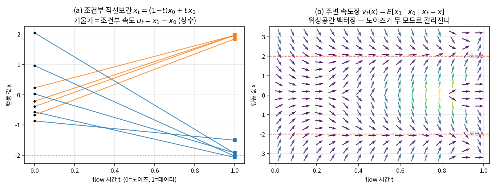
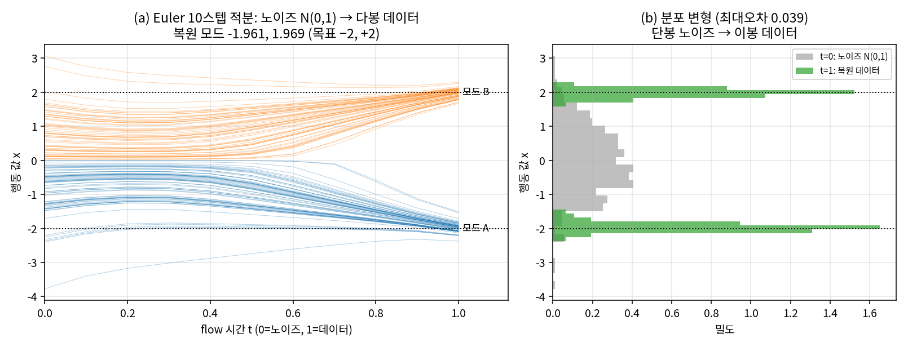
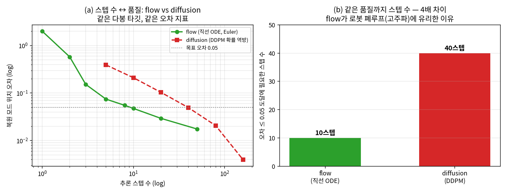
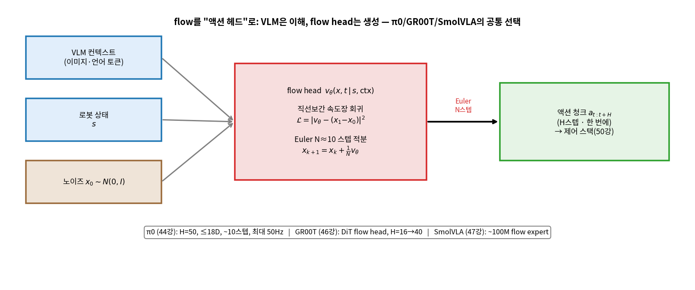

# Lec 40. Flow matching

> 선수 지식: 39강(Diffusion Policy — 다봉성·DDPM/DDIM·receding horizon), 26강(경사하강·손실). 관련: 8강(보간), 23강(MPC), 41강(RL), 44강(π0 회수), 46강(GR00T)·47강(SmolVLA), 50강(Action의 여정).
> 이 강의는 flow matching의 **원류**다 — 44강 π0가 여기를 "40강 회수"로 되짚고, 46·47강의 액션 헤드도 이 메커니즘의 변주다. 그래서 여기서 사후평균 유도까지 자세히 판다.

## 한 장 요약


flow matching = **노이즈 한 점을 데이터 한 점으로 잇는 가장 곧은 길의 속도를 배우고, 그 속도장을 ODE로 적분**하는 생성법. 39강 디퓨전이 "확률적으로 여러 번 조금씩 지우는" 것이라면, flow는 "직선을 따라 곧장 미는" 것 — 그래서 ~10스텝이면 포화한다. 이 적은 스텝이 π0·GR00T·SmolVLA가 flow를 **로봇 액션 헤드의 표준**으로 고른 이유다. 로봇공학자에게 이것은 낯익다: **속도장 = 위상공간 벡터장, ODE 적분 = 룽게-쿠타 감각, 스텝 수 = 곡선을 몇 조각 직선으로 근사하느냐**.

## 학습 목표

1. 직선보간 확률경로 $x_t=(1-t)x_0+t\,x_1$과 조건부 속도 $u_t=x_1-x_0$를 쓰고, 목표 속도장이 **조건부 속도의 사후평균** $v_\theta\approx\mathbb{E}[x_1-x_0\mid x_t]$임을 설명할 수 있다.
2. flow의 추론이 노이즈에서 속도장을 따라 $t:0\to1$로 적분하는 **Euler ODE**임을 쓰고, "왜 ~10스텝이면 포화하는가"를 ODE 솔버 감각(곡선의 직선 근사)으로 설명할 수 있다.
3. flow(결정적 직선 ODE)와 diffusion(확률적 다스텝)의 관계·차이를 39강의 언어로 설명하고, 같은 다봉 타깃에서 **같은 품질에 필요한 스텝 수를 수치로 비교**할 수 있다.
4. π0/GR00T/SmolVLA가 flow를 액션 헤드로 고른 이유(고주파 폐루프·병렬 청크)를 44강·46강·47강에 연결해 말할 수 있다.
5. 1D flow matching을 numpy 토이로 재현하고, 사후평균 속도장·Euler 스텝수별 오차·flow vs diffusion 스텝 비교를 직접 실행해 수치로 설명할 수 있다.

## 왜 이 강의가 필요한가

39강에서 Diffusion Policy는 행동의 **다봉성**(같은 상황에 왼쪽으로도 오른쪽으로도)을 자연히 표현하고, 예측–실행–재계획(receding horizon)으로 MPC의 확률적 사촌이 되었다. 그러나 디퓨전에는 대가가 있었다 — **추론에 수십~수백 스텝**이 든다. 로봇의 몸은 기다려 주지 않는다: 천처럼 변형되는 물체, 미끄러지는 접촉은 **고주파 폐루프**(수십 Hz)를 요구하는데, 매 청크를 수백 스텝으로 뽑으면 그 주파수가 안 나온다. 44강에서 봤듯 π0가 **최대 50Hz**를 얻은 근본 이유가 바로 이 강의의 flow matching이다.

이걸 "flow는 빠른 diffusion"으로만 외우면 새 논문 앞에서 무력하다. flow가 왜 ~10스텝이면 되는지(직선 경로라 ODE 곡률이 낮다), diffusion이 왜 더 걸리는지(확률적 역과정이라 스텝마다 노이즈를 다시 넣는다)를 **직접 재현해 본 사람만이** 46강 GR00T의 DiT flow head, 47강 SmolVLA의 ~100M flow expert를 "새로운 점만" 짚어낼 수 있다. 그리고 로봇공학자에게 이 강의는 특히 편하다 — **속도장은 위상공간 벡터장이고, ODE 적분은 이미 손에 익은 수치적분**이기 때문이다. 이 강의의 핵심 수식과 worked example은 정확히 그 재현을 CPU numpy 토이로 시킨다.

## 본문

### 1. 문제 설정 — 왜 "속도"인가

액션 청크 하나(예: π0의 $H{=}50\times{\le}18$차원)는 **고차원 공간의 한 점**이다. 정책이 할 일은 "관측·상태가 주어졌을 때 사람이 시연한 궤적들의 분포에서 한 점을 뽑는" 것 — 즉 **조건부 생성**이다. 이 분포는 여러 봉우리를 갖는다(다봉성, 39강). 문제는 "그 분포에서 어떻게 샘플을 뽑느냐"다.

flow matching의 답: **노이즈 분포(쉬움: $N(0,I)$)를 데이터 분포로 밀어내는 연속 시간 벡터장을 배운다.** 시간 $t\in[0,1]$을 도입해, $t{=}0$은 노이즈, $t{=}1$은 데이터로 두고, 그 사이를 잇는 "흐름(flow)"을 정의한다. 흐름은 상미분방정식(ODE)으로 기술된다:

$$
\frac{dx}{dt} = v_\theta(x, t), \qquad x(0)\sim N(0,I), \quad x(1)\sim p_{\text{data}}.
$$

여기서 $v_\theta$가 **속도장** — 시각 $t$, 위치 $x$에서 "어느 방향으로 얼마나 빨리 움직여야 데이터에 도달하는가". 로봇공학자에게 이것은 **위상공간의 벡터장**과 똑같다: 상태공간의 각 점에 화살표가 하나씩 붙어 있고, 그 화살표를 따라 시간을 적분하면 궤적이 나온다. 어려워 보이는 생성모델이 알고 보면 "벡터장 하나를 배우고 그것을 수치적분하는 것"이다.

남은 질문은 둘: **(A)** 어떤 벡터장을 배워야 하나? (§2 E1 — 직선보간의 사후평균) **(B)** 그 벡터장을 몇 스텝으로 적분해야 하나? (§2 E2 — Euler와 ~10스텝)

### 2. 핵심 수식

flow matching은 세 조각이다: **E1** 어떤 속도장을 배우는가(직선보간·사후평균·회귀 손실), **E2** 그것을 어떻게 적분하는가(Euler·스텝 수), **E3** diffusion과 무엇이 다르고 왜 로봇 액션 헤드 표준인가.

#### E1. flow matching = 직선보간 속도장 회귀

**① 직관**: 노이즈 한 점 $x_0$을 데이터 한 점 $x_1$으로 옮기는 **가장 곧은 길**은 직선이다. 두 점을 직선으로 잇고, 그 직선을 따라가는 속도(방향과 크기)를 신경망이 예측하게 한다. 직선의 속도는 자명하다 — 시점과 종점의 차이 $x_1-x_0$, 그리고 그것은 시간에 대해 **상수**다(직선이니까). 훈련은 "이 상수 속도를 맞춰라"는 단순 회귀다.

**② 물리·기하적 의미**: 한 쌍 $(x_0, x_1)$을 고정하면 경로는 직선이고 속도는 상수다. 그러나 추론 때 우리는 $x_1$을 모른다 — 그래서 필요한 것은 **주변(marginal) 속도장** $v_\theta(x,t)$: "지금 위치 $x$, 시각 $t$에 있는 입자는 어디로 가야 하나?" 같은 위치 $x_t$를 지나는 직선은 여러 개다(여러 $x_1$에서 올 수 있다). 최적의 답은 그들의 **평균 속도** — 정확히 조건부 속도의 사후 기댓값 $\mathbb{E}[x_1-x_0\mid x_t=x]$이다(회귀 손실의 최소값이 조건부 평균이라는 사실, 26강). 데이터가 다봉이면 이 평균 벡터장이 **갈라진다**: $x_t$가 왼쪽 모드 쪽이면 화살표가 왼쪽을, 오른쪽이면 오른쪽을 가리켜, 노이즈 한 덩어리가 두 모드로 나뉜다(그림 1b·그림 2). 이것이 flow가 다봉성을 표현하는 기하다 — 39강 디퓨전과 공유하는 강점이다.

**③ 형식(유도 요점)**: 조건부 확률경로를 직선으로 둔다($x_0\sim N(0,I)$, $x_1\sim p_{\text{data}}$):

$$
x_t = (1-t)\,x_0 + t\,x_1, \qquad u_t(x_t\mid x_1) = \frac{dx_t}{dt} = x_1 - x_0.
$$

목표 속도장은 조건부 속도의 사후평균이고, 손실은 회귀 MSE다:

$$
v_\theta(x,t) \approx \mathbb{E}\big[\,x_1 - x_0 \mid x_t = x\,\big], \qquad
\mathcal{L}_{\mathrm{FM}} = \mathbb{E}_{t,\,x_0,\,x_1}\Big[\,\big\lVert v_\theta\big((1-t)x_0+t x_1,\ t\big) - (x_1 - x_0)\big\rVert^2\Big].
$$

핵심 마법: **회귀의 타깃은 각 샘플에서 $x_1-x_0$라는 상수**인데(무료로 계산됨 — 두 점의 차), 손실을 최소화하면 자동으로 사후평균 $\mathbb{E}[x_1-x_0\mid x_t]$에 수렴한다. 그래서 확률경로의 스코어를 명시적으로 계산할 필요가 없다 — 두 점을 뽑아 직선을 긋고 차를 회귀하면 끝이다(Lipman et al. 2022; Liu et al.의 rectified flow도 같은 골자). 우리의 토이(WE-1)는 이 사후평균을 다봉 가우시안 혼합에서 **해석적으로** 계산해 $v_\theta$를 대신한다.

#### E2. ODE 적분(Euler)과 스텝 수

**① 직관**: 속도장을 배웠으면, 추론은 노이즈 $x_0$에서 출발해 그 속도를 따라 $t:0\to1$로 **적분**하는 것뿐이다. 가장 단순한 적분기가 Euler: "현재 속도로 작은 시간만큼 직진, 다시 속도 갱신, 또 직진"을 $N$번. 스텝 수 $N$은 **곡선을 몇 조각의 직선으로 근사하느냐**다. 너무 적으면 곡선을 못 따라가 붕괴하고(모드를 못 가름), 충분하면 정확하지만 그 이상은 낭비다.

**② 물리·기하적 의미**: 이것은 로봇공학자가 매일 하는 **수치적분**이다 — 위상공간의 벡터장을 룽게-쿠타로 전진시키는 것. Euler는 1차 정확도의 가장 거친 솔버다. 그런데 flow의 개별 조건부 경로는 **직선**이라 곡률이 낮고, 주변 궤적도 상대적으로 완만하다(그림 2a). 그래서 적은 스텝으로도 잘 따라간다 — **flow가 diffusion보다 스텝이 적게 드는 근본 이유**다(E3). WE-1에서 스텝 수를 1,2,3,5,10,20,50으로 늘리면 모드 위치 오차가 $2.0\to0.551\to0.149\to0.071\to0.040\to0.018\to0.015$로 떨어지다 **~10스텝에서 이미 포화**한다. π0의 "Euler ~10스텝"이 바로 이 무릎점이다 — 스텝은 곧 추론 시간이고(44강: 청크당 ~73ms는 이 스텝들의 합), 10 너머의 개선은 미미하다. (남은 오차의 출처는 적분 오차만이 아니다 — 데이터 모드의 유한 폭 $\sigma_1$과 유한 표본도 바닥 오차를 만든다. 그래서 스텝을 무한히 늘려도 0으로는 안 간다.)

**③ 형식(유도 요점)**: $x(0)=x_0$에서 시작해 균등 격자 $t_k=k/N$에서 Euler 갱신:

$$
x_{k+1} = x_k + \frac{1}{N}\,v_\theta(x_k,\ t_k), \qquad k=0,\dots,N-1, \quad N\approx 10.
$$

$N$을 늘리면 지역 절단오차 $O(1/N^2)$가 줄지만 forward 횟수가 그만큼 는다. 로봇 액션 헤드는 $N$을 추론 예산으로 직접 고른다 — π0는 $N\approx10$. (더 정확한 솔버(RK4·적응 스텝)나 rectified flow의 "재직선화(reflow)"로 $N$을 더 줄일 수도 있다; 원리는 곡률을 낮춰 큰 스텝을 허용하는 것.)

$$
\boxed{H\ (\text{청크 길이}) \ \neq\ N\ (\text{적분 스텝})}
$$

혼동 금지(44강 강조): $H$는 한 번에 내는 미래 액션의 개수(π0: 50), $N$은 그 청크 하나를 정제하는 ODE 스텝 수(π0: ~10). 청크는 **한 번에 병렬로** 나오고, 그 하나를 $N$번 정제한다. "50 스텝을 50번 순차 디코딩"하는 것은 이산 AR(FAST)이지 flow가 아니다.

#### E3. diffusion과의 관계 & 왜 로봇 액션 헤드 표준

**① 직관**: flow와 diffusion은 목적이 같다(노이즈→데이터). 그러나 경로가 다르다 — **flow는 결정적 직선 ODE, diffusion은 확률적 다스텝 역과정**. diffusion은 데이터에 노이즈를 조금씩 더하는 전방과정을 역행하며, 매 역스텝마다 노이즈를 다시 주입한다(확률적). flow는 노이즈에서 데이터로 곧장 미는 벡터장 하나를 적분한다(결정적). 실질 차이는 **추론 스텝 수** — flow는 ~10, 표준 diffusion은 수십~수백(WE-2에서 직접 비교).

**② 물리·기하적 의미**: 이 강의의 심장이 그림 3이다. 같은 다봉 타깃에서 flow(직선 ODE)는 ~10스텝에 오차가 포화하는데, DDPM식 확률 역과정은 같은 오차에 **~40스텝**이 든다(우리 토이: 4배). 이 스텝 격차가 곧 제어 주파수 격차다 — 로봇의 몸이 요구하는 고주파 폐루프(빨래 개기·미끄러지는 접촉)에서는 이 4배가 "된다 vs 안 된다"를 가른다. 그래서 **π0(44강)·GR00T(46강)·SmolVLA(47강)가 전부 flow를 액션 헤드로** 골랐다(그림 4). 이론적으로 diffusion과 flow는 이어져 있다 — **probability flow ODE**(diffusion의 확률적 SDE와 같은 주변분포를 갖는 결정적 ODE, Song et al.)가 그 다리이고, **rectified flow**(Liu et al.)는 경로를 직선화해 더 적은 스텝을 노린 것이다. 즉 flow는 "diffusion의 결정적·직선 극한"으로 읽을 수 있다.

**③ 형식(유도 요점)**: 분산보존(VP) diffusion의 전방과정 $x_t=\sqrt{\bar\alpha_t}\,x_1+\sqrt{1-\bar\alpha_t}\,\varepsilon$에 대응하는 **probability flow ODE**는

$$
\frac{dx}{dt} = f(x,t) - \tfrac12 g(t)^2\,\nabla_x\log p_t(x),
$$

즉 diffusion의 스코어 $\nabla\log p_t$가 결정적 속도장을 정의한다 — flow의 $v_\theta$와 같은 자리다. flow matching은 이 스코어를 우회해 **직선보간 속도를 직접 회귀**함으로써(E1), 훈련을 단순화하고 경로 곡률을 낮춘다. 로봇 액션 헤드가 flow를 고르는 이유를 한 줄로: **결정적 + 직선 경로 → 적은 Euler 스텝 → 높은 폐루프 주파수**.



*그림 1: (a) 조건부 직선보간 $x_t=(1-t)x_0+t\,x_1$ — 노이즈 한 점(검은 원, $t{=}0$)에서 데이터 한 점(사각, $t{=}1$)으로 잇는 **가장 곧은 길**. 기울기가 곧 조건부 속도 $u_t=x_1-x_0$이며 시간에 대해 상수(직선). (b) 주변 속도장 $v_t(x)=\mathbb{E}[x_1-x_0\mid x_t=x]$을 $(t,x)$ 평면에 그린 **위상공간 벡터장** — 화살표 색은 속도 크기. 왼쪽(노이즈, $t{\to}0$)에서 출발한 흐름이 오른쪽(데이터, $t{\to}1$)의 두 모드(빨간 점선 −2, +2)로 **갈라진다**. 이 갈라짐이 flow가 다봉성을 표현하는 기하다. E1·WE-1에서 사후평균을 해석적으로 계산해 생성.*



*그림 2: (a) 노이즈 $N(0,1)$ 400개를 직선보간 속도장을 따라 **Euler 10스텝**으로 적분한 궤적. 단봉 노이즈가 두 모드로 갈라져 −1.961, +1.969로 복원된다(목표 −2, +2). 개별 궤적이 완만한(저곡률) 것이 flow가 적은 스텝으로 충분한 기하적 이유다(E2). (b) 시작(회색, 단봉 $N(0,1)$)과 끝(초록, 이봉) 분포 — 최대오차 0.039. flow가 분포 자체를 변형함을 보여준다. 이 수치는 44강 WE-2와 정확히 일치한다(같은 토이·원류). WE-1에서 코드로 생성.*

### Worked Example

#### WE-1 (코드 + 손계산): 1D flow matching — 사후평균 속도장을 Euler 적분

E1·E2를 눈으로 확인한다. 데이터 분포를 두 봉우리 $\{-2,+2\}$(다봉, 폭 $\sigma_1{=}0.15$)로 두고, 직선보간 속도장을 노이즈 $N(0,1)$에 적용해 Euler로 민다. 여기가 **원류**이므로 속도장을 사후평균으로 직접 유도한다.

**손계산 관점 — 사후평균의 뼈대.** $x_t=(1-t)x_0+t\,x_1$에서, 특정 모드 $k$($x_1\sim N(\mu_k,\sigma_1^2)$)를 조건으로 하면 $x_t$는 $x_1$의 선형가우시안 관측이다: $x_t = t\,x_1 + (1-t)x_0$, $x_0\sim N(0,1)$. 선형가우시안 사후공식으로

$$
\text{사후분산}\ \ \sigma_{\text{post}}^2 = \Big(\tfrac{1}{\sigma_1^2} + \tfrac{t^2}{(1-t)^2}\Big)^{-1}, \qquad
\mathbb{E}[x_1\mid x_t, k] = \sigma_{\text{post}}^2\Big(\tfrac{\mu_k}{\sigma_1^2} + \tfrac{t\,x_t}{(1-t)^2}\Big),
$$

그리고 $\mathbb{E}[x_0\mid x_t,k]=(x_t-t\,\mathbb{E}[x_1\mid\cdot])/(1-t)$. 모드 책임도(soft assignment) $r_k(x_t)$로 가중하면 주변 속도 $v_t(x_t)=\sum_k r_k\big(\mathbb{E}[x_1\mid\cdot]-\mathbb{E}[x_0\mid\cdot]\big)$. **핵심 검증 두 가지**: ① $t{\to}0$이면 사후분산이 $\sigma_1^2$에 가까워(관측 정보 없음) 속도가 데이터 평균 쪽을 약하게 가리키고, ② $x_t$가 한 모드에 가까우면 그 모드 책임도가 1로 포화해 화살표가 그 모드로 곧장 향한다(그림 1b 오른쪽). 이 두 성질이 노이즈를 두 모드로 가르는 힘이다.

```python
import numpy as np
modes = np.array([-2.0, 2.0]); sig1 = 0.15               # 두 데이터 모드 (다봉)

def velocity(x, t):                                       # v_t(x)=E[x1-x0 | x_t=x]
    var = (1-t)**2 + (t**2)*sig1**2                       # x_t | mode k 의 분산
    resp = np.stack([np.exp(-0.5*(x - t*mu)**2/var) for mu in modes], 1)
    resp /= resp.sum(1, keepdims=True) + 1e-12            # 모드 책임도(soft assign)
    a, b = t, (1 - t); v = np.zeros_like(x)
    for k, mu in enumerate(modes):
        pv = 1.0/(1/sig1**2 + a**2/b**2)                 # 선형가우시안 사후분산
        E_x1 = pv*(mu/sig1**2 + a*x/b**2)                # 사후 E[x1|x_t,k]
        E_x0 = (x - t*E_x1)/(1 - t + 1e-9)               # x0=(x_t - t x1)/(1-t)
        v += resp[:, k]*(E_x1 - E_x0)                     # 책임도 가중 속도
    return v

rng = np.random.default_rng(0)
x = rng.standard_normal(400)                              # t=0: 노이즈 N(0,1)
N = 10
for i in range(N):                                        # Euler 적분 10스텝
    x = x + (1.0/N)*velocity(x, i/N)
asg = np.argmin(np.abs(x[:, None] - modes[None, :]), 1)
means = [x[asg == k].mean() for k in range(2)]
print(f"복원 모드 = {means[0]:.3f}, {means[1]:.3f} (목표 -2, 2)")   # -1.961, 1.969
print(f"최대 오차 = {max(abs(means[0]+2), abs(means[1]-2)):.3f}")    # 0.039

rng2 = np.random.default_rng(7)                           # 스텝수별 오차(별도 시드)
def run(n):
    xx = rng2.standard_normal(2000)
    for i in range(n):
        xx = xx + (1.0/n)*velocity(xx, i/n)
    a = np.argmin(np.abs(xx[:, None] - modes[None, :]), 1)
    rm = np.array([xx[a == k].mean() for k in range(2)])
    return np.max(np.abs(rm - modes))
print("스텝별 오차:", {n: round(run(n), 3) for n in [1,2,3,5,10,20,50]})
# {1: 2.0, 2: 0.551, 3: 0.149, 5: 0.071, 10: 0.04, 20: 0.018, 50: 0.015}
```

10스텝 후 두 모드가 $-1.961, +1.969$로 복원된다(최대오차 0.039). 스텝을 1,2,3,5,10,20,50으로 늘리면 오차가 $2.0\to0.551\to0.149\to0.071\to0.040\to0.018\to0.015$ — **~10스텝에서 포화**한다. **1스텝이면 최종점이 $x_0+v(x_0,0)$ 하나로 뭉개져 모드를 못 가른다**(오차 2.0). 이 곡선이 π0가 "Euler ~10스텝"을 고른 근거이고, 44강 WE-2와 **정확히 같은 수치**다(이 강의가 원류, 44강이 회수). 스텝을 10→50으로 더 늘려도 오차 감소가 급격히 둔해지는(0.04→0.015) 이유는 남은 오차의 출처가 적분 오차만이 아니기 때문이다 — 데이터 모드의 유한 폭 $\sigma_1$과 유한 표본이 바닥을 만든다.

#### WE-2 (코드): flow(~10스텝) vs diffusion(수십 스텝) — 같은 타깃, 같은 품질

E3을 수치로 확인한다. 같은 다봉 타깃 $\{-2,+2\}$에서 ① flow(직선 ODE, 결정적 Euler)와 ② diffusion(DDPM식 확률 역과정)을 각각 스텝 수를 바꿔 돌려, **같은 복원 품질(모드 오차 ≤ 0.05)에 필요한 스텝 수**를 직접 센다. diffusion의 스코어 $\nabla\log p_t$는 다봉 가우시안이라 해석적으로 계산된다(토이니까 네트워크 대신).

```python
import numpy as np
modes = np.array([-2.0, 2.0]); w = np.array([0.5, 0.5]); sig1 = 0.15

def flow_v(x, t):                                   # 직선보간 속도장 (WE-1과 동일)
    var = (1-t)**2 + (t**2)*sig1**2
    resp = np.stack([w[k]*np.exp(-0.5*(x-t*mu)**2/var)/np.sqrt(2*np.pi*var)
                     for k, mu in enumerate(modes)], 1)
    resp /= resp.sum(1, keepdims=True) + 1e-12
    a, b = t, (1-t); v = np.zeros_like(x)
    for k, mu in enumerate(modes):
        pv = 1.0/(1/sig1**2 + a**2/b**2)
        E1 = pv*(mu/sig1**2 + a*x/b**2); E0 = (x - t*E1)/(1-t+1e-9)
        v += resp[:, k]*(E1 - E0)
    return v

def flow_sample(n, seed=7):                          # flow: 결정적 Euler n스텝
    x = np.random.default_rng(seed).standard_normal(2000)
    for i in range(n):
        x = x + (1.0/n)*flow_v(x, i/n)
    return x

def score(x, ab):                                    # diffusion: p_t의 해석적 score
    s = np.sqrt(ab); var = (s*sig1)**2 + (1-ab)
    comp = np.stack([w[k]*np.exp(-0.5*(x-s*mu)**2/var)/np.sqrt(2*np.pi*var)
                     for k, mu in enumerate(modes)], 1)
    p = comp.sum(1); g = np.zeros_like(x)
    for k, mu in enumerate(modes):
        g += comp[:, k]*(-(x-s*mu)/var)
    return g/(p+1e-12)

def ddpm_sample(T, seed=7):                          # diffusion: DDPM 확률 역방 T스텝
    betas = np.linspace(1e-4, 0.02, T); al = 1-betas; ab = np.cumprod(al)
    rng = np.random.default_rng(seed); x = rng.standard_normal(2000)
    for t in range(T-1, -1, -1):
        m = (x + betas[t]*score(x, ab[t]))/np.sqrt(al[t])
        x = m + (np.sqrt(betas[t])*rng.standard_normal(2000) if t > 0 else 0.0)
    return x

def err(x):                                          # 복원 모드 위치 오차
    a = np.argmin(np.abs(x[:, None]-modes[None, :]), 1)
    rm = np.array([x[a == k].mean() if np.any(a == k) else 9e9 for k in range(2)])
    return np.max(np.abs(rm-modes))

print("flow :", {n: round(err(flow_sample(n)), 3) for n in [5, 10, 20]})
print("diff :", {T: round(err(ddpm_sample(T)), 3) for T in [10, 20, 40, 80]})
fmin = next(n for n in [1,2,3,4,5,6,7,8,9,10,12,15] if err(flow_sample(n)) <= 0.05)
dmin = next(T for T in [5,10,15,20,30,40,60,80,120] if err(ddpm_sample(T)) <= 0.05)
print(f"오차<=0.05 도달: flow {fmin}스텝 vs diffusion {dmin}스텝 -> {dmin//fmin}배")
# flow : {5: 0.075, 10: 0.047, 20: 0.029}
# diff : {10: 0.21, 20: 0.104, 40: 0.05, 80: 0.021}
# 오차<=0.05 도달: flow 10스텝 vs diffusion 40스텝 -> 4배
```

같은 다봉 타깃에서 **flow는 10스텝, diffusion은 40스텝**에 같은 품질(오차 ≤ 0.05)에 도달한다 — 이 토이에서 **4배** 차이다. 이것이 39강에서 예고한 "flow가 적은 스텝"의 정량적 뒷받침이다: diffusion은 확률적 역과정이라 매 스텝 노이즈를 다시 넣어 더 촘촘한 스케줄이 필요하고, flow는 결정적 직선 경로라 성글게 적분해도 된다. 실제 π0/GR00T/SmolVLA가 diffusion 대신 flow를 액션 헤드로 고른 근본 이유가 이 스텝 예산이다(그 4배가 곧 폐루프 주파수 4배). (주의: 정확한 배수는 스케줄·솔버·타깃에 따라 달라진다 — 여기 4배는 개념 재현용 토이 값이고, 요점은 "flow가 성글어도 된다"는 경향이다.)



*그림 3: (a) 같은 다봉 타깃에서 스텝 수↔모드 오차(양축 로그). flow(초록, 직선 ODE)는 ~10스텝에서 포화하고, diffusion(빨강, DDPM 확률 역방)은 같은 오차에 더 많은 스텝이 든다. (b) 목표 오차 0.05 도달에 필요한 스텝 수 — flow 10 vs diffusion 40(**4배**). WE-2에서 코드로 생성. 이 그림이 39강 "flow는 적은 스텝"을 CPU 토이로 뒷받침한다.*



*그림 4: flow를 "액션 헤드"로 쓰는 공통 구조 — VLM 컨텍스트(이미지·언어)와 로봇 상태 $s$, 노이즈 $x_0$를 조건으로 flow head $v_\theta(x,t\,|\,s,\mathrm{ctx})$가 속도장을 내고, Euler N≈10스텝 적분으로 액션 청크 $a_{t:t+H}$를 **한 번에** 생성해 제어 스택(50강)으로 흘린다. π0(44강, H=50·~10스텝·50Hz)·GR00T(46강, DiT flow head)·SmolVLA(47강, ~100M flow expert)가 모두 이 틀의 변주다. 이 도식은 개념도이며 수치는 각 강의 1차 출처.*

### 로봇공학자를 위한 번역

- **속도장 $v_\theta(x,t)$ = 위상공간 벡터장.** 상태공간의 각 점에 화살표를 붙이고 시간을 적분하면 궤적이 나온다 — 동역학 $\dot x=f(x)$의 벡터장과 같은 대상이다. 다른 점: $f$는 물리가 주지만 $v_\theta$는 데이터에서 배운다.
- **Euler 적분 = 룽게-쿠타 감각의 수치적분.** 스텝 수 $N$과 궤적 품질의 트레이드오프는 ODE 솔버에서 익힌 그대로다 — 스텝을 줄이면 절단오차가 커지고, flow가 diffusion보다 큰 스텝을 허용하는 것은 **경로 곡률이 낮기 때문**(직선보간). 더 정확한 솔버(RK4)나 경로 직선화(rectified flow)로 스텝을 더 줄이는 것도 "곡률을 낮춰 큰 스텝을 허용"이라는 같은 원리다.
- **flow = MPC의 receding horizon과 diffusion의 사촌.** 39강에서 Diffusion Policy가 예측–실행–재계획(MPC의 확률적 사촌, 23강)이었다면, flow는 그 예측 단계를 **적은 스텝으로 결정적으로** 뽑는 방식이다. "청크를 예측하고 앞부분만 실행하고 다시 예측"이라는 receding horizon 골격은 그대로, 예측기의 내부 스텝 수만 diffusion 대비 크게 줄였다 — 그래서 폐루프가 빨라진다.
- **행동의 다봉성 = 위상공간의 갈래.** 같은 상태에서 왼쪽/오른쪽 두 해가 있는 것은, 속도장이 그 지점에서 갈라지는 것으로 나타난다(그림 1b). 단봉 가우시안 정책(보행 RL, 13·16강)으로는 표현 못 하는 것을 flow는 벡터장의 갈래로 표현한다.

## 흔한 오해

1. **"flow matching은 diffusion의 다른 이름이다"** — 목적은 같지만(노이즈→데이터) 경로가 다르다. flow는 **직선보간의 결정적 ODE**를 적분하고, diffusion(39강)은 확률적 역과정을 역행한다(매 스텝 노이즈 재주입). 이론적으로는 probability flow ODE로 이어져 있지만(E3), 실질 결과는 추론 스텝 수 — WE-2에서 flow 10 vs diffusion 40. 이 스텝 격차가 π0가 50Hz를 얻은 근본 이유다.
2. **"스텝이 많을수록 항상 낫다"** — 아니다. ~10스텝 이후 오차가 포화한다(WE-1: 10→50스텝에서 0.04→0.015로 개선 미미). 남은 오차의 출처가 적분 오차만이 아니기 때문 — 데이터 모드의 유한 폭·유한 표본이 바닥을 만든다. 스텝을 늘리는 것은 추론 시간을 늘리는 것이고, 로봇 폐루프에서는 그 시간이 주파수를 깎는다. "적당히 충분한 $N$"이 정답이다.
3. **"$H$(청크 길이) = $N$(적분 스텝)이다"** — 다르다(E2, 44강 강조). $H$는 한 번에 내는 미래 액션 개수(π0: 50), $N$은 그 청크 하나를 정제하는 ODE 스텝 수(π0: ~10). 청크는 **병렬로 한 번에** 나오고 그것을 $N$번 정제한다. "50 스텝을 50번 순차 디코딩"은 이산 AR(FAST)이지 flow가 아니다.
4. **"flow는 다봉을 못 그린다 / 결정적이라 한 점만 낸다"** — 아니다. 결정적인 것은 **속도장을 따라가는 적분**이지, 출발점 $x_0$는 매번 다른 노이즈다. 서로 다른 $x_0$가 속도장의 **갈래**를 만나 서로 다른 모드로 간다(그림 1b·2). 다봉성은 벡터장이 갈라지는 것으로 표현된다 — 39강 디퓨전과 공유하는 강점이다.
5. **"flow는 로봇 전용 기법이다"** — 아니다. flow matching은 일반 생성모델 기법이다(Lipman et al. 2022는 이미지 생성 맥락; Stable Diffusion 3도 rectified flow 계열). 로봇이 flow를 특히 선호하는 것은 **고주파 폐루프**라는 로봇 고유의 요구 때문이지, 기법 자체가 로봇 전용이어서가 아니다.

## 실습 (1.5~2h, CPU만으로 충분)

**A안 (추천, CPU): MIT 6.S184 스타일 flow matching from scratch.** WE-1의 해석적 속도장을 **학습된 속도장**으로 바꾼다.
1. 2D 타깃 분포(예: 두 개의 원, 또는 체커보드)에서 데이터 $x_1$을 샘플링한다.
2. 작은 MLP $v_\theta(x,t)$를 만들고, 손실 $\mathcal{L}_{\mathrm{FM}}=\lVert v_\theta((1-t)x_0+t x_1,t)-(x_1-x_0)\rVert^2$로 훈련한다(PyTorch, 몇 분, CPU 가능). 여기서 타깃 $x_1-x_0$이 **무료로 계산됨**을 코드에서 확인한다 — 스코어를 명시적으로 계산하지 않는다.
3. 학습 후 노이즈에서 Euler $N$스텝 적분으로 샘플을 뽑고, $N=1,2,5,10,20$에서 샘플 품질(타깃과의 시각적 일치)을 비교한다 — WE-1의 포화 곡선을 학습된 버전으로 재현.
4. (선택) rectified flow의 "reflow": 생성된 $(x_0,x_1)$ 쌍으로 다시 훈련하면 경로가 직선화돼 $N$을 더 줄일 수 있는지 관찰.

> 참고: 이 실습의 PyTorch 코드는 설명 위주로 쓰고, **수치 주장(포화 스텝·배수)은 본문 WE의 numpy 토이만** 근거로 삼는다.

**B안 (GPU 있으면): LeRobot에서 flow 계열 정책 관찰.** `pi0`(또는 SmolVLA) 체크포인트를 로드해(56강) 액션 청크를 뽑고, 내부 적분 스텝 수 설정을 찾아 $N$을 바꿔가며 추론 시간과 청크 shape($H\times D$)을 확인한다. "이 정책의 $H$와 $N$은 각각 얼마이고, 어디서 바꾸는가"를 Claude와 토론.

## Claude와 토론할 질문

1. flow의 속도장 $v_\theta(x,t)$와 동역학 $\dot x=f(x)$의 벡터장은 무엇이 같고 무엇이 다른가? "배운 벡터장"과 "물리가 준 벡터장"의 차이가 제어 설계에 주는 함의는?
2. WE-1에서 Euler 1스텝이면 두 모드를 하나로 뭉갠다. 이것을 속도장의 시간 의존성($t{=}0$에서 화살표가 아직 갈라지지 않음)으로 설명하라. 왜 스텝을 나눠야 갈래가 살아나는가?
3. WE-2에서 flow와 diffusion의 스텝 격차(10 vs 40)는 스케줄·솔버에 따라 달라진다. 어떤 조건에서 diffusion이 flow만큼 적은 스텝으로 갈 수 있는가?(힌트: DDIM·probability flow ODE) 그러면 flow의 이점은 사라지는가?
4. rectified flow의 "재직선화(reflow)"는 경로 곡률을 낮춰 $N$을 줄인다. 이것을 ODE 솔버 관점에서 "왜 곡률이 낮으면 큰 스텝이 허용되는가"로 설명하라. RK4를 쓰는 것과 무엇이 다른가?
5. π0(44강)·GR00T(46강)·SmolVLA(47강)가 전부 flow를 골랐다. 만약 어떤 태스크가 5Hz면 충분하다면(느린 pick-and-place), flow 대신 diffusion을 써도 되는가? 무엇을 잃고 무엇을 얻는가?
6. flow의 다봉성 표현(벡터장의 갈래)과 39강 디퓨전의 다봉성 표현은 결과적으로 같은가? 한 상황에서 왼쪽/오른쪽이 아니라 "연속적으로 이어진 여러 해"가 있으면 어떻게 표현되는가?
7. $H$(청크 길이)와 $N$(적분 스텝)을 혼동하면 어떤 오해가 생기는가? 50강의 temporal ensembling·RTC는 $H$ 축의 문제인가 $N$ 축의 문제인가?

## 읽을거리

1. **MIT 6.S184 (diffusion.csail.mit.edu) — flow matching 파트만**: 직선보간·속도장·ODE 적분을 코드와 함께. 실습 A안의 교과서 (~40분).
2. **Lipman et al. 2022, "Flow Matching for Generative Modeling" (arXiv:2210.02747) — §2~3만**: 조건부 확률경로와 회귀 손실의 유도. 수식이 부담되면 그림과 §2 결론만 (~30분).
3. (선택) **Liu et al. 2022, "Rectified Flow" (arXiv:2209.03003) — 직선화 아이디어(§1·그림)만**: "왜 직선이 적은 스텝을 낳는가"의 직관.

## 자가 점검

1. 직선보간 $x_t=(1-t)x_0+t\,x_1$과 조건부 속도 $u_t=x_1-x_0$를 쓰고, 목표 속도장이 왜 사후평균 $\mathbb{E}[x_1-x_0\mid x_t]$인지(회귀 손실의 최소값 = 조건부 평균) 말할 수 있는가?
2. flow 추론이 Euler $x_{k+1}=x_k+\tfrac1N v_\theta$임을 쓰고, "~10스텝이면 충분"을 WE-1의 포화 곡선(2.0→0.04→0.015)으로 설명할 수 있는가?
3. flow(결정적 직선 ODE)와 diffusion(확률적 다스텝)의 경로 차이를 말하고, WE-2의 "flow 10 vs diffusion 40스텝"으로 스텝 격차를 설명할 수 있는가?
4. $H$(청크 길이)와 $N$(적분 스텝)을 혼동하지 않고 각각의 의미를 말할 수 있는가?
5. flow가 다봉성을 표현하는 기하(속도장의 갈래, 그림 1b)를 설명하고, "결정적이라 한 점만 낸다"가 왜 오해인지 말할 수 있는가?
6. π0/GR00T/SmolVLA가 flow를 액션 헤드로 고른 이유를 "적은 스텝 → 높은 폐루프 주파수"로 한 줄로 말할 수 있는가?
7. flow와 diffusion을 잇는 다리(probability flow ODE, rectified flow)를 한 문장으로 말할 수 있는가?

## 참고문헌

> 본문 수치·주장의 출처. 웹 문서는 2026-07-09 접속 기준. 회사 발표 수치는 "회사 발표"로 표기.

[1] Y. Lipman, R. T. Q. Chen, H. Ben-Hamu, M. Nickel, M. Le, "Flow Matching for Generative Modeling," arXiv:2210.02747, 2022.10. https://arxiv.org/abs/2210.02747
— **뒷받침**: 직선(조건부 OT) 확률경로 $x_t=(1-t)x_0+t x_1$, 조건부 속도 $u_t=x_1-x_0$, 회귀 손실 $\mathcal{L}_{\mathrm{FM}}$, 목표 속도장 = 조건부 속도의 사후평균(E1), flow matching이 일반 생성모델 기법이라는 점(흔한 오해 5).

[2] X. Liu, C. Gong, Q. Liu, "Flow Straight and Fast: Learning to Generate and Transfer Data with Rectified Flow," arXiv:2209.03003, 2022.9. https://arxiv.org/abs/2209.03003
— **뒷받침**: 직선 경로가 적은 ODE 스텝을 낳는다는 원리(E2·E3), 재직선화(reflow)로 $N$을 줄이는 아이디어(실습 A안 4·토론 4).

[3] M. S. Albergo, E. Vanden-Eijnden, "Building Normalizing Flows with Stochastic Interpolants," arXiv:2209.15571, 2022.9. https://arxiv.org/abs/2209.15571
— **뒷받침**: 노이즈↔데이터를 잇는 보간(interpolant) 프레임과 그 속도장 정식화(E1의 배경).

[4] P. Holderrieth, E. Erives et al. (MIT), "6.S184: Generative AI with Stochastic Differential Equations" (강의·코드), diffusion.csail.mit.edu, 2025. https://diffusion.csail.mit.edu/
— **뒷받침**: flow matching from scratch 실습 골격(실습 A안), 직선보간·속도장·Euler 적분의 교육용 정식화.

[5] K. Black et al. (Physical Intelligence), "π0: A Vision-Language-Action Flow Model for General Robot Control," arXiv:2410.24164, 2024.10. https://arxiv.org/abs/2410.24164
— **뒷받침**: flow matching action expert, Euler ~10스텝, H=50 청크, 최대 50Hz(회사 발표) — flow가 로봇 액션 헤드 표준이 된 첫 사례(E3·그림 4). 상세는 44강.

[6] C. Chi et al., "Diffusion Policy: Visuomotor Policy Learning via Action Diffusion," arXiv:2303.04137, 2023.3. https://arxiv.org/abs/2303.04137
— **뒷받침**: 행동 다봉성·DDPM/DDIM·receding horizon, diffusion이 수십~수백 스텝을 쓴다는 대비의 근거(E3·WE-2). 상세는 39강.

[7] J. Song, C. Meng, S. Ermon, "Denoising Diffusion Implicit Models (DDIM)," arXiv:2010.02502, 2020.10. https://arxiv.org/abs/2010.02502
— **뒷받침**: diffusion의 결정적 샘플링(probability flow ODE)과 스텝 축소 — flow와의 다리(E3·토론 3).

[8] J. Ho, A. Jain, P. Abbeel, "Denoising Diffusion Probabilistic Models (DDPM)," arXiv:2006.11239, 2020.6. https://arxiv.org/abs/2006.11239
— **뒷받침**: WE-2 diffusion 베이스라인의 전방과정·역과정·노이즈 스케줄 정식화(선형 $\beta$, $\bar\alpha_t$, VP).

*수치 재현성: 본문·캡션·주석의 모든 numpy 토이 수치는 `images/lec40/gen_figs.py`와 본문 WE 코드 블록의 실행 출력이다 — WE-1의 Euler 10스텝 모드 복원 −1.961/+1.969(최대오차 0.039)·스텝별 오차 2.0/0.551/0.149/0.071/0.040/0.018/0.015(1/2/3/5/10/20/50스텝, **44강 WE-2와 정합**), WE-2의 flow {5:0.075,10:0.047,20:0.029}·diffusion {10:0.21,20:0.104,40:0.05,80:0.021}·같은 오차(≤0.05) 도달 flow 10 vs diffusion 40스텝(4배). numpy 1.26 / scipy 1.15 / matplotlib 3.5 기준 재현 확인. **이 토이는 개념 재현용 CPU 시뮬레이션이며 실제 flow/diffusion 대형 모델·가중치가 아니다** — π0(~10스텝·H=50·50Hz)의 실측은 위 [5], Diffusion Policy의 스텝 특성은 [6]의 1차 출처. flow 스텝 격차의 정확한 배수는 스케줄·솔버·타깃에 의존하며, 4배는 이 토이의 개념 값이다(요점은 "flow가 성글어도 된다"는 경향).*
