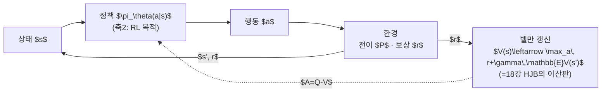
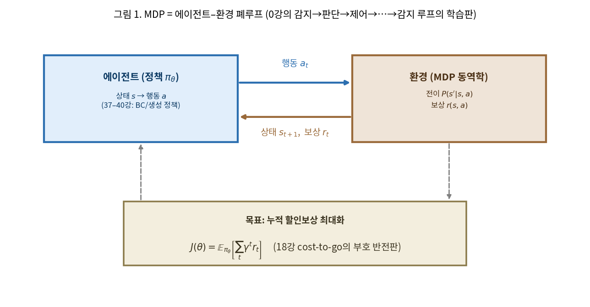
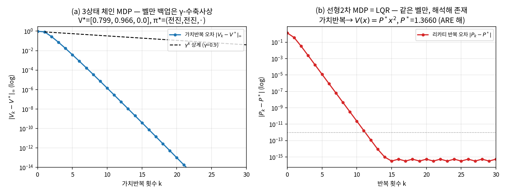
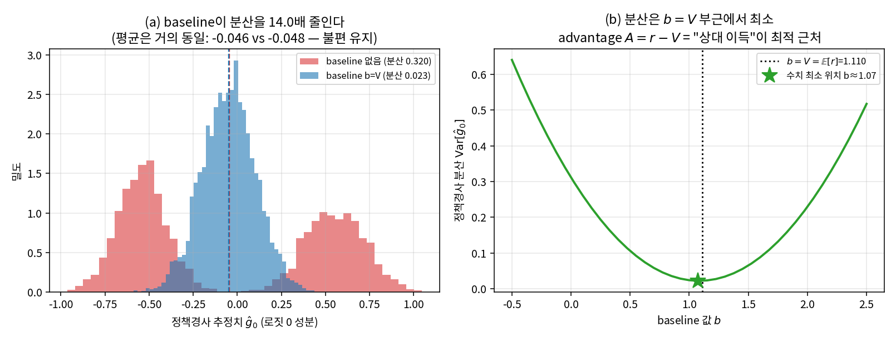
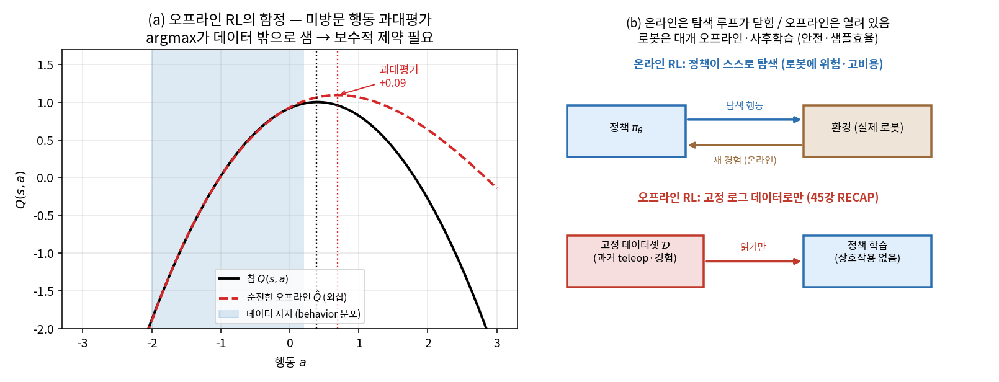

# Lec 41. 강화학습 압축 코스 — MDP·정책경사·advantage·오프라인 RL·POMDP

> 선수 지식: 26강(경사하강·역전파). 도움: 0강(정책 설계 3축), 18강(LQR·cost-to-go·벨만), 23강(MPC·receding horizon). 이 강의는 45강 RECAP을 읽기 위한 **최소 RL**이다 — 심화(온라인 알고리즘 PPO/SAC의 세부, 함수근사 수렴)는 부록 D(CS285)로 미룬다.

## 한 장 요약



강화학습은 **모델 없이 하는 최적제어**다. LQR(18강)이 "동역학을 알 때 cost-to-go를 해석적으로 푸는" 것이라면, RL은 "동역학을 모른 채 경험으로 가치함수를 추정"한다. 가치함수 $V$=−cost-to-go, 벨만=HJB의 이산판, advantage=상대 이득. 이 사전 하나로 45강 RECAP의 "advantage 조건화"가 읽힌다.

## 학습 목표

1. MDP $(S, A, P, r, \gamma)$와 가치함수 $V^\pi, Q^\pi$, 벨만 (최적)방정식을 쓰고, **LQR이 선형2차 MDP의 해석해**임을 18강의 cost-to-go 언어로 설명할 수 있다.
2. 정책경사 $\nabla_\theta J = \mathbb{E}[\nabla_\theta \log\pi_\theta\cdot A]$를 26강 경사하강의 언어로 유도하고, **baseline이 왜 분산을 줄이면서 불편성을 유지**하는지(score의 기대=0) 설명할 수 있다.
3. advantage $A = Q - V$가 "상대 이득"임을 이해하고, GAE가 편향·분산을 조절하는 손잡이임을 말할 수 있다.
4. 오프라인 RL의 핵심 난제(**분포이동·가치 과대평가**)와 보수적 처방의 필요성을, 45강 RECAP의 사후학습 맥락에서 설명할 수 있다.
5. POMDP가 "상태 대신 관측 이력/belief"로 확장된 MDP임을 알고, 로봇 관측이 왜 부분관측인지 예를 들 수 있다.
6. 가치반복 수렴·baseline 분산 감소·오프라인 과대평가를 numpy 토이로 재현하고 수치로 확인할 수 있다.

## 왜 이 강의가 필요한가

0강의 설계 3축에서 RL은 **축 2(학습 목적)**의 한 선택지였다 — BC(모방)와 나란한. 지금까지 Part 9는 축 2를 BC로(37강), 축 3(행동 표현)을 가우시안→CVAE→diffusion→flow로(38–40강) 팠다. 남은 하나가 축 2의 다른 값, RL이다. 그런데 왜 마지막에, 왜 "압축"인가?

두 가지 이유다. 첫째, **로봇 파운데이션 모델에서 RL은 온라인 알고리즘이 아니라 사후학습으로 돌아왔다.** 45강 RECAP("RL is back")은 PPO식 온라인 탐색이 아니라, 로그 데이터에 critic을 학습해 advantage로 정책을 개선하는 **오프라인** 절차다. 그것을 읽으려면 MDP·가치함수·advantage·오프라인 RL 네 단어면 충분하고, 온라인 알고리즘의 세부는 오히려 방해가 된다. 둘째, **로봇공학자에게 이 넷은 전부 이미 아는 개념의 재이름**이다. 가치함수는 cost-to-go(18강), 벨만은 HJB의 이산판(18강), 정책경사는 26강 경사하강을 정책 파라미터에 적용한 것, receding horizon 감각은 MPC(23강)와 공유된다. 이 강의는 새 이론을 쌓는 게 아니라 **여러분이 아는 최적제어를 "모델 없이·확률적으로" 다시 부르는 사전**을 만든다. 그 사전 위에서만 45강이 "누구의 어떤 실패를 고치나"로 읽힌다.

경고 하나: RL을 "BC보다 우월한 방법"으로 외우면 안 된다. 축 2의 **다른 선택**일 뿐이고, 로봇에서는 데이터·안전·샘플효율 비용 때문에 대개 BC가 먼저, RL이 사후에 얹힌다(45강). 이 강의의 흔한 오해 절이 그 균형을 잡는다.

## 본문

### 0. RL = 모델 없는 최적제어 — 지도부터

18강에서 LQR을 "가치함수가 2차식인 벨만 방정식의 해석해"로 배웠다. 그때 조건이 둘 있었다: **동역학 $A, B$를 안다**, 그리고 **비용이 2차·동역학이 선형**이라 해석해가 존재한다. RL은 이 두 조건을 모두 놓는다. 동역학을 모르고(그래서 **경험으로** 추정), 비용·동역학이 임의여서(그래서 **반복·근사로** 푼다). 나머지 뼈대 — 상태, 행동, 누적비용, 벨만 재귀 — 는 그대로다. 그래서 RL은 "제어 이론을 버린 것"이 아니라 "모델 가정을 뺀 최적제어"다.



*그림 1: MDP는 0강의 닫힌 루프(감지→판단→제어→…→감지)의 학습판이다. 에이전트(정책, 연산=파랑)가 상태 $s$에서 행동 $a$를 내고, 환경(MDP 동역학, 물리=갈색)이 전이 $P(s'|s,a)$와 보상 $r(s,a)$로 답한다. 목표는 누적 할인보상 $J(\theta)=\mathbb{E}[\sum_t \gamma^t r_t]$의 최대화 — 18강 cost-to-go 최소화의 부호 반전판이다. 이 그림은 개념도이며, 아래 E1·WE-1이 3상태 토이로 수치화한다.*

부호 하나만 조심하면 된다: 제어는 **비용을 최소화**(cost-to-go $J\downarrow$), RL은 **보상을 최대화**($V\uparrow$). $V = -J$로 부호만 뒤집으면 같은 대상이다. "가치함수는 cost-to-go와 무관하다"는 오해가 여기서 갈린다 — 부호만 다른 **같은 것**이다.

### 1. MDP와 가치함수 — 상태·행동·보상·전이

**MDP**(Markov Decision Process)는 다섯 쌍 $(S, A, P, r, \gamma)$이다: 상태 집합 $S$, 행동 집합 $A$, 전이확률 $P(s'|s,a)$, 보상 $r(s,a)$, 할인율 $\gamma\in[0,1)$. **마르코프성**은 18강 상태공간의 그 마르코프성이다 — 현재 상태 $s_t$를 알면 과거 이력은 잊어도 미래가 결정된다(다만 §5에서 이 가정이 로봇에서 자주 깨진다).

할인율 $\gamma$는 "미래를 얼마나 중히 볼까"의 손잡이다. 제어의 무한지평선 적분 $\int_0^\infty(\cdot)dt$에 대응하는 이산 합이 $\sum_t \gamma^t(\cdot)$이고, $\gamma<1$이 그 합을 유한하게 만든다(기하급수 수렴). $\gamma$는 유효 지평선 $\sim 1/(1-\gamma)$를 정한다 — $\gamma=0.9$면 대략 10스텝을 내다본다.

### 2. 벨만 방정식 = HJB의 이산판

가치반복은 벨만 최적 백업을 **수축사상**으로 반복한다. 이것이 18강에서 함수공간의 HJB를 $n\times n$ 행렬 방정식(ARE)으로 붕괴시킨 것의 "모델 없는·반복적" 버전이다.



*그림 2: (a) 3상태 체인 MDP의 가치반복 오차 $\|V_k-V^*\|_\infty$가 지수적으로 0으로 간다. 검은 파선은 수축사상 이론이 보장하는 $\gamma^k$ 상계(γ=0.9) — 실제 수렴은 이 흡수구조 덕에 더 빠르지만, **어떤 MDP도 이 $\gamma^k$ 선보다 위로 새지 않는다**는 것이 벨만 백업이 γ-수축임의 뜻이다. (b) 선형2차 MDP($x'=x+u$, 비용 $x^2+0.5u^2$)에서 리카티 반복이 이산 ARE 해석해 $P^*=1.3660$으로 수렴한다 — **가치반복의 특수케이스가 곧 LQR**이고, $V(x)=P^*x^2$가 cost-to-go다. 아래 E1·WE-1에서 코드로 생성.*

### 3. 정책경사 = 26강 경사하강을 정책 파라미터에

가치반복은 상태 몇 개짜리 표(table)에서만 실용적이다. VLA처럼 정책이 신경망 $\pi_\theta$면, 목적 $J(\theta)=\mathbb{E}_{\pi_\theta}[\sum_t\gamma^t r_t]$를 **경사하강**(26강)으로 직접 올린다. 문제는 기대값 안의 분포가 $\theta$에 의존한다는 것 — 이걸 미분 가능하게 바꾸는 것이 **로그미분 트릭**(REINFORCE)이고, 결과가 정책경사 정리다.

핵심은 **advantage로 분산을 줄이는 것**이다. 보상 $r$을 그대로 쓰면 경사 추정치의 분산이 커서 학습이 느리다(로봇에서 치명적). $r$에서 baseline $b(s)=V(s)$를 빼 **상대 이득** $A=r-V$를 쓰면, 기댓값은 그대로(불편)이고 분산만 준다.



*그림 3: 2행동 밴딧에서 정책경사 몬테카를로 추정치의 분포. (a) baseline 없이(빨강, 분산 0.320)는 보상의 큰 상수 오프셋이 통째로 실려 추정치가 넓게 퍼지지만, baseline $b=V$를 빼면(파랑, 분산 0.023) **14배** 좁아진다. 두 분포의 평균은 −0.046 vs −0.048로 거의 같다 — 분산만 줄고 편향은 안 생긴다(불편). (b) baseline 값을 스윕하면 경사 분산이 $b=V=\mathbb{E}[r]=1.11$ 부근에서 최소다 — advantage $A=r-V$가 그 최적 근처의 "상대 이득". 아래 E2·WE-2에서 코드로 생성.*

### 4. 오프라인 RL — 로봇에 결정적인 제약

온라인 RL은 정책이 환경에서 **스스로 탐색**하며 새 데이터를 모은다. 시뮬 보행(13·16강)에서는 이게 통한다 — 넘어져도 리셋 버튼 하나다. 실기 조작 로봇에서는 탐색이 곧 파손·위험·시간이라, 대개 **고정된 로그 데이터**(과거 teleop·경험)로만 학습한다. 이것이 **오프라인 RL**이고, 45강 RECAP의 자율 RL 단계가 정확히 이 부류다.

오프라인의 난제는 **분포이동**(distribution shift)이다. 데이터는 behavior 정책이 방문한 상태·행동만 덮는데, 순진한 Q학습은 벨만 백업 $\max_a \hat Q(s',a)$에서 **미방문 행동**을 평가한다. 함수근사가 그 밖에서 외삽하면 값이 크게 튀고(과대평가), 백업이 그 과대평가를 부트스트랩으로 누적해 정책이 데이터 밖 환상으로 샌다. 처방은 **보수성** — 데이터 근처로 정책·가치를 제약하는 것(CQL, IQL, AWR 등; 부록 D). 27강의 분포이동(train/test mismatch)과 같은 병이 RL에서 도지는 것이다.



*그림 4: (a) 오프라인 데이터가 행동축의 일부(파란 띠)만 덮을 때, 순진한 $\hat Q$(빨강 파선)는 데이터 안에선 참 $Q$(검정)와 겹치지만 데이터 밖에서 외삽 오차로 과대평가된다(+0.09). 그 결과 $\arg\max_a\hat Q$가 참 최적 $a^*{=}0.39$에서 데이터 밖 $0.69$로 새어 나간다 — 보수적 제약이 필요한 이유. (b) 온라인은 탐색 루프가 닫혀 새 경험을 모으지만(로봇에 위험·고비용), 오프라인은 고정 데이터셋을 읽기만 한다(45강 RECAP). 아래 E3에서 형식화.*

### 5. POMDP — 상태 대신 관측 이력

MDP는 "상태를 안다"고 가정한다. 로봇의 실제 센서는 그렇지 않다: 카메라는 가림(occlusion)이 있고, 접촉력은 못 재는 경우가 많고, 물체 뒷면은 안 보인다. 상태 $s$ 대신 부분적 **관측** $o$만 얻는 것이 **POMDP**(Partially Observable MDP)다. 해법은 두 갈래 — 관측 **이력** $o_{1:t}$를 상태 대리로 쓰거나(그래서 VLA가 이미지 여러 장·시계열을 먹는다), 상태에 대한 확률분포 **belief** $b(s)=P(s|o_{1:t})$를 유지하는 것(18강 칼만 필터가 선형가우시안 belief의 정확한 갱신이었다). action chunking(38강)이 여러 스텝을 한 번에 내는 것도, 부분관측에서 매 스텝 재추론의 노이즈를 줄이는 한 방편으로 읽을 수 있다.

### 핵심 수식

RL의 최소 뼈대는 세 수식이다: **E1** MDP·가치함수·벨만(=HJB 이산판), **E2** 정책경사·advantage(=26강 경사하강+baseline), **E3** 오프라인 목적·POMDP(=45강을 읽는 열쇠). 셋 다 이미 아는 개념의 재이름이라 유도가 짧다.

#### E1. MDP·가치함수·벨만 최적방정식 (18강 cost-to-go 회수)

**① 직관**: "상태 $s$에서 시작해 이 정책대로 갔을 때, 앞으로 받을 할인보상의 총합의 기대"가 가치함수 $V^\pi(s)$다. 상태-행동판이 $Q^\pi(s,a)$. 최적 가치는 벨만 재귀 — "지금 최선의 한 수 + 그 다음 상태의 최적 가치"로 자기 자신을 정의한다. 18강 cost-to-go("남은 최소 비용")의 부호 반전.

**② 물리·기하적 의미**: 벨만 백업 연산자 $\mathcal{T}$는 **γ-수축사상**이다 — 두 가치 추정 사이 거리를 매 적용마다 최소 $\gamma$배로 줄인다. 그래서 어떤 초기값에서 시작해도 유일한 고정점 $V^*$로 지수 수렴한다(그림 2a의 $\gamma^k$ 포락선). 이것이 18강에서 HJB(연속시간 편미분방정식)를 이산화한 형태다: 연속판 $0=\min_u[r + \nabla V^\top f]$에 2차식 가설 $V=x^\top Px$를 넣으면 ARE로 붕괴했듯이, 이산판 벨만에 선형2차를 넣으면 리카티 반복이 되고 그 고정점이 LQR 게인이다(그림 2b). **LQR = 벨만이 해석적으로 풀리는 유일한 코너.**

**③ 형식**: 정책 $\pi$의 가치함수와 벨만 방정식,

$$
V^\pi(s) = \mathbb{E}_\pi\!\left[\sum_{t=0}^\infty \gamma^t r_t \,\Big|\, s_0=s\right],
\qquad
Q^\pi(s,a) = r(s,a) + \gamma\,\mathbb{E}_{s'\sim P}\big[V^\pi(s')\big]
$$

$$
\underbrace{V^*(s) = \max_a \Big[\, r(s,a) + \gamma\,\mathbb{E}_{s'}\big[V^*(s')\big]\,\Big]}_{\text{벨만 최적방정식 (HJB 이산판)}},
\qquad
\pi^*(s) = \arg\max_a Q^*(s,a).
$$

선형2차 특수케이스 $x_{k+1}=Ax_k+Bu_k$, 비용 $x^\top Qx+u^\top Ru$에서는 $V^*(x)=x^\top P x$ 가설이 정확히 맞아, 벨만이 **이산 대수 Riccati 방정식**으로 붕괴하고 $u^*=-Kx$가 나온다(18강 E3). WE-1이 3상태 MDP의 가치반복과 이 선형2차 일치를 코드로 확인한다.

#### E2. 정책경사와 advantage — REINFORCE + baseline (26강 회수)

**① 직관**: "보상을 높인 행동의 확률은 올리고, 낮춘 행동은 내려라." 정책이 신경망이면 이 방향이 곧 $J(\theta)$의 경사다. 그대로 쓰면 분산이 커서, 각 행동에 절대보상 대신 **상대 이득**(advantage $A=Q-V$)으로 점수를 매긴다 — "평균보다 얼마나 나았나".

**② 물리·기하적 의미**: 26강 경사하강을 **정책 파라미터 $\theta$**에 적용한 것이다. score 함수 $\nabla_\theta\log\pi_\theta(a|s)$는 "이 행동의 확률을 키우는 파라미터 방향"이고, 거기에 advantage로 부호·크기를 실어 좋은 행동 쪽으로 $\theta$를 민다. **baseline의 마법**: $V(s)$를 빼도 경사의 기댓값은 안 변한다 — score의 기대가 0이기 때문($\mathbb{E}_a[\nabla_\theta\log\pi_\theta]=\sum_a\nabla_\theta\pi_\theta=\nabla_\theta 1=0$), $b(s)\,\mathbb{E}[\nabla\log\pi]=0$. 편향은 안 생기고 분산만 준다(그림 3a). 이것이 0강 fig2("같은 아키텍처, 다른 학습 목적 = 다른 gradient 벡터장")의 RL 쪽 벡터장이고, 45강 AWR의 $\exp(A/\beta)$ 가중이 여기서 자란다.

**③ 형식**: 정책경사 정리와 baseline·advantage,

$$
\nabla_\theta J(\theta) = \mathbb{E}_{\pi_\theta}\!\big[\,\nabla_\theta \log\pi_\theta(a|s)\;A^\pi(s,a)\,\big],
\qquad
A^\pi(s,a) = Q^\pi(s,a) - V^\pi(s).
$$

advantage를 한 스텝 TD 오차 $\delta_t = r_t + \gamma V(s_{t+1}) - V(s_t)$의 지수가중 합으로 추정하는 것이 **GAE**(Generalized Advantage Estimation),

$$
\hat A_t^{\text{GAE}(\gamma,\lambda)} = \sum_{l=0}^{\infty}(\gamma\lambda)^l\,\delta_{t+l},
$$

$\lambda$가 편향($\lambda{\to}0$: 저분산·고편향)과 분산($\lambda{\to}1$: 몬테카를로)을 잇는 손잡이다 — 23강 MPC의 예측지평선 길이 선택과 같은 종류의 트레이드오프(짧게 보면 편향, 길게 보면 분산). WE-2가 baseline의 분산 감소(14배)와 불편성을 수치로 확인한다.

#### E3. 오프라인 RL과 POMDP — 45강을 읽는 열쇠

**① 직관**: 온라인 RL은 정책이 스스로 새 경험을 모으지만, 로봇은 위험·비용 때문에 대개 **고정 데이터로만** 학습한다(오프라인). 그러면 데이터가 안 덮은 행동의 가치를 함수근사가 **과대평가**해 정책이 환상으로 샌다 — 그래서 "데이터 근처를 벗어나지 마라"는 **보수성** 항을 목적에 더한다. POMDP는 상태 대신 관측 이력으로 이 전부를 다시 쓴 것.

**② 물리·기하적 의미**: 분포이동은 27강의 train/test mismatch가 RL에서 도진 것이다. behavior 정책 $\pi_\beta$의 지지 밖에서 $\max_a\hat Q$를 취하면, 그 $\max$가 외삽 오차를 **골라내는** 방향이라 체계적 과대평가가 된다(그림 4a — argmax가 데이터 밖으로 샘). 보수적 방법은 두 방식으로 이를 막는다: 가치를 미방문 행동에서 눌러 내리거나(CQL), 정책을 behavior 근처로 KL 제약(AWR/AWAC — 45강 E2의 $\pi^*\propto\pi_\beta\exp(A/\beta)$가 그 닫힌 해). **RECAP의 "advantage 조건화"는 이 오프라인 정책 개선을 "조건화 토큰"으로 우회한 구현**이다 — 온라인 탐색이 없다는 점이 "돌아온 RL"의 정확한 의미(45강 흔한 오해 2).

**③ 형식**: 오프라인 목적을 "advantage 방향으로 옮기되 behavior에서 KL 반경 안"으로 놓으면(제약 정책 개선),

$$
\max_\pi\; \mathbb{E}_{s\sim\mathcal{D},\,a\sim\pi}\big[A(s,a)\big] \;-\; \beta\,\mathrm{KL}\!\big(\pi(\cdot|s)\,\|\,\pi_\beta(\cdot|s)\big),
$$

닫힌 해가 $\pi^*(a|s)\propto\pi_\beta(a|s)\exp\!\big(A(s,a)/\beta\big)$이고, 이를 데이터로 근사하면 advantage-weighted regression(45강 E2). POMDP는 상태 $s$를 관측 이력 또는 belief로 치환한 확장,

$$
b_t(s) = P\big(s \mid o_{1:t}, a_{1:t-1}\big),\qquad
\pi(a \mid o_{1:t})\ \text{또는}\ \pi(a \mid b_t),
$$

belief $b_t$는 마르코프성을 회복하는 충분통계다(18강 칼만 필터 = 선형가우시안 belief의 정확 갱신). 로봇 정책이 이미지 여러 장·시계열을 조건으로 먹는 것이 이력-조건화의 실물이다.

### Worked Example

두 예제는 위 수식을 손계산 관점 + 실행 코드로 검증한다. 전체는 `images/lec41/gen_figs.py`이고, 아래 스니펫은 그 핵심 골격이다. 모두 CPU numpy로 돈다(실제 대형 모델·GPU 없음). numpy 1.26 / scipy 1.15 기준.

#### WE-1 (코드): 3상태 MDP 가치반복 → 최적정책, 그리고 선형2차=LQR 일치

E1을 눈으로 확인한다. 0=시작, 1=중간, 2=목표(흡수)인 체인에서 전진(a=1)은 0.8 확률로 성공하고 스텝비용 −0.04가 든다. 손계산 관점의 검산: 목표에 인접한 상태 1의 최적 가치는 자기무결성 $V^*(1)=R[1,1]+\gamma(0.2\,V^*(1)+0.8\,V^*(2))$을 만족해야 한다(전진이 0.2로 제자리·0.8로 목표). $V^*(2)=0$(흡수)이므로 $V^*(1)$이 이 방정식의 고정점이다.

```python
import numpy as np
nS, nA, gamma = 3, 2, 0.9
P = np.zeros((nS, nA, nS))
P[0,0]=[1,0,0]; P[0,1]=[0.2,0.8,0]       # 상태0: 전진은 0.8로 성공
P[1,0]=[1,0,0]; P[1,1]=[0,0.2,0.8]       # 상태1: 전진은 0.8로 목표
P[2,0]=[0,0,1]; P[2,1]=[0,0,1]           # 목표 흡수
R = np.full((nS,nA), -0.04)              # 스텝비용
R[1,1] = 0.8*1.0 + 0.2*(-0.04)           # 목표 도달 기대보상 = 0.792
R[2,:] = 0.0

V = np.zeros(nS)
for k in range(60):
    Q = R + gamma * np.einsum('sap,p->sa', P, V)   # 벨만 백업
    V = Q.max(axis=1)                              # 최적 백업 max_a
pi = (R + gamma*np.einsum('sap,p->sa', P, V)).argmax(axis=1)
print("V* =", np.round(V,4).tolist())              # [0.7993, 0.9659, 0.0]
print("π* =", pi.tolist(), "(0=머무름, 1=전진)")   # [1, 1, 0]

# 손 검산: V*(1) = R[1,1] + γ·(0.2·V*(1) + 0.8·V*(2))  자기무결성
lhs = R[1,1] + gamma*(0.2*V[1] + 0.8*V[2])
print(f"V*(1) 자기무결성: {lhs:.4f} == {V[1]:.4f}")  # 0.9659 == 0.9659
```

출력: $V^*=[0.799, 0.966, 0]$, 최적정책은 두 상태 모두 **전진**. 자기무결성 검산이 $0.9659=0.9659$로 맞는다 — 벨만 방정식은 "가치가 자기 자신을 정의하는 고정점"임을 이 한 줄이 보인다. 오차 $\|V_k-V^*\|_\infty$는 $k{=}10$에서 $1.4\times10^{-6}$, $k{=}20$에서 $10^{-13}$로 지수 수렴한다(그림 2a).

같은 벨만이 **선형2차에서 해석해**가 된다. $x_{k+1}=x_k+u_k$, 비용 $x^2+0.5u^2$의 리카티 반복은 이산 ARE의 해로 수렴한다:

```python
from scipy.linalg import solve_discrete_are
a, b, q, r = 1.0, 1.0, 1.0, 0.5
P_ = 0.0
for k in range(40):
    P_ = q + a**2*P_ - (a*b*P_)**2/(r + b**2*P_)     # 리카티 반복 = 벨만 백업
P_are = solve_discrete_are([[a]],[[b]],[[q]],[[r]])[0,0]
K = (b*P_are)/(r + b**2*P_are)                        # 최적게인 u=-Kx
print(f"리카티 반복 P={P_:.6f} == ARE 해 P*={P_are:.6f}")  # 1.366025 == 1.366025
print(f"최적게인 K={K:.6f},  V(x)=P*·x² = cost-to-go")     # 0.732051
```

$P^*=1.366025$로 정확히 일치하고, 게인 $K=0.732051$. **가치반복의 특수케이스가 곧 LQR**이고 $V(x)=P^*x^2$가 18강의 cost-to-go다(그림 2b). "가치함수는 cost-to-go와 무관하다"는 오해를 이 등식이 정면으로 부순다.

#### WE-2 (손계산 + 코드): REINFORCE with baseline — advantage가 분산을 줄인다

E2를 확인한다. 2행동 밴딧(참 기대보상 $\mu=[1.0, 1.2]$, 소프트맥스 정책 $\pi$)에서 정책경사 몬테카를로 추정치의 분산을 baseline 유/무로 비교한다. 손계산 관점의 예측: 보상 $r$은 큰 상수 오프셋($\sim1.1$)을 갖는데, 그게 통째로 경사에 실리면 분산이 크다. baseline $b=V=\mathbb{E}[r]$를 빼면 그 오프셋이 상쇄돼 분산이 준다 — 그런데 **평균은 안 변한다**($b\cdot\mathbb{E}[\nabla\log\pi]=b\cdot 0=0$).

```python
import numpy as np
mu = np.array([1.0, 1.2]); noise_sd = 0.3
z = np.array([0.0, 0.2]); pi = np.exp(z)/np.exp(z).sum()
def sample_grad(use_baseline, b, rng):
    a = rng.choice(2, p=pi)
    r = mu[a] + noise_sd*rng.standard_normal()
    dlog = -pi.copy(); dlog[a] += 1.0              # ∇_z logπ(a) = e_a − π (score)
    adv = (r - b) if use_baseline else r
    return adv * dlog
b_V = float((pi*mu).sum())                          # baseline = V = E[r] = 1.11
rng = np.random.default_rng(0)
g0 = np.array([sample_grad(False, 0.0, rng) for _ in range(4000)])
rng = np.random.default_rng(0)                      # 같은 표본 경로 (공정 비교)
g1 = np.array([sample_grad(True, b_V, rng) for _ in range(4000)])
print(f"baseline b=V = {b_V:.4f}")                              # 1.1100
print(f"분산 없음 {g0[:,0].var():.4f} vs b=V {g1[:,0].var():.4f}"
      f" → {g0[:,0].var()/g1[:,0].var():.1f}배")                # 0.3197 vs 0.0228 → 14.0배
print(f"평균 없음 {g0[:,0].mean():+.4f} vs b=V {g1[:,0].mean():+.4f}")  # -0.0456 vs -0.0481 (불편)
```

출력: baseline이 경사 분산을 **0.320 → 0.023(14배)** 줄이는데, 평균은 −0.046 vs −0.048로 거의 같다(불편). score 함수의 기대가 0($\mathbb{E}_a[\nabla_z\log\pi]=\pi-\pi=0$)이라 baseline 항이 기댓값에서 사라지기 때문이다 — 그래서 advantage는 "공짜 분산 감소"다. baseline 값을 스윕하면 분산이 $b=V=1.11$ 부근에서 최소다(그림 3b). 이것이 45강 RECAP이 advantage로 정책을 개선하는 통계적 근거다.

### 로봇공학자를 위한 번역

- **가치함수 = cost-to-go(18강)**, 부호만 반대. $V=-J$. "이 상태에서 남은 (음의) 비용의 기대". LQR의 $x^\top Px$가 정확히 이것이다.
- **벨만 방정식 = HJB의 이산판(18강)**. 연속시간 $0=\min_u[r+\nabla V^\top f]$의 이산·확률판. 선형2차에서 ARE로 붕괴하는 그 방정식.
- **정책경사 = 26강 경사하강**을 정책 파라미터 $\theta$에 적용한 것. advantage는 손실의 부호·크기를 정하는 가중, baseline은 그 가중의 원점(reference).
- **advantage = 상대 이득**. 절대 성능이 아니라 "평균 대비 얼마나". 적응 제어에서 공칭 대비 오차를 보는 감각, 혹은 MPC 비용의 차분(어느 행동이 비용을 더 깎나)과 통한다.
- **오프라인 RL = 시스템 식별 후 오프라인 최적화**의 학습판. 로그 데이터에서 critic(≈학습된 가치모델)을 맞추고 그 위에서 정책을 개선하되, 데이터 밖 외삽을 불신(보수성)하는 것 — 모델 불확실성이 큰 영역을 피하는 로버스트 제어의 감각.
- **POMDP = 상태추정이 필요한 제어**. 칼만 필터(18강)로 belief를 유지하는 그 구도. VLA가 이미지 여러 장·시계열을 먹는 것이 이력-조건화 정책이다.

## 흔한 오해

1. **"RL이 모방(BC)보다 항상 낫다"** — 아니다. 0강 축 2의 **다른 선택**일 뿐, 우열이 아니다. RL은 보상 설계·탐색 데이터·안전 비용을 요구하고, 로봇에서는 그 비용이 크다. 그래서 필드 표준은 "BC로 먼저 능력을 얻고, RL은 사후에 신뢰성을 얹는다"(45강 RECAP: 시연→보정→오프라인 RL). "RL로 간다 vs BC로 간다"는 애초에 같은 축의 값 비교이지 승부가 아니다 — 올바른 질문은 "BC만으로 충분한가, RL 신호를 더할 가치가 있는가".
2. **"오프라인 RL = BC다"** — 아니다. BC는 데이터의 행동을 그대로 흉내 내지만(로그우도 최대화), 오프라인 RL은 **가치를 최적화**한다 — 데이터에 섞인 좋은/나쁜 행동을 advantage로 구별해 좋은 쪽으로 분포를 옮기고(45강 E2), 동시에 분포이동·과대평가를 **보수성**으로 처리한다(E3, 그림 4). 데이터가 전부 전문가면 둘이 가까워지지만, 데이터에 실수가 섞이면 오프라인 RL이 BC를 넘는다. "advantage로 좋은 것만 골라 모방"이 정확한 그림이다.
3. **"advantage = 보상이다"** — 아니다. advantage는 $A=Q-V$, **상대 이득**이다. baseline $V$를 빼서 "평균보다 얼마나 나았나"를 재고(E2·WE-2), 그 차감이 경사 분산을 14배 줄인다(그림 3). 절대보상을 그대로 쓰면 큰 상수 오프셋이 통째로 분산이 되어 학습이 느려진다. advantage는 보상이 아니라 **보상에서 기준선을 뺀 것**이다.
4. **"RL은 로봇에 바로 온라인으로 쓴다"** — 대개 아니다. 온라인 탐색은 실기에서 위험·고비용이라, 시뮬(13·16강 보행)이 아닌 실기 조작은 **오프라인·사후학습**이 표준이다(그림 4b, 45강). "RL is back"의 RL조차 온라인 탐색이 아니라 로그 데이터의 오프라인 정책 추출이다. 샘플효율과 안전이 온라인 RL을 실기에서 막는 두 벽이다.
5. **"가치함수는 cost-to-go와 무관한 딥러닝 개념이다"** — 부호만 다른 **같은 것**이다(18강). $V=-J$. LQR의 $V(x)=x^\top Px$가 바로 가치함수이고, WE-1에서 가치반복의 선형2차 특수케이스가 ARE 해 $P^*=1.366$과 정확히 일치했다. 벨만은 HJB의 이산판이다. RL은 새 이론이 아니라 "모델 없이·확률적으로 부른 최적제어"다.

## 실습 (1.5~2h, GPU 불필요 — CPU numpy)

**A. 가치반복 확장 (40분).** `python3 images/lec41/gen_figs.py`를 실행해 네 그림을 재현한 뒤 WE-1을 손으로 확장한다: (a) 상태를 5개로 늘린 체인에서 $\gamma$를 0.5/0.9/0.99로 바꿔 유효 지평선 $1/(1-\gamma)$이 수렴 속도와 최적정책에 어떻게 작용하는지 본다. (b) 목표 보상을 스텝비용 대비 낮추면(예: +0.1) 어느 순간 "전진할 가치가 없어져" 정책이 머무름으로 바뀌는 문턱을 찾는다 — 보상 설계가 정책을 결정함을 체감. (c) 선형2차 리카티 반복에서 $r/q$ 비를 바꿔 게인 $K$와 $P^*$가 어떻게 변하는지(18강 Q,R 가격표) 확인.

**B. advantage baseline 실험 (40분).** WE-2에서 (a) 보상 오프셋을 $\mu=[10.0, 10.2]$로 키우면 baseline 없는 분산이 얼마나 폭발하고 baseline 있는 분산은 왜 그대로인지 본다(상수 오프셋이 전부 baseline으로 흡수됨). (b) baseline을 $V$가 아닌 임의 상수로 두면 불편성은 유지되나 분산은 커지는 것을 확인(그림 3b 곡선의 다른 지점). (c) 행동을 3개로 늘려 advantage 부호에 따라 확률이 오르내리는 것을 몇 스텝 경사상승으로 관찰.

**C. (선택) 오프라인 과대평가 (20분).** 그림 4의 `Q_hat` 다항 차수를 3/4/5로 바꿔 외삽 발산과 argmax 누출이 어떻게 심해지는지 본다. "데이터 지지를 넓히면(파란 띠 확장) 과대평가가 어떻게 줄어드는가"를 45강의 보수적 방법 필요성과 연결해 Claude와 토론.

> LeRobot·PyTorch로 실제 오프라인 RL을 돌리는 것은 56강(실습 통합)의 몫이다. 이 강의의 코드는 개념 재현용 순수 numpy 토이다 — 수치 주장은 여기서만 한다.

## Claude와 토론할 질문

1. LQR(18강)과 일반 RL의 관계를 "무엇을 가정하고 무엇을 놓았나"로 정리하라. 동역학을 알면 왜 해석해가 생기고, 모르면 왜 반복·근사가 필요한가?
2. baseline이 경사의 분산을 줄이면서 평균을 안 바꾸는 것을 score 함수의 기대(=0)로 설명하라. 왜 $b=V$가 (거의) 최적 baseline인가? (그림 3b)
3. GAE의 $\lambda$와 MPC(23강)의 예측지평선 $N$은 어떤 공통 트레이드오프를 조절하는가? 짧게/길게 볼 때 각각 무엇을 얻고 잃는가?
4. 오프라인 RL의 과대평가(그림 4a)는 27강의 분포이동, 37강의 compounding error와 각각 어떻게 같고 다른가? 셋을 한 문장으로 잇는다면?
5. "RL is back"(45강)에서 돌아온 RL은 이 강의의 어느 부분(온라인 정책경사? 오프라인 advantage?)인가? 온라인 탐색이 없다는 것이 왜 실기에서 결정적인가?
6. POMDP에서 belief를 유지하는 것(칼만, 18강)과 관측 이력을 통째로 먹는 것(VLA의 이미지 시퀀스) 중 무엇이 언제 유리한가? action chunking(38강)은 부분관측과 어떻게 관계되는가?
7. 보상 설계는 왜 어려운가? 실습 A(b)에서 목표 보상을 낮추자 정책이 뒤집힌 것을, "잘못 설계된 보상이 낳는 의도치 않은 최적정책"(reward hacking)의 최소 예로 확장해 보라.

## 읽을거리

1. **Sutton & Barto, *RL: An Introduction* 2판 — Ch.3(MDP)·Ch.4(DP/가치반복)·Ch.13(정책경사)만** (~60분, 무료). 이 강의의 E1·E2 전부가 이 세 장에 있다. 나머지 장은 부록 D에서.
2. **Levine et al., "Offline RL" 튜토리얼(arXiv:2005.01643) §1–3만** (~30분): 분포이동·과대평가(E3·그림 4)의 표준 설명. 알고리즘 세부(CQL/IQL)는 부록 D로.
3. (선택) **CS285(Levine) L4–6, L15–16** — 부록 D의 심화 트랙. 여기서는 강의 슬라이드 목차만 훑어 "무엇이 더 있는지" 지도만 얻으면 된다.

## 자가 점검

1. MDP $(S,A,P,r,\gamma)$와 $V^\pi, Q^\pi$, 벨만 최적방정식을 안 보고 쓰고, "LQR = 선형2차 MDP의 해석해"를 18강 cost-to-go로 설명할 수 있는가?
2. 정책경사 $\nabla_\theta J=\mathbb{E}[\nabla\log\pi_\theta\cdot A]$를 26강 경사하강의 언어로 유도하고, baseline이 왜 불편·저분산인지(score 기대=0) 말할 수 있는가?
3. advantage $A=Q-V$가 "상대 이득"임을, WE-2의 분산 14배 감소로 설명할 수 있는가? "advantage=보상" 오해를 반박할 수 있는가?
4. 오프라인 RL의 분포이동·과대평가(그림 4a)와 보수성의 필요를 설명하고, "오프라인 RL=BC" 오해를 반박할 수 있는가?
5. POMDP가 무엇이며(상태→관측 이력/belief), 로봇 관측이 왜 부분관측인지 예를 들 수 있는가? 칼만 필터(18강)와의 연결은?
6. 가치반복이 γ-수축이라 유일 고정점으로 수렴함을(그림 2a의 $\gamma^k$ 상계), 그리고 선형2차에서 리카티 반복이 ARE 해 $P^*=1.366$으로 수렴함을(WE-1) 재현·설명할 수 있는가?
7. 이 강의의 네 개념(MDP·정책경사·advantage·오프라인 RL)이 45강 RECAP의 어느 부분을 읽는 데 각각 쓰이는지 짚을 수 있는가?

## 참고문헌

> 본문 수치·주장의 출처. 웹 문서는 2026-07-09 접속 기준. (2차) = 언론·블로그 등 2차 출처.

[1] R. S. Sutton, A. G. Barto, "Reinforcement Learning: An Introduction," 2nd ed., MIT Press, 2018. 무료: http://incompleteideas.net/book/the-book.html
— **뒷받침**: MDP·가치함수·벨만 최적방정식(E1), 가치반복의 γ-수축·수렴(그림 2a), 정책경사 정리와 baseline/advantage(E2), REINFORCE. Ch.3·4·13이 이 강의의 뼈대.

[2] J. Schulman, F. Wolski, P. Dhariwal, A. Radford, O. Klimov, "Proximal Policy Optimization Algorithms," arXiv:1707.06347, 2017.7. https://arxiv.org/abs/1707.06347
— **뒷받침**: 정책경사의 실용적 온라인 알고리즘(clip 목적), advantage 기반 정책 개선. 45강의 "온라인 PPO식 vs 오프라인 조건화" 대비의 한 축(본 강의는 세부를 부록 D로 미룸).

[3] J. Schulman, P. Moritz, S. Levine, M. Jordan, P. Abbeel, "High-Dimensional Continuous Control Using Generalized Advantage Estimation," arXiv:1506.02438, 2015.6. https://arxiv.org/abs/1506.02438
— **뒷받침**: GAE의 $\lambda$가 advantage 추정의 편향·분산을 조절(E2). TD 오차 $\delta_t$의 지수가중 합.

[4] S. Levine, A. Kumar, G. Tucker, J. Fu, "Offline Reinforcement Learning: Tutorial, Review, and Perspectives on Open Problems," arXiv:2005.01643, 2020.5. https://arxiv.org/abs/2005.01643
— **뒷받침**: 오프라인 RL의 분포이동·가치 과대평가(E3·그림 4), 보수적 방법의 필요. 45강 RECAP 오프라인 사후학습의 배경 이론.

[5] Physical Intelligence, "π*0.6: a VLA That Learns From Experience" (RECAP), arXiv:2511.14759, 2025.11. https://arxiv.org/abs/2511.14759
— **뒷받침**: 이 강의가 읽기 위한 최소 목표물 — RECAP 3단계(시연/보정/오프라인 자율 RL)와 advantage 조건화. "RL is back"이 온라인 탐색이 아니라 오프라인 정책 추출임(흔한 오해 4·5). 수치는 45강에서 회사 발표로 인용.

[6] K. Lynch, F. Park, "Modern Robotics," Cambridge Univ. Press. 무료 PDF: https://hades.mech.northwestern.edu/images/7/7f/MR.pdf
— **뒷받침**: 로봇공학자를 위한 번역의 최적제어 배경(cost-to-go·HJB·상태추정)의 표준 참고. LQR·칼만의 정식화는 18강.

*수치 재현성: 본문·그림의 모든 numpy 토이 수치는 `images/lec41/gen_figs.py`와 본문 코드 블록의 실행 출력이다. 구체적으로 — (E1·WE-1·그림 2) 3상태 MDP 가치반복 $V^*=[0.799, 0.966, 0]$·최적정책 (전진,전진,·)·오차 $k{=}20$에서 $10^{-13}$, 선형2차 리카티 반복이 이산 ARE 해 $P^*=1.366025$(게인 $K=0.732051$)로 수렴; (E2·WE-2·그림 3) baseline이 정책경사 분산을 0.320→0.023(14배) 줄이고 평균은 −0.046 vs −0.048로 불편 유지, 분산최소 baseline이 $b=V=1.11$ 부근; (E3·그림 4) 순진한 오프라인 $\hat Q$가 미방문 행동을 +0.09 과대평가해 argmax가 참 최적 $a^*{=}0.39$에서 데이터 밖 $0.69$로 누출. numpy 1.26 / scipy 1.15 / matplotlib 3.5 기준 재현 확인. **이 토이는 개념 재현용 CPU 시뮬레이션이며 실제 대형 모델·GPU가 아니다** — RECAP 등 실모델 수치는 [5] 및 45강.*
