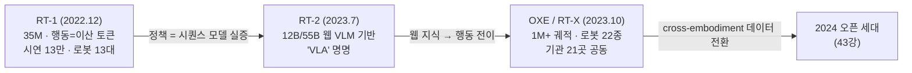
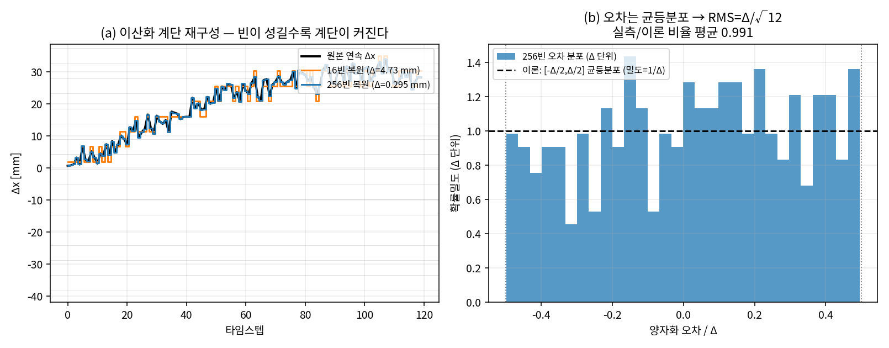
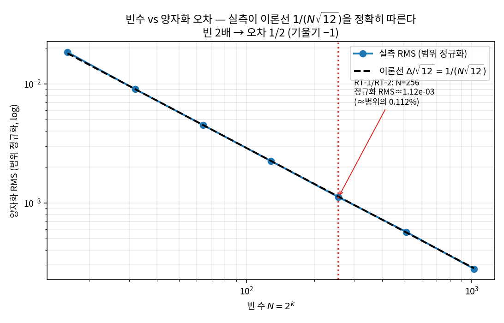
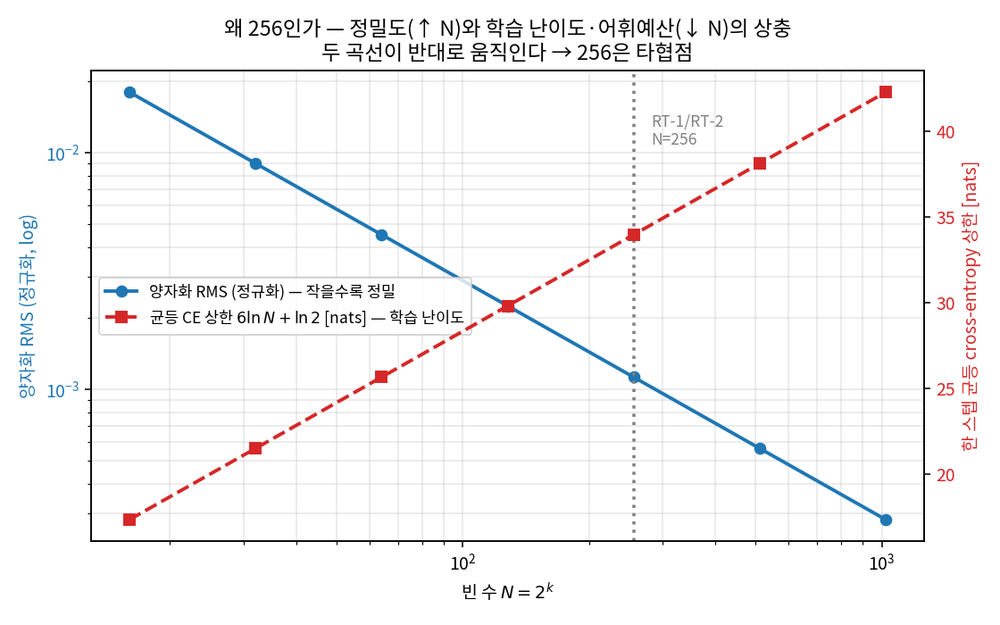
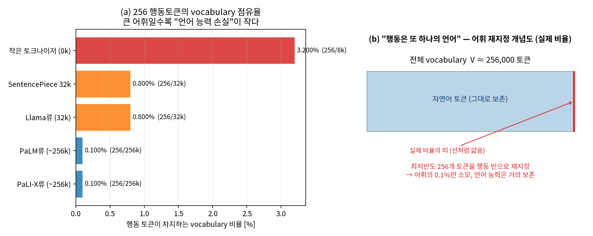

# Lec 42. VLA의 탄생 (2022-23) — RT-1, RT-2, 그리고 데이터 전환

> Part 5 첫 강의. 선수 지식: Part 2-3(Transformer·VLM), Part 4(모방학습). 두 갈래가 여기서 합류한다.
> 이 강의부터 47강까지는 "모델의 역사"가 아니라 **"각 모델이 어떤 실패를 고치려 했는가"의 역사**로 읽는다.

## 한 장 요약



## 학습 목표

1. RT-1이 실증한 명제("하나의 transformer 정책이 실로봇 멀티태스크를 감당한다")와 그 한계를 설명할 수 있다.
2. RT-2의 핵심 발상 — 행동을 텍스트 토큰처럼 취급해 웹 사전학습 VLM을 로봇 정책으로 전환 — 을 도식으로 그릴 수 있다.
3. "웹 지식 전이"가 구체적으로 어떤 능력으로 나타나는지 사례를 들 수 있다.
4. OXE/RT-X가 필드의 데이터 경제를 어떻게 바꿨는지 설명할 수 있다.

## 왜 이 강의가 필요한가

2022년까지 로봇 학습의 상식은 "태스크 하나 = 정책 하나"였다. 37강에서 본 BC의 한계에다, 정책 아키텍처도 태스크별 맞춤이었다. 같은 시기 NLP에서는 GPT-3가 "하나의 큰 시퀀스 모델 + 대량 데이터"로 태스크 경계를 지워버렸다. Google 로봇팀의 질문은 단순했다: **로봇에서도 되는가?**

## 본문

### 1. RT-1 — "정책은 시퀀스 모델이다"의 실증 (2022.12)

- **구조**: EfficientNet(이미지) + TokenLearner(토큰 압축) + decoder transformer. **35M 파라미터** — 오늘 기준으로 초소형이다.
- **행동 표현**: 각 차원을 256개 빈으로 이산화한 토큰 (50강에서 상세히 다룰 그 방식의 원조).
- **데이터**: 17개월 동안 로봇 13대로 **~13만 시연** 수집. 이 수집 비용 자체가 논문의 절반이다.
- **의미**: 700여 태스크를 하나의 정책으로, 실로봇에서, 새 태스크·배경에 일정한 일반화까지. "스케일된 모방학습"의 첫 실증.
- **한계**: 언어 이해가 얕고, 훈련 데이터에 없는 물체·개념 앞에서는 무너진다. 당연하다 — **웹을 모르는 모델**이니까.

### 2. RT-2 — VLA의 명명 (2023.7)

발상의 전환: 로봇 정책을 바닥부터 만들지 말고, **이미 웹을 아는 VLM에게 행동이라는 새 언어를 가르치자.**

- **방법**: PaLI-X(55B)/PaLM-E(12B)를 웹 VQA 데이터와 로봇 시연 데이터로 **co-fine-tuning**. 행동은 RT-1식 256빈 이산값을 텍스트 토큰 문자열로 출력 — 모델 입장에서 행동은 그저 또 하나의 "언어"다 (29강의 복선 회수).
- **결과**: 훈련 데이터에 없는 물체 조작, 아이콘·기호 이해, 초보적 추론("멸종한 동물을 집어" → 공룡 인형 선택) 같은 **창발적 일반화**. 이것이 로봇 데이터가 아니라 웹 사전학습에서 온 것임이 요점이다.
- **대가**: 55B는 로봇에 못 싣는다 — 클라우드 멀티 TPU 서빙으로 **1~3Hz** (50강에서 볼 주기 계층의 역사적 극단). 그리고 비공개.
- 이 논문이 **"Vision-Language-Action model"**이라는 용어를 만들었다.

### 3. "웹 지식 전이"의 실체

막연한 구호가 아니라 세 가지 측정 가능한 능력이다:
① 훈련에 없던 물체·카테고리의 zero-shot 인식 ("피카츄 집어" 류의 시연),
② 지시 패러프레이즈 강건성 (같은 뜻, 다른 문장),
③ 공간관계 언어 ("컵 왼쪽의", "가장 큰").
셋 다 이미지-텍스트 사전학습에서 상속된 것이고, 로봇 전용 데이터에는 없다. 이후 VLA 논문의 "일반화" 주장 중 웹 지식에 기대는 부분은 대부분 이 세 축의 변주다.

### 4. OXE / RT-X — 모델이 아니라 데이터 운동 (2023.10)

- 기관 21곳이 데이터셋 60개를 모아 **1M+ 궤적, 로봇 22종**을 RLDS 포맷으로 통일 (55강에서 상세).
- RT-1-X/RT-2-X 실험의 발견: **cross-embodiment 혼합 데이터로 co-training하면 자기 로봇 데이터만 쓴 전문 정책보다 ~50% 좋아진다** (RT-1-X, 소규모 데이터 도메인 기준 — 대규모 데이터 도메인에서는 RT-2-X급 용량이 있어야 이점이 났다). 다른 로봇의 데이터가 내 로봇에 도움이 된다는, 당시로선 비직관적인 결과.
- 의미: "내 로봇 데이터만으로"의 종말. 이후 Octo·OpenVLA·π0의 사전학습 코퍼스가 전부 OXE(+자체 데이터)다.

### 5. 2023년 말의 상태 — 남겨진 세 가지 문제

① RT-2는 비공개다 → 오픈 재현 운동 (43강).
② 이산 AR 토큰은 느리고(1~3Hz) 정밀 조작에 부족하다 → 연속 액션 헤드 (39-40강의 기술이 43강 Octo의 디퓨전 헤드를 시작으로 44강 π0에서 본격 투입된다).
③ 데이터가 여전히 병목이다 → 합성·영상 데이터 (46강), 커뮤니티 수집 (47강).
Part 5의 나머지는 이 세 문제가 풀려가는 이야기다.

### 핵심 수식

RT-1이 발명하고 RT-2가 물려받은 "행동 = 이산 토큰"이라는 발상은, 겉보기엔 공학적 편의처럼 보이지만 세 개의 정량적 명제 위에 서 있다. 각각을 3단으로 짚는다 — 이 셋이 이 강의 전체의 수치적 골격이고, 아래 Worked Example에서 numpy로 재현된다.

#### E1. 균일 이산화·역이산화와 양자화 오차 $\mathrm{RMS} = \Delta/\sqrt{12}$

**① 직관.** 연속적인 행동 값(예: ΔEEF의 Δx = 3.7 mm)을 256개의 서랍 중 하나에 넣는다. 나중에 서랍 번호(토큰)만 보고 값을 복원하면, 서랍 안 어디에 있었는지는 잃어버린다 — 서랍 폭 $\Delta$의 절반만큼이 최대 오차다. 이것이 RT-1/RT-2가 행동을 토큰으로 만들 때 치르는 유일한, 그러나 피할 수 없는 정보 손실이다. 아래 "로봇공학자를 위한 번역"에서 짚듯 **ADC 양자화와 글자 그대로 같은 수학**이다(50강에서 다시).

**② 물리·기하적 의미.** 차원별 범위 $[\text{lo}, \text{hi}]$를 $N$등분하면 빈 폭은 $\Delta = (\text{hi}-\text{lo})/N$. 값이 빈 안에서 균등하게 분포한다고 보면, 복원 오차 $\epsilon = \hat x - x$는 구간 $[-\Delta/2, +\Delta/2]$ 위의 **균등분포**다. 균등분포의 표준편차가 곧 오차 RMS이고, 그 값이 $\Delta/\sqrt{12}$다 — 실효 제어 분해능의 상한이다. 요점은 **빈 수 $N$을 2배로 늘리면 $\Delta$가 반이 되어 오차도 정확히 반**이라는 것($\mathrm{RMS} \propto 1/N$). 256빈은 "8비트"라는 뜻이고, 자연어 vocabulary에 값싸게 얹을 수 있는 크기(E3)와 정밀도 사이의 타협점이다.

**③ 형식(유도 요점).** 이산화·역이산화는
$$
k = \mathrm{clip}\!\left(\left\lfloor \frac{x - \text{lo}}{\Delta} \right\rfloor,\, 0,\, N-1\right), \qquad
\hat x = \text{lo} + \left(k + \tfrac{1}{2}\right)\Delta \quad (\text{빈 중앙 복원, mid-rise}).
$$
오차 $\epsilon \sim \mathrm{Uniform}[-\Delta/2, \Delta/2]$이면
$$
\mathrm{RMS}(\epsilon) = \sqrt{\mathbb{E}[\epsilon^2]} = \sqrt{\frac{1}{\Delta}\int_{-\Delta/2}^{\Delta/2} \epsilon^2\, d\epsilon} = \sqrt{\frac{\Delta^2}{12}} = \frac{\Delta}{\sqrt{12}}.
$$
$\sqrt{12}\approx 3.464$이라는 상수가 모든 균일 양자화기의 성능을 지배한다. (전제: 신호가 여러 빈에 걸쳐 매끄럽게 변할 것 — 신호가 한 빈 안에 갇히거나 계단형 이산 신호[그리퍼 0/1]이면 이 공식은 과대추정이 된다. WE에서 그리퍼 차원이 이 예외를 보여준다.)

#### E2. Autoregressive 행동 토큰 생성과 cross-entropy

**① 직관.** RT-2는 7차원 행동을 "7개 토큰의 문장"으로 출력한다 — `Δx빈 Δy빈 … yaw빈 grip빈`. 이것을 언어모델이 다음 단어 예측하듯 왼쪽에서 오른쪽으로 한 토큰씩 뽑는다(autoregressive). 훈련 신호는 정확히 LLM과 같다: **정답 빈에 높은 확률을 주도록 하는 cross-entropy loss**. 그래서 웹 텍스트로 학습한 손실함수·옵티마이저·아키텍처를 한 줄도 안 바꾸고 행동 학습에 재사용할 수 있다 — 이것이 "행동은 또 하나의 언어"의 기계적 실체다(29강의 복선 회수).

**② 물리·기하적 의미.** 한 스텝의 행동 확률은 토큰들의 곱으로 분해된다(체인 룰). 완벽히 맞히면 loss는 0, 아무 정보 없이 256개 빈에 균등하게 찍으면 토큰당 loss는 $\ln 256$. 그래서 **perplexity(= $e^{\text{토큰당 loss}}$)가 "모델이 몇 개의 빈 중에서 헷갈리고 있는가"의 실효 후보 수**를 준다: 균등 예측이면 정확히 256, 정답빈에 0.6을 몰아주면 약 1.67로 떨어진다. 행동 학습의 어려움이 언어 모델의 어휘 크기 문제로 번역되는 것이다.

**③ 형식(유도 요점).** 행동 $a$를 토큰열 $(k_1, \dots, k_D)$로 쓰면
$$
p_\theta(a \mid z) = \prod_{j=1}^{D} p_\theta(k_j \mid k_{<j},\, z), \qquad
\mathcal{L}_{\mathrm{CE}} = -\sum_{j=1}^{D} \ln p_\theta\!\left(k_j^\star \mid k_{<j}^\star,\, z\right).
$$
$D$개 토큰 중 연속 6차원은 $N=256$빈, 그리퍼는 2빈이므로, **균등 예측의 한 스텝 loss 상한**은
$$
\mathcal{L}_{\text{uniform}} = 6\ln 256 + \ln 2 \approx 33.27 + 0.69 = 33.96\ \text{nats}.
$$
이 상한이 클수록(빈이 많을수록·차원이 많을수록) 학습이 어렵다 — E1의 정밀도(큰 $N$이 좋다)와 E2의 학습 난이도(큰 $N$이 나쁘다)가 **정반대 방향으로 당기는 것**이 256이라는 선택의 본질이다.

#### E3. Cross-embodiment 향상의 조건 (RT-1-X ~50%)

**① 직관.** OXE/RT-X의 반직관적 발견: **다른 로봇들의 데이터를 섞어 함께 훈련하면 내 로봇 성능이 오른다.** 하지만 항상은 아니다 — RT-1-X의 ~50% 향상은 "소규모 데이터 도메인"에서만 났고, 데이터가 많은 도메인에서는 RT-2-X급 큰 용량이 있어야 이점이 났다[3]. 왜 조건부인가를 bias-variance로 설명한다.

**② 물리·기하적 의미.** 내 데이터만 쓰는 전문가 정책은 편향은 없지만(내 분포에 딱 맞음) 데이터가 적어 **분산**이 크다. 다른 로봇 데이터를 섞으면 유효 표본이 늘어 분산은 줄지만, 도메인 갭(다른 몸·다른 카메라)이 **편향**을 더한다. 순이득은 "분산이 준 양 $-$ 편향이 는 양". 내 데이터 $n_{\text{self}}$가 적을 때는 분산 항이 지배적이라 섞는 게 크게 이득이고, $n_{\text{self}}$가 충분히 크면 분산은 이미 작아 편향만 손해로 남는다 — **손익분기점**이 존재한다. "소규모에서만 50%"라는 논문의 단서가 정확히 이 부등식이다.

**③ 형식(유도 요점).** 전문가와 혼합의 기대 오차를 각각
$$
\mathcal{E}_{\text{spec}} \approx \frac{c_v}{n_{\text{self}}}, \qquad
\mathcal{E}_{\text{mix}} \approx \frac{c_v}{n_{\text{self}} + n_{\text{other}}} + b^2
$$
로 놓으면(분산 $\propto 1/n$, $b^2$ = 도메인 갭 편향), **혼합이 이득일 조건**은
$$
\underbrace{\frac{c_v}{n_{\text{self}}} - \frac{c_v}{n_{\text{self}} + n_{\text{other}}}}_{\text{분산 감소}} \;>\; \underbrace{b^2}_{\text{편향 증가}}.
$$
좌변은 $n_{\text{self}}$가 작을수록 크다 → 소규모 도메인에서 성립하기 쉽다. WE에서 이 부등식이 소규모($n_{\text{self}}$ 작음)에서 ~50%대 이득, 대규모에서 손해로 뒤집히는 것을 수치로 확인한다. (이 토이는 향상의 *방향과 조건*을 재현하는 것이지 논문의 절대 수치[3]를 유도하는 것이 아니다 — 인용 수치는 [3].)

### Worked Example

#### WE-1 (손계산 관점): 한 값의 이산화와 실효 분해능

RT-2식 ΔEEF의 Δx 차원이 $[-40, +40]$ mm 범위를 갖고 256빈으로 쪼갠다고 하자. 빈 폭은 $\Delta = 80/256 = 0.3125$ mm. 실제 명령 $x = 3.70$ mm를 이산화하면
$$
k = \left\lfloor \frac{3.70 - (-40)}{0.3125} \right\rfloor = \lfloor 139.84 \rfloor = 139, \qquad
\hat x = -40 + (139 + 0.5)\times 0.3125 = 3.594\ \text{mm}.
$$
복원 오차는 $3.594 - 3.70 = -0.106$ mm — 최악의 경우 $\Delta/2 = 0.156$ mm 이내다. 궤적 전체로 평균하면 오차 RMS는 $\Delta/\sqrt{12} = 0.3125/3.464 = 0.0902$ mm. **읽는 법**: 256빈은 ΔEEF 한 스텝에 0.1 mm 남짓의 분해능을 준다 — 물건을 집는 대충의 조작엔 충분하지만, 커넥터 삽입(50강의 정밀 조립)처럼 서브밀리미터 반복정밀도가 필요한 태스크에서는 이 양자화가 병목이 된다(토론 질문 3). 빈을 4배(1024)로 늘리면 분해능은 0.023 mm로 좋아지지만, E2의 균등 loss 상한이 커져 학습이 어려워지고 vocabulary 예산(WE-3)도 4배 든다.

#### WE-2 (코드): 합성 7차원 ΔEEF 궤적을 256빈으로 왕복 — 이론 $\Delta/\sqrt{12}$와 대조

합성 7차원 ΔEEF 궤적(연속 6차원 + 그리퍼 0/1)을 만들어 256빈으로 이산화→복원하고, per-dim RMS 오차를 이론선과 맞춰 본다. 전체 실행 코드는 `images/lec42/gen_figs.py`.

```python
import numpy as np
def discretize(x, lo, hi, N):
    idx = np.floor((np.clip(x, lo, hi) - lo) / (hi - lo) * N).astype(int)
    return np.clip(idx, 0, N - 1)
def dequantize(idx, lo, hi, N):
    return lo + (idx + 0.5) * (hi - lo) / N          # 빈 중앙 복원

# 합성 궤적 예: Δx = 30mm·sin, ... (gen_figs.py의 traj[:, :6])
N = 256
for d in range(6):                                    # 연속 6차원
    idx = discretize(traj[:, d], lo[d], hi[d], N)
    rec = dequantize(idx, lo[d], hi[d], N)
    rms   = np.sqrt(np.mean((rec - traj[:, d])**2))
    theo  = (hi[d] - lo[d]) / N / np.sqrt(12)          # 이론 Δ/√12
    print(d, rms, theo, rms / theo)                    # 비율이 ≈1이어야
```

실행 출력(per-dim 실측/이론 비율):

| 차원 | 실측 RMS | 이론 $\Delta/\sqrt{12}$ | 비율 |
|---|---|---|---|
| Δx | 8.35e-05 | 8.53e-05 | 0.979 |
| Δy | 6.42e-05 | 6.18e-05 | 1.040 |
| Δz | 3.95e-05 | 4.00e-05 | 0.987 |
| Δroll | 2.46e-04 | 2.56e-04 | 0.958 |
| Δpitch | 2.03e-04 | 2.06e-04 | 0.985 |
| Δyaw | 2.98e-04 | 2.99e-04 | 0.997 |
| grip (0/1) | 5.86e-04 | 1.24e-03 | **0.472** |

연속 6차원 평균 실측/이론 비율은 **0.991** — 균등 양자화 이론이 거의 완벽하게 맞는다. 유일한 예외는 그리퍼: 0/1 계단 신호라 값이 두 빈에만 갇혀 "빈 안 균등분포" 전제가 깨지고, 실측(5.86e-04)이 이론(1.24e-03)의 절반에 그친다 — **E1의 전제가 언제 무너지는지**를 보여주는 산 증거다.



*그림 2: (a) Δx 차원의 원본 연속값 vs 16빈·256빈 복원 — 빈이 성길수록 계단이 커진다. (b) 256빈 복원 오차의 분포가 $[-\Delta/2, \Delta/2]$ 균등분포(밀도 $1/\Delta$)에 들어맞아 RMS $=\Delta/\sqrt{12}$가 성립한다(실측/이론 비율 평균 0.991). 생성: `gen_figs.py`.*

#### WE-3 (코드): 빈 수 $2^k$ 스윕과 vocabulary 점유율

**(a) 빈 수 스윕.** $N = 2^k$ ($k=4\ldots10$, 즉 16~1024)로 스윕하며 6개 연속차원의 (범위 정규화) RMS를 이론선 $1/(N\sqrt{12})$과 겹친다:

| $N$ | 실측 정규화 RMS | 이론 $1/(N\sqrt{12})$ |
|---|---|---|
| 16 | 1.843e-02 | 1.804e-02 |
| 64 | 4.510e-03 | 4.511e-03 |
| **256** | **1.118e-03** | 1.128e-03 |
| 1024 | 2.788e-04 | 2.819e-04 |

로그-로그 축에서 기울기 $-1$의 직선 — **빈 2배마다 오차 정확히 반**(E1)이 눈으로 확인된다. 256빈은 각 차원 범위의 약 **0.112%** 분해능이다.



*그림 3: 빈 수 $N=2^k$ vs 양자화 RMS. 실측(파란 점)이 이론선 $\Delta/\sqrt{12}=1/(N\sqrt{12})$(검은 파선) 위에 정확히 얹힌다. RT-1/RT-2의 $N=256$ 지점 표시. 생성: `gen_figs.py`.*

여기서 왜 하필 256인가가 정량적으로 드러난다. 빈을 늘리면 정밀도(E1)는 좋아지지만 학습 난이도(E2의 균등 CE 상한 $6\ln N + \ln2$)와 vocabulary 예산(WE-3b)은 함께 커진다 — 두 힘이 정반대로 당긴다.



*그림 4: "왜 256인가" — 정밀도(양자화 RMS, 파란색: 큰 $N$이 좋다)와 학습 난이도(균등 cross-entropy 상한, 빨간색: 작은 $N$이 좋다)가 빈 수에 대해 정반대로 움직인다. 256은 두 곡선의 타협점이다. 생성: `gen_figs.py`.*

**(b) "최저빈도 256토큰 덮어쓰기"의 vocabulary 점유율.** RT-2는 기존 VLM의 vocabulary에서 **가장 드물게 쓰이는 256개 토큰을 행동 빈으로 재지정**한다 — 새 토큰을 추가하지 않고 어휘를 재사용한다. 점유율은 어휘 크기에 반비례한다:

| 토크나이저 | vocabulary | 256토큰 점유율 |
|---|---|---|
| PaLI-X류 / PaLM류 | ~256,000 | **0.100%** |
| Llama류 / SentencePiece 32k | 32,000 | 0.800% |
| 작은 토크나이저 8k | 8,000 | 3.200% |

RT-2가 쓴 대형 어휘(~256k)에서는 256개가 **0.1%**에 불과하다 — 언어 능력을 거의 손대지 않고 행동 채널을 붙일 수 있다는 뜻이다(45강 Knowledge Insulation이 지키려는 그 "언어 능력"의 정량적 여유). 반대로 작은 어휘 모델에 같은 방식을 쓰면 3.2%를 잡아먹어 손실이 커진다 — 43강 이후 작은 모델들이 이산 토큰 대신 연속 액션 헤드로 기운 한 가지 이유다.



*그림 5: (a) 어휘 크기별 256 행동토큰 점유율 — 큰 어휘일수록 언어 능력 손실이 작다. (b) 256k 어휘 중 최저빈도 256개(0.1%, 실제 비율은 선처럼 얇음)를 행동 빈으로 재지정하는 개념도. 생성: `gen_figs.py`.*

**(c) AR loss·cross-embodiment 토이(코드로 확인).** E2·E3도 `gen_figs.py`에서 수치로 재현된다: 한 스텝 7토큰의 균등 예측 cross-entropy는 $6\ln256 + \ln2 = 33.96$ nats(연속차원 토큰당 perplexity = 256), 정답빈에 0.6을 몰면 perplexity 1.67로 하락. cross-embodiment 토이(bias-variance 모형)에서는 소규모 도메인($n_{\text{self}}{=}20$)에서 **+55.0%** 이득, 대규모($n_{\text{self}}{=}100$ 이상)에서 손해로 전환되며 손익분기 $n_{\text{self}}^\star \approx 49$ — "소규모에서만 ~50%"라는 [3]의 조건과 정성적으로 일치한다.

### 로봇공학자를 위한 번역

- RT-1의 "정책 = 시퀀스 모델"은 제어기를 전달함수가 아니라 **언어처럼** 다루는 발상이다. 관측 이력이 문장이고, 행동이 다음 단어다.
- 256빈 이산화는 **ADC 양자화**와 동형이다. 양자화 스텝이 제어 분해능의 상한이고, 50강에서 다룰 q01~q99 분위수 클리핑은 ADC의 풀스케일 범위를 신호의 강건 범위에 맞추는 것에 해당한다 (빈 자체는 균일).
- RT-2의 co-fine-tuning은 gain scheduling이 아니라 "**사전 지식을 가진 시스템에 새 출력 채널을 추가**"하는 쪽에 가깝다 — 기존 지식(웹)을 보존하면서 새 액추에이션 인터페이스(행동 토큰)를 붙인다. 이 "보존"이 얼마나 어려운지가 45강 Knowledge Insulation의 주제다.

## 흔한 오해

1. **"256빈 이산화는 대충 잘라 붙인 임시방편이다"** — 아니다. E1이 보이듯 균일 양자화의 오차는 $\Delta/\sqrt{12}$로 **정확히 예측 가능**하고(WE-2에서 실측/이론 비율 0.991), 빈 수로 정밀도를 정량적으로 통제할 수 있는 잘 정의된 설계 손잡이다. "임시"가 아니라 "8비트 ADC"다 — 문제는 근사의 조잡함이 아니라 정밀도(큰 $N$)와 학습 난이도·vocabulary 예산(작은 $N$) 사이의 **의도된 타협**이라는 점이다(E2).
2. **"빈을 많이 쓸수록 무조건 좋다"** — 정밀도만 보면 그렇지만(그림 3의 기울기 $-1$), 빈이 늘면 E2의 균등 loss 상한 $D\ln N$이 커져 학습이 어려워지고, vocabulary 점유율(WE-3b)도 비례해 늘어난다. RT-2의 256은 이 두 힘의 균형점이지 "더 크면 더 좋은데 게을러서 256"이 아니다.
3. **"cross-embodiment는 항상 도움이 된다"** — [3]의 ~50% 향상은 **소규모 데이터 도메인 한정**이다(E3). 자기 데이터가 이미 충분한 도메인에서는 도메인 갭 편향이 분산 감소를 잡아먹어 손해로 뒤집힐 수 있다(WE-3c의 손익분기 $n_{\text{self}}^\star$). "다른 로봇 데이터를 무조건 부으면 좋아진다"가 아니라 "내 데이터가 부족할 때, 그리고 모델 용량이 받쳐줄 때"라는 조건부 명제다.
4. **"RT-2의 창발 능력은 로봇 데이터를 많이 모아서 생긴 것이다"** — 정반대다. 새 물체 zero-shot·기호 이해·초보 추론은 로봇 시연 13만 개에는 없는 정보이고, **웹 사전학습에서 상속**된 것이다(§3의 세 축). 그래서 RT-1(웹 모름)에는 없고 RT-2(웹 앎)에만 나타난다 — 이 대비가 "웹 지식 전이" 주장의 핵심 증거다.
5. **"1~3 Hz는 곧 고쳐질 엔지니어링 디테일이다"** — 주기는 능력만큼 중요한 1차 스펙이다(0강 E3, 50강). 55B를 클라우드 서빙하는 한 이 주기는 아키텍처의 귀결이지 튜닝으로 지울 수 없다 — 이것이 43강 이후 "온보드에서 도는 작은 모델 + 연속 액션 헤드"로 방향이 갈린 근본 압력이다.

## 실습 (45분, GPU 불필요)

**RT-2 그림 분석.** Claude와 함께 RT-2 프로젝트 페이지(robotics-transformer2.github.io)를 열고:

1. 아키텍처 그림에서 "웹에서 온 부분"과 "로봇을 위해 새로 붙은 부분"을 색으로 구분해 설명해 본다.
2. 창발 사례 그림들(신기한 물체, 추론 지시)마다 "이 능력이 로봇 데이터 13만 개에서 나올 수 없는 이유"를 한 문장씩 쓴다.
3. RT-1 페이지(robotics-transformer1.github.io)의 그림과 나란히 놓고: 무엇이 재사용되고(행동 이산화), 무엇이 교체됐는지(비전·언어 스택) 표로 정리한다.
4. **(선택, 20분, CPU) 이산화 재현**: `images/lec42/gen_figs.py`를 실행해 WE-2·WE-3을 직접 확인한다 — 연속 6차원의 실측/이론 비율이 0.991인지, 빈 수 스윕이 이론선 $1/(N\sqrt{12})$을 따르는지, 256토큰의 어휘 점유율이 0.1%(256k)/0.8%(32k)/3.2%(8k)로 나오는지. 그런 다음 자기 로봇의 실제 ΔEEF 범위(49강의 스펙)를 lo/hi에 넣어 "256빈이면 내 로봇의 실효 분해능은 몇 mm인가"를 계산해 본다.

## Claude와 토론할 질문

1. 행동을 "텍스트 토큰"으로 만들었기에 VLM 재사용이 가능했다 — 별도 연속 헤드를 붙이는 대안(44강 예고)과 비교하면 각각 무엇을 얻고 잃는가?
2. RT-2의 창발 사례 중 체리피킹을 의심해야 할 것은 어떤 것인가? 논문에서 어떤 수치를 찾아 확인하겠는가?
3. ΔEEF 각 차원을 256빈으로 나눌 때 실효 분해능을 추정해 보라. 어떤 태스크에서 이 양자화가 병목이 되는가?
4. cross-embodiment 50% 향상은 무엇이 전이되어 생기는가? 가설을 세 개 세우고 각각의 검증 실험을 설계해 보라.
5. RT-2가 비공개로 남은 것이 이후 2년의 필드 전개에 어떤 영향을 줬는가?
6. 로봇 13대 × 17개월의 데이터 수집 비용을 추정하면? 이 숫자가 46강(합성 데이터)과 47강(커뮤니티 데이터)의 존재 이유다.

## 읽을거리

1. **RT-2 프로젝트 페이지/블로그** (robotics-transformer2.github.io, ~20분): 전문. 논문 본문은 §3(방법)까지만.
2. **OXE 논문 (arXiv 2310.08864)**: 초록 + Fig 1(데이터 구성) + RT-X 결과 표만. 데이터셋 상세는 55강에서 다시.

## 자가 점검

1. RT-1 → RT-2 → OXE 각각의 "고치려던 실패"를 한 문장씩 말할 수 있는가?
2. RT-2의 행동 출력 방식(이산화 → 토큰 → vocabulary)을 단계별로 설명할 수 있는가?
3. 웹 지식 전이의 세 가지 실체를 예시와 함께 말할 수 있는가?
4. "cross-embodiment co-training ~50% 향상"이 무슨 비교에서 나온 수치인지, 그리고 E3의 bias-variance 조건(분산 감소 > 편향 증가)으로 왜 소규모 도메인에서만 나는지 설명할 수 있는가?
5. 2023년 말의 세 가지 미해결 문제와 각각이 Part 5 어느 강의로 이어지는지 연결할 수 있는가?
6. 균일 양자화 오차가 왜 $\Delta/\sqrt{12}$인지 유도하고, 256빈이 ΔEEF에 주는 실효 분해능(WE-1의 ~0.1 mm)을 즉석에서 계산할 수 있는가? 이 공식이 언제(그리퍼 0/1 같은 신호에서) 깨지는지 말할 수 있는가?
7. RT-2가 256 행동토큰을 어떻게 vocabulary에 얹는지(최저빈도 재지정), 그 점유율이 큰 어휘(0.1%)와 작은 어휘(3.2%)에서 왜 다른지, 그리고 그것이 43강 이후 방향 전환과 어떻게 연결되는지 설명할 수 있는가?

## 참고문헌

> 본문 수치·주장의 출처. 웹 문서는 2026-07-08 접속 기준. (2차) = 언론·블로그 등 2차 출처.

[1] A. Brohan et al., "RT-1: Robotics Transformer for Real-World Control at Scale," arXiv:2212.06817, 2022.12. https://arxiv.org/abs/2212.06817 · 프로젝트: https://robotics-transformer1.github.io
— **뒷받침**: 35M 파라미터, EfficientNet+TokenLearner+decoder transformer, 차원당 256빈 이산화, 시연 ~13만/로봇 13대/17개월, 700+ 태스크.

[2] A. Brohan et al. (Google DeepMind), "RT-2: Vision-Language-Action Models Transfer Web Knowledge to Robotic Control," arXiv:2307.15818, 2023.7. https://arxiv.org/abs/2307.15818 · 프로젝트: https://robotics-transformer2.github.io
— **뒷받침**: PaLM-E 12B/PaLI-X 55B co-fine-tuning, 행동=텍스트 토큰(ΔEEF 7차원+그리퍼, 256빈), "VLA" 용어 명명, 창발 사례(멸종 동물→공룡 등), 55B의 클라우드 멀티 TPU 서빙 1~3Hz, 웹 지식 전이 사례.

[3] Open X-Embodiment Collaboration, "Open X-Embodiment: Robotic Learning Datasets and RT-X Models," arXiv:2310.08864, 2023.10. https://arxiv.org/abs/2310.08864 · 프로젝트: https://robotics-transformer-x.github.io
— **뒷받침**: 1M+ 궤적/embodiment 22종/기관 21곳/데이터셋 60개(RLDS), RT-1-X의 전문 정책 대비 ~50% 향상(소규모 데이터 도메인 기준), 대규모 도메인에는 RT-2-X급 용량 필요.

[4] M. J. Kim et al., "OpenVLA: An Open-Source Vision-Language-Action Model," arXiv:2406.09246, 2024.6. https://arxiv.org/abs/2406.09246
— **뒷받침**: §3 "웹 지식 전이의 실체"(새 물체 zero-shot, 지시 패러프레이즈 강건성)의 근거 문헌 중 하나 (RT-2 [2]와 함께).

*수치 재현성: RT-1/RT-2/OXE의 1차 수치(35M·13만 시연·256빈·55B·1~3Hz·1M+ 궤적·~50% 향상 등)는 위 [1]–[4]가 출처다. 핵심 수식·Worked Example의 수치는 모두 `images/lec42/gen_figs.py`의 CPU 실행 출력이다 — **본문 코드가 실제 모델이 아니라 개념(균일 이산화·AR cross-entropy·bias-variance)을 numpy로 재현한 토이**임에 유의: (a) E1·WE-2의 연속 6차원 실측/이론 비율 0.991과 그리퍼(계단신호) 예외 0.472, 6차원 전체 RMS 1.839e-04; (b) WE-1의 손계산($\Delta{=}0.3125$ mm, $k{=}139$, $\hat x{=}3.594$ mm, RMS $\Delta/\sqrt{12}{=}0.0902$ mm); (c) WE-3a·그림 3의 빈 수 스윕(N=16~1024의 실측 RMS가 이론선 $1/(N\sqrt{12})$과 일치, N=256의 정규화 RMS 1.118e-03 ≈ 범위의 0.112%); (d) WE-3b·그림 5의 vocabulary 점유율 0.100%(256k)/0.800%(32k)/3.200%(8k); (e) E2·WE-3c의 균등 cross-entropy $6\ln256{+}\ln2{=}33.96$ nats·토큰당 perplexity 256·자신있는 예측 1.67; (f) E3·WE-3c의 cross-embodiment 토이 이득 소규모 +55.0%·대규모 손해·손익분기 $n_{\text{self}}^\star{\approx}49$. 그림 2(fig1)·3(fig2)·4(fig4)·5(fig3)도 같은 스크립트가 생성. numpy 1.26 / matplotlib 3.5 기준 재현 확인, seed=42.*

<!-- lecture-nav -->

---

⬅ 이전: [Lec 41. 강화학습 압축 코스 — MDP·정책경사·advantage·오프라인 RL·POMDP](../part09-robot-learning/lec41-rl-crash-course.md)　｜　[📖 전체 목차](../README.md)　｜　다음: [Lec 43. 오픈 세대 (2024) — Octo, OpenVLA, 그리고 디코딩의 재발견](lec43-open-generation.md) ➡
