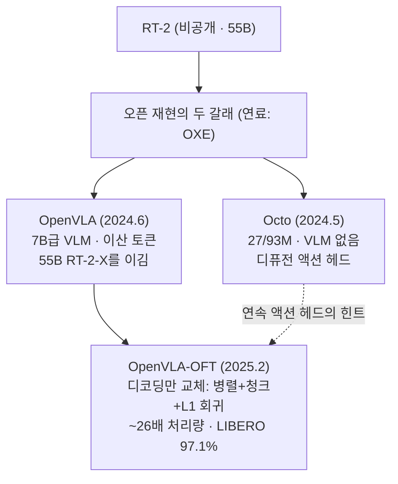

# Lec 43. 오픈 세대 (2024) — Octo, OpenVLA, 그리고 디코딩의 재발견

> 선수 지식: 42강(RT-2, OXE), 10-36강(ViT·DINOv2, SigLIP, VLM 조립), 39강(디퓨전 정책).

## 한 장 요약

## 학습 목표

1. Octo와 OpenVLA가 RT-2 재현이라는 같은 목표에서 왜 정반대 설계(무-VLM 소형 vs VLM 대형)를 택했는지 설명할 수 있다.
2. OpenVLA의 구조(듀얼 비전 인코더 + Llama-2 + 행동 토큰)를 그림으로 재구성할 수 있다.
3. OpenVLA-OFT가 백본을 그대로 두고 무엇을 바꿔 ~26배 처리량을 얻었는지, 그것이 왜 필드의 교훈이 됐는지 설명할 수 있다.

## 본문

### 0. 2024년의 과제

RT-2는 아무도 만질 수 없었다 — 가중치도, 데이터도, 55B를 서빙할 TPU도. 하지만 42강의 OXE가 공용 연료를 만들어 놨다. 2024년은 "그 연료로 RT-2를 재현하고, 이왕이면 이기자"의 해다.

### 1. Octo — VLM 없이 가볍게 (2024.5, Berkeley 연합)

- **구조**: 27M/93M 트랜스포머. VLM이 아니다 — 언어는 T5 임베딩으로 주입. 액션은 **디퓨전 헤드**(39강)로 연속 생성.
- **데이터**: OXE에서 80만 궤적.
- **설계 철학**: 유연성 — 관측·행동 공간을 토큰 슬롯으로 추상화해 새 로봇에 헤드만 갈아끼우는 파인튜닝. 단일 GPU에서 돌아가는 첫 완전 오픈 generalist.
- **의미 두 가지**: ① "웹 VLM 없이 어디까지 가나"의 대조군 (답: 꽤 가지만, 언어 일반화에서 밀린다), ② 이산 토큰이 아닌 **연속 디퓨전 헤드를 generalist에 처음 얹은 선구** — 44강 π0의 예고편.

### 2. OpenVLA — RT-2 레시피의 오픈 재현 (2024.6)

- **구조** (36강의 LLaVA 템플릿 그대로): 비전 인코더 → projector → LLM. 단, 비전이 **듀얼 인코더**다: DINOv2(기하·공간) + SigLIP(의미·언어정렬) 특징을 채널 방향 결합(~600M) → 2층 MLP projector → **Llama-2-7B**. 34강에서 배운 "CLIP류 특징은 의미적이지 기하적이지 않다"는 약점을 DINOv2로 때운 것.
- **행동**: RT-2 방식 계승 — 차원당 256빈(1~99% 분위수 구간), Llama vocabulary의 최저빈도 토큰 256개를 행동 토큰으로 덮어씀 (자세한 절차는 50강에서 다시 다룬다).
- **데이터**: OXE 97만 에피소드.
- **결과**: **7B급이 55B RT-2-X를 이겼다.** 오픈 가중치 + 코드 + LoRA 파인튜닝(24GB GPU)으로 "누구나 만질 수 있는 VLA"의 표준이 됨.
- 훈련 디테일 하나: **비전 인코더를 unfreeze해야 조작 성능이 나왔다** — 36강의 frozen 논쟁에서 OpenVLA 진영의 답. (46강에서 G0강T가 정반대 답을 내는 것과 대조하게 된다.)

### 3. OpenVLA-OFT — 액션 헤드의 재발견 (2025.2)

새 모델이 아니라 **파인튜닝 레시피** 논문. 백본은 OpenVLA 그대로 두고 세 가지만 바꾼다:

| 바꾼 것 | 원래 | OFT |
|---|---|---|
| 디코딩 | 토큰을 하나씩 autoregressive | **병렬 디코딩** (한 번의 forward) |
| 시간 구조 | 스텝 단위 | **액션 청크** (38강) |
| 행동 표현 | 이산 256빈 | **연속값, L1 회귀 MLP 헤드** |

결과: 처리량 ~26배(≈5Hz → 100Hz+), LIBERO 97.1%로 당시 최고 수준.

두 가지 교훈:
① **액션 디코딩 방식이 백본 선택만큼 성능을 좌우한다.** 2024년까지 필드는 "더 좋은 VLM"에 몰두했는데, 병목의 절반은 출력단에 있었다.
② **L1 회귀의 복권**: 39강에서 "MSE 회귀는 다봉성 때문에 안 된다"고 배웠다. OFT는 조건을 드러낸다 — 사전학습이 아니라 *좁은 파인튜닝 데이터*라면 회귀(중앙값 궤적으로 수렴)로 충분하고, 오히려 빠르고 강건하다. 생성 헤드가 필요한 것은 시연이 강하게 다봉일 때다. "디퓨전이냐 회귀냐"는 종교가 아니라 데이터 분포의 함수다.

### 4. 곁가지 하나 — ECoT (2024.7)

OpenVLA 위에서 행동 전에 계획·그리퍼 위치·물체 관계를 **텍스트로 추론**하게 하면(embodied chain-of-thought) 성공률이 +28% — 추가 로봇 시연 데이터 없이 (기존 궤적에 합성 추론 주석을 생성해 붙였다). "생각이 공짜 성능"임을 VLA 계보에서 보인 신호로, 이후 π0.5의 계층 추론(45강), Gemini Robotics의 thinking-before-acting(48강)으로 이어지는 흐름의 뿌리다.

### 로봇공학자를 위한 번역

- OFT는 **같은 플랜트, 같은 센서에서 제어기 합성 방법만 바꾼 것**이다. 구조(이산/연속, 순차/병렬)가 대역폭과 성능을 지배한다는, 제어 설계에서 익숙한 결론이 학습 쪽에서 재발견된 셈이다.
- Octo vs OpenVLA는 "가볍고 유연한 범용 관측기 없이" vs "무거운 사전 지식 탑재"의 고전적 트레이드오프다. 어느 쪽이 이기는지는 태스크가 요구하는 것이 **정밀 추종**(가벼워도 됨)인지 **의미 이해**(사전 지식 필수)인지에 달렸다.
- 병렬 디코딩이 되는 이유: 행동 차원들 사이의 순차 의존은 언어의 단어 순서만큼 본질적이지 않다 — 궤적은 문장이 아니라 **벡터 신호**이므로 한 번에 뽑아도 된다.

## 실습 (60분, GPU 불필요)

**OpenVLA 코드 구조 읽기.** Claude Code 세션에서 `github.com/openvla/openvla`를 클론하고 함께 추적한다:

1. 듀얼 비전 인코더의 특징 결합 지점을 찾아 shape을 계산해 본다 (DINOv2 출력 + SigLIP 출력 → 몇 차원?).
2. action tokenizer에서 256빈의 경계가 어떻게 계산되는지(분위수 통계) 찾는다.
3. 추론 경로: 토큰 출력 → 역이산화 → 역정규화 → 로봇 명령까지의 함수 호출 체인을 그린다 (50강의 그림과 연결).
4. (선택) OFT 저장소에서 L1 회귀 헤드가 갈아끼워지는 부분을 대조한다.

## Claude와 토론할 질문

1. DINOv2와 SigLIP을 둘 다 쓰는 이유를 34강의 언어로 설명하면? 하나만 쓴다면 어떤 태스크부터 무너질까?
2. 병렬 디코딩이 성능 손실 없이 되는 이유는? 행동 차원 간 의존이 실제로 중요한 경우를 상상할 수 있는가?
3. Octo(93M)가 OpenVLA(7B)에 밀리지 않는 영역과 확실히 밀리는 영역은 각각 어디인가?
4. "7B가 55B를 이겼다"의 원인 후보를 세 개 들고(데이터 큐레이션, 비전 인코더, 훈련 레시피...) 각각의 근거를 논문에서 찾아보라.
5. LIBERO 97.1%는 어디까지 믿어야 하나? (57강 예고: LIBERO-Plus에서 교란을 넣으면 어떻게 되는지 그때 확인한다)
6. ECoT의 +28%는 어디서 오는가 — 표현력인가, 학습 신호의 구조화인가?

## 읽을거리

1. **OpenVLA 논문 (arXiv 2406.09246) §3 아키텍처**까지만 (~30분). 평가 섹션은 57강 이후에 비판적으로 다시.
2. **OpenVLA-OFT 프로젝트 페이지** (openvla-oft.github.io, ~15분): 짧고 그림이 좋다. 전문.

## 자가 점검

1. Octo와 OpenVLA의 설계 차이 세 가지(백본, 액션 헤드, 크기)를 표로 그릴 수 있는가?
2. OpenVLA의 행동 토큰화 절차(256빈, 분위수 구간, vocabulary 덮어쓰기)를 설명할 수 있는가?
3. OFT가 바꾼 세 가지와 각각의 효과를 말할 수 있는가?
4. "회귀로 충분한 조건 vs 생성 헤드가 필요한 조건"을 데이터 분포 관점에서 설명할 수 있는가?
5. 비전 인코더 freeze 논쟁에서 OpenVLA의 입장과 근거를 말할 수 있는가?

## 참고문헌

> 본문 수치·주장의 출처. 웹 문서는 2026-07-08 접속 기준.

[1] Octo Model Team (UC Berkeley 외), "Octo: An Open-Source Generalist Robot Policy," arXiv:2405.12213, 2024.5. https://arxiv.org/abs/2405.12213 · 프로젝트: https://octo-models.github.io
— **뒷받침**: 27M/93M 두 크기, OXE 80만 궤적, 디퓨전 액션 헤드, T5 언어 임베딩, 유연한 관측·행동 슬롯 설계.

[2] M. J. Kim et al., "OpenVLA: An Open-Source Vision-Language-Action Model," arXiv:2406.09246, 2024.6. https://arxiv.org/abs/2406.09246 · 코드: https://github.com/openvla/openvla
— **뒷받침**: DINOv2+SigLIP 채널 결합(~600M)+2층 MLP projector+Llama-2-7B, OXE 97만 에피소드, 차원당 256빈(1~99% 분위수 구간), Llama 최저빈도 토큰 256개 덮어쓰기, 55B RT-2-X 능가, ~6Hz(RTX 4090), 비전 인코더 unfreeze 필요, LoRA 24GB 파인튜닝.

[3] S. Karamcheti et al., "Prismatic VLMs: Investigating the Design Space of Visually-Conditioned Language Models," arXiv:2402.07865, 2024.2. https://arxiv.org/abs/2402.07865
— **뒷받침**: OpenVLA 백본(듀얼 인코더 융합 설계)의 기반이 된 VLM 설계 ablation.

[4] M. J. Kim, C. Finn, P. Liang, "Fine-Tuning Vision-Language-Action Models: Optimizing Speed and Success" (OpenVLA-OFT), arXiv:2502.19645, 2025.2 (RSS 2025). https://arxiv.org/abs/2502.19645 · 프로젝트: https://openvla-oft.github.io
— **뒷받침**: 병렬 디코딩+액션 청크+연속 L1 회귀 헤드, 처리량 ~26배(≈5Hz→100Hz+), LIBERO 97.1%, L1의 중앙값 궤적 수렴 논거.

[5] M. Zawalski et al., "Robotic Control via Embodied Chain-of-Thought Reasoning" (ECoT), arXiv:2407.08693, 2024.7. https://arxiv.org/abs/2407.08693
— **뒷받침**: 행동 전 텍스트 추론으로 +28%, 추가 로봇 시연 없이 합성 추론 주석을 생성해 훈련.
