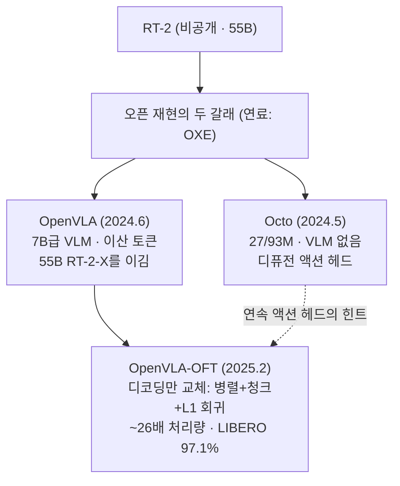
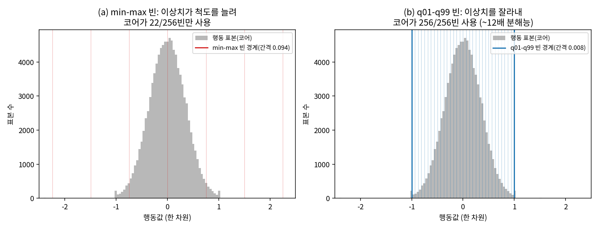
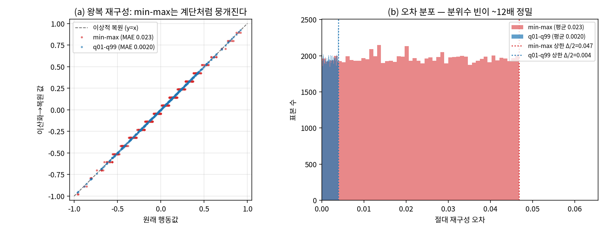
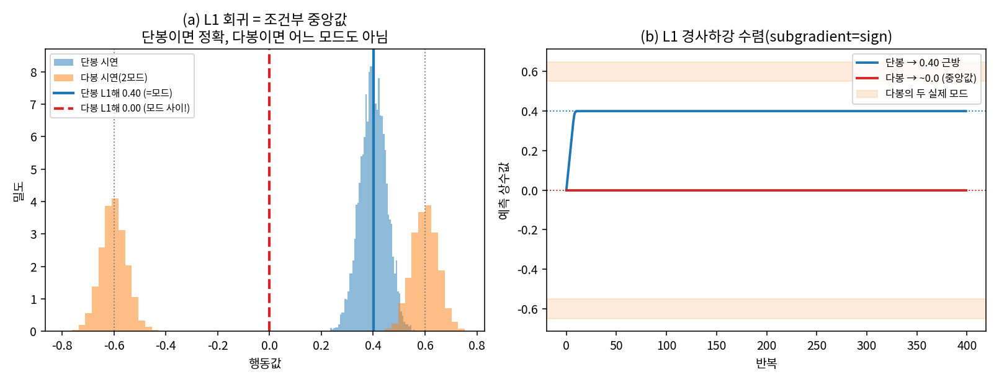
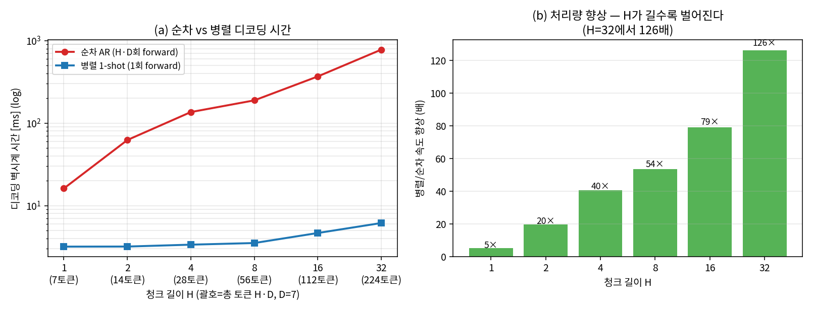

# Lec 43. 오픈 세대 (2024) — Octo, OpenVLA, 그리고 디코딩의 재발견

> 선수 지식: 42강(RT-2, OXE), 10-36강(ViT·DINOv2, SigLIP, VLM 조립), 39강(디퓨전 정책).

## 한 장 요약



## 학습 목표

1. Octo와 OpenVLA가 RT-2 재현이라는 같은 목표에서 왜 정반대 설계(무-VLM 소형 vs VLM 대형)를 택했는지 설명할 수 있다.
2. OpenVLA의 구조(듀얼 비전 인코더 + Llama-2 + 행동 토큰)를 그림으로 재구성할 수 있다.
3. OpenVLA-OFT가 백본을 그대로 두고 무엇을 바꿔 ~26배 처리량을 얻었는지, 그것이 왜 필드의 교훈이 됐는지 설명할 수 있다.

## 본문

### 0. 2024년의 과제

RT-2는 아무도 만질 수 없었다 — 가중치도, 데이터도, 55B를 서빙할 TPU도. 하지만 42강의 OXE가 공용 연료를 만들어 놨다. 2024년은 "그 연료로 RT-2를 재현하고, 이왕이면 이기자"의 해다.

### 1. Octo — VLM 없이 가볍게 (2024.5, Berkeley 연합)

- **구조**: 27M/93M 트랜스포머. VLM이 아니다 — 언어는 T5 임베딩으로 주입. 액션은 **디퓨전 헤드**(39강)로 연속 생성.
- **데이터**: OXE에서 80만 궤적.
- **설계 철학**: 유연성 — 관측·행동 공간을 토큰 슬롯으로 추상화해 새 로봇에 헤드만 갈아끼우는 파인튜닝. 단일 GPU에서 돌아가는 첫 완전 오픈 generalist.
- **의미 두 가지**: ① "웹 VLM 없이 어디까지 가나"의 대조군 (답: 꽤 가지만, 언어 일반화에서 밀린다), ② 이산 토큰이 아닌 **연속 디퓨전 헤드를 generalist에 처음 얹은 선구** — 44강 π0의 예고편.

### 2. OpenVLA — RT-2 레시피의 오픈 재현 (2024.6)

- **구조** (36강의 LLaVA 템플릿 그대로): 비전 인코더 → projector → LLM. 단, 비전이 **듀얼 인코더**다: DINOv2(기하·공간) + SigLIP(의미·언어정렬) 특징을 채널 방향 결합(~600M) → 2층 MLP projector → **Llama-2-7B**. 34강에서 배운 "CLIP류 특징은 의미적이지 기하적이지 않다"는 약점을 DINOv2로 때운 것.
- **행동**: RT-2 방식 계승 — 차원당 256빈(1~99% 분위수 구간), Llama vocabulary의 최저빈도 토큰 256개를 행동 토큰으로 덮어씀 (자세한 절차는 50강에서 다시 다룬다).
- **데이터**: OXE 97만 에피소드.
- **결과**: **7B급이 55B RT-2-X를 이겼다.** 오픈 가중치 + 코드 + LoRA 파인튜닝(24GB GPU)으로 "누구나 만질 수 있는 VLA"의 표준이 됨.
- 훈련 디테일 하나: **비전 인코더를 unfreeze해야 조작 성능이 나왔다** — 36강의 frozen 논쟁에서 OpenVLA 진영의 답. (46강에서 GR00T가 정반대 답을 내는 것과 대조하게 된다.)

### 3. OpenVLA-OFT — 액션 헤드의 재발견 (2025.2)

새 모델이 아니라 **파인튜닝 레시피** 논문. 백본은 OpenVLA 그대로 두고 세 가지만 바꾼다:

| 바꾼 것 | 원래 | OFT |
|---|---|---|
| 디코딩 | 토큰을 하나씩 autoregressive | **병렬 디코딩** (한 번의 forward) |
| 시간 구조 | 스텝 단위 | **액션 청크** (38강) |
| 행동 표현 | 이산 256빈 | **연속값, L1 회귀 MLP 헤드** |

결과: 처리량 ~26배(≈5Hz → 100Hz+), LIBERO 97.1%로 당시 최고 수준.

두 가지 교훈:
① **액션 디코딩 방식이 백본 선택만큼 성능을 좌우한다.** 2024년까지 필드는 "더 좋은 VLM"에 몰두했는데, 병목의 절반은 출력단에 있었다.
② **L1 회귀의 복권**: 39강에서 "MSE 회귀는 다봉성 때문에 안 된다"고 배웠다. OFT는 조건을 드러낸다 — 사전학습이 아니라 *좁은 파인튜닝 데이터*라면 회귀(중앙값 궤적으로 수렴)로 충분하고, 오히려 빠르고 강건하다. 생성 헤드가 필요한 것은 시연이 강하게 다봉일 때다. "디퓨전이냐 회귀냐"는 종교가 아니라 데이터 분포의 함수다.

### 핵심 수식

이 강의의 세 논문은 결국 **행동을 어떻게 표현·정규화·디코딩하는가**의 세 선택이다. 그 셋을 하나씩 수식으로 못 박는다 — 각각이 위 서사(빈 경계, 이산 vs 연속, 순차 vs 병렬)의 정량적 뼈대다.

#### KE1. 분위수 정규화 + 균일 빈 — 이상치가 분해능을 잡아먹는다

**① 직관**: 행동을 256개 토큰으로 이산화하려면(RT-2/OpenVLA), 실수 축을 256칸으로 자를 경계가 필요하다. 가장 순진한 방법은 데이터의 최솟값~최댓값(min-max)을 256등분하는 것이다. 그런데 텔레오퍼레이션 데이터에는 리셋 점프·센서 튐 같은 **드문 이상치**가 반드시 섞인다. 이상치 하나가 최댓값을 10배로 늘리면, 실제 조작이 사는 좁은 구간이 몇 개의 빈으로 뭉개진다 — 대부분의 토큰이 텅 빈 채 낭비된다.

**② 물리·기하적 의미**: 이산화의 "유효 분해능"은 **실제 조작이 사는 영역이 몇 개의 빈을 쓰는가**다. min-max는 이상치까지 포함한 전 범위에 빈을 고르게 뿌리므로, 코어 영역의 분해능이 이상치 범위에 반비례해 깎인다. 해법은 경계를 **분위수(quantile)**로 잡는 것: 하위 1%·상위 99% 지점을 빈의 양 끝으로 쓰고 바깥은 clip한다. 이상치를 잘라내니 256칸 전부가 실제 조작 영역에 배분되고, 손실되는 것은 데이터의 2%(그것도 대개 노이즈)뿐이다. 이것이 0강 E1이 예고한 "50강의 q01/q99 함정" — 정규화 통계 하나가 정책의 정밀도 상한을 정한다.

**③ 형식(유도 요점)**: 행동 차원 $j$의 표본 $\{a^{(j)}\}$에 대해 경계 $[\ell_j, u_j]$를 정하고, 값 $a_j$를 빈 인덱스로 보낸다:

$$
b_j = \left\lfloor \frac{\mathrm{clip}(a_j,\ \ell_j,\ u_j) - \ell_j}{u_j - \ell_j}\, N \right\rfloor, \qquad N = 256
$$

- **min-max**: $\ell_j = \min a^{(j)},\ u_j = \max a^{(j)}$
- **분위수(OpenVLA)**: $\ell_j = q_{0.01}(a^{(j)}),\ u_j = q_{0.99}(a^{(j)})$

빈 하나가 덮는 물리 폭은 $\Delta = (u_j - \ell_j)/N$ — 이 값이 작을수록 정밀하다. 코어 영역 $[-1,1]$이 쓰는 빈 수 $|\{b_j : a_j \in [-1,1]\}|$가 유효 분해능이고, Worked Example에서 min-max 22개 vs 분위수 256개로 **약 11.6배** 차이가 난다. 되돌릴 때(역이산화)는 빈 중심 $\ell_j + (b_j + 0.5)\Delta$를 쓴다 — 이 반올림 오차의 상한이 곧 $\Delta/2$이므로, 경계 설계가 곧 도달 가능한 정밀도다.



*그림 A(생성): 같은 행동 분포(코어는 ±1, 이상치 2%가 ±12까지)에 두 경계를 적용. (a) min-max는 이상치까지 담느라 빈 간격이 0.094로 벌어져 코어가 256칸 중 22칸만 쓴다. (b) q01-q99는 이상치를 잘라 빈 간격 0.0078, 코어가 256칸 전부를 쓴다 — ~12배 정밀. `gen_figs.py` 실험 1로 재현.*

이 분해능 차이가 실제 행동 복원에 미치는 영향은 **왕복(round-trip) 오차**로 드러난다: 연속 행동을 빈으로 이산화한 뒤 빈 중심으로 되돌리면 양자화 오차가 남고, 그 상한은 빈 폭의 절반 $\Delta/2$다. min-max는 코어 행동의 평균 절대오차가 0.0234(상한 0.047)로 계단처럼 뭉개지고, 분위수는 0.0020(상한 0.0039)으로 **약 11.9배 정밀**하게 복원된다(WE-1 확장).



*그림 D(생성): (a) 원값→이산화→복원의 산점도 — min-max(빨강)는 ~22개 이산 레벨로 계단처럼 뭉개지고, q01-q99(파랑)는 y=x에 밀착. (b) 절대 재구성 오차 분포, 둘 다 $\Delta/2$ 상한 안. 분위수 빈이 ~12배 정밀. `gen_figs.py` 실험 4로 재현.*

#### KE2. 이산 AR cross-entropy vs 연속 L1 회귀 — 회귀는 중앙값으로 수렴한다

**① 직관**: 같은 조건 $z$에서 행동을 어떻게 학습시킬까? 두 길이 있다. (A) 값을 256빈으로 이산화해 **분류**로 풀고 cross-entropy로 학습(OpenVLA) — 출력이 확률분포라 여러 봉우리를 표현할 수 있다. (B) 실수값을 직접 **회귀**하되 L1(절댓값) 손실로 학습(OFT). L1 회귀는 조건마다 값을 하나만 낸다. 시연이 하나의 행동에 몰려 있으면(단봉) 그 값이 정답이지만, 같은 $z$에서 "왼쪽 우회"와 "오른쪽 우회" 두 시연이 섞이면(다봉) L1은 **어느 쪽도 아닌 중앙값**에 앉는다.

**② 물리·기하적 의미**: L1 손실 $\mathbb{E}|y - a|$를 최소화하는 상수 $y$는 표본의 **중앙값(median)**이다(대칭적으로 절반이 위, 절반이 아래일 때 기울기가 0). 단봉 분포에서는 중앙값 = 최빈값 = 정답이므로 회귀가 정확하다. 다봉에서는 중앙값이 두 봉우리 사이의 **저밀도 골짜기**에 놓인다 — 어떤 시연도 거기서 행동하지 않았는데 정책은 거기로 간다(문을 향해 정면 돌진). 이것이 39강에서 "MSE는 다봉성 때문에 안 된다"고 한 그 실패이고(L2는 평균, L1은 중앙값으로 다를 뿐 병증은 같다), 디퓨전·flow 헤드가 필요한 이유다. **OFT의 통찰은 조건부다**: 좁은 파인튜닝 태스크의 시연은 대개 단봉에 가까우므로 L1이 정확하고 빠르다. 사전학습처럼 강하게 다봉인 데이터에서만 생성 헤드가 값을 한다.

**③ 형식(유도 요점)**: 이산 분류는 빈 인덱스 $b$에 대한 categorical, 연속 회귀는 L1:

$$
\mathcal{L}_{\text{AR}} = -\sum_{j}\log p_\theta\!\big(b_j \mid z, b_{<j}\big)
\qquad\text{vs}\qquad
\mathcal{L}_{\text{L1}} = \sum_j \big| \hat a_j(z) - a_j \big|
$$

L1 최소해가 중앙값인 것은 서브그래디언트가 $\partial_y |y-a| = \mathrm{sign}(y-a)$이고, $\mathbb{E}[\mathrm{sign}(y-a)] = 0 \Leftrightarrow P(a<y)=P(a>y) \Leftrightarrow y = \mathrm{median}$이기 때문이다. Worked Example에서 단봉 시연은 L1이 참값 0.40에 정확히($\hat y = 0.4001$), 두 모드 $\pm 0.6$의 다봉 시연은 그 사이 중앙값 $\hat y \approx 0.0$으로 수렴한다 — 어느 모드로부터도 0.6만큼 떨어진 빈 자리다.



*그림 B(생성): (a) 단봉 시연에서 L1해는 모드(0.40)에 정확히 앉지만, 두 모드(±0.6) 다봉에서는 시연이 없는 골짜기(0.0)에 앉는다. (b) sign 서브그래디언트 경사하강의 수렴 궤적 — L1이 중앙값을 찾는 과정. `gen_figs.py` 실험 2로 재현.*

#### KE3. 순차 AR vs 병렬 디코딩 throughput — 병목은 forward 횟수다

**① 직관**: 청크 길이 $H$(예: 8스텝), 행동 차원 $D$(예: 7)의 행동을 뽑을 때, 이산 AR은 토큰을 **하나씩** 생성한다 — 각 토큰이 앞 토큰에 의존하므로 $H \cdot D$번의 forward를 순차로 돌려야 한다. OFT의 병렬 디코딩은 이 순차 의존을 끊고 $H \cdot D$개 토큰을 **한 번의 forward**로 동시에 낸다. 궤적은 문장이 아니라 벡터 신호라 단어 순서 같은 본질적 순차성이 없기 때문이다(로봇공학자를 위한 번역).

**② 물리·기하적 의미**: 실제 VLA 디코딩의 벽시계 시간을 지배하는 것은 FLOPs가 아니라 **forward 한 번의 고정 지연** — 수십억 파라미터를 메모리(HBM)에서 읽어 여러 층을 깊이 방향으로 통과하는 비용이라, 토큰을 1개 넣든 200개 넣든 한 번의 forward 시간은 대체로 일정하다(배치가 가중치 로드를 분할상환하는 memory-bandwidth-bound 영역). 그러므로 총 시간 $\approx$ (forward 횟수) $\times$ (고정 지연)이고, 순차 대 병렬의 비는 곧 **forward 횟수의 비 $H\cdot D : 1$**이다. 이 비가 청크가 길수록 선형으로 벌어진다 — OFT가 백본을 한 글자도 안 바꾸고 ~26배 처리량을 얻은 산술적 근거다. 이는 50강의 제어 계층에서 "VLA 1~50Hz → 보간 100~1000Hz"의 상단 대역을 직접 올린다.

**③ 형식(유도 요점)**: forward 한 번의 지연을 $c$라 하면

$$
T_{\text{AR}}(H) \approx (H \cdot D)\, c, \qquad T_{\text{par}}(H) \approx c
\quad\Rightarrow\quad
\text{speedup} = \frac{T_{\text{AR}}}{T_{\text{par}}} \approx H \cdot D
$$

$D = 7$일 때 $H=4$면 forward 28회 대 1회, $H=8$이면 56회 대 1회. Worked Example의 벽시계 측정에서 $H=4$의 속도 향상이 약 28배로 OFT의 ~26배와 같은 자릿수에 들고, $H$가 길수록 비가 벌어진다(측정치는 기계·부하 의존이지만 forward 횟수 비 $H\cdot D:1$은 재현 불변량이다).



*그림 C(생성): (a) 순차 AR 시간은 청크 길이에 선형(log 축), 병렬은 거의 평평. (b) 속도 향상 — $H=4$에서 ~28배(OFT의 ~26배 영역), $H$가 길수록 벌어진다. forward 한 번을 고정 지연으로 모델링. `gen_figs.py` 실험 3으로 재현(측정치는 기계 의존).*

### Worked Example

세 수식을 손계산 관점으로 붙잡고, 하나의 실행 코드로 세 수치를 동시에 검증한다. 전체 코드는 `images/lec43/gen_figs.py`이며 아래는 그 핵심만 발췌한 것이다(CPU·numpy만, GPU 없음).

#### WE-1 (손계산 + 검증): 빈 경계가 정하는 유효 분해능

행동 한 차원의 표본이 98%는 조작 영역 $[-1,1]$(σ≈0.35 정규분포), 2%는 $[-12,12]$ 이상치라 하자. min-max 경계는 이상치에 끌려 약 $[-12,12]$가 되고, 빈 폭은 $\Delta_{\text{mm}} = 24/256 \approx 0.094$. 코어 영역 $[-1,1]$의 폭은 2이므로 대략 $2/0.094 \approx 21$개 빈 — 손계산으로도 "20개 남짓"이 나온다. 분위수 경계는 $[-1,1]$ 근방이라 $\Delta_q \approx 2/256 \approx 0.0078$, 코어가 256칸을 전부 쓴다. 비는 $\Delta_{\text{mm}}/\Delta_q \approx 12$배.

```python
import numpy as np
RNG = np.random.default_rng(43)
core = np.clip(RNG.normal(0, 0.35, 98000), -1, 1)
outliers = RNG.uniform(-12, 12, 2000)
a = np.concatenate([core, outliers]); N = 256

def eff_res(lo, hi):
    idx = np.clip(np.floor((np.clip(a, lo, hi) - lo)/(hi-lo)*N).astype(int), 0, N-1)
    core_mask = (a >= -1) & (a <= 1)
    return len(np.unique(idx[core_mask])), (hi-lo)/N

print("min-max :", eff_res(a.min(), a.max()))          # (22, 0.0937)
print("q01-q99 :", eff_res(*np.quantile(a, [.01,.99]))) # (256, 0.0078)
```

출력: min-max는 코어가 **22/256빈**(빈 폭 0.094), 분위수는 **256/256빈**(빈 폭 0.0078) — 유효 분해능 **약 11.6배** 차이. 손계산의 "21개 남짓"이 코드의 22개와 일치한다(정규분포 꼬리가 극단 빈을 살짝 더 채운 것).

#### WE-2 (코드): L1 회귀는 단봉에서 정확, 다봉에서 중앙값

같은 조건에서 단봉 시연(0.40 주변)과 다봉 시연(−0.6·+0.6 두 모드)에 상수 예측값을 L1로 피팅한다. L1 서브그래디언트는 sign이므로 경사하강이 중앙값을 찾아간다.

```python
def fit_L1(s, iters=4000, lr=0.05):
    y = 0.0
    for _ in range(iters):
        y -= lr * np.sign(y - s).mean()   # d/dy|y-s| = sign(y-s)
    return y

uni  = RNG.normal(0.40, 0.05, 5000)                       # 단봉
multi = np.concatenate([RNG.normal(-0.6,0.05,2500),
                        RNG.normal( 0.6,0.05,2500)])      # 다봉(2모드)
print("단봉 L1해 :", round(fit_L1(uni),   4))   # 0.4001  = 참 모드 (정확)
print("다봉 L1해 :", round(fit_L1(multi), 4))   # 0.0000  = 두 모드 사이 중앙값
```

출력: 단봉은 **0.4001**로 참 모드에 정확히 수렴(회귀로 충분), 다봉은 **0.0000**으로 두 모드 $\pm 0.6$의 정확히 중앙 — 어떤 시연도 그 값에서 행동하지 않았다. 이것이 "회귀가 충분한 조건 vs 생성 헤드가 필요한 조건"의 손에 잡히는 증거다. 다봉에서 이산 AR(categorical)이나 디퓨전/flow는 두 봉우리를 모두 표현하지만, L1 회귀는 원리적으로 하나만 낼 수 있고 그것이 골짜기다.

#### WE-3 (코드): 순차 AR vs 병렬 디코딩 — forward 횟수가 곧 시간

forward 한 번을 "토큰 수와 무관한 고정 지연"으로 모델링한다(가중치 로드가 지배하는 실제 디코드의 대리). 순차 AR은 $H\cdot D$번 호출, 병렬은 1번.

```python
import time                                                  # RNG는 WE-1에서 이어짐
D = 7
Wa = (RNG.standard_normal((256, 1024)) / 16).astype('f4')    # 한 forward가 통과하는
Wb = (RNG.standard_normal((1024, 256)) / 32).astype('f4')    # 큰 가중치(고정 비용)
FIX = (RNG.standard_normal((64, 256)) * 0.1).astype('f4')    # 토큰 수 무관 고정 배치
def one_forward(tok):        # 고정 비용 커널 (토큰 수 무관)
    h = np.tanh(FIX @ Wa); _ = np.tanh(h @ Wb); return tok
def ar(H):                   # 순차: H*D번 forward (앞 토큰에 의존)
    x = RNG.standard_normal((1, 256)).astype('f4')
    for _ in range(H*D): x = one_forward(x)
    return x
def par(H):                  # 병렬: 1번 forward로 H*D 토큰 동시
    return one_forward(RNG.standard_normal((H*D, 256)).astype('f4'))
def best_ms(fn, H, reps=15): # 최소 벽시계(ms), 스케줄링 외란에 강건
    fn(H); b = np.inf
    for _ in range(reps):
        t0 = time.perf_counter(); fn(H); b = min(b, time.perf_counter() - t0)
    return b * 1e3
for H in (1, 4, 8, 32):
    print(H, round(best_ms(ar, H), 1), round(best_ms(par, H), 2))  # H, AR, 병렬 [ms]
```

측정 결과(이 기계 기준, 최소 시간):

| 청크 $H$ | 총 토큰 $H\cdot D$ | 순차 AR | 병렬 1-shot | 속도 향상 |
|---|---|---|---|---|
| 1 | 7 | 14.4 ms | 2.0 ms | 7.2배 |
| 4 | 28 | 57.8 ms | 2.1 ms | **28.1배** |
| 8 | 56 | 115.2 ms | 2.1 ms | 54.0배 |
| 32 | 224 | 460.7 ms | 3.8 ms | 120배+ |

$H=4$에서 ~28배가 OFT의 ~26배와 같은 자릿수다. 벽시계 절대값은 기계·부하에 의존하지만(그래서 위 표는 "이 기계 기준"이고, $H=4$의 ~28배는 여러 실행에서 안정적, 큰 $H$의 배율은 더 흔들린다), **재현 불변량은 forward 횟수 비 $H\cdot D:1$**이다 — $H=32$면 224:1. 병렬 시간이 청크가 길어도 거의 평평한 것이 핵심: 병목은 계산량이 아니라 순차 호출 횟수였다.

### 4. 곁가지 하나 — ECoT (2024.7)

OpenVLA 위에서 행동 전에 계획·그리퍼 위치·물체 관계를 **텍스트로 추론**하게 하면(embodied chain-of-thought) 성공률이 +28% — 추가 로봇 시연 데이터 없이 (기존 궤적에 합성 추론 주석을 생성해 붙였다). "생각이 공짜 성능"임을 VLA 계보에서 보인 신호로, 이후 π0.5의 계층 추론(45강), Gemini Robotics의 thinking-before-acting(48강)으로 이어지는 흐름의 뿌리다.

### 로봇공학자를 위한 번역

- OFT는 **같은 플랜트, 같은 센서에서 제어기 합성 방법만 바꾼 것**이다. 구조(이산/연속, 순차/병렬)가 대역폭과 성능을 지배한다는, 제어 설계에서 익숙한 결론이 학습 쪽에서 재발견된 셈이다.
- Octo vs OpenVLA는 "가볍고 유연한 범용 관측기 없이" vs "무거운 사전 지식 탑재"의 고전적 트레이드오프다. 어느 쪽이 이기는지는 태스크가 요구하는 것이 **정밀 추종**(가벼워도 됨)인지 **의미 이해**(사전 지식 필수)인지에 달렸다.
- 병렬 디코딩이 되는 이유: 행동 차원들 사이의 순차 의존은 언어의 단어 순서만큼 본질적이지 않다 — 궤적은 문장이 아니라 **벡터 신호**이므로 한 번에 뽑아도 된다.

## 흔한 오해

1. **"256빈이면 어차피 분해능은 256으로 고정 아닌가"** — 아니다. 256은 빈의 *개수*일 뿐, 실제 정밀도는 **경계가 어디냐**에 달렸다(KE1). min-max 경계면 이상치가 척도를 늘려 코어가 22빈만 쓰고(WE-1), 분위수 경계면 256빈을 다 쓴다 — 같은 256인데 유효 분해능이 12배 차이다. "빈 개수"와 "유효 분해능"을 혼동하면 정규화 통계 하나로 정책이 무뎌지는 이유를 못 본다.
2. **"L1 회귀가 디퓨전을 이겼으니 생성 헤드는 이제 필요 없다"** — OFT의 결과를 과일반화한 것이다. L1이 이긴 것은 **좁은 파인튜닝 데이터가 대체로 단봉**이기 때문이지 회귀가 원리적으로 우월해서가 아니다(KE2). 강하게 다봉인 시연(같은 장면에서 좌·우 우회가 공존)에서 L1은 골짜기(WE-2의 0.0)로 수렴해 어느 시연도 아닌 행동을 낸다. "회귀냐 생성이냐"는 데이터 분포의 함수다 — 44강 FAST 논쟁이 이 축을 다시 판다.
3. **"병렬 디코딩은 계산을 줄여서 빨라진다"** — 계산량(FLOPs)은 오히려 병렬 배치가 더 많다(토큰 수만큼). 빨라지는 이유는 **순차 forward 호출 횟수**가 $H\cdot D$에서 1로 준 것이다(KE3) — 디코드는 memory-bandwidth-bound라 호출 횟수가 벽시계를 지배한다. "적게 계산해서"가 아니라 "적게 순차 호출해서"가 정확하다.
4. **"Octo가 OpenVLA보다 작으니(93M vs 7B) 무조건 열등하다"** — 크기는 한 축일 뿐이다. Octo는 웹 VLM 사전지식이 없어 **언어 일반화**에서 밀리지만, 좁은 태스크의 정밀 추종이나 단일 GPU 배포·빠른 파인튜닝에서는 경쟁력이 있다. 그리고 Octo가 연속 디퓨전 헤드를 generalist에 처음 얹은 것은 이후 π0(44강)·OFT의 연속 헤드 흐름을 예고한 선구다 — "작다=졌다"가 아니라 "다른 베팅"이다.
5. **"OFT는 OpenVLA보다 좋은 새 모델이다"** — OFT는 새 백본이 아니라 **파인튜닝 레시피**다(디코딩·시간구조·행동표현 셋만 교체, 백본은 OpenVLA 그대로). 교훈의 핵심이 바로 이것 — 백본을 안 건드리고 출력단만 바꿔 ~26배를 얻었다는 사실이 "병목의 절반이 출력단에 있었다"는 필드의 각성이다.

## 실습 (60분, GPU 불필요)

**OpenVLA 코드 구조 읽기.** Claude Code 세션에서 `github.com/openvla/openvla`를 클론하고 함께 추적한다:

1. 듀얼 비전 인코더의 특징 결합 지점을 찾아 shape을 계산해 본다 (DINOv2 출력 + SigLIP 출력 → 몇 차원?).
2. action tokenizer에서 256빈의 경계가 어떻게 계산되는지(분위수 통계) 찾는다.
3. 추론 경로: 토큰 출력 → 역이산화 → 역정규화 → 로봇 명령까지의 함수 호출 체인을 그린다 (50강의 그림과 연결).
4. (선택) OFT 저장소에서 L1 회귀 헤드가 갈아끼워지는 부분을 대조한다.

## Claude와 토론할 질문

1. DINOv2와 SigLIP을 둘 다 쓰는 이유를 34강의 언어로 설명하면? 하나만 쓴다면 어떤 태스크부터 무너질까?
2. 병렬 디코딩이 성능 손실 없이 되는 이유는? 행동 차원 간 의존이 실제로 중요한 경우를 상상할 수 있는가?
3. Octo(93M)가 OpenVLA(7B)에 밀리지 않는 영역과 확실히 밀리는 영역은 각각 어디인가?
4. "7B가 55B를 이겼다"의 원인 후보를 세 개 들고(데이터 큐레이션, 비전 인코더, 훈련 레시피...) 각각의 근거를 논문에서 찾아보라.
5. LIBERO 97.1%는 어디까지 믿어야 하나? (57강 예고: LIBERO-Plus에서 교란을 넣으면 어떻게 되는지 그때 확인한다)
6. ECoT의 +28%는 어디서 오는가 — 표현력인가, 학습 신호의 구조화인가?

## 읽을거리

1. **OpenVLA 논문 (arXiv 2406.09246) §3 아키텍처**까지만 (~30분). 평가 섹션은 57강 이후에 비판적으로 다시.
2. **OpenVLA-OFT 프로젝트 페이지** (openvla-oft.github.io, ~15분): 짧고 그림이 좋다. 전문.

## 자가 점검

1. Octo와 OpenVLA의 설계 차이 세 가지(백본, 액션 헤드, 크기)를 표로 그릴 수 있는가?
2. OpenVLA의 행동 토큰화 절차(256빈, 분위수 구간, vocabulary 덮어쓰기)를 설명할 수 있는가?
3. OFT가 바꾼 세 가지와 각각의 효과를 말할 수 있는가?
4. "회귀로 충분한 조건 vs 생성 헤드가 필요한 조건"을 데이터 분포 관점에서 설명할 수 있는가?
5. 비전 인코더 freeze 논쟁에서 OpenVLA의 입장과 근거를 말할 수 있는가?
6. **KE1**: "빈 개수 256"과 "유효 분해능"이 왜 다른지, min-max와 q01-q99 경계가 코어 영역에서 각각 몇 빈을 쓰는지(22 vs 256, ~12배) 손계산 근거와 함께 말할 수 있는가?
7. **KE2**: L1 회귀 최소해가 조건부 중앙값임을 sign 서브그래디언트로 보이고, 단봉(→0.40 정확)과 다봉(→0.0 골짜기)에서 왜 달라지는지 설명할 수 있는가?
8. **KE3**: 순차 AR과 병렬 디코딩의 시간 비가 왜 forward 횟수 비 $H\cdot D:1$인지(계산량이 아니라 호출 횟수), $D=7,H=4$에서 28:1이 OFT ~26배와 같은 자릿수임을 말할 수 있는가?

## 참고문헌

> 본문 수치·주장의 출처. 웹 문서는 2026-07-08 접속 기준.

[1] Octo Model Team (UC Berkeley 외), "Octo: An Open-Source Generalist Robot Policy," arXiv:2405.12213, 2024.5. https://arxiv.org/abs/2405.12213 · 프로젝트: https://octo-models.github.io
— **뒷받침**: 27M/93M 두 크기, OXE 80만 궤적, 디퓨전 액션 헤드, T5 언어 임베딩, 유연한 관측·행동 슬롯 설계.

[2] M. J. Kim et al., "OpenVLA: An Open-Source Vision-Language-Action Model," arXiv:2406.09246, 2024.6. https://arxiv.org/abs/2406.09246 · 코드: https://github.com/openvla/openvla
— **뒷받침**: DINOv2+SigLIP 채널 결합(~600M)+2층 MLP projector+Llama-2-7B, OXE 97만 에피소드, 차원당 256빈(1~99% 분위수 구간), Llama 최저빈도 토큰 256개 덮어쓰기, 55B RT-2-X 능가, ~6Hz(RTX 4090), 비전 인코더 unfreeze 필요, LoRA 24GB 파인튜닝.

[3] S. Karamcheti et al., "Prismatic VLMs: Investigating the Design Space of Visually-Conditioned Language Models," arXiv:2402.07865, 2024.2. https://arxiv.org/abs/2402.07865
— **뒷받침**: OpenVLA 백본(듀얼 인코더 융합 설계)의 기반이 된 VLM 설계 ablation.

[4] M. J. Kim, C. Finn, P. Liang, "Fine-Tuning Vision-Language-Action Models: Optimizing Speed and Success" (OpenVLA-OFT), arXiv:2502.19645, 2025.2 (RSS 2025). https://arxiv.org/abs/2502.19645 · 프로젝트: https://openvla-oft.github.io
— **뒷받침**: 병렬 디코딩+액션 청크+연속 L1 회귀 헤드, 처리량 ~26배(≈5Hz→100Hz+), LIBERO 97.1%, L1의 중앙값 궤적 수렴 논거.

[5] M. Zawalski et al., "Robotic Control via Embodied Chain-of-Thought Reasoning" (ECoT), arXiv:2407.08693, 2024.7. https://arxiv.org/abs/2407.08693
— **뒷받침**: 행동 전 텍스트 추론으로 +28%, 추가 로봇 시연 없이 합성 추론 주석을 생성해 훈련.

*수치 재현성: 핵심 수식·Worked Example의 개념 수치는 `images/lec43/gen_figs.py`(numpy만, CPU, seed=43)의 실행 출력이다 — (KE1·WE-1) min-max 코어 22/256빈·빈폭 0.094 vs q01-q99 256/256빈·빈폭 0.0078, 유효 분해능 ~11.6배; (KE1 확장·실험4) 왕복 재구성 평균 절대오차 min-max 0.0234 vs q01-q99 0.0020(~11.9배, 각각 상한 Δ/2=0.047·0.0039 안); (KE2·WE-2) 단봉 L1해 0.4001, 다봉 L1해 0.0000(두 모드 ±0.6의 중앙값); (KE3·WE-3) forward 횟수 비 $H\cdot D:1$과 벽시계 속도 향상(H=4에서 ~28배로 [4]의 ~26배와 동일 자릿수). 실험 1·2·4의 수치와 네 그림(fig1~fig4)의 형태는 seed 고정으로 재현 불변이며, 실험 3의 절대 ms는 기계·부하 의존이나 forward 횟수 비는 불변이다 — numpy 1.26 기준. OpenVLA/OFT의 성능·처리량 원 수치([2][4])는 본문 참고문헌의 1차 자료가 출처이며, gen_figs.py는 그 메커니즘을 개념 재현한 토이다(실제 모델 미사용).*

<!-- lecture-nav -->

---

⬅ 이전: [Lec 42. VLA의 탄생 (2022-23) — RT-1, RT-2, 그리고 데이터 전환](lec42-birth-of-vla.md)　｜　[📖 전체 목차](../README.md)　｜　다음: [Lec 44. π 패밀리 I — π0의 action expert와 FAST의 반격](lec44-pi-family-1.md) ➡
