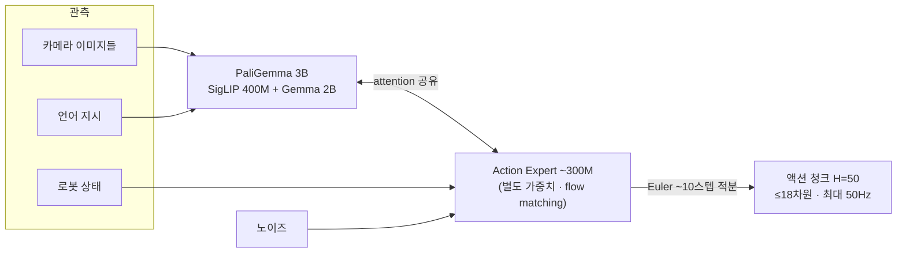
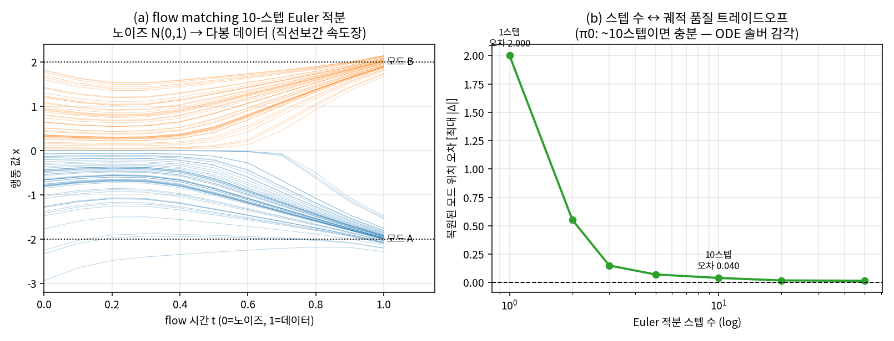
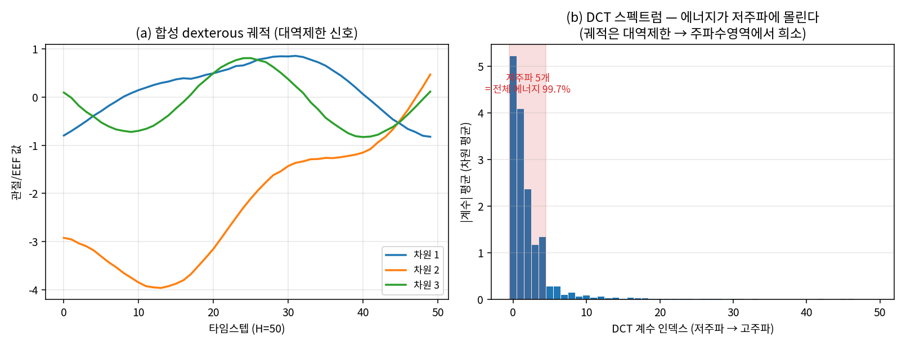
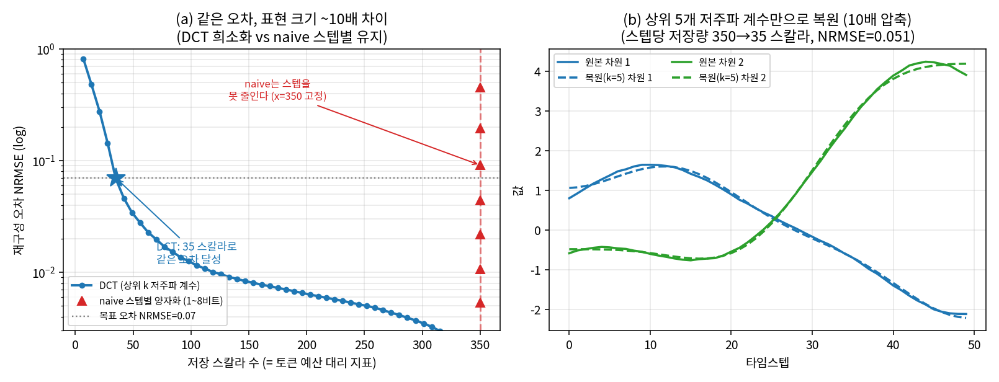
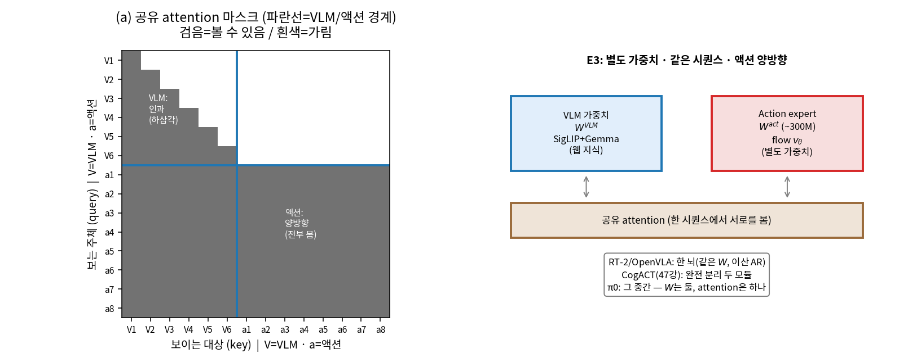

# Lec 44. π 패밀리 I — π0의 action expert와 FAST의 반격

> 선수 지식: 36강(PaliGemma), 40강(flow matching), 43강(OpenVLA와 디코딩 논쟁). 50강(action space)을 먼저 봤다면 더 좋다.

## 한 장 요약



π0 = "이해는 VLM이, 생성은 전문가가". 같은 회사가 석 달 뒤 정반대 설계(π0-FAST, 이산 토큰)도 만들어 비교했다는 점이 이 강의의 백미다.

## 학습 목표

1. π0의 구조(PaliGemma + attention 공유 action expert)를 그리고, RT-2/OpenVLA 방식과의 차이를 설명할 수 있다.
2. flow matching action expert가 50Hz 정교 조작을 가능케 하는 이유를 40강의 언어로 설명할 수 있다.
3. FAST 토크나이저의 파이프라인(DCT → 양자화 → BPE)과 존재 이유를 설명할 수 있다.
4. "이산 AR vs 연속 flow" 논쟁의 양쪽 트레이드오프를 표로 정리할 수 있다.
5. flow matching의 직선보간 속도장과 FAST의 DCT 압축을 각각 numpy 토이로 재현하고, "왜 ~10스텝이면 충분한가"·"왜 ~10배 압축이 되는가"를 수치로 설명할 수 있다.

## 왜 이 강의가 필요한가

43강에서 OpenVLA는 RT-2의 이산 AR 토큰을 오픈으로 재현했고, OpenVLA-OFT는 **디코딩만 바꿔 26배**를 얻어 "액션 헤드가 성능의 급소"임을 보였다. 그렇다면 다음 질문은 자연스럽다 — **행동을 어떻게 표현·생성해야 정교 조작과 빠른 폐루프를 동시에 얻는가?** π0는 이 질문에 "연속 flow expert"로, 같은 회사가 석 달 뒤 π0-FAST로 "더 나은 이산 토크나이저"로 답한다. 두 답이 정면충돌하는 이 강의는 0강의 **설계 축 3(행동 분포 표현)**을 실물 모델로 처음 깊게 파는 자리다.

이걸 수식·코드 없이 "flow는 빠르고 이산은 느리다"로만 외우면 새 논문 앞에서 무력하다. flow가 왜 10스텝이면 되는지(ODE 솔버 감각), FAST가 왜 10배를 얻는지(신호가 주파수영역에서 희소하다는 물리)를 **직접 재현해 본 사람만이** 46강 GR00T, 47강 SmolVLA의 액션 헤드 선택을 "새로운 점만" 짚어낼 수 있다. 이 강의의 핵심 수식과 worked example은 정확히 그 재현을 CPU numpy 토이로 시킨다.

## 본문

### 0. 회사부터 — Physical Intelligence라는 베팅

2024년 초, Karol Hausman(전 Google), Sergey Levine, Chelsea Finn(각 Berkeley/Stanford), Brian Ichter 등이 창업. 논지는 단순하다: **LLM의 문법(대규모 사전학습 → 파인튜닝/스티어링)을 로봇에 이식한 "로봇 파운데이션 모델"을 만든다.** 펀딩 궤적($70M 시드 → 2024.11 $400M@$2.4B → 2025.11 $600M@$5.6B)은 이 베팅에 대한 자본시장의 기대치 지표로 읽으면 된다. RT-2를 만들던 사람들이 나와서 RT-2의 한계를 고치는 회사를 차린 셈이다.

### 1. π0의 문제 설정 (2024.10, arXiv 2410.24164)

RT-2/OpenVLA의 이산 AR 토큰으로는 **빨래 개기**를 못 한다. 두 가지 이유:
① AR 디코딩이 느리다 (1~6Hz) — 천처럼 변형되는 물체는 고주파 폐루프가 필요하다.
② 256빈 이산화가 정밀도를 깎는다.
해법: **VLM은 장면·언어 이해를 맡고, 별도의 action expert가 연속 액션 청크를 생성한다.**

### 2. 구조 상세 — 이 그림은 외울 가치가 있다

- **백본**: PaliGemma 3B (36강 회수: SigLIP-So400m 400M + linear projector + Gemma 2B, prefix-LM).
- **Action expert ~300M**: 백본과 **별도의 가중치 세트**지만 **attention은 공유**한다 — 두 전문가(언어/행동)가 한 시퀀스 안에서 서로를 보는 MoE식 구성. 액션 토큰들끼리는 양방향 attention (미래 액션이 과거 액션을 봐도 됨 — 궤적은 문장이 아니니까, 43강의 병렬 디코딩과 같은 통찰).
- **생성**: flow matching (40강 회수). 노이즈에서 출발해 Euler ~10스텝 ODE 적분으로 **H=50 청크**를 한 번에. RTX 4090 기준 청크당 ~73ms → **최대 50Hz** 제어.



*그림: (a) 1D flow matching 토이 — 노이즈 $N(0,1)$가 직선보간 속도장을 따라 Euler 10스텝으로 두 데이터 모드로 갈라진다. **행동 분포의 다봉성**(같은 상황에서 왼쪽/오른쪽 두 해)을 flow가 자연히 표현하는 것이 39강 Diffusion Policy와 공유하는 강점이다. (b) Euler 스텝 수 ↔ 복원 품질: 1스텝은 무너지고, ~10스텝에서 오차가 이미 0.04로 포화한다 — π0가 "~10스텝"을 고른 근거를 ODE 솔버 감각으로 재현. 아래 핵심 수식 E1·WE-2에서 코드로 생성.*
- **action space**: 데이터셋 내 최대 로봇 기준 **18차원 제로패딩** (양팔 6DoF×2 + 그리퍼 2 + 모바일 베이스 + 토르소; 50강 회수).
- **데이터**: 자체 teleop **~10,000시간** (로봇 구성 7종, 68 태스크) + OXE. "사전학습(잡다한 대량) → 태스크 파인튜닝(고품질 소량)"의 2단 레시피 — LLM 문법 그대로.

결과: 빨래 개기, 테이블 정리, 박스 조립 같은 당시 최장·최정교 시연. 그리고 이 **"VLM + flow expert" 템플릿이 필드 표준**이 된다 — GR00T(46강), SmolVLA(47강), GO-1(47강)이 전부 이 틀의 변주다.

### 3. π0-FAST — 이산 진영의 반격 (2025.1, arXiv 2501.09747)

π0를 만든 바로 그 회사가 물었다: **이산 AR이 정말 안 되는 건가, 토크나이저가 나빴던 건가?**

- **진단**: naive한 스텝별 binning은 고주파 데이터에서 붕괴한다. 50Hz면 인접 스텝 행동이 거의 같아서 — 토큰 수는 폭발하는데 학습 신호는 희석된다.
- **처방 = FAST**: 행동 궤적을 차원별로 **DCT**(이산 코사인 변환) → 계수 양자화·희소화 → **BPE** 압축. naive 대비 **~10배 압축**. 신호처리를 아는 사람에게는 낯익은 구성이다 — **JPEG이 이미지에 하는 일을 궤적에 하는 것**. 궤적은 대역 제한 신호라 주파수 영역에서 희소하다는 성질을 그대로 쓴다.



*그림: (a) 합성 dexterous 궤적(H=50) — 매끄러운 대역제한 운동. (b) 그 DCT 스펙트럼: **에너지가 저주파 몇 개 계수에 몰린다**(첫 5계수 = 전체 에너지 99.7%). 이것이 FAST가 성립하는 물리적 근거다 — 궤적은 주파수영역에서 희소하므로 고주파를 버려도 거의 안 잃는다. 아래 핵심 수식 E2·WE-1에서 코드로 생성.*



*그림: (a) 같은 재구성 오차(NRMSE=0.07)를 내는 데 필요한 표현 크기 — DCT 상위 5계수(35 스칼라)면 충분한데, naive는 스텝을 못 줄여 350 스칼라에 갇힌다(**~10배** 차이). (b) 상위 5개 저주파 계수만으로의 복원이 원본과 거의 겹친다(NRMSE=0.051). 이 "~10배"가 본문의 "naive 대비 ~10배 압축"을 CPU 토이로 재현한 것이다(실제 FAST의 BPE는 여기에 계수 반복 패턴까지 추가로 먹어 압축을 더 키운다).*
- **결과**: FAST 토큰으로 AR 훈련하면 flow 계열보다 **~5배 빠르게 수렴**하고 언어 추종도 낫다. 그러나 **추론은 AR 디코딩 때문에 4~5배 느리다** → 런타임 선택은 flow로 남았다.
- 1M 궤적으로 훈련한 범용 토크나이저 **FAST+**가 HF에 공개되어 있다 (실습에서 사용).

### 4. 이산 vs 연속 — 논쟁의 현재 스코어

| | 이산 AR (FAST) | 연속 flow/디퓨전 |
|---|---|---|
| 훈련 | **빠른 수렴(~5배), LLM 인프라 재사용** | 느림, 별도 expert 필요 |
| 추론 | 느림 (순차 디코딩) | **빠름 (병렬 청크, ~10스텝)** |
| 언어 추종 | **좋음** (백본과 같은 형식) | 상대적으로 약함 |
| 정밀도 | 양자화 한계 | **연속** |

양쪽 다 장점이 뚜렷해서 필드는 "둘 다"로 간다 — 45강의 Knowledge Insulation이 정확히 왼쪽 열(이산 AR)의 훈련 장점과 오른쪽 열(연속 flow)의 추론 장점을 합치는 기술이다. 이 표를 기억하면 새 논문의 액션 디코딩 선택을 즉시 위치시킬 수 있다.

### 5. openpi — 직접 만질 수 있는 것

- github.com/Physical-Intelligence/openpi (Apache-2.0, JAX 기본 + PyTorch).
- 체크포인트: `pi0_base`, `pi0_fast_base`, `pi05_base`와 DROID/ALOHA/LIBERO 파인튜닝판.
- 하드웨어: 추론 8GB+ VRAM, LoRA 파인튜닝 22.5GB+, 전체 파인튜닝 70GB+.

### 핵심 수식

π0(연속 flow)와 π0-FAST(이산 DCT)는 "행동을 어떻게 표현·생성하는가"라는 하나의 질문에 대한 두 답이다. 세 수식이 그 답의 뼈대다: **E1** flow matching(π0의 생성), **E2** DCT 압축과 파세발(FAST의 존재 이유), **E3** attention 공유 action expert(π0의 구조).

#### E1. flow matching action expert — 직선보간과 Euler 적분 (40강 회수)

**① 직관**: 노이즈 한 점을 데이터 한 점으로 옮기는 **가장 곧은 길**을 배운다. 두 점을 직선으로 잇고($x_t = (1-t)x_0 + t\,x_1$), 그 직선의 속도(어느 방향으로 얼마나)를 신경망이 예측하게 한다. 추론 때는 노이즈에서 출발해 이 속도장을 따라 시간 0→1로 **적분**하면 데이터가 나온다. 39강 디퓨전이 "노이즈를 여러 번 조금씩 지우는" 것이라면 flow는 "직선을 따라 곧장 미는" 것 — 그래서 스텝이 적게 든다.

**② 물리·기하적 의미**: action expert의 출력은 H=50×(≤18)차원 청크 하나 = **고차원 공간의 한 점**. 그 공간에서 데이터 분포(사람이 시연한 궤적들)는 여러 봉우리를 갖는다(같은 상황에 왼쪽으로도 오른쪽으로도 갈 수 있다 — **다봉성**). flow는 노이즈 분포를 이 다봉 분포로 밀어내는 **연속 시간 벡터장**을 그린다. 위 그림 3(a)에서 노이즈 한 덩어리가 두 모드로 갈라지는 것이 바로 이 다봉성을 표현하는 장면이다. Euler 스텝 수는 이 곡선을 몇 조각의 직선으로 근사하느냐 — 적으면 곡선을 못 따라가고(그림 3b의 1~2스텝 붕괴), 많으면 정확하지만 느리다. π0의 "~10스텝"은 이 트레이드오프의 실용적 무릎점이다.

**③ 형식(유도 요점)**: 조건부 확률경로를 직선으로 두면($x_0\sim N(0,I)$, $x_1\sim$ 데이터)

$$
x_t = (1-t)\,x_0 + t\,x_1, \qquad \frac{dx_t}{dt} = x_1 - x_0 \;=\; u_t(x_t \mid x_1)
$$

목표 속도장은 조건부 속도의 사후 기댓값 $v_\theta(x,t) \approx \mathbb{E}[\,x_1 - x_0 \mid x_t = x\,]$이고, 손실은 회귀

$$
\mathcal{L}_{\mathrm{FM}} = \mathbb{E}_{t,\,x_0,\,x_1}\big[\,\lVert v_\theta((1-t)x_0 + t x_1,\ t) - (x_1 - x_0) \rVert^2\,\big]
$$

추론은 $x(0)=x_0$에서 시작해 Euler로 $x_{k+1} = x_k + \tfrac{1}{N}\,v_\theta(x_k,\ t_k)$를 $N$번(π0: $N\approx 10$). action expert는 이 $v_\theta$를, 로봇 상태와 (attention 공유로) VLM 컨텍스트를 조건으로 낸다. 청크당 ~73ms는 이 $N$번 forward의 총비용이다.

#### E2. FAST — DCT·양자화·희소화·BPE, 그리고 파세발(에너지 보존)

**① 직관**: 궤적을 스텝별로 저장하면 50Hz에서 인접 스텝이 거의 같아 낭비가 크다. 대신 궤적을 **주파수 성분의 합**으로 바꾸면(DCT), 매끄러운 운동은 저주파 몇 개에 정보가 몰린다 — 고주파를 버려도 거의 안 잃는다. JPEG이 이미지 블록에 하는 바로 그 일이다.

**② 물리·기하적 의미**: 그림 1(b)가 이 강의의 심장이다 — 대역제한 궤적의 DCT는 **저주파에 에너지가 집중**된다(첫 5계수 = 99.7%). "얼마나 잃는가"를 재는 자가 바로 **파세발 정리**: DCT(정규직교)는 에너지를 보존하므로, 버린 고주파 계수들의 제곱합이 곧 재구성 오차의 제곱이다. 그래서 "작은 계수를 버린다 = 작은 오차만 낸다"가 대수적으로 보장된다. 파이프라인의 나머지는 정보이론이다: 양자화로 계수를 이산화, 희소화로 0이 많은 벡터를 만들고, **BPE**가 그 반복 패턴(연속된 0, 자주 나오는 계수쌍)을 짧은 토큰으로 묶어 최종 ~10배를 완성한다.

**③ 형식(유도 요점)**: 차원별 궤적 $x\in\mathbb{R}^H$의 정규직교 DCT-II를

$$
X_j = \sqrt{\tfrac{2}{H}}\,c_j \sum_{n=0}^{H-1} x_n \cos\!\Big[\tfrac{\pi}{H}\big(n+\tfrac12\big)j\Big],\qquad c_0=\tfrac{1}{\sqrt2},\ c_{j\ge1}=1
$$

로 두면 **파세발**: $\sum_n x_n^2 = \sum_j X_j^2$. 상위 $k$개 저주파만 남기고 나머지를 0으로 하면 재구성 오차는

$$
\lVert x - \hat x \rVert^2 = \sum_{j\ge k} X_j^2 \quad(\text{버린 계수 에너지})
$$

저주파 집중이 강할수록 이 합이 작아 $k \ll H$로도 충분하다. 우리 토이는 $H{=}50$에서 $k{=}5$(스텝당 저장 350→35 스칼라)로 NRMSE 0.05를 얻어 **10배**를 재현한다. 그 뒤 양자화·희소화·BPE가 실제 FAST의 나머지 압축을 담당한다.

#### E3. attention 공유 action expert — 별도 가중치, 같은 시퀀스, 양방향

**① 직관**: VLM(이해)과 action expert(생성)는 **다른 뇌**(별도 가중치)지만 **같은 회의실**(하나의 attention 시퀀스)에 앉아 서로를 본다. 언어·이미지 토큰과 액션 토큰이 한 시퀀스에 섞여, 액션 토큰은 컨텍스트를 읽고 컨텍스트도 (제한적으로) 액션을 본다.

**② 물리·기하적 의미**: RT-2/OpenVLA는 액션까지 **한 뇌**(같은 가중치, 이산 AR)로 냈다. π0는 가중치를 둘로 나눠(MoE식) 각자 전문화하되 attention만 공유한다 — VLM의 웹 지식을 건드리지 않으면서 액션 전용 용량을 붙이는 절충이다(그 절충의 위험과 처방이 45강 KI). 결정적 차이는 **마스킹**: 텍스트는 인과(왼→오)로 생성하지만, **액션 청크 H=50은 문장이 아니므로 액션 토큰끼리 양방향** attention을 쓴다 — 미래 스텝이 과거 스텝을 봐도 되고(궤적은 통째로 하나의 계획), 이것이 43강 병렬 디코딩과 같은 통찰이며 flow가 청크를 **한 번에** 내는 구조적 이유다.

**③ 형식(유도 요점)**: 한 시퀀스 $[\underbrace{c_1..c_m}_{\text{VLM 토큰}},\ \underbrace{a_1..a_H}_{\text{액션 토큰}}]$에서 attention은 공유하되 파라미터는 블록별로 다르다:

$$
\mathrm{Attn}(Q,K,V)=\mathrm{softmax}\!\Big(\tfrac{QK^\top}{\sqrt d}+M\Big)V,\qquad
Q,K,V=\begin{cases} W^{\text{VLM}}\,h & \text{VLM 토큰}\\ W^{\text{act}}\,h & \text{액션 토큰}\end{cases}
$$

마스크 $M$은 텍스트 구간에는 인과 마스크(하삼각), **액션 구간에는 마스크 없음(양방향)**을 준다. "별도 가중치 $W^{\text{VLM}}\!\neq\!W^{\text{act}}$"가 두 전문가를, "공유 $\mathrm{Attn}$"이 한 계산 그래프를, "액션 양방향 $M$"이 병렬 청크 생성을 만든다.



*그림: (a) 공유 attention 마스크(numpy로 구성) — VLM 토큰 구간은 인과(하삼각), **액션 토큰 구간은 양방향(전부 검음)**. 액션이 미래 스텝을 봐도 되는 것이 flow가 청크를 한 번에 내는 구조적 근거다. (b) 가중치는 블록별로 다르되($W^{\text{VLM}}\neq W^{\text{act}}$) attention은 공유 — RT-2/OpenVLA(한 뇌)와 CogACT식 완전 분리(47강)의 중간 절충. `gen_figs.py`가 마스크의 인과/양방향 구조를 코드로 검증한다.*

### Worked Example

#### WE-1 (손계산 + 검증): 8스텝 궤적에 DCT → 상위 2계수 복원

관절 하나가 0에서 2로 매끄럽게 이동하는 8스텝 궤적 $x=[0,\ 0.2,\ 0.5,\ 0.9,\ 1.4,\ 1.7,\ 1.9,\ 2.0]$을 보자(S자 상승 — 실제 셋포인트 이동의 축소판). 손으로 확인할 두 가지: ① **DC 성분**은 평균에 비례한다 — $X_0 = \sqrt{2/8}\cdot\frac{1}{\sqrt2}\sum_n x_n = \frac{1}{\sqrt{8}}\sum_n x_n = \frac{8.6}{\sqrt{8}} = 3.041$(정규직교 DCT-II의 0번 계수 공식, $\sum_n x_n = 8.6$). ② 궤적이 단조 상승이므로 **1번(가장 낮은 코사인)** 계수가 크고 나머지는 작아야 한다.

수치로: DCT는 $X = [3.041,\ -2.070,\ -0.158,\ 0.062,\ 0.000,\ -0.047,\ -0.011,\ 0.023]$. 상위 2계수($X_0, X_1$)가 전체 에너지의 **99.77%**를 담는다(파세발로 검산: $\lVert x\rVert^2 = \lVert X\rVert^2 = 13.56$, 상위 2계수 제곱합 $3.041^2+2.070^2=13.53$). 상위 2개만 남기고 복원하면 NRMSE 0.086 — **8개를 2개로(4배) 줄여도 궤적 모양이 살아남는다**. 이것을 H=50, 7차원으로 키운 것이 그림 2다.

```python
import numpy as np
from scipy.fft import dct, idct

x = np.array([0.0, 0.2, 0.5, 0.9, 1.4, 1.7, 1.9, 2.0])   # 8스텝 S자 상승
X = dct(x, type=2, norm='ortho')                          # 정규직교 DCT-II
print(np.round(X, 3))          # [ 3.041 -2.07  -0.158  0.062  0.  -0.047 -0.011  0.023]

# 파세발(에너지 보존): 시간영역 == 주파수영역
print(np.sum(x**2), np.sum(X**2))                         # 13.56  13.56  (동일)
print(np.sum(X[:2]**2) / np.sum(X**2))                    # 0.9977  (상위 2계수 = 99.77%)

# 상위 2계수만 유지 → 복원 (8→2, 4배)
Xk = X.copy(); Xk[2:] = 0.0
xr = idct(Xk, type=2, norm='ortho')
nrmse = np.sqrt(np.mean((x - xr)**2)) / np.std(x)
print(np.round(xr, 3))         # [0.06 0.215 0.5 0.873 1.277 1.65 1.935 2.09]
print(f"NRMSE = {nrmse:.4f}")  # 0.0855
```

출력의 세 줄이 손계산과 일치한다: DC 계수 3.041, 파세발 등식(13.56=13.56), 상위 2계수 99.77%. **"매끄러운 궤적은 저주파 몇 개면 된다"가 FAST의 전부**이고, 이 여덟 줄이 그 핵심을 재현한다. `gen_figs.py`는 이 실험을 H=50·7차원·40궤적 평균으로 키워 그림 1·2의 "저주파 5계수=99.7%"와 "10배 압축"을 만든다.

#### WE-2 (코드): flow matching 1D 토이 — 노이즈에서 다봉 데이터로 10 Euler 스텝

E1을 눈으로 확인한다. 데이터 분포를 두 봉우리 $\{-2, +2\}$(다봉성)로 두고, 직선보간의 해석적 속도장을 따라 노이즈 $N(0,1)$를 10 Euler 스텝으로 민다. 손계산 관점의 핵심: **1스텝이면 최종점 $= x_0 + v(x_0,0)$ 하나로 뭉개져 모드를 못 가른다**(그림 3b의 1스텝 오차 2.0). 스텝을 늘리면 곡선을 따라가 두 모드에 정확히 도착한다.

```python
import numpy as np
modes = np.array([-2.0, 2.0]); sig1 = 0.15          # 두 데이터 모드 (다봉)
def velocity(x, t):                                  # E[x1 - x0 | x_t=x] (선형가우시안 사후평균)
    a, b = t, (1 - t)
    resp = np.stack([np.exp(-0.5*(x - t*mu)**2 / ((1-t)**2 + t**2*sig1**2)) for mu in modes], 1)
    resp /= resp.sum(1, keepdims=True) + 1e-12
    v = np.zeros_like(x)
    for k, mu in enumerate(modes):
        pv = 1.0 / (1/sig1**2 + a**2/b**2)
        E_x1 = pv * (mu/sig1**2 + a*x/b**2)          # 사후 E[x1|x_t]
        E_x0 = (x - t*E_x1) / (1 - t + 1e-9)
        v += resp[:, k] * (E_x1 - E_x0)
    return v

rng = np.random.default_rng(0)
x = rng.standard_normal(400)                         # t=0: 노이즈
N = 10
for i in range(N):                                   # Euler 적분 10스텝
    x = x + (1.0/N) * velocity(x, i/N)
asg = np.argmin(np.abs(x[:, None] - modes[None, :]), axis=1)
means = [x[asg == k].mean() for k in range(2)]
print(f"복원 모드 = {means[0]:.3f}, {means[1]:.3f} (목표 -2, 2)")  # -1.961, 1.969
print(f"최대 오차 = {max(abs(means[0]+2), abs(means[1]-2)):.3f}")   # 0.039
```

10스텝 후 두 모드가 $-1.961, +1.969$로 복원된다(최대 오차 0.039). 스텝 수를 1,2,3,5,10,20,50으로 바꾸면 모드 위치 오차가 $2.0 \to 0.55 \to 0.15 \to 0.07 \to 0.04 \to 0.02 \to 0.015$ — **~10스텝에서 이미 포화**한다(그림 3b). π0가 "Euler ~10스텝"을 고른 이유가 이 곡선이다: 스텝은 곧 추론 시간이고(청크당 ~73ms는 이 스텝들의 합), 10스텝 너머의 개선은 미미하다. 이것이 39강 디퓨전의 수십~수백 스텝 대비 flow의 추론 이점이다.

### 로봇공학자를 위한 번역

- action expert는 "상위 인지가 컨텍스트를 주면 궤적을 뽑는 **궤적 생성기**"의 학습판이다. 다른 점: attention 공유 때문에 인지와 생성이 분리된 모듈이 아니라 **한 계산 그래프**다 — 인터페이스 신호를 사람이 정의하지 않는다(그 대가는 45강 KI에서).
- FAST의 DCT는 회원님이 아는 바로 그 DCT다. "행동 압축이 왜 학습을 돕는가"는 "표본화 정리 이후 남는 정보만 모델링하게 하라"로 번역된다.
- flow의 Euler 10스텝은 수치적분 그 자체다 — 스텝 수와 궤적 품질의 트레이드오프도 ODE 솔버 감각으로 이해하면 된다.

## 흔한 오해

1. **"flow matching은 디퓨전의 다른 이름이다"** — 목적은 같지만(노이즈→데이터) 경로가 다르다. 디퓨전(39강)은 노이즈를 조금씩 지우는 확률 과정을 역행하고, flow는 **직선보간의 결정적 ODE**를 적분한다. 실질 결과는 추론 스텝 수 — WE-2에서 봤듯 flow는 ~10 Euler 스텝이면 포화하는데, 표준 디퓨전은 수십~수백 스텝이 필요하다. π0가 50Hz를 얻은 근본 이유가 여기 있다.
2. **"FAST가 정보를 버리니 flow보다 정밀도가 낮다"** — 압축 자체는 정밀도를 크게 깎지 않는다. 파세발(E2)이 보장하듯 버리는 것은 **에너지가 거의 없는 고주파**뿐이다(WE-1: 상위 2계수가 99.77%). FAST의 진짜 한계는 압축이 아니라 그다음의 **양자화 격자**와 AR 디코딩의 순차성(추론 4~5배 느림)이다 — 표의 "정밀도: 양자화 한계"는 DCT가 아니라 양자화 탓이다.
3. **"attention을 공유하면 가중치도 공유한다"** — 아니다(E3). π0의 action expert는 **별도 가중치 세트**($W^{\text{act}}\neq W^{\text{VLM}}$)를 갖고 attention 연산만 같은 시퀀스에서 공유한다. "한 뇌로 액션까지"(RT-2/OpenVLA, 같은 가중치)와 "완전히 분리된 두 모듈"(CogACT식, 47강)의 **중간 절충**이라는 점이 π0 설계의 핵심이다.
4. **"π0가 이겼으니 이산 토큰은 죽었다"** — 같은 회사가 석 달 뒤 π0-FAST를 낸 이유가 반증이다. 이산 AR은 **훈련이 ~5배 빠르고 언어 추종이 좋다**(백본과 같은 형식). flow는 추론이 빠르다. 필드는 "둘 중 하나"가 아니라 45강 KI처럼 **양쪽 장점을 합치는** 쪽으로 갔다 — 이산 vs 연속은 승부가 아니라 트레이드오프다(§4 표).
5. **"H=50이니 50번 순차 생성한다"** — flow는 청크 전체를 **한 번에**(액션 토큰 양방향 attention, E3) 내고, 그것을 Euler ~10스텝으로 정제한다. "50 스텝을 50번 디코딩"하는 것은 AR(FAST)이고, 바로 그 순차성이 FAST 추론을 느리게 한다. H(청크 길이)와 N(적분 스텝)을 혼동하지 말 것 — H=50, N≈10.

## 실습 (45~60분)

**A안 (GPU 8GB+): openpi로 π0 추론.** 저장소 설치 → `pi0_base` 로드 → 예제 관측으로 액션 청크 생성 → shape(50×차원)과 값 범위 확인 → 정규화 stats 파일을 열어 50강의 q01/q99를 실물로 확인.

**B안 (CPU만, 추천 — 더 배울 게 많다): FAST+ 토크나이저 실험.** HF `physical-intelligence/fast` 로드 → LeRobot 데이터셋(예: aloha 계열)에서 실제 궤적 하나를 토큰화 → 토큰 수 세기(naive binning 대비 압축률 계산) → 복원해서 원 궤적과의 오차 플롯. "압축률이 좋은 궤적과 나쁜 궤적은 뭐가 다른가"를 Claude와 토론.

## Claude와 토론할 질문

1. attention 공유(π0) vs 완전 분리 모듈(CogACT식, 47강)의 트레이드오프는? 인터페이스를 학습에 맡기는 것의 득실은?
2. action expert를 사전학습 없이 from scratch로 붙이면 백본의 웹 지식이 손상될 위험은 없는가? (45강 KI의 예고 — 먼저 스스로 가설을 세워 보라.)
3. FAST의 압축률은 태스크의 주파수 성분에 따라 어떻게 변하겠는가? 압축이 안 되는 궤적은 어떤 것인가?
4. 50Hz가 정말 필요한 태스크와 5Hz로 충분한 태스크를 가르는 물리적 기준은? (동적 시정수, 접촉 이벤트 빈도)
5. π0의 자체 데이터 1만 시간은 OXE 100만 궤적과 무엇이 달랐는가? 양인가 질인가 일관성인가?
6. "훈련은 FAST로 빠르게, 추론은 flow로 빠르게"가 동시에 가능할까? 어떻게? (45강에서 답을 확인한다.)
7. WE-2에서 Euler 스텝을 1로 줄이면 두 모드를 못 가르고 하나로 뭉갠다. 이것을 flow의 속도장·궤적 곡률로 설명하라. 반대로 스텝을 10 → 50으로 늘려도 오차 감소가 급격히 둔해지는(0.04 → 0.015) 이유는? 남은 오차의 출처가 적분 오차만이 아니라면 무엇인가? (힌트: 데이터 모드의 유한 폭 sig1과 유한 표본.)

## 읽을거리

1. **π0 블로그 (pi.website/blog/pi0) 전문 + 논문 §III-IV(구조)**: 그림 중심으로 (~40분).
2. **FAST 논문 (arXiv 2501.09747)은 Fig 4(토크나이저 파이프라인)만**: DCT→양자화→BPE 그림 하나면 충분하다.

## 자가 점검

1. π0 구조 그림을 안 보고 그릴 수 있는가 (백본, expert, attention 공유, 입출력)?
2. RT-2/OpenVLA → π0에서 액션 출력이 어떻게 바뀌었고 왜인지 말할 수 있는가?
3. FAST 파이프라인 3단계와 각 단계의 역할을 말할 수 있는가?
4. 이산 vs 연속 트레이드오프 표를 재구성할 수 있는가?
5. openpi에서 지금 당장 받을 수 있는 것과 없는 것(45강의 π0.6+)을 구분할 수 있는가?
6. flow matching의 직선보간 $x_t=(1-t)x_0+t x_1$과 Euler 갱신 $x_{k+1}=x_k+\tfrac1N v_\theta$를 쓰고, "~10스텝이면 충분"을 그림 3(b)의 곡선으로 설명할 수 있는가? H(청크 길이 50)와 N(적분 스텝 ~10)을 혼동하지 않는가?
7. FAST가 "~10배 압축"을 얻는 근거를 파세발 정리로 말하고(버린 고주파 계수 에너지 = 재구성 오차²), WE-1의 8스텝 궤적에서 상위 2계수가 99.77% 에너지를 담는 것을 손으로 검산할 수 있는가?

## 참고문헌

> 본문 수치·주장의 출처. 웹 문서는 2026-07-08 접속 기준. (2차) = 언론 등 2차 출처.

[1] K. Black et al. (Physical Intelligence), "π0: A Vision-Language-Action Flow Model for General Robot Control," arXiv:2410.24164, 2024.10. https://arxiv.org/abs/2410.24164 · 블로그: https://www.pi.website/blog/pi0
— **뒷받침**: PaliGemma 3B + ~300M action expert(별도 가중치·attention 공유·액션 토큰 양방향 attention), flow matching Euler ~10스텝, H=50 청크, ≤18차원 제로패딩, 최대 50Hz, 청크당 ~73ms(RTX 4090; 논문 Table I), teleop ~10,000시간/로봇 구성 7종/68 태스크, 사전학습→파인튜닝 2단 레시피.

[2] L. Beyer et al. (Google), "PaliGemma: A versatile 3B VLM for transfer," arXiv:2407.07726, 2024.7. https://arxiv.org/abs/2407.07726
— **뒷받침**: SigLIP-So400m(400M)+linear projector+Gemma 2B ≈ 3B, prefix-LM 구조.

[3] K. Pertsch et al. (Physical Intelligence), "FAST: Efficient Action Tokenization for Vision-Language-Action Models," arXiv:2501.09747, 2025.1. https://arxiv.org/abs/2501.09747 · 토크나이저: https://huggingface.co/physical-intelligence/fast
— **뒷받침**: DCT→계수 양자화·희소화→BPE 파이프라인(Fig 4), naive binning 대비 ~10배 압축, AR 훈련 ~5배 빠른 수렴·좋은 언어 추종, 추론은 4~5배 느림, FAST+ 범용 토크나이저(1M 궤적 훈련).

[4] Physical Intelligence, openpi 저장소. https://github.com/Physical-Intelligence/openpi
— **뒷받침**: Apache-2.0, JAX 기본+PyTorch(2025.9~), 공개 체크포인트 목록(pi0_base/pi0_fast_base/pi05_base 및 DROID/ALOHA/LIBERO 파인튜닝판), 하드웨어 요구(추론 8GB+/LoRA 22.5GB+/전체 70GB+).

[5] Hugging Face, "π0 and π0-FAST: Vision-Language-Action Models for General Robot Control," 블로그, 2025. https://huggingface.co/blog/pi0
— **뒷받침**: π0/π0-FAST의 LeRobot 이식 맥락.

[6] (2차) The Robot Report, "Physical Intelligence raises $600M to advance robot foundation models," 2025.11. https://www.therobotreport.com/physical-intelligence-raises-600m-advance-robot-foundation-models/
— **뒷받침**: 펀딩 궤적($70M 시드 → $400M@$2.4B → $600M@$5.6B).

*수치 재현성: 핵심 수식·Worked Example·그림의 numpy 토이 수치는 `images/lec44/gen_figs.py`와 본문 코드 블록의 실행 출력이다 — 파세발 에너지 보존(오차 1e-13), DCT 저주파 5계수=전체 에너지 99.7%, 압축률 10배(k=5, NRMSE 0.05~0.07, naive 스텝별 350 스칼라 대비), WE-1의 DC 계수 $X_0=8.6/\sqrt8=3.041$·상위 2계수 99.77%·k=2 복원 NRMSE 0.086, WE-2의 flow 10스텝 후 모드 복원 −1.961/+1.969(최대오차 0.039)·Euler 스텝별 오차 2.0/0.55/0.15/0.07/0.04/0.02/0.015(1/2/3/5/10/20/50스텝). numpy 1.26 / scipy 1.15 / matplotlib 3.5 기준 재현 확인. **이 토이는 개념 재현용 CPU 시뮬레이션이며 실제 π0/FAST 모델·가중치가 아니다** — π0(73ms·H=50·50Hz)·FAST(~10배·~5배 수렴·4~5배 추론)의 실측 수치는 위 [1][3] 1차 출처.*
