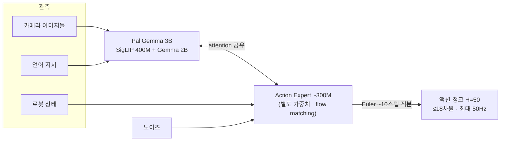

# Lec 44. π 패밀리 I — π0의 action expert와 FAST의 반격

> 선수 지식: 36강(PaliGemma), 40강(flow matching), 43강(OpenVLA와 디코딩 논쟁). 50강(action space)을 먼저 봤다면 더 좋다.

## 한 장 요약

π0 = "이해는 VLM이, 생성은 전문가가". 같은 회사가 석 달 뒤 정반대 설계(π0-FAST, 이산 토큰)도 만들어 비교했다는 점이 이 강의의 백미다.

## 학습 목표

1. π0의 구조(PaliGemma + attention 공유 action expert)를 그리고, RT-2/OpenVLA 방식과의 차이를 설명할 수 있다.
2. flow matching action expert가 50Hz 정교 조작을 가능케 하는 이유를 40강의 언어로 설명할 수 있다.
3. FAST 토크나이저의 파이프라인(DCT → 양자화 → BPE)과 존재 이유를 설명할 수 있다.
4. "이산 AR vs 연속 flow" 논쟁의 양쪽 트레이드오프를 표로 정리할 수 있다.

## 본문

### 0. 회사부터 — Physical Intelligence라는 베팅

2024년 초, Karol Hausman(전 Google), Sergey Levine, Chelsea Finn(각 Berkeley/Stanford), Brian Ichter 등이 창업. 논지는 단순하다: **LLM의 문법(대규모 사전학습 → 파인튜닝/스티어링)을 로봇에 이식한 "로봇 파운데이션 모델"을 만든다.** 펀딩 궤적($70M 시드 → 2024.11 $400M@$2.4B → 2025.11 $600M@$5.6B)은 이 베팅에 대한 자본시장의 기대치 지표로 읽으면 된다. RT-2를 만들던 사람들이 나와서 RT-2의 한계를 고치는 회사를 차린 셈이다.

### 1. π0의 문제 설정 (2024.10, arXiv 2410.24164)

RT-2/OpenVLA의 이산 AR 토큰으로는 **빨래 개기**를 못 한다. 두 가지 이유:
① AR 디코딩이 느리다 (1~6Hz) — 천처럼 변형되는 물체는 고주파 폐루프가 필요하다.
② 256빈 이산화가 정밀도를 깎는다.
해법: **VLM은 장면·언어 이해를 맡고, 별도의 action expert가 연속 액션 청크를 생성한다.**

### 2. 구조 상세 — 이 그림은 외울 가치가 있다

- **백본**: PaliGemma 3B (36강 회수: SigLIP-So400m 400M + linear projector + Gemma 2B, prefix-LM).
- **Action expert ~300M**: 백본과 **별도의 가중치 세트**지만 **attention은 공유**한다 — 두 전문가(언어/행동)가 한 시퀀스 안에서 서로를 보는 MoE식 구성. 액션 토큰들끼리는 양방향 attention (미래 액션이 과거 액션을 봐도 됨 — 궤적은 문장이 아니니까, 43강의 병렬 디코딩과 같은 통찰).
- **생성**: flow matching (40강 회수). 노이즈에서 출발해 Euler ~10스텝 ODE 적분으로 **H=50 청크**를 한 번에. RTX 4090 기준 청크당 ~73ms → **최대 50Hz** 제어.
- **action space**: 데이터셋 내 최대 로봇 기준 **18차원 제로패딩** (양팔 6DoF×2 + 그리퍼 2 + 모바일 베이스 + 토르소; 50강 회수).
- **데이터**: 자체 teleop **~10,000시간** (로봇 구성 7종, 68 태스크) + OXE. "사전학습(잡다한 대량) → 태스크 파인튜닝(고품질 소량)"의 2단 레시피 — LLM 문법 그대로.

결과: 빨래 개기, 테이블 정리, 박스 조립 같은 당시 최장·최정교 시연. 그리고 이 **"VLM + flow expert" 템플릿이 필드 표준**이 된다 — G0강T(46강), SmolVLA(47강), GO-1(47강)이 전부 이 틀의 변주다.

### 3. π0-FAST — 이산 진영의 반격 (2025.1, arXiv 2501.09747)

π0를 만든 바로 그 회사가 물었다: **이산 AR이 정말 안 되는 건가, 토크나이저가 나빴던 건가?**

- **진단**: naive한 스텝별 binning은 고주파 데이터에서 붕괴한다. 50Hz면 인접 스텝 행동이 거의 같아서 — 토큰 수는 폭발하는데 학습 신호는 희석된다.
- **처방 = FAST**: 행동 궤적을 차원별로 **DCT**(이산 코사인 변환) → 계수 양자화·희소화 → **BPE** 압축. naive 대비 **~10배 압축**. 신호처리를 아는 사람에게는 낯익은 구성이다 — **JPEG이 이미지에 하는 일을 궤적에 하는 것**. 궤적은 대역 제한 신호라 주파수 영역에서 희소하다는 성질을 그대로 쓴다.
- **결과**: FAST 토큰으로 AR 훈련하면 flow 계열보다 **~5배 빠르게 수렴**하고 언어 추종도 낫다. 그러나 **추론은 AR 디코딩 때문에 4~5배 느리다** → 런타임 선택은 flow로 남았다.
- 1M 궤적으로 훈련한 범용 토크나이저 **FAST+**가 HF에 공개되어 있다 (실습에서 사용).

### 4. 이산 vs 연속 — 논쟁의 현재 스코어

| | 이산 AR (FAST) | 연속 flow/디퓨전 |
|---|---|---|
| 훈련 | **빠른 수렴(~5배), LLM 인프라 재사용** | 느림, 별도 expert 필요 |
| 추론 | 느림 (순차 디코딩) | **빠름 (병렬 청크, ~10스텝)** |
| 언어 추종 | **좋음** (백본과 같은 형식) | 상대적으로 약함 |
| 정밀도 | 양자화 한계 | **연속** |

양쪽 다 장점이 뚜렷해서 필드는 "둘 다"로 간다 — 45강의 Knowledge Insulation이 정확히 왼쪽 열(이산 AR)의 훈련 장점과 오른쪽 열(연속 flow)의 추론 장점을 합치는 기술이다. 이 표를 기억하면 새 논문의 액션 디코딩 선택을 즉시 위치시킬 수 있다.

### 5. openpi — 직접 만질 수 있는 것

- github.com/Physical-Intelligence/openpi (Apache-2.0, JAX 기본 + PyTorch).
- 체크포인트: `pi0_base`, `pi0_fast_base`, `pi05_base`와 DROID/ALOHA/LIBERO 파인튜닝판.
- 하드웨어: 추론 8GB+ VRAM, LoRA 파인튜닝 22.5GB+, 전체 파인튜닝 70GB+.

### 로봇공학자를 위한 번역

- action expert는 "상위 인지가 컨텍스트를 주면 궤적을 뽑는 **궤적 생성기**"의 학습판이다. 다른 점: attention 공유 때문에 인지와 생성이 분리된 모듈이 아니라 **한 계산 그래프**다 — 인터페이스 신호를 사람이 정의하지 않는다(그 대가는 45강 KI에서).
- FAST의 DCT는 회원님이 아는 바로 그 DCT다. "행동 압축이 왜 학습을 돕는가"는 "표본화 정리 이후 남는 정보만 모델링하게 하라"로 번역된다.
- flow의 Euler 10스텝은 수치적분 그 자체다 — 스텝 수와 궤적 품질의 트레이드오프도 ODE 솔버 감각으로 이해하면 된다.

## 실습 (45~60분)

**A안 (GPU 8GB+): openpi로 π0 추론.** 저장소 설치 → `pi0_base` 로드 → 예제 관측으로 액션 청크 생성 → shape(50×차원)과 값 범위 확인 → 정규화 stats 파일을 열어 50강의 q01/q99를 실물로 확인.

**B안 (CPU만, 추천 — 더 배울 게 많다): FAST+ 토크나이저 실험.** HF `physical-intelligence/fast` 로드 → LeRobot 데이터셋(예: aloha 계열)에서 실제 궤적 하나를 토큰화 → 토큰 수 세기(naive binning 대비 압축률 계산) → 복원해서 원 궤적과의 오차 플롯. "압축률이 좋은 궤적과 나쁜 궤적은 뭐가 다른가"를 Claude와 토론.

## Claude와 토론할 질문

1. attention 공유(π0) vs 완전 분리 모듈(CogACT식, 47강)의 트레이드오프는? 인터페이스를 학습에 맡기는 것의 득실은?
2. action expert를 사전학습 없이 from scratch로 붙이면 백본의 웹 지식이 손상될 위험은 없는가? (45강 KI의 예고 — 먼저 스스로 가설을 세워 보라.)
3. FAST의 압축률은 태스크의 주파수 성분에 따라 어떻게 변하겠는가? 압축이 안 되는 궤적은 어떤 것인가?
4. 50Hz가 정말 필요한 태스크와 5Hz로 충분한 태스크를 가르는 물리적 기준은? (동적 시정수, 접촉 이벤트 빈도)
5. π0의 자체 데이터 1만 시간은 OXE 100만 궤적과 무엇이 달랐는가? 양인가 질인가 일관성인가?
6. "훈련은 FAST로 빠르게, 추론은 flow로 빠르게"가 동시에 가능할까? 어떻게? (45강에서 답을 확인한다.)

## 읽을거리

1. **π0 블로그 (pi.website/blog/pi0) 전문 + 논문 §III-IV(구조)**: 그림 중심으로 (~40분).
2. **FAST 논문 (arXiv 2501.09747)은 Fig 4(토크나이저 파이프라인)만**: DCT→양자화→BPE 그림 하나면 충분하다.

## 자가 점검

1. π0 구조 그림을 안 보고 그릴 수 있는가 (백본, expert, attention 공유, 입출력)?
2. RT-2/OpenVLA → π0에서 액션 출력이 어떻게 바뀌었고 왜인지 말할 수 있는가?
3. FAST 파이프라인 3단계와 각 단계의 역할을 말할 수 있는가?
4. 이산 vs 연속 트레이드오프 표를 재구성할 수 있는가?
5. openpi에서 지금 당장 받을 수 있는 것과 없는 것(45강의 π0.6+)을 구분할 수 있는가?

## 참고문헌

> 본문 수치·주장의 출처. 웹 문서는 2026-07-08 접속 기준. (2차) = 언론 등 2차 출처.

[1] K. Black et al. (Physical Intelligence), "π0: A Vision-Language-Action Flow Model for General Robot Control," arXiv:2410.24164, 2024.10. https://arxiv.org/abs/2410.24164 · 블로그: https://www.pi.website/blog/pi0
— **뒷받침**: PaliGemma 3B + ~300M action expert(별도 가중치·attention 공유·액션 토큰 양방향 attention), flow matching Euler ~10스텝, H=50 청크, ≤18차원 제로패딩, 최대 50Hz, 청크당 ~73ms(RTX 4090; 논문 Table I), teleop ~10,000시간/로봇 구성 7종/68 태스크, 사전학습→파인튜닝 2단 레시피.

[2] L. Beyer et al. (Google), "PaliGemma: A versatile 3B VLM for transfer," arXiv:2407.07726, 2024.7. https://arxiv.org/abs/2407.07726
— **뒷받침**: SigLIP-So400m(400M)+linear projector+Gemma 2B ≈ 3B, prefix-LM 구조.

[3] K. Pertsch et al. (Physical Intelligence), "FAST: Efficient Action Tokenization for Vision-Language-Action Models," arXiv:2501.09747, 2025.1. https://arxiv.org/abs/2501.09747 · 토크나이저: https://huggingface.co/physical-intelligence/fast
— **뒷받침**: DCT→계수 양자화·희소화→BPE 파이프라인(Fig 4), naive binning 대비 ~10배 압축, AR 훈련 ~5배 빠른 수렴·좋은 언어 추종, 추론은 4~5배 느림, FAST+ 범용 토크나이저(1M 궤적 훈련).

[4] Physical Intelligence, openpi 저장소. https://github.com/Physical-Intelligence/openpi
— **뒷받침**: Apache-2.0, JAX 기본+PyTorch(2025.9~), 공개 체크포인트 목록(pi0_base/pi0_fast_base/pi05_base 및 DROID/ALOHA/LIBERO 파인튜닝판), 하드웨어 요구(추론 8GB+/LoRA 22.5GB+/전체 70GB+).

[5] Hugging Face, "π0 and π0-FAST: Vision-Language-Action Models for General Robot Control," 블로그, 2025. https://huggingface.co/blog/pi0
— **뒷받침**: π0/π0-FAST의 LeRobot 이식 맥락.

[6] (2차) The Robot Report, "Physical Intelligence raises $600M to advance robot foundation models," 2025.11. https://www.therobotreport.com/physical-intelligence-raises-600m-advance-robot-foundation-models/
— **뒷받침**: 펀딩 궤적($70M 시드 → $400M@$2.4B → $600M@$5.6B).
